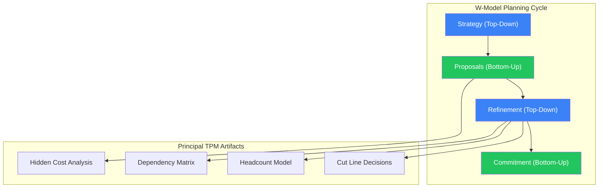
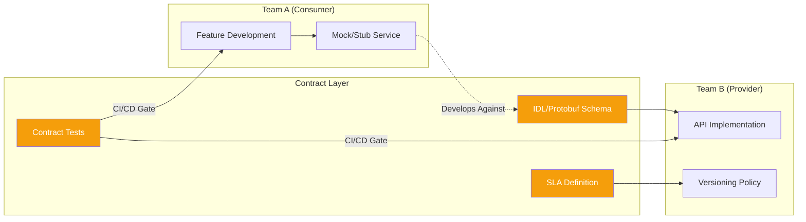
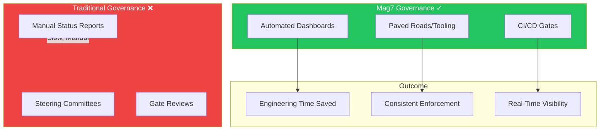
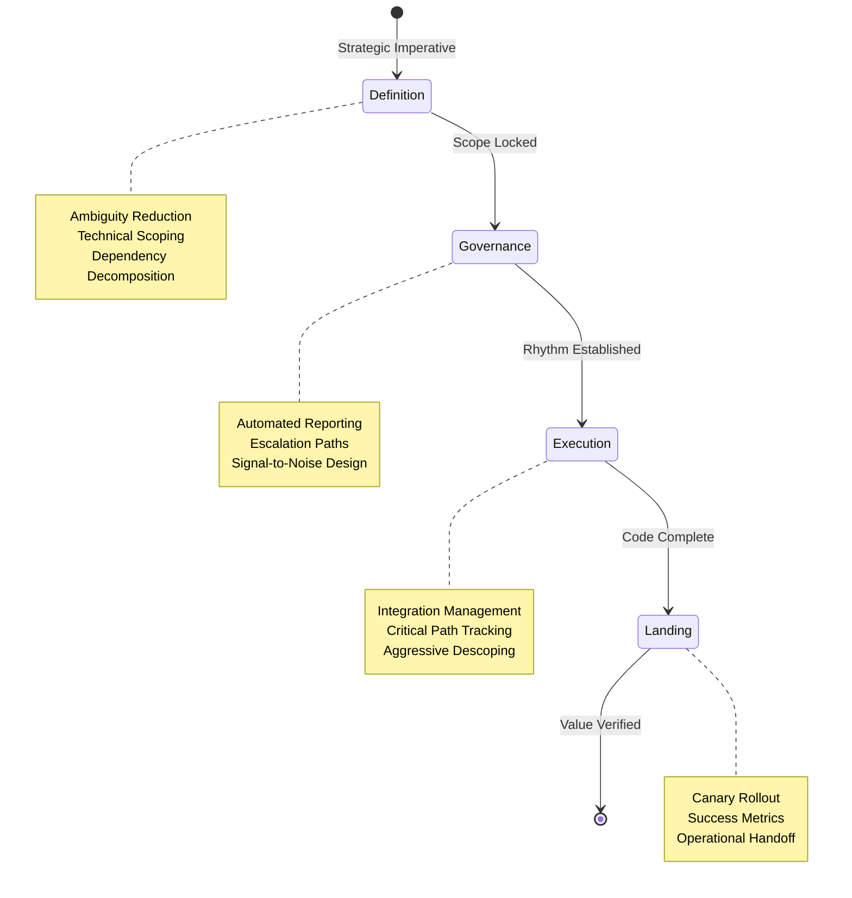

# Agile at Scale & Program Governance

At Mag7 companies, "Agile at Scale" bears little resemblance to SAFe certifications or PI Planning rituals. Principal TPMs operate in environments where autonomous teams move at different velocities, dependencies are managed through API contracts rather than synchronized sprints, and governance is embedded in tooling rather than steering committees. This guide provides the tactical frameworks, negotiation strategies, and failure mode awareness needed to drive multi-team programs across organizational boundaries.

## I. The Reality of "Agile at Scale" in Mag7 Companies

### 1. The Planning Cycle: The "W-Model" and OKR Cascades

At Mag7 companies, "Agile" does not mean a lack of long-term planning. It means iterative execution against a fixed strategic anchor. The primary mechanism for this is the **W-Model** (common at Google, Airbnb, and Meta), which bridges high-level strategy with ground-level engineering reality.

*   **How it works:**
    1.  **Top-Down (Strategy):** Leadership defines the "North Star" metrics and strategic pillars (e.g., "Increase Cloud retention by 5%").
    2.  **Bottom-Up (Proposal):** Engineering and Product teams break this down into rough epics and estimate High-Level of Effort (HLOE). They identify constraints (headcount, compute resources, dependencies).
    3.  **Top-Down (Refinement):** Leadership reviews proposals against the budget. Cuts are made, and priorities are re-ranked.
    4.  **Bottom-Up (Commitment):** Teams commit to the refined scope with quarterly OKRs (Objectives and Key Results).

*   **Principal TPM Role:** You are the architect of step 2 and 3. You must translate vague executive desires into concrete engineering constraints. You are expected to identify "Hidden Costs" (e.g., privacy reviews, security audits, legacy migration) that engineering leads might overlook during the proposal phase.

*   **Real-World Example:** At **Google**, this manifests during the OP1 (Operating Plan 1) annual planning cycle. A TPM might lead a cross-PA (Product Area) initiative where the goal is shared (e.g., AI integration), but the execution requires distinct commitments from Core Infrastructure, Search, and Cloud. The TPM manages the "handshakes"—formal agreements between these autonomous orgs.

### 2. Dependency Management: API Contracts over Scrum of Scrums

In a rigid SAFe environment, dependencies are managed via massive "Program Increment (PI) Planning" events. In Mag7, where architecture is microservices-based and teams are decoupled, PI Planning is viewed as too slow.

Instead, dependencies are treated as **Internal Products** with **Service Level Agreements (SLAs)**.

*   **Technical Execution:**
    *   **Contract-First Development:** If Team A depends on Team B's API, the "Agile" interaction isn't a daily standup; it is the negotiation of the API schema (Protobuf/Thrift definitions) and the latency/throughput SLA.
    *   **Stubbing and Mocking:** Team A builds against a mock of Team B’s service to maintain velocity. Integration happens via CI/CD pipelines, not synchronized release windows.

*   **Tradeoffs:**
    *   *Contract-Based (Mag7):* High velocity for individual teams. If Team B is late, Team A can still launch behind a feature flag using the mock or a degraded mode. **Con:** Integration hell occurs if the contract changes without notification.
    *   *Synchronized (SAFe):* High alignment. **Con:** The "Convoy Effect"—the entire program moves at the speed of the slowest team.

*   **Impact on Business Capabilities:**
    *   **Resilience:** Decoupling dependencies via contracts enforces better fault tolerance (circuit breakers, graceful degradation).
    *   **Speed:** Allows parallel development. A Principal TPM focuses on *interface stability* rather than *schedule synchronization*.

### 3. Governance via Tooling: The "Data-Driven" Scrum

Manual status reporting is an anti-pattern at the Principal level. Mag7 companies rely on **Automated Governance**. If a TPM has to ask "what is the status of this ticket," the process is broken.

*   **The "Single Pane of Glass":**
    *   TPMs build dashboards (using Tableau, internal tools like Google's PLX, or JIRA Advanced Roadmaps with automation) that pull real-time data from the code repository and issue tracker.
    *   **Metrics tracked:** PR (Pull Request) cycle time, build failure rates, and "Stale Ticket" aging.

*   **Real-World Behavior:**
    *   **Amazon:** Status is reviewed in the Weekly Business Review (WBR). The focus is on *inputs* (operational metrics, tickets closed) and *outputs* (revenue, latency). If a metric deviates, the TPM must provide a "Correction of Error" (COE) plan immediately.
    *   **Meta:** The culture emphasizes "moving fast." Governance focuses on *blocking* issues. A TPM creates automated alerts that ping into chat channels (Slack/Workplace) when a P0 bug sits triage-free for more than 30 minutes.

*   **ROI Impact:**
    *   Automating governance reduces the "Tax" on engineering time. Instead of spending 2 hours a week in status meetings, engineers spend that time coding. For a 100-person org, this reclaims ~200 engineering hours/week.

### 4. Release Management: Continuous Delivery vs. Scheduled Releases

Mag7 companies rarely have "Release Weekends." They utilize **Progressive Delivery**.

*   **Technical Implementation:**
    *   **Trunk-Based Development:** Engineers merge code to the main branch daily.
    *   **Feature Flagging:** Code is deployed to production but hidden behind a dynamic configuration flag (e.g., LaunchDarkly, Facebook's Gatekeeper).
    *   **The TPM Role:** You do not manage the *deployment* (moving binaries); you manage the *release* (turning on the flag). You orchestrate the rollout strategy: 1% traffic -> 5% -> 20% -> 100%, monitoring error rates (HTTP 500s) and latency at each step.

*   **Tradeoffs:**
    *   *Continuous/Flagged:*
        *   *Pros:* Instant rollback (flip the switch), A/B testing capability, zero downtime.
        *   *Cons:* "Flag Debt"—if old flags aren't cleaned up, the code becomes a complex nest of conditionals, increasing testing surface area and latency.
    *   *Scheduled Releases:*
        *   *Pros:* Simpler testing (one version of truth).
        *   *Cons:* High Mean Time to Recovery (MTTR) if a rollback is needed; huge batch sizes increase risk.

### 5. Edge Cases and Failure Modes

Even in high-maturity orgs, Agile at Scale fails. A Principal TPM must anticipate these modes:

*   **The "Shadow Waterfall":** Teams claim to be Agile but require fully detailed specs before writing a line of code.
    *   *Fix:* Enforce "Spikes" (time-boxed research tasks) to prove concepts early rather than documenting them theoretically.
*   **Dependency Deadlock:** Team A blocks Team B, who blocks Team C, who blocks Team A.
    *   *Fix:* The Principal TPM must escalate to "cut the knot." This usually involves de-scoping a feature or forcing a temporary manual workaround to break the cycle.
*   **Metric Gaming:** Teams closing tickets without doing the work to improve velocity stats.
    *   *Fix:* Shift focus from *Output* metrics (velocity) to *Outcome* metrics (feature adoption, latency reduction).

## II. Strategic Alignment: OKRs and Long-Range Planning

At the Principal TPM level, Strategic Alignment is not about administrative compliance or "OKR hygiene"; it is about **resource allocation, dependency negotiation, and defining the definition of success.** In Mag7 environments, the planning cycle is the primary mechanism for resolving the tension between "Top-Down Strategy" (Executive Vision) and "Bottom-Up Reality" (Engineering Capacity).

### 1. The Mechanics of Mag7 Planning Cycles

While specific terminologies differ, most major tech companies utilize a variation of the **W-Model** for Long-Range Planning (LRP) and quarterly execution.

*   **Top-Down (The "V"):** Leadership defines the "North Star" metrics (e.g., "Increase Cloud Revenue by 20%" or "Reduce Latency by 50ms").
*   **Bottom-Up (The "^"):** Engineering and Product teams estimate capacity, technical debt pay-down requirements, and propose initiatives that ladder up to the North Star.
*   **Negotiation & Commitment (The final "V"):** Principal TPMs mediate the gap. This is where "cuts" happen to align scope with fixed headcount.

**Real-World Implementations:**
*   **Amazon (OP1/OP2):** Uses the "Operating Planning" cycle. Teams write 6-page narratives detailing their strategy for the coming year. The focus is heavily on inputs (what we control) rather than outputs (lagging indicators).
*   **Google (Annual/Quarterly OKRs):** Historically distinguishes between "Committed" OKRs (must hit 100%, usually operational/SLA) and "Aspirational" OKRs (target 70%, usually growth/product).
*   **Meta (H1/H2):** operates on six-month cycles to adapt faster than annual planning allows, emphasizing "Impact" as the core metric for performance reviews and project success.

**Trade-offs: Planning Horizons**
*   **Annual (Amazon OP1) vs. Semi-Annual (Meta H1/H2):**
    *   *Annual:* Provides stability for complex platform re-architecture. **Risk:** Strategy may become obsolete by Q3; leads to "sunk cost" fallacy behavior.
    *   *Semi-Annual:* Higher agility/market responsiveness. **Risk:** Creates perpetual "planning fatigue" where teams spend 2 months of the year planning rather than shipping; disincentivizes long-term bets (e.g., compiler migrations).

### 2. OKR Architecture: Dependency Management & Shared Goals

The single biggest failure mode in Mag7 planning is **Dependency Delusion**—Team A sets a goal that relies on Team B, but Team B has not prioritized that work.

**Technical Execution:**
A Principal TPM must enforce **Shared OKRs** or **Joint KRs**. You do not allow Team A to have "Launch Feature X" as a goal unless Team B (Platform) has "Support Feature X API requirements" as a committed goal.

*   **The "Handshake" Process:** Before the quarter starts, Principal TPMs run "dependency lock" sessions. If the handshake doesn't happen, the OKR is marked "At Risk" immediately, not at the end of the quarter.
*   **Input vs. Output Metrics:**
    *   *Bad KR:* "Increase retention by 5%." (Too many variables, lagging indicator).
    *   *Strong KR:* "Reduce First Contentful Paint (FCP) latency by 200ms." (Engineering controllable, correlates to retention).

**Impact on Business Capabilities:**
*   **ROI:** Prevents "stranded assets"—code that is written but cannot launch because a dependency is missing.
*   **Velocity:** Reduces mid-quarter "thrash" where engineers context-switch to unblock a panicked partner team.

### 3. Resource Allocation and Headcount (HC) Modeling

Long-Range Planning is fundamentally an exercise in capital allocation. Principal TPMs often own the **"Cut Line."**

**Real-World Behavior:**
*   **Zero-Based Budgeting:** Instead of "Last Year + 10%," teams must justify their entire existence.
*   **KTLO (Keep the Lights On) vs. Innovation:** A standard Mag7 split is often 70/20/10 (Core/Strategic/Experimental) or 50/50 (KTLO/New Features).
*   **The "Mythical Man-Month" Defense:** When leadership asks to "add more bodies to speed up delivery," the Principal TPM provides the data showing that onboarding costs and communication overhead will actually reduce Q1 velocity.

**Trade-offs: Capacity Buffers**
*   **100% Utilization vs. 80% Utilization:**
    *   *100%:* Theoretically maximizes ROI. **Reality:** Any incident (SEV1) or unplanned attrition causes a cascading failure of the roadmap.
    *   *80%:* Allows for absorption of "unknown unknowns" and technical debt paydown. **Reality:** Hard to sell to Finance/Leadership who view it as "slack."

### 4. Edge Cases and Failure Modes

**The "Watermelon" OKR:**
*   **Scenario:** A project is reported Green (on track) for 10 weeks, then turns Red (blocked/failed) one week before launch.
*   **Root Cause:** Lack of objective milestones or "truth-telling" culture.
*   **Principal TPM Action:** Implement **Binary Milestones** (e.g., "API Spec Published" is a binary state, not "90% done"). Move status reporting from sentiment-based ("We feel good") to evidence-based ("Load test passed at 10k QPS").

**Strategy Pivots Mid-Cycle:**
*   **Scenario:** Executive leadership changes direction (e.g., "Pivot to Generative AI") in month 2 of the quarter.
*   **Principal TPM Action:** Execute a "Reset." Do not layer new goals on top of old ones. Explicitly "deprecate" previous OKRs to free up capacity. If you don't officially kill the zombie projects, engineering will secretly keep working on them, diluting focus.

## III. Dependency Management and Cross-Team Coordination

At the Principal level, dependency management shifts from tactical "chasing dates" to strategic **Architectural Decoupling**. In Mag7 environments, the sheer scale of microservices (Amazon/Netflix) or the complexity of the monorepo (Google/Meta) means that manual tracking of cross-team dependencies is a failure mode.

Your role is to treat dependencies not as administrative tasks to be tracked in a spreadsheet, but as risks to system stability and velocity that must be mitigated through technical contracts and service design.

### 1. The Move from "Tracking" to "Contracting"

In smaller organizations, a TPM might facilitate a meeting to ask, "Is the API ready?" At a Mag7, this is insufficient. Dependencies must be managed via **Service Level Objectives (SLOs)** and **Interface Definition Languages (IDLs)**.

**Real-World Behavior:**
*   **Amazon/AWS:** Dependencies are treated as internal customer relationships. If Team A needs an API from Team B, Team A is the customer. Team B must publish a "Service Interface" with strict throttling limits, latency SLAs, and deprecation policies. This stems from the famous "Bezos API Mandate."
*   **Google:** Dependencies are often managed via the Monorepo. If you depend on a library, you are often expected to update the call sites yourself if you require a breaking change, using automated refactoring tools (like Rosie/ClangMR).

**Trade-offs:**
*   **Strict Contracts vs. Informal Agreement:**
    *   *Strict:* Requires high upfront engineering effort to define IDLs (e.g., Protobuf/gRPC definitions) and error handling. Reduces integration bugs but slows down initial prototyping.
    *   *Informal:* Faster to start, but leads to "Integration Hell" where undocumented behavior causes cascading failures in production.
*   **Consumer-Driven Contracts (CDC):**
    *   *Pros:* The consumer defines what they need, ensuring the provider builds the right thing.
    *   *Cons:* Can lead to the provider supporting bloated, custom endpoints for every consumer, creating technical debt.

**Impact:**
*   **Reliability:** Formal contracts prevent "silent failures" where a dependency update breaks downstream consumers.
*   **Velocity:** Teams can mock dependencies based on the contract and develop in parallel, rather than serially.

### 2. Technical Strategies for Decoupling

A Principal TPM must advocate for technical patterns that reduce the blast radius of a missed dependency. You must push back on "hard dependencies" (where the product fails to load) and advocate for "soft dependencies" (graceful degradation).

**Techniques & Examples:**
*   **Shim Layers & Abstraction:** If a Platform team cannot deliver a feature in time, the Product team builds a shim (temporary adapter) to mock the functionality or route to a legacy system.
    *   *Mag7 Context:* When migrating to a new internal cloud infrastructure, teams often build a "strangler fig" pattern, routing 1% of traffic to the new dependency to test stability without a hard cutover.
*   **Feature Flagging (The Meta Approach):** Code is merged continuously, but the dependency connection is wrapped in a feature flag (Gatekeeper at Meta). If the dependency isn't ready or fails, the flag remains off.
    *   *ROI:* Eliminates "code freeze" bottlenecks. The code is in production but dormant.
*   **InnerSourcing:** If a dependency team is blocked by headcount, Mag7 culture (specifically Meta and Google) encourages the dependent team to write the code *in the dependency owner’s repo*.
    *   *Trade-off:* High velocity for the requester, but high code-review burden for the owner. Requires strict code quality standards.

### 3. The "Priority Inversion" Problem

The most common failure mode in Mag7 program execution is **Priority Inversion**: Your P0 (Critical) project depends on a specific feature from a Platform team, but for that Platform team, your request is a P2 (Nice to have).

**Resolution Framework:**
1.  **The "Tax" Model:** Platform teams often have a "Keep the Lights On" (KTLO) tax and a "Strategic" bucket. Principal TPMs must negotiate to get their dependency categorized as "Strategic" by aligning it with the Platform's own OKRs (e.g., "This feature helps *you* demonstrate adoption of your new v2 architecture").
2.  **Headcount Transfer (The Amazon Model):** If the dependency team agrees the work is valuable but lacks bandwidth, the dependent team "loans" an engineer to the dependency team for a sprint (Away Team model).
    *   *Impact:* Solves the bottleneck without escalating to VPs, preserving political capital.
3.  **Escalation as Alignment:** Escalation is not "tattling." It is a mechanism to clarify conflicting organizational priorities. If Team A and Team B have conflicting goals, only their shared manager (Director/VP) can resolve the resource allocation.

**Impact on ROI:**
Failing to resolve priority inversion early results in the "90% done" syndrome, where a massive product launch is held hostage by a minor logging dependency, destroying the ROI of the entire program.

### 4. Governance: The "W-Model" of Planning

To prevent dependency surprises, Mag7 companies utilize a W-shaped planning model (Strategy down, Plans up, Integrated Plan down, Commitments up).

**The Process:**
1.  **Top-Down (Strategy):** Leadership sets high-level investment themes (e.g., "AI Integration").
2.  **Bottom-Up (Requests):** Product teams identify what they need from Platform/Infrastructure teams to hit those themes.
3.  **The "Handshake" Phase:** This is where the Principal TPM earns their salary. You must facilitate the "handshake" where Platform teams explicitly commit (or reject) requests.
    *   *Critical Artifact:* The **Dependency Matrix**. Not just a list, but a committed backlog item ID from the provider's Jira/Task system. If it’s not in their backlog, it’s not a dependency; it’s a wish.
4.  **Integration:** The plan is locked. Changes after this point require VP-level approval.

**Trade-offs:**
*   **Rigidity vs. Predictability:** This cycle (often quarterly or bi-annual) creates stability but makes it hard to pivot mid-cycle.
*   **Mitigation:** Reserve 20% capacity for "unplanned high-priority work" to avoid blowing up the roadmap when market conditions change.

### 5. Common Failure Modes (Edge Cases)

*   **The "Shadow" Dependency:** A team depends on a deprecated API that no one owns anymore.
    *   *Fix:* TPMs must run "deprecation audits." If a service has no owner, it is a ticking time bomb. You must force an ownership decision.
*   **The "Soft" Commit:** A partner PM says "We'll try to get to it."
    *   *Principal Action:* Treat "try" as "no." You must force a binary Yes/No to build a reliable critical path.
*   **Circular Dependencies:** Team A needs Team B to update a library, but Team B needs Team A to migrate off the old version first.
    *   *Fix:* Identify the deadlock immediately. Create a multi-step migration plan (Step 1: Team B releases backward-compatible version; Step 2: Team A migrates; Step 3: Team B cleans up).

## IV. Program Governance and Risk Management

### 1. The Shift from "Control" to "Guardrails"

At the Principal level in Mag7 environments, traditional Program Governance—defined by heavy stage-gates, steering committees, and manual compliance checks—is viewed as an anti-pattern that creates drag. Instead, governance is implemented as **Automated Guardrails** and **Paved Roads**.

**Real-World Behavior at Mag7**
*   **Netflix’s "Paved Road":** Governance is baked into the platform tooling. If a team uses Spinnaker for deployment and standard libraries for RPC, compliance (security scanning, logging, canary analysis) happens automatically. The TPM does not chase teams for compliance; the *platform* ensures it.
*   **Google’s LaunchCal & Privacy Reviews:** While innovation is decentralized, launch governance is centralized via tools like LaunchCal. You cannot flip a feature flag to 100% traffic without passing automated checks for Privacy, Legal, and Security reviews. The "governance" is a systemic gate, not a meeting.
*   **Amazon’s Mechanisms:** Governance is handled through "Mechanisms" (processes that are self-reinforcing). For example, the **Correction of Error (COE)** process is a governance mechanism to ensure risks that materialized are structurally eliminated from recurring.

**Trade-offs: Automated vs. Manual Governance**
*   **Automated (Paved Road):**
    *   *Pros:* High velocity, zero administrative overhead for engineers, consistent enforcement.
    *   *Cons:* High initial engineering investment to build the tooling. "Edge case" innovations may be blocked by rigid tooling, forcing teams to go "off-road" where risk skyrockets.
*   **Manual (Steering Committees):**
    *   *Pros:* Highly flexible; humans can make nuanced judgment calls on risk acceptance.
    *   *Cons:* Does not scale. Becomes a bottleneck. Decisions are often based on political influence rather than data.

**Impact on Business Capabilities**
*   **Skill Shift:** Principal TPMs must move from being "process administrators" to "system designers." You are expected to define the logic that gets baked into the Jira/roadmap tools, rather than manually updating them.

---

### 2. Risk Management: Moving from RAID Logs to Probabilistic Forecasting

A static RAID log (Risks, Assumptions, Issues, Dependencies) in a spreadsheet is often "governance theater." At the Principal level, risk management is about **quantifying uncertainty** and managing **dependency chains**.

**Real-World Behavior at Mag7**
*   **Probabilistic Estimation (Microsoft/Meta):** Instead of asking "When will this be done?", Principal TPMs ask for confidence intervals. "We have 80% confidence of delivery by Q3, but a P90 risk of slipping to Q4 due to dependency X."
*   **The "Watermelon" Effect:** A common failure mode is status reporting that is Green on the outside (to leadership) but Red on the inside (reality). Principal TPMs at Mag7 are expected to be "truth-seekers" who validate status via telemetry and code commit velocity, not just verbal updates.
*   **Amazon’s "Single Threaded Owner" (STO):** The primary risk mitigation strategy is organizational. If a dependency is high-risk, Amazon prefers to re-org to give one leader full control over all dependencies (the STO), eliminating the hand-off risk entirely.

**Trade-offs: Mitigation Strategies**
*   **Decoupling (feature flags/mocking):**
    *   *Tradeoff:* Allows teams to move fast independently (High Velocity), but risks integration hell at the end if contracts drift (High Integration Risk).
*   **Hard Coupling (Lock-step planning):**
    *   *Tradeoff:* Guarantees integration works (Low Risk), but the entire program moves at the speed of the slowest component (Low Velocity).

**Technical Depth: The Pre-Mortem**
Instead of a post-mortem, Principal TPMs facilitate **Pre-Mortems**.
1.  **Gather Stakeholders:** Assume the project has failed 6 months from now.
2.  **Reverse Engineer:** Everyone writes down *why* it failed.
3.  **Preventative Action:** Prioritize these hypothetical failure modes and assign owners to prevent them.
*   *ROI:* This exercise often uncovers "social risks" (e.g., Team A hates the architecture chosen by Team B) that never appear in a Jira ticket.

---

### 3. Decision Velocity and Escalation Protocols

In Mag7, ambiguity is the enemy of speed. Governance is largely about how fast an organization can make a high-quality decision to resolve ambiguity.

**Real-World Behavior at Mag7**
*   **Amazon’s One-Way vs. Two-Way Doors:**
    *   *Two-Way Door:* Reversible decisions (e.g., A/B testing a UI change). Governance here should be loose/delegated to the lowest level.
    *   *One-Way Door:* Irreversible decisions (e.g., deprecating a public API). These require heavy governance, written narratives (6-pagers), and L8+ review.
*   **The "Disagree and Commit" Principle:** Once a decision is made via the governance framework, re-litigating it is considered a performance issue. Principal TPMs enforce this cultural guardrail.

**Trade-offs: Consensus vs. Speed**
*   **Consensus-driven (Google historical):**
    *   *Pros:* High buy-in, low sabotage risk during execution.
    *   *Cons:* Extremely slow. Can lead to "design by committee" products.
*   **Authoritative (Apple/Amazon):**
    *   *Pros:* Extremely fast decision-making. Coherent product vision.
    *   *Cons:* High risk of "HiPPO" (Highest Paid Person's Opinion) bias leading to market failure. If the leader is wrong, the product fails.

**Actionable Guidance: The Escalation Ladder**
Do not let escalations happen organically. Define an **SLA for Disagreement**:
1.  **L5 (Senior Engineers) disagree:** Must resolve within 48 hours or escalate.
2.  **L6 (Managers) disagree:** Must resolve within 24 hours or escalate.
3.  **L7/L8 (Directors/VPs):** Final tie-breaker.
*   *Impact:* This prevents "zombie projects" that stall for weeks due to unaligned stakeholders.

---

### 4. Managing Cross-Org Dependencies (The "Kill" Chain)

The highest source of risk in Mag7 companies is not technical complexity; it is **organizational dependency**.

**Real-World Behavior at Mag7**
*   **The "Tax" Conversation:** If Team A needs Team B to build an API, Team B views this as a "tax" on their roadmap.
*   **Meta’s "XFN" (Cross-Functional) Contracts:** Principal TPMs facilitate explicit "handshakes" during half-planning. If Team B does not prioritize the dependency, the TPM immediately flags the program as "Red."
*   **Integration Tests as Governance:** In a microservices architecture, governance is enforced by integration tests. If Team A breaks the contract, the build fails.

**Trade-offs: Dependency Management Styles**
*   **Innersource:**
    *   *Approach:* Team A writes the code into Team B’s repo.
    *   *Tradeoff:* Unblocks Team A (High Velocity), but Team B must review/maintain code they didn't write (Long-term Tech Debt/Maintenance Burden).
*   **Escalation/Reprioritization:**
    *   *Approach:* Force Team B to prioritize the work.
    *   *Tradeoff:* Clean ownership, but burns political capital and creates organizational friction.

**Edge Cases & Failure Modes**
*   **The "Pocket Veto":** A partner team agrees to the dependency in the meeting but assigns no resources to it.
    *   *Mitigation:* Principal TPMs track *resource allocation* (engineers assigned), not just verbal agreement.
*   **The Re-Org Risk:** A re-org happens mid-quarter (common at Meta/Google).
    *   *Mitigation:* Governance artifacts must be stored in central repositories (wikis/tools), not email, ensuring the "Source of Truth" survives the re-org.

## V. Execution Strategy: The Principal TPM Lifecycle

Execution at the Principal TPM level shifts from managing tickets to managing **entropy**. In Mag7 environments, the lifecycle is less about adhering to a specific SDLC (Software Development Life Cycle) and more about a rigorous process of **Risk Burndown**. The lifecycle consists of four distinct phases: Definition (Ambiguity Reduction), Structural Setup (Governance), Execution (Flow & Unblocking), and Closure (Landing & Retrospective).

### 1. Phase I: Ambiguity Reduction & Technical Scoping

At the Principal level, programs often begin as a vague strategic imperative (e.g., "Integrate Generative AI into the Search/Checkout flow"). Your first deliverable is not a schedule, but a **Technical Execution Strategy**.

**Real-World Behavior at Mag7:**
*   **Amazon (Working Backwards):** The TPM often partners with Product to refine the PR/FAQ, but the TPM owns the transition to the "Tenets and Engineering Plan." You are expected to validate technical feasibility before a single line of code is written.
*   **Google (Design Docs):** TPMs drive the creation and review of Engineering Design Docs (EDDs) to ensure cross-functional dependencies (e.g., Privacy, Security, SRE) are signed off *before* commit.

**Key Actions:**
*   **Dependency Decomposition:** Identify "Hard Dependencies" (binary blocking factors, e.g., a platform migration) vs. "Soft Dependencies" (optimizations).
*   **T-Shirt Sizing vs. Engineering Confidence:** Move teams away from precise hour estimates early on. Use confidence levels (e.g., "High Confidence: 2 Sprints" vs. "Low Confidence: Needs Spikes").

**Trade-offs:**
*   **Deep Technical Discovery vs. Time-to-Start:**
    *   *Deep Discovery:* Reduces mid-program replanning but delays the "start" signal.
    *   *Rapid Start:* Gets teams coding immediately but risks major architectural refactors later.
    *   *Principal Decision:* For platform-level changes, prioritize Deep Discovery. For UI/Feature experiments, prioritize Rapid Start.

**Impact:**
*   **ROI:** Prevents "Throwaway Work" (OpEx waste) by validating architectural contracts early.

### 2. Phase II: Program Architecture & Governance (The "Rhythm of Business")

Once scope is defined, the Principal TPM must establish the **governance architecture**. This is not about setting up JIRA meetings; it is about designing the **Signal-to-Noise** flow.

**Real-World Behavior at Mag7:**
*   **Meta (Diffs & Dashboards):** Governance is often automated. TPMs build dashboards that pull directly from code repositories (e.g., number of open diffs, test coverage) rather than relying on manual status reports.
*   **Microsoft (The V-Team):** Establishing a virtual leadership team across engineering, design, and data science that meets weekly to review the "Scorecard."

**Key Actions:**
*   **Automated Reporting:** Implement tools that scrape API status or ticket movements to generate R-G-B (Red-Green-Blue/Black) status automatically.
*   **The "Disagree and Commit" Escalation Path:** Define exactly *who* resolves deadlocks (e.g., L8 Engineering Director) and the SLA for those decisions (e.g., 24 hours).

**Trade-offs:**
*   **High-Touch (Meetings) vs. Low-Touch (Async/Dashboards):**
    *   *High-Touch:* Builds relationships and nuance but is expensive (burns engineering hours).
    *   *Low-Touch:* Highly efficient but risks missing "soft signals" of team burnout or misalignment.
    *   *Principal Decision:* Use High-Touch for "Red" programs or new team formations. Shift to Low-Touch once velocity stabilizes.

**Impact:**
*   **Business Capabilities:** Increases "Leadership Visibility," allowing execs to intervene only when necessary (Management by Exception).

### 3. Phase III: Execution, Integration, and Critical Path Management

This is the "Grind." A Principal TPM differentiates themselves here by managing **Integration Points**, not just individual team backlogs.

**Real-World Behavior at Mag7:**
*   **The "Integration Hell" Prevention:** In microservices architectures (e.g., Netflix/Uber), the risk is rarely within a service but *between* them. Principal TPMs mandate "Contract Tests" or "Mock APIs" be available in Week 2, even if the backend logic isn't finished.
*   **Feature Flagging (LaunchDarkly / Internal):** Execution is decoupled from Release. Teams merge code behind feature flags. The TPM tracks "Flag Readiness" rather than "Code Complete."

**Key Actions:**
*   **Aggressive Descoping:** The Principal TPM actively looks for scope to cut to preserve the timeline. This requires technical understanding—knowing that cutting "Feature A" saves 2 weeks, whereas cutting "Feature B" saves nothing because the backend work is already done.
*   **Managing the "Unknown Unknowns":** When a severity-1 incident hits a dependency, the Principal TPM must instantly remodel the critical path to see if the launch date is impacted.

**Trade-offs:**
*   **Tech Debt Accumulation vs. Speed:**
    *   *Accumulate Debt:* Hardcoding configurations or skipping non-critical unit tests to hit a date.
    *   *Clean Code:* Delays launch but ensures maintainability.
    *   *Principal Decision:* Accumulate debt *only* if it is documented, sized, and has a dedicated "Pay Down" sprint scheduled immediately post-launch.

**Impact:**
*   **CX:** Decoupling deployment from release via flags ensures that if execution is flawed, the customer experience remains stable (rollback is instant).

### 4. Phase IV: Landing, Stabilization, and the "COE"

The lifecycle ends not with "Launch," but with **Value Verification**.

**Real-World Behavior at Mag7:**
*   **Amazon (COE - Correction of Errors):** If the launch had incidents, the TPM drives the COE process to ensure the *mechanism* is fixed, not just the code.
*   **Google (Landings):** The focus is on incremental rollout (1%, 5%, 10%, 100%). The TPM manages the "Soak Time" criteria—defining how long code must run error-free at 1% before promoting to 5%.

**Key Actions:**
*   **Success Metrics Validation:** Did the feature actually move the business metric (e.g., Latency reduced by 50ms, Conversion up 2%)?
*   **Operational Handoff:** Ensure SRE/DevOps have runbooks. A Principal TPM does not offload a "fragile" system.

**Trade-offs:**
*   **Rapid Rollout vs. Canary Analysis:**
    *   *Rapid:* Immediate business impact/PR splash. High risk of global outage.
    *   *Canary:* Slow realization of value. Limits blast radius of bugs.
    *   *Principal Decision:* Always Canary for backend/infrastructure changes. Rapid rollout is permissible only for low-risk UI changes with feature flags.

**Impact:**
*   **Skill/Capabilities:** The "Retrospective" or "Post-Mortem" is the primary mechanism for organizational learning. It prevents history from repeating.

---

## Interview Questions

### I. The Reality of "Agile at Scale" in Mag7 Companies

**Question 1: The Dependency Conflict**
"You are driving a critical initiative with a hard deadline mandated by the CEO. However, a dependency sits with a Platform team that is not within your reporting line. They have just informed you that due to their own OKRs, they will not be able to deliver the API you need until the quarter *after* your launch. How do you handle this? Walk me through your specific steps."

*   **Guidance for a Strong Answer:**
    *   **Don't just escalate immediately.** Show negotiation first. Can you reduce the scope of the request? Can your team build a temporary "shim" or "mock" to bypass the dependency for V1?
    *   **Resource Swapping:** Propose "loaning" an engineer from your team to their team to build the specific API endpoint needed (InnerSource model).
    *   **Data-Driven Escalation:** If escalation is needed, frame it not as "they won't help" but as a business tradeoff for leadership: "We can miss the CEO's deadline, or we can deprioritize Item X on the Platform roadmap. Here is the cost of delay."

**Question 2: Governance Resistance**
"You have joined a new organization that operates like a collection of startups. Every team uses different tools, different sprint cadences, and resists standardization. Leadership wants visibility, but the engineers are hostile to 'process.' How do you implement Agile at Scale here?"

*   **Guidance for a Strong Answer:**
    *   **Avoid "Big Bang" Process Changes.** Do not force everyone to SAFe or a single Jira workflow on day one.
    *   **Solve a Pain Point First:** Identify what hurts the engineers (e.g., too many meetings, unclear requirements). Fix that first to earn trust.
    *   **Federated Data, Not Federated Process:** Explain how you would build an ingestion layer (scripts/API) to pull data from their disparate tools into a central view for leadership, rather than forcing them to change tools immediately.
    *   **Standardize Interfaces, Not Internals:** Mandate *how* teams report status (the API contract of the team), but let them decide *how* they execute their sprints (Scrum vs. Kanban).

### II. Strategic Alignment: OKRs and Long-Range Planning

**Question 1: The Misaligned Dependency**
"You are driving a critical initiative for a new product launch that involves three different platform teams. Mid-quarter, one of the platform teams informs you they are deprioritizing your dependency to handle a separate SEV1 stability crisis. This puts your launch at risk. How do you handle this?"

*   **Guidance for a Strong Answer:**
    *   **Assess Impact:** First, validate the technical reality. Is there a workaround? Can we launch with degraded functionality (feature flag)?
    *   **Negotiate:** Don't just escalate. Work with the platform TPM to see if they can "loan" resources or if you can lend engineers to help them fix the SEV1 faster (swarming).
    *   **Escalate with Options:** If escalation is needed, present it as a business decision, not a complaint. "We can accept the delay (Impact: $X lost revenue) OR we can pause Project Y to free up resources to help the platform team. Which trade-off does leadership prefer?"
    *   **Systemic Fix:** Mention how you would prevent this next time (e.g., better SLA definitions, higher reliability prioritization in planning).

**Question 2: The "Vanity Metric" Challenge**
"You've joined a new org and notice their OKRs are consistently marked 'Green' (Achieved) every quarter, yet the product growth is flat and technical debt is rising. How do you diagnose the problem and what steps do you take to fix the planning culture?"

*   **Guidance for a Strong Answer:**
    *   **Diagnosis:** Identify "Sandbagging" (setting easy goals) or "Activity vs. Outcome" confusion (measuring 'lines of code' or 'meetings held' rather than business impact).
    *   **The "So What?" Test:** Explain how you would audit existing OKRs. If a KR is achieved, does the business actually get better? If not, it's a vanity metric.
    *   **Calibration:** Propose a "calibration session" where goals are graded on difficulty. Introduce the Google concept that "consistently hitting 100% means you aren't aiming high enough."
    *   **Cultural Shift:** Discuss moving from a "blame culture" (where people fear missing goals) to a "learning culture" (where missing a stretch goal provides data for better execution next time).

### III. Dependency Management and Cross-Team Coordination

**Question 1: The Priority Deadlock**
"You are leading a critical launch for a new AI product. A Platform team owns a necessary API, but they have just informed you that due to a reorg, they are deprioritizing your request to focus on technical debt. This puts your launch date at risk. How do you handle this?"

*   **Guidance for a Strong Answer:**
    *   **Don't just escalate immediately.** Show you can exhaust lateral options first.
    *   **Technical solution:** Can we use the existing API? Can we build a shim? Can we InnerSource the change (loan an engineer)?
    *   **Business solution:** Quantify the impact. "Deprioritizing this costs the company $XM in projected Q4 revenue." Use data to negotiate.
    *   **Strategic Alignment:** How does enabling your product actually help *their* tech debt goals? (e.g., "If you build this v2 API, we will be your first major stress test case, validating your new architecture.")
    *   **The "Disagree and Commit" Escalation:** If all else fails, prepare a crisp 1-pager for leadership outlining Options A (Delay), B (Cut Scope), and C (Force Platform prioritization), and ask for a decision.

**Question 2: Architecture vs. Velocity**
"We are moving from a monolith to microservices. Teams are complaining that cross-team coordination has slowed them down significantly because they now have to wait for other teams to update contracts. As a Principal TPM, how do you fix this velocity drop without reverting to the monolith?"

*   **Guidance for a Strong Answer:**
    *   **Diagnose the root cause:** Is it tooling, culture, or process? Usually, it's a lack of decoupling.
    *   **Propose Consumer-Driven Contracts (CDC):** Allow teams to code against a mock interface before the backend is real.
    *   **Self-Service Tooling:** Advocate for automated contract testing. If Team A breaks the contract, the CI/CD pipeline should block *their* deploy, not break Team B in production.
    *   **Shift Left:** Move dependency discovery to the design phase (RFC process), not the implementation phase.
    *   **Federated Governance:** Move decision-making down. Teams shouldn't need a central committee to change an API field; they just need to pass the automated compatibility check.

### IV. Program Governance and Risk Management

**Question 1: The "Watermelon" Status**
"You have joined a high-profile program that is reported as 'Green' by the engineering leads, but you notice that key cross-functional dependencies haven't been integrated, and the QA pass rate is trending down. The launch is in 6 weeks. How do you handle the governance of this situation without destroying your relationship with the engineering leads?"

*   **Guidance for a Strong Answer:**
    *   **Validate first:** Don't accuse; investigate. Use data (burndown rates, bug open/close rates, integration test failures) to build an objective picture.
    *   **The "Soft" Landing:** Socialize the findings with the engineering leads *privately* first. "The data suggests we are at risk; help me understand if I'm missing something."
    *   **Resetting Expectations:** Pivot the conversation from "Blame" to "Recovery." Propose a "Yellow" status with a clear path to Green (or a scope cut).
    *   **Mechanism Change:** Implement a daily standup or a metric-based dashboard to prevent the "Watermelon" effect from recurring.

**Question 2: Governance vs. Velocity**
"We are trying to launch a new generative AI product to compete with a market rival. Speed is critical. However, our internal Privacy and Security governance reviews usually take 4 weeks, which we cannot afford. As the Principal TPM, how do you manage this risk?"

*   **Guidance for a Strong Answer:**
    *   **Reject the Binary:** It is not "skip governance" vs. "miss the deadline."
    *   **Parallelization:** Engage Privacy/Security *now* (Shift Left), not at the end. Invite them to design reviews so they approve the architecture before code is written.
    *   **Tiered Risk:** Propose a "Private Preview" or "Trusted Tester" launch which might have lower compliance thresholds than a public launch, buying time for the full review.
    *   **Escalation for Resources:** If the bottleneck is reviewer bandwidth, escalate to leadership to get dedicated reviewers assigned to this high-priority program.

### V. Execution Strategy: The Principal TPM Lifecycle

**Question 1: The "Green" Dashboard Trap**
*"You join a high-profile program that is reported as 'Green' (on track) for a launch in 6 weeks. However, after your first week of deep dives, you realize the teams are working in silos, integration testing hasn't started, and the API contracts are still in flux. If you flag it 'Red' now, you risk political fallout and panic. If you wait, the launch will fail. Walk me through your specific actions over the next 48 hours and the next 2 weeks."*

*   **Guidance for a Strong Answer:**
    *   **Immediate Action:** Do not flip to Red without data. Spend 24 hours validating the critical path and integration status (technical audit).
    *   **Communication:** Move to "Yellow" or "Amber" immediately to signal risk without panic. Brief the Sponsor/Director *privately* before the public status update.
    *   **The Pivot:** Propose a "Get to Green" plan. This usually involves halting feature dev to force an "Integration Sprint" immediately.
    *   **Tradeoff:** Acknowledge that you might have to delay the launch or cut scope (Descoping Strategy) to ensure stability. Prioritize Quality/CX over the arbitrary date.

**Question 2: Managing Divergent Stakeholders**
*"You are driving a platform migration critical for security compliance (ROI is risk reduction, not revenue). The Product VP is blocking your engineering resources because they want to ship a new revenue-generating feature instead. The Engineering Director is caught in the middle. How do you resolve this deadlock without escalating to the CEO?"*

*   **Guidance for a Strong Answer:**
    *   **Quantify the Risk:** Convert "Security Compliance" into business language. "If we don't do this, we risk a fine of $X or a shutdown of Service Y."
    *   **The "Yes, And" Strategy:** Look for a phased approach. Can we do the minimum viable migration (MVP) now to satisfy compliance, and finish the rest later?
    *   **Resource Bartering:** Can you borrow resources from another org? Can you utilize a "Tiger Team"?
    *   **The Decision Framework:** If the Product VP still refuses, you formalize the risk acceptance. "I need you to sign off that you accept the security risk of $X in exchange for Feature Y." Usually, putting their name on the risk forces a compromise.

---

## Key Takeaways

1. **Dependencies are contracts, not conversations.** If a dependency isn't in the provider team's backlog with an assigned engineer, it's a wish—not a commitment. Enforce "handshakes" during planning that create trackable backlog items.

2. **Automate governance or accept it will fail at scale.** Manual status reporting and steering committees don't scale to hundreds of teams. Build dashboards that pull from code repositories and ticket systems to detect drift automatically.

3. **The W-Model prevents planning surprises.** Use the top-down → bottom-up → refinement → commitment cycle to surface dependency conflicts and capacity gaps before the quarter starts, not mid-execution.

4. **Treat "soft commits" as "no."** When a partner team says "We'll try to get to it," immediately flag the dependency as at-risk. Force binary Yes/No commitments during planning.

5. **Feature flags decouple deployment from release.** Code reaches production continuously; business decisions control customer exposure. This enables instant rollback and eliminates "release weekend" risk.

6. **Priority Inversion kills programs.** Your P0 is their P2. Resolve this through strategic alignment (show how enabling you helps their OKRs), resource loans (Away Team model), or escalation as a last resort.

7. **Binary milestones prevent "Watermelon" status.** Replace sentiment-based progress ("We feel good about it") with evidence-based checkpoints ("API spec published" is binary—it exists or it doesn't).

8. **Pre-mortems surface risks that never appear in Jira.** Assume the project failed and reverse-engineer why. This reveals social and organizational risks that technical planning misses.

9. **Capacity buffers are not slack—they're insurance.** 100% utilization means any incident or unplanned work cascades into roadmap failure. Budget 20% for unknown unknowns.

10. **Escalation is alignment, not tattling.** When teams have legitimately conflicting priorities, only their shared manager can resolve the resource allocation. Escalate with options, not complaints.
