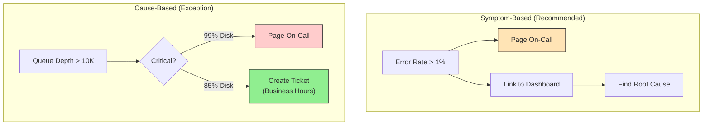

# Alerting Best Practices

This guide covers 5 key areas: I. The Philosophy of Alerting: Symptom-Based vs. Cause-Based, II. Service Level Objectives (SLOs) and The Error Budget, III. Alerting Taxonomy: Tiers, Routing, and Noise Reduction, IV. The Human Element: Runbooks and Actionability, V. Cost and Cardinality: The Economics of Observability.

## I. The Philosophy of Alerting: Symptom-Based vs. Cause-Based

### 1. The Strategic Shift: From Infrastructure to User Experience

The fundamental directive for a Principal TPM regarding alerting is the decoupling of *infrastructure health* from *service availability*. In legacy environments, operations teams monitored servers (CPU, RAM, Disk). In a Mag7 environment, teams monitor *User Journeys*.

**The Technical Reality:**
Modern architectures at companies like Google or Meta are distributed and ephemeral. A single container crashing or a disk filling up is an expected operational event, handled by orchestration layers (Kubernetes, Borg). If you alert on every container restart, you create "alert fatigue," causing on-call engineers to ignore critical signals.

**Mag7 Implementation Example:**
At Amazon, for a service like DynamoDB, an alert is rarely triggered by a single node failing. Instead, the alerting logic aggregates metrics across an entire partition or region. The alert triggers only if the aggregate success rate drops below the Service Level Objective (SLO), such as 99.99%.

*   **Legacy Approach:** Alert if `Server_A_CPU > 90%`.
*   **Mag7 Approach:** Alert if `Checkout_Transaction_Latency_p99 > 500ms` sustained for 5 minutes.

### 2. The Four Golden Signals in Practice

While Google SRE methodology defines the "Four Golden Signals," the Principal TPM's role is to ensure these are mapped correctly to business value, not just collected as raw data.

1.  **Latency:** You must enforce the distinction between average latency and tail latency.
    *   *TPM Action:* Reject alerts based on "Average Latency." Averages hide outliers. If 10% of your users (the p90) are seeing 10-second load times, the average might still look healthy. Insist on alerting on p95 or p99.
2.  **Traffic:** This is a demand signal.
    *   *TPM Action:* Use traffic drops as a sanity check for alerting logic. If `HTTP 200 OK` rates drop to zero, but you have no error alerts, your monitoring is broken (the "silence is deadly" scenario).
3.  **Errors:** Explicit (5xx codes) vs. Implicit (200 OK but wrong content).
    *   *TPM Action:* Ensure "soft errors" are captured. For example, Netflix returning an empty list of movies with a 200 OK status is a catastrophic user failure that standard HTTP alerting misses.
4.  **Saturation:** The only "cause-based" metric that warrants a page *before* a symptom occurs.
    *   *TPM Action:* Define saturation thresholds (e.g., database connection pools or disk space) that trigger alerts *with enough lead time* to remediate before the user is impacted.

### 3. Tradeoff Analysis: Symptom vs. Cause

As a Principal TPM, you will arbitrate disputes between Product (who wants zero downtime) and Engineering (who wants zero false alarms). You must articulate these tradeoffs:

**Symptom-Based Alerting (The Standard)**
*   **Mechanism:** "Page me if the Error Rate > 1%."
*   **Pro (Signal-to-Noise):** High fidelity. If the pager goes off, a customer is definitely suffering. This builds trust in the monitoring system.
*   **Con (Mean Time to Repair - MTTR):** The alert tells you *what* is happening, not *why*. An engineer wakes up knowing "Checkout is broken," but must then dig into logs/metrics to find "The SQL database is locked."
*   **Mitigation:** This is solved by **Observability dashboards**. The alert (Symptom) links directly to a dashboard showing the Causes (CPU, DB locks, etc.).

**Cause-Based Alerting (The Exception)**
*   **Mechanism:** "Page me if the Message Queue depth > 10,000."
*   **Pro (mttr):** Instant root cause identification.
*   **Con (False Positives):** High queue depth might be a normal spike during a flash sale. Paging on this causes engineers to wake up, check the system, see it's processing fine, and go back to sleep. This "crying wolf" leads to ignored pages during real outages.
*   **Tradeoff Decision:** Move Cause-Based checks to **Ticket Generation** (Jira/Asana) rather than PagerDuty. If a disk is 85% full, file a ticket for business hours. If it hits 99%, page.

### 4. Business and ROI Impact

The transition to symptom-based alerting directly impacts the bottom line and organizational capability.

*   **ROI on Engineering Talent:** At Mag7 scales, "Toil" (manual, repetitive work) is the enemy. Reducing false positive pages prevents burnout. Replacing 50 "high CPU" alerts with 1 "high latency" alert saves hundreds of engineering hours annually.
*   **Customer Experience (CX):** Symptom-based alerting aligns engineering incentives with customer happiness. Engineers stop optimizing for "server uptime" (which doesn't matter if the app is buggy) and start optimizing for "successful request rate."
*   **Capability Maturity:** It forces the organization to define Service Level Objectives (SLOs). You cannot alert on symptoms if you haven't defined what "good" looks like.

### 5. Edge Cases and Failure Modes

A sophisticated alerting strategy must account for these common pitfalls:

*   **The "Boiling Frog" (Slow Degradation):** Symptom-based alerts often rely on thresholds (e.g., >5% error rate). If errors rise from 0.1% to 4.9% over a month, no alert fires, but CX degrades.
    *   *Solution:* Implement "Trend-based alerting" or "Burn Rate alerting" (alert if we consume 10% of our monthly error budget in one hour).
*   **Dependency Failures:** If a third-party payment provider fails, your symptom alerts will fire (Checkout failing).
    *   *Solution:* Implement "Inhibited Alerting." If the Payment Gateway check fails, suppress the downstream Checkout Failure alerts to prevent an alert storm.
*   **Low Traffic Services:** For internal tools or B2B products with low volume, symptom-based alerting fails (1 error in 5 requests is a 20% error rate, but might be statistical noise).
    *   *Solution:* Use "Synthetic Monitoring" (Probe-based). Have a bot simulate a user every minute and alert on the bot's failure.

## II. Service Level Objectives (SLOs) and The Error Budget

While alerting tactics focus on *detecting* issues, Service Level Objectives (SLOs) and Error Budgets provide the strategic framework for *prioritizing* them. As a Principal TPM, your role is not to calculate the math of availability, but to govern the tension between **Feature Velocity** (Product) and **System Reliability** (Engineering).

The fundamental premise at Mag7 companies is that **100% reliability is the wrong target.** It is prohibitively expensive and technically impossible. Instead, we aim for a specific target (e.g., 99.9%) and treat the remaining margin (0.1%) as a budget to be spent on innovation, experiments, and inevitable failures.

### 1. The Reliability Stack: SLI vs. SLO vs. SLA

You must enforce strict terminological discipline. Confusing these terms leads to legal exposure and engineering misalignment.

*   **SLI (Service Level Indicator):** The quantitative measure of a specific aspect of the level of service provided.
    *   *Example:* "The latency of the `GetCart` API call measured at the load balancer."
*   **SLO (Service Level Objective):** A target value or range of values for a service level that is measured by an SLI. This is an internal engineering target.
    *   *Example:* "99.9% of `GetCart` calls in the last 30 days complete in < 200ms."
*   **SLA (Service Level Agreement):** An explicit or implicit contract with your users that includes consequences (financial credits) if missed.
    *   *Example:* "If availability drops below 99.5%, the customer receives a 10% credit."

**Real-World Behavior at Mag7:**
At Google and AWS, the SLO is always tighter than the SLA. The gap between the SLO (99.9%) and the SLA (99.5%) is the **safety margin**. TPMs monitor this margin closely. If an SLO is breached, internal alarms fire and "War Rooms" form. If an SLA is breached, lawyers and account managers get involved.

**Tradeoffs:**
*   **Tight SLOs (e.g., 99.999%):**
    *   *Pro:* Forces high architectural discipline and redundancy.
    *   *Con:* Exponentially higher cost (cloud spend, engineering hours) and dramatically slower feature velocity.
*   **Loose SLOs (e.g., 99.0%):**
    *   *Pro:* High velocity; allows for risky experimentation.
    *   *Con:* Erosion of customer trust; technical debt accumulation.

**Impact on Business/Capabilities:**
*   **ROI:** prevents over-engineering. If users are happy with 99.9%, spending $2M/year to reach 99.99% is wasted capital.
*   **Skill:** Forces engineers to think in terms of "User Journeys" rather than "Server Uptime."

### 2. The Error Budget as a Policy Mechanism

The Error Budget is the metric calculated as $100\% - \text{SLO}$. If your SLO is 99.9%, your error budget is 0.1%. Over a 30-day period (43,200 minutes), you have roughly 43 minutes of allowed downtime or degraded performance.

**Real-World Behavior at Mag7:**
The Error Budget is not just a metric; it is a **release gate**.
*   **Google:** If a service exhausts its error budget, a freeze is instituted. No new features may be pushed until the system stabilizes or the budget resets (usually quarterly or rolling 30-day). The only allowed engineering work is reliability fixes.
*   **Amazon:** Focuses heavily on the "Correction of Error" (COE) process. If the budget is blown, the priority shifts to deep-dive root cause analysis and implementing preventative measures before roadmap work resumes.

**The Principal TPM Role:**
You own the governance of this budget. When a Product Lead demands a launch despite a depleted budget, you are the arbiter who enforces the policy or escalates for a risk exception.

**Tradeoffs:**
*   **Strict Enforcement:**
    *   *Pro:* Aligns incentives. Devs write better code because they want to ship features, and they can't ship if they break reliability.
    *   *Con:* Can stall critical business launches due to minor technical glitches.
*   **Flexible Enforcement:**
    *   *Pro:* Business agility in the short term.
    *   *Con:* "Normalization of Deviance." If you ignore the budget once, the metric becomes meaningless, leading to eventual catastrophic failure.

### 3. Burn Rate Alerting

Traditional alerting triggers when an error occurs. Advanced Mag7 alerting triggers on the **Burn Rate**—how fast the error budget is being consumed.

**Technical Depth:**
If you have a 30-day window, you don't want to be alerted only when the budget is empty. You want to be alerted if the current rate of errors indicates you *will* empty the budget within 24 hours.
*   *Burn Rate of 1:* You are consuming budget at a rate that will exhaust it exactly at the end of the window.
*   *Burn Rate of 14.4:* You will exhaust the 30-day budget in 2 days.

**Impact on CX & Operations:**
*   **CX:** Detects "slow leaks" in reliability (e.g., a slight latency regression) before they become full outages.
*   **ROI:** Drastically reduces pager fatigue. We do not page for a single error spike that consumes only 0.01% of the budget. We only page if the *rate* of errors threatens the monthly target.

### 4. Defining Composite SLOs (User Journeys)

A common failure mode is measuring component reliability rather than user experience. A database can be 100% up, but if the network ACL prevents access, the user experiences 100% failure.

**Real-World Behavior at Mag7:**
We define SLOs based on **Critical User Journeys (CUJs)**.
*   *Bad SLO:* "Redis CPU is < 50%."
*   *Good SLO:* "Checkout Transaction Success Rate > 99.95%."

This requires a **Composite SLO**, often measured via:
1.  **Client-side instrumentation:** Telemetry from the mobile app/browser (the source of truth).
2.  **Synthetic Monitoring:** Bots attempting to complete a transaction every minute.

**Tradeoffs:**
*   **Client-Side Measurement:**
    *   *Pro:* The absolute truth of user experience (includes ISP issues, CDN failures).
    *   *Con:* Noisy data (user loses Wi-Fi) and delayed ingestion.
*   **Server-Side Measurement:**
    *   *Pro:* Clean data, immediate control.
    *   *Con:* Misses network/CDN failures (the "it works on my machine" fallacy).

### 5. Governance: The TPM's Responsibility

The technology of SLOs is handled by SREs; the *sociology* of SLOs is handled by TPMs. You must establish the governance ritual.

1.  **The Monthly SLO Review:** A meeting where Engineering and Product review budget consumption.
    *   *Green (Budget > 20% remaining):* Greenlight for high-risk features/experiments.
    *   *Red (Budget exhausted):* Enforce reliability sprint.
2.  **The Exception Process:** Define who has the authority to override a frozen launch (usually VP level).
3.  **Recalibration:** If you meet your SLO for 6 months straight with 50% budget remaining, your SLO is too loose. You are sandbagging. Tighten it to push for higher quality or encourage faster experimentation.

## III. Alerting Taxonomy: Tiers, Routing, and Noise Reduction

At the scale of a Mag7 infrastructure, an undefined alerting strategy results in "Alert Storms"—periods where thousands of signals fire simultaneously, paralyzing the on-call engineers. As a Principal TPM, your role is to enforce a taxonomy that dictates **urgency** (Tiers), **ownership** (Routing), and **clarity** (Noise Reduction).

The goal is to move the organization from "monitoring everything" to "alerting only on actionability."

### 1. Alert Tiers: Defining Severity by Business Impact

A common anti-pattern in growing organizations is defining severity by technical metrics (e.g., "Sev 1 = CPU > 90%"). In a mature Mag7 environment, severity is defined strictly by **Business Impact** and **Customer Experience**. This taxonomy dictates response expectations (SLAs).

**The Standard Mag7 Severity Taxonomy:**

*   **SEV-1 (Critical / Wake Up):**
    *   **Definition:** Critical business function is down for a significant subset of users. Revenue or data integrity is at risk.
    *   **Action:** Pages the on-call engineer immediately (24/7). Triggers a Major Incident Management (MIM) process.
    *   **Example:** "Checkout failed for >5% of users" (Amazon) or "Video playback failure rate >1%" (Netflix).
*   **SEV-2 (High / Wake Up):**
    *   **Definition:** Core functionality is degraded, or a redundant system has failed (loss of redundancy), putting the system at high risk.
    *   **Action:** Pages the on-call engineer immediately.
    *   **Example:** "Primary database node failed; running on secondary (at risk of overload)."
*   **SEV-3 (Medium / Next Business Day):**
    *   **Definition:** Minor bug or performance regression that does not block core user flows.
    *   **Action:** Creates a high-priority ticket. Does **not** page outside business hours.
    *   **Example:** "Latency increased by 100ms, but still within SLO."
*   **SEV-4/5 (Low / Info):**
    *   **Definition:**Cleanup tasks, minor anomalies, or information for future analysis.
    *   **Action:** Logged to dashboard or low-priority ticket backlog.
    *   **Example:** "Disk usage at 70% (trend indicates 3 weeks until full)."

**Tradeoffs:**
*   **Strict Tiering:**
    *   *Pro:* Prevents burnout. Engineers know that if the pager goes off, it is real.
    *   *Con:* Risk of "Under-alerting." If a definition is too strict, a "slow burn" issue (e.g., slow memory leak) might be categorized as SEV-3 until it catastrophically becomes SEV-1.
*   **Loose Tiering:**
    *   *Pro:* Captures all anomalies.
    *   *Con:* "The Boy Who Cried Wolf." If engineers are paged for SEV-3s at 3 AM, they will eventually ignore or acknowledge-and-sleep-through a real SEV-1.

**Impact on Business/Capabilities:**
*   **ROI:** Strict tiering protects the most expensive resource (engineering time). It ensures high-paid principals focus on architecture, not clearing log-spam.
*   **Capability:** Enables "Ticket, Don't Page" culture. If no human action is required immediately, it should never be a page.

### 2. Intelligent Routing: Service Mesh and Ownership

In a microservices architecture (like Uber or Meta), a single user request may touch 50+ services. When a request fails, routing the alert to the right team is complex.

**Real-World Behavior at Mag7:**
We utilize a **Service Catalog** as the source of truth. Every alert definition must be tagged with a `service_id`. The alerting platform (e.g., PagerDuty, VictorOps, or internal tools like Google’s AlertManager) queries the Service Catalog to resolve the `service_id` to an `escalation_policy`.

**The Dependency Dilemma (Upstream vs. Downstream):**
If the "Payments Service" fails, the "Checkout Service" (which calls Payments) will see 100% error rates.
*   *Naive Routing:* Both the Checkout team and Payments team get paged.
*   *Mag7 Routing:* The Checkout service's alerting logic checks the health of its dependencies. If `Payments` is reporting `DOWN`, the Checkout alert is **suppressed** or routed as "Info" rather than "Critical," because the Checkout team cannot fix the Payments service.

**Tradeoffs:**
*   **Automated Dependency Suppression:**
    *   *Pro:* Massive reduction in cognitive load during outages. Only the root-cause team is summoned.
    *   *Con:* Complexity. Requires a highly accurate, real-time dependency graph. If the graph is stale, you might suppress an alert for a service that *is* actually broken, assuming it's an upstream issue.

**Impact on Business/Capabilities:**
*   **CX:** Faster MTTR (Mean Time To Resolution). The correct team is engaged immediately without a "war room" of 20 innocent teams trying to prove it's not their fault.

### 3. Noise Reduction: Deduplication, Grouping, and Dampening

Noise reduction is the technical implementation of "Mercy." It transforms raw telemetry into consumable incidents.

**Techniques Required for a Principal TPM Strategy:**

1.  **Deduplication (Grouping):**
    *   *Scenario:* A database cluster with 50 nodes loses network connectivity.
    *   *Bad:* 50 separate alerts ("Node 1 down", "Node 2 down"...).
    *   *Good:* The monitoring system groups these by `cluster_id` and time window. Result: 1 Alert ("Cluster DB-Primary: 50 nodes unreachable").
    *   *Mag7 Implementation:* Google’s AlertManager groups alerts by labels (e.g., `{region="us-east-1", service="auth"}`).

2.  **Hysteresis (Damping/Flapping Control):**
    *   *Scenario:* CPU spikes to 91% (limit 90%), drops to 89%, goes back to 91%.
    *   *Bad:* Page, Resolve, Page, Resolve.
    *   *Good:* Implement a "Wait duration" or "Clear delay." The metric must be >90% for 5 continuous minutes to fire, and <85% for 5 minutes to resolve.

3.  **Time-of-Day Routing:**
    *   *Scenario:* A non-critical batch processing job fails at 2 AM.
    *   *Strategy:* Route to a "Low Urgency" path that only notifies via Slack/Email, or queues a page for 9:00 AM the next morning.

**Tradeoffs:**
*   **High Aggregation/Damping:**
    *   *Pro:* Clean incident dashboard; high signal-to-noise ratio.
    *   *Con:* Delayed reaction. Waiting 5 minutes to confirm a spike means the customer suffers for 5 minutes before an engineer is even notified.
*   **Low Aggregation:**
    *   *Pro:* Instant notification.
    *   *Con:* Alert fatigue and high turnover of on-call staff.

**Impact on Business/Capabilities:**
*   **Skill Retention:** Engineers leave companies where being on-call is a nightmare. Reducing noise is a direct retention strategy.
*   **Operational Excellence:** Clean alerts allow for better Post-Incident Reviews (SEVs/COEs). It is easier to analyze one grouped incident than 5,000 raw alert logs.

## IV. The Human Element: Runbooks and Actionability

The most sophisticated monitoring infrastructure is rendered useless if the "Human Last Mile"—the engineer receiving the page—cannot effectively mitigate the issue. As a Principal TPM, you must treat Incident Response not as an operational burden, but as a product feature with its own User Experience (UX). If the UX of being on-call is poor, Mean Time To Recovery (MTTR) increases, and engineering attrition follows.

At the Mag7 level, the standard is simple: **If an alert does not have a linked, actionable, and tested runbook, it is not production-ready.**

### 1. The "Actionability" Mandate

In smaller organizations, alerts are often informational ("Disk is 80% full"). In Mag7 environments, alerts are strictly a call to action. If a human cannot perform a specific action to mitigate the issue, the alert should not exist as a page—it should be a ticket or a log entry.

**Real-World Behavior at Mag7:**
At Google and Meta, SRE teams enforce a strict "Delete or Fix" policy. If an on-call engineer receives a page, investigates, and decides "this is fine for now" or "I can't do anything about this," the alert definition is considered a bug. The TPM’s role is to drive the governance process that reviews "non-actionable alerts" and forces teams to either tune the threshold or automate the remediation.

**Tradeoffs:**
*   **Strict Actionability:**
    *   *Pro:* Eliminates alert fatigue. When a pager goes off, engineers react with urgency because they know it is real.
    *   *Con:* Risk of missing "leading indicators" that are actionable only in aggregate (e.g., a slow memory leak that doesn't breach thresholds until a crash).
    *   *Mitigation:* Use "Ticket" priority for leading indicators and "Page" priority only for immediate customer impact.

**Impact on Business Capabilities:**
*   **ROI:** Reduces "Alert Fatigue," a primary driver of senior engineer burnout and attrition.
*   **Skill Scaling:** Actionable alerts allow junior engineers to handle incidents that would otherwise require senior intuition.

### 2. Runbooks as Code: From Wiki to Executable

The traditional approach to runbooks—a static Wiki page—is an anti-pattern in hyperscale environments because wikis rot the moment they are written. A Principal TPM must advocate for "Executable Runbooks" or "Notebooks."

**The Maturity Model:**
1.  **Static (Level 0):** A Confluence/Wiki page describing how to check logs. (High risk of staleness).
2.  **Parameterized (Level 1):** The alert payload contains deep links to dashboards pre-filtered by the specific `region`, `service_id`, and `time_window` of the incident.
3.  **Executable (Level 2):** Jupyter Notebooks or scripts (e.g., AWS Systems Manager documents) that pull live diagnostic data when opened.
4.  **Automated (Level 3):** The runbook is a script that executes automatically. The human is only paged if the script fails.

**Real-World Behavior at Mag7:**
Amazon uses "OpsItems" where the runbook is integrated directly into the ticketing system. Engineers can click a button to "Restart Fleet" or "Flush Cache" directly from the alert interface, governed by IAM roles. This reduces the "Context Switch Cost" of logging into a terminal.

**Tradeoffs:**
*   **Invest in Automation (Level 2/3):**
    *   *Pro:* Drastically lowers MTTR; eliminates human error (fat-fingering commands).
    *   *Con:* High upfront engineering cost. Requires maintenance of the automation scripts.
*   **Invest in Documentation (Level 0/1):**
    *   *Pro:* Fast to create. Flexible for edge cases automation can't handle.
    *   *Con:* High MTTR. Relies on the operator's mental state at 3:00 AM.

### 3. The "Bus Factor" and Democratization of Knowledge

A critical KPI for a Principal TPM managing a platform is the **distribution of incident resolution**. If only Principal Engineers can resolve outages, the organization has a single point of failure. Good runbooks democratize ability.

**Strategic Implementation:**
You must enforce a "Step-by-Step" structure in runbooks that assumes *zero* prior context.
*   **Bad Runbook:** "Check the database load."
*   **Good Runbook:** "1. Go to Dashboard X. 2. Look at Graph Y. 3. If value > 80%, execute Script Z."

**Impact on CX and Business:**
*   **CX:** Consistent recovery times regardless of who is on call. Customers shouldn't suffer longer because the "expert" is on vacation.
*   **Business:** Frees up Principal Engineers to work on architecture rather than firefighting, maximizing the ROI of the most expensive talent.

### 4. Lifecycle Management: Game Days and Post-Mortems

Runbooks are hypotheses; incidents are experiments. A runbook is only validated when it is used to successfully resolve an incident.

**The TPM Feedback Loop:**
1.  **The Game Day:** TPMs organize controlled failure injections (Chaos Engineering). The metric is not just "did the system survive?" but "did the on-call engineer find the runbook, understand it, and execute it successfully?"
2.  **The Post-Mortem (COE):** After every Sev-1/Sev-2 incident, the "Correction of Error" document must have a section dedicated to documentation. Did the runbook work? If not, the repair item is to fix the runbook, not just the code.

**Edge Cases & Failure Modes:**
*   **Circular Dependencies:** The runbook is hosted on the system that is currently down (e.g., Runbook Wiki is down during a network outage). *Mitigation:* Offline/Cached copies or hosting runbooks on a completely separate failure domain (e.g., distinct AWS region or SaaS provider).
*   **Credential Rot:** The automated runbook script fails because the service account credentials expired. *Mitigation:* Automated credential rotation monitoring included in the "Meta-Monitoring" strategy.

## V. Cost and Cardinality: The Economics of Observability

Observability is frequently the second largest infrastructure line item after compute. At the scale of a Mag7 company, the volume of telemetry data (metrics, logs, traces) grows exponentially faster than traffic. A Principal TPM must treat observability not just as a technical necessity, but as a supply chain problem: you are managing the supply of data against the demand for insights, with strict cost constraints.

The central technical challenge driving cost is **Cardinality**.

### 1. The Mechanics of Cardinality and Cost

In Time Series Databases (TSDBs) like Prometheus, Datadog, or Google’s Monarch, cost is driven by the number of active time series, not just the volume of data points.

**Cardinality defined:** The number of unique combinations of metric names and label values.
$$Cardinality = Metric \times Label A \times Label B \times \dots$$

**The "High Cardinality" Trap:**
If an engineer adds a metric `http_request_latency` and tags it with `region` (3 values) and `service` (5 values), the cardinality is $1 \times 3 \times 5 = 15$. This is negligible.
However, if they tag it with `user_id` (100M users) or `container_id` (ephemeral pods churning every hour), the cardinality explodes to millions.

**Real-World Behavior at Mag7:**
*   **Google/YouTube:** Strictly forbids high-cardinality labels (like `video_id` or `user_id`) in standard metrics. These belong in *logs*, not metrics. If a metric query matches too many time series, the query is killed to protect the global control plane.
*   **Meta:** Uses aggressive aggregation. Metrics are often pre-aggregated at the host level before being sent to the central store (Scuba/Gorilla) to strip out high-cardinality dimensions unless specifically whitelisted for debugging.

**Tradeoffs:**
*   **High Cardinality (Fine-grained):**
    *   *Pro:* Infinite drill-down capability. You can see latency for a specific user in a specific container.
    *   *Con:* Massive cost (often millions/month in vendor bills); slow query performance; potential to crash the monitoring backend.
*   **Low Cardinality (Aggregated):**
    *   *Pro:* Fast dashboards; predictable costs; system stability.
    *   *Con:* "Smoothing" of data. You see the average latency is high, but cannot identify if it is caused by one specific "noisy neighbor" customer.

### 2. Sampling Strategies: Head-Based vs. Tail-Based

When dealing with distributed tracing (e.g., tracking a request from Load Balancer $\to$ API $\to$ DB), capturing 100% of traffic is economically impossible at Mag7 scale. You must choose a sampling strategy.

**Head-Based Sampling:**
The decision to keep or drop a trace is made at the *start* of the request.
*   *Mechanism:* "Keep 1% of all requests randomly."
*   *Mag7 Context:* Used for general trend analysis. If you have 1B requests, 1% is sufficient to understand P50/P90 latency.

**Tail-Based Sampling:**
The decision is made at the *end* of the request, after the system knows the outcome.
*   *Mechanism:* "Keep 100% of requests that resulted in an Error or took >2 seconds. Drop the successful ones."
*   *Mag7 Context:* Essential for reliability teams. At Amazon, keeping a trace of a successful "Add to Cart" is low value. Keeping the trace of a failed one is high value.

**Tradeoffs:**
*   **Head-Based:**
    *   *Impact:* Low overhead, cheap. But you might miss the "needle in the haystack" failure because it was statistically sampled out.
*   **Tail-Based:**
    *   *Impact:* Guarantees capture of interesting failures. However, it is technically complex and expensive because you must buffer *all* data in memory until the request completes to decide whether to keep it.

### 3. Data Retention and Resolution (The Rollup Strategy)

A Principal TPM must define the lifecycle of data. Data value decays rapidly over time.

**The Tiered Storage Model:**
1.  **Real-Time (0-24 Hours):** High resolution (1-second intervals). Used for active debugging and incident response.
    *   *Cost:* Highest.
2.  **Short-Term (1-30 Days):** Medium resolution (1-minute intervals). Used for SLO reporting and sprint retrospectives.
    *   *Action:* **Downsampling (Rollups).** We take the 60 data points from minute 1 and store only the Max, Min, and Avg.
3.  **Long-Term (1 Year+):** Low resolution (1-hour intervals). Used for capacity planning and Year-over-Year growth analysis.

**Impact on Business/Capabilities:**
*   **ROI:** Aggressive downsampling can reduce storage costs by 90% without sacrificing the ability to answer strategic questions (e.g., "Did we grow traffic 20% this year?").
*   **Skill:** Requires engineers to understand that they cannot query "last year's latency for a specific request ID."

### 4. Governance: The "Metric Bankruptcy" approach

At a certain scale, observability becomes a "Tragedy of the Commons." Individual teams push custom metrics because "it costs them nothing," but the aggregate bill hits the CTO's budget.

**Actionable Guidance for TPMs:**
1.  **Attribution:** Ensure every metric has an `owner` tag. If you cannot bill the cost back to a specific P&L or team, you cannot control it.
2.  **Quota Management:** Implement strict limits on the number of custom metrics a service can generate.
3.  **The "Culling" Exercise:** Periodically (e.g., quarterly), identify metrics that have *never* been queried in the last 90 days and disable them. At Netflix, automated scripts often alert teams: "This metric has not been read in 3 months and will be deleted in 7 days unless you object."

**Impact on CX:**
Governance prevents "Dashboard Rot." When engineers are flooded with thousands of stale metrics, they lose trust in the dashboard. Reducing noise improves Incident Response time (MTTR).

---

## Interview Questions

### I. The Philosophy of Alerting: Symptom-Based vs. Cause-Based

**Question 1: The "Noisy Neighbor" Conflict**
"You are the TPM for a platform team. A product team complains that your platform's 'High CPU' alerts are waking them up constantly, but the service usually auto-recovers. However, the Engineering Manager argues that if they turn off those alerts, they won't know when the system is under stress until it crashes. How do you resolve this?"

*   **Guidance for a Strong Answer:**
    *   Acknowledge the validity of both sides (operational visibility vs. alert fatigue).
    *   Propose moving the "High CPU" alert from a **Page** (immediate interrupt) to a **Ticket/Warning** (work hours review).
    *   Advocate for establishing a "Golden Signal" (Latency/Error) alert that *does* page.
    *   Suggest setting up an auto-scaling policy that triggers on the CPU spike, rather than a human alert.
    *   Mention checking the Error Budget: if the CPU spikes don't consume the error budget, they are not an emergency.

**Question 2: The Silent Failure**
"We launched a new feature. All dashboards show green: Latency is low, CPU is normal, HTTP 500 rate is near zero. However, Customer Support is flooded with tickets saying the feature isn't working. What happened to our alerting strategy, and how do you fix it?"

*   **Guidance for a Strong Answer:**
    *   Identify this as a failure of **Semantic Monitoring** vs. **Generic Monitoring**. The system is likely returning `HTTP 200 OK` but with a functional error payload (e.g., "User not found" or an empty JSON body).
    *   Discuss the difference between "Availability" (server up) and "Correctness" (data accurate).
    *   Propose implementing **Black-box / Synthetic testing**: A script that performs the actual user action and validates the *content* of the response, not just the status code.
    *   Suggest adding client-side instrumentation (telemetry from the mobile app/browser) to catch errors occurring before the request hits the backend.

### II. Service Level Objectives (SLOs) and The Error Budget

### Question 1: Managing Conflict Between Velocity and Reliability
**Question:** "You are the TPM for a critical payment service. A major feature launch is scheduled for next week that is expected to drive significant revenue. However, the service just exhausted its Error Budget for the quarter due to an unrelated outage yesterday. The Product VP wants to launch anyway. The SRE Lead wants to freeze. How do you handle this?"

**Guidance for a Strong Answer:**
*   **Acknowledge the Policy:** Validate that the Error Budget policy exists to prevent burnout and technical bankruptcy. It cannot be ignored casually.
*   **Assess the Risk:** Shift the conversation from "Rules" to "Risk." What is the *risk* of launching? If the budget is blown, the system is proven unstable. Launching new code increases volatility.
*   **Data-Driven Decision:** Analyze the *nature* of the budget exhaustion. Was it a one-off black swan event (unlikely to recur) or a systemic stability issue?
*   **Mitigation Strategy:** Propose a middle ground: Feature Flag rollout to 1% of users (Canary), with an immediate rollback trigger.
*   **Executive Escalation:** If the risk is deemed acceptable by the business, ensure the VP *signs off* on the risk acceptance. The TPM's job is to ensure the decision is made with eyes wide open, not to make the decision unilaterally.
*   **Post-Launch Obligation:** Secure a commitment that *immediately* after launch, the team pivots to reliability work to replenish the budget.

### Question 2: Defining SLOs for a New Product
**Question:** "We are launching a new GenAI-based coding assistant. How would you go about defining the initial SLOs and Error Budgets for this product? What signals would you look for?"

**Guidance for a Strong Answer:**
*   **User Journey First:** Identify what matters to the user. For GenAI, it's not just "uptime." It is "Quality of Response" and "Latency."
*   **Latency Nuance:** Acknowledging that GenAI is slow. An SLO of 200ms is unrealistic. The SLO might be "Time to First Token < 1s" (streaming response) rather than "Total Completion Time."
*   **Iterative Approach:** Admit that for a new product, we don't know the baseline. Start with loose SLOs (monitoring mode) to gather data, then tighten them after 3 months.
*   **Dependency Management:** If the product relies on a massive LLM backend (like GPT-4), your SLO cannot exceed the dependency's SLA.
*   **Golden Signals:** Explicitly map the Four Golden Signals to the product (e.g., Saturation = GPU Token Limit).

### III. Alerting Taxonomy: Tiers, Routing, and Noise Reduction

**Question 1: The "Alert Fatigue" Scenario**
"You have joined a new team managing a critical payment gateway. The on-call engineers are burnt out, receiving approximately 50 pages a week, half of which are non-actionable or auto-resolving. The Engineering Manager is hesitant to change thresholds for fear of missing a real outage. As a Principal TPM, how do you approach fixing this?"

*   **Guidance for a Strong Answer:**
    *   **Audit & Data:** Start by analyzing the last 3 months of paging data. Categorize them into "Actionable" vs. "Noise."
    *   **Strategy:** Propose a "Shadow Mode." Create new, stricter alert rules but don't hook them to PagerDuty yet—log them side-by-side with the old rules to prove to the EM that the new rules would have caught all real incidents without the noise.
    *   **Taxonomy:** Reclassify alerts. Move non-actionable alerts to tickets (SEV-3) or logs (SEV-4).
    *   **Outcome:** Define success metrics (e.g., "Reduce pages from 50/week to <10/week while maintaining 99.99% availability").

**Question 2: The "Dependency Storm" Scenario**
"During a major region-wide outage of an underlying storage service (e.g., S3), your product's dashboard turned entirely red. Every microservice fired alerts for high error rates. This made it impossible to see if any specific service had a *unique* problem distinct from the storage outage. How would you architect the alerting strategy to prevent this 'blindness' in the future?"

*   **Guidance for a Strong Answer:**
    *   **Inhibit Rules:** Discuss implementing "Inhibit Rules" or dependency-aware alerting. "If Service B is down, mute alerts for Service A regarding Service B connectivity."
    *   **Symptom vs. Cause:** Acknowledge that while symptoms (Customer Error Rate) will inevitably fire, the *paging* policy should be intelligent.
    *   **Global Switches:** Propose a "Big Red Button" or "Global Maintenance Mode" feature where an Incident Commander can temporarily silence lower-level alerts in a region known to be down, allowing the team to focus solely on the recovery of the critical path.
    *   **Meta-Monitoring:** Discuss the need for a high-level "Health of Health" dashboard that aggregates status rather than raw component alerts.

### IV. The Human Element: Runbooks and Actionability

**Question 1: The "Stale Docs" Scenario**
"You have joined a new platform team responsible for critical payments infrastructure. The team complains about high operational load (toil). You find that their runbooks are outdated, and most incidents are solved by 'tribal knowledge' held by two senior engineers. As a Principal TPM, how do you drive a strategy to fix this without halting feature development?"

*   **Guidance for a Strong Answer:**
    *   **Acknowledge the Tradeoff:** You cannot stop feature dev completely, but you must articulate that *reliability is a feature*.
    *   **Mechanism over Mandate:** Don't just say "I'll tell them to write docs." Propose a mechanism, such as "Documentation as Definition of Done" for new features.
    *   **Gamification/Rotation:** Suggest a "Scribe" rotation where the person resolving the incident *must* update the runbook as part of the ticket closure (The Amazon COE model).
    *   **Quantify Impact:** Measure "Time to Onboard" for new engineers or "percentage of incidents resolved by non-seniors" to prove ROI to leadership.

**Question 2: Automation vs. Process**
"We have a recurring issue that causes a service restart once a week. It takes an engineer 5 minutes to fix manually using a runbook. The team wants to spend 2 weeks building a self-healing automation to fix it. As the TPM, do you approve this work?"

*   **Guidance for a Strong Answer:**
    *   **ROI Calculation:** 5 mins/week = ~4 hours/year. Spending 2 weeks (80 hours) to save 4 hours/year is a bad financial ROI *if* that is the only factor.
    *   **Nuance (The "Mag7" Perspective):** A strong candidate will look beyond time saved.
        *   *Context Switching:* Does the 5-minute fix interrupt a developer's "flow state"? If so, the cost is much higher than 5 minutes.
        *   *Risk:* Is there a chance the human makes a mistake during the 5-minute fix that causes a massive outage?
        *   *Conclusion:* If the risk is low and context switch is minimal, prioritize other work. If the risk is high, automate it regardless of time saved.

### V. Cost and Cardinality: The Economics of Observability

**Question 1: The High-Cardinality Request**
"A product team is launching a new tiered subscription service. They insist on adding `customer_id` as a label to their primary latency metrics in Datadog/Prometheus so they can debug VIP customer complaints immediately. You know this will explode cardinality and cost. How do you handle this negotiation?"

*   **Guidance for a Strong Answer:**
    *   **Acknowledge the user need:** Do not just say "no." Validate that debugging VIP issues is critical.
    *   **Explain the technical constraint:** articulate *why* this breaks the TSDB (cardinality explosion).
    *   **Propose the architectural alternative:** Move high-cardinality data to **Logs** or **Traces**, not Metrics. Suggest using a high-cardinality logging solution (like ELK or Splunk) where they can search by `customer_id`.
    *   **Compromise:** Offer to whitelist only the "Top 50 VIPs" as metric labels if strictly necessary, or use "exemplars" (linking a metric point to a specific trace ID).

**Question 2: The Budget Cut**
"Your VP of Engineering states that the observability bill has grown 50% YoY, outpacing user growth. You are asked to cut costs by 30% without blinding the organization to outages. What is your strategy?"

*   **Guidance for a Strong Answer:**
    *   **Audit & Attribution:** Start by identifying the "top offenders." Usually, 20% of the metrics drive 80% of the cost.
    *   **Kill Unused Data:** Look for "Write-Only" metrics—data being ingested but never queried in dashboards or alerts.
    *   **Retention Policy Tuning:** Propose reducing high-resolution retention (e.g., moving from 7 days of 1-second granularity to 3 days).
    *   **Drop High-Cardinality Dimensions:** Identify metrics with ephemeral tags (like `pod_name` in a serverless environment) and aggregate them up to the `service` level.
    *   **Risk Assessment:** Explicitly state what will be lost (e.g., "We will no longer be able to debug individual pod cpu spikes from 2 weeks ago") to ensure executive buy-in on the tradeoff.

---

## Key Takeaways

- Review each section for actionable insights applicable to your organization

- Consider the trade-offs discussed when making architectural decisions

- Use the operational considerations as a checklist for production readiness
