# API Lifecycle Management & Versioning

In Mag7 environments with tens of thousands of microservices, APIs are the connective tissue that enables organizational scaling. Principal TPMs must treat APIs not as technical artifacts but as products with customers, SLAs, and lifecycle economics. This guide covers the governance models, versioning strategies, and deprecation frameworks that differentiate high-functioning platform organizations from those drowning in integration debt and zombie endpoints.


## I. Strategic Context: APIs as Products at Scale

At the Principal TPM level, "APIs as Products" is not a marketing slogan; it is an architectural and organizational necessity. In a Mag7 environment, the sheer volume of microservices (often numbering in the tens of thousands) renders ad-hoc integration impossible. You are effectively managing a supply chain of digital capabilities.

Your strategic goal is to decouple organizational complexity from technical implementation. If Team A (Identity) reorganizes, Team B (Checkout) should not experience a breaking change in their API consumption.

### 1. The Economics of Interface Definition Languages (IDLs)

The foundation of an API-as-Product strategy at scale is the rigorous enforcement of Interface Definition Languages. A Principal TPM must understand that the choice of IDL is a business decision regarding velocity versus strictness.

*   **The Technical Context:** You do not ship "code" to consumers; you ship a schema.
*   **Mag7 Examples:**
    *   **Google (Protobuf/gRPC):** Google prioritizes strict typing and backward compatibility at the binary level. The repo is monolithic; if you break a `.proto` definition, you break the build for everyone depending on it. This forces "pain up front" during the design phase to ensure "ease of use" during consumption.
    *   **Meta (Thrift/GraphQL):** Meta emphasizes data fetching efficiency. Their "One Graph" strategy allows product teams to query exactly what they need across the entire social graph without multiple round trips, optimizing for mobile network latency and developer velocity in UI iteration.
    *   **AWS (Smithy):** Amazon uses Smithy to define service models agnostic of the protocol. This allows them to auto-generate SDKs for Java, Python, Go, etc., simultaneously. For AWS, the "Product" is the SDK, not just the HTTP endpoint.

*   **Tradeoffs:**
    *   **Strict IDL (e.g., Protobuf/gRPC):**
        *   *Pros:* High performance, prevents breaking changes via compiler checks, auto-generates client libraries.
        *   *Cons:* High barrier to entry; requires tooling investment; harder to debug (binary format vs. JSON).
    *   **Loose/Schemaless (e.g., REST/JSON without strict Swagger enforcement):**
        *   *Pros:* Fast initial iteration; human-readable.
        *   *Cons:* "Silent failures" in production when fields change types; requires manual maintenance of client libraries; higher integration cost for consumers.

*   **Business Impact:**
    *   **ROI:** Auto-generating client SDKs (like AWS) reduces the "Time to First Call" (TTFC) for external customers from hours to minutes.
    *   **Capability:** Strict IDLs allow for "contract testing," enabling independent scaling of teams without constant synchronization meetings.

### 2. Governance Models: Centralized Gatekeepers vs. Federated Standards

As a Principal TPM, you will often own the governance process. The challenge is balancing innovation with standardization.

```mermaid
flowchart TB
    subgraph Centralized["Centralized Governance (Google Model)"]
        C1[API Design] --> C2[API Review Board]
        C2 --> C3{Approved?}
        C3 -->|Yes| C4[Deploy]
        C3 -->|No| C1
        C5[["⚖️ High Quality<br/>⏱️ Slower Velocity"]]
    end

    subgraph Federated["Federated Governance (Amazon Model)"]
        F1[API Design] --> F2[Automated Linting]
        F2 --> F3{Passes?}
        F3 -->|Yes| F4[Deploy]
        F3 -->|No| F1
        F5[["🚀 High Velocity<br/>📊 Inconsistent DX"]]
    end

    style C5 fill:#fff3cd,stroke:#856404
    style F5 fill:#d1ecf1,stroke:#0c5460
```



*   **Centralized Governance (The "Google" Model):**
    *   **Behavior:** A dedicated API Review Board (often comprised of Principal Engineers) must approve every new public API surface. They check for consistency (naming conventions, error handling, idempotency).
    *   **Tradeoff:** Ensures a uniform "one company" feel and high quality, but creates a significant bottleneck. It slows down feature release velocity.
    *   **Principal TPM Action:** You must implement SLAs for the review board (e.g., "Reviews completed in 48 hours") to prevent product stalling.

*   **Federated Governance (The "Amazon" Model):**
    *   **Behavior:** Teams are autonomous ("Two-Pizza Teams"). As long as they adhere to the "Bezos Mandate" (interfaces must be externalizable), they own their roadmap. Compliance is enforced via automated linting tools rather than human review boards.
    *   **Tradeoff:** High velocity and autonomy, but leads to inconsistent developer experiences (DX). One AWS service might use `snake_case` while another uses `camelCase`, causing friction for customers using both.
    *   **Principal TPM Action:** You drive the adoption of "Guardrail" tooling—automated linters in the CI/CD pipeline that reject commits violating API standards, removing the human bottleneck.

### 3. The "Internal Customer" & Chargeback Models

Treating APIs as products means internal teams are customers with the right to demand SLAs, but also the obligation to pay (via chargebacks or quota management).

*   **Real-World Behavior:**
    *   **Netflix:** Platform Engineering teams build "Paved Roads" (standardized API gateways). If a product team uses the Paved Road, they get free SRE support and tooling. If they go off-road (build custom APIs), they own their own reliability.
    *   **Microsoft (Azure):** Internal consumption of Azure services tracks COGS (Cost of Goods Sold) meticulously. If the Office 365 team consumes Azure Storage APIs, they are billed internally.

*   **Strategic Tradeoffs:**
    *   **Chargeback Model:**
        *   *Pros:* Prevents abuse (e.g., a team polling an API every millisecond unnecessarily). Aligns incentives for efficiency.
        *   *Cons:* Creates administrative friction; discourages experimentation if teams are afraid of blowing their budget.
    *   **Quota/Throttling Model:**
        *   *Pros:* Protects the Producer service from being DDOS’d by a sloppy Consumer.
        *   *Cons:* Can cause "noisy neighbor" issues where legitimate traffic is dropped during peak loads.

*   **Impact on Business Capabilities:**
    *   **Cost Optimization:** By monitoring API usage as a product metric, Principal TPMs can identify "Zombie APIs" (endpoints receiving traffic that result in no business value) and deprecate them, saving compute resources.
    *   **Reliability:** Enforcing strict rate limits (Throttling) ensures that a failure in a non-critical feature (e.g., "Recommendations") does not cascade and take down the critical path (e.g., "Checkout").

### 4. API Observability as Product Analytics

You cannot manage a product you cannot measure. For APIs, traditional monitoring (CPU/Memory) is insufficient. You need *Product* analytics.

*   **Metrics a Principal TPM Must Track:**
    *   **Adoption Rate:** Percentage of consumers migrated to the latest API version.
    *   **Time to First Hello World (TTFHW):** How long does it take a new engineer to successfully integrate?
    *   **Breaking Change Frequency:** A measure of stability. High frequency indicates poor planning or lack of domain understanding.

*   **Mag7 Context:**
    *   At **Uber**, the "Gateway" team monitors the "Fan-out" ratio. If one API call from the mobile app triggers 500 internal microservice calls, that is an architectural smell indicating inefficiency. A Principal TPM would drive a program to aggregate those calls (using GraphQL or Backend-for-Frontend patterns) to reduce latency and cost.

---

## II. The API Lifecycle: From Design to Deprecation


### 1. Design & Spec-First Development
At Mag7 companies, the design phase begins with a formal specification (OpenAPI, Protobuf, Thrift) that is created and reviewed. This artifact acts as the source of truth for both the Producer (backend team) and the Consumer (frontend/partner teams).

**Mag7 Real-World Behavior:**
*   **Microsoft (Azure):** Utilizes strict OpenAPI specifications. The specification drives the generation of SDKs in .NET, Python, Java, etc. If the spec is invalid, the build pipeline fails immediately.
*   **Stripe (Industry Standard often cited at Mag7):** Treats the API spec as part of the product definition. Changes to the spec require a "API Review" meeting, similar to a code review but focused on usability and naming conventions.

**Tradeoffs:**
*   **Speed vs. Accuracy:** Writing a spec first feels slower to engineers who want to "just code." However, it eliminates the "integration hell" that occurs when the backend and frontend drift apart during a sprint.
*   **Flexibility vs. Rigidity:** A strict spec prevents ad-hoc changes. While this ensures stability, it can frustrate teams needing a quick hotfix for a specific client.

**Business & ROI Impact:**
*   **Parallel Development:** Frontend teams can build against a mock server generated from the spec while the backend is still being written, reducing time-to-market by 30-40%.
*   **Governance:** Automated linters (e.g., Spectral) can reject commits that don't follow naming conventions (camelCase vs. snake_case), ensuring brand consistency across thousands of endpoints.

---

### 2. Implementation & Contract Testing
Once the design is frozen, implementation begins. At the Principal level, your concern is ensuring that the code actually adheres to the design document. This is achieved through **Contract Testing**.

**Mag7 Real-World Behavior:**
*   **Netflix:** Uses Consumer-Driven Contracts (CDC) like **Pact**. Instead of the Producer guessing what the Consumer needs, the Consumer writes a test defining their expectations. If the Producer breaks this contract, the Producer’s deployment pipeline is blocked.
*   **Google:** Relies on strict schema validation in Protobuf. If a field type changes from `int32` to `string`, the compiler catches it before it ever reaches a test environment.

**Tradeoffs:**
*   **CDC Complexity vs. Reliability:** Implementing CDC (Pact) requires significant cultural buy-in and tooling setup. The tradeoff is high initial investment for near-zero integration bugs later.
*   **Unit Tests vs. Contract Tests:** Unit tests check logic; contract tests check communication. Over-indexing on unit tests often leads to "green builds, broken prod" scenarios.

**Business & ROI Impact:**
*   **Reduced MTTR (Mean Time To Recovery):** By catching breaking changes in the CI/CD pipeline, you prevent incidents that would require a rollback.
*   **Decoupling:** Teams can deploy independently with confidence, a core requirement for high-velocity organizations.

---

### 3. Versioning Strategy
Versioning is the most contentious aspect of API management. As a Principal TPM, you must arbitrate between "clean code" (breaking changes in a new version) and "client stability" (maintaining backward compatibility).

**Common Strategies:**
1.  **URI Versioning (`/v1/users`):** Explicit but expensive to maintain multiple backends.
2.  **Header Versioning (`Accept: application/vnd.myapi.v1+json`):** Cleaner URLs but harder to test/cache.
3.  **Evolution (No Versioning):** GraphQL and gRPC approaches where fields are deprecated but rarely removed.

**Mag7 Real-World Behavior:**
*   **Google:** Strongly favors **Evolution over Versioning**. Their internal guidelines (AIP-180) state that breaking changes are generally forbidden. You add fields; you do not rename or remove them until a very long deprecation window has passed.
*   **Salesforce/Meta:** Often maintain massive backward compatibility. You can still hit API versions from 5+ years ago. They use an "API Gateway" layer to translate old requests into the format required by modern backends.

**Tradeoffs:**
*   **Developer Experience (DX) vs. Maintenance Cost:** Supporting `v1`, `v2`, and `v3` simultaneously makes life easy for customers but creates "tech debt" for your engineers who must patch security vulnerabilities across three codebases.
*   **Agility vs. Stability:** Strict "no breaking changes" rules force engineers to create awkward data structures (e.g., `user_address_v2`) rather than cleaning up the code.

**Business & ROI Impact:**
*   **Customer Trust:** Breaking an API breaks a customer's business. Mag7 companies prioritize stability because the churn risk of breaking a partner integration is high.
*   **Operational Cost:** Every active version requires infrastructure. Reducing the number of active versions directly reduces AWS/GCP compute spend.

---

### 4. Deployment, Gateways, and Observability
The API is deployed not directly to the web, but behind an **API Gateway**. The Gateway is the enforcement point for the policies you define.

**Mag7 Real-World Behavior:**
*   **Amazon:** Uses API Gateways to enforce "Throttling" and "Rate Limiting" per tenant. This protects Tier-0 services from being DDOS'd by a rogue internal script.
*   **Uber:** Uses extensive distributed tracing (Jaeger) starting at the Gateway. A Principal TPM uses this data to identify "fan-out" issues (one API call triggering 100 downstream DB calls).

**Tradeoffs:**
*   **Centralization vs. Bottleneck:** A centralized Gateway simplifies security (auth, logging) but can become a Single Point of Failure (SPOF) or a latency bottleneck.
*   **Latency vs. Security:** adding payload inspection (WAF) at the gateway adds milliseconds. For High Frequency Trading or Real-Time Gaming, this tradeoff is unacceptable.

**Business & ROI Impact:**
*   **Monetization:** The Gateway is where usage is counted. For cloud providers, this is the cash register.
*   **Security:** Centralized termination of TLS and Authentication (OAuth/OIDC) reduces the attack surface area.

---

### 5. Deprecation & Sunsetting (The "Zombie" API Problem)
The final and most difficult stage. Engineers love building new APIs; they hate deleting old ones. A Principal TPM must drive the "Sunset" process to reclaim resources.

**The Process:**
1.  **Announcement:** `Deprecation` header added to responses. Email blasts to registered developers.
2.  **Brownouts (The "Scream Test"):** Intentionally failing 1% of requests, then 5%, then 10% over a period of weeks to force users to read the logs and upgrade.
3.  **Hard Shutdown:** The endpoint returns `410 Gone`.

**Mag7 Real-World Behavior:**
*   **Google:** Notorious for hard shutdowns of consumer APIs, but extremely conservative with Google Cloud APIs. They have strict "stability guarantees" (e.g., no breaking changes for Beta APIs for 6 months, GA APIs for 12+ months).
*   **Internal Mag7:** Teams often use "attribution tracking." If an API endpoint hasn't received traffic in 90 days, it is automatically flagged for deletion by a governance bot.

**Tradeoffs:**
*   **Legacy Support vs. Innovation:** Supporting legacy APIs anchors the team to old technologies (e.g., keeping a Java 8 server running just for one endpoint).
*   **Customer Friction vs. Security Risk:** Old APIs are often less secure. Forcing customers to upgrade causes friction but closes security loopholes.

**Business & ROI Impact:**
*   **Cost Reduction:** Decommissioning legacy services is one of the highest ROI activities a TPM can drive. It frees up compute, storage, and—most importantly—cognitive load for the engineering team.

## III. Versioning Strategies: The Technical Deep Dive

At the Principal TPM level, versioning is not merely a technical implementation detail; it is a risk management strategy. In a Mag7 environment, a poorly managed versioning strategy results in "dependency hell," where service teams cannot deploy security patches because they are locked to an outdated version of an internal platform.

Your goal is to decouple the **release** of code from the **adoption** of features.

### 1. The Three Primary Versioning Architectures

While there are many theoretical ways to version, Mag7 companies generally coalesce around three patterns depending on whether the API is public-facing (External) or service-to-service (Internal).

#### A. URI Path Versioning (The AWS/Stripe Standard)
The version is explicitly part of the resource identifier (e.g., `api.company.com/v1/resource`).

*   **Real-World Behavior:** AWS and most public SaaS products (Salesforce, Stripe) use this. It is explicit and distinct. When AWS updates S3, they do not break existing scripts; they introduce a new API version or, more commonly, add non-breaking operations to the existing version.
*   **Trade-offs:**
    *   *Pros:* High visibility; easy for developers to debug; distinct caching rules per version at the CDN/Edge layer.
    *   *Cons:* "URI Pollution." Migrating from `/v1` to `/v2` is technically a new endpoint, often requiring a full code rewrite for the consumer.
*   **Business Impact:** High stability for external customers (CX), but high maintenance cost for the provider who must support legacy versions for years.

#### B. Header/Content Negotiation (The "Pure REST" Approach)
The client requests a specific version via headers (e.g., `Accept: application/vnd.company.v2+json`).

*   **Real-World Behavior:** Often used in internal platforms at Microsoft or GitHub. It keeps the URI clean (`api.company.com/resource`), implying the resource is the same entity, just represented differently.
*   **Trade-offs:**
    *   *Pros:* Semantically correct; URLs remain permanent.
    *   *Cons:* Harder to test (cannot just paste a URL into a browser); caching becomes complex (Vary headers); often confusing for junior integrators.
*   **Business Impact:** Reduces URI sprawl but increases complexity in the API Gateway and Observability layers (harder to see which version is driving traffic volume just by looking at URL logs).

#### C. "Live at Head" / Backward Compatibility Enforcement (The Google/gRPC Standard)
This is the dominant internal strategy for high-throughput microservices at Google and Meta. The philosophy is: **Do not version the API; evolve the schema.**

*   **Real-World Behavior:** Google uses Protocol Buffers (Protobuf). You are strictly forbidden from renaming fields or changing data types. You may only *add* optional fields or deprecate old ones. If you follow these rules, a client compiled three years ago can still talk to a server deployed today.
*   **Trade-offs:**
    *   *Pros:* No "migration projects." Velocity is maximized because consumers don't need to upgrade SDKs to keep the system running.
    *   *Cons:* "Schema Bloat." The definition file grows indefinitely. If you make a mistake in a field name, you support that typo forever.
*   **Business Impact:** Massive ROI on engineering velocity. Eliminates the coordination tax of upgrading thousands of internal microservices simultaneously.

### 2. Managing Breaking Changes: The "Expand-Contract" Pattern

As a Principal TPM, you will often mediate between a Producer Team (who wants to refactor code) and a Consumer Team (who refuses to change). You must enforce the **Parallel Change (Expand-Contract)** pattern to maintain uptime.


**The Workflow:**
1.  **Expand:** The Producer adds the new functionality (e.g., splitting `fullName` into `firstName` and `lastName`) while *keeping* the old field `fullName` active. The API now supports both.
2.  **Migrate:** The TPM leads a campaign to move Consumers to the new fields. This is monitored via telemetry (identifying who is still calling `fullName`).
3.  **Contract:** Once usage of `fullName` drops to zero (or an acceptable risk threshold), the old field is removed.

**Mag7 Nuance:** At Netflix or Amazon, this phase is often automated. If a consumer is using a deprecated field, the IDL (Interface Definition Language) or SDK generation tool will emit warnings during *their* build process, shifting the burden of discovery leftward.

### 3. Deprecation and Sunset Policies

Versioning creates technical debt. "Zombie APIs" (v1 endpoints that run forever) consume compute resources, widen the security attack surface, and confuse new developers.

**Strategic Governance:**
*   **The "Brownout" Strategy:** To identify owners of unmonitored scripts hitting a deprecated v1 API, Mag7 SRE teams will intentionally inject latency or 5xx errors for short windows (e.g., 5 minutes). If no one complains, the window is widened. This forces silent consumers to engage.
*   **Guaranteed Support Windows:** Meta’s Graph API has a strict 2-year stability guarantee. As a TPM, you must align product roadmaps to this cadence. You cannot deprecate a feature in Q3 if the version guarantee runs until Q4.

**ROI Calculation:**
*   *Cost of Maintaining v1:* Infrastructure + Security Patching + Cognitive Load.
*   *Cost of Breaking v1:* Customer Churn + Support Tickets + Brand Damage.
*   *Principal TPM Decision:* You must quantify when the Cost of Maintenance exceeds the Business Value of the remaining consumers.

### 4. IDL-Driven Versioning (The "Smithy" & "Thrift" Factor)

At the Principal level, you must advocate for **Interface Definition Languages (IDLs)** over manual coding.

*   **Amazon (Smithy):** Amazon defines APIs in Smithy (a protocol-agnostic model). The model defines the version. The code (Java, Python, Go clients) is *generated* from the model.
*   **Meta (Thrift):** Similar concept.

**Why this matters to a TPM:**
1.  **Governance as Code:** You can write linter rules that prevent engineers from making breaking changes. If an engineer tries to change a required field to optional in the IDL, the build fails. You don't need to be in the code review; the tooling enforces your policy.
2.  **Automated SDKs:** When v2 is released, client SDKs are generated automatically. This reduces the friction of adoption for external partners.

## IV. The Sunset Strategy: Managing Deprecation

Deprecation is often the most neglected phase of the API lifecycle, yet at Mag7 scale, it is the primary lever for controlling technical debt and operational risk. A Principal TPM does not view deprecation as merely "deleting code"; it is a complex program management challenge involving contract renegotiation, traffic analysis, and risk mitigation.


At companies like Google or AWS, an API is rarely just "turned off." It undergoes a rigorous decommissioning process designed to balance innovation velocity against ecosystem stability.

### 1. The "Forever Promise" vs. The "Innovation Tax"

There are two dominant philosophies in Big Tech regarding deprecation, and as a Principal TPM, you must align your strategy with your organization's specific posture.

*   **The AWS Model (Immutable APIs):** AWS rarely deprecates functionality. If an API was released in 2008, it likely still works today.
    *   **Tradeoff:** High customer trust and zero migration friction for users vs. massive maintenance overhead for internal teams who must support legacy stacks forever.
    *   **ROI Impact:** High retention, but high operational expenditure (OpEx).
*   **The Google Model (Aggressive Lifecycle):** APIs are frequently deprecated and replaced by superior versions (e.g., Google Maps API v2 to v3).
    *   **Tradeoff:** Rapid innovation and cleaner codebases vs. developer fatigue and erosion of trust ("Google Graveyard" sentiment).
    *   **ROI Impact:** Lower OpEx and faster feature velocity, but potential churn among enterprise integrators.

**Principal TPM Action:** You must define the **Deprecation Policy** (e.g., "We guarantee support for 12 months after a deprecation notice"). This policy must be published and contractually binding.

### 2. Telemetry-Driven Identification

You cannot manage what you cannot measure. Before proposing a sunset, a Principal TPM must aggregate usage data. Relying on "institutional knowledge" regarding who uses an API is a failure mode.

**Required Telemetry:**
*   **User-Agent Analysis:** Identify specifically *who* is calling the endpoint. Are they internal teams, external partners, or unknown scrapers?
*   **Volume & Error Rates:** Is traffic declining organically?
*   **Business Value Attribution:** Map the API calls to revenue. If the only user of a legacy API is your largest enterprise customer, you cannot deprecate without a white-glove migration plan.

**Real-World Mag7 Behavior:**
At **Netflix**, teams use distributed tracing (similar to Zipkin or internal tools) to visualize the entire dependency tree. If a TPM wants to deprecate a metadata service, they can instantly see every upstream microservice that will break, preventing the "Scream Test" (turning it off to see who yells).

### 3. Technical Signaling: The HTTP Standard

Communication via email is insufficient. You must communicate via the protocol itself. At the Principal level, you ensure your platform adheres to IETF standards (RFC 8594) to allow for programmatic discovery of deprecation.

**Implementation:**
*   **`Deprecation: true` Header:** Signals the client that the endpoint is active but deprecated.
*   **`Sunset: <HTTP-Date>` Header:** Defines the exact timestamp when the endpoint will become `410 Gone`.
*   **`Link` Header:** Provides a URL to the migration guide.

**Example Response:**
```http
HTTP/1.1 200 OK
Deprecation: true
Sunset: Sat, 31 Dec 2024 23:59:59 GMT
Link: <https://api.example.com/migration-guide>; rel="deprecation"
```

**Impact on CX:** This allows sophisticated clients (like those built by other Mag7 companies) to build tooling that automatically flags deprecated usage in their own CI/CD pipelines, shifting the discovery left.

### 4. Operational Strategy: The "Brownout"

The most effective way to identify users who ignore emails and HTTP headers is the **Brownout Strategy**. This is a controlled failure injection orchestrated by the TPM and Engineering Leads.

**The Process:**
1.  **Scheduled Failures:** For a specific window (e.g., 5 minutes), the API Gateway is configured to return `410 Gone` or `503 Service Unavailable` for the deprecated endpoint.
2.  **Escalation:** Users will experience errors and check their logs/dashboards.
3.  **Restoration:** Service is restored.
4.  **Repetition:** The windows increase in frequency and duration over weeks (1 hour, 4 hours, 24 hours) leading up to the Sunset Date.

**Tradeoffs:**
*   **Pros:** Forces action from dormant consumers; identifies hidden dependencies.
*   **Cons:** Causes deliberate customer friction; risks violating SLAs if not communicated as "maintenance."

**Mag7 Context:** **Google** and **GitHub** frequently utilize brownouts for legacy API removal. It is the only proven method to flush out "zombie" integrations that have been running untouched on a server in a closet for five years.

### 5. Migration Friction Reduction (The "Carrot")

Deprecation is the "Stick." To maintain ROI and developer sentiment, you must provide the "Carrot."

*   **Automated Codemods:** At **Meta (Facebook)**, when a core internal API changes, the Platform Engineering team often writes a "codemod" (script) that automatically refactors the consumer's codebase to use the new API. The TPM drives the adoption of these tools.
*   **Shim Layers:** If a hard break is impossible due to business constraints, build a "Shim" or "Adapter" layer. This translates the old API request into the new API format behind the scenes.
    *   *Risk:* The Shim becomes technical debt. The TPM must set a TTL (Time To Live) on the Shim, or you defeat the purpose of deprecation.

### 6. The Hard Shutdown

When the `Sunset` date arrives, the endpoint configuration is removed from the API Gateway.

**Principal TPM Checklist:**
1.  **Legal/Compliance:** Confirm no contractual obligations are being violated.
2.  **Rollback Plan:** Even at the end, if the shutdown crashes a mission-critical system (e.g., payment processing), can you revert in <5 minutes?
3.  **Data Retention:** Ensure data associated with the deprecated service is archived according to GDPR/CCPA before infrastructure deletion.

---

## V. Governance, Security, and Business Impact

### 1. Automated Governance: The "Paved Road" Approach

At Mag7 scale, manual API reviews are a bottleneck that kills velocity. Governance must be shifted left and automated via CI/CD pipelines. The Principal TPM’s role is to define the "Paved Road"—a set of standardized tools and platforms that make doing the right thing the easiest thing.

**Technical Implementation:**
Instead of a governance board reviewing Word documents, Mag7 companies use **API Linting** and **Policy-as-Code**.
*   **Linting:** Tools like Spectral (for OpenAPI) or `buf` (for Protobuf) run in the CI pipeline. They enforce naming conventions (camelCase vs. snake_case), require descriptions for fields, and ensure semantic versioning adherence.
*   **Policy-as-Code:** Using Open Policy Agent (OPA) to enforce rules at the gateway level, such as "No public API can expose PII fields without specific OAuth scopes."

**Real-World Mag7 Behavior:**
*   **Netflix:** Champions the "Paved Road." If engineers use the centralized Spring Boot wrapper and gRPC libraries, governance (logging, auth, metrics) is free. If they go off-road (custom stack), they own the compliance burden entirely.
*   **Google:** Enforces governance via the Monorepo. You cannot commit a `.proto` file that violates backward compatibility rules; the build system rejects it immediately.

**Tradeoffs:**
*   **Strict vs. Flexible:** Highly strict linting ensures consistency but can frustrate developers trying to ship hotfixes. *Mitigation:* Implement "Warning" vs. "Error" levels, blocking builds only on critical security/contract violations.
*   **Centralization vs. Autonomy:** Centralized governance ensures compliance but creates a single point of failure (the platform team). *Mitigation:* Distribute governance rules via shared libraries/containers rather than a human review gate.

**Business Impact:**
*   **Skill:** Reduces the cognitive load on junior engineers; they don't need to memorize the style guide, the linter teaches them.
*   **ROI:** Massive reduction in integration time. When every API looks and behaves the same, internal mobility and cross-team integration speed increase.

### 2. Security Architecture: Identity Propagation and Zero Trust

Security at the Principal TPM level is not about firewalls; it is about **Identity Propagation** and **Zero Trust** in a microservices mesh. You must ensure that when Service A calls Service B, which calls Service C, the context of the original user (and their permissions) is preserved and validated at every step.

**Technical Implementation:**
*   **mTLS (Mutual TLS):** Every service has a certificate (often managed by a Service Mesh like Istio or AWS App Mesh) to prove its identity to other services. This prevents unauthorized internal services from accessing sensitive APIs.
*   **JWT Propagation:** Passing the JSON Web Token (JWT) through the call chain.
*   **The "Confused Deputy" Problem:** Ensuring Service B doesn't perform an action on behalf of the user that the user wasn't authorized to do, just because Service B has high privileges.

**Real-World Mag7 Behavior:**
*   **Google:** BeyondCorp model. No distinction between internal and external networks. Every API call is authenticated and authorized based on device state and user identity.
*   **Microsoft/Azure:** Heavily utilizes Azure AD for service-to-service auth, moving away from static API keys to managed identities.

**Tradeoffs:**
*   **Latency vs. Security:** mTLS and token validation at every hop add latency (milliseconds matter at scale). *Mitigation:* Use sidecars (Envoy) to handle SSL termination and auth offloading to minimize application overhead.
*   **Complexity:** Debugging "Access Denied" errors in a mesh of 50 services is notoriously difficult. *Mitigation:* Distributed tracing (OpenTelemetry) must be integrated with Auth logs.

**Business Impact:**
*   **Risk:** Mitigates the impact of a perimeter breach. If an attacker gets inside the network, they still cannot call sensitive APIs without valid mTLS certs and tokens.
*   **CX:** Enables granular permissioning (e.g., "Read-only access to billing" for support staff) which allows for better customer support tools without exposing full admin rights.

### 3. Rate Limiting, Throttling, and Bulkheading

Governance also includes protecting availability. A Principal TPM must define strategies to prevent "noisy neighbors"—where one heavy API consumer degrades performance for everyone else.

**Technical Implementation:**
*   **Leaky Bucket vs. Token Bucket:** Understanding which algorithm to apply. Token Bucket allows for bursts of traffic (good for user interaction), while Leaky Bucket enforces a smooth rate (good for background processing).
*   **Global vs. Local Rate Limiting:**
    *   *Local:* Enforced in memory on the instance. Fast, but inaccurate in distributed systems.
    *   *Global:* Enforced via a central store (Redis/DynamoDB). Accurate, but adds latency and a dependency.
*   **Shuffle Sharding:** Isolating resources so that a failure in one shard only affects a small percentage of customers (heavily used by AWS).

**Real-World Mag7 Behavior:**
*   **Amazon (AWS):** Uses aggressive throttling with exponential backoff requirements for clients. If you exceed limits, you get a 429 error immediately. They also use extensive "Bulkheading"—isolating failure domains so a crash in the recommendation API doesn't take down the checkout API.
*   **Meta (Facebook):** Implements "Adaptive Throttling." Instead of fixed limits, the API gateway monitors backend health. If latency spikes, it dynamically lowers the request limits to let the backend recover.

**Tradeoffs:**
*   **CX vs. Stability:** Aggressive rate limiting protects the system but frustrates legitimate high-volume users. *Mitigation:* Implement "Burstable" limits and differentiated tiers (Gold/Silver/Bronze) based on business value.
*   **Cost:** Global rate limiting at Mag7 scale requires massive Redis clusters. *Mitigation:* Use probabilistic techiques or local limiting with eventual consistency for non-critical paths.

### 4. The Business of APIs: Zombie APIs and Deprecation

The most overlooked aspect of governance is the *end* of the lifecycle. "Zombie APIs" (deprecated, unmaintained, but still running) are a massive security risk and cost drain.

**Technical Implementation:**
*   **Sunset Headers:** Utilizing the IETF standard `Sunset` HTTP header to programmatically warn consumers of upcoming deprecation.
*   **Brownouts:** Intentionally failing a percentage of requests to a deprecated API (e.g., returning 410 Gone for 5 minutes) to identify who is still using it before the final turn-off.

**Real-World Mag7 Behavior:**
*   **Google:** Strict deprecation policies. When an API version is deprecated, there is a guaranteed window (e.g., 1 year), after which it is ruthlessly turned off.
*   **Salesforce/Microsoft:** Tend to support legacy APIs for much longer (sometimes 5-10 years) due to enterprise contracts, leading to massive "compatibility tax" in their codebases.

**Tradeoffs:**
*   **Innovation vs. Compatibility:** Supporting old versions slows down the ability to refactor core architecture. *Mitigation:* Build "Translation Layers" (adapters) that allow the old API contract to call the new backend, rather than maintaining the old backend code.
*   **Customer Trust:** Breaking changes erode trust. *Mitigation:* Automated migration scripts provided to customers to upgrade their SDKs.

**Business Impact:**
*   **Security:** Zombie APIs are often unpatched. Removing them reduces the attack surface.
*   **Cost:** Reducing infrastructure spend by decommissioning legacy clusters.

---


## Interview Questions


### I. Strategic Context: APIs as Products at Scale

### Question 1: The Governance vs. Velocity Conflict
"You are the Principal TPM for the API Platform. The AI/ML organization wants to bypass standard API governance reviews to ship a critical generative AI feature to beat a competitor. They claim your standardization process adds 2 weeks to their launch. How do you handle this?"

**Guidance for a Strong Answer:**
*   **Acknowledge the Tradeoff:** Validate that time-to-market is a critical business metric, sometimes more than purity of code.
*   **Short-Term Mitigation:** Propose a "Provisional Status" or "Beta" tag for their API. This allows them to launch immediately but sets the expectation that the API is unstable and subject to change/deprecation. This protects the enterprise (by signaling risk to consumers) while unblocking the product.
*   **Long-Term System Fix:** Pivot to the process. Why does it take 2 weeks? The candidate should propose automating the governance checks (linting, contract testing) to reduce review time to minutes, removing the false dichotomy between speed and quality.
*   **Risk Management:** Mention that if they bypass security/privacy reviews (not just style reviews), it is a hard "No," regardless of business pressure.

### Question 2: Managing "Zombie" APIs
"We have a legacy API version used by 40% of our internal teams. It is costing us $2M/year to maintain the infrastructure for it. The teams refuse to migrate to the new version because they are focused on feature work. Design a strategy to retire this legacy API."

**Guidance for a Strong Answer:**
*   **Data-Driven Approach:** First, audit who the consumers are. Is it 40% of traffic or 40% of teams? Is the traffic critical revenue-generating traffic or low-value batch jobs?
*   **The "Carrot" (Incentives):** Make the new version significantly better (faster, more features, better docs). Offer automated migration scripts or "codemods" to reduce the effort for consumers.
*   **The "Stick" (Brownouts):** Describe a "Scream Test" strategy. Schedule short, intentional maintenance windows (brownouts) where the legacy API returns 503 errors. Increase the frequency and duration of these brownouts over time. This forces teams to acknowledge the dependency and prioritize the migration.
*   **Executive Escalation:** If a team still refuses, calculate the cost per team (e.g., "Team X's refusal to migrate costs the company $50k/month"). Present this to leadership as a resource allocation decision, not a technical argument.

### II. The API Lifecycle: From Design to Deprecation

### Question 1: The "Breaking Change" Dilemma
**Scenario:** "You own a core platform API used by 50 internal teams and 3 external strategic partners. Your engineering lead tells you that a critical security fix requires a breaking change to the API schema (changing a user ID from integer to UUID). The fix must go out in 2 weeks, but your external partners have a 3-month SLA for breaking changes. How do you handle this?"

**Guidance for a Strong Answer:**
*   **Mitigation over conflict:** Do not simply accept the binary choice. Propose a non-breaking implementation first (e.g., adding a *new* field `user_uuid` while keeping `user_id` populated for backward compatibility, then deprecating `user_id` later).
*   **Gateway Layering:** Suggest using the API Gateway to transform the response for legacy clients, decoupling the backend fix from the external contract.
*   **Risk Assessment:** If the security risk is existential (e.g., Log4j level), the SLA might need to be breached. A Principal TPM weighs legal breach penalties vs. security breach damages.
*   **Communication:** Detail the communication plan. It’s not just an email; it’s a high-touch reach-out to the Partner Engineering teams of the strategic clients.

### Question 2: Managing API Sprawl
**Scenario:** "You have joined a new team and discovered they maintain 400 microservices with over 2,000 API endpoints. There is no central documentation, and developers are complaining that they don't know which APIs to use. Integration velocity is slowing down. Outline your 90-day plan to fix this."

**Guidance for a Strong Answer:**
*   **Discovery First:** Don't promise to document everything. Use automated tooling (network sniffers, gateway logs) to map what is actually running and receiving traffic. Identify "Zombie" APIs immediately.
*   **The "Golden Path":** Define a standard for *new* APIs (OpenAPI spec required, registered in a catalog like Backstage). Stop the bleeding.
*   **Tiering:** Classify APIs into Tier 1 (Critical/External), Tier 2 (Internal/High Usage), and Tier 3 (Ad-hoc). Focus documentation efforts on Tier 1.
*   **Governance via Automation:** Implement linting in the CI/CD pipeline to reject non-compliant API changes moving forward.
*   **ROI Focus:** Frame the outcome not as "better docs" but as "reduced onboarding time for new hires" and "reduced infrastructure spend by killing unused endpoints."

### III. Versioning Strategies: The Technical Deep Dive

### Question 1: The "Zombie" API Migration
"You are the Principal TPM for a core platform service at Amazon. We have a legacy 'v1' API that is inefficient and blocking a major database migration. However, it is still receiving 500 million requests per day. We don't know exactly who all the consumers are because the authentication on v1 is weak (API keys shared across teams). How do you manage the deprecation and migration to v2 without causing a site-wide outage?"

**Guidance for a Strong Answer:**
*   **Discovery First:** Do not suggest shutting it down immediately. Propose using "Scream Tests" or "Brownouts" (injecting small latency/errors) to identify silent dependencies.
*   **Telemetry:** Discuss implementing better logging at the load balancer level to attempt to fingerprint traffic sources (IPs, User Agents) even without strong auth.
*   **Incentivization:** Explain how you would "sell" v2 to consumers (better latency, new features) rather than just forcing them.
*   **The "Strangler Fig" Pattern:** Suggest routing traffic through a proxy that intercepts v1 calls and translates them to v2 calls behind the scenes, allowing you to decommission the v1 backend infrastructure while keeping the v1 public interface alive temporarily.
*   **Governance:** Mention establishing a "No New Consumers" policy on v1 immediately (locking API key generation).

### Question 2: The Breaking Security Fix
"A critical security vulnerability (Log4j style) is discovered in the way our public API parses input. Fixing it requires changing the input validation logic in a way that will break about 5% of legitimate customer traffic (those sending malformed but currently accepted headers). We cannot support both versions; the fix must be applied. How do you handle this rollout?"

**Guidance for a Strong Answer:**
*   **Prioritization:** Acknowledge that Security > Backward Compatibility. The fix must go out.
*   **Communication:** Detail a rapid communication plan. "We are breaking you for your safety." Notification via developer dashboards, email, and status pages.
*   **Mitigation:** Can we auto-fix the malformed headers at the Gateway layer before they hit the application? (Sanitization middleware).
*   **Rollout Strategy:** Phased rollout (Canary deployment). Deploy to 1% of traffic, monitor for unexpected spikes in rejection rates beyond the predicted 5%.
*   **Post-Mortem:** How did the API allow malformed headers in the first place? Discuss improving the IDL/Schema validation to prevent this class of error in the future.

### IV. The Sunset Strategy: Managing Deprecation

### Question 1: The High-Value Holdout
**"You are managing the deprecation of a legacy API version that costs the company $500k/year to maintain. We have announced the sunset date, but our single largest enterprise customer (representing $10M/year revenue) has informed us they will not be able to migrate by the deadline. How do you handle this?"**

**Guidance for a Strong Answer:**
*   **Acknowledge the Leverage:** Do not suggest "extending the deadline for everyone." That destroys credibility.
*   **Segmentation:** Propose a solution that isolates the risk. Keep the general sunset date, but create a private "legacy support" tier for that specific customer.
*   **Pricing/Contract:** The candidate should mention renegotiating. If the customer wants legacy support, they should perhaps pay for the extended maintenance (offsetting the $500k).
*   **Technical Implementation:** Move the customer to a dedicated cluster or specific API Gateway usage plan so their legacy traffic doesn't impact the main fleet.
*   **Hard Deadline:** Establish a new, firm deadline with the customer, perhaps with executive sponsorship.

### Question 2: The Hidden Dependency
**"We deprecated an internal service after 6 months of notice and zero traffic in the last 30 days. One hour after the hard shutdown, a critical, non-customer-facing financial reconciliation job failed. It turns out it only runs once a quarter and didn't show up in your 30-day logs. Walk me through the RCA and how you prevent this next time."**

**Guidance for a Strong Answer:**
*   **Immediate Action:** Roll back immediately. Restoration of service > Process purity.
*   **Root Cause Analysis (RCA):** The failure wasn't the shutdown; the failure was the *observability window*. 30 days of logs is insufficient for quarterly or annual batch jobs.
*   **Prevention Strategy:**
    *   Extend log analysis windows to 13 months for critical backend systems.
    *   Implement "screaming tests" (brownouts) specifically during business hours prior to shutdown.
    *   **Dependency Mapping:** Enforce service mesh/dependency graph registration so services *declare* their dependencies explicitly, rather than relying solely on traffic logs.

### V. Governance, Security, and Business Impact

**Question 1: Designing for Deprecation**
"We have a legacy internal API used by 50 different teams, including critical checkout flows. It relies on a database we are decommissioning. We need to migrate everyone to v2, which has a breaking schema change, within 6 months. As the Principal TPM, how do you govern this migration to ensure zero downtime and 100% compliance?"

*   **Guidance for a Strong Answer:**
    *   **Discovery:** Do we actually know who uses it? (Logs analysis, not just asking around).
    *   **Communication Strategy:** Don't just email. Use `Deprecation` and `Sunset` headers in the API response so client logs catch it.
    *   **The "Scream Test" (Brownouts):** Propose scheduled short-term outages (maintenance windows) to identify passive consumers who ignore emails.
    *   **Translation Layer:** Suggest building a temporary adapter that exposes the v1 interface but calls the v2 backend, decoupling the database decom from the client migration.
    *   **Governance:** Block new deployments that consume the v1 API via CI/CD linting.

**Question 2: Security Tradeoffs in Microservices**
"Our security team wants to enforce mTLS and full payload validation on every internal service-to-service call to move toward Zero Trust. However, our latency-sensitive Search team claims this will violate their SLAs (Service Level Agreements) and degrade the user experience. How do you resolve this conflict?"

*   **Guidance for a Strong Answer:**
    *   **Quantify the Impact:** Don't accept "it will be slow" as a fact. Demand benchmarks. (e.g., "mTLS adds 2ms, payload validation adds 15ms").
    *   **Architectural Compromise:** Propose establishing a "Trust Zone" or sidecar pattern (Envoy) where the mTLS handshake is handled by the infrastructure, not the application code (offloading).
    *   **Risk Assessment:** Is the Search payload sensitive? If it's public catalog data, maybe full payload validation is overkill. Apply security controls proportional to data classification.
    *   **Optimization:** Move validation to the edge (Ingress Gateway) rather than every hop, provided the internal network is sufficiently isolated or monitored.

---


## Key Takeaways

1. **APIs are products with customers, not just code interfaces.** Internal teams consuming your API are customers with SLAs. Treat API development with the same rigor as external product development—discovery, design, launch, maintenance, and deprecation.

2. **IDLs are business decisions, not just technical choices.** Strict IDLs (Protobuf/gRPC) enforce contracts at compile time but require tooling investment. Loose schemas (JSON/REST) accelerate prototyping but create "silent failures" in production.

3. **Spec-first development enables parallel execution.** When the contract is defined before code, frontend teams can build against mocks while backend development continues—cutting integration time by 30-40%.

4. **Consumer-Driven Contracts prevent "green builds, broken prod."** Contract tests verify communication between services, not just internal logic. If you break a consumer's expectations, the producer's pipeline fails—not production.

5. **Versioning creates debt; evolution minimizes it.** The "Live at Head" model (add fields, never remove) eliminates migration projects. URI versioning (`/v1/`, `/v2/`) provides explicit isolation but multiplies maintenance burden.

6. **Expand-Contract is the pattern for breaking changes.** Add new fields alongside old ones, migrate consumers, then contract. Never remove before migration is complete and verified via telemetry.

7. **Brownouts flush out silent dependencies.** Email notifications are ignored. HTTP Deprecation headers are ignored. Intentionally failing 1-5% of requests forces unknown consumers to surface before hard shutdown.

8. **Governance must be automated or it becomes a bottleneck.** API review boards don't scale to thousands of endpoints. Embed standards in CI/CD linters (Spectral, buf) and Policy-as-Code (OPA) so compliance is automatic.

9. **Rate limiting protects the platform from itself.** The biggest threat to availability is often internal—a misconfigured batch job can DDoS your own infrastructure. Implement throttling, bulkheading, and quota management per consumer.

10. **Zombie APIs are security liabilities and cost drains.** Deprecated endpoints that "still work" accumulate technical debt, consume infrastructure, and widen attack surface. Sunset policies must be ruthlessly enforced.
