# API Platform & Developer Experience at Stripe Scale

Stripe is the reference model for an external API platform: **strict versioning discipline**, long-lived backwards compatibility, predictable rate limiting, high-quality webhooks, and a deliberate, slow deprecation lifecycle.

> **Why This Matters for TPMs**
>
> TPMs frequently own API platform programs. Stripe's approach shows how to treat the API as the primary product—not an afterthought—and run versioning, deprecation, rate limiting, and onboarding as explicit, metric-driven programs.

---

## 1. Versioning and Backwards Compatibility

Stripe's core principle: **breaking changes require explicit version opt-in**, and **non-breaking changes can ship continuously**.

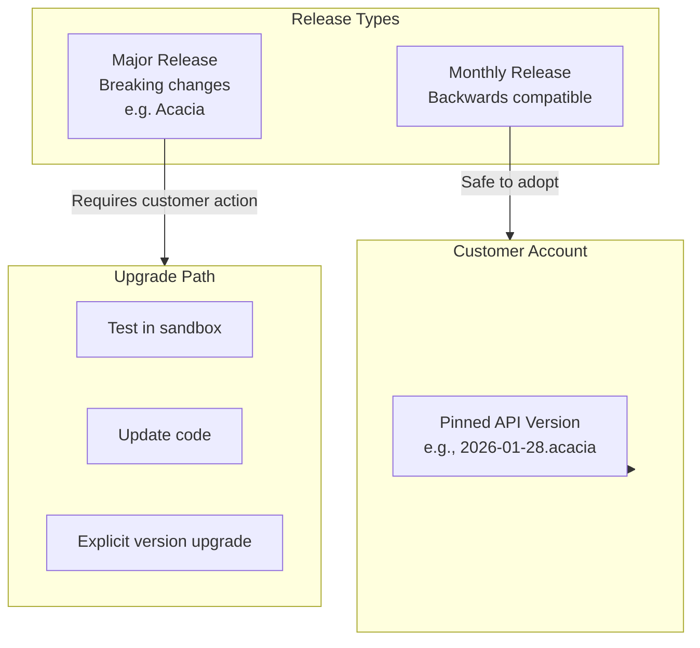

### 1.1 Date-Stamped API Versions

| Concept | Implementation | Example |
|---------|---------------|---------|
| **Version format** | Date + codename | `2026-01-28.acacia` |
| **Pinning** | Per-account, not per-request | Account settings |
| **What's versioned** | Field names, shapes, error formats, behavior | Response structure |
| **Breaking changes** | Require new version + customer opt-in | New major release |

### 1.2 Major vs. Monthly Releases

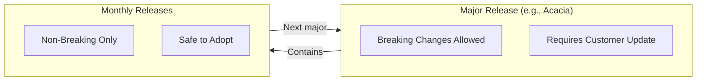

| Release Type | Breaking Changes | Customer Action Required |
|--------------|-----------------|-------------------------|
| **Major** (Acacia, Basil, etc.) | Yes | Must update and test |
| **Monthly** | No | Safe auto-upgrade within major |

### 1.3 SDK Versioning

SDKs follow **Semantic Versioning (SemVer)**:

| Version Component | Meaning | Example |
|-------------------|---------|---------|
| Major | Breaking changes | v8.0.0 → v9.0.0 |
| Minor | New features (backwards compatible) | v8.1.0 → v8.2.0 |
| Patch | Bug fixes | v8.1.0 → v8.1.1 |

> **Key Stripe Insight**
>
> APIs are versioned on the account/secret, not just in the URL. This lets the team improve the platform without surprising existing integrations.

---

## 2. Deprecation Policy and Change Management

Stripe's deprecation stance is conservative: any change that forces customers to touch code is a "deprecation" and must be managed carefully.

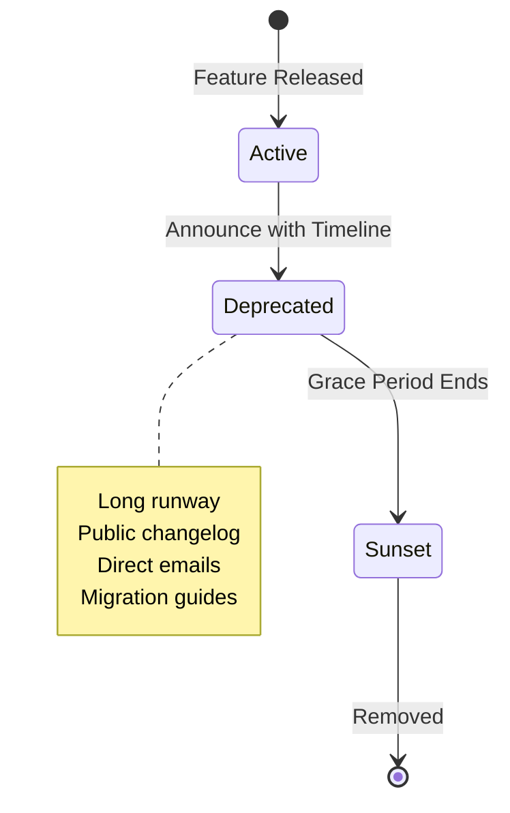

### 2.1 What Constitutes "Breaking"

| Change Type | Breaking? | Requires New Version? |
|-------------|-----------|----------------------|
| Removing a field | Yes | Yes |
| Changing field type | Yes | Yes |
| Changing semantics | Yes | Yes |
| Changing auth requirements | Yes | Yes |
| Adding optional field | No | No |
| Adding new endpoint | No | No |

### 2.2 Deprecation Lifecycle

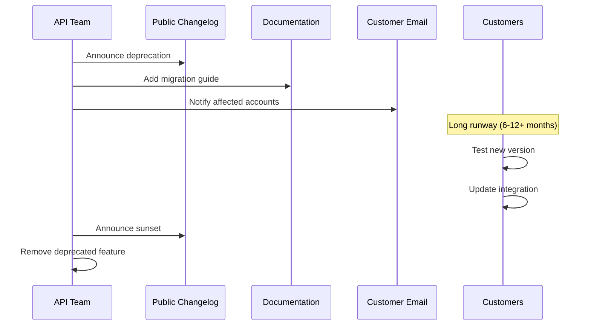

### 2.3 API Review Gate

Internally, Stripe uses a strict **API review** gate:

| Gate | Purpose | Reviewers |
|------|---------|-----------|
| Design review | Consistency, DX | Central API design group |
| Breaking change review | Long-term impact | API governance team |
| Deprecation review | Customer impact | Product + Engineering |

> **One-Way vs. Two-Way Doors**
>
> **One-way doors:** Public API surface (URLs, resource model, error schemas), versioning scheme. These are hard to change.
>
> **Two-way doors:** Rollout strategy, documentation, tooling. These can iterate with partner feedback.

---

## 3. Rate Limiting and Fairness

Stripe's rate limiting is simple to reason about but layered, designed to protect the platform while keeping partner experience predictable.

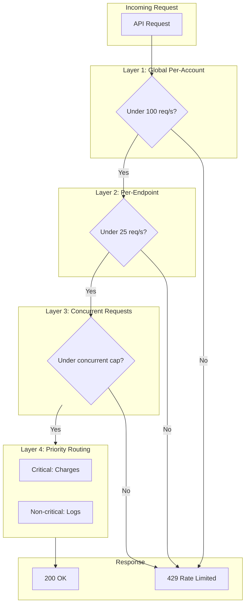

### 3.1 Rate Limit Tiers

| Limit Type | Live Mode | Test Mode | Notes |
|------------|-----------|-----------|-------|
| Global per-account | 100 req/s | 25 req/s | All endpoints combined |
| Per-resource | ~25 req/s | ~25 req/s | Per endpoint type |
| File uploads | Lower | Lower | Expensive operations |
| Listing endpoints | Lower | Lower | Query-heavy |

### 3.2 Layered Rate Limiting Strategy

| Layer | Purpose | Implementation |
|-------|---------|----------------|
| **Layer 1** | Global per-account QPS | Account-level token bucket |
| **Layer 2** | Per-endpoint QPS | Endpoint-specific limits |
| **Layer 3** | Concurrent requests | Prevent slow endpoint monopoly |
| **Layer 4** | Critical vs. non-critical | Prioritize charge creation over logs |

### 3.3 Client-Side Contract

Stripe's docs establish a clear **contract with integrators**:

| Requirement | Implementation |
|-------------|----------------|
| Handle 429 responses | Retry with backoff |
| Exponential backoff | 1s, 2s, 4s, 8s... |
| Idempotency keys | Prevent duplicate operations |
| Leave headroom | Use 90 req/s of 100 limit |

> **Rate Limiting Philosophy**
>
> Rate limits are part of the API contract, not a hidden enforcement mechanism. Document them clearly and give partners the tools to handle them gracefully.

---

## 4. Webhooks and Integration DX

Stripe's webhook story is as important as its request/response APIs.

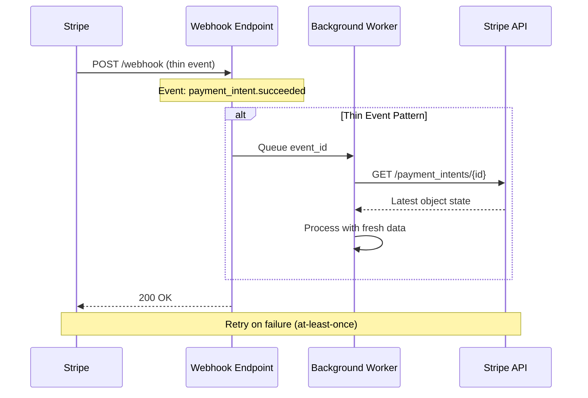

### 4.1 Thin Event Model

| Concept | Implementation | Why |
|---------|----------------|-----|
| **Thin events** | Event contains type + ID, not full object | Avoids stale data |
| **Fetch latest** | Call API to get current state | Events can be delayed/duplicated |
| **Idempotent processing** | Dedupe on event ID | At-least-once delivery |

### 4.2 Webhook Delivery Guarantees

| Property | Guarantee | Partner Responsibility |
|----------|-----------|----------------------|
| Delivery | At-least-once | Handle duplicates |
| Ordering | Not guaranteed | Don't rely on order |
| Retries | On 4xx/5xx | Return 200 quickly |
| Timing | May be delayed | Fetch fresh state |

### 4.3 High-Volume Integration Patterns

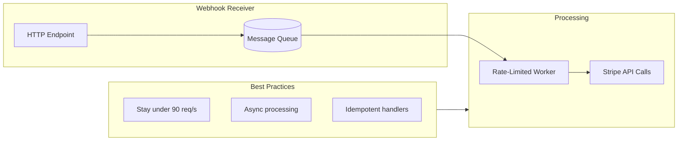

| Pattern | Purpose |
|---------|---------|
| Queue events | Don't block webhook response |
| Rate-limited workers | Stay under API limits |
| Idempotent handlers | Handle retries safely |
| Fetch fresh state | Avoid stale data from events |

> **Webhooks as Separate Data Plane**
>
> Webhooks have their own contracts, SLIs (latency, loss, duplication), and scaling behaviors. Treat them as a distinct system from the request/response API.

---

## 5. Developer Experience and Partner Onboarding

Stripe's DX stack is deliberate and deep—it's not "nice docs," it's an integrated platform.

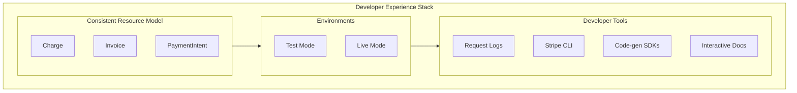

### 5.1 Consistent Resource Model

| Principle | Implementation |
|-----------|----------------|
| Everything is a resource | `charge`, `invoice`, `payment_intent` |
| Predictable CRUD | GET, POST, PUT, DELETE |
| Normalized relationships | Consistent ID references |
| New products follow patterns | Same model everywhere |

### 5.2 Test Mode

| Feature | Benefit |
|---------|---------|
| Separate test keys | No risk to production |
| Test card numbers | Simulate scenarios |
| Test webhooks | Verify handlers |
| Clear UI separation | Obvious mode indicator |

### 5.3 Request Logs and Inspectability

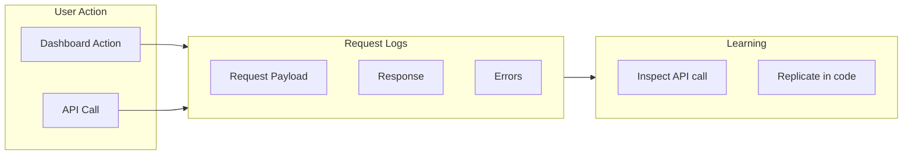

> **The Dashboard as Learning Tool**
>
> Every API call (including from the Dashboard) shows up in Request Logs. Developers can perform actions in the UI, then inspect and replicate the underlying API calls.

### 5.4 Time-to-First-Success

The net effect of Stripe's DX investment:

| Metric | Stripe Target |
|--------|--------------|
| Time to first successful charge | Very low (minutes) |
| Debugging time | Fast (logs, consistent errors, excellent docs) |
| Integration quality | High (test mode, examples, SDK quality) |

---

## 6. North Star Metrics and Program Ownership

When you pitch yourself as owning an API platform / DX program "Stripe-style":

### 6.1 North Star Metrics

| Metric | What It Measures |
|--------|------------------|
| **Time-to-first-integration (TTI)** | Onboarding friction |
| **Error rate per 1k calls** | API quality for new integrators |
| **% traffic on latest N versions** | Migration health |
| **Migration velocity** | Rate of safe version upgrades |
| **Webhook handling latency** | Partner integration quality |
| **Webhook failure rate** | Partner infrastructure health |

### 6.2 One-Way Door Decisions

| Decision | Reversibility | Impact |
|----------|---------------|--------|
| Versioning strategy | Very hard | Affects all future changes |
| Resource model/naming | Very hard | Breaking changes expensive |
| Error schema | Hard | Client error handling depends on it |
| Rate limit contract | Medium | Partners build to limits |

### 6.3 Programs You'd Own

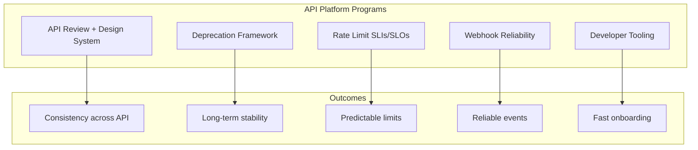

| Program | Components |
|---------|------------|
| **API Review + Design System** | Enforce Stripe-like consistency and DX |
| **Deprecation Framework** | Clear timelines, telemetry, bulk-migration tooling |
| **Rate Limit SLIs/SLOs** | Documented limits, partner guidance in SDKs/docs |
| **Webhook Reliability** | Delivery SLOs, retry policies, partner debugging tools |
| **Developer Tooling** | Test mode, logs, CLI, SDK lifecycle, docs |

---

## 7. Trade-off Matrix

| Decision | DX | Stability | Platform Complexity | Partner Friction |
|----------|-----|-----------|---------------------|------------------|
| Per-account versioning | High | High | High | Low |
| Long deprecation cycles | Medium | High | Medium | Low |
| Strict rate limits | Medium | High | Low | Medium |
| Thin webhook events | Medium | High | Low | Medium |
| Code-gen SDKs | High | Medium | High | Low |
| Test mode parity | High | High | High | Low |

---

## 8. Reliability, SLOs, and Operations

### 8.1 SLIs/SLOs

| SLI Category | Metric | SLO Target |
|--------------|--------|------------|
| **API Availability SLI** | Percentage of successful API requests (non-4xx client errors) | 99.99% availability |
| **API Latency SLI** | p99 response time for charge creation | &lt;500ms |
| **Webhook Delivery SLI** | Percentage of webhooks delivered on first attempt | 99.9% |
| **Webhook Latency SLI** | p95 time from event to first delivery attempt | &lt;5 seconds |
| **Idempotency SLI** | Percentage of idempotent requests handled correctly | 100% |

### 8.2 Error Budgets

**Burned by:** API outages, elevated error rates, webhook delivery failures, rate limit misconfigurations affecting partners.

**Policy:** If monthly error budget exceeded, freeze non-critical deployments and prioritize reliability. Webhook reliability issues trigger immediate investigation and partner communication.

### 8.3 Golden Signals

| Signal | What to Monitor |
|--------|-----------------|
| **Latency** | API response time by endpoint, webhook delivery latency, SDK response time |
| **Traffic** | Requests per second by endpoint, webhook volume, new integrations |
| **Errors** | API error rates by type, webhook delivery failures, idempotency conflicts |
| **Saturation** | Rate limit headroom per account, webhook queue depth, database connections |

### 8.4 Chaos Scenarios to Run

| Scenario | Expected Behavior |
|----------|-------------------|
| Database primary failure | Automatic failover, &lt;30 second RTO, no data loss, idempotency preserved |
| Webhook endpoint returns 5xx | Retry with exponential backoff, dead-letter after max retries, dashboard visibility |
| Rate limit surge (legitimate traffic) | Graceful degradation, clear 429 responses, partner contacted for limit increase |
| Partner sends duplicate requests | Idempotency keys ensure exactly-once processing |
| API version sunset | Traffic monitoring, partner outreach, deprecation warnings in responses |

### 8.5 MTTR Targets

- Target MTTR for API availability incidents: &lt;5 minutes to detection, &lt;15 minutes to mitigation
- Target MTTR for webhook delivery issues: &lt;10 minutes to detection, &lt;30 minutes to resolution
- Idempotency and at-least-once delivery ensure partner recovery without data loss

---

## 9. Economics, COGS, and Mag7 vs non-Mag7

### 9.1 COGS Levers

| Category | Optimization Strategy |
|----------|----------------------|
| **Compute** | Efficient request routing, connection pooling, caching of read-heavy data |
| **Storage** | Event sourcing with compaction, cold storage for historical data |
| **Webhook Infrastructure** | Batching where appropriate, efficient queue management |
| **SDK Maintenance** | Code generation reduces per-language maintenance cost |
| **Documentation** | Automated doc generation from API specs |

### 9.2 Time to Value

- Excellent documentation reduces support burden and accelerates partner onboarding
- Test mode enables partners to integrate without risk
- Request logs in dashboard accelerate debugging
- SDKs reduce integration time from days to hours

### 9.3 Mag7 vs non-Mag7

| Aspect | Mag7 (Stripe) | Strong non-Mag7 |
|--------|---------------|-----------------|
| **API Design Investment** | Dedicated API design team, strict review process | Ad-hoc design, less formal review |
| **Versioning Sophistication** | Per-account versioning, long-term support | URL versioning, shorter deprecation cycles |
| **DX Investment** | SDKs in 10+ languages, interactive docs, CLI | 2-3 SDKs, basic docs |
| **Webhook Reliability** | At-least-once with retries, thin events | Best-effort delivery |
| **Deprecation Runway** | 12+ month runway with migration tooling | 3-6 month runway |

---

## 10. Example Flow: New Payment Method Endpoint Rollout

Walk one concrete flow like you'd in an interview.

**Scenario:** Launch a new payment method (e.g., "Buy Now Pay Later") with a new API endpoint, requiring versioning, documentation, SDK updates, and partner migration support.

### 10.1 API Design Phase

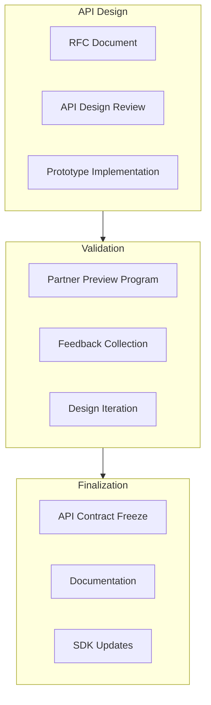

### 10.2 Implementation and Rollout

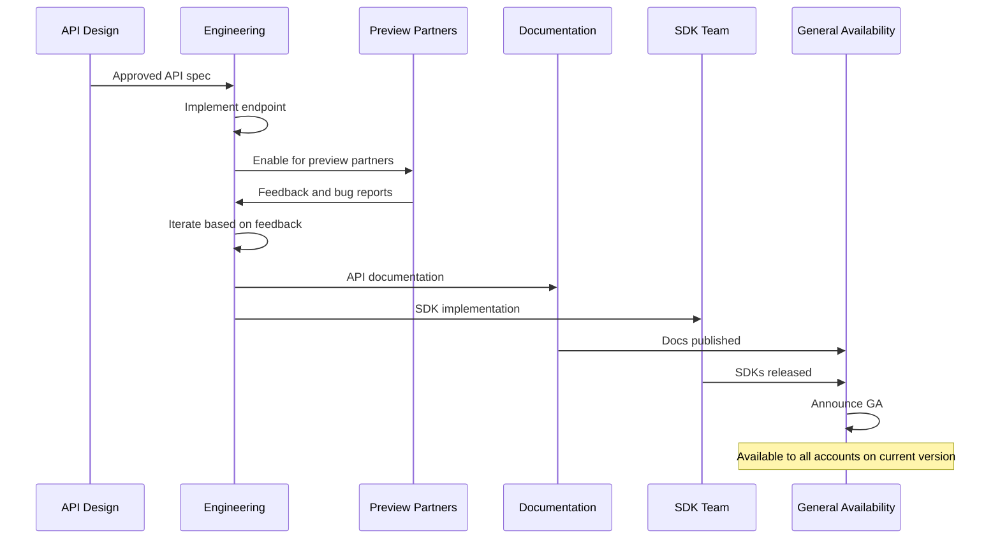

### 10.3 Version Management

| Aspect | Implementation |
|--------|---------------|
| New feature availability | Accounts on version ≥2026-01-28 |
| Backwards compatibility | Older versions don't see new fields |
| Documentation | Version-specific docs with migration guide |
| SDK support | New SDK versions required for new feature |

### 10.4 Webhook Integration

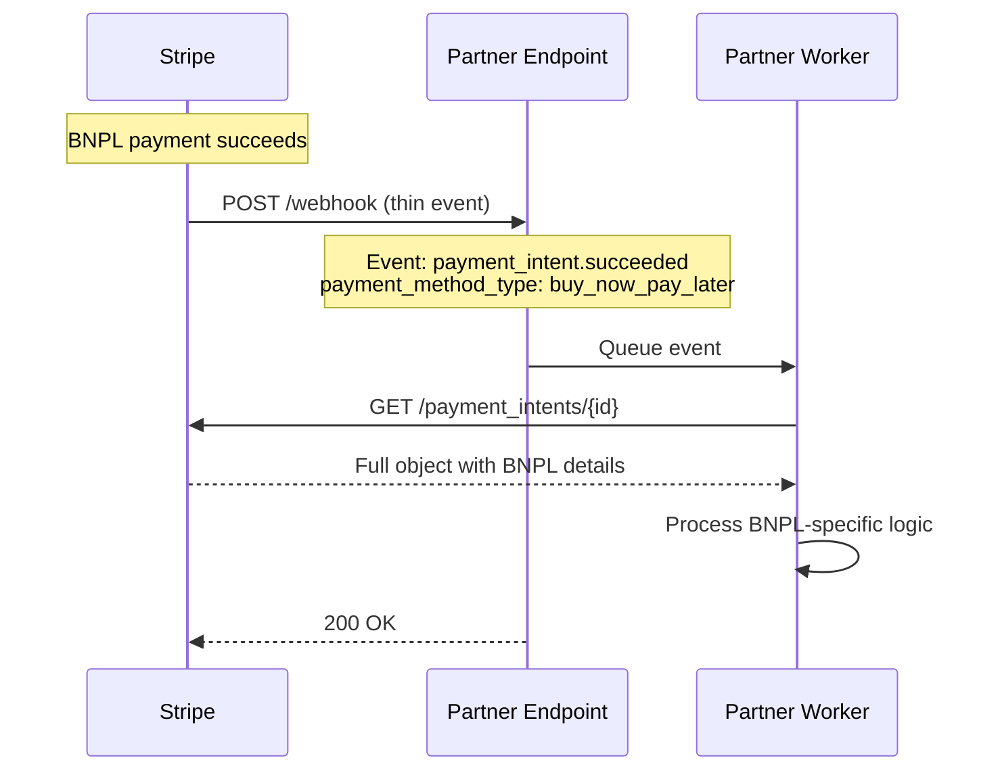

### 10.5 Failure Scenario (Deprecation Example)

**Scenario:** Old BNPL beta endpoint being deprecated.

**Expected Response:**
- 12-month deprecation notice in changelog and emails
- Deprecation warnings in API responses
- Migration guide with code examples
- Traffic monitoring to identify partners still on old endpoint
- Direct outreach to high-volume partners
- Sunset: Old endpoint returns 410 Gone with migration info

---

## 11. How a Senior vs Principal TPM Should Operate Here

### 11.1 Senior TPM Scope

**Owns a slice:** e.g., "BNPL payment method launch and partner migration."

| Responsibility | Deliverables |
|---------------|--------------|
| Launch coordination | Timeline, dependencies, go/no-go criteria |
| Partner preview program | Selection, feedback collection, iteration |
| Documentation | API docs, migration guides, SDK examples |
| Rollout metrics | Adoption rate, error rates, partner feedback |
| Migration support | Partner outreach, troubleshooting |

### 11.2 Principal TPM Scope

**Owns the multi-year roadmap:** API platform strategy and developer experience evolution.

| Responsibility | Deliverables |
|---------------|--------------|
| Versioning strategy | Long-term versioning policy and tooling |
| Deprecation framework | Standard deprecation timelines and processes |
| DX investment prioritization | SDK languages, documentation, tooling roadmap |
| API design standards | Consistency guidelines, review process |
| Platform metrics | TTI, error rates, migration velocity targets |

### 11.3 Interview Readiness

For interviews, you should be ready to:
- **Articulate the versioning strategy** (per-account versioning, backwards compatibility)
- **Walk through an API launch** from design to GA with partner migration
- **Quantify impact** in terms of:
  - Time-to-first-integration (hours, not days)
  - Error rate per 1k calls (target: &lt;0.1%)
  - % traffic on latest N versions (migration health)
  - Deprecation runway (12+ months standard)

---

## Key Takeaways

> **API as Primary Product**
>
> Stripe treats the API as the product, not an afterthought. Versioning, deprecation, rate limiting, and onboarding are all explicit, metric-driven programs.

> **Per-Account Versioning**
>
> APIs are versioned on the account/secret, not just in the URL. This lets the platform evolve without breaking existing integrations.

> **Conservative Deprecation**
>
> Any change that forces customers to touch code is a deprecation. Long runways, clear communication, and explicit opt-in are non-negotiable.

> **Webhooks as Separate System**
>
> Webhooks have their own contracts, reliability targets, and scaling behaviors. Design and operate them as a distinct data plane.

> **DX Investment Pays Off**
>
> Time-to-first-success, debugging speed, and integration quality are measurable outcomes of deliberate DX investment.
