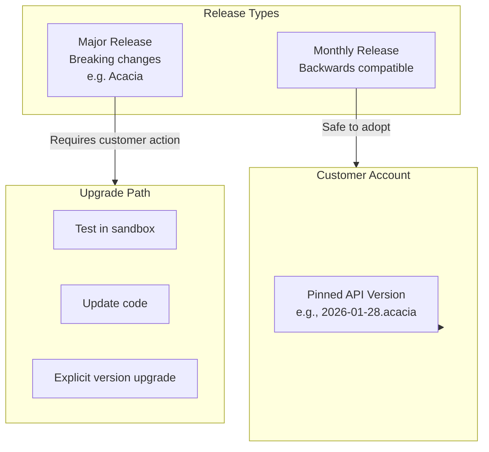
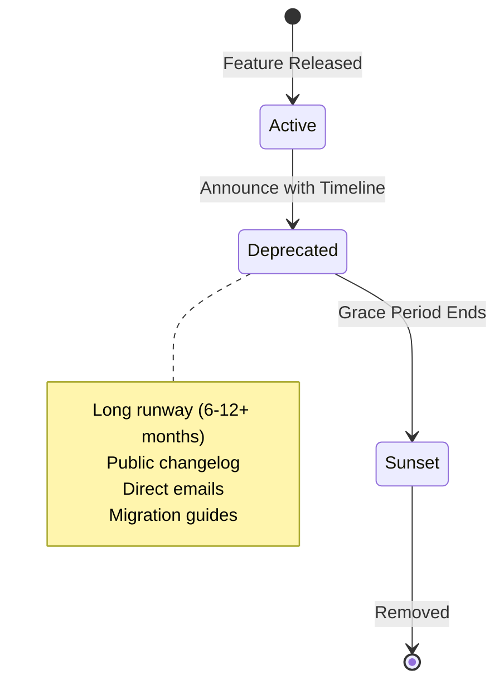
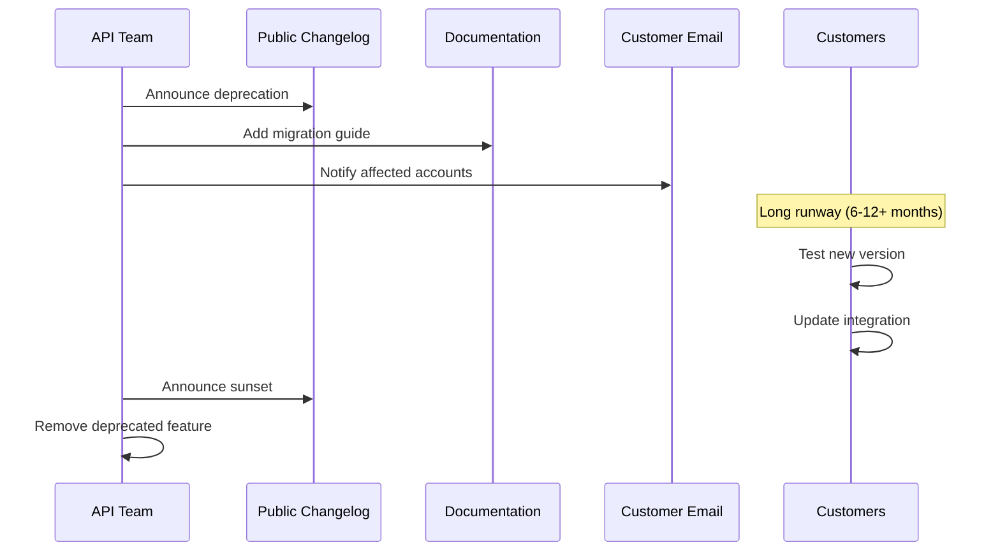
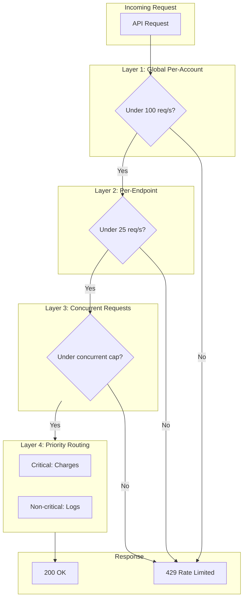
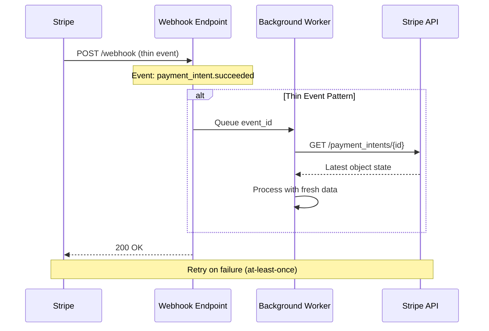
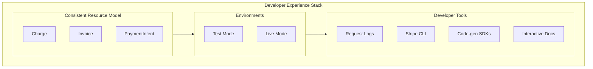
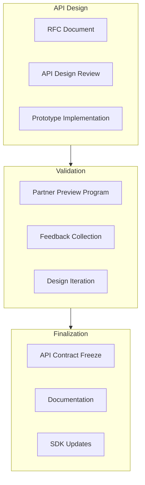
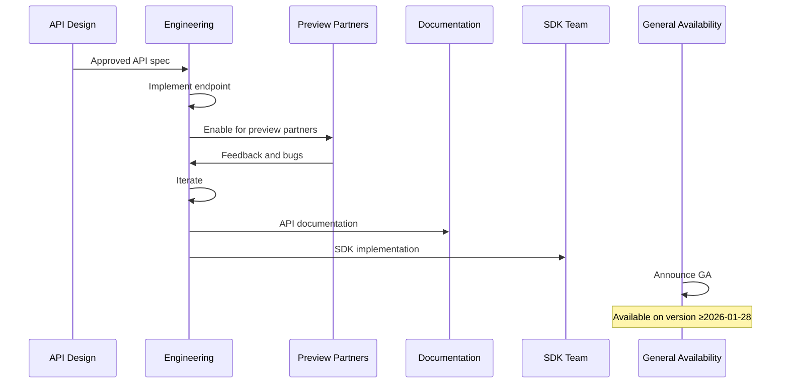

# API Platform & Developer Experience at Stripe Scale

## Why This Matters

Stripe's API is arguably the most developer-loved API in fintech. It's not an accident—it's the result of treating the API as the primary product, not an afterthought. Understanding Stripe's approach matters for TPMs because:

1. **APIs are products.** Versioning, deprecation, rate limiting, and documentation are all explicit programs with metrics.
2. **Breaking changes require explicit opt-in.** Stripe's per-account versioning lets them evolve the platform without surprising existing integrations.
3. **Developer experience drives adoption.** Time-to-first-success is a measurable outcome of deliberate DX investment.

This document covers Stripe's API platform philosophy: versioning discipline, deprecation policy, rate limiting, webhooks, and developer experience as a competitive advantage.

---

## 1. Versioning: Per-Account, Not Per-Request

**The problem:** APIs evolve. You need to add features, fix inconsistencies, and improve the developer experience. But breaking changes surprise existing integrations and damage trust.

**The solution:** Per-account versioning where each customer is pinned to a specific API version. Non-breaking changes ship continuously; breaking changes require explicit opt-in.

### 1.1 Date-Stamped API Versions

| Concept | Implementation | Example |
|---------|---------------|---------|
| **Version format** | Date + codename | `2026-01-28.acacia` |
| **Pinning** | Per-account, not per-request | Account settings |
| **What's versioned** | Field names, shapes, error formats, behavior | Response structure |
| **Breaking changes** | Require new version + customer opt-in | New major release |

### 1.2 Major vs. Monthly Releases

| Release Type | Breaking Changes | Customer Action Required |
|--------------|-----------------|-------------------------|
| **Major** (Acacia, Basil, etc.) | Yes | Must update and test |
| **Monthly** | No | Safe auto-upgrade within major |

### 1.3 SDK Versioning

SDKs follow Semantic Versioning (SemVer):

| Version Component | Meaning | Example |
|-------------------|---------|---------|
| Major | Breaking changes | v8.0.0 → v9.0.0 |
| Minor | New features (backwards compatible) | v8.1.0 → v8.2.0 |
| Patch | Bug fixes | v8.1.0 → v8.1.1 |

> **Key Insight:** APIs are versioned on the account/secret, not in the URL. This lets Stripe improve the platform without surprising existing integrations.

---

## 2. Deprecation Policy: Long Runways, Clear Communication

**The problem:** Every API change that forces customers to touch code is a cost to them. If you deprecate too fast or without warning, you damage trust.

**The solution:** A conservative deprecation stance with long runways, multiple communication channels, and explicit migration tooling.

### 2.1 What Constitutes "Breaking"

| Change Type | Breaking? | Requires New Version? |
|-------------|-----------|----------------------|
| Removing a field | Yes | Yes |
| Changing field type | Yes | Yes |
| Changing semantics | Yes | Yes |
| Changing auth requirements | Yes | Yes |
| Adding optional field | No | No |
| Adding new endpoint | No | No |

### 2.2 Deprecation Lifecycle

### 2.3 API Review Gate

Internally, Stripe uses a strict API review gate:

| Gate | Purpose | Reviewers |
|------|---------|-----------|
| Design review | Consistency, DX | Central API design group |
| Breaking change review | Long-term impact | API governance team |
| Deprecation review | Customer impact | Product + Engineering |

### 2.4 One-Way vs. Two-Way Doors

| Decision | Reversibility | Impact |
|----------|---------------|--------|
| Public API surface (URLs, resources, error schemas) | Very hard | One-way door |
| Versioning scheme | Very hard | One-way door |
| Rollout strategy, documentation | Can iterate | Two-way door |

---

## 3. Rate Limiting: Predictable and Layered

**The problem:** APIs need protection from abuse, but rate limits that feel arbitrary damage developer experience. Partners need to know what to expect.

**The solution:** Simple-to-understand rate limits, documented clearly, with multiple layers protecting different resources.

### 3.1 Rate Limit Tiers

| Limit Type | Live Mode | Test Mode | Notes |
|------------|-----------|-----------|-------|
| Global per-account | 100 req/s | 25 req/s | All endpoints combined |
| Per-resource | ~25 req/s | ~25 req/s | Per endpoint type |
| File uploads | Lower | Lower | Expensive operations |
| Listing endpoints | Lower | Lower | Query-heavy |

### 3.2 Layered Strategy

| Layer | Purpose | Implementation |
|-------|---------|----------------|
| **Layer 1** | Global per-account | Token bucket |
| **Layer 2** | Per-endpoint | Endpoint-specific limits |
| **Layer 3** | Concurrent requests | Prevent slow endpoint monopoly |
| **Layer 4** | Critical vs. non-critical | Prioritize charges over logs |

### 3.3 Client-Side Contract

Stripe establishes clear expectations with integrators:

| Requirement | Implementation |
|-------------|----------------|
| Handle 429 responses | Retry with backoff |
| Exponential backoff | 1s, 2s, 4s, 8s... |
| Idempotency keys | Prevent duplicate operations |
| Leave headroom | Use 90 req/s of 100 limit |

> **Philosophy:** Rate limits are part of the API contract, not a hidden enforcement mechanism. Document clearly and give partners tools to handle gracefully.

---

## 4. Webhooks: A Separate Data Plane

**The problem:** Push notifications (webhooks) have different reliability characteristics than request/response APIs. Events can be delayed, duplicated, or arrive out of order.

**The solution:** Treat webhooks as a separate data plane with its own contracts, retry semantics, and best practices.

### 4.1 Thin Event Model

| Concept | Implementation | Why |
|---------|----------------|-----|
| **Thin events** | Event contains type + ID, not full object | Avoids stale data |
| **Fetch latest** | Call API to get current state | Events can be delayed/duplicated |
| **Idempotent processing** | Dedupe on event ID | At-least-once delivery |

### 4.2 Delivery Guarantees

| Property | Guarantee | Partner Responsibility |
|----------|-----------|----------------------|
| Delivery | At-least-once | Handle duplicates |
| Ordering | Not guaranteed | Don't rely on order |
| Retries | On 4xx/5xx | Return 200 quickly |
| Timing | May be delayed | Fetch fresh state |

### 4.3 High-Volume Patterns

| Pattern | Purpose |
|---------|---------|
| Queue events | Don't block webhook response |
| Rate-limited workers | Stay under API limits |
| Idempotent handlers | Handle retries safely |
| Fetch fresh state | Avoid stale event data |

> **Key Point:** Webhooks have their own contracts, SLIs (latency, loss, duplication), and scaling behaviors. Design and operate them as a distinct system.

---

## 5. Developer Experience: Time-to-First-Success

**The problem:** API adoption depends on how quickly developers can get something working. A great API buried in bad docs fails.

**The solution:** Deliberate DX investment—consistent resource models, test mode, request logs, interactive docs, and multi-language SDKs.

### 5.1 Consistent Resource Model

| Principle | Implementation |
|-----------|----------------|
| Everything is a resource | `charge`, `invoice`, `payment_intent` |
| Predictable CRUD | GET, POST, PUT, DELETE |
| Normalized relationships | Consistent ID references |
| New products follow patterns | Same model everywhere |

### 5.2 Test Mode

| Feature | Benefit |
|---------|---------|
| Separate test keys | No risk to production |
| Test card numbers | Simulate scenarios |
| Test webhooks | Verify handlers |
| Clear UI separation | Obvious mode indicator |

### 5.3 Request Logs and Inspectability

Every API call (including from Dashboard) shows in Request Logs. Developers can:
- Perform actions in UI
- Inspect the underlying API call
- Replicate in code

### 5.4 Time-to-First-Success

The measurable outcome of DX investment:

| Metric | Stripe Target |
|--------|--------------|
| Time to first successful charge | Minutes, not hours |
| Debugging time | Fast (logs, consistent errors, docs) |
| Integration quality | High (test mode, examples, SDKs) |

---

## 6. North Star Metrics and Programs

### 6.1 North Star Metrics

| Metric | What It Measures |
|--------|------------------|
| **Time-to-first-integration (TTI)** | Onboarding friction |
| **Error rate per 1k calls** | API quality for new integrators |
| **% traffic on latest N versions** | Migration health |
| **Migration velocity** | Rate of safe version upgrades |
| **Webhook handling latency** | Partner integration quality |

### 6.2 Programs You'd Own

| Program | Components |
|---------|------------|
| **API Review + Design System** | Enforce consistency and DX |
| **Deprecation Framework** | Timelines, telemetry, bulk-migration tooling |
| **Rate Limit SLIs/SLOs** | Documented limits, partner guidance |
| **Webhook Reliability** | Delivery SLOs, retry policies, debugging tools |
| **Developer Tooling** | Test mode, logs, CLI, SDKs, docs |

### 6.3 One-Way Door Decisions

| Decision | Reversibility | Impact |
|----------|---------------|--------|
| Versioning strategy | Very hard | Affects all future changes |
| Resource model/naming | Very hard | Breaking changes expensive |
| Error schema | Hard | Client handling depends on it |
| Rate limit contract | Medium | Partners build to limits |

---

## 7. Reliability, SLOs, and Operations

### 7.1 SLIs/SLOs

| SLI Category | Metric | SLO Target |
|--------------|--------|------------|
| **API Availability** | Successful requests (non-4xx) | 99.99% |
| **API Latency** | p99 for charge creation | &lt;500ms |
| **Webhook Delivery** | First attempt success | 99.9% |
| **Webhook Latency** | p95 event to delivery | &lt;5 seconds |
| **Idempotency** | Correct handling | 100% |

### 7.2 Error Budgets

**Burned by:** API outages, elevated error rates, webhook failures, rate limit misconfigurations.

**Policy:** Monthly budget exceeded → freeze non-critical deployments, prioritize reliability.

### 7.3 Golden Signals

| Signal | What to Monitor |
|--------|-----------------|
| **Latency** | API response time, webhook delivery, SDK response |
| **Traffic** | Requests by endpoint, webhooks, new integrations |
| **Errors** | API errors by type, webhook failures, idempotency conflicts |
| **Saturation** | Rate limit headroom, webhook queue depth |

### 7.4 Chaos Scenarios

| Scenario | Expected Behavior |
|----------|-------------------|
| Database primary failure | Automatic failover, &lt;30s RTO, idempotency preserved |
| Webhook endpoint 5xx | Retry with backoff, dead-letter, dashboard visibility |
| Rate limit surge | Graceful 429, clear response, partner outreach |
| Duplicate requests | Idempotency keys ensure exactly-once |
| Version sunset | Traffic monitoring, partner outreach, deprecation warnings |

---

## 8. Trade-Off Matrix

| Decision | DX | Stability | Platform Complexity | Partner Friction |
|----------|-----|-----------|---------------------|------------------|
| Per-account versioning | High | High | High | Low |
| Long deprecation cycles | Medium | High | Medium | Low |
| Strict rate limits | Medium | High | Low | Medium |
| Thin webhook events | Medium | High | Low | Medium |
| Code-gen SDKs | High | Medium | High | Low |
| Test mode parity | High | High | High | Low |

---

## 9. Example Flow: New Payment Method Launch

**Scenario:** Launch "Buy Now Pay Later" with new endpoint, requiring versioning, docs, SDK updates, and partner migration.

### 9.1 API Design Phase

### 9.2 Rollout

### 9.3 Version Management

| Aspect | Implementation |
|--------|---------------|
| New feature availability | Accounts on version ≥2026-01-28 |
| Backwards compatibility | Older versions don't see new fields |
| Documentation | Version-specific with migration guide |
| SDK support | New SDK versions required |

### 9.4 Deprecation Example

**Old BNPL beta endpoint being deprecated:**

- 12-month notice in changelog and emails
- Deprecation warnings in API responses
- Migration guide with code examples
- Traffic monitoring for partners on old endpoint
- Direct outreach to high-volume partners
- Sunset: Old endpoint returns 410 Gone

---

## 10. Role-Specific Focus

### 10.1 Senior TPM Scope

**Owns a slice:** "BNPL payment method launch and partner migration."

| Responsibility | Deliverables |
|---------------|--------------|
| Launch coordination | Timeline, dependencies, go/no-go |
| Partner preview | Selection, feedback, iteration |
| Documentation | API docs, migration guides, examples |
| Rollout metrics | Adoption, errors, feedback |
| Migration support | Partner outreach, troubleshooting |

### 10.2 Principal TPM Scope

**Owns the multi-year roadmap:** API platform strategy.

| Responsibility | Deliverables |
|---------------|--------------|
| Versioning strategy | Long-term policy and tooling |
| Deprecation framework | Standard timelines and processes |
| DX investment prioritization | SDKs, docs, tooling roadmap |
| API design standards | Consistency guidelines, review process |
| Platform metrics | TTI, error rates, migration velocity |

### 10.3 Interview Readiness

Be ready to:
- **Articulate versioning strategy** (per-account, backwards compatibility)
- **Walk through API launch** from design to GA with migration
- **Quantify impact:**
  - Time-to-first-integration (hours, not days)
  - Error rate (&lt;0.1%)
  - % traffic on latest versions
  - Deprecation runway (12+ months)

---

## Key Takeaways

> **API as Primary Product:** Stripe treats the API as the product. Versioning, deprecation, rate limiting, and onboarding are explicit, metric-driven programs.

> **Per-Account Versioning:** APIs versioned on account/secret, not URL. Platform evolves without breaking existing integrations.

> **Conservative Deprecation:** Any change forcing customer code changes is a deprecation. Long runways, clear communication, explicit opt-in.

> **Webhooks as Separate System:** Own contracts, reliability targets, and scaling behaviors. Thin events + fetch fresh state.

> **DX Investment Pays Off:** Time-to-first-success, debugging speed, and integration quality are measurable outcomes.
