# API Security

This guide covers 6 key areas: I. The Strategic Landscape: API Security at "Planet Scale", II. Authentication (AuthN) and Authorization (AuthZ), III. Protecting the Edge: Gateways, Throttling, and Rate Limiting, IV. The Top Threat: BOLA (Broken Object Level Authorization), V. Data Privacy and Compliance Governance, VI. DevSecOps: Shifting Security Left.

## I. The Strategic Landscape: API Security at "Planet Scale"

At the Principal level, API security shifts from a purely technical implementation detail to a strategic risk management capability. In a "Planet Scale" environment (billions of requests per second), traditional perimeter security is insufficient. The strategic imperative is to assume the network is hostile and that the perimeter has already been breached. This necessitates a shift to **Zero Trust Architecture (ZTA)**, where trust is never implicit but must be continuously asserted via identity and context.

### 1. The Zero Trust Paradigm & The "Death of the Perimeter"

In legacy architectures, security was a "hard shell, soft center"—once an attacker bypassed the firewall, they had unrestricted lateral movement. At Mag7 scale, the internal network is treated with the same suspicion as the public internet.

*   **Technical Mechanism:** Every request, whether from an external mobile app or an internal inventory microservice, must be authenticated, authorized, and encrypted. This relies heavily on **Mutual TLS (mTLS)**, where both the client and server present certificates to verify identity before exchanging data.
*   **Mag7 Behavior:**
    *   **Google's BeyondCorp:** Google moved all internal applications to the public internet, protected by an identity-aware proxy. Access depends on user identity and device health, not VPN presence.
    *   **Amazon's API Mandate:** The famous "Bezos API Mandate" effectively forced a zero-trust mindset early on by requiring all teams to communicate solely via service interfaces, making internal APIs hardened enough to be externalized if necessary.
*   **Tradeoffs:**
    *   *Latency:* Performing handshake and encryption/decryption for every internal call adds millisecond-level latency. At scale, this accumulates (the "tail latency" problem).
    *   *Complexity:* Certificate management (rotation, revocation) becomes a massive operational burden, requiring automated infrastructure (e.g., SPIFFE/SPIRE).
*   **Business Impact:**
    *   **Capability:** Enables "Work from Anywhere" without VPN bottlenecks.
    *   **ROI:** Drastically reduces the "blast radius" of a breach. If one container is compromised, the attacker cannot pivot to the database without valid cryptographic credentials.

### 2. Traffic Strategy: North-South vs. East-West

A Principal TPM must architect distinct strategies for ingress traffic (North-South) versus inter-service traffic (East-West), as they have different risk profiles and latency requirements.

#### North-South (The Front Door)
This is traffic entering your ecosystem from the world. The primary defense here is the **API Gateway** (e.g., AWS API Gateway, Apigee, Azure API Management).
*   **Functions:** Rate limiting, WAF (Web Application Firewall), DDoS protection, and protocol translation (REST to gRPC).
*   **Mag7 Example:** **Netflix** uses **Zuul** (and now newer iterations) as an edge gateway to dynamically route traffic, perform canary testing, and shed load during high-traffic events (like a major show launch) to protect backend services.
*   **Strategic Choice:** Do you terminate SSL at the edge (faster) or carry it to the application (more secure)? Mag7 usually terminates at the edge for performance, then re-encrypts for the internal hop.

#### East-West (The Internal Mesh)
This is service-to-service communication. The volume here is often $100x$ that of North-South traffic.
*   **The Solution:** **Service Mesh** (e.g., Istio, Envoy, AWS App Mesh). Instead of coding security logic into every microservice, a "sidecar" proxy handles mTLS, retries, and circuit breaking.
*   **Mag7 Behavior:** **Microsoft** utilizes service meshes within Azure Kubernetes Service (AKS) to enforce policy governance across thousands of microservices without requiring developers to write security code.
*   **Tradeoffs:**
    *   *Resource Overhead:* Sidecars consume CPU/Memory. Across 100,000 pods, this cost is significant (millions of dollars in compute).
    *   *Debuggability:* It adds a network hop and complexity layer, making troubleshooting distributed traces harder.

### 3. Governance: The Threat of Shadow APIs

"Shadow APIs" (or Zombie APIs) are endpoints that are deployed but undocumented, unmaintained, or forgotten. They are the #1 attack vector at the enterprise level because they often lack current security patches.

*   **The Principal TPM Role:** You must enforce **API Governance**. This means "Shift Left" security—validating API contracts (OpenAPI/Swagger specs) in the CI/CD pipeline before code is ever deployed.
*   **Real-World Behavior:**
    *   **Meta (Facebook):** Uses automated static analysis and fuzz testing in their CI pipelines to detect data exposure risks in GraphQL schemas before they hit production.
    *   **Drift Detection:** Automated scanners that compare running traffic against the documented schema. If an API returns a field that isn't in the spec (e.g., `user_ssn`), the alert triggers immediately.
*   **Business Impact:**
    *   **Risk:** Prevents data exfiltration (e.g., the Optus or T-Mobile breaches often involve unauthenticated shadow endpoints).
    *   **Compliance:** You cannot be GDPR/CCPA compliant if you do not know where all your PII (Personally Identifiable Information) is flowing.

### 4. Bot Mitigation and Behavioral Analytics

Static rules (IP allow-listing) fail at Mag7 scale because IPs are ephemeral. Security must be behavioral.

*   **Technical Approach:** Analyzing the *intent* of the API call, not just the credential.
    *   *Velocity checks:* Is this user accessing 100 records per second?
    *   *Sequence checks:* Did the user call `GET /checkout` without calling `GET /cart` first? (Indication of a script).
*   **Tradeoffs:**
    *   *False Positives:* Aggressive blocking impacts real users (CX friction). A Principal TPM must tune the "sensitivity" dial based on the business value of the transaction. You tolerate more friction on a $10,000 transfer than on a "Like" button click.

## II. Authentication (AuthN) and Authorization (AuthZ)

This domain is the bedrock of the Zero Trust model. As a Principal TPM, you must advocate for the decoupling of Identity (AuthN) and Permissions (AuthZ). Conflating the two leads to "spaghetti code" security logic that is impossible to audit and fragile to change.

### 1. Authentication (AuthN): Identity at Scale

At Mag7 scale, AuthN is almost exclusively handled via **Federated Identity** using OAuth 2.0 and OIDC (OpenID Connect). The days of individual services managing their own username/password tables are over.

#### The JWT (JSON Web Token) Standard
For modern APIs, the result of a successful login is a JWT. This is a signed, base64-encoded JSON object containing claims (user ID, expiration, scopes).

*   **Mag7 Behavior:** When a user logs into YouTube (Google), the identity provider (IdP) issues a JWT. YouTube’s backend services do not check the password; they cryptographically validate the JWT signature to ensure it was issued by Google’s IdP.
*   **East-West Traffic (mTLS):** For internal service-to-service communication (e.g., Amazon’s Checkout Service calling the Pricing Service), Mag7 companies rely on **Mutual TLS (mTLS)**. Both services present x.509 certificates to authenticate each other. This is automated via service meshes (like Envoy or Istio) or proprietary infrastructure like Google’s ALTS.

#### Tradeoff: Stateless (JWT) vs. Stateful (Opaque Tokens)
This is a critical architectural decision you will face when designing new platforms.

| Feature | Stateless (JWT) | Stateful (Reference/Opaque Token) |
| :--- | :--- | :--- |
| **Mechanism** | Self-contained token. Validation requires CPU (crypto check) but no DB lookup. | Random string. Validation requires looking up the session in a database (Redis/Memcached). |
| **Latency** | **Low.** Ideal for high-scale, distributed microservices. | **Higher.** Adds a network hop to the DB for every API call. |
| **Revocation** | **Hard.** If a JWT is stolen, it is valid until it expires (usually 1 hour). You cannot "kill" it instantly without complex blocklists. | **Instant.** Delete the session in the DB, and the token is immediately invalid. |
| **Mag7 Preference** | **Standard.** Used for 90% of traffic due to scale requirements. Mitigated by short lifespans (15-60 min). | **High Security.** Used for sensitive operations (e.g., changing a password, accessing AWS root console). |

#### Business & ROI Impact
*   **CX:** Using JWTs reduces latency, making apps feel snappier.
*   **Risk:** The "Revocation Gap" of JWTs is a known risk. If an employee is fired, their access might persist for 30 minutes until the token expires. Principal TPMs must ensure this risk is accepted by Legal/InfoSec or mitigated via "Refresh Token" rotation policies.

### 2. Authorization (AuthZ): From RBAC to ReBAC

Once we know *who* the user is, we must decide *what* they can do.

#### The Evolution of Access Control

1.  **RBAC (Role-Based Access Control):** "Admins can delete." Simple, but fails at scale. If you have "Regional Admins," "Content Admins," and "Billing Admins," you end up with "Role Explosion."
2.  **ABAC (Attribute-Based Access Control):** "Users can delete if `department=IT` and `time=9am-5pm`." More flexible, defined by policies.
3.  **ReBAC (Relationship-Based Access Control):** "Users can edit this document if they are an `editor` of the `folder` that `contains` the document." This is the standard for Google Drive, Dropbox, and social networks.

#### Mag7 Behavior: Centralized Authorization Services
Mag7 companies do not let individual microservices write their own AuthZ logic (e.g., `if (user.role == 'admin')`). This creates inconsistency.

Instead, they implement **Centralized Authorization as a Service**.
*   **Example:** **Google Zanzibar**. This is the global authorization system behind YouTube, Drive, and Cloud. It stores billions of Access Control Lists (ACLs) and answers questions like "Can User A view Document B?" in milliseconds.
*   **Implementation:** Developers define policies (Policy as Code, often using OPA - Open Policy Agent). The microservice simply calls the AuthZ service: `Check(User, Action, Resource)`.

#### Tradeoff: Centralized vs. Decentralized Enforcement

| Approach | Pros | Cons |
| :--- | :--- | :--- |
| **Centralized (Zanzibar style)** | **Consistency & Auditability.** One place to check compliance. "Who has access to X?" is easy to answer. | **Latency & SPOF.** Every API call hits the AuthZ service. If AuthZ goes down, *everything* goes down. |
| **Decentralized (Sidecar/Library)** | **Speed.** Decisions happen locally within the pod/container. No network hop. | **Drift.** Hard to ensure all services are using the latest policy version. Hard to audit globally. |

#### Business & ROI Impact
*   **Capability:** Centralized AuthZ allows for features like "Universal Search" or "Share with Organization" to be built once and applied everywhere.
*   **Developer Velocity:** Developers stop writing security logic. They just register their resources. This accelerates TTM (Time to Market) for new services.

### 3. The "Confused Deputy" Problem & Scopes

A specific vulnerability Principal TPMs must understand is the "Confused Deputy." This occurs when a client (e.g., a 3rd party analytics tool) has a valid token for a user but uses it to access a service it shouldn't (e.g., the user's email).

*   **Solution:** **Scopes** and **Audience (`aud`)** claims.
*   **Mag7 Implementation:** When a user grants access to an app, the token is issued with specific scopes (e.g., `read:profile` only). Even if that token is valid, the Email Service will reject it if it lacks the `read:email` scope or if the `aud` claim doesn't match the Email Service's ID.
*   **Tradeoff:** Granular scoping increases the complexity of token management and the size of the token (increasing bandwidth usage).

---

## III. Protecting the Edge: Gateways, Throttling, and Rate Limiting

At the scale of a Mag7 company, the "Edge" is not a single firewall; it is a globally distributed network of Points of Presence (PoPs) that serves as the first line of defense. As a Principal TPM, you must treat the Edge as a **policy enforcement point**. This is where you strip SSL, validate tokens, and decide whether a request is worthy of consuming expensive downstream compute resources.

The goal is **entropy reduction**: The public internet is chaotic and malicious; your internal microservices should operate in a deterministic, clean environment.

### 1. The API Gateway: The Centralized Front Door

In a microservices architecture, services should not be directly exposed to the internet. The API Gateway acts as a reverse proxy that accepts all API calls, aggregates the various services required to fulfill them, and returns the appropriate result.

*   **Mag7 Implementation:**
    *   **Netflix:** Uses **Zuul** (and its successors) to dynamically route traffic based on device type (TV, Mobile, Web) and network conditions.
    *   **Google/Apigee:** Uses gateways to transform protocols (e.g., gRPC to REST/JSON) and enforce standardized policies across disparate internal teams.
    *   **Amazon:** AWS API Gateway handles the heavy lifting of version management and environment segregation (Dev/Test/Prod).

*   **Key Functionalities for TPMs:**
    *   **SSL Termination:** Decrypting HTTPS traffic at the edge to offload CPU-intensive work from internal app servers.
    *   **Request Routing:** Sending `/orders` to the Order Service and `/users` to the Identity Service.
    *   **Protocol Translation:** Converting legacy SOAP requests to REST, or HTTP/1.1 to HTTP/2.

*   **Tradeoffs:**
    *   **Latency vs. Security:** Every hop adds latency. A gateway adds a few milliseconds. At Mag7 scale, adding 10ms to a request flow processed billions of times a day has massive aggregate impact. You must weigh this against the security benefit of centralized policy enforcement.
    *   **Single Point of Failure (SPoF):** If the Gateway goes down, the entire platform is unreachable. Mag7 mitigates this via highly available, multi-region deployments with DNS failover.

*   **Business Impact:**
    *   **Time-to-Market:** Developers focus on business logic (e.g., "calculate shipping"), not cross-cutting concerns (e.g., "validate JWT signature"), accelerating feature release.
    *   **Governance:** Enforcing a global policy (e.g., "Deprecate TLS 1.0") is done in one place, rather than coordinating updates across 5,000 microservices.

### 2. Rate Limiting Strategies

Rate limiting is the practice of capping the number of requests a user or client can make in a given timeframe. For a Principal TPM, this is not just protection; it is a **business model enabler** (e.g., Monetization tiers: Free tier gets 100 req/hour, Enterprise gets 10k req/hour).

*   **Algorithms & Behaviors:**
    *   **Token Bucket:** Allows for "bursty" traffic. A user can make 10 requests instantly if they have tokens, but then must wait for the bucket to refill.
        *   *Use Case:* User interaction (loading a dashboard).
    *   **Leaky Bucket:** Smooths traffic out. Requests are processed at a constant rate, regardless of arrival rate.
        *   *Use Case:* Writing to a database or queue (Amazon SQS) to prevent write-thrashing.
    *   **Sliding Window:** The most accurate but computationally expensive method. It prevents the "boundary hopping" issue of fixed windows (where a user sends all quota in the last second of minute 1 and the first second of minute 2).

*   **Mag7 Real-World Example:**
    *   **Twitter/X:** Hard limits on "Tweets viewed per day." This was a controversial application of rate limiting to manage infrastructure costs vs. scraping bots.
    *   **Google Maps API:** Strict quotas based on billing. If a credit card fails, the rate limit drops to zero immediately.

*   **Granularity Tradeoffs:**
    *   **Per-IP:** Easy to implement but dangerous. In corporate environments (NAT), hundreds of users share one IP. Blocking the IP blocks the whole office.
    *   **Per-User (API Key/Token):** The gold standard for SaaS. Requires authentication first (which costs compute).
    *   **Global Service Limit:** Total requests the system can handle. Used as a last-resort "circuit breaker" to save the platform.

*   **Business Impact:**
    *   **Revenue Protection:** Prevents "noisy neighbors" (one heavy user degrading performance for everyone else).
    *   **Cost Management:** Predictable traffic patterns allow for better capacity planning and Reserved Instance purchasing (AWS/Azure).

### 3. Throttling and Load Shedding

While rate limiting is often a business rule (quotas), **throttling and load shedding** are survival mechanisms. When the system is overwhelmed, you must decide what to drop.

*   **Behavior:**
    *   **Throttling:** Intentionally slowing down responses (increasing latency) to signal the client to back off.
    *   **Load Shedding:** Returning HTTP 503 (Service Unavailable) immediately to shed excess traffic and preserve resources for in-flight requests.

*   **Mag7 Context (Amazon Prime Day):**
    *   During peak events, Amazon cannot scale infinite servers instantly. If the "Checkout" service is overwhelmed, the system might shed load from the "Reviews" service or "Recommendations" service first.
    *   **Prioritization:** Tier 1 traffic (Add to Cart, Checkout) is prioritized. Tier 3 traffic (browsing history, changing profile picture) is throttled or disabled.

*   **Tradeoffs:**
    *   **CX vs. Stability:** It is better to show a "Please wait" page to 10% of users (and let 90% transact) than to let the servers crash for 100% of users.
    *   **Fail Fast:** It is critical to reject the request *at the edge* (Gateway) cheaply, rather than letting it traverse deep into the stack before failing (wasting DB connections).

### 4. Web Application Firewalls (WAF) & DDoS Mitigation

The Gateway protects against volume; the WAF protects against payload attacks (SQL Injection, Cross-Site Scripting).

*   **Mag7 Strategy:**
    *   Mag7 companies do not just block attacks; they **fingerprint** them. If Google detects a botnet attacking Gmail, they update Edge rules globally to block that signature across Drive, Photos, and Search instantly.
    *   **Bot Management:** Distinguishing between a "good bot" (Google Crawler indexing your site) and a "bad bot" (credential stuffer testing leaked passwords).

*   **Tradeoffs:**
    *   **False Positives:** A strict WAF rule might block legitimate SQL-like syntax in a developer forum post.
    *   **Inspection Cost:** Deep Packet Inspection (DPI) requires significant CPU. Mag7 companies often implement "sampling" or only inspect suspicious traffic profiles to balance cost/latency.

## IV. The Top Threat: BOLA (Broken Object Level Authorization)

BOLA (formerly known as Insecure Direct Object Reference or IDOR) is consistently ranked as the #1 API security threat by OWASP. For a Principal TPM, BOLA represents the most dangerous intersection of **business logic** and **security architecture**. Unlike SQL injection, which can often be caught by a generic firewall (WAF), BOLA exploits valid syntax with invalid permissions.

It occurs when an API endpoint exposes a reference to an object (like a database ID) in the URL or payload, and the application fails to verify that the requesting user has ownership or specific permissions for that *specific* object.

### 1. The Anatomy of a BOLA Attack
Consider a standard RESTful call to retrieve an invoice:
`GET /api/v1/invoices/1005`

```mermaid
sequenceDiagram
    participant A as 🔓 Attacker
    participant API as API Server
    participant DB as Database

    Note over A,DB: Attacker owns Invoice #1005

    A->>API: GET /invoices/1005<br/>Token: Valid JWT
    API->>API: ✓ AuthN Check (Token valid)
    API->>DB: SELECT * WHERE id=1005
    DB-->>API: Invoice Data
    API-->>A: 200 OK (Own data)

    Note over A,DB: Attacker tries Invoice #1006

    A->>API: GET /invoices/1006<br/>Token: Valid JWT
    API->>API: ✓ AuthN Check (Token valid)
    API->>API: ❌ NO AuthZ Check!
    API->>DB: SELECT * WHERE id=1006
    DB-->>API: Invoice Data
    API-->>A: 200 OK (Other user's data!)

    Note over A,DB: 🚨 BOLA: AuthN passed, AuthZ missing
```

1.  **The Attack:** A logged-in user changes the ID in the URL from `1005` (their invoice) to `1006`.
2.  **The Failure:** The API validates the Access Token (AuthN is successful) but fails to check if the user associated with that token actually owns invoice `1006`.
3.  **The Result:** The API returns the data. The attacker then writes a script to iterate from `1000` to `100000`, scraping sensitive data.

**Mag7 Context:** At scale, this is not just about User A seeing User B's data. In a multi-tenant B2B environment (like AWS or Azure), BOLA could allow Tenant A (a startup) to view the compute instances or billing data of Tenant B (a Fortune 500 bank). This is an existential threat to the cloud platform model.

### 2. Real-World Mitigation Strategies at Mag7
Mag7 companies cannot rely on manual code reviews to catch every BOLA vulnerability across thousands of microservices. They employ systemic architectural patterns to mitigate this risk.

#### A. moving from Sequential IDs to UUIDs/GUIDs
Legacy systems often use auto-incrementing integers (1, 2, 3) for database primary keys. This makes enumeration attacks trivial.
*   **Mag7 Behavior:** Most modern services at Google or Netflix default to Universally Unique Identifiers (UUIDs) (e.g., `a0eebc99-9c0b...`) for public-facing resources.
*   **Tradeoff:**
    *   *Pros:* Makes resource enumeration mathematically improbable (guessing a UUID is impossible).
    *   *Cons:* UUIDs are larger (128-bit) and cause fragmentation in database indexes (B-Trees), potentially increasing storage costs and latency compared to integers.
    *   *Mitigation:* Use integers internally for DB joins but map them to UUIDs at the API edge layer.

#### B. Authorization at the Data Layer (The "Google Zanzibar" Model)
Relying on individual developers to write `if (user.id == invoice.owner_id)` in every controller is unscalable and error-prone.
*   **Mag7 Behavior:** Companies move authorization logic out of the application code and into a centralized authorization service or the data access layer. Google published a paper on **Zanzibar**, their global authorization system used by Drive, YouTube, and Cloud.
*   **Mechanism:** Instead of ad-hoc checks, the service queries a dedicated AuthZ engine: "Does User X have 'viewer' relation to Document Y?"
*   **Tradeoff:**
    *   *Pros:* Consistent policy enforcement across billions of objects; auditability.
    *   *Cons:* High complexity to implement; introduces a critical dependency (if Zanzibar is down, nobody can access anything).

### 3. Business & Product Impact

#### ROI and Operational Efficiency
*   **The Cost of Remediation:** Fixing BOLA often requires refactoring database schemas or API contracts. Discovering this post-launch is 100x more expensive than during design.
*   **Performance:** Implementing robust object-level checks adds latency. A Principal TPM must balance the "time-to-first-byte" metrics against the depth of authorization checks.

#### Customer Experience (CX) & Trust
*   **Data Leakage:** BOLA is the primary vector for "scraping" incidents. If a competitor scrapes your pricing data via BOLA, you lose competitive advantage. If a bad actor scrapes user emails, you face GDPR/CCPA fines (up to 4% of global revenue).
*   **Platform Integrity:** For platforms like the App Store or Facebook Developer Platform, BOLA in East-West traffic allows malicious 3rd party apps to access data they shouldn't, leading to scandals (analogous to Cambridge Analytica).

### 4. Implementation Guidance for TPMs
As a Principal TPM, you do not write the checks, but you define the **Definition of Done (DoD)** and the **Architecture Review** standards.

1.  **Standardize Identity Propagation:** Ensure the User ID (Subject) is securely propagated through the microservices chain (e.g., inside the JWT or a secure header), so deep-backend services can perform checks without re-authenticating.
2.  **Enforce "Secure by Design" Libraries:** Push for internal SDKs that require an `ownerID` parameter when fetching resources by ID. If the developer doesn't provide it, the build fails.
3.  **Automated Testing (DAST):** Integrate Dynamic Application Security Testing tools in the CI/CD pipeline that specifically fuzz API endpoints by swapping IDs to ensure 403 Forbidden is returned.

---

## V. Data Privacy and Compliance Governance

At the Principal level, Data Privacy is no longer a legal checklist handled by counsel; it is a **distributed systems engineering challenge**. In a Mag7 environment, the volume of data (petabytes per day) renders manual compliance impossible. You must treat privacy as a product feature with strict SLAs, architectural constraints, and observability requirements.

The strategic goal is shifting from "Reactive Compliance" (scrambling to delete data upon request) to "Privacy by Design" (architecture that enforces policy programmatically).

### 1. Data Taxonomy and Automated Discovery

Before data can be governed, it must be identified. In a microservices architecture with thousands of engineers spinning up new databases, "Shadow Data" is the primary risk.

*   **The Technical Mechanism:**
    *   **Sidecar Scanning:** Deploying sidecar proxies (like Envoy) or daemon sets that sample payload traffic to detect PII (Personally Identifiable Information) patterns (e.g., regex for credit card numbers, email addresses) in real-time.
    *   **Metadata Catalogs:** Enforcing a schema registry (e.g., Protobuf or Avro schemas) where fields must be tagged with privacy levels (Public, Confidential, PII, SPII) before deployment.
*   **Mag7 Example:**
    *   **Google:** Uses internal tools similar to Cloud DLP (Data Loss Prevention) to scan BigQuery and Spanner instances automatically. If a column looks like a Social Security Number but isn't tagged as such, the pipeline blocks the commit or alerts the security team.
    *   **Netflix:** Utilizes "Metacat" to manage metadata across diverse data stores (Hive, RDS, S3), allowing them to query *where* user data lives rather than asking teams manually.
*   **Tradeoffs:**
    *   *Latency vs. Security:* Inline scanning adds latency to write operations. Most systems opt for **asynchronous scanning** (scanning the logs/storage post-write), accepting a small window of risk for performance.
    *   *False Positives:* Over-aggressive regex classification can flag generic IDs as PII, blocking legitimate business processes.
*   **Business Impact:**
    *   **ROI:** Prevents "Dark Data" accumulation, reducing storage costs and liability surface area.
    *   **Capability:** Enables accurate "Data Maps" required for Article 30 of GDPR without manual audits.

### 2. Data Residency and Geo-Partitioning

Mag7 companies operate globally, but data often cannot. Laws like GDPR (Europe), LGPD (Brazil), and various data localization laws in India and China require specific data to stay within physical borders.

*   **The Technical Mechanism:**
    *   **Sharding by Geography:** The User ID includes a routing prefix or is looked up in a global directory service to pin the user's data to a specific AWS Region or Azure Geography.
    *   **Sovereign Clouds:** Physically isolated control planes where no data—including telemetry or logs—leaves the region.
*   **Mag7 Example:**
    *   **TikTok (Project Texas):** While not Mag7, this is the premier example of extreme residency. US user data is routed to Oracle Cloud infrastructure in the US, with strict firewalls preventing access from ByteDance engineers in China.
    *   **Microsoft:** Azure’s "EU Data Boundary" ensures that not only customer data but also pseudonomized system data (logs) stays within the EU.
*   **Tradeoffs:**
    *   *Resiliency vs. Compliance:* You cannot simply failover a German user's database to a US East replica if the German data center burns down. Disaster Recovery (DR) becomes significantly more expensive as you need in-region redundancy.
    *   *Global Analytics:* You cannot run a simple `SELECT *` across all users. You must implement **Federated Querying**, where compute travels to the data, aggregates results locally, and only returns the anonymized aggregate to headquarters.
*   **Business Impact:**
    *   **Market Access:** Failure to implement this results in being banned from operating in lucrative markets (e.g., EU, China).

### 3. The "Right to be Forgotten" (RTBF) and Deletion Pipelines

Deleting data in a highly consistent SQL database is easy. Deleting data in an eventually consistent, distributed architecture with data lakes, backups, and caches is an immense engineering hurdle.

*   **The Technical Mechanism:**
    *   **Crypto-Shredding:** Instead of finding and overwriting every instance of a user's data (which is I/O intensive), you encrypt each user's data with a unique key. To "delete" the user, you delete their key from the Key Management Service (KMS). The data remains but is mathematically unrecoverable.
    *   **Tombstoning & Compaction:** In Log-Structured Merge (LSM) trees (like Cassandra or RocksDB), you write a "tombstone" record. The actual data is removed only during the asynchronous compaction process.
    *   **Propagation Streams:** A deletion request enters a Kafka topic. All microservices (Billing, Shipping, Analytics) subscribe to this topic and execute local deletion logic.
*   **Mag7 Example:**
    *   **Meta (Facebook):** Due to the complexity of the social graph, Meta built a centralized privacy framework. When a user deletes their account, a "deletion event" propagates through the graph. However, for backups, they rely on a Time-to-Live (TTL) strategy—waiting for backups to naturally age out rather than scrubbing tape archives (which is technically infeasible).
*   **Tradeoffs:**
    *   *Hard Delete vs. Soft Delete:* Soft deletes (setting a flag `is_deleted=true`) are fast but risky for compliance. Hard deletes are expensive and can cause database fragmentation.
    *   *Backup Integrity:* If you restore from a backup taken 2 days ago, you accidentally restore the user who asked to be deleted yesterday. You must maintain a separate "suppression list" to re-delete users immediately after a restore.
*   **Business Impact:**
    *   **CX:** Users expect instant deletion, but systems may take up to 30 days. Managing this expectation via UI is a critical Product/TPM challenge.
    *   **Fines:** GDPR fines can reach 4% of global revenue. A broken deletion pipeline is a massive liability.

### 4. Differential Privacy and Data Utility

A Principal TPM must balance the Data Science team's need for data (to train ML models) with the Privacy team's mandate to minimize exposure.

*   **The Technical Mechanism:**
    *   **Differential Privacy (DP):** Adding mathematical noise (e.g., Laplace noise) to a dataset or query result. This guarantees that the output of a query is essentially the same whether any single individual is present in the dataset or not.
    *   **Federated Learning:** Training ML models locally on the user's device (Edge) and sending only the model weights (not the raw data) back to the central server.
*   **Mag7 Example:**
    *   **Apple:** Uses Federated Learning for Siri and QuickType. Your voice recordings and keystrokes stay on the iPhone; the phone learns your habits and sends an encrypted summary update to Apple to improve the global model.
    *   **Google Maps:** Uses DP to show traffic data. It aggregates location velocity from thousands of phones but adds noise so no one can reverse-engineer a specific person's trip from their home to a sensitive location (e.g., a medical clinic).
*   **Tradeoffs:**
    *   *Accuracy vs. Privacy:* The "Privacy Budget" (epsilon). The more privacy you enforce (more noise), the less accurate the ML model or analytics become. This requires a negotiated tradeoff between Product and Privacy stakeholders.
*   **Business Impact:**
    *   **Capability:** Enables high-value features (like "Popular Times" for restaurants) without violating user trust.

---

## VI. DevSecOps: Shifting Security Left

At a Principal level, "Shifting Left" is not simply about installing scanning tools in the CI/CD pipeline. It is an architectural and cultural transformation that moves security from a "Gatekeeper" model (blocking releases at the end) to a "Guardrail" model (providing immediate feedback to developers as they type or commit).

In the Mag7 environment, the scale of code velocity (thousands of deployments per day) makes manual security reviews impossible. Security must be automated, transparent, and idempotent.

### 1. The Automated Governance Layer (SAST, SCA, and Secrets)

The core mechanism of DevSecOps is the integration of automated checks into the PR (Pull Request) and Build stages. A Principal TPM must define the "blocking criteria" vs. "advisory criteria."

```mermaid
flowchart LR
    subgraph DEV ["Developer Workflow"]
        CODE["Code Commit"]
    end

    subgraph SCAN ["Security Scans (Parallel)"]
        SAST["SAST<br/>Code Vulnerabilities"]
        SCA["SCA<br/>Dependency CVEs"]
        SECRET["Secret Scan<br/>Leaked Credentials"]
    end

    subgraph GATE ["Policy Gate"]
        DECIDE{"High Severity?"}
    end

    subgraph RESULT ["Outcome"]
        BLOCK["🚫 Block Build"]
        WARN["⚠️ Warning Only<br/>Log to Dashboard"]
        DEPLOY["✓ Deploy"]
    end

    CODE --> SAST
    CODE --> SCA
    CODE --> SECRET
    SAST --> DECIDE
    SCA --> DECIDE
    SECRET --> DECIDE
    DECIDE -->|"Critical/High"| BLOCK
    DECIDE -->|"Medium/Low"| WARN
    WARN --> DEPLOY

    style BLOCK fill:#ffcccc
    style DEPLOY fill:#90EE90
```

*   **SAST (Static Application Security Testing):** Analyzes source code for vulnerabilities (e.g., SQL injection patterns) without executing it.
*   **SCA (Software Composition Analysis):** Scans open-source libraries and dependencies for known CVEs (e.g., Log4j).
*   **Secret Scanning:** Detects hardcoded API keys, tokens, or private keys before they enter the repository.

**Real-World Mag7 Behavior:**
*   **Google:** Uses a system called **Tricorder**. It integrates static analysis results directly into the code review tool (Critique). If a developer writes code that violates a security rule, the "Robot" comments on the specific line of code during the PR review, effectively blocking the merge until resolved or explicitly exempted by a security approval.
*   **Meta:** Uses **Sapienz** and extensive pre-commit hooks. They prioritize "autofix" capabilities—where the linter doesn't just complain but suggests the secure code patch.

**Trade-off Analysis:**
*   **Strict Blocking vs. Developer Velocity:** If you block builds on *every* potential finding, you halt development. SAST tools are notorious for False Positives.
    *   *Mag7 Approach:* Only block on "High Confidence / High Severity" findings. All others are non-blocking warnings logged to a dashboard for technical debt cleanup.
*   **Scan Time vs. Build Time:** Deep scans take hours.
    *   *Mag7 Approach:* Run "incremental" scans (only changed files) on PRs (blocking). Run "full" scans nightly or weekly (asynchronous).

**Business Impact & ROI:**
*   **ROI:** The NIST rule of thumb states that fixing a defect in the coding phase costs ~$80, while fixing it in production costs ~$10,000+. Shifting left is a direct cost-saving measure.
*   **CX (Developer Experience):** High false-positive rates erode trust in the security team. If the tool cries wolf, devs will find ways to bypass the pipeline.

### 2. Supply Chain Security (SLSA and SBOMs)

After the SolarWinds and Log4j incidents, Mag7 companies pivoted aggressively to securing the software supply chain. It is not enough to secure *your* code; you must verify the integrity of the build environment and the dependencies.

**The Concept: SBOM (Software Bill of Materials)**
An SBOM is a formal inventory of all components (libraries, modules) in your software.

**Real-World Mag7 Behavior:**
*   **Google & The SLSA Framework:** Google pioneered **SLSA (Supply-chain Levels for Software Artifacts)**. This framework ensures that:
    1.  The build is scripted and automated (no building from a dev's laptop).
    2.  The build runs on an ephemeral, isolated environment.
    3.  Provenance is authenticated (cryptographic signing of the binary).
*   **Microsoft:** Enforces "Component Governance." If a team uses an open-source library, the build pipeline automatically registers it. If a vulnerability is found in that library later, Microsoft can query the graph to see exactly which 500 services across Azure are using that specific version.

**Trade-off Analysis:**
*   **Security vs. Dependency Freshness:** Locking dependency versions ensures stability and prevents "typosquatting" attacks, but it leads to "dependency hell" where upgrading one library breaks the whole stack.
    *   *Actionable Guidance:* Implement automated dependency bot updates (e.g., Dependabot or Renovate) that open PRs automatically when a patch is available, running the test suite to verify compatibility.

### 3. Infrastructure as Code (IaC) Security & Policy as Code

In a cloud-native environment, infrastructure is defined in code (Terraform, CloudFormation, Kubernetes Manifests). Shifting left means scanning this configuration *before* resources are provisioned.

**Common Checks:**
*   Ensuring S3 buckets are not public.
*   Verifying encryption at rest is enabled.
*   Ensuring Security Groups do not allow `0.0.0.0/0` on port 22 (SSH).

**Real-World Mag7 Behavior:**
*   **Amazon (AWS):** Uses internal implementations of **OPA (Open Policy Agent)** or Guard logic. Before a CloudFormation template is executed, it passes through a policy engine. If the template requests an unencrypted database, the deployment is rejected with a specific policy error message.
*   **Netflix:** Uses a "Paved Road" approach. Instead of asking devs to configure security correctly, they provide pre-approved, secure-by-default templates. If you use the template, you skip the security review. If you go "off-road," you face manual scrutiny.

**Business Impact & ROI:**
*   **Capability:** Enables "Self-Service with Guardrails." Developers can provision infrastructure without waiting for a ticket-based approval from IT, provided they stay within the policy code.
*   **Risk Reduction:** Prevents the most common cloud breaches (misconfiguration) at the source.

### 4. Edge Cases and Failure Modes

A Principal TPM must anticipate where the "Happy Path" of DevSecOps breaks down.

1.  **The "Break Glass" Scenario:**
    *   *Situation:* Production is down. A hotfix is required immediately. The hotfix code triggers a medium-severity SAST warning, or the security scanner is offline.
    *   *Handling:* The pipeline must have a "Break Glass" capability (bypass controls). This action must trigger a P0 alert to the Security Operations Center (SOC) and require a mandatory retroactive audit within 24 hours.
2.  **Legacy Codebases (The "Brownfield" Problem):**
    *   *Situation:* You turn on a scanner for a 10-year-old monolith, and it finds 5,000 vulnerabilities.
    *   *Handling:* Do not block the build. Establish a "Baseline." Only block *new* vulnerabilities introduced after today. Manage the 5,000 existing issues via a burning-down SLA (Service Level Agreement) based on severity.

---

---

## Interview Questions

### I. The Strategic Landscape: API Security at "Planet Scale"

### Question 1: The Legacy Migration Challenge
**"We are acquiring a mid-sized company with a monolithic architecture and public-facing APIs that rely on simple API keys. We need to integrate them into our Mag7 Zero Trust ecosystem within 6 months. As the Principal TPM, how do you manage this migration without disrupting their existing business?"**

*   **Guidance for a Strong Answer:**
    *   **Strategy:** Do not "rip and replace." Propose the **Strangler Fig Pattern**.
    *   **Tactics:** Place a Mag7-standard API Gateway *in front* of their monolith immediately to handle AuthN/AuthZ and DDoS protection (wrapping the insecurity).
    *   **Identity:** Implement a token exchange pattern (swap their API key for a short-lived internal JWT at the gateway).
    *   **Risk Management:** Mention "Shadow API" scanning as step one to ensure you know what you are securing.
    *   **Tradeoff:** Acknowledge the latency added by the new gateway and how you would measure/mitigate it.

### Question 2: Balancing Security vs. Performance
**"Our streaming service is experiencing latency issues. Engineering proposes removing mTLS (Mutual TLS) between internal microservices to save 20ms per request, arguing that the perimeter firewall is sufficient. How do you evaluate this request and what is your recommendation?"**

*   **Guidance for a Strong Answer:**
    *   **The Stand:** Reject the removal of mTLS, citing "Defense in Depth" and the fallacy of the secure perimeter.
    *   **The Pivot:** Address the root cause (latency) without sacrificing security.
    *   **Technical Solutions:** Suggest optimizing the TLS handshake (using session resumption or TLS 1.3), using persistent connections (keep-alive) to reduce handshake frequency, or optimizing the sidecar resource allocation.
    *   **Business Context:** Quantify the risk. "Saving 20ms is valuable, but a lateral movement breach could cost us \$100M in trust and fines. Let's find the 20ms elsewhere (e.g., payload optimization, caching)."

### II. Authentication (AuthN) and Authorization (AuthZ)

### Question 1: Designing for Immediate Revocation
**"We are building a financial trading platform where security is paramount. We want to use JWTs for performance, but the CISO requires that we be able to revoke a user's access *immediately* if fraud is detected. How would you architect the AuthN/AuthZ layer to satisfy both requirements?"**

**Guidance for a Strong Answer:**
*   **Acknowledge the tension:** State clearly that JWTs are stateless by design, making immediate revocation difficult without turning them into stateful tokens.
*   **Propose a Hybrid Approach:**
    *   Use **Short-Lived Access Tokens** (e.g., 5 minutes) to minimize the vulnerability window.
    *   Implement **Reference Tokens** at the API Gateway level: The Gateway checks a high-speed cache (Redis) for a "Blocklist" or "Revocation List" before passing the request downstream.
    *   **Signal Propagation:** Discuss how the "Fraud Detection Service" publishes a "Revoke User X" event (via Kafka/SNS) that updates the Gateway's blocklist immediately.
    *   **Tradeoff Analysis:** Admit that the Gateway check introduces slight latency, but it's a necessary cost for the specific business requirement (financial security).

### Question 2: Migrating Legacy AuthZ
**"You are the TPM for a monolithic application that uses hardcoded RBAC logic (e.g., `if user.role == 'manager'`) scattered across 500,000 lines of code. You need to migrate this to a centralized Policy-as-Code engine (like OPA) to support new enterprise customer requirements. How do you manage this migration without breaking production?"**

**Guidance for a Strong Answer:**
*   **Phased Strategy:** Reject a "Big Bang" rewrite. Propose the **Strangler Fig Pattern**.
*   **Shadow Mode:** Deploy the new Policy Engine alongside the legacy logic. For every request, run both. Log discrepancies between the Legacy decision and the New Policy decision, but *enforce* the Legacy decision.
*   **Metrics & Cutover:** Only switch enforcement to the New Policy once the discrepancy rate hits 0%.
*   **Business Value:** Frame the answer in terms of enabling sales. The migration isn't just "cleanup"; it unlocks the ability to sell "Custom Roles" to Enterprise clients, directly impacting revenue.
*   **Fallback:** What happens if the Policy Engine fails? Define a "Fail Closed" strategy (deny all access) to prioritize security over availability.

### III. Protecting the Edge: Gateways, Throttling, and Rate Limiting

### 1. Designing Rate Limiting for a Global API
**Question:** "We are launching a new global API for a stock trading platform. We need to limit users to 10 requests per second to prevent abuse, but we also need to allow bursts during market open/close. The API is deployed across 5 global regions. How would you design the rate limiting architecture?"

**Guidance for a Strong Answer:**
*   **Algorithm Selection:** Propose the **Token Bucket** algorithm to handle the requirement for "bursts" (unlike Leaky Bucket).
*   **Distributed State Challenge:** Address the "Count Problem." If a user hits the US-East and EU-West regions simultaneously, how do we count the total?
    *   *Naive approach:* Sticky sessions (bad for availability).
    *   *Better approach:* Centralized high-performance store (e.g., Redis) to hold counters.
    *   *Principal approach:* Acknowledge that syncing Redis globally adds too much latency. Propose **Local vs. Global quotas** (e.g., 2 req/sec locally per region, asynchronously syncing to a global limit) or consistent hashing.
*   **Tradeoff:** Discuss Strong Consistency (accurate counting, high latency) vs. Eventual Consistency (faster, but user might slightly exceed limit). For stock trading, availability usually trumps strict quota precision.

### 2. The "Noisy Neighbor" Incident
**Question:** "You are the TPM for a multi-tenant SaaS platform running on Azure. One of your largest enterprise customers is running a load test without notifying us, causing high latency for all other customers on the same shard. The API Gateway is struggling. What is your immediate mitigation, and what is your long-term fix?"

**Guidance for a Strong Answer:**
*   **Immediate Mitigation (The "Bleeding"):**
    *   Identify the Tenant ID (via API Key/JWT).
    *   Apply an immediate **aggressive throttle or block** specifically for that Tenant ID at the Edge/Gateway level.
    *   Do *not* try to scale up the backend immediately (autoscaling takes time and might not solve database contention).
*   **Communication:** Contact the customer immediately (CX impact).
*   **Long-Term Fix (The Architecture):**
    *   **Bulkhead Pattern:** Isolate resources so one tenant cannot consume all threads/connections.
    *   **Tiered Rate Limiting:** Implement distinct limits for "interactive traffic" vs. "batch/load test traffic."
    *   **Governance:** Create a process where customers must schedule load tests (Business capability).

### IV. The Top Threat: BOLA (Broken Object Level Authorization)

### Question 1: Legacy Migration & BOLA
"You are the Principal TPM for a legacy billing service at a major cloud provider. The service uses sequential integer IDs (e.g., `/bills/500`) and has been flagged for high BOLA risk. The engineering team says migrating to UUIDs will require 6 months of downtime to re-index the petabyte-scale database and break all existing client integrations. How do you manage this risk without stalling the roadmap?"

**Guidance for a Strong Answer:**
*   **Reject the False Dichotomy:** Acknowledge that UUIDs are "security through obscurity" and do not actually fix the root cause (missing permission checks).
*   **Prioritize the Root Cause:** The immediate fix is implementing strict ACL (Access Control List) checks at the application layer, which requires no DB migration.
*   **Hybrid Approach (Strangler Fig Pattern):** Propose introducing a mapping layer or "salt" for public IDs for *new* objects while maintaining support for old IDs temporarily, but enforcing strict AuthZ on both.
*   **Business Continuity:** Emphasize that downtime is unacceptable. The solution must involve a rollout strategy (e.g., dual-write, shadow traffic) to verify the new AuthZ logic doesn't block legitimate users.

### Question 2: The Latency vs. Security Tradeoff
"We are designing a high-frequency trading API where every millisecond counts. The security team insists on calling a centralized Authorization Service (like OPA or Zanzibar) for every single 'Get Quote' and 'Place Order' call to prevent BOLA. This adds 20ms of latency, which is unacceptable for the product. How do you resolve this conflict?"

**Guidance for a Strong Answer:**
*   **Contextualize the Risk:** 'Get Quote' (public data) has a different risk profile than 'Place Order' (transactional). BOLA on public data might be irrelevant.
*   **Architecture Solution:** Propose **local caching** of authorization decisions (e.g., a sidecar pattern or edge validation) using short-lived tokens.
*   **Token capabilities:** Suggest embedding the scope/permissions directly into the JWT (if the payload size permits) so the service can validate the claim locally without an external network hop (stateless validation).
*   **Tradeoff Analysis:** Demonstrate the ability to negotiate. Perhaps 'Place Order' takes the 20ms hit for safety, while 'Get Quote' is optimized for speed with rate limiting instead of deep AuthZ.

### V. Data Privacy and Compliance Governance

### Question 1: Architecting a Global Deletion Pipeline
**"We are expanding our e-commerce platform to Europe. Design a system that handles 'Right to be Forgotten' (GDPR) requests. Our data is spread across SQL databases, data lakes (S3/Hadoop), and third-party SaaS tools (Salesforce). How do you ensure compliance within the 30-day window?"**

*   **Guidance for a Strong Answer:**
    *   **Architecture:** Propose an event-driven architecture (e.g., Kafka) where a "Delete Request" is the producer and all downstream systems are consumers.
    *   **The "Backup" Problem:** Explicitly address how to handle backups. Mention that scrubbing backups is impossible; instead, propose a "Re-filter" mechanism upon restore (checking a suppression list).
    *   **Third-Party Handling:** Discuss the need for API integrations to trigger deletions in Salesforce/Zendesk, not just internal DBs.
    *   **Verification:** Define a "Completion Receipt" mechanism where the system aggregates ACKs from all services to generate an audit trail proving the deletion occurred.
    *   **Crypto-shredding:** Suggest this for the Data Lake (S3) where modifying immutable files is costly/impossible.

### Question 2: Tradeoffs in ML Training vs. Data Minimization
**"Our Ads recommendation team wants to retain user clickstream data indefinitely to train better models. The Privacy/Legal team demands a 6-month retention policy to minimize risk. As a Principal TPM, how do you resolve this conflict technically and organizationally?"**

*   **Guidance for a Strong Answer:**
    *   **De-escalation:** Acknowledge both are valid business needs (Revenue vs. Risk).
    *   **Technical Compromise:** Propose **Data Degradation**. Keep raw PII-rich data for 6 months (hot storage). After 6 months, strip PII and move to anonymized IDs for long-term trend analysis (cold storage).
    *   **Advanced Tech:** Suggest Federated Learning or training on synthetic data generated from the real dataset, allowing the original data to be deleted while preserving the statistical patterns for the model.
    *   **Governance:** Establish a "Privacy Budget" for the ML team—if they want to keep data longer, they must prove the lift in ad revenue exceeds the calculated risk cost of a breach.

### VI. DevSecOps: Shifting Security Left

### Question 1: Implementation Strategy & Conflict Resolution
**"We have a legacy monolithic service critical to revenue that has never been scanned for vulnerabilities. The CISO wants to enforce a 'Zero Critical Vulnerabilities' policy immediately, blocking any build that fails. The Engineering Lead argues this will halt all feature releases for months. As the Principal TPM, how do you resolve this impasse and implement the security program?"**

**Guidance for a Strong Answer:**
*   **Acknowledge the tension:** Validate both the CISO's risk concern and Engineering's velocity concern.
*   **Reject the binary choice:** Do not simply say "Security comes first" or "Business comes first."
*   **Propose a Phased Strategy (The "Ratchet" approach):**
    1.  **Audit Mode:** Turn on scanners but *do not block*. Gather data to understand the volume of debt.
    2.  **Baseling:** Mark all existing issues as "Technical Debt" to be remediated over time (e.g., 20% of sprint capacity).
    3.  **The Stop-the-Bleeding Rule:** Block only on *net new* vulnerabilities. You cannot add *new* holes, even if you haven't fixed the old ones yet.
    4.  **SLA Definition:** Define timelines for fixing existing Highs (e.g., 30 days) vs. Criticals (e.g., 7 days).
*   **Metrics:** Measure "Time to Remediate" and "Scan False Positive Rate" to ensure the tooling isn't hurting developers unnecessarily.

### Question 2: Supply Chain Incident Response
**"A Zero-Day vulnerability is discovered in a widely used open-source logging library (like Log4j). Your VP asks you: 'Are we affected, where are we affected, and how fast can we patch it?' Describe the mechanisms you would have put in place beforehand to answer this in minutes, not days."**

**Guidance for a Strong Answer:**
*   **Focus on Asset Inventory (SBOM):** Explain that you cannot secure what you don't know you have. A strong answer relies on a centralized dependency graph or SBOM repository.
*   **Tooling:** Reference tools like Dependency-Track or internal artifact repositories (Artifactory/Nexus) that index dependencies.
*   **The "Big Red Button":** Describe a centralized mechanism to force-update dependencies or apply a WAF (Web Application Firewall) rule globally while patching occurs.
*   **Communication:** Outline the communication protocol (War Room setup) and how you differentiate between "Vulnerable Library Present" vs. "Vulnerable Library Actually Loaded/Exploitable" (Runtime analysis).

---

## Key Takeaways

- Review each section for actionable insights applicable to your organization

- Consider the trade-offs discussed when making architectural decisions

- Use the operational considerations as a checklist for production readiness
