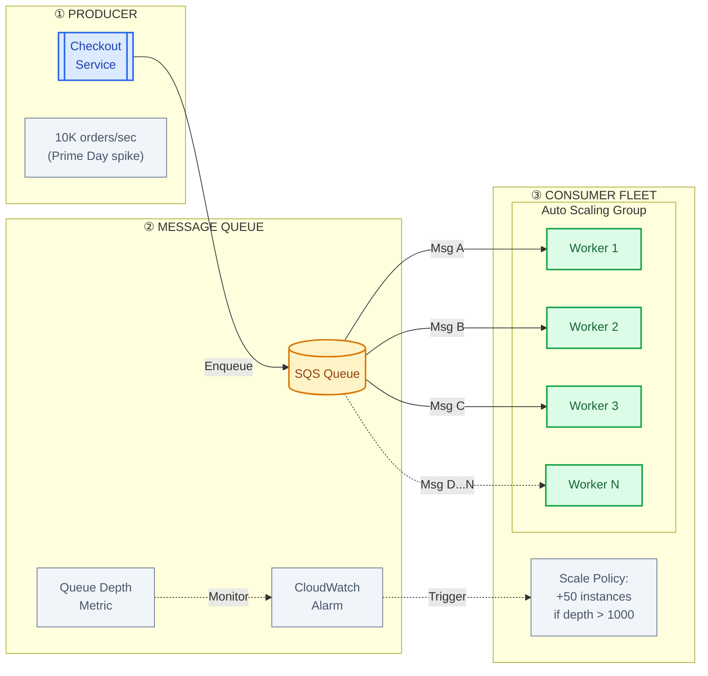
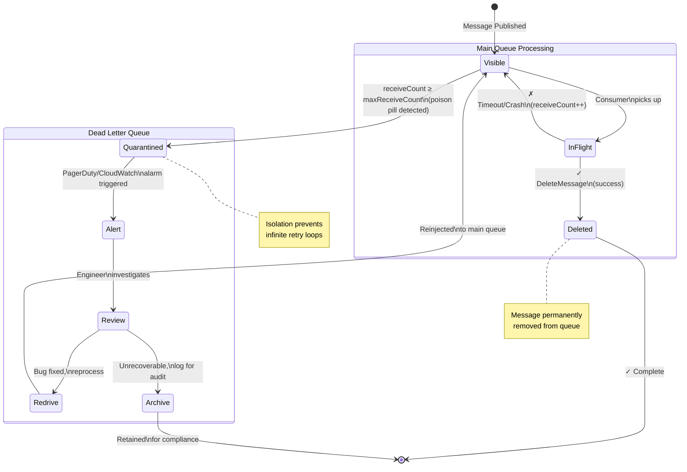
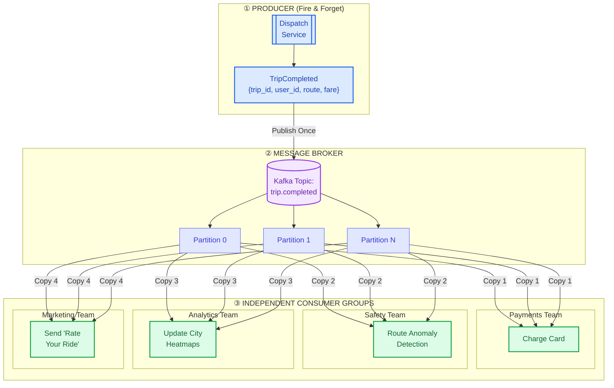
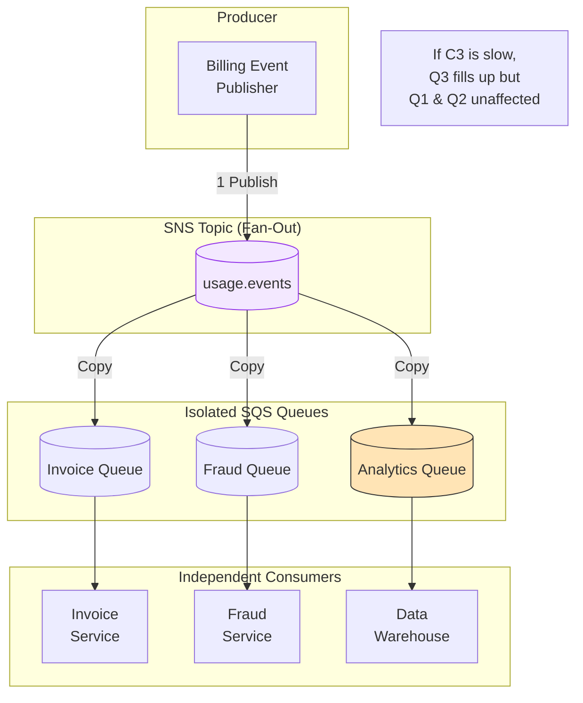

# Asynchronous: Queues vs. Pub/Sub

This guide covers 6 key areas: I. Strategic Context: Why Asynchrony Matters at Mag7 Scale, II. Message Queues (Point-to-Point), III. Publish/Subscribe (Pub/Sub), IV. Comparative Analysis & Technical Nuances, V. Strategic Impact: Business, ROI, and CX, VI. Summary Check-List for the Interview.

## I. Strategic Context: Why Asynchrony Matters at Mag7 Scale

At the Principal TPM level, the decision to adopt asynchronous architectures is rarely about "which tool is cooler" and entirely about **availability mathematics, cost optimization, and organizational decoupling**.

In a synchronous architecture (REST/gRPC), availability is multiplicative. If Service A calls Service B, which calls Service C, and each has 99.9% availability, the total system availability drops to ~99.7%. At Mag7 scale—where a service might have thousands of downstream dependencies—synchronous chains guarantee system-wide failure. Asynchrony breaks this temporal coupling, allowing the business to accept a request (revenue) even if the fulfillment mechanism (execution) is temporarily degraded.

### 1. Temporal Decoupling and Failure Isolation

The primary strategic driver for asynchrony is the requirement that the producer (e.g., the Checkout Service) and the consumer (e.g., the Inventory Service) do not need to be alive at the same millisecond.

*   **Real-World Behavior (Amazon Retail):** When a user clicks "Place Order" on Prime Day, the system does not synchronously lock the inventory row in the database, charge the credit card, and generate the shipping label. Doing so would create a massive database hotspot and a single point of failure. Instead, the order is accepted, persisted to a highly durable queue (like DynamoDB Streams or SQS), and the user sees "Order Received." The heavy lifting happens asynchronously.
*   **Tradeoffs:**
    *   *Pro:* **Resilience.** The Shipping Service can be completely down for maintenance, and Amazon can still take orders.
    *   *Con:* **Complexity in Error Handling.** If the credit card is declined 5 minutes later, the system must now reach back out to the user (via email/push) rather than showing a simple UI error immediately. This requires complex state management (Sagas).
*   **Business Impact:** Prevents revenue loss during downstream outages. It converts "hard downtime" into "processing lag," which is acceptable for most business functions outside of high-frequency trading.

### 2. Load Leveling and Resource Efficiency

Synchronous systems must be provisioned for peak load. If your peak traffic is 100x your average traffic (common in streaming or e-commerce), you are paying for idle capacity 99% of the time to survive the 1% spike. Asynchrony allows for **Load Leveling**.

*   **Real-World Behavior (Netflix/YouTube Ingestion):** When a major studio uploads a 4K movie, it triggers thousands of compute-intensive tasks (transcoding, subtitle extraction, thumbnails). If this were synchronous, the upload service would timeout. Instead, these jobs are dumped into a queue. Workers process them at a constant, efficient rate.
*   **Tradeoffs:**
    *   *Pro:* **CapEx/OpEx Reduction.** You provision consumers for the *average* load, not the *peak* load. You can process the backlog during off-hours using cheaper Spot Instances.
    *   *Con:* **Variable Latency.** There is no guarantee when the job will finish. The TPM must define and monitor SLAs (e.g., "99% of videos processed within 5 minutes") rather than simple response times.
*   **ROI Impact:** Massive reduction in cloud compute spend. It allows the infrastructure to run at higher utilization rates without risking outages during "Thundering Herd" events.

### 3. Organizational Scaling (Conway’s Law)

As Mag7 organizations grow, the communication overhead between teams becomes the bottleneck. Synchronous APIs enforce a strict contract: "I need you to give me X right now." Asynchronous Event-Driven Architectures (EDA) enable "Fire and Forget," decoupling team roadmaps.

*   **Real-World Behavior (Uber/Lyft Dispatch):** When a trip is completed, the core dispatch service publishes a `TripCompleted` event.
    *   Team A (Payments) listens to charge the card.
    *   Team B (Safety) listens to check for route anomalies.
    *   Team C (Analytics) listens to update city heatmaps.
    *   Team D (Marketing) listens to send a "Rate your ride" push.
    *   *Crucially:* The Dispatch team does not need to know Team D exists. Team D can change their logic or deploy new code without coordinating with Dispatch.
*   **Tradeoffs:**
    *   *Pro:* **Velocity.** Teams can deploy independently. New features can be built by simply "tapping into" the event stream without modifying the core legacy systems.
    *   *Con:* **Observability & Discovery.** It becomes difficult to know "who is listening to my messages?" or "why did this business process fail?" without sophisticated distributed tracing (e.g., AWS X-Ray, Google Cloud Trace) and an Event Schema Registry.

### 4. The Data Consistency Challenge

The most significant strategic risk in moving to asynchrony is the loss of ACID (Atomicity, Consistency, Isolation, Durability) transactions across services. You move to **BASE** (Basically Available, Soft state, Eventual consistency).

*   **The Principal's Dilemma:** A TPM must drive the business to accept that data will not be consistent everywhere instantly.
*   **Real-World Behavior (Social Media Feeds):** If you post a photo on Instagram, your followers might not see it for a few seconds (or minutes in extreme cases). The "Like" count might differ between the mobile app and the desktop web view. This "Eventual Consistency" is a deliberate choice to prioritize availability over strict correctness.
*   **Tradeoffs:**
    *   *Con:* **Developer Difficulty.** Engineers must write code that handles out-of-order messages, duplicate messages (idempotency), and race conditions.
    *   *Con:* **Customer Support Friction.** A user might perform an action and not see the result immediately, leading to "Is it broken?" support tickets. (Mitigated by Optimistic UI—showing the user a "success" state before the backend confirms it).

## II. Message Queues (Point-to-Point)

### 1. The Mechanics of Decoupling: "Competing Consumers"

At a Mag7 level, a single consumer process is rarely sufficient. The primary architectural benefit of a Message Queue is the implementation of the **Competing Consumers Pattern**.

In this model, multiple consumer instances (workers) monitor the same queue. When a message arrives, the queue manager delivers it to *one* of the available consumers. This allows the system to scale processing power linearly with the workload without modifying the producer.

**Mag7 Real-World Behavior:**
Consider Amazon’s order processing pipeline. During Prime Day, the "Checkout Service" (Producer) pushes millions of orders into an SQS queue. The "Fulfillment Service" (Consumer) is backed by an Auto Scaling Group.
*   **Metric:** CloudWatch monitors `ApproximateNumberOfMessagesVisible`.
*   **Action:** If the queue depth exceeds 1,000, the infrastructure automatically spins up 50 new EC2 instances to act as consumers.
*   **Result:** The checkout API never slows down, even if the warehouse systems are overwhelmed. The queue acts as a shock absorber.

**Tradeoffs:**
*   **Pros:** High scalability and availability. If a worker node crashes, the message is returned to the queue and picked up by another worker.
*   **Cons:** State management becomes difficult. Consumers must be stateless; they cannot rely on local memory from a previous transaction because the next message might go to a different server.

### 2. Reliability Primitives: Visibility Timeouts and Idempotency

For a Principal TPM, understanding **"At-Least-Once" delivery** is non-negotiable. Distributed queues rarely guarantee "Exactly-Once" delivery because the network is unreliable.

**The "Visibility Timeout" Mechanism:**
When a consumer picks up a message, the message is not deleted; it becomes "invisible" to other consumers for a set period (e.g., 30 seconds).
1.  **Success:** The consumer processes the task and explicitly sends a `DeleteMessage` command.
2.  **Failure:** The consumer crashes or times out. The 30 seconds expire. The message becomes "visible" again, and another consumer picks it up.

**Business & CX Impact:**
This mechanism ensures no data is lost (e.g., a customer is charged, but the order isn't shipped). However, it introduces the risk of **duplicate processing**. If a worker processes an order but crashes *milliseconds before* deleting the message, the order reappears in the queue.

**Critical Requirement - Idempotency:**
You must enforce idempotency on the consumer side.
*   *Bad:* `UPDATE account SET balance = balance - 100` (Running this twice charges the user $200).
*   *Good:* `UPDATE account SET balance = balance - 100 WHERE transaction_id NOT IN (processed_ids)` (Running this twice has no effect).

### 3. Ordering vs. Throughput: The FIFO Tradeoff

A common friction point between Product and Engineering is the requirement for ordered processing. Product often asks: "Can we ensure events are processed in the exact order they happened?"

**The Technical Reality:**
Standard queues (like Standard SQS) provide "Best-Effort Ordering." Messages might arrive out of sequence.
*   **FIFO Queues (First-In-First-Out):** Guarantee exact ordering.
*   **The Tradeoff:** FIFO queues significantly cap throughput (e.g., SQS FIFO is limited to ~3,000 transactions per second (TPS) with batching, whereas Standard SQS is nearly unlimited). FIFO also requires serialization, meaning you cannot easily have 100 competing consumers processing parallel tasks if those tasks must be sequential.

**Mag7 Strategy (Message Groups):**
To get both ordering and scaling, Mag7 systems use **Message Group IDs** (sharding).
*   **Example:** Facebook Messenger.
*   You don't need *global* ordering (User A's message doesn't need to be ordered relative to User B's). You only need ordering *per chat session*.
*   **Implementation:** Use the `ChatSessionID` as the partition key. Messages for Session A go to Consumer 1 (ordered); Messages for Session B go to Consumer 2 (ordered). This allows parallel processing across users while maintaining serial integrity within a specific user's context.

### 4. Handling Failures: The Dead Letter Queue (DLQ)

In a high-volume environment, "poison pill" messages are inevitable—malformed data that causes a consumer to crash or hang. Without intervention, a poison pill will be picked up, crash a worker, become visible again, be picked up by a new worker, crash that worker, and loop infinitely. This is a **Retry Storm**.

**The DLQ Solution:**
You configure a "Max Receive Count" (e.g., 5 attempts). If a message is picked up 5 times without being deleted, the queue automatically moves it to a side-queue called a Dead Letter Queue (DLQ).

**ROI & Operational Capability:**
*   **System Health:** Prevents one bad transaction from clogging the entire pipeline.
*   **Debugging:** Engineers set alerts on the DLQ depth. If the DLQ fills up, it indicates a bug in the new code deployment or an upstream data issue.
*   **Business Process:** A TPM defines the SOP for the DLQ. Do we re-drive (retry) these messages later? Do we manually inspect them? Or do we discard them and refund the customer?

### 5. Summary of Strategic Tradeoffs

| Feature Choice | Tradeoff / Cost | Business Impact |
| :--- | :--- | :--- |
| **Standard Queue** | High Throughput, Lower Cost, but **No strict ordering**. | fast processing for bulk items (e.g., image resizing, log ingestion). |
| **FIFO Queue** | Strict Ordering, but **Lower Throughput** & Higher Cost. | Essential for financial ledgers or inventory decrementing where sequence matters. |
| **Short Visibility Timeout** | Faster retries on failure, but **High risk of duplicates**. | Good for low-latency reqs; requires robust idempotency. |
| **Long Visibility Timeout** | Safer processing, but **High latency on recovery**. | If a server crashes, the system waits a long time before retrying. |

## III. Publish/Subscribe (Pub/Sub)

In the Pub/Sub model, a producer publishes a message to a **Topic**, and the messaging infrastructure distributes a copy of that message to every authorized **Subscription**. Unlike queues, where a message is consumed once by one worker, Pub/Sub facilitates a **1:N (Fan-Out)** relationship.

This architecture is the primary enabler of **extensibility** in large-scale systems. It allows teams to add new functionality (consumers) without modifying, redeploying, or risking the stability of the core transactional services (producers).

### 1. Architectural Patterns and Technologies

At the Principal level, you must distinguish between the two dominant implementations of Pub/Sub found at Mag7 companies: **Push-based (Ephemeral)** and **Log-based (Durable/Streaming)**.

#### A. Push-based / Ephemeral (e.g., AWS SNS, Google Cloud Pub/Sub push)
The broker immediately pushes messages to subscribers (often via HTTP/HTTPS webhooks or Lambda triggers).
*   **Behavior:** The system prioritizes low latency delivery. If a subscriber is offline, the system retries for a configured period, then Dead Letter Queues (DLQ) the message or drops it.
*   **Mag7 Usage:** Notification fan-out.
    *   *Example:* An Amazon CloudWatch Alarm triggers an SNS topic. That topic pushes to PagerDuty (for on-call engineers), a JIRA ticket creator, and a Slack channel simultaneously.
*   **Tradeoff:** Lower consumer control. If the consumer is overwhelmed, the broker keeps pushing (unless rate limits/backpressure are artificially engineered), potentially causing a DDoS on your own internal services.

#### B. Log-based / Streaming (e.g., Apache Kafka, AWS Kinesis)
The broker appends messages to a distributed log. Consumers "pull" messages by reading the log at their own pace, tracking their position via an "offset."
*   **Behavior:** Messages persist for a set retention period (e.g., 7 days) regardless of consumption. This allows for **Replayability**.
*   **Mag7 Usage:** Data lakes, Event Sourcing, and Activity Tracking.
    *   *Example:* LinkedIn tracks every profile view, click, and scroll. These events go into Kafka. A real-time consumer updates the "Who viewed your profile" widget, while a batch consumer (Hadoop/Spark) reads the same data hours later for relevance algorithm training.
*   **Tradeoff:** Higher operational complexity. Managing Kafka clusters (rebalancing partitions, managing Zookeeper/KRaft) requires significant engineering overhead compared to managed SNS.

### 2. Strategic Value and Business ROI

Implementing Pub/Sub is rarely a purely technical decision; it is an organizational decoupling strategy.

*   **Decoupling Teams (Conway’s Law):**
    *   *Scenario:* The "Checkout Team" owns the `OrderPlaced` event.
    *   *Without Pub/Sub:* If the "Fraud Team" wants to inspect orders, the Checkout Team must expose an API, change their code to call the Fraud service, and risk Checkout failing if the Fraud service times out.
    *   *With Pub/Sub:* The Checkout Team publishes `OrderPlaced` to a topic. The Fraud Team subscribes. The Loyalty Team subscribes. The Data Warehouse subscribes.
    *   *ROI:* drastically reduced coordination costs and faster Time-to-Market (TTM) for downstream features. The Checkout Team does not need to know who consumes their data.

*   **System Resilience:**
    *   If the "Loyalty Points Service" goes down, the "Checkout Service" is unaffected. The Checkout service successfully publishes the event and returns a 200 OK to the customer. The Loyalty service catches up on the backlog once it recovers.
    *   *CX Impact:* Higher availability for critical user flows (taking money) by isolating them from non-critical failures (awarding points).

### 3. Critical Tradeoffs and Challenges

A Principal TPM must anticipate the "Day 2" operational challenges of Pub/Sub.

#### A. Eventual Consistency
Pub/Sub is asynchronous. There is a lag between an event occurring and the consumer processing it.
*   **The Problem:** A user updates their profile (Producer). The page reloads and fetches the profile (Consumer). If the consumer hasn't processed the update event yet, the user sees stale data.
*   **The Fix:** "Read your own writes" caching strategies or UI optimism (showing the new data before the backend confirms it). This adds frontend complexity.

#### B. Message Ordering vs. Scale
In distributed systems like Kafka or Kinesis, global ordering is impossible at scale. Ordering is only guaranteed within a **Partition** (shard).
*   **The Constraint:** To ensure all updates for "User A" are processed in order (e.g., "Account Created" before "Account Deleted"), you must use a "Partition Key" (e.g., UserID) to force all User A's events into the same shard.
*   **The Risk:** "Hot Partitions." If Justin Bieber (User B) generates 1000x more events than average, the shard handling User B becomes a bottleneck, lagging behind while other shards sit idle.

#### C. Idempotency (The "At-Least-Once" Reality)
Mag7 infrastructure guarantees "At-Least-Once" delivery. "Exactly-Once" is computationally expensive and rarely true end-to-end.
*   **The Reality:** Network blips will cause the broker to send the same message twice.
*   **The Requirement:** Consumers must be idempotent. Processing the same "Deduct $50" message twice must result in only one $50 deduction.
*   **TPM Action:** You must verify that downstream teams have implemented idempotency keys (usually a UUID in the message header) before approving the architecture.

### 4. Real-World Mag7 Implementation Example: Netflix

**Scenario:** A user finishes watching "Stranger Things."

1.  **Publisher:** The playback service publishes a `TitleFinished` event to a Kafka topic.
2.  **Consumer A (User History):** Updates the "Watch History" database so the UI shows the red progress bar as complete.
3.  **Consumer B (Recommendation Algo):** Ingests the event to update the "Because you watched..." model.
4.  **Consumer C (CDN Prefetch):** Predicts the next likely episode and instructs the CDN to pre-cache that video file at the edge server closest to the user.

**Impact:** If Consumer B (Recommendations) fails, the user can still watch the next episode (Consumer C). The system degrades gracefully rather than failing catastrophically.

## IV. Comparative Analysis & Technical Nuances

### 1. The Decision Matrix: Intent, Retention, and Scale

At the Principal level, the choice between a Message Queue (e.g., SQS, RabbitMQ) and Pub/Sub (e.g., Kafka, Kinesis, SNS) is rarely about feature lists; it is about the **intent of the data** and the **lifecycle of the message**.

#### Command vs. Event
*   **Message Queues (Command-Centric):** Use when the intent is to trigger a specific action by a specific consumer type. The sender expects the job to be done.
    *   *Mag7 Example:* **Amazon Fulfillment.** When an order is placed, a message is sent to a specific fulfillment center queue. The intent is "Pack this box."
*   **Pub/Sub (Event-Centric):** Use when the intent is to broadcast a state change without knowledge of downstream effects.
    *   *Mag7 Example:* **Netflix User Activity.** A user pauses a video. This event is published. One stream updates the "Continue Watching" list; another updates the recommendation algorithm; a third logs operational metrics. The producer (video player) is unaware of these consumers.

#### Retention and Replayability
*   **Ephemeral (Queues):** Data is transient. Once processed and acknowledged, it is gone. If you deploy a bug in the consumer, the data processed during that bug is lost unless you have external logging.
*   **Durable (Log-based Pub/Sub):** Systems like Kafka or Kinesis store data for a retention period (e.g., 7 days).
    *   *Business Impact:* **Replayability.** If a Principal TPM launches a new pricing algorithm at Uber, they can point the new service to the *start* of the Kafka stream and replay the last week of trip data to backfill the database. This capability is critical for **feature velocity** and **risk mitigation**.

### 2. The "Fan-Out to Queue" Pattern

The most robust architectural pattern observed in Mag7 infrastructure is the combination of both: **Pub/Sub fan-out to Queues**.

Instead of connecting consumers directly to a topic, the Topic pushes messages to distinct Queues, and consumers read from their respective Queues.

*   **Architecture:** Publisher $\rightarrow$ SNS Topic $\rightarrow$ [SQS Queue A, SQS Queue B, SQS Queue C] $\rightarrow$ Consumers.
*   **Mag7 Implementation:** **AWS Billing.** When a resource usage event occurs, it hits an SNS topic. That topic fans out to:
    1.  A queue for the Invoicing Service.
    2.  A queue for the Fraud Detection Service.
    3.  A queue for the Data Warehouse.
*   **Tradeoffs & ROI:**
    *   **Isolation (High ROI):** If the Data Warehouse is slow or down, its queue fills up. The Invoicing Service continues processing at full speed. There is no "Head-of-Line" blocking across different business domains.
    *   **Throttling:** Each consumer can process at its own rate without affecting the publisher.
    *   **Cost:** Increases infrastructure complexity and slight storage costs, but saves millions in potential outage mitigation.

### 3. Ordering vs. Throughput (The CAP Theorem of Messaging)

One of the most common friction points between Product and Engineering is the requirement for "Strict Ordering."

*   **The Technical Constraint:** You cannot have global strict ordering *and* infinite horizontal scaling.
    *   To process messages in order (FIFO), you generally need to pin them to a single consumer thread. This creates a bottleneck.
*   **The Solution: Partitioning/Sharding.**
    *   In Kafka/Kinesis, you group messages by a "Partition Key" (e.g., `UserID`). All messages for User A go to Shard 1 and are ordered. Messages for User B go to Shard 2.
    *   *Mag7 Example:* **Facebook Messenger.** Messages within a single chat thread must be ordered (Shard Key = `ThreadID`). However, Thread A does not need to be ordered relative to Thread B.
*   **Business Tradeoff:**
    *   **Strict FIFO (SQS FIFO):** Lower throughput (e.g., 300-3,000 TPS). Higher latency. Guarantees business logic integrity for state-machine workflows.
    *   **Standard Queue/Stream:** Infinite throughput. Messages may arrive out of order. Requires the application to handle "stale" data (e.g., using timestamps to discard older updates).

### 4. Delivery Semantics and Idempotency

In distributed systems, networks fail. Acknowledgments get lost. This leads to the "Two Generals Problem." You must choose your guarantee:

1.  **At-Most-Once:** Fire and forget. Fast, cheap, but you might lose data. (Acceptable for: IoT sensor metrics, logs).
2.  **At-Least-Once (Industry Standard):** The system guarantees delivery, but may deliver the message twice.
    *   *Scenario:* A worker processes an order but crashes before sending the "Delete Message" command to the queue. The queue waits for the visibility timeout and re-delivers the message to a new worker.
3.  **Exactly-Once:** Extremely difficult and expensive to achieve at the infrastructure level (often marketing hype).

**The Principal TPM Approach: Idempotency**
Do not rely on the infrastructure for "Exactly-Once." Mandate **Idempotency** at the application layer.
*   **Definition:** Processing the same message multiple times results in the same system state.
*   **Mag7 Example:** **Stripe/PayPal Transaction Processing.**
    *   The payment processor receives a message: "Charge User \$50 (ID: `txn_123`)."
    *   The system checks a distinct Key-Value store (e.g., DynamoDB/Redis) for `txn_123`.
    *   If it exists, return "Success" immediately (do not charge again).
    *   If it does not exist, execute charge and write `txn_123`.
*   **CX Impact:** Prevents double-billing customers during retry storms.

### 5. Failure Management: Dead Letter Queues (DLQs) and Backpressure

How a system fails is more important than how it succeeds.

*   **Poison Pills:** A malformed message that causes a consumer to crash. If the message is returned to the queue, the consumer picks it up and crashes again. Infinite loop.
*   **The DLQ Strategy:**
    *   Configure a "Max Receive Count" (e.g., 3 tries).
    *   After 3 failures, move the message to a **Dead Letter Queue (DLQ)**.
    *   *Operational Process:* Engineers must monitor DLQs. A filling DLQ indicates a bug or a bad upstream data schema.
*   **Backpressure:**
    *   If a Queue grows faster than consumers can process, you have a backlog.
    *   **Auto-Scaling:** Scale consumers based on `ApproximateNumberOfMessagesVisible`.
    *   **Load Shedding:** If the queue is too full, the API Gateway should start rejecting new requests (HTTP 429) rather than accepting work it cannot finish.

## V. Strategic Impact: Business, ROI, and CX

At the Principal TPM level, architectural decisions regarding asynchronous patterns are rarely purely technical; they are fundamentally decisions about organizational velocity, cost structure (COGS), and customer trust. Choosing between a simple Queue (SQS) and a Pub/Sub model (SNS/Kafka) dictates how teams interact, how the company pays for compute, and how users perceive reliability.

### 1. Business Velocity and Organizational Decoupling

The most significant strategic impact of adopting Pub/Sub over direct Queues or synchronous calls is the decoupling of producer and consumer lifecycles.

*   **The Mag7 Scenario:** Consider the "Checkout" service at Amazon. When a user places an order, multiple downstream actions must occur: Inventory decrement, Fraud check, Shipping label generation, Email confirmation, and ML Recommendation updates.
*   **The Tradeoff:**
    *   **Point-to-Point (Queue/RPC):** If the Checkout team must explicitly push data to a Fraud Queue and a Shipping Queue, the Checkout team is coupled to the existence of those downstream services. Adding a new "Loyalty Points" service requires the Checkout team to modify their code to push to a new queue. This slows Time-to-Market (TTM).
    *   **Pub/Sub (Fan-out):** The Checkout team publishes an `OrderPlaced` event once. They do not know or care who listens. The Loyalty team can spin up a new service, subscribe to that topic, and backfill data without the Checkout team ever knowing.
*   **Business Impact:** Pub/Sub enables **Conway’s Law** to work in your favor. It allows large organizations (1,000+ engineers) to operate in parallel. Teams can launch features dependent on core data streams without blocking core platform teams.

### 2. ROI: Cost Optimization via Load Leveling

Asynchronous queuing is the primary lever for controlling cloud infrastructure costs (OpEx) during high-variance traffic events.

*   **The Mag7 Scenario:** YouTube Video Processing or Netflix Encoding. Uploads/ingestion are bursty (e.g., after a major global event).
*   **The Mechanism:** By placing a queue between the Ingestion Service and the Transcoding Service, you decouple the rate of ingestion from the rate of processing.
*   **ROI/Cost Impact:**
    *   **Without Queues:** You must provision compute capacity for **Peak** traffic. If peak is 10x average, you are paying for idle capacity 90% of the time.
    *   **With Queues:** You provision for **Average** traffic. During peaks, the queue depth grows (backlog). The consumers process at a constant, efficient rate.
    *   **Spot Instance Utilization:** This is the critical ROI unlock. Because queues allow for retries, you can use AWS Spot Instances or GCP Preemptible VMs (which are 60-90% cheaper) for the worker fleet. If a spot instance is reclaimed by the cloud provider, the message simply returns to the queue and is picked up by another worker. This strategy saves millions annually in Mag7 infrastructure budgets.

### 3. Customer Experience (CX): Latency vs. Consistency

The choice of pattern dictates the consistency model, which directly impacts CX. A Principal TPM must negotiate the SLA: "Do you want it fast, or do you want it guaranteed immediately?"

*   **The Mag7 Scenario:** A user "Likes" a post on Instagram or Meta.
*   **The Tradeoff:**
    *   **Synchronous:** The app waits for the database write to confirm before showing the red heart. This introduces latency and fails if the DB is under load.
    *   **Async (Fire and Forget):** The app shows the red heart immediately (Optimistic UI), sends a message to a queue, and processes the write later.
*   **CX Impact:**
    *   **Positive:** Perceived latency is near zero.
    *   **Negative (Edge Cases):** The "Ghost Notification." A user sees a notification, clicks it, but the async process hasn't finished replicating data to the read replica yet. The user sees "Content not found."
    *   **Strategic Decision:** For social features, eventual consistency (Async) is acceptable to gain engagement speed. For billing/payments (Stripe/Amazon Pay), strong consistency (Synchronous or strictly ordered Queues) is required despite the latency cost.

### 4. Skill Capabilities and Operational Complexity

Moving to async architectures increases the "Cognitive Load" on engineering teams. This impacts hiring profiles and operational maturity requirements.

*   **Observability Tax:** In a synchronous call, if it fails, you get an HTTP 500 immediately. In an async architecture, a message might be successfully published but fail silently in a consumer 10 minutes later.
*   **Capability Requirement:** You cannot run these systems without advanced Distributed Tracing (e.g., AWS X-Ray, Google Cloud Trace, OpenTelemetry).
*   **Failure Modes:**
    *   **Poison Pills:** A malformed message crashes a consumer. The message returns to the queue. Another consumer picks it up and crashes. This loops until the entire fleet is dead.
    *   **Mitigation:** Teams must implement Dead Letter Queues (DLQ) and Redrive Policies. This requires operational discipline, not just coding skill.
*   **Business Risk:** If a DLQ is not monitored, you are silently losing customer data (orders, emails, updates). This is a compliance and revenue risk.

### 5. Summary of Strategic Tradeoffs

| Feature | Queue (Point-to-Point) | Pub/Sub (Fan-Out) | Strategic Implication |
| :--- | :--- | :--- | :--- |
| **Coupling** | High (Producer knows Consumer) | Low (Producer is agnostic) | Pub/Sub increases org velocity; Queue increases control. |
| **Scaling** | 1:1 Scaling | 1:N Scaling | Pub/Sub supports rapid feature additions (Shadow IT/Experimentation). |
| **Data Integrity** | Message processed once (ideally) | Message processed by many | Queue is better for financial transactions; Pub/Sub for events/notifications. |
| **Cost** | Low overhead | Higher complexity/overhead | Queues allow for massive compute cost savings via load leveling. |

## VI. Summary Check-List for the Interview

This checklist serves as your mental "flight deck" before entering a System Design or Technical Program Management interview. At the Principal level, interviewers assess your ability to navigate ambiguity, enforce resilience, and align technical architecture with business outcomes. You must demonstrate that you do not just understand how queues and Pub/Sub work, but how they fail, how they cost money, and how they impact the customer.

### 1. The Pattern Selection Decision Matrix
When presented with a system design problem (e.g., "Design a notification system" or "Design a payment reconciliation engine"), immediately categorize the communication requirement using this matrix.

*   **Select Message Queues (Point-to-Point) When:**
    *   **Intent:** Work distribution. You need a specific job done exactly once by any available worker.
    *   **Mag7 Example:** **Amazon Fulfillment.** An order is placed. The "Pick Item" job is sent to SQS. Only *one* robot or warehouse worker should receive instructions to pick that specific item.
    *   **Tradeoff:** You gain load leveling and reliability but lose the ability to easily add new downstream behaviors without modifying the producer or adding complex routing logic.
*   **Select Pub/Sub (Fan-Out) When:**
    *   **Intent:** Event notification. Something happened, and you want to decouple the producer from who needs to know about it.
    *   **Mag7 Example:** **Google Docs.** A user edits a document. This event is published. Service A (Storage) saves it; Service B (Search Index) updates the index; Service C (Collaborator Notification) alerts other users. The editor service is unaware of A, B, or C.
    *   **Tradeoff:** You gain extreme decoupling and extensibility but introduce "Eventual Consistency" challenges and potential message storms if subscribers are not throttled.

### 2. The Resiliency & Failure Mode Checklist
A Principal TPM is expected to ask "What happens when this breaks?" before "How do we build this?" Ensure your design explicitly addresses these failure scenarios.

*   **Idempotency is Non-Negotiable:**
    *   **The Check:** In distributed systems, "at-least-once" delivery is the standard. Network blips will cause duplicate message delivery. Does the consumer handle duplicates gracefully?
    *   **Mag7 Implementation:** Using a distinct `transaction_id` or `idempotency_key` in the message payload. The consumer checks a Redis cache or DynamoDB table: "Have I processed ID `xyz` already?" If yes, ack and ignore.
    *   **Business Impact:** Prevents double-charging a customer (huge legal/CX risk) or triggering duplicate emails (brand erosion).
*   **Dead Letter Queues (DLQs) & Poison Pills:**
    *   **The Check:** What happens if a message is malformed or causes the consumer to crash repeatedly?
    *   **Mag7 Implementation:** AWS Lambda with SQS triggers. If the Lambda fails 3 times, the message is moved to a DLQ. An operational dashboard alerts an on-call TPM/Engineer to manually inspect the bad data.
    *   **Tradeoff:** DLQs preserve data but introduce operational toil. You must define an SLA for how quickly DLQs are reviewed.

### 3. Scaling & Ordering Semantics
Interviewers will push your design to the breaking point. You must know the cost of ordering.

*   **FIFO vs. Standard Ordering:**
    *   **The Check:** Do you strictly need First-In-First-Out?
    *   **Mag7 Reality:** Strict FIFO (e.g., AWS SQS FIFO) significantly limits throughput (often capped at 300-3,000 TPS) compared to standard queues (nearly unlimited TPS).
    *   **Strategic Choice:** If designing a chat app (WhatsApp/Messenger), ordering matters per *chat session*, not globally. Use partition keys (sharding by `chat_id`) to maintain order within a shard while scaling horizontally.
    *   **ROI Impact:** Choosing FIFO globally for a high-volume system will create a bottleneck that requires expensive re-architecture later.

### 4. Backpressure & Throttling
This distinguishes a Senior TPM from a Principal. How do you protect downstream systems?

*   **The Check:** If the Producer (e.g., Web Server) spikes 100x during Black Friday, will the Consumer (e.g., Legacy SQL Database) survive?
*   **Mag7 Implementation:** The Queue acts as a buffer. However, you must configure the **Consumer Concurrency**. Even if the queue has 10 million messages, you only spin up 50 worker instances to drain it at a rate the database can handle.
*   **Tradeoff:** Latency vs. Availability. You accept that during a spike, message processing will be delayed (higher latency), but the database stays online (availability).

### 5. Observability & Operational Excellence
You cannot manage what you cannot measure. A Principal TPM defines the metrics for success.

*   **Key Metrics to Mention:**
    *   **Queue Depth (Lag):** How many messages are waiting? High depth = need more consumers.
    *   **Age of Oldest Message:** How long has the "stuck" item been waiting? This directly correlates to Customer Experience (CX).
*   **Mag7 Behavior:** Setting automated auto-scaling rules based on Queue Depth. If `visible_messages > 1000`, add 5 EC2 instances.
*   **Business Capability:** This enables "Hands-off" operations, reducing the need for manual intervention during traffic surges.

### 6. Cost Implications (FinOps)
At Mag7 scale, inefficiency costs millions.

*   **The Check:** Are you polling efficiently?
*   **Mag7 Implementation:** Use **Long Polling** (keeping the connection open for 20s waiting for a message) rather than Short Polling (pinging every 100ms).
*   **ROI Impact:** Short polling an empty queue generates millions of API calls that cost money but deliver no value. Long polling reduces API costs by 90%+.

---

## Interview Questions

### I. Strategic Context: Why Asynchrony Matters at Mag7 Scale

### Question 1: The "Synchronous Trap" Migration
**Question:** "We have a legacy synchronous monolithic system for our payment processing that is hitting scaling limits and causing timeouts during peak traffic. You are the Principal TPM leading the decomposition into an asynchronous microservices architecture. However, the Finance team is blocking the project because they demand strong consistency (ACID) for all transactions. How do you handle this?"

**Guidance for a Strong Answer:**
*   **Acknowledge the Constraint:** Do not dismiss Finance. Money requires high integrity.
*   **Hybrid Approach:** Explain that asynchrony doesn't mean *everything* is async. The core ledger write can remain synchronous/ACID within a bounded context, while non-critical downstream actions (receipt emails, fraud scoring, analytics, rewards updates) move to async queues.
*   **Reconciliation:** Propose "Reconciliation Patterns" (e.g., nightly batch jobs that compare ledgers) as a safety net, which is standard in financial systems.
*   **Idempotency:** Emphasize that the new async consumers must be idempotent (handling the same payment message twice without charging the user twice) to ensure data integrity.

### Question 2: Handling the "Poison Pill"
**Question:** "In a high-volume asynchronous system you designed, a specific message format change causes the consumer service to crash every time it tries to process a message. Because the message isn't acknowledged, the queue puts it back at the front, causing the consumers to crash in an infinite loop (a 'Poison Pill'), bringing down the entire processing pipeline. How do you design the system to prevent this, and how do you recover operationally?"

**Guidance for a Strong Answer:**
*   **Dead Letter Queues (DLQ):** The candidate must mention DLQs. After $N$ failed attempts (max delivery count), the message should be moved to a side queue (DLQ) so the main processing line can continue.
*   **Alerting & Playbooks:** A Principal TPM ensures there is an alert on DLQ depth. If the DLQ fills up, an on-call engineer is paged.
*   **Redrive Policy:** Discuss the operational capability to "Redrive" messages. Once the bug in the consumer is fixed, the messages in the DLQ should be inspectable and re-injectable into the main queue for processing.
*   **Schema Validation:** Prevention involves strict schema validation (e.g., Protobuf/Avro) at the producer level to prevent malformed messages from entering the pipe in the first place.

### II. Message Queues (Point-to-Point)

**Q1: We are designing a payment processing system for a flash sale event. The Product team insists that we must process payments in the exact order they are received to ensure fairness. However, the anticipated load is 50,000 transactions per second (TPS), which exceeds the limit of our cloud provider's FIFO queue offering. How do you approach this architecture?**

*   **Guidance for a Strong Answer:**
    *   **Challenge the Requirement:** Does *global* fairness actually matter? Or is it fairness *per inventory SKU*? (It is usually the latter).
    *   **Proposed Architecture:** Suggest sharding/partitioning the queue based on `InventoryID` or `Region`. This allows parallel FIFO queues (e.g., 20 queues handling 2,500 TPS each).
    *   **Tradeoff Awareness:** Acknowledge that while this solves throughput, it adds complexity to the consumer logic (managing multiple queue listeners) and doesn't solve global fairness (User A buying a toaster isn't ordered against User B buying a TV), but validates that global fairness is irrelevant to the business goal.

**Q2: You notice that the "Order Fulfillment" queue has a growing backlog (latency is increasing), but the CPU utilization on the consumer worker fleet is low (under 10%). Adding more consumers isn't fixing the problem. What is likely happening, and how do you investigate?**

*   **Guidance for a Strong Answer:**
    *   **Identify the Bottleneck:** If the queue is full but workers are idle, the bottleneck is *downstream*. The consumers are likely blocked waiting on I/O (e.g., a slow database write or a 3rd party API call to a shipping provider).
    *   **The "Anti-Pattern":** Adding more consumers here is actually dangerous; it will put *more* pressure on the already struggling downstream database/API.
    *   **Resolution:** Investigate dependency latencies. Implement backpressure or circuit breakers. If the downstream dependency is a 3rd party API with rate limits, the queue is functioning correctly as a buffer, and the business needs to accept the latency or pay for higher API limits.

### III. Publish/Subscribe (Pub/Sub)

### Question 1: Handling "Poison Pills"
"We are designing a payment processing system using Pub/Sub. A specific malformed message is causing the consumer service to crash every time it tries to process it. Because the service crashes and restarts, it reads the same message again, creating an infinite crash loop. As a TPM, how would you architect the system to handle this 'poison pill' without stopping all payment processing?"

**Guidance for a Strong Answer:**
*   **Identify the Mechanism:** The candidate should immediately suggest a **Dead Letter Queue (DLQ)** strategy.
*   **The Logic:** Configure the consumer to retry a specific message a fixed number of times (e.g., 3 retries). If it fails 3 times, the system should acknowledge the message to remove it from the main topic and side-load it into a separate DLQ storage.
*   **Operational Process:** It is not enough to just store it. The answer must include an alerting mechanism (PageDuty) for engineers to manually inspect the DLQ, fix the bug/data, and potentially "redrive" (re-inject) the message later.
*   **Business Continuity:** Emphasize that this strategy allows the remaining 99.9% of valid payments to process without latency while the bad message is isolated.

### Question 2: Migration and Data Integrity
"We are migrating a monolithic e-commerce application to microservices using an event-driven Kafka architecture. We found a bug in the 'Inventory Service' consumer that has been miscalculating stock levels for the last 48 hours. How do we fix the data without taking the system down?"

**Guidance for a Strong Answer:**
*   **Leverage Log Durability:** The candidate should recognize the unique advantage of log-based Pub/Sub (Kafka/Kinesis). The events (Orders) are immutable and still exist in the log (assuming retention is >48 hours).
*   **The Offset Reset:** Explain the "Replay" capability.
    1.  Deploy the code fix to the Inventory Service consumer.
    2.  Stop the consumer.
    3.  Rewind the consumer's "Offset" (pointer) to a timestamp 48 hours ago.
    4.  Restart the consumer.
*   **Idempotency Check:** The candidate *must* mention idempotency. Replaying 48 hours of data means reprocessing transactions that may have already partially succeeded. The system must recognize these are duplicate events and update the state correctly without double-counting (e.g., using `UPSERT` logic rather than `INSERT`).
*   **Parallel Consumer (Advanced):** A Principal-level answer might suggest spinning up a *new* consumer group with the fix to reprocess the data into a temporary table, verifying the results, and then swapping the data source, to avoid lag on the live system.

### IV. Comparative Analysis & Technical Nuances

**Question 1: The "Ordering vs. Scale" Tradeoff**
"We are building a stock trading platform. We need to process millions of trades per second, but for any specific user, their trades *must* be processed in the exact order they were executed to calculate balances correctly. How would you architect the messaging layer? Why not use a standard SQS queue?"

*   **Guidance for a Strong Answer:**
    *   **Identify the constraint:** Standard SQS does not guarantee order; SQS FIFO has throughput limits that might bottle-neck "millions of trades."
    *   **Propose Partitioning:** Use a streaming platform (Kafka/Kinesis) partitioned by `UserID`. This ensures all trades for `User A` land in the same shard and are processed sequentially by the same consumer instance, guaranteeing order.
    *   **Address the "Hot Shard" problem:** Acknowledge that if one institutional trader executes high volumes, that specific shard might lag. Discuss mitigation (splitting high-volume users).
    *   **Business Impact:** Explain that this approach balances data integrity (crucial for FinTech) with system-wide scalability.

**Question 2: Handling Partial Failures in Fan-Out**
"You have a 'New User' event that fans out to three services: Welcome Email, Analytics, and Account Provisioning. The Account Provisioning service is down. We cannot lose the user sign-up data, but we don't want to stop sending Welcome Emails. Describe the architecture to handle this."

*   **Guidance for a Strong Answer:**
    *   **Reject simple Pub/Sub:** If consumers read directly from the topic and one blocks/fails, it can complicate the offset management for others (depending on the tech).
    *   **Propose Fan-out to Queue:** Topic $\rightarrow$ Queue A (Email), Queue B (Analytics), Queue C (Provisioning).
    *   **Failure Isolation:** Explain that Queue C will fill up while Provisioning is down. Queue A and B continue processing.
    *   **Recovery:** Once Provisioning is fixed, it drains Queue C. No data is lost, and CX (Email) was preserved.
    *   **Bonus:** Mention setting alerts on Queue C's depth (Age of Oldest Message) to trigger an incident response.

### V. Strategic Impact: Business, ROI, and CX

**Question 1: The "Thundering Herd" & Cost Optimization**
"We are designing the notification system for a flash sale event (like Prime Day). We expect 50 million users to qualify for a notification at 9:00 AM sharp. If we trigger these synchronously, we will crash our downstream carriers. How would you architect this using async patterns to ensure delivery within 30 minutes while minimizing infrastructure costs? Explain your choice of technology and the specific tradeoffs regarding user experience."

*   **Guidance for a Strong Answer:**
    *   **Architecture:** Should propose a Pub/Sub (to trigger the event) feeding into partitioned Queues (SQS/Kafka) to shard the workload.
    *   **Cost vs. Speed:** Discuss "Rate Limiting" consumers. We don't want to auto-scale consumers to infinity (cost prohibitive); we want a fixed fleet size that churns through the backlog in exactly 29 minutes.
    *   **CX:** Acknowledge that "9:00 AM" notifications might arrive at 9:15 AM for some users. Discuss if this latency is acceptable for the business logic (fairness) and how to handle "expired" offers if processing takes too long (TTL on messages).

**Question 2: Migration and Data Consistency**
"We are breaking a monolith into microservices. Currently, when a user updates their profile, we synchronously update the 'Search Index', 'Recommendation Engine', and 'Main Database'. The latency is becoming unacceptable (2 seconds). You propose moving to an async Pub/Sub model. However, the Product VP is worried that users will update their profile and immediately search for themselves, finding old data. How do you manage this stakeholder conversation and what technical safeguards would you propose?"

*   **Guidance for a Strong Answer:**
    *   **Stakeholder Management:** Do not dismiss the concern. Explain "Read-your-own-writes" consistency. Quantify the occurrence rate (how often do users search themselves immediately after an edit?).
    *   **Technical Solution:** Propose "Optimistic UI" (client-side caching) so the user *sees* the change immediately, even if the backend is catching up.
    *   **Fallbacks:** Discuss architectural patterns like "Cache-aside" or sticky sessions if strong consistency is truly required for that specific user flow, while keeping the rest of the system async.
    *   **Tradeoff:** Explicitly state that moving to async removes the 2-second latency but introduces a non-zero replication lag, and frame this as a net-positive for 99.9% of user interactions.

### VI. Summary Check-List for the Interview

### Question 1: Handling High-Scale Flash Sales
"We are designing the backend for a ticket sales platform similar to Ticketmaster. When Taylor Swift tickets go on sale, we expect 5 million concurrent requests. We need to reserve seats for 10 minutes while the user pays. If they don't pay, the seat is released. How would you architect the asynchronous communication for this?"

**Guidance for a Strong Answer:**
*   **Pattern:** Reject simple Pub/Sub here. This requires strict state management. Use a Queue for incoming requests to flatten the spike.
*   **Ordering/Locking:** Discuss the need to serialize requests for specific seats. A "first come, first served" approach implies a need for atomic locking (e.g., Redis distributed lock) processed by workers pulling from the queue.
*   **Delayed Messages:** Propose using "Delayed Delivery" or a "Visibility Timeout" mechanism. If a user reserves a seat, a message is put on a delay queue for 10 minutes. When it becomes visible, a worker checks if payment was made. If not, the seat is released.
*   **Tradeoffs:** Acknowledge that the queue adds latency to the user experience (spinning wheel), but prevents the database from crashing under write-heavy load.

### Question 2: The "Poison Pill" Scenario
"You own a critical financial reconciliation service at Amazon. A deployment introduced a bug in an upstream service that is now sending malformed JSON messages to your SQS queue. Your consumers are crashing immediately upon reading them, causing the messages to return to the queue and be retried endlessly. The queue is backing up, and legitimate payments are stuck. What is your immediate mitigation strategy and long-term fix?"

**Guidance for a Strong Answer:**
*   **Immediate Mitigation (Incident Response):** Stop the bleeding. Disable the consumer service to stop the crash loops (or leverage a "Redrive Policy" if already configured). If a DLQ isn't configured, create one immediately and route failed messages there.
*   **The Fix:** Implement a Dead Letter Queue (DLQ) with a `maxReceiveCount` of 1 or 2. This automatically moves bad messages out of the main path after failures, allowing legitimate traffic to flow.
*   **Root Cause Analysis:** Fix the upstream producer validation.
*   **Principal Insight:** Discuss the "Side Quest" mechanism—how to replay the messages in the DLQ once the bug is fixed without disrupting new traffic (e.g., a separate "redrive" consumer).

---

## Key Takeaways

- Review each section for actionable insights applicable to your organization

- Consider the trade-offs discussed when making architectural decisions

- Use the operational considerations as a checklist for production readiness
