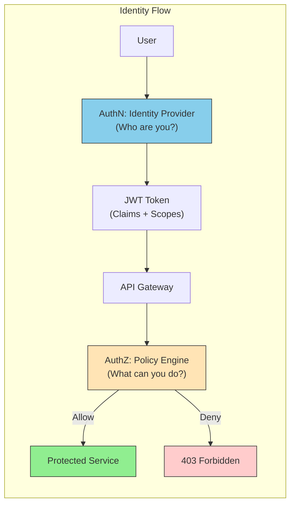
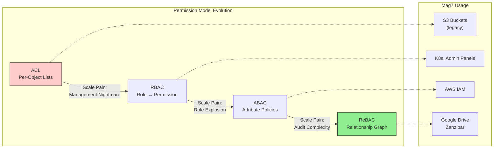
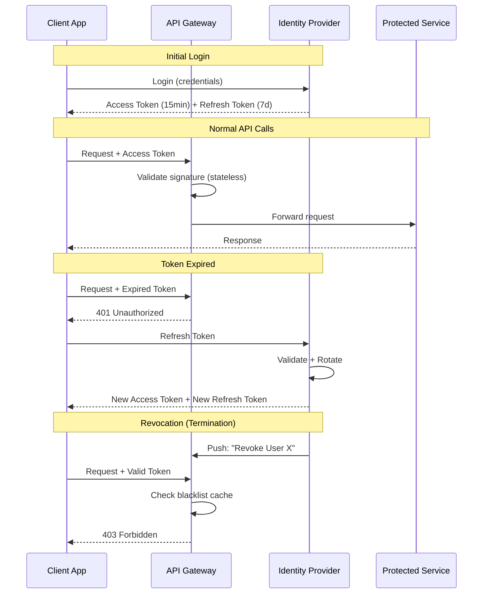

# Authentication vs. Authorization

This guide covers 5 key areas: I. Executive Summary: The Identity Boundary, II. Authentication (AuthN): Mechanisms & Strategies, III. Authorization (AuthZ): Permission Models, IV. Architecture: Tokens and Gateways, V. Summary of Capabilities & ROI for the Principal TPM.

## I. Executive Summary: The Identity Boundary

At the Principal TPM level, you must view Identity not as a login form, but as the **Control Plane** for your entire architecture. In modern distributed systems—specifically within Mag7 environments like Google’s Borg or Amazon’s EC2 fleets—network perimeters (firewalls, VPNs) are considered porous and insufficient.

The "Identity Boundary" represents the architectural shift where **identity becomes the new firewall**. This is the foundation of **Zero Trust**.

### 1. The Zero Trust Paradigm: "Never Trust, Always Verify"

In a legacy "Castle and Moat" architecture, once a user or service is inside the VPN, they are trusted. In a Mag7 Zero Trust architecture (pioneered by Google’s **BeyondCorp**), no request is trusted solely based on its network origin.

*   **How it works:** Every request—whether from a customer on an iPhone or an internal microservice calling a database—must carry a cryptographically signed token asserting identity (AuthN) and permissions (AuthZ).
*   **Mag7 Example:** At **Google**, an employee accessing internal code repositories from a coffee shop does not use a VPN. Instead, the access proxy evaluates the **User Identity** (Tier 1 engineer), the **Device State** (Corporate-managed laptop, OS patched, disk encrypted), and the **Context** (IP location, time of day). If the device is unpatched, access is denied regardless of valid credentials.
*   **Business Impact:**
    *   **Security:** Eliminates lateral movement. If an attacker breaches one container, they cannot automatically access neighboring services.
    *   **Productivity:** Enables remote work without VPN bottlenecks.
*   **Tradeoffs:**
    *   *Complexity vs. Security:* Implementing Zero Trust requires a massive investment in device inventory, certificate management, and centralized policy engines. It increases the "tax" on every service call (latency due to token validation).

### 2. Decoupling AuthN and AuthZ

A Principal TPM must enforce the architectural separation of Authentication (Who are you?) and Authorization (What can you do?). Conflating these leads to "Spaghetti Security" where business logic is polluted with credential checks.

*   **The Architectural Split:**
    *   **AuthN (The ID Card):** Handled by a centralized Identity Provider (IdP) like Azure AD, Okta, or internal equivalents (e.g., Amazon's internal identity stacks). It issues a token (usually JWT).
    *   **AuthZ (The Keycard Reader):** Handled by the service or a policy engine (like OPA - Open Policy Agent). It inspects the token's "scopes" or "claims" to grant access.
*   **Mag7 Real-World Behavior:**
    *   **Netflix:** Uses a decoupled architecture. The Edge Gateway (Zuul/Edge) handles AuthN (validating the user). Downstream microservices do not re-check passwords; they trust the propagated context (Passport) to make fine-grained AuthZ decisions (e.g., "Does this plan allow 4K streaming?").
*   **Tradeoff - Latency vs. Consistency:**
    *   *Centralized AuthZ:* (e.g., Google Zanzibar). **Pro:** Instant global revocation of rights. **Con:** Every request hits a central service, adding latency and a massive Single Point of Failure (SPOF).
    *   *Decentralized AuthZ:* (Token-based). **Pro:** Fast; services validate signatures locally. **Con:** "Token lag." If you fire an employee, their 1-hour access token is still valid until it expires, unless you implement complex revocation lists.

### 3. Identity as a Tier-0 Dependency

In Mag7 terms, Identity is a **Tier-0 service**. If Identity goes down, *everything* goes down. You cannot log in to AWS to fix the server that hosts the login page.

*   **Availability Strategy:**
    *   Identity systems must be deployed across multiple regions with active-active replication.
    *   **Fallbacks:** "Break-glass" accounts are mandatory for TPMs managing platform infrastructure. These are highly monitored accounts that bypass standard SSO/MFA in case the IdP is offline.
*   **ROI & Business Capabilities:**
    *   **Reliability:** A 99.9% SLA on Identity effectively caps the SLA of *every dependent product* at 99.9%. To offer a 99.99% product, your Identity layer must be 99.999%.
    *   **Customer Trust:** A breach in the Identity layer (e.g., Okta or LastPass incidents) is an existential threat to the business, far worse than a temporary service outage.

### 4. The Friction vs. Fraud Tradeoff

As a Product Principal, you own the "Conversion vs. Security" dial.

*   **The Dynamic:**
    *   **High Friction (Strict AuthN):** Aggressive MFA, short session timeouts, CAPTCHAs. **Result:** Low fraud, high cart abandonment, lower DAU (Daily Active Users).
    *   **Low Friction (Passive AuthN):** "Remember me," biometric login, risk-based auth. **Result:** High conversion, higher risk of Account Takeover (ATO).
*   **Mag7 Approach (Risk-Based Authentication):**
    *   **Microsoft/Azure:** Uses "Conditional Access." If a user logs in from their usual device in Seattle, they get a silent token refresh. If they log in from an unknown device in Russia 10 minutes later, the system dynamically challenges for MFA.
    *   **Impact:** This maximizes ROI by reserving friction only for suspicious activities, preserving CX for the 99% of legitimate users.

## II. Authentication (AuthN): Mechanisms & Strategies

At Mag7 scale, Authentication is a foundational capability that must be both invisible to the end-user and resilient enough to support billions of sessions. When you log in to Gmail, you are actually authenticating against a centralized Google Identity Service (IdP), not the Gmail application itself. This issues a session token (often an artifact of OIDC) that is scoped to valid service audiences. The result is that the user can immediately navigate to YouTube or Google Drive without re-authenticating.

**The Mag7 Reality:**
*   **Mechanism:** Centralized Authentication Service (CAS).
*   **Tradeoff:** Creates a massive Single Point of Failure (SPoF). If Google Identity goes down, the entire ecosystem halts.
*   **Mitigation:** Mag7 companies invest heavily in regional isolation and failover for IdPs to prevent global outages.
*   **Business Impact:** Reduces friction (higher engagement) and centralizes security auditing (lower risk), but requires 99.999% availability of the Auth service.

### 1. Protocols: OIDC vs. SAML
As a Principal TPM, you will oversee integrations with partners or enterprise customers. You must understand the distinction between modern and legacy protocols.

*   **OIDC (OpenID Connect):**
    *   **What it is:** A JSON/REST-based identity layer on top of OAuth 2.0. It is mobile-friendly and API-native.
    *   **Use Case:** Modern B2C apps, Mobile Apps, SPAs (Single Page Applications).
    *   **Mag7 Example:** "Sign in with Apple" or "Log in with Facebook."
    *   **Tradeoff:** Easier for developers to implement than SAML, but requires strict token management (handling Access vs. Refresh tokens) to prevent XSS/CSRF attacks in the browser.

*   **SAML (Security Assertion Markup Language):**
    *   **What it is:** An XML-based standard.
    *   **Use Case:** Legacy Enterprise B2B. If your product sells to Fortune 500s, they will demand SAML integration to hook into their Active Directory.
    *   **Mag7 Example:** Microsoft Entra ID (formerly Azure AD) bridging on-premise enterprise identities to cloud apps.
    *   **Tradeoff:** XML is "chatty" (large payload size) and complex to parse, increasing latency slightly. However, it is non-negotiable for enterprise sales.

**Business Impact:**
Failing to support SAML in a B2B product creates a "Sales Blocker." Enterprise CISOs will not approve a vendor that requires separate credentials (shadow IT). Supporting SAML accelerates **Enterprise Deal Velocity**.

### 2. Session Management: JWT vs. Reference Tokens
Once a user is authenticated, how do you maintain that state? This is a critical architectural decision impacting latency and security.

*   **Stateless (JWT - JSON Web Tokens):**
    *   **Mechanism:** The token contains all user data (claims) and is signed. The backend validates the signature without checking a database.
    *   **Mag7 Example:** Netflix uses stateless tokens for high-volume streaming requests to avoid hitting a central database for every video segment fetch.
    *   **Tradeoff:** **Revocation Difficulty.** Since the token is valid until it expires, you cannot easily "ban" a user instantly without complex blocklisting mechanisms.
    *   **ROI:** Massive reduction in database load and latency.

*   **Stateful (Reference Tokens/Session IDs):**
    *   **Mechanism:** The token is just a random string (pointer). The server looks up the session in a database (Redis/Memcached) for every request.
    *   **Mag7 Example:** Amazon Checkout. High-sensitivity actions require immediate state validation to ensure the account hasn't been locked or the password changed *seconds* ago.
    *   **Tradeoff:** Higher latency (network hop to DB) and higher infrastructure cost (scaling the session store).
    *   **ROI:** Immediate security control.

### 3. Adaptive Authentication (Risk-Based Auth)
Static rules (always ask for password) are obsolete. Mag7 utilizes "Adaptive Auth" engines.

*   **Mechanism:** The system evaluates context—Device Fingerprint, IP Geo-velocity (impossible travel), and behavioral biometrics.
*   **Logic:**
    *   *Scenario A:* User logs in from usual iPhone in Seattle → **Allow** (Invisible Auth).
    *   *Scenario B:* Same user logs in from a Windows PC in Nigeria 10 minutes later → **Step-up Challenge** (Require MFA or block).
*   **Mag7 Example:** Facebook’s "checkpoint" systems. If suspicious activity is detected, the account is locked until the user identifies friends in photos.
*   **Business Impact:**
    *   **Conversion:** Reduces friction for 99% of legitimate users (no CAPTCHAs/MFA prompts).
    *   **Fraud:** Drastically reduces Account Takeover (ATO) costs and support tickets.

### 4. Identity Federation (B2B/B2E)
In the B2B SaaS space (AWS, Azure, Google Cloud), you do not want to manage user passwords. You want to trust the customer's directory.

*   **Mechanism:** Federation allows a customer (e.g., Ford) to bring their own identity (Active Directory) to your platform (e.g., AWS).
*   **Mag7 Example:** AWS IAM Identity Center. AWS does not store the password; it trusts the token sent by Ford's IdP.
*   **Tradeoff:**
    *   *Pros:* Zero liability for password storage; automated user de-provisioning (if an employee leaves Ford, they lose AWS access immediately).
    *   *Cons:* Debugging authentication failures is difficult because the error often lies on the customer's side (IdP configuration), leading to "blame game" support tickets.

## III. Authorization (AuthZ): Permission Models

While Authentication provides the identity, Authorization (AuthZ) dictates the capability. For a Principal TPM at a Mag7, AuthZ is rarely a binary "allow/deny" switch; it is a complex, hierarchical logic engine that must evaluate context, resource ownership, and enterprise policy in milliseconds.

If you are managing a platform or product at scale, you will likely face the "AuthZ Wall": the point where simple role checks in your database code no longer scale with business requirements (e.g., "Allow View access only if the user is in the EU, it is business hours, and they are the document owner's manager").

### 1. The Hierarchy of Permission Models

You must select the model that balances granularity with maintenance overhead. Most Mag7 architectures have evolved from left to right on this spectrum.

#### A. Access Control Lists (ACLs)
*   **Concept:** A list of permissions attached to a specific object (e.g., File A can be read by User X and User Y).
*   **Mag7 Example:** S3 Bucket Policies or early Unix file systems.
*   **Trade-off:**
    *   *Pros:* Extremely granular; easy to understand for a single resource.
    *   *Cons:* **Management Nightmare.** If User X leaves the company, you must scrub every ACL on every object they touched. High latency at scale due to list traversal.

#### B. Role-Based Access Control (RBAC)
*   **Concept:** Users are assigned static roles (Admin, Editor, Viewer). Permissions are assigned to roles.
*   **Mag7 Example:** Internal admin panels, basic SaaS tiering (Free vs. Pro users), Kubernetes default RBAC.
*   **The "Role Explosion" Problem:** In complex products, business logic outpaces roles. If you need a role for "Editor who can publish but not delete," you create a new role. Eventually, you have thousands of roles, making the system unmanageable.
*   **Trade-off:**
    *   *Pros:* Easy to audit; maps well to organizational charts.
    *   *Cons:* Lacks context. It cannot easily handle "User can edit *their own* posts."

#### C. Attribute-Based Access Control (ABAC)
*   **Concept:** Policies are based on attributes of the User, the Resource, and the Environment.
    *   *Logic:* `IF User.Department == "HR" AND Resource.Type == "SalaryData" AND Time is "BusinessHours" THEN Allow.`
*   **Mag7 Example:** **AWS IAM**. AWS policies allow incredibly specific conditions (e.g., allow action only if the request comes from a specific VPC endpoint or uses MFA).
*   **Trade-off:**
    *   *Pros:* Infinite flexibility; dynamic (no need to change the policy when a user changes departments, just change the user's attribute).
    *   *Cons:* **Performance and Complexity.** Evaluating complex boolean logic on every request adds latency. Auditing "Who has access to X?" becomes mathematically difficult because access is computed at runtime.

#### D. Relationship-Based Access Control (ReBAC) & Google Zanzibar
*   **Concept:** Permissions are derived from the relationship graph between subjects and objects. This is the current "state of the art" for social and collaborative platforms.
*   **Mag7 Example:** **Google Drive & YouTube.** If you share a folder with a Group, and that Group contains a Sub-group, and User A is in the Sub-group, User A has access. This is a graph traversal problem.
*   **Google Zanzibar:** Google published the Zanzibar paper, detailing the global system that handles AuthZ for Maps, Photos, Drive, and YouTube. It stores relationships as tuples (`User:A` is `viewer` of `Doc:B`) and scales to trillions of ACLs with low latency.
*   **Trade-off:**
    *   *Pros:* Solves recursive permissions and nested groups natively.
    *   *Cons:* extremely high engineering barrier to entry. Requires a dedicated graph database or specialized engine (like OpenFGA or Authzed).

### 2. Architecture: Decoupling Policy from Code

A critical architectural decision you will influence is **Policy as Code**.

*   **Legacy Approach:** Hardcoding `if (user.isAdmin)` directly in the microservice application logic.
    *   *Risk:* Security logic is scattered across 50 microservices. Updating a policy requires redeploying all 50 services.
*   **Modern Mag7 Approach (OPA):** Using engines like **Open Policy Agent (OPA)** to decouple decision-making from enforcement.
    *   The Microservice asks the Sidecar (OPA): "Can User X do Action Y?"
    *   OPA evaluates the policy (written in Rego) and returns "Yes/No."
    *   *Impact:* You can update global security policies (e.g., "Ban all access from IP range Z") centrally without touching application code.

### 3. Trade-off Analysis: The CAP Theorem of AuthZ

When designing or migrating Authorization systems, you are balancing three forces. You can usually optimize for only two:

1.  **Latency (Performance):** How fast is the check? (Critical for high-frequency trading or ad-serving).
2.  **Freshness (Consistency):** If I revoke access *now*, how quickly is it enforced globally? (Critical for offboarding employees).
3.  **Reliability (Availability):** If the AuthZ service goes down, does the whole product stop working?

**The "New Enemy" Problem:**
*   *Scenario:* A Google engineer revokes a bad actor's access to a sensitive document.
*   *The Trade-off:* To ensure low latency (1), Google might cache permissions at the edge. However, this hurts Freshness (2)—the bad actor might retain access for 5 minutes until the cache clears.
*   *Mag7 Solution:* Zanzibar uses "Zookies" (consistency tokens) to ensure that if you change a permission, subsequent reads respect causal ordering, balancing consistency and performance.

### 4. Business & ROI Impact

As a Principal TPM, you justify the investment in a robust AuthZ platform through these lenses:

*   **Velocity (Time-to-Market):** By moving to a centralized AuthZ service (or Policy as Code), product teams stop building their own permission logic. They simply register their resources and policies. This reduces backend dev time by 10-20% per feature.
*   **Compliance & Auditability:** In a decentralized model, answering "Who has access to PII?" for a GDPR audit requires querying 50 different databases. In a centralized model, it is a single query. This reduces audit costs and regulatory risk significantly.
*   **User Experience (CX):**
    *   *Friction:* Poor AuthZ logic leads to "Access Denied" errors after a user clicks a button. Good AuthZ allows the UI to filter out buttons the user cannot use before they render.
    *   *Sharing:* Robust ReBAC enables viral loops (seamless sharing of content), directly impacting user acquisition and retention metrics (e.g., Figma or Google Docs).

## IV. Architecture: Tokens and Gateways

### 1. Token Strategy: The Currency of Access

In a monolithic architecture, a user’s session is often stored in the server's memory or a database (stateful). In the distributed microservices architectures typical of Mag7, this is unscalable. We rely on **Tokens**—specifically **JSON Web Tokens (JWTs)**—to pass identity and permissions between services statelessly.

#### Stateless vs. Stateful Tokens
*   **Stateless (JWT):** The token contains all necessary data (claims) to identify the user and their scope of access. The service validates the token by checking its cryptographic signature, not by querying a database.
    *   *Mag7 Use Case:* High-throughput internal service-to-service communication (e.g., Amazon internal service calls).
    *   *Tradeoff:* **Revocation Difficulty.** Because the token is self-contained, you cannot easily "kill" a specific token before it expires without building complex blocklists (which re-introduces state).
*   **Stateful (Opaque/Reference Tokens):** The token is a random string (a reference ID). The service must call the Identity Provider (IdP) to exchange the reference for the actual data.
    *   *Mag7 Use Case:* Public-facing mobile apps or sensitive banking-tier transactions where immediate revocation is required.
    *   *Tradeoff:* **Latency.** Every API call requires an extra round-trip to the IdP/Database, doubling network overhead.

#### The "Token Bloat" Problem
As a Principal TPM, you will encounter the "Header Size" issue. As teams add more permissions (claims) to a JWT, the token size grows.
*   **Impact:** If a JWT exceeds HTTP header limits (typically 8KB-16KB depending on the load balancer/CDN), requests fail silently or latency spikes due to packet fragmentation.
*   **ROI/Business Impact:** Mobile clients on poor networks suffer significant performance degradation transmitting large tokens on every request.
*   **Mitigation:** Enforce strict governance on token claims. Use the token only for Identity (User ID) and coarse-grained roles; fetch fine-grained permissions from a localized policy engine (like OPA) or cache, rather than stuffing them into the token.

### 2. The Gateway Pattern: The Policy Enforcement Point (PEP)

In a Zero Trust architecture, the **API Gateway** acts as the Policy Enforcement Point. It is the border guard between the chaotic public internet and your clean internal network (VPC).

#### Gateway Offloading
At Mag7, we do not want individual microservices handling SSL handshakes, parsing complex AuthN headers, or validating JWT signatures. This is "undifferentiated heavy lifting."
*   **Mechanism:** The Gateway sits at the edge. It intercepts the request, validates the AuthN token, terminates SSL, and applies rate limits.
*   **Transformation:** Once validated, the Gateway often strips the heavy external token and passes a lightweight, trusted internal identity header (e.g., `X-Internal-User-ID`) to the downstream microservices.
*   **Real-World Example:** **Netflix Zuul** or **Envoy Proxy** (used extensively in Service Meshes). The Gateway handles the "noise" of authentication failures (401s), protecting backend services from denial-of-service attacks targeting the login endpoints.

#### The "Phantom Token" Pattern
This is a standard pattern for balancing security and performance in high-scale systems.
1.  **Client Side:** The user receives an *Opaque* token (random string). This hides internal architecture details and PII (Personally Identifiable Information) from the public client.
2.  **Gateway:** The Gateway intercepts the Opaque token, calls the Introspection Endpoint (IdP) to validate it, and receives back a *JWT*.
3.  **Internal Side:** The Gateway forwards the *JWT* to internal microservices.
4.  **Benefit:** You get the security/revocability of opaque tokens on the public internet, but the speed/statelessness of JWTs inside your network.

### 3. Token Lifecycle Management: Access vs. Refresh

The security of a token-based architecture relies on the **Time-To-Live (TTL)** settings.

#### The Access/Refresh Flow
*   **Access Token:** Short-lived (e.g., 15-60 minutes). Used to access resources. If stolen, the attacker has a limited window of opportunity.
*   **Refresh Token:** Long-lived (e.g., 7-30 days). Used to obtain new Access Tokens without forcing the user to re-enter credentials.
*   **Rotation:** Mag7 security standards increasingly require **Refresh Token Rotation**. Every time a refresh token is used, a new one is issued, and the old one is invalidated. This detects token theft: if an attacker tries to use an old refresh token, the system invalidates the entire chain and forces a re-login.

#### Tradeoffs and TPM Decisions
*   **Short TTL (5 min):** High security, but high load on the IdP (more refresh calls) and potential latency spikes for the user during the refresh cycle.
*   **Long TTL (24 hours):** Low latency, better UX, but high security risk. If a token is stolen, the attacker has access for a full day.
*   **Decision Framework:** For a payment gateway service, prioritize Short TTL. For a media streaming read-only service, prioritize Long TTL.

### 4. Service-to-Service Authentication (mTLS)

While User-to-Service flows use tokens, Service-to-Service (East-West traffic) at Mag7 typically relies on **Mutual TLS (mTLS)** managed by a Service Mesh (like Istio or AWS App Mesh).

*   **Behavior:** Service A presents a certificate to Service B. Both verify each other against a trusted internal Certificate Authority (CA).
*   **Why not just tokens?** Tokens verify the *user*. mTLS verifies the *application workload*. In a Zero Trust environment, you need both: "This request is from User X (Token) via Service A (mTLS)."
*   **Operational Impact:** Implementing mTLS manually is an operational nightmare. The adoption of Service Mesh automates certificate rotation. As a TPM, you drive the adoption of Service Mesh to ensure compliance without slowing down feature developers.

## V. Summary of Capabilities & ROI for the Principal TPM

### 1. Architectural Governance: Decoupling Policy from Execution

The defining capability of a Principal TPM in the identity space is the ability to drive the architectural separation of **Policy Decision Points (PDP)** from **Policy Enforcement Points (PEP)**. In junior roles, AuthZ is often treated as `if/else` statements within business logic. At the Principal level, you must champion **Policy-as-Code**.

*   **Technical Depth:** You must advocate for externalized authorization services (e.g., OPA - Open Policy Agent) or tuple-store based systems (like Google’s Zanzibar). This ensures that when compliance rules change (e.g., "Interns can no longer view PII"), you update a central policy, not 500 microservices.
*   **Mag7 Example:** **Google Drive**. The permissions model (Viewer/Editor/Owner) is consistent across Docs, Sheets, and Slides because it relies on a centralized relationship-based access control system (Zanzibar). If Google had to patch every app individually to change a sharing rule, their velocity would stall.
*   **Tradeoffs:**
    *   *Centralization vs. Latency:* Centralizing AuthZ simplifies governance but introduces a network hop for every permission check.
    *   *Mitigation:* You must define caching strategies (e.g., pushing policy down to the edge/sidecar) to maintain p99 latency targets.
*   **ROI/Impact:**
    *   **Velocity:** Developers stop writing boilerplate security code and focus on core product features.
    *   **Compliance:** Auditing becomes a query against a central repo, not a code review of 100 repositories.

### 2. The ROI of Identity Latency and Availability

At Mag7 scale, Identity is the "System 0." If Identity is down, the entire suite is down. If Identity is slow, every interaction is slow. A Principal TPM quantifies the cost of authentication latency.

*   **Technical Depth:** You must manage the budget for **Token Bloat** and **Validation Overhead**. In a microservices mesh, if Service A calls B, C, and D, and each validates the JWT independently against the IdP, latency stacks up.
*   **Mag7 Example:** **Netflix**. When a user hits "Play," the entitlement check (AuthZ) must happen in milliseconds. If the entitlement service fails, Netflix defaults to "Fail Open" for known users (allowing them to watch) rather than stopping the stream, prioritizing UX over strict enforcement during outages.
*   **Tradeoffs:**
    *   *Security vs. Availability (Fail Open/Closed):* Failing closed guarantees security but risks a global outage (users can't work). Failing open keeps the business running but risks unauthorized access.
    *   *Stateless (JWT) vs. Stateful (Sessions):* JWTs are faster (no DB lookup) but harder to revoke instantly. Stateful sessions are secure but hard to scale globally.
*   **ROI/Impact:**
    *   **Revenue Protection:** For Amazon, 100ms of latency costs 1% in sales. Optimizing the Auth handshake directly protects revenue.
    *   **Resilience:** Implementing "stale-while-revalidate" strategies for identity tokens ensures the platform survives IdP blips.

### 3. Identity as a Product Growth Lever (B2B & Enterprise)

For Product TPMs, Identity is a monetization feature. Enterprise clients (B2B) will not buy your solution if it does not integrate with their Active Directory or Okta instance.

*   **Technical Depth:** You must lead the roadmap for **SCIM (System for Cross-domain Identity Management)** and **SAML/OIDC federation**. This allows enterprise customers to auto-provision and de-provision users.
*   **Mag7 Example:** **Microsoft Azure AD (Entra ID)**. Microsoft leverages Identity as its primary moat. By making it seamless to use Office 365 credentials for third-party SaaS, they lock enterprises into the Microsoft ecosystem.
*   **Tradeoffs:**
    *   *Build vs. Buy:* Should you build your own SCIM integration or buy a solution (like Auth0/Okta)?
    *   *Decision Matrix:* At Mag7 scale, you almost always build or acquire (to own the stack). At smaller scale, you buy. Building requires perpetual maintenance of changing standards.
*   **ROI/Impact:**
    *   **Sales Enablement:** "SSO Support" is often the gatekeeper requirement for moving a customer from a "Pro" ($20/mo) to "Enterprise" ($100/mo) tier.
    *   **Churn Reduction:** Automated onboarding/offboarding (SCIM) reduces administrative overhead for the customer, making your product "sticky."

### 4. Managing the "Zero Trust" Migration

The most common Principal TPM program in this domain is migrating legacy perimeter-based security (VPNs) to Zero Trust architectures.

*   **Technical Depth:** This involves shifting from network-level trust (IP allow-listing) to device and identity-level trust (mTLS + device health claims in JWTs).
*   **Mag7 Example:** **BeyondCorp at Google**. This initiative took years and moved internal apps to the public internet, protected by an Identity-Aware Proxy (IAP).
*   **Tradeoffs:**
    *   *Friction vs. Security:* Enforcing device health checks (e.g., "OS must be patched") blocks users with valid credentials but risky devices.
    *   *Mitigation:* The TPM must drive "remediation UX"—telling the user *why* they are blocked and how to fix it, rather than a generic 403 error.
*   **ROI/Impact:**
    *   **Risk Reduction:** Eliminates lateral movement attacks. If an attacker breaches one server, they don't own the network.
    *   **Remote Work Capability:** Enables employees/users to work securely from anywhere without VPN bottlenecks.

---

## Interview Questions

### I. Executive Summary: The Identity Boundary

### Question 1: Designing for Resilience
*"We are launching a new global enterprise SaaS product on Azure. The requirement is a 99.99% availability SLA. However, our Identity Provider (IdP) only guarantees 99.9%. As the Principal TPM, how do you architect the system and negotiate the tradeoffs to meet our SLA?"*

*   **Guidance for a Strong Answer:**
    *   **Acknowledge the Math:** Explicitly state that serial dependencies multiply availability (0.999 * 0.999 = ~0.998). You cannot mathematically achieve four 9s if a critical dependency is three 9s.
    *   **Architectural Mitigation:** Propose **Token Caching** or **Graceful Degradation**. If the IdP is down, existing valid sessions should continue to work (local validation). Only *new* logins fail.
    *   **Fail-Open vs. Fail-Closed:** Discuss the security tradeoff. Do we allow degraded access during an outage? (Usually Fail-Closed for high security, Fail-Open for low-risk read-only content).
    *   **Business Negotiation:** Challenge the requirement. Does the *login* need four 9s, or does the *service usage* need four 9s? Separating these definitions is a hallmark of a Senior/Principal TPM.

### Question 2: The Migration Challenge
*"We have a legacy monolith using session-based authentication (cookies). We are breaking this into microservices and want to move to a Zero Trust architecture using JWTs. The migration cannot cause downtime or force a global logout of our 50M users. Outline your migration strategy."*

*   **Guidance for a Strong Answer:**
    *   **The Strangler Fig Pattern:** Don't do a "Big Bang" migration. Place an API Gateway in front of the monolith.
    *   **Dual-Write/Read:** The Gateway should accept the legacy cookie, validate it against the legacy session store, mint a short-lived JWT, and pass that JWT to the new microservices.
    *   **Transparency:** The user (client) continues sending cookies; the backend gradually shifts to tokens.
    *   **Rollback Strategy:** What happens if the token minting service creates latency spikes? Define the kill switch.
    *   **Security implication:** Discuss how you handle "Logout" in the new world (invalidating the cookie must eventually propagate to invalidating the JWTs).

### II. Authentication (AuthN): Mechanisms & Strategies

### Question 1: Designing for Scale and Security
**"We are launching a new global streaming service expecting 100M MAU. The CISO demands immediate session revocation for compromised accounts, but the Engineering Lead argues that database lookups on every request will tank performance. As the Principal TPM, how do you resolve this architectural conflict?"**

**Guidance for a Strong Answer:**
*   **Acknowledge the Tradeoff:** Validate both sides. Security needs revocation; Engineering needs low latency/statelessness.
*   **Propose a Hybrid Solution:** Do not pick one. Suggest **Short-Lived Access Tokens (JWTs)** (e.g., 5-minute lifespan) paired with **Long-Lived Refresh Tokens**.
*   **Explain the Flow:** The client uses the JWT for API calls (fast, stateless). When the JWT expires (every 5 mins), the client uses the Refresh Token to get a new JWT. The "Check against DB" only happens during the Refresh.
*   **The Compromise:** The "window of exposure" for a compromised account is reduced to the lifespan of the JWT (5 mins), which is usually an acceptable risk for a streaming service (unlike a banking wire transfer).
*   **Edge Case:** For "critical actions" (changing password, viewing billing), force a fresh stateful check.

### Question 2: Enterprise Strategy
**"Our SaaS product currently supports Google and GitHub OAuth (OIDC). We have an opportunity to close a $5M deal with a government agency, but they require SAML integration with their legacy on-premise setup. Our roadmap is full. Do we build it?"**

**Guidance for a Strong Answer:**
*   **ROI Calculation:** Compare the $5M deal + Total Addressable Market (TAM) of other enterprise customers against the engineering effort (Opportunity Cost).
*   **Build vs. Buy:** A Principal TPM should immediately suggest *not* building a raw SAML parser. Suggest integrating a middleware provider (like Auth0, Okta, or AWS Cognito) that handles the SAML complexity while presenting a modern OIDC interface to your internal developers.
*   **Strategic alignment:** If the company strategy is "Move Upmarket," this is a mandatory capability, not a feature request.
*   **Execution:** Phased rollout. Manual configuration for this client first, self-service UI for future clients later.

### III. Authorization (AuthZ): Permission Models

### Q1: Design a permission system for a Google Drive competitor.
**Guidance:**
*   **Do not** suggest simple RBAC (Admin/Editor/Viewer); it fails when users need to share specific files with specific people.
*   **Do** propose a Relationship-Based (ReBAC) model or a Hybrid (RBAC for org-level, ACL/ReBAC for file-level).
*   **Key Challenge:** Handle the "Nested Group" problem (User A is in Group B, Group B has access to Folder C).
*   **Strong Answer:** Discuss the separation of the **Control Plane** (where policies are written) and the **Data Plane** (where enforcement happens). Mention caching strategies to ensure that listing a folder with 1,000 files doesn't trigger 1,000 slow AuthZ checks. Address the "Revocation" latency—how fast must a "stop sharing" action propagate?

### Q2: We are breaking a monolith into microservices. The current AuthZ logic is hardcoded in the monolith. How do you migrate?
**Guidance:**
*   **Focus on Risk:** The biggest risk is a security regression (allowing access that should be denied).
*   **Strategy:** Propose the "Strangler Fig" pattern or "Shadow Mode."
    1.  Deploy the new centralized AuthZ service (e.g., OPA).
    2.  Have the application call *both* the old logic and the new service.
    3.  Log discrepancies but enforce the old logic.
    4.  Once discrepancies reach zero, switch enforcement to the new service.
*   **Business Value:** Explain that while this migration has high upfront effort, it unblocks future velocity and enables unified compliance auditing.

### IV. Architecture: Tokens and Gateways

### Q1: The "Immediate Revocation" Challenge
**Question:** "We are designing a distributed document collaboration system (like Google Docs). We use stateless JWTs for performance. However, legal requires that if a user's employment is terminated, their access to documents must be cut off within 60 seconds. How do you architect this while maintaining the latency benefits of stateless JWTs?"

**Guidance for a Strong Answer:**
*   **Acknowledge the Tradeoff:** Admit that standard stateless JWTs cannot be revoked immediately until they expire.
*   **Propose Hybrid Solutions:**
    *   *Short TTLs:* Reduce token lifespan to < 5 mins (increases IdP load but minimizes risk window).
    *   *Distributed Caching (The Blacklist):* Implement a high-speed distributed cache (Redis/Memcached) at the Gateway level that stores *only* the IDs of revoked tokens (jti claim) or revoked User IDs. This is much faster than a full database lookup.
    *   *Push Events:* Use a pub/sub mechanism to push "Revoke User X" events to all Gateways immediately upon termination.
*   **Strategic View:** Reject the idea of switching entirely to stateful sessions for the whole platform due to the performance hit. Focus on the *exception path* (revocation) rather than penalizing the *happy path* (normal access).

### Q2: Gateway Bottlenecks
**Question:** "Your product utilizes a centralized API Gateway for Authentication and Rate Limiting. During a major launch event (e.g., Prime Day), the Gateway becomes the single point of failure and latency increases unacceptable levels. How do you propose evolving the architecture?"

**Guidance for a Strong Answer:**
*   **Diagnose:** Identify if the bottleneck is CPU (crypto validation of tokens) or I/O.
*   **Decentralize (Sidecars):** Propose moving the AuthN enforcement out of the centralized gateway and into a **Service Mesh Sidecar** (e.g., Envoy) running alongside each microservice container. This distributes the load: every service scales its own auth capacity.
*   **Edge Authentication:** Move the initial token validation to the CDN layer (e.g., CloudFront Functions or Lambda@Edge) to reject invalid traffic before it even hits the primary infrastructure.
*   **Business Continuity:** Discuss implementing "Fail Open" vs. "Fail Closed" policies during the outage and the associated risks (e.g., during a total auth outage, do we allow read-only access to catalog data to preserve CX?).

### V. Summary of Capabilities & ROI for the Principal TPM

**Question 1: The "Fail Open" Dilemma**
"We are designing the authorization system for a new high-frequency trading platform within our cloud suite. The requirement is ultra-low latency. However, our centralized policy engine occasionally experiences 500ms latency spikes or timeouts. As a Principal TPM, how do you architect the trade-off between strict security enforcement and system availability/performance? Do we fail open or closed, and why?"

*   **Guidance for a Strong Answer:**
    *   **Contextualize:** Acknowledge that for high-frequency trading, integrity is paramount over availability (unlike Netflix streaming).
    *   **Architecture:** Propose a hybrid model. Push cached policy snapshots to the edge (sidecars) to eliminate network hops (local evaluation).
    *   **Decision:** "Fail Closed" is mandatory for financial transactions.
    *   **Mitigation:** To solve availability, implement a "break-glass" mechanism or highly available read-replicas for the policy data, rather than compromising on the security check. Discuss the business impact of a single unauthorized trade vs. a system halt.

**Question 2: Rolling out MFA to a Friction-Sensitive User Base**
"You are the TPM Lead for Identity at a social media platform with 1 billion users. Leadership wants to enforce MFA to reduce account takeovers, but the Growth team is blocking it, citing a projected 15% drop in daily active users (DAU) due to login friction. How do you resolve this conflict and execute a rollout?"

*   **Guidance for a Strong Answer:**
    *   **Data-Driven Approach:** Reject the binary "all or nothing" premise. Propose an A/B test on a small cohort to validate the 15% drop claim.
    *   **Risk-Based Auth (Adaptive Auth):** Propose "invisible" MFA. Only challenge the user if the login context is risky (new device, new country, Tor exit node). For known contexts, suppress the challenge.
    *   **Phased Rollout:** Start with high-value accounts (verified users, admins) where the motivation to secure the account outweighs friction.
    *   **Business Alignment:** Frame security as a trust enabler. "If users lose accounts, they leave permanently." Calculate LTV (Lifetime Value) saved by preventing churn vs. LTV lost by friction.

---

## Key Takeaways

- Review each section for actionable insights applicable to your organization

- Consider the trade-offs discussed when making architectural decisions

- Use the operational considerations as a checklist for production readiness
