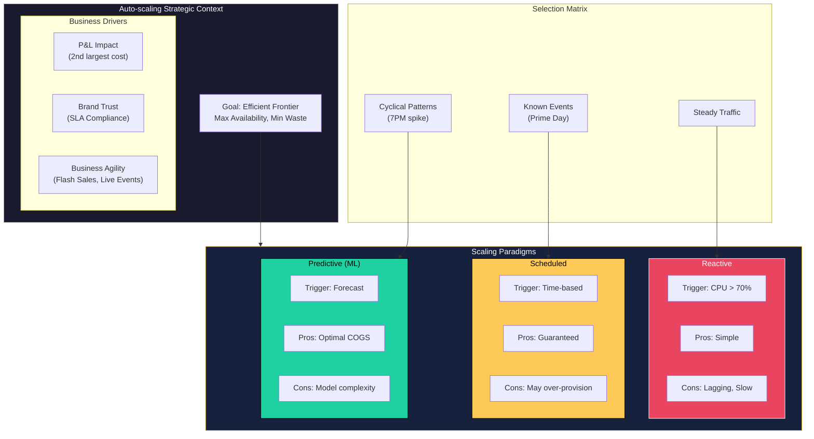
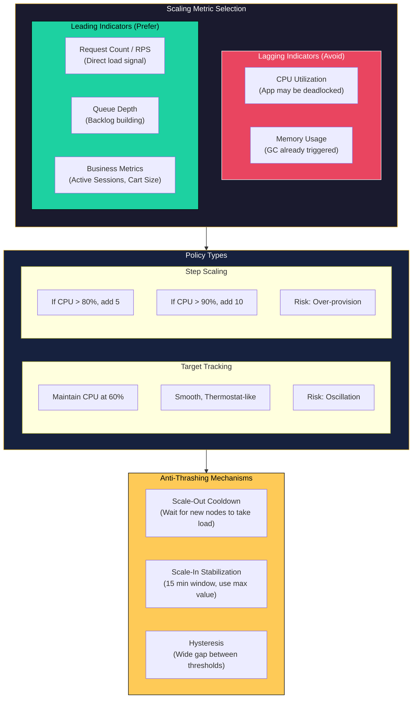
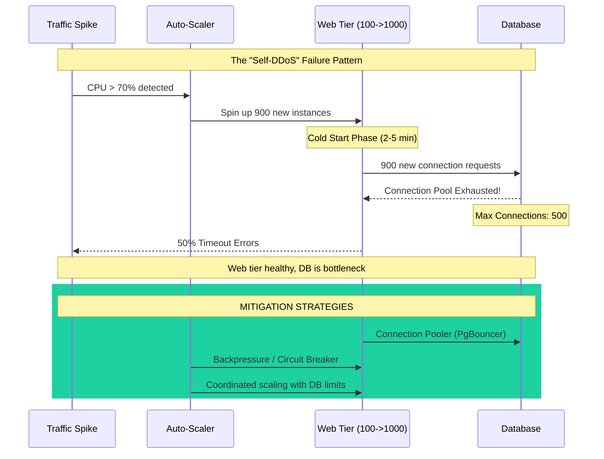
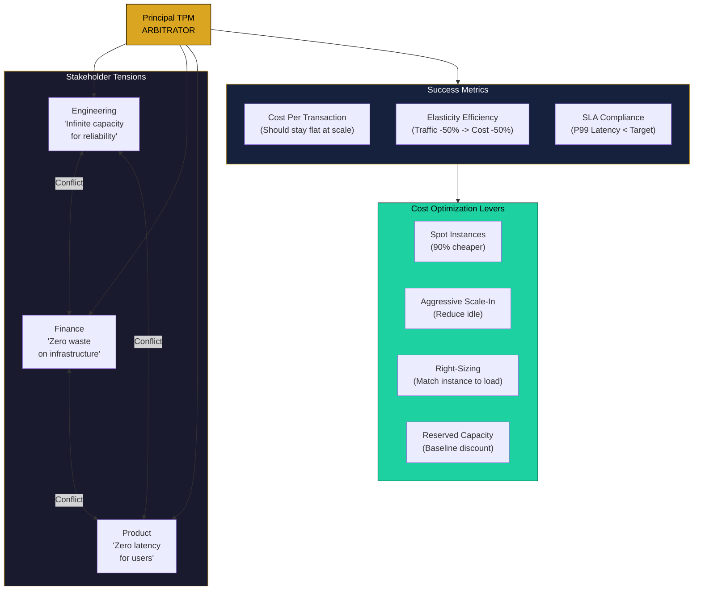

# Auto-scaling Strategies

This guide covers 5 key areas: I. Strategic Context: Auto-scaling at the Mag7 Level, II. Core Scaling Architectures: Horizontal vs. Vertical, III. Scaling Policies and Triggers, IV. Advanced Technical Considerations & Risks, V. Business Impact, ROI, and CX.

## I. Strategic Context: Auto-scaling at the Mag7 Level

At the Principal TPM level, auto-scaling transitions from a technical implementation detail to a primary strategic lever for **Profit and Loss (P&L)** and **Brand Trust**. In a Mag7 environment, infrastructure costs are often the second largest line item after headcount. Consequently, the strategy behind auto-scaling is about optimizing the "Efficient Frontier"—the precise curve where you maximize availability while minimizing waste.

### 1. The Unit Economics of Scaling (COGS vs. Reliability)

In smaller organizations, the priority is almost exclusively "uptime." At Mag7 scale, where a single service might run on 50,000 cores, "uptime at any cost" is financially irresponsible. You must define the acceptable "Headroom"—the buffer of idle capacity maintained to absorb immediate spikes before scaling triggers execute.

*   **Mag7 Behavior:** Google and Meta do not aim for 0% waste; they aim for *calculated* waste. They might maintain a 15-20% headroom for critical user-facing services (Search, Newsfeed) to ensure sub-millisecond latency, while allowing batch processing or internal tools to run with near-zero headroom, relying on aggressive throttling if limits are hit.
*   **Business Impact:**
    *   **ROI:** Tying scaling policies to revenue. For example, an e-commerce checkout service should have aggressive scale-out policies (high cost, high value), whereas a free-tier user report generator should have conservative policies (low cost, low value).
    *   **Capability:** The ability to support "Flash Sales" or "Live Events" without manual intervention.
*   **Tradeoff:** **Utilization vs. Latency Risk.**
    *   *High Headroom:* Low risk of latency spikes, high waste (COGS).
    *   *Low Headroom:* High efficiency, high risk of "Cold Start" latency or 503 errors during micro-bursts.

### 2. Scaling Paradigms: Reactive, Scheduled, and Predictive

A Principal TPM must select the right paradigm based on the workload's volatility and business criticality.

#### Reactive Scaling (Threshold-based)
Scaling based on real-time metrics (e.g., "Add 10 nodes if CPU > 70% for 5 minutes").
*   **Mag7 Reality:** This is considered the "baseline" or fallback mechanism. It is rarely sufficient for Tier-1 services because it is a **lagging indicator**. By the time CPU hits 70% and new nodes boot (which can take 2-5 minutes), the traffic spike may have already caused an outage.
*   **Tradeoff:** Simplicity vs. Responsiveness. It is easy to implement but reacts only *after* performance has degraded.

#### Scheduled Scaling (Cyclical)
Scaling based on known time-bound events.
*   **Mag7 Reality:** Heavily used for predictable patterns.
    *   **Example:** **Amazon** uses this for Prime Day. They do not wait for traffic to hit; they provision massive capacity hours in advance based on marketing push schedules.
    *   **Example:** **Uber/Lyft** scaling up on Friday/Saturday nights in specific time zones.
*   **Tradeoff:** Certainty vs. Waste. You pay for capacity that might not be used if the predicted demand doesn't materialize, but you guarantee availability.

#### Predictive Scaling (ML-Driven)
Using historical data and Machine Learning to forecast traffic and scale *ahead* of the curve.
*   **Mag7 Reality:** **Netflix** is the industry leader here. They use "Scryer" to predict viewing habits. If historical data suggests a spike at 7:00 PM, the system begins spinning up instances at 6:45 PM.
*   **Technical Nuance:** The model must account for "noise." If the prediction is wrong (under-provisioning), the system must fall back immediately to Reactive Scaling.
*   **Tradeoff:** Complexity vs. Efficiency. Requires maintenance of ML models and training pipelines. A bad model is worse than no model.

### 3. The "Thundering Herd" and Physical Constraints

A critical aspect often overlooked by junior TPMs is the **physical limitation of the cloud**. "Infinite scale" is a marketing term, not an engineering reality.

*   **Capacity Planning Integration:** Auto-scaling is software; it assumes hardware exists. If a specific AWS Availability Zone (AZ) lacks the physical instance type you need (e.g., `p4d.24xlarge` GPU instances), your auto-scaling group will fail to launch instances regardless of your configuration.
*   **Mag7 Behavior:**
    *   **Google/Microsoft:** Principal TPMs work with Supply Chain to reserve "Capacity Blocks" for critical launches. Auto-scaling policies are configured to spill over into other regions if the primary region is exhausted.
    *   **Mitigation Strategy:** **Graceful Degradation.** If auto-scaling hits a physical ceiling, the system must shed non-critical load (e.g., disable video auto-play, reduce image resolution) rather than crashing.
*   **Tradeoff:** Regional Latency vs. Availability. Failing over to a distant region (e.g., US-East to US-West) preserves uptime but increases latency for the user.

### 4. Metric Selection: Moving Beyond CPU

Scaling on CPU or Memory usage is often a trap. These are proxy metrics that may not correlate with user experience.

*   **The Problem:** An application might be deadlocked and processing zero requests, yet CPU is low. The auto-scaler sees low CPU and *scales down*, worsening the outage.
*   **Mag7 Strategy:** Scale on **Workload Metrics** or **Business Metrics**.
    *   **Request Count / Queue Depth:** Scale based on the number of pending requests in the load balancer or SQS queue.
    *   **Business Signals:** **Ticketmaster** might scale based on "Virtual Waiting Room" size. **Uber** might scale based on "App Opens" in a geo-fence.
*   **Impact:** Ensures scaling aligns with actual customer demand, not just server health.

## II. Core Scaling Architectures: Horizontal vs. Vertical

### 1. Horizontal Scaling (Scale Out)

Horizontal scaling involves adding more machines or containers to a pool of resources. In the modern cloud-native stack (Kubernetes, AWS ECS), this is the default scaling mechanism for roughly 90% of workloads.

**Technical Deep-Dive:**
Horizontal scaling relies on the decoupling of compute and state. The load balancer distributes traffic across $N$ nodes. If traffic increases, $N$ increases.
*   **The Stateless Requirement:** To scale horizontally effectively, the application tier must be stateless. Session data cannot reside in local memory (RAM) or local disk. It must be offloaded to a distributed cache (Redis/Memcached) or a database.
*   **The "Thundering Herd" Risk:** When scaling out, new nodes must connect to downstream dependencies (databases, caches). If 100 nodes spin up simultaneously, they may overwhelm the database with connection requests.

**Mag7 Real-World Behavior:**
*   **Google Search:** The front-end serving layer is strictly stateless. A query hitting a data center in Oregon can be served by any of thousands of identical pods. If a pod dies, the load balancer reroutes immediately; the user perceives no error.
*   **Meta (Facebook):** Uses horizontal scaling for its web tier (PHP/Hack). However, they implement strict "connection pooling" at the proxy layer to prevent the web tier from exhausting database connections when it scales out.

**Tradeoffs:**
*   **Pros:** Theoretically infinite capacity; high fault tolerance (loss of one node is negligible); granular cost control (scale down to exactly what is needed).
*   **Cons:** Increased architectural complexity (requires service discovery, load balancing); network latency overhead (RPC calls between distributed services); potential for "split-brain" issues if state isn't managed perfectly.

**Impact Analysis:**
*   **ROI:** Optimizes OPEx. You pay for the aggregate compute used, not the peak capacity of a single large machine.
*   **CX:** Essential for maintaining low latency (P99) during traffic spikes.
*   **Business Capability:** Enables "Region Evacuation." If AWS us-east-1 fails, horizontal scaling allows you to rapidly expand capacity in us-west-2 to absorb the traffic shift.

### 2. Vertical Scaling (Scale Up)

Vertical scaling involves migrating the workload to a larger instance type (e.g., moving from an AWS `t3.medium` to an `m5.24xlarge` or adding more CPU/RAM/IOPS to an existing VM).

**Technical Deep-Dive:**
While often viewed as "legacy," vertical scaling is vital for components where distributed consistency is hard—specifically relational databases (RDBMS).
*   **The Hardware Ceiling:** You are limited by the largest instance available from the cloud provider. Once you max out the biggest box, you *must* re-architect (usually via sharding).
*   **Downtime Implications:** In many virtualization environments, vertical scaling requires a restart or a failover event, causing a brief service interruption.

**Mag7 Real-World Behavior:**
*   **Microsoft (Azure SQL) / AWS (RDS):** For many internal tools or non-hyper-scale services, Mag7 companies prefer vertical scaling of databases. It avoids the engineering overhead of sharding.
*   **AI/ML Training (NVIDIA Clusters):** This is a hybrid. While the cluster scales horizontally, the individual nodes are vertically scaled to the absolute maximum (e.g., H100 GPUs with massive VRAM) because the communication overhead between chips is the bottleneck for training Large Language Models (LLMs).

**Tradeoffs:**
*   **Pros:** Simplified architecture (no need to handle distributed transactions or eventual consistency); easier management; lower software licensing costs (if per-node rather than per-core).
*   **Cons:** Single Point of Failure (SPOF); expensive (high-end instances have a premium price-to-performance ratio); rigid (you cannot scale down easily during low traffic periods without downtime).

**Impact Analysis:**
*   **ROI:** Often results in lower engineering COGS (salary) but higher infrastructure COGS. It is cheaper to pay AWS for a larger instance than to pay three Principal Engineers to re-architect a monolithic database for sharding.
*   **Reliability:** Increases risk. If that one massive node fails, the blast radius is total service outage.

### 3. The Hybrid Approach: Sharding (Horizontal Scaling of State)

When a dataset exceeds the capacity of the largest vertical node, Mag7 companies utilize **Sharding**. This effectively turns a Vertical problem into a Horizontal one.

**Technical Deep-Dive:**
Sharding splits a database into smaller chunks (shards) based on a partition key (e.g., UserID). Each shard lives on its own vertical node.
*   **Routing Logic:** The application or a proxy layer must know which shard holds the data for `User_A`.
*   **The "Hot Shard" Problem:** If you shard by "Region," and a specific region has a major event (e.g., the Super Bowl), that specific shard becomes a bottleneck while others sit idle.

**Mag7 Real-World Behavior:**
*   **Instagram:** Originally sharded their PostgreSQL databases by user ID. As they grew, they had to build complex tools to move users between shards to balance load—a process that is technically risky and engineering-heavy.
*   **Amazon DynamoDB:** A managed service that abstracts this entirely. It automatically partitions data horizontally across thousands of servers. The tradeoff is that developers lose the ability to perform complex joins.

**Tradeoffs:**
*   **Pros:** Breaks the "Hardware Ceiling" of vertical scaling; isolates failures (if Shard A fails, users on Shard B are unaffected).
*   **Cons:** Operational nightmare. Resharding (splitting one shard into two) is risky. Cross-shard joins are either impossible or prohibitively slow, forcing data denormalization.

**Impact Analysis:**
*   **Business Capability:** Sharding is the only way to support billions of users (global scale). Without it, growth is capped.
*   **Skill Requirement:** Requires extremely high-level engineering talent to manage. A bad sharding key choice can cripple a product for years (technical debt).

---

## III. Scaling Policies and Triggers

Defining the logic that governs *when* to scale is as important as the mechanism of scaling itself. A Principal TPM must move beyond default configurations (e.g., "scale when CPU > 70%") to define policies that align with Service Level Objectives (SLOs) and budget constraints.

At the Mag7 level, policies are rarely "set and forget." They are dynamic strategies designed to handle the massive inertia of large-scale distributed systems where spinning up 10,000 nodes takes measurable time.

### 1. Reactive Scaling (Target Tracking vs. Step Scaling)

Reactive scaling responds to changes in demand as they occur. It is the baseline requirement for any elastic system.

**A. Target Tracking (The Modern Standard)**
You select a specific metric (e.g., Average CPU Utilization) and a target value (e.g., 50%). The auto-scaler acts like a thermostat, adding or removing capacity to keep the metric at that set point.
*   **Mag7 Example:** A Google Cloud Managed Instance Group serving a REST API is set to maintain 60% CPU utilization. As traffic rises, the scaler calculates exactly how many instances are needed to return to 60% and provisions them.
*   **Tradeoff:** Simplicity vs. Oscillations. It is easy to configure but can struggle with "flapping" (rapidly scaling out and in) if the metric is volatile.
*   **Business Impact:** optimized for **steady-state growth**. It minimizes wasted spend by hugging the demand curve closely but reacts poorly to instant spikes (e.g., a push notification sent to 100M users).

**B. Step Scaling (The Aggressive Approach)**
You define specific thresholds and actions. "If CPU > 80%, add 5 units. If CPU > 90%, add 10 units."
*   **Mag7 Example:** An internal data processing pipeline at Meta detects a backlog in the job queue. If the backlog exceeds 10,000 items, it immediately doubles the worker pool to drain the queue before an SLO breach.
*   **Tradeoff:** Speed vs. Cost. Step scaling allows for non-linear responses to emergencies but often leads to temporary over-provisioning (High COGS) until the scale-in policy triggers.

### 2. Metric Selection: Beyond CPU

A common failure mode in TPM interviews is assuming CPU is the only trigger. In high-performance Mag7 applications, CPU is often a lagging indicator or irrelevant (e.g., in I/O bound systems).

**A. Request Count Per Target (Throughput)**
*   **Use Case:** Load Balancers (ALB/ELB).
*   **Why:** If you know your application degrades after 1,000 requests per second (RPS), scaling on RPS is more precise than CPU.
*   **Mag7 Nuance:** You must benchmark the "breaking point" of a single instance constantly, as code deployments can change the throughput capacity of a standard unit.

**B. Queue Depth (Backlog)**
*   **Use Case:** Asynchronous processing (Kafka consumers, SQS workers).
*   **Why:** CPU might be low because the worker is waiting on I/O, but the queue is filling up with millions of messages. Scaling on `ApproximateNumberOfMessagesVisible` divided by the number of instances is critical.
*   **Tradeoff:** **Lag.** Queue metrics are often delayed by 1-5 minutes. You are scaling based on the past.

**C. Custom Metrics (Business Logic)**
*   **Use Case:** Gaming or Streaming.
*   **Mag7 Example:** A multiplayer game server scales based on "Active Game Sessions," not CPU. If a lobby is 80% full, spin up a new lobby server.
*   **Business Impact:** Direct correlation to **Customer Experience (CX)**. Scaling on infrastructure metrics might miss application-layer saturation.

### 3. Scheduled Scaling (Anticipatory)

This policy creates scaling actions based on date and time. This is essential for known traffic patterns where reactive scaling is too slow.

*   **Mag7 Example:** **Amazon Prime Day**. Amazon does not wait for traffic to hit to scale up. They schedule a massive capacity increase hours before the event starts. The "warm-up" period is necessary because initializing caches and establishing database connection pools for thousands of instances takes time.
*   **Tradeoff:** **Utilization Risk.** If the predicted traffic doesn't arrive, you have burned cash on idle resources.
*   **Business Impact:** Guarantees **Availability**. It acts as an insurance policy against the "cold start" problem where the first wave of users faces high latency while the auto-scaler wakes up.

### 4. Predictive Scaling (Machine Learning)

Predictive scaling uses ML models to analyze historical traffic data (daily, weekly, seasonal patterns) and forecasts load for the next 48 hours. It schedules scaling actions automatically to precede the predicted load.

*   **Mag7 Example:** **Netflix Scryer**. Netflix predicts viewing habits based on region. They know that at 7:00 PM on a Friday in Brazil, traffic will spike. The system scales out at 6:30 PM.
*   **Tradeoff:** **Model Drift.** If user behavior changes suddenly (e.g., breaking news interrupts a streaming pattern), the model may under-provision.
*   **Best Practice:** Never use Predictive Scaling alone. It is always paired with a Reactive policy as a safety net.
*   **ROI Impact:** The most COGS-efficient method for cyclical businesses. It stops you from paying for capacity 24/7 that you only need from 6 PM to 10 PM.

### 5. Stabilization and Cooldowns (The "Anti-Thrashing" Layer)

Scaling triggers must include dampening mechanisms to prevent "thrashing"—where the system scales up and down rapidly, causing service degradation and API rate limiting on the cloud provider side.

*   **Scale-Out Cooldown:** After adding instances, ignore metrics for X minutes. This allows the new instances to boot, pass health checks, and start taking load. If you don't wait, the average load won't drop immediately, and the scaler will erroneously add *more* instances.
*   **Scale-In Stabilization:** Mag7 systems are usually slow to scale in. A common policy is: "Look at the last 15 minutes of metrics and take the *maximum* value." This prevents terminating instances during a momentary dip in traffic, only to need them again 2 minutes later.
*   **Tradeoff:** **Cost.** Longer scale-in stabilization windows mean you pay for idle resources longer, but you protect the **Customer Experience** from dropped connections.

## IV. Advanced Technical Considerations & Risks

At the Principal level, the "happy path" of auto-scaling is assumed knowledge. Your value add lies in anticipating failure modes—specifically, the non-linear risks that emerge when systems scale rapidly. A perfectly configured auto-scaling group for the web tier can act as a Distributed Denial of Service (DDoS) attack on your own database if downstream dependencies are not dimensioned correctly.

### 1. The "Cold Start" & Provisioning Latency Gap

Auto-scaling is never instantaneous. There is a delta between the **Trigger Event** (e.g., CPU > 70%) and **Service Readiness** (traffic actually being served).

```mermaid
gantt
    title Cold Start Timeline (Time-to-Ready)
    dateFormat X
    axisFormat %S sec

    section Provisioning
    API Call to Cloud       :a1, 0, 5
    Resource Allocation     :a2, after a1, 15

    section Boot
    Image Pull (Docker)     :a3, after a2, 30
    App Initialization      :a4, after a3, 45
    DB Connection Setup     :a5, after a4, 15

    section Ready
    Health Check Pass       :a6, after a5, 10
    Load Balancer Add       :a7, after a6, 5

    section Gap
    TRAFFIC SPIKE WINDOW    :crit, 0, 125
```

*   **The Technical Reality:** The "Time-to-Ready" includes:
    1.  API Call to Cloud Provider.
    2.  Resource Allocation (finding a host).
    3.  Image Pulling (downloading the Docker container/VM image).
    4.  Application Boot (loading libraries, establishing DB connections).
    5.  Health Check passing.
*   **Mag7 Example:** **AWS Lambda** faces inherent "cold start" latency for functions that haven't run recently, which can add hundreds of milliseconds to a request. To mitigate this for latency-sensitive services (like Alexa voice processing), AWS utilizes **Provisioned Concurrency**, keeping a baseline of initialized environments ready to respond immediately.
*   **Tradeoffs:**
    *   *Fast Boot (Base Images)* vs. *Operational Complexity:* Baking dependencies into a "Golden AMI" or container image speeds up boot time but complicates the CI/CD pipeline (immutable infrastructure). Dynamic configuration at startup is flexible but slow.
*   **Business Impact:** If your Time-to-Ready is 3 minutes, but the traffic spike doubles volume in 1 minute, you will drop requests. This directly impacts **Availability SLAs** and **Customer Trust**.

### 2. Oscillation (Flapping) and Hysteresis

"Flapping" occurs when a metric hovers right around the scaling threshold, causing the system to rapidly provision and de-provision resources.

*   **The Risk:**
    *   **Cost:** Many cloud providers charge a minimum billing increment (e.g., 1 minute or 1 hour). Spinning up a VM for 30 seconds and shutting it down incurs a full increment of cost.
    *   **Stability:** Constant initialization puts stress on the control plane and downstream dependencies.
*   **Technical Mitigation:** Implementing **Hysteresis** (cooldown periods). For example, after scaling out, the system is forbidden from scaling in for 300 seconds, regardless of metric drops.
*   **Mag7 Example:** **Kubernetes HPA (Horizontal Pod Autoscaler)** includes a default `scale-down-stabilization-window` (often 5 minutes). Google GKE defaults prioritize stability over immediate cost savings to prevent "thrashing" the scheduler.
*   **Tradeoffs:**
    *   *Responsiveness vs. Waste:* A long cooldown period prevents flapping but results in paying for idle compute for longer after a spike subsides.

### 3. Downstream Dependency Bottlenecks (The "Self-DDoS")

This is the most common scaling failure in system design interviews. Scaling the stateless application tier (Web/App servers) works perfectly, but the stateful layer (Database, Cache, or 3rd Party API) has a hard limit on connections or throughput.

*   **The Scenario:** You scale your web tier from 100 to 1,000 instances. Each instance opens 10 connections to the SQL database. Suddenly, the database receives 10,000 connection requests, exhausts its connection pool, and crashes.
*   **Mag7 Example:** **Facebook/Meta** relies heavily on **TAO** (The Association Object) as a caching layer to protect the underlying databases. If the web tier scales too aggressively without respecting TAO's partitioning limits, it triggers a "thundering herd" that can degrade the entire social graph retrieval.
*   **Mitigation Strategy:**
    *   **Connection Pooling:** decoupling app instances from physical DB connections (e.g., using PgBouncer).
    *   **Backpressure:** The system must reject requests at the edge (Load Balancer) rather than passing them to the application if the backend is saturated.
*   **Business Impact:** **Total System Failure.** Unlike a localized outage, exhausting a central database takes down the entire product capability, stopping all ROI generation.

### 4. Graceful Termination & Lifecycle Hooks

Scaling *in* (removing capacity) is riskier than scaling *out*. If you terminate an instance while it is processing a user transaction, you create a 5xx error for that user.

*   **Technical Implementation:**
    1.  Auto-scaler sends a `SIGTERM` signal.
    2.  The Load Balancer stops sending *new* traffic to that instance.
    3.  The Application finishes processing *inflight* requests (Connection Draining).
    4.  The Application closes DB connections and exits.
    5.  Force kill (`SIGKILL`) if the process hangs beyond a timeout (e.g., 30s).
*   **Mag7 Example:** **Netflix** utilizes "Chaos Monkey" to randomly terminate instances in production. This forces engineering teams to handle graceful termination correctly. If an instance death causes user-visible errors, the code is considered broken.
*   **Tradeoffs:**
    *   *Speed of Scale-In vs. CX:* A long draining period (e.g., 5 minutes) ensures zero user errors but delays cost savings.
*   **Business Impact:** **Customer Experience (CX).** If a user is completing a checkout flow and the scaling logic kills the server, the cart is abandoned. This is direct revenue loss.

### 5. Stateful Scaling & Rebalancing Storms

Scaling stateful systems (Sharded Databases, Kafka, Elasticsearch) involves moving data, not just adding compute.

*   **The Risk:** Adding a new node to a sharded cluster triggers **Rebalancing**. Data must be copied from existing nodes to the new node to even out the load. This copying process consumes Network I/O and Disk I/O, often degrading performance *worse* than before the scaling event.
*   **Mag7 Example:** **LinkedIn** heavily utilizes **Kafka**. Scaling a Kafka cluster requires partition reassignment. If done too aggressively during peak hours, the network saturation from moving data can block the actual message ingestion pipeline.
*   **Strategic Decision:** Principal TPMs often enforce **Scheduled Scaling** for stateful tiers (scaling during off-peak hours) rather than reactive auto-scaling, to avoid rebalancing storms during high traffic.

## V. Business Impact, ROI, and CX

At the Principal TPM level, you must translate technical scaling behaviors into business outcomes. You are the bridge between Engineering (who wants infinite capacity for reliability) and Finance (who wants zero waste). The success of an auto-scaling strategy is ultimately measured not by CPU utilization, but by **Unit Economics** (Cost of Goods Sold - COGS) and **Customer Retention** (CX).

### 1. The Unit Economics of Scaling (COGS Optimization)

Auto-scaling is the primary mechanism for aligning infrastructure costs with revenue generation. In a perfect model, your infrastructure cost graph should overlay perfectly with your traffic graph. The delta between these two lines represents waste (over-provisioning) or risk (under-provisioning).

*   **The "Elasticity Gap":** A common Mag7 metric is the *Elasticity Efficiency*. If traffic drops by 50% at night, but costs only drop by 10%, your auto-scaling strategy is failing the business, likely due to high base-load requirements, slow scale-down policies, or large minimum cluster sizes.
*   **Spot/Preemptible Instance Strategy:** Sophisticated scaling strategies utilize Spot (AWS) or Preemptible (GCP) instances for stateless workloads to reduce costs by up to 90%.
*   **Real-World Mag7 Example:**
    *   **Pinterest & Snap:** heavily utilize spot instances for data processing and stateless front-ends. They build fault tolerance into the application layer to handle the abrupt termination of these nodes.
    *   **Azure:** Uses internal predictive modeling to reclaim unused capacity from internal teams to sell as Spot instances to external customers, maximizing their own hardware ROI.

**Key Tradeoff: Cost vs. Operational Complexity**
*   *Choice:* implementing aggressive scale-down policies or utilizing Spot instances.
*   *Tradeoff:* Significant COGS reduction vs. increased engineering complexity to handle "Spot interruptions" gracefully. If the application cannot handle sudden node termination, using Spot instances will degrade CX, negating the ROI.

### 2. Latency, Jitter, and the "Cold Start" Impact on CX

From a Product perspective, auto-scaling introduces a dangerous variable: **Latency Jitter**.

*   **The Reactive Lag:** Standard auto-scaling is reactive (e.g., "Scale up when CPU > 70%"). By the time the metric is reported, the decision is made, and the new node boots, 3–5 minutes may have passed. During this window, the existing nodes are overloaded, causing high latency or 5xx errors for users.
*   **The Impact of "Thrashing":** If scaling thresholds are too sensitive (scale up at 50%, down at 40%), the system may "thrash" (rapidly adding and removing nodes). This wastes compute cycles on booting/shutting down rather than serving traffic and makes performance unpredictable.

**Real-World Mag7 Example:**
*   **Amazon Retail:** It is widely cited that 100ms of latency costs Amazon 1% in sales. Therefore, Amazon Retail’s scaling policies are biased heavily toward **Headroom**. They would rather pay for 20% idle capacity than risk a 500ms delay during checkout.
*   **Google Cloud Functions / AWS Lambda:** For serverless products, "Cold Starts" are the primary CX killer. To mitigate this, they introduced "Provisioned Concurrency" (paying to keep instances warm), effectively allowing customers to buy their way out of the auto-scaling latency penalty.

**Key Tradeoff: Headroom vs. Margin**
*   *Choice:* Maintaining a "buffer" of 20-30% extra capacity at all times.
*   *Tradeoff:* This is an insurance premium. You are deliberately increasing COGS (lowering Gross Margin) to purchase insurance against latency spikes. A Principal TPM must decide if the SLA requires this premium.

### 3. Measuring ROI: The "Cost Per Transaction" Metric

To evaluate if an auto-scaling strategy is working, you cannot look at the total monthly bill (which will naturally rise with growth). You must track **Cost Per Transaction (CPT)** or **Cost Per Active User (CPAU)**.

*   **Success Metric:** As the system scales up, CPT should ideally remain flat or decrease (due to economies of scale). If CPT increases during high traffic, your auto-scaling is inefficient (e.g., non-linear database locking issues or expensive cross-zone data transfer costs triggered by scaling).

**Real-World Mag7 Example:**
*   **Netflix:** Tracks "Cost per Stream Start" rigorously. If a new microservice architecture scales well technically but doubles the cost per stream, it is flagged as a business risk even if reliability is perfect.

### 4. Strategic Capability: Build vs. Buy in Scaling Logic

At a certain scale, out-of-the-box cloud scalers (like standard AWS Auto Scaling Groups based on CPU) become insufficient.

*   **Custom Metrics Scaling:** Scaling based on business metrics (e.g., "Queue Depth," "Active Websockets," or "Pending Orders") rather than infrastructure metrics (CPU/RAM).
*   **Mag7 Behavior:** Most Mag7 services scale on **Requests Per Second (RPS)** or **Queue Latency**. CPU is often a lagging indicator; Queue Depth is a leading indicator.

**Key Tradeoff: Engineering Resources vs. Scaling Precision**
*   *Choice:* Building a custom scaling controller (e.g., using KEDA for Kubernetes) that scales based on complex event streams.
*   *Tradeoff:* High initial engineering investment and maintenance burden. However, it prevents the "Death Spiral" where high CPU causes scaling, but the bottleneck was actually a downstream database lock, meaning adding more web servers actually *worsens* the outage.

---

## Interview Questions

### I. Strategic Context: Auto-scaling at the Mag7 Level

### Question 1: The Cost vs. Reliability Crisis
**Prompt:** "You are the TPM for a Tier-1 streaming service. We have a massive live sporting event starting in 2 hours. Finance has mandated a 20% reduction in compute spend this quarter, but Engineering wants to over-provision by 200% to guarantee zero downtime. How do you resolve this conflict and what scaling strategy do you implement?"

**Guidance for a Strong Answer:**
*   **Strategic Alignment:** Acknowledge that for a "live event," Availability trumps Cost. The reputational damage of an outage exceeds the cost of 4 hours of extra compute.
*   **The Compromise (The "How"):** Propose **Scheduled Scaling** for the event duration (pre-warming) to satisfy Engineering's safety concerns, combined with aggressive **Scale Down** policies immediately post-event to recoup costs.
*   **Metric Shift:** Suggest moving from "Peak Capacity" (paying for max load 24/7) to "Elastic Capacity" (paying for max load only during the event).
*   **Risk Management:** Mention setting up a "War Room" with the ability to manually override auto-scaling limits if the predictive models fail.

### Question 2: The "Thrashing" Problem
**Prompt:** "We deployed a new auto-scaling policy for our payment gateway. We are seeing a pattern where the fleet scales up rapidly, then scales down immediately, then scales up again every 15 minutes. This is causing increased latency due to cold starts and database connection churn. What is happening and how do you fix it?"

**Guidance for a Strong Answer:**
*   **Diagnosis:** Identify this as **"Flapping"** or **"Thrashing."** The scale-up threshold and scale-down threshold are too close (hysteresis is missing), or the "Cooldown/Warm-up" period is too short.
*   **Technical Fix:**
    1.  **Widen the Gap:** If scale-up is at 70% CPU, scale-down should be at 30% (not 60%).
    2.  **Increase Cooldown:** Enforce a mandatory wait time (e.g., 10 minutes) after a scale-in event before another scale-in can happen.
*   **System Impact:** Explain that rapid churning hurts the database (connection storms) more than the compute layer.
*   **Long-term:** Move to predictive scaling to smooth out the jagged edges of reactive triggers.

### II. Core Scaling Architectures: Horizontal vs. Vertical

**Question 1: The "Monolith to Microservices" Trap**
*   **Scenario:** "We have a legacy monolithic application running on a massive single instance that is hitting 90% CPU utilization during peak hours. The engineering team wants to rewrite it into microservices to allow for horizontal scaling. This rewrite will take 9 months. As the TPM, how do you evaluate if this is the right strategic move?"
*   **Guidance for a Strong Answer:**
    *   **Don't jump to 'Yes':** A Principal TPM questions the ROI. 9 months of engineering time is expensive.
    *   **Vertical Runway:** Can we simply upgrade the instance size (Vertical Scale) to buy us 12-18 months of runway? If we are on an `xlarge` and can go to `16xlarge`, the rewrite might be premature optimization.
    *   **Bottleneck Analysis:** Is the CPU load due to application logic (which microservices solve) or the database (which microservices *don't* solve)? If the DB is the bottleneck, splitting the app tier won't fix the CPU issue.
    *   **Business Continuity:** Propose a strangler pattern (gradual migration) rather than a "big bang" rewrite to mitigate risk.

**Question 2: The "Hot Shard" Crisis**
*   **Scenario:** "You own a messaging platform sharded by `Group_ID`. A specific group has gone viral and is receiving 100x the traffic of normal groups, causing the specific database shard hosting it to crash repeatedly. The other 99 shards are fine. What is your immediate mitigation and long-term fix?"
*   **Guidance for a Strong Answer:**
    *   **Immediate Mitigation (Tactical):** Isolate the noisy neighbor. Move that specific hot `Group_ID` to a dedicated, larger vertical instance to restore service for the other users on the original shard.
    *   **Tradeoff Awareness:** Acknowledge that moving data takes time and might require a brief read-only mode.
    *   **Long-term (Strategic):** Discuss changing the partition key. Sharding by `Group_ID` creates uneven distribution. Sharding by `Message_ID` or implementing "Micro-sharding" (where a logical group spans multiple physical servers) distributes the load more evenly, though it complicates read queries (scatter-gather).

### III. Scaling Policies and Triggers

### Question 1: The "Thundering Herd" Scenario
**"You are the TPM for a ticketing platform handling a major concert release. In the past, relying on standard CPU-based auto-scaling caused the site to crash in the first 5 minutes of sales, despite having budget for unlimited servers. What went wrong, and how would you redesign the scaling strategy?"**

**Guidance for a Strong Answer:**
*   **Identify the Failure:** Reactive scaling is too slow for "flash crowds." By the time CPU spikes and the scaler reacts, the queue is already backed up, and the database is likely overwhelmed by connection attempts from new instances booting up simultaneously.
*   **Strategic Pivot:** Propose **Scheduled Scaling** (Pre-warming) based on the ticket release time.
*   **Metric Shift:** Move away from CPU. Suggest scaling based on **Request Count** or implementing a **Queue-based architecture** (Virtual Waiting Room) where the scaling trigger is the number of users in the waiting room, letting in only as many as the backend can handle.
*   **Nuance:** Mention "Warm-up" issues—loading caches (Redis/Memcached) before the traffic hits so the database doesn't get hammered (Cache Stampede).

### Question 2: Optimizing COGS for Cyclical Workloads
**"We have a batch processing service that runs massive data aggregations. It currently uses Target Tracking scaling set to 50% CPU. The CFO wants to cut the infrastructure bill by 30% without missing our SLA of completing jobs by 8:00 AM. What changes do you propose?"**

**Guidance for a Strong Answer:**
*   **Analyze the Inefficiency:** 50% CPU target is very conservative for batch jobs. Batch jobs are usually tolerant of higher utilization.
*   **Policy Adjustment:** Increase the Target Tracking to 80% or 90% CPU. This packs more work onto fewer instances.
*   **Architecture Change:** Switch to **Spot Instances** (if on AWS/Azure/GCP) combined with a fault-tolerant retry mechanism. This is the biggest lever for cost reduction (often 60-90% cheaper).
*   **Scaling Trigger:** If the deadline is 8:00 AM, switch to a metric based on **Job Lag**. Calculate: `(Items Remaining / Time Remaining until 8 AM)`. Scale the worker pool size to meet that required throughput rate, rather than just reacting to CPU. This ensures the SLA is met with the minimum necessary hardware.

### IV. Advanced Technical Considerations & Risks

### Question 1: The "Death Spiral"
"You are the TPM for a high-throughput transaction service. We turned on auto-scaling to handle a 3x traffic spike. The system scaled out successfully (CPU utilization dropped), but 50% of customer transactions started failing with timeout errors. The database CPU is low. What is happening, and how do you fix it?"

**Guidance for a Strong Answer:**
*   **Identify the Bottleneck:** The candidate should immediately look at **Connection Limits** or **Dependency Saturation**. Even if DB CPU is low, the connection pool might be exhausted (Client-side or Server-side).
*   **Mention "Cold Starts":** Acknowledgement that new instances might be timing out while initializing (though less likely to cause 50% steady failure).
*   **Propose Backpressure:** A Principal-level answer discusses implementing **Circuit Breakers** or **Rate Limiting** to protect the backend.
*   **Fix:** Introduce a proxy/connection pooler (like ProxySQL) or switch to asynchronous processing (Queue-based) to decouple the web tier scale from the DB constraints.

### Question 2: Cost vs. Availability in Multi-Region
"We are migrating a monolithic application to microservices on Kubernetes. The CFO wants to reduce costs by 20% using aggressive scale-in policies. However, the VP of Engineering is worried about 'morning storms' causing latency. As a Principal TPM, propose a strategy that satisfies both stakeholders."

**Guidance for a Strong Answer:**
*   **Predictive Scaling:** Propose moving from Reactive (CPU-based) to Predictive Scaling based on historical usage patterns to pre-warm capacity right before the "morning storm."
*   **Spot Instances:** Suggest using Spot Instances (AWS) or Preemptible VMs (GCP) for stateless workloads to reduce unit costs, allowing for a larger buffer of capacity at a lower price point.
*   **Mixed Instance Policy:** Run a baseline of Reserved Instances (for stability) and burst into Spot Instances.
*   **Metrics:** Define the "Guardrails." We will execute the cost reduction, but rollback immediately if P99 latency exceeds X ms. This shows the TPM manages **Risk** alongside **Strategy**.

### V. Business Impact, ROI, and CX

### Question 1: The "CFO vs. CTO" Conflict
"You are the TPM for a high-traffic media streaming service. Your CFO demands a 15% reduction in infrastructure costs. Your Engineering Lead argues that reducing the current auto-scaling buffer will breach SLAs during peak events. How do you resolve this conflict and what data do you use to make the decision?"

**Guidance for a Strong Answer:**
*   **Data-Driven Analysis:** Do not rely on opinions. Analyze historical metrics: What is the actual P99 utilization during peaks? If the buffer is 40% but peaks never exceed 70% utilization, there is safe room to cut.
*   **Risk Segmentation:** Propose a tiered approach. Keep high buffers for critical paths (e.g., Checkout/Play button) and reduce buffers for non-critical paths (e.g., Recommendations/Comments).
*   **The "Spot" Pivot:** Suggest architectural changes (like moving to Spot instances for fault-tolerant workloads) to reduce costs without reducing capacity/headroom.
*   **Business Metric Alignment:** Shift the conversation to Cost Per Stream. If cutting costs increases latency, calculate the estimated churn rate. Show the CFO: "Saving $50k in compute risks $200k in subscriber churn."

### Question 2: The "Thundering Herd" Event
"We are launching a flash sale feature that will result in traffic spiking from 10k RPS to 1M RPS in under 60 seconds. Our current reactive auto-scaling takes 3 minutes to spin up new capacity. As the Principal TPM, design the strategy to handle this. What are the tradeoffs?"

**Guidance for a Strong Answer:**
*   **Acknowledge Reactive Failure:** Immediately identify that reactive scaling fails here. You cannot scale fast enough.
*   **Scheduled Scaling (Pre-warming):** Propose pre-provisioning capacity 30 minutes before the event.
*   **Degradation Strategy (Load Shedding):** If traffic exceeds 1M RPS, what happens? Define a strategy to shed excess load (return 503s) or serve a "static" version of the site rather than crashing the database.
*   **The Cost Tradeoff:** Explicitly state that we will pay for idle time before the event. This is the "cost of doing business" for a flash sale.
*   **Architecture Check:** Ask if downstream dependencies (databases, payment gateways) can handle 1M RPS. Scaling the front end is useless if the database locks up.

---

## Key Takeaways

- Review each section for actionable insights applicable to your organization

- Consider the trade-offs discussed when making architectural decisions

- Use the operational considerations as a checklist for production readiness
