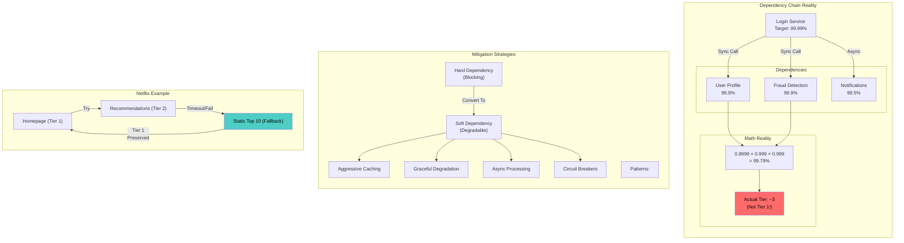
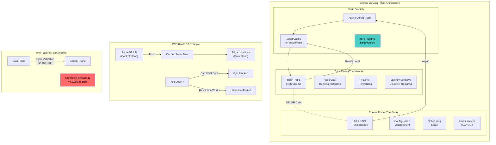

# Availability Tiers - Reality Check

This guide covers 5 key areas: I. The Strategic Framework: Defining Availability Tiers, II. The Reality Check: Dependency Mapping & The "Weakest Link", III. Control Plane vs. Data Plane Separation, IV. Architecture & Infrastructure Implications per Tier, V. Operational Rigor & Governance.

## I. The Strategic Framework: Defining Availability Tiers

```mermaid
flowchart TB
    subgraph "Availability Tier Framework"
        direction TB

        subgraph "Tier 0: Core Infrastructure"
            T0["DNS, IAM, Network<br/>99.999% (5 min/year)"]
            T0Arch["Multi-Region Active-Active<br/>Zero Human Intervention"]
            T0Cost["Cost: 50-100x Baseline"]
        end

        subgraph "Tier 1: Critical Product"
            T1["Checkout, Playback, Search<br/>99.99% (52 min/year)"]
            T1Arch["Active-Active<br/>Cellular Architecture"]
            T1Cost["Cost: 10x Baseline"]
        end

        subgraph "Tier 2: Business Critical"
            T2["Personalization, Analytics<br/>99.9% (8.7 hr/year)"]
            T2Arch["Active-Passive<br/>Regional Failover"]
            T2Cost["Cost: Baseline"]
        end

        subgraph "Tier 3: Internal/Non-Critical"
            T3["Dashboards, Dev Tools<br/>99.0% (3.6 days/year)"]
            T3Arch["Single Zone<br/>Nightly Backups"]
            T3Cost["Cost: 0.5x Baseline"]
        end
    end

    subgraph "The Inversion Rule"
        Rule["A Tier N service can NEVER<br/>have hard dependency on<br/>Tier N+1 or lower"]

        Violation["Tier 1 → Tier 2 Call"]
        Violation --> |"Synchronous"| Math["99.99% × 99.9%<br/>= 99.89%"]
        Math --> |"Result"| Downgrade["Tier 1 Becomes<br/>Tier 2!"]
    end

    subgraph "Cost of Nines"
        ThreeNines["3 Nines: LB + Autoscaling"]
        FourNines["4 Nines: + Multi-Region<br/>+ 24/7 SRE"]
        FiveNines["5 Nines: + Custom Hardware<br/>+ Automated Remediation"]
    end

    style T0 fill:#ff6b6b,color:#000
    style T1 fill:#ffd93d,color:#000
    style T2 fill:#4ecdc4,color:#000
    style T3 fill:#a8e6cf,color:#000
```

Establishing availability tiers is the foundational governance mechanism for distributed system architecture. At the Principal level, your role is to translate these tiers from abstract percentages into concrete architectural patterns, operational contracts, and resource allocation strategies. You must navigate the friction between Product (who theoretically wants 100% uptime for everything) and Engineering (who understands the exponential cost of each additional "nine").

### 1. Architectural Implications of Tier Decisions

When a service is designated Tier 1 versus Tier 2, the fundamental architecture changes. A Tier 1 designation is a mandate for **Static Stability** and **Cell-Based Architecture**.

*   **Tier 1 (The Control Plane / "Dial Tone"):**
    *   **Architecture:** Must operate in an Active-Active configuration across multiple regions. It requires full isolation; a "poison pill" request that crashes one partition must not be able to crash others.
    *   **Data Consistency:** Often prioritizes Availability over Consistency (AP in CAP theorem) or utilizes complex synchronous replication (like Google Spanner) to achieve external consistency without sacrificing availability, albeit at high latency costs.
    *   **Mag7 Example:** **AWS IAM (Identity and Access Management)**. If IAM goes down, no one can launch instances or access buckets. Therefore, the IAM data plane is architected to answer auth requests even if the IAM control plane (where you edit policies) is completely offline. It relies on cached data pushed to the edge.
    *   **Tradeoff:** High storage costs due to massive redundancy and slower feature velocity because every change carries existential risk to the platform.

*   **Tier 2 (Business Critical):**
    *   **Architecture:** Often Active-Passive or Active-Active within a single region with cross-region failover capabilities (which takes minutes, not milliseconds).
    *   **Mag7 Example:** **Netflix Personalization**. If the recommendation algorithm fails, Netflix does not show an error page. It degrades gracefully to a "Tier 1 fallback"—a static list of popular movies. The personalized experience is Tier 2; the ability to play *something* is Tier 1.
    *   **Tradeoff:** The system accepts "brownouts" (degraded performance) rather than total blackouts. This reduces infrastructure spend by roughly 40-60% compared to Tier 1.

### 2. Dependency Management: The "Inversion Rule"

A critical failure mode in large-scale distributed systems is **Dependency Inversion**, where a Tier 1 service inadvertently takes a hard dependency on a Tier 2 or Tier 3 service.

*   **The Rule:** A service can never have a synchronous, hard dependency on a service with a lower availability tier.
*   **The Mechanism:** If a Tier 1 service (e.g., Checkout) calls a Tier 2 service (e.g., Rewards Calculation) and the Tier 2 service hangs, the Tier 1 service must timeout immediately and proceed without the non-critical data.
*   **Mag7 Behavior:** At Amazon, if the "Frequently Bought Together" widget (Tier 2) has high latency, the page rendering engine (Tier 1) cuts the connection and loads the page without it. This is enforced via strict client-side timeouts and circuit breakers.
*   **ROI Impact:** Preventing dependency inversion saves millions in potential lost revenue. If the Checkout page waits for the Rewards service, and the Rewards service goes down, you lose 100% of sales. By enforcing the tiering rule, you preserve the sale (Tier 1) even if the user experience is slightly suboptimal (Tier 2).

### 3. The Cost of Nines: ROI and Business Capabilities

As a Principal TPM, you must audit the "Cost of Nines." Moving from 99.9% to 99.99% is not an incremental cost; it is typically a step-function increase.

*   **3 Nines (Tier 2):** Requires load balancing, auto-scaling, and automated database backups.
    *   *Cost:* Baseline.
*   **4 Nines (Tier 1):** Requires all of the above plus multi-region redundancy, dedicated connectivity (e.g., AWS Direct Connect equivalent), and a 24/7 "follow-the-sun" SRE team.
    *   *Cost:* ~10x Baseline.
*   **5 Nines (Tier 0/Core):** Requires specialized hardware, custom OS kernels (in some cases), and "hands-off" automated remediation where humans are removed from the loop to prevent error.
    *   *Cost:* ~50x-100x Baseline.

**Business Capability Impact:**
Over-tiering a service (e.g., demanding Tier 1 status for an internal analytics dashboard) creates **Opportunity Cost**. Engineering hours spent building multi-region failover for a dashboard are hours not spent on revenue-generating features. Conversely, under-tiering a critical path (e.g., treating a payment gateway as Tier 2) creates **Existential Risk**.

### 4. Operational Rigor and Deployment Velocity

Tiers dictate the "Speed Limit" of the software development lifecycle (SDLC).

*   **Tier 1 Deployment:**
    *   **Process:** Zonal deployments (one zone at a time), followed by region-by-region rollouts. Bake times (waiting periods to check for errors) are mandatory and significant (e.g., 4-24 hours per stage).
    *   **Restriction:** Deployments are often blocked during high-traffic windows (e.g., Black Friday/Cyber Monday for Amazon, Super Bowl for streaming services).
    *   **Impact:** Feature velocity is intentionally slowed to preserve stability.

*   **Tier 2/3 Deployment:**
    *   **Process:** Continuous Deployment (CD) with automated canary analysis. If the canary passes, the fleet is updated rapidly.
    *   **Impact:** High velocity allows for rapid A/B testing and product iteration.

**Real-World Failure Mode:** A common anti-pattern occurs when Product demands Tier 1 reliability *and* Tier 3 velocity. The Principal TPM must articulate that these are mutually exclusive: "We can deploy instantly, or we can guarantee 99.99% uptime. We cannot do both."

### 5. Handling Tier Drift

Systems evolve. A Tier 3 service (e.g., a metadata lookup tool) often becomes a hidden dependency for a Tier 1 service.

*   **Detection:** This is identified through **Chaos Engineering** (e.g., Netflix's Chaos Monkey). By intentionally taking down the Tier 3 service in a controlled environment, you verify if the Tier 1 service survives. If the Tier 1 service fails, you have identified "Tier Drift."
*   **Remediation:** You must either (A) upgrade the Tier 3 service to Tier 1 standards (expensive), or (B) re-engineer the Tier 1 service to cache the data and remove the hard dependency (architecturally complex).

## II. The Reality Check: Dependency Mapping & The "Weakest Link"

Defining availability tiers is an academic exercise if you do not rigorously map and govern the dependencies between those tiers. The fundamental law of distributed systems availability is that **a service is only as available as its least available hard dependency.**

As a Principal TPM, your role is to identify "Availability Inversions"—scenarios where a Tier 1 service (99.99%) synchronously relies on a Tier 2 (99.9%) or Tier 3 service. If this dependency is strict (blocking), the Tier 1 service mathematically becomes a Tier 2 service, regardless of how much redundancy you build into its own infrastructure.

### 1. The Mathematics of Serial Dependencies

In a microservices architecture (common at Mag7), availability is calculated based on the probability of success for all synchronous calls required to serve a request.

*   **The Formula:** $Availability_{Total} = Availability_{Service} \times Availability_{Dep1} \times Availability_{Dep2} \dots$
*   **The Reality:** If your Login Service (Target: 99.99%) calls a User Profile Service (Target: 99.9%) and a Fraud Detection Service (Target: 99.9%) synchronously:
    $$0.9999 \times 0.999 \times 0.999 \approx 99.79\%$$
    
    You have inadvertently created a Tier 3 service (approx 18 hours of downtime/year) while promising Tier 1 (52 minutes/year).

**Mag7 Behavior:**
At companies like Amazon and Google, automated tooling (e.g., internal service mesh monitors) continuously audits call graphs. If a Tier 1 service introduces a synchronous call to a non-Tier 1 service, the deployment pipeline often blocks the release or flags a high-severity architectural violation.

### 2. Hard vs. Soft Dependencies

To maintain high availability despite lower-tier dependencies, you must enforce the distinction between Hard and Soft dependencies.

*   **Hard Dependency (Synchronous/Blocking):** The request cannot be completed without a response from the downstream service.
    *   *Example:* An authentication token validation.
*   **Soft Dependency (Asynchronous/Degradable):** The request can be completed with a "degraded" experience if the dependency fails.

**Mag7 Implementation Strategy:**
You must drive the engineering teams to implement **Graceful Degradation**.

*   **Netflix Example:** When you load the Netflix homepage, the "Personalized Recommendations" service is a complex, compute-heavy Tier 2 system. If it fails or times out, the Tier 1 "Homepage App" does not crash. Instead, it falls back to a pre-cached, static list of "Top 10 Movies Globally." The user gets a generic experience (degraded), but the service remains "Up" (Tier 1 availability preserved).
*   **Amazon Example:** On a Product Detail Page, the "Add to Cart" and "Price" services are Tier 1. The "User Reviews" and "Similar Items" sections are Tier 2 or 3. If the Reviews service is down, the page loads without reviews. The core business transaction (buying) is protected.

**Tradeoffs:**
*   **Complexity vs. Uptime:** converting a Hard dependency to a Soft dependency requires significant engineering effort (implementing fallbacks, circuit breakers, and stale-cache serving logic).
*   **Consistency vs. Availability:** Using cached data when a dependency is down favors availability (CAP theorem AP) but risks showing stale data (e.g., showing a movie that was just removed from the catalog).

### 3. The "Shared Infrastructure" Risk (Tier 0)

A common blind spot for Generalist TPMs is ignoring the "Tier 0" dependencies—the shared utilities that everyone assumes will always work.

*   **The Components:** DNS, Identity (IAM/Entra ID), Network Load Balancers, and Configuration Management (e.g., ZooKeeper/Etcd).
*   **The Risk:** If a Tier 3 batch job accidentally DDoS-es the shared Identity service, it can bring down Tier 1 customer-facing services because they share the same control plane.

**Mag7 Action - Cellular Architecture & Bulkheading:**
To mitigate this, Mag7 companies use **Cellular Architecture**. They shard services into isolated "cells" or "stamps."
*   **Implementation:** Identity Service Cell A serves only Premium Users. Identity Service Cell B serves Internal Tools.
*   **Impact:** If the internal tools overload Cell B, the customer-facing Cell A remains unaffected.
*   **ROI Impact:** This increases infrastructure costs significantly (loss of resource pooling efficiency) but is the only way to mathematically guarantee Tier 1 isolation.

### 4. Circular Dependencies

Circular dependencies are the silent killers of availability and are strictly forbidden in Mag7 architectural reviews.
*   **Scenario:** Service A calls Service B. Service B calls Service C. Service C calls Service A.
*   **Failure Mode:** If Service A crashes and reboots, it calls B. B calls C. C calls A (which is still rebooting). The request fails, causing B and C to fail. The system enters a "deadlock" or "boot loop" where the cluster cannot recover without manual intervention (shutting off traffic).

**TPM Governance:**
As a Principal TPM, you must institute **Layered Architecture Rules**.
*   **Rule:** Tier 1 services can never depend on Tier 2 services.
*   **Rule:** Services in Layer N can only call services in Layer N-1 or lower. They cannot call "up" the stack.

### 5. Business & ROI Implications

Failure to map dependencies correctly has direct bottom-line impacts:

1.  **SLA Credits & Revenue Loss:** If a Tier 1 service breaches its 99.99% SLA because of a Tier 3 dependency, the company owes millions in service credits (Cloud providers) or loses direct sales (e-commerce).
2.  **Wasted Engineering Spend:** There is negative ROI in optimizing a service to 99.999% code quality if it relies on a 99.9% database. You are spending Tier 1 money for Tier 2 results.
3.  **Incident Response Fatigue:** Misunderstood dependencies lead to "alert storms" where a failure in a non-critical logging system pages the on-call engineers for the critical payments system, leading to burnout.

## III. Control Plane vs. Data Plane Separation

### 1. Architectural Definition and Business Criticality

At the Principal level, understanding the separation of Control Plane and Data Plane is not merely an architectural preference; it is the primary mechanism for achieving "Static Stability." This separation ensures that a failure in the system's ability to mutate state (Control Plane) does not impact the system's ability to serve existing traffic (Data Plane).

*   **The Control Plane (The Brain):** The administrative machinery. It handles configuration, authentication, scheduling, and resource allocation. It is complex, lower volume, and typically request/response based.
    *   *Mag7 Example:* The AWS EC2 API (`RunInstances`, `StopInstances`), the Kubernetes API Server, or the logic determining which ads to display in a Meta feed.
*   **The Data Plane (The Muscle):** The operational machinery. It forwards packets, retrieves database rows, or streams video chunks. It is simple, massive volume, and latency-sensitive.
    *   *Mag7 Example:* The hypervisor running the EC2 instance, the `kube-proxy` forwarding traffic, or the CDN edge node delivering the ad media.

**The "Prime Directive" for Principal TPMs:**
You must enforce a strict dependency hierarchy: **The Data Plane must never depend on the Control Plane availability to function.** If the Control Plane goes down, the Data Plane should continue operating in its last known good state.

### 2. Deep-Dive: Static Stability and Fate Sharing

The highest ROI of this separation is **Static Stability**. A statically stable system continues to work even when its dependencies (like the Control Plane) fail.

**How it works technically:**
1.  **Asynchronous Propagation:** The Control Plane pushes configuration to the Data Plane asynchronously.
2.  **Local Caching:** The Data Plane caches this configuration locally on the host.
3.  **Zero-Runtime Dependency:** When a user request hits the Data Plane, the system reads from local memory/disk, not by calling the Control Plane.

**Mag7 Real-World Example: AWS Route 53 vs. EC2**
*   **Scenario:** You update a DNS record (Control Plane action).
*   **Behavior:** The change propagates to thousands of edge locations (Data Plane).
*   **Resilience:** If the Route 53 API goes down, you cannot change records. However, the world’s DNS resolution (Data Plane) continues to function 100% because the edge locations have a cached copy of the "zone file."
*   **Business Impact:** Revenue-generating traffic continues uninterrupted. Operational changes are paused.

**Tradeoff Analysis:**
*   **Consistency vs. Availability:** By separating planes, you accept **Eventual Consistency**. There is a lag (seconds to minutes) between a Control Plane change and Data Plane realization.
*   **Complexity vs. Reliability:** Building a reliable propagation mechanism is significantly more expensive (Engineering OpEx) than a direct synchronous call, but it prevents "Fate Sharing" (where the crash of one component takes down the other).

### 3. Implementation Strategies and TPM Governance

As a Principal TPM, you assess whether a service requires this architectural split based on its Availability Tier.

**Tier 1 Services (Critical): Strict Separation Required**
*   **Requirement:** The Data Plane must survive a complete regional Control Plane blackout.
*   **Implementation:** Configuration is pushed to edge nodes. No "call home" allowed on the hot path.
*   **Example (Netflix Open Connect):** If the Netflix control plane (AWS) fails, users cannot browse the catalog or hit "Play" on a new title. However, users *already* streaming a movie (connected to the Open Connect Appliance Data Plane) will finish their movie without interruption.
*   **ROI:** Prevents total service blackout during high-stress incidents (e.g., Super Bowl, Black Friday).

**Tier 2/3 Services: Relaxed Separation**
*   **Requirement:** Optimization for development speed and consistency over absolute uptime.
*   **Implementation:** The Data Plane might query the Control Plane with a short TTL (Time To Live) cache.
*   **Risk:** If the Control Plane fails, the Data Plane fails once the cache expires.
*   **Benefit:** Cheaper to build; guarantees users see data updates immediately.

### 4. Common Anti-Patterns and Failure Modes

You must identify and block these anti-patterns during design reviews:

**A. The "Circular Dependency" of Death**
*   *The Pattern:* The Data Plane needs the Control Plane to start, but the Control Plane runs *on* the Data Plane.
*   *Mag7 Context:* If your internal DNS service (Control Plane) runs on your cloud instances (Data Plane), and a network event severs connection, the instances can't resolve the DNS to reconnect. The system cannot self-heal.
*   *Remediation:* Bootstrapping logic must use hardcoded fallbacks or IP addresses, not DNS names managed by the system itself.

**B. Synchronous Validation on the Hot Path**
*   *The Pattern:* Every Data Plane request calls the Control Plane to validate a token or quota.
*   *Impact:* This effectively merges the availability of both planes. If the Control Plane has 99.9% availability and the Data Plane has 99.99%, the combined availability drops to 99.9% (the lowest common denominator).
*   *Remediation:* Use cryptographic validation (JWTs) where the Data Plane can verify the signature locally without calling the issuer (Control Plane).

### 5. Business and ROI Impact

| Impact Category | Control/Data Plane Separation | Unified (Monolithic) Plane |
| :--- | :--- | :--- |
| **Availability (SLA)** | **High.** Data Plane survives Control Plane outages. | **Lower.** Outage in one takes down both. |
| **Engineering Cost** | **High.** Requires complex sync logic, caching, and edge-handling. | **Low.** Simple CRUD applications. |
| **User Experience (CX)** | **Degraded but Functional.** "You can't change settings, but the service works." | **Total Failure.** "Service Unavailable." |
| **Scalability** | **Massive.** Data Plane scales independently of administrative logic. | **Bottlenecked.** Admin logic constrains throughput. |

**Strategic Decision Framework:**
For a Tier 1 service, the **Cost of Downtime (CoD)** usually exceeds the **Cost of Engineering (CoE)** required to separate the planes. For Tier 3 internal tools, the CoE to separate planes is rarely justified.

## IV. Architecture & Infrastructure Implications per Tier
As a Principal TPM, you guide the architecture review. You don't write the code, but you question the design choices based on the assigned Tier.

**Tier 1 Architecture (Active-Active Multi-Region):**
*   **Cellular Architecture:** Isolate failures to small "cells" or "shards" so a bad deployment affects only 5% of users, not 100%.
*   **Multi-Region Active-Active:** Traffic is load-balanced across US-East and US-West simultaneously. If one region dies, traffic shifts automatically.
*   **No Single Points of Failure (SPOF):** Redundant power, networking, and storage.

**Tier 2 Architecture (Active-Passive):**
*   **Regional Failover:** Primary database in Zone A, replica in Zone B. Failover takes 1-2 minutes (acceptable for Tier 2).
*   **Auto-Scaling:** Standard scaling policies based on CPU/Memory.

**Tier 3 Architecture:**
*   **Single Zone:** Deployed in a single availability zone. If the zone has issues, the service waits.
*   **Nightly Backups:** Rather than real-time replication.

**Tradeoffs:**
*   **Data Synchronization Costs:** Active-Active (Tier 1) requires complex conflict resolution logic for databases (Last-Writer-Wins, CRDTs) and expensive cross-region data transfer fees.
*   **Utilization:** Active-Passive (Tier 2) means paying for "Passive" compute capacity that sits idle 99% of the time.

**Impact:**
*   **ROI:** Aligning architecture to tiers prevents "Gold Plating" (building a Ferrari for a grocery run).

## V. Operational Rigor & Governance

Operational rigor is the enforcement mechanism for the Availability Tiers defined in the strategic framework. As a Principal TPM, you are not responsible for writing the code that fixes a bug, but you are responsible for the **mechanism** that ensures the bug is fixed, the root cause is identified, and the class of error is permanently eliminated. Governance at a Mag7 level shifts from "gatekeeping" to "paved roads"—creating default-safe paths for deployment and operation that make it hard for engineers to accidentally cause a SEV1 (critical severity) incident.

### 1. The Correction of Error (COE) / Post-Mortem Culture

At Mag7 companies, the "Post-Mortem" (Google) or "Correction of Error" (Amazon) is the single most important document for operational maturity. It is not a summary of an outage; it is a forensic analysis.

*   **The Mechanism:**
    *   **Trigger:** Any SEV1 or SEV2 incident, or a "near miss" (a failure that was caught by a safety mechanism but would have been catastrophic).
    *   **The 5 Whys:** You must drill down past the proximate cause ("The server crashed") to the root cause ("We lack input sanitization on the legacy API").
    *   **Action Items (AIs):** AIs must be specific and assigned to a specific owner. Crucially, at the Principal level, you must enforce **Class-of-Error elimination**. If a config push caused an outage, the fix isn't "check config carefully next time" (human reliance); the fix is "implement a syntax validator in the CI/CD pipeline" (systemic fix).

*   **Mag7 Example:** Amazon’s weekly "Ops Meeting." Every Wednesday, senior leadership (often including CEO-level execs) reviews a specific COE. The TPM and Engineering Manager present the failure. This creates high accountability. If an AI is marked "Complete," the system must prevent that error from ever happening again.
*   **Tradeoff:** **Engineering Hours vs. Feature Velocity.** Writing a high-quality COE takes 4-8 engineering hours, plus review time. Implementing the systemic fixes may take weeks.
    *   *Decision Framework:* If you skip this, you accrue "Operational Debt." The tradeoff is accepted because the cost of a repeat SEV1 (millions in revenue/trust) outweighs the cost of 2 weeks of engineering time.

### 2. Deployment Safety and Bake Times

Governance is most visible in how code reaches production. The era of "move fast and break things" ends when you become a utility for billions of users.

*   **The Mechanism:**
    *   **The Pipeline:** Code moves from Alpha $\to$ Beta $\to$ Gamma $\to$ Prod One-Box (1% traffic) $\to$ Prod One-Region $\to$ Global Rollout.
    *   **Bake Time:** Mandatory waiting periods between stages to allow metrics (latency, error rates, memory usage) to stabilize.
    *   **Blockers:** Automated rollback triggers. If error rates spike >1% during the One-Box phase, the deployment automatically reverts without human intervention.

*   **Mag7 Example:** Amazon’s "Apollo" deployment engine. Principal TPMs define the "Release Consistency" policies. For a Tier 1 service (e.g., IAM), the bake time might be 24 hours per region. For a Tier 3 internal tool, it might be 15 minutes.
*   **Tradeoff:** **Time-to-Market (TTM) vs. Blast Radius.**
    *   *Impact:* A global rollout for a Tier 1 service can take 4-5 days. This frustrates Product Managers who want features live *now*.
    *   *ROI:* The ROI is infinite if it prevents a global outage. The TPM’s job is to defend the bake time against product pressure, arguing that "slow is smooth, and smooth is fast."

### 3. Operational Readiness Reviews (ORR)

Before a service moves from Tier 4 (Experimental) to Tier 1 or 2, it must pass an ORR. This is a governance gate.

*   **The Mechanism:** A standardized audit covering:
    *   **Observability:** Are dashboards, alarms, and logs standardized?
    *   **Capacity:** Is there a documented scaling plan? Is quota approved for peak events (e.g., Prime Day, Black Friday)?
    *   **Security:** Has the AppSec review been completed?
    *   **Runbooks:** Do on-call engineers have copy-paste commands to mitigate common failures?

*   **Mag7 Example:** Google’s Production Readiness Review (PRR) conducted by SREs. If a dev team wants SRE support, they must pass the PRR. If they fail, they hold the pager themselves.
*   **Tradeoff:** **Launch Speed vs. Operational Burden.**
    *   *Impact:* Enforcing ORRs delays launch dates.
    *   *CX Impact:* Launches without ORRs often result in "Launch Day SEVs," which destroy customer trust immediately. The ORR ensures the "Day 2" experience is stable.

### 4. Game Days and Chaos Engineering

Passive governance (rules) is insufficient; active governance (testing) is required.

*   **The Mechanism:** Deliberately injecting failure into the system to verify that the Availability Tiers hold up.
    *   *Scenario:* "What happens if US-EAST-1 loses connectivity to the database?"
    *   *Execution:* Actually sever the connection in a controlled manner (or staging environment) and verify that failover automation kicks in within the allowed recovery time objective (RTO).

*   **Mag7 Example:** Netflix’s Chaos Monkey (randomly killing instances) and Kong (killing regions). Amazon performs mandatory "Game Days" before Prime Day where teams must prove their services can handle load shedding and dependency failures.
*   **Tradeoff:** **Risk of Self-Inflicted Downtime vs. Unknown Unknowns.**
    *   *Risk:* There is a non-zero chance a Game Day causes a real outage.
    *   *Mitigation:* Conduct these during low-traffic windows or in "Shadow" environments. The business value is identifying a single point of failure (SPOF) *before* it breaks naturally at peak load.

### 5. Error Budgets and Freeze Policies

This is the financial model of operational rigor. It connects the SLA (e.g., 99.9%) to the development lifecycle.

*   **The Mechanism:**
    *   If a service targets 99.9% availability, it has an "Error Budget" of ~43 minutes of downtime per month.
    *   If the team burns this budget (due to bugs, outages, or risky experiments), **Feature Development Freezes.**
    *   The team must pivot 100% of resources to reliability engineering until the budget resets or stability is proven.

*   **Mag7 Example:** Google SRE model. This serves as a negotiated contract between Product (who wants speed) and Engineering (who wants stability).
*   **Impact on Business:** This aligns incentives. Product Managers stop pushing for risky launches if they know a crash will halt their roadmap for a month. It forces a shared responsibility for quality.

---

## Interview Questions

### I. The Strategic Framework: Defining Availability Tiers

**Question 1: The Product vs. Engineering Conflict**
"You are the TPM for a new user-facing feature in a streaming platform. The Product VP insists this feature is 'critical' and demands Tier 1 (99.99%) availability. The Engineering Lead argues that the architecture required for Tier 1 will delay launch by 3 months and blow the budget. How do you resolve this impasse?"

*   **Guidance for a Strong Answer:**
    *   **Quantify the Impact:** Do not rely on opinions. Ask, "If this feature is down for 30 minutes, exactly how much revenue or engagement is lost?"
    *   **Propose Graceful Degradation:** Suggest launching as Tier 2 but ensuring the UI handles failure elegantly (e.g., the feature disappears rather than crashing the app).
    *   **Phased Approach:** Launch at Tier 2 to validate product-market fit (speed to market), with a roadmap item to upgrade to Tier 1 if adoption metrics justify the ROI.
    *   **Governance:** Reference the "Cost of Nines" to show the VP that the 3-month delay is a direct consequence of the availability requirement, forcing a business decision on time-to-market vs. reliability.

**Question 2: Dependency Management**
"We discovered that our Tier 1 Checkout service has a hard dependency on a Tier 3 Inventory History service. The Inventory team has no budget to upgrade their infrastructure. As the Principal TPM for Checkout, what are your immediate and long-term actions?"

*   **Guidance for a Strong Answer:**
    *   **Immediate Mitigation:** Implement a "Circuit Breaker" and a fallback strategy. If Inventory History fails, Checkout should default to "In Stock" (accepting the risk of overselling) or check a local cache, rather than failing the transaction.
    *   **Architectural Decoupling:** Move from synchronous calls to asynchronous events. Checkout shouldn't ask Inventory History for data; Inventory History should push updates to a Checkout-owned data store (inverting the flow).
    *   **SLA Enforcement:** Establish that the Checkout team cannot be held to a 99.99% SLA if they rely on a 99.0% dependency. Recalculate the composite SLA to demonstrate the math to leadership.

### II. The Reality Check: Dependency Mapping & The "Weakest Link"

**Question 1: The Dependency Trap**
"You are the TPM for a new Tier 1 payment processing service. During the architecture review, you notice the engineering team has taken a hard dependency on a legacy 'Fraud Check' system that is known to be Tier 2 (frequent maintenance windows, 99.9% availability). The team claims they cannot decouple it because fraud checks are legally required before a transaction clears. How do you resolve this conflict to meet your Tier 1 goals?"

*   **Guidance for a Strong Answer:**
    *   **Acknowledge the Math:** State clearly that the Payment service is currently Tier 2 due to the dependency.
    *   **Reject "Hope" as a Strategy:** Don't just ask the legacy team to "do better."
    *   **Propose Architectural Patterns:** Suggest an asynchronous flow (authorize funds first, settle later) or a "Fail Open/Fail Closed" strategy based on risk appetite (e.g., for small transactions, allow them through if Fraud is down; for large ones, block).
    *   **Discuss "Stand-in" Processing:** Suggest a localized, lightweight rule engine within the Payment service to handle basic fraud checks when the main legacy system is down.

**Question 2: Circular Dependencies & Recovery**
"We recently had a major outage where Service A could not restart because it needed configuration data from Service B, but Service B was down because it was overwhelmed by retries from Service A. How would you design the system and processes to prevent this 'boot loop' scenario in the future?"

*   **Guidance for a Strong Answer:**
    *   **Identify the Core Issue:** This is a circular dependency coupled with a "Thundering Herd" problem.
    *   **Prevention (Design):** Enforce strict layering. Service A should cache configuration locally or bake it into the deployment image so it can start without Service B.
    *   **Mitigation (Runtime):** Implement exponential backoff with jitter for retries.
    *   **Governance:** Mention implementing a "Static Analysis" step in the CI/CD pipeline to detect circular calls before code is merged.

### III. Control Plane vs. Data Plane Separation

**Question 1: Designing for Static Stability**
"We are building a new global feature flagging system that will control the rollout of code to 2 billion users. If the configuration API goes down, we cannot risk the application crashing or defaulting to a state that breaks the user experience. How would you architect the interaction between the Control Plane (the admin UI/API) and the Data Plane (the application reading the flag) to ensure 99.999% availability on the read path?"

*   **Guidance for a Strong Answer:**
    *   **Architecture:** The candidate must propose an asynchronous architecture. The API pushes a signed configuration file (JSON/Proto) to a highly available intermediate store (e.g., S3/CDN).
    *   **The Data Plane:** The application SDK polls the CDN or receives a push notification to update its local memory cache.
    *   **Failure Mode:** If the API fails, the application simply continues using the last successfully fetched configuration (Static Stability).
    *   **Safety:** Discuss "Safe Defaults" in code if the cache is empty on a cold boot.
    *   **Bonus:** Mentioning "Zonal/Regional Isolation" so that a bad config push doesn't take down all regions simultaneously.

**Question 2: Handling Thundering Herds**
"During a massive regional outage, our Control Plane was overwhelmed by millions of Data Plane agents trying to reconnect simultaneously, causing a cascading failure. As the Principal TPM leading the post-mortem and remediation, what mechanisms would you prioritize to prevent this 'Thundering Herd' in the future?"

*   **Guidance for a Strong Answer:**
    *   **Jitter:** Implementing exponential backoff with jitter (randomized delays) on the agents so they don't all retry at the exact same millisecond.
    *   **Load Shedding:** The Control Plane must be able to reject excess traffic cheaply (HTTP 503) to preserve resources for processing successful requests.
    *   **Priority Queuing:** Distinct API endpoints for "Critical Recovery" traffic vs. "Standard" traffic, prioritizing the former.
    *   **Local Resilience:** Increasing the local cache TTL on the agents so they can operate longer without reconnecting, reducing the urgency of the reconnection.

### V. Operational Rigor & Governance

### Question 1: The "Feature vs. Stability" Conflict
**Question:** "You are the TPM for a critical Tier 1 service. The Engineering team has exhausted their Error Budget for the quarter due to a series of instability issues. However, the VP of Product is demanding the launch of a high-profile feature next week to meet a marketing commitment. The Engineering Manager is conflicted. What do you do?"

**Guidance for a Strong Answer:**
*   **Data-Driven Defense:** Reference the Error Budget policy as a pre-agreed contract, not a personal opinion. The "budget" isn't arbitrary; it represents Customer Trust.
*   **Risk Assessment:** Quantify the risk. "If we launch while unstable, the probability of a SEV1 is X%. A SEV1 during a marketing launch is worse than a delayed launch."
*   **The "Third Option":** Don't just say "No." Propose a mitigation. Can we launch a "Dark Canary" (traffic mirrored but not shown to users)? Can we launch to 1% of users? Can we feature-flag it off by default?
*   **Escalation:** Acknowledge that if the VP insists, you will escalate to the SVP/CEO level, documenting the risk acceptance. You are the guardian of the process.

### Question 2: The Recurring Root Cause
**Question:** "You notice that three different teams in your organization have suffered outages in the last month caused by expired TLS certificates. Each team fixed their specific cert and closed the incident. As a Principal TPM, how do you handle this?"

**Guidance for a Strong Answer:**
*   **Pattern Recognition:** Identify that this is not three isolated incidents; it is a systemic failure of governance (a "Class of Error").
*   **Systemic Fix:** The solution is not "email teams to check certs." The solution is automation. Propose a centralized certificate management system (like AWS ACM) or a linter in the CI/CD pipeline that blocks deployment if a cert is within 30 days of expiry.
*   **Mechanism Implementation:** Describe how you would drive this programmatically: Audit all services for manual cert management, create a migration roadmap to the automated system, and set a deadline.
*   **Outcome:** "I would consider success only when it is *technically impossible* for a team to deploy with an expiring certificate."

---

## Key Takeaways

- Review each section for actionable insights applicable to your organization

- Consider the trade-offs discussed when making architectural decisions

- Use the operational considerations as a checklist for production readiness
