# Backpressure

This guide covers 5 key areas: I. Conceptual Overview: The "Fast Producer, Slow Consumer" Problem, II. Strategies for Handling Backpressure & Trade-offs, III. Real-World Behavior at Mag7 Companies, IV. Business Impact, ROI, and CX, V. Summary for the Interview.

## I. Conceptual Overview: The "Fast Producer, Slow Consumer" Problem ⚠️

*Note: This section may need additional review.*

At a Mag7 scale, systems are rarely static. Backpressure is a systemic feedback mechanism used when a downstream service (the consumer) cannot keep up with the rate of data coming from an upstream service (the producer).

Think of it as a physical pipe system. If you pour water into a funnel faster than the narrow neck can drain it, the water eventually spills over. Backpressure is the mechanism that signals the person pouring the water to "stop" or "slow down" before the spill occurs.

**For a Principal TPM, the key realization is this:** Backpressure is not just an engineering implementation detail; it is a **resilience strategy**. It prevents a single slow microservice from causing a cascading failure that takes down an entire platform (e.g., Amazon.com going down because the "Recommendations" widget is slow).

### The Core Dynamic
1.  **Producer:** Generates requests (e.g., User clicks, IoT sensor data, Payment transactions).
2.  **Consumer:** Processes requests (e.g., Database writer, ML Inference model, Third-party API).
3.  **The Delta:** When Producer Rate > Consumer Rate, you have a backlog.

```mermaid
flowchart LR
    subgraph Producer["Producer<br/>10,000 req/s"]
        P["📤"]
    end

    subgraph Queue["Buffer"]
        Q["📦 Queue<br/>Growing backlog"]
    end

    subgraph Consumer["Consumer<br/>5,000 req/s"]
        C["📥"]
    end

    P -->|"Fast"| Q
    Q -->|"Slow"| C

    subgraph Problem["Without Backpressure ❌"]
        direction TB
        Mem["Memory exhausted"]
        Crash["System crash"]
        Mem --> Crash
    end

    subgraph Solution["With Backpressure ✅"]
        direction TB
        Signal["Signal: 'Slow down!'"]
        Adapt["Producer throttles<br/>OR requests shed"]
        Signal --> Adapt
    end

    Q -.-> Problem
    Q -.-> Solution

    style Problem fill:#ffcdd2
    style Solution fill:#e8f5e9
```

Without backpressure, the system will exhaust resources (CPU, RAM, File Descriptors) trying to buffer the excess, eventually crashing the consumer *and* potentially the producer.

---

## II. Strategies for Handling Backpressure & Trade-offs ⚠️

*Note: This section may need additional review.*

As a TPM, you will often facilitate architectural debates on how to handle traffic spikes. You generally have three levers: **Control, Buffer, or Drop.**

```mermaid
flowchart TB
    Overload["System Overloaded<br/>Producer > Consumer"]

    subgraph Control["1. CONTROL<br/>(Throttling)"]
        C1["Consumer → Producer:<br/>'429 Slow Down'"]
        C2["Latency pushed upstream<br/>User sees spinner"]
    end

    subgraph Buffer["2. BUFFER<br/>(Queueing)"]
        B1["Insert message queue<br/>(Kafka, SQS)"]
        B2["Consumer pulls at own pace<br/>Data processed later"]
    end

    subgraph Drop["3. DROP<br/>(Load Shedding)"]
        D1["Reject new requests<br/>immediately"]
        D2["Data loss accepted<br/>for system stability"]
    end

    Overload --> Control
    Overload --> Buffer
    Overload --> Drop

    style Control fill:#e3f2fd
    style Buffer fill:#fff3e0
    style Drop fill:#ffcdd2
```

### 1. Blocking/Throttling (Control)
The consumer explicitly tells the producer to stop sending data. In TCP/IP, this happens automatically. In microservices (gRPC/HTTP), the consumer returns a `429 Too Many Requests` or a specific "Back off" signal.

*   **Mag7 Context:** An internal service at Google calling the Spanner database. If Spanner is saturated, the client library automatically retries with exponential backoff.
*   **Trade-off:** This pushes latency upstream. The user sees a spinning wheel because the frontend is waiting for the backend to accept the request.

### 2. Buffering (Queueing)
You introduce an intermediary (like Kafka, SQS, or RabbitMQ) to decouple the producer and consumer. The producer dumps data into the queue; the consumer reads at its own pace.

*   **Mag7 Context:** Amazon Order Processing. When you click "Buy," the system doesn't immediately charge the card and ship. It drops the order into a queue. If the fulfillment service is slow, the queue grows, but the user experience remains fast.
*   **Trade-off:**
    *   *Latency:* Data is not processed in real-time.
    *   *Complexity:* You must manage queue depth. If the queue fills up (unbounded queue), you crash the broker.

### 3. Load Shedding (Dropping)
When the system is at capacity, new requests are simply rejected immediately.

*   **Mag7 Context:** Netflix Telemetry. If the logging pipeline is overwhelmed, Netflix drops "debug" or "info" logs rather than slowing down the video stream.
*   **Trade-off:** Data loss. You sacrifice completeness for stability.

---

## III. Real-World Behavior at Mag7 Companies ⚠️

*Note: This section may need additional review.*

In a Principal TPM interview, you must demonstrate that you understand how these systems behave under the massive load typical of Mag7 environments.

### Example A: The "Thundering Herd" at Amazon (Prime Day)
**Scenario:** Millions of users log in simultaneously for a lightning deal. The "Login Service" is overwhelmed.
**Backpressure Mechanism:**
1.  **Rate Limiting:** The API Gateway rejects requests over a certain threshold per second per IP.
2.  **Circuit Breaking:** If the Login Database slows down, the Login Service "trips the circuit" and stops trying to call the DB, returning a fallback error immediately.
**Impact:** Some users get a "Please try again" screen (Load Shedding), but the servers stay alive for the lucky users who got in. Without this, the servers would crash, and *zero* users would be able to buy.

### Example B: Asynchronous Processing at Meta (Instagram Uploads)
**Scenario:** A user uploads a 4K video reel. Transcoding this video is CPU intensive.
**Backpressure Mechanism:**
1.  **Decoupled Queues:** The upload goes to S3, and a message goes to a Kafka topic.
2.  **Consumer Pull:** The video processing workers "pull" jobs only when they are free. They are never overwhelmed because work is not "pushed" to them.
**Impact:** If 10 million people upload at New Year's Eve, the *processing* might take 5 minutes instead of 30 seconds (latency increases), but the *upload* never fails.

### Example C: Google Search Indexing
**Scenario:** Crawlers find billions of new pages. The Indexer cannot process them instantly.
**Backpressure Mechanism:**
1.  **Prioritization:** Not all backpressure is equal. Google applies backpressure to "low rank" pages first, ensuring high-value news sites are indexed immediately while low-value blogs sit in the queue.

---

## IV. Business Impact, ROI, and CX ⚠️

*Note: This section may need additional review.*

A Principal TPM must connect technical architecture to business outcomes. Why should leadership invest engineering months into building sophisticated backpressure mechanisms?

### 1. Protection of Revenue (ROI)
*   **The Argument:** Without backpressure, a traffic spike causes a "Hard Down" (System Crash). During a crash, revenue is $0.
*   **The Gain:** With backpressure (e.g., Load Shedding), you might drop 5% of traffic to save the other 95%.
*   **Mag7 Reality:** For Amazon, 5 minutes of downtime on Prime Day is millions of dollars. Dropping 5% of requests is a financially sound decision compared to a total outage.

### 2. User Experience (CX) and Trust
*   **The Argument:** Latency is annoying, but errors destroy trust.
*   **The Gain:** Backpressure allows for **Graceful Degradation**.
    *   *Example:* If the "Personalized Recommendations" service is overloaded on Netflix, the system applies backpressure and falls back to "Generic Trending Now" lists. The user still sees content; they don't see an error screen.
*   **Mag7 Reality:** Users tolerate a slightly slower load time (buffering) more than they tolerate a "Service Unavailable" page.

### 3. Cost Efficiency (CapEx/OpEx)
*   **The Argument:** Without backpressure, you must provision hardware for the *maximum possible* peak load to avoid crashes.
*   **The Gain:** Backpressure allows you to provision for *average* load + a safety margin. You let the queues absorb the spikes.
*   **Mag7 Reality:** This saves millions in cloud infrastructure costs. You don't need 10,000 servers idle waiting for a spike; you use 2,000 servers and a queue.

---

## V. Summary for the Interview ⚠️

*Note: This section may need additional review.*

When asked about system stability, scaling, or handling spikes, follow this structure:

1.  **Identify the Constraint:** "In this design, the database write throughput is likely the bottleneck compared to the ingestion rate."
2.  **Propose the Mechanism:** "To handle this, I would introduce a message queue (Buffering) to decouple the ingestion from the write. However, we need a policy for when that queue fills up."
3.  **Define the Policy (The TPM Value Add):** "I would work with Product to define a prioritization strategy. If the queue is full, do we drop the data (Load Shedding) or block the user (Backpressure to client)? For a payment system, we block the user so they know it failed. For a metrics system, we drop the data."
4.  **Highlight the Win:** "This ensures that even during peak load, the core system remains stable, protecting our revenue stream and preventing a cascading outage."

---

## Key Takeaways

- Review each section for actionable insights applicable to your organization

- Consider the trade-offs discussed when making architectural decisions

- Use the operational considerations as a checklist for production readiness
