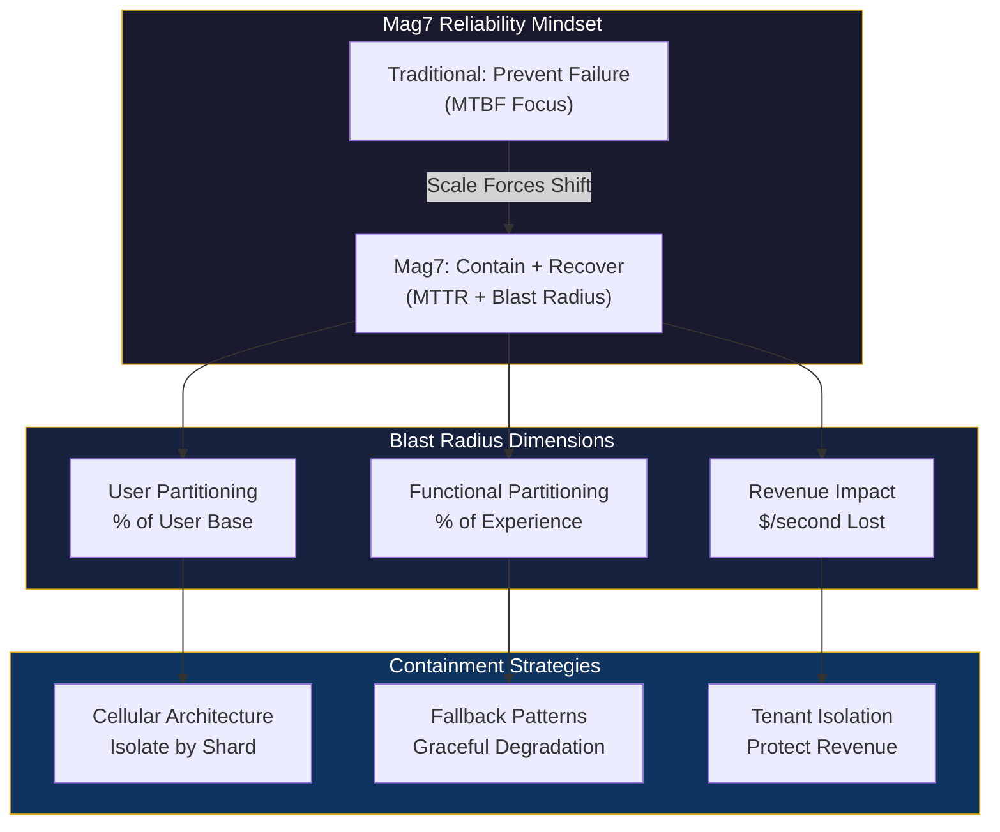
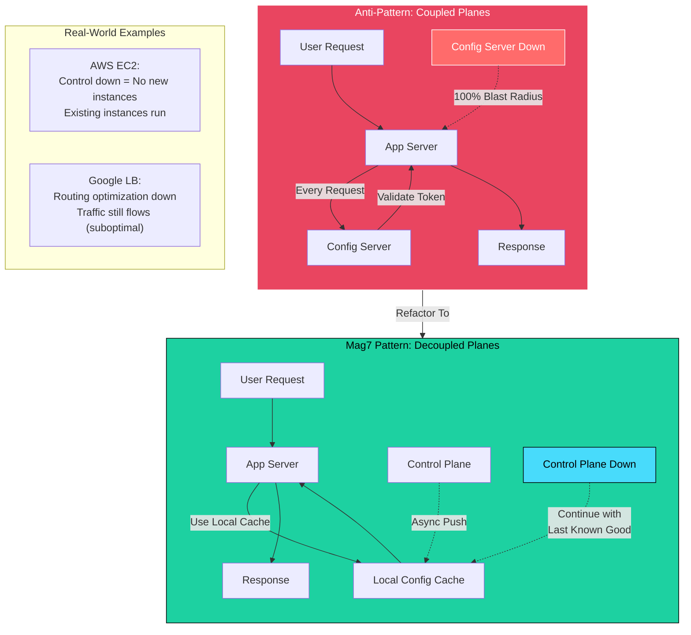
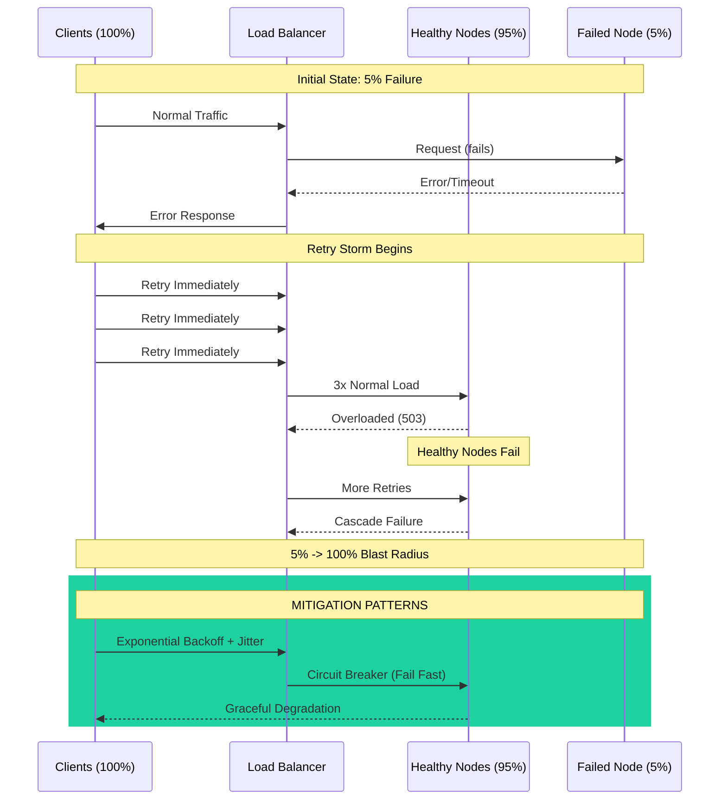
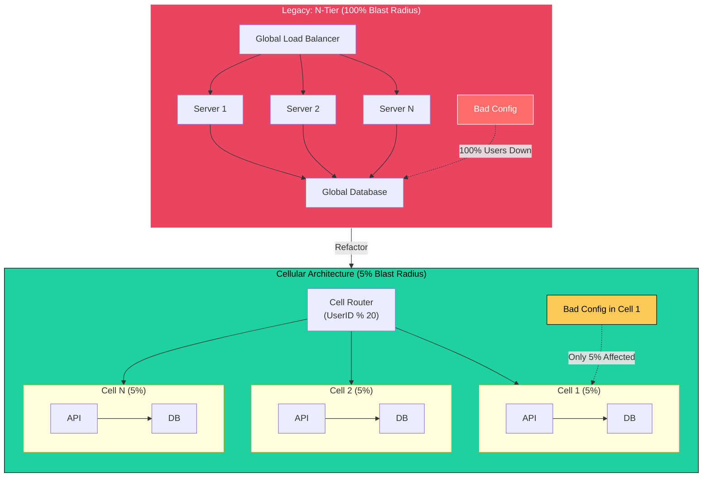
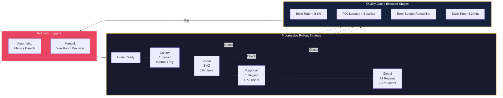
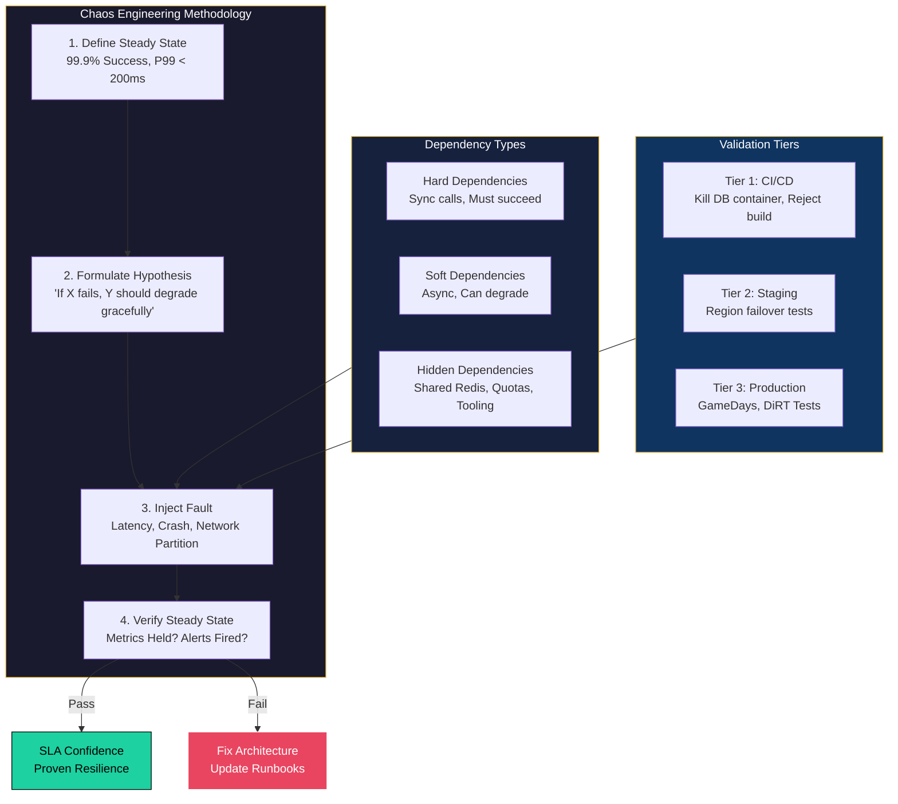

# Blast Radius Analysis

This guide covers 5 key areas: I. Conceptual Foundation & The Mag7 Mindset, II. Architectural Levers: Bulkheads and Cells, III. Operational Levers: Deployment Strategies, IV. Validation: Chaos Engineering & Dependency Mapping, V. Business Impact & ROI Analysis.

## I. Conceptual Foundation & The Mag7 Mindset

At the Principal level, Blast Radius Analysis is not merely an engineering exercise in counting servers; it is a risk management framework that directly dictates product architecture, deployment velocity, and Service Level Agreements (SLAs).

The fundamental premise at Mag7 scale is that **failure is not a probability; it is a mathematical certainty.** With millions of nodes and billions of operations, "five nines" (99.999%) of reliability still implies significant downtime or error volume in absolute numbers. Therefore, the architectural mandate shifts from "preventing failure" (MTBF - Mean Time Between Failures) to "containing the scope of failure" and "rapid recovery" (MTTR - Mean Time To Recovery).

### 1. The Denominator of Impact: Users vs. Revenue vs. Functionality

A Principal TPM must define what "Blast Radius" actually measures for their specific product. It is rarely a single metric.

*   **User Partitioning:** If a database shard fails, what percentage of the user base is affected? (e.g., "This outage impacts 2% of users, specifically those hosted in `us-east-1` Cell 4.")
*   **Functional Partitioning:** If a microservice fails, what percentage of the *experience* is degraded? (e.g., "Users can watch movies, but cannot update their profiles.")
*   **Revenue Impact:** For ad-tech or commerce, impact is measured in dollars per second. A failure in the checkout flow has a critical blast radius; a failure in the "user reviews" widget has a negligible revenue blast radius.

**Real-World Mag7 Behavior:**
*   **Netflix:** Utilizes "fallback" strategies to minimize functional blast radius. If the personalized recommendation engine fails (high complexity, high failure risk), the system falls back to a static, cached list of "Popular Titles." The functional blast radius is contained to "personalization," preserving the core "streaming" capability.
*   **Meta (Facebook):** Heavily utilizes "tenant isolation." High-value enterprise accounts (Ads Manager) often run on isolated infrastructure compared to free-tier user traffic to ensure a noisy neighbor in the free tier cannot blast-impact revenue-generating surfaces.

**Tradeoffs:**
*   **Granularity vs. Resource Efficiency:** Minimizing the user-partition blast radius often means creating smaller, more numerous partitions (shards/cells). This lowers the impact of a single failure but increases "stranded capacity" (wasted resources in one shard that cannot be used by another) and infrastructure costs.
*   **Degradation vs. Consistency:** To reduce functional blast radius, you must often accept stale data (Eventual Consistency). You trade the guarantee of "latest data" for the guarantee of "service uptime."

### 2. Control Plane vs. Data Plane Separation

The single largest source of global outages at Mag7 companies is the inadvertent coupling of the Control Plane (configuration, orchestration, API inputs) and the Data Plane (actual request processing).

A Principal TPM must enforce **Static Stability**. This means the Data Plane should continue to operate normally even if the Control Plane is completely down.

**Technical Deep-Dive:**
*   **The Anti-Pattern:** A service that requires a call to a central configuration server to validate a user's token for *every* request. If the config server (Control Plane) fails, the entire fleet (Data Plane) stops processing requests. The blast radius is 100%.
*   **The Mag7 Pattern:** The Data Plane caches the configuration locally. If the Control Plane fails, the Data Plane continues serving traffic using the last known good state.

**Real-World Mag7 Behavior:**
*   **AWS EC2:** If the EC2 control plane APIs go down (you cannot launch *new* instances), existing instances continue to run, route traffic, and scale within previously defined auto-scaling groups. The blast radius is limited to "mutability," not "availability."
*   **Google:** Enforces strict separation where global load balancers (Data Plane) push traffic based on cached maps. A failure in the optimization algorithm (Control Plane) that updates these maps simply means traffic routing becomes suboptimal/static, not that traffic drops.

**Tradeoffs:**
*   **Recovery Speed vs. Stability:** decoupling planes makes the system robust, but it makes emergency intervention harder. If the Data Plane is caching bad config, pushing a "fix" (Control Plane action) takes longer to propagate.
*   **Complexity:** Implementing robust local caching and reconciliation logic in every microservice significantly increases development time and code complexity.

### 3. Deployment Topology and The "Canary" Principle

Blast radius is most critical during change management (deployments/config updates). 70-80% of outages are caused by changes, not code bugs.

The Principal TPM drives the strategy for **Zonal vs. Regional vs. Global** deployments.

*   **Zonal Resources:** A failure here impacts one data center (Availability Zone).
*   **Regional Resources:** A failure here impacts a geographic area (e.g., US-East).
*   **Global Resources:** A failure here impacts the entire planet (e.g., Global IAM, DNS, CDN configs). *Global resources are the enemy of blast radius containment.*

**Actionable Guidance:**
When reviewing launch plans, demand a "One-Box -> One-Zone -> One-Region -> Global" rollout strategy. Never allow a configuration change to hit all regions simultaneously.

**Real-World Mag7 Behavior:**
*   **Amazon:** Uses "Waves" for deployments. A deployment pipeline is hard-coded to pause after the first zone, waiting for automated health checks (Canary analysis) before proceeding to the next.
*   **Google:** Uses "Error Budgets" to govern rollout speed. If a service has exhausted its error budget due to previous high-blast-radius incidents, the deployment pipeline automatically freezes or throttles to a safer, slower velocity.

**Impact on Business/ROI:**
*   **Velocity:** Rigorous blast radius containment slows down feature release velocity (Time-to-Market). A global rollout might take 3 days instead of 3 minutes.
*   **Trust:** Prevents "Reputational Extinction Events." A slow rollout ensures that a bad bug affects only 0.1% of users, which is a support ticket issue, not a TechCrunch headline.

### 4. Edge Case: The "Death Spiral" (Metastable Failures)

A critical concept for Principal TPMs is identifying when a small blast radius can inadvertently expand to become a total system failure. This is often caused by **Retry Storms**.

If Component A fails (impacting 5% of traffic), and the clients (Component B) are programmed to retry aggressively, the traffic to the remaining 95% of Component A's capacity may spike, causing the healthy nodes to overload and fail. The blast radius expands from 5% to 100% automatically.

**Mitigation:**
*   **Jitter and Exponential Backoff:** Ensure clients wait random intervals before retrying.
*   **Circuit Breakers:** If a dependency is failing, stop calling it immediately. Fail fast rather than waiting for timeouts.

## II. Architectural Levers: Bulkheads and Cells

*Note: This section may need additional review.*

The most effective way to reduce blast radius is through system design, specifically moving away from "N-tier" architectures toward "Cellular" architectures.

**1. The Bulkhead Pattern (Cell-Based Architecture)**
Instead of having a massive fleet of API servers talking to a massive fleet of databases, Mag7 companies create self-contained units called "Cells." A Cell contains everything needed to service a request (API + Compute + Storage).

**Real-World Example:**
Imagine a Prime Video login service.
*   *Legacy:* All users hit a global load balancer, which distributes to 1,000 servers. If a bad config is pushed to the auth database, **100% of users** cannot log in.
*   *Cellular:* You create 20 Cells, each serving 5% of users. If Cell 1 fails, **only 5% of users** are affected. The other 95% are unaware of the outage.

**2. Control Plane vs. Data Plane**
Principal TPMs must enforce strict separation here.
*   **Data Plane:** The machinery processing live customer requests (e.g., looking up a DNS record).
*   **Control Plane:** The machinery configuring the system (e.g., updating a DNS record).
*   **Mag7 Rule:** The Data Plane must continue functioning even if the Control Plane is down.

**Tradeoffs:**
*   **Cost:** Cellular architectures often require over-provisioning. You lose the efficiency of statistical multiplexing (sharing resources across all users).
*   **Data Fragmentation:** Analytics become harder because customer data is split across 20 distinct databases/cells.

**Impact on Business Capabilities:**
*   **Resilience:** A catastrophic bug becomes a minor incident.
*   **CX:** Users experience higher perceived reliability.

---

## III. Operational Levers: Deployment Strategies

*Note: This section may need additional review.*

If architecture is the shield, deployment strategy is the sword. As a Principal TPM, you own the **Release Management Strategy** to minimize the blast radius of *change*.

**1. Progressive Rollouts (Waves/Rings)**
Mag7 companies rarely deploy to "Production" all at once. They deploy in concentric rings of increasing risk.

*   **One-Box / Canary:** Deploy to a single server handling internal traffic only.
*   **Zonal/Regional:** Deploy to one Availability Zone (AZ) or Region.
*   **Global:** Deploy to the rest of the world.

**Real-World Mag7 Behavior:**
At Meta or Google, a configuration change might take 3-5 days to propagate globally. The TPM enforces "Bake Time" (waiting periods) between stages to allow metrics to stabilize. If the error rate spikes in the Canary stage, the blast radius is effectively zero customers.

**2. Feature Flagging (Decoupling Deploy from Release)**
Code is deployed to servers but turned off. The TPM coordinates the "flip" of the flag for specific user cohorts (e.g., "Internal Employees," then "Beta Users," then "Public").

**Tradeoffs:**
*   **Velocity vs. Safety:** Bake times slow down TTM (Time to Market). A 5-day rollout means a hotfix takes 5 days to reach everyone unless an emergency bypass is authorized (which carries high risk).
*   **Tech Debt:** Feature flags left in the code create "dead paths" and testing complexity.

**Impact on ROI:**
*   **Revert Speed:** Turning off a feature flag takes seconds. Rolling back a binary deployment takes minutes or hours. This delta saves millions in lost revenue during an incident.

---

## IV. Validation: Chaos Engineering & Dependency Mapping

Validation is the bridge between architectural theory (how we *think* the system works) and operational reality (how the system *actually* behaves). For a Principal TPM, this domain is not about running scripts; it is about **governance, risk quantification, and verifying the ROI of reliability investments**.

If you have invested millions in a Cell-Based Architecture to limit blast radius, Chaos Engineering is the audit mechanism that proves the cells actually isolate failure. Without this validation, your architecture diagrams are merely aspirations.

### 1. Dynamic Dependency Mapping

At Mag7 scale, manual architecture diagrams are obsolete the moment they are drawn. A Principal TPM must advocate for and rely on **Automated Runtime Dependency Mapping**. This involves using distributed tracing (e.g., OpenTelemetry, AWS X-Ray, Google Dapper) to generate real-time topology graphs.

**The Technical Reality:**
Dependencies are not just API calls. They include shared resources that are often invisible until failure occurs:
*   **Hard Dependencies:** Synchronous calls where Service A cannot function if Service B is down.
*   **Soft Dependencies:** Asynchronous calls or features that can degrade gracefully (e.g., "Recommendations" on a checkout page).
*   **Hidden Dependencies:** Shared mutable state (Redis caches), shared operational tooling (deployment pipelines), or shared quotas (API rate limits).

**Mag7 Behavior & Examples:**
*   **Google:** Uses internal tracing tools to visualize the "fan-out" of requests. A single search query triggers thousands of RPCs. Google SREs use this map to identify "cyclic dependencies"—where Service A depends on B, which depends on A—a pattern that causes deadlocks during recovery.
*   **Netflix:** Uses "Vizceral" (and its successors) to visualize traffic moving between regions. They use this to validate that traffic failover mechanisms are actually routing packets to the healthy region during an outage.

**Tradeoffs:**
*   **Observability Overhead vs. Performance:** Enabling full tracing on every request adds significant latency and storage costs.
    *   *Mitigation:* Mag7 companies rely on **probabilistic sampling** (e.g., tracing 0.1% of requests) or **tail-based sampling** (keeping traces only for requests that failed or were slow).
*   **Noise vs. Signal:** Automated maps can become "Death Star" diagrams (unreadable blobs of lines).
    *   *TPM Action:* You must drive the definition of "Critical Paths." Filter the map to show only the dependencies required for the "Checkout" or "Login" flows.

**Business Impact:**
*   **MTTR Reduction:** When an alert fires, a dependency map allows the Incident Commander to trace the root cause upstream immediately, rather than debugging each hop.
*   **Regulatory Compliance:** For cloud providers, accurate mapping is often required to prove data residency (ensuring EU customer data doesn't silently depend on a US-based storage bucket).

### 2. Chaos Engineering: Hypothesis-Driven Validation

Chaos Engineering is often misunderstood as "randomly breaking things." For a Principal TPM, it is **Hypothesis-Driven Experimentation**. The goal is to confirm that the system handles failure as designed.

**The Methodology:**
1.  **Define Steady State:** What does "normal" look like? (e.g., 99.9% success rate, <200ms latency).
2.  **Formulate Hypothesis:** "If we sever the connection to the Recommendation Engine, the Checkout page should still load (graceful degradation), but the 'Recommended for You' widget will be empty."
3.  **Inject Fault:** Introduce the failure.
4.  **Verify:** Did the steady state metrics hold? Did the alert system fire?

**Mag7 Behavior & Examples:**
*   **Amazon (GameDays):** Amazon does not just run chaos tools in the background; they hold "GameDays." These are scheduled events where teams manually or programmatically break services in production to test people, processes, and tools.
*   **Google (DiRT - Disaster Recovery Testing):** Google runs annual, company-wide tests (DiRT) that simulate massive failures (e.g., "Assume the entire US-East region is underwater"). This validates not just code, but business continuity plans (BCP).
*   **Microsoft Azure:** Uses fault injection in their fabric controller to ensure that if a rack switch fails, VMs are automatically migrated without customer downtime.

**Advanced Injection Types (Beyond "Pulling the Plug"):**
*   **Latency Injection:** Often more dangerous than a hard crash. If a dependency slows down from 50ms to 5s, it can exhaust thread pools in the calling service, causing a cascading failure.
*   **Clock Skew:** Intentionally desynchronizing server clocks to test distributed consensus algorithms (like Raft or Paxos).

**Tradeoffs:**
*   **Risk of Outage vs. Immunity:** Testing in production carries the risk of impacting real customers.
    *   *Mitigation:* "Blast Radius Limitation" within the test. Run the chaos experiment only on a specific "Canary" cohort (e.g., internal employees or 1% of free-tier users).
*   **Engineering Velocity vs. Reliability:** Writing chaos tests takes time away from feature development.
    *   *ROI Argument:* A TPM frames this as "preventing the rollback." Finding a bug via chaos testing in Staging/Canary is 100x cheaper than fixing a P0 outage on Black Friday.

### 3. The Principal TPM Role: Governance & Action

Your role is to operationalize these concepts into the product lifecycle. You are not writing the fault injection code, but you are defining the **Exit Criteria** for launches.

**Actionable Strategies:**
1.  **Tiered Validation:**
    *   *Tier 1 (Dev/Stage):* Automated chaos tests run in the CI/CD pipeline (e.g., kill the DB container). If this fails, the build is rejected.
    *   *Tier 2 (Canary/Prod):* Scheduled GameDays for complex scenarios (e.g., Region Failover).
2.  **The "Abort Button":** Ensure every chaos experiment has an automated rollback mechanism. If the "Steady State" metrics drop below a threshold (e.g., order volume drops by 5%), the experiment must stop immediately.
3.  **Dependency Quotas:** Use the dependency map to enforce architectural rules.
    *   *Example:* "Tier 1 services (Checkout) are not allowed to have hard dependencies on Tier 3 services (Analytics)." You enforce this by auditing the map during design reviews.

**Impact on Business Capabilities:**
*   **Skill Development:** GameDays act as "fire drills" for on-call engineers. It builds muscle memory so they don't panic during real outages.
*   **SLA Confidence:** You can contractually guarantee 99.99% availability because you have empirically proven the system survives component failure.

## V. Business Impact & ROI Analysis

At the Principal level, technical decisions are investment decisions. While engineering leads focus on the feasibility of reducing blast radius (e.g., implementing sharding or cell-based architecture), the Principal TPM must own the **justification**. You are the bridge translating "nines of availability" into "revenue at risk" and "customer lifetime value (CLV)."

You must operate with the assumption that infinite reliability is infinitely expensive. Your role is to determine the point of diminishing returns where the cost of mitigation exceeds the cost of the impact.

### 1. Quantifying the Cost of Impact (CoD)

To prioritize blast radius reduction efforts, you must first calculate the Cost of Downtime (CoD) or Cost of Degradation. At Mag7, this is rarely a flat "dollars per minute" metric; it is segmented by functionality.

**The Mag7 Approach:**
*   **Amazon (Retail):** Distinguishes between "Hard Down" (Checkout service failure) and "Soft Down" (Reviews service failure). A failure in Checkout has a 1:1 correlation with lost Gross Merchandise Value (GMV). A failure in Reviews might lower conversion by 2%, but the transaction can still complete.
*   **Meta (Ads):** Focuses on "Impression delivery." If the ad serving pipeline has a 5% latency increase, fewer ads are served per second, directly reducing revenue run rate.

**The TPM Lens:**
When evaluating a proposed architectural change to limit blast radius, you must model the **Revenue at Risk (RaR)** per shard/cell.
*   *Formula:* `(Total Revenue / Number of Cells) * Duration of Outage`
*   If you move from a monolithic database (Radius = 100%) to 50 shards (Radius = 2%), you have mathematically reduced the financial risk of a single failure by 98%.

**Tradeoffs:**
*   **Precision vs. Speed:** Calculating exact CoD is difficult because of downstream effects (e.g., customer churn weeks later). Mag7 TPMs often use "Proxy Metrics" (e.g., failed API calls) to estimate impact rather than waiting for finance data.
*   **Over-optimization:** Spending \$5M in engineering resources to prevent a \$50k/year risk is a failure of TPM judgment.

### 2. CAPEX/OPEX Implications of Isolation

Reducing blast radius almost always increases infrastructure costs. Moving from a multi-tenant cluster to single-tenant cells, or creating active-active multi-region replicas, requires more compute, storage, and data transfer.

**Real-World Mag7 Behavior:**
*   **Google:** Uses "Error Budgets" not just for reliability, but to govern spend. If a service wants to run in 3 regions for redundancy (reducing regional blast radius), they must prove the business value warrants the 3x infrastructure cost.
*   **Netflix:** utilizes "Micro-sharding" where traffic is routed based on device type or geography. This isolation increases data replication costs (Egress charges) but ensures that a bad deploy to the "Android TV" codebase does not affect "iOS Mobile" users.

**Impact on ROI:**
The ROI of blast radius reduction is calculated as:
$$ \text{ROI} = \frac{(\text{Projected Loss from Incident} \times \text{Probability}) - \text{Cost of Mitigation}}{\text{Cost of Mitigation}} $$

As a Principal TPM, you must argue that the *Probability* of a catastrophic monolithic failure justifies the *Cost of Mitigation* (increased cloud spend + engineering opportunity cost).

**Tradeoffs:**
*   **Utilization vs. Isolation:** Cellular architectures often have lower resource utilization (slack capacity in every cell) compared to a shared monolith. You are trading infrastructure efficiency (OPEX) for insurance against total blackout.

### 3. Graceful Degradation and Customer Trust

Blast radius analysis isn't just about preventing failure; it is about defining *how* the system fails to protect the Customer Experience (CX). This is the "Soft Landing" strategy.

**Technical Implementation:**
*   **Fallback Strategies:** If the "Personalized Recommendations" service fails, the system should default to a cached "Global Top 10" list rather than returning a 500 error. The blast radius of the failure is contained to "relevance," not "availability."
*   **Circuit Breakers:** Automatically cutting off a failing dependency to prevent cascading failure (resource exhaustion) in the calling service.

**Real-World Mag7 Behavior:**
*   **Amazon:** If the dynamic pricing engine fails, the system falls back to the last known "safe price" or list price. The business accepts a potential margin loss (selling too cheap) to prevent a blocked transaction (selling nothing).
*   **Microsoft Azure:** During regional outages, control plane operations (creating new VMs) may be restricted to preserve capacity for the data plane (running existing VMs). They prioritize existing customer uptime over new revenue generation.

**Impact on Capabilities:**
Implementing these fallbacks requires significant engineering maturity. The team must maintain code paths that are rarely executed. The TPM must ensure these fallback paths are tested via Chaos Engineering (e.g., DiRT testing at Google).

**Tradeoffs:**
*   **CX Consistency vs. Availability:** Showing stale data (eventual consistency) is better than showing no data, but it can lead to customer support tickets ("Why isn't my order showing up?"). The TPM decides the acceptable threshold for data staleness.

### 4. Engineering Velocity vs. Reliability Work

The biggest cost in reducing blast radius is **Opportunity Cost**. Engineers refactoring a monolith into cells are not building new revenue-generating features.

**The TPM Lens:**
You must manage the "Reliability Tax." A healthy Mag7 product team typically allocates 10-20% of capacity to technical debt and reliability. If the blast radius analysis reveals a critical vulnerability (e.g., a "Class 1" risk where 100% of customers could be impacted), the TPM must advocate for a "Feature Freeze" to address it.

**Tradeoffs:**
*   **Short-term Revenue vs. Long-term Viability:** Pausing features hurts quarterly targets. However, a major outage destroys brand trust, which impacts Long-Term Value (LTV).
*   **Skill Requirements:** Moving to high-isolation architectures (Service Mesh, Cells, Sidecars) raises the technical bar. You may need to hire more expensive Senior/Staff engineers, impacting the hiring budget.

---

## Interview Questions

### I. Conceptual Foundation & The Mag7 Mindset

### Question 1: The Global Config Dilemma
**"We are building a new global authentication service. The engineering lead wants to use a single, globally replicated database for user policies to ensure immediate consistency across all regions. As a Principal TPM, challenge this architecture using Blast Radius principles."**

**Guidance for a Strong Answer:**
*   **Identify the Risk:** A single global database introduces a "Single Point of Failure" (SPOF) and a global blast radius. If a bad schema change is pushed or data corruption occurs, it replicates instantly to all regions, taking down auth globally.
*   **Propose Alternatives:** Suggest a Cell-based architecture where each region (or cell) has its own independent database.
*   **Address the Tradeoff:** Acknowledge that this sacrifices "immediate consistency" (a user updating a password in Europe might not immediately be able to log in in Asia).
*   **Mitigate:** Propose a synchronization mechanism (Control Plane) that lazily replicates data, ensuring that a corruption event in one cell does not automatically propagate to others (using "poison pill" detection).
*   **Business Impact:** Argue that 99.99% availability (via isolation) is more valuable to the business than <100ms global consistency for password updates.

### Question 2: The Cost of Isolation
**"You are managing a legacy monolith causing frequent outages. You propose breaking it into a Cell-Based Architecture to reduce blast radius. Leadership pushes back, citing a 40% increase in infrastructure costs due to loss of resource pooling efficiency. How do you justify the ROI?"**

**Guidance for a Strong Answer:**
*   **Quantify the Cost of Downtime:** Move the conversation from "Server Cost" to "Revenue Risk." Calculate the revenue loss of the last three outages. If the 40% infra cost is \$1M/year, but a single global outage costs \$5M in revenue and SLA credits, the ROI is immediate.
*   **Feature Velocity:** Explain that the current "fear of breaking the monolith" is slowing down developer velocity. Smaller blast radii allow teams to deploy faster and more aggressively because the penalty for failure is lower.
*   **Tiered Approach:** Propose a compromise. Apply strict Cell Isolation only for "Tier 0" critical paths (Checkout, Login), while leaving "Tier 2" (Reviews, History) on shared/cheaper infrastructure. This optimizes the Tradeoff between Cost and Availability.

### II. Architectural Levers: Bulkheads and Cells

### Question 1: The Cross-Cell Dependency
**"Your team has implemented a beautiful 20-cell architecture for your payment service, each cell serving 5% of users. However, during a recent audit, you discover that all 20 cells share a single Redis cluster for rate limiting. A junior engineer asks why this matters. Explain the blast radius implications and propose a fix."**

**Guidance for a Strong Answer:**
*   **Identify the SPOF:** The shared Redis cluster is an undocumented hard dependency that bypasses all cell isolation. If Redis fails or receives a bad config, all 20 cells fail simultaneously—blast radius is 100%, not 5%.
*   **Technical Options:** (1) Deploy a Redis instance per cell (highest isolation, highest cost), (2) Deploy regional Redis clusters serving 3-4 cells each (balanced), (3) Add fallback behavior where rate limiting fails-open temporarily if Redis is unavailable (lowest cost, risk of abuse).
*   **Tradeoff Discussion:** Highlight that option 3 (fail-open) trades security posture for availability. A Principal TPM must bring Product/Security stakeholders into this decision.
*   **Process Fix:** Propose mandatory dependency audits before declaring "Cell isolation complete." The architecture diagram showed cell boundaries, but missed the shared infrastructure.

### III. Operational Levers: Deployment Strategies

### Question 1: The Hotfix Paradox
**"A critical security vulnerability has been discovered in production. The security team demands an immediate patch to all servers within 2 hours. However, your deployment policy requires a 3-day progressive rollout with 24-hour bake times between stages. How do you reconcile blast radius containment with urgent security response?"**

**Guidance for a Strong Answer:**
*   **Risk Comparison:** Compare the blast radius of two scenarios: (A) A compromised system exploited by attackers (potentially unbounded damage), (B) A rushed deployment causing an outage (bounded by the bug's severity).
*   **Expedited Protocol:** Mag7 companies have "Emergency Change Advisory Board (ECAB)" processes. The TPM convenes stakeholders (SRE, Security, Product) to make an informed risk decision.
*   **Mitigation During Rush:** Even under time pressure, maintain some gates: deploy to one region first, watch metrics for 15 minutes, then proceed. Compress the timeline, don't eliminate it entirely.
*   **Post-Incident:** Document the bypass as a "controlled exception." After the emergency, conduct a retrospective on why the vulnerability wasn't caught earlier.
*   **The Answer:** "It depends on the severity." A remote code execution (RCE) vulnerability justifies bypassing bake times. A minor information disclosure might not.

### IV. Validation: Chaos Engineering & Dependency Mapping

**Question 1: The Cultural Resistance**
"You are a Principal TPM for a newly acquired subsidiary of our company. Their engineering team is resistant to Chaos Engineering, arguing that their roadmap is too full and 'breaking production' is reckless. How do you implement a validation strategy without stalling feature velocity?"

*   **Guidance for a Strong Answer:**
    *   **Empathy & Gradualism:** Don't start with production. Propose "GameDays" in a staging environment first to demonstrate value (finding bugs without customer pain).
    *   **Risk Quantification:** Pivot the conversation from "testing" to "risk." Ask, "What is the cost of downtime?" Use data to show that reactive fixing is more expensive than proactive testing.
    *   **The "Sidecar" Approach:** Suggest using a service mesh or sidecar proxy to inject faults (latency) transparently, requiring zero code changes from developers.
    *   **Governance:** Propose a "Reliability Tax"—if a service exceeds its error budget, feature work stops until reliability (validated by chaos testing) improves.

**Question 2: The Hidden Dependency**
"During a major region failover test, the primary e-commerce flow failed despite all microservices reporting 'Healthy.' It turned out a legacy config file was hardcoded to a path in the failed region. How would you redesign the validation process to catch 'non-service' dependencies like config, DNS, or IAM roles?"

*   **Guidance for a Strong Answer:**
    *   **Holistic Definition of Dependency:** Acknowledge that "Service A talks to Service B" is insufficient. Dependencies include data, config, and network.
    *   **Infrastructure as Code (IaC) Validation:** Move configuration into code repositories. Run chaos tests against the *deployment pipeline*, not just the runtime binary.
    *   **The "Clean Room" Restore:** Instead of just failing over, test a "Region Rebuild." Can we spin up the service in a new region from scratch? This exposes missing configs or hardcoded IPs immediately.
    *   **Observability:** Discuss implementing tracing that tags resources not just by service name, but by region and zone, so cross-region calls trigger alerts during "steady state" operations, not just during outages.

### V. Business Impact & ROI Analysis

**Question 1: The Expensive Redundancy**
"We have a legacy monolithic service that processes 100% of our payments. It goes down for 30 minutes roughly twice a year, costing us about \$200k per incident. Engineering wants to rewrite it into a cell-based architecture to reduce the blast radius. The rewrite will take 6 engineers 6 months and will increase our annual cloud bill by \$150k due to data replication. As the Principal TPM, do you approve this project?"

*   **Guidance:** A strong answer looks beyond the immediate math (\$400k loss vs. ~\$1M+ engineering/infra cost).
    *   *Direct ROI:* On paper, the project loses money (spending >\$1M to save \$400k).
    *   *Hidden Costs:* You must ask about brand damage, customer churn, and "Black Swan" risk (what if the next outage is 24 hours, not 30 mins?).
    *   *Strategic pivot:* Can we achieve 80% of the benefit with 20% of the work? Perhaps sharding the database without rewriting the app layer?
    *   *Decision:* Likely "No" to the full rewrite *unless* the service is expected to scale 10x in the next year, at which point the monolith will fail completely. The answer depends on the *growth trajectory*, not just current state.

**Question 2: The Feature Freeze**
"You are leading a product launch with a hard deadline for a major partner event. Two weeks before launch, your team discovers a dependency that creates a global blast radius risk—if this minor feature fails, the whole console could lock up. Fixing it requires a 1-week delay. Marketing says we cannot move the date. What do you do?"

*   **Guidance:** This tests negotiation and risk mitigation (Graceful Degradation).
    *   *Assess Probability:* How likely is the failure?
    *   *Mitigation:* Do not delay the launch. Instead, launch with the risky feature *disabled* (feature flagged off) or launch with a "Kill Switch."
    *   *Architecture:* Can you wrap the risky dependency in a strict circuit breaker so if it fails, it fails silently without locking the console?
    *   *Business Alignment:* The goal is to launch the *Core Value Proposition* on time. If the risky feature is secondary, ship without it. If it is core, you present the risk (Global Outage during the demo) to VP-level leadership for a "Go/No-Go" decision.

---

## Key Takeaways

- Review each section for actionable insights applicable to your organization

- Consider the trade-offs discussed when making architectural decisions

- Use the operational considerations as a checklist for production readiness
