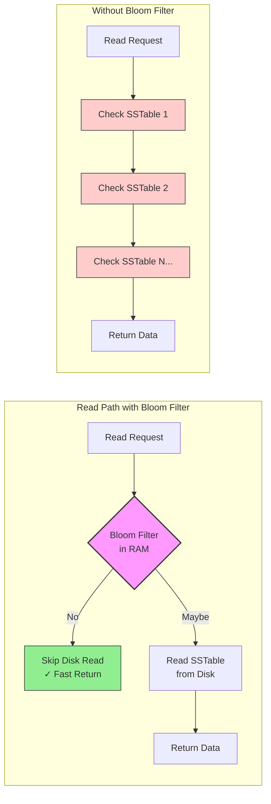
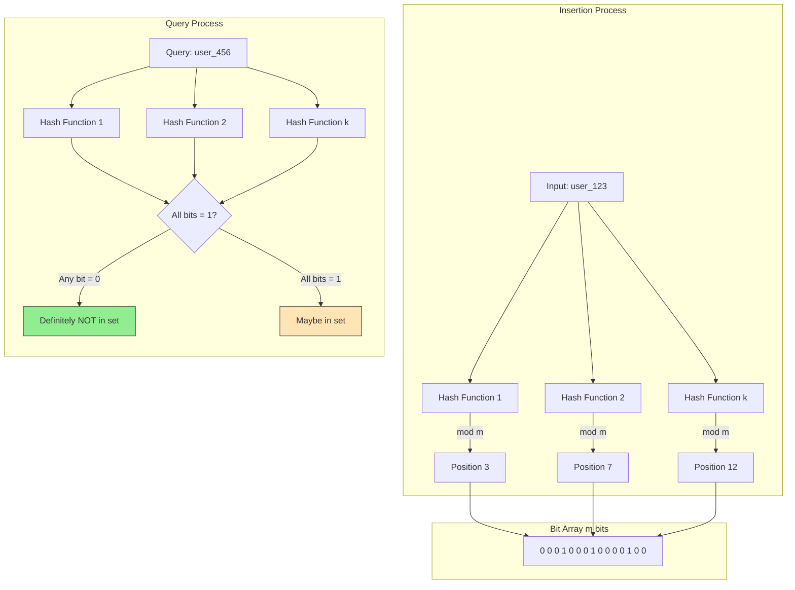
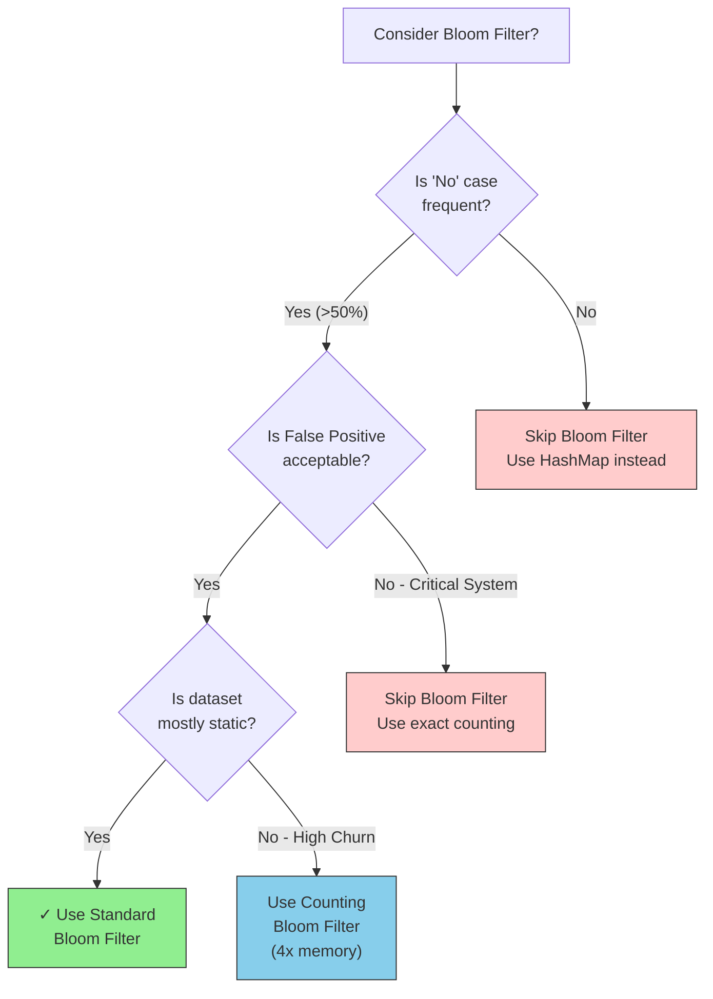

# Bloom Filters

This guide covers 5 key areas: I. Executive Summary: The "Bouncer" of Data Structures, II. Technical Mechanics: How It Works, III. Real-World Behavior at Mag7, IV. Critical Tradeoffs, V. Impact on Business, ROI, and CX.

## I. Executive Summary: The "Bouncer" of Data Structures

At the Principal TPM level, understanding Bloom Filters transitions from knowing "how they work" to understanding "where they fit" in the cost-latency curve of distributed systems. In a Mag7 environment, where services handle millions of requests per second (RPS), the Bloom Filter is not just an optimization; it is often a load-bearing architectural component designed to protect downstream storage layers from saturation.

### 1. Architectural Role: The First Line of Defense
In large-scale distributed databases (like Cassandra, HBase, or Google's BigTable), data is stored on disk in immutable files (SSTables). When a read request comes in, the system might theoretically need to check dozens of files on disk to find a specific key. This causes "Read Amplification"—a scenario where one logical read request triggers multiple physical disk I/O operations.

The Bloom Filter sits in memory (RAM) as a gatekeeper for these disk files. Before the database engine attempts to read a file from the disk, it queries the Bloom Filter.
*   **Result "No":** The engine skips the disk read entirely.
*   **Result "Maybe":** The engine performs the disk read.

**Mag7 Real-World Example:**
In **Google BigTable** (and by extension, services built on it like Google Earth or Gmail backend), Bloom Filters are configured per locality group. If a query requests a row that does not exist, the Bloom Filter answers "No" instantly. Without this, a query for a non-existent row would be the *most expensive* operation possible, as the system would have to scan all candidate SSTables on disk to confirm the data is missing.

### 2. Tradeoff Analysis: Memory vs. False Positive Rate (FPR)
A Principal TPM must drive the decision on resource allocation. You trade **RAM** (for the filter) against **Disk I/O** (for the false positives).

*   **The Lever:** The size of the bit array ($m$) and the number of hash functions ($k$).
*   **The Tradeoff:**
    *   **Larger Bit Array:** Reduces the False Positive Rate (FPR) but consumes more expensive RAM.
    *   **Smaller Bit Array:** Saves RAM but increases FPR. A high FPR means the system frequently checks the disk unnecessarily (cache misses), increasing latency and IOPS costs.

**Business Impact Calculation:**
If you are designing a tier-1 caching layer for a service like **Netflix** (checking if a user is entitled to watch a specific video ID):
*   **Scenario A (Strict):** You size the filter for a 0.1% FPR. This requires more memory per server.
*   **Scenario B (Loose):** You size for a 1% FPR. This saves gigabytes of RAM across a 1,000-node cluster but results in 10x more unnecessary database hits for invalid queries.
*   **Decision Framework:** If the cost of a "miss" (checking the database) is high (e.g., cross-region network call), you spend the money on RAM (Scenario A). If the database is local and fast (NVMe SSD), you might accept the 1% FPR to save infrastructure costs (Scenario B).

### 3. The "Cache Penetration" Problem
A specific failure mode Principal TPMs must guard against is **Cache Penetration**. This occurs when malicious actors or buggy clients request keys that do not exist in the dataset (e.g., querying random user IDs).

*   **Without Bloom Filters:** These requests bypass the cache (because the data isn't there to cache) and hit the primary database directly. A DDoS attack using non-existent keys can take down a primary database.
*   **With Bloom Filters:** The filter catches these non-existent keys at the edge, returning "Not Found" without touching the persistence layer.

**Mag7 Example:**
**Amazon API Gateway** and internal throttling services use similar probabilistic logic to track usage limits or block-lists. If a request comes from an IP not in the "blocked" set, it passes. If the filter returns "Maybe," the system performs a deeper, more expensive check. This protects the control plane from being overwhelmed by checking every single request against a massive, definitive block-list table.

### 4. Operational Limitations and Edge Cases
The standard Bloom Filter has two critical limitations that a TPM must account for during capacity planning:

**A. Immutability of Size (The Scaling Cliff)**
Once a Bloom Filter is created, you cannot resize it. You define the size based on the *expected* number of elements.
*   **The Risk:** If you project 100 million records and the product grows to 200 million, the filter becomes "saturated" (too many bits set to 1). The False Positive Rate spikes toward 100%, rendering the filter useless.
*   **The Fix:** You must rebuild the filter entirely from scratch, which is computationally expensive and requires re-reading the entire dataset.
*   **Actionable Guidance:** Always over-provision capacity estimates for Bloom Filters, or use "Scalable Bloom Filters" (a chain of filters) which add complexity and latency.

**B. Inability to Delete**
In a standard Bloom Filter, you cannot remove an item. Setting a bit back to "0" might inadvertently remove a different item that shares that bit (collision).
*   **The Impact:** If your dataset has high churn (users deleting accounts, products being delisted), a standard Bloom Filter degrades over time. It will continue to say "Maybe" for deleted items, causing unnecessary database lookups.
*   **The Fix:** Use **Counting Bloom Filters** (which use counters instead of single bits) or **Cuckoo Filters**.
*   **Tradeoff:** Counting filters require 3x-4x more memory than standard filters. As a TPM, you must decide if the feature requirement (deletion support) justifies the 400% increase in memory cost.

### 5. ROI and Capabilities Summary
Implementing Bloom Filters correctly drives specific business outcomes:
*   **Reduced Cloud Spend:** Fewer IOPS on storage volumes (e.g., AWS EBS GP3/io2 costs).
*   **Higher Throughput:** The database CPU is not wasted on looking up things that don't exist.
*   **Consistent Latency:** Keeps p99 latency low even during "miss" storms.

## II. Technical Mechanics: How It Works

### 1. The Core Architecture: Arrays and Hashing

At its lowest level, a Bloom Filter is distinct from a Hash Map. In a Hash Map, you store the key and the value (or a pointer to it). In a Bloom Filter, you store **no data**, only the "fingerprint" of the data's presence using bitwise operations.

*   **The Array ($m$):** A fixed-size bit array of length $m$, initialized entirely to 0.
*   **The Hash Functions ($k$):** A set of $k$ independent hash functions. These functions must be uniform (distributing bits evenly) and fast (non-cryptographic hashes like MurmurHash or FNV are preferred over SHA-256 to minimize CPU latency).

**The Insertion Process:**
When a new record (e.g., a Transaction ID) enters the system:
1.  The ID is fed into all $k$ hash functions.
2.  Each function produces an integer output.
3.  We take the modulo $m$ of these outputs to find index positions.
4.  We flip the bits at those specific indices to **1**.

**The Query Process:**
To verify if a Transaction ID exists:
1.  Run the ID through the same $k$ hash functions.
2.  Check the bits at the resulting indices.
3.  **Logic:** If *any* bit is 0, the ID is new (100% certainty). If *all* bits are 1, the ID is likely present.

### 2. The False Positive Probability (FPP)

The defining characteristic of this structure is the False Positive. This occurs when a queried item happens to map to $k$ bit positions that were *already* set to 1 by a combination of *other* items inserted previously.

As a Principal TPM, you must manage the **Saturation Point**. As more items ($n$) are added to the bit array ($m$), the probability of a collision increases.

**The Tradeoff Triangle:**
1.  **Bit Array Size ($m$):** Increasing memory reduces False Positives but increases RAM cost.
2.  **Number of Hash Functions ($k$):** There is an optimal number of hash functions for a given array size (usually $k = (m/n) \ln 2$). Too few hashes = too many collisions. Too many hashes = increased CPU latency per lookup and faster array saturation.
3.  **Item Count ($n$):** You must estimate capacity upfront. If $n$ exceeds the design limit, the FPP spikes exponentially, rendering the filter useless (returning "Maybe Yes" for everything).

**Business Impact:**
If you design for a 1% FPP, it means 1% of the queries for non-existent items will "leak" through to your backend database.
*   **Scenario:** You have 1 billion requests/day. 90% are for keys that don't exist (cache misses).
*   **Result:** A 1% FPP allows 9 million unnecessary disk seeks per day.
*   **ROI Decision:** Is the cost of the RAM for a larger Bloom Filter (to get FPP to 0.1%) less than the cost of provisioning IOPS for those 9 million extra reads?

### 3. The "Delete" Constraint and Workarounds

Standard Bloom Filters do not support deletion. This is a critical architectural limitation.

**Why:** You cannot simply turn a bit from 1 back to 0. That specific bit might have been set by the item you are deleting, but it might *also* have been set by five other active items. Flipping it to 0 would create **False Negatives** for those other items, breaking the "Golden Rule" of the structure.

**Mag7 Real-World Implementations & Workarounds:**

*   **Counting Bloom Filters:** Instead of a single bit, each position uses a small counter (e.g., 4 bits).
    *   *Insertion:* Increment the counter.
    *   *Deletion:* Decrement the counter.
    *   *Tradeoff:* Increases space complexity by 3x-4x.
*   **Timed/Rotating Filters (Streaming Data):** Used in DDoS protection or sliding window analytics.
    *   Instead of deleting old records, you maintain two filters: "Current" and "Previous."
    *   After a set time window ($t$), you discard "Previous," move "Current" to "Previous," and initialize a new empty "Current."
    *   *Tradeoff:* Double the memory usage for the overlap period.

### 4. Mag7 Use Cases and Behavior

**A. Google BigTable / Apache Cassandra (LSM Trees)**
*   **The Problem:** These databases write data to immutable files on disk (SSTables). To read a record, the system might have to check dozens of files, causing high read latency.
*   **The Solution:** Every SSTable has an associated Bloom Filter stored in RAM.
*   **Behavior:** When a read request comes in, the system checks the Bloom Filter first. If the filter returns "No," the system skips reading that file entirely.
*   **Impact:** Reduces disk IOPS by 95%+, decoupling read latency from the volume of data stored.

**B. Akamai / Cloudflare (CDN "One-Hit Wonders")**
*   **The Problem:** 75% of objects requested from a CDN are requested only once (long-tail content). Storing these in the expensive edge SSD cache evicts popular content (Cache Pollution).
*   **The Solution:** Upon a request, check a Bloom Filter.
    *   If "No" (not in filter): Do not cache the object. Add its hash to the filter. Serve from origin.
    *   If "Yes" (in filter): This is the second request. Cache the object on SSD.
*   **Impact:** Significantly increases Cache Hit Ratio (CHR) for popular items and reduces SSD wear-and-tear.

**C. Chrome Browser (Malicious URL Check)**
*   **The Problem:** Checking every visited URL against a massive database of known malicious sites is too slow (network latency) and privacy-invasive.
*   **The Solution:** The browser downloads a compressed Bloom Filter of all malicious URLs.
*   **Behavior:** Local check. If "No," proceed safely. If "Maybe," perform a remote API call to verify if the URL is actually malicious.
*   **Impact:** Eliminates network calls for 99.9% of safe browsing, preserving user privacy and speed.

### 5. Failure Modes and Edge Cases

1.  **Saturation (The "Fill Up" Failure):**
    *   If the dataset grows unexpectedly (e.g., a viral product launch), the Bloom Filter fills up (bits become mostly 1s).
    *   *Symptom:* False positive rate approaches 100%. Every lookup hits the database.
    *   *Mitigation:* Scalable Bloom Filters (stacking filters on top of each other) or re-partitioning data.

2.  **The "Zero" Hash Problem:**
    *   Poorly chosen hash functions can result in clustering (bits set in the same area), increasing collisions despite low overall utilization.
    *   *Mitigation:* Use proven, uniform distribution hashes like MurmurHash3.

## III. Real-World Behavior at Mag7

### 1. Database Storage Engines (LSM Trees)
The most ubiquitous use of Bloom Filters at Mag7 companies (specifically Google, Meta, and Amazon) is within the storage layer of NoSQL databases like **Google BigTable**, **Apache Cassandra** (used heavily by Apple/Netflix), and **RocksDB** (Meta).

*   **The Problem:** These databases use Log-Structured Merge-trees (LSM Trees). Data is immutable and written to disk in layers (SSTables). To find a specific row (e.g., a specific User ID), the database might theoretically have to scan every file on the disk to see if the record exists and which version is the latest. This causes massive Read Amplification.
*   **The Mag7 Solution:** Every SSTable file on the disk has an accompanying Bloom Filter stored in RAM. Before the database engine touches the disk, it queries the in-memory Bloom Filter.
    *   If the Filter says "No," the engine skips that file entirely.
    *   If the Filter says "Maybe," the engine performs the disk read.
*   **Business Impact:** This reduces disk I/O for read operations by orders of magnitude. Without this, BigTable would require significantly more hardware to deliver the same read latency, inflating the TCO (Total Cost of Ownership) of the storage infrastructure.

### 2. Cache Penetration Protection
At the scale of Amazon Retail or Netflix streaming, caching (Redis/Memcached) is critical. A specific failure mode called **Cache Penetration** occurs when users request data that exists in neither the cache nor the database.

*   **The Scenario:** A malicious actor (or a buggy client update) requests millions of non-existent keys (e.g., `product_id=-1`).
*   **The Failure:** The cache misses (naturally), so the request falls through to the primary database. Since the data doesn't exist, the database can't update the cache. The database CPU spikes to 100% trying to query non-existent rows, causing a site-wide outage.
*   **The Implementation:** A Bloom Filter is placed *before* the cache or database. It contains all valid keys.
    *   **Logic:** `If BloomFilter(key) == false: return 404 immediately.`
*   **ROI/CX:** This acts as a circuit breaker. It preserves the availability of the primary database during scraping attacks or bad deployments, protecting the Customer Experience (CX) from high latency or 5xx errors.

### 3. Client-Side Filtering (Google Chrome Safe Browsing)
Google Chrome uses Bloom Filters to protect users from malicious URLs without sending every URL a user visits to Google servers (which would be a privacy nightmare and a latency bottleneck).

*   **The Implementation:** Chrome downloads a compressed Bloom Filter containing the hashes of all known malicious URLs.
*   **The Flow:** When a user navigates to a site, the local browser checks the Bloom Filter.
    *   **"Definitely No":** The site loads immediately. No network call to Google.
    *   **"Maybe Yes":** The browser sends the hash to Google’s servers to verify if it is actually malicious (resolving the False Positive).
*   **Tradeoff:** Google trades client-side storage (the filter size on the user's laptop) for massive server-side bandwidth savings and user privacy.

### 4. Distributed Joins (Spark/MapReduce)
When processing petabytes of data (e.g., joining "Ad Clicks" with "User Profiles"), shuffling data across the network is the most expensive operation.

*   **Bloom Joins:** Before shuffling the massive "Ad Clicks" table, the system builds a Bloom Filter of the keys in the "User Profiles" table and broadcasts it to the "Ad Clicks" nodes.
*   **Optimization:** The "Ad Clicks" nodes filter out any click records where the User ID is not in the Bloom Filter *before* sending data across the network.
*   **Impact:** This can reduce network traffic by 30-80% in ETL pipelines, directly lowering the compute cost of data processing jobs.

### 5. Critical Tradeoffs & Failure Modes

As a Principal TPM, you must scrutinize design docs for these specific risks when Bloom Filters are proposed:

**A. The "Fill Up" Problem (Capacity Planning)**
Standard Bloom Filters do not resize. You must define the size ($m$) upfront based on the expected number of elements ($n$).
*   **Risk:** If the number of items inserted exceeds the design capacity, the False Positive Rate (FPR) spikes exponentially. The filter becomes useless (returning "Maybe" for everything).
*   **Mitigation:** You must over-provision memory or implement **Scalable Bloom Filters** (which chain multiple filters together), though this increases complexity and lookup latency.

**B. The "No Delete" Constraint**
You cannot remove an item from a standard Bloom Filter. Because one bit might represent multiple items (collisions), turning a `1` to a `0` might accidentally "delete" other items.
*   **Impact:** In systems with high churn (users deleting accounts, products expiring), a standard Bloom Filter eventually becomes "polluted" with old data, increasing the False Positive Rate.
*   **Mitigation:** Use **Counting Bloom Filters** (which store a counter instead of a bit).
*   **Tradeoff:** Counting filters require significantly more memory (e.g., 4 bits or 8 bits per bucket instead of 1 bit), reducing the space efficiency advantage.

**C. Memory vs. Accuracy (The FPR Slider)**
There is a mathematical relationship between the size of the bit array and the False Positive Rate.
*   **Decision:** Do you want a 1% error rate or a 0.1% error rate?
*   **Cost:** Reducing the error rate by a factor of 10 roughly requires increasing the bit array size by 4.8 bits per element.
*   **Business Decision:** Is the cost of a False Positive (an unnecessary disk seek) high enough to justify the extra RAM cost? For a high-frequency trading platform, yes. For a nightly batch job, perhaps not.

## IV. Critical Tradeoffs

### 1. Accuracy vs. Memory: The False Positive Rate (FPR) Slider

The most fundamental decision a Principal TPM oversees in this domain is tuning the False Positive Rate. This is not a technical default; it is a business decision regarding the cost of hardware versus the cost of latency.

*   **The Technical Lever:** You decrease the False Positive Rate by increasing the size of the bit array ($m$).
*   **The Rule of Thumb:** For a 1% False Positive Rate, you need approximately 9.6 bits per item. For 0.1%, you need roughly 14.4 bits per item.
*   **Mag7 Example (Google Chrome Safe Browsing):** Chrome maintains a local Bloom Filter of malicious URLs on the client side. If Chrome used a 0.01% FPR, the database size pushed to billions of mobile devices would be massive, consuming user data plans and storage. If they used a 5% FPR, the browser would constantly "phone home" to the server to verify URLs, increasing latency and server load.
*   **Tradeoff Analysis:**
    *   **Option A (Tight FPR - e.g., 0.1%):** Requires significantly more RAM. Reduces unnecessary disk seeks/network calls to near zero. **Best for:** High-latency backends (e.g., retrieving data from S3/Glacier) or strict SLA requirements.
    *   **Option B (Loose FPR - e.g., 3-5%):** Ultra-lightweight memory footprint. Accepts that 3-5 out of 100 negative lookups will result in a wasted disk seek. **Best for:** Mobile clients, embedded devices, or systems where the backend database is fast (e.g., Redis).
*   **Business Impact:**
    *   **CAPEX:** A 100-billion-record dataset at 1% FPR requires ~120GB of RAM. At 0.1%, it requires ~180GB. Across a 5,000-node cluster, that is a difference of 300TB of RAM.
    *   **CX:** A loose FPR causes "latency jitter" where random requests take significantly longer due to false disk seeks.

### 2. Mutability vs. Complexity: The "Deletion" Problem

Standard Bloom Filters do not support deletion. You cannot simply flip a bit from `1` to `0` because multiple items may have hashed to that same bit. Removing it for one item might effectively remove it for another, creating a False Negative (which is strictly forbidden).

*   **The Technical Lever:** Switching from a Standard Bloom Filter to a **Counting Bloom Filter** or implementing **Time-Based Rotation**.
*   **Mag7 Example (Netflix/Amazon Recommendations):** You want to filter out movies a user has already seen. This list grows, but rarely shrinks. However, if a user accidentally clicks "Not Interested" and undoes it, you need to remove that ID from the suppression filter.
*   **Tradeoff Analysis:**
    *   **Option A (Counting Bloom Filter):** Instead of a single bit, each slot is a counter (e.g., 4 bits). This allows incrementing on add and decrementing on delete.
        *   *Cost:* Increases memory usage by 3x to 4x.
    *   **Option B (Filter Rotation/Double Buffering):** Do not support delete. Instead, maintain two filters: `Current` and `Previous`. When `Current` fills up or time elapses, discard `Previous`, make `Current` the new `Previous`, and start a fresh `Current`.
        *   *Cost:* Temporary loss of history; slightly higher complexity in query logic (must check both filters).
*   **Business Impact:**
    *   **ROI:** Using Counting Bloom Filters for massive datasets (like Facebook's User ID mapping) can triple infrastructure costs for that component.
    *   **Capability:** If your product requirement is "Real-time undo capability," you are forced into higher-cost structures (Counting Filters) or complex architectures (Cuckoo Filters).

### 3. Scalability vs. Rebuilding: The Capacity Ceiling

Bloom Filters do not resize dynamically. You must define the expected number of elements ($n$) at creation time. If you exceed this capacity, the False Positive Rate spikes exponentially, rendering the filter useless.

*   **The Technical Lever:** **Scalable Bloom Filters** (stacking filters) vs. **Pre-allocation**.
*   **Mag7 Example (AWS DynamoDB / Cassandra):** These databases use Bloom Filters for SSTables on disk. When a table grows beyond expectation, the filter becomes saturated.
*   **Tradeoff Analysis:**
    *   **Option A (Pre-allocation):** Allocate for the worst-case scenario (e.g., 1 billion users) on Day 1.
        *   *Pros:* predictable performance.
        *   *Cons:* Wasted RAM if growth is slow.
    *   **Option B (Scalable Bloom Filters):** Start small. When the filter fills, create a second, larger filter and chain them. Check Filter 1; if negative, check Filter 2.
        *   *Pros:* "Pay as you grow" memory usage.
        *   *Cons:* Latency degradation. Checking for a non-existent item requires querying every filter in the chain.
*   **Business Impact:**
    *   **Operational Risk:** If a Principal TPM fails to forecast capacity correctly ($n$) and chooses a static filter, the system will suffer a "latency cliff" event when the product goes viral, requiring a full system downtime to rebuild the filters.

### 4. CPU Efficiency vs. Hash Quality

Generating $k$ hashes for every lookup consumes CPU cycles. In high-throughput systems (millions of ops/sec), the hash calculation itself can become the bottleneck.

*   **The Technical Lever:** Choosing cryptographic hashes (SHA-256) vs. non-cryptographic hashes (MurmurHash, xxHash) and using **Double Hashing**.
*   **Mag7 Example (High-Frequency Ad Bidding):** In real-time bidding (RTB), you have milliseconds to respond. You cannot afford heavy cryptographic hashing just to check a frequency cap.
*   **Tradeoff Analysis:**
    *   **The Choice:** Use non-cryptographic hashes (MurmurHash3). Furthermore, use the "Kirsch-Mitzenmacher Optimization," which generates two hash values and uses math to simulate $k$ hashes ($Hash_i = Hash_a + i \times Hash_b$).
    *   **The Risk:** Non-cryptographic hashes are faster but theoretically more prone to collisions (though negligible for this use case). They are also vulnerable to HashDoS attacks if the input is user-controlled and the seed is known.
*   **Business Impact:**
    *   **Throughput:** Switching from SHA-256 to MurmurHash+DoubleHashing can improve filter throughput by 10x-20x, directly increasing the QPS (Queries Per Second) a single server can handle.

## V. Impact on Business, ROI, and CX

### 1. ROI Analysis: Infrastructure and TCO Reduction

At the scale of a Mag7 company, the primary driver for implementing Bloom Filters is rarely "algorithm elegance"—it is Total Cost of Ownership (TCO). The specific mechanism for ROI generation is the reduction of **unnecessary I/O operations (IOPS)**.

In systems like Google BigTable, Apache Cassandra (used heavily at Apple/Netflix), or HBase (Meta), reading data from disk is the most expensive operation in terms of latency and hardware wear.

*   **The Problem:** Without a Bloom Filter, a query for a key that does not exist requires the database to scan multiple SSTables (Sorted String Tables) on disk to confirm its absence. This is a "wasted" operation.
*   **The Solution:** By keeping a Bloom Filter in RAM, the system checks membership first. If the filter returns "No," the disk read is bypassed entirely.
*   **Business Impact:**
    *   **Hardware Reduction:** You can provision database clusters based on the volume of *successful* data retrievals rather than total query volume. This can reduce the required IOPS capacity by 40–80% for workloads with high "miss" rates (e.g., checking for username availability).
    *   **Lifecycle Management:** Reduced disk seeking extends the lifespan of SSDs in the data center, directly impacting hardware refresh cycles and CapEx.

### 2. Customer Experience (CX): Latency and "The Snappiness Factor"

For a Product Principal, the correlation between latency and revenue is well-understood (e.g., Amazon’s finding that 100ms latency costs 1% in sales). Bloom Filters act as a latency shield for the user experience.

**Real-World Example: Google Chrome Safe Browsing**
Google Chrome must check every URL a user visits against a database of known malicious sites.
*   **Naive Approach:** Send every URL to a Google server to check.
    *   *Result:* Massive privacy concerns, huge network latency on every page load, and unmanageable server load.
*   **Bloom Filter Approach:** Chrome downloads a compressed Bloom Filter of malicious URLs to the client’s local browser.
    *   *Step 1:* Browser checks local filter.
    *   *Step 2:* 99% of URLs return "Definitely No." The page loads instantly with zero network calls.
    *   *Step 3:* If the filter returns "Maybe," only then does the browser call the remote server to verify.
*   **CX Impact:** The user experiences a fast, private browsing experience, while the business maintains security compliance without incurring the cost of processing billions of clean URL checks per hour.

### 3. Capability Enablement: The "One-Hit Wonder" Problem

Bloom Filters enable business logic that would otherwise be cost-prohibitive. A classic example in Content Delivery Networks (CDNs) like Akamai or Cloudflare (and internal equivalents at Netflix/YouTube) is cache admission policies.

*   **The Problem:** Caching every object requested once ("one-hit wonders") fills up expensive edge DRAM with garbage that is never requested again, evicting valuable, popular content.
*   **The Tradeoff:** You want to cache only items requested *at least twice*. However, tracking the request count for every single object on the internet requires a hash map larger than the cache itself.
*   **The Bloom Filter Solution:**
    *   On the first request, check the Bloom Filter. It says "No." Add the item to the Bloom Filter (lightweight), but *not* the main cache.
    *   On the second request, the Bloom Filter says "Maybe/Yes." Now, promote the object to the main DRAM cache.
*   **Business ROI:** This dramatically increases the **Cache Hit Ratio** for valid content, reducing egress bandwidth costs (which are massive at Mag7 scale) and improving streaming quality for end-users.

### 4. Critical Tradeoffs and Operational Risks

As a Principal TPM, you must mitigate the risks associated with probabilistic data structures. You are trading **accuracy** and **complexity** for **space** and **speed**.

**A. The False Positive Ratio (FPR)**
*   **The Tradeoff:** To lower the False Positive rate (e.g., from 1% to 0.1%), you must increase the size of the bit array ($m$) and the number of hash functions ($k$).
*   **Business Consequence:** If you size the filter too small to save RAM, the FPR spikes. If the FPR hits 50%, the filter becomes useless because you are performing the expensive disk lookup half the time anyway. You have introduced architectural complexity for zero ROI.

**B. The "Delete" Problem**
*   **The Constraint:** Standard Bloom Filters generally do not support deletions. You cannot flip a bit from 1 to 0 because that bit might be shared by other items.
*   **Operational Impact:** In rapidly changing datasets (e.g., active user sessions), a standard Bloom Filter will eventually "fill up" (become saturated with 1s), causing the False Positive rate to approach 100%.
*   **Mitigation:** You must implement **Counting Bloom Filters** (which use more memory) or design a strategy to periodically rebuild and swap the filter. This requires engineering effort and potential downtime or "warm-up" periods where performance degrades.

### 5. Strategic Decision Framework

When reviewing technical designs, use this framework to decide if a Bloom Filter is appropriate:

1.  **Is the "No" case frequent?** Bloom Filters offer high ROI for "negative lookups" (checking if something *isn't* there). If 99% of your lookups are successful (the item exists), a Bloom Filter adds overhead with no benefit.
2.  **Is a False Positive acceptable?** If the system triggers a nuclear launch on a "Yes," you cannot use a Bloom Filter. If a "Yes" simply triggers a slower, secondary lookup, it is acceptable.
3.  **Is the dataset static or dynamic?** If data is deleted frequently, the engineering complexity of managing the filter increases significantly.

---

## Interview Questions

### I. Executive Summary: The "Bouncer" of Data Structures

**Question 1: Capacity Planning & Degradation**
"We are designing a fraud detection system that checks transaction IDs against a known list of compromised IDs using a Bloom Filter. We estimated 50 million IDs, but the dataset has grown to 100 million. We are seeing a spike in database load. Why is this happening, and how would you propose we fix it without downtime?"

*   **Guidance for a Strong Answer:**
    *   **Identify the root cause:** The Bloom Filter is over-saturated. As more items are added beyond capacity, the False Positive Rate increases drastically, causing many "safe" transactions to trigger expensive database checks.
    *   **Technical constraints:** Acknowledge that standard Bloom Filters cannot be resized.
    *   **Migration Strategy:** Propose a "Double Buffering" or "Shadow" approach. Instantiate a new, larger Bloom Filter in the background. Populate it. Once ready, hot-swap the application to read from the new filter.
    *   **Principal Level Insight:** Discuss the trade-off of the "Shadow" period (double memory usage) and how to prevent this in the future (e.g., implementing Scalable Bloom Filters or better capacity monitoring alerts).

**Question 2: Feature Requirements vs. Architecture**
"Our product team wants to introduce a 'Temporary Ban' feature where users are banned for 24 hours and then removed from the ban list. Currently, our ban list is maintained via a standard Bloom Filter at the edge to reject traffic. What are the technical implications of this product requirement?"

*   **Guidance for a Strong Answer:**
    *   **Identify the conflict:** Standard Bloom Filters do not support deletion. You cannot simply "remove" the user after 24 hours.
    *   **Propose Alternatives:** Move to a **Counting Bloom Filter** (allows decrementing/deletion) or a **Cuckoo Filter**.
    *   **Analyze Tradeoffs:** Highlight that Counting Bloom Filters use significantly more memory (usually 4 bits per counter vs 1 bit per flag).
    *   **ROI Challenge:** Ask if the edge rejection is strictly necessary for *temporary* bans, or if a TTL (Time To Live) in a Redis cache would be a more appropriate architectural pattern for temporary data, keeping the Bloom Filter only for permanent bans.

### II. Technical Mechanics: How It Works

**Question 1: System Design / Tradeoffs**
"We are designing a username availability service for a new social platform expecting 500M users. We want to check availability instantly without hitting the primary DB for every keystroke. We decide to use a Bloom Filter. However, users often change their minds or delete accounts. Standard Bloom Filters don't support delete. How would you architect this to handle deletions while maintaining the latency benefits, and what are the specific hardware cost implications of your choice?"

*   **Guidance for a Strong Answer:**
    *   Should identify that a standard Bloom Filter is insufficient.
    *   Should propose **Counting Bloom Filters** (CBF) or a **Cuckoo Filter** as the technical solution.
    *   **Crucial:** Must discuss the memory penalty. A standard BF needs ~10 bits per item. A CBF needs ~4 bits *per counter* (totaling ~40 bits per item).
    *   *Calculation:* 500M users * 10 bits = 5GB RAM (Standard) vs. 20GB RAM (Counting). The candidate should verify if 20GB RAM is acceptable for the cache layer (it usually is for Mag7 scale) or propose a hybrid approach (e.g., batch deletions and rebuild the filter nightly).

**Question 2: Operational Troubleshooting**
"You own a service that uses Bloom Filters to reduce calls to a legacy mainframe backend. The service has been stable for two years. Suddenly, the mainframe team reports a 40% increase in read traffic, but your service's traffic hasn't increased, and your cache hit rates look normal. What is happening to the Bloom Filter, why is it happening now, and how do you fix it without downtime?"

*   **Guidance for a Strong Answer:**
    *   **Diagnosis:** The Bloom Filter has reached **saturation**. The number of items ($n$) has exceeded the capacity the filter was dimensioned for ($m$), causing the False Positive Rate to spike. The "Maybe" responses are triggering unnecessary mainframe calls.
    *   **Why now:** Data accumulation is linear; the tipping point of the exponential error rate was just crossed.
    *   **The Fix:** You cannot resize a live Bloom Filter. You must provision a new, larger filter in parallel.
    *   **Strategy:** Dual-write to both filters. Backfill the new filter from the source of truth (mainframe/database). Once the new filter is "warm" (fully populated), switch reads to the new filter and decommission the old one.

### III. Real-World Behavior at Mag7

**Question 1: The "Malicious URL" System Design**
"We are designing a service to block malicious URLs. We have a database of 5 billion known bad URLs. We need to check every incoming request with sub-millisecond latency. The database is too slow. How would you architect this, and what are the specific limitations of your approach?"

*   **Guidance for a Strong Answer:**
    *   **Identification:** Candidate should immediately identify Bloom Filter as the primary screening layer.
    *   **Capacity Sizing:** They should estimate memory usage. (e.g., 5 billion items $\times$ ~10 bits/item $\approx$ 6.25GB RAM). This fits easily in a modern server's memory.
    *   **Handling False Positives:** They must explain that a "Hit" in the filter requires a secondary check against the disk/cache to confirm it's not a False Positive, otherwise valid users get blocked.
    *   **Operational Edge Case:** They should address how to update the filter. Since standard filters don't support delete/update easily, they might propose a "Double Buffer" strategy (building a new filter in the background and swapping it).

**Question 2: The "Migration" Scenario**
"Your engineering lead proposes using a Bloom Filter to reduce calls to a legacy Mainframe API that charges us per request. However, the data on the Mainframe changes frequently (records are added and removed daily). The lead suggests a standard Bloom Filter. Do you approve this design?"

*   **Guidance for a Strong Answer:**
    *   **The "No":** The candidate should push back or flag a critical risk: Standard Bloom Filters do not support deletions.
    *   **The Consequence:** If used, the filter will retain "ghost" entries of deleted records. The system will think deleted items still exist, leading to unnecessary calls to the Mainframe (wasted cost) or logic errors.
    *   **The Alternative:** Propose a **Counting Bloom Filter** (to allow deletions) or a **Time-Rotated Bloom Filter** (create a new filter every day and discard the old one).
    *   **ROI Calculation:** The candidate should ask if the memory cost of a Counting Bloom Filter outweighs the cost savings of the reduced Mainframe calls.

### IV. Critical Tradeoffs

### 1. The "Malicious URL" System Design
**Question:** "We are designing a feature for a messaging app that warns users if a link they click is known to be malicious. The database of malicious URLs contains 5 billion entries and grows by 10 million daily. We need low latency checks on the client side to avoid blocking the user experience. How would you architect the data structure strategy, and what are the specific tradeoffs of your approach?"

**Guidance for a Strong Answer:**
*   **Identify the Constraint:** 5 billion URLs is too big for a mobile client. A raw list is impossible. A standard Bloom Filter is better but still likely too large (~5-6GB for 5B items).
*   **Propose a Hybrid/Tiered Solution:**
    *   **Tier 1 (Client):** A small, compressed Bloom Filter containing only the *most recently active* or *highest risk* top 100k URLs.
    *   **Tier 2 (Async Server Check):** If the local filter says "No," let the user proceed but check asynchronously against the full Bloom Filter on the server.
    *   **Tier 3 (Database):** If the server Bloom Filter says "Maybe," check the actual database.
*   **Address the Tradeoff:** Explicitly discuss the FPR. "I would tune the server-side Bloom Filter to a lower FPR (e.g., 0.1%) because a false positive there blocks a valid user URL, which is a critical CX failure (False Positive = User Frustration)."
*   **Lifecycle:** Mention how updates are pushed to the client (delta updates vs. full filter replacement).

### 2. The "Saturated Filter" Scenario
**Question:** "You own a high-throughput caching layer that uses Bloom Filters to prevent cache misses from hitting the database (Cache Penetration). Traffic has doubled unexpectedly, and your engineering lead reports that the False Positive Rate has jumped from 1% to 15%, causing database load to spike. You cannot immediately provision more RAM. What are your immediate mitigation options and long-term fix?"

**Guidance for a Strong Answer:**
*   **Diagnosis:** The filter was initialized with a capacity ($n$) that has been exceeded. The bit array is too full (too many 1s), so almost everything looks like a "Maybe."
*   **Immediate Mitigation (The "Stop the Bleeding" phase):**
    *   If the dataset allows, **rotate the filter**. Drop the current filter and start a fresh, empty one. *Tradeoff:* You lose the "memory" of what is in the cache/DB, causing a temporary spike in legitimate lookups, but you stop the 15% false positive bleed on non-existent items.
    *   Alternatively, implement a **secondary smaller filter** for new incoming items only, if the architecture supports chaining.
*   **Long-Term Fix:**
    *   Implement **Scalable Bloom Filters** or **Split Bloom Filters** (sharding the filter based on the hash of the key).
    *   Review the capacity planning process to ensure $n$ is provisioned with a 2x buffer for growth.

### V. Impact on Business, ROI, and CX

**Question 1: The Malicious URL Service**
"We are designing a service to prevent users from posting malicious links. We have a database of 5 billion known bad URLs. We need a p99 latency of under 20ms for the check. The database is too slow to query on every request. How would you architect this, and how would you handle the storage constraints?"

*   **Guidance for a Strong Answer:**
    *   **Identification:** Candidate should immediately identify this as a negative lookup problem suitable for Bloom Filters.
    *   **Sizing:** They should roughly estimate memory. 5 billion items $\times$ ~10 bits/item $\approx$ 6GB of RAM. This fits easily in memory on a modern server, whereas a Hash Map would require hundreds of GBs.
    *   **Architecture:** The Bloom Filter sits in the application layer. If "Maybe," check a Redis cache or the persistent DB.
    *   **Nuance:** They should address the "False Positive" user experience. A false positive blocks a valid user. Therefore, the "Maybe" path *must* perform a definitive check against the source of truth before blocking the user. You cannot block based solely on the Bloom Filter.

**Question 2: The Rebuild Strategy**
"You have implemented a Bloom Filter to reduce load on your primary user database. However, over time, latency has crept back up to unacceptable levels. The engineering team says the filter is 'saturated.' What does this mean, why did it happen, and how do you fix it without taking the system offline?"

*   **Guidance for a Strong Answer:**
    *   **Diagnosis:** Saturation means too many bits are set to 1, so the False Positive rate has spiked, rendering the filter useless. This happens because the dataset grew larger than the initial capacity planning allowed for.
    *   **Mitigation (The "How"):** The candidate should propose a **Double Buffering** or **Blue/Green** strategy.
        1.  Spin up a background process to build a *new, larger* Bloom Filter from the source database.
        2.  Once built, atomically swap the pointer in the live service to the new filter.
        3.  Discard the old filter.
    *   **Tradeoff Awareness:** This operation is CPU and I/O intensive. It should be scheduled during off-peak hours or throttled to prevent impacting live traffic.

---

## Key Takeaways

- Review each section for actionable insights applicable to your organization

- Consider the trade-offs discussed when making architectural decisions

- Use the operational considerations as a checklist for production readiness
