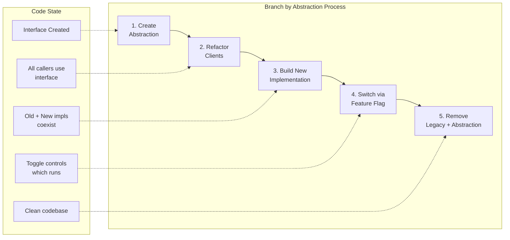
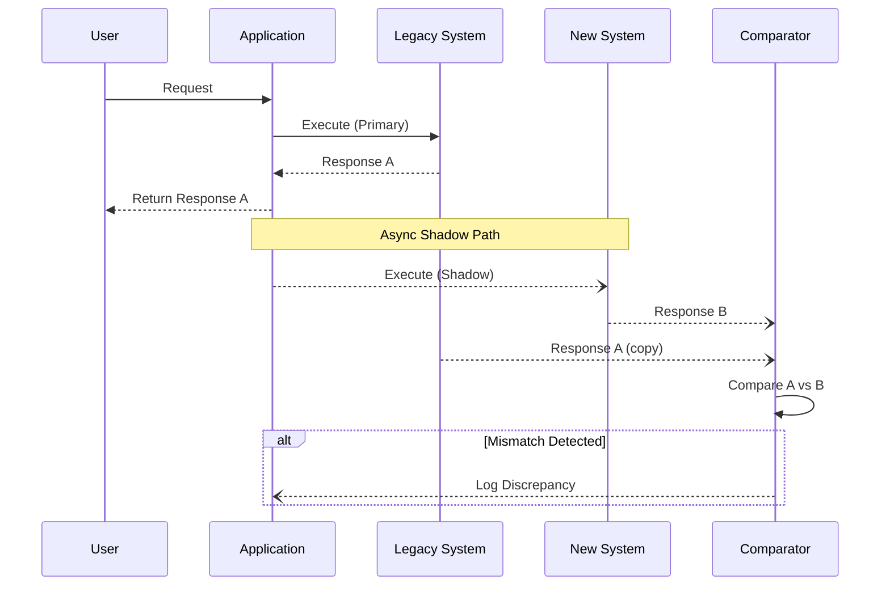
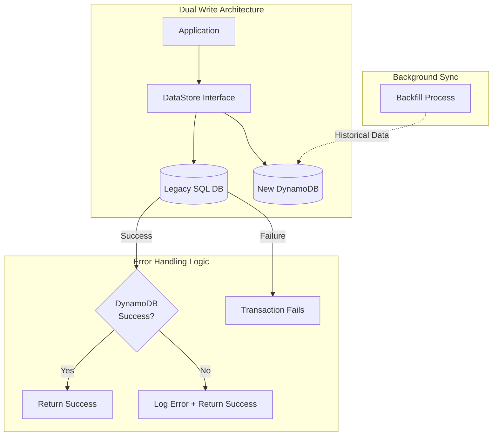
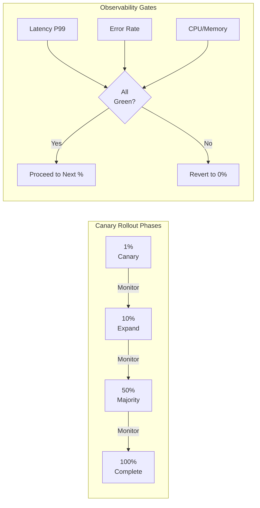

# Branch by Abstraction

A technique for making large-scale changes to a codebase safely while keeping the main branch releasable.

    Core Concept: Instead of long-lived feature branches, introduce an abstraction layer that allows old and new implementations to coexist. Toggle between them at runtime or compile time.
    Process: (1) Create abstraction over existing code, (2) Refactor all clients to use abstraction, (3) Build new implementation behind abstraction, (4) Switch to new implementation, (5) Remove old implementation and abstraction.
    Benefits: Trunk-based development. No merge conflicts from long-lived branches. Continuous integration keeps working. Ability to revert instantly if new implementation has issues.

// Step 1: Create abstraction
interface PaymentProcessor { process(payment: Payment): Result }

// Step 2: Old implementation behind abstraction
class LegacyPaymentProcessor implements PaymentProcessor { ... }

// Step 3: New implementation behind same abstraction
class NewPaymentProcessor implements PaymentProcessor { ... }

// Step 4: Toggle at runtime
const processor = featureFlag.useNewProcessor
  ? new NewPaymentProcessor()
  : new LegacyPaymentProcessor();

💡Interview Tip
When discussing monolith-to-microservices migration, mention Branch by Abstraction as the code-level technique that complements Strangler Fig at the architecture level. Shows you understand both strategic and tactical migration.

This guide covers 5 key areas: I. Conceptual Overview for the Principal TPM, II. Real-World Behavior: A Mag7 Case Study, III. Tradeoffs: The Principal TPM's Analysis, IV. Impact on Business, ROI, and CX, V. Interview Strategy: The "Monolith to Microservices" Connection.


## I. Conceptual Overview for the Principal TPM

At the Principal level, **Branch by Abstraction (BBA)** is not merely a coding pattern; it is a risk-mitigation strategy that aligns engineering velocity with business continuity. It addresses the fundamental conflict in large-scale software development: the need to radically refactor core systems without halting feature delivery or incurring the integration nightmare of long-lived feature branches.

### 1. The Strategic Necessity: Eliminating "The Big Bang"
In a Mag7 environment, the "Big Bang" release—where a massive refactor is merged and deployed all at once—is unacceptable due to the blast radius of potential failure. BBA allows for **Trunk-Based Development**, meaning all developers commit to the main branch daily, even while working on major structural changes that may take months to complete.



*   **The Mechanism:** Instead of creating a divergent Git branch, engineers create an abstraction layer (an interface or API signature) inside the main codebase. The existing client code is pointed to this abstraction, which initially delegates to the legacy implementation.
*   **The Shift:** This converts a "merge problem" (resolving thousands of conflicts at the end of a project) into a "dependency injection problem" (managing which implementation is active at runtime).

### 2. Real-World Behavior: The "Shadow Mode" at Scale
A Principal TPM must understand that BBA in a Mag7 context rarely involves a simple binary switch. It almost always involves a phase of **Shadowing** (or Dark Reads/Writes).



**Example: Google/YouTube Comment System Migration**
Imagine migrating a comment fetching service from a legacy BigTable schema to a new Spanner schema.
1.  **Abstraction:** A `CommentService` interface is created.
2.  **Shadowing:** The application calls the interface. The code executes the *Legacy* path to return data to the user. Asynchronously, it also executes the *New* path.
3.  **Verification:** A background worker compares the results of Legacy vs. New.
4.  **TPM Value:** You are not measuring "code complete"; you are measuring **parity percentage**. You can report: *"The new system is handling 100% of traffic in shadow mode with 99.99% data parity."*
5.  **Cutover:** Once parity is confirmed, a configuration flag flips the `CommentService` to return the *New* path's data.

### 3. Tradeoff Analysis
Every architectural choice incurs cost. BBA is no exception.

| Factor | Tradeoff / Cost | Benefit / ROI |
| :--- | :--- | :--- |
| **Code Complexity** | **High.** The codebase temporarily contains two versions of the system plus the abstraction glue code. This increases cognitive load for developers debugging unrelated issues. | **Risk Reduction.** Eliminates "Merge Hell." If the new system fails, rollback is a config change (seconds), not a code revert (minutes/hours). |
| **Performance** | **Medium.** The abstraction layer adds a minor hop. Shadowing/Dual-writing doubles the load on downstream dependencies or databases. | **Zero Downtime.** Enables live migration without maintenance windows. Validates performance under real production load before the user sees it. |
| **Development Velocity** | **Short-term Slowdown.** Setting up the abstraction and parity testing takes upfront effort (often 10-20% overhead). | **Long-term Velocity.** The team never stops shipping features. CI pipelines remain green. No "code freeze" is required. |

### 4. Impact on Business and Capabilities
*   **Business Continuity:** The most critical impact is the decoupling of **Deployment** (moving code to production) from **Release** (exposing features to users). You can deploy the new billing engine code on Tuesday, verify it all week, and release it to customers on Monday.
*   **Skill Capability:** This forces engineering teams to think in terms of **Seams** and **Contracts**. It matures the organization from "cowboy coding" to rigorous, interface-driven design.
*   **ROI:** The ROI is calculated by avoiding the *Cost of Delay*. If a migration requires a 3-month code freeze, the cost is 3 months of lost feature revenue. BBA allows features to flow concurrently, preserving revenue streams.

### 5. The "Cleanup" Failure Mode
The single greatest risk in BBA is failing to remove the abstraction after the migration.
*   **The Trap:** The new system goes live, it works, and the team moves to the next project. The "Legacy" code and the Abstraction layer remain in the codebase, rotting.
*   **TPM Action:** The migration is not "Done" when the new system is live. It is "Done" when the **Legacy code is deleted** and the Abstraction layer is removed (unless the interface is desired for long-term architecture). The Principal TPM must enforce this via the Definition of Done (DoD).

## II. Real-World Behavior: A Mag7 Case Study

### Phase 2: The Parallel Implementation & Dual Write Strategy
Once the `DataStore` interface is live and the application is stable using the legacy `SqlDataStore`, the engineering team begins building the `DynamoDataStore`. This happens on the main branch.

**The Mag7 Approach: Dual Writes**
At Amazon or Meta, simply building the new path isn't enough. The data must be synchronized. The standard pattern here is **Dual Write, Single Read**.



1.  **Code Logic:** The `DataStore` interface is modified to write to *both* the SQL database and DynamoDB.
2.  **Error Handling:** The write to the Legacy (SQL) is authoritative. If SQL fails, the transaction fails. If DynamoDB (New) fails, the error is logged/metric emitted, but the user transaction succeeds. This prevents the migration from impacting availability.
3.  **Backfill:** A background process (e.g., AWS DMS or a custom script) iterates through historical SQL data and populates DynamoDB, handling race conditions with the live dual-writes.

**Tradeoffs:**
*   **Latency:** Dual writes increase write latency. If the legacy write takes 50ms and DynamoDB takes 20ms, the user waits 70ms (sequential) or slightly over 50ms (parallel, waiting for the slowest).
*   **Complexity:** Handling "split brain" scenarios where writes succeed in one but fail in the other requires robust reconciliation logic later.

**Business Impact:**
*   **Risk Mitigation:** The new database is load-tested with real production write volume before a single read query is served from it.

### Phase 3: The "Scientist" Pattern (Dark Reads)
Before switching traffic, you must prove the new implementation returns the exact same data as the old one. GitHub popularized the "Scientist" pattern, which is standard practice at Mag7 companies for BBA.

**The Implementation:**
The application is configured to read from the Legacy source to serve the user, but asynchronously reads from the New source to compare results.

```text
Result legacy = legacyRepo.get(id); // Return to user
async {
  Result new = newRepo.get(id);
  if (legacy != new) {
    logMismatch(legacy, new);
  }
}
```

**Mag7 Nuance:**
At Google or Netflix scale, you cannot log *every* mismatch if the error rate is high, nor can you run shadow reads on 100% of traffic due to resource costs (doubling read capacity requirements).
*   **Sampling:** Enable shadow reads for 1% of traffic.
*   **Noise Reduction:** You must filter out "expected" differences (e.g., timestamps, floating-point precision differences between SQL and NoSQL).

**Tradeoffs:**
*   **Cost:** You are effectively doubling the read load on your infrastructure (or 1% of it) without user benefit. This impacts COGS (Cost of Goods Sold).
*   **False Positives:** Non-deterministic data (like `NOW()` timestamps) will always flag as mismatches unless normalization logic is applied.

### Phase 4: The Toggle Flip (Canary Rollout)
Once the "mismatch" metric hits zero (or an acceptable threshold), the TPM orchestrates the cutover. This is controlled via a dynamic configuration flag (e.g., LaunchDarkly or internal tools like Facebook's Gatekeeper).



1.  **Canary:** Route 1% of *reads* to `DynamoDataStore`.
2.  **Observation:** Monitor latency, error rates, and CPU utilization.
3.  **Ramp Up:** Increment to 10%, 50%, 100%.

**The "Kill Switch" Capability:**
The defining feature of BBA is reversibility. If at 50% traffic, a latent bug in the DynamoDB schema causes a latency spike, the TPM or On-Call Engineer can revert the config flag to 0% immediately. The code does not need to be rolled back; only the execution path changes.

**Business Impact:**
*   **MTTR (Mean Time To Recovery):** Recovery is seconds (config change), not minutes/hours (code rollback).
*   **CX:** Users experience zero downtime during the migration.

### Phase 5: Cleanup (The "Un-Branching")
This is the phase most often neglected, leading to "Zombie Code." Once 100% of traffic is successfully handled by `DynamoDataStore` for a defined stability period (e.g., 2 weeks):

1.  **Remove the Toggle:** Hardcode the application to use `DynamoDataStore`.
2.  **Delete the Legacy Code:** Remove `SqlDataStore` and the abstraction interface if it's no longer needed for polymorphism.
3.  **Decommission Infrastructure:** Shut down the SQL RDS instances.

**TPM Responsibility:**
The migration is not "Done" until the legacy code is deleted. The TPM must track "Tech Debt Cleanup" as a blocking release requirement. Keeping dead code increases the cognitive load for developers and bloats the binary size (relevant for mobile apps).

---

## III. Tradeoffs: The Principal TPM's Analysis

### 1. The Cost of Indirection vs. The Cost of Divergence

The most immediate tradeoff a Principal TPM must evaluate is the upfront engineering tax ("The Cost of Indirection") versus the downstream integration risk ("The Cost of Divergence").

*   **The Technical Reality:** Implementing BBA requires writing code that does not add immediate end-user value. Engineers must write the abstraction interface, write the implementation wrappers for the legacy code, and wire up the toggling mechanism.
*   **Mag7 Context:** In a Google-scale monorepo, long-lived feature branches are an anti-pattern. The cost of resolving merge conflicts on a 3-month-old branch often exceeds the time it took to write the feature.
*   **The Tradeoff:**
    *   *Option A (Feature Branching):* Zero upfront abstraction cost, but exponential "merge hell" risk and blocking of other teams.
    *   *Option B (Branch by Abstraction):* 15-20% increase in initial development time (Capex) in exchange for near-zero merge conflicts and continuous integration (Opex savings).
*   **TPM Decision Framework:** If the migration touches "high-churn" code (e.g., the checkout flow at Amazon or the News Feed ranking at Meta), BBA is mandatory. If the migration touches a stable, rarely touched library, the overhead of BBA may yield negative ROI.

### 2. Performance Latency and The "Thick" Abstraction Risk

When you inject an abstraction layer (an interface or a proxy) into a hot code path, you introduce latency. For a Generalist TPM, the concern is whether this latency impacts SLAs.

*   **Real-World Example:** At Netflix, migrating from one IPC (Inter-Process Communication) mechanism to another requires an abstraction layer. If that layer performs data marshalling/unmarshalling on every request, it could add 5-10ms of latency. In a microservices call chain of 20 deep, this aggregates to 200ms, which is unacceptable for user-facing playback.
*   **The Tradeoff:**
    *   *Clean Abstraction:* A perfectly generic interface allows easy swapping but often requires heavy data transformation to make the old and new data models fit the same signature.
    *   *Leaky Abstraction:* Exposing some implementation details to improve performance, but making the eventual "cutover" harder.
*   **Impact on CX:** A Principal TPM must enforce **Performance Parity Testing** during Phase 1 (wrapping the legacy code). If the abstraction layer itself degrades CX before the new logic is even written, the migration will be killed by leadership.

### 3. The "Double Maintenance" Tax

During the transition period—which can last months in large organizations—the business does not stop asking for features.

*   **The Challenge:** If a PM requests a new feature in the domain being migrated, engineers potentially have to implement it twice: once in the legacy `SqlDataStore` (to keep the lights on) and once in the new `DynamoDataStore` (to ensure feature parity at cutover).
*   **Mag7 Behavior:**
    *   *Freeze Strategy:* The TPM negotiates a "Code Freeze" on the legacy component. Only Sev1/Sev2 bugs are fixed. All new features are blocked until migration completes.
    *   *Parity Strategy:* Required for critical systems (e.g., Azure Identity). Every change must be dual-written.
*   **ROI Analysis:** The "Double Maintenance" tax destroys developer velocity. As a Principal TPM, you must shorten the "Parallel Implementation" phase to the absolute minimum to reduce this waste. You must quantify this cost to stakeholders to justify aggressive resourcing for the migration.

### 4. Technical Debt and the "Zombie" Abstraction

BBA is a pattern for *transition*, not a permanent architecture. The abstraction layer is, by definition, technical debt the moment it is written because its primary purpose is to facilitate a rewrite, not to serve the business long-term.

*   **Failure Mode:** The "Zombie Abstraction." The team successfully migrates 95% of traffic to the new system. The remaining 5% hits edge cases in the legacy system. The team gets re-assigned to a new project. The abstraction layer remains forever, adding complexity and cognitive load to every new hire who wonders, "Why do we have this interface with only one active implementation?"
*   **TPM Action:** The migration is not "Done" when traffic is 100% on the new system. It is "Done" when the abstraction layer and the legacy code are deleted. The Principal TPM tracks "Code Deletion" as a distinct milestone with its own OKR.

### 5. Organizational Trust vs. "Big Bang" Releases

The intangible but critical tradeoff involves organizational trust.

*   **Big Bang Approach:** High visibility, high anxiety. If the cutover fails (e.g., a database migration fails on Black Friday), the engineering brand is damaged, and leadership imposes heavy governance on future changes.
*   **BBA Approach:** Low visibility, low anxiety. The migration happens incrementally.
*   **Business Capability Impact:** BBA allows the business to "bail out" halfway. If the new `DynamoDataStore` proves too expensive or slow after implementing 30% of features, the TPM can pivot back to the legacy system instantly without a rollback, because the legacy system was never removed—it was just toggled off. This **Optionality** is a massive strategic asset for the business.

## IV. Impact on Business, ROI, and CX

### 1. ROI Analysis: The Economics of Continuous Integration
At the Principal level, you must articulate BBA not as a coding technique, but as a risk-management investment. The ROI of Branch by Abstraction is calculated by comparing the **Cost of Abstraction Complexity** against the **Cost of Integration Delay**.

*   **The Cost of Divergence:** In a Mag7 environment, a long-lived feature branch (e.g., >3 days) diverges exponentially from the main trunk. If a migration team works on a separate branch for 3 months, the cost to merge involves weeks of "Merge Hell," resulting in a code freeze. For a company like Amazon, a code freeze that halts feature delivery for 2 weeks can cost tens of millions in delayed revenue realization.
*   **The BBA Investment:** BBA introduces immediate overhead. Engineers must write the abstraction layer (the interface), implement the old logic behind it, and write tests for the "seam." This increases initial development time by approximately 15-20%.
*   **The Payoff:**
    *   **Zero Integration Cost:** Because the code is merged daily, there is no "Big Bang" merge day.
    *   **Reduced MTTR (Mean Time To Recovery):** If the new implementation causes a P0 incident, the "fix" is a configuration toggle flip (seconds), not a code rollback (minutes to hours).

**Tradeoff:** You are trading **Development Velocity** (writing code slower due to abstraction overhead) for **Release Velocity** (shipping code faster due to zero integration issues).
*   *Mag7 Context:* Google optimizes for Release Velocity. They accept the overhead of complex abstractions (like migrating from MapReduce to Flume/Dataflow) to ensure the monorepo never breaks.

### 2. CX Impact: Invisible Migrations and Dark Launching
For the customer, the primary impact of BBA is the **absence of maintenance windows**. In the enterprise era, migrations required "scheduled downtime." In the Mag7 era, migrations happen while the plane is flying.

*   **Dark Launching via Abstraction:** Once the abstraction is in place, the new implementation (e.g., the `DynamoDataStore`) can be invoked in production without returning data to the user.
    *   *Shadow Traffic:* The application calls *both* the old and new implementations. It returns the old result to the user but asynchronously compares the new result for accuracy (parity testing) and latency.
    *   *CX Benefit:* You validate the correctness of the migration using real customer data without the customer ever seeing an error.
*   **Granular Rollout (Canarying):** BBA allows you to switch the implementation for 1% of users, or specific high-tolerance segments (e.g., internal employees).
    *   *Mag7 Example:* When Facebook migrated their chat infrastructure from Erlang to C++, they used BBA patterns to route specific user IDs to the new C++ service while keeping the rest on Erlang. If the C++ service degraded, the abstraction layer automatically fell back to the legacy path.

**Tradeoff:** Shadow traffic doubles the load on downstream dependencies (e.g., you are querying both the SQL DB and DynamoDB).
*   *Risk:* If not managed, this can DDoS your own internal services. A Principal TPM must ensure capacity planning accounts for this "double write/read" phase.

### 3. Business Capability: Decoupling Deployment from Release
BBA provides the business with a critical strategic capability: **Decoupling Deployment (Technical) from Release (Business).**

*   **The Capability:** Engineers can deploy the code for a massive architectural overhaul into production fully disabled. The code sits in the binary, inactive.
*   **The Business Value:**
    *   **Risk Control:** The business does not have to coordinate a massive "Go Live" date where engineering, marketing, and support must align perfectly. Engineering deploys weeks in advance.
    *   **Operational Readiness:** Support teams can toggle the new system on for themselves to train on the new workflows before they are live for the public.

**Tradeoff:** Binary bloat. The application contains two full versions of the logic simultaneously.
*   *Mobile Impact:* For mobile apps (iOS/Android), this increases the app download size. At scale (e.g., Instagram or Uber), app size directly correlates to uninstall rates in emerging markets with expensive data. TPMs must weigh the migration safety against the binary size budget.

### 4. The "Cleanup Tax": The Hidden ROI Killer
The most significant risk to business value in BBA is the failure to execute the final phase: **Cleanup.**

*   **The Scenario:** The migration is "done." 100% of traffic is on the new system. The business perceives the value is delivered.
*   **The Reality:** The abstraction layer and the dead legacy code remain in the codebase.
*   **The Impact:** This creates "Zombie Code." New engineers join and don't know which path to use. The abstraction layer adds cognitive load and latency (extra stack hops). If left for years, the codebase becomes unmaintainable.
*   **TPM Responsibility:** In a Mag7 environment, a Principal TPM defines "Done" not as "Traffic shifted," but as "Legacy code deleted and Abstraction removed." You must protect the roadmap capacity to pay this tax immediately.

## V. Interview Strategy: The "Monolith to Microservices" Connection

This topic is the nexus where architectural patterns (Strangler Fig, Branch by Abstraction) meet business strategy. In a Principal TPM interview at a Mag7, you will almost certainly be asked to describe a time you managed a complex migration. The interviewer is not looking for a project schedule; they are looking for your ability to navigate the **CAP theorem**, **Conway’s Law**, and **organizational inertia**.

The "Monolith to Microservices" story is the standard template for demonstrating technical program leadership, but most candidates fail because they focus on the *code* separation. To succeed at the Principal level, you must focus on the *data* separation and the *business* decoupling.

### 1. The Principal Narrative: Data Gravity vs. Service Velocity

When answering "Tell me about a complex migration," do not start with the services. Start with the data. In a monolithic architecture, the database is the integration point. The moment you split the application logic into microservices but keep a shared database, you have created a **Distributed Monolith**. This is the worst of both worlds: the network latency and complexity of microservices with the coupling and fragility of a monolith.

**Real-World Mag7 Behavior:**
At Meta or Amazon, a migration is not considered "architecturally decoupling" until the data stores are separated. If Team A’s service reaches directly into Team B’s database tables, the migration is incomplete.

*   **The Strategy:** You must articulate the shift from **ACID** transactions (Atomicity, Consistency, Isolation, Durability) within the monolith to **BASE** (Basically Available, Soft state, Eventual consistency) across microservices.
*   **The Tradeoff:** You trade immediate data consistency for system availability and partition tolerance.
    *   *Pro:* Failure in the "Recommendations" service does not prevent a user from "Checking Out."
    *   *Con:* You introduce the complexity of handling eventual consistency (e.g., a user buys an item, but the inventory count doesn't update for 500ms).
*   **TPM Impact:** You are responsible for defining the SLA for "eventual." Is 1 second acceptable? Is 1 hour? This is a product decision, not just an engineering one.

### 2. Defining Boundaries: Domain-Driven Design (DDD)

A Principal TPM must explain *how* they decided where to cut the monolith. Arbitrary splits (e.g., splitting by code file size) lead to "Chatty Services"—services that call each other thousands of times to complete one request, destroying latency.

**The Solution: Bounded Contexts**
Use Domain-Driven Design to identify "Bounded Contexts." These are autonomous business domains (e.g., Inventory, Billing, Shipping).

*   **Mag7 Example:** When Netflix decomposed their monolith, they didn't just separate "Frontend" and "Backend." They separated by domain ownership. The team owning the "Play Button" logic also owned the data regarding playback licensing.
*   **Tradeoff:**
    *   *Pro:* High cohesion within the service; low coupling between services. Teams can deploy independently.
    *   *Con:* Data duplication. The "User" entity might exist in the *Billing Service* (containing credit card info) and the *Profile Service* (containing avatar info). You must manage the synchronization of these entities.

### 3. The Execution: Dual Write vs. Change Data Capture (CDC)

In the interview, you must demonstrate how you moved data without downtime. There are two primary patterns a Principal TPM orchestrates:

**A. Dual Write (Application Level)**
The application writes to both the old SQL DB and the new NoSQL DB simultaneously.
*   **Tradeoff:** High risk of data divergence if one write fails. Requires complex error handling and "fix-up" scripts.
*   **Use Case:** Simpler migrations where slight temporary inconsistency is tolerable.

**B. Change Data Capture (Infrastructure Level)**
The application writes only to the old DB. A connector (like Debezium) reads the database transaction log and pushes changes to a message bus (Kafka), which then updates the new microservice’s DB.
*   **Tradeoff:** Higher infrastructure complexity (managing Kafka/Connectors) but guarantees eventual consistency without modifying application logic heavily.
*   **Mag7 Preference:** This is the standard for high-volume systems (e.g., LinkedIn feed updates, Uber trip states) because it decouples the writer from the replicator.

### 4. Organizational Strategy: The Inverse Conway Maneuver

Conway’s Law states that systems are constrained to produce designs that are copies of the communication structures of these organizations.

*   **The Trap:** If you have one large "Backend Team" trying to build 10 microservices, they will inevitably build a distributed monolith because they all talk to each other and share assumptions.
*   **The Principal Move:** The **Inverse Conway Maneuver**. You advise leadership to restructure the organization *before* or *during* the technical migration. You break the large team into small "Two-Pizza Teams" (Amazon terminology), each owning one microservice end-to-end.
*   **Business Impact:** This aligns incentives. The team feels the pain of their own on-call rotation, driving higher code quality and operational excellence.

### 5. ROI and Business Justification

Never tell a Mag7 interviewer you migrated "to clean up the code." That is a cost center, not a value driver. You migrated to unlock business capabilities.

**Key ROI Drivers to Cite:**
1.  **Deployment Velocity:** "By decoupling the Billing service, we moved from one deployment per week (monolith constraint) to 50 deployments per day, enabling faster A/B testing of pricing models."
2.  **Fault Isolation (Blast Radius):** "In the monolith, a memory leak in the 'Image Resizer' crashed the whole site. In microservices, it only breaks image uploading; the rest of the site remains profitable."
3.  **Scalability:** "We could scale the 'Search' service independently on compute-optimized instances without paying to scale the 'User Profile' service which is memory-bound."

---


## Interview Questions


### I. Conceptual Overview for the Principal TPM

**Question 1: The Parity Gap**
"We are using Branch by Abstraction to migrate our core search indexing engine. We are in 'Shadow Mode,' but we are seeing a 0.5% discrepancy between the legacy results and the new results. Business pressure is high to cut over. As the Principal TPM, how do you handle this?"

*   **Guidance for a Strong Answer:**
    *   **Reject the cutover:** A 0.5% error rate at Mag7 scale (e.g., millions of queries) is catastrophic.
    *   **Root Cause Analysis:** Is the discrepancy due to data staleness (eventual consistency), logic bugs, or nondeterministic sorting?
    *   **Gradual Ramp:** Suggest a "Canary" release rather than a full cutover. Route 1% of *real* user traffic to the new system (not just shadow) for a specific, low-risk user segment to see if user behavior metrics (CTR) change, even if data parity isn't perfect (sometimes the new logic is "better" but different).
    *   **Focus on Observability:** Ensure we have logs detailing exactly *which* queries differ.

**Question 2: Managing Technical Debt**
"You are leading a migration using BBA. The engineering manager argues that we should keep the Abstraction Layer permanently 'just in case' we need to switch back or change vendors again in the future. How do you respond?"

*   **Guidance for a Strong Answer:**
    *   **Challenge YAGNI (You Ain't Gonna Need It):** Premature optimization for a hypothetical future migration adds permanent maintenance overhead.
    *   **Cognitive Load:** Explain that keeping dead code paths confuses new hires and complicates debugging.
    *   **Compromise:** If the interface serves a genuine architectural purpose (Dependency Inversion Principle), keep the interface but **delete the legacy implementation code**.
    *   **Process:** Insist that if the legacy code remains, it must be fully maintained and tested, which is a waste of resources. If we aren't maintaining it, it's a liability, not a safety net.

### II. Real-World Behavior: A Mag7 Case Study

### Question 1: Handling Data Divergence
**"We are using Branch by Abstraction to migrate a payment calculation engine. During the 'Shadow Mode' phase, you notice that 0.5% of the new calculations differ from the legacy calculations by a few cents. The business wants to complete the migration by Q4 to save licensing costs. As the Principal TPM, how do you handle this?"**

**Guidance for a Strong Answer:**
*   **Root Cause Analysis:** Do not simply accept the risk. Investigate *why* the divergence exists (e.g., rounding errors, floating point vs. decimal types, race conditions).
*   **Risk Assessment:** Quantify the impact. Is 0.5% representing $10 or $10M?
*   **Strategy:** Propose a "fix forward" approach. Keep the shadow mode running while engineers fix the logic.
*   **Hard Line:** Refuse to flip the switch until parity is achieved or the business explicitly signs off on the financial loss (Unlikely in Payments).
*   **Technical solution:** Suggest implementing a "diff" logger that captures the specific inputs causing the mismatch to reproduce locally.

### Question 2: The Cost of Abstraction
**"An engineering lead pushes back on using Branch by Abstraction for a critical low-latency trading service, arguing that adding an interface layer and feature flag checks will add 5ms of latency, which is unacceptable. How do you respond?"**

**Guidance for a Strong Answer:**
*   **Acknowledge the Constraint:** Validate that for high-frequency trading, 5ms is indeed an eternity.
*   **Challenge the Assumption:** Ask for benchmarks. A virtual method call in Java/C++ is usually nanoseconds, not milliseconds. The 5ms likely comes from network I/O or bad logic, not the abstraction pattern itself.
*   **Alternative Implementation:** Propose compile-time flags (build-time switching) instead of runtime flags if the performance hit is truly verified. This sacrifices the "instant kill switch" but preserves the parallel development capability.
*   **ROI Discussion:** Discuss the cost of *not* doing it. If we don't use BBA, we require a "stop the world" migration. Is the trading firm willing to shut down the service for 4 hours to deploy? Likely not.

### III. Tradeoffs: The Principal TPM's Analysis

### Question 1: The Stalled Migration
"You are leading a critical migration of a payment gateway using Branch by Abstraction. You have reached 90% traffic on the new gateway, but the final 10% involves complex legacy edge cases that are difficult to port. The business is pressuring you to move engineers to a new AI initiative. What do you do?"

*   **Guidance for a Strong Answer:**
    *   **Quantify the Risk:** Acknowledge that leaving 10% on legacy means maintaining two stacks, doubling the on-call burden, and increasing security surface area.
    *   **Tradeoff Analysis:** Evaluate the ROI of the final 10%. Can those edge cases be deprecated instead of migrated?
    *   **Definition of Done:** Assert that a migration is not complete until the legacy code is deleted. Leaving a "Zombie" abstraction is a failure of TPM execution.
    *   **Negotiation:** Propose a "Cleanup Squad" or negotiate a hard deadline with leadership, explaining that the "interest rate" on this technical debt (maintenance cost) will eventually outweigh the value of the new AI initiative if left unchecked.

### Question 2: Handling Feature Requests During Flight
"Midway through a BBA migration of your core search algorithm, Product Leadership demands a new 'urgent' feature that must launch next month. Implementing it in the new system is easy, but the new system isn't live yet. Implementing it in the old system delays the migration. How do you handle this?"

*   **Guidance for a Strong Answer:**
    *   **Assess Criticality:** Is this truly "urgent" (legal/compliance/revenue blocking) or just "important"?
    *   **The "Tax" Conversation:** Explain the "Double Write" tax. If we write it in legacy, we throw that work away in 2 months.
    *   **Strategic Options:**
        1.  *Accelerate Migration:* Can we launch the new system earlier, perhaps just for the subset of users who need this new feature? (Using the BBA toggles to route specific users).
        2.  *Bridge Solution:* Implement the feature in the *new* system only, and use the abstraction layer to route requests for *only that feature* to the new code, while keeping standard search on the old code.
    *   **Outcome:** Demonstrate the ability to use the BBA architecture to solve the business problem, rather than just blocking the request.

### IV. Impact on Business, ROI, and CX

**Question 1: The Stalled Migration**
"You are leading a migration from an on-prem Oracle database to AWS Aurora using Branch by Abstraction. The team has successfully routed 50% of read traffic to Aurora via the abstraction layer. However, due to a sudden shift in company priorities, the Engineering Director wants to pull all developers off the migration to build new AI features. The migration is currently stable but incomplete. How do you handle this?"

*   **Guidance for a Strong Answer:**
    *   **Acknowledge the Debt:** Identify that stopping at 50% leaves the system in the worst possible state (high complexity, maintaining two databases, data consistency risks).
    *   **Quantify the Cost:** Explain the OpEx cost of running two DBs and the cognitive load on the team.
    *   **Negotiate a "Hold" State:** If the pause is unavoidable, you must negotiate a "stabilization sprint" to ensure the abstraction is documented and the toggle mechanisms are robust enough to survive 6 months of neglect.
    *   **Reject "Hope":** Do not simply say "we will try to finish it on weekends." Explicitly resource the maintenance of the hybrid state or propose reverting to 0% if the pause is indefinite to save OpEx.

**Question 2: BBA vs. Microservices**
"We are breaking a monolith into microservices. An architect proposes using Branch by Abstraction to refactor the code *inside* the monolith first before extracting it to a service. A Senior Engineer argues this is a waste of time and we should just build the microservice and use the Strangler Fig pattern at the load balancer. How do you evaluate these tradeoffs and which path do you recommend?"

*   **Guidance for a Strong Answer:**
    *   **Identify the Constraint:** The decision depends on how "entangled" the code is.
    *   **Defense of BBA:** If the database tables are shared and the logic is coupled, Strangler Fig is dangerous because you cannot cleanly separate the data. You *must* use BBA to decouple the logic inside the monolith first (creating a clean "seam").
    *   **Defense of Strangler:** If the domain is already loosely coupled, BBA is unnecessary overhead.
    *   **Principal Level nuance:** The candidate should ask about the data layer. "Data gravity" usually dictates the approach. If the data is entangled, BBA is the prerequisite to Strangler Fig.

### V. Interview Strategy: The "Monolith to Microservices" Connection

### Question 1: The "Distributed Transaction" Trap
**"We are migrating a monolithic e-commerce platform to microservices. Currently, when a user places an order, we transactionally deduct inventory and charge the credit card. If we split 'Inventory' and 'Payments' into separate services with separate databases, we lose ACID transactions. How do you manage this architecture and the program execution?"**

*   **Guidance for a Strong Answer:**
    *   **Acknowledge the Tradeoff:** Admit immediately that you cannot have ACID across services. Do not try to fake it with Two-Phase Commit (2PC) as it kills availability (locks resources).
    *   **Propose the Pattern:** Discuss the **Saga Pattern**. Explain how you would orchestrate a sequence of local transactions (Order Created -> Inventory Reserved -> Payment Processed).
    *   **Handle Failure (Compensating Transactions):** Crucial point. If Payment fails, you cannot just "rollback." You must trigger a *compensating transaction* to "Un-reserve Inventory."
    *   **TPM Role:** Explain how you would map these failure states with Product Managers. "What is the CX if payment fails? Do we email the user? Do we retry automatically?" This shows you bridge the gap between complex distributed systems and user experience.

### Question 2: The "Premature Optimization" Challenge
**"A Director of Engineering wants to break a mid-sized application into 50 microservices to 'modernize' the stack. The team is currently 15 engineers. As the Principal TPM, how do you evaluate this request?"**

*   **Guidance for a Strong Answer:**
    *   **Challenge the Premise:** A Principal TPM prevents over-engineering. 50 services for 15 engineers is a ratio of ~3 services per engineer, which is unmanageable (operational overhead, on-call fatigue).
    *   **Microservice Prerequisite:** Cite the "Microservice Premium." Microservices require mature CI/CD, automated testing, and observability. If the team lacks this platform maturity, microservices will slow them down, not speed them up.
    *   **Alternative Strategy:** Propose a "Modular Monolith" first. Clean up the code boundaries *inside* the single repo/deployable. If boundaries aren't clear in the monolith, they will be disastrous over a network.
    *   **Business Alignment:** Ask for the business driver. If the goal is velocity, show data proving that the overhead of RPC calls, serialization, and network debugging will likely *reduce* velocity for a team this size.

---


## Key Takeaways

- Review each section for actionable insights applicable to your organization

- Consider the trade-offs discussed when making architectural decisions

- Use the operational considerations as a checklist for production readiness
