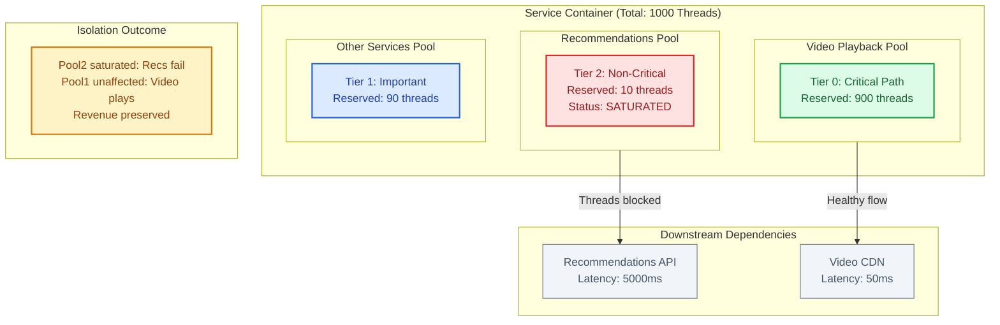
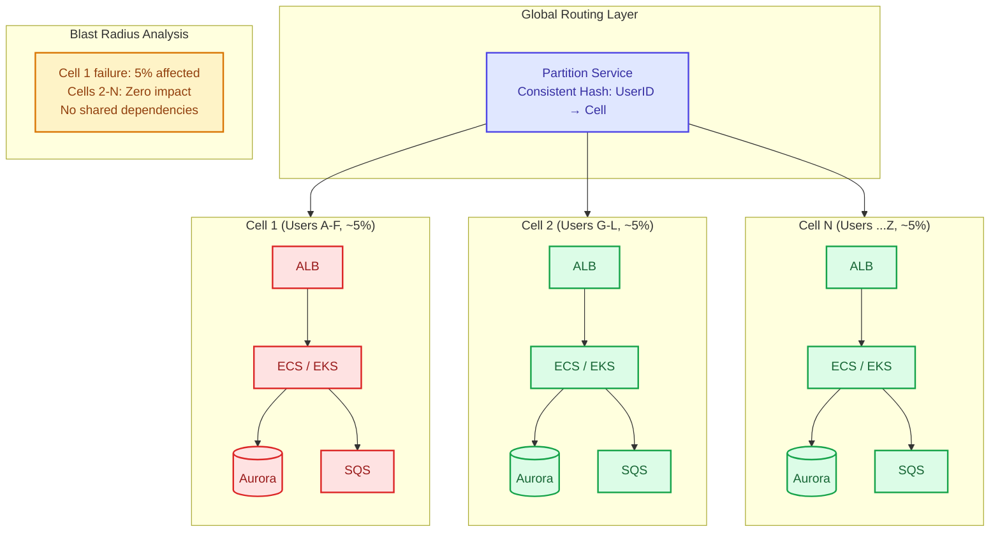

# Bulkhead Pattern

This guide covers 5 key areas: I. Conceptual Overview for the Principal TPM, II. Technical Mechanics & Implementation Layers, III. Real-World Behavior at Mag7 Companies, IV. Strategic Tradeoffs, V. Impact on Business, ROI, and Capabilities.

## I. Conceptual Overview for the Principal TPM

At the Principal level, understanding the Bulkhead Pattern requires moving beyond the basic definition of "separating resources" to understanding it as a primary mechanism for **Blast Radius Reduction** and **Service Tiering**. In a Mag7 environment, where services operate at massive scale, a failure in a non-critical component (e.g., a "User Avatar" service) must never impact the critical path (e.g., "Checkout" or "Ad Serving").

The conceptual framework for a Principal TPM relies on three pillars: **Resource Isolation**, **Failure Containment**, and **Service Categorization**.

### 1. Resource Isolation Models
The technical implementation of bulkheads occurs at different layers of the stack. A Principal TPM must identify which layer provides the necessary ROI for a specific risk profile.

*   **Execution Isolation (Thread/Process):**
    *   *Concept:* Assigning fixed quotas of threads or semaphores to specific dependencies.
    *   *Mag7 Example:* **Netflix Hystrix** (and its modern successors like Resilience4j). Netflix engineers explicitly configure thread pools for downstream dependencies. If the "Movie Recommendations" service latency spikes, it saturates its specific thread pool (e.g., 10 threads) and immediately rejects further requests. Crucially, the remaining 900 threads in the container serving the "Video Player" remain untouched.
    *   *Business Impact:* This preserves the core value proposition (playing video) even if discovery features fail, directly protecting retention metrics.

*   **Infrastructure Isolation (Compute/Hardware):**
    *   *Concept:* Physically separating workloads onto different VMs, clusters, or "Cells."
    *   *Mag7 Example:* **Amazon’s Cell-Based Architecture**. Rather than having one massive fleet of servers for the "Order Service," Amazon partitions the service into independent "cells" (shards). Each cell handles a specific subset of customers. If a bad deployment or a "poison pill" request crashes a cell, only 2-5% of customers are affected.
    *   *Tradeoff:* High infrastructure cost. You lose the efficiency of statistical multiplexing (sharing resources to handle peaks). You are paying for redundancy to buy reliability.

*   **Tenancy Isolation:**
    *   *Concept:* Ensuring "Noisy Neighbors" (high-volume users) do not degrade performance for others.
    *   *Mag7 Example:* **Google Cloud/Borg**. Google classifies jobs as "Production" (latency-sensitive) vs. "Batch" (throughput-sensitive). Production jobs have strict resource reservations (bulkheads) that Batch jobs cannot encroach upon, ensuring that a massive data analysis job doesn't slow down Google Search.

### 2. Strategic Tradeoffs: The "Utilization vs. Reliability" Curve
A Principal TPM acts as the counterbalance to Engineering's desire for optimization or pure reliability. You must navigate the specific tradeoffs of implementing bulkheads.

*   **Complexity vs. Resilience:**
    *   *The Cost:* Bulkheads introduce configuration complexity. Instead of managing one thread pool, you manage twenty. If you misconfigure a bulkhead (e.g., make it too small), you create artificial bottlenecks where the system rejects valid traffic despite having idle CPU on the box.
    *   *The Gain:* You eliminate "Cascading Failure." A Principal TPM accepts higher operational complexity (more tuning required) to avoid the existential risk of total platform downtime.

*   **Resource Waste (Over-provisioning) vs. Availability:**
    *   *The Cost:* To implement bulkheads effectively, you often cannot run servers at 80-90% utilization. You must leave "slack" in each partition to handle spikes because resources cannot be borrowed from a neighbor partition.
    *   *ROI Analysis:* The Principal TPM must articulate that the cost of 20% extra EC2 spend is negligible compared to the revenue loss of a 30-minute global outage.

### 3. Business & CX Impact
The Bulkhead pattern is the technical enabler for **Graceful Degradation**.

*   **User Experience:** In a monolithic failure, the user sees a 500 error or a white screen. In a bulkheaded system, the user sees the main page load, but perhaps the "Similar Items" widget is missing or replaced by cached data.
*   **SLA Tiering:** It allows the business to define Tier 1 (Critical) vs. Tier 3 (Non-Critical) services.
    *   *Action:* You enforce strict bulkheads around Tier 3 dependencies. If the "Gif Search" feature in a messaging app slows down, the bulkhead ensures it cannot starve the "Send Message" function.
    *   *ROI:* This prioritization prevents engineering teams from over-optimizing low-value features. We don't need 99.999% availability on the Gif Search; we just need to ensure its failure is contained.

### 4. Edge Cases and Failure Modes
Even with bulkheads, systems can fail. A Principal TPM should anticipate these edge cases during architecture reviews:

*   **The "Retry Storm":** If a bulkhead fills up and rejects requests, the calling clients might aggressively retry. If not coupled with *Exponential Backoff*, this traffic can overwhelm the network layer before it even reaches the thread pool.
    *   *Mitigation:* Bulkheads must be paired with "Circuit Breakers" and client-side throttling.
*   **Misconfigured Quotas:** If the bulkhead for a critical service (like Auth) is sized too small, you will cause a self-inflicted outage during normal traffic peaks.
    *   *Mitigation:* Dynamic configuration and rigorous load testing (Game Days) to tune pool sizes.

---

## II. Technical Mechanics & Implementation Layers

ice to a specific downstream resource (e.g., a database or a third-party API).
*   **The Mechanic:** If an application connects to both a high-criticality transactional database (OLTP) and a low-criticality analytics warehouse (OLAP), sharing a single connection pool is a vulnerability. If the analytics queries stall, they may hoard all open connections, preventing users from checking out.
*   **Mag7 Implementation:** At Amazon and AWS, services strictly segregate connection pools for **Control Plane** (configuration/admin APIs) versus **Data Plane** (user traffic). This ensures that a massive spike in user traffic (or a DDoS) does not prevent operators from issuing commands to fix the system.
*   **Tradeoff:** Idle connections consume memory and database resources. Over-segmenting pools leads to resource fragmentation where threads are starving in one pool while another sits idle.
*   **Business Impact:** Preserves "Administrative Access" during outages. If the ship is sinking, the captain still needs access to the bridge.

### 3. Cellular Architecture (Infrastructure Layer)
This is the most advanced form of bulkheading and a standard discussion point for Principal TPMs at Mag7 companies (particularly AWS and Azure).

*   **The Mechanic:** Instead of scaling a service by just adding more nodes to a single massive cluster, the architecture is divided into self-contained "Cells." A cell is a complete, independent instance of the service (load balancer, compute, storage) that can handle a fixed percentage of traffic.
*   **Mag7 Implementation:**
    *   **AWS:** Uses cellular architecture to minimize blast radius. If a software bug is deployed to a cell, or a "poison pill" request hits a cell, only the customers routed to that specific cell (e.g., 5% of users) are affected. The remaining 95% operate without degradation.
    *   **Slack/Discord:** often partition by "Workspace" or "Server" ID, effectively treating large customers as their own bulkheads.
*   **Principal’s Tradeoff Analysis:**
    *   **Complexity:** Routing logic becomes significantly harder. You need a "partition service" to know which user belongs to which cell.
    *   **Efficiency:** You lose some statistical multiplexing efficiency. You might have spare capacity in Cell A while Cell B is red-lining, requiring sophisticated rebalancing tools.
*   **ROI/CX:** This is the primary mechanism for achieving "five nines" (99.999%) availability. It changes a "Global Outage" headline into a "Minor degradation for a subset of users" support ticket.

### 4. Criticality-Based Bulkheading (Service Layer)
Separating resources based on the *business value* of the request rather than just the destination.

*   **The Mechanic:** Creating dedicated lanes for high-priority traffic.
*   **Mag7 Implementation:**
    *   **Google:** Often implements "Gold," "Silver," and "Bronze" tiers for internal RPC traffic. If a cluster is under load, Bronze traffic (batch jobs, index updates) is throttled or dropped to preserve Gold traffic (user-facing search queries).
    *   **Netflix:** Segregates "Playback" traffic from "Discovery" traffic. If the recommendation engine (Discovery) fails, the bulkhead ensures the API for hitting "Play" (Playback) still has dedicated capacity. Users might not see new movie art, but they can still watch what they already selected.
*   **Business Impact:** Directly protects revenue. In e-commerce, this means separating "Checkout" resources from "Browsing" resources. If the search bar crashes, users with items in their cart can still pay.

### 5. Geographic/Zonal Bulkheading
The ultimate physical bulkhead.

*   **The Mechanic:** Ensuring that a failure in one Availability Zone (AZ) or Region cannot propagate to another.
*   **Mag7 Reality:** While theoretically simple, this is hard to enforce. "Region-local" services often accidentally depend on a global control plane (e.g., a global IAM service). If that global service fails, the bulkhead is breached.
*   **Principal Action:** You must interrogate Engineering Leads on "Circular Dependencies" and "Global Single Points of Failure." Ask: "If us-east-1 goes down, does us-west-2 stay up, or do they share a global configuration store?"

---

## III. Real-World Behavior at Mag7 Companies

At the scale of Mag7 companies (Google, Amazon, Meta, Microsoft, etc.), the Bulkhead Pattern is rarely just about thread pools in a single application. It evolves into a macro-architectural strategy known as **Cellular Architecture** or **Shuffle Sharding**.

For a Principal TPM, the focus shifts from "How do we configure Hystrix?" to "How do we structure our entire fleet to minimize blast radius?"

### 1. Cellular Architecture (The "AWS Model")

In standard architectures, a service is often a monolith or a set of microservices where any web server can talk to any database node. At Mag7 scale, this is a risk; a "poison pill" request or a bad configuration push could propagate across the entire fleet.

**Real-World Behavior:**
Amazon Web Services (AWS) and Slack heavily utilize **Cellular Architectures**. Instead of one massive pool of servers, the infrastructure is sliced into isolated "cells." Each cell is a self-contained instance of the service (including compute, storage, and queues).
*   **Implementation:** A customer (Tenant A) is permanently assigned to Cell 1. Tenant B is assigned to Cell 2.
*   **Behavior:** If Cell 1 goes down due to a noisy neighbor or a bad deployment, only the 5% of customers on Cell 1 are affected. Tenant B on Cell 2 sees zero impact.

**Tradeoffs:**
*   **Capacity Fragmentation (Cost):** You lose the efficiency of statistical multiplexing. You cannot easily "borrow" idle CPU from Cell 2 to help a struggling Cell 1. This requires higher hardware overhead (buffer capacity) per cell.
*   **Routing Complexity:** You need a highly available routing layer (partition service) to know which user belongs to which cell. If the router fails, the bulkhead is useless.

**Business & ROI Impact:**
*   **Blast Radius Reduction:** This is the primary ROI driver. Reducing an outage from "Global Down" to "5% Down" prevents stock price dips and regulatory fines.
*   **Deployment Velocity:** Engineering teams can canary deploy to a single cell with high confidence, accelerating feature release cycles.

### 2. Tiered Service Partitioning (The "Netflix Model")

Mag7 companies ruthlessly prioritize "Critical User Journeys" (CUJs). Not all microservices are created equal. Bulkheads are applied to ensure Tier-1 services (Revenue/Core Utility) effectively starve Tier-3 services (Bells & Whistles) of resources during contention.

**Real-World Behavior:**
Netflix creates bulkheads between the **Playback API** (Start Stream) and the **Discovery API** (Recommendations/Search).
*   **Implementation:** Dedicated hardware clusters or strictly isolated container pools (Kubernetes namespaces with hard resource quotas) are assigned to Playback.
*   **Behavior:** If a bug in the recommendation engine causes a memory leak or CPU spike, the Discovery fleet crashes. However, the Playback fleet, physically isolated on different nodes or logically isolated via strict quotas, continues to function. Users can watch what they already selected, even if they can't search for new titles.

**Tradeoffs:**
*   **Resource Stranding:** During a massive sporting event (high playback, low browsing), the Discovery fleet might sit idle while the Playback fleet is red-lining. You cannot easily dynamically reallocate those resources in real-time without risking the bulkhead integrity.
*   **Operational Overhead:** Managing distinct capacity models for different tiers increases the toil for SRE and TPM teams regarding capacity planning.

**Business & CX Impact:**
*   **Graceful Degradation:** The product feels "broken" (no search results) rather than "dead" (black screen). This preserves user trust and reduces churn.
*   **SLA Compliance:** Allows the business to sign stricter SLAs for core functionality (99.99%) while accepting lower SLAs for peripheral features (99.9%), optimizing engineering spend.

### 3. Physical & Regional Isolation (The "GCP/Azure Model")

At the infrastructure layer, bulkheads are physical. This is the concept of Regions and Availability Zones (AZs). A Principal TPM must treat regional dependencies as a violation of the bulkhead pattern.

**Real-World Behavior:**
Google Cloud and Azure enforce strict separation of control planes between regions.
*   **Implementation:** A global control plane is a single point of failure. Mag7 companies shard their control planes. If the "Deploy VM" service fails in `us-east-1`, it must be architecturally impossible for that failure to impact `us-west-2`.
*   **Behavior:** This requires duplicating data and logic. It prevents "global" configurations from being pushed instantaneously. Changes propagate region by region (a temporal bulkhead).

**Tradeoffs:**
*   **Data Consistency Lag:** Global consistency becomes nearly impossible. You accept eventual consistency.
*   **Cost of Duplication:** Every region requires a full stack of management services, increasing the base cost of operation.

**Business & Capability Impact:**
*   **Sovereignty Compliance:** Physical bulkheads allow Mag7 companies to meet GDPR and data residency requirements by guaranteeing data (and the compute processing it) never leaves a specific "compartment."
*   **Disaster Recovery:** Facilitates true active-active failover strategies.

---

## IV. Strategic Tradeoffs

### 1. Resource Efficiency vs. Fault Tolerance (The "Stranded Capacity" Problem)

The most immediate strategic tradeoff in implementing bulkheads is the deliberate inefficiency introduced into the system. In a non-bulkheaded (shared) model, resources are liquid; any available thread or connection can service any incoming request. In a bulkheaded model, resources are rigid.

*   **The Technical Reality:** If you allocate 20 threads to the "Image Processing" service and 20 threads to the "User Profile" service, and "User Profile" is idle while "Image Processing" is spiking, those 20 "User Profile" threads sit useless. You have capacity, but you cannot use it. This is known as **stranded capacity**.
*   **Mag7 Example (Amazon/AWS):** In AWS control planes, bulkheads are often implemented via "Cell-based Architecture." If one cell (a bulkhead) is underutilized while another is melting down under load, AWS does *not* automatically shift capacity between them in real-time. To do so would bridge the bulkhead and risk spreading the failure.
*   **Business/ROI Impact:**
    *   **COGS (Cost of Goods Sold):** Bulkheading requires over-provisioning. To maintain the same throughput SLA as a shared model, you may need 20-30% more infrastructure spend to account for the lack of resource fluidity.
    *   **Decision Framework:** As a Principal TPM, you must justify this cost. The argument is that the cost of extra hardware is negligible compared to the revenue loss of a platform-wide outage. If the feature is Tier-2 (e.g., "User Avatars"), strict bulkheading may be too expensive; a shared pool with rate limiting might suffice.

### 2. Operational Complexity vs. System Stability

Bulkheads move complexity from runtime behavior (unpredictable cascading failures) to configuration management (predictable, but tedious tuning).

*   **The Technical Reality:** Determining the correct size for a bulkhead is non-trivial. If you size it too small, you create artificial bottlenecks and reject valid traffic (false positives). If you size it too large, the bulkhead fails to contain the blast radius, rendering the pattern useless.
*   **Mag7 Example (Netflix):** Historically, Netflix used Hystrix libraries where developers had to manually tune thread pool sizes for every dependency. This resulted in "configuration drift," where pool sizes were set during initial launch and never updated as traffic patterns changed, leading to inadvertent outages. Modern approaches (like Service Mesh/Envoy sidecars) attempt to abstract this, but the tuning requirement remains.
*   **Tradeoff Analysis:**
    *   **Developer Velocity:** Enforcing bulkheads requires engineering teams to perform load testing on *every* specific dependency to determine limits. This slows down "Time to Market."
    *   **Skill Capability:** It requires a maturity shift. Teams can no longer just "call an API." They must understand the concurrency model of their downstream dependencies.
*   **Actionable Guidance:** Do not enforce bulkheads on every single RPC call. Apply them strategically to **Tier-1 dependencies** (Database, Auth, Payments) and **known unstable 3rd parties**. For internal microservices with high trust, the operational overhead often outweighs the risk.

### 3. User Experience: Partial degradation vs. Hard Failure

The goal of a bulkhead is not just to keep the server running, but to enable **Graceful Degradation**. However, this forces a Product tradeoff regarding what the user actually sees when a bulkhead rejects a request.

*   **The Technical Reality:** When a thread pool bulkhead is full, the application immediately throws a `RejectedExecutionException` (or equivalent). The latency is near-zero (fast failure), but the data is missing.
*   **Mag7 Example (Google/YouTube):** If the "Comments" service bulkhead is saturated on YouTube, the video player (the core value proposition) continues to load perfectly. The comments section might simply display a spinner or hide entirely. The failure is contained to a non-critical feature.
*   **CX Impact:**
    *   **Consistency vs. Availability:** Bulkheads favor Availability. You are explicitly choosing to serve an incomplete page over serving an error page.
    *   **Communication:** The TPM must work with Product Design to ensure "fallback states" exist. If the "Price Check" bulkhead fails on an e-commerce site, can you show a cached price? Can you hide the "Add to Cart" button? If the UI isn't designed to handle the missing data, the bulkhead saves the backend but the frontend might still crash or look broken to the user.

### 4. Granularity: Micro-Bulkheads vs. Macro-Bulkheads

A Principal TPM must decide the level of isolation.

*   **Micro-Level (Connection/Thread Pools):** Isolating specific calls within a service (e.g., separating `GetOrder` threads from `CreateOrder` threads).
    *   *Pros:* Extremely fine-grained control.
    *   *Cons:* High configuration overhead.
*   **Macro-Level (Sharding/Cells):** Partitioning the entire customer base. For example, Users A-M live on "Cell 1," Users N-Z live on "Cell 2."
    *   *Pros:* Ultimate blast radius containment. If Cell 1 dies, Cell 2 is completely unaffected.
    *   *Cons:* Data migration between cells is difficult; potential for "hot shards" if one high-volume customer lands in a specific cell.
*   **Strategic Choice:** For critical infrastructure (Identity, Payments), Mag7 companies almost universally move toward Macro-Level bulkheading (Cell-based architecture). For feature-level isolation (Recommendations, Reviews), Micro-Level (thread pools) is the standard.

## V. Impact on Business, ROI, and Capabilities

At the Principal TPM level, the implementation of the Bulkhead Pattern transitions from a pure engineering concern to a strategic business capability. Your role is not just to ensure resilience, but to align architectural fault tolerance with business priorities, revenue protection, and Service Level Agreements (SLAs).

### 1. Revenue Protection and "Blast Radius" Economics

The primary business justification for the Bulkhead Pattern is the decoupling of critical revenue-generating paths from non-critical auxiliary features. In a Mag7 environment, downtime is measured in millions of dollars per minute.

*   **Real-World Mag7 Behavior (Amazon/E-commerce):** Consider the Amazon product detail page. It is composed of dozens of microservices: Pricing, Inventory, Reviews, Recommendations, and Advertising.
    *   **Without Bulkheads:** A latency spike in the "Reviews" service (non-critical) could saturate the shared connection pool, preventing the "Add to Cart" service (critical) from acquiring a connection. The result is total revenue cessation.
    *   **With Bulkheads:** The "Reviews" service is isolated to its own thread pool. If it fails, the reviews section on the page loads blank or shows a cached state, but "Add to Cart" functions normally.
*   **Business Impact:** This transforms a potential **P0 outage** (Site Down) into a **P3 incident** (Degraded Functionality). The ROI is calculated by comparing the potential revenue loss of a total outage against the infrastructure cost of maintaining separate resource pools.
*   **Tradeoffs:**
    *   **Resource Fragmentation:** Segregating resources (threads, memory, connections) inevitably leads to lower overall utilization. You may have idle threads in the "Checkout" pool while the "Search" pool is starving. You are trading infrastructure efficiency ($) for availability reliability ($$$).

### 2. Enabling Tiered SLAs and Multi-Tenancy (The "Noisy Neighbor" Solution)

For Platform-as-a-Service (PaaS) or B2B products (like AWS, Azure, or Slack), bulkheads are a product feature, not just a safety mechanism. They allow the business to sell different tiers of reliability.

*   **Real-World Mag7 Behavior (Cloud/SaaS):**
    *   **Scenario:** A multi-tenant architecture where thousands of customers share the same database cluster.
    *   **Implementation:** You apply bulkheads by tenant ID or tier. "Enterprise" customers get a dedicated connection pool or dedicated hardware shards (physical bulkheads), while "Free Tier" customers share a constrained, commingled pool.
    *   **Outcome:** If a Free Tier customer runs a poorly optimized query that locks the database, it only exhausts the "Free Tier" bulkhead. Enterprise clients remain unaffected.
*   **Capabilities Unlocked:**
    *   **Monetization:** You can contractually guarantee higher availability (99.99%) to premium customers because they are physically or logically insulated from the noise of the general population.
    *   **Risk Management:** You can deploy new features to the "Beta" bulkhead first. If the new code causes resource exhaustion, it is contained to the beta cohort.

### 3. Operational Complexity and Capacity Planning

Implementing bulkheads introduces significant operational overhead. As a Principal TPM, you must weigh the benefits of isolation against the complexity of tuning.

*   **The Tuning Challenge:** Sizing bulkheads is difficult. If you allocate too few threads to a service, you create artificial bottlenecks and reject valid traffic (false positives). If you allocate too many, you negate the safety benefit of the pattern.
*   **Mag7 Approach:** Companies like Netflix and Google utilize **Adaptive Concurrency Control**. Instead of static bulkhead sizes (e.g., "50 threads"), the system dynamically adjusts the bulkhead size based on real-time latency and error rates.
*   **Skill & Process Impact:**
    *   **Shift in Incident Response:** Incidents become less about "fixing the site" and more about "fixing the component." The urgency drops because the blast radius is contained.
    *   **Observability Requirements:** You cannot effectively use bulkheads without granular metrics. You need distinct dashboards for every thread pool. If you have 50 microservices and each has 5 bulkheads, your monitoring complexity increases 5x.

### 4. Failure Mode Analysis: The "Retry Storm" Edge Case

A critical edge case that Principal TPMs must anticipate is the interaction between Bulkheads and Retries.

*   **The Scenario:** Service A calls Service B. Service B's bulkhead is full, so it immediately rejects the request with a `503 Service Unavailable`.
*   **The Risk:** If Service A has an aggressive retry policy, it will immediately retry the request. Since the rejection was fast (because the bulkhead was full), Service A can retry thousands of times per second. This creates a "Retry Storm" that can DDoS the network layer, even if the application layer is protected by the bulkhead.
*   **Required Capability:** Bulkheads must be paired with **Circuit Breakers** and **Exponential Backoff** strategies. The bulkhead isolates the resource, but the circuit breaker stops the upstream service from hammering the full bulkhead.

---

## Interview Questions

### I. Conceptual Overview for the Principal TPM

**Question 1: Designing for Partial Failure**
"We are designing a new dashboard for our enterprise cloud customers. The dashboard aggregates data from Billing (critical), Usage Metrics (critical), and 'Community Tips' (non-critical, 3rd party API). Recently, the Community Tips API has been timing out, causing the entire dashboard to load slowly or crash for users. As a Principal TPM, how would you architect the solution to prevent this, and how do you sell the increased infrastructure cost to leadership?"

*   **Guidance for a Strong Answer:**
    *   **Identify the Pattern:** Explicitly mention the **Bulkhead Pattern** to isolate the 'Community Tips' thread pool/connection pool from Billing and Usage.
    *   **Technical Detail:** Explain that the Community Tips calls should be wrapped in a separate thread pool with a low timeout and a fallback (e.g., return an empty list or cached tips).
    *   **Business Justification:** Frame the "cost" not as a server expense, but as an insurance policy for CX. The cost of a few extra threads/resources is zero compared to the churn risk of enterprise customers being unable to see their Billing data.
    *   **SLA Differentiation:** Define Billing as Tier 0 (must work) and Tips as Tier 3 (best effort).

**Question 2: The Utilization Tradeoff**
"Engineering wants to merge three separate microservices (Search, Recommendations, and Ads) into a single compute cluster to save 30% on AWS costs by sharing resources. However, 'Search' is our highest traffic driver, while 'Recommendations' has a memory leak history. How do you evaluate this proposal?"

*   **Guidance for a Strong Answer:**
    *   **Risk Assessment:** Acknowledge the cost savings but highlight the **Shared Resource Risk**. If 'Recommendations' leaks memory in a shared cluster, it kills 'Search'.
    *   **Proposed Compromise:** Suggest a **Soft Multi-tenancy** approach. Use a shared cluster (Kubernetes) but enforce strict **Resource Quotas (Limits/Requests)** for CPU and Memory (Bulkheading at the container level).
    *   **Decision Framework:** If the isolation cannot be guaranteed via configuration (e.g., noisy neighbor IOPS issues), reject the merger for the critical 'Search' path, but perhaps allow merging 'Ads' and 'Recommendations'. Prioritize revenue protection over infrastructure optimization.

### II. Technical Mechanics & Implementation Layers

### Question 1: Designing for Blast Radius Reduction
**Prompt:** "We are designing a global notification system that sends push alerts to billions of users. Recently, a bad configuration push caused a global outage. As a Principal TPM, how would you restructure the architecture using the Bulkhead pattern to prevent a global recurrence, and what are the cost implications?"

**Guidance for a Strong Answer:**
*   **Identify the Failure Mode:** Acknowledge that a global config push breaching all boundaries indicates a lack of cellular isolation.
*   **Propose Cellular Architecture:** Suggest breaking the user base into "shards" or "cells" (e.g., by UserID hash or Geography). Each cell has independent infrastructure and configuration versions.
*   **Deployment Strategy:** Introduce "Canary Deployments" applied to one cell at a time. The bulkhead prevents the bad config from leaving the first cell.
*   **Address Cost/Complexity:** Explicitly mention that this increases infrastructure costs (loss of efficiency) and operational complexity (managing 100 cells vs 1 cluster).
*   **Business Justification:** Argue that the ROI of preventing a global outage outweighs the 15-20% infrastructure overhead.

### Question 2: Handling Resource Contention
**Prompt:** "Our e-commerce platform's 'Checkout' service shares a database cluster with the 'Order History' service. During Black Friday, heavy traffic on 'Order History' (users checking past orders) caused database connection exhaustion, bringing down 'Checkout.' How do you fix this without rewriting the entire database layer immediately?"

**Guidance for a Strong Answer:**
*   **Immediate Mitigation (Application Layer):** Implement Thread Pool Isolation within the application services immediately to ensure 'Checkout' calls have reserved threads that 'Order History' cannot touch.
*   **Intermediate Mitigation (Database Layer):** Implement strict Connection Pooling limits at the database proxy level (e.g., PgBouncer or ProxySQL). Cap 'Order History' connections to 20% of total capacity, reserving 80% for 'Checkout'.
*   **Long-term Vision:** Advocate for splitting the database (Physical Bulkhead) to decouple the read-heavy, low-criticality 'History' workload from the write-heavy, high-criticality 'Checkout' workload (CQRS pattern).
*   **Principal Perspective:** Focus on prioritizing *writes* (revenue) over *reads* (user curiosity) during the incident.

### III. Real-World Behavior at Mag7 Companies

### Question 1: The "Noisy Neighbor" Dilemma
**Question:** "We are building a multi-tenant SaaS platform for enterprise analytics. One of our largest customers occasionally runs massive queries that exhaust our database connection pool, causing timeouts for smaller customers. As a Principal TPM, propose an architectural evolution to solve this using the Bulkhead pattern, and explain the business trade-offs of your solution."

**Guidance for a Strong Answer:**
*   **Identify the Pattern:** The candidate should immediately identify this as a resource isolation problem solvable by Sharding or Cellular Architecture.
*   **Proposed Solution:** Move from a shared pool to **Tenant-Tiered Bulkheads**. Create a "Premium/Dedicated" pool for the large customer (charging them more) and a "Shared" pool for smaller tenants. Alternatively, implement **Shuffle Sharding** to ensure that if the large customer crashes their shard, they don't take down the entire shared fleet.
*   **Trade-offs:** A strong answer must admit that this increases infrastructure costs (idle database instances) and complexity in the routing layer.
*   **Business Lens:** Frame the solution not just as "fixing lag," but as enabling a new "Enterprise Pricing Tier" where dedicated isolation is a sold feature, turning a technical debt problem into a revenue opportunity.

### Question 2: Designing for Partial Failure
**Question:** "Our e-commerce checkout flow depends on five internal services: Inventory, Pricing, Fraud Detection, Loyalty Points, and Email Confirmation. Recently, the Loyalty Points service went down, causing the entire Checkout API to throw 500 errors. How would you re-architect this interaction model? What is the impact on the user experience?"

**Guidance for a Strong Answer:**
*   **Identify the Anti-Pattern:** The candidate should recognize tight coupling and the lack of failure isolation.
*   **Technical Implementation:** Propose wrapping the Loyalty and Email calls in bulkheads (and Circuit Breakers). If Loyalty fails, the thread pool for that service fills up/rejects, but the main Checkout threads remain free.
*   **The "Fallbacks":** Crucially, the candidate must define the *behavior* when the bulkhead is closed.
    *   *Inventory/Fraud/Pricing:* Critical (Hard dependency). If these fail, checkout fails.
    *   *Loyalty/Email:* Non-Critical (Soft dependency). If these fail, the checkout proceeds, and the system queues a "retry" for loyalty points asynchronously.
*   **CX Impact:** The user successfully buys the item (Revenue secured) but might see a message: "Your points will appear shortly." The candidate should highlight that securing the transaction is the priority over immediate consistency of point balances.

### IV. Strategic Tradeoffs

### Question 1: The "False Positive" Scenario
**Scenario:** "We implemented thread-pool bulkheads for all downstream dependencies in our Checkout service to prevent cascading failures. However, during a recent flash sale, we saw a 5% failure rate in Checkout, even though our downstream Payment Gateway was healthy and responding quickly. The logs show `PoolExhausted` errors. What is likely happening, and how would you approach fixing this as a Principal TPM?"

**Guidance for a Strong Answer:**
*   **Diagnosis:** The candidate should identify **Little’s Law** ($$L = \lambda W$$). If the dependency became *faster* or stayed the same, but volume ($\lambda$) increased drastically (flash sale), the pre-configured pool size ($L$) was likely too small for the new throughput. Alternatively, if the dependency slowed down slightly, the threads were held longer ($W$), exhausting the pool.
*   **Immediate Mitigation:** Scale the pool size dynamically if possible, or scale the number of service instances (horizontal scaling) to increase the aggregate pool size.
*   **Strategic Fix:** Discuss the tradeoff of static configuration. Propose **Adaptive Concurrency Limits** (which adjust limits based on real-time latency) rather than static thread counts.
*   **Business Lens:** Acknowledge that the bulkhead worked *too* well—it protected the system but rejected valid revenue. The fix involves better capacity planning or auto-scaling triggers, not just removing the bulkhead.

### Question 2: The ROI of Isolation
**Scenario:** "Our engineering team wants to re-architect our monolithic monolithic 'feed' service into a cell-based architecture (Macro-Bulkheads) to improve reliability. They estimate this will increase infrastructure costs by 40% due to data replication and stranded capacity. As a TPM, how do you determine if this architectural shift is worth the investment?"

**Guidance for a Strong Answer:**
*   **Quantify Risk:** Calculate the cost of downtime. If the feed goes down for 1 hour, how much ad revenue is lost?
*   **SLA Analysis:** Compare the current availability (e.g., 99.9%) with the target availability (e.g., 99.99%). Does the business *need* four nines?
*   **Blast Radius Calculation:** Currently, an outage affects 100% of users. With 10 cells, an outage affects 10% of users. Is the 40% cost increase justified by saving 90% of the user experience during an incident?
*   **Alternative Approaches:** Challenge the engineering team. Can we achieve 80% of the benefit with 10% of the cost using simple thread-pool bulkheads or prioritized shedding before moving to a full cell-based architecture? The candidate should demonstrate stewardship of company resources.

### V. Impact on Business, ROI, and Capabilities

**Question 1: Strategic Architecture**
"We are designing a new high-throughput payment gateway for our cloud platform. We have a mix of high-value enterprise clients and millions of low-volume developers. Engineering wants to use a shared resource model to save costs, but Product wants to guarantee SLAs for enterprise clients. As the Principal TPM, how do you architect the resource isolation strategy, and how do you justify the increased infrastructure spend to leadership?"

*   **Guidance:**
    *   **Identify the Conflict:** Cost efficiency (Shared) vs. Reliability/SLA (Isolated).
    *   **Propose Solution:** Implement a Bulkhead pattern based on Customer Tier. Create a "Gold" lane (dedicated resources, over-provisioned) and a "Standard" lane (shared resources, capped).
    *   **Justify ROI:** Frame the cost not as "extra servers" but as "insurance against SLA payout penalties and churn." Quantify the cost of an outage for an Enterprise client vs. the cost of 20% extra EC2 instances.
    *   **Nuance:** Mention the need for "bursting" capabilities or "shuffle sharding" to mitigate the risk of a single shard hotspotting.

**Question 2: Operational Tradeoffs**
"You've implemented thread-pool bulkheads across your services to prevent cascading failures. However, during a recent high-traffic event, several services started rejecting requests even though total CPU and Memory utilization on the hosts was only at 40%. What is happening, and how do you resolve this without removing the bulkheads?"

*   **Guidance:**
    *   **Root Cause:** The bulkheads were statically sized too small (conservative tuning). The "buckets" were full, rejecting traffic, leaving the rest of the server's capacity (CPU/RAM) idle. This is the classic "fragmentation" tradeoff.
    *   **Immediate Fix:** Dynamically resize the pools if the framework supports it, or redeploy with adjusted limits based on the new traffic profile.
    *   **Long-term Fix:** Move toward **Adaptive Concurrency** where bulkhead limits float based on the service's health, or implement **Work Stealing** (risky, but allows a busy pool to borrow from an idle one under strict conditions).
    *   **Anti-Pattern:** Do *not* suggest removing the bulkheads or making one giant pool; that reintroduces the cascading failure risk.

---

## Key Takeaways

- Review each section for actionable insights applicable to your organization

- Consider the trade-offs discussed when making architectural decisions

- Use the operational considerations as a checklist for production readiness
