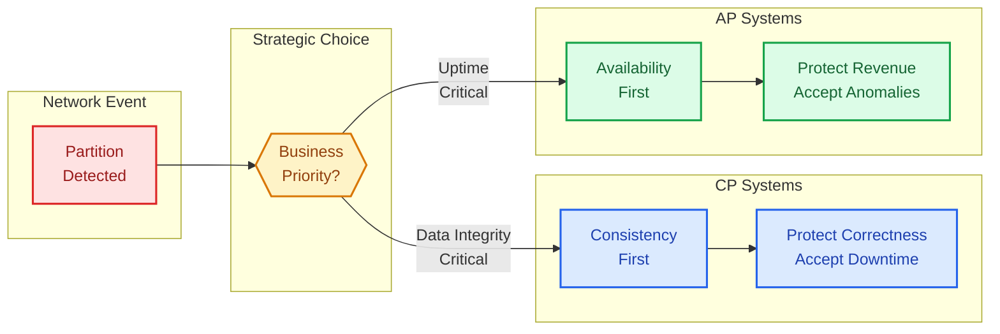
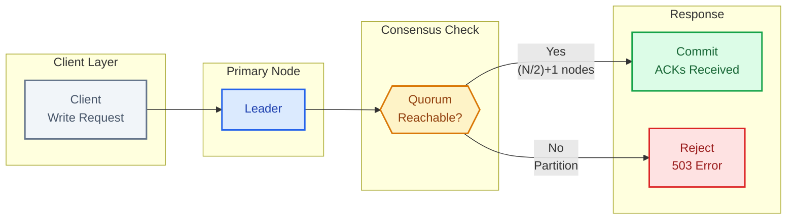
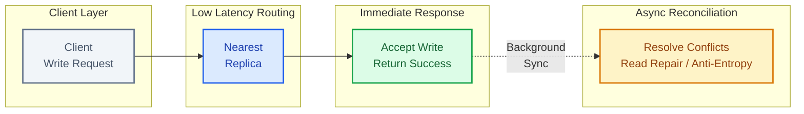
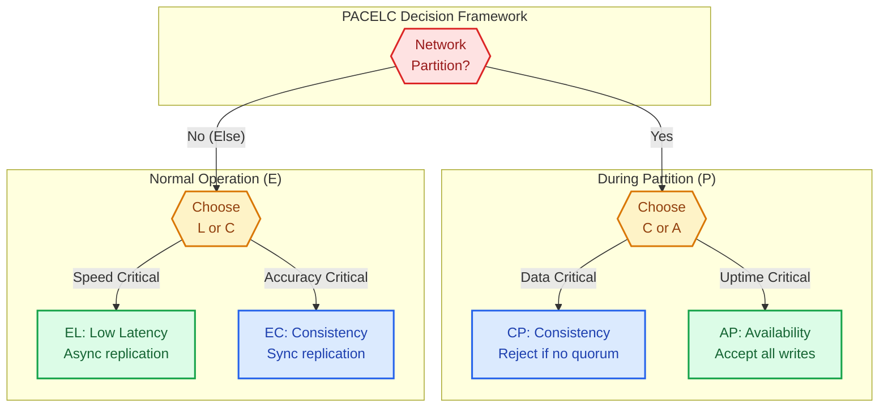
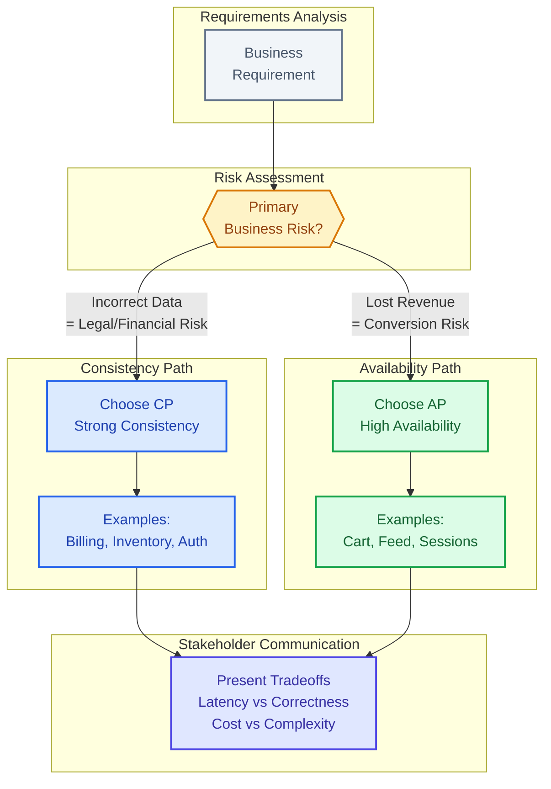

# CAP Theorem - Practical Understanding

In a distributed system experiencing a network partition, you must choose between Consistency and Availability. This is not a design choice - it is physics.

    CP Systems: Prioritize consistency. During partition, reject writes/reads to prevent inconsistent data. Examples: Zookeeper, etcd, HBase. Use for: configuration, leader election, inventory counts.
    AP Systems: Prioritize availability. During partition, allow operations but accept potential inconsistency. Examples: Cassandra, DynamoDB. Use for: user sessions, activity feeds, metrics.
    CA Myth: "CA" only exists in single-node systems. Any distributed system will have partitions (network is not reliable), so you must choose C or A during partitions.

★PACELC - The Full Picture
CAP only describes behavior during partitions. PACELC extends: "If Partition, choose A or C; Else (normal operation), choose Latency or Consistency." DynamoDB is PA/EL - available during partitions, low latency normally. Spanner is PC/EC - consistent always but higher latency.

This guide covers 5 key areas: I. The Principal TPM Perspective: Why CAP Matters to Business, II. CP Systems: When Truth is More Important than Uptime, III. AP Systems: When Revenue and Engagement Rule, IV. PACELC: The "Everyday" Trade-off (Latency vs. Consistency), V. Strategic Application: How to Interview on This.

## I. The Principal TPM Perspective: Why CAP Matters to Business

At the Principal level, the CAP theorem is not an academic concept regarding distributed database properties; it is a framework for **strategic risk assessment** and **product definition**. In a distributed system at Mag7 scale, the "P" (Partition Tolerance) is immutable. Networks are asynchronous; switches fail; fiber lines are cut; GC pauses mimic outages. Therefore, the system *will* partition.

The Principal TPM’s role is to facilitate the business decision between **Consistency** (Data Correctness/Linearizability) and **Availability** (Uptime/Latency) during those inevitable failure modes. This decision dictates the system’s architecture, engineering cost, and user experience.

### 1. The Business Logic of Failure Modes

When a Principal TPM leads an architecture review, the focus must shift from "database capabilities" to "business tolerance." The decision between CP and AP is fundamentally a decision about which business metric takes a hit when the infrastructure degrades.

*   **CP (Consistency prioritized):** The business decides that **incorrect data is more expensive than downtime**.
    *   *Mag7 Context:* Google’s AdLedger or Amazon’s Billing/Payments services.
    *   *Behavior:* If the system cannot guarantee that a transaction is unique and replicated to a quorum, it returns a 5xx error or blocks the request.
    *   *Business Rationale:* A "double spend" or incorrect billing record creates legal liability and requires expensive manual reconciliation (customer support tickets, forensic accounting). It is cheaper to reject the transaction than to fix it later.

*   **AP (Availability prioritized):** The business decides that **missed revenue/engagement is more expensive than data anomalies**.
    *   *Mag7 Context:* Amazon’s Shopping Cart, Netflix’s "Continue Watching," or Meta’s News Feed.
    *   *Behavior:* The system accepts the write even if it cannot talk to the master node or peer replicas. It resolves the conflict later.
    *   *Business Rationale:* Blocking a user from adding an item to a cart during a Prime Day partition results in immediate, unrecoverable revenue loss. It is cheaper to accept two conflicting "add to cart" actions and merge them (or apologize later) than to block the purchase intent.

### 2. Real-World Implementations and Nuances

At the Mag7 level, we rarely use out-of-the-box defaults. We implement tunable consistency or specialized hardware to manipulate the CAP triangle.

*   **Google Spanner (The "CA" Illusion):**
    *   *Implementation:* Spanner uses TrueTime (atomic clocks + GPS) to keep clock drift between data centers extremely small (<10ms). This allows it to use Paxos for strong consistency with global scale.
    *   *The Principal Insight:* While often marketed as "CA," Spanner is technically **CP**. If a partition exceeds the TrueTime uncertainty window, Spanner halts. However, Google invested billions in hardware to make "P" so rare that the system *feels* like CA to the product team.
    *   *Tradeoff:* Massive infrastructure cost and write latency (waiting for commit wait) in exchange for developer simplicity (ACID transactions at scale).

*   **Amazon DynamoDB (Tunable Consistency):**
    *   *Implementation:* Allows the client to choose between "Eventual Consistency" (AP behavior, cheaper, faster) and "Strong Consistency" (CP behavior, more expensive, higher latency) per read request.
    *   *The Principal Insight:* This shifts the complexity to the application developer. The TPM must ensure the product team understands that reading from a secondary index is asynchronous and might show stale data.
    *   *Tradeoff:* Lower infrastructure cost and high availability, but high application complexity to handle conflict resolution (e.g., Vector Clocks, Last-Write-Wins).

### 3. Tradeoffs: Engineering Cost vs. User Experience

The choice between CP and AP impacts the entire software development lifecycle (SDLC) and organizational structure.

| Feature | CP Systems (Consistency) | AP Systems (Availability) |
| :--- | :--- | :--- |
| **Engineering Complexity** | **Lower.** The database handles the hard work. Developers assume the data they read is correct. | **Higher.** Developers must write logic to handle stale reads, conflict resolution, and idempotency. |
| **Operational Risk** | **Availability Risk.** A minor network blip can cause a cascading outage or "thundering herd" upon recovery. | **Data Risk.** "Split brain" scenarios can lead to data corruption or zombie records that are hard to clean up. |
| **User Experience (CX)** | **Deterministic but Brittle.** The system works perfectly or not at all. Users see "System Busy" errors. | **Resilient but Confusing.** The system always loads, but users may see deleted items reappear or chat messages out of order. |
| **Cost Profile** | **High Read/Write Latency.** Requires synchronous replication (waiting for acks). | **High Storage/Compute.** Requires storing multiple versions of data and background compute to repair entropy (Read Repair). |

### 4. Actionable Guidance for Principal TPMs

When driving technical strategy, use the following framework to guide Engineering Managers and Product Managers:

1.  **Define the "Unit of Consistency":**
    *   Do we need global consistency, or just consistency per user?
    *   *Example:* A user’s email inbox needs to be consistent for *that user* (monotonic reads), but it does not need to be immediately consistent with a sender’s outbox. Sharding by UserID allows you to treat the system as CP for the user but AP for the global network.

2.  **Quantify the Cost of Stale Data:**
    *   Ask Product: "If a user changes their profile photo, is it acceptable for their friend to see the old photo for 500ms? 5 seconds? 5 minutes?"
    *   If the answer is "5 minutes," you save millions of dollars by using aggressive caching and eventual consistency (AP). If the answer is "0ms" (e.g., revoking access rights), you must pay for CP.

3.  **Identify the Conflict Resolution Strategy (for AP):**
    *   If you choose AP, you *must* define how data merges when the network heals.
    *   *Last-Write-Wins (LWW):* Simple, but data loss occurs if two users edit simultaneously.
    *   *CRDTs (Conflict-free Replicated Data Types):* Mathematically proven merging (used in collaborative editing like Google Docs), but high engineering overhead.
    *   *Business Logic:* "In a conflict, the transaction with the higher dollar value wins."

### 5. Edge Case: The "P" is not always a hard cut

A common pitfall is assuming a Partition is a clean cable cut. In reality, **latency is indistinguishable from failure** (this leads into the PACELC theorem).

*   **Gray Failures:** A switch drops 5% of packets. A CP system might lock up entirely as leader election protocols (like Raft or Paxos) time out and retry indefinitely. An AP system will continue to serve requests, potentially diverging data significantly.
*   **The Zombie Leader:** In a CP system, if the old leader is partitioned but doesn't know it, it might continue accepting writes that it cannot replicate. When the partition heals, these writes are often discarded (data loss) to align with the new leader. The TPM must ensure the client-side UI handles this "rollback" gracefully.

## II. CP Systems: When Truth is More Important than Uptime

CP systems prioritize data integrity above all else. In a distributed environment, if a partition occurs—meaning a communication breakdown between nodes or regions—a CP system will reject write requests or return errors rather than accepting data that might conflict with the "source of truth."

For a Principal TPM, advocating for a CP architecture is a strategic decision to accept **latency** and potential **downtime** (during leader elections) to avoid the catastrophic business cost of **Split Brain** scenarios, where two parts of a system believe they are both the active leader and diverge effectively corrupting the dataset.

### 1. The Mechanics of Consistency: Quorums and Leaders

To understand the CP tradeoff, you must understand the mechanism that enforces it: **Consensus Algorithms** (e.g., Paxos, Raft, Zab).

*   **The Mechanism:** In a cluster of $N$ nodes, a write is only successful if $(N/2) + 1$ nodes acknowledge it. This is a **Quorum**.
*   **The Failure Mode:** If a network partition isolates a minority of nodes, those nodes lock down. They cannot form a quorum, so they refuse all writes. The system appears "down" to users connected to that minority partition.
*   **The Latency Tax:** Because the leader must wait for confirmation from followers before confirming a write to the client, CP systems are bound by the speed of light between data centers.

**Mag7 Real-World Behavior:**
At Google or Meta, we rarely use CP for user-facing content (like a News Feed). We use CP for the **Control Plane** and **Metadata Stores**.
*   **Example:** **Kubernetes (etcd)** or **Zookeeper**. When you deploy code at a Mag7 scale, the system that decides *which* version of code is running where must be CP. If the deployment system splits and deploys Version A to the East Coast and Version B to the West Coast while thinking both are the global standard, you create a debugging nightmare that can take days to resolve.

### 2. High-Stakes Use Cases: When Truth is Non-Negotiable

As a Product Principal, you drive the requirements that dictate whether CP is necessary. You are essentially asking: "Is the cost of reconciliation higher than the cost of downtime?"

#### A. Global Inventory (The "Oversell" Risk)
Consider a limited-inventory launch (e.g., a new console drop on Amazon or ticket sales).
*   **The Scenario:** You have 1 item left. Two users click "Buy" simultaneously from different regions.
*   **AP Approach:** Both succeed. You now have -1 inventory. You must email one user to cancel (high CX friction, brand damage).
*   **CP Approach:** The database locks the row. One transaction succeeds; the other fails or queues.
*   **Tradeoff:** The checkout process is slower, and if the inventory database region goes down, sales stop globally. However, the business avoids legal liability and customer support overhead.

#### B. Financial Ledgers and Credits
In Ads platforms (Google Ads, Meta Ads), customers have strict budget caps.
*   **The Scenario:** An advertiser has a \$100 budget cap.
*   **Requirement:** The system must strictly enforce this cap. If the counter is eventually consistent, the advertiser might spend \$100 in Region A and \$100 in Region B before the regions sync.
*   **Mag7 Implementation:** These systems use CP stores (like Spanner or strongly consistent DynamoDB reads) for the balance check. If the balance cannot be verified due to a partition, ads stop serving.
*   **Business Impact:** It is better to pause revenue generation (stop showing ads) than to overcharge a client and trigger refunds, audits, and churn.

### 3. Google Spanner: The "CA" Exception via Hardware
A deep-dive on CP at a Mag7 level is incomplete without mentioning Google Spanner. Spanner is technically CP, but Google has engineered around the availability tradeoffs so effectively that it *feels* CA to the product team.

*   **How:** Spanner uses **TrueTime** (atomic clocks + GPS in data centers) to minimize the uncertainty window of time.
*   **The Principal TPM Takeaway:** You can achieve CP with high availability, but it requires massive infrastructure investment. If you are building a product that needs global strong consistency without high latency, you are implicitly asking for a Spanner-like infrastructure dependency. This drastically increases the cost per transaction.

### 4. Strategic Tradeoffs and ROI Analysis

When you approve a CP design, you are accepting specific operational burdens.

| Feature | CP System Implication | Business/ROI Impact |
| :--- | :--- | :--- |
| **Latency** | High. Writes must traverse the network to a quorum. | **Lower Conversion:** Every 100ms of latency can drop conversion by 1%. CP is rarely used for the "Add to Cart" button, but often used for the "Place Order" button. |
| **Scalability** | Vertical Scaling is easier; Horizontal is hard. | **Higher Cost:** CP systems often have a write bottleneck (the single leader). Scaling write throughput requires sharding, which introduces complex cross-shard transaction logic. |
| **Failure Recovery** | Automatic but disruptive (Leader Election). | **Transient Error Spikes:** When a leader node dies, the system hangs for 3–30 seconds to elect a new leader. The business must tolerate these "blips" in availability. |
| **Data Integrity** | Absolute. | **Reduced OpEx:** You do not need to build complex "reconciliation jobs" or manual support teams to fix corrupted data. The database ensures correctness. |

### 5. Managing the "Split Brain" Risk

The single greatest risk in distributed systems is Split Brain—where two nodes both think they are the leader and accept conflicting writes.

**The TPM’s Role in Mitigation:**
1.  **Fencing:** Ensure your engineering team implements "Fencing Tokens." If a leader is cut off, and a new leader is elected, the old leader must be "fenced off" (banned) from writing to storage.
2.  **SLA Definition:** Define the **Election Timeout**. How long can the business tolerate "write unavailability" while the system picks a new leader?
    *   *Aggressive (1-3s):* High risk of false positives (network blips trigger elections).
    *   *Conservative (30s+):* Higher stability, but longer outages during actual failures.

## III. AP Systems: When Revenue and Engagement Rule

In the Mag7 landscape, AP (Availability/Partition Tolerance) systems are the default architecture for consumer-facing products. This is driven by a simple economic reality: **Latency kills conversion, and downtime kills trust.**

For a Product Principal TPM, the AP decision is rarely about database settings; it is a strategic decision to prioritize **write acceptance** over **data correctness** during a failure event. You are explicitly deciding that it is better to accept an order that might conflict with inventory levels than to reject a customer's money.

### 1. The Mechanics of "Always On"

In an AP system, when a network partition occurs (e.g., US-East-1 cannot talk to US-West-2), nodes on both sides of the partition continue to accept reads and writes. To achieve this, the system typically employs **Leaderless Replication** (like DynamoDB) or **Multi-Master Replication**.

**The Technical Cost: Entropy**
Because both sides act independently, the databases diverge. This creates "entropy." The system must eventually reconcile these differences.
*   **Read Repair:** When a client reads data, the system detects discrepancies between nodes and fixes them on the fly.
*   **Anti-Entropy Protocols:** Background processes (like Merkle Trees in Cassandra/Dynamo) constantly compare data blocks between nodes to synchronize them.

**Principal TPM Takeaway:** AP systems are not "fire and forget." They transfer the complexity from the *write path* (where it blocks the user) to the *read path* or *background processes* (where it consumes compute resources). You must account for this "reconciliation tax" in your infrastructure COGS (Cost of Goods Sold).

### 2. Real-World Mag7 Implementations

#### Amazon: The Shopping Cart (The Canonical Example)
Amazon’s defining architectural choice was that a user must *always* be able to add an item to their cart, even if the data center housing their session is failing.
*   **Behavior:** If a partition occurs, Amazon allows writes to divergent versions of the cart.
*   **Reconciliation:** When the network heals, the system merges the carts.
*   **Business Logic:** If the merge is ambiguous (e.g., did they delete the item or add it?), Amazon chooses the "additive" approach. It is better to have a deleted item reappear (Customer: "Oops, let me delete that again") than to have a purchased item disappear (Customer: "Where is my order? I'm leaving").

#### Meta (Facebook/Instagram): The News Feed
Social feeds are classic AP systems.
*   **Behavior:** If a user in London posts a photo, and the link to New York is severed, New York users won't see it immediately.
*   **Tradeoff:** Consistency is sacrificed for Latency and Availability. It does not matter if a "Like" count is off by 5 for a few minutes.
*   **Impact:** If Meta enforced Strong Consistency (CP), posting a status would require global locking. Latency would skyrocket, and engagement would plummet.

### 3. The Conflict Resolution Strategy

The most critical contribution a Principal TPM makes in an AP environment is defining the **Conflict Resolution Strategy**. Engineers can build the mechanism, but Product/TPM must define the logic.

When two users modify the same data during a partition, how do we decide who wins?

#### A. Last Write Wins (LWW)
The system relies on the timestamp. The latest timestamp overwrites the older one.
*   **Pros:** Extremely simple to implement; low engineering overhead.
*   **Cons:** **Data Loss.** If User A edits a wiki page at 12:00:01 and User B edits it at 12:00:02, User A's work is silently deleted.
*   **Use Case:** Updating a user's profile picture or "Last Active" timestamp.

#### B. CRDTs (Conflict-free Replicated Data Types)
Mathematical data structures that guarantee mathematical convergence without user intervention.
*   **Pros:** No data loss; mathematically proven consistency eventually.
*   **Cons:** High engineering complexity; significant storage overhead (you store the history of operations, not just the state).
*   **Use Case:** Collaborative editing (Google Docs), Counters (YouTube views).

#### C. Semantic/Business Resolution
The application pushes the conflict to the client or handles it via custom logic.
*   **Pros:** Best user experience; prevents data loss.
*   **Cons:** High development cost; requires client-side logic updates.
*   **Use Case:** Git merge conflicts (manual), Amazon Cart (union of sets).

### 4. Tradeoffs and Business Impact

| Metric | AP System Impact | Principal TPM Action |
| :--- | :--- | :--- |
| **Revenue** | **Maximized.** The system never rejects a "Buy" button click due to database consensus issues. | Ensure the cost of reconciling oversold inventory is lower than the revenue gained by staying online. |
| **User Experience** | **High Perceived Performance.** Low latency because the system doesn't wait for global consensus. | Manage expectations regarding "stale reads." Define SLAs for "Convergence Time" (e.g., "Data will be consistent within 2 seconds"). |
| **Engineering Cost** | **High.** Building systems that handle concurrency and state reconciliation is significantly harder than transactional SQL. | Allocate adequate roadmap time for "Anti-Entropy" mechanisms and testing failure scenarios (Chaos Engineering). |
| **Data Integrity** | **Compromised (Temporarily).** The system admits it provides a "best guess" at any specific microsecond. | Identify the specific data fields that *cannot* be AP (e.g., Billing/Credits) and isolate them into separate CP microservices. |

### 5. Edge Cases: When AP Goes Wrong

A Principal TPM must anticipate the failure modes of AP systems, which are subtle and often go unnoticed until customers complain.

*   **The "Deleted" Item Resurfacing:** In a multi-master setup, if a delete operation is not propagated correctly (or if a "tombstone" is lost), deleted data can reappear. This is a privacy risk (GDPR/CCPA).
*   **The Inventory Oversell:** If two users buy the last iPhone during a partition, the system accepts both orders. The business logic must handle this *post-hoc* (e.g., email the second customer with a delay notification or coupon).
*   **Cascading Latency:** If the anti-entropy process (synchronizing data) consumes too much bandwidth, it can slow down the read/write path, causing the very latency you tried to avoid.

## IV. PACELC: The "Everyday" Trade-off (Latency vs. Consistency)

While the CAP theorem governs system behavior during catastrophic network failures (Partitions), PACELC governs the system's behavior during **normal operations** (Else). As a Principal TPM, you spend 1% of your time planning for CAP scenarios and 99% of your time optimizing for PACELC.

The PACELC theorem states:
*   If there is a Partition (P), the system must trade off between Availability (A) and Consistency (C).
*   **Else (E)** (when the system is running normally), the system must trade off between **Latency (L)** and **Consistency (C)**.

This distinction is critical for Product TPMs because "normal operation" determines the baseline User Experience (CX) and infrastructure cost. You are effectively deciding between: "Do we show the user data *instantly* (Low Latency) but risk it being slightly old?" or "Do we make the user *wait* (High Latency) to ensure the data is perfectly up-to-date?"

### 1. The Mechanics of the Trade-off
In a distributed system at Mag7 scale, data is replicated across multiple nodes or regions to ensure durability.
*   **The Consistency Choice (EC):** When a write occurs, the system blocks the response until the data is replicated to a majority (Quorum) or all nodes. This guarantees the next read is accurate but increases the time (latency) the user waits for confirmation.
*   **The Latency Choice (EL):** The system accepts the write, acknowledges the user immediately, and replicates the data asynchronously in the background. The user gets a fast response, but a subsequent read occurring milliseconds later might return old data (inconsistency).

### 2. Real-World Mag7 Behavior: DynamoDB and Cassandra
At Amazon and Meta, we rarely treat systems as purely "Consistent" or "Low Latency." We treat consistency as a **tunable spectrum** based on the specific product feature.

**Example A: Amazon DynamoDB (The Shopping Cart vs. Checkout)**
Amazon's DynamoDB allows developers to choose between "Eventual Consistency" and "Strong Consistency" for every read request.
*   **The "Else" Latency Strategy (EL):** When a user adds an item to their cart or views product reviews, Amazon prioritizes Latency. We use **Eventual Consistency**. It is acceptable if a review posted 50ms ago doesn't appear immediately. The business value of a sub-10ms page load outweighs the risk of a missing review.
*   **The "Else" Consistency Strategy (EC):** When the user clicks "Place Order," Amazon prioritizes Consistency. The system must verify inventory counts strictly. We accept higher latency (perhaps 100ms+ for cross-region checks) to ensure we do not sell an out-of-stock item.

**Example B: Meta/Facebook Newsfeed (Feed vs. Auth)**
*   **Feed (EL):** The Newsfeed is a classic EL system. If a user updates their profile picture, it does not need to propagate to all global caches instantly. If a friend sees the old picture for 2 seconds, the CX impact is negligible. The priority is infinite scroll performance.
*   **Authentication (EC):** If a user changes their password or enables 2FA, this must be strongly consistent globally. We trade Latency for Consistency here; if the password change takes 2 seconds to process, that is acceptable to prevent a security breach where a revoked token still works on a different node.

### 3. Business Impact and ROI Analysis
The choice between Latency and Consistency in the PACELC framework has direct financial implications.

**ROI & Infrastructure Costs:**
*   **Cost of Consistency:** Strong consistency is expensive. In DynamoDB, a Strongly Consistent Read consumes **2x the Read Capacity Units (RCUs)** of an Eventually Consistent Read. Therefore, a TPM requiring "Strong Consistency" by default effectively doubles the database operational cost.
*   **Cost of Latency:** Amazon found that every 100ms of latency cost them 1% in sales. Choosing Consistency (EC) over Latency (EL) in the checkout flow can directly depress Gross Merchandise Value (GMV).

**Customer Experience (CX) Risks:**
*   **The "Stale Read" Risk:** In an EL system, a user might update a setting, refresh the page, and see the old setting. This generates "bug" reports and erodes trust.
    *   *Mitigation:* Principal TPMs implement "Session Consistency" (also known as Read-Your-Writes). The system guarantees that the specific user sees their own updates immediately, even if the rest of the world sees stale data.
*   **The "Spinning Wheel" Risk:** In an EC system, if a single replica node is slow (straggler), the entire request waits. This leads to high tail latency (P99 latency spikes), causing poor UX on mobile networks.

### 4. Strategic Tradeoffs: A Decision Matrix
When defining requirements for a new service, use this matrix to guide engineering teams:

| Feature Type | PACELC Choice | Business Justification | Tradeoff Accepted |
| :--- | :--- | :--- | :--- |
| **Payment Processing** | **PC / EC** | Double-spending or incorrect balances cause legal/financial liability. | **High Latency:** Users tolerate a 2-second "Processing..." spinner for payments. |
| **Social Media Likes/Views** | **PA / EL** | High volume, low value per transaction. Speed drives engagement. | **Inconsistency:** Counts may fluctuate or be temporarily inaccurate. |
| **Inventory Display** | **PA / EL** | maximizing browsing speed increases conversion funnel entry. | **Overselling Risk:** We risk showing an item as "In Stock" when it isn't, handled by reconciliation later. |
| **User Settings/Privacy** | **PC / EC** | Privacy leaks (e.g., deleted post still visible) cause PR crises. | **Infrastructure Cost:** Higher cost to ensure global lock/replication on updates. |

### 5. Actionable Guidance for Principal TPMs
1.  **Challenge the Default:** Engineers often default to Strong Consistency because it is easier to reason about (it behaves like a SQL database). As a TPM, you must ask: "What is the dollar cost of this consistency? Can this feature tolerate 1 second of staleness?"
2.  **Define "Freshness" SLAs:** Instead of binary "Consistent/Inconsistent," define an SLA for replication lag. "Data must be consistent across all regions within 500ms, 99.9% of the time."
3.  **Identify the "Write" Path vs. "Read" Path:** Most systems are Read-Heavy. Optimize the Read path for Latency (EL) and isolate the Consistency penalties to the Write path.

## V. Strategic Application: How to Interview on This

To ace the System Design interview at the Principal level, you must move beyond defining CAP/PACELC to utilizing these theorems as a framework for requirements gathering and risk assessment. The interviewer is not testing your knowledge of database internals; they are testing your ability to align technical architecture with business goals (SLA, latency, and revenue protection).

### 1. Decoding the "Hidden" CAP Question

In a Mag7 interview, you will rarely be asked, "Explain the CAP theorem." Instead, you will be asked to "Design a Global Reservation System for Airbnb" or "Design a Real-time Ad Bidding System."

Your first move is to identify which side of the triangle the product inherently favors. You demonstrate Principal-level seniority by driving the requirements phase with specific tradeoff questions:

*   **The Junior TPM asks:** "Should we use a SQL or NoSQL database?"
*   **The Principal TPM asks:** "In the event of a network partition between US-East and EU-West, is it acceptable for a user in London to double-book a room that was just booked in New York (AP), or should we block the transaction until the partition heals (CP)?"

**Mag7 Real-World Application:**
*   **Amazon Retail Cart:** Historically favored **AP**. It is better to allow a user to add an item to a cart (even if inventory is technically zero due to sync lag) than to show a "Service Unavailable" error. The business logic handles the reconciliation (emailing the user later) because the ROI of capturing the intent to purchase outweighs the operational cost of an apology.
*   **Google Ad Spanner:** Favors **CP** (with high availability via TrueTime). For billing and entitlements, Google cannot afford "eventual consistency." You cannot charge an advertiser for a budget they have already exhausted.

**Tradeoff Analysis:**
*   **Choosing AP:**
    *   **Pro:** Maximizes revenue capture and uptime (99.999% availability targets).
    *   **Con:** Requires complex application-level logic to handle "conflict resolution" (e.g., overbooking).
    *   **Business Impact:** Higher immediate revenue, higher customer support costs later.
*   **Choosing CP:**
    *   **Pro:** Data integrity is guaranteed; engineering logic is simpler (ACID transactions).
    *   **Con:** Revenue drops to zero during partitions; latency increases due to synchronous replication.
    *   **Business Impact:** Lower risk of legal/financial errors, potential loss of user trust during outages.

### 2. The "L" in PACELC: The Daily Reality

While CAP handles failure scenarios, PACELC handles normal operations. The "E" (Else) and "L" (Latency) are where your system lives 99% of the time. As a Product Principal, you must negotiate the **Latency vs. Consistency** tradeoff.

**The Principal TPM Narrative:**
"We are designing a global news feed. If we insist on strong consistency (every user sees a post the millisecond it is published), we introduce significant latency because the write must propagate to all replicas before acknowledging success. For a news feed, does the business value freshness over speed?"

**Real-World Mag7 Behavior:**
*   **Meta/Facebook Feed:** Heavily optimized for **Latency**. If you post a photo, your friend in a different region might not see it for a few seconds. This is acceptable. The UX is optimized for "snappy" scrolling.
*   **Uber Trip State:** Optimized for **Consistency**. Both the driver and rider must agree on the state of the trip (Started, Ended). Latency is tolerated to ensure the ride state is synchronized.

**Impact on CX & ROI:**
*   **Latency kills conversion.** Amazon found that every 100ms of latency cost 1% in sales. If you choose Strong Consistency for a product that doesn't need it, you are actively hurting revenue.
*   **Skill Check:** You must be able to ask, "What is the P99 latency requirement for this read path?" If the answer is <50ms, you likely cannot afford Strong Consistency across global regions.

### 3. Conflict Resolution Strategies (The "So What" of AP)

If you design an AP system (common in consumer apps), the interview will pivot to: "How do you handle the conflicting data?" A Principal TPM must understand the business implications of reconciliation strategies.

**Common Strategies & Tradeoffs:**

1.  **Last Write Wins (LWW):**
    *   **Mechanism:** The database uses timestamps; the latest timestamp overwrites previous data.
    *   **Tradeoff:** Simple to implement but causes **data loss**. If two users edit a Wiki page simultaneously, one person's work vanishes.
    *   **Business Fit:** Acceptable for "Likes" or "View Counts." Unacceptable for "Collaborative Docs."

2.  **CRDTs (Conflict-free Replicated Data Types):**
    *   **Mechanism:** Data structures that can be merged mathematically without conflicts (e.g., a counter that only increments).
    *   **Tradeoff:** mathematically guarantees convergence but is **engineering-expensive** and increases storage overhead.
    *   **Business Fit:** Collaborative editing (Google Docs), Shopping Carts (Amazon).

3.  **Read-Repair / Semantic Reconciliation:**
    *   **Mechanism:** The application presents the conflict to the user or uses business rules to merge.
    *   **Tradeoff:** Pushes complexity to the **User Experience**.
    *   **Business Fit:** Git merge conflicts (developer tools).

### 4. Designing for "Blast Radius" and Cellular Architecture

When discussing CAP in an interview, you should pivot the conversation toward **Cellular Architecture** to mitigate the risks of CP/AP choices.

**The Concept:** Instead of one massive global database (where a partition kills everyone), Mag7 companies shard systems into "Cells" (self-contained units of compute and storage).

**Real-World Mag7 Example:**
*   **AWS Control Plane:** Uses cellular architecture. If a partition happens, it only affects users in that specific cell (shard), not the entire region. This allows a system to be CP (consistent) within the cell, but look AP (available) to the rest of the world because only 2% of users are experiencing the downtime.

**Strategic Value:**
This demonstrates you understand **Risk Management**. You aren't just choosing a database; you are designing the topology to minimize the business impact of the inevitable network partition.

---

## Interview Questions

### I. The Principal TPM Perspective: Why CAP Matters to Business

**Question 1: The Inventory Dilemma**
"We are designing the backend for a flash-sale ticketing system (like Ticketmaster for a Taylor Swift concert). Demand will exceed supply by 1000x in the first second. The Product VP wants 100% uptime (AP) so we don't crash, but Finance insists we cannot oversell tickets (CP). As a Principal TPM, how do you architect the compromise?"

*   **Guidance for a Strong Answer:**
    *   Acknowledge that you cannot have both strict AP and strict CP on the same data element.
    *   Propose a **hybrid architecture**: Use a highly available (AP) front-end to capture "Reservation Intents" into a queue, providing a "You are in line" UX.
    *   Process the queue asynchronously against a CP inventory ledger (sharded by seat section to increase throughput).
    *   Discuss the business logic for the edge case: What happens if the AP front-end confirms a reservation that the CP backend rejects? (e.g., automatic refund + "Sorry" email vs. pessimistic UI holding states).

**Question 2: Migration Risk**
"We are migrating a legacy monolithic banking application (running on a single Oracle instance, effectively CA) to a distributed microservices architecture on AWS. The legacy team is concerned about data integrity in the new eventual consistency model. How do you manage this risk and the cultural shift?"

*   **Guidance for a Strong Answer:**
    *   Identify that moving from Monolith to Microservices moves the system from ACID (Atomicity, Consistency, Isolation, Durability) to BASE (Basically Available, Soft state, Eventual consistency).
    *   Argue that for banking core ledgers, we should *not* use eventual consistency. We should use distributed transactions (Sagas) or stick to CP data stores (like RDS with strong consistency) for the ledger.
    *   Suggest decoupling "Read" paths from "Write" paths (CQRS). The "View Balance" API can be AP (cached, slightly stale ok), while the "Transfer Money" API must be CP.
    *   Address the "cultural shift" by defining clear SLAs for "convergence time" (how long until the data is consistent) so the legacy team trusts the new architecture.

### II. CP Systems: When Truth is More Important than Uptime

**Question 1: The Global Ledger**
"We are building a global credit system for our cloud platform where enterprise customers share a pool of credits across all regions. If they run out of credits, their VMs must shut down immediately to prevent revenue leakage. However, we cannot tolerate high latency for VM provisioning. How do you design the data consistency model?"

*   **Guidance for a Strong Answer:**
    *   **Identify the Conflict:** Acknowledge the tension between "immediate shutdown" (CP/Strong Consistency) and "low latency provisioning" (AP/Eventual Consistency).
    *   **Propose a Hybrid Model:** A Principal TPM should suggest decoupling the *provisioning* from the *balance check*. Perhaps reserve blocks of credit (leases) to local regions asynchronously.
    *   **Discuss Failure Modes:** What happens if the global ledger is unreachable? Do we fail open (allow free usage) or fail closed (stop business)? The candidate should tie this to business risk (revenue loss vs. customer trust).
    *   **Technology Choice:** Mention using a CP store (like CockroachDB or Spanner) for the central ledger, but caching allocations locally.

**Question 2: The Leader Election Outage**
"Our internal configuration management system uses Zookeeper. Last week, a network flap caused a leader election storm, resulting in 15 minutes of inability to deploy code during a critical incident. Engineering wants to switch to an AP-style eventually consistent system to improve uptime. Do you approve this?"

*   **Guidance for a Strong Answer:**
    *   **Challenge the Premise:** Moving a configuration/deployment system to AP is dangerous. It introduces the risk of deploying different configurations to different parts of the fleet (drift).
    *   **Root Cause Analysis:** Instead of abandoning CP, investigate *why* the election storm lasted 15 minutes. Was the timeout too sensitive? Was the cluster spanning too many high-latency regions?
    *   **Risk Assessment:** Explain that 15 minutes of downtime is painful, but deploying a bad config that takes down the whole site (and requires a complex rollback of inconsistent states) is fatal.
    *   **Solution:** Stick with CP, but optimize the implementation (e.g., move the consensus group to a single region or optimize heartbeat thresholds).

### III. AP Systems: When Revenue and Engagement Rule

### Question 1: The Overselling Dilemma
**"We are launching a flash sale for a high-demand gaming console. The business wants 100% uptime (AP), but Operations says we cannot oversell inventory because we don't have stock replenishment. As a Principal TPM, how do you architect the compromise?"**

**Guidance for a Strong Answer:**
*   **Reject the Binary:** Do not simply choose AP or CP. A Principal TPM proposes a hybrid.
*   **The Hybrid Solution:** Suggest using an AP system for the "Add to Cart" and browsing experience (high volume) but a CP check (or a reservation system) at the exact moment of "Checkout/Payment."
*   **Soft Allocation:** Discuss "soft holds" or "leases" on inventory.
*   **Business Mitigation:** If you stick to pure AP for speed, define the "SLA for Overselling." Is it acceptable to oversell by 1% and cancel those orders? If the cost of cancellation (CX hit) is lower than the cost of downtime, stick to AP.

### Question 2: Migration Risks
**"We are migrating a legacy monolithic billing application (SQL/Strong Consistency) to a distributed NoSQL architecture to improve availability. What are the top three risks you anticipate, and how do you mitigate them?"**

**Guidance for a Strong Answer:**
*   **Risk 1: Double Billing/Refunds (Idempotency).** In AP systems, messages are often delivered "at least once." You need idempotency keys to ensure a retry doesn't charge the customer twice.
*   **Risk 2: The "Read-Your-Writes" Gap.** A user pays a bill, refreshes the page, and sees "Payment Due" because the read hit a stale replica. Mitigation: Sticky sessions or ensuring the client reads from the master it wrote to for a short window.
*   **Risk 3: Loss of Transactions.** In 'Last Write Wins' scenarios, financial audit trails can be overwritten. Mitigation: Use append-only logs (Ledger pattern) rather than updating rows in place.

### IV. PACELC: The "Everyday" Trade-off (Latency vs. Consistency)

**Question 1: The Global Inventory Problem**
"We are launching a feature allowing customers to reserve limited-edition items (like a new gaming console) that are stocked in warehouses across three different continents. The business wants to prevent overselling, but also insists on a sub-200ms response time for global users. Using PACELC, how do you manage the trade-offs here, and what architecture do you propose?"

*   **Guidance for a Strong Answer:**
    *   **Identify the Conflict:** Acknowledge that preventing overselling implies Strong Consistency (EC), but sub-200ms global response implies Low Latency (EL). You cannot mathematically have both across continents due to the speed of light.
    *   **Propose a Hybrid Solution:** Suggest sharding inventory by region (users buy from the nearest warehouse to allow local consistency/low latency).
    *   **Address the Edge Case:** If a user wants to buy from a remote region, explicitly state the trade-off: "We will violate the latency SLA for cross-region purchases to preserve the consistency (inventory) requirement."
    *   **Business Logic:** Suggest a "soft reserve" (EL) for the UI to feel fast, followed by an asynchronous "hard confirm" (EC) that might email the user 30 seconds later if the reservation failed.

**Question 2: Migration Risk Assessment**
"Your team is migrating a legacy billing dashboard from a monolithic SQL database (Strong Consistency) to a distributed NoSQL store (Eventual Consistency) to save costs. As the Principal TPM, what specific risks do you anticipate regarding user experience and data integrity, and what guardrails would you set before approving the launch?"

*   **Guidance for a Strong Answer:**
    *   **The "Read-After-Write" Problem:** Users paying a bill and immediately refreshing the page might still see the "Due" balance. This will drive support calls.
    *   **Mitigation Strategy:** Require "Read-Your-Writes" consistency for the session, or implement UI masking (optimistic UI updates) that shows the balance as paid locally even if the backend hasn't caught up.
    *   **Idempotency:** In an eventual consistency model, retries happen. Ensure the payment logic is idempotent so a user isn't charged twice if the first write is slow to replicate.
    *   **Monitoring:** Demand metrics on "Replication Lag." If lag exceeds user patience (e.g., 2 seconds), the cost savings of NoSQL aren't worth the CX degradation.

### V. Strategic Application: How to Interview on This

**Question 1: The Global Inventory Problem**
"We are building a ticketing system for a major concert event (like Taylor Swift). We expect millions of users to hit the system simultaneously. We cannot oversell seats—two people cannot hold the same ticket. However, we also cannot have the site crash or time out for everyone. How do you approach the Consistency vs. Availability tradeoff here?"

*   **Guidance for a Strong Answer:**
    *   **Identify the Constraint:** This is a hard CP requirement at the *seat* level (cannot double book).
    *   **The Hybrid Approach:** Propose a funnel. The "Browsing" and "Waiting Room" experience should be AP (highly available, cached, slightly stale data is fine). The "Checkout/Reservation" step shifts to CP (ACID transaction on a specific inventory row).
    *   **Business Logic:** Discuss holding the seat for 5 minutes (temporary consistency) to allow payment processing.
    *   **Tradeoff:** Acknowledge that during a partition, we might stop selling tickets (revenue pause) to prevent the customer service nightmare of refunding 50,000 double-booked fans (Brand Risk).

**Question 2: The Distributed Counter**
"Design a system to count views on a viral video in real-time. The video is being watched globally. The marketing team wants a live counter on the dashboard."

*   **Guidance for a Strong Answer:**
    *   **Challenge the Requirement:** Ask, "Does 'real-time' mean strictly accurate, or directionally correct?"
    *   **Apply PACELC:** If we require strict consistency (CP), we must lock the counter for every view, which will bottleneck and crash the system (Latency/Availability hit).
    *   **The Solution:** Propose an AP approach with eventual consistency. Count views locally in regions (batching), then asynchronously aggregate them to the global total.
    *   **Business Impact:** Explain that the ROI of "exact accuracy" is low. Users don't care if the view count is 1,000,000 or 1,000,050. They care that the video plays. Prioritize Availability (video playback) over Consistency (view count).

---

## Key Takeaways

- Review each section for actionable insights applicable to your organization

- Consider the trade-offs discussed when making architectural decisions

- Use the operational considerations as a checklist for production readiness
