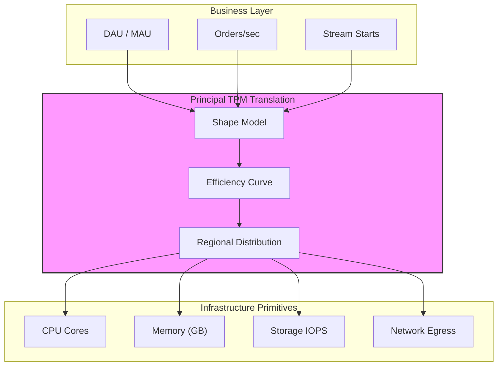
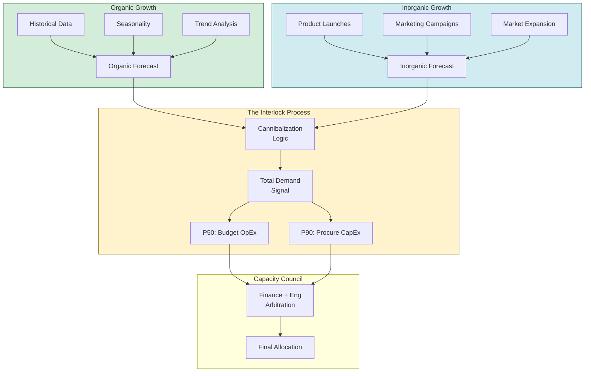
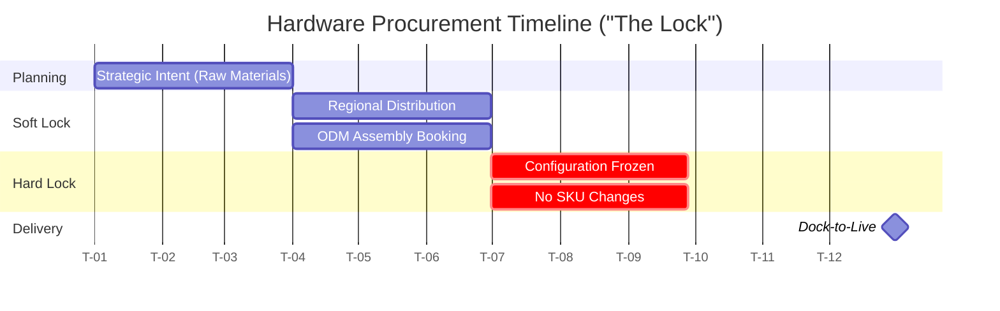
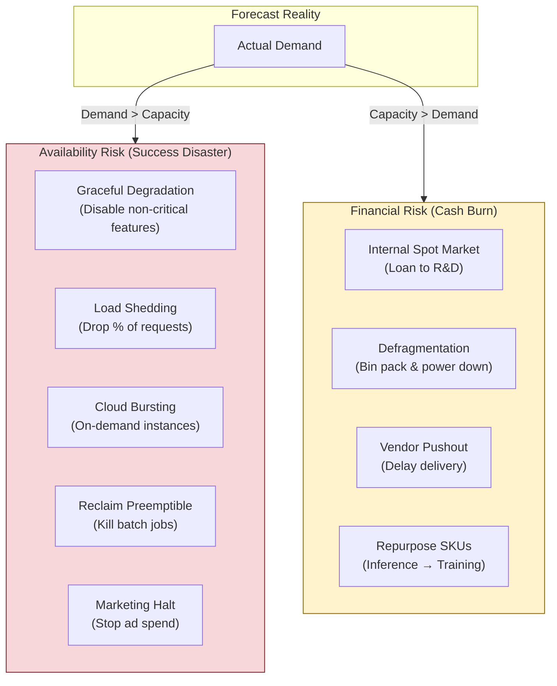

# Capacity Planning & Demand Forecasting

The cloud is not infinite—it's a finite resource bounded by manufacturing lead times, power availability, and logistics. At Mag7 scale, capacity planning is the bridge between business P&L and engineering reality: translating DAU forecasts into silicon procurement, managing 6-12 month hardware lead times against weekly feature changes, and ensuring infrastructure exists to support quarterly earnings promises. This guide covers the forecasting models, translation frameworks, and mitigation strategies that prevent both "success disasters" (viral growth crashes) and silent ROI killers (depreciation on idle hardware).

## I. Strategic Overview: The Principal TPM's Responsibility

At the Principal level, the "Strategic Overview" of capacity planning shifts from execution (tracking ticket counts) to orchestration (defining the constraints under which the business operates). You act as the bridge between the **Business P&L** (Profit & Loss) and **Engineering Reality**. Your primary responsibility is to ensure that infrastructure decisions serve business goals rather than acting as a cost center or a bottleneck.

### 1. The Translation Layer: Business Intent to Infrastructure Primitives

The most critical technical skill for a Principal TPM is translating high-level business metrics into low-level infrastructure requirements. Product Managers speak in DAU (Daily Active Users) or "Launch Regions." Engineers speak in Cores, IOPS, and GB/s of memory bandwidth. You must own the conversion logic.

*   **Mag7 Behavior:** At Google or Azure, this involves creating "Shape Models." You analyze the resource footprint of a single transaction (e.g., one search query, one video stream) and multiply it by the forecasted volume, adjusted for regional distribution.
*   **The "How":**
    *   **Step 1:** Establish the "Unit of Demand" (e.g., 1000 active sessions).
    *   **Step 2:** Profile the "Unit of Supply" (e.g., 1 normalized compute unit + 0.5 GB RAM + 20 IOPS).
    *   **Step 3:** Apply the "Efficiency Curve." Software tends to become bloated over time (regression), but optimization projects reduce footprint. You must forecast the *net* efficiency.
*   **Tradeoffs:**
    *   *Granularity vs. Agility:* Highly detailed models (per microservice) are accurate but brittle; changing architecture breaks the model. High-level models (per product) are robust but hide inefficiencies.
*   **Impact:** A precise translation prevents "Stranded Capacity"—where you have enough CPU but run out of RAM, rendering the CPU unusable. Minimizing stranded capacity improves TCO (Total Cost of Ownership).

### 2. Managing the "Cone of Uncertainty" & Lead Times

Hardware supply chains operate on long horizons (6–12 months for custom silicon or data center build-outs), while software features change weekly. The Principal TPM is responsible for managing this mismatch.

*   **Mag7 Behavior:** Amazon and Microsoft utilize a "T-shirt sizing" approach for long-range planning (LRP) looking 12+ months out, tightening to specific SKU commitments at the 3-month mark. Principal TPMs negotiate "fungible capacity"—hardware that can be repurposed (e.g., using training clusters for inference during peak traffic).
*   **Strategy - The Buffer Strategy:**
    *   **Just-in-Time (JIT):** High risk, lowest cost. Relies on cloud elasticity (which doesn't exist if *you* are the cloud provider).
    *   **Strategic Buffers:** Holding specific pools of "swing capacity" for new product launches.
*   **Tradeoffs:**
    *   *Commitment vs. Flexibility:* Committing to hardware volume early secures lower pricing (economies of scale) but locks you into specific SKUs (e.g., buying H100s right before Blackwell chips are announced).
*   **Impact:** Proper lead time management prevents "Stockouts" during critical events (e.g., Prime Day, Black Friday) while avoiding CapEx depreciation on hardware sitting in a warehouse.

### 3. Financial Governance: CapEx, OpEx, and COGS

A Principal TPM must be financially literate. You are the guardian of the **COGS (Cost of Goods Sold)**. You must ensure that revenue growth outpaces infrastructure cost growth.

*   **Mag7 Behavior:** You will likely chair or present at a "Capacity Council" involving Finance Directors and VPs of Engineering. You must defend why your product line needs 10,000 cores when utilization is only at 40%.
*   **Key Metrics:**
    *   **Utilization:** (Avg CPU usage / Total CPU allocated).
    *   **Allocation Efficiency:** (Requested resources / Actual usage).
*   **The "How":** Implement "Showback" or "Chargeback" models. Even if internal teams don't pay cash, they must see the dollar value of the resources they consume.
*   **Tradeoffs:**
    *   *Innovation vs. Control:* Strict cost controls stifle experimentation (engineers are afraid to spin up clusters). Loose controls lead to bill shock. The Principal TPM sets the "Budget Threshold" for approval-free experimentation.
*   **Impact:** Directly affects the company's gross margin. A 5% reduction in infrastructure waste at Mag7 scale can equal the revenue of a mid-sized startup.

### 4. Risk Posture: Availability vs. Utilization

This is the most strategic lever you pull. You define the "Risk Appetite" for capacity.

*   **Mag7 Behavior:** Critical services (Tier-0, like Login or Checkout) run at low utilization (e.g., 30-40%) to absorb massive spikes. Tier-2 services (Batch processing, Logging) run hot (80-90%) or on "Spot/Pre-emptible" instances.
*   **The "How":**
    *   **N+1 vs. N+2:** Defining redundancy levels per region.
    *   **Degradation Strategy:** Defining what features turn off when capacity is hit. (e.g., Netflix might lower video resolution to keep the stream playing; Amazon might disable "People who bought this also bought" to save database reads).
*   **Tradeoffs:**
    *   *Safety vs. Unit Economics:* Running "cool" (low utilization) guarantees uptime but destroys unit economics. Running "hot" maximizes ROI but risks cascading failures during traffic surges.
*   **Impact:** CX (Customer Experience) and Brand Reputation. An outage during a keynote or holiday event is a "Success Disaster" that the Principal TPM is accountable for preventing.

## II. Demand Forecasting: Organic vs. Inorganic Growth

### 1. Organic Growth: The Baseline (Run the Business)

Organic growth represents the natural trajectory of your product based on historical data, seasonality, and existing market penetration. For a Principal TPM, the goal is not to build the statistical model personally, but to validate the **drivers** feeding the model and challenge the **confidence intervals**.

**Technical Deep-Dive:**
At Mag7 scale, organic forecasting is rarely a simple linear regression. It typically involves decomposing time-series data into three components: *Trend* (long-term direction), *Seasonality* (cyclical patterns like weekends or holidays), and *Noise* (random variation).
*   **Metric Selection:** You must ensure the forecast tracks the *constraint metric*, not just a vanity metric. For example, Marketing forecasts Daily Active Users (DAU), but Infrastructure needs Requests Per Second (RPS) or Egress Bandwidth. You must own the conversion ratio (e.g., 1 DAU = 500 RPS).
*   **The "Headroom" Fallacy:** A common pitfall is forecasting based on *provisioned* capacity rather than *consumed* resources. You must normalize historical data to account for efficiency gains (e.g., if Engineering optimized code to use 10% less CPU last quarter, raw historical data will skew the forecast downwards incorrectly unless adjusted).

**Real-World Mag7 Behavior:**
*   **Netflix:** Uses "Double Exponential Smoothing" to predict streaming hours, heavily weighted by regional seasonality (e.g., rainy weekends drive higher organic traffic).
*   **AWS:** Differentiates between "Dedicated Host" customers (predictable) and "Spot Instance" markets (volatile). The organic forecast establishes the "reserved floor."

**Tradeoffs:**
*   **Aggressive vs. Conservative Smoothing:**
    *   *Aggressive:* Reacts quickly to recent trends. *Risk:* Can mistake a temporary spike (e.g., a viral social media post) for a permanent baseline shift, leading to over-procurement.
    *   *Conservative:* Prioritizes long-term averages. *Risk:* Fails to detect "Regime Changes" (e.g., the permanent shift to remote work tools in 2020) fast enough, leading to capacity starvation.

**Impact on Business/ROI:**
*   **OpEx Accuracy:** Organic growth is the largest chunk of the bill. Improving organic forecast accuracy by 2% at Google-scale can save $50M+ annually in unnecessary buffer capacity.

### 2. Inorganic Growth: The Disrupters (Strategic Events)

Inorganic growth is driven by specific business actions: product launches, marketing campaigns, market expansions, or acquisitions. This data *cannot* be found in historical logs; it comes from cross-functional interrogation.

**Technical Deep-Dive:**
The Principal TPM acts as the translator here. You must convert vague product roadmaps into concrete resource requirements using **Proxy Modeling**.
*   **Proxy Modeling:** If you are launching a new video feature, you don't guess. You look at the resource footprint of a similar existing feature (the proxy), adjust for complexity (e.g., "1.5x compute intensity of Stories"), and multiply by the Marketing team's user acquisition target.
*   **Step-Function Management:** Unlike organic growth curves, inorganic growth looks like a step function. You must ensure infrastructure is provisioned *before* the step occurs (Launch Day), not ramped up in reaction to it.

**Real-World Mag7 Behavior:**
*   **Meta (Instagram Threads Launch):** This was a massive inorganic event. The capacity planning team likely used Twitter's estimated volume as a benchmark and pre-provisioned compute capacity by draining lower-priority batch jobs (offline analytics) to free up frontend capacity for the launch window.
*   **Microsoft (Copilot Rollout):** Adding LLM inference to Office 365 is purely inorganic. It requires a distinct hardware profile (GPUs/NPUs) compared to the traditional organic growth of Exchange servers (CPUs/Storage).

**Tradeoffs:**
*   **Launch Buffer vs. Opportunity Cost:**
    *   *High Buffer:* Provisioning for "Wild Success" (10x expected adoption). *Con:* If the product flops, you have massive "stranded capacity" that depreciates on the books.
    *   *Just-in-Time:* Provisioning for "P50 Success." *Con:* If the product goes viral (e.g., Pokémon GO), the service crashes, causing reputational damage and lost revenue.

**Impact on CX/Business Capabilities:**
*   **Time-to-Market:** Accurate inorganic forecasting allows for "Dark Launching" (deploying code to production infrastructure without enabling it for users), ensuring day-one stability.

### 3. The "Interlock": Merging Signals and Managing Variance

The most critical capability for a Principal TPM is managing the **Total Demand Signal** (Organic + Inorganic) and the associated **Governance**.

**Technical Deep-Dive:**
You cannot simply sum Organic and Inorganic forecasts because they often cannibalize each other.
*   **Cannibalization Logic:** If you launch a new "Lite" version of an app (Inorganic), traffic to the "Main" app (Organic) may drop. If you sum both without adjustment, you over-provision.
*   **Confidence Levels (P50 vs. P90):** You should present forecasts in tiers.
    *   *P50 (Expected):* Used for budgeting OpEx.
    *   *P90 (High Confidence):* Used for hardware procurement (CapEx) to ensure availability even if demand surges.

**Real-World Mag7 Behavior:**
*   **Sales vs. Engineering Friction:** At Salesforce or Oracle, Sales teams often inflate forecasts ("Sandbagging") to ensure they never face capacity constraints. Engineering teams often deflate them to keep utilization high. The Principal TPM chairs the "Capacity Council" to arbitrate this, often demanding a "Commitment Tax"—if a VP requests 10,000 cores for a launch, they are charged for them whether they use them or not.

**Tradeoffs:**
*   **Centralized vs. Decentralized Forecasting:**
    *   *Centralized (TPM owned):* Consistent methodology. *Con:* Lacks domain nuance of specific product teams.
    *   *Decentralized (Product owned):* High nuance. *Con:* Inconsistent units of measure and tendency to overestimate demands.

**Impact on ROI:**
*   **Utilization Rates:** The "Interlock" directly correlates to fleet utilization. A tight feedback loop between Product (Inorganic plans) and Infra (Organic trends) prevents the "Boom/Bust" cycle of panic-buying hardware followed by long periods of idleness.

## III. Translating Demand to Infrastructure (The "Unit of Scale")

Once the demand forecast (the "What") is established, the Principal TPM must own the translation into infrastructure requirements (the "How Much"). This is the single most common point of failure in capacity planning. A 20% increase in Daily Active Users (DAU) rarely equates linearly to a 20% increase in server footprint due to caching layers, database contention, and architectural complexity.

You must establish and maintain the "Exchange Rate" between **Business Metrics** (e.g., DAU, Orders/Sec, Stream Starts) and **Infrastructure Metrics** (e.g., Cores, Normalized Compute Units, IOPS, Gibibytes).

### 1. Defining the "Unit of Scale"
The Unit of Scale is the atomic measure used to model infrastructure consumption. At a Mag7 company, you cannot plan capacity based on generic "requests." You must define a unit that correlates highly with resource consumption.

*   **The "North Star" Metric:** For a streaming service (like Netflix or Prime Video), the unit might be "Simultaneous Stream Starts" rather than total subscribers. For an e-commerce checkout service, it is "Orders Per Second" (OPS).
*   **The Composite Unit (NCU/ECU):** To handle hardware heterogeneity (e.g., moving from Intel Skylake to AWS Graviton), Mag7 companies abstract physical hardware into "Normalized Compute Units" (NCUs) or "Elastic Compute Units."
    *   *Example:* 1 NCU = The compute power of 1 core of a reference processor generation.
    *   *Principal TPM Action:* You must ensure your service teams characterize their workload in NCUs, not "number of servers," to decouple planning from hardware lifecycle refreshes.

**Real-World Mag7 Behavior:**
At Uber or Lyft, the unit of scale for the dispatch system is "Trips." However, for the map data team, the unit of scale is "Road Network Updates." A Principal TPM ensures that the "Trips" forecast flows downstream to the Maps team, translated via a ratio (e.g., "Every 1,000 trips generates 4 map correction queries").

**Tradeoffs:**
*   **Granularity vs. Usability:**
    *   *Granular:* Modeling every RPC call provides high precision but makes the model brittle; a minor code change breaks the forecast.
    *   *Coarse:* Modeling based on "Active Users" is stable but hides backend inefficiencies (e.g., a new feature causes 3x more DB writes per user).
*   **Decision:** Opt for the highest-level metric that maintains a correlation coefficient of >0.9 with CPU/Memory usage.

### 2. The Translation Model: Load Testing & Profiling
A forecast is only as good as the load test that validates the resource-per-unit ratio. As a Principal TPM, you enforce rigorous "Game Days" or "Squeeze Testing" to determine the breaking point of a single Unit of Scale.

**The Equation:**
$$Total Cores Needed = \left( \frac{\text{Forecasted Demand}}{\text{Unit Capacity}} \right) \times (1 + \text{Overhead}) \times (1 + \text{Buffer})$$

*   **Unit Capacity:** Determined by stress testing (e.g., One host handles 500 TPS at 70% CPU).
*   **Overhead:** Background tasks, logging agents, sidecars (usually 10-15% of box capacity).
*   **Buffer:** Safety margin for spikes (typically 20-30% for stateless, higher for stateful).

**Impact on Business/ROI:**
*   **Unit Economics:** This process renders the "Cost per Transaction." If the infrastructure requirement grows faster than the business metric (super-linear growth), the business becomes less profitable as it scales. The Principal TPM is the first line of defense in flagging this "negative economy of scale."
*   **CapEx Optimization:** By refining the "Unit Capacity" through software optimization (e.g., increasing TPS per host from 500 to 600), you directly reduce CapEx requirements by 20% without buying new hardware.

### 3. Handling Non-Linear Scaling (The "Knee in the Curve")
One of the most dangerous assumptions in capacity planning is linearity. At Mag7 scale, systems often hit bottlenecks that are invisible at lower volumes.

*   **Database Contention:** Adding 2x web servers might yield 0x additional throughput if the database lock contention saturates.
*   **Cache Hit Rates:** As DAU grows, cache eviction rates may increase, causing a "thundering herd" on the backend.
*   **Mesh Traffic:** In a microservices architecture (like Uber or Amazon), one user action triggers a fan-out of 50+ internal RPCs.

**Real-World Mag7 Behavior:**
Google and Meta utilize "Capacity regression testing" in CI/CD. If a code commit changes the translation ratio (e.g., increases CPU consumption per query by >1%), the deployment is blocked. As a Principal TPM, you govern the exception process: does the feature add enough business value to justify the increased infrastructure cost?

**Tradeoffs:**
*   **Feature Velocity vs. Efficiency:** Blocking a deployment due to capacity regression protects margins but slows innovation.
*   **Mitigation:** Implement "Efficiency Budgets." Teams are allowed to ship inefficient code if they stay within a pre-negotiated error budget of infrastructure spend, but must refactor later.

### 4. Downstream Dependencies & The "Bill of Materials"
Your service does not live in a vacuum. Translating demand requires generating a "Bill of Materials" (BOM) for dependency teams.

If you own the "Checkout" service, and you forecast a 50% growth in Prime Day traffic, you must translate that into:
1.  **Storage IOPS** for the database team.
2.  **Network Bandwidth** for the site reliability/networking team.
3.  **Cache Nodes** for the Redis/Memcached team.

**Impact on CX/Reliability:**
If you fail to translate your demand to your dependencies, you create a "hidden bottleneck." Your service scales perfectly, but the shared identity service (AuthZ) collapses under the load, causing a global outage.

**Principal TPM Action:**
Create a "Dependency Interlock" document. Sign off on capacity contracts with downstream TPMs. "I guarantee X TPS of traffic; you guarantee Y ms latency at that volume."

### 5. Strategic Buffer Management
How much "air" do you put in the tires?

*   **Organic Buffer:** For day-to-day fluctuations (usually ~15-20%).
*   **Inorganic Buffer:** For planned events (product launches, marketing campaigns).
*   **Regional Failover Buffer (N+1):** Essential for Mag7 availability. If `us-east-1` fails, do `us-west-2` and `eu-west-1` have enough *idle* capacity to absorb the traffic immediately?

**Tradeoffs:**
*   **Risk vs. Cost:** Keeping 50% capacity idle for regional failover is expensive ($$$ millions).
*   **Mag7 Approach:** Use "Interruptible" or "Spot" workloads. At Google, batch jobs (like video transcoding or offline analytics) run on the failover capacity. If a region fails and live traffic shifts, the batch jobs are instantly killed to make room for high-priority user traffic. This yields high utilization *and* high availability.

## IV. Supply Chain, Allocation, and "The Lock"

At the Principal TPM level, you are the bridge between the abstract (product roadmap) and the physical (silicon, steel, and power). While you do not negotiate vendor contracts, you provide the **Demand Signal** that triggers multi-million dollar procurement cycles.

Understanding the supply chain is critical because the "Cloud" is not infinite; it is a finite resource bounded by manufacturing lead times, power availability, and logistics. A failure here results in feature launch delays or massive CapEx wastage.

### 1. The Supply Chain Lifecycle & "The Lock"

In Mag7 environments, hardware procurement operates on long lead times, often referred to as the **Long Range Plan (LRP)** or "The Signal." This process is distinct from the immediate deployment of virtual machines.

**The "Lock" Mechanism:**
"The Lock" is the point of no return where a soft forecast converts into a hard financial commitment (Purchase Order).
*   **T-Minus 9-12 Months:** Strategic intent. (e.g., "We plan to launch a new LLM inference model.") Supply chain secures raw materials and fab capacity.
*   **T-Minus 6 Months:** The "Soft Lock." Regional distribution is estimated. Supply chain books assembly slots with ODMs (Original Design Manufacturers like Foxconn or Quanta).
*   **T-Minus 3 Months:** The "Hard Lock." Configuration is frozen. You cannot change SKU types (e.g., switching from CPU-heavy to GPU-heavy racks) without significant penalty or delay.
*   **T-0:** Hardware lands on the dock (Dock-to-Live).

**Real-World Mag7 Behavior:**
At Google or Microsoft, if a Principal TPM misses the "Hard Lock" window for a major launch, they cannot simply "expedite" an order of 5,000 servers. They must wait for the next cycle or scavenge capacity from other teams. You will often manage a "commit ratio"—for example, you might be required to lock 80% of your requested capacity 3 months out, leaving only 20% flexibility for last-minute adjustments.

**Tradeoffs:**
*   **Flexibility vs. Unit Cost:** Locking early secures lower unit costs and guarantees supply but removes agility if product strategy shifts. Locking late (if allowed) incurs premiums and supply risk.
*   **Innovation vs. Stability:** Waiting for the "next generation" chip (e.g., waiting for H100s vs. buying A100s now) risks delays if the new silicon has yield issues (common in early manufacturing).

**Impact on Business:**
*   **ROI:** Accurate locking prevents "Depreciation Drag"—paying for hardware that sits in a warehouse because the software isn't ready.
*   **Capability:** Ensures the physical infrastructure exists to support quarterly earnings call promises.

### 2. Allocation Strategy: Who Gets the Metal?

When demand exceeds supply (a constant state in AI/ML or during Q4 peaks), the organization moves from "Provisioning" to "Allocation." As a Principal TPM, you participate in **Capacity Councils** to argue for your product's share of the finite pool.

**Allocation Models:**
1.  **Guaranteed/Reserved:** Capacity physically isolated for critical services (e.g., AWS S3 control plane, Google Search indexing). This is expensive as it often runs at lower utilization to ensure headroom for spikes.
2.  **Burstable/Shared:** Pools shared between multiple products. If Product A is quiet, Product B can use the resources.
3.  **Preemptible/Spot:** Used for batch processing (builds, training, analytics). If a high-priority service needs the box, the batch job is killed.

**The "Hoarding" Anti-Pattern:**
Engineering teams naturally hoard capacity "just in case." A Principal TPM must police this behavior.
*   **Mag7 Example:** A team requests 10,000 cores for a launch. The TPM analyzes their load testing data, realizes their code is inefficient, and forces an optimization sprint instead of approving the allocation. This saves the company millions in CapEx.

**Tradeoffs:**
*   **Utilization vs. Latency:** High utilization (running servers hot) maximizes ROI but increases the risk of latency spikes during micro-bursts.
*   **Isolation vs. Efficiency:** Dedicated pools prevent "noisy neighbor" issues but create fragmentation (stranded capacity) where one pool is empty while another is starving.

**Impact on CX:**
*   Proper allocation ensures that revenue-generating traffic (Checkout) is never throttled by background tasks (Data Analytics).

### 3. Supply Chain Shocks and Mitigation

The supply chain is fragile. A Principal TPM must have contingency plans for "Dark Swan" events (e.g., a factory shutdown, a canal blockage, or a sudden silicon shortage).

**Mitigation Strategies:**
*   **SKU Fungibility:** Designing software to run on multiple hardware generations. If Gen-N is delayed, can you launch on Gen-N-1?
    *   *Tradeoff:* Requires engineering effort to maintain backward compatibility and performance tuning for older hardware.
*   **Geo-Flexibility:** If US-East is out of power/racks, can you serve traffic from EU-West?
    *   *Tradeoff:* Data sovereignty (GDPR) and latency constraints may make this impossible.
*   **Feature Flagging/Degradation:** Building "knobs" to turn off heavy features.
    *   *Example:* During a capacity crunch, Amazon might disable high-compute recommendations on the homepage to save CPU cycles for the checkout flow.

### 4. Managing the "Stranded Capacity" Problem

Stranded capacity occurs when resources exist but cannot be used—often due to imbalances (e.g., having plenty of CPUs but running out of power or top-of-rack networking ports).

**Principal TPM Action:**
You must audit the "fragmentation" of your fleet.
*   **Bin Packing:** Working with scheduler teams (like Kubernetes or Borg maintainers) to fit more containers onto existing hosts.
*   **Harvesting:** Identifying "Zombie" services—deployments that are running but receiving zero traffic—and reclaiming that capacity for the general pool.

**Impact on ROI:**
Reclaiming 5% of stranded capacity in a Mag7 datacenter is equivalent to receiving a free shipment of thousands of servers, directly improving the bottom line without CapEx spend.

## V. Mitigation Strategies: When the Forecast is Wrong

Even with the most sophisticated ML models and seasoned judgment, forecasts will deviate from reality. In a Mag7 environment, a Principal TPM does not rely solely on accuracy; they rely on **resilience**. You must architect systems (both technical and organizational) that absorb variance without triggering an outage or destroying unit economics.

When the forecast is wrong, you are managing one of two risks: **Availability Risk** (Demand > Capacity) or **Financial Risk** (Capacity > Demand).

### 1. Technical Levers: Managing Demand > Capacity (The "Success Disaster")

When actual traffic exceeds the provisioned headroom, the system enters a saturation zone. If left unchecked, latency spikes, queues fill up, and cascading failures occur (the "thundering herd").

**Mitigation Tactics:**
*   **Graceful Degradation (Brownouts):** Instead of failing hard, the system turns off non-critical features to preserve core functionality.
    *   *Mag7 Example:* During massive traffic spikes on Amazon Prime Day, the retail platform may disable "Personalized Recommendations" or "Review History" widgets to save compute resources for the "Checkout" and "Add to Cart" services.
    *   *Implementation:* This requires Feature Flags categorized by criticality (Tier 0 to Tier 3). The TPM ensures these tiers are defined *before* the incident.
*   **Load Shedding (Throttling):** Intentionally dropping a percentage of requests at the network edge (load balancer level) to save the backend.
    *   *Mag7 Example:* Google’s SRE principles dictate "Client-Side Throttling" (adaptive throttling) where the client slows down requests when the server rejects them, preventing a retry storm.
*   **Priority-Based Scheduling:** If the bottleneck is processing power (e.g., LLM inference or video transcoding), requests are queued based on user tier (Paid vs. Free) or request type (Real-time vs. Batch).

**Tradeoffs:**
*   **CX vs. Uptime:** You are deliberately degrading the user experience for some to save the platform for the many.
*   **Complexity:** Building "kill switches" for specific features adds code complexity and testing overhead. If a kill switch hasn't been tested, it won't work when needed.

**Impact on Business/ROI:**
*   **Revenue Protection:** A degraded checkout experience is better than a 404 error.
*   **Brand Reputation:** Prevents high-profile outages during critical business moments (e.g., product launches, Super Bowl ads).

### 2. Infrastructure Levers: Elasticity and Bursting

If software limits aren't enough, you must manipulate the infrastructure supply immediately.

**Mitigation Tactics:**
*   **Cloud Bursting (Hybrid):** If you are running on reserved instances or on-prem data centers (common for Meta/Google/Microsoft internal workloads), you "burst" the excess traffic into On-Demand public cloud instances.
    *   *Mag7 Example:* Netflix (historically) running steady-state workloads on reserved AWS instances but spinning up expensive On-Demand instances during unexpected viral hits.
*   **Reclaiming Preemptible Capacity:** Most Mag7 infrastructure runs a mix of production services and low-priority batch jobs (training models, log processing, index building).
    *   *Mag7 Example:* Google’s Borg (cluster manager) will kill low-priority batch jobs to free up resources for high-priority latency-sensitive user traffic (prod jobs).
    *   *TPM Role:* You must define the "eviction policy." Which internal team's batch jobs get killed first? This is a political negotiation as much as a technical one.

**Tradeoffs:**
*   **Cost vs. Speed:** Bursting to On-Demand or Spot instances usually carries a significant price premium (often 2-3x reserved pricing).
*   **Internal Friction:** Killing batch jobs delays internal reporting or R&D (e.g., an ML training run stops).

**Impact on Business/ROI:**
*   **CapEx Efficiency:** Allows you to provision for the *average* load rather than the *peak* load, relying on the "burst" buffer for the variance.

### 3. Business Levers: Controlling the Funnel

Sometimes the fix isn't engineering; it's changing the product rollout or marketing pressure. This is where the "Product" in Product TPM becomes critical.

**Mitigation Tactics:**
*   **Staggered Rollouts:** If a new feature is driving unexpected load, the TPM must halt the rollout percentage (e.g., stop at 10% rollout).
*   **Marketing Halt:** If the forecast was wrong because a marketing campaign was too successful, the TPM must trigger a "stop spend" order on ad networks.
    *   *Mag7 Example:* A mobile game publisher at Microsoft/Xbox seeing backend database contention might pause User Acquisition (UA) spend on Facebook Ads until the database is sharded.

**Tradeoffs:**
*   **Growth vs. Stability:** You are explicitly capping short-term growth to ensure long-term retention.
*   **Political Capital:** Telling a VP of Marketing to stop their campaign requires significant data-backed influence.

**Impact on Business/ROI:**
*   **Churn Prevention:** Acquiring users into a broken experience results in 100% churn. It is better to delay acquisition.

### 4. Managing Capacity > Demand (The "Cash Burn")

Over-forecasting is less visible than an outage but is a silent killer of ROI. If you secured 10,000 GPUs for a launch that flopped, you are burning millions in depreciation.

**Mitigation Tactics:**
*   **The "Spot Market" Internal Loop:** Make the excess capacity available to internal R&D teams for "free" or low cost.
    *   *Mag7 Example:* If a search index rollout is delayed, the reserved compute is instantly reallocated to the AI Research division for experimental model training.
*   **Defragmentation & Bin Packing:** If the excess is scattered (fragmented), use orchestration tools (Kubernetes/Borg) to repack services onto fewer machines and power down the empty racks to save electricity (OpEx).
*   **Vendor Negotiation (The "Pushout"):** If hardware hasn't been delivered yet, negotiate with the supply chain to delay delivery or swap SKUs.

**Tradeoffs:**
*   **Operational Overhead:** Repurposing hardware often requires re-imaging or network reconfiguration (e.g., changing from Inference optimization to Training optimization).

**Impact on Business/ROI:**
*   **COGS Reduction:** Directly improves the gross margin of the product.

---

## Interview Questions

### I. Strategic Overview: The Principal TPM's Responsibility

### Q1: The "Stranded Capacity" Scenario
**Question:** "We have 10,000 servers deployed for our new AI product, but we are seeing 40% CPU utilization while rejecting customer requests due to 'Out of Capacity' errors. As the Principal TPM, how do you diagnose this, what are the likely causes, and how do you resolve the inefficiency?"

**Guidance for a Strong Answer:**
*   **Diagnosis:** Identify that this is a *resource mix* problem, not a raw count problem. The bottleneck is likely non-CPU (Memory, Network Bandwidth, or IOPS).
*   **Root Cause:** Discuss "Bin Packing" inefficiencies. Perhaps the tasks are memory-heavy, leaving CPU cycles stranded.
*   **Short-term Fix:** Resize the allocation shapes (change container sizes) to fit the hardware better.
*   **Long-term Fix:** Work with Engineering to refactor the code (reduce memory footprint) or with Supply Chain to procure different SKUs (High-Memory instances) for the next cycle.
*   **Strategic Layer:** Mention implementing a "Scheduler Efficiency" metric to track this mismatch specifically.

### Q2: The "Flash Crowd" vs. Budget Conflict
**Question:** "Marketing plans a massive viral campaign for next month that could triple traffic. Finance refuses to approve the CapEx for new hardware because the campaign is 'experimental' and might fail, leaving us with depreciation costs. The current infrastructure will crash if the campaign succeeds. How do you break this deadlock?"

**Guidance for a Strong Answer:**
*   **Don't just 'beg' for money:** Frame the decision as a risk management choice for leadership, not a conflict.
*   **Technical Mitigation:** Propose "Load Shedding" or "Feature Flagging." Can we serve the traffic with a degraded experience (Tier-1 features only) to survive the spike without new hardware?
*   **Business Logic:** Calculate the "Cost of Failure" (Revenue lost + Brand damage) vs. "Cost of Waste" (Reselling unused hardware or moving it to other pools).
*   **Creative Allocation:** Look for "Internal Cannibalization." Can we borrow capacity from Batch/R&D clusters (pre-empting internal jobs) during the campaign window? This demonstrates cross-organizational influence.

### II. Demand Forecasting: Organic vs. Inorganic Growth

### Question 1: The "Cold Start" Launch
**"We are launching a completely new GenAI feature for our enterprise customers. We have no historical data, and the Engineering team says the compute requirements are 'variable' depending on user prompts. Marketing predicts 1M users in week one. How do you build a capacity plan for this?"**

*   **Guidance for a Strong Answer:**
    *   **Deconstruct the Metric:** Move immediately from "1M users" to "Tokens per second" or "Concurrent Inferences."
    *   **Establish a Proxy:** Discuss finding a similar internal workload or using industry benchmarks (e.g., GPT-4 standard latency/compute) to build a baseline unit cost.
    *   **Gated Rollout Strategy:** Propose a "Feature Flag" rollout (1%, 5%, 20%) to validate the model in production before full exposure.
    *   **Risk Mitigation:** Define the "Kill Switch" or "Degraded Mode" (e.g., lower resolution, higher latency) if demand exceeds the maximum available hardware.
    *   **Tradeoff Awareness:** Acknowledge the high cost of GPUs and argue for a "Waitlist" approach to cap inorganic demand at the hardware limit rather than unlimited auto-scaling.

### Question 2: The Forecasting Conflict
**"Your organic forecast model predicts 20% growth for a storage service. The Product VP insists on provisioning for 100% growth because they 'feel' a market shift coming, but they have no concrete roadmap items to back it up. Hardware lead times are 6 months. What do you do?"**

*   **Guidance for a Strong Answer:**
    *   **Data vs. Intuition:** Do not dismiss the VP, but demand the "Why." Is there a hidden inorganic event?
    *   **Tiered Options:** Present a "Menu of Risks."
        *   *Option A (20%):* Saves $X, but 100% risk of outage if VP is right.
        *   *Option B (100%):* Zero outage risk, but risks $Y in wasted CapEx depreciation.
        *   *Option C (The Principal Solution):* Procure for 20% but negotiate "fungible capacity" from a lower-priority service or secure a short-term cloud burst contract (if hybrid) to cover the delta if the surge happens.
    *   **Governance:** Escalate to the CFO/Finance with the cost implications. Make the VP sign off on the P&L impact of the idle hardware if the growth doesn't materialize.

### III. Translating Demand to Infrastructure (The "Unit of Scale")

**Question 1: The Non-Linear Surprise**
"We forecasted a 20% increase in traffic for a major product launch, and we provisioned 20% more compute capacity based on our standard ratios. However, on launch day, latency spiked, and the system fell over despite CPU utilization only being at 40%. What happened, and how would you prevent this as a Principal TPM?"

*   **Guidance for a Strong Answer:**
    *   **Identify the Bottleneck:** Acknowledge that CPU is not the only constraint. The candidate should hypothesize about non-linear constraints like thread pool exhaustion, database connection limits, network bandwidth saturation, or lock contention.
    *   **The "Unit of Scale" Flaw:** Discuss how the model failed to account for a change in user behavior (e.g., the new feature required heavier write operations than read operations, skewing the ratio).
    *   **Prevention:** Emphasize "Synthetic Load Testing" with production-like traffic profiles (not just repeating GET requests). Mention establishing "Guardrail Metrics" beyond just CPU (e.g., tracking queue depth, IOPS, and thread states).

**Question 2: The Efficiency vs. Velocity Conflict**
"Your engineering team wants to launch a new AI-driven recommendation engine. It improves user engagement by 5%, which is huge. However, it requires 4x the GPU capacity per user compared to the old model, which would make the product gross margin negative. As the Principal TPM responsible for capacity, how do you handle this?"

*   **Guidance for a Strong Answer:**
    *   **Strategic Framing:** Do not simply say "No." Frame this as a business decision, not a technical one.
    *   **Data Presentation:** Calculate the "Cost of Goods Sold" (COGS) impact. Present the tradeoff: "We lose $X per user to gain 5% engagement."
    *   **Optimization Path:** Propose a phased rollout (1% traffic) to validate the engagement lift while simultaneously chartering a "Performance Task Force" to optimize the model (quantization, caching inference results) to bring the cost down to neutral.
    *   **Gatekeeping:** Establish a clear "Go/No-Go" metric. If optimization doesn't reach unit economic viability by date X, the launch is paused.

### IV. Supply Chain, Allocation, and "The Lock"

### Q1: The "Missed Lock" Scenario
**Question:** "You are the TPM for a critical new AI product launch scheduled for Q4. Due to an unexpected surge in model complexity, your engineering team realizes at T-minus 2 months that they need 40% more GPU capacity than was locked in the forecast 6 months ago. The supply chain is constrained, and there is no new inventory available from vendors. What do you do?"

**Guidance for a Strong Answer:**
*   **Don't just ask for money:** Acknowledge that throwing money at vendors won't solve a T-2 month physical shortage.
*   **Internal Tradeoffs:** Discuss negotiating with *other* internal teams to cannibalize their capacity (e.g., pausing non-critical R&D training jobs).
*   **Technical Mitigation:** Propose software optimizations (quantization, lower precision training) to fit the model onto the *existing* committed hardware.
*   **Business Impact:** Offer a phased rollout (allowlisting users) to match demand to the constrained supply, rather than a full public launch that crashes.

### Q2: The Hoarding Confrontation
**Question:** "You manage capacity allocation for a platform with 10 different product teams. One high-profile team consistently over-forecasts their needs by 50% 'to be safe,' leading to millions in idle hardware (shelfware). However, their VP argues that their service is too critical to risk an outage. How do you resolve this structural inefficiency?"

**Guidance for a Strong Answer:**
*   **Data over Opinion:** Explain how you would use historical utilization metrics (CPU/Memory/Network peaks) to disprove the need for such a large buffer.
*   **Policy Change:** Propose a "Showback/Chargeback" model where the team's budget is charged for *allocated* capacity, not just *used* capacity, incentivizing them to release unused resources.
*   **The "Auto-Scale" Solution:** Move them from static allocation to a dynamic auto-scaling policy with a smaller guaranteed floor, shifting the risk from "hoarding" to "reactive scaling."
*   **Governance:** Establish a penalty for consistent forecast variance (e.g., if you miss by >20% for 3 quarters, you lose your priority tier in the next allocation cycle).

### V. Mitigation Strategies: When the Forecast is Wrong

### Question 1: Handling a "Success Disaster"
**"You are the TPM for a new GenAI feature launch. Traffic is 5x the forecasted peak, and we are running out of GPU capacity. Latency is skyrocketing. Walk me through your mitigation strategy in the first 30 minutes, 24 hours, and 1 week."**

**Guidance for a Strong Answer:**
*   **First 30 Minutes (Triage):** Focus on **Shedding and Degrading**. Mention protecting the "Control Plane." Do not suggest buying hardware (too slow). Suggest aggressive throttling of free-tier users to protect paid users.
*   **24 Hours (Tactical):** Focus on **Bursting and Reclaiming**. Can we kill internal training jobs to free up GPUs? Can we spill over to a different region that has capacity? Stop the rollout (if phased).
*   **1 Week (Strategic):** Root cause analysis of the forecast error. Was it organic demand or a DDoS? Re-evaluate the supply chain. Adjust the pricing model if demand is high but unit economics are negative.

### Question 2: The Idle Capacity Problem
**"Due to a delay in a major partner integration, we have 5,000 servers sitting idle that were reserved for a specific workload. This is costing the org $2M/month. How do you manage this?"**

**Guidance for a Strong Answer:**
*   **Immediate Action:** Do not just say "sell it." Look for **Internal Fungibility**. Can another team (e.g., Search, Ads, Cloud) absorb this capacity?
*   **Technical Constraint Check:** Acknowledge that servers aren't always fungible (e.g., wrong storage type, wrong CPU architecture).
*   **Financial Engineering:** Discuss "Spot Pricing" internally. Offer the capacity to other teams at a discount to incentivize them to migrate batch workloads over, thereby reducing their spend on On-Demand resources.
*   **Process Fix:** How did we commit to hardware before the software/integration was ready? Propose a "JIT" (Just-In-Time) allocation model for future large buys.

---

## Key Takeaways

1. **You own the translation layer.** Principal TPMs convert business metrics (DAU, orders/sec) into infrastructure primitives (cores, IOPS, GB). If you can't articulate the exchange rate, you can't forecast capacity.

2. **Define your "Unit of Scale" early.** A 20% DAU increase rarely means 20% more servers. Establish the atomic unit that correlates with resource consumption (TPS, stream starts, inference tokens) and maintain that correlation coefficient above 0.9.

3. **Organic and inorganic forecasts don't simply sum.** New features cannibalize existing traffic. If you launch "App Lite," traffic to "App Main" drops. Forecast the net, not the gross.

4. **"The Lock" is irreversible—treat it accordingly.** Hardware procurement has hard deadlines (T-6 months soft lock, T-3 months hard lock). Miss the window and you either wait for the next cycle or scavenge from other teams.

5. **Low utilization ≠ inefficiency; stranded capacity is.** 40% CPU utilization with "Out of Capacity" errors means your bottleneck is elsewhere (RAM, IOPS, network). Audit resource mix, not just raw counts.

6. **Hoarding is the enemy of efficiency.** Teams over-forecast "to be safe." Counter with showback/chargeback models—charge for allocated capacity whether used or not—and historical utilization audits.

7. **Build degradation ladders before you need them.** Define feature tiers (Tier 0: Checkout, Tier 3: Recommendations) and kill switches. If you haven't tested the brownout path, it won't work when you need it.

8. **Preemptible workloads are your buffer.** Run batch jobs (training, analytics) on capacity reserved for failover. When live traffic surges, instantly kill batch to absorb the spike—high utilization AND high availability.

9. **Forecasts will be wrong; resilience absorbs the variance.** Over-forecast creates depreciation drag. Under-forecast creates outages. Build systems that can shed load, burst to cloud, or reclaim internal capacity on demand.

10. **Stranded capacity is free servers if you harvest it.** Zombie services consuming resources with zero traffic, fragmented allocations, and bin-packing inefficiencies all represent CapEx you've already spent. Reclaim it.
