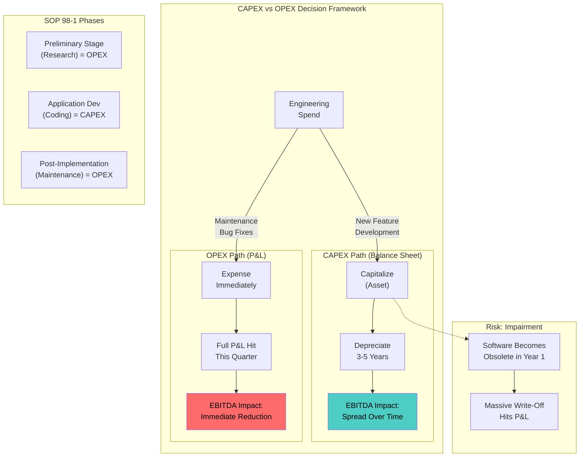
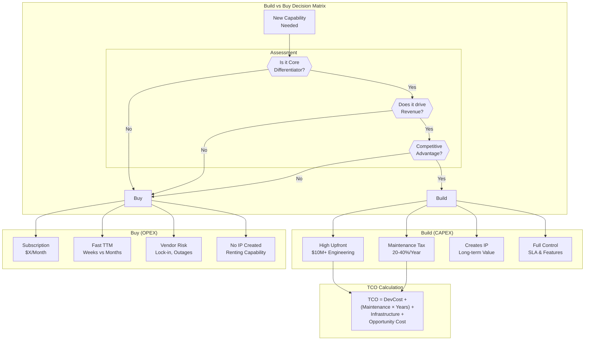
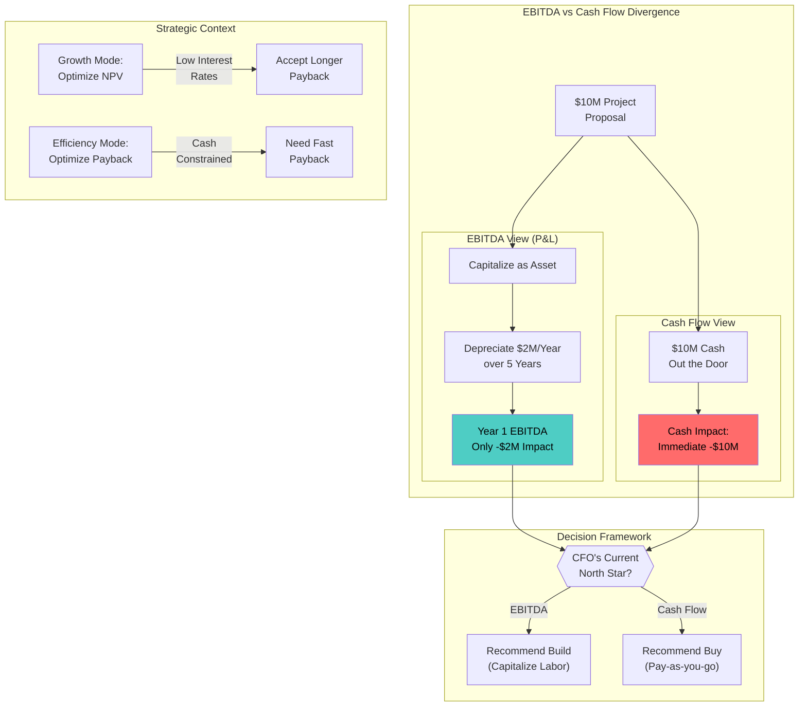

# CAPEX vs. OPEX Mental Model

This guide covers 5 key areas: I. The Core Mental Model: Assets vs. Expenses, II. Infrastructure Strategy: The Cloud Shift, III. Build vs. Buy (SaaS and Vendor Management), IV. FinOps and Engineering Accountability, V. Strategic ROI: EBITDA vs. Cash Flow.

## I. The Core Mental Model: Assets vs. Expenses

### 1. Financial Engineering via Software Capitalization (SOP 98-1)

For a Principal TPM at a Mag7, the most controllable lever in this domain is the capitalization of engineering labor. Under US GAAP (SOP 98-1), costs incurred during the "Application Development Stage" of internal-use software can be capitalized (treated as an asset) rather than expensed immediately.

**The "How" and "Why":**
Finance teams cannot guess what your engineers are doing. They rely on the data structure you enforce in Jira, Azure DevOps, or proprietary internal tools (like Google’s internal project tracking).
*   **Preliminary Stage (OPEX):** Conceptual formulation, evaluation of alternatives, and final selection. This is research and prototyping. It hits the P&L immediately.
*   **Application Development Stage (CAPEX):** Coding, hardware installation, and testing *for new features*. This is the "Asset Creation" phase.
*   **Post-Implementation (OPEX):** Training, maintenance, and bug fixes after release.

**Mag7 Real-World Behavior:**
At Amazon or Meta, Principal TPMs are often asked to audit their program's "Capitalization Rate" (Cap Rate).
*   **Example:** If your org has a $50M/year engineering payroll and a 0% Cap Rate (everything expensed), your org costs the company $50M in immediate profit reduction. If you structure the work to legitimately prove 60% is "New Development," you move $30M to the balance sheet. The immediate P&L hit drops to $20M (plus a small slice of depreciation), significantly boosting the company's reported EBITDA for that quarter.

**Actionable Guidance:**
1.  **Tagging Hygiene:** Enforce strict ticket tagging. "New Feature" vs. "Maintenance/Bug." If a ticket is ambiguous, Finance will default to OPEX (conservative accounting), hurting your margins.
2.  **Block Structure:** Structure roadmaps so "New Development" is grouped. Avoid interspersing new feature work with maintenance in a way that makes them inseparable during audits.

**Tradeoffs:**
*   **Pros:** Increases short-term EBITDA; aligns engineering output with asset creation; justifies headcount growth by linking it to asset value.
*   **Cons:** Creates a "Depreciation Tail." That $30M capitalized today must be paid off (depreciated) over the next 3 years. If the software becomes obsolete in 1 year (common in AI), the company must take a massive "Impairment Charge" (writing off the remaining asset value), which alarms investors.

### 2. Cloud Economics: The Reserved Instance (RI) and EDP Strategy

While the cloud is traditionally OPEX (pay-as-you-go), Mag7 companies operate at a scale where they manipulate cloud spend to behave like CAPEX or hybrid models to secure margins.

**The "How" and "Why":**
When you architect a system on AWS/Azure/GCP (or internal equivalents), the default is On-Demand pricing (pure OPEX). However, Principal TPMs must forecast usage to leverage Enterprise Discount Programs (EDP) or Reserved Instances (RIs).

**Mag7 Real-World Behavior:**
*   **Commitment Models:** At a company like Netflix (running on AWS) or Apple (using GCP for iCloud), the TPM doesn't just ask "How many instances?" They ask "What is the 3-year floor?"
*   **The Mechanism:** You commit to paying for X compute capacity for 3 years regardless of usage. This functions financially like CAPEX (a long-term obligation/asset behavior) but sits in OPEX budgets.
*   **Internal Clouds:** At Google (Borg) or Meta (Tupperware), internal chargeback models mimic this. If your product team demands 10,000 H100 GPUs, infrastructure leadership will require a "Quota Commitment." This forces your P&L to absorb the cost of that hardware lifespan, preventing teams from hoarding idle capacity.

**Tradeoffs:**
*   **Pros:** Massive unit cost reduction (40-70% savings); guarantees capacity during shortages (critical for GenAI training).
*   **Cons:** **Utilization Risk.** If you commit to 3 years of compute and your product fails or you pivot architecture (e.g., shifting from x86 to ARM/Graviton), you are still paying for the unused instances. This is "Shelfware" in the cloud.

### 3. The GenAI Hardware Trap: Useful Life vs. Obsolescence

The explosion of GenAI has introduced a specific CAPEX risk profile that Principal TPMs must navigate: Hardware Obsolescence.

**The "How" and "Why":**
AI Training clusters are massive CAPEX projects ($100M+). The standard depreciation schedule for servers is often 3-5 years. However, the innovation cycle of GPUs (Nvidia H100 to Blackwell, etc.) is roughly 18-24 months.

**Mag7 Real-World Behavior:**
*   **The Squeeze:** If you build a business case for a new AI model assuming a 5-year hardware lifespan to lower the annualized cost, you are financially engineering a lie. The hardware will be obsolete for *training* purposes in 2 years, relegated to *inference* or lower-tier tasks.
*   **TPM Responsibility:** You must model the "Cascade Strategy." How will this CAPEX asset be used in Year 1 (Training SOTA models), Year 2 (Fine-tuning), and Year 3 (Inference/Batch processing)? If you cannot justify the Year 3 use case, the ROI calculation fails.

**Edge Case - The "Stranded Asset":**
A common failure mode at Mag7 is building a custom data center footprint for a specific hardware spec (e.g., custom liquid cooling for specific ASICs) that gets cancelled. The TPM must ensure facilities/power/cooling (CAPEX) are modular enough to survive a pivot in the underlying compute strategy.

### 4. Build vs. Buy: The P&L Perspective

The decision to build a platform internally vs. buying a SaaS solution is often decided by CAPEX/OPEX preferences, not just technical fit.

**Tradeoff Analysis:**

| Feature | **Build (Internal)** | **Buy (SaaS)** |
| :--- | :--- | :--- |
| **P&L Impact** | Capitalized Labor (CAPEX). Improves EBITDA today. | Subscription Fees (OPEX). Hurts EBITDA today. |
| **Cash Flow** | High cash burn (salaries) but spread on books. | Predictable monthly cash outflow. |
| **Asset Value** | Creates IP (Intellectual Property) the company owns. | No asset creation; renting capability. |
| **Mag7 Preference** | **Strong preference to Build** for core competencies. It keeps margins high and controls the stack. | **Buy** for non-core (HR, Payroll, commodity tools) to avoid distraction. |

**Impact on Capabilities:**
Choosing to "Buy" creates a dependency. If a Mag7 relies on an external vendor for a core product capability, they lose "margin control." If the vendor raises prices, the Mag7 cannot engineer their way out of the cost. Building internally (CAPEX) grants long-term unit economic control.

## II. Infrastructure Strategy: The Cloud Shift

### 1. The Strategic Pivot: From Provisioning to Consumption

The "Cloud Shift" at the Principal level is rarely about the binary decision of "moving to the cloud." At a Mag7 level, the challenge is typically maximizing **Cloud Native** maturity or managing **Hybrid/Multi-cloud** complexities for regulatory or latency reasons. The fundamental shift is moving from a constraint-based model (what hardware do we have?) to a consumption-based model (what resources does the workload need right now?).

**Mag7 Real-World Behavior:**
*   **Amazon (Retail):** The internal migration from "MAWS" (legacy internal infra) to AWS was driven by the need to decouple teams. The goal wasn't just "hosting," it was API-first service isolation.
*   **Google:** While Google runs its own cloud, internal teams ("First Party" or 1P) often have to pay for resources just like external customers ("Third Party" or 3P) to enforce discipline. A Principal TPM at Google must manage their service's quota and efficiency just as strictly as an external CTO.

**The Strategy Matrix: The 6 Rs**
You must be able to articulate *how* a specific workload moves.
1.  **Rehost (Lift & Shift):** Moving VMs as-is. Fast, but retains technical debt and high OPEX.
2.  **Replatform (Lift & Reshape):** Moving to cloud but swapping components (e.g., self-hosted SQL to RDS/CloudSQL).
3.  **Refactor (Re-architect):** Rewriting for microservices/serverless. High upfront CAPEX (engineering time), lowest long-term OPEX and highest agility.
4.  **Repurchase:** Moving to SaaS (e.g., building internal CRM vs. buying Salesforce).
5.  **Retire:** Shutting down low-ROI services.
6.  **Retain:** Keeping on-prem due to latency/compliance (rare in Mag7 core product, common in edge/manufacturing).

### 2. Architecture: Monolith vs. Microservices vs. Cellular

The cloud shift fails if the application architecture does not align with infrastructure elasticity.

**The Technical Deep-Dive:**
*   **Microservices:** Decomposing a monolith allows independent scaling. If the "Search" feature spikes, you scale the Search service, not the "Checkout" service.
*   **Cellular Architecture (The Mag7 Standard):** At the scale of AWS or Meta, simple microservices fail due to "blast radius." Mag7 companies utilize **Cell-based architectures**. Instead of one giant pool of servers for all users, the infrastructure is sliced into "Cells" (independent, self-contained units handling a subset of customers). If a Cell fails, only 2% of users are impacted, not 100%.

**Tradeoffs:**
*   **Complexity vs. Reliability:** Cellular architecture drastically reduces the impact of an outage (high reliability/CX) but significantly increases the complexity of routing, deployment pipelines, and data consistency (high engineering overhead).
*   **Cost of Isolation:** Running many small independent clusters (cells) usually incurs higher overhead (wasted bin-packing space) compared to a massive multi-tenant cluster.

**Business Impact:**
Moving to a cellular architecture is often a prerequisite for reaching "four nines" (99.99%) or "five nines" (99.999%) of availability. This directly impacts SLA payouts and enterprise contract viability.

### 3. Unit Economics and FinOps

In an on-prem world, the cost is sunk (CAPEX). In the cloud, bad code costs real money every second (OPEX). A Principal TPM is responsible for the **Unit Economics** of their product.

**Key Metric:** Cost to Serve (CTS).
*   *Formula:* Total Infrastructure Cost / Number of Transactions (or Users).
*   *Goal:* As users scale, CTS should remain flat or decrease (economies of scale). If CTS increases with scale, your architecture is broken.

**Mag7 Real-World Behavior:**
*   **Spot Instances:** Teams at Amazon or Microsoft often run non-critical batch workloads or stateless web tiers on Spot instances (spare capacity sold at 90% discount) to optimize margins.
*   **Graviton/Custom Silicon:** AWS teams aggressively migrate workloads to Graviton (ARM-based) processors. This is a TPM-led initiative: "Migrate service X to ARM to achieve 20% price-performance improvement."

**Tradeoffs:**
*   **Engineering Effort vs. Cloud Bill:** Spending 3 months of engineering time (CAPEX) to optimize a query might save $50k/month in cloud costs (OPEX). You must calculate the break-even point. If the savings are $500/month, the engineering time isn't worth it.
*   **Commitment vs. Flexibility:** Signing a 3-year Savings Plan reduces costs by ~40% but locks you into a specific spend level. If you pivot architecture or shut down the product, you are stuck with the bill.

### 4. Vendor Lock-in vs. Velocity

This is the most common strategic debate a Principal TPM will mediate.

**The Spectrum:**
*   **Cloud Agnostic:** Using Terraform, Kubernetes, and generic Postgres. Theoretically portable between AWS/GCP/Azure.
*   **Cloud Native (Proprietary):** Using DynamoDB, Spanner, Lambda, or BigQuery.

**Mag7 Perspective:**
Contrary to popular belief, Mag7 companies often lean heavily into **Proprietary/Native** services for their specific platforms because the "Velocity" and "Operational Offloading" benefits outweigh the theoretical risk of lock-in.
*   *Example:* A team at Google will use Spanner (proprietary) rather than managing their own sharded MySQL on VMs, because Spanner handles global consistency and replication automatically. The engineering hours saved on maintenance are reinvested in feature development.

**Tradeoffs:**
*   **Velocity (Native) vs. Portability (Agnostic):** Building on "Cloud Native" primitives is 30-50% faster to market. However, migrating away later is a massive re-write.
*   **Talent Density:** Hiring generic Kubernetes experts is easier than hiring experts in a niche proprietary tool, but the proprietary tool often requires fewer people to manage.

### 5. Data Gravity and Egress

The biggest hidden killer in Cloud Strategy is data movement. **Data Gravity** suggests that applications and services are pulled toward where the data resides because moving mass amounts of data is slow and expensive (Egress fees).

**Technical nuance:**
*   **Availability Zones (AZ) Data Transfer:** Even within the same region, moving data between AZs (e.g., for high-availability replication) often incurs costs.
*   **Inter-Region Replication:** Essential for Disaster Recovery (DR), but doubles storage costs and incurs massive network transfer fees.

**Actionable Guidance:**
When designing a global architecture, the TPM must enforce data locality. Compute should move to the data, not vice versa.
*   *Bad:* App in Region A querying DB in Region B.
*   *Good:* Read Replicas in Region A sync with DB in Region B; App queries local Read Replica.

## III. Build vs. Buy (SaaS and Vendor Management)

### 1. The Strategic Framework: Core vs. Context

At the Principal level, the "Build vs. Buy" decision is rarely binary; it is a strategic assessment of **differentiation**. The governing mental model is **Core vs. Context**:
*   **Core:** Capabilities that differentiate the product in the market and directly drive revenue.
*   **Context:** Capabilities required to run the business but do not offer a competitive advantage.

**Mag7 Real-World Behavior:**
At companies like Google or Meta, the default engineering culture is "Not Invented Here" (NIH). Engineers prefer to build because they believe they can solve the problem better than any vendor.
*   **The Trap:** A team at Amazon might want to build a custom project management tool because Jira "doesn't scale to their specific workflow."
*   **The Principal TPM Role:** You must rigorously challenge this. If the capability does not improve the customer experience in a unique way, it is a commodity. You buy commodities; you build differentiators.
*   **Example:** Microsoft uses SAP for ERP (Context) but builds its own hyper-scale data center management software (Core/Differentiator).

### 2. The Hidden Technical Costs of "Buy" (SaaS Integration)

Buying SaaS is never zero-effort. At Mag7 scale, "Buy" actually means **"Buy and Integrate."** The complexity shifts from *application development* to *integration engineering*.

**Technical Nuances:**
*   **Identity & Access Management (IAM):** The vendor must integrate with internal SSO (e.g., Okta, internal AD). If they don't support SCIM (System for Cross-domain Identity Management) for automated provisioning/deprovisioning, the operational overhead is massive.
*   **Data Gravity & Egress:** If you buy a heavy compute solution (e.g., a third-party AI modeling tool), you may have to move petabytes of data out of your VPC. This incurs massive egress costs and latency.
*   **Rate Limiting & Throttling:** A SaaS vendor might claim to be "enterprise-ready," but Mag7 scale will break their API limits immediately.

**Tradeoffs:**
*   **Buy:** Faster Time-to-Market (TTM), but you inherit the vendor's roadmap and downtime. You trade **control** for **speed**.
*   **Build:** Total control over the SLA and feature set, but you own the "Keep the Lights On" (KTLO) maintenance forever.

### 3. The "Build" Trap: Total Cost of Ownership (TCO)

When engineering leads propose a "Build," they often estimate based on **implementation time**. As a Principal TPM, you must force the calculation of **Total Cost of Ownership over 3-5 years**.

**The TCO Equation:**
$$TCO = (DevCost) + (Maintenance \times Years) + (Infrastructure) + (OpportunityCost)$$

**Mag7 Impact Analysis:**
*   **Maintenance Tax:** For every $1 spent building a feature, expect to spend $0.20–$0.40 annually on maintenance (patching, library upgrades, security fixes).
*   **Opportunity Cost:** The most expensive resource at a Mag7 is not cash; it is **engineering focus**. If 5 Principal Engineers are building a custom logging framework instead of the next GenAI feature, the ROI is negative, even if the custom tool is "free."
*   **Skill Rot:** Building internal tools using proprietary tech stacks can hurt recruiting. Engineers want to learn transferable skills (industry standard tools) rather than a proprietary internal workflow engine that exists only at Apple.

### 4. Risk, Security, and Compliance (TPRM)

At a Mag7, Third-Party Risk Management (TPRM) is often the deciding factor.

**Critical Constraints:**
*   **Data Sovereignty:** If the vendor cannot guarantee that data stays within the EU (for GDPR) or specific US regions (for FedRAMP), the "Buy" option is dead immediately.
*   **Supply Chain Attacks:** Integrating a vendor SDK into a core product (e.g., integrating a third-party crash reporter into the Instagram iOS app) introduces a massive attack vector. If the vendor is compromised, your app is compromised.
*   **Mag7 Behavior:** This leads to a **"Wrap and Extend"** pattern. Amazon may buy a license for a tool but run it "on-prem" (in their own VPC) or require the vendor to undergo a "white glove" security audit where Amazon security engineers review the vendor's code.

### 5. Vendor Management as a Capability

Once a decision to "Buy" is made, the Principal TPM often acts as the technical bridge between Procurement and the Vendor.

**Key Levers:**
*   **The "Design Partner" Strategy:** If a vendor lacks a feature you need, use your Mag7 brand leverage to force them to build it. "We will sign a $5M contract, but only if you add feature X to your roadmap for Q3."
*   **Exit Strategy:** You must architect for the divorce before the marriage.
    *   *Question:* If this vendor raises prices by 300% in 3 years (common with Broadcom/VMware scenarios), how hard is it to rip and replace?
    *   *Action:* Ensure data formats are open (JSON/Parquet, not proprietary blobs) and API abstraction layers are used in your code so the underlying provider can be swapped.

### Summary of Impact

| Dimension | Build (Internal) | Buy (SaaS/Vendor) |
| :--- | :--- | :--- |
| **ROI** | **Long-term:** Higher for Core assets (no license fees).  **Short-term:** Low (high CAPEX). | **Long-term:** Lower (perpetual OPEX).  **Short-term:** High (instant value). |
| **CX** | **High:** Pixel-perfect customization for the user. | **Medium:** constrained by vendor UI/UX patterns. |
| **Business Capability** | Creates **Intellectual Property (IP)**. | Creates **Operational Efficiency**. |
| **Risk** | Operational risk (you break it, you fix it). | Counterparty risk (vendor goes bankrupt or gets hacked). |

## IV. FinOps and Engineering Accountability

FinOps is often misunderstood as "cutting costs." At the Principal level, you must reframe this: FinOps is about **Unit Economics** and **Gross Margins**. It is the practice of bringing financial accountability to the variable spend model of the cloud, enabling engineering teams to make trade-offs between speed, cost, and quality.

At a Mag7 company, the infrastructure bill is one of the top three line items on the P&L. A Principal TPM is responsible for ensuring that every dollar spent on cloud infrastructure translates directly to business value, preventing "cloud sprawl" where costs grow faster than revenue.

### 1. Unit Economics: The North Star Metric

The most critical shift a Principal TPM drives is moving the conversation from "Total Absolute Spend" to "Cost Per Unit of Value."

*   **The Technical Mechanism:** You must couple billing data (numerator) with business metrics (denominator).
    *   *AWS/Azure:* Use Cost & Usage Reports (CUR) exported to a data lake (e.g., S3/Athena or BigQuery).
    *   *Telemetry:* Ingest application metrics (e.g., API calls, Daily Active Users, Stream Hours).
    *   *Synthesis:* Create a dashboard tracking **Cost Per Transaction**, **Cost Per Stream**, or **Cost Per ML Training Job**.
*   **Mag7 Real-World Example:**
    *   **Netflix:** Does not panic if the total AWS bill rises by 20%. They panic if the *Cost Per Stream Hour* rises. If the bill rises 20% but viewing hours rise 30%, the efficiency has actually improved.
    *   **Amazon Retail:** Teams are measured on "Cost Per Order." If a team deploys a new feature that increases conversion by 1% but increases compute cost per order by 5%, the TPM must flag this as negative ROI unless the increased revenue volume offsets the margin compression.
*   **Tradeoffs:**
    *   *Granularity vs. Engineering Effort:* Getting perfect unit economics requires complex telemetry injection. The tradeoff is accepting 80% accuracy (proxy metrics) to avoid slowing down feature development.
*   **Business Impact:**
    *   Defining unit economics allows the business to calculate the exact Gross Margin of a specific product feature, influencing pricing strategies and "End of Life" decisions for unprofitable features.

### 2. Attribution and Tagging Strategy (The "No Untagged Resources" Rule)

You cannot manage what you cannot measure. The primary failure mode in Mag7 cloud environments is "Dark Spend"—resources that are running but unowned.

*   **The Technical Mechanism:**
    *   **Tagging Taxonomy:** Enforcing mandatory tags via Infrastructure as Code (Terraform/CloudFormation). Essential tags include `CostCenter`, `ServiceOwner`, `Environment` (Prod/Stage), and `Lifecycle` (Ephemeral/Permanent).
    *   **The "Scream Test" Automation:** Implementing "Janitor" scripts (e.g., Cloud Custodian) that identify untagged resources, mark them for deletion, notify a Slack channel, and terminate them after 24-48 hours if unclaimed.
*   **Mag7 Real-World Behavior:**
    *   **Google:** Uses rigorous project-level attribution. If a resource cannot be mapped to a specific P&L center, it is often automatically spun down or assigned to a "Sin Bin" budget where the CTO reviews it personally (a high-shame environment).
    *   **Containerization (K8s):** In shared Kubernetes clusters, cost attribution is difficult. Principal TPMs drive the implementation of tools like **Kubecost** or proprietary sidecars to allocate spend based on Pod resource requests vs. actual usage, ensuring one team's memory leak doesn't eat another team's budget.
*   **Tradeoffs:**
    *   *Innovation Friction vs. Governance:* Strict tagging policies can block deployments, frustrating engineers.
    *   *Mitigation:* Use "Tag-on-Create" policies in the CI/CD pipeline so builds fail fast, rather than resources being deleted later.
*   **Impact on Capabilities:**
    *   Moves the organization from **Showback** (Finance showing IT what they spent) to **Chargeback** (The specific product team pays the bill from their own P&L). This forces engineering managers to care about code efficiency.

### 3. Rate Optimization vs. Usage Optimization

A Principal TPM must distinguish between paying less for what you use (Rate) and using less (Usage).

*   **Rate Optimization (Finance-Led, TPM Supported):**
    *   *Mechanisms:* Enterprise Discount Programs (EDP), Savings Plans, and Reserved Instances (RIs).
    *   *The TPM Role:* Finance cannot predict engineering roadmaps. The TPM provides the **forecast**. "We are launching a new region in Q3, so commit to 500 EC2 instances now."
    *   *The Trap:* Over-committing to RIs for legacy architecture (e.g., VMs) locks you in, making it financially painful to refactor to modern architecture (e.g., Serverless/Lambda) because you are paying for the VMs anyway.
*   **Usage Optimization (Engineering-Led, TPM Driven):**
    *   *Mechanisms:* Rightsizing instances, deleting unattached EBS volumes, and configuring Lifecycle Policies on S3 (moving data to Glacier).
    *   *Spot Instance Orchestration:* At Mag7, stateless workloads (CI/CD, batch processing, rendering) *must* run on Spot instances (spare capacity at ~90% discount).
    *   *Tradeoff:* Spot instances can be interrupted. The application must be architected for fault tolerance. The TPM drives the "Chaos Engineering" mindset required to support this.
*   **Mag7 Real-World Example:**
    *   **Meta:** heavily utilizes "capacity buffering." Non-critical batch jobs (like analytics or log processing) only run when user-facing traffic is low, utilizing the hardware that must exist anyway to handle peak user load.
*   **Impact on ROI:**
    *   Rate optimization yields 10-20% savings. Usage optimization yields 30-60% savings but requires engineering cycles. The TPM decides where to invest the headcount.

### 4. Forecasting and the "Bill Shock" Loop

The worst thing a TPM can do is surprise the CFO. FinOps is about predictability.

*   **The Technical Mechanism:**
    *   **Anomaly Detection:** Setting up automated alerts (AWS Budgets, CloudWatch Anomaly Detection) that trigger when spend deviates +10% from the historical moving average.
    *   **The Feedback Loop:** When an alert fires, it shouldn't just go to email; it should create a Jira ticket for the on-call engineer.
*   **Mag7 Real-World Behavior:**
    *   **Microsoft/Azure:** Engineering teams often have a monthly "Business Review" where they must explain variances. If a team is under budget, they don't get a pat on the back; they get asked, "Did you under-ship features? Or did you sandbag your forecast?" Accuracy is prized over frugality.
*   **Tradeoffs:**
    *   *Buffer vs. Efficiency:* Engineers naturally pad estimates to avoid going over budget. This leads to "stranded capacity" (paid for but unused).
    *   *The TPM Action:* You must interrogate the buffers. "Why do we need 50% headroom for a service growing 2% month-over-month?"
*   **Impact on CX:**
    *   Accurate forecasting ensures capacity is available for launch events (e.g., Prime Day, Black Friday), preventing outages due to resource exhaustion (hitting quotas).

## V. Strategic ROI: EBITDA vs. Cash Flow

At the Principal TPM level, understanding the divergence between EBITDA (Earnings Before Interest, Taxes, Depreciation, and Amortization) and Cash Flow is what separates a project manager from a business leader. While Engineering Directors focus on technical feasibility, you must align technical execution with the company’s current financial strategy.

In a Mag7 environment, the stock price is often driven by EBITDA growth (demonstrating operational profitability), but the company’s survival and ability to invest are driven by Free Cash Flow (FCF). You will frequently encounter scenarios where a decision is "profitable" on the P&L (good EBITDA) but "unaffordable" due to liquidity constraints (bad Cash Flow), or vice versa.

### 1. The Mechanics: How TPM Decisions Split the Metrics

To navigate this, you must understand how your resource requests hit the financial statements differently.

*   **EBITDA (The P&L View):** This is a proxy for the operating profitability of the business. It excludes the cost of assets (depreciation). If you capitalize software development (CAPEX), those engineering salaries are removed from OPEX, artificially boosting EBITDA in the current quarter.
*   **Cash Flow (The Bank Account View):** This is the actual cash leaving the company. Whether you capitalize a developer's time or not, you still have to pay their salary every two weeks. Capitalization does *not* save cash; it only changes how the expense is recognized over time.

**Mag7 Real-World Behavior:**
During the "Year of Efficiency" at Meta or recent cost-cutting measures at Amazon, the focus shifted aggressively from EBITDA growth to Free Cash Flow.
*   **The Shift:** Projects that required massive upfront hardware purchases (GPUs for AI clusters) were scrutinized not just on ROI, but on "Cash Conversion Cycles." Even if the AI model would generate profit in 3 years, the company hesitated to burn \$500M in cash *today* if interest rates were high.
*   **Your Impact:** In this environment, a Principal TPM might pivot a strategy from "Build our own data center footprint" (High CAPEX, High Cash Outflow) to "Use On-Demand Cloud Capacity" (High OPEX, Lower Immediate Cash Outflow), even if the latter is technically more expensive in the long run.

### 2. Strategic Tradeoffs: Build vs. Buy

The classic "Build vs. Buy" decision is the primary arena where Principal TPMs influence EBITDA vs. Cash Flow.

**Option A: Build (Internal Development)**
*   **Financial Profile:** High initial Cash Flow impact (hiring, salaries), but favorable EBITDA impact (due to capitalization of labor).
*   **Tradeoff:** You are betting that the asset created will have a long useful life. If the project is cancelled after 18 months, you face **Asset Impairment**. The finance team must "write off" the capitalized costs, which results in a massive, immediate hit to EBITDA that you were trying to avoid.
*   **Mag7 Example:** Google building its own TPU chips. Massive cash outlay, but creates a capitalized asset that depreciates slowly, protecting margins from the volatility of Nvidia’s pricing.

**Option B: Buy (SaaS/Vendor Solutions)**
*   **Financial Profile:** Lower initial Cash Flow impact (pay-as-you-go or monthly licensing), but immediate negative impact on EBITDA (100% OPEX).
*   **Tradeoff:** You preserve cash liquidity and agility. However, you depress the operating margin. If your product has low margins to begin with (e.g., Amazon Retail), adding heavy SaaS OPEX can make the product unprofitable.
*   **Mag7 Example:** Microsoft Azure teams using third-party security scanning tools initially to launch fast (OPEX), then planning a 2-year roadmap to build an internal replacement to improve margins (CAPEX) once the product scales.

### 3. ROI Nuance: Payback Period vs. NPV

When presenting a business case to VP-level leadership, the metric you emphasize signals your understanding of the company's strategic position.

*   **Net Present Value (NPV):** The total value created over time.
    *   *Use when:* The company is in "Growth Mode" and interest rates are low. The goal is maximizing total long-term value.
*   **Payback Period:** How many months until the cash spent is recovered.
    *   *Use when:* The company is in "Efficiency Mode" or cash-constrained.
    *   *Principal Insight:* At a Mag7, if a project has a positive NPV but a Payback Period > 24 months, it is currently at high risk of being cut. You must structure releases to generate revenue (or savings) earlier to shorten the payback period, even if it means delivering fewer features initially.

### 4. Edge Cases: The "Zombie Asset" Risk

A critical failure mode for Principal TPMs is managing "Zombie Assets"—capitalized software that is no longer useful but hasn't been fully depreciated.

*   **The Scenario:** You led a 2-year initiative to build a new ad-tech platform. \$20M was capitalized. Six months after launch, the strategy changes, and the platform is deprecated.
*   **The Consequence:** The remaining undepreciated value (e.g., \$15M) must be written off immediately. This appears as a surprise \$15M loss on the P&L in a single quarter.
*   **Mitigation:** A Principal TPM must maintain a "Capital Health" view. If a product’s lifecycle is shortening, you must advocate to *stop* capitalizing new work or accelerate depreciation. Do not keep "zombie" features alive just to avoid the write-off conversation; it only compounds the financial risk.

### 5. Actionable Guidance for the Principal TPM

1.  **Know the CFO's North Star:** Before pitching a new platform, ask your Finance partner: "Are we optimizing for EBITDA margin or Free Cash Flow this fiscal year?"
    *   *If EBITDA:* Pitch the "Build" strategy with heavy capitalization.
    *   *If Cash Flow:* Pitch the "MVP" strategy with minimal headcount and deferred hardware spend.
2.  **Structure Contracts for Cash Flow:** When negotiating with vendors (e.g., Datadog, Salesforce), you can influence cash flow.
    *   *Action:* Negotiate "Net 60" or "Net 90" payment terms. Even if the cost is the same (OPEX), delaying payment by 60 days improves the company's Free Cash Flow position. This is a subtle lever that demonstrates high-level business acumen.
3.  **The "Cloud Commit" Trap:** Be wary of signing multi-year Enterprise Discount Programs (EDPs) with cloud providers to improve margins (EBITDA). While it lowers unit cost, it creates a rigid cash liability. If your usage drops, you are still on the hook for the cash, destroying your ROI.

---

## Interview Questions

### I. The Core Mental Model: Assets vs. Expenses

**Question 1: The "Profitability Pivot"**
"Imagine you are leading a mature platform team at Amazon. Leadership has issued a directive to improve EBITDA by 15% next quarter without laying off staff or deprecating core features. Using the CAPEX/OPEX mental model, what levers would you pull and what are the risks of each?"

*   **Guidance for a Strong Answer:**
    *   **Lever 1 (Accounting):** Audit the roadmap for "Capitalizable Work." Move engineers from maintenance (OPEX) to new feature development (CAPEX) to shift salary costs to the balance sheet. *Risk: Tech debt accumulation.*
    *   **Lever 2 (Infrastructure):** Review cloud spend for On-Demand vs. Reserved instances. Commit to 1-year RIs for steady-state workloads to drop OPEX immediately. *Risk: Lock-in.*
    *   **Lever 3 (Lifecycle):** Extend the useful life of existing hardware assets (if on-prem) to slow depreciation schedules (requires Finance partnership).

**Question 2: The GenAI Infrastructure Case**
"You are proposing a $50M investment in a new AI training cluster. The CFO pushes back, stating that the OPEX cost of electricity and cooling combined with the rapid depreciation of GPUs makes the ROI negative. How do you restructure this program to satisfy the CFO?"

*   **Guidance for a Strong Answer:**
    *   **Utilization Strategy:** Propose a "Mixed Workload" architecture where the cluster trains high-priority models (high value) during peak times and runs spot-instance-style batch processing or external customer workloads (revenue generating) during off-peak to ensure 95%+ utilization.
    *   **Asset Cascading:** Define the lifecycle. Year 1-2 is training (CAPEX justification), Year 3-4 is inference/serving (lower cost basis).
    *   **Opex Offset:** Demonstrate how this internal cluster replaces a significantly higher external cloud spend (OPEX avoidance), showing that the "Build" model breaks even against the "Rent" model within 18 months.

### II. Infrastructure Strategy: The Cloud Shift

**Question 1: The Migration vs. Refactor Dilemma**
"We have a legacy monolithic application running in a colocation facility that is costing us $5M/year and has frequent outages. The contract expires in 12 months. Leadership wants to move to the cloud to 'save money and improve reliability.' Describe your strategy. Do we Lift and Shift, or Refactor?"

*   **Guidance for a Strong Answer:**
    *   **Acknowledge the Constraint:** 12 months is a hard deadline. A full refactor of a massive monolith usually takes longer than 12 months.
    *   **Hybrid Approach (The "Strangler Fig"):** Propose a "Lift and Shift" (Rehost) first to secure the evacuation and mitigate the expiry risk. Once in the cloud, stabilize the environment. *Then*, begin Refactoring critical paths into microservices to optimize cost and reliability.
    *   **Financial Reality:** Admit that the "Lift and Shift" phase will likely cost *more* (OPEX) than the colocation facility initially due to lack of optimization. Set expectations that cost savings come *after* the refactor phase.
    *   **Risk Mitigation:** Discuss setting up a Direct Connect/ExpressRoute early to handle data replication during the transition.

**Question 2: Managing Cloud Spend (FinOps)**
"You are the Principal TPM for a new GenAI product. Usage is exploding, but our cloud bill is growing faster than our revenue, threatening our gross margins. Engineering says they need speed and can't focus on optimization. How do you handle this?"

*   **Guidance for a Strong Answer:**
    *   **Data-Driven Triage:** First, identify the bleeding. Is it compute (GPUs), storage, or data transfer? Use Pareto analysis (80% of cost is usually in 20% of services).
    *   **Unit Economics:** Shift the conversation from "Total Cost" to "Cost per Query." If Cost per Query is flat but Total Cost is up, that's good (growth). If Cost per Query is rising, that's an architectural defect.
    *   **Tactical vs. Strategic Fixes:**
        *   *Tactical (Immediate):* Purchase Reserved Instances/Savings Plans for baseload coverage. Implement lifecycle policies on storage (move unused data to Cold Storage/Glacier).
        *   *Strategic (Long-term):* Negotiate a "Tech Debt" sprint with Engineering leadership. Frame it as "Scalability" rather than just "Cost." If we don't optimize now, the system will fall over at 2x scale regardless of cost.
    *   **Governance:** Implement "Chargeback" or "Showback" models so engineering teams see the dollar value of their commits.

### III. Build vs. Buy (SaaS and Vendor Management)

**Question 1: The "Not Invented Here" Challenge**
"You are leading a program to modernize our CI/CD pipeline. The engineering leads want to build a custom orchestration engine on top of Kubernetes because they claim Jenkins and GitHub Actions don't support our specific 'canary deployment' complexity. You know that maintaining this internal tool will require a permanent team of 6 engineers. How do you evaluate this request and how do you influence the decision?"

*   **Guidance for a Strong Answer:**
    *   **Validate the Gap:** Don't dismiss the engineers. Deep dive into the *specific* technical gap. Is it truly unique, or just a lack of knowledge about existing tool plugins?
    *   **TCO Calculation:** Present the cost of 6 engineers ($3M+/year) vs. an Enterprise GitHub license. Highlight the "Maintenance Tax."
    *   **Hybrid Proposal:** Suggest a "Buy and Extend" approach. Use the standard industry tool for 90% of the pipeline and write custom scripts *only* for the canary logic.
    *   **Strategic Alignment:** Ask if "Deployment Orchestration" is a core differentiator for the company. If we aren't selling this tool, why are we building it?

**Question 2: The Vendor Outage Crisis**
"We integrated a third-party identity provider for a new enterprise product. Two weeks before launch, the vendor suffers a major security breach and goes offline for 48 hours. Leadership is panicking and suggesting we delay launch to build our own auth system. What do you do?"

*   **Guidance for a Strong Answer:**
    *   **Immediate Mitigation:** Assess the actual impact. Is user data compromised? Trigger the Incident Response plan.
    *   **Feasibility Check:** "Building our own auth" in 2 weeks is a fallacy that introduces higher security risks than a breached vendor. Push back on the knee-jerk reaction.
    *   **Architectural Review:** Did we implement the "Circuit Breaker" pattern? Can the system degrade gracefully (e.g., read-only mode) without the auth vendor?
    *   **Path Forward:** If trust is broken, evaluate an alternative vendor (faster than building). If we must build, scope it to a Minimum Viable Auth (MVA) and recognize the launch delay will be months, not weeks. Communicate the tradeoff clearly to leadership.

### IV. FinOps and Engineering Accountability

**Question 1: The "Cloud Bill Spike" Scenario**
"You are the TPM for a Data Platform. Your monthly cloud bill just spiked by 40% overnight. The engineering lead claims it's due to 'organic user growth,' but your user metrics only show a 5% increase. Walk me through how you investigate, diagnose, and resolve this."

*   **Guidance for a Strong Answer:**
    *   **Immediate Triage:** Don't wait for the monthly bill. Look at daily granularity. Identify the specific service (e.g., is it Compute, Storage, or Data Transfer?).
    *   **Unit Economics check:** Challenge the "organic growth" claim by calculating Cost Per User. If that metric spiked, the engineering claim is false.
    *   **Technical Hypotheses:** Look for common culprits: a recursive loop in a Lambda function, a change in logging verbosity (ingesting terabytes of debug logs), or data egress charges (accidentally moving data across regions).
    *   **Resolution:** Revert the bad change (if it's a bug). If it's a necessary feature, calculate the margin impact and escalate to business leadership to see if the feature is worth the cost.
    *   **Prevention:** Implement anomaly detection alerts and budget caps on non-production environments.

**Question 2: The Refactoring ROI Calculation**
"An engineering team wants to pause feature development for three months to refactor their monolithic application into microservices to 'save money on infrastructure.' The estimated cloud savings are $200k/year. The cost of the engineering time is roughly $500k. How do you decide if this is approved?"

*   **Guidance for a Strong Answer:**
    *   **Basic ROI:** Acknowledge that purely on 1-year math, it’s a bad deal ($500k spend to save $200k).
    *   **The Nuance (Principal Level):** Look beyond the immediate savings.
        *   *Velocity:* Will microservices allow them to ship features 2x faster next year?
        *   *Scalability:* Is the monolith about to hit a hard limit that will cause outages (CX impact) during the next peak season?
        *   *Talent:* Is the team burning out maintaining the monolith?
    *   **The Decision Framework:** If the refactor is *only* for cost, reject it. If the refactor unlocks velocity or prevents a catastrophic failure ceiling, quantify those risks.
    *   **The Compromise:** Propose an incremental approach (Strangler Fig pattern) to refactor the most expensive components first, validating savings without a 3-month feature freeze.

### V. Strategic ROI: EBITDA vs. Cash Flow

**Question 1: The Strategic Pivot**
"Imagine you are leading a major platform migration at Amazon. We are 6 months into a 24-month 'Build' plan with 50 engineers capitalized. The CFO announces a freeze on CAPEX to improve Free Cash Flow for the next 4 quarters. How do you adjust your program without cancelling it?"

*   **Guidance for a Strong Answer:**
    *   **Acknowledge the Financial Mechanics:** Recognize that "freezing CAPEX" means you cannot treat the engineers' time as an asset anymore; their salaries will hit OPEX, hurting margins, OR you must stop "building new assets."
    *   **Strategic Pivot:** Propose shifting the engineering focus from "New Development" (CAPEX) to "Optimization/Efficiency" (OPEX). While this hits margins, it aligns with the CFO's cash preservation goal by potentially reducing *other* costs (e.g., lowering cloud bills).
    *   **Vendor Strategy:** Suggest moving away from upfront hardware purchases to consumption-based models (OPEX) to stop the cash bleed, even if it hurts the long-term margin slightly.
    *   **Risk Management:** Discuss the risk of impairment for the work already done and how you would document the "pause" to avoid a write-off.

**Question 2: The Buy vs. Build Trap**
"You have a choice between buying a SaaS solution for \$5M/year (OPEX) or building it internally for \$10M upfront (CAPEX) with a \$1M/year maintenance tail. The internal build breaks even in year 3. Our division is currently missing its EBITDA targets but has strong cash reserves. Which path do you recommend and why?"

*   **Guidance for a Strong Answer:**
    *   **Identify the Constraint:** The division is missing *EBITDA* targets.
    *   **Analyze the Impact:**
        *   *Buying (SaaS):* Hits EBITDA by \$5M immediately. This worsens the problem.
        *   *Building:* The \$10M upfront is cash, not expense. It depreciates (e.g., over 5 years), meaning only \$2M hits EBITDA per year.
    *   **Recommendation:** Recommend the **Build** (or a hybrid). Because the constraint is EBITDA, the Build option protects the P&L margin significantly better (\$2M expense vs \$5M expense), utilizing the strong cash reserves which are not the current constraint.
    *   **Nuance:** Add that you would validate the "useful life" assumption to ensure the asset doesn't become obsolete before year 3.

---

## Key Takeaways

- Review each section for actionable insights applicable to your organization

- Consider the trade-offs discussed when making architectural decisions

- Use the operational considerations as a checklist for production readiness
