# Change Data Capture (CDC)

    Concept: Capture changes from database transaction log (binlog, WAL) and stream to other systems. Changes are in order, guaranteed, low overhead.
    Tools: Debezium (open source), AWS DMS, Oracle GoldenGate. Connect to Kafka or directly to target.
    Use Cases: Database migration, cache invalidation, building read replicas, event sourcing reconstruction, analytics pipeline population.

💡Interview Tip
CDC is often the answer to "how do you keep X and Y in sync without dual-write complexity?" Mention it when discussing data consistency across systems.

This guide covers 5 key areas: I. Conceptual Foundation: The "Why" and "What", II. Architecture & The Data Pipeline, III. Primary Use Cases for Principal TPMs, IV. Real-World Behavior at Mag7, V. Strategic Tradeoffs & Business Impact.

## I. Conceptual Foundation: The "Why" and "What"

### 1. The Dual Write Problem & The Consistency Challenge

At the Principal level, the adoption of Change Data Capture (CDC) is rarely about "pipes"; it is an architectural decision to guarantee **eventual consistency** across distributed microservices.

The primary driver for CDC in a Mag7 environment is the **Dual Write Problem**. In a distributed architecture (e.g., an e-commerce platform at Amazon or a payment processor at Stripe), an application often needs to perform two actions:
1.  Commit a state change to the database (e.g., "Payment Accepted").
2.  Publish an event to a message bus (Kafka/SNS) to trigger downstream actions (e.g., "Send Email," "Ship Product").

**The Failure Mode:** If the database commit succeeds but the message publication fails (due to network issues or broker downtime), the system enters an inconsistent state. The payment is recorded, but the product never ships.

```mermaid
sequenceDiagram
    participant App as Application
    participant DB as Database
    participant MQ as Message Queue
    participant DS as Downstream Service

    rect rgba(254,226,226,0.3)
        Note over App,DS: Dual Write Problem - Failure Mode
        App->>DB: 1. Write "Payment Accepted"
        DB-->>App: ✓ Commit Success
        App-xMQ: 2. Publish Event
        Note right of MQ: Network failure or<br/>broker down
        Note over DS: Never receives event<br/>Product never ships
    end

    Note over App,DS: Inconsistent State: DB has record, MQ does not
```

**The Solution (CDC):** Instead of the application attempting both writes, the application **only** commits to the database. The CDC mechanism acts as a "sidecar" process that tails the database's Write-Ahead Log (WAL), detects the commit, and reliably publishes the event. This guarantees that **if it is in the database, it will be in the stream.**

```mermaid
sequenceDiagram
    participant App as Application
    participant DB as Database
    participant CDC as CDC Connector
    participant MQ as Message Queue
    participant DS as Downstream Service

    rect rgba(220,252,231,0.3)
        Note over App,DS: CDC Solution - Guaranteed Delivery
        App->>DB: 1. Write "Payment Accepted"
        DB-->>App: ✓ Commit Success
        Note right of App: App's job is done
    end

    rect rgba(219,234,254,0.3)
        Note over CDC,DS: Async Replication Pipeline
        CDC->>DB: 2. Tail WAL/Binlog
        DB-->>CDC: Change detected
        CDC->>MQ: 3. Publish Event
        MQ->>DS: 4. Deliver to consumer
        Note over DS: Ships product
    end

    Note over App,DS: If in DB → guaranteed in stream
```

#### Real-World Mag7 Example
*   **Uber & Uber Eats:** Uber uses CDC (via a platform called DBLog) to replicate data from sharded MySQL databases into their data lake and real-time indexing services. This ensures that when a driver updates their status or a restaurant updates a menu item, the search index (Elasticsearch) and the analytics engine (Hadoop/Hive) receive the update without the application needing to manage triple-writes.

### 2. Log-Based Extraction vs. Polling: The "How"

To make informed architectural decisions, you must understand the mechanics of extraction.

#### Polling (Query-Based)
The application or an ETL tool runs `SELECT * FROM Table WHERE LastUpdated > X` every few minutes.
*   **Tradeoffs:**
    *   **Pros:** Easy to implement; works with any database that supports SQL; no infrastructure overhead for log access.
    *   **Cons:** **High Latency** (data is always stale by the poll interval); **Performance Impact** (heavy queries compete with transactional traffic); **Missed Deletes** (if a row is hard-deleted, the poller never sees it unless you use soft-deletes/tombstones).
*   **Business Impact:** unsuitable for real-time inventory or fraud detection. Acceptable for nightly financial reporting.

#### Log-Based (The Mag7 Standard)
The CDC connector connects to the database as a "replica." It reads the binary log (Binlog in MySQL, WAL in Postgres, Redo Log in Oracle).
*   **Tradeoffs:**
    *   **Pros:** **Near Real-Time** (milliseconds latency); **Zero Query Impact** (reads from disk/logs, not memory/query engine); **Captures Deletes** (log records the delete command); **Strict Ordering** (guarantees T1 happens before T2).
    *   **Cons:** **Complexity** (requires admin access to DB logs); **Fragility** (if the log format changes or logs are rotated/purged too fast, the pipeline breaks).
*   **Business Impact:** Enables **CQRS** (Command Query Responsibility Segregation). You can optimize the primary DB for writes and stream data to a secondary DB optimized for reads/analytics.

### 3. Business Capabilities & ROI Analysis

Implementing CDC is an infrastructure investment that yields specific business capabilities.

| Capability | ROI Driver | Impact on Customer Experience (CX) |
| :--- | :--- | :--- |
| **Search Indexing** | automated sync to Elastic/OpenSearch removes manual re-indexing scripts. | Users see accurate search results (e.g., Amazon product availability) immediately after a backend update. |
| **Cache Invalidation** | **Facebook (Meta)** pattern: When the Source of Truth changes, CDC triggers a cache eviction. | Prevents users from seeing stale content (e.g., old comments or likes) without aggressive TTLs that hurt DB performance. |
| **Auditing & Compliance** | The log stream provides a perfect history of *every* state change (before/after values). | fast-tracks GDPR/SOX compliance audits; allows "Time Travel" debugging to see exactly what data looked like at a specific timestamp. |
| **Data Lake Feeding** | Replaces batch ETL jobs with continuous streaming (e.g., Netflix moving RDS data to Iceberg). | Data Scientists work with fresh data rather than "yesterday's data," improving ML model accuracy for recommendations. |

### 4. Edge Cases and Failure Modes

A Principal TPM must anticipate where this architecture breaks.

1.  **Schema Evolution:** If a developer adds a column to the source Postgres DB, does the CDC pipeline break?
    *   *Mitigation:* Use a schema registry (e.g., Confluent Schema Registry). The CDC tool must support schema evolution (Avra/Protobuf) to alert downstream consumers of the format change without crashing the pipeline.
2.  **The "At Least Once" Delivery:** CDC frameworks generally guarantee "at least once" delivery. This means downstream systems might receive the same event twice.
    *   *Mitigation:* Downstream consumers must be **Idempotent**. Processing the same "Order Created" event twice should not result in two shipments.
3.  **Log Retention vs. Downtime:** If the CDC connector goes down for 24 hours, but the database is configured to purge transaction logs every 6 hours, you lose data.
    *   *Mitigation:* Operational SLAs must align DB log retention policies with the maximum tolerable downtime of the CDC infrastructure.

## II. Architecture & The Data Pipeline

To effectively architect a CDC pipeline at Mag7 scale, you must move beyond regarding it as a simple data transfer mechanism. It is a distributed consistency layer. If this pipeline lags, your search index shows old products; if it breaks, your financial reporting is wrong.

The architecture generally follows a **Source → Capture → Transport → Sink** topology. However, the complexity lies in the configuration, schema management, and failure handling of these components.

### 1. The Capture Layer: Debezium vs. Cloud Native

The "Capture Agent" is the most fragile part of the pipeline because it is tightly coupled to the internal storage engine of the source database.

**Option A: Open Source Standard (Debezium)**
Debezium is the standard for a reason. It runs as a Kafka Connect cluster, reading WAL/Binlogs and pushing to Kafka.
*   **Mag7 Example:** **Netflix** utilizes a highly customized version of Debezium (integrated into their Keystone platform) to unbundle their monolithic databases into microservices.
*   **Tradeoffs:**
    *   *Pros:* Vendor agnostic. Supports complex transformations (SMT). High configurability.
    *   *Cons:* High operational overhead. You are managing a Java cluster. If Debezium crashes, logs pile up on the source DB, risking disk exhaustion.
*   **ROI/Impact:** High initial engineering cost (OpEx) for maximum long-term flexibility and avoidance of vendor lock-in.

**Option B: Cloud Native (DynamoDB Streams / AWS DMS)**
*   **Mag7 Example:** **Amazon** internal services heavily rely on DynamoDB Streams triggering Lambda functions to update search indices (OpenSearch) or caches (ElastiCache).
*   **Tradeoffs:**
    *   *Pros:* Zero maintenance. "It just works." Native integration with IAM.
    *   *Cons:* Opaque. If lag increases, you have few knobs to turn. AWS DMS, specifically, is notorious for being "black box" regarding validation and datatype mapping errors.
*   **ROI/Impact:** Faster Time-to-Market (TTM). Lower headcount requirement to maintain, but potential for higher cloud bills at extreme scale due to managed service premiums.

### 2. Transport & Schema Governance (The "Contract")

At the Principal level, you must enforce strict schema governance. A pipeline without schema validation is a ticking time bomb.

**The Format War: JSON vs. Avro/Protobuf**
*   **JSON:** Human-readable but verbose.
    *   *Mag7 Reality:* Rarely used for high-throughput backbone pipelines due to size and parsing overhead.
*   **Avro (with Schema Registry):** Binary, compact, and strictly typed.
    *   *Mag7 Reality:* **Uber** and **LinkedIn** rely heavily on Avro. The schema registry acts as the contract. If a producer changes a field type (e.g., `user_id` from INT to STRING) without a migration, the pipeline rejects the message *before* it breaks downstream consumers.

**Tradeoff Analysis:**
*   **Strict Schema (Avro):** slows down development (devs must register schemas) but prevents P0 outages caused by "poison pill" messages.
*   **Loose Schema (JSON):** accelerates development but transfers technical debt to the consumer, who must write defensive code to handle shifting data structures.

### 3. Ordering and Partitioning Strategy

Data arrives in a stream, but "order" is relative in distributed systems.
*   **The Problem:** You have an `INSERT User` event followed by an `UPDATE User` event. If they are processed out of order, your downstream system might try to update a user that doesn't exist yet, or overwrite the final state with an old state.
*   **The Solution:** Consistent Hashing / Partition Keys. You must ensure all events for `User_ID_123` go to the same Kafka partition.
*   **Mag7 Example:** **Meta (Facebook)** uses strict partitioning on TAO/Memcache invalidation streams. If cache invalidations arrive out of order, users see stale content.

**Edge Case - The "Hot Partition" Problem:**
If you partition by `Customer_ID`, and you have one massive customer (e.g., a B2B scenario), one partition becomes overloaded while others sit idle. This creates "consumer lag" for that specific customer.
*   **Mitigation:** Salting keys or splitting heavy hitters into dedicated topics.

### 4. Delivery Semantics & Idempotency

This is the most critical concept for a TPM to verify during design reviews.

```mermaid
flowchart LR
    subgraph AtMostOnce["At-Most-Once"]
        P1[Producer] -->|"Fire & Forget"| K1[[Kafka]]
        K1 -->|"May lose"| C1[Consumer]
        L1[/"✗ Lost messages<br/>✓ No duplicates"/]
    end

    subgraph AtLeastOnce["At-Least-Once (CDC Standard)"]
        P2[Producer] -->|"Retry on failure"| K2[[Kafka]]
        K2 -->|"May duplicate"| C2[Consumer]
        L2[/"✓ No lost messages<br/>✗ Duplicates possible"/]
    end

    subgraph ExactlyOnce["Exactly-Once"]
        P3[Producer] -->|"Transactions"| K3[[Kafka]]
        K3 -->|"Coordinated"| C3[Consumer]
        L3[/"✓ No lost messages<br/>✓ No duplicates<br/>✗ High latency & cost"/]
    end

    classDef error fill:#fee2e2,stroke:#dc2626,color:#991b1b,stroke-width:2px
    classDef success fill:#dcfce7,stroke:#16a34a,color:#166534,stroke-width:2px
    classDef warning fill:#fef3c7,stroke:#d97706,color:#92400e,stroke-width:2px
    classDef neutral fill:#f1f5f9,stroke:#64748b,color:#475569,stroke-width:1px

    class P1,C1 error
    class L1 error
    class P2,C2 success
    class L2 success
    class P3,C3 warning
    class L3 warning
    class K1,K2,K3 neutral
```

*   **At-Most-Once:** Fire and forget. (Acceptable for logs/metrics, unacceptable for financial data).
*   **At-Least-Once:** The standard for CDC. If the network blips, the system resends the message.
    *   *Consequence:* Downstream systems receive duplicates.
*   **Exactly-Once:** Theoretically possible (Kafka Streams) but computationally expensive and complex to configure correctly.

**The Principal TPM Stance:**
Do not chase "Exactly-Once" processing unless absolutely necessary. Instead, mandate **Idempotency** at the sink (consumer).
*   *Implementation:* The consumer DB tracks the `Log_Offset_ID`. If it receives a message with an ID lower than what it has already processed, it discards it.
*   *Business Impact:* Ensures data integrity without the massive latency penalty of "Exactly-Once" transactions.

### 5. The "Initial Snapshot" Problem

CDC captures *changes*. But what about the 10TB of data already in the database?

*   **The Pattern:** Most CDC pipelines require a "Bootstrap" phase.
    1.  Start the CDC process (store the log position, but don't stream yet).
    2.  Run a `SELECT *` snapshot of the table.
    3.  Once the snapshot finishes, start streaming logs from the stored position.
*   **Mag7 Behavior:** **Google** Spanner change streams handle this natively, allowing backfills without pausing the live application.
*   **Risk:** The snapshot phase puts heavy read pressure on the production DB. This must be throttled or run against a Read Replica to avoid degrading CX for live users.

## III. Primary Use Cases for Principal TPMs

### 1. Zero-Downtime Migrations and Re-platforming

For a Principal TPM, the most high-stakes application of CDC is orchestrating the migration of critical legacy systems (e.g., decomposing a monolith or moving from on-prem Oracle to AWS Aurora) without requiring a maintenance window. This is often referred to as the "Strangler Fig" pattern accelerated by data synchronization.

*   **The Mechanism:** You establish a CDC link from the Legacy DB (Source) to the New DB (Target). The application continues to write to the Legacy DB. The CDC pipeline replicates these writes to the New DB in near real-time. Once the New DB is caught up (sync), you switch the application's read/write traffic to the New DB.
*   **Mag7 Example:** When Amazon migrated its retail platform from a centralized Oracle cluster to DynamoDB/Aurora, they utilized CDC streams to keep the new microservices data stores in sync with the legacy source of truth until the cutover moment.
*   **Tradeoffs:**
    *   *Complexity vs. Availability:* implementing CDC requires significant engineering effort compared to a "lift and shift" with downtime. However, for a Mag7, downtime costs millions per minute.
    *   *Data Fidelity:* You must handle schema drift. If the new DB has a different schema, the CDC pipeline requires complex transformation logic (ETL) in flight, increasing latency.
*   **Business Impact:**
    *   **ROI:** Eliminates revenue loss associated with maintenance windows.
    *   **Risk Mitigation:** Allows for a "failback" scenario. If the new system crashes after cutover, you can reverse the CDC stream (New -> Old) to keep the legacy system as a valid backup.

### 2. The "Transactional Outbox" Pattern (Microservices Consistency)

In a microservices architecture, a service often needs to update its database *and* notify other services (e.g., "Order Service" saves an order and notifies "Shipping Service"). Doing this via "Dual Write" (writing to DB and publishing to Kafka separately) is dangerous because one might fail, leading to data corruption.

*   **The Mechanism:** The application writes the business data *and* an "event" record to a specific "Outbox" table within the same database transaction (ACID compliant). The CDC connector listens specifically to the "Outbox" table and pushes those events to Kafka.
*   **Mag7 Example:** Uber uses similar patterns for trip lifecycle management. When a trip is completed, the transaction is committed to the trip store. CDC picks up this change to trigger payment processing, receipt generation, and driver rating services asynchronously.
*   **Tradeoffs:**
    *   *Latency vs. Consistency:* This introduces a slight delay (sub-second) between the write and the downstream notification, unlike a direct API call. However, it guarantees eventual consistency.
    *   *Storage:* The Outbox table grows rapidly and requires aggressive pruning/vacuuming strategies.
*   **Business Impact:**
    *   **Capability:** Enables loose coupling. The Order Service doesn't need to know if the Shipping Service is online.
    *   **CX:** Prevents "Ghost Orders" where a user pays (DB write) but never gets a confirmation email (Message Queue fail).

### 3. Cache Invalidation and Search Indexing

Keeping secondary data stores (Redis, Elasticsearch, Solr) in sync with the primary operational database is a persistent challenge. TTL (Time to Live) caching is easy but leads to stale data.

*   **The Mechanism:** Instead of the application writing to the DB and then updating the Cache/Index (which is prone to race conditions), the application *only* writes to the DB. A CDC pipeline reads the change log and updates the Cache or Search Index.
*   **Mag7 Example:** Facebook/Meta’s TAO (The Association Object) system relies on invalidation streams to ensure that when you "Like" a post, the count updates across distributed caches globally. Similarly, when a Netflix metadata engineer updates a movie title, CDC pipelines ensure the search index is updated within seconds.
*   **Tradeoffs:**
    *   *Freshness vs. Load:* Polling the DB for changes to update a cache defeats the purpose of caching (high DB load). CDC provides freshness without querying the source DB.
    *   *Ordering Complexity:* If updates arrive out of order (e.g., "Create Item" arrives after "Update Item"), the cache may break. The CDC pipeline must respect the ordering of the WAL (Write Ahead Log).
*   **Business Impact:**
    *   **CX:** Users see accurate data immediately. If a price changes on Amazon, the search result matches the product page.
    *   **Efficiency:** Removes "cache warming" code from the application logic, simplifying the codebase.

### 4. Real-Time Analytics (Operational Data Lakes)

Traditional ETL (Extract, Transform, Load) runs in nightly batches. In the Mag7 environment, waiting 24 hours for data is unacceptable for use cases like fraud detection or dynamic pricing.

*   **The Mechanism:** CDC streams raw changes from OLTP databases (Postgres/MySQL) directly into a Data Lake (S3, BigQuery, Snowflake) or a stream processor (Flink).
*   **Mag7 Example:** Google Ads uses streaming data pipelines to adjust bidding algorithms in real-time based on click-through rates, rather than waiting for end-of-day reconciliation.
*   **Tradeoffs:**
    *   *Cost:* Streaming infrastructure (Kinesis/Kafka + Flink) is significantly more expensive than batch processing (Airflow + Spark).
    *   *Schema Evolution:* If the upstream operational DB changes a column name, the downstream analytics pipeline can break instantly. Principal TPMs must enforce "Schema Contracts" between product and data teams.
*   **Business Impact:**
    *   **ROI:** Enables "in-the-moment" business decisions (e.g., stopping a fraudulent transaction before goods ship, rather than flagging it the next day).

### 5. Failure Modes and Edge Cases

A Principal TPM must anticipate where CDC breaks. It is not a "set and forget" solution.

*   **The "At-Least-Once" Delivery Problem:**
    *   *Issue:* If the CDC connector crashes after reading a log record but before committing the offset to Kafka, it will restart and re-send the same record.
    *   *Mitigation:* Downstream consumers must be **Idempotent**. They must be able to process the same event twice without corrupting data (e.g., "Set balance to $100" is idempotent; "Add $10 to balance" is not).
*   **Snapshotting Large Tables:**
    *   *Issue:* When you first turn on CDC, you need the historical data, not just new changes. Reading a 10TB table to initialize the stream can kill the production DB.
    *   *Mitigation:* Use "Incremental Snapshotting" (reading in chunks interleaved with log reading) to prevent locking the database.

## IV. Real-World Behavior at Mag7

At a Mag7 scale, CDC is rarely deployed as a simple "pipe." It functions as the central nervous system for Event-Driven Architectures (EDA). When you move from theory to practice in environments like Amazon or Google, you encounter specific behavioral patterns, failure modes, and governance challenges that do not exist at smaller scales.

### 1. The "Initial Snapshot" vs. "Streaming" Continuity
One of the most complex phases of CDC implementation is the "bootstrap." Before you can stream changes, you must have the baseline state.

*   **Mag7 Behavior:** When migrating a massive monolithic database (e.g., an Oracle shard at Amazon) to a microservice or data lake, you cannot lock the table to take a snapshot.
*   **Implementation:** Tools like Debezium perform an "incremental snapshot." They read the existing table data in chunks while simultaneously reading the transaction log. Once the snapshot finishes, the system seamlessly switches to streaming mode, deduplicating events that occurred during the snapshot phase.
*   **Trade-off:**
    *   *Incremental Snapshot:* High complexity, lower impact on source DB performance.
    *   *Blocking Snapshot:* Simpler, but requires downtime (unacceptable for Tier-1 services).
*   **Business Impact:** Enables "Zero Downtime Migrations." A Principal TPM uses this to justify the engineering effort of CDC over simple batch ETL, as it allows the business to modernize legacy stacks without service interruptions.

### 2. Schema Evolution and The "Contract" Problem
In a startup, if an engineer changes a column from `int` to `string`, the pipeline breaks, and they fix it. At Meta or Netflix, an upstream service team might alter a schema that breaks 50 downstream data science models and three other product teams.

*   **Mag7 Behavior:** CDC exposes internal database schemas to the outside world. This is effectively "leaking encapsulation." To manage this, Mag7 companies enforce strict **Schema Registries** (e.g., Confluent Schema Registry or AWS Glue).
*   **The Outbox Pattern:** Instead of CDC-ing the raw application tables (which change frequently), high-maturity teams write to a dedicated "Outbox" table. The CDC tool only reads the Outbox.
*   **Trade-off:**
    *   *Raw Table CDC:* Zero developer effort to emit events; high risk of breaking downstream consumers.
    *   *Outbox Pattern:* Requires developers to write code to populate the Outbox; guarantees a stable API contract for downstream teams.
*   **ROI/Skill:** This is a governance issue. A Principal TPM must enforce the Outbox pattern or Schema Registry checks in the CI/CD pipeline. The ROI is the reduction of "Data Downtime"—periods where analytics or ML models are stale due to broken pipelines.

### 3. Handling "At-Least-Once" Delivery and Idempotency
CDC systems at scale generally guarantee "at-least-once" delivery. "Exactly-once" is theoretically possible (e.g., Kafka transactions) but operationally expensive and brittle at Mag7 scale.

*   **Mag7 Behavior:** If a network blip occurs between the CDC connector and Kafka, the connector will resend the last batch of events. Downstream services *will* receive duplicate records.
*   **Implementation:** Downstream consumers (e.g., a Lambda function updating a search index) must be **Idempotent**. They must be able to process the same "Update Order" event five times without corrupting the state (e.g., by checking event timestamps or version numbers).
*   **Trade-off:**
    *   *Strict Exactly-Once:* High latency, lower throughput, complex infrastructure configuration.
    *   *At-Least-Once + Idempotent Consumers:* High throughput, robust, but shifts complexity to the consumer application logic.
*   **CX Impact:** If idempotency is ignored, a customer might be charged twice, or an inventory count might be decremented incorrectly.

### 4. The GDPR/CCPA "Right to be Forgotten"
CDC creates a data proliferation problem. If a user deletes their account in the main app, that "Delete" event propagates to the Data Lake. However, logs act as an immutable history.

*   **Mag7 Behavior:** You cannot simply keep CDC logs forever if they contain PII (Personally Identifiable Information).
*   **Implementation:**
    *   **Log Compaction:** Kafka is configured to keep only the *latest* state of a key (User ID). If a "Delete" (tombstone) record is written, Kafka eventually removes all previous history for that user.
    *   **Crypto-Shredding:** The CDC stream contains encrypted PII. When a user requests deletion, the encryption key for that specific user is deleted, rendering the historical data in the logs unreadable.
*   **Trade-off:**
    *   *Short Retention:* Reduces compliance risk but prevents "replaying" history to fix bugs.
    *   *Long Retention:* Enables time-travel debugging but increases storage costs and compliance liability.
*   **Business Capability:** Compliance is a Tier-0 requirement. Failure here results in massive fines (4% of global revenue).

### 5. Managing Lag (The "Eventual" in Eventual Consistency)
CDC is near real-time, not real-time. There is always "replication lag."

*   **Mag7 Behavior:** During high-traffic events (Prime Day, Super Bowl), the database generates logs faster than the CDC connector can process them. Lag spikes from milliseconds to minutes.
*   **Implementation:** TPMs must define SLAs for lag. If lag exceeds a threshold (e.g., 5 minutes), circuit breakers might trip to stop non-essential downstream processes from acting on stale data.
*   **Trade-off:**
    *   *Over-provisioning:* paying for massive Kafka Connect clusters to handle peak load (high cost, low utilization).
    *   *Accepting Lag:* Allowing delays in analytics dashboards during peaks (low cost, degraded internal CX).

## V. Strategic Tradeoffs & Business Impact

At the Principal level, the implementation of Change Data Capture (CDC) is rarely a purely technical challenge; it is a strategic decision regarding data gravity, consistency models, and the cost of currency. You are not just piping data; you are defining how the business reacts to state changes. The decision to implement CDC fundamentally shifts an organization from a request-driven architecture to an event-driven architecture. This shift incurs specific taxes on operations and infrastructure that must be weighed against business agility.

### 1. The Latency vs. Cost Tradeoff (The "Real-Time" Tax)

The most common request a TPM receives is for "real-time data." However, true low-latency streaming (sub-second) is exponentially more expensive than near real-time (minutes) or batching (hours).

*   **Mag7 Example:** At **Amazon**, the inventory ledger requires strict CDC consistency to prevent overselling. If a unit is sold, that event must propagate immediately. However, the "People who bought this also bought..." recommendation engine does not need sub-second updates. It can ingest data via micro-batches.
*   **The Tradeoff:**
    *   *Low Latency (CDC + Kafka):* High infrastructure cost (compute for brokers, storage for retention), high operational complexity (managing offsets, rebalancing partitions).
    *   *Micro-batching (S3 + Copy):* Low cost, high throughput, easier to replay, but data is stale by 15-60 minutes.
*   **Business Impact:**
    *   **ROI:** Implementing CDC for analytical dashboards that are only viewed weekly is a negative ROI. A Principal TPM must push back on "real-time" requirements unless the business process (e.g., fraud detection, inventory lock) demands it.
    *   **CX:** For user-facing features (e.g., "Your driver is 2 stops away"), CDC is non-negotiable. The cost is justified by customer retention and trust.

### 2. Schema Evolution and Downstream Coupling

One of the highest risks in CDC is the tight coupling between the operational database (Source) and the analytical/downstream systems (Sink). When a product engineer alters a table schema in Postgres (e.g., renames a column), it can instantly break the data pipeline, causing data swamps in the data lake or crashing consumer applications.

*   **Mag7 Example:** **Netflix** utilizes a schema registry (often integrated with Confluent Kafka or internal tools) that enforces contract testing. If a producer attempts to make a backward-incompatible change to a Proto/Avro schema, the CI/CD pipeline blocks the deployment.
*   **The Tradeoff:**
    *   *Strict Schema Enforcement:* High governance, slower deployment velocity for upstream teams (they must coordinate changes), but guarantees downstream reliability.
    *   *Schemaless (JSON blobs):* High velocity for upstream teams (just dump JSON), but shifts the burden of parsing and error handling to data engineers and consumers, often leading to "data quality debt."
*   **Business Impact:**
    *   **Skill/Capabilities:** Requires a shift in engineering culture. Backend engineers can no longer view the DB as their private storage; it becomes a public API. The TPM must drive this cultural change.
    *   **Reliability:** Prevents "silent failures" where data flows but is semantically incorrect, leading to erroneous executive reporting.

### 3. The "At-Least-Once" Delivery & Idempotency Challenge

CDC frameworks generally guarantee "at-least-once" delivery. In distributed systems failure modes, the same event (e.g., "PaymentProcessed") might be delivered twice.

*   **Mag7 Example:** In **Uber’s** payment processing, processing a payment event twice is catastrophic. However, for a ride-matching algorithm, processing a geolocation update twice is generally acceptable noise.
*   **The Tradeoff:**
    *   *Idempotent Consumers:* Engineering teams must build logic to handle duplicates (e.g., checking a transaction ID against a Redis cache before processing). This increases development time and latency.
    *   *Exactly-Once Semantics (EOS):* Available in frameworks like Kafka Streams or Flink, but incurs a significant performance penalty (throughput reduction) and complexity overhead.
*   **Business Impact:**
    *   **Risk:** For financial or inventory data, the cost of handling idempotency is mandatory. For clickstream or telemetry data, the business usually accepts a <0.1% duplicate rate in exchange for raw speed and lower cost.

### 4. Build vs. Buy: Managed Services vs. OSS

This is a classic Principal TPM decision matrix. Do you use a cloud-native wrapper (AWS DMS, GCP Datastream) or manage Debezium/Kafka Connect yourself?

*   **Mag7 Example:** **Microsoft Azure** teams often leverage internal managed services for standard replication to CosmosDB. However, when highly custom transformations or specific filtering logic is required at the source to reduce egress costs, they may deploy self-managed Debezium connectors on Kubernetes.
*   **The Tradeoff:**
    *   *Managed (AWS DMS):* Fast time-to-market, lower headcount requirement, but "black box" debugging and limited configuration options.
    *   *Self-Hosted (Debezium):* Infinite configurability, no vendor lock-in, but requires a dedicated SRE/Platform team to manage the JVMs, connector rebalancing, and upgrades.
*   **Business Impact:**
    *   **CapEx vs. OpEx:** Managed services increase the cloud bill (OpEx) but reduce the need for specialized headcount. Self-hosted reduces cloud spend but requires expensive engineering talent (CapEx equivalent) to maintain.
    *   **Capability:** If the business requires complex masking of PII (Personally Identifiable Information) *before* the data leaves the source network for compliance (GDPR/CCPA), self-hosted solutions often offer better granular control than generic managed services.

### 5. Impact on Database Performance (The Observer Effect)

While CDC is log-based, it is not strictly zero-impact. Reading the WAL/Binlog and transmitting data requires CPU and I/O. If the capture agent falls behind (lag), it can prevent the primary database from purging old logs, eventually filling up the disk and crashing the production database.

*   **Mag7 Behavior:** At **Meta**, for high-throughput databases, the CDC process is often run against a Read Replica rather than the Primary Writer to isolate the impact. However, this introduces a "replication lag" risk where the CDC stream is slightly behind the absolute truth.
*   **Actionable Guidance:**
    *   Always monitor **Replication Slot Size** and **Consumer Lag**.
    *   If the business demands 100% currency, you must read from the Primary, but you must provision extra IOPS to handle the read load of the CDC agent.

---

## Interview Questions

### I. Conceptual Foundation: The "Why" and "What"

### Q1: "We are breaking a monolithic application into microservices. We need to sync the legacy User Profile database (Oracle) with a new Loyalty Service (DynamoDB). Why would you choose CDC over having the legacy app fire API calls to the new service? What are the risks?"

**Guidance for a Strong Answer:**
*   **Decoupling:** API calls couple the legacy monolith to the new service's availability. If the Loyalty Service is down, the legacy app might fail or hang. CDC allows the legacy app to fire-and-forget to the DB.
*   **Performance:** Adding HTTP calls to the legacy transaction path adds latency. CDC happens asynchronously.
*   **Consistency:** The candidate should identify the "Dual Write" risk. If the API call fails, the user exists in Oracle but not DynamoDB. CDC ensures eventual consistency.
*   **Risks:** Mentioning **Schema Coupling** (changes in Oracle might break the DynamoDB consumer) and **Replication Lag** (the user might update their profile, refresh the page, and not see the update immediately in the Loyalty widget).

### Q2: "You are designing a CDC pipeline for a high-volume financial ledger. The business requires strict ordering of transactions. How do you ensure that 'Account Created' is processed before 'Deposit Money' when using a distributed message broker like Kafka?"

**Guidance for a Strong Answer:**
*   **Partitioning Strategy:** The candidate must explain **Key-Based Partitioning**. You must use the `AccountID` as the partition key.
*   **Kafka Mechanics:** Explain that Kafka only guarantees ordering *within* a partition, not across the whole topic. By hashing the `AccountID`, all events for that specific user land in the same partition and are consumed sequentially.
*   **Failure Handling:** Discuss what happens if a "poison pill" message blocks a partition. A Principal TPM should know that strict ordering often implies head-of-line blocking risks.

### II. Architecture & The Data Pipeline

### Question 1: Handling Schema Evolution
"We are using a CDC pipeline to replicate our Order Management System (Postgres) to our Data Lake (Snowflake). A developer drops a column called `shipping_address` in the source DB to refactor code. This immediately breaks the downstream ingestion jobs, causing a 4-hour blackout in executive reporting. As the Principal TPM, how do you architect the system to prevent this in the future?"

**Guidance for a Strong Answer:**
*   **Root Cause:** Acknowledging that the DB and the Pipeline were tightly coupled without a contract.
*   **Immediate Fix:** Discuss rollback procedures and the concept of a "Dead Letter Queue" (DLQ) to catch failing events so the rest of the pipeline keeps moving.
*   **Systemic Fix (The "Principal" view):**
    *   Implement a **Schema Registry** with compatibility rules (e.g., `BACKWARD_TRANSITIVE`).
    *   Enforce a process where schema changes are validated in CI/CD *before* deployment.
    *   Advocate for "Soft Deletes" or "Deprecation Phases" rather than hard dropping columns in active production databases.
    *   Mention the tradeoff: This adds friction to the developer experience (DX) but secures business continuity.

### Question 2: Lag & Backpressure
"Your CDC pipeline feeds a real-time fraud detection service. During a Black Friday event, the volume of database writes spikes by 50x. The CDC system (Debezium) keeps up, but the Fraud Service (Consumer) cannot process messages fast enough. Kafka lag is growing exponentially. What is the impact, and how do you mitigate this architecturally?"

**Guidance for a Strong Answer:**
*   **Impact Analysis:** The fraud data is becoming "stale." If the lag is 10 minutes, a fraudster can make a purchase and checkout before the system realizes their account was flagged 5 minutes ago.
*   **Mitigation Strategies:**
    *   **Short term:** Horizontal scaling of the consumer group (adding more consumer instances). However, note that you cannot scale consumers beyond the number of Kafka partitions.
    *   **Architecture:** Discuss **Backpressure**. Since we cannot slow down the Source (customers are buying!), we must optimize the Sink.
    *   **Prioritization:** Implement "Priority Topics." Split the stream. Critical events (High Value Orders) go to a fast lane; low-value events (User Profile Updates) go to a slow lane.
    *   **Failover:** If lag exceeds a threshold (e.g., 5 mins), fail open (allow transactions but flag for post-analysis) or fail closed (deny transactions), depending on risk appetite (Business/ROI decision).

### III. Primary Use Cases for Principal TPMs

### Question 1: The Migration Strategy
**"We are splitting a monolithic Order Management System (Postgres) into three microservices. The business cannot tolerate more than 5 minutes of downtime, but the data volume is 50TB. How would you architect the data migration and cutover using CDC, and what are the specific risks you would track?"**

*   **Guidance for a Strong Answer:**
    *   **Architecture:** Describe a "Strangler Fig" approach using CDC (e.g., Debezium) to sync the monolith to the new microservices databases.
    *   **The "Backfill":** Explicitly mention how to handle the initial 50TB snapshot (using incremental snapshots to avoid locking the production DB).
    *   **Validation:** Propose a "Shadow Mode" where the new services process traffic but don't return responses to users, allowing comparison of results against the monolith to ensure data integrity before cutover.
    *   **The Cutover:** Describe flipping the switch (updating the load balancer) and the "Failback" plan (keeping the reverse CDC sync active).
    *   **Risks:** Mention schema drift, latency lag (replication delay), and data consistency checks (hashing records to ensure they match).

### Question 2: Handling High-Velocity Streams
**"You are implementing a CDC pipeline for a high-frequency trading desk. The database throughput spikes to 100k writes per second. Your downstream consumer (a search index) is falling behind, creating a 15-minute lag. What are your levers to resolve this?"**

*   **Guidance for a Strong Answer:**
    *   **Diagnosis:** Identify if the bottleneck is the Source (DB IO), the Transport (Kafka partition limits), or the Sink (Search Index ingestion rate).
    *   **Partitioning:** Discuss optimizing Kafka partitioning. Ensure the CDC connector partitions data by `Primary Key` so that updates to the same record go to the same partition (preserving order), while spreading load across consumers.
    *   **Batching:** Increasing batch sizes at the consumer level to reduce network overhead.
    *   **Filtering:** Ask if *all* data needs to be replicated. Can we filter out specific columns or tables at the source to reduce payload size?
    *   **Tradeoff:** Acknowledge that if the lag persists, the business might need to accept "Eventual Consistency" or throttle upstream writes (Backpressure), though throttling is rarely acceptable in trading.

### IV. Real-World Behavior at Mag7

### Question 1: Handling Schema Drift in Critical Pipelines
**"We are using CDC to replicate our Payments database to our Data Lake for real-time fraud detection. The Payments engineering team frequently refactors their database schema to launch new features, which keeps breaking the fraud detection pipeline. As a Principal TPM, how do you resolve this structural conflict between velocity and stability?"**

**Guidance for a Strong Answer:**
*   **Diagnose the Root Cause:** Identify that this is an architectural coupling problem. The implementation leaks internal implementation details (schema) to downstream consumers.
*   **Propose Technical Solutions:** Suggest moving to the **Outbox Pattern** to decouple the internal schema from the public event contract. Alternatively, propose implementing a **Schema Registry** with "Forward Transitive" compatibility checks in the CI/CD pipeline (blocking PRs that break compatibility).
*   **Address Governance:** Discuss the need for a "Data Contract" between the Payments team (Producer) and Fraud team (Consumer).
*   **Trade-off Analysis:** Acknowledge that the Outbox pattern adds write latency and storage overhead to the Payments service, but argue that the ROI of preventing fraud detection outages outweighs these costs.

### Question 2: Operational Scaling & Lag
**"During a Black Friday event, our CDC pipeline connecting the Inventory Order Management System to the User Notification Service (emails/push) developed a 45-minute lag. Customers were getting order confirmations an hour late. Walk me through how you would triage this live, and what architectural changes you would drive post-mortem?"**

**Guidance for a Strong Answer:**
*   **Immediate Triage:** First, check the metrics. Is the bottleneck at the Source (DB CPU high?), the Connector (memory/CPU limits?), or the Sink (Kafka backpressure?). If the Sink is slow, increase the number of partitions and consumer instances to parallelize processing.
*   **Architectural Fix:** Discuss **Partitioning Strategy**. Perhaps all orders were going to a single partition causing a "hot shard."
*   **Business Continuity:** Propose a "Priority Lane." Can we split the stream? Critical transactional emails go to a high-priority, low-volume topic; marketing emails go to a bulk topic.
*   **Metric Visibility:** Emphasize the need for "Lag as a Service" monitoring—alerting on the *time* delay (consumer timestamp minus producer timestamp) rather than just queue depth.

### V. Strategic Tradeoffs & Business Impact

**Question 1: The "Real-Time" Pushback**
"Our marketing team wants to move all our user engagement analytics from a daily batch process to real-time CDC streams to 'react faster to customer trends.' This will triple our infrastructure costs and require significant re-architecture. As the Principal TPM, how do you evaluate this request and what is your recommendation?"

*   **Guidance for a Strong Answer:**
    *   **Start with Business Value:** Do not jump to "No." Ask *what* action they will take in real-time. If they only check dashboards once a day, real-time is waste.
    *   **Propose Hybrid Models:** Suggest real-time for critical metrics (e.g., cart abandonment) and batch for long-term trends.
    *   **Cost/Benefit Analysis:** Quantify the "triple cost" vs. the potential revenue uplift of reacting faster.
    *   **Technical Feasibility:** Discuss the readiness of the team to handle streaming data vs. static tables.

**Question 2: Handling Schema Evolution**
"We represent a platform team at a major cloud provider. We are implementing CDC to replicate data from 50 different microservices into a data lake. A recent upstream change in a billing service corrupted the data lake for 48 hours because a column type was changed from Integer to String. How do you design a process to prevent this without stifling the velocity of the microservice teams?"

*   **Guidance for a Strong Answer:**
    *   **Governance vs. Velocity:** Acknowledge the tension. You cannot freeze schemas, but you cannot break downstream consumers.
    *   **Schema Registry:** Propose implementing a Schema Registry (e.g., Avro/Protobuf) that validates backward compatibility at the CI/CD stage.
    *   **Dead Letter Queues (DLQ):** Explain how the architecture should handle bad records—route them to a DLQ for manual inspection rather than halting the entire pipeline.
    *   **Communication:** Establish a "Data Contract" process where upstream teams are effectively API owners of their data streams.

---

## Key Takeaways

- Review each section for actionable insights applicable to your organization

- Consider the trade-offs discussed when making architectural decisions

- Use the operational considerations as a checklist for production readiness
