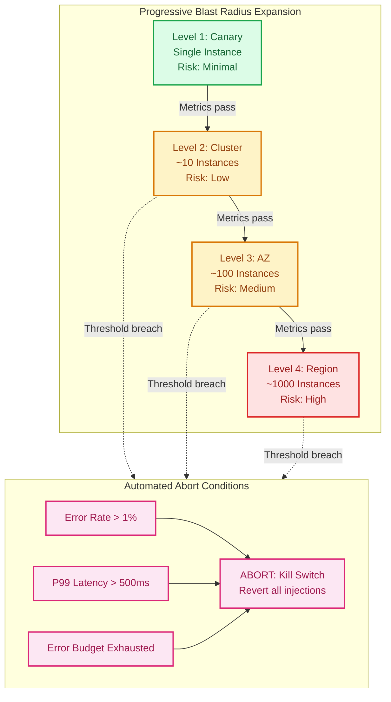
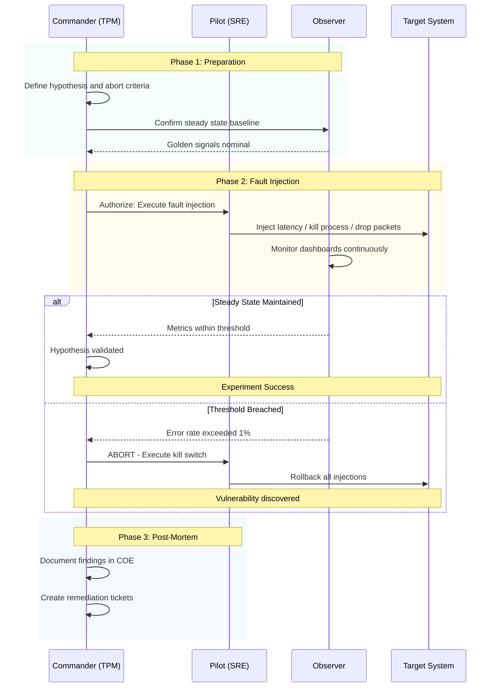

# Chaos Engineering

This guide covers 5 key areas: I. Conceptual Foundation & Strategic Relevance, II. The Mechanics of Execution: GameDays and Blast Radius, III. Testing in Production vs. Staging, IV. Business Impact, ROI, and CX, V. Strategic Tradeoffs and Risks.

## I. Conceptual Foundation & Strategic Relevance

At the Principal level, Chaos Engineering must be framed as **empirical systems verification**. It is the discipline of experimenting on a system to build confidence in its capability to withstand turbulent conditions in production. Unlike traditional testing (verification of known conditions), Chaos Engineering is the exploration of *unknown* conditions.

For a Mag7 TPM, the strategic relevance lies in shifting the organization from a defensive posture (Incident Response) to an offensive posture (Resilience Engineering). You are not just testing code; you are testing the interaction between code, infrastructure, and human operators.

### 1. The Core Thesis: Complexity Defies Mental Modeling

In monolithic architectures, failure modes were generally deterministic and linear. In the distributed, microservice-based architectures typical of Mag7 environments (e.g., Amazon’s Service Oriented Architecture or Google’s Borg ecosystem), failure modes are **stochastic and non-linear**.

*   **The Technical Reality:** No single engineer understands the full state of the system. Latency in a Tier-3 service can cause a retry storm that takes down a Tier-1 authentication service due to cascading failures.
*   **The Principal TPM Value:** You must evangelize that "Hope is not a strategy." You cannot architect away all failures; therefore, you must inject them to ensure the system degrades gracefully.

**Real-World Mag7 Behavior:**
*   **Netflix:** Does not rely on "Chaos Monkey" merely to kill instances. They utilize **Failure Injection Testing (FIT)** platforms to inject latency or error headers into specific requests to verify that fallbacks (e.g., serving static recommendations instead of personalized ones) trigger correctly without user impact.
*   **AWS:** Routinely tests "Region Evacuation." The strategic goal isn't just technical failover, but verifying that *capacity planning* assumptions hold true when traffic shifts instantly from `us-east-1` to `us-west-2`.

### 2. Defining "Steady State" as a KPI

Before breaking anything, a Principal TPM must enforce the definition of "Steady State." This is the control group of the experiment.

*   **Technical Depth:** Steady state is not just "server up." It is defined by business metrics (Golden Signals).
    *   **Latency:** 99th percentile response time.
    *   **Error Rate:** HTTP 5xx rate.
    *   **Saturation:** Queue depth or CPU load.
    *   **Throughput:** Orders per minute or Streams starts per second (SPS).
*   **Strategic Relevance:** If you cannot define steady state, you cannot distinguish between a chaos-induced failure and organic background noise.

**Tradeoffs:**
*   **Business Metrics vs. System Metrics:**
    *   *Choice:* Using CPU/Memory (System) vs. Orders/Streams (Business).
    *   *Tradeoff:* System metrics are faster to detect but noisier; Business metrics are high-signal but may lag.
    *   *Guidance:* Always anchor Chaos experiments to Business Metrics (e.g., "Checkout Success Rate"). High CPU is acceptable if the customer is essentially unaffected.

### 3. The Blast Radius & Budgeting Error Budgets

A Principal TPM is the guardian of the **Blast Radius**—the subset of the system or user base exposed to the experiment.

*   **Governance Strategy:**
    1.  **Scope:** Start with a single canary instance, expand to a cluster, then an Availability Zone (AZ).
    2.  **Abort Conditions:** Automated "Big Red Button." If the steady state deviates beyond a threshold (e.g., >1% error rate increase), the experiment must auto-terminate and rollback.
    3.  **Error Budgets:** Chaos experiments consume Error Budgets. If a team has exhausted their SLA budget for the quarter, they are not allowed to run high-risk chaos experiments until stability is restored.

**Impact on Business/ROI:**
*   **ROI:** The cost of a controlled failure during a GameDay (Tuesday at 10 AM with everyone on deck) is exponentially lower than an uncontrolled failure (Saturday at 3 AM with on-call engineers waking up).
*   **CX:** Prevents "Alert Fatigue." By verifying alerts during GameDays, you ensure that when a pager goes off at night, it is actionable.

### 4. Production vs. Staging: The Fidelity Gap

One of the most contentious strategic decisions a Principal TPM manages is *where* to run these tests.

*   **The Argument for Production:** Staging environments never perfectly mirror production traffic patterns, data density, or network jitter. Testing only in staging provides a false sense of security.
*   **The Argument for Staging:** Injecting failure in production risks revenue and reputation.

**Mag7 Approach:**
*   **Google:** Runs *DiRT (Disaster Recovery Testing)* on live production systems. They accept the risk because the cost of an unknown catastrophic failure outweighs the cost of a controlled degradation.
*   **Microsoft Azure:** Uses "Fault Injection Service" to allow customers to test their own resilience, but internally tests control plane resilience in ring-fenced production segments.

**Tradeoffs:**
*   **Fidelity vs. Risk:**
    *   *Action:* Run Chaos in Production.
    *   *Pro:* Catches the "unknown unknowns" (e.g., config drift between stage/prod).
    *   *Con:* Potential customer impact.
    *   *Mitigation:* Use **Synthetic Traffic** (test accounts) in production first. Only expose real user traffic once synthetic tests pass.

### 5. Organizational Maturity & The "GameDay"

The technical tools (Gremlin, Chaos Mesh, AWS FIS) are secondary to the cultural practice of the **GameDay**.

*   **Role of Principal TPM:** You are the GameDay Master. You organize the scenario, the observers, and the retrospectives.
*   **Strategic Goal:** Verify the *human* system.
    *   Did the dashboard turn red?
    *   Did the on-call engineer have the right access permissions?
    *   Did the runbook actually work?

**Impact on Capabilities:**
*   **Skill Building:** Junior engineers gain confidence in system internals by watching seniors debug controlled failures.
*   **Business Capability:** Moves the organization from "We think we are compliant" to "We proved we are compliant" (crucial for SOC2/FedRAMP audits).

## II. The Mechanics of Execution: GameDays and Blast Radius

### 1. Define Steady State (The Business Baseline)

Before breaking anything, you must quantify "normal." A Principal TPM must pivot the engineering team away from purely infrastructure metrics (CPU, memory) toward business-centric metrics.

*   **The Technical Requirement:** Establish a baseline for key performance indicators (KPIs) over a significant period (e.g., 2 weeks) to account for daily/weekly seasonality.
*   **Mag7 Example:**
    *   **Amazon:** Uses "Orders per Minute." If CPU spikes to 90% but orders flow without latency, the system is healthy. If CPU is 10% but orders drop, the system is failing.
    *   **Netflix:** Uses "SPS" (Stream Starts Per Second). This is the "Pulse" of the company.
*   **Tradeoff:**
    *   *System Metrics vs. Business Metrics:* Relying solely on system metrics (e.g., latency < 200ms) leads to false positives; the system might respond fast with 500 Internal Server Errors. Relying solely on business metrics might mask underlying resource exhaustion that will cause a crash later.
    *   *Decision:* Monitor both, but **abort** experiments based on Business Metrics.

### 2. Formulate the Hypothesis

The experiment must be scientific, not chaotic. The format is: *"If we apply [Fault], we expect [System Behavior], resulting in [Business Impact]."*

*   **Principal TPM Focus:** Ensure the hypothesis tests *resilience*, not just *fragility*. Testing "If I delete the database, the site goes down" is useless. The hypothesis should be: "If the primary database fails, the replica promotes within 45 seconds, and 99% of requests succeed after a retry."
*   **Impact on Capabilities:** This forces engineering teams to explicitly define their SLOs (Service Level Objectives) and RTOs (Recovery Time Objectives) before testing.

### 3. Controlling Blast Radius and Magnitude

This is the most critical area for a Principal TPM. You are the guardian of availability. You must balance the need for realistic signal (testing in prod) against the risk of customer impact.

**The Blast Radius Continuum:**
1.  **Scope (Who is impacted?):**
    *   *Canary/Test Account:* Only internal employee accounts. (Low Risk / Low Fidelity)
    *   *Single Host/Container:* One node in a cluster.
    *   *Availability Zone (AZ):* A full data center failure simulation.
    *   *Region:* (e.g., AWS us-east-1). (High Risk / High Fidelity).
2.  **Magnitude (How hard do we hit?):**
    *   *Latency Injection:* Add 200ms to calls.
    *   *Resource Exhaustion:* Spike CPU to 100%.
    *   *Severance:* Drop network packets or kill processes.

**Mag7 Real-World Behavior:**
*   **Microsoft Azure:** Uses "Fault Domains" to ensure they never test on more than one upgrade domain simultaneously.
*   **Amazon:** Strictly enforces **Cell-Based Architecture**. A GameDay might target "Cell 1" (impacting 5% of customers). If the containment fails and "Cell 2" is impacted, the experiment is an immediate failure of the architecture, regardless of the software bug.

**Strategic Tradeoffs:**
*   **Production vs. Staging:**
    *   *Staging:* Safe, but lacks real traffic patterns, dirty data, and network noise. It yields "False Confidence."
    *   *Production:* The only source of truth.
    *   *Decision:* Principal TPMs push for Production testing but start with a **"Micro-Blast Radius"** (e.g., 0.1% of traffic or specific test cookies) and expand only after automated success gates are passed.

### 4. Orchestrating the GameDay

A GameDay is a synchronized event where the experiment is executed. As a Principal TPM, you are the **Incident Commander** for the planned failure.

**Roles Required:**
*   **Commander (TPM):** Calls the shots, monitors the abort criteria, declares start/stop.
*   **Pilot (SRE/Eng):** Executes the attacks (via scripts or tools like Gremlin/Chaos Mesh).
*   **Scribe:** Documents timestamps, observations, and "aha" moments.
*   **Observer:** Monitors dashboards for the "Steady State" deviations.

**The "Big Red Button" (Abort Conditions):**
You must define precise thresholds for aborting the test immediately.
*   *Example:* If Error Rate > 1% OR Latency > 500ms for > 1 minute -> **ABORT**.
*   *Mag7 Context:* At Google, during DiRT exercises, there is a trusted channel. If a real incident occurs simultaneously, a specific codeword acts as an immediate "Stop the World" command to revert all chaos agents.

**ROI & Business Impact:**
*   **Cost of Downtime:** If a GameDay reveals a flaw that would have caused a 4-hour outage on Black Friday, the ROI is millions of dollars.
*   **Skill Building:** It builds "Muscle Memory." When a real outage happens at 3 AM, the team is less likely to panic because they practiced the remediation during the GameDay at 2 PM.

### 5. Post-Mortem and Remediation

The GameDay is wasted if the findings aren't operationalized.

*   **Success vs. Failure:**
    *   *Success:* The system survived; the hypothesis was proven.
    *   *Failure:* The system broke; the hypothesis was disproven. **(This is actually a win—we found a bug before the customer did).**
*   **The TPM Output:**
    *   **Correction of Error (COE):** Track the fix for the vulnerability found.
    *   **Observability Gap:** If we broke it but didn't get an alert, the action item is to fix the monitoring.
    *   **Runbook Update:** If the manual recovery took too long, automate it.

## III. Testing in Production vs. Staging

### 1. The Strategic Pivot: Why Staging is Insufficient at Scale

At the Mag7 scale, the traditional "Dev -> QA -> Staging -> Prod" pipeline is fundamentally broken for validating resilience and scale. The core axiom for a Principal TPM is: **Staging environments are effectively mocks.** They suffer from three unavoidable deficiencies:

1.  **Data Drift:** You cannot replicate PII/SPI data lawfully or safely in Staging, meaning data volume and shape (cardinality) never match Prod.
2.  **Configuration Drift:** Infrastructure as Code (IaC) reduces this, but subtle differences in network topology, peering, or neighbor noise always exist.
3.  **Traffic Fidelity:** You cannot simulate the chaotic, bursty, irrational behavior of millions of concurrent users via load-testing scripts alone.

**Mag7 Behavior:**
*   **Meta (Facebook):** Does not maintain a full-scale replica of the social graph for testing. Instead, they rely heavily on **Gatekeeper** (feature flagging) and **Scuba** (observability) to test changes on small percentages of production users.
*   **Amazon:** Promotes the philosophy that "Staging is a lie." While unit and integration tests happen pre-prod, the validation of service interactions often happens via **One-Box deployments** (deploying to a single production host) before scaling to the full fleet.

**Tradeoff Analysis:**
*   *Choice:* Abandoning high-fidelity Staging for TiP.
*   *Pros:* Zero "it works on my machine" incidents; immediate feedback on real-world performance; massive cost savings (not duplicating infrastructure).
*   *Cons:* Requires sophisticated tooling (automated rollbacks, segmentation); higher risk of impacting real users if guardrails fail.

### 2. Techniques for Safe Testing in Production

For a Principal TPM, the goal is to decouple **Deployment** (binary movement) from **Release** (feature exposure). This allows testing in production with a controlled Blast Radius.

#### A. Traffic Shadowing (Dark Launching)
Traffic Shadowing duplicates incoming production requests and sends a copy to the new version of the service (the "shadow"). The shadow processes the request, but the response is discarded—only the response from the current stable version is returned to the user.

*   **Mag7 Context:** Google often uses this when upgrading core search infrastructure or RPC subsystems (gRPC upgrades). They compare the latency and error rates of the shadow fleet against the live fleet without the user knowing.
*   **TPM Focus:** You must ensure the shadow traffic does not trigger side effects (e.g., double charging a credit card or sending duplicate emails). This requires "Mock" downstream dependencies for the shadow fleet.
*   **ROI/Impact:** zero-risk validation of performance at scale.

#### B. Canary Releases & Phased Rollouts
Instead of a "Big Bang" deployment, traffic is shifted incrementally (1% -> 5% -> 25% -> 100%).

*   **Mag7 Context:** AWS deployment pipelines (Apollo) enforce this rigidly. A deployment starts in a "Canary" region/zone. If health metrics (CloudWatch) deviate from the baseline, the rollout is automatically halted and rolled back.
*   **TPM Focus:** Defining the **Baking Time**. How long must the 1% canary run before promoting to 5%? A Principal TPM balances Velocity (fast deploys) vs. Confidence (long bake times to catch memory leaks).

#### C. Synthetic Transactions
Injecting artificial user behaviors into the production system to verify availability and correctness continuously.

*   **Mag7 Context:** Amazon Retail runs "Canary Bots" that continuously browse items, add them to carts, and attempt checkout (without charging real money) to ensure the critical path is up.
*   **Tradeoff:** Synthetics only test known paths (the "Happy Path"). They do not catch edge cases caused by weird user inputs.

### 3. Managing Data Isolation and Multi-Tenancy

The biggest risk in TiP is data pollution—mixing test data with financial or customer records. A Principal TPM must drive the architecture for **Test Tenancy**.

**The "Test User" Header Approach:**
Requests originating from internal tests are tagged with specific headers (e.g., `X-Test-Traffic: true`).

1.  **Propagation:** Every microservice must forward this header.
2.  **Handling:**
    *   **Reads:** Process normally.
    *   **Writes:** Write to a shadow table, a specific "Test" tenant partition, or mock the external write entirely (e.g., the payment gateway returns "Success" without calling Visa).

**Tradeoff Analysis:**
*   *Approach:* Building "Test Tenancy" logic into application code.
*   *Risk:* Code complexity increases. If a developer forgets to check the header, test data corrupts production analytics or, worse, triggers real-world logistics (e.g., shipping a test product).
*   *Mitigation:* TPMs must mandate automated regression tests that specifically check for header propagation and data routing isolation.

### 4. Business Impact and ROI

Shifting from Staging-heavy to Prod-heavy testing changes the organization's economic profile.

*   **CapEx/OpEx Efficiency:** Reducing the size of Staging environments releases millions of dollars in compute capacity.
*   **Mean Time to Recovery (MTTR):** TiP forces teams to build better observability. If you test in prod, you *must* be able to detect issues in seconds. This reflex improves general incident response.
*   **Developer Velocity:** Removes the bottleneck of "Waiting for Staging." Developers deploy when ready, relying on feature flags to keep code dormant until tested.

### 5. Governance and Rules of Engagement

As a Principal TPM, you own the governance model. You must establish the **"Do No Harm"** framework:

1.  **Blockout Windows:** No TiP experiments during peak trading hours (e.g., Black Friday for Amazon, Election Night for Twitter/X).
2.  **Stop-Buttons:** Every TiP experiment must have an automated "Kill Switch" that reverts state immediately upon breaching error thresholds.
3.  **Communication:** Customer Support (CS) must be aware of active experiments. If a user calls about a weird UI glitch, CS needs to know if they are part of a 1% test group.

## IV. Business Impact, ROI, and CX

### 1. The Economics of Resilience: Calculating ROI

For a Principal TPM at a Mag7, Chaos Engineering is a financial instrument. The primary objective is to convert the abstract concept of "reliability" into a quantifiable currency: **The Cost of Downtime (CoD)**.

**The Financial Equation:**
You must articulate that the cost of a Chaos Engineering program (tooling + engineering hours + potential GameDay disruptions) is significantly lower than the cost of the unplanned outages it prevents.

*   **Mag7 Context:** At Amazon, during Prime Day, the Cost of Downtime is estimated in the hundreds of thousands of dollars *per minute*. A 20-minute outage on the "Add to Cart" service is not an engineering annoyance; it is a material impact on quarterly earnings.
*   **The Calculation:**
    $$ROI = \frac{(\Delta \text{Outage Frequency} \times \text{Avg Outage Cost}) + (\Delta \text{MTTR} \times \text{Cost per Minute})}{\text{Cost of Chaos Implementation}}$$
*   **Trade-offs:**
    *   *Investment vs. Risk:* Implementing Chaos Engineering in non-critical "Tier-3" internal tools often yields negative ROI. The TPM must enforce that high-effort resilience testing is reserved for "Tier-1" revenue-generating paths (e.g., Checkout, Authentication, Ad Serving).
    *   *False Positives:* Aggressive chaos testing can trigger alarms that wake up on-call engineers for non-issues, leading to "alert fatigue." The trade-off is tuning sensitivity versus missing real signals.

### 2. CX Impact: Graceful Degradation and "The Fallback"

In a distributed system, 100% uptime is mathematically impossible. The goal of Chaos Engineering regarding CX is not just uptime, but **Graceful Degradation**. This ensures that when a dependency fails, the user experience is diminished but not destroyed.

**Mag7 Real-World Behavior:**
*   **Netflix:** If the personalized recommendation microservice fails (verified via chaos injection), the system falls back to a static, cached list of "Popular in Your Region." The user sees content and can play video; they just don't get hyper-personalization. The business retains the engagement.
*   **Amazon:** If the dynamic pricing engine experiences latency or failure, the system may default to the last known price or a safe base price rather than blocking the sale.

**Principal TPM Action:**
You drive the definition of these fallback states with Product Managers. You ask: "If the search bar fails, do we show a blank page, or do we show category navigation?" Then, you use GameDays to verify that the fallback actually triggers.

**Impact on Capabilities:**
*   **Business Capability:** Preserves revenue streams during partial outages.
*   **CX Capability:** Maintains user trust. Users tolerate a slower site; they do not tolerate a crashed site.

### 3. Operational Maturity and Engineering Velocity

Paradoxically, breaking things makes development faster. A robust Chaos Engineering practice creates a "Safety Net" culture.

**The Velocity Connection:**
When engineers know that the CI/CD pipeline and the production environment are constantly being stress-tested for resilience, they are less fearful of pushing code.
*   **Mag7 Context (Google):** The SRE model relies on the concept of an **Error Budget**. Chaos Engineering consumes this budget intentionally. If a team burns their budget during a GameDay, they freeze feature launches. This enforces a self-correcting mechanism where velocity is throttled only when reliability drops.
*   **Skill Impact:** It shifts the engineering skillset from "firefighting" (reactive) to "resilience engineering" (proactive). Junior engineers learn system dependencies rapidly during GameDays without the pressure of a real outage.

**Trade-offs:**
*   *Short-term Velocity vs. Long-term Stability:* Implementing chaos experiments requires significant upfront coding (writing the faults, automating the recovery checks). Product leadership often views this as "non-feature work." The TPM must defend this as an investment in future velocity (reducing unplanned work).

### 4. Strategic Risk: Compliance and SLA Enforcement

For Mag7 companies serving enterprise customers (AWS, Azure, Google Cloud), reliability is a contractual obligation defined in Service Level Agreements (SLAs).

**The Principal TPM Role:**
You use Chaos Engineering to validate that the architecture can actually meet the sold SLA (e.g., 99.99%).
*   **Scenario:** If you sell a Multi-AZ (Availability Zone) database service, you must run chaos experiments that sever the network link between AZs to prove the failover happens within the contractually agreed time (e.g., <30 seconds).
*   **Business Impact:** Failure to meet SLAs results in Service Credits (refunding money to customers). Chaos Engineering directly reduces the liability of paying out Service Credits.

**Edge Cases & Failure Modes:**
*   **The "Zombie" Experiment:** A chaos agent that fails to terminate and continues injecting faults after the GameDay ends.
    *   *Mitigation:* All chaos tools must have a "Big Red Button" (dead man's switch) that immediately stops all activity and rolls back state.
*   **State Corruption:** Injecting failure into a database write-path can corrupt customer data if not handled transactionally.
    *   *Mitigation:* sophisticated chaos testing on data layers is usually restricted to non-production (staging) environments or uses "canary" accounts in production that do not affect real user data.

## V. Strategic Tradeoffs and Risks

### 1. The "Velocity Tax" vs. The "Reliability Asset"

At the Principal level, the most significant strategic friction is the perceived conflict between feature velocity and reliability engineering. Product leadership often views Chaos Engineering as a "tax"—a consumption of engineering hours that delays the roadmap.

**The Strategic Choice:**
Do you mandate Chaos Engineering as a "Definition of Done" (DoD) requirement, or do you treat it as technical debt remediation to be prioritized later?

*   **Mag7 Behavior:**
    *   **Amazon:** Operates on a "You build it, you run it" model. If a team's service causes an outage, feature development is often frozen (via the Correction of Error/COE process) until resilience is proven. Here, the "tax" is mandatory and immediate.
    *   **Google:** Uses **Error Budgets**. If a service has ample Error Budget (i.e., high uptime recently), the TPM pushes for feature velocity. If the budget is burned (potentially by a failed Chaos experiment), releases are frozen, and the focus shifts entirely to reliability.

*   **Tradeoffs:**
    *   **Mandatory Chaos (Shift Left):**
        *   *Pro:* Drastically reduces Mean Time to Recovery (MTTR) and prevents "pagers from ringing" at 2 AM, preventing team burnout. High ROI on long-term developer productivity.
        *   *Con:* Increases initial Time to Market (TTM) by 10-15% per feature due to the complexity of designing failure tests.
    *   **Retroactive Chaos (Fix it Later):**
        *   *Pro:* Faster initial release; captures early market feedback.
        *   *Con:* "Technical Bankruptcy." In distributed systems, retrofitting resilience (e.g., adding idempotency or circuit breakers) often requires re-architecting the data layer, which is infinitely more expensive than building it right initially.

*   **Impact on Capabilities:**
    *   **Business:** Mandatory chaos aligns engineering output with SLA guarantees.
    *   **Skill:** Forces developers to understand system architecture, not just their specific microservice logic.

### 2. Testing in Production (TiP) vs. Synthetic Staging

The scariest proposition for stakeholders is running chaos experiments in the production environment. A Principal TPM must navigate the risk tolerance of the organization.

**The Strategic Choice:**
Do we restrict Chaos to Staging/Gamma environments to protect the customer experience (CX), or do we accept the risk of Prod testing to ensure validity?

*   **Mag7 Behavior:**
    *   **Netflix:** Heavily biased toward Production. They acknowledge that Staging environments never possess the same data volume, network latency variability, or "noisy neighbor" issues as Production.
    *   **Microsoft (Azure):** Uses "Safe Deployment Practices" (SDP). They perform fault injection in production but limit the **Blast Radius** using ring-based deployments. They might inject latency into Ring 0 (internal users) or Ring 1 (early adopters) before touching general availability.

*   **Tradeoffs:**
    *   **Staging Only:**
        *   *Pro:* Zero risk to active revenue/CX. Easy stakeholder approval.
        *   *Con:* **The Illusion of Safety.** Passing a chaos test in Staging yields a false positive rate estimated between 40-60% because Staging lacks the complex emergent behaviors of Prod (e.g., thundering herd scenarios).
    *   **Production (with Blast Radius Control):**
        *   *Pro:* 100% fidelity. If it survives here, it survives reality.
        *   *Con:* Requires sophisticated observability and "Big Red Button" (automatic rollback) capabilities. If these fail, you cause a global outage (High Business Risk).

*   **Impact on ROI:**
    *   Testing in Staging often results in "wasted engineering hours" fixing bugs that wouldn't happen in Prod, while missing the bugs that actually cause outages.

### 3. Automated Randomness vs. Targeted GameDays

Should Chaos be a background daemon (like the original Chaos Monkey) that attacks randomly, or a structured, human-mediated event (GameDay)?

**The Strategic Choice:**
Automation scales coverage but risks unmonitored degradation. GameDays build culture but are expensive to organize.

*   **Mag7 Behavior:**
    *   **Meta:** Uses targeted "Storm" exercises (GameDays) for critical infrastructure (like the Hack language runtime or core database layers) where human analysis is required to understand *why* a fallback happened.
    *   **AWS:** heavily relies on GameDays for new services. Before a service goes GA, the team must demonstrate resilience to specific failure modes (e.g., Availability Zone loss) in front of Principal Engineers.

*   **Tradeoffs:**
    *   **Automated/Random:**
        *   *Pro:* Prevents configuration drift. Ensures that a fix implemented in January still works in July.
        *   *Con:* Can create "Alert Fatigue." If the chaos agent triggers minor alerts constantly, on-call engineers may become desensitized to real incidents.
    *   **Targeted GameDays:**
        *   *Pro:* **Cultural Impact.** It gathers Product, Eng, and Ops in a room. It turns a technical exercise into a training ground for incident management.
        *   *Con:* Low frequency. You might only test a specific failure path once a quarter.

### 4. The "Fallacy of Graceful Degradation"

A critical risk is assuming that "Graceful Degradation" (e.g., showing a cached homepage instead of a 500 error) is acceptable to the business.

**The Strategic Choice:**
Defining what constitutes a "successful" failure.

*   **Mag7 Context:**
    *   For **Amazon Retail**, if the recommendation engine fails, showing a generic list of "Top Sellers" is a successful degradation. Revenue continues.
    *   For **Google Cloud Spanner**, data consistency is paramount. If a transaction cannot be guaranteed, the system must fail hard (unavailable) rather than degrade soft (inconsistent data).

*   **TPM Action:**
    *   You must negotiate the **Business Continuity Plan (BCP)**.
    *   *Risk:* If you implement a fallback that preserves uptime but corrupts data (e.g., failing over to a read-replica that is lagging significantly), the cleanup cost (ROI hit) is massive compared to a few minutes of downtime.
    *   *Tradeoff:* Availability vs. Consistency (CAP Theorem). The TPM ensures the Chaos Experiment verifies the *correct* side of this tradeoff.

---

## Interview Questions

### I. Conceptual Foundation & Strategic Relevance

### Question 1: Strategic Prioritization & Risk
"You are the TPM for a critical payments platform. The engineering team wants to implement Chaos Engineering in production to improve reliability, but the VP of Product is blocking it, citing the risk of downtime during peak trading hours. How do you resolve this conflict and what is your strategy for rollout?"

**Guidance for a Strong Answer:**
*   **Acknowledge the Risk:** Validate the VP's concern. Production impact on payments is non-negotiable.
*   **Reframe the Narrative:** Shift from "breaking things" to "verifying resilience." Use data: "We had 3 outages last year costing $X. Chaos aims to reduce that by Y%."
*   **Propose a Phased Strategy:**
    1.  **GameDay in Staging:** Prove the tools and safety mechanisms (abort buttons) work.
    2.  **Synthetic Prod:** Run chaos on test accounts in production (no real money touched).
    3.  **Canary Deployment:** Run chaos on 1% of traffic during low-volume hours, not peak trading.
*   **Governance:** Define specific "Stop-the-line" criteria (e.g., if latency > 200ms, auto-stop).

### Question 2: Handling Failure & Post-Mortem
"During a planned Chaos Engineering experiment that you organized, the 'Big Red Button' failed to stop the experiment, and it caused a 20-minute partial outage affecting 5% of users. The engineering team is demoralized and leadership wants to ban future experiments. How do you handle the aftermath?"

**Guidance for a Strong Answer:**
*   **Immediate Ownership:** Do not blame the tool. As the TPM, you own the process governance.
*   **Incident Response:** Treat the failed experiment exactly like an unplanned outage (SEV-1). Run the standard incident management protocol.
*   **The Post-Mortem (COE):**
    *   Focus on the *meta-failure*: Why did the abort mechanism fail? The failure of the safety mechanism is a more valuable finding than the service failure itself.
    *   *Key Insight:* The experiment was actually a "success" because it exposed a critical flaw in the safety tooling that would have failed during a real automated remediation event.
*   **re-Entry Plan:** Propose a freeze on *new* experiments until the safety mechanism is fixed and verified. Do not accept a permanent ban; argue that this incident proves exactly *why* we need to test our controls.

### II. The Mechanics of Execution: GameDays and Blast Radius

### Question 1: Balancing Risk and Velocity
**"We have a major product launch in three weeks. The Engineering Lead wants to run a high-risk GameDay to test regional failover in Production. The Product VP is strictly against it, fearing it will destabilize the platform and delay the launch. As the Principal TPM, how do you resolve this conflict?"**

**Guidance for a Strong Answer:**
*   **Acknowledge the tension:** Validate both sides. Stability is crucial for launch (Product view), but untested failover is a latent risk that could kill the launch (Eng view).
*   **Propose the "Blast Radius" compromise:** Do not accept a binary "Yes/No." Propose a reduced blast radius test (e.g., Synthetic traffic only, or Staging environment with traffic replay).
*   **Risk Quantification:** Shift the conversation to data. "If we don't test this, and Region A fails on launch day, what is the RTO?" If the answer is "unknown," that is an unacceptable launch risk.
*   **Governance:** Establish strict abort criteria and a "Go/No-Go" date. If the GameDay isn't done by T-minus-10 days, we freeze code and accept the risk, but document it.

### Question 2: Failed GameDay Management
**"You are leading a GameDay testing database latency. You injected a 100ms delay. Suddenly, customer support tickets spike, reporting total inability to checkout. The dashboard metrics, however, look green/normal. What do you do?"**

**Guidance for a Strong Answer:**
*   **Immediate Action:** **ABORT immediately.** Customer impact trumps dashboard metrics. Do not spend time investigating *why* metrics are green while customers are suffering.
*   **Rollback Verification:** Confirm the fault injection has ceased and systems have returned to steady state.
*   **Investigation (The "Why"):** This highlights an **Observability Failure**. The metrics were measuring the wrong thing (or measuring averages that masked tail latency).
*   **Post-Mortem focus:** The primary action item is not just fixing the latency handling, but fixing the *monitoring* so that future dashboards accurately reflect customer pain. This demonstrates a Principal-level understanding that "Green Dashboards" are irrelevant if the CX is broken.

### III. Testing in Production vs. Staging

**Question 1: The Risk-Averse Stakeholder**
"We are planning to deprecate our full-scale staging environment to save costs and move to Canary deployments and Testing in Production. The VP of Sales is terrified this will cause outages for enterprise clients. As the Principal TPM leading this transition, how do you manage this stakeholder and execute the migration?"

*   **Guidance for a Strong Answer:**
    *   **Acknowledge valid fear:** Do not dismiss the risk. Validate that outages impact revenue.
    *   **Shift the framing:** Explain that Staging is *currently* a risk because it gives false confidence (it doesn't match Prod).
    *   **Mitigation Strategy:** Propose "Tenant Pinning." Enterprise clients will be "pinned" to the stable version of the software, while internal users and free-tier users act as the canaries for the new version.
    *   **Metrics:** Define success not just by cost savings, but by "Reduction in Sev1 incidents caused by config drift."

**Question 2: The Data Corruption Incident**
"During a 'Testing in Production' exercise using synthetic traffic, a configuration error caused the test data to be written to the live production database, messing up the quarterly financial reporting dashboard. You are the TPM owner of the Reliability program. Walk us through your immediate response and the long-term fix."

*   **Guidance for a Strong Answer:**
    *   **Incident Command:** Immediately stop the test (Stop the bleeding). Declare an incident.
    *   **Triage/Recovery:** Work with Data Engineering to identify the specific transaction IDs (using the test headers) and scrub/revert the data.
    *   **Root Cause (The "Why"):** Move beyond "human error." Why did the system allow a write without validating the `X-Test` header?
    *   **Systemic Fix:** implementing "Guardrails at the Storage Layer." The database itself should reject writes from test accounts if they target production tables, or middleware should automatically route these based on the header, removing reliance on individual application developers to write `if/else` logic.

### IV. Business Impact, ROI, and CX

**Question 1: The ROI Challenge**
"Our VP of Engineering wants to cut the Chaos Engineering budget, arguing that we haven't had a major outage in 18 months, so the system is stable. As a Principal TPM, how do you counter this argument without relying on fear-mongering?"

*   **Guidance for a Strong Answer:**
    *   **Identify the Fallacy:** Acknowledge that lack of outages $\neq$ stability; it could mean luck or lack of detection.
    *   **Shift to Value:** Pivot from "preventing outages" to "accelerating velocity." Explain that the current stability allows the team to push harder/faster, but only because the safety net exists. Removing it will force engineers to be more conservative, slowing down feature delivery.
    *   **Metric-Driven Defense:** Propose a "control group" experiment or reference the "Cost of Downtime" data. Calculate the cost of a single potential outage (which becomes more likely as the system drifts) vs. the program cost.
    *   **Drift:** Explain that software rots. Dependencies change, traffic patterns shift. The chaos program validates that the system *as it exists today* (not 18 months ago) is resilient.

**Question 2: Prioritization and Trade-offs**
"We are launching a critical new feature for Q4. The engineering team is behind schedule. They want to skip the planned Chaos GameDay for this feature to hit the launch date. The Product Manager agrees. What do you do?"

*   **Guidance for a Strong Answer:**
    *   **Assess Risk Profile:** Do not give a binary "No." Analyze the feature. Is it on the critical path? Is it Tier-1?
    *   **Negotiate Scope:** If it is Tier-1, you cannot skip resilience testing, but you can reduce scope. Propose a "Light GameDay" testing only the most critical failure modes (e.g., database failover) rather than the full suite.
    *   **Launch with Guardrails:** If the deadline is immovable, propose launching behind a Feature Flag to a limited percentage of users (Canary Release) effectively using the initial rollout as the test, but with strict rollback criteria.
    *   **Document the Debt:** If overruled, ensure the risk is documented as "Operational Debt" with a hard deadline to execute the GameDay immediately post-launch. Make the stakeholders sign off on the risk acceptance.

### V. Strategic Tradeoffs and Risks

### Q1: "We are launching a critical new payment service next month. The Engineering Lead wants to delay the launch by two weeks to run a series of Chaos GameDays. Product leadership is furious about the delay. As the Principal TPM, how do you resolve this conflict?"

**Guidance for a Strong Answer:**
*   **Acknowledge the tension:** Validate both sides. Velocity matters for market capture; reliability matters for trust/revenue.
*   **Quantify the Risk:** Move the conversation from "feelings" to "data." Ask: "What is the cost of downtime per minute?" vs. "What is the cost of delay?"
*   **Propose a Compromise (The "Mag7 Way"):** Suggest launching with "Feature Flags." Release on time but keep the feature dark or limited to 1% of traffic (Canary). Run Chaos on that 1% slice in production.
*   **Introduce Error Budgets:** Frame the decision around the service's reliability targets. If the service is new, it has no history, so we must establish a baseline confidence level before hitting 100% traffic.
*   **Outcome:** The goal is not to block launch, but to gate *exposure*. Launch to small traffic, break it, fix it, then scale.

### Q2: "You orchestrated a Chaos Experiment in production that was supposed to be contained, but it escaped the blast radius and caused a 20-minute outage for 10% of our users. What are your immediate and long-term actions?"

**Guidance for a Strong Answer:**
*   **Immediate (Incident Command):** First, stop the bleeding. Initiate the "Big Red Button" to halt the experiment immediately. Do not debug; rollback. Communicate clearly to stakeholders (Status Page).
*   **The Post-Mortem (COE):** Lead a blameless post-mortem. The focus is *process failure*, not *human error*.
    *   *Why* did the containment fail? (e.g., Did a retry storm bypass the traffic filter?)
    *   *Why* did observability not catch it sooner?
*   **Strategic Adjustment:** Do not ban Chaos Engineering. That is the wrong lesson.
    *   **Action:** Tighten the "Rules of Engagement." Perhaps experiments now require approval from a Principal Engineer, or we invest in better fault injection tooling that enforces stricter isolation (e.g., sidecar injection vs. network level).
    *   **ROI Defense:** Remind leadership: "Better we found this vulnerability now during a controlled 20-minute window than on Black Friday when it could have been a 4-hour outage."

---

## Key Takeaways

- Review each section for actionable insights applicable to your organization

- Consider the trade-offs discussed when making architectural decisions

- Use the operational considerations as a checklist for production readiness
