# Chaos Engineering & Resilience Testing

At Mag7 scale, preventing failure is mathematically impossible—with millions of servers and thousands of microservices, components exist in constant partial failure. The strategic objective shifts from prevention to resilience: maintaining availability despite component failure. Chaos Engineering is the forcing function that validates whether your circuit breakers actually open, your failovers actually work, and your systems actually degrade gracefully. This guide covers the technical frameworks, governance models, and cultural transformations that make controlled chaos a competitive advantage.

## I. Strategic Context: Why Mag7 Companies Embrace Chaos

At the scale of Mag7 infrastructure, the traditional model of "preventing failure" is mathematically impossible. With millions of commodity servers, thousands of network switches, and countless interdependent microservices, components are in a constant state of partial failure. For a Principal TPM, the strategic objective shifts from **Prevention** (keeping everything up) to **Resilience** (maintaining service availability despite component failure).

Chaos Engineering is the strategic mechanism to validate that architectural assumptions (e.g., "the database failover will happen in under 30 seconds") match production reality. It is a forcing function for architectural hygiene.

### 1. The ROI of Reliability: Cost of Downtime vs. Cost of Resilience
A Principal TPM must articulate the business case for Chaos Engineering. It is capital-intensive to build control planes that safely inject failure, and it consumes engineering cycles to run Game Days. The justification lies in the "Cost of Downtime" equation.

*   **Real-World Behavior:**
    *   **Amazon:** During Prime Day, the cost of downtime is calculated in millions of dollars per minute. Amazon TPMs enforce "Game Days" where teams must prove their service handles dependency latency or failure. If a Tier-1 service cannot survive the loss of an Availability Zone (AZ) in a pre-prod environment, it is blocked from deployment.
    *   **Meta:** Uses the "Storm" project to simulate massive data center failures. The ROI is measured not just in uptime, but in **operational overhead reduction**. By automating recovery, they reduce the need for on-call engineers to manually intervene during incidents.

*   **Tradeoffs:**
    *   **Velocity vs. Reliability:** Enforcing chaos testing gates slows down feature release cycles initially. The tradeoff is a deliberate reduction in short-term velocity for a reduction in long-term operational toil and reputational risk.
    *   **Resource Allocation:** Building a Chaos Platform (like Netflix's ChAP) requires a dedicated platform team. This diverts headcount from product feature teams.

*   **Business Impact:**
    *   **ROI:** Reduction in SEV-1 incidents translates directly to revenue preservation and SLA credit avoidance.
    *   **CX:** Users experience "graceful degradation" (e.g., Netflix showing a static list of movies rather than a 500 error) rather than hard outages.

### 2. Validating Distributed System Patterns
Microservices introduce network complexity. A Principal TPM uses Chaos Engineering to verify that specific distributed system patterns are correctly implemented. It is insufficient to say "we use circuit breakers"; you must prove they open and close correctly under load.

*   **Real-World Behavior:**
    *   **Microsoft Azure:** Validates "Bulkheading." If the storage layer in one region degrades, does it drag down the compute layer in another due to thread-pool exhaustion? Chaos testing injects latency to ensure failures are contained within their specific "bulkhead" or partition.
    *   **Google:** Focuses on "Thundering Herd" prevention. When a service recovers from a crash, all clients often reconnect simultaneously, crashing it again. Google runs DiRT exercises to verify that **Exponential Backoff and Jitter** logic is correctly implemented in client SDKs.

*   **Tradeoffs:**
    *   **Complexity vs. Safety:** Implementing robust patterns (Circuit Breakers, Bulkheads, Fallbacks) significantly increases code complexity and testing surface area.
    *   **False Positives:** Poorly designed chaos experiments can trigger alerts that look like real outages, causing "alert fatigue" for on-call teams.

*   **Business Impact:**
    *   **Business Capability:** Enables the business to offer stricter SLAs (Service Level Agreements) to enterprise customers, a key differentiator in the Cloud Wars.

### 3. Cultural Transformation: The "Blameless" Posture
Strategic implementation of Chaos Engineering requires a psychological shift in the engineering organization. As a Principal TPM, you are managing the transition from "fear of touching production" to "confidence in automated recovery."

*   **Real-World Behavior:**
    *   **Netflix:** The culture is built around "Production is the only environment that matters." Because synthetic traffic in staging never perfectly mimics user behavior, they run controlled chaos experiments in production. This forces developers to design stateless, ephemeral services. If a server can disappear at any moment, you stop storing session data locally.
    *   **Salesforce:** Implements "Red Teaming" where internal teams actively try to break logical flows or security boundaries, validating not just infrastructure, but logic resilience.

*   **Tradeoffs:**
    *   **Risk of Customer Impact:** Testing in production carries the inherent risk of actually impacting users.
    *   **Mitigation:** TPMs must enforce strict **Blast Radius** constraints (e.g., "Experiments can only affect 1% of non-paying users" or "Canary deployments only").

*   **Business Impact:**
    *   **Skill Acquisition:** Engineers develop a "System Thinking" mindset, understanding upstream and downstream dependencies rather than just their isolated codebase.
    *   **Organizational Agility:** Teams stop fearing deployments. High-performing Mag7 teams deploy thousands of times a day because they trust the safety net validated by chaos.

### 4. Compliance and "black swan" Preparation
Mag7 companies power the world's financial, medical, and governmental infrastructure. Chaos Engineering is often a requirement for regulatory compliance (e.g., SOC2, FedRAMP, DORA).

*   **Real-World Behavior:**
    *   **AWS:** Must prove to financial regulators that they can withstand a regional outage. They don't just simulate this on paper; they physically sever connections or power down racks during audit windows (or simulated equivalents via control plane) to prove data durability obligations are met.

*   **Tradeoffs:**
    *   **Transparency vs. Security:** Detailed reports on how systems fail can be sensitive. Balancing what to share with auditors/customers vs. protecting internal architecture is a delicate TPM responsibility.

*   **Business Impact:**
    *   **Market Access:** Ability to sell to government (DoD) and FinServ sectors depends entirely on verifiable resilience.

## II. The Technical Framework: Fault Injection & Blast Radius

### 1. The Control Plane: Architecture of Injection

At a Mag7 level, chaos is rarely run via ad-hoc scripts. It is managed via a centralized **Control Plane** (e.g., AWS Fault Injection Simulator, Azure Chaos Studio, or internal proprietary tools like Netflix’s FIT). As a Principal TPM, you must advocate for a platform approach rather than one-off testing to ensure auditability and safety.

**Technical Implementation:**
The Control Plane acts as the orchestrator. It does not execute the failure itself but instructs agents or middleware to do so.
*   **The Agent Model:** A daemon sits on the host (e.g., sidecar in Kubernetes or agent on EC2). The Control Plane signals the agent to consume CPU, block I/O, or kill the process.
*   **The Middleware/Library Model:** Fault injection libraries are compiled into the service code or injected via a service mesh (e.g., Istio/Envoy). This allows for more granular "Application Layer" attacks, such as throwing specific HTTP 500 errors or adding latency to specific API calls.

**Mag7 Real-World Example:**
*   **Netflix (FIT - Failure Injection Testing):** Moves beyond random instance killing (Chaos Monkey) to precise request-level failure. They propagate a "failure context" header in requests. If a request is tagged for chaos, deep microservices respect that tag and trigger specific latencies or errors, ensuring the blast radius is limited to specific test users or devices.

**Tradeoffs:**
*   **Agent vs. Sidecar:** Agents on the host (Infrastructure layer) are language-agnostic but lack visibility into application logic. Sidecars/Libraries (Application layer) allow precise logic testing but introduce dependency overhead and potential latency in the data path.
*   **Build vs. Buy:** Building an internal control plane (common in Google/Meta) allows deep integration with proprietary deployment systems but requires a dedicated platform team (high OpEx). Using managed services (AWS FIS) reduces maintenance but limits testing to the cloud provider's supported failure types.

**Business Impact:**
*   **Standardization:** A centralized control plane creates a "paved road," allowing product teams to opt-in to resilience testing without reinventing tooling.
*   **Compliance:** Provides an immutable audit trail of what was tested, when, and the result, which is critical for SOC2 and ISO certifications.

### 2. Taxonomy of Faults: The 3 Layers

A Principal TPM must ensure the testing strategy covers the full stack, not just easy infrastructure kills.

**A. Infrastructure Layer (The "Hardware" Failures)**
*   **Action:** Terminate VM/Pod, sever network link, unmount disk.
*   **Goal:** Prove that the orchestrator (K8s/Borg) correctly reschedules workloads and that the application handles the startup/shutdown lifecycle gracefully.
*   **Mag7 Behavior:** Google's DiRT exercises physically disconnecting power to racks to validate battery backups and failover logic.

**B. Network Layer (The "Dependency" Failures)**
*   **Action:** Packet loss, increased latency (jitter), DNS resolution failure, blackhole traffic.
*   **Goal:** Validate timeouts and retries. This is critical. If Service A calls Service B, and Service B hangs, Service A must timeout quickly to prevent thread-pool exhaustion (Cascading Failure).
*   **Mag7 Behavior:** Amazon enforces strict timeout budgets. Chaos tests inject latency exactly at the timeout threshold (e.g., if timeout is 200ms, inject 201ms latency) to ensure the calling service actually cuts the connection.

**C. Application Layer (The "Logic" Failures)**
*   **Action:** Inject specific exceptions (e.g., `DatabaseReadOnlyException`), malformed responses, or corrupt data.
*   **Goal:** Test specific error handling logic and fallback experiences (e.g., serving cached content when the live DB is unreachable).

**Tradeoffs:**
*   **Complexity vs. Value:** Infrastructure faults are easy to automate but catch fewer high-severity bugs in mature systems. Application layer faults yield the highest ROI (catching logic bugs) but require deep code integration and maintenance.

### 3. Blast Radius Engineering

The **Blast Radius** is the maximum subset of the system or user base that can be impacted by a chaos experiment. As a Principal TPM, you own the governance of this radius. You never start with 100%.

```mermaid
flowchart TB
    subgraph Expansion["Blast Radius Expansion Strategy"]
        direction TB
        L1["🔬 Synthetic Traffic<br/>0% User Impact"]
        L2["📦 Single Instance/Pod<br/>~0.1% User Impact"]
        L3["🏢 Availability Zone<br/>~33% User Impact"]
        L4["🌍 Region<br/>~50% User Impact"]

        L1 -->|"✓ Pass"| L2
        L2 -->|"✓ Pass"| L3
        L3 -->|"✓ Pass"| L4
    end

    subgraph Risk["Risk Assessment"]
        R1["Low Risk<br/>Safe but unrealistic"]
        R2["Medium Risk<br/>Production-like"]
        R3["High Risk<br/>Requires proven failover"]
        R4["Critical Risk<br/>Usually tabletop only"]
    end

    L1 ~~~ R1
    L2 ~~~ R2
    L3 ~~~ R3
    L4 ~~~ R4

    style L1 fill:#d4edda,stroke:#155724
    style L2 fill:#d1ecf1,stroke:#0c5460
    style L3 fill:#fff3cd,stroke:#856404
    style L4 fill:#f8d7da,stroke:#721c24
```

**The Expansion Strategy (The "Canary" Approach):**
1.  **Scope: Synthetic Traffic (0% User Impact):** Run experiments on test accounts or non-production environments.
    *   *Tradeoff:* Safe, but often fails to model the noise and concurrency of production.
2.  **Scope: Single Instance/Pod:** Attack one redundant node.
    *   *Tradeoff:* If the load balancer works, user impact is zero. If it fails, only a tiny fraction of requests drop.
3.  **Scope: Availability Zone (AZ):** Simulate a full AZ failure.
    *   *Tradeoff:* High risk. Requires proven cross-AZ failover.
4.  **Scope: Region:** (Rarely done in active chaos, usually a tabletop exercise).

**Advanced Technique: User Sharding**
Mag7 companies often shard users into "Cells" or "Partitions."
*   **Example:** Uber or DoorDash might run chaos experiments only on a specific city or a specific segment of User IDs.
*   **Business Capability:** This limits the "Business Blast Radius." If the experiment fails, you lose 1% of revenue for 5 minutes, rather than destabilizing the global platform.

### 4. Safety Systems: The "Big Red Button"

You cannot rely on human reaction time to stop a bad experiment. The platform must have automated **Stop Conditions**.

**Mechanism:**
The Control Plane continuously polls monitoring metrics (DataDog, CloudWatch, Prometheus) during the experiment.
*   **Trigger:** If `OrderSuccessRate` drops below 99% OR `P99 Latency` exceeds 500ms.
*   **Action:** Immediately terminate the experiment and rollback state (if possible).

**Tradeoffs:**
*   **Sensitivity:**
    *   *Too Sensitive:* Experiments abort due to normal network noise. Engineers lose trust in the tool (False Positives).
    *   *Too Loose:* The experiment causes a major outage before aborting (False Negatives).
*   **TPM Action:** You must define the "Abort Thresholds" based on the service's SLA. If the SLA is 99.9%, the abort threshold might be set at 99.5% to allow for some degradation during testing without breaching contract.

## III. Core Experiment Types & TPM Scenarios

### 1. Dependency Latency & Failure (The "Soft Failure" Scenario)

While total service outages are obvious, Mag7 architectures suffer most from "gray failures"—situations where a dependency is slow or returns intermittent errors rather than failing hard. This causes thread pool exhaustion and cascading latency throughout the call stack.

```mermaid
sequenceDiagram
    participant Client
    participant ServiceA
    participant ServiceB as ServiceB (Slow)
    participant Fallback

    Client->>ServiceA: Request
    ServiceA->>ServiceB: Call Dependency
    Note over ServiceB: Injected 500ms latency

    alt Without Circuit Breaker
        ServiceB-->>ServiceA: Slow Response (timeout)
        ServiceA-->>Client: Thread Pool Exhausted ❌
    else With Circuit Breaker
        ServiceA->>ServiceA: Timeout at 100ms
        ServiceA->>Fallback: Activate Fallback
        Fallback-->>ServiceA: Cached/Default Response
        ServiceA-->>Client: Degraded but Fast ✓
    end
```

**Technical Mechanism:**
*   **Latency Injection:** Introducing artificial delays (e.g., adding 500ms jitter) to API calls via a service mesh (like Envoy or Istio) or a client-side library wrapper.
*   **Packet Loss:** Dropping a percentage of network packets to force TCP retransmissions, testing the application's retry logic and timeout configurations.

**Mag7 Real-World Behavior:**
*   **Amazon:** Heavily tests for "fallback behavior." If the "Frequently Bought Together" service experiences 200ms latency, the product page render must not wait; it should load without that widget. TPMs define the SLA: "If Service X is >100ms, fail open immediately."
*   **Meta:** Uses aggressive fault injection to test **Thundering Herd** scenarios. If a cache layer slows down, they test to ensure the database isn't instantly crushed by retry storms from the web tier.

**Tradeoffs:**
*   **Aggressive Timeouts vs. User Experience:** Setting short timeouts prevents cascading failures (good for system health) but may show errors to users on slow connections (bad for CX).
*   **Retry Storms vs. Availability:** Implementing retries increases availability for transient glitches but risks amplifying a small outage into a total system collapse.

**Business & ROI Impact:**
*   **CX Protection:** Prevents a non-critical feature (e.g., user avatars) from taking down a critical flow (e.g., checkout).
*   **Cost Efficiency:** Tuning timeouts correctly reduces the need for massive over-provisioning to handle retry spikes.

### 2. Resource Exhaustion (The "Noisy Neighbor" Scenario)

At Mag7 scale, services run on multi-tenant clusters (Kubernetes, Borg, Twine). A Principal TPM must verify how a service behaves when it is starved of resources, mimicking a "noisy neighbor" or a memory leak.

**Technical Mechanism:**
*   **CPU Throttling:** Using cgroups to artificially restrict CPU cycles available to a container.
*   **Memory Stress:** Consuming RAM until the container hits its limit, triggering OOM (Out of Memory) kills or garbage collection death spirals.

**Mag7 Real-World Behavior:**
*   **Google (Borg):** Google engineers must define "eviction priorities." Chaos tests validate that if a node runs out of memory, the batch processing job (low priority) is killed before the Gmail frontend (high priority).
*   **Microsoft Azure:** Tests disk I/O saturation to ensure that logging agents or telemetry sidecars do not consume so much IOPS that the main application thread locks up.

**Tradeoffs:**
*   **Utilization vs. Headroom:** Running servers at 90% utilization saves millions in hardware (CapEx) but leaves zero margin for error during exhaustion events.
*   **Graceful Degradation vs. Hard Crash:** It is often better to crash and restart (fail fast) than to limp along in a degraded state, but this requires stateless architecture.

**Business & ROI Impact:**
*   **Capacity Planning:** Validates the "breaking point" of a SKU. If a service breaks at 60% CPU, you are wasting 40% of your infrastructure spend.
*   **SLA Compliance:** Ensures background tasks (logging, backups) do not violate the latency SLAs of the primary service.

### 3. Region & Zone Evacuation (The "Big Red Button")

This is the highest level of resilience testing. It simulates the loss of a physical data center (Availability Zone) or an entire geographic region.

**Technical Mechanism:**
*   **DNS/Traffic Shifting:** Updating global load balancers (e.g., Route53, Azure Traffic Manager) to drain traffic from one region and redirect it to another.
*   **Blackhole Routing:** Modifying routing tables to simulate a total network partition of a subnet.

**Mag7 Real-World Behavior:**
*   **Netflix (Chaos Kong):** Regularly evacuates entire AWS regions. This proves that users in the US-East can be served by US-West without noticing, validating data replication latency and capacity buffers.
*   **Salesforce:** Performs "Site Switching" drills where the active instance is swapped to the standby site. TPMs oversee the "RTO" (Recovery Time Objective)—measuring strictly how long the switch takes against the contract.

**Tradeoffs:**
*   **Data Consistency vs. Availability (CAP Theorem):** During a region failover, you may lose data that hasn't replicated yet (RPO). A TPM must decide: is it better to be down, or to be up with 5 seconds of data loss?
*   **Cost of Idle Capacity:** To survive a region failure, other regions must have enough spare capacity to absorb the traffic. This is expensive "insurance" capacity.

**Business & ROI Impact:**
*   **Regulatory Assurance:** Essential for financial services and government clouds (GovCloud) to prove continuity.
*   **Brand Reputation:** Prevents headline-grabbing global outages.

### 4. TPM Scenario: Game Days vs. Continuous Chaos

A Principal TPM must decide *how* to operationalize these tests.

**A. The Game Day (Manual/Facilitated)**
*   **Definition:** A scheduled, 2-4 hour event where a team gathers to manually trigger failures and practice incident response.
*   **TPM Role:** The "Dungeon Master." You define the scenario ("The payment gateway is rejecting 50% of requests"), assign roles (Incident Commander, Scribe), and measure the team's "Time to Detection" and "Time to Mitigation."
*   **Best For:** New services, major architectural changes, or training new on-call engineers.
*   **Tradeoff:** High effort, high coordination cost, but builds deep tribal knowledge.

**B. Continuous Chaos (Automated/Pipeline)**
*   **Definition:** Running chaos experiments automatically in the CI/CD pipeline or randomly in production (e.g., Chaos Monkey).
*   **TPM Role:** Defining the "Stop-Button" logic. Ensuring that if the error budget burns too fast, the chaos stops automatically.
*   **Best For:** Mature services, regression testing, preventing configuration drift.
*   **Tradeoff:** Requires sophisticated tooling and guardrails; can cause "alert fatigue" if not tuned.

---

## IV. Governance, Game Days, and Cultural Adoption

At the Principal TPM level, the challenge of Chaos Engineering is rarely technical feasibility; it is almost exclusively organizational alignment and risk governance. You are the bridge between SREs who want to break things to test resilience and Product VPs who are terrified of downtime impacting quarterly revenue targets. Your role is to build the framework that allows these two opposing forces to coexist productively.

### 1. Governance: The Guardrails of Chaos

Governance is the set of rules defining *who* can inject faults, *when* they can do it, and *what* blast radius is permissible. Without governance, chaos engineering is simply "reckless engineering."

**Technical Implementation:**
Mag7 companies implement governance via "Policy-as-Code" within their internal developer platforms.
*   **Gated Execution:** Chaos experiments are treated as standard deployment pipelines. They require peer review, integration tests (in non-prod), and sign-off.
*   **The "Big Red Button":** Every chaos framework must have an automated abort switch. If health metrics (latency, error rate) exceed a defined threshold (e.g., p99 latency > 500ms), the experiment must automatically rollback.
*   **Blackout Windows:** Governance logic must hard-block experiments during high-traffic events (e.g., Amazon Prime Day, Black Friday, or during a freeze window before a major launch).

**Real-World Mag7 Behavior:**
*   **Google:** Uses "Error Budgets" as the primary governance token. If a service has burned its error budget for the quarter (i.e., reliability dropped below SLO), the SRE team blocks all chaos experiments and feature launches until stability is restored.
*   **Microsoft Azure:** Requires "Safe Deployment Practices" (SDP) where fault injection starts in a canary region (one data center), waits for health signals, and only then proceeds to broader regions.

**Tradeoffs:**
*   **Strict Governance vs. Velocity:** Highly bureaucratic approval processes for Game Days reduce the frequency of testing, leading to "drift" where the system becomes fragile silently. Loose governance increases the risk of a self-inflicted SEV1 (critical incident).
*   **Automated vs. Manual Aborts:** Automated aborts are safer but can be triggered by noise (false positives), killing valid experiments. Manual aborts rely on human reaction time, which is often too slow for high-frequency trading or real-time ad bidding systems.

**Business Impact:**
*   **ROI:** Prevents SLA payouts. A single prevented outage during peak hours often covers the cost of the entire resilience program.
*   **Compliance:** For cloud providers (AWS/Azure), governance logs serve as audit trails for SOC2 and FedRAMP compliance, proving that resilience testing is controlled and authorized.

### 2. Game Days: Structured Simulation

A "Game Day" is a scheduled, hands-on simulation where a team executes a specific failure hypothesis. As a Principal TPM, you are the architect of the Game Day program, ensuring it is not a hackathon but a rigorous verification event.

```mermaid
flowchart LR
    subgraph Prep["Preparation"]
        H["1. Hypothesis<br/>Definition"]
        PM["2. Pre-Mortem<br/>Discussion"]
    end

    subgraph Execute["Execution"]
        I["3. Fault<br/>Injection"]
        V["4. Verification<br/>• Alerts fired?<br/>• Dashboard red?<br/>• Auto-scale?"]
    end

    subgraph Capture["Value Capture"]
        F["5. Fix/Backlog<br/>Prioritization"]
        D["6. Documentation<br/>Update Runbooks"]
    end

    H --> PM --> I --> V --> F --> D

    style Prep fill:#d1ecf1,stroke:#0c5460
    style Execute fill:#fff3cd,stroke:#856404
    style Capture fill:#d4edda,stroke:#155724
```

**The Game Day Lifecycle:**
1.  **Hypothesis Definition:** "If we sever the connection to the Redis cache, the application should degrade gracefully to the database with only a 50ms latency increase."
2.  **The Pre-Mortem:** The team discusses what they *think* will happen. This reveals knowledge gaps before the test even starts.
3.  **Execution:** The fault is injected.
4.  **Verification:** Did the alerts fire? Did the dashboard turn red? Did the auto-scaler react?
5.  **The Fix:** If the system failed, the output is not a "bug ticket" but a prioritized backlog item for the next sprint.

**Real-World Mag7 Behavior:**
*   **Amazon:** Game Days are culturally mandatory. Teams often use "Wheel of Misfortune" exercises where an on-call engineer spins a wheel to select a past outage scenario and must role-play the mitigation using current runbooks.
*   **Netflix:** Performs "ChAP" (Chaos Automation Platform) exercises where a small slice of user traffic is routed to a degraded instance to measure impact on "stream starts per second" (their core business metric).

**Tradeoffs:**
*   **Synthetic vs. Production Traffic:** Testing in staging is safe but rarely represents real-world data skew or traffic spikes. Testing in production yields high-fidelity data but risks customer churn.
*   **Scheduled vs. Surprise:** Scheduled Game Days allow teams to prepare (sometimes "cheating" by over-provisioning). Surprise Game Days test real readiness but can cause burnout if teams are already swamped.

**Impact on Capabilities:**
*   **Skill Acquisition:** Game Days are the fastest way to upskill junior engineers on system architecture and debugging tools without the pressure of a real outage.
*   **Runbook Validation:** Proves whether the "Runbook" is actionable or outdated documentation that no one reads.

### 3. Cultural Adoption: Moving from "Why?" to "When?"

The hardest part of a Principal TPM's job is shifting the culture from viewing resilience as "QA's problem" to "Engineering's pride."

**Incentivization Structures:**
*   **Gamification:** Leaderboards for teams that have run the most successful Game Days or uncovered the most critical latent bugs.
*   **Promotion Criteria:** At Mag7, "Operational Excellence" is a promotion pillar. Engineers must demonstrate they have improved the reliability of their service. You must ensure Game Day participation is a recognized artifact for promotion packets.
*   **Blamelessness:** If a Game Day causes an outage, the response must be a "Correction of Error" (COE) document, not a reprimand. If engineers fear punishment, they will design soft tests that are guaranteed to pass, destroying the program's value.

**Real-World Mag7 Behavior:**
*   **Meta (Facebook):** Cultivates a "Move Fast" culture where breaking things is acceptable *if* you fix them fast. They use "Project Storm" to stress test infrastructure readiness.
*   **Salesforce:** Uses a "Hammer" methodology to test upgrades, where cultural buy-in is secured by showing that these tests prevent "Change Freezes," allowing developers to ship features continuously.

**Tradeoffs:**
*   **Mandates vs. Organic Adoption:** Mandating Game Days (e.g., "Every team must do one per month") ensures coverage but breeds resentment and "checkbox compliance." Organic adoption (attraction via tooling benefits) is slower but creates deeper engagement.
*   **Transparency vs. Security:** Sharing Game Day results widely promotes learning but can expose architectural vulnerabilities to internal bad actors or leak externally.

**Business Impact:**
*   **CX (Customer Experience):** Cultural adoption ensures that reliability is a feature, not an afterthought. This directly correlates to Net Promoter Score (NPS) and trust.
*   **Attrition:** High operational load (getting paged at 3 AM) is a leading cause of burnout. A strong Game Day culture reduces off-hours paging, improving retention of top-tier engineering talent.

## V. Measuring Success: Metrics & ROI

### 1. The Core Reliability Metrics: Beyond "Uptime"

For a Principal TPM, "99.99% availability" is a vanity metric unless it is decomposed into actionable components. In the context of Chaos Engineering, you are measuring the delta between *expected system behavior* and *observed reality* under stress. The objective is to validate that your observability stack detects failures faster than your customers do.

**Key Metrics to Track:**
*   **MTTD (Mean Time to Detect):** In a Chaos experiment, this is the time from fault injection to the moment an alert fires to the on-call engineer.
*   **MTTR (Mean Time to Recover):** The time from injection to system stabilization (automatic or manual).
*   **TTM (Time to Mitigation):** Distinct from recovery; this is how fast you can stop the bleeding (e.g., via a feature flag flip or rollback), even if the root cause isn't fixed.
*   **Drift Detection Rate:** The percentage of configuration or state drifts identified during Game Days that were not caught by standard integration tests.

**Real-World Mag7 Behavior:**
*   **Google:** Relies heavily on **SLO Burn Rate**. A Chaos experiment is successful if it triggers an alert predicting that the error budget will be exhausted within hours, prompting automated throttling. If the experiment causes errors but *doesn't* trigger a burn alert, the monitoring is considered defective.
*   **Amazon:** Focuses on **Customer Impact Units**. During Game Days, if a simulated failure in the "Recommendations" service adds 200ms of latency to the "Checkout" page, the experiment fails immediately. The metric is not just "is it up?" but "is it performant?"

**Tradeoffs:**
*   **Sensitivity vs. Alert Fatigue:** Tuning MTTD to be hypersensitive (e.g., alerting on 0.1% error rate spikes) creates noise. The tradeoff is accepting a slightly higher MTTD to ensure on-call engineers trust the pager.
*   **Granularity vs. Storage Cost:** High-cardinality metrics (tracking failures per user ID) allow for precise blast radius analysis but exponentially increase observability costs.

### 2. Calculating ROI: The Cost of Downtime vs. Cost of Resilience

A Principal TPM must articulate the business case for Chaos Engineering to VP-level stakeholders who may view it as "wasted engineering cycles." You must translate technical resilience into financial risk mitigation.

**The ROI Formula:**
$$ROI = (ALE_{pre} - ALE_{post}) - Cost_{program}$$

Where $ALE$ is the **Annualized Loss Expectancy**:
$$ALE = (Cost\ of\ Outage\ per\ Minute) \times (Expected\ Minutes\ of\ Downtime\ per\ Year)$$

**Business Capabilities Impact:**
1.  **Revenue Protection:** For a commerce platform, if downtime costs \$100k/minute, and a Chaos program prevents a 30-minute outage on Black Friday, the program pays for itself for the next decade.
2.  **Brand Reputation:** Harder to quantify but critical. Repeated outages cause churn. Chaos Engineering is an insurance premium against churn.
3.  **Engineering Efficiency:** Reduces the "unplanned work" of fighting fires.

**Real-World Mag7 Behavior:**
*   **Microsoft Azure:** Uses **RCA (Root Cause Analysis) Avoidance**. If a Game Day reveals a bug in a failover script that would have caused a region-wide outage, they calculate the "saved" cost based on SLA payout clauses (Service Credits) they avoided paying to enterprise customers.

**Tradeoffs:**
*   **Opportunity Cost:** Engineers spending 10% of their time on Chaos Engineering are not building new features. You must prove that the "velocity tax" of resilience pays off by preventing "velocity freeze" during a major incident.

### 3. Measuring Cultural Shift & Operational Maturity

Resilience is a cultural capability. Metrics must track whether the organization is becoming more competent at handling failure.

**Maturity Metrics:**
*   **Sev1 Reduction:** Trend line of high-severity incidents over time.
*   **Game Day Participation:** Percentage of Tier-1 services that have run a Game Day in the last quarter.
*   **Runbook Accuracy:** Percentage of experiments where the documented runbook worked exactly as written.
*   **Auto-Remediation Rate:** The percentage of injected faults that were resolved by the system (e.g., auto-scaling, circuit breaking) without human intervention.

**Impact on Skill/CX:**
*   **Skill Acquisition:** Game Days act as "live fire" training. You measure success by how junior engineers handle incidents. If a junior engineer can mitigate a Chaos-induced failure using the runbook, the system is mature.
*   **Customer Experience:** By shifting discovery of failure modes to business hours (Game Days), you reduce the likelihood of customers discovering them during peak usage.

### 4. Edge Cases in Measurement

When measuring the success of Chaos Engineering, data can be misleading. A Principal TPM must watch for these anomalies:

*   **The "Masking" Effect:** A Chaos experiment triggers a fallback mechanism (e.g., serving cached content). The availability metric says 100%, but the *data freshness* metric has degraded. If you only measure availability, you miss the CX degradation.
    *   *Mitigation:* Measure "Degraded Experience" as a distinct state from "Up" or "Down."
*   **The "Cry Wolf" Scenario:** If Game Days are too frequent or poorly scoped, the operations center may start ignoring alerts during testing windows ("Oh, that's just the Chaos team").
    *   *Mitigation:* Use "blind" Game Days where the SOC (Security/Operations Center) is not informed in advance, and measure their response as if it were real.
*   **Dependency Cascades:** You inject latency into Service A, expecting Service B to timeout. Instead, Service B retries aggressively, causing a DDoS on Service A, which crashes the shared database.
    *   *Mitigation:* Always measure the *system* impact, not just the *service* impact. Monitor shared resources (database CPU, network bandwidth) during every test.

## VI. Summary Checklist for the Principal TPM

This checklist serves as the final validation mechanism for a Principal TPM overseeing a Resilience or Chaos Engineering program. It condenses complex architectural concepts into binary go/no-go decisions and strategic alignment checks required before, during, and after resilience campaigns.

### 1. Strategic Alignment & Scope Definition

Before a single fault is injected, the Principal TPM must validate that the exercise aligns with business criticality to ensure high ROI on engineering time.

*   **[ ] Critical User Journeys (CUJs) Defined:** Have we mapped the chaos experiment to a Tier-1 CUJ (e.g., "Add to Cart" or "Login") rather than a low-impact service?
    *   *Mag7 Example:* At Amazon, Game Days prioritize the "Checkout Pipeline" over the "Review Submission" service. A failure in checkout is revenue-impacting immediately; reviews are eventually consistent.
    *   *Tradeoff:* **Depth vs. Breadth.** Focusing only on Tier-1 services leaves "death by a thousand cuts" risks in Tier-2 dependencies, but prevents catastrophic revenue loss.
*   **[ ] SLO/Error Budget Alignment:** Do we have enough remaining Error Budget to absorb a potential accidental outage caused by the test?
    *   *Impact:* If the service is already violating its 99.99% availability SLO for the quarter, the TPM must block the Game Day to prevent contractual SLA breaches with enterprise customers (e.g., Azure/AWS contracts).
*   **[ ] Dependency Graph Verification:** Have downstream and upstream owners been notified?
    *   *Real-World Behavior:* In microservices architectures (like Netflix), injecting latency into a core service (e.g., Metadata) can cause cascading timeouts in the UI. The TPM ensures the "blast radius" is calculated.

### 2. Operational Safety & Guardrails

The Principal TPM does not code the injection, but they are accountable for the safety mechanisms that prevent a test from becoming a SEV-1 incident.

*   **[ ] The "Big Red Button" (Automated Rollback):** Is there a mechanism to immediately halt fault injection and revert state if health metrics drop below a critical threshold?
    *   *Technical Constraint:* This must be automated. Human reaction time (minutes) is too slow for Mag7 scale traffic.
    *   *Tradeoff:* **Sensitivity vs. Completion.** If the kill-switch is too sensitive, tests abort early, yielding no data. If too loose, customers suffer. The TPM arbitrates this threshold.
*   **[ ] Observability "Golden Signals" Ready:** Are Latency, Traffic, Errors, and Saturation dashboards live and granular enough (1-second resolution) to detect the specific failure mode?
    *   *Mag7 Example:* Google SREs require distinct monitoring for "successful requests" vs. "failed requests due to chaos" to accurately measure impact.
*   **[ ] Blast Radius Containment:** Is the test isolated to a specific canary, zone, or non-critical customer segment?
    *   *Action:* The TPM verifies that the traffic routing rules (e.g., Route53 or internal load balancers) are configured to spill over only 1% of traffic or internal-only traffic.

### 3. Post-Event Value Capture

Chaos Engineering is useless without remediation. The Principal TPM converts findings into engineering backlog items.

*   **[ ] Detection Time (MTTD) Measured:** Did the automated alerts fire within the expected window (e.g., <5 minutes)?
    *   *Business Capability:* If the team relied on a customer support ticket to know the service was failing, the operational maturity is low.
*   **[ ] Remediation Prioritized:** Are the findings blocked from being buried in the backlog?
    *   *Mag7 Behavior:* At Meta/Facebook, a "SEV Review" culture dictates that if a vulnerability is found during a proactive test (PEAT), it is treated with the same urgency as a reactive bug. The TPM enforces this prioritization against feature work.
    *   *Tradeoff:* **Feature Velocity vs. Reliability.** Enforcing fixes delays the roadmap. The TPM justifies this by quantifying the cost of this failure happening on Black Friday.
*   **[ ] Documentation of "Known Unknowns":** Did we uncover a failure mode we didn't know existed (e.g., a retry storm)?
    *   *Impact:* Updating the system architecture diagrams and runbooks to reflect reality.

### 4. Cultural & Programmatic Health

*   **[ ] Blameless Culture Check:** Was the Game Day treated as a learning exercise or a witch hunt?
    *   *CX Impact:* If engineers fear punishment for systems breaking during a test, they will design "soft" tests that prove nothing. The TPM sets the psychological safety tone.
*   **[ ] ROI Articulation:** Can you quantify the value of the session to leadership?
    *   *Action:* "We invested 40 engineering hours in this Game Day, which identified a latency bug that would have cost $5M/hour during peak traffic."

---

## Interview Questions

### I. Strategic Context: Why Mag7 Companies Embrace Chaos

**Question 1: The Velocity vs. Reliability Conflict**
"You are the TPM for a new Tier-1 service launch. The engineering lead insists that they have extensive unit and integration tests and that running a mandatory 'Game Day' (Chaos testing) will delay the launch by two weeks, missing a marketing deadline. The Product VP is pressuring you to waive the requirement. How do you handle this situation?"

*   **Guidance for a Strong Answer:**
    *   **Don't just say 'No':** Acknowledge the business pressure.
    *   **Risk Quantification:** Shift the conversation from "Testing" to "Risk." Calculate the cost of a launch-day failure (reputation, rollback time, customer trust).
    *   **Compromise/Mitigation:** Propose a "Launch Dark" or "Private Preview" phase where the Game Day happens with production infrastructure but limited traffic. Or, propose a phased rollout where the Game Day must pass before scaling beyond 10% traffic.
    *   **Principal Level Trait:** Show you can negotiate constraints without compromising the non-negotiable bar for Tier-1 reliability.

**Question 2: Measuring ROI of Chaos**
"We are spending significant engineering resources building a fault-injection platform, but leadership is asking for the ROI. We haven't had a major outage in a year, so they feel it's wasted effort. How do you demonstrate the value of this program?"

*   **Guidance for a Strong Answer:**
    *   **Reframing:** Explain that the lack of outages *is* the return, but that's hard to measure.
    *   **Metrics:** Pivot to measurable metrics: "Reduction in Mean Time To Detection (MTTD)" and "Mean Time To Recovery (MTTR)." Show that when minor incidents do occur, the system self-heals in seconds rather than waking up engineers.
    *   **Incident Avoidance:** Cite data from Game Days: "We found 15 critical bugs in Game Days that would have caused SEV-1s in production."
    *   **Operational Efficiency:** Calculate the reduction in "on-call pages" (human capital savings) and the increase in deployment frequency (velocity).

### II. The Technical Framework: Fault Injection & Blast Radius

**Question 1: Designing for Blast Radius**
"We are launching a new global payments service that depends on a legacy banking integration known to be flaky. We need to verify our resilience to their downtime, but we cannot risk dropping actual customer payments during testing in production. How would you architect the chaos testing strategy for this?"

*   **Guidance for a Strong Answer:**
    *   **Architecture:** Propose a "Shadow Mode" or "Dark Traffic" approach. Replay production traffic asynchronously to a test stack where the chaos is injected.
    *   **Blast Radius:** Explicitly define the radius as "Non-Critical Path." Even if the test stack crashes, the real payment path is untouched.
    *   **Metrics:** Focus on defining what "success" looks like (e.g., graceful degradation, queuing payments for retry) rather than just "service didn't crash."
    *   **Tradeoff:** Acknowledge that Shadow Mode doesn't test the *write* path perfectly (state changes), but it is the necessary tradeoff for high-value financial transactions.

**Question 2: Governance & ROI**
"An engineering director pushes back on your mandate to include Fault Injection Testing in their CI/CD pipeline, claiming it slows down feature velocity and their unit tests are sufficient. How do you handle this as a Principal TPM?"

*   **Guidance for a Strong Answer:**
    *   **Differentiation:** articulate clearly that unit tests check *logic*, while chaos tests check *system interactions* and *configuration* (timeouts, retries, resource limits).
    *   **Risk Quantification:** Pivot the conversation to "Risk Assurance." Use data from past outages (Post-Mortems) to show how many incidents would have been caught by fault injection.
    *   **Compromise (The "On-Ramp"):** Do not demand full blocking CI/CD gates immediately. Propose a phased approach: Start with non-blocking scheduled Game Days (once a month) to build confidence, then move to "opt-in" pipeline stages, and finally "release gating" once the test suite is stable.
    *   **Business Value:** Frame resilience as a feature that protects revenue, not a tax on development.

### III. Core Experiment Types & TPM Scenarios

**Question 1: The Reluctant Stakeholder**
"You are the Principal TPM for a newly acquired enterprise SaaS platform within our cloud division. The engineering director refuses to run chaos tests in production, citing strict SLAs with enterprise clients and fear of churn. However, the service has had three unplanned outages this quarter due to dependency failures. How do you move this forward?"

*   **Guidance for a Strong Answer:**
    *   **Acknowledge the Risk:** Validate the Director's fear. Testing in prod *is* risky.
    *   **Strategy - The "Blast Radius" Approach:** Propose starting with "Game Days" in a staging environment (Pre-Prod) to build confidence.
    *   **Technical Mitigation:** Propose specific guardrails: testing only on internal employee accounts (dogfooding) or a 1% canary slice of non-critical traffic.
    *   **Business Logic:** Pivot the conversation from "Testing Risk" to "Outage Risk." Quantify the cost of the three recent unplanned outages vs. the controlled cost of a Game Day. Frame Chaos Engineering as *preventing* SLA breaches, not causing them.

**Question 2: The Latency Tradeoff**
"We are designing a new Tier-1 microservice that aggregates data from 20 downstream dependencies. During a Game Day, we discovered that if just one dependency (the 'User Reviews' service) stalls, the entire page load time spikes from 200ms to 3 seconds. The engineering team wants to increase the timeout to ensure data completeness. As the TPM, how do you evaluate this decision and what do you recommend?"

*   **Guidance for a Strong Answer:**
    *   **Identify the Anti-Pattern:** Recognize that waiting 3 seconds for non-critical data (Reviews) destroys the CX for the critical path (Buying the item).
    *   **Technical Recommendation:** Advocate for the "Circuit Breaker" pattern and "Fail Open/Graceful Degradation." If Reviews are slow, load the page without them.
    *   **Metric Focus:** Discuss P99 Latency impact. A 3-second delay on the backend likely translates to higher bounce rates on the frontend.
    *   **The Tradeoff:** Explicitly state the tradeoff: "Data Consistency/Completeness" vs. "Availability/Latency." For a Tier-1 aggregation service, Latency/Availability almost always wins. Recommend asynchronous loading for the reviews if they are strictly necessary.

### IV. Governance, Game Days, and Cultural Adoption

### Question 1: The "Production Outage" Scenario
**Question:** "You are leading a Game Day for a critical payments service. Despite all governance checks, the fault injection triggers a cascading failure that takes down payment processing for 10% of users. The VP of Product is furious and wants to shut down the Chaos Engineering program. How do you handle the immediate situation and the long-term fallout?"

**Guidance for a Strong Answer:**
*   **Immediate Action (Incident Command):** Demonstrate you know the drill. Rollback immediately. Trigger the Incident Response process. Communicate clearly to stakeholders (status page). Do not hide that it was a test.
*   **The Pivot (The "Near Miss" Narrative):** Frame the failure as a *success*. "We found a critical vulnerability at 2 PM with the team watching, rather than at 3 AM on Black Friday." The system was fragile; the test didn't create the bug, it revealed it.
*   **Remediation (Governance Review):** Do not promise to stop testing. Promise to review *why* the blast radius containment failed. Was the abort signal too slow? Was the hypothesis flawed?
*   **Cultural Reinforcement:** Insist on a Blameless Post-Mortem. If you punish the team, you kill the culture of safety.

### Question 2: The "Feature vs. Reliability" Conflict
**Question:** "You are a Principal TPM for a new Tier-1 service. The engineering team is behind schedule on feature delivery for a major conference launch. They want to skip the mandatory pre-launch Game Day to use that time for coding. The Product Manager agrees with them. What do you do?"

**Guidance for a Strong Answer:**
*   **Risk Quantification:** Do not argue based on "process." Argue based on "risk." Translate the lack of testing into business terms: "If we launch without this test, we have an unknown probability of total failure during the keynote demo."
*   **The Compromise (Tradeoffs):** Offer a scaled-down version. "We won't do the full 3-day simulation, but we must run these 3 critical failure modes (Database failover, Latency injection, Zone loss)."
*   **Escalation Path:** If they still refuse, you must formally document the risk acceptance. "I will sign off on the schedule change, but I need the VP of Engineering to sign a risk acceptance memo stating they acknowledge we are launching with untested resilience." Usually, no VP will sign that, and the Game Day gets scheduled.
*   **Strategic alignment:** Reiterate that reliability *is* a feature. A launched product that doesn't work is worse than a delayed product.

### V. Measuring Success: Metrics & ROI

**Question 1: The ROI Challenge**
"Your VP of Engineering wants to cancel the upcoming quarterly Game Day for your product area to hit a tight launch deadline. She argues that we haven't had a Sev1 outage in six months, so the system is stable. How do you use metrics and risk analysis to convince her to keep the Game Day?"

*   **Guidance for a Strong Answer:**
    *   **Acknowledge the pressure:** Validate the launch constraint but reframe the risk.
    *   **The "Safety Paradox":** Explain that a lack of recent outages often leads to complacency and hidden debt (the "normalization of deviance").
    *   **Quantify the Risk:** Use ALE (Annualized Loss Expectancy). "If we launch with this unknown dependency risk, and it fails, the rollback and fix will cost us 2 weeks of engineering time, delaying the *next* roadmap item."
    *   **Propose a Tradeoff:** Offer a "Scoped Game Day" focused only on the new launch critical path, rather than a full platform test, to minimize time investment while maintaining risk assurance.

**Question 2: Conflicting Metrics**
"During a chaos experiment where you injected 200ms latency into the payment gateway, your dashboard showed 100% Availability and 0% Error Rate, but Customer Support tickets spiked by 15% regarding 'stuck' checkout buttons. What is happening, and how do you fix your measuring strategy?"

*   **Guidance for a Strong Answer:**
    *   **Identify the Gap:** The metrics are measuring server-side success (HTTP 200 OK), but the client-side experience is broken. The client likely has a timeout shorter than the injected latency, or the UI isn't handling the delay gracefully.
    *   **Root Cause:** The discrepancy is between "Service Availability" and "User Interaction Availability."
    *   **Strategic Fix:** Introduce **Client-Side Instrumentation** (Real User Monitoring - RUM) into the chaos measurement framework. We need to measure "Time to Interactive" or "Successful Transaction Rate" from the client perspective, not just the load balancer's perspective.
    *   **Process Change:** Mandate that future Game Days must include a "Customer Proxy" metric (synthetic user transaction) as a pass/fail criteria.

### VI. Summary Checklist for the Principal TPM

### Question 1: Prioritization & Conflict Resolution
**"You are planning a critical Game Day for a payment service three weeks before a major launch. The Engineering Manager pushes back, saying they are behind on feature delivery and cannot risk the instability or the time investment. How do you handle this?"**

*   **Guidance for a Strong Answer:**
    *   **Acknowledge the Tradeoff:** Validate the EM's pressure. Velocity is important.
    *   **Risk Quantification:** Shift the conversation from "Testing" to "Risk Assurance." Ask, "If this service fails at scale during launch, what is the cost?"
    *   **Compromise/Mitigation:** Propose a reduced scope (e.g., testing in a staging environment with traffic replay rather than production, or testing only the most critical failure path).
    *   **Escalation Protocol:** If the risk is existential to the launch (e.g., Tier-1 service), explain how you would document the risk acceptance and escalate to leadership (VP/Director) to make the final call on Launch vs. Reliability.
    *   **Mag7 Context:** Mention the concept of "Launch Blockers." At Amazon or Google, lack of resilience evidence is often a hard gate for Tier-1 launches.

### Question 2: Interpreting Failure
**"We ran a Chaos experiment designed to test our database failover. The failover failed, the site went down for 10 minutes, and we impacted 5% of customers. Executives are furious. As the Principal TPM, how do you manage the aftermath?"**

*   **Guidance for a Strong Answer:**
    *   **Own the Miss:** Admit that the *containment* (blast radius) failed. The test shouldn't have taken down 5% of users without a faster kill-switch.
    *   **Reframing:** Pivot the narrative. "This outage was a success because it happened at 2 PM on a Tuesday with engineers watching, rather than 3 AM on Black Friday."
    *   **COE/Post-Mortem:** Immediately drive a Correction of Error process. Identify why the failover failed AND why the test containment failed.
    *   **Systemic Fix:** Ensure the "Big Red Button" (automated abort) is fixed before any future testing.
    *   **Resilience Roadmap:** Use the incident to secure budget/time for architectural fixes that were previously deprioritized.

---

## Key Takeaways

1. **Chaos Engineering validates assumptions against production reality.** "The database fails over in 30 seconds" is a hypothesis until proven in a Game Day. Unit tests check logic; chaos tests check system behavior under stress.

2. **Blast radius engineering is the principal TPM's primary governance function.** Never start at 100%. Progress from synthetic traffic → single instance → AZ → region. Define user sharding to limit business impact (e.g., only 1% of non-paying users).

3. **The "Big Red Button" must be automated.** Human reaction time is too slow for Mag7 scale. If health metrics breach thresholds (latency, error rate), the experiment auto-aborts in seconds, not minutes.

4. **Test the three layers: Infrastructure, Network, Application.** Killing VMs is easy and catches the least. Injecting latency at timeout boundaries and throwing specific exceptions catches the bugs that cause cascading failures.

5. **Gray failures are deadlier than hard crashes.** A service that returns HTTP 200 but takes 3 seconds causes more damage than one that crashes immediately. Thread pool exhaustion from slow dependencies cascades system-wide.

6. **Game Days build muscle memory for real incidents.** The "Wheel of Misfortune" approach—replaying past outage scenarios—trains on-call engineers without the 3 AM adrenaline. If the junior engineer can mitigate using the runbook, the system is mature.

7. **Error budgets govern chaos permissions.** If a service has burned its SLO budget for the quarter, chaos experiments are blocked until stability is restored. The budget protects production AND creates accountability.

8. **Frame chaos-induced failures as "near misses" not outages.** A Game Day that reveals a cascading failure at 2 PM with engineers watching is vastly cheaper than discovering it at 3 AM on Black Friday. The test didn't create the bug—it revealed it.

9. **Measure MTTD, not just availability.** If customers discover failures before your alerts fire, your observability is broken. Chaos experiments should validate that alerts trigger faster than customer complaints arrive.

10. **Cultural safety enables honest testing.** If engineers fear punishment for Game Day failures, they'll design soft tests guaranteed to pass. Blameless post-mortems and "learning culture" framing protect the program's integrity.
