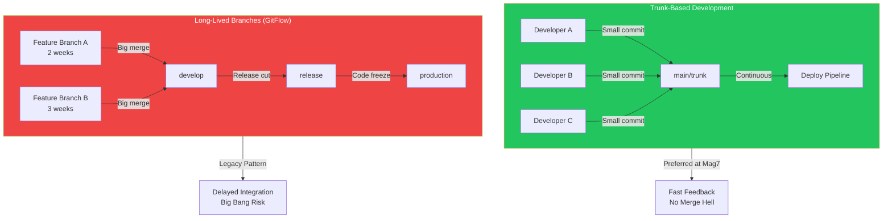

# CI/CD & Release Engineering

At Mag7 scale, the distinction between Build, Deploy, and Release is not semantic—it's the architectural foundation that separates deployment risk (crashing servers) from release risk (shipping bugs to users). Principal TPMs design systems where code reaches production hourly but users see changes incrementally, where rollback takes milliseconds not minutes, and where "the pipeline" replaces "the release manager" as the governance mechanism. This guide covers the technical strategies, cultural shifts, and organizational patterns that enable thousands of daily deployments without weekend releases or code freezes.

## I. Core Distinctions: Build vs. Deploy vs. Release

```mermaid
flowchart LR
    subgraph BUILD["Build Phase"]
        B1[Code Commit]
        B2[Immutable Artifact]
        B3["Docker Image / JAR"]
    end

    subgraph DEPLOY["Deploy Phase"]
        D1[Infrastructure Update]
        D2[Health Checks]
        D3["Dark Deployment"]
    end

    subgraph RELEASE["Release Phase"]
        R1[Feature Flag Toggle]
        R2["Traffic: 1% → 5% → 100%"]
        R3[Business KPIs Monitored]
    end

    BUILD --> DEPLOY --> RELEASE

    style BUILD fill:#3b82f6,color:#fff
    style DEPLOY fill:#f59e0b,color:#fff
    style RELEASE fill:#22c55e,color:#fff
```

### 1. The Architectural Necessity of Decoupling

For a Principal TPM at a Mag7 level, the distinction between Build, Deploy, and Release is not merely semantic; it is the architectural foundation of **Continuous Delivery**. The primary goal is to separate *deployment risk* (crashing the server) from *release risk* (shipping a bug to the user).

In a mature CI/CD environment, these three phases are distinct stages in the pipeline with separate ownership models and success criteria.

#### The Build Phase: Deterministic Artifacts
The objective here is to create an **Immutable Artifact**. Once code is committed, the build system generates a binary (Docker image, JAR, AMI) that never changes as it moves through environments.
*   **Mag7 Standard:** Google (Blaze/Bazel) and Amazon (Brazil) strictly enforce that you do not rebuild for production. You build once in the pipeline start. The artifact deployed to the `Staging` environment is bit-for-bit identical to the artifact deployed to `Production`.
*   **Why it matters:** If you rebuild for Prod, you introduce variables (compiler versions, dependency updates) that invalidate your testing.
*   **Principal TPM Action:** Audit your pipelines. If you see `mvn build` or `docker build` happening inside the Production deployment stage, you have a critical reliability gap.

#### The Deploy Phase: Infrastructure State
Deployment is strictly an operational activity. It places the specific version of the artifact onto the infrastructure (e.g., updating the Kubernetes Deployment manifest or updating the Auto Scaling Group launch configuration).
*   **Dark Deployments:** At this stage, the service is running and passing health checks (Liveness/Readiness probes), but the load balancer or service mesh is not routing public traffic to the new logic, or the logic is guarded by a feature flag evaluating to `false`.
*   **Mag7 Standard:** Amazon’s "Apollo" deployment engine pushes code to hosts, but the service remains latent until health checks pass.
*   **Success Metric:** Service health (CPU, Memory, uptime), not business metrics.

#### The Release Phase: Traffic Shaping
Release is a business activity. It controls the exposure of the new code path to users. This is managed via **Feature Flags** (e.g., LaunchDarkly, internal tools like Meta's Gatekeeper) or **Traffic Shifting** (Canary deployments).
*   **Mag7 Standard:** A release at Netflix is rarely a binary "on/off." It is a percentage dial: 1% -> 5% -> 25% -> 100%. This allows automated analysis tools (like Netflix’s Kayenta) to compare error rates between the baseline (old code) and canary (new code).
*   **Success Metric:** Business KPIs (conversion rate, latency, error rate).

### 2. Real-World Behavior and Execution

At the Mag7 level, the sophistication lies in the automation of the Release phase.

#### Meta (Facebook): Gatekeeper & Config
Meta relies heavily on "Gatekeeper," a highly distributed configuration management system.
*   **Behavior:** Code is deployed to production servers constantly (often multiple times a day). However, the code is wrapped in `if (Gatekeeper.check('new_feed_algo')) { ... }`.
*   **Execution:** A Product Manager or TPM controls the rollout via a UI, targeting specific cohorts (e.g., "iOS users in Canada"). If metrics tank, the PM flips the switch off. The code remains on the server, but is dormant.
*   **Impact:** This enables "Testing in Production." Engineers can turn the feature on solely for their user IDs to verify functionality in the live environment before general release.

#### Amazon: Pipelines and Automatic Rollback
Amazon focuses heavily on the safety of the *Deploy* phase leading into the *Release*.
*   **Behavior:** Pipelines are structured with "Waves." Wave 1 might be a single availability zone in a low-traffic region.
*   **Execution:** If the deployment succeeds (infrastructure is healthy), the pipeline automatically increases traffic (Release). Crucially, if CloudWatch alarms trigger (e.g., "OrderFailures > 1%"), the pipeline automatically rolls back the release *and* the deployment without human intervention.

### 3. Tradeoffs Analysis

As a Principal TPM, you must navigate the tradeoffs of moving from a coupled (monolithic release) to a decoupled model.

| Feature | Coupled (Legacy) | Decoupled (Modern/Mag7) |
| :--- | :--- | :--- |
| **Complexity** | **Low.** Simple mental model. "If the server is up, the feature is live." | **High.** Requires managing artifact versions vs. flag states. Debugging is harder (is it the code or the config?). |
| **Cost** | **Low.** Single environment. | **Medium/High.** Requires investment in Flag Management Service, Observability tools, and potentially running parallel infrastructure (Blue/Green). |
| **Risk** | **High.** "Big Bang" releases. If it breaks, you must rollback the binary, which takes time (minutes to hours). | **Low.** "Blast Radius" reduction. If it breaks, you toggle a flag (milliseconds). |
| **Database** | **Simple.** Schema changes happen with code. | **Complex.** Database schema changes must be **backward compatible**. You cannot drop a column if the old code (still live via flag) tries to read it. |
| **Tech Debt** | **Low.** Old code is overwritten. | **High.** Stale feature flags ("Flag Debt"). If flags aren't removed after 100% rollout, the codebase becomes a graveyard of dead logic paths. |

### 4. Impact on Business and Capabilities

#### ROI and Business Agility
*   **Mean Time to Resolution (MTTR):** Decoupling improves MTTR by orders of magnitude. Reverting a config change is instant; reverting a binary deployment involves CI/CD wait times.
*   **Opportunity Cost:** By separating Build/Deploy from Release, Engineering can deploy during business hours without fear. This eliminates "Weekend Deployments" or "Code Freezes" (except for critical periods like Black Friday), reclaiming thousands of engineering hours annually.

#### Customer Experience (CX)
*   **Invisible Failures:** With canary releases (e.g., releasing to 1% of users), a catastrophic bug affects only a tiny fraction of the user base before being automatically reverted. To the 99%, the platform appears 100% stable.

#### Skill & Cultural Shift
*   **Shift Left:** Quality assurance moves from "testing before deploy" to "monitoring after release."
*   **Ownership:** The TPM role shifts from "Release Manager" (coordinating timelines) to "Capability Owner" (ensuring the platform supports granular rollouts). You stop asking "When is the deployment?" and start asking "What are the success criteria for the canary?"

### 5. Edge Cases and Failure Modes

#### The "Database Migration" Trap
The most common failure mode in decoupled systems is stateful data.
*   **Scenario:** You deploy code that writes to a new database column. You toggle the feature on. It works. You toggle it off due to a bug.
*   **Failure:** Does the old code crash when it encounters data in the new column? Or did the new code fail to write to the old column (breaking backward compatibility)?
*   **Guidance:** Database changes must always be **additive**. Phase 1: Add column (Deploy). Phase 2: Write to both (Release). Phase 3: Backfill. Phase 4: Read from new. Phase 5: Deprecate old.

#### Flag Interaction (Combinatorial Explosion)
*   **Scenario:** Feature A is behind Flag X. Feature B is behind Flag Y. Feature B depends on Feature A.
*   **Failure:** Testing often covers (X=True, Y=True) and (X=False, Y=False). But in production, you might end up with (X=False, Y=True), causing a null pointer exception or logical error.
*   **Guidance:** TPMs must enforce explicit dependency definitions in the feature flag management tool to prevent illegal state combinations.

## II. Source Control Strategy: Trunk-Based Development

### 1. The Strategy: Continuous Integration at Scale

Trunk-Based Development (TBD) is the source control strategy where all developers merge code into a single central branch (often called `main` or `trunk`) multiple times a day. This stands in direct opposition to "GitFlow" or long-lived feature branching, where developers work in isolation for days or weeks before attempting a massive merge.

For a Principal TPM, TBD is not a version control preference; it is a **business requirement for high-velocity CI/CD**. You cannot have "Continuous Integration" if integration only happens once every two weeks at the end of a sprint.

**The Core Mechanics:**
*   **Batch Size:** Code changes are small. If a feature takes 5 days, it is broken down into 10-20 commits, each merged to trunk daily, hidden behind Feature Flags if incomplete.
*   **The Golden Rule:** The trunk must always be in a deployable state. Breaking the build is a severity-level incident because it halts the pipeline for the entire organization.
*   **Code Review:** Reviews happen on these small batches, making them faster and more rigorous than reviewing 2,000 lines of code at the end of the month.

### 2. Mag7 Real-World Behavior

At Mag7 scale, the friction of merging code grows exponentially with team size. These companies utilize TBD to flatten this curve.

*   **Google (The Monorepo):** Google operates one of the largest codebases in the world in a single monolithic repository. Tens of thousands of engineers commit to the same "head" of the repo.
    *   *Mechanism:* To prevent the trunk from breaking constantly, Google uses a **Submit Queue**. When a developer commits, the code runs through a pre-flight system (TAP/Presubmits). Only if all tests pass does the system automatically merge the code into the trunk.
*   **Meta (Facebook):** Similar to Google, Meta emphasizes extreme velocity. They famously rely on TBD combined with sophisticated feature flagging (Gatekeeper).
    *   *Mechanism:* Developers merge incomplete features directly to main. The code is deployed to production servers within hours but remains inaccessible to users until the feature flag is toggled.
*   **Amazon:** While Amazon uses a "multi-repo" architecture (many microservices, many repos), the internal mandate dictates short-lived branches. If a branch lives longer than a few days, it is considered technical debt.

### 3. Tradeoffs

A Principal TPM must navigate the tension between stability and speed when advocating for TBD.

**Trunk-Based Development (Recommended)**
*   **Pros:**
    *   **Eliminates "Merge Hell":** Conflicts are resolved immediately while the context is fresh, rather than weeks later.
    *   **Enables True CI:** Automated tests run against the aggregate of everyone's work, preventing "works on my machine/branch" syndrome.
    *   **Inventory Reduction:** Unmerged code is inventory that provides no value. TBD pushes value to the pipeline immediately.
*   **Cons:**
    *   **Requires High Maturity:** Requires robust automated testing (unit and integration). If tests are flaky or slow, TBD collapses.
    *   **Requires Feature Flags:** You cannot merge half-written code without a mechanism to suppress it in production.
    *   **Cultural Shift:** Developers accustomed to "polishing" code in private for a week will feel exposed and pressured by daily merging.

**Long-Lived Feature Branches (Legacy/GitFlow)**
*   **Pros:**
    *   **Protects Main:** The main branch is rarely touched, creating a false sense of security.
    *   **Lower Bar for Tooling:** Can be done without advanced CI pipelines or feature flags.
*   **Cons:**
    *   **Delayed Feedback:** You don't know if your code breaks another team's code until the merge, weeks later.
    *   **Blackout Periods:** Often requires "Code Freezes" before release to stabilize the large merges, which kills velocity and ROI.

### 4. Business & CX Impact

The shift to TBD directly impacts the bottom line and customer experience metrics.

*   **ROI (Efficiency):** Research (DORA metrics) indicates that high-performing organizations (Mag7) spend significantly less time on unplanned work and rework. TBD reduces the cost of "integration" to near zero.
*   **Business Agility:** If a competitor launches a feature, a TBD team can pivot and iterate on the trunk immediately. A team stuck in long-lived branches has to finish their current "sprint" and merge before pivoting, costing weeks of reaction time.
*   **Skill Capability:** TBD forces engineers to learn **Branch by Abstraction**. This is the skill of refactoring a live system (e.g., replacing a database driver) incrementally while the system is running, rather than doing a "big bang" rewrite.

### 5. Principal Guidance: Handling Edge Cases

As a Principal TPM, you will face pushback regarding complex scenarios. Here is how to handle them:

*   **The "Risky Refactor" Pushback:** A team claims they cannot merge to trunk because they are rewriting the core payment engine and it will take a month.
    *   *Guidance:* Reject the long branch. Mandate **Branch by Abstraction**. Create an abstraction layer that routes traffic to the old engine by default. Build the new engine in the trunk behind that abstraction. Once finished, flip the switch. This allows the refactor to coexist with daily feature work.
*   **The "Broken Build" Scenario:** A junior engineer merges code that passes unit tests but breaks a downstream dependency.
    *   *Guidance:* Do not revert to long branches. Implement **Automatic Rollbacks** or a "Stop the Line" policy. The priority is fixing the trunk immediately, usually by reverting the commit, not fixing-forward. The team must then improve the pre-commit test coverage to catch this failure mode next time.

## III. Risk Management: Feature Flags (Toggles)

Feature flags (or toggles) are the technical mechanism that enables the separation of Deploy from Release. At the Principal TPM level, you must view feature flags not merely as conditional coding statements (`if/else`), but as a distributed control plane that manages availability, experimentation, and risk.

In a Mag7 environment, feature flags are the primary instrument for "Testing in Production." They allow engineering teams to merge code to `main` constantly (CI/CD) without exposing unfinished or risky features to end-users.

### 1. The Architecture of Flag Management
At scale, feature flagging is not managed via static configuration files or environment variables, as these often require a service restart to update. Instead, Mag7 companies utilize dynamic, remote configuration services.

*   **Evaluation Engine:** The decision to show a feature happens in milliseconds.
    *   *Server-Side:* The evaluation happens on the backend. Better for security and complex logic (e.g., "Show this feature only to users who spent >$500 in the last 30 days").
    *   *Client-Side:* The evaluation happens on the device/browser. Necessary for UI/UX latency but risks exposing unreleased feature details in the binary or payload.
*   **Contextual Consistency:** A critical architectural requirement is "stickiness." If a user falls into the "Treatment A" bucket of a rollout, they must remain there across sessions and devices to prevent a jarring CX.

### 2. Taxonomy of Toggles
A Principal TPM must enforce a strict taxonomy. Treating all flags the same leads to unmanageable technical debt.

```mermaid
flowchart TB
    subgraph TAXONOMY["Feature Flag Taxonomy"]
        direction TB

        subgraph RELEASE["Release Toggles"]
            R1["Lifecycle: Days-Weeks"]
            R2["Hide incomplete code"]
            R3["Traffic ramp: 0%→100%"]
            R4["⚠️ MUST remove after launch"]
        end

        subgraph OPS["Ops Toggles / Circuit Breakers"]
            O1["Lifecycle: Permanent"]
            O2["Graceful degradation"]
            O3["Example: Disable Recommendations<br/>during Prime Day"]
        end

        subgraph EXPERIMENT["Experiment Toggles"]
            E1["Lifecycle: Statistical window"]
            E2["A/B/n testing"]
            E3["Tied to analytics pipeline"]
        end

        subgraph PERMISSION["Permission Toggles"]
            P1["Lifecycle: Permanent"]
            P2["Entitlement management"]
            P3["Premium vs Free users"]
            P4["Linked to billing systems"]
        end
    end

    RELEASE -->|"Flag Debt Risk"| DEBT[("🚨 Zombie Flags<br/>30% of outages")]
    OPS -->|"Safe"| STABLE[("✓ Expected to persist")]
    EXPERIMENT -->|"Auto-cleanup"| CLEAN[("✓ Ends with test")]
    PERMISSION -->|"Business logic"| BILLING[("✓ Tied to revenue")]

    style RELEASE fill:#f59e0b,color:#000
    style OPS fill:#22c55e,color:#fff
    style EXPERIMENT fill:#3b82f6,color:#fff
    style PERMISSION fill:#8b5cf6,color:#fff
    style DEBT fill:#ef4444,color:#fff
```

1.  **Release Toggles:** Short-lived. Used to hide incomplete code or ramp up traffic (0% -> 100%).
    *   *Lifecycle:* Days to Weeks. Must be removed immediately after 100% rollout.
2.  **Ops Toggles (Circuit Breakers):** Long-lived. Used to degrade functionality gracefully under load.
    *   *Example:* A flag to disable "Recommendations" on Amazon.com during Prime Day if latency spikes, preserving the core "Checkout" capability.
    *   *Lifecycle:* Permanent or Semi-Permanent.
3.  **Experiment Toggles:** Used for A/B/n testing.
    *   *Lifecycle:* Defined by the statistical significance window (usually weeks).
4.  **Permission Toggles:** Long-lived. Used to manage entitlements (e.g., "Premium Users" vs. "Free Users").
    *   *Lifecycle:* Permanent (often linked to billing systems).

### 3. Real-World Behavior at Mag7
*   **Meta (Facebook) - "Gatekeeper":** Meta's internal tool, Gatekeeper, is legendary. It allows engineers to target rollouts based on incredibly granular attributes (e.g., "Android users on version X in Brazil").
    *   *Behavior:* Code is deployed to production constantly. A release is simply a Gatekeeper config change. If metrics (latency, error rate) spike, automated systems (like "Defcon") can flip the toggle off globally in seconds.
*   **Amazon/AWS - "AppConfig" & Deployment Safety:** Amazon emphasizes "One-Way Doors" vs. "Two-Way Doors." Feature flags turn deployments into Two-Way Doors. If a deployment causes a regression, the flag is flipped (rollback), which is faster than re-deploying a previous binary.
*   **Netflix - "Fast Properties":** Netflix decouples code deployment from property updates. This allows them to change system behavior (like timeout thresholds or retry logic) dynamically without a full code push.

### 4. Critical Tradeoffs
Implementing a robust feature flag system is not free.

*   **Testing Complexity (Combinatorial Explosion):**
    *   *The Issue:* If you have 10 active flags, you theoretically have $2^{10}$ (1,024) possible system states. You cannot test all of them.
    *   *The Tradeoff:* You trade deterministic testing (knowing exactly what code is running) for release velocity.
    *   *Mitigation:* Principal TPMs must enforce limits on *concurrent* flags in the same code path and mandate that integration tests run against the "default on" and "default off" states of critical flags.
*   **Technical Debt:**
    *   *The Issue:* "Zombie Flags." Once a feature is 100% launched, the `if/else` check remains in the code. Over time, this makes the codebase brittle and harder to read.
    *   *The Tradeoff:* You trade short-term speed for long-term maintenance overhead.
    *   *Mitigation:* **Flag Cleanup** must be treated as a release requirement. The definition of "Done" includes removing the flag. Some teams at Google auto-create a Jira ticket/bug to remove the flag the moment it is created.
*   **Latency:**
    *   *The Issue:* Every flag evaluation requires a computation or a network call (if not cached correctly).
    *   *The Tradeoff:* Micro-latency vs. Control.
    *   *Mitigation:* Heavy caching strategies and local evaluation where possible.

### 5. Business, CX, and Capability Impact

*   **ROI (Risk Reduction):** The primary ROI is the reduction of Mean Time to Recovery (MTTR). Reverting a binary might take 45 minutes; flipping a flag takes 45 milliseconds. This difference can save millions of dollars during a high-severity outage.
*   **CX (Canary Releases):** Flags enable "Canary" releases. You release to internal employees first, then 1% of the public, then 5%, then 100%. This limits the "Blast Radius" of a bug. If a feature breaks, it only affects 1% of users, protecting the brand reputation.
*   **Skill Capability:** It shifts the organization from "Release Management" (scheduling massive updates) to "Progressive Delivery." It empowers Product Managers to control the *timing* of a release, while Engineering controls the *deployment* of the code.

### 6. Governance: The Principal TPM Role
Your role is not to flip the switches, but to govern the system to prevent chaos.
*   **Audit Trails:** Who changed the flag? Why? When? This is a compliance requirement (SOC2/GDPR).
*   **Naming Conventions:** Enforce strict naming (e.g., `EXP_checkout_button_color` vs. `OPS_disable_recommendations`). Ambiguous names lead to outages.
*   **Default Values:** Ensure the code fails safely. If the flag management service goes down, does the application default to "On" or "Off"? (Usually "Off" for new features, "On" for established ones).

## IV. Deployment Strategies: Canary vs. Blue-Green

At the Principal TPM level, the choice between Canary and Blue-Green is not merely an operational detail; it is a strategic decision regarding risk tolerance, infrastructure cost, and deployment velocity. You must drive the strategy that aligns with the organization's "Error Budget" and availability SLAs.

```mermaid
flowchart LR
    subgraph BLUEGREEN["Blue-Green Deployment"]
        direction TB
        BG_LB[Load Balancer]
        BG_BLUE[Blue Environment<br/>v1.0 - 100% traffic]
        BG_GREEN[Green Environment<br/>v1.1 - 0% traffic]
        BG_LB --> BG_BLUE
        BG_LB -.->|"Instant switch"| BG_GREEN
        BG_COST["💰 Cost: 200% capacity"]
        BG_ROLL["⚡ Rollback: Instant"]
    end

    subgraph CANARY["Canary Deployment"]
        direction TB
        C_LB[Load Balancer]
        C_OLD[Old Fleet<br/>v1.0 - 99% traffic]
        C_NEW[Canary<br/>v1.1 - 1% traffic]
        C_LB -->|"99%"| C_OLD
        C_LB -->|"1%"| C_NEW
        C_COST["💰 Cost: ~101% capacity"]
        C_ROLL["📊 Rollback: Auto on metrics"]
    end

    BLUEGREEN -->|"Better for"| BG_USE["Stateless services<br/>Need instant rollback<br/>Budget allows 2x infra"]
    CANARY -->|"Better for"| C_USE["Mag7 scale services<br/>Cost-conscious<br/>Need real traffic validation"]

    style BLUEGREEN fill:#3b82f6,color:#fff
    style CANARY fill:#22c55e,color:#fff
    style BG_COST fill:#ef4444,color:#fff
    style C_COST fill:#22c55e,color:#fff
```

### 1. The Mechanics and Architecture

**Blue-Green Deployment**
This strategy requires two identical production environments.
*   **Blue:** Running the current version (v1) receiving 100% of traffic.
*   **Green:** Running the new version (v2) receiving 0% of traffic.
*   **The Switch:** Once Green is validated, the load balancer is updated to switch 100% of traffic from Blue to Green.
*   **Principal Nuance:** This is rarely a physical swap of hardware. In Kubernetes environments, this is often a Service selector update pointing to a new ReplicaSet.

**Canary Deployment**
This strategy involves rolling out the update to a small subset of servers or users before a full rollout.
*   **Phasing:** Traffic shifts incrementally: 1% $\rightarrow$ 5% $\rightarrow$ 25% $\rightarrow$ 100%.
*   **Automated Analysis:** At each phase, metrics (latency, error rates, CPU) are compared against the baseline. If metrics deviate beyond a threshold, the deployment automatically halts and rolls back.
*   **Principal Nuance:** Canary is not just "testing in prod." It is about **Blast Radius Containment**. If v2 has a memory leak, only 1% of users are impacted, preserving the overall SLA.

### 2. Mag7 Real-World Behavior

At the scale of Mag7, pure Blue-Green is often fiscally and operationally impossible for the entire stack, while Canary is the standard for service-level deployments.

*   **Amazon (Apollo Deployment Engine):** Amazon utilizes a sophisticated Canary approach often described as "Waves." A deployment does not go to 100% of the fleet immediately. It goes to:
    1.  One box in a One-Box Stage.
    2.  One Availability Zone (AZ).
    3.  One Region.
    4.  Global rollout.
    *This prevents a "bad config" from taking down an entire region (as seen in the infamous S3 outage of 2017, which led to stricter tooling controls).*

*   **Google (SRE Model):** Google relies heavily on Canary deployments coupled with **Automated Canary Analysis (ACA)**. Principal TPMs at Google define the "SLOs" (Service Level Objectives) that the ACA tool monitors. If the Canary causes the error rate to burn through the error budget too quickly, the pipeline kills the push without human intervention.

*   **Netflix (Spinnaker):** Netflix popularized the "Red/Black" (their term for Blue/Green) deployment for stateless microservices. Because they run on ephemeral EC2 instances, they spin up a fresh Auto Scaling Group (ASG) for the new version. However, as they scaled, they moved toward Canary analysis within Spinnaker to save on the "double capacity" costs required by pure Red/Black.

### 3. Tradeoffs: The Decision Matrix

As a Principal TPM, you will often mediate disputes between SREs (who want safety) and Product Developers (who want speed). Use this framework:

**Blue-Green**
*   **Pros:**
    *   **Instant Rollback:** If Green fails, you switch the router back to Blue instantly.
    *   **Clean State:** No "mixed version" issues where a user hits v1 on page load and v2 on checkout.
*   **Cons:**
    *   **Cost:** Requires provisioned capacity for 200% of peak load during the deployment window. At Mag7 scale, keeping double the fleet idle is a non-starter.
    *   **Stateful Complexity:** Long-running connections (WebSockets, large file uploads) will be severed during the cutover unless complex connection draining logic is implemented.

**Canary**
*   **Pros:**
    *   **Zero-Cost Redundancy:** You deploy in place (rolling update) or replace small chunks, requiring minimal extra capacity.
    *   **Real Traffic Validation:** Synthetic tests can never replicate the chaos of production traffic. Canary proves the code works under real load.
*   **Cons:**
    *   **Slow Convergence:** A safe canary rollout (1% per 10 minutes) can take hours to reach 100%.
    *   **Version Skew:** During the rollout, your system is running v1 and v2 simultaneously. The database schema must be compatible with *both* versions (N-1 compatibility).

### 4. Business, ROI, & CX Impact

*   **ROI (Cost vs. Availability):** Blue-Green maximizes availability (MTTR is near zero) but maximizes infrastructure cost. Canary optimizes for cost and risk reduction but increases the complexity of the deployment pipeline. For a Mag7 service handling millions of TPS, Canary is the ROI winner because 2x infrastructure is too expensive.
*   **CX (User Trust):** Canary deployments protect the brand. If a deployment breaks the "Add to Cart" button, a Canary limits the damage to a tiny fraction of users. A failed Blue-Green cutover impacts *everyone* until the rollback happens.
*   **Skill Capability:** Implementing robust Canary deployments forces the engineering organization to mature its observability stack. You cannot do Canary if you don't have reliable metrics to trigger the automated rollback.

### 5. Edge Cases and Failure Modes

*   **The Database Schema Trap:** The most common failure in both strategies is database incompatibility.
    *   *Scenario:* v2 code expects a new column `user_rank`. You deploy v2.
    *   *Failure:* If you deploy the code before the DB migration, v2 crashes. If you run the migration but rollback the code to v1, v1 crashes because it doesn't know how to handle the new column.
    *   *Principal Guidance:* Enforce the **Expand-Contract pattern**.
        1.  Expand DB (add column, make it optional).
        2.  Deploy Code (write to both old and new columns).
        3.  Backfill Data.
        4.  Contract DB (remove old column).

*   **The "Thundering Herd" on Rollback:**
    *   In a Canary rollout, if you reach 50% and trigger a rollback, ensure the remaining 50% of the "old" fleet can handle the sudden return of 100% of the traffic. If you scaled down the old fleet too aggressively, the rollback itself causes an outage.

## V. Orchestration: Pipelines and Release Trains

Orchestration is the governance layer that sits above individual build/deploy actions. For a Principal TPM, orchestration is not about configuring Jenkins or GitHub Actions; it is about designing the **control plane** for software delivery. It defines the logic, timing, and dependencies that govern how code moves from a developer’s workstation to a global user base.

At the Mag7 scale, orchestration solves two competing problems: **Velocity** (developers want to ship instantly) and **Stability** (SREs want to minimize change). The Principal TPM’s role is to implement a system where velocity is high *because* stability is automated, not in spite of it.

### 1. Pipeline Architecture: Hermeticity and Artifact Promotion

The fundamental unit of orchestration is the pipeline. At the Principal level, you must enforce the pattern of **Build Once, Deploy Many**.

*   **The Mechanism:** The pipeline generates a single, immutable artifact (e.g., a Docker image with a SHA-256 hash) during the Build phase. That *exact* binary is promoted through environments (Dev $\rightarrow$ Gamma $\rightarrow$ Prod). You never rebuild the artifact for a specific environment; you only change the configuration injected into it.
*   **Mag7 Behavior (Google):** Google uses a system based on Blaze (open-sourced as Bazel) ensuring "hermetic builds." A build pipeline cannot access the open internet; it can only access a known, versioned repository of dependencies. This guarantees that if you run a build today and again in six months, the binary is bit-for-bit identical.
*   **Tradeoffs:**
    *   *Immutable/Hermetic:* High reliability and security (prevents supply chain attacks); easier debugging (no "it works on my machine"). *Cons:* High initial investment in tooling; rigid dependency management can frustrate developers used to `npm install` pulling the latest versions dynamically.
    *   *Mutable/Dynamic:* Fast setup. *Cons:* "Drift" occurs where Staging binaries differ slightly from Prod binaries due to library updates happening between builds, leading to catastrophic production failures.

### 2. Release Trains vs. Continuous Deployment

A critical architectural decision for the TPM is choosing the delivery cadence model: the **Release Train** or **Continuous Deployment (CD)**.

#### The Release Train (Mobile/Client-Heavy)
Used primarily for mobile apps, firmware, or desktop software where the user controls the update.
*   **Mag7 Behavior (Meta/Facebook Mobile):** Facebook operates a strict weekly release train for its mobile apps. The train "cuts" at a specific time (e.g., Tuesday 1 PM). If a developer's code isn't checked in and passing tests by 12:59 PM, they miss the train. The train *never* waits for a feature.
*   **Role of TPM:** You act as the Train Conductor. You do not manage the code; you manage the schedule and the "Go/No-Go" criteria. You enforce the policy that it is better to ship a release without a feature than to delay the release for everyone else.

#### Continuous Deployment (SaaS/Backend)
Used for server-side microservices where the company controls the runtime.
*   **Mag7 Behavior (Amazon/AWS):** Amazon performs roughly 150 million deployments annually. There is no "Tuesday release." As soon as code passes the pipeline gates, it automatically deploys to a "One-Box" (canary), then an Availability Zone, then a Region.
*   **Role of TPM:** You define the **Guardrails**. You ensure the pipeline automatically halts if metrics (latency, error rates) spike.

#### Tradeoffs
*   **Release Trains:**
    *   *Pros:* Predictability for marketing/support; allows for manual QA sweeps on integrated code; bundles risk into known windows.
    *   *Cons:* Artificial delays (code sits idle waiting for the train); higher "change density" (more changes per release = harder to triage bugs).
*   **Continuous Deployment:**
    *   *Pros:* Lowest mean-time-to-recovery (MTTR); low change density (single-commit deploys are easy to revert).
    *   *Cons:* Requires massive investment in automated testing and observability; requires a culture of "backward compatibility" for APIs.

### 3. Progressive Delivery and "Baking"

Orchestration at scale requires managing the "Blast Radius." A Principal TPM must mandate that no release hits 100% of global users simultaneously.

*   **Mag7 Behavior (Netflix/Amazon):**
    1.  **Canary:** Deploy to a small subset of instances handling internal traffic or <1% of external traffic.
    2.  **Bake Time:** The pipeline pauses. It waits for a statistically significant amount of traffic to flow through the canary to verify metrics (CPU, Memory, HTTP 500 rates). This is not a manual wait; it is an automated statistical gate.
    3.  **Zonal/Regional Rollout:** If the bake passes, deploy to one Zone. Bake again. Then one Region. Then global.
*   **Tradeoffs:**
    *   *Aggressive Baking:* High safety. *Cons:* High latency for feature delivery (a global rollout might take 3 days).
    *   *Fast Rollout:* Instant gratification. *Cons:* A bad config change can take down an entire global service (e.g., the Facebook BGP outage of 2021).

### 4. Handling Dependencies: The "Lock-Step" Anti-Pattern

A common failure mode in growing organizations is "Lock-Step Releases," where Service A cannot deploy until Service B deploys.

*   **The Principal TPM Stance:** You must aggressively eliminate lock-step dependencies. In a microservices architecture, teams must be able to deploy independently.
*   **Mechanism:** Enforce **Contract Testing** and **API Versioning**. If Service A needs a new field from Service B, Service B deploys the API change first (backward compatible). Service A deploys days later to consume it.
*   **Impact on Capability:** This shifts the organization from "Coordinated Releases" (high coordination cost, low velocity) to "Decoupled Releases" (zero coordination cost, high velocity).

### 5. Business & CX Impact

*   **ROI:**
    *   **Efficiency:** Automated orchestration eliminates the "Release Manager" role who manually copies files or clicks buttons.
    *   **Cost of Downtime:** By enforcing progressive delivery (Canaries), you cap the financial impact of a bad bug to <1% of users rather than 100%.
*   **CX (Customer Experience):**
    *   **Consistency:** Users experience fewer "maintenance windows" or massive regressions.
    *   **responsiveness:** Security patches (e.g., Log4j) can be orchestrated globally in hours, not weeks, protecting customer data.

## VI. Summary: The Principal TPM Lens

The Principal TPM does not view Release Engineering as a checklist of tasks to move code from a laptop to a server. Instead, you must view the entire Build/Deploy/Release lifecycle as a **supply chain of value delivery**. Your role is to optimize this supply chain for throughput (velocity) while strictly managing the quality control (reliability) through systemic design rather than manual intervention.

At the Principal level, you stop asking "Is the release ready?" and start asking "Is the system designed to reject a bad release automatically?"

### 1. Systemic Governance: The "Golden Path" Strategy

In smaller organizations, TPMs often act as Release Managers—human gatekeepers who manually approve deployments. At Mag7 scale, this is an anti-pattern that creates bottlenecks. The Principal TPM advocates for the "Golden Path" (or Paved Road): a standardized, highly automated pipeline that is the easiest way for developers to ship code.

*   **Mag7 Real-World Behavior:**
    *   **Netflix:** The "Paved Road" concept is core to their culture. Engineers can build their own custom tooling, but if they use the centralized platform (Spinnaker), they get compliance, security scanning, and canary analysis for free.
    *   **Google:** Uses "Error Budgets." If a service is within its reliability target (e.g., 99.99% availability), the pipeline allows rapid, automated releases. If the budget is exhausted due to recent instability, the pipeline automatically freezes feature releases, forcing the team to focus on reliability.

*   **Tradeoffs:**
    *   **Standardization vs. Flexibility:** Enforcing a Golden Path reduces the cognitive load on developers and standardizes metrics, but it can stifle innovation in tooling or support for edge-case languages.
    *   **Principal TPM Action:** You must champion the standardization of the pipeline (e.g., enforcing one CI/CD tool like Tekton or internal variants) to enable cross-organization mobility and uniform metrics, even if it creates short-term friction for teams migrated from legacy bespoke tools.

*   **Business Impact:**
    *   **ROI:** dramatically lowers the "tax" of operations. If 1,000 engineers save 2 hours a week on release toil, that is ~100,000 engineering hours saved annually.
    *   **Capability:** Shifts the organization from "Who broke the build?" to "How do we improve the test harness?"

### 2. The Economics of Blast Radius & Progressive Delivery

A Principal TPM must evangelize that 100% reliability is impossible. Therefore, the strategy shifts to minimizing the **Blast Radius** of a failure. You must drive the architectural adoption of Cell-Based Architectures and Progressive Delivery.

*   **Mag7 Real-World Behavior:**
    *   **Amazon (AWS):** Uses "Apollo" for deployments. They deploy to a "One-Box" (single host), then a single Availability Zone, then a Region, then globally. They never deploy to simultaneous regions at once to prevent global outages.
    *   **Meta (Facebook):** Uses "Gatekeeper." A release is not binary. It is rolled out to 0.1% of users, then 1%, then 5%. If metrics (latency, error rates) deviate from the baseline, the rollout halts automatically.

*   **Tradeoffs:**
    *   **Latency of Release vs. Safety:** A staggered rollout (canary) takes time. Deploying to 100% of servers immediately is faster but carries existential risk.
    *   **Infrastructure Cost:** Running parallel environments (blue/green or active canaries) increases compute costs.

*   **Principal TPM Action:**
    *   Define the "Release Tiering" policy. Tier 1 services (Login, Checkout) require strict canary phases. Tier 3 services (Internal wikis) can tolerate faster, riskier rollouts.
    *   **Impact:** You protect the company's revenue and reputation. A global outage at Mag7 costs millions per minute. A blast radius contained to 1% of users for 5 minutes is a negligible rounding error.

### 3. Observability as a Prerequisite to Release

The Principal TPM ensures that "Definition of Done" includes Observability. You cannot decouple Deploy from Release if you cannot see the impact of the release in real-time.

*   **The Technical Shift:**
    *   Moving away from simple "up/down" monitoring.
    *   Moving toward high-cardinality observability (e.g., "Show me error rates for iOS users on version 14.2 in the Frankfurt region").

*   **Mag7 Real-World Behavior:**
    *   **Microsoft (Azure/Office 365):** utilizes synthetics (fake user transactions) running constantly in production. A release is considered failed not just if the server crashes, but if the synthetic user transaction takes >200ms longer than the previous build.

*   **Tradeoffs:**
    *   **Data Volume/Cost vs. Insight:** Storing high-fidelity traces is expensive. The Principal TPM must help define sampling rates (e.g., keep 100% of error traces, but only 1% of success traces).

*   **Business Impact:**
    *   **CX:** Reduces MTTR (Mean Time To Recovery). If you know exactly *which* feature flag caused a latency spike, you can toggle it off in seconds. Without observability, you spend hours guessing.

### 4. Psychological Safety & The Blameless Post-Mortem

Finally, the Principal TPM controls the narrative of failure. When the decoupled release process fails (and it will), the Principal TPM leads the **Post-Incident Review (PIR)**.

*   **Mag7 Real-World Behavior:**
    *   At **Google** and **Amazon**, firing an engineer for a bad deployment is culturally unacceptable (unless malicious). The view is that the *process* failed to catch the error.
    *   The Principal TPM focuses on the "COE" (Correction of Error) document. The output must be a mechanism change (e.g., "Add a linting rule," "Update the canary threshold"), not a human promise ("We will be more careful").

*   **Impact:**
    *   **Skill Capability:** This builds a culture of transparency. If engineers fear punishment, they hide failures, leading to catastrophic "hidden debt." If they feel safe, they report "near misses," allowing the TPM to improve the process proactively.

---

## Interview Questions

### I. Core Distinctions: Build vs. Deploy vs. Release

**Question 1: The "Hotfix" Dilemma**
"We have a critical bug in production affecting payment processing. The engineering team has a fix ready, but our standard pipeline enforces a 'Build once, Deploy to Staging, Deploy to Canary, Deploy to Prod' workflow that takes 4 hours. The Tech Lead wants to bypass the pipeline and SSH into the production boxes to patch the binary directly to stop the bleeding. As the Principal TPM, how do you handle this situation, and what is your long-term fix?"

*   **Guidance for a Strong Answer:**
    *   **Immediate Action:** Acknowledge the severity (P0). If the bleeding is catastrophic (millions of dollars), you might authorize a "Break Glass" procedure, but *only* if there is an auditable mechanism to do so and a plan to immediately overwrite it with a proper build.
    *   **The Trap:** Rejecting the SSH approach purely on dogma while the company loses money is a failure of business judgment. However, allowing it without a cleanup plan is a failure of technical judgment.
    *   **Root Cause:** The pipeline is too slow. The long-term fix is not to allow SSH, but to optimize the pipeline or create a "Hotfix Lane" that skips non-critical integration tests but still produces a versioned, immutable artifact.
    *   **Architecture:** Discuss why the feature wasn't behind a flag. If it was, the fix should have been turning it off, not deploying code.

**Question 2: Managing Flag Debt**
"You've successfully transitioned your org to a decoupled Build/Release model using feature flags. Velocity has doubled. However, incident reviews reveal that 30% of recent outages are caused by interactions with old, stale feature flags that were never cleaned up. Development teams argue they don't have time to go back and delete old flags because they are pressured to ship new features. How do you resolve this systemic issue?"

*   **Guidance for a Strong Answer:**
    *   **Quantify the Cost:** Frame "Flag Debt" not as hygiene, but as reliability risk. Calculate the cost of the outages caused by stale flags.
    *   **Process Change:** Propose a "Definition of Done" (DoD) change. A feature is not "Done" when it is released; it is "Done" when the flag is removed.
    *   **Automation:** Suggest implementing "Time-to-Live" (TTL) on flags or automated linter warnings in the PR process that block new code if flag debt exceeds a threshold.
    *   **Governance:** Establish a "Flag Bankruptcy" or cleanup sprint if the debt is critical, but emphasize systemic prevention over one-time cleanups.

### II. Source Control Strategy: Trunk-Based Development

**Question 1: The Resistance to TBD**
"You have joined a team responsible for a critical tiered service. They currently use GitFlow with two-week feature branches because they are terrified of breaking production. They claim TBD is too risky for their specific domain. How do you influence this architecture change?"

*   **Guidance for a Strong Answer:**
    *   Acknowledge the validity of their fear (risk management).
    *   Pivot to the counter-intuitive reality: Long branches *increase* risk due to massive, complex merges (the "big bang" integration).
    *   Propose a gradual migration strategy, not a mandate. Start by shortening branch lifespans from 2 weeks to 3 days.
    *   Emphasize the prerequisite: You cannot move to TBD without first investing in fast, reliable automated testing and feature flags. The TPM must secure roadmap space for this tooling investment.

**Question 2: Managing Dependencies**
"In a Trunk-Based environment, Team A is building an API that Team B needs. Team A is halfway done but needs to merge their code to trunk to avoid conflicts. Team B pulls from trunk and their build breaks because Team A's code is incomplete. As the Principal TPM, how do you resolve this structural workflow issue?"

*   **Guidance for a Strong Answer:**
    *   Identify the root cause: Lack of contract testing and improper use of feature toggles.
    *   Discuss "Keystone Interfaces" or "API First" design. Team A should merge the *interface* (contract) first, which Team B can mock against.
    *   Explain that Team A should wrap their implementation in a Feature Flag or use Branch by Abstraction so the incomplete code is compiled but not executed, preventing Team B's build from breaking.
    *   Reject the solution of "Team A should wait to merge," as this violates TBD principles.

### III. Risk Management: Feature Flags (Toggles)

**Question 1: The Debt Crisis**
"We recently had an outage caused by two interacting feature flags that were supposedly 'retired' but left in the codebase. As a Principal TPM, how would you design a governance framework to prevent 'Zombie Flags' without slowing down engineering velocity?"

*   **Guidance:** A strong answer must move beyond "I would tell them to clean it up."
    *   *Systemic Controls:* Discuss automating the creation of cleanup tickets when a flag is created.
    *   *Incentives:* Mention "Gamification" or blocking future flag creation if a team exceeds a "Debt Quota."
    *   *Definition of Done:* Redefine the release lifecycle so that a feature is not "Launched" until the flag is removed.
    *   *Tooling:* Suggest linter rules or static analysis tools that detect stale flags (e.g., flags that haven't changed state in 90 days).

**Question 2: The Testing Matrix**
"Our QA team is blocking a release because they claim they cannot test all possible combinations of the 15 active feature flags in the checkout flow. How do you resolve this impasse?"

*   **Guidance:**
    *   *Risk Assessment:* Acknowledge that testing $2^{15}$ combinations is impossible and unnecessary.
    *   *Heuristics:* Focus on testing the "Production Baseline" (all flags in their current Prod state) and the "Target State" (the specific flags changing in this release).
    *   *Independence:* Identify which flags are orthogonal (independent) and do not interact.
    *   *Monitoring:* Pivot the conversation from "Pre-release Testing" to "Post-release Observability." If we can't test every combo, we must have instant detection (alerts) and instant rollback (kill switch) if a specific combination causes errors in production.

### IV. Deployment Strategies: Canary vs. Blue-Green

**Question 1: "We are migrating a legacy monolithic application to a microservices architecture. The business demands zero downtime during deployments, but we have a limited infrastructure budget that prohibits doubling our instance count. Which deployment strategy do you propose, and how do you handle the risk of database schema changes?"**

*   **Guidance for a Strong Answer:**
    *   **Strategy Selection:** The candidate should reject Blue-Green (due to budget constraints) and propose a Rolling Canary deployment with automated health checks.
    *   **Database Strategy:** They must explicitly mention decoupling database migrations from code deployments. They should describe the "N-1 compatibility" rule (the database must support both the old and new code versions simultaneously).
    *   **Observability:** They should mention defining specific "Health Signals" (e.g., HTTP 500 rates, latency p99) that automatically halt the canary if thresholds are breached.

**Question 2: "You are the TPM for a payments platform. A recent Canary deployment passed all synthetic health checks but caused a 15% drop in successful transactions for the 5% of traffic it served. It took engineers 4 hours to notice. How do you prevent this from happening again?"**

*   **Guidance for a Strong Answer:**
    *   **Root Cause Identification:** The candidate should identify that "technical health" (server up/down) is not the same as "business health" (transactions completed).
    *   **Solution - Custom Metrics:** Propose integrating business-level metrics (Order Success Rate) into the deployment pipeline's automated rollback triggers.
    *   **Solution - Automated Canary Analysis:** Move away from humans watching dashboards. The pipeline should have automatically rolled back when the transaction rate deviated from the baseline by >X%, likely within minutes, not hours.

### V. Orchestration: Pipelines and Release Trains

### 1. The Broken Train Scenario
**Question:** "You own the release train for a flagship mobile app with 500M users. The train cuts on Tuesday for a Thursday release. On Wednesday, a VP demands we hold the release because a 'critical' feature for a strategic partner isn't ready. The engineering team says they need 48 hours to finish and test it. What do you do?"

**Guidance for a Strong Answer:**
*   **Policy over Personality:** The candidate should default to "The train does not stop." Stopping the train delays bug fixes and value for 500M users for the sake of one feature.
*   **Risk Analysis:** A rushed "48-hour" integration bypasses the standard bake time/QA cycle, introducing high risk of a crash loop in production.
*   **Alternative Solutions:** Propose releasing the app on time but with the feature "dark" (behind a feature flag), to be turned on via hot-config later, or simply catching the next train.
*   **Executive Management:** Explain how to communicate the "Cost of Delay" to the VP (e.g., "Holding this release blocks 45 other features and 12 critical bug fixes").

### 2. The Dependency Gridlock
**Question:** "We are moving from a monolith to microservices. Currently, five teams coordinate their deployments in a spreadsheet because they share a database and internal APIs. Deployments are failing 50% of the time due to version mismatches. As a Principal TPM, how do you architect a solution to stop this?"

**Guidance for a Strong Answer:**
*   **Root Cause ID:** Identify that shared resources (database) and tight coupling are the technical root causes, but the *process* issue is the lack of contract enforcement.
*   **Decoupling Strategy:** Propose moving to "Contract Tests" (e.g., PACT) in the CI pipeline. If Team A breaks the contract with Team B, Team A's build fails immediately.
*   **Database Migration:** mandates separating the data stores or using the "Expand/Contract" pattern for DB schema changes (Add new column -> Write to both -> Backfill -> Read from new -> Delete old) to allow zero-downtime independent deploys.
*   **Cultural Shift:** Move from "Release Night" (synchronous) to "Pipeline Gating" (asynchronous).

### VI. Summary: The Principal TPM Lens

### Question 1: The Velocity vs. Stability Conflict
**"Our Product VP is pushing for daily releases to compete with a startup rival, but our SRE Director refuses, citing a recent outage caused by a rushed deployment. As a Principal TPM, how do you resolve this impasse and what framework do you implement?"**

**Guidance for a Strong Answer:**
*   **Acknowledge the validity of both sides:** Speed is market survival; stability is customer trust.
*   **Reject the binary choice:** Do not simply pick a middle ground (e.g., "release every 3 days").
*   **Propose the solution: Decoupling:** Explain how you would separate Deployment (daily, dark, safe) from Release (controlled, feature-flagged).
*   **Introduce "Error Budgets":** Reference the Google SRE model. Propose that the team can release as fast as they want *as long as* they remain within their error budget. If they burn the budget, the system (not the SRE Director) halts the releases. This removes the emotional conflict and replaces it with data-driven governance.
*   **Mention Metrics:** Define specific success metrics like Change Failure Rate (CFR) and Deployment Frequency.

### Question 2: Handling a Failed "Dark" Deployment
**"You have successfully evangelized a decoupled Build/Deploy/Release strategy. A team deploys a new backend service 'dark' (no user traffic routed to it yet). However, 30 minutes later, the entire production database locks up, causing a global outage. What happened, how do you fix it, and how do you prevent it from recurring?"**

**Guidance for a Strong Answer:**
*   **Identify the Technical Root Cause:** A strong candidate knows that "Dark" deployments still interact with shared infrastructure. The new service likely ran a heavy database migration (schema change) or exhausted connection pools upon startup, even without user traffic.
*   **Immediate Action:** Rollback is the wrong first step if the DB is locked. First, kill the new service instances to free resources. Then, assess data integrity.
*   **Process Improvement (The Principal View):**
    *   **Dependency Isolation:** Discuss the need for bulkheads or distinct database users/pools for new deployments.
    *   **Pre-Production Testing:** Why wasn't this schema change tested on a production-sized dataset?
    *   **Observability:** The monitoring system should have alerted on "Database CPU/Connections" spiking immediately upon deployment, triggering an auto-kill *before* the global lockup.
    *   **Governance:** Implement a policy that database migrations are decoupled from application logic deployments.

---

## Key Takeaways

1. **Build Once, Deploy Many.** The binary artifact deployed to staging must be bit-for-bit identical to production. If you see `docker build` in your production deployment stage, you have a critical reliability gap.

2. **Separate deployment from release.** Deployment is infrastructure (is the server healthy?); release is business (should users see this?). Feature flags and traffic shaping enable this separation—millisecond rollback via config change vs. minute rollback via redeployment.

3. **Trunk-Based Development is a business requirement, not a preference.** You cannot have Continuous Integration if integration only happens every two weeks. Long-lived branches create "merge hell" and delayed feedback that destroys velocity.

4. **Feature flags are a control plane, not conditional statements.** Taxonomy matters: Release Toggles (short-lived, remove after launch), Ops Toggles (permanent circuit breakers), Experiment Toggles (A/B tests), Permission Toggles (entitlements). Mix them and you create Flag Debt.

5. **Flag Debt causes outages.** 30% of incidents at some organizations trace to stale feature flags. The Definition of Done must include flag removal. Auto-create cleanup tickets when flags are created.

6. **Canary deployments beat Blue-Green at scale.** Blue-Green requires 200% capacity during transitions—prohibitive for Mag7 infrastructure. Canary with automated analysis provides real traffic validation at minimal cost premium.

7. **Database migrations must be decoupled from code deployments.** Use Expand-Contract: (1) Add column optionally, (2) Write to both, (3) Backfill, (4) Read from new, (5) Remove old. Never drop a column while old code might still read it.

8. **The "Golden Path" replaces the "Release Manager."** Manual gatekeeping doesn't scale. Build a standardized, highly automated pipeline that makes the safe path the easy path—compliance, security scanning, and canary analysis come free when teams use the paved road.

9. **Error Budgets govern velocity.** If a service is within its SLO, rapid releases proceed. If the error budget is exhausted, the pipeline automatically freezes feature releases. Data-driven governance removes emotional conflicts between Product and SRE.

10. **"Dark" deployments still touch shared infrastructure.** A service with 0% user traffic can still exhaust database connections, trigger expensive migrations, or consume shared resources. Observability must monitor infrastructure impact, not just user-facing metrics.
