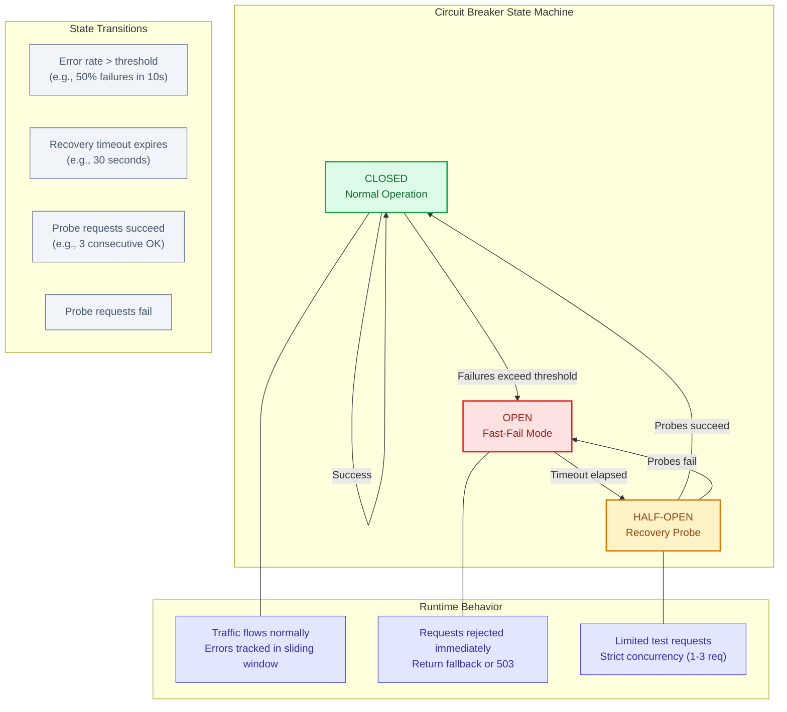
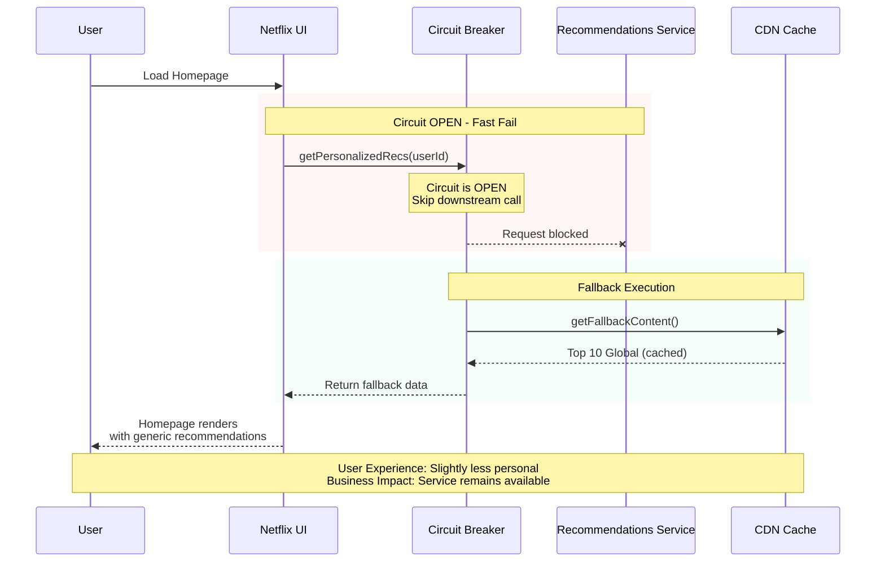

# Circuit Breaker

This guide covers 5 key areas: I. Executive Summary: The "Why" for Mag7, II. Real-World Behavior at Mag7, III. Architectural & Operational Tradeoffs, IV. Impact on Business, ROI, and CX, V. The Principal TPM's Design Review Checklist.

## I. Executive Summary: The "Why" for Mag7
At Mag7 scale (Google, Amazon, Meta, etc.), hardware and software failures are not anomalies; they are statistical certainties. When a downstream dependency fails (e.g., a database, a payment gateway, or a recommendation microservice), the default behavior of a caller is often to wait for a timeout or retry.

If thousands of upstream services keep waiting or retrying against a dead dependency, two catastrophic things happen:
1.  **Resource Exhaustion:** The calling services run out of threads/connections waiting for responses, causing them to crash (Cascading Failure).
2.  **The "Death Spiral":** The failing dependency is hammered with retry traffic, preventing it from ever recovering.

The **Circuit Breaker** is a software design pattern used to detect failures and encapsulate the logic of preventing a failure from constantly recurring. It stops the flow of traffic to a failing service to allow it time to recover, while returning a "fail-fast" error or a fallback response to the user.

**The Three States:**
1.  **Closed (Normal):** Traffic flows through. If error rates stay below a threshold, it stays closed.
2.  **Open (Broken):** Error threshold exceeded. The circuit "trips." All requests are immediately blocked without calling the downstream service.
3.  **Half-Open (Testing):** After a set time, the circuit allows a limited number of "test" requests through. If they succeed, the circuit closes (resumes normal op). If they fail, it re-opens.

## II. Real-World Behavior at Mag7
As a Principal TPM, you aren't coding the breaker, but you are defining the requirements for **Resiliency** and **User Experience (CX)** during failure scenarios.

### 1. The "Fail Fast" vs. "Hang" Dynamic (Amazon Example)
**Scenario:** It is Prime Day. The "Add to Cart" service depends on an "Inventory Check" service. The Inventory service becomes overloaded and slow.
*   **Without Circuit Breaker:** The user clicks "Add to Cart." The browser spins for 30 seconds. The user gets frustrated, refreshes the page (adding more load), or abandons the cart. The web server threads are tied up waiting, eventually crashing the web server.
*   **With Circuit Breaker:** The circuit trips after 100ms of latency. The user immediately sees "Item added to Saved for Later" or a generic "In Stock" message (optimistic inventory). The user flow continues; the web server threads are freed immediately.

### 2. Graceful Degradation (Netflix Example)
**Scenario:** The "Personalized Recommendations" microservice fails.
*   **Behavior:** The circuit breaker trips. Instead of showing an error page ("We cannot load Netflix"), the system executes a **Fallback**.
*   **Fallback Strategy:** The client serves a static list of "Top 10 Global Movies" cached locally or from a highly available CDN.
*   **Mag7 Context:** This is the difference between a Sev-1 outage (Service Down) and a Sev-3 incident (Degraded Experience).

### 3. Implementation: Library vs. Service Mesh
In modern Mag7 architectures (Kubernetes/Cloud-Native), Circuit Breakers are moving out of the application code (e.g., Hystrix, Resilience4j) and into the **Service Mesh** (e.g., Envoy, Istio).
*   *Principal TPM Takeaway:* You should advocate for Service Mesh implementation to ensure consistent resiliency policies across polyglot environments (Java, Go, Python services all managed by one config).

## III. Architectural & Operational Tradeoffs
Every architectural choice has a cost. A Principal TPM must weigh these during design reviews.

### 1. Complexity vs. Resiliency
*   **Tradeoff:** Implementing circuit breakers introduces state management challenges. You now have to monitor the state of the breaker (Open/Closed).
*   **Risk:** If configured incorrectly (e.g., threshold too sensitive), the circuit may "flap" (open/close rapidly), causing healthy services to appear down.
*   **Mitigation:** Requires mature Observability (metrics/dashboards) to tune thresholds effectively.

### 2. Data Consistency vs. Availability (CAP Theorem)
*   **Tradeoff:** When a circuit trips and you use a fallback (e.g., a cache), you are prioritizing **Availability** over **Consistency**.
*   **Risk:** A user might see stale data (e.g., an old credit card balance) because the live service was cut off.
*   **TPM Decision:** You must define with Product/Engineering if showing stale data is acceptable for that specific feature. (Acceptable for Netflix recommendations; Unacceptable for Bank Transfers).

### 3. The "Thundering Herd" in Half-Open State
*   **Tradeoff:** When the circuit switches to "Half-Open," if too much traffic is allowed through to test recovery, you might instantly knock the recovering service back down.
*   **Risk:** Extending the outage duration.
*   **Mitigation:** Exponential backoff strategies and strict concurrency limits on the Half-Open state.

## IV. Impact on Business, ROI, and CX
This is where the Principal TPM bridges the gap between code and the boardroom.

### 1. CX Impact: Latency is the Enemy of Revenue
*   **Impact:** Amazon found that every 100ms of latency cost 1% in sales. Circuit breakers enforce **Upper Bound Latency**.
*   **Benefit:** By failing fast (e.g., in 50ms) rather than waiting for a 5-second timeout, you preserve the user's perception of speed, even during errors. This retains user engagement.

### 2. ROI: Infrastructure Cost Savings
*   **Impact:** Without circuit breakers, teams often over-provision infrastructure (Auto-scaling) to handle the load caused by retries during partial outages.
*   **Benefit:** Circuit breakers stop the "retry storm." You do not pay for compute resources that are simply waiting for a timeout. This directly improves the **COGS (Cost of Goods Sold)** efficiency of the service.

### 3. Business Capability: SLA Preservation
*   **Impact:** Mag7 services often have 99.99% availability SLAs.
*   **Benefit:** A circuit breaker prevents a failure in a non-critical dependency (e.g., "User Avatar Service") from bringing down the critical path (e.g., "Checkout"). This allows the platform to maintain its overall SLA even when sub-components fail.

## V. The Principal TPM's Design Review Checklist
When reviewing a Technical Design Document (TDD) involving inter-service communication, ask these specific questions:

1.  **Definition of Failure:** "What constitutes a failure? Is it HTTP 500 errors, or is it latency exceeding 200ms? Have we tuned the sensitivity so we don't trip on blips?"
2.  **Fallback Strategy:** "When the circuit opens, what does the user see? Do we have a cached fallback, or do we show an error? Is the fallback automated?"
3.  **Recovery Protocol:** "How do we know the downstream service is healthy again? Is the 'Half-Open' check manual or automated?"
4.  **Observability:** "Will we get an alert when the circuit opens? (If a circuit opens and nobody knows, you are hiding a production fire)."
5.  **Idempotency:** "If the circuit trips during a write operation (e.g., payment), how do we ensure the transaction isn't duplicated when the system recovers?"

---

## Interview Questions

### I. Executive Summary: The "Why" for Mag7

### Question 1: The Cascading Failure Scenario
**"You are TPM for an e-commerce checkout platform. During a flash sale, the inventory service starts responding slowly (5-second latency instead of 100ms). Within minutes, the entire checkout flow is unresponsive, and you're losing millions in revenue. Walk me through what's happening technically and how circuit breakers would have prevented this."**

**Guidance for a Strong Answer:**
*   **Technical Root Cause:** Explain thread/connection exhaustion. Each checkout request waits 5 seconds for inventory. With 10,000 concurrent users and a 50-thread pool, you're instantly at capacity. New requests queue, timeouts cascade upstream.
*   **The Death Spiral:** Users refresh, doubling load. The inventory service, already struggling, now faces even more requests from retries.
*   **Circuit Breaker Solution:** After detecting sustained high latency (e.g., 50% of requests &gt;500ms in a 10-second window), the circuit opens. Checkout immediately returns a fallback ("Item reserved, confirming shortly") instead of waiting. Threads are freed in milliseconds, not seconds.
*   **Business Impact:** Convert a 30-minute outage into a 30-second degradation event.

### Question 2: Threshold Tuning Challenge
**"Your engineering team deployed circuit breakers across all microservices with identical default settings (50% error rate threshold, 30-second recovery timeout). One week later, you're seeing circuits 'flapping' constantly on your payment service, causing intermittent checkout failures. How do you diagnose and resolve this?"**

**Guidance for a Strong Answer:**
*   **Root Cause Analysis:** Payment gateways have legitimate intermittent failures (card declines, fraud blocks). A 50% threshold treats business logic rejections as system failures.
*   **Error Classification:** Distinguish between **retriable errors** (5xx, timeouts) and **non-retriable errors** (4xx, business logic). Only count retriable errors toward the threshold.
*   **Service-Specific Tuning:** Payment services need different thresholds than read-heavy services. Propose per-service SLO-based thresholds.
*   **Observability:** Implement dashboards showing circuit state transitions. If you can't see flapping, you can't debug it.

### II. Real-World Behavior at Mag7

### Question 1: Fallback Strategy Design
**"You're designing the fallback strategy for a personalized pricing service that fails during peak traffic. Product says users must see prices. Engineering says the cache is 6 hours stale. Finance says stale prices could cause margin loss. How do you resolve this three-way conflict?"**

**Guidance for a Strong Answer:**
*   **Quantify the Tradeoffs:** What's the cost of showing an error page (lost sales) vs. stale prices (potential margin loss) vs. a "Price at checkout" placeholder (conversion drop)?
*   **Tiered Fallback Strategy:** Propose a hierarchy: (1) Fresh cache (&lt;5 min), (2) Stale cache with "Price may vary" disclaimer, (3) Category average price, (4) Hide price and show "Add to cart to see price."
*   **Business Guardrails:** Implement a maximum staleness threshold. If cache is &gt;24 hours old, fail to a safe default rather than risk significant margin erosion.
*   **Post-Incident Reconciliation:** For any orders placed during degradation, run a batch job to flag orders where the actual price differed significantly from the displayed price.

### Question 2: Service Mesh vs. Library Decision
**"Your organization has 200+ microservices in four languages (Java, Go, Python, Node.js). The platform team wants to implement circuit breakers via Istio service mesh. The senior Java engineers prefer Resilience4j because 'they understand the code.' As TPM, how do you drive alignment?"**

**Guidance for a Strong Answer:**
*   **Consistency vs. Flexibility:** Service mesh provides uniform behavior regardless of language. Library-based approaches create drift and maintenance burden across 4 ecosystems.
*   **Operational Visibility:** Service mesh provides centralized observability (Kiali, Grafana). Library-based requires each team to instrument individually.
*   **Migration Strategy:** Don't force a "big bang." Propose mesh-level circuit breakers as the default, with library-level override capability for teams with edge cases.
*   **Governance:** Establish a standard policy: "All new services use mesh-level breakers. Existing services migrate by Q3."

### III. Architectural & Operational Tradeoffs

### Question 1: Consistency vs. Availability Decision
**"Your banking platform uses circuit breakers. During an outage, the circuit tripped on the account balance service, and the fallback showed cached balances from 4 hours ago. A customer transferred money they didn't have (based on stale balance), and now you're facing a regulatory complaint. How should this have been architected differently?"**

**Guidance for a Strong Answer:**
*   **Critical vs. Non-Critical Classification:** Balance display for transfers is critical (consistency required). Balance display for dashboard browsing is non-critical (availability preferred).
*   **Fallback Differentiation:** For write operations (transfers), the fallback should be "fail closed" (block the transaction) rather than "fail open" (allow with stale data).
*   **User Communication:** If showing stale data is unavoidable, the UI must clearly indicate "Balance as of [timestamp]" and disable actions that depend on accurate balance.
*   **Architectural Fix:** Implement a "freshness gate" that blocks financial operations if the circuit is open, even if display fallbacks are allowed.

### Question 2: The Half-Open Thundering Herd
**"After a 10-minute outage, your circuit breaker transitions to half-open state and sends a probe request to the recovering database. The probe succeeds, the circuit closes, and immediately 50,000 queued requests flood the database, crashing it again. How do you prevent this?"**

**Guidance for a Strong Answer:**
*   **Graduated Recovery:** Don't go from 0% to 100% traffic. Implement a "slow start" where the circuit allows 1%, then 5%, then 25%, then 100% over several minutes.
*   **Request Shedding:** During recovery, implement random request rejection (load shedding) to prevent the full queue from hitting the service simultaneously.
*   **Health Check Quality:** A single "OK" probe isn't sufficient. Require N consecutive successes under load before declaring full recovery.
*   **Backpressure Signaling:** The recovering service should be able to signal "I'm healthy but still warming up" to slow the rate of circuit closure.

### IV. Impact on Business, ROI, and CX

### Question 1: ROI Justification
**"The CFO is questioning the ROI of a circuit breaker implementation project that requires 3 engineering-months. 'We've had 2 outages in 18 months, each lasting 30 minutes. The cost doesn't justify the investment.' How do you counter this argument?"**

**Guidance for a Strong Answer:**
*   **Hidden Costs of Outages:** Calculate revenue loss per minute (not just 30 minutes × 2). Include customer service surge costs, promotional credits issued, and brand damage.
*   **Prevented Severity:** Without circuit breakers, those 30-minute outages could have been 3-hour cascading failures. The breakers (or manual intervention) limited blast radius.
*   **Opportunity Cost:** How much engineering time was spent on post-incident firefighting, war rooms, and post-mortems? That's time not spent on features.
*   **Indirect Benefits:** Circuit breakers enable faster deployment velocity because teams are less afraid of "breaking production."

### Question 2: SLA Preservation Strategy
**"Your platform has a 99.95% availability SLA. Your recommendation service runs at 99.5% availability. Without circuit breakers, every recommendation failure becomes a homepage failure. With circuit breakers and fallbacks, how does this change the SLA math?"**

**Guidance for a Strong Answer:**
*   **Dependency SLA Isolation:** Circuit breakers decouple the SLA of the fallback-enabled path from the dependency's SLA.
*   **Composite SLA Calculation:** Without breakers: Homepage SLA ≤ Recommendation SLA (99.5%). With breakers: Homepage SLA = min(Core Path SLA, Breaker+Fallback SLA).
*   **Fallback SLA:** If the CDN-cached fallback has 99.99% availability, the homepage can achieve 99.99% even when recommendations are at 99.5%.
*   **Business Impact:** This is how Mag7 companies hit "five nines" with systems that individually only hit "three nines."

### V. The Principal TPM's Design Review Checklist

### Question 1: Design Review Red Flags
**"You're reviewing a technical design document for a new payment processing service. The design mentions circuit breakers but provides no details on fallback behavior. What questions do you ask to ensure production readiness?"**

**Guidance for a Strong Answer:**
*   **Fallback Definition:** "What happens when the payment gateway circuit opens? Do we block the transaction, queue it, or allow it with deferred charging?"
*   **State Visibility:** "How will on-call engineers know when a circuit is open? Is there an alert? A dashboard?"
*   **Idempotency:** "If the circuit trips mid-transaction, how do we prevent double-charging when it recovers?"
*   **Threshold Justification:** "Why is the threshold set to 50%? Is that based on historical data or a guess?"
*   **Testing Plan:** "How will we verify the circuit breaker works correctly before production? Chaos engineering? Load testing?"

### Question 2: Cross-Functional Alignment
**"Product management wants a 'retry automatically' feature for failed orders, but your circuit breaker design intentionally fails fast without retries. How do you align these seemingly conflicting requirements?"**

**Guidance for a Strong Answer:**
*   **Separate Concerns:** Circuit breakers protect system stability (infrastructure concern). Retry-for-users is a UX feature (product concern). They can coexist.
*   **User-Level vs. System-Level Retry:** The system-level retry (immediate, within milliseconds) is blocked by the circuit breaker. The user-level retry (after 5 minutes, with user action) happens after the circuit has had time to recover.
*   **Deferred Processing Queue:** Propose a "retry queue" that holds failed requests and processes them after a delay, respecting the circuit state.
*   **Communication:** Frame it as "We're not removing retry, we're making retry smarter. Immediate retries during an outage make things worse. Delayed retries after recovery make things better."

---

## Key Takeaways

- Review each section for actionable insights applicable to your organization

- Consider the trade-offs discussed when making architectural decisions

- Use the operational considerations as a checklist for production readiness
