# Circuit Breaker

This guide covers 5 key areas: I. Executive Summary: The "Why" for Mag7, II. Real-World Behavior at Mag7, III. Architectural & Operational Tradeoffs, IV. Impact on Business, ROI, and CX, V. The Principal TPM's Design Review Checklist.

## I. Executive Summary: The "Why" for Mag7 ⚠️

*Note: This section may need additional review.*

At Mag7 scale (Google, Amazon, Meta, etc.), hardware and software failures are not anomalies; they are statistical certainties. When a downstream dependency fails (e.g., a database, a payment gateway, or a recommendation microservice), the default behavior of a caller is often to wait for a timeout or retry.

If thousands of upstream services keep waiting or retrying against a dead dependency, two catastrophic things happen:
1.  **Resource Exhaustion:** The calling services run out of threads/connections waiting for responses, causing them to crash (Cascading Failure).
2.  **The "Death Spiral":** The failing dependency is hammered with retry traffic, preventing it from ever recovering.

The **Circuit Breaker** is a software design pattern used to detect failures and encapsulate the logic of preventing a failure from constantly recurring. It stops the flow of traffic to a failing service to allow it time to recover, while returning a "fail-fast" error or a fallback response to the user.

**The Three States:**
1.  **Closed (Normal):** Traffic flows through. If error rates stay below a threshold, it stays closed.
2.  **Open (Broken):** Error threshold exceeded. The circuit "trips." All requests are immediately blocked without calling the downstream service.
3.  **Half-Open (Testing):** After a set time, the circuit allows a limited number of "test" requests through. If they succeed, the circuit closes (resumes normal op). If they fail, it re-opens.

```mermaid
stateDiagram-v2
    [*] --> Closed: Initial State

    Closed --> Closed: Success<br/>(error_count = 0)
    Closed --> Open: Error threshold<br/>exceeded

    Open --> Open: Requests<br/>immediately rejected
    Open --> HalfOpen: Timeout expires<br/>(recovery window)

    HalfOpen --> Closed: Test requests<br/>succeed
    HalfOpen --> Open: Test requests<br/>fail

    note right of Closed
        ✅ Normal operation
        Traffic flows to downstream
    end note

    note right of Open
        🛑 Fast-fail mode
        Return fallback/error immediately
        Downstream gets time to recover
    end note

    note right of HalfOpen
        🔍 Testing recovery
        Limited "probe" requests
        Strict concurrency limits
    end note
```

## II. Real-World Behavior at Mag7 ⚠️

*Note: This section may need additional review.*

As a Principal TPM, you aren't coding the breaker, but you are defining the requirements for **Resiliency** and **User Experience (CX)** during failure scenarios.

### 1. The "Fail Fast" vs. "Hang" Dynamic (Amazon Example)
**Scenario:** It is Prime Day. The "Add to Cart" service depends on an "Inventory Check" service. The Inventory service becomes overloaded and slow.
*   **Without Circuit Breaker:** The user clicks "Add to Cart." The browser spins for 30 seconds. The user gets frustrated, refreshes the page (adding more load), or abandons the cart. The web server threads are tied up waiting, eventually crashing the web server.
*   **With Circuit Breaker:** The circuit trips after 100ms of latency. The user immediately sees "Item added to Saved for Later" or a generic "In Stock" message (optimistic inventory). The user flow continues; the web server threads are freed immediately.

### 2. Graceful Degradation (Netflix Example)
**Scenario:** The "Personalized Recommendations" microservice fails.
*   **Behavior:** The circuit breaker trips. Instead of showing an error page ("We cannot load Netflix"), the system executes a **Fallback**.
*   **Fallback Strategy:** The client serves a static list of "Top 10 Global Movies" cached locally or from a highly available CDN.
*   **Mag7 Context:** This is the difference between a Sev-1 outage (Service Down) and a Sev-3 incident (Degraded Experience).

```mermaid
sequenceDiagram
    participant User
    participant UI as Netflix UI
    participant CB as Circuit Breaker
    participant Recs as Recommendations<br/>(Failed ❌)
    participant Cache as CDN Cache

    User->>UI: Load Homepage

    rect rgb(255, 235, 235)
        Note over CB,Recs: Circuit OPEN (tripped)
        UI->>CB: Get Recommendations
        CB--xRecs: ❌ Circuit Open<br/>Not calling downstream
    end

    rect rgb(235, 255, 235)
        Note over CB,Cache: Fallback Executes
        CB->>Cache: Get cached "Top 10"
        Cache-->>CB: Static Popular List
        CB-->>UI: Fallback Data
    end

    UI-->>User: Homepage loads<br/>(with generic recommendations)

    Note over User: User experience: "slightly less personal"<br/>NOT: "Netflix is down"
```

### 3. Implementation: Library vs. Service Mesh
In modern Mag7 architectures (Kubernetes/Cloud-Native), Circuit Breakers are moving out of the application code (e.g., Hystrix, Resilience4j) and into the **Service Mesh** (e.g., Envoy, Istio).
*   *Principal TPM Takeaway:* You should advocate for Service Mesh implementation to ensure consistent resiliency policies across polyglot environments (Java, Go, Python services all managed by one config).

## III. Architectural & Operational Tradeoffs ⚠️

*Note: This section may need additional review.*

Every architectural choice has a cost. A Principal TPM must weigh these during design reviews.

### 1. Complexity vs. Resiliency
*   **Tradeoff:** Implementing circuit breakers introduces state management challenges. You now have to monitor the state of the breaker (Open/Closed).
*   **Risk:** If configured incorrectly (e.g., threshold too sensitive), the circuit may "flap" (open/close rapidly), causing healthy services to appear down.
*   **Mitigation:** Requires mature Observability (metrics/dashboards) to tune thresholds effectively.

### 2. Data Consistency vs. Availability (CAP Theorem)
*   **Tradeoff:** When a circuit trips and you use a fallback (e.g., a cache), you are prioritizing **Availability** over **Consistency**.
*   **Risk:** A user might see stale data (e.g., an old credit card balance) because the live service was cut off.
*   **TPM Decision:** You must define with Product/Engineering if showing stale data is acceptable for that specific feature. (Acceptable for Netflix recommendations; Unacceptable for Bank Transfers).

### 3. The "Thundering Herd" in Half-Open State
*   **Tradeoff:** When the circuit switches to "Half-Open," if too much traffic is allowed through to test recovery, you might instantly knock the recovering service back down.
*   **Risk:** Extending the outage duration.
*   **Mitigation:** Exponential backoff strategies and strict concurrency limits on the Half-Open state.

## IV. Impact on Business, ROI, and CX ⚠️

*Note: This section may need additional review.*

This is where the Principal TPM bridges the gap between code and the boardroom.

### 1. CX Impact: Latency is the Enemy of Revenue
*   **Impact:** Amazon found that every 100ms of latency cost 1% in sales. Circuit breakers enforce **Upper Bound Latency**.
*   **Benefit:** By failing fast (e.g., in 50ms) rather than waiting for a 5-second timeout, you preserve the user's perception of speed, even during errors. This retains user engagement.

### 2. ROI: Infrastructure Cost Savings
*   **Impact:** Without circuit breakers, teams often over-provision infrastructure (Auto-scaling) to handle the load caused by retries during partial outages.
*   **Benefit:** Circuit breakers stop the "retry storm." You do not pay for compute resources that are simply waiting for a timeout. This directly improves the **COGS (Cost of Goods Sold)** efficiency of the service.

### 3. Business Capability: SLA Preservation
*   **Impact:** Mag7 services often have 99.99% availability SLAs.
*   **Benefit:** A circuit breaker prevents a failure in a non-critical dependency (e.g., "User Avatar Service") from bringing down the critical path (e.g., "Checkout"). This allows the platform to maintain its overall SLA even when sub-components fail.

## V. The Principal TPM's Design Review Checklist ⚠️

*Note: This section may need additional review.*

When reviewing a Technical Design Document (TDD) involving inter-service communication, ask these specific questions:

1.  **Definition of Failure:** "What constitutes a failure? Is it HTTP 500 errors, or is it latency exceeding 200ms? Have we tuned the sensitivity so we don't trip on blips?"
2.  **Fallback Strategy:** "When the circuit opens, what does the user see? Do we have a cached fallback, or do we show an error? Is the fallback automated?"
3.  **Recovery Protocol:** "How do we know the downstream service is healthy again? Is the 'Half-Open' check manual or automated?"
4.  **Observability:** "Will we get an alert when the circuit opens? (If a circuit opens and nobody knows, you are hiding a production fire)."
5.  **Idempotency:** "If the circuit trips during a write operation (e.g., payment), how do we ensure the transaction isn't duplicated when the system recovers?"

---

## Key Takeaways

- Review each section for actionable insights applicable to your organization

- Consider the trade-offs discussed when making architectural decisions

- Use the operational considerations as a checklist for production readiness
