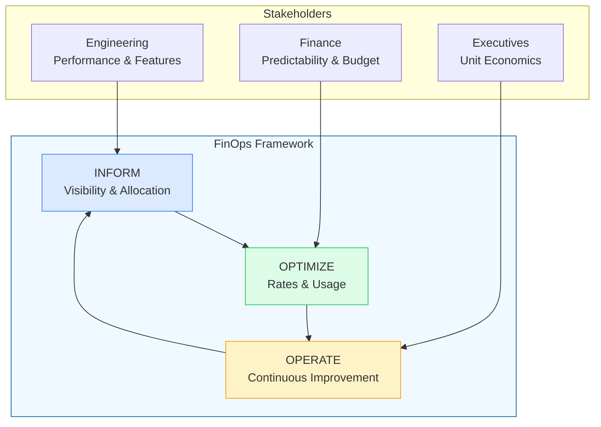
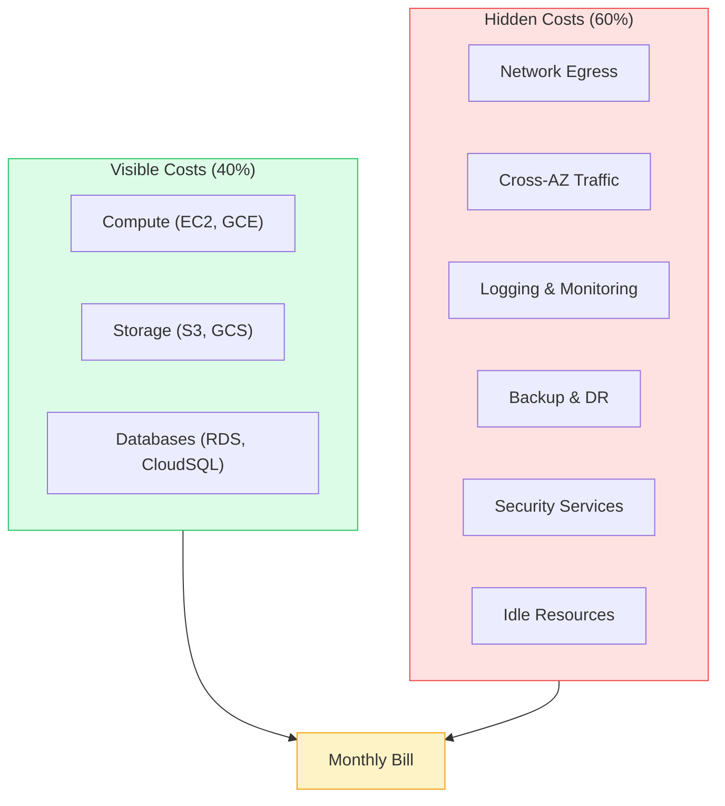
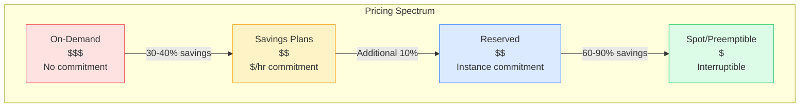
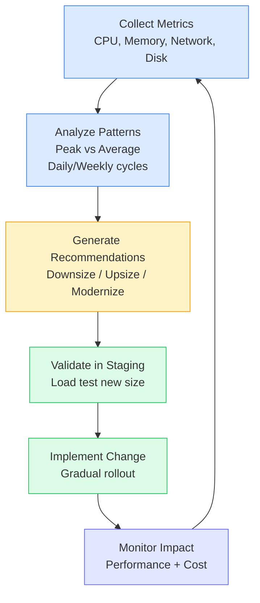
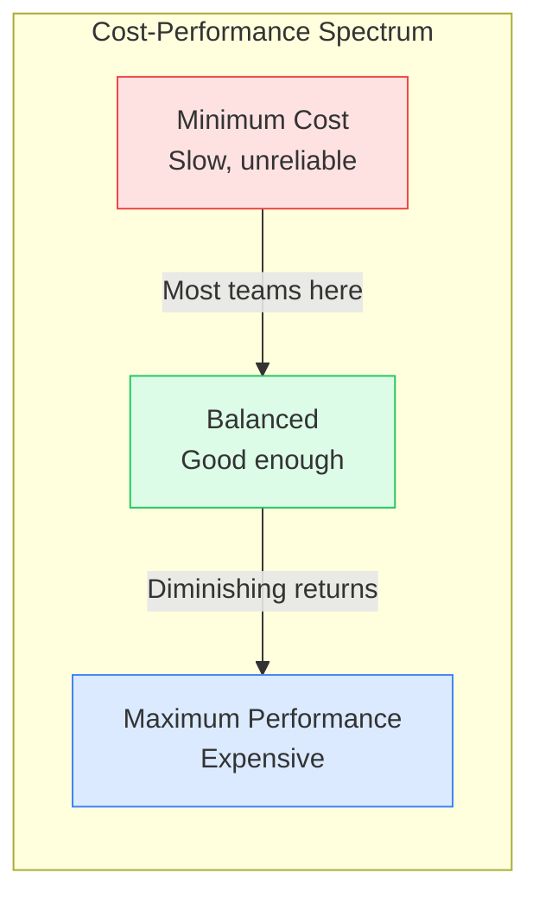

# Cloud Economics (FinOps)

This guide covers 5 key areas: I. Executive Summary: The Financial Fabric of Cloud, II. Technical Mechanics: Cost Models and Optimization, III. Real-World Behavior at Mag7, IV. Critical Tradeoffs, V. Impact on Business, ROI, and CX.

## I. Executive Summary: The Financial Fabric of Cloud

At the Principal TPM level, Cloud Economics transcends simple cost-cutting—it becomes a strategic lever that shapes architecture decisions, influences product roadmaps, and directly impacts company margins. In Mag7 environments where cloud spend can exceed $1 billion annually, understanding the financial mechanics of infrastructure is not optional; it is a core competency that distinguishes senior technical leaders.

### 1. The FinOps Movement: Engineering Meets Finance

FinOps (Cloud Financial Operations) represents the convergence of technology, business, and finance in cloud environments. Unlike traditional IT cost management (buy hardware, depreciate over years), cloud introduces variable, consumption-based costs that can spiral without disciplined governance.

**The Three Pillars of FinOps:**
*   **Inform:** Create visibility into cloud spend through tagging, cost allocation, and showback/chargeback models.
*   **Optimize:** Right-size resources, leverage commitment discounts, eliminate waste.
*   **Operate:** Embed cost awareness into engineering culture and decision-making processes.

**Mag7 Reality:**
At **Google**, cloud cost optimization is baked into performance reviews. Engineers who reduce infrastructure costs while maintaining SLOs are recognized alongside those who ship features. At **Amazon**, the "frugality" leadership principle manifests in weekly cost review meetings where teams justify their spend against business metrics.

### 2. The Cost Iceberg: Visible vs. Hidden Costs

When executives see cloud bills, they typically see compute and storage—the tip of the iceberg. Hidden beneath are costs that can exceed the visible ones:

**Hidden Cost Categories:**
*   **Network Egress:** Data leaving AWS costs ~$0.09/GB. A service streaming 100TB/month pays $9,000 just for bandwidth out.
*   **Cross-AZ Traffic:** Internal traffic between AZs costs ~$0.01/GB each way. Microservice architectures with chattychatter services can accumulate significant costs.
*   **Observability Stack:** CloudWatch Logs ingestion ($0.50/GB), log retention, custom metrics ($0.30/metric/month). A large deployment can spend more on monitoring than compute.
*   **Idle Resources:** Dev/test environments running 24/7, over-provisioned databases, forgotten EBS volumes. Industry average: 30% of cloud spend is waste.

**TPM Implication:**
Your role is to make the iceberg visible. Implement tagging strategies, build cost dashboards by team/service/feature, and create accountability mechanisms. Without visibility, optimization is guesswork.

### 3. Unit Economics: The North Star Metric

Mature cloud operations focus on **unit economics**—the cost to serve one user, process one transaction, or store one record. This shifts the conversation from "our cloud bill is $2M/month" to "our cost-per-transaction dropped 15% this quarter."

**Key Unit Economics Metrics:**
*   **Cost per Request:** Infrastructure cost / total API requests
*   **Cost per Active User:** Monthly infrastructure / MAU
*   **Cost per GB Stored:** Storage costs / data volume
*   **Cost per Video Minute Streamed:** Compute + bandwidth / minutes delivered

**Mag7 Examples:**
*   **Netflix:** Tracks cost-per-stream-hour. Encoding optimization that reduces file sizes by 20% translates directly to 20% CDN cost reduction.
*   **Meta:** Measures cost-per-DAU across regions. Infrastructure efficiency improvements directly impact earnings per share.
*   **Google Search:** Cost-per-query is a closely guarded metric that drives continuous efficiency investment.

### 4. The Multi-Cloud Cost Complexity

Many enterprises pursue multi-cloud strategies for resilience or avoiding vendor lock-in. The hidden cost: operational complexity and lost volume discounts.

**Multi-Cloud Cost Multipliers:**
*   **Data Transfer:** Moving data between clouds is expensive ($0.05-0.12/GB both directions)
*   **Skill Fragmentation:** Teams must learn multiple platforms, reducing efficiency
*   **Tooling Duplication:** Separate monitoring, security, and deployment tools per cloud
*   **Discount Dilution:** Volume discounts require spend concentration; spreading spend reduces leverage

**When Multi-Cloud Makes Sense:**
*   Regulatory requirements (data sovereignty mandating specific regions)
*   Acquiring companies on different clouds (short-term pragmatism)
*   Specific best-of-breed services (e.g., GCP for ML, AWS for breadth)

**TPM Guidance:**
Default to single-cloud unless there's a compelling business case. The "flexibility" of multi-cloud often costs more than the "lock-in" it avoids.

### 5. ROI and Capabilities Summary

Implementing robust FinOps practices drives measurable outcomes:
*   **15-30% cost reduction** in first year through waste elimination and right-sizing
*   **Improved forecasting accuracy** enabling better financial planning
*   **Faster innovation** by freeing budget for new initiatives
*   **Cultural shift** where engineering teams own their unit economics

## II. Technical Mechanics: Cost Models and Optimization

### 1. Cloud Pricing Models Decoded

Cloud providers offer multiple pricing tiers, each optimized for different use cases. Understanding these is fundamental to cost optimization.

**On-Demand (Baseline):**
*   Full price, maximum flexibility
*   Best for: Unpredictable workloads, short-term projects, initial capacity testing
*   Trap: Running steady-state workloads on-demand is leaving money on the table

**Reserved Instances (1-3 Year Commitment):**
*   30-72% savings depending on term and payment (all upfront vs. partial)
*   Best for: Baseline capacity that runs 24/7
*   Considerations: Lock-in to instance family, region, and OS. AWS offers convertible RIs with less discount but more flexibility.

**Savings Plans (AWS-Specific):**
*   Commit to $/hour spend, not specific instances
*   More flexible than RIs—applies across instance families and even services (Compute Savings Plans include Lambda, Fargate)
*   Best for: Organizations with diverse compute needs that evolve over time

**Spot/Preemptible Instances:**
*   60-90% savings, but instances can be terminated with 2-minute notice
*   Best for: Stateless batch jobs, CI/CD runners, ML training, fault-tolerant workloads
*   Implementation: Use diversified instance types, implement graceful shutdown handlers, design for checkpoint/restart

### 2. Storage Tiering Strategy

Storage costs compound over time as data accumulates. Tiering is essential for cost control.

| Tier | AWS Name | Cost (approx) | Access Pattern | Use Case |
|------|----------|---------------|----------------|----------|
| Hot | S3 Standard | $0.023/GB | Frequent | Active application data |
| Warm | S3 Standard-IA | $0.0125/GB | Monthly | Backups accessed for compliance |
| Cold | S3 Glacier Instant | $0.004/GB | Quarterly | Archive with occasional access |
| Archive | Glacier Deep Archive | $0.00099/GB | Yearly | Long-term retention, rarely accessed |

**Key Insight:** Retrieval costs on cold storage are significant. Glacier Deep Archive charges ~$0.02/GB to retrieve. Retrieving 10TB costs $200. Factor this into TCO calculations.

**Intelligent Tiering:**
AWS S3 Intelligent-Tiering automatically moves objects between tiers based on access patterns. Small monitoring fee ($0.0025/1000 objects) but eliminates manual lifecycle management.

### 3. Network Cost Engineering

At scale, network costs can exceed compute. Engineering for network efficiency is critical.

**Cost Reduction Strategies:**

*   **VPC Endpoints:** Access AWS services via private network instead of internet. Saves egress costs and improves security.
*   **Data Locality:** Process data where it lives. Moving 1TB to compute costs $90. Moving compute to data costs $0.
*   **Compression:** gzip reduces payload size by 70-90% for text. Brotli is 15-25% better than gzip.
*   **CDN Placement:** Serve static assets from edge. CloudFront transfer is cheaper than EC2 egress ($0.085 vs $0.09/GB, with volume discounts to $0.02).
*   **Regional Consolidation:** Cross-region replication doubles data transfer costs. Only replicate what's necessary for DR/compliance.

### 4. Right-Sizing Framework

Right-sizing is the continuous process of matching instance sizes to actual resource consumption.

**Common Right-Sizing Patterns:**
*   **CPU-bound services:** Check if average utilization is &lt;40%. Consider smaller instance or burstable (T-series).
*   **Memory-bound services:** R-series instances offer more RAM per dollar than M-series.
*   **Network-bound services:** Check if instance network bandwidth is the bottleneck before adding more instances.
*   **GPU workloads:** Ensure GPU utilization is high. Idle GPUs are expensive paperweights.

**Tools:**
*   AWS Cost Explorer Right Sizing Recommendations
*   GCP Recommender
*   Third-party: CloudHealth, Spot.io, Densify

## III. Real-World Behavior at Mag7

### 1. Google: The FinOps Pioneer

Google's internal infrastructure culture, built over two decades, treats efficiency as a first-class concern. This manifests in several practices:

**Borg Resource Quotas:**
Every team at Google operates within resource quotas. Exceeding quotas requires escalation and justification. This creates natural pressure for efficiency.

**CUD (Committed Use Discounts) Strategy:**
GCP's committed use model commits to a dollar amount for a region and machine family. Google internally pioneered this flexibility—commit to spend, not specific resources.

**Efficiency Bonuses:**
Engineers who improve efficiency metrics (queries per server, cost per API call) are recognized in performance reviews. This aligns incentives.

**Mag7 Insight:**
When interviewing at Google, demonstrate understanding that cost efficiency and engineering excellence are not opposing forces—they're complementary. Efficient systems are often better architected systems.

### 2. Amazon: Frugality as a Leadership Principle

At Amazon, "frugality" is one of 16 Leadership Principles. This manifests throughout the organization:

**Weekly Business Reviews (WBRs):**
Teams present metrics including unit economics. "Why did cost-per-transaction increase 3% this week?" is a normal question.

**The "Two-Pizza Team" Model:**
Small teams own their services end-to-end, including costs. This creates accountability that large, centralized teams lack.

**Internal RI Exchange:**
Amazon runs an internal marketplace where teams can trade reserved capacity. A team with excess RI capacity can "sell" it to another team, optimizing company-wide utilization.

### 3. Netflix: Content Delivery Economics

Netflix's business model makes bandwidth costs existential. They've invested heavily in Open Connect, their custom CDN:

**Open Connect Appliances (OCAs):**
Netflix places servers directly in ISP data centers worldwide. This reduces transit costs (paid bandwidth between networks) by 95%+.

**Encoding Efficiency:**
Every percentage improvement in video encoding efficiency translates to bandwidth savings across millions of streams. This justifies significant investment in codec research.

**Per-Title Encoding:**
Instead of one-size-fits-all encoding profiles, Netflix analyzes each title and creates custom encoding ladders. A simple animation needs less bitrate than an action movie.

### 4. Meta: Scale Efficiency

At Meta's scale (3+ billion users), even small efficiency gains are worth millions:

**Custom Hardware:**
Meta designs custom servers, storage, and network switches. By removing features they don't need, they reduce cost and power consumption.

**Data Center Design:**
Open Compute Project (OCP) specifications for efficient, sustainable data centers. Shared with the industry but Meta benefits from ecosystem scale.

**Efficiency Teams:**
Dedicated teams focused solely on improving queries-per-watt and operations-per-dollar. These are prestigious roles, not cost centers.

## IV. Critical Tradeoffs

### 1. Cost vs. Performance

The fundamental tension: spending less often means slower or less reliable systems. The art is finding the optimal point.

**Decision Framework:**
1. Define acceptable performance SLOs (p99 latency, availability)
2. Find minimum infrastructure that meets SLOs
3. Add headroom for growth (typically 30-50%)
4. Resist gold-plating without business justification

**Anti-Pattern:** Over-provisioning "just in case." This is fear-driven, not data-driven. Use auto-scaling and monitoring to right-size continuously.

### 2. Commitment vs. Flexibility

Reserved capacity offers significant savings but reduces flexibility. The tradeoff:

| Aspect | On-Demand | Reserved/Committed |
|--------|-----------|-------------------|
| Cost | 100% | 30-70% |
| Flexibility | Maximum | Limited |
| Risk | Low | Stranded capacity |
| Planning | None | Forecasting required |

**Optimal Strategy:**
*   Reserve baseline (steady-state minimum capacity): 60-70% coverage
*   On-demand for variable load
*   Spot for fault-tolerant batch workloads

**Caveat:** Don't over-commit. Unused reservations are sunk costs. Better to under-reserve slightly than have stranded capacity.

### 3. Build vs. Buy

For specialized workloads, the build-vs-buy decision has significant cost implications:

**Build (Self-Managed):**
*   Lower direct costs (EC2 instead of managed service)
*   Higher operational costs (engineering time, on-call burden)
*   More flexibility and control
*   Risk: underestimating operational complexity

**Buy (Managed Service):**
*   Higher direct costs (premium for management)
*   Lower operational costs (provider handles maintenance)
*   Faster time to market
*   Risk: vendor lock-in, feature limitations

**TPM Framework:**
Calculate fully-loaded cost including engineering time. If two engineers spend 20% of time managing a self-hosted database, that's 0.4 FTE × $300K = $120K/year in hidden cost. Often exceeds the managed service premium.

### 4. Single Cloud vs. Multi-Cloud

| Aspect | Single Cloud | Multi-Cloud |
|--------|--------------|-------------|
| Costs | Lower (volume discounts) | Higher (complexity + egress) |
| Operations | Simpler | Complex |
| Resilience | Provider-dependent | Theoretically higher |
| Negotiation | Less leverage | Perceived leverage |

**Reality Check:** True multi-cloud (same workload running on multiple clouds) is rare and expensive. More common: multi-cloud by accident (different teams chose different clouds) or by acquisition.

## V. Impact on Business, ROI, and CX

### 1. FinOps ROI Calculation

Implementing FinOps practices yields measurable returns:

**Typical Year-1 Savings:**
*   Waste elimination (idle resources): 15-20% of spend
*   Right-sizing: 10-15% of compute spend
*   Reserved instance optimization: 20-30% of steady-state compute
*   Combined: 25-40% total cost reduction

**Investment Required:**
*   FinOps tooling: $50K-200K/year (CloudHealth, Spot.io, etc.)
*   FinOps engineer/team: $150K-400K/year
*   Engineering time for optimization: Variable

**ROI Example:**
*   Current cloud spend: $10M/year
*   FinOps investment: $300K/year
*   Savings achieved: 30% = $3M/year
*   Net benefit: $2.7M/year
*   ROI: 900%

### 2. Impact on Product Development

Cloud economics directly influences what products get built:

**Feature Viability:**
Some features are only viable at certain cost points. Real-time video processing might be too expensive at launch but viable after optimization.

**Pricing Strategy:**
Understanding cost-per-user enables data-driven pricing. If serving a user costs $1/month, pricing at $5/month gives 80% margin.

**Geographic Expansion:**
Some regions are more expensive (data sovereignty requirements, smaller scale). Unit economics drive expansion decisions.

### 3. Customer Experience Connection

Infrastructure efficiency can improve CX, not just reduce costs:

**Latency Optimization:**
Moving compute closer to users (edge computing) reduces latency AND egress costs. Win-win.

**Availability Investment:**
Money saved on waste can fund redundancy that improves uptime.

**Feature Investment:**
Efficiency savings fund new features that delight customers.

## Interview Questions

### I. Executive Summary: The Financial Fabric of Cloud

### Question 1: FinOps Program Kickoff
**"You've joined as Principal TPM at a Series D startup. Cloud spend is $5M/month and growing 20% quarterly, but nobody knows which teams or features drive costs. The CFO wants answers before the next board meeting. How do you establish visibility and prioritize cost optimization?"**

**Guidance for a Strong Answer:**
*   **Phase 1 - Immediate (Week 1-2):** Implement mandatory tagging policy (team, service, environment). Retroactively tag top 20 resources by spend. This gives 80% visibility quickly.
*   **Phase 2 - Quick Wins (Week 3-4):** Run AWS Cost Explorer recommendations. Terminate obvious waste (dev environments running 24/7, unattached EBS volumes). Target 10-15% savings.
*   **Phase 3 - Unit Economics (Month 2):** Calculate cost-per-transaction for top 5 services. This shifts conversation from "total spend" to "efficiency per business outcome."
*   **Board Presentation:** Show spend breakdown by team, quick-win savings achieved, unit economics trends, and proposed RI/Savings Plan strategy for next quarter.

### Question 2: Feature Cost Justification
**"A product team wants to launch a real-time recommendation feature. Engineering estimates it will increase cloud costs by $500K/month (40% increase). Product claims it will improve conversion by 5%. How do you evaluate this request as Principal TPM?"**

**Guidance for a Strong Answer:**
*   **Business Case Validation:** 5% conversion improvement on $100M GMV = $5M/month additional revenue. $500K cost for $5M revenue = 10:1 ROI. If the conversion estimate is even half right, it's a strong business case.
*   **Challenge Assumptions:** Require A/B test data. "Claims 5%" is not the same as "measured 5%." Push for a limited rollout to validate.
*   **Optimization Path:** Can we achieve similar results at lower cost? Batch recommendations updated hourly vs. real-time? Start with most valuable users only?
*   **Sunset Plan:** If after 3 months the conversion lift isn't realized, what's the exit strategy? Don't let experimental features become permanent cost.

### II. Technical Mechanics: Cost Models and Optimization

### Question 1: Commitment Strategy Design
**"You're responsible for cloud cost optimization at a company with $20M annual AWS spend. Currently 90% is on-demand. Finance wants predictability, Engineering wants flexibility. Design a commitment strategy that balances both."**

**Guidance for a Strong Answer:**
*   **Baseline Analysis:** Review 12-month usage patterns. Identify minimum steady-state (the lowest usage point). This is your safe reservation target.
*   **Tiered Approach:** Reserve 50-60% of steady-state with 3-year CUDs (maximum savings). Reserve additional 20-30% with 1-year Savings Plans (flexibility). Remaining 20-30% on-demand for burst.
*   **Monitoring:** Implement weekly coverage reports. If utilization exceeds 90% consistently, under-reserved. If &lt;70%, over-reserved.
*   **Governance:** Create a quarterly reservation review cadence. Commitments should match evolving architecture.
*   **Risk Mitigation:** Use convertible RIs or Savings Plans over standard RIs. The 5-10% discount sacrifice is worth the flexibility.

### Question 2: Network Cost Crisis
**"Your data engineering team is running cross-region Spark jobs and suddenly the network egress bill is $200K/month—10x the previous month. Walk me through investigation and remediation."**

**Guidance for a Strong Answer:**
*   **Immediate Investigation:** Check VPC Flow Logs for top talkers. Identify which services are generating egress. Is it data transfer between regions or to the internet?
*   **Root Cause Likely:** Spark shuffle traffic crossing region boundaries. A job that used to process data locally now reads from a different region.
*   **Remediation Options:** (1) Move compute to data (process in the region where data lives), (2) Pre-stage data to compute region during off-peak hours, (3) Compress intermediate data, (4) Use S3 Transfer Acceleration if cross-region is unavoidable.
*   **Prevention:** Implement cost anomaly alerts (AWS Cost Anomaly Detection). Set threshold at 2x normal spend to catch issues early.

### III. Real-World Behavior at Mag7

### Question 1: Culture Change Initiative
**"You're joining Google as Principal TPM. Engineering teams are measured on features shipped, not efficiency. How do you shift culture toward cost ownership without creating adversarial dynamics?"**

**Guidance for a Strong Answer:**
*   **Start with Visibility, Not Mandates:** Implement showback dashboards before chargeback. Let teams see their costs without punishing them initially.
*   **Align Incentives:** Work with HR/leadership to include "efficiency metrics" in performance criteria. "Improved cost-per-request by 20%" should be recognized like "shipped feature X."
*   **Positive Framing:** Position efficiency as engineering excellence. "We made it 3x more efficient" sounds better than "we cut costs by 60%."
*   **Quick Win Showcase:** Publicly celebrate teams who find major optimizations. Create heroes, not villains.
*   **Guardrails Over Gates:** Set budget alerts and spending limits rather than requiring approval for every resource. Trust teams but verify through monitoring.

### Question 2: Unit Economics at Scale
**"At Netflix, cost-per-stream-hour is a key metric. Explain how unit economics thinking changes as a company scales from 1M to 100M users."**

**Guidance for a Strong Answer:**
*   **At 1M Users:** Unit economics are dominated by fixed costs (base infrastructure, engineering team). Cost-per-user is high and decreasing rapidly with each new user.
*   **At 100M Users:** Fixed costs become negligible per-user. Variable costs (bandwidth, storage, compute) dominate. Focus shifts to optimizing marginal cost.
*   **Efficiency Investment ROI:** At 1M users, a 10% efficiency gain saves $X. At 100M users, that same 10% gain saves 100X. This justifies dedicated efficiency teams.
*   **Regional Variation:** At scale, unit economics vary by region. A user in a Tier-1 data center market costs less than a user requiring edge infrastructure in a remote region.
*   **Strategic Implication:** At massive scale, even 1% efficiency improvement justifies significant engineering investment. Netflix's per-title encoding project is only viable at their scale.

### IV. Critical Tradeoffs

### Question 1: Over-Provisioning vs. Risk
**"Engineering wants to provision 3x current capacity 'for safety' before Black Friday. Finance says it's wasteful. You're the TPM caught in the middle. How do you find the right answer?"**

**Guidance for a Strong Answer:**
*   **Quantify the Risk:** What's the cost of downtime during Black Friday? If 1 hour of downtime costs $10M and 3x capacity costs $500K, the insurance math is clear.
*   **Demand Forecasting:** Analyze historical Black Friday traffic patterns. Is 3x realistic? Last year's growth rate? Marketing promotion plans?
*   **Staged Approach:** Pre-provision 2x as baseline. Configure auto-scaling to burst to 3x. Keep warm pools ready for instant scale. This reduces standing cost while maintaining safety.
*   **Commitment Structure:** Use on-demand or short-term spot for the burst capacity. Don't reserve capacity you'll only need one week per year.
*   **Post-Event Analysis:** Track actual peak utilization. Use data to improve next year's forecasting.

### Question 2: Multi-Cloud Reality Check
**"The CTO wants to implement a multi-cloud strategy to 'avoid vendor lock-in' and 'improve negotiating leverage.' You've seen this movie before. How do you provide a balanced perspective?"**

**Guidance for a Strong Answer:**
*   **Hidden Costs of Multi-Cloud:** Data egress between clouds ($0.05-0.12/GB), skill fragmentation (engineers learning two platforms), tooling duplication, and lost volume discounts.
*   **Lock-In Reality:** True portability requires designing for lowest common denominator, limiting access to differentiated features that provide competitive advantage.
*   **Negotiation Leverage Myth:** Cloud providers know multi-cloud is expensive. They're often willing to match pricing with single-cloud commitment because they know you'll spend more overall.
*   **When Multi-Cloud Makes Sense:** Regulatory requirements (data sovereignty), M&A (acquired company on different cloud), best-of-breed for specific use cases (GCP for ML).
*   **Alternative:** Design for cloud portability at the application layer (containers, Kubernetes) without actually running multi-cloud. You get optionality without operational complexity.

### V. Impact on Business, ROI, and CX

### Question 1: FinOps ROI Skeptic
**"The VP of Engineering says FinOps is 'overhead that slows teams down.' They'd rather 'move fast and worry about costs later.' How do you counter this argument without creating an adversarial relationship?"**

**Guidance for a Strong Answer:**
*   **Acknowledge Valid Concerns:** Excessive gates and approval processes do slow teams. Bad FinOps implementations create bureaucracy.
*   **Reframe as Enablement:** Position FinOps as visibility + guardrails, not gates + approvals. "See your costs in real-time" not "get approval for every resource."
*   **Show the Alternative Cost:** Calculate engineering time spent on fire drills when costs spike unexpectedly. That's time not spent on features.
*   **Quick Win Demonstration:** Find one team drowning in cloud costs. Help them optimize. Use the savings to fund a new project they want. Create an advocate.
*   **Investment Framing:** Money saved on waste is money available for new initiatives. FinOps isn't cutting costs—it's reallocating investment.

### Question 2: Cost Spike Investigation
**"Your team's cloud costs increased 50% month-over-month with no corresponding traffic increase. Walk me through your investigation process."**

**Guidance for a Strong Answer:**
*   **Step 1 - Scope the Problem:** Which services increased? Which accounts? Which regions? Narrow from total bill to specific cost categories.
*   **Step 2 - Check the Usual Suspects:** New deployments (someone launched a large cluster), data growth (storage accumulation), pricing changes (instance type changes), forgotten resources (test environments).
*   **Step 3 - Correlate with Events:** Check deployment logs, incident reports, team calendars. What changed when costs started rising?
*   **Common Culprits:** Logging explosion (debug logs enabled and never disabled), data replication misconfiguration, auto-scaling gone wrong (scaling up but never down).
*   **Prevention:** Implement cost anomaly alerts with 2x threshold. Daily cost report emails to service owners. Tag everything.

---

## Key Takeaways

1. **FinOps is strategic, not tactical** - Cloud cost management is a core TPM competency that influences architecture, product decisions, and company margins.

2. **Hidden costs dominate** - Network egress, cross-AZ traffic, and observability can exceed compute costs. Make the cost iceberg visible.

3. **Unit economics is the North Star** - Shift conversations from "total spend" to "cost per transaction/user/request." This enables meaningful comparison and optimization.

4. **Commitment requires confidence** - Reserve 60-70% of steady-state capacity, keep remainder flexible. Over-commitment is worse than under-commitment.

5. **Multi-cloud has hidden costs** - The "flexibility" of multi-cloud often costs more than single-cloud "lock-in." Default to single-cloud unless there's a compelling business case.

6. **Efficiency enables innovation** - Money saved on waste funds new features. Position FinOps as enabling, not restricting.
