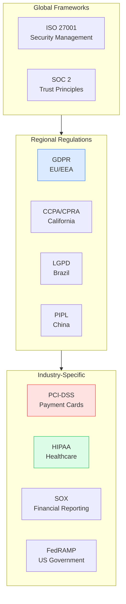
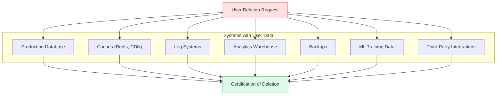
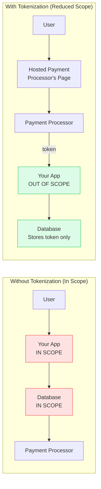
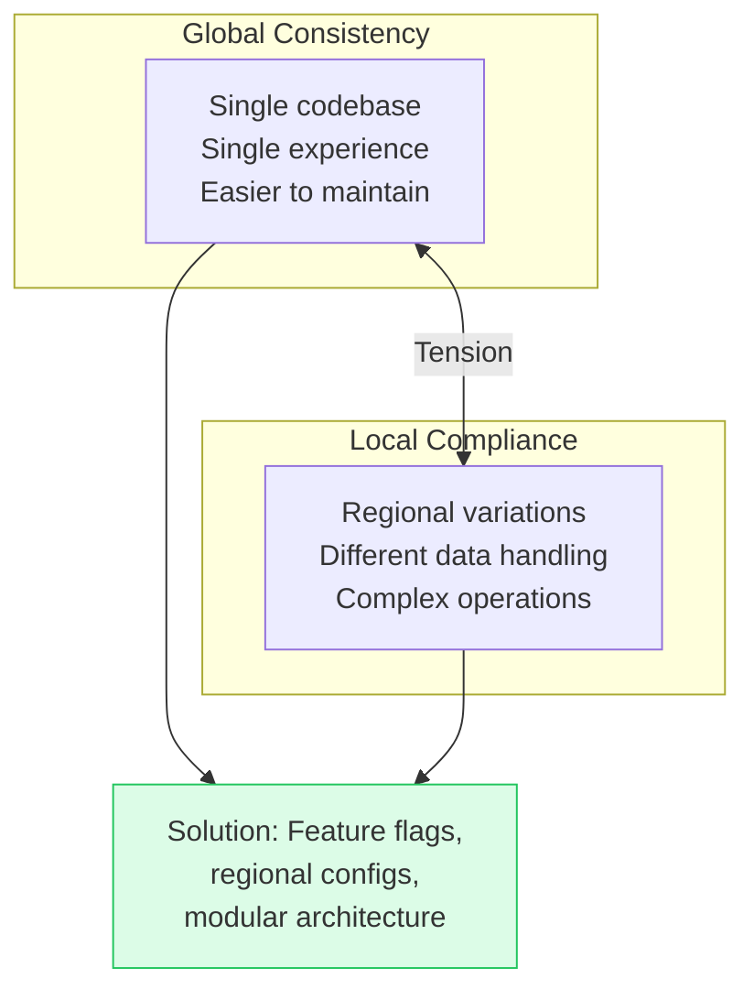

# Compliance & Data Sovereignty

This guide covers 5 key areas: I. Executive Summary: The Regulatory Landscape, II. Technical Mechanics: Architecture for Compliance, III. Real-World Behavior at Mag7, IV. Critical Tradeoffs, V. Impact on Business, ROI, and CX.

## I. Executive Summary: The Regulatory Landscape

At the Principal TPM level, compliance is not a checkbox exercise—it is an architectural forcing function that shapes where data lives, how it flows, and what systems you can build. In Mag7 environments serving global users, regulatory requirements often conflict, creating complex design constraints that require sophisticated technical solutions.

### 1. Why TPMs Must Care About Compliance

Compliance failures are existential risks:
*   **GDPR fines:** Up to 4% of global annual revenue or €20M, whichever is higher. Meta was fined €1.2 billion in 2023.
*   **PCI-DSS breaches:** Loss of ability to process credit cards. Business-ending for e-commerce.
*   **HIPAA violations:** $50K-$1.5M per violation. Criminal penalties for willful neglect.
*   **Operational disruption:** Regulators can mandate system changes, data deletion, or service suspension.

**TPM Role:**
You are the translator between legal requirements and technical implementation. When legal says "we need GDPR compliance," you determine what that means architecturally—data residency requirements, right to erasure implementation, consent management systems.

### 2. The Compliance Hierarchy

**Layered Application:**
A healthcare payment processing system might need:
*   HIPAA (handling patient data)
*   PCI-DSS (processing payments)
*   GDPR (if serving EU patients)
*   SOC 2 (enterprise customer requirement)

Each layer adds constraints. The intersection is your design space.

### 3. Data Sovereignty: Where Data Lives Matters

Data sovereignty refers to the legal requirement that data be subject to the laws of the country where it is stored or processed.

**Key Sovereignty Requirements:**

| Regulation | Requirement | Technical Implication |
|------------|-------------|----------------------|
| GDPR | EU personal data stays in EU (or adequacy countries) | EU-region infrastructure required |
| Russia (152-FZ) | Russian citizen data stored in Russia | Separate Russian infrastructure |
| China (PIPL) | Critical data stored in China, cross-border transfer assessment required | Isolated China deployment |
| India (PDP Bill) | Sensitive personal data mirroring in India | Eventual Indian data centers |

**Architectural Response:**
*   **Regional deployments:** Separate infrastructure per region
*   **Data residency controls:** Technical enforcement of where data is stored
*   **Cross-border transfer mechanisms:** Legal frameworks (SCCs, adequacy decisions) + technical controls (encryption, tokenization)

### 4. The Right to Be Forgotten: Technical Nightmare

GDPR's "Right to Erasure" (Article 17) requires organizations to delete personal data upon user request. This sounds simple but is architecturally complex:

**The Challenges:**
*   **Data discovery:** Where does user data actually live? Often unknown without extensive inventory.
*   **Backup deletion:** Deleting from backups is often impractical. Alternative: crypto-shredding (delete the encryption key).
*   **Derived data:** ML models trained on user data—do you retrain?
*   **Third parties:** Data shared with partners must also be deleted.
*   **Verification:** How do you prove deletion occurred?

**Implementation Pattern:**
1. **Data inventory:** Catalog all systems containing personal data
2. **Unified identity:** Single user ID that propagates across systems
3. **Deletion pipeline:** Automated workflow that touches all systems
4. **Audit trail:** Log that deletion was requested and executed
5. **Crypto-shredding:** For backups, encrypt user data with user-specific key; delete key instead of data

### 5. Consent Management: The Foundation

Before processing personal data, you need valid consent (under GDPR) or legitimate basis. Consent management becomes a critical system:

**Consent Requirements:**
*   **Freely given:** User must have genuine choice
*   **Specific:** For each purpose
*   **Informed:** Clear explanation of what data and why
*   **Unambiguous:** Clear affirmative action (no pre-checked boxes)
*   **Withdrawable:** As easy to withdraw as to give

**Consent Architecture:**
*   **Consent Service:** Central system recording what users consented to
*   **Purpose Registry:** Catalog of why you process data
*   **Enforcement Points:** Each system checks consent before processing
*   **Audit Logging:** Record of consent state changes

### 6. ROI and Capabilities Summary

Implementing robust compliance systems delivers:
*   **Market access:** Can't sell to EU without GDPR compliance, can't sell to enterprises without SOC 2
*   **Risk reduction:** Avoid catastrophic fines and operational disruption
*   **Customer trust:** Compliance certifications signal data stewardship
*   **Operational efficiency:** Clear data governance reduces ad-hoc handling

## II. Technical Mechanics: Architecture for Compliance

### 1. Data Classification Framework

Before implementing controls, classify your data. Different classes require different protections:

| Classification | Examples | Controls Required |
|----------------|----------|-------------------|
| Public | Marketing content, public APIs | Basic availability |
| Internal | Business docs, code | Access control, audit logging |
| Confidential | Customer data, financial records | Encryption, access approval, retention policies |
| Restricted | PII, credentials, payment data | Isolation, maximum controls, minimal retention |

**Implementation:**
*   Tag data at ingestion
*   Enforce controls based on classification
*   Automate classification where possible (ML-based PII detection)
*   Regular audits to verify classification accuracy

### 2. PCI-DSS: Scope Reduction Strategy

PCI-DSS compliance is expensive and operationally burdensome. The key strategy is **scope reduction**—minimize systems that handle cardholder data.

**Tokenization Pattern:**
1. User enters card data directly into payment processor's hosted iframe
2. Processor returns a token (e.g., `tok_xj83kd9`)
3. Your system stores only the token
4. To charge the card, send the token to the processor

**Result:** Your systems never see actual card numbers, dramatically reducing PCI scope.

**Remaining Scope:**
Even with tokenization, some things remain in scope:
*   Systems that redirect to the payment page
*   Network segments carrying payment traffic
*   Servers hosting the payment page integration

### 3. SOC 2: The Trust Framework

SOC 2 (Service Organization Control) attestation demonstrates security practices to enterprise customers:

**Five Trust Principles:**

| Principle | Focus | Example Controls |
|-----------|-------|------------------|
| Security | Protection against unauthorized access | Firewalls, encryption, access control |
| Availability | System operational as committed | Redundancy, monitoring, incident response |
| Processing Integrity | Accurate, complete processing | Input validation, reconciliation |
| Confidentiality | Data protection | Encryption, access limits, DLP |
| Privacy | Personal information handling | Consent management, data minimization |

**Type I vs. Type II:**
*   **Type I:** Point-in-time assessment. "Controls exist as of date X."
*   **Type II:** Period assessment (6-12 months). "Controls operated effectively during period Y."

Enterprise customers typically require Type II.

**Evidence Collection:**
SOC 2 requires demonstrable evidence. Manual processes don't scale. Implement:
*   Automated access logs
*   Infrastructure-as-code for change tracking
*   Automated compliance scanning (AWS Config, GCP Security Command Center)
*   Integration with compliance platforms (Vanta, Drata)

### 4. GDPR Technical Requirements

Key GDPR requirements and their technical implementations:

| Requirement | Article | Technical Implementation |
|-------------|---------|-------------------------|
| Lawful basis | 6 | Consent management system |
| Purpose limitation | 5(1)(b) | Purpose registry, enforcement at ingestion |
| Data minimization | 5(1)(c) | Collection limits, retention policies |
| Accuracy | 5(1)(d) | Self-service profile management |
| Storage limitation | 5(1)(e) | Automated retention enforcement |
| Integrity/confidentiality | 5(1)(f) | Encryption, access controls |
| Right to access | 15 | Data export functionality |
| Right to erasure | 17 | Deletion pipeline |
| Data portability | 20 | Machine-readable export (JSON) |
| Breach notification | 33/34 | Incident detection, 72-hour response |

### 5. Encryption Strategy

Encryption is foundational to compliance but must be implemented correctly:

**Encryption at Rest:**
*   Database encryption (TDE for SQL, native encryption for NoSQL)
*   Storage encryption (S3 SSE, EBS encryption)
*   Key management (AWS KMS, GCP KMS, HashiCorp Vault)

**Encryption in Transit:**
*   TLS 1.3 for all external traffic
*   mTLS for internal service-to-service communication
*   Certificate management (automated rotation via Let's Encrypt or internal CA)

**Application-Level Encryption:**
For sensitive fields (SSN, credit cards), encrypt at application layer before storage:
*   Database compromise doesn't expose plaintext
*   Keys can be rotated without re-encrypting storage layer
*   Enables crypto-shredding for data deletion

**Key Management Principles:**
*   Separate key management from data storage
*   Implement key rotation (annual minimum)
*   Audit key access
*   Consider envelope encryption (data key encrypted by master key)

## III. Real-World Behavior at Mag7

### 1. Google: Privacy by Design

Google has faced significant regulatory scrutiny, driving sophisticated compliance architecture:

**Data Regions:**
Google Cloud offers data residency commitments for specific regions. Assured Workloads provides additional controls for regulated industries.

**Privacy Infrastructure:**
*   Centralized consent management across all products
*   Automated data retention enforcement
*   Privacy review process for new features
*   Differential privacy for analytics (release aggregate insights without exposing individuals)

**Takedown Transparency:**
Google publishes transparency reports showing government requests for user data, demonstrating accountability.

### 2. Amazon: Compliance as a Service

AWS productized compliance, offering compliance capabilities as managed services:

**AWS Artifact:**
Self-service access to compliance reports (SOC 2, ISO 27001, PCI-DSS attestations).

**Shared Responsibility Model:**
Clear delineation: AWS secures infrastructure; you secure your applications. Compliance responsibilities split accordingly.

**Region Selection:**
AWS offers regions explicitly for compliance: GovCloud (US government), AWS China (operated by partner for Chinese compliance), EU-specific regions.

**Compliance Services:**
*   AWS Config: Automated compliance rule evaluation
*   AWS Audit Manager: Evidence collection automation
*   AWS Macie: PII discovery and classification
*   AWS Security Hub: Centralized security findings

### 3. Meta: Scale Compliance Challenges

Meta processes data for 3+ billion users across diverse regulatory environments:

**Regional Approaches:**
*   EU: Meta Ireland as data controller for EU users
*   Significant investment in EU infrastructure
*   Ongoing regulatory battles over transatlantic data transfers

**Privacy Controls:**
*   Privacy Checkup: User-facing tool to review and adjust settings
*   Off-Facebook Activity: Control over data from external sites
*   Access Your Information: Data export for portability

**Regulatory Settlements:**
Meta's $1.2B GDPR fine for inadequate transfer mechanisms shows even Mag7 companies struggle with compliance. TPM lesson: compliance is ongoing, not achieved.

### 4. Netflix: Content Licensing Compliance

Netflix faces unique compliance challenges around content licensing, which intersects with technical architecture:

**Geographic Content Rights:**
Content licenses are region-specific. Technical architecture must enforce:
*   Accurate geolocation (harder than it sounds—VPNs, proxies)
*   Content availability varying by country
*   Audit trails for licensing compliance

**Content Protection (DRM):**
Studios require specific DRM implementations. Non-compliance means losing content licenses.

**Data Localization:**
While Netflix operates globally, customer data handling must respect local laws. Implemented through regional service instances and data residency controls.

## IV. Critical Tradeoffs

### 1. Compliance vs. User Experience

Compliance requirements often friction user experience:

| Requirement | UX Impact | Mitigation |
|-------------|-----------|------------|
| Cookie consent banners | Interrupts initial experience | Smart defaults, remember preferences |
| Two-factor authentication | Extra login step | Risk-based authentication, remember devices |
| Data minimization | Fewer personalization signals | Explain value exchange |
| Right to erasure | Lose user preferences | Explain consequences before deletion |

**TPM Balance:**
Design compliant experiences that minimize friction. Compliance doesn't require bad UX—it requires thoughtful UX.

### 2. Global Consistency vs. Local Compliance

Operating globally creates tension between consistent experience and local requirements:

**Implementation Patterns:**
*   Feature flags for regional functionality
*   Configuration-driven compliance controls
*   Modular consent components
*   Regional service deployments where required

### 3. Security vs. Accessibility

Tight security controls can impede legitimate access:

| Security Control | Accessibility Impact | Balance |
|------------------|---------------------|---------|
| Complex passwords | Frustration, password reuse | Passphrases, biometrics |
| IP restrictions | Remote work difficulty | VPN, zero-trust |
| Short session timeouts | Productivity loss | Activity-based extension |
| Data access logging | Performance overhead | Sampling, async logging |

### 4. Compliance Scope vs. Cost

The broader your compliance scope, the higher the cost:

**Example: PCI-DSS**
*   Level 1 (>6M transactions): On-site audit, expensive
*   Level 4 (<20K transactions): Self-assessment, cheaper

**TPM Strategy:**
*   Minimize scope through architecture (tokenization, segmentation)
*   Prioritize compliance for highest-risk/highest-value areas
*   Phase implementation over time
*   Use managed services that inherit compliance (e.g., Stripe for payments)

## V. Impact on Business, ROI, and CX

### 1. Compliance as Market Access

Without compliance, markets are closed:

| Compliance | Market Access |
|------------|---------------|
| GDPR | EU (450M consumers, $16T GDP) |
| SOC 2 | Enterprise customers |
| HIPAA | US healthcare ($4T market) |
| FedRAMP | US federal government ($100B+ IT spend) |
| PCI-DSS | Ability to process payments |

**ROI Framing:**
Compliance investment isn't cost—it's market access investment. Compare cost of compliance against revenue from enabled markets.

### 2. Trust as Competitive Advantage

In an era of data breaches and privacy scandals, demonstrated compliance builds trust:

**Trust Signals:**
*   Compliance certifications displayed on website
*   Transparent privacy policies
*   Security white papers for enterprise sales
*   Breach transparency when incidents occur

**Customer Preference:**
Research shows consumers increasingly favor companies with strong privacy practices. GDPR compliance has become a selling point, not just a requirement.

### 3. Operational Efficiency from Compliance

Well-implemented compliance drives operational improvements:

**Data Governance:**
*   Clear data ownership reduces confusion
*   Retention policies prevent storage cost explosion
*   Classification enables appropriate handling

**Incident Response:**
*   Breach notification requirements force detection capabilities
*   Playbooks developed for compliance accelerate all incident response

**Process Discipline:**
*   Change management required for SOC 2 improves overall stability
*   Access reviews catch orphaned accounts, reduce security risk

### 4. Cost of Non-Compliance

Non-compliance is expensive beyond just fines:

**Direct Costs:**
*   Regulatory fines (GDPR: 4% of global revenue)
*   Legal fees for defense
*   Remediation costs (implementing controls after the fact is 10x more expensive)

**Indirect Costs:**
*   Customer churn (loss of trust)
*   Brand damage (media coverage)
*   Business disruption (mandated changes)
*   Increased insurance premiums

## Interview Questions

### Fundamentals
1. Explain the difference between GDPR and CCPA. How do their requirements differ?
2. What is PCI-DSS scope, and how would you reduce it?
3. Describe SOC 2 Type I vs. Type II. When would a customer require each?

### Architecture
4. How would you architect a system to comply with GDPR's right to erasure across microservices?
5. Design a data classification system for a healthcare company processing payments.
6. How do you handle data sovereignty requirements when building a global application?

### Mag7-Specific
7. How do Mag7 companies balance global scale with regional compliance requirements?
8. Describe the shared responsibility model for compliance in cloud environments.

### Scenario-Based
9. A new regulation requires data localization in a country where you have no infrastructure. What are your options?
10. You discover a data breach affecting EU users. Walk through your response process.

---

## Key Takeaways

1. **Compliance is architectural** - It shapes where data lives and how systems are designed. Address compliance in architecture, not as an afterthought.

2. **Right to erasure is technically hard** - Data spreads across many systems. Implement unified identity, automated deletion pipelines, and crypto-shredding.

3. **Scope reduction is strategy** - For PCI-DSS and similar regulations, minimizing scope through tokenization and segmentation is more valuable than hardening everything.

4. **Evidence must be automated** - Manual compliance evidence collection doesn't scale. Invest in automated logging, configuration management, and compliance platforms.

5. **Compliance enables markets** - Frame compliance investment as market access, not cost. GDPR compliance unlocks EU; SOC 2 unlocks enterprise.

6. **Global vs. local tension is real** - Operating globally requires balancing consistent experience with regional requirements. Feature flags and modular architecture help.
