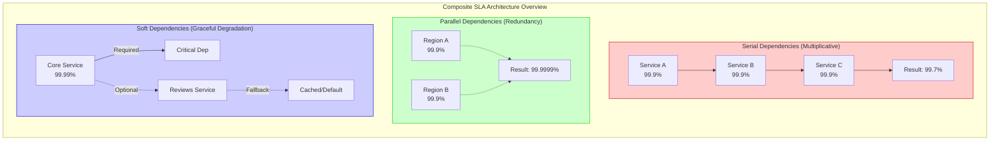
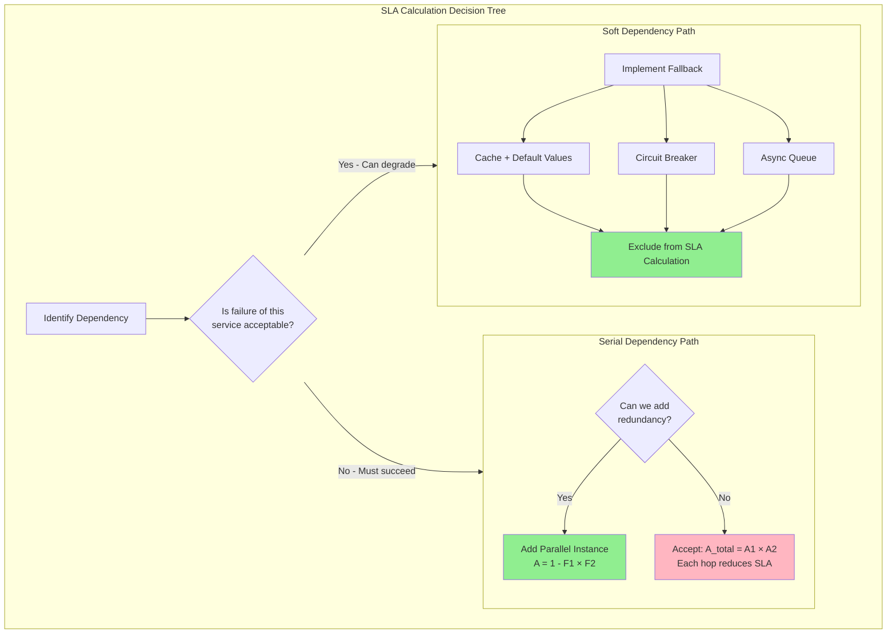
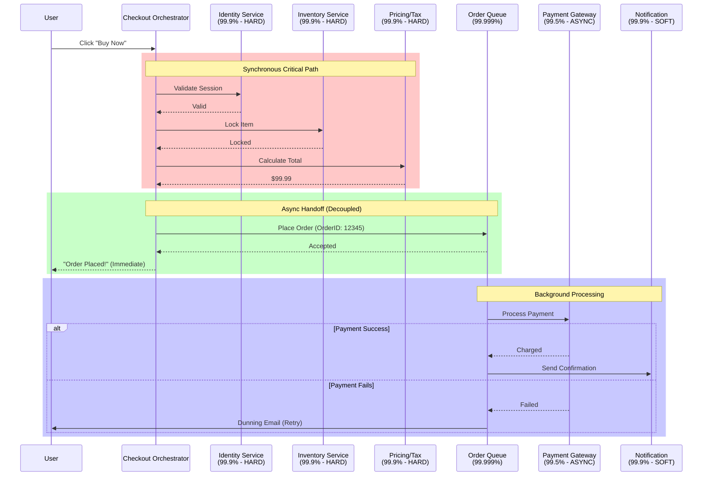
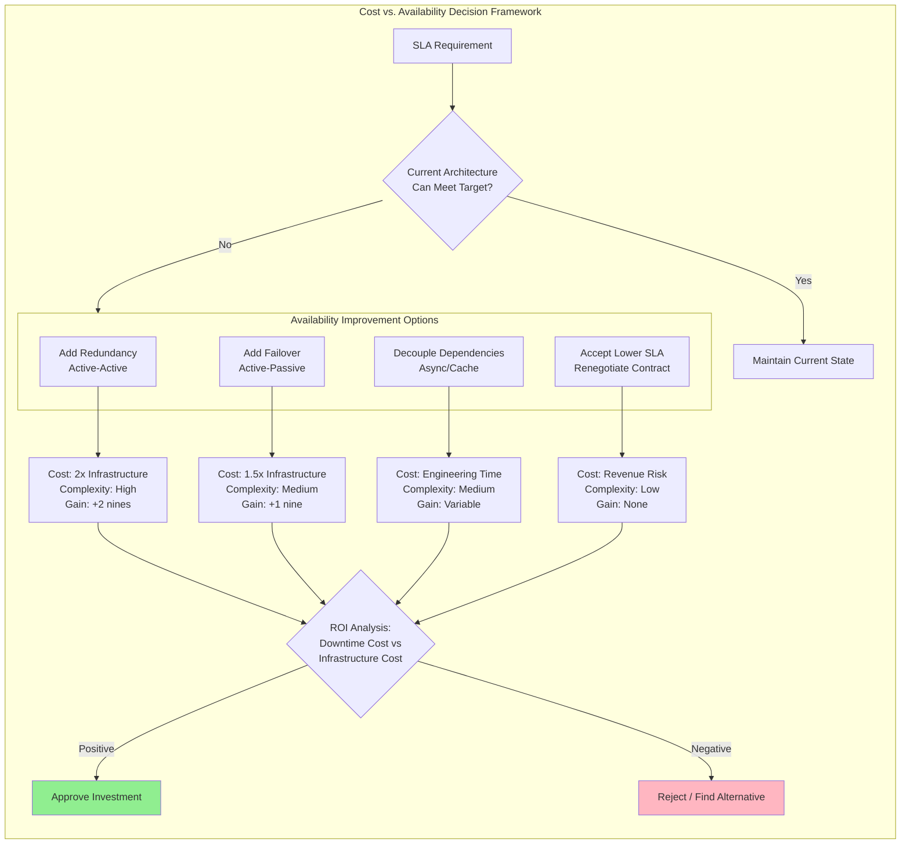

# Composite SLA Calculation

This guide covers 5 key areas: I. Core Concepts & The Mag7 Context, II. Calculation Logic: Serial vs. Parallel vs. Soft Dependencies, III. Real-World Mag7 Example: The "Checkout" Flow, IV. Architectural Tradeoffs & Cost of Availability, V. Business Impact & TPM Strategy.

## I. Core Concepts & The Mag7 Context

### 1. Serial Dependencies: The Multiplicative Penalty
In a microservices architecture, the most common availability trap is the serial dependency chain. If Service A calls Service B, which calls Service C to fulfill a request, the total availability is the product of all individual availabilities.

*   **The Math:** $Availability_{total} = A_1 \times A_2 \times A_3 \dots$
*   **Mag7 Reality:** Consider an AWS Control Plane operation (e.g., `RunInstances`). It requires API Gateway, IAM (AuthZ), the Placement Service, and the EBS Control Plane to all succeed synchronously. If each has an SLO of 99.9%, the composite availability of just these four is $0.999^4 \approx 99.6\%$. You have effectively lost an entire "nine" of reliability purely through architectural coupling.

**Tradeoffs:**
*   **Coupling vs. Consistency:** Serial dependencies often exist to ensure strong consistency (e.g., deducting inventory before confirming a payment). The tradeoff is that strict consistency requirements invariably lower availability.
*   **Latency vs. Reliability:** Serial chains increase latency (sum of all hops). Reducing the chain length improves both speed and uptime but requires complex asynchronous patterns (eventual consistency).

**Principal TPM Impact:**
*   **Business Capability:** You must identify "Critical Path" dependencies. If a non-critical feature (e.g., a "You might also like" recommendation) is in the serial path of a "Checkout" transaction, you are mathematically sabotaging revenue.
*   **Action:** Enforce architectural reviews that decouple non-critical services from the synchronous path. If the dependency is serial, the SLA cannot mathematically exceed the lowest common denominator.

### 2. Parallel Dependencies: The Redundancy Boost
Parallel dependencies occur when a system can function if *at least one* of several redundant subsystems is available. This is the foundation of high availability (HA) at the Mag7 level.

*   **The Math:** $Availability_{total} = 1 - (Unavailability_1 \times Unavailability_2)$
*   **Mag7 Reality:** Google Spanner or Amazon DynamoDB Global Tables. If a read request can be served from Region A OR Region B, and each region is 99.9% available (0.1% unavailable), the probability of *both* failing simultaneously is $0.001 \times 0.001 = 0.000001$. Your composite availability jumps to 99.9999% (six nines).

**Tradeoffs:**
*   **Cost vs. Reliability:** This is the primary lever for a Principal TPM. Achieving 99.99% usually requires $2x$ infrastructure spend (N+1 or 2N redundancy). Moving to 99.999% might require multi-region active-active setups, significantly increasing data transfer costs and engineering complexity (handling conflict resolution).
*   **Complexity vs. Operability:** Parallel systems mask failures. A primary cluster can fail, and the secondary takes over seamlessly. While good for the customer, this can lead to "latent failures" where the team is unaware the system is running on a flat tire until the backup also fails.

**Principal TPM Impact:**
*   **ROI:** You must calculate the cost of downtime vs. the cost of redundancy. For a Tier-1 service (e.g., Azure Active Directory login), the cost of redundancy is justified. For an internal batch processing tool, a serial dependency with 99.5% uptime is likely acceptable.
*   **Skill:** This requires driving "Game Days" or Chaos Engineering. You cannot trust parallel math unless you verify that the failover mechanism actually works under load.

### 3. Soft Dependencies: Graceful Degradation
This is the differentiator between a Senior and a Principal TPM. A "Soft" or "Weak" dependency is a service that, if it fails, does not result in a 500 error for the user, but rather a degraded experience.

*   **The Logic:** The main service wraps the dependency call in a circuit breaker or try-catch block with a default fallback.
*   **Mag7 Reality:** The Amazon.com Product Detail Page (PDP). The PDP aggregates pricing, images, reviews, shipping estimates, and inventory.
    *   *Hard Dependency:* Inventory Service (Cannot sell what we don't have).
    *   *Soft Dependency:* Reviews Service. If the Reviews backend crashes, Amazon does not show a "Service Unavailable" page. It loads the product page without the stars. The SLA for "Can Customer Purchase?" remains intact (100%), even if "Can Customer Read Reviews?" is 0%.

**Tradeoffs:**
*   **UX Consistency vs. Availability:** Users may see different versions of the page. However, revenue preservation is prioritized over UI perfection.
*   **Engineering Effort vs. Time-to-Market:** Implementing fallback logic, default values, and circuit breakers for every dependency takes significant development time.

**Principal TPM Impact:**
*   **CX/SLA Definitions:** You must redefine "Availability." It is no longer binary. It is defined by "Core Customer Journeys."
*   **Negotiation:** When a dependency team (e.g., the Ads team) has a lower SLA than your product (e.g., Search), you treat them as a soft dependency. You mandate that Search results must load even if Ads fail. This insulates your SLA from their instability.

### 4. Handling Correlated Failures
The math above assumes failures are independent. In Mag7 infrastructure, this is rarely fully true due to shared substrates.

*   **The Risk:** If Service A and Service B are parallel/redundant but both run in the same AWS Availability Zone (AZ) or rely on the same underlying SAN (Storage Area Network), a single infrastructure event kills both.
*   **Mag7 Strategy:** "Cell-based Architecture" or "Shuffle Sharding." We isolate failure domains so that a "noisy neighbor" or a bad deployment only affects a small percentage (a cell) of users, rather than the whole system.

**Tradeoffs:**
*   **Utilization vs. Isolation:** Shared resources (multitenancy) are cheaper (higher utilization) but introduce correlated failure risks. Isolated cells are expensive (overhead of managing many small clusters).

**Principal TPM Impact:**
*   **Risk Management:** You must scrutinize the "blast radius." If a dependency fails, does it take down 100% of customers or 5%? Your composite SLA calculation must account for the probability of *correlated* underlying infrastructure failures.

## II. Calculation Logic: Serial vs. Parallel vs. Soft Dependencies

To a Principal TPM, the architecture diagram is a mathematical formula. You cannot negotiate an SLA with a customer or an internal stakeholder without first auditing the dependency graph of the service. The topology of how microservices interact—whether they block one another or operate independently—determines the theoretical maximum availability of the system.

At the Mag7 level, we categorize dependencies into three calculation buckets. Your role is to identify which bucket a dependency falls into and challenge Engineering if a dependency is miscategorized (e.g., treating a non-critical logging service as a Serial blocking dependency).

### 1. Serial Dependencies (The Multiplicative Penalty)
In a serial architecture, Component A depends on Component B, which depends on Component C. If any component in the chain fails, the entire request fails.

**Calculation Logic:**
Availability is the product of all components in the critical path.
$$A_{total} = A_1 \times A_2 \times A_3 \dots$$

**Mag7 Real-World Example:**
Consider an AWS IAM authentication call during an EC2 instance launch.
*   **The Flow:** User Request $\rightarrow$ API Gateway $\rightarrow$ Control Plane $\rightarrow$ IAM Auth $\rightarrow$ Scheduler.
*   **The Math:** If the Control Plane is 99.9% and IAM is 99.9%, the composite availability is $0.999 \times 0.999 = 0.998$.
*   **The Reality:** Every new mandatory microservice added to the "Critical Path" mathematically lowers your availability. A chain of ten "3-nines" services results in a "2-nines" aggregate service ($0.999^{10} \approx 99.0\%$).

**Tradeoffs:**
*   **Simplicity vs. Fragility:** Serial architectures are easier to reason about and debug (linear logs). However, they are statistically fragile.
*   **Latency vs. Reliability:** Serial chains often incur higher latency (sum of processing times) and lower reliability (product of availabilities).

**Principal TPM Impact:**
*   **ROI/Business:** You must push back on "Bloated Critical Paths." If a service requires 5 dependencies to return a "200 OK," you are accepting the risk of all 5.
*   **Action:** Audit the critical path. Ask: "If the User Profile service is down, does the Checkout *have* to fail, or can we default to a guest checkout?" If it fails, it is Serial.

### 2. Parallel Dependencies (The Redundancy Boost)
Parallel dependencies occur when a system can function if *at least one* of several redundant components is available. This is the foundation of High Availability (HA) design.

**Calculation Logic:**
Availability is 1 minus the probability that *all* components fail simultaneously.
$$A_{total} = 1 - ((1 - A_1) \times (1 - A_2))$$

**Mag7 Real-World Example:**
Google Cloud Spanner or Amazon DynamoDB Global Tables.
*   **The Flow:** A read request is sent. The system can read from Zone A *or* Zone B.
*   **The Math:** If Zone A is 99.0% and Zone B is 99.0%:
    *   Probability A fails: 0.01
    *   Probability B fails: 0.01
    *   Probability both fail: $0.01 \times 0.01 = 0.0001$
    *   **Composite Availability:** $1 - 0.0001 = 99.99\%$
*   **The Reality:** Two mediocre services (2-nines) in parallel create a highly available service (4-nines).

**Tradeoffs:**
*   **Cost vs. Uptime:** This is the most expensive way to buy reliability. You are effectively doubling infrastructure costs (compute/storage) to purchase the extra "nines."
*   **Complexity:** Requires load balancers, failover logic, and consensus algorithms (e.g., Paxos/Raft) to ensure data consistency between parallel nodes.

**Principal TPM Impact:**
*   **CX:** Customers experience seamless uptime even during zonal outages.
*   **Skill:** You must evaluate if the cost of redundancy ($$$) is justified by the SLA penalty cost. If the SLA penalty is cheaper than the redundant infrastructure, a purely financial decision might favor lower availability (though reputation damage usually outweighs this).

### 3. Soft Dependencies (Graceful Degradation)
This is the differentiator between Junior and Principal thinking. A Soft Dependency is a service that *should* run, but if it fails, the core business transaction still completes with reduced functionality.

**Calculation Logic:**
These are excluded from the Core Availability calculation but tracked for "Quality of Service" (QoS).
$$A_{core} = A_{critical\_path} \quad (\text{Ignoring } A_{soft})$$

**Mag7 Real-World Example:**
The Amazon.com Product Detail Page or Netflix Player.
*   **The Flow:** A user loads a product page. The "Price" and "Add to Cart" are Serial (Critical). The "Reviews," "Recommendations," and "Ad Widgets" are Soft.
*   **The Reality:** If the "Reviews Service" is down (0% availability), the page still loads, and the user can still buy the item. The SLA for *Purchasing* is unaffected.

**Tradeoffs:**
*   **CX Consistency vs. Revenue Protection:** The user experience is inconsistent (missing widgets), but revenue is protected.
*   **Engineering Effort:** Implementing "fallback logic" or "circuit breakers" requires significant engineering maturity. It is harder to build a UI that dynamically rearranges itself when backend services 404.

**Principal TPM Impact:**
*   **Business Capabilities:** This allows you to decouple feature velocity from reliability. The "Recommendations Team" can ship risky code without threatening the "Checkout Team's" SLA.
*   **Action:** During design reviews, categorize every dependency. If a developer claims a dependency is Serial, ask: "If this API returns a 500 error, do we show the user an error page?" If the answer is yes, challenge them to make it a Soft dependency via fallback logic or caching.

### Summary of Logic Application

| Logic Type | Mathematical Effect | Architecture Pattern | Principal TPM Strategy |
| :--- | :--- | :--- | :--- |
| **Serial** | $A \times B$ (Decreases Availability) | Tightly Coupled Chains | **Minimize.** Aggressively remove non-essentials from the critical path. |
| **Parallel** | $1 - (F_a \times F_b)$ (Increases Availability) | Active-Active / Redundancy | **Optimize.** Use for critical paths where SLA requirements exceed component reliability. |
| **Soft** | N/A to Core SLA | Asynchronous / UI Composition | **Maximize.** Push everything here that isn't strictly required for the primary "Job to be Done." |

## III. Real-World Mag7 Example: The "Checkout" Flow

To understand Composite SLAs at the Principal level, we must move beyond theory into a high-stakes transaction: the E-commerce Checkout. At a company like Amazon or Microsoft (Azure Marketplace), the "Checkout" is not a single service; it is an orchestration of 10 to 50 microservices.

If you treat every dependency in the checkout flow as a "hard" dependency (Serial Calculation), your mathematical availability will inevitably drop below acceptable enterprise thresholds. The role of the Principal TPM is to architect the flow to decouple these dependencies, thereby artificially inflating the composite SLA to meet business requirements.

### 1. The Naïve Approach: Synchronous Serial Dependencies
In a basic implementation, a user clicks "Buy," and the orchestration layer calls the following services synchronously:
1.  **Identity Service:** Validates the user session. (99.9% SLA)
2.  **Inventory Service:** Locks the item. (99.9% SLA)
3.  **Pricing/Tax Service:** Calculates final total. (99.9% SLA)
4.  **Payment Gateway:** Charges the card. (99.5% SLA - typically lower due to external banking dependencies)
5.  **Notification Service:** Sends email confirmation. (99.9% SLA)

**The Math:**
$$Availability = 0.999 \times 0.999 \times 0.999 \times 0.995 \times 0.999 = 99.1\%$$

**Mag7 Reality:**
A 99.1% SLA implies nearly 80 hours of downtime a year. For Amazon, this is unacceptable. If the Notification Service goes down, preventing a user from buying a product is a catastrophic architectural failure.

**Tradeoffs:**
*   **Consistency vs. Availability:** This model guarantees strict consistency (the user is only charged if the email is sent and inventory is locked), but sacrifices availability.
*   **Simplicity vs. Resilience:** It is easy to build and debug (single trace ID, linear flow), but fragile.

### 2. The Mag7 Approach: Soft Dependencies and Graceful Degradation
To fix the math, we reclassify services as "Soft Dependencies." A soft dependency is a service that, if it fails, does not terminate the user journey. Instead, the system degrades functionality.

**Revised Architecture:**
*   **Identity:** Hard Dependency.
*   **Inventory:** Hard Dependency.
*   **Pricing:** Hard Dependency.
*   **Payment:** Hard Dependency.
*   **Notification:** **Soft Dependency.** If this fails, we log the request to a queue (e.g., SQS/Kafka) to retry later. The checkout succeeds.

**The New Math:**
We remove the Notification Service from the availability equation because its failure does not cause the composite service (Checkout) to return an error.
$$Availability = 0.999 \times 0.999 \times 0.999 \times 0.995 = 99.2\%$$

We gained 0.1%. To get higher, we must attack the "Payment Gateway."

### 3. Asynchronous Processing (The "Order Accepted" Pattern)
External payment gateways are notoriously unreliable compared to internal infrastructure. To achieve "Five Nines" (99.999%) on checkout, Mag7 companies often decouple the actual charge from the checkout interaction.

**The Flow:**
1.  User clicks "Buy."
2.  System validates Identity and Inventory.
3.  System places the order into a persistent, high-availability queue (SLA 99.999%).
4.  System returns "Order Placed" to the user immediately.
5.  **Async Worker:** Picks up the order 200ms later and attempts to charge the card.

**The Composite SLA Impact:**
The "Checkout" availability now depends only on:
1.  Identity Service
2.  Inventory Service
3.  The Queueing Service

The Payment Gateway's 99.5% SLA is removed from the synchronous critical path. If the payment fails later, the system triggers a "Dunning" flow (emails the user to update payment method). The *Checkout* succeeded; the *Fulfillment* is pending.

**Tradeoffs:**
*   **CX Friction vs. Conversion:** You risk a poor customer experience if the payment fails later (user thinks they bought it, but didn't). However, you maximize immediate conversion rates by removing friction and latency.
*   **Complexity:** This requires robust state management, idempotency (to prevent double charges), and complex error handling workflows.

### 4. Strategic Fallbacks (Static Defaults)
Consider the **Recommendation Engine** ("People who bought this also bought...") or **Estimated Delivery Date (EDD)** service displayed during checkout.

If the EDD service (SLA 99.9%) fails:
*   **Bad TPM approach:** Checkout spins and fails.
*   **Good TPM approach:** Checkout slows down but succeeds.
*   **Mag7 Principal approach:** The UI renders a static fallback value ("Standard Shipping: 3-5 Business Days") instead of a calculated date ("Arrives Tuesday").

**Impact on SLA:**
By implementing a static fallback, the EDD service effectively has 100% availability regarding its impact on the checkout flow. The component may be down, but the user journey completes.

### 5. Business, CX, and ROI Impact

**Business Capabilities & ROI:**
*   **Revenue Protection:** By moving Payment and Notification to async/soft dependencies, you prevent downtime in third-party systems from blocking revenue. On Prime Day, this distinction is worth millions of dollars per minute.
*   **SLA Contract Negotiation:** Understanding this math allows you to sign contracts promising 99.99% availability for the "Checkout API" even if your underlying banking partners only offer 99.5%. You are technically compliant because the API accepted the request successfully.

**Customer Experience (CX):**
*   **Perceived Reliability:** Users perceive the platform as "always up."
*   **Latency:** Removing synchronous calls to heavy services (like fraud detection or complex tax calculation) reduces checkout latency, directly correlating to increased conversion.

**Skill Impact for TPMs:**
*   This shifts the TPM role from "Project Manager" to "System Architect." You are responsible for defining which dependencies are Hard (Critical Path) vs. Soft, and driving the engineering requirements for circuit breakers and fallbacks.

## IV. Architectural Tradeoffs & Cost of Availability

At the Principal TPM level, your role shifts from "how do we achieve high availability?" to "should we achieve high availability, and at what cost?" You act as the governor on Engineering's desire for perfection and Sales' desire for zero downtime.

High availability (HA) follows the law of diminishing returns. Moving from 99.9% (three nines) to 99.99% (four nines) often requires a 10x increase in infrastructure investment and engineering complexity. You must evaluate architectural decisions not just on technical merit, but on the Ratio of Availability to Margin.

### 1. The Cost of "Nines" & Multi-Region Strategies

To mathematically improve a Composite SLA, you generally introduce redundancy (parallel dependencies). However, redundancy is the enemy of cost efficiency.

**Mag7 Context:**
At Google or Microsoft Azure, a single region deployment typically caps at 99.9% or 99.95% SLA due to physical risks (power, cooling, fiber cuts). To offer 99.99% or higher, the architecture *must* be multi-region.
*   **Active-Passive (Hot/Cold):** A standby region is ready to take traffic.
*   **Active-Active:** Both regions serve traffic simultaneously.

**Tradeoffs:**
*   **CapEx vs. RTO (Recovery Time Objective):** Active-Passive is cheaper but slower to failover (needs data hydration/warming). Active-Active provides near-zero RTO but doubles infrastructure costs and introduces complex data conflict resolution (bi-directional replication).
*   **Data Consistency vs. Latency:** In Active-Active setups, you hit the CAP theorem hard. To guarantee strong consistency across regions (e.g., financial ledger), you accept high latency penalties on writes. If you prioritize low latency, you risk data divergence.

**Impact:**
*   **ROI:** A Principal TPM must calculate if the penalty cost of violating a lower SLA (e.g., SLA credits paid to customers) is lower than the infrastructure cost of maintaining a higher SLA.
*   **Business Capability:** Active-Active enables "Follow-the-Sun" models, improving latency for global users, not just reliability.

### 2. Synchronous vs. Asynchronous Decoupling

The most effective way to improve Composite SLA without doubling hardware cost is changing the *nature* of the dependency from hard (synchronous) to soft (asynchronous).

**Mag7 Context:**
Consider the Amazon.com "Buy Now" button.
*   **Synchronous (Bad):** The checkout service calls the Inventory Service, Credit Card Processor, and Email Service sequentially. If Email fails, the purchase fails. The SLA is the product of all three.
*   **Asynchronous (Good):** The checkout service places the order in a queue (SQS/Kafka) and confirms to the user immediately. The Email Service picks it up later. If Email is down, the order still succeeds.

**Tradeoffs:**
*   **User Experience (CX) vs. Engineering Complexity:** Asynchronous flows degrade "immediate confirmation" to "eventual consistency." You must manage user expectations (e.g., changing UI text from "Sent" to "Sending").
*   **Debuggability vs. Resilience:** Tracing a transaction through a synchronous stack is linear. Tracing through queues and event buses requires sophisticated distributed tracing (e.g., AWS X-Ray, Google Trace) and increases operational skill requirements.

**Impact:**
*   **CX:** The user perceives the system as "up" even when subsystems are failing (Graceful Degradation).
*   **Skill:** Requires engineering teams to master idempotency (processing the same message twice doesn't charge the card twice).

### 3. Cell-Based Architecture (Blast Radius Reduction)

When you cannot prevent failure, you must contain it. Mag7 companies utilize "Cell-Based Architecture" (or Bulkheading) to ensure that a bad deployment or a poison-pill request impacts only a fraction of the user base.

**Mag7 Context:**
AWS does not run one giant instance of EC2 for a region. They break the region into "cells." Each cell is a self-contained instance of the service.
*   If a cell fails, only the 5% of customers sharded to that cell experience an outage.
*   The Composite SLA for the *entire* customer base remains high because 95% of users saw 100% availability.

**Tradeoffs:**
*   **Fleet Management vs. Safety:** Managing 20 independent cells is significantly harder than managing one large cluster. It requires advanced CI/CD pipelines that can "canary" deploy to one cell at a time.
*   **Resource Efficiency vs. Isolation:** Cells often have overhead (minimum provisioned capacity). You lose the statistical multiplexing benefits of a massive shared pool, leading to slightly higher idle compute costs.

**Impact:**
*   **Business:** Protects brand reputation. "AWS is down for everyone" makes headlines. "AWS is down for 2% of users" is a support ticket.
*   **Capabilities:** Enables safe testing in production. You can use one cell for beta features without risking the VIP customers on another cell.

### 4. The Hidden Cost of Observability

To calculate and maintain a Composite SLA, you need high-cardinality observability (metrics, logs, traces). At Mag7 scale, the cost of monitoring the infrastructure can sometimes rival the cost of the infrastructure itself.

**Tradeoffs:**
*   **Precision vs. Cost:** Sampling 100% of traces guarantees you catch every outlier but creates petabytes of log data. Sampling 1% saves money but might miss the root cause of a specific SLA breach.
*   **Build vs. Buy:** Mag7 usually builds internal tools (e.g., Monarch at Google) because commercial tools (Datadog/Splunk) become prohibitively expensive at that scale.

**Impact:**
*   **ROI:** A Principal TPM must audit observability spend. If you spend $1M monitoring a service that generates $2M, the economics are broken.

## V. Business Impact & TPM Strategy

How do you use Composite SLA calculations to drive business results?

**1. Contract Negotiation & Penalties**
*   **Context:** Enterprise contracts often include SLA Credits (refunds) if we miss targets.
*   **TPM Role:** You must ensure the Legal team isn't signing contracts that Engineering cannot mathematically support. If the composite calculation shows a max theoretical uptime of 99.9%, signing a 99.95% deal is guaranteed revenue loss.

**2. Error Budget Management**
*   **Context:** Google SRE model.
*   **TPM Role:** If the Composite SLA is 99.9%, and we are currently running at 99.99%, we have "budget" to burn. You should encourage the team to push riskier features or perform chaos testing. If we are at 99.85%, you must freeze feature launches to focus on stability.

**3. Strategic Alignment**
*   **Skill:** Translating math to business risk.
*   **Action:** When an Engineering Lead says, "We need to refactor the monolith into microservices," the Principal TPM justifies it by calculating the Composite SLA improvement gained by isolating failure domains (preventing a recommendation crash from killing checkout).

**Summary for the Interview:**
When asked about SLAs, do not just give a number.
1.  Decompose the architecture.
2.  Identify Serial vs. Parallel risks.
3.  Propose "Graceful Degradation" to remove dependencies from the critical path.
4.  Tie the cost of the architecture to the ROI of the business requirement.

---

## Interview Questions

### I. Core Concepts & The Mag7 Context

**Question 1: The Architectural Pushback**
"Our engineering team proposes a new architecture for a Tier-1 service that involves five microservices in a synchronous call chain. Each service owner claims a 99.9% SLO. Marketing wants to sell a 99.95% SLA to enterprise customers. As the Principal TPM, how do you handle this? Walk me through the math and the negotiation."

*   **Guidance for Strong Answer:**
    *   **The Math:** Immediately identify that $0.999^5 \approx 99.5\%$. The architecture mathematically cannot support the sales requirement.
    *   **The "Why":** Explain that network jitter, timeouts, and retries in a synchronous chain compound latency and failure rates.
    *   **The Solution:** Propose converting 2-3 of those dependencies to *soft* dependencies (asynchronous/non-blocking) or implementing aggressive caching.
    *   **The Negotiation:** Do not just say "no." Offer options: "We can offer 99.95% *if* we degrade the experience when Service D is down," or "We must lower the external SLA to 99.5% to match the architecture."

**Question 2: Defining Availability in Complex Systems**
"You own the 'Checkout' platform. A downstream dependency, the 'Loyalty Points Service,' has a major outage during Prime Day. Transactions are succeeding, but users aren't seeing their points accrual immediately. Is your service 'down'? How does this impact your SLA reporting, and how do you communicate this to leadership?"

*   **Guidance for Strong Answer:**
    *   **Definition:** Distinguish between *Control Plane* (configuration/viewing points) and *Data Plane* (processing the transaction). If the core business value (revenue capture) is functioning, the service is "Available" but "Degraded."
    *   **SLA Impact:** If the SLA is defined as "Ability to Checkout," this is not a breach. If the SLA includes "Data Consistency," it might be. A Principal TPM argues for the former to protect the business.
    *   **Communication:** Focus on the mitigation (e.g., "We are queuing point accruals to process asynchronously once the dependency recovers"). Highlight that revenue is protected. This demonstrates business acumen over pure technical pedantry.

### II. Calculation Logic: Serial vs. Parallel vs. Soft Dependencies

### Question 1: The Architecture Audit
**Question:** "We are launching a new payment gateway that relies on an internal Fraud Detection service (99.9% SLO), a legacy Banking Mainframe (99.0% SLO), and a User Notification service (99.5% SLO). The product requirement is a 99.9% SLA. Describe how you would architect the dependency calculation and what changes you would request from Engineering to meet the contract."

**Guidance for a Strong Answer:**
*   **Identify the Math Gap:** A serial chain of $0.999 \times 0.990 \times 0.995$ results in ~98.4%. This is mathematically impossible to meet a 99.9% SLA.
*   **Attack the Dependencies:**
    *   *Notification Service:* Must be moved to a **Soft Dependency**. Payments should succeed even if the email confirmation fails (async queue).
    *   *Banking Mainframe:* This is the bottleneck (99.0%). It cannot be Serial. The candidate should suggest **Parallel** logic (fallback to a secondary processor) or a "Stand-in Processing" model where we approve low-risk transactions locally when the mainframe is down.
*   **Outcome:** Demonstrate how changing the topology moves the math from 98.4% to >99.9%.

### Question 2: The Cost of Nines
**Question:** "Your engineering team wants to implement Multi-Region Active-Active architecture for a non-revenue generating internal tool to increase availability from 99.5% to 99.99%. This will triple the cloud bill. How do you decide if we should approve this?"

**Guidance for a Strong Answer:**
*   **Challenge the Premise:** A Principal TPM focuses on ROI, not just uptime.
*   **Impact Analysis:** Calculate the cost of downtime. For an internal tool, does 0.4% downtime (approx. 3.5 hours/month) stop critical business operations?
*   **Alternative Solutions:** Can we achieve higher availability without full Active-Active? Perhaps Active-Passive with a faster RTO (Recovery Time Objective)?
*   **Decision Framework:** If the cost of the triple cloud bill > the productivity loss of employees during 3.5 hours of downtime, reject the proposal. Availability is a feature, and like any feature, it must have a positive ROI.

### III. Real-World Mag7 Example: The "Checkout" Flow

**Q1: The "Impossible" SLA**
"Sales has promised a major enterprise client a 99.99% availability SLA for our new Order Processing API. However, the API relies on a legacy inventory system that is unstable and only guarantees 99.0%. As the Principal TPM, how do you resolve this gap without rebuilding the legacy system immediately?"

*   **Guidance for a Strong Answer:**
    *   **Deconstruct the dependency:** Challenge whether the legacy inventory check must be synchronous.
    *   **Propose Optimistic Locking:** Suggest accepting the order based on cached inventory data (high availability) and reconciling with the legacy system asynchronously.
    *   **Address the Tradeoff:** Acknowledge this creates a risk of "overselling" (inventory conflict).
    *   **Mitigation:** Propose a business process solution (e.g., customer service compensation for cancelled orders) which is likely cheaper than the engineering cost of rewriting the legacy system or the lost revenue of missing the SLA.
    *   **Math:** Explain how decoupling the legacy system moves the API SLA from 99.0% to the SLA of the caching layer (e.g., Redis at 99.99%).

**Q2: Dependency Bloat**
"We are designing a new dashboard for cloud administrators. The engineering team wants to include real-time billing, server health, security alerts, and user logs on the landing page. Each of these pulls from a different microservice. What is your concern with this design regarding SLA, and how would you architect the page load?"

*   **Guidance for a Strong Answer:**
    *   **Identify the Composite Risk:** If the page waits for all 4 services to load, the Composite SLA is the product of all 4. The dashboard will be fragile and slow.
    *   **UI/UX Architecture:** Propose a "Shell Load" architecture. The main page loads immediately (SLA of the frontend CDN). Individual widgets (Billing, Health, etc.) load asynchronously.
    *   **Error Handling:** If "Billing" fails, the dashboard still loads, but the Billing widget shows a "Temporarily Unavailable" icon.
    *   **SLA Definition:** Define the SLA based on the "ability to access the dashboard," not "the ability to see every widget." This protects the product's reliability metrics from a single flaky downstream service.

### IV. Architectural Tradeoffs & Cost of Availability

**Question 1: The "Five Nines" Ultimatum**
*   **Prompt:** "Our VP of Engineering wants to move our core Identity Service from 99.9% to 99.999% availability because we had a major outage last month. As the Principal TPM, how do you approach this request?"
*   **Guidance for a Strong Answer:**
    *   **Challenge the Premise:** Acknowledge the intent but question the ROI. Moving from 3 to 5 nines is likely a 100x cost increase.
    *   **Root Cause Analysis:** Was the outage caused by architecture (which nines fixes) or process (bad deployment)? 5 nines architecture doesn't fix 2 nines operational rigor.
    *   **Quantify the Cost:** Outline the requirements for 5 nines (multi-region active-active, automated failover, zero-dependency architecture) and the associated engineering/cloud costs.
    *   **Propose Alternatives:** Suggest improving TTR (Time to Restore) or implementing graceful degradation (caching identity tokens) which improves the *effective* user experience without the massive infrastructure overhaul.

**Question 2: Hard vs. Soft Dependencies**
*   **Prompt:** "We are launching a new video streaming feature. The architecture diagram shows a hard dependency on a legacy 'User Ratings' service that has a history of instability (95% availability). The streaming team claims they can't launch without it. What is your move?"
*   **Guidance for a Strong Answer:**
    *   **Identify the SLA Math:** Explain that if Streaming (99.9%) calls Ratings (95%), the maximum possible availability is 94.9%. This is unacceptable for a core product.
    *   **Architectural Pushback:** Mandate a decoupling strategy. The video player must load even if ratings fail.
    *   **Implementation Strategy:** Propose a fallback mechanism—either hide the ratings UI when the service fails, or serve cached/stale ratings.
    *   **Negotiation:** If the team insists on the dependency, the TPM must refuse to sign off on the launch readiness or formally document the risk acceptance by leadership, noting that the product *will* fail 5% of the time.

---

## Key Takeaways

- Review each section for actionable insights applicable to your organization

- Consider the trade-offs discussed when making architectural decisions

- Use the operational considerations as a checklist for production readiness
