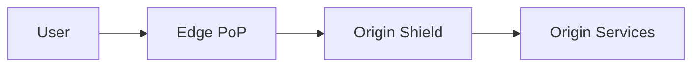
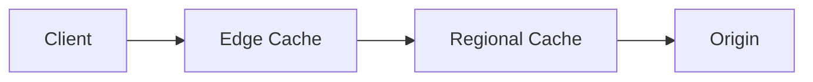
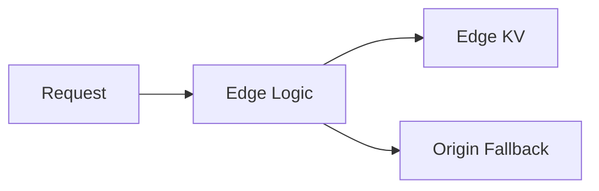
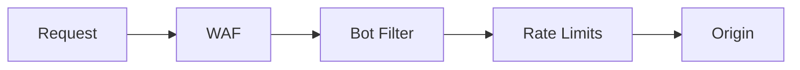
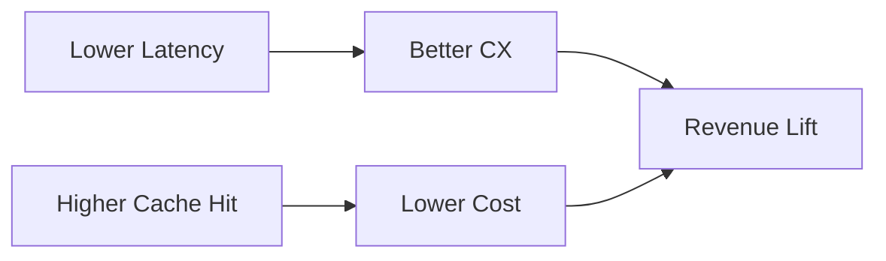

# Content Delivery Networks (CDN)

    How CDNs Work: Edge servers worldwide cache content close to users. First request goes to origin, cached at edge. Subsequent requests served from edge. Dramatically reduces latency for static content.
    Cache Strategy: Cache-Control headers determine caching behavior. Immutable assets (versioned files) can cache forever. Dynamic content requires careful cache key design. Cache invalidation is hard at global scale.
    Beyond Caching: Modern CDNs offer: DDoS protection, WAF, edge compute (Lambda@Edge, Cloudflare Workers), bot detection. The edge becomes a compute layer, not just cache.

This guide covers 5 key areas: I. Architectural Fundamentals & The "Mag7" Scale, II. Caching Strategies & Data Consistency, III. The Edge as a Compute Platform, IV. Security & Reliability at the Edge, V. Business Impact, ROI, & Cost Management.

## I. Architectural Fundamentals & The "Mag7" Scale

At the Principal TPM level within a Mag7 environment, you are not merely managing timelines; you are managing **topology, physics, and economics**. At this scale, standard architectural patterns break. The CDN and Edge infrastructure cease to be simple "static asset caches" and become the primary distributed compute layer and the first line of defense for your entire ecosystem.

### The Physics of Scale: Edge Topology & Peering
The fundamental goal at Mag7 scale is to minimize the physical distance between the user and the byte. However, the architectural differentiator is **Peering**.

*   **How it works:** Standard companies rely on transit providers (Level3, Cogent) to move packets. Mag7 companies act as their own Tier 1 networks. They establish Direct Peering relationships (via Internet Exchange Points or private network interconnections) with ISPs.
*   **Mag7 Implementation (Netflix/Google):**
    *   **Netflix Open Connect:** Netflix provides ISPs with proprietary hardware appliances (OCAs) pre-loaded with content. This is an embedded edge. The traffic never touches the public internet backbone.
    *   **Google Global Cache (GGC):** Similar to Netflix, but handles dynamic content (YouTube, Search). Google routes traffic via "Cold Potato" routing—they ingest traffic onto their private backbone as close to the user as possible and keep it on their network until the last mile to ensure QoS.
*   **Trade-off Analysis:**
    *   **Performance vs. CapEx:** Embedding hardware at ISPs (Netflix model) offers the lowest possible latency and eliminates transit costs. However, it requires massive CapEx and a dedicated logistics supply chain to manage physical hardware failures globally.
    *   **Control vs. Reach:** Building a private backbone (Google/AWS) allows for custom TCP congestion control (e.g., BBR) and protocol optimization (QUIC/HTTP3). The downside is the immense operational overhead of managing subsea cables and dark fiber.

### Traffic Steering: Anycast VIPs & BGP
At this level, DNS is not just mapping a name to an IP; it is a global load-balancing engine.

*   **How it works:** Mag7 architectures utilize **Anycast**. The same IP address is advertised via BGP (Border Gateway Protocol) from hundreds of locations simultaneously. The internet's routing logic directs the user to the topologically nearest PoP.
*   **The "Why":** This removes the reliance on DNS TTLs for failover. If a PoP in London goes dark, the BGP routes are withdrawn, and traffic automatically shifts to the next closest PoP (e.g., Amsterdam) without the client needing to resolve a new IP.
*   **Mag7 Implementation (AWS/Cloudflare):** AWS Global Accelerator and Cloudflare rely heavily on Anycast. They present a static IP to the user, but the ingress point shifts dynamically based on network congestion.
*   **Trade-off Analysis:**
    *   **Resiliency vs. Debuggability:** Anycast provides instant failover. However, debugging is notoriously difficult because "where" a user lands depends on their ISP's routing table, which you do not control. A user in New York might be routed to Dallas due to a BGP anomaly.
    *   **Global Convergence:** BGP is not instantaneous. In a catastrophic route leak or oscillation event, convergence can take minutes, impacting availability.

### The Origin Shield & Request Coalescing
The greatest risk to a Mag7 backend is the **"Thundering Herd."** If a popular live event starts or a cache is flushed, millions of concurrent requests hitting the origin database will cause a cascading failure.

*   **How it works:**
    *   **Origin Shield (Tiered Cache):** A dedicated caching layer between the Edge PoPs and the Origin. Edge PoPs fetch from the Shield, not the Origin.
    *   **Request Coalescing (Collapsed Forwarding):** If 10,000 users request `video_chunk_5.ts` simultaneously, the Edge should send *only one* request to the Origin, wait for the response, and serve it to all 10,000 users.
*   **Mag7 Implementation (Meta/Instagram):** Meta uses a highly tiered architecture for image delivery. An Edge PoP requests from a Regional PoP, which requests from the Origin. This reduces the cache miss ratio to near zero for the backend storage, protecting the "Haystack" (photo storage system).
*   **Trade-off Analysis:**
    *   **Backend Protection vs. Latency:** Adding an Origin Shield introduces an extra network hop (latency) for the *first* byte (cache miss). However, the ROI is massive: it allows you to scale the backend linearly rather than exponentially relative to user growth.
    *   **Consistency vs. Availability:** Aggressive coalescing can lead to high latency for the "tail" users if the single request to the origin hangs. You must implement "stale-while-revalidate" logic to serve old content while fetching new data.

### Impact on Business, ROI, and CX

As a Principal TPM, you must map these architectural choices to business outcomes:

*   **Egress Cost Reduction (ROI):** Data transfer is often the second largest infrastructure cost after compute. By offloading 95%+ of traffic to the Edge or ISP-embedded appliances, you reduce the "Internet Transit" bill significantly. *Guidance: Always model the cost of a cache miss—it's not just latency; it's a direct financial cost.*
*   **Time to First Byte (CX):** For e-commerce (Amazon) or Search (Google), latency correlates directly with revenue. A 100ms delay can drop conversion rates by 1-2%. The Edge architecture is the primary lever for optimizing this metric.
*   **Availability as a Feature:** By decoupling the serving layer (CDN) from the logic layer (Origin), the application can appear "up" (serving stale content) even if the database is down.

### Edge Cases & Failure Modes

A Principal TPM must anticipate the "Black Swan" events:

1.  **The "Cache Penetration" Attack:** Attackers request random, non-existent URLs (e.g., `site.com/random-hash`). These bypass the cache and hit the database directly, causing a DoS.
    *   *Mitigation:* Implement "Negative Caching" (cache the 404 response) and Bloom Filters at the Edge.
2.  **Global Route Leaks:** An ISP accidentally advertises your prefixes incorrectly, blackholing traffic for a region.
    *   *Mitigation:* This requires active monitoring (e.g., ThousandEyes) and direct relationships with ISP Network Operations Centers (NOCs) to resolve quickly.
3.  **Split-Brain DNS:** In Anycast, users might hit an Edge PoP that has a different version of the site than their friend due to propagation delays during a deployment.
    *   *Mitigation:* Versioned assets (immutable infrastructure) are mandatory. Never overwrite `style.css`; deploy `style.v2.css`.

---

## II. Caching Strategies & Data Consistency

At the Principal TPM level, you are not responsible for selecting the eviction algorithm (LRU vs. LFU). You are responsible for defining the **consistency models** that dictate user experience and the **cost-efficiency** of the infrastructure. At Mag7 scale, caching is not merely an optimization; it is a structural necessity to protect the "Origin" (databases/services) from the sheer volume of traffic.

### The Multi-Layer Caching Topology
In a microservices architecture at scale, caching occurs at every hop. You must treat these not as isolated optimizations but as a unified data lineage problem.

*   **L1: Browser/Client Cache:** (Zero latency, zero cost) Controlled by HTTP headers (`Cache-Control`, `ETag`).
*   **L2: Edge/CDN:** (Low latency, high offload) Caches static assets and some dynamic API responses.
*   **L3: API Gateway/Reverse Proxy:** (Nginx/Envoy) Caches responses to protect internal networks.
*   **L4: Application Local Cache:** (In-memory/Heap) Extremely fast but creates "cache drift" between different instances of the same service.
*   **L5: Distributed Cache:** (Redis/Memcached) The shared source of truth for ephemeral data before hitting the DB.

**Mag7 Real-World Example:**
**Meta (Facebook)** utilizes **Mcrouter**, a memcached protocol router, to manage thousands of cache servers. When a user loads their News Feed, the read request hits the distributed cache cluster first. If Meta relied solely on MySQL for Feed generation, their infrastructure footprint would need to increase by orders of magnitude, destroying their margin.

**Trade-offs:**
*   **Local vs. Distributed:**
    *   *Local (In-Memory):* Fastest access (nanoseconds). **Tradeoff:** Impossible to keep consistent across 10,000 service instances. Used for immutable configuration data.
    *   *Distributed (Redis):* Slower (milliseconds, network hop required). **Tradeoff:** Single source of truth but introduces a network dependency and serialization overhead.

### Caching Patterns & Write Strategies
The specific pattern chosen dictates the data consistency lag (stale data) the product must tolerate.

#### Cache-Aside (Lazy Loading)
The application looks for data in the cache. If missing, it queries the DB, populates the cache, and returns data.
*   **Mag7 Use Case:** **Netflix** metadata (movie descriptions, actor lists). This data rarely changes.
*   **Trade-off:** "Cold Start" latency. The first user always pays the penalty of the DB fetch.
*   **Business Impact:** High Read ROI. Low risk of data loss.

#### Write-Through
The application writes to the cache and the DB simultaneously (or the cache writes to the DB synchronously).
*   **Mag7 Use Case:** **Amazon** Inventory counts during Prime Day. You cannot afford for the cache to say "In Stock" when the DB says "Empty."
*   **Trade-off:** Higher write latency (two writes must confirm).
*   **Business Impact:** High Data Integrity. Crucial for transactional systems where CX trust is paramount.

#### Write-Back (Write-Behind)
The application writes *only* to the cache. The cache asynchronously syncs to the DB later.
*   **Mag7 Use Case:** **YouTube** view counters or **LinkedIn** "Likes." It is acceptable if the view count is persisted to the permanent DB with a 5-second delay to aggregate writes.
*   **Trade-off:** **Data Loss Risk.** If the cache node crashes before syncing to the DB, the data is lost forever.
*   **Business Impact:** Massive write performance/throughput. Suitable for high-volume, low-criticality data.

### The Hard Problem: Invalidation & Consistency
At Mag7 scale, "Time to Live" (TTL) is a blunt instrument. Principal TPMs must navigate the tension between **Eventual Consistency** and **Strong Consistency**.

#### The "Thundering Herd" Problem
When a popular cache key (e.g., the homepage configuration of Amazon.com) expires, thousands of requests hit the backend simultaneously before the cache can be repopulated. This causes cascading failure.

**Mag7 Solutions:**
1.  **Request Coalescing (Collapsing):** The proxy holds 9,999 requests, lets 1 go through to the DB, and serves the result to all 10,000.
2.  **Probabilistic Early Expiration (Jitter):** If TTL is 60s, the system might refresh the key at 55s or 58s randomly to prevent all nodes from expiring simultaneously.
3.  **Lease/Gutter Patterns:** As seen in **Google's** infrastructure, a client is given a "lease" to update the value, while others are served stale data briefly.

**Real-World Example: Instagram**
Instagram uses a concept called **"Cache Warming"** combined with **Postgres replication lag handling**. If a user posts a photo (write) and immediately refreshes (read), they might hit a read-replica that hasn't received the data yet. Instagram tags the user session to force a read from the "Master" (or a consistent cache) for a few seconds after a write to ensure the user sees their own content (Read-Your-Own-Writes Consistency).

### Global Consistency & Geo-Replication
When caching spans regions (e.g., AWS us-east-1 and eu-west-1), consistency becomes a physics problem (speed of light).

*   **Active-Passive:** Writes go to US, replicate to EU. EU Cache is always slightly stale.
*   **Active-Active:** Writes happen in both. Requires conflict resolution (Last-Write-Wins or Vector Clocks).

**Trade-off:**
*   **Consistency vs. Latency (CAP Theorem):** You cannot have instant global consistency and low latency.
*   **Actionable Guidance:** For financial transactions (Billing), centralize the write (accept latency). For User Profiles, replicate the data and accept eventual consistency (accept staleness).

### Business & ROI Impact Analysis

| Feature | Technical Choice | Business/ROI Impact |
| :--- | :--- | :--- |
| **Cost Optimization** | **High Cache Hit Ratio (>95%)** | Reduces database provisioned IOPS and compute by 80-90%. Direct OpEx reduction. |
| **User Experience** | **Stale-While-Revalidate** | Serves slightly old content instantly while fetching new data in the background. Perceived latency drops to near zero. |
| **Reliability** | **Circuit Breaking** | If the cache fails, do not fall back to the DB for *all* traffic (which would crash the DB). Fail open or serve static fallbacks. |

---

## III. The Edge as a Compute Platform

For a Principal TPM at a Mag7, the "Edge" is no longer defined solely by static asset caching. The paradigm has shifted to **Edge Compute**—moving logic, compute, and data processing from centralized regions (e.g., `us-east-1`) to the Points of Presence (PoPs) closest to the user.

This shift transforms the CDN from a dumb pipe into an intelligent, programmable layer. Your role is to determine *what* logic belongs at the edge versus the origin, balancing latency gains against architectural complexity and data consistency challenges.

### Architectural Models: Containers vs. Isolates
At the scale of Google or Amazon, the underlying runtime technology dictates cost and performance.

*   **Containers/VMs (e.g., AWS Lambda@Edge):** Traditional serverless. Spins up a micro-VM or container.
    *   *Pros:* Full Node.js/Python compatibility; access to standard libraries.
    *   *Cons:* "Cold starts" can take hundreds of milliseconds. Higher resource overhead.
*   **V8 Isolates (e.g., Cloudflare Workers, Deno Deploy, Vercel):** Runs code in a sandboxed environment within a single runtime instance.
    *   *Pros:* Near-instant startup (single-digit ms); massive concurrency per server.
    *   *Cons:* Restricted environment (no arbitrary binaries, specific language constraints).

**Mag7 Real-World Example:**
**Amazon** uses **CloudFront Functions** (lightweight JS, sub-millisecond execution) for high-volume header manipulation, while reserving **Lambda@Edge** (heavier compute) for complex image resizing or content generation. A Principal TPM must enforce strict governance on which tool is used; using Lambda@Edge for simple redirects is a massive ROI failure due to cost and latency overhead.

### Strategic Use Cases & Business Impact

#### Dynamic Personalization & Server-Side Rendering (SSR)
Instead of the client fetching a generic `index.html` and then making an API call for user data (client-side rendering), the Edge assembles the page.
*   **Implementation:** The Edge worker fetches the static template from cache, retrieves user-specific data (e.g., "Hello, [User]") from a regional KV store, stitches them, and serves the HTML.
*   **ROI/CX Impact:** Eliminates the "loading spinner." Drastically improves Core Web Vitals (LCP/CLS), which directly correlates to SEO ranking and conversion rates.
*   **Tradeoff:** Increases "Time to First Byte" (TTFB) slightly compared to static cache, but significantly decreases "Time to Interactive" (TTI).

#### Security & Authentication Offloading
Validating JWTs (JSON Web Tokens) or OAuth tokens at the origin is a waste of backbone bandwidth and origin compute cycles.
*   **Implementation:** The Edge validates the signature and expiration of the JWT. If invalid, it returns `401 Unauthorized` immediately. The request never touches the origin.
*   **Mag7 Example:** **Netflix** performs geo-blocking and entitlement checks at the Open Connect appliance level (ISP edge). If a user in France tries to access US-only content, the request is rejected within France.
*   **Business Capability:** Massive reduction in origin infrastructure costs. Protection against Layer 7 DDoS attacks (the attack traffic is absorbed by the distributed edge, not the centralized database).

#### Data Sovereignty & Compliance (GDPR)
*   **Implementation:** Edge functions route traffic based on user location. German user data is processed and stored in Frankfurt PoPs, while US user data goes to Virginia.
*   **Impact:** Enables entry into markets with strict data residency laws without building physical data centers in every jurisdiction.

### State Management: The "Hard Problem"
The Edge is ephemeral and distributed. Managing state (database consistency) is the primary technical blocker.

*   **The Challenge:** If you write to a database in the Tokyo Edge, how fast does the London Edge see it?
*   **Solution: Edge-native KV Stores.** (e.g., Cloudflare KV, DynamoDB Global Tables). These are eventually consistent stores replicated to PoPs.
*   **Tradeoff:** **Consistency vs. Latency (CAP Theorem).** You cannot have strong consistency at the edge without incurring the latency of a consensus protocol (like Paxos/Raft) across the globe.
    *   *Decision Point:* For a shopping cart, you need strong consistency (route to origin). For a "Recommended for You" list, eventual consistency is acceptable (read from Edge KV).

### Tradeoff Analysis & ROI

| Decision | Tradeoff | ROI/Business Impact |
| :--- | :--- | :--- |
| **Logic at Edge** | **Pro:** Lowest latency, reduced origin load. **Con:** High debugging complexity, difficult observability, vendor lock-in (proprietary runtimes). | **High:** Reduced churn due to speed; lower cloud compute bills (OpEx) by offloading origin. |
| **Logic at Origin** | **Pro:** Centralized logs, easy debugging, strong consistency. **Con:** Higher latency, "thundering herd" risk. | **Neutral:** Standard baseline. Necessary for transactional data (payments). |
| **Edge-Side Includes (ESI)** | **Pro:** Composes pages from fragments (header, body, ads) at the edge. **Con:** If one fragment fails, the whole page hangs (Head-of-Line blocking). | **Medium:** Great for media sites, risky for transactional apps. |

### Deployment & Failure Modes
Shipping code to 200+ global locations simultaneously is a high-risk operation.

*   **The "Blast Radius" Problem:** A bug in an Edge function breaks the site globally, instantly. Unlike a bad canary deployment in `us-east-1` which affects 1% of users, a bad Edge config propagation can be total.
*   **Mitigation:**
    *   **Staged Rollouts:** Deploy to "Canary PoPs" (low traffic regions) first.
    *   **Route-based Versioning:** Traffic is routed to `Worker-v2` only for internal employees via HTTP headers before public rollout.
*   **Fail-Open Logic:** If the Edge compute fails (timeout/error), the system must degrade gracefully—either bypassing the function to hit the origin directly or serving a stale (cached) version of the content.

---

## IV. Security & Reliability at the Edge

At the Principal TPM level, you are not configuring ACLs; you are defining the risk posture and architectural boundaries of the product. In a Mag7 environment, the Edge is no longer just a delivery mechanism; it is the **primary defense perimeter** and the **failover orchestrator**. The objective is to absorb attacks and failures at the Edge PoP (Point of Presence) so the Origin infrastructure (your core application) never perceives the volatility.

### Perimeter Defense: DDoS & The "Infinite" Sinkhole
At Mag7 scale, Distributed Denial of Service (DDoS) attacks are not anomalies; they are background radiation. The strategy shifts from "blocking" to "absorbing."

*   **Technical Mechanism:**
    *   **Volumetric Absorption via Anycast:** By announcing the same IP address from hundreds of locations worldwide, attack traffic is naturally fragmented. A 2 Tbps attack is unmanageable for a single data center but trivial when divided across 200 PoPs (10 Gbps per PoP).
    *   **Layer 7 Scrubbing:** Decrypting traffic at the edge to inspect HTTP headers/payloads for malicious patterns (SQLi, XSS) before re-encrypting and forwarding to the origin.

*   **Mag7 Real-World Example:**
    *   **Google Project Shield / Google Cloud Armor:** Google uses its massive global capacity to absorb attacks for customers. They prioritize traffic based on a "trust score" calculated at the edge. If the system is under load, they shed traffic with low trust scores at the edge, ensuring high-trust traffic (authenticated users) still reaches the origin.
    *   **AWS Shield Advanced:** Automatically shifts traffic routing tables to "scrubbing centers" when heuristics detect anomalies, invisible to the application owner.

*   **Tradeoffs:**
    *   **Latency vs. Inspection Depth:** Inspecting every packet at L7 adds latency. **Decision:** Enable aggressive WAF rules only when threat levels rise (dynamic profiling), or accept a 5-10ms latency penalty for constant vigilance.
    *   **False Positives:** Aggressive scrubbing can block legitimate API calls or webhooks. **TPM Action:** You must define "Fail Open" (risk availability) vs. "Fail Closed" (risk security) policies during the design phase.

*   **Impact:**
    *   **ROI:** Prevents downtime which costs Mag7 companies millions per minute.
    *   **CX:** Users experience consistent latency even during massive attacks.

### Bot Management & Edge Logic
Simple IP rate limiting is insufficient against sophisticated botnets that rotate residential IPs. Mag7 companies move business logic to the edge to fingerprint clients without touching the database.

*   **Technical Mechanism:**
    *   **Fingerprinting:** The Edge executes JavaScript or analyzes TLS handshakes (JA3 fingerprinting) to identify automated actors.
    *   **Proof of Work (PoW):** Instead of a visual CAPTCHA, the Edge challenges the client browser to solve a cryptographic puzzle. This imposes a CPU cost on the attacker, destroying the ROI of their botnet.

*   **Mag7 Real-World Example:**
    *   **Amazon (Retail):** During high-demand launches (e.g., PS5 restock), Amazon performs "waiting room" logic at the edge. The Origin only sees a smooth stream of purchasing requests; the chaotic queue is held entirely in the CDN layer.
    *   **Meta (Facebook/Instagram):** Heavy use of edge logic to strip metadata from uploaded images before they enter the core network, ensuring privacy compliance and sanitizing potential malware vectors.

*   **Tradeoffs:**
    *   **Vendor Lock-in:** Moving logic to the Edge (e.g., AWS Lambda@Edge, Cloudflare Workers) couples your application logic tightly to the CDN provider's proprietary runtime.
    *   **Observability:** Debugging logic that runs on 10,000 distributed servers is significantly harder than debugging a centralized microservice.

### Reliability: Multi-CDN & Traffic Steering
Relying on a single CDN is a Single Point of Failure (SPOF). Mag7 companies almost exclusively utilize a Multi-CDN strategy.

*   **Technical Mechanism:**
    *   **RUM-Based Steering:** Real User Monitoring (RUM) data is collected from client browsers. If Users in France see high latency on Fastly, the DNS or HTTP steering logic automatically shifts French traffic to Akamai or CloudFront.
    *   **Active-Active Failover:** Both CDNs serve traffic simultaneously.

*   **Mag7 Real-World Example:**
    *   **Disney+ / Netflix:** They utilize a mix of internal CDNs (Open Connect) and public CDNs. If an ISP link becomes saturated for their private CDN, traffic spills over to public partners instantly.
    *   **Microsoft (Update Delivery):** Uses a tiered approach where updates are delivered via P2P (Delivery Optimization) combined with Multi-CDN to ensure global bandwidth doesn't saturate a single backbone.

*   **Tradeoffs:**
    *   **Lowest Common Denominator:** You can only use features supported by *all* your CDN vendors. If CDN A supports HTTP/3 and CDN B does not, you may have to disable HTTP/3 to ensure consistent behavior, or build complex shims.
    *   **Cost vs. Leverage:** Splitting traffic reduces your volume discount leverage with a single vendor. However, it increases negotiation power ("I can move 50% of my traffic away from you tomorrow").

*   **Impact:**
    *   **Business Capability:** Zero downtime deployments and immunity to vendor outages.
    *   **ROI:** The cost of a Multi-CDN orchestrator is often offset by the ability to route traffic to the cheapest performing CDN in real-time (Cost-based routing).

### TLS Termination & Key Management (Keyless SSL)
Terminating SSL/TLS at the edge is required for caching, but Mag7 companies (especially in Fintech or Healthcare verticals) cannot share private keys with third-party vendors due to compliance.

*   **Technical Mechanism:**
    *   **Keyless SSL:** The CDN terminates the connection but does not hold the private key. When a handshake occurs, the CDN forwards the cryptographic challenge to the Mag7's internal Key Server. The Key Server signs it and returns it. The CDN never sees the private key.

*   **Tradeoffs:**
    *   **Performance vs. Compliance:** Keyless SSL introduces a round-trip to the origin for the initial handshake, adding latency.
    *   **Operational Complexity:** Maintaining a highly available Key Server infrastructure becomes critical. If Key Servers go down, the global CDN cannot accept new connections.

### Actionable Guidance for the Principal TPM

1.  **Define the "Fail Open" Policy:** Work with Security Engineering to explicitly document what happens when the WAF fails or becomes unreachable. Do you drop all traffic (Fail Closed) or bypass security to maintain revenue (Fail Open)? This is a business decision, not an engineering one.
2.  **Audit the "Logic Leak":** Review how much business logic (redirects, auth checks, A/B testing) has leaked into Edge/CDN configurations. If it's more than 15% of your routing logic, initiate a project to standardize or containerize this logic to prevent vendor lock-in.
3.  **Implement RUM Steering:** If your product serves a global audience and you are single-homed on one CDN, you are negligent on reliability. Push for a pilot of a secondary CDN for a specific region to establish the control plane for traffic steering.

---

## V. Business Impact, ROI, & Cost Management

At the Principal TPM level within a Mag7 environment, CDN management is rarely about "turning it on." It is an exercise in managing the **Unit Economics of Data Delivery**. When serving petabytes of data daily, a 0.5% improvement in cache hit ratio or a $0.001 reduction in per-GB transit cost translates to millions in annual savings.

You must navigate the tension between **Performance (Latency/Availability)** and **Cost (Egress/Compute)**.

### The Economics of Egress & Peering (The "Mag7" Advantage)

**Technical Depth:**
At scale, the primary cost driver is not storage or compute; it is **Egress (Data Transfer Out)**. Public cloud providers (AWS, Azure, GCP) charge significant markups for data leaving their network to the internet.
*   **Transit vs. Peering:** Standard companies pay "Transit" fees (paying an ISP to carry traffic). Mag7 companies leverage **Peering**. They physically connect their routers to ISPs (Comcast, Verizon, Deutsche Telekom) at Internet Exchange Points (IXPs).
*   **Settlement-Free Peering:** Because Mag7 content is in high demand, ISPs often agree to "settlement-free" peering. The ISP saves money by not routing Netflix/YouTube traffic through their transit providers, and the Mag7 company avoids public cloud egress rates.

**Real-World Example:**
*   **Netflix (Open Connect):** Netflix offers ISPs proprietary hardware (OCAs) pre-loaded with content. This eliminates the concept of "Egress" for the bulk of their traffic. The cost shifts from OpEx (bandwidth bills) to CapEx (hardware manufacturing and shipping).
*   **Microsoft/Facebook:** They invest heavily in subsea cables. By owning the fiber, they control the cost structure of moving data between continents, insulating themselves from fluctuating public transit pricing.

**Tradeoffs:**
*   **Direct Peering vs. Public Transit:** Direct peering requires a massive dedicated network engineering team and legal/business development teams to negotiate with thousands of ISPs globally. It is only ROI-positive at massive scale.
*   **CapEx vs. OpEx:** Owning the infrastructure (Dark Fiber, OCAs) creates asset depreciation on the balance sheet but improves long-term gross margins.

### Multi-CDN Strategies & Cost Arbitrage

**Technical Depth:**
Relying on a single CDN vendor (e.g., only CloudFront or only Akamai) is considered a critical risk and a financial inefficiency at the Principal level. Mag7 companies utilize **Multi-CDN architectures** driven by real-time DNS steering.
*   **Traffic Steering:** A control plane (e.g., NS1, Cedexis) ingests Real User Monitoring (RUM) data. It routes traffic based on policy: "Route to the cheapest provider that meets &lt;50ms latency."
*   **Commit Levels:** Contracts are negotiated based on "Commits" (e.g., committing to 10PB/month). If you fail to hit the commit, you pay anyway. If you go over, you pay "Overage" rates.

**Real-World Example:**
**Apple** (for software updates/media) and **Disney+** utilize a mix of Akamai, Fastly, Limelight (Edgio), and internal CDNs.
*   If Akamai offers a rate of $0.005/GB in North America but $0.03/GB in APAC, the steering logic routes North American traffic to Akamai and APAC traffic to a regionally cheaper competitor (e.g., CDNetworks), provided quality metrics are met.

**Tradeoffs:**
*   **Leverage vs. Complexity:** Multi-CDN prevents vendor lock-in and provides massive negotiation leverage. However, it requires complex abstraction layers. You cannot use vendor-specific features (like Cloudflare Workers) if you need feature parity across Akamai and Fastly. You are forced to the "lowest common denominator" of functionality.
*   **Split Volume:** Splitting traffic reduces the volume sent to any single vendor, potentially reducing the volume discount tier you can negotiate.

### The ROI of "Offload" (Cache Hit Ratio)

**Technical Depth:**
The **Cache Hit Ratio (CHR)** is the single most direct lever for ROI.
*   **Hit:** Served from the Edge (Cheap).
*   **Miss:** Request goes to Origin (Expensive Egress + Expensive Compute + Database Load).

**The "Origin Shield" ROI Calculation:**
Implementing an Origin Shield (a mid-tier cache) increases the CHR.
*   *Without Shield:* 100 Edge PoPs miss. 100 requests hit the Origin.
*   *With Shield:* 100 Edge PoPs miss. They hit 1 Shield. Shield misses once. 1 request hits Origin.
*   **ROI Impact:** This drastically reduces the size of the Origin database and compute fleet required. You spend more on CDN (Shield costs) to save disproportionately on backend infrastructure (EC2/RDS).

**Real-World Example:**
**Amazon Prime Video:** For live events (Thursday Night Football), the "Thundering Herd" of millions of users joining simultaneously would melt the origin servers. They use tiered caching not just for cost, but for survival. The ROI is binary: Service Availability vs. Outage.

**Tradeoffs:**
*   **Freshness vs. Cost:** Increasing Time-To-Live (TTL) improves CHR and lowers cost. However, it risks serving stale data (e.g., an old price on an e-commerce site).
*   **Purge Costs:** If you cache aggressively, you must have a mechanism to "Purge" (invalidate) content instantly. Some CDNs charge per-purge-request. Frequent purging can negate the savings of caching.

### Edge Compute: Business Capability vs. Cost

**Technical Depth:**
Moving logic to the edge (AWS Lambda@Edge, Cloudflare Workers) enables new capabilities like A/B testing, personalization, and security filtering without hitting the origin.

**Impact on Capabilities:**
*   **Security:** Blocking DDoS attacks or scraping bots at the Edge prevents them from consuming expensive origin resources. This is "Negative ROI" prevention—spending money to prevent a larger loss.
*   **Personalization:** Resizing images or injecting user-specific headers at the edge improves CX (lower latency) but increases the "Cost per Request."

**Tradeoffs:**
*   **Cost Per Invocation:** Edge compute is significantly more expensive per CPU-cycle than centralized compute (EC2).
*   **Guidance:** Only move logic to the edge if it relies on *latency sensitivity* or *bandwidth reduction*. Do not move general business logic to the edge just because it's "modern."

### Actionable Guidance for the Principal TPM

1.  **Implement Cost-Aware Routing:** Do not route solely on latency. Work with engineering to implement a steering policy that factors in unit cost per GB per region.
2.  **Audit "Cache-Control" Headers:** 30% of CDN costs are often waste due to misconfigured headers (e.g., `no-cache` on static assets). Enforce strict header policies in the CI/CD pipeline.
3.  **Negotiate "Burstable" Contracts:** Ensure CDN contracts allow for "95th percentile billing" or burst allowances to handle unexpected viral events without incurring punitive overage rates.
4.  **Define the "Stale" Tolerance:** Work with Product to define exactly how stale content can be (1 second? 1 minute?). Push this number as high as possible to maximize offload.

### Edge Cases & Failure Modes

*   **The "Wallet of Death" (DDoS):** A volumetric DDoS attack on a non-cached endpoint (or a "cache-busting" attack where attackers append `?random=123` to URLs) forces the CDN to fetch from the origin every time.
    *   *Mitigation:* Rate limiting at the Edge and WAF rules that drop requests with random query strings on static assets.
*   **The Infinite Loop:** Misconfigured redirects between the Edge and the Origin (e.g., Edge redirects to HTTP, Origin redirects back to HTTPS) can cause infinite loops, generating massive billable request volumes in seconds.
    *   *Mitigation:* strict "Max Redirects" configurations and loop detection headers.

---

## Interview Questions

### I. Architectural Fundamentals & The "Mag7" Scale

#### Q1: Live Streaming Event Architecture
**"We are launching a high-profile live streaming event expected to draw 10 million concurrent users. Our current architecture connects Edge PoPs directly to our Origin. Design a strategy to prevent the backend from melting down, focusing on the first 60 seconds of the broadcast."**

**Guidance for a Strong Answer:**
*   **Identify the Bottleneck:** Acknowledge that 10M users hitting "play" simultaneously creates a Thundering Herd. Direct Edge-to-Origin is a single point of failure.
*   **Architectural Solution:** Propose a **Tiered Caching / Origin Shield** architecture to multiplex connections.
*   **Specific Mechanism:** Discuss **Request Coalescing (Collapsed Forwarding)**. Explain that only *one* request per video segment should leave the Regional Edge to the Origin.
*   **Pre-warming:** Mention **Cache Warming**. Push the manifest and initial video segments to the Edge *before* the event starts.
*   **Degradation Strategy:** Define a "Load Shedding" plan. If the Origin struggles, serve lower bitrate manifests automatically or serve a static "Please Wait" slate from the Edge rather than failing hard.

#### Q2: Build vs. Buy CDN
**"We are spending $50M/year on a third-party CDN vendor. Engineering wants to build an in-house CDN to save money and gain control. As a Principal TPM, how do you evaluate this tradeoff? What are the hidden complexities?"**

**Guidance for a Strong Answer:**
*   **Financial Framework:** Move beyond simple OpEx (vendor bill) vs. CapEx (servers). Include the **Total Cost of Ownership (TCO)**: Network Engineering headcount, peering negotiation teams, supply chain logistics, and dark fiber leases.
*   **Strategic Capability:** Ask *why* we need control. Do we need custom protocols (like Google's QUIC) that the vendor doesn't support? If not, building is likely a distraction from core business value.
*   **Hidden Complexities:** Highlight **Peering Relationships**. It takes years to establish settlement-free peering with major global ISPs. A vendor already has these.
*   **The "Hybrid" Approach:** A strong candidate often suggests a middle ground—build a private CDN for high-volume, static heavy traffic (video/images) to save costs, but keep the third-party CDN for dynamic, low-latency API traffic or as a failover (Multi-CDN strategy). This de-risks the migration.

### II. Caching Strategies & Data Consistency

#### Q1: Flash Sale Caching Strategy
**Design the caching strategy for a "Flash Sale" system (e.g., Amazon Prime Day Lightning Deals) where inventory is limited and demand is massive.**

**Guidance for a Strong Answer:**
*   **Identify the Constraint:** Standard "Cache-Aside" will fail because of the race condition between the cache and the DB regarding inventory counts (overselling).
*   **The Solution:** Propose **Lua scripting in Redis** (atomic decrement) to handle inventory in memory first.
*   **Consistency:** Acknowledge that the Cache is the "System of Record" for the duration of the sale, asynchronously syncing to the DB (Write-Behind) to prevent DB locking issues.
*   **Edge Cases:** Discuss how to handle cart abandonment (TTL on the hold) and what happens if the Redis node crashes (using AOF persistence or Acceptable Loss thresholds).

#### Q2: Global Strong Consistency
**You are launching a feature that requires Global Strong Consistency (e.g., a collaborative document editor like Google Docs). Your engineering lead suggests a standard 5-minute TTL cache to save costs. How do you evaluate this?**

**Guidance for a Strong Answer:**
*   **The Rejection:** A 5-minute TTL is disastrous for collaborative editing; users will overwrite each other's work (stale reads).
*   **The Pivot:** Explain that Caching is likely the wrong tool for the *document state*.
*   **Alternative Architecture:** Suggest **Operational Transformation (OT)** or **CRDTs** (Conflict-free Replicated Data Types) for state management.
*   **Where Cache Fits:** Clarify that caching *should* be used for the read-only elements (UI chrome, user avatars, fonts) but *not* the mutable document state.
*   **Business Impact:** Emphasize that "saving costs" on caching here leads to a broken product (churn), making the ROI negative regardless of infrastructure savings.

### III. The Edge as a Compute Platform

#### Q1: Flash-Sale Ticketing System
**"We are designing a global flash-sale ticketing system (high concurrency, limited inventory). The Product VP wants to use Edge Compute to minimize latency for users. Evaluate this strategy."**

**Guidance for a Strong Answer:**
*   **Identify the Trap:** Edge Compute is great for latency, but terrible for *global atomic consistency*. Selling the same ticket to two people in different PoPs is a critical business failure.
*   **Proposed Architecture:**
    *   **Edge Role:** specific tasks only—Static asset delivery, waiting room queue UI management, and preliminary request validation (auth, rate limiting).
    *   **Origin Role:** The "Source of Truth" for inventory decrement.
    *   **Hybrid Approach:** Use the Edge to "hold" users in a queue (using Edge KV to manage queue position), letting them through to the Origin in batches to prevent database meltdown.
*   **Tradeoff Analysis:** Explicitly state that we sacrifice a few milliseconds of latency on the *purchase* click to ensure transactional integrity, which protects the CX from "order cancelled" emails later.

#### Q2: Edge Function Latency Spike
**"You have deployed a new Edge Function to header-sign requests for security. Suddenly, latency spikes by 300ms globally. How do you triage and resolve this as the Principal TPM?"**

**Guidance for a Strong Answer:**
*   **Immediate Action:** Rollback. At Mag7, availability > new features. Revert the route mapping to the previous version immediately.
*   **Root Cause Analysis (Hypothesis Generation):**
    *   *Compute Heavy?* Did we use a crypto library that is too CPU intensive for the allocated Edge runtime limits?
    *   *External Calls?* Is the function making a blocking network call (e.g., fetching a key from a slow database) on every request?
    *   *Cold Starts?* Did we switch from a lightweight runtime (CloudFront Functions) to a container-based one (Lambda@Edge) without accounting for startup time?
*   **Process Improvement:** Establish a "Performance Budget" for Edge functions (e.g., "Must execute in &lt;5ms"). Mandate synthetic testing in the CI/CD pipeline that simulates execution in geographically distant PoPs before approval.

### IV. Security & Reliability at the Edge

#### Question 1: The "Thundering Herd" & Cache Invalidation
**Scenario:** "We have a breaking news alert that will be pushed to 50 million mobile devices simultaneously. The content is dynamic but cacheable for 60 seconds. However, we just deployed a bug fix and need to invalidate the cache immediately while this traffic spike is occurring. How do you manage this without taking down the origin?"

**Guidance for a Strong Answer:**
*   **Identify the Risk:** Immediate global invalidation causes a "Thundering Herd"—all 50M clients miss the cache simultaneously and hit the origin, causing a total outage.
*   **Mitigation Strategy:**
    *   **Soft Purge / Stale-While-Revalidate:** Do not delete the content. Mark it as stale. The CDN continues serving the "old" content to the herd while a single request goes to the origin to fetch the new content.
    *   **Collapsed Forwarding:** Ensure the CDN coalesces multiple requests for the same object into a single request to the origin.
    *   **Phased Invalidation:** If the bug isn't critical security, invalidate by region (Asia first, then Europe, etc.) to smooth the load.
*   **Principal Insight:** Discuss the tradeoff between data consistency (users seeing the bug for 60 more seconds) vs. system availability (total outage). Availability usually wins.

#### Question 2: Multi-CDN Strategy & Cost
**Scenario:** "Our CFO wants to cut CDN costs. We currently split traffic 50/50 between AWS CloudFront and Akamai for redundancy. The engineering team wants to stick with this for reliability. The CFO suggests moving 100% to a cheaper, smaller CDN provider to save 40%. As a Principal TPM, how do you evaluate and decide?"

**Guidance for a Strong Answer:**
*   **Risk Assessment:** A smaller CDN likely lacks the peering agreements and PoP density of Mag7-tier providers, risking latency and throughput in remote regions.
*   **The Hidden Cost of Single-Homing:** Calculate the cost of downtime. If the cheap CDN has 99.0% availability vs. the 99.99% aggregate availability of the current setup, translate that 0.99% difference into revenue loss. It likely exceeds the 40% savings.
*   **The "Commit" Trap:** Moving 100% destroys negotiation leverage.
*   **Proposed Solution:** Propose a **Cost-Performance Routing** strategy. Keep CloudFront/Akamai for high-value/low-latency markets (US/EU). Route bulk/low-priority traffic (e.g., image thumbnails, background updates) to the cheaper CDN. This maintains reliability where it counts while lowering the blended cost per GB.

### V. Business Impact, ROI, & Cost Management

#### Question 1: The Multi-CDN Strategy
**"We are currently spending $50M/year on a single CDN provider. The CIO wants to reduce this by 20% while maintaining global latency standards. As a Principal TPM, how would you approach this, and what are the architectural and business risks of your proposed strategy?"**

**Guidance for a Strong Answer:**
*   **Strategic Approach:** Do not just say "switch vendors." Propose a **Multi-CDN strategy**. Explain the leverage this gives in contract renewal (playing vendors against each other).
*   **Technical Implementation:** Discuss introducing a **DNS Traffic Steering** layer (control plane). Explain how you would route baseline traffic to the cheapest provider (Cost-based routing) and premium traffic to the fastest (Performance-based routing).
*   **Risks (Crucial):**
    *   **Feature Parity:** Acknowledging that we lose vendor-specific "magic" (like specific image optimization tools) and must engineer to the lowest common denominator.
    *   **Loss of Volume Discounts:** Splitting traffic might drop us to a lower tier, actually *increasing* unit cost if not calculated correctly.
    *   **Operational Complexity:** The cost of the engineering team needed to manage two vendors vs. one.

#### Question 2: The "Cache-Busting" Billing Spike
**"You wake up to an alert that our CDN bill has spiked 500% in the last 6 hours, but our user traffic metrics (Daily Active Users) are flat. What is likely happening, how do you diagnose it technically, and how do you stop the bleeding?"**

**Guidance for a Strong Answer:**
*   **Diagnosis:** Identify this as a **Cache-Busting Attack** or a configuration error. The attacker is likely requesting valid assets with unique query parameters (e.g., `image.jpg?uid=1`, `image.jpg?uid=2`), forcing the CDN to treat every request as a "Miss" and fetch from the origin.
*   **Investigation:** Look at the **Cache Hit Ratio (CHR)** metrics—they will have plummeted. Check the **Origin Egress** metrics—they will have spiked.
*   **Immediate Action:**
    *   **WAF Rules:** Implement a rule at the Edge to ignore query strings for static extensions (.jpg, .css) or block IPs generating high variance in query strings.
    *   **Rate Limiting:** Aggressively rate-limit IPs causing high origin-fetch rates.
*   **Long-term Fix:** Configure the CDN to **"Ignore Query Strings"** for caching purposes on static assets (so `?uid=1` and `?uid=2` serve the same cached object).

---

## Key Takeaways

- Review each section for actionable insights applicable to your organization
- Consider the trade-offs discussed when making architectural decisions
- Use the operational considerations as a checklist for production readiness
