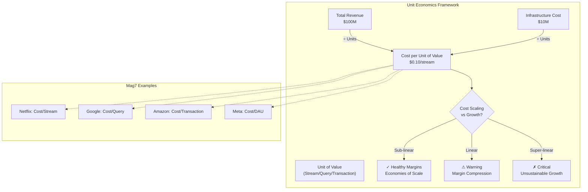
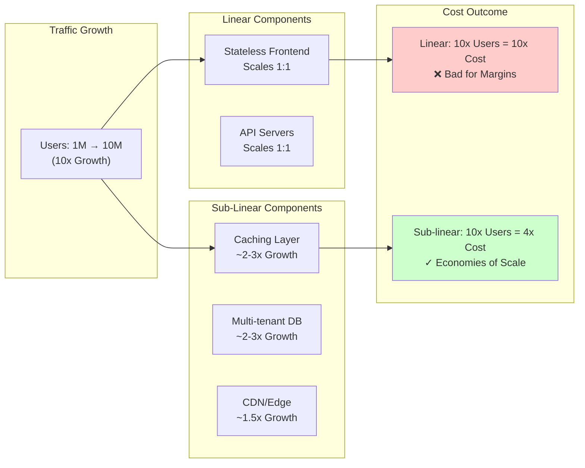
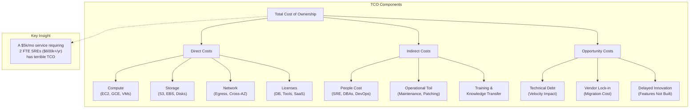

# Cost Model Fundamentals

This guide covers 6 key areas: I. The Strategic Role of Cost Modeling at Mag7 Scale, II. Total Cost of Ownership (TCO) Components, III. CapEx vs. OpEx: The Roadmap Influencer, IV. Unit Economics and Forecasting, V. Build vs. Buy (vs. Open Source), VI. FinOps: Continuous Cost Optimization.

## I. The Strategic Role of Cost Modeling at Mag7 Scale

At the Principal TPM level, cost modeling transcends budget tracking. It is the practice of defining the unit economics of a product to ensure that business growth does not result in linear (or super-linear) cost growth. You are responsible for proving that a product’s architecture can achieve sub-linear cost scaling relative to usage.

### 1. Defining Unit Economics: The "North Star" Metric

The most critical strategic output of a cost model is the determination of the "Cost per Unit of Value." Absolute spend is irrelevant without context; spending \$10M/month is acceptable if it generates \$100M in revenue, but disastrous if it generates \$5M.

*   **How it works:** You must identify the atomic unit of value for your product (e.g., "Cost per Stream" for Netflix, "Cost per Query" for Google Search, "Cost per Transaction" for Amazon Pay). The model must break down infrastructure spend across compute, storage, and networking to attribute a specific dollar amount to that unit.
*   **Real-World Behavior (Mag7):**
    *   **Meta:** Infrastructure teams are often gated by "Efficiency" metrics. If a team wants to launch a new AI model that improves engagement by 1%, but increases "Cost per DAU" by 5%, the launch is blocked until the model is optimized or the hardware utilization is improved.
    *   **Amazon:** During "Correction of Error" (COE) reviews for budget overruns, leaders look for the *driver* of the cost. Was it an increase in traffic (good) or an increase in resource intensity per request (bad)?
*   **Tradeoffs:**
    *   *Granularity vs. Observability Cost:* To get perfect unit economics, you need high-cardinality tagging and tracing. However, storing and processing that telemetry data itself costs money.
    *   *Decision:* A Principal TPM often decides to sample 1% of traffic for cost attribution rather than 100%, accepting a margin of error to save on observability costs.
*   **Impact:**
    *   **Pricing Floor:** Defines the absolute minimum price for the product.
    *   **Margin Expansion:** As the product scales, fixed costs are amortized. The model must show how the "Cost per Unit" decreases as volume increases (economies of scale).

### 2. Modeling Architectural Levers: Sub-Linear Scaling

A Principal TPM must model how architectural choices impact the P&L over a 3-year horizon. This involves distinguishing between linear scaling (bad for software margins) and sub-linear scaling (the goal).

*   **The Strategy:** You must identify which architectural components scale 1:1 with traffic and which do not.
    *   *Linear:* Stateless front-end servers (add 1 user, add X CPU cycles).
    *   *Sub-linear:* Caching layers, shared storage, multi-tenant databases.
*   **Real-World Behavior (Mag7):**
    *   **Google:** Uses "tiering" for storage cost modeling. Hot data lives on NVMe (expensive), warm on SSD, cold on HDD, and archival on Tape/Coldline. The cost model must predict the "temperature" of data over time. If the model assumes 90% of data becomes cold after 30 days, but in reality, it stays hot for 90 days, the P&L will be destroyed.
    *   **Netflix:** Heavily utilizes spot/preemptible instances for encoding. Their cost model includes a "risk premium" for interruption but calculates that the 70-90% discount on compute outweighs the operational cost of retrying failed jobs.
*   **Tradeoffs:**
    *   *Utilization vs. Reliability:* To achieve sub-linear scaling, you often run hardware at higher utilization (e.g., 60-70% CPU).
    *   *Risk:* Running "hot" leaves less buffer for traffic spikes, increasing the risk of latency or outages. The cost model must factor in the cost of auto-scaling lag.
*   **Impact:**
    *   **Business Capability:** Allows the business to absorb massive traffic spikes (e.g., Prime Day) without bankruptcy.
    *   **Engineering Culture:** shifts engineering mindset from "make it work" to "make it efficient."

### 3. Forecasting Committed Use and Enterprise Discounts

At Mag7 scale, you rarely pay on-demand prices. The strategic value of the cost model is accurately forecasting usage to lock in Committed Use Discounts (CUDs), Reserved Instances (RIs), or Enterprise Discount Program (EDP) tiers.

*   **How it works:** The TPM works with Engineering to forecast capacity needs 1–3 years out. Finance uses this data to commit to a spend floor with cloud providers (or hardware vendors) in exchange for significant discounts (often 30–50%).
*   **Real-World Behavior (Mag7):**
    *   **Microsoft/Azure:** Internal teams "reserve" capacity. If a TPM over-forecasts, the team is charged for the wasted cores (shelfware). If they under-forecast, they may be forced to pay spot market rates or be throttled.
    *   **Apple (iCloud):** Balances workloads between AWS, GCP, and internal data centers. The cost model acts as an arbitrage engine, determining where to place data blobs based on current contract commitments and egress costs.
*   **Tradeoffs:**
    *   *Commitment vs. Agility:* Committing to 3 years of a specific instance family (e.g., GPU types) saves money but locks you into that hardware. If a new, more efficient chip launches in 6 months, you cannot switch without penalty.
    *   *Action:* The TPM must model the "Break-even point" of switching to new hardware vs. sweating the existing committed assets.
*   **Impact:**
    *   **ROI:** Direct bottom-line impact. A 3-year commit can save millions immediately.
    *   **Risk:** Over-committing creates "wastage" financial penalties; under-committing exposes the P&L to market rate volatility.

### 4. The "Hidden" Costs: Egress and Inter-Availability Zone Traffic

Inexperienced TPMs model compute and storage but ignore networking. At Mag7 scale, data transfer costs (Egress) can rival compute costs.

*   **How it works:** Cloud providers charge for data leaving a region, and often for data moving between Availability Zones (AZs). A microservices architecture that is "chatty" across AZs can inadvertently double infrastructure costs.
*   **Real-World Behavior (Mag7):**
    *   **Uber/Lyft:** Optimization teams specifically focus on "Data Locality." They ensure that a request hitting a frontend in `us-east-1a` is routed to a backend in `us-east-1a` whenever possible to avoid cross-AZ charges.
    *   **Amazon S3:** The cost model must account for API request costs (PUT/GET/LIST). For small object workloads (e.g., millions of 1KB files), the API costs can exceed the storage costs.
*   **Tradeoffs:**
    *   *Resiliency vs. Cost:* High Availability (HA) requires multi-AZ or multi-region deployment, which maximizes data transfer costs.
    *   *Decision:* The TPM must explicitly model the cost of "Active-Active" (expensive) vs. "Active-Passive" (cheaper but slower failover) architectures.
*   **Impact:**
    *   **Architecture Validation:** A cost model can kill a proposed architecture before a single line of code is written if it reveals that network chatter makes the product unprofitable.

## II. Total Cost of Ownership (TCO) Components

A Principal TPM must view TCO not as a static receipt, but as a dynamic architectural variable. At Mag7 scale, TCO is composed of direct infrastructure costs, indirect operational burdens, and opportunity costs associated with architectural complexity. You must be able to decompose these costs to determine Unit Economics (e.g., Cost per Transaction, Cost per Stream).

### 1. Infrastructure: Compute, Storage, and Utilization Efficiency

The largest line item is usually raw infrastructure, but the "sticker price" is irrelevant. The metric that matters is **effective cost per utilized unit**.

*   **Compute Strategy:**
    *   **Spot/Preemptible vs. On-Demand vs. Reserved:** You must architect for failure to utilize Spot instances (AWS) or Preemptible VMs (GCP), which can offer 60-90% savings.
    *   **Custom Silicon:** Utilizing ARM-based processors (AWS Graviton) or AI accelerators (Google TPU, AWS Inferentia) to improve price-performance ratios.
    *   **Bin-Packing:** The density of containers per host. Low utilization (e.g., 15% CPU usage on a reserved instance) is cash burn.

*   **Storage Lifecycle:**
    *   Data temperature management is non-negotiable. Moving logs from Hot Block Storage (e.g., EBS gp3) to Object Storage (S3 Standard) to Cold Archive (S3 Glacier Deep Archive) must be automated via lifecycle policies.

*   **Real-World Behavior at Mag7:**
    *   **Google:** Uses Borg (precursor to Kubernetes) to mix high-priority user-facing jobs (latency-sensitive) with low-priority batch jobs (throughput-sensitive) on the same hardware to maximize utilization.
    *   **AWS:** Teams are aggressively migrating internal workloads to Graviton (ARM) instances. A Principal TPM often drives this migration, trading engineering effort (recompiling/testing) for permanent 20-40% cost reduction.

*   **Tradeoffs:**
    *   **High Utilization vs. Latency:** Aggressive bin-packing maximizes ROI but increases "noisy neighbor" risks, potentially degrading P99 latency.
    *   **Spot Instances vs. Reliability:** Using Spot reduces costs but requires complex, stateless architecture and robust retry logic. If the control plane fails to handle interruptions, availability drops.

*   **Business Impact:**
    *   **Margin Expansion:** Moving a core service from x86 to ARM can improve gross margins by 2-5 points without changing pricing.

### 2. Network Egress and Data Locality

Inexperienced architects often treat the cloud network as a flat, free pipe. In reality, data transfer costs—specifically cross-region and cross-AZ (Availability Zone) traffic—can exceed compute costs for data-intensive applications.

*   **The "Chatty" Microservice Problem:** If Service A (AZ-1) calls Service B (AZ-2) thousands of times per transaction, you incur cross-AZ data transfer fees.
*   **Hairpinning:** Routing traffic out to the public internet and back into the VPC (e.g., via public IPs/NAT Gateways) instead of using VPC Endpoints/PrivateLink.

*   **Real-World Behavior at Mag7:**
    *   **Meta:** heavily optimizes data locality. A user’s request is routed to the data center holding their "shard" to prevent expensive cross-region database replication or reads.
    *   **Netflix:** Uses Open Connect (CDN) to push content to ISPs, reducing the egress cost from AWS to the end-user.

*   **Tradeoffs:**
    *   **Availability vs. Cost:** Multi-Region Active-Active architectures provide the highest availability (99.999%) but arguably triple the cost (double compute + massive data replication fees). A Principal TPM must decide if the business actually needs 5-nines or if 4-nines (Multi-AZ) suffices.

### 3. Operational Overhead (The "People Cost")

This is the most expensive component of TCO. A service that costs $5k/month in infrastructure but requires two full-time SREs ($600k+/year fully loaded) to maintain has a terrible TCO.

*   **Managed Services vs. Rolling Your Own:**
    *   Using Amazon RDS or Google Cloud SQL costs ~20-30% more in raw infrastructure than hosting Postgres on EC2. However, it removes the need for OS patching, backup management, and manual failover configuration.

*   **Real-World Behavior at Mag7:**
    *   **"No Ops" Mandate:** New services often face strict scrutiny if they require manual intervention. The goal is "hands-off" operations.
    *   **Toil Caps:** Google SREs cap operational work ("toil") at 50%. If a service generates too many tickets, feature launches are frozen until the team automates the toil away.

*   **Tradeoffs:**
    *   **Vendor Lock-in vs. Velocity:** deeply integrating with proprietary managed services (e.g., DynamoDB, Spanner) accelerates time-to-market and lowers ops cost, but makes migration to another cloud nearly impossible later.
    *   **Skill Gap:** "Rolling your own" Kubernetes cluster on bare metal requires niche expertise. If that Principal Engineer leaves, the TCO spikes due to risk and retraining.

### 4. Opportunity Cost and Technical Debt

TCO includes the cost of *slow* innovation caused by architectural decisions.

*   **Migration Costs:** If you choose a cheaper, non-standard technology today, what is the cost to migrate away from it in 3 years?
*   **Complexity Tax:** A complex architecture might save 10% on AWS bills but increase feature development time by 20%. The lost revenue from delayed features often dwarfs the infrastructure savings.

*   **Actionable Guidance:**
    *   When presenting TCO, include a "Migration/Exit Strategy" line item.
    *   Quantify "Engineering Weeks" required for maintenance as a dollar amount in your model.

---

## III. CapEx vs. OpEx: The Roadmap Influencer

At the Principal TPM level, the distinction between Capital Expenditures (CapEx) and Operational Expenditures (OpEx) is not an accounting nuance—it is a lever for velocity, architectural governance, and margin optimization. Your roadmap is directly constrained by which "bucket" of money funds your initiative.

In a Mag7 environment, the general rule of thumb follows a lifecycle curve: **Innovate in OpEx, Optimize in CapEx.**

### 1. The Financial Mechanics of Scale

**CapEx (Capital Expenditure):** Money spent to acquire or upgrade physical assets (servers, data centers, networking gear).
*   **P&L Impact:** The cost is capitalized and depreciated over the asset's useful life (e.g., 3–5 years). It does not hit the profit line immediately in full.
*   **Mag7 Context:** This includes internal hardware (Google TPUs, AWS Graviton development) and "Reserved Capacity" commitments.

**OpEx (Operational Expenditure):** Money spent on ongoing day-to-day business.
*   **P&L Impact:** Hits the P&L immediately in the period incurred. Reduces EBITDA (Earnings Before Interest, Taxes, Depreciation, and Amortization) dollar-for-dollar.
*   **Mag7 Context:** Cloud consumption (On-Demand EC2), SaaS licenses (Slack, Jira, Datadog), and data egress fees.

**Real-World Behavior at Mag7:**
At companies like Microsoft or Meta, a Principal TPM often faces the "Year End Flush" or "Budget Freeze" dynamic.
*   **Scenario:** If a product team relies entirely on OpEx (e.g., on-demand GPUs), they are vulnerable to immediate budget cuts during a "Year of Efficiency."
*   **Strategy:** Principal TPMs often lobby to convert predictable OpEx workloads into CapEx-like commitments (Reserved Instances or Savings Plans). This creates a "sunk cost" psychology that protects the resource allocation from quarterly volatility.

### 2. The "Cloud Repatriation" & Hybrid Cycle

While startups are "Cloud First," Mag7 companies operate at a scale where public cloud margins are extractive. A major roadmap influencer is the decision to move workloads from generic public cloud services (High OpEx) to internal, bare-metal infrastructure (High CapEx).

**Tradeoff Analysis:**

*   **Option A: Managed Services (OpEx)**
    *   *Example:* Using Amazon RDS or Google Cloud Spanner.
    *   *Pro:* High engineering velocity, low maintenance overhead (NoOps).
    *   *Con:* Linear cost scaling. As user base grows, costs explode, eroding gross margins.
    *   *Roadmap Impact:* Best for MVP, Beta, or erratic workloads.

*   **Option B: Owned Infrastructure / Bare Metal (CapEx)**
    *   *Example:* Meta running its own custom-designed Open Compute Project servers; Dropbox moving off AWS S3 to internal storage.
    *   *Pro:* Massive economies of scale. Marginal cost of storage approaches raw disk cost.
    *   *Con:* High upfront cash, long lead times (supply chain constraints), requires dedicated SRE/Hardware teams.
    *   *Roadmap Impact:* Requires 18-24 month planning horizon. You cannot "auto-scale" a data center build-out overnight.

**Impact on Business Capabilities:**
If your roadmap requires specialized hardware (e.g., H100 GPUs for LLM training), relying on OpEx/Spot pricing is a risk to business continuity. A Principal TPM must drive the CapEx approval process 12 months in advance to secure supply chain priority.

### 3. Engineering the P&L: Depreciation vs. Cash Flow

A Principal TPM must understand how their architecture affects the company's valuation metrics.

*   **The EBITDA Play:** If the company wants to show higher immediate profitability (EBITDA), they may prefer CapEx. Why? Because buying a \$10M server cluster puts \$10M of cash out the door, but only ~$2.5M hits the P&L as expense (depreciation) that year. The profit looks higher compared to spending \$10M on OpEx cloud fees.
*   **The Free Cash Flow (FCF) Play:** If the company is cash-constrained or saving cash for an acquisition, they will prefer OpEx. They keep the \$10M in the bank and pay monthly.

**Mag7 Example - Extending Server Lifespan:**
Both Google and Amazon have historically adjusted the "useful life" of their servers from 3 years to 4 or 5 years.
*   **Technical Implication:** Your software roadmap must account for running on older, potentially less reliable hardware for longer. You may need to invest in software-level resilience (retries, graceful degradation) rather than relying on fresh hardware.
*   **Business Impact:** This accounting change instantly adds billions to the bottom line (by reducing annual depreciation expense) without changing a single product feature.

### 4. Shadow IT and SaaS Sprawl (The OpEx Leak)

At the Principal level, you are often the gatekeeper for "Buy vs. Build." Engineering teams naturally gravitate toward "Buy" (SaaS) to move fast. This creates OpEx bloat.

**The "SaaS Tax" Trap:**
A team buys a monitoring tool (e.g., Datadog/Splunk) for a new service.
*   **Day 1:** $5k/month (Approved via credit card/OpEx).
*   **Day 365:** Service scales 100x. Bill is now $500k/month.
*   **The TPM Intervention:** You must anticipate this scaling factor. Your roadmap must include a "Cost Optimization" phase where you either negotiate a flat-rate enterprise license (CapEx-style contract) or build an internal shim to reduce data ingestion volume.

**Actionable Guidance:**
1.  **Tagging Governance:** Enforce strict resource tagging. If you cannot attribute OpEx to a specific feature/team, you cannot calculate ROI.
2.  **Unit Economics:** Establish the metric early. "Cost per Transaction" or "Cost per Stream." If OpEx grows faster than revenue, the roadmap is flawed.

## IV. Unit Economics and Forecasting

Unit economics and forecasting represent the translation layer between Product strategy and Infrastructure reality. At a Mag7 company, you cannot simply "pay as you go" indefinitely; the scale is too large, and supply chains for hardware (GPUs, custom ASICs) have lead times measured in quarters, not days. A Principal TPM must own the model that predicts whether a product will be profitable at scale and ensure capacity exists to support that scale.

### 1. Defining the Atomic Unit of Value

The foundation of unit economics is selecting the correct denominator. If you measure the wrong unit, you optimize for the wrong behavior.

*   **The "North Star" Efficiency Metric:** You must identify the single metric that best correlates with business value and cost.
    *   **Search/LLMs:** Cost per Query (CPQ) or Cost per Token.
    *   **Streaming (Netflix/YouTube):** Cost per Stream-Hour.
    *   **Commerce (Amazon):** Cost per Order (CPO).
    *   **SaaS (Azure/AWS):** Cost per vCPU-Hour sold.

**Real-World Behavior at Mag7:**
At Meta, engineering teams track "efficiency regression." If a code deployment increases the CPU instructions required to serve a newsfeed story by 5%, it is flagged immediately. The Principal TPM ensures that feature velocity (new AI models) does not outpace hardware efficiency gains.

**Tradeoffs:**
*   **Granularity vs. Overhead:** Tracking cost per individual API call provides the highest fidelity but incurs significant observability overhead (distributed tracing storage costs). Tracking cost per "Cluster" is cheap but masks inefficiencies (e.g., one bad microservice hiding in a shared cluster).
*   **Proxy Metrics:** Sometimes the true business metric (e.g., "User Happiness") is unmeasurable in real-time. You must trade accuracy for speed by using a proxy (e.g., "Latency" or "Re-buffer rate") to approximate the economic impact.

**Impact:**
*   **ROI:** Correct unit economics prevents "unprofitable growth" where acquiring more users actually increases losses.

### 2. The Forecasting Translation Layer

Forecasting is the process of converting a Business Forecast (Sales/Marketing inputs) into a Technical Forecast (Infrastructure inputs). This is often the specific domain of the Principal TPM.

**The Equation:**
$$ \text{Infra Demand} = (\text{Projected DAU} \times \text{Usage per User}) \times (1 + \text{Headroom Buffer}) $$

**Mag7 Implementation Details:**
1.  **Organic vs. Inorganic Growth:** You must separate natural adoption trends (Organic) from marketing events, Prime Day, or Super Bowl ads (Inorganic). Infrastructure for inorganic spikes often requires pre-provisioning (warming up caches, scaling databases) that automated autoscalers cannot handle fast enough.
2.  **The "Shape" of Traffic:** Averages lie. A service averaging 100k RPS might peak at 500k RPS daily. You forecast for the *Peak*, not the Average, but you pay for the Peak (unless using serverless/spot heavily).

**Tradeoffs:**
*   **Buffer Size (Risk vs. Waste):**
    *   *High Buffer (+50%):* Guarantees availability during unexpected viral events. **Cost:** Millions in idle capital.
    *   *Low Buffer (+10%):* Maximizes utilization/efficiency. **Cost:** High risk of "Brownouts" (degraded service) or cascading failures if a region fails and traffic shifts.
*   **Model Complexity:** Simple linear regression fails to account for architectural "cliffs" (e.g., a database sharding limit). Complex models require constant maintenance.

**Impact:**
*   **CX:** Accurate forecasting prevents "Capacity at Edge" errors during product launches.
*   **Business Capabilities:** Allows Supply Chain teams to order hardware 6-9 months in advance.

### 3. Modeling the "Glide Path" to Profitability

New products at Mag7 often launch with negative unit economics. The architecture is unoptimized, and the "fixed cost" of the control plane is spread across few users. The Principal TPM must model the **Glide Path**—the timeline and technical milestones required to reach positive margins.

**The Three Levers:**
1.  **Software Optimization:** Reducing memory footprint or CPU cycles per unit.
2.  **Hardware Utilization:** Moving from On-Demand to Spot instances, or increasing bin-packing density (Kubernetes pod density).
3.  **Volume Discounts:** Negotiating better rates with cloud providers or internal infrastructure teams based on committed volume.

**Real-World Behavior at Mag7:**
At Amazon, a service might launch using DynamoDB (expensive, managed) for speed to market. The Glide Path model explicitly states: "At 10M transactions/day, we migrate to a self-managed key-value store or a reserved capacity mode to drop unit cost by 40%." The TPM tracks this migration as a critical dependency for profitability.

**Tradeoffs:**
*   **Engineering Time vs. Cloud Bill:** Spending 3 months of a Principal Engineer's time ($200k cost) to save $5k/month in hosting is bad ROI. Spending that time to save $500k/month is essential. You must calculate the **Break-even Point**.

**Impact:**
*   **Business Valuation:** Demonstrating a clear path to margin expansion is critical for internal funding reviews (e.g., "QBRs").

### 4. Edge Cases and Failure Modes

**Jevons Paradox in Software:**
As you make a service more efficient (cheaper/faster), demand for it often increases, leading to *higher* total consumption.
*   *Example:* Optimizing a video encoding algorithm reduces cost per minute by 20%. Product realizes this and decides to encode all videos in 4K instead of 1080p. Unit cost dropped, but total compute cost stayed flat or rose.
*   *Mitigation:* The TPM must align on whether efficiency gains are to be "banked" (saved) or "reinvested" (quality improvement).

**The "Step Function" Cost Cliff:**
Unit economics are rarely perfectly linear.
*   *Scenario:* Your database works fine on a single primary node up to 100k writes/sec. At 100,001 writes, you must re-architect to a sharded cluster, which requires 3x the infrastructure overhead for coordination.
*   *Mitigation:* Your forecast must identify these "cliffs" quarters in advance so re-architecture happens *before* the cliff is hit.

## V. Build vs. Buy (vs. Open Source)

At the Principal level, the "Build vs. Buy" decision is rarely binary. It is a multi-dimensional strategic assessment involving "Build vs. Buy vs. Adopt Open Source vs. Fork & Maintain." Your role is to act as the counterbalance to Engineering's natural bias to build (Not Invented Here syndrome) and Finance's natural bias to buy (predictable OPEX), ensuring the decision aligns with long-term architectural agility and competitive advantage.

At Mag7 scale, the wrong decision here creates "Zombie Infrastructure"—systems that are too expensive to maintain but too integrated to replace.

### 1. The Strategic Framework: Core vs. Context

The primary filter for this decision is Geoffrey Moore’s "Core vs. Context" paradigm, applied strictly to technical architecture.

*   **Core:** Capabilities that differentiate the product in the market and drive revenue. (e.g., Google’s Search Ranking Algorithm, Netflix’s Recommendation Engine, AWS’s Hypervisor Nitro).
*   **Context:** Capabilities required to run the business but do not differentiate it. (e.g., Payroll systems, Internal ticketing, Standard CI/CD pipelines).

**Mag7 Directive:**
*   **Build** only the Core.
*   **Buy/OSS** the Context.

**Real-World Mag7 Behavior:**
*   **Netflix:** Famous for the "Paved Road" concept. They built Spinnaker (Continuous Delivery) because no vendor tool could handle their scale and deployment velocity at the time (Core to their agility). However, they use generic enterprise software for HR and Finance (Context).
*   **Amazon:** Driven by the "Undifferentiated Heavy Lifting" principle. If a capability exists as an AWS primitive, internal teams are mandated to use it rather than building a custom version, unless the team is actually the AWS service team itself.

### 2. The "Build" Option: When and Why

Building is the default preference for Mag7 engineers, but as a Principal TPM, you must validate the ROI. Building is effectively signing up for a perpetual mortgage on maintenance, security patching, and knowledge transfer.

**Valid Justifications for Building:**
1.  **Scale/Performance:** Commercial solutions fail at Mag7 limits (e.g., Google building Spanner because traditional SQL databases couldn't handle global consistency at their scale).
2.  **Feature Gap:** The vendor roadmap is too slow or diverges from internal needs.
3.  **Control:** Complete ownership of the SLA and dependency chain.

**The Hidden Costs (Tradeoffs):**
*   **The Maintenance Tax:** Industry standard suggests that for every $1 spent on development, $3–$5 is spent on maintenance over the software's life. A Principal TPM must forecast the headcount required to keep the lights on (KTLO) for a custom tool 3 years post-launch.
*   **Opportunity Cost:** Every engineer building a custom logging framework is an engineer *not* building a revenue-generating feature.

**Impact on Business Capabilities:**
*   **Pros:** Perfect alignment with business logic; competitive moat (competitors cannot buy your tool).
*   **Cons:** Slower time-to-market (TTM); risk of "Bus Factor" (only one engineer understands the code).

### 3. The "Buy" Option: Commercial Off-The-Shelf (COTS) / SaaS

At Mag7, "Buying" is rarely just paying a subscription. It involves heavy integration work to make the vendor tool compliant with internal Zero Trust security models (e.g., BeyondCorp at Google).

**Key Considerations:**
1.  **Vendor Lock-in:** The risk is not just data portability, but workflow dependency.
2.  **Cost at Scale:** SaaS pricing models often break at Mag7 scale. A "per-user" or "per-event" model that works for a startup becomes exorbitant for a company with 100k+ employees or billions of events.

**Mag7 Negotiation Tactics:**
*   **Enterprise Licensing:** Mag7 companies rarely pay list price. They negotiate "All-You-Can-Eat" (AYCE) agreements or cap-and-grow contracts.
*   **Source Code Escrow:** For critical dependencies, Mag7 may require access to the vendor's source code if the vendor goes bankrupt.

**Tradeoffs:**
*   **Pros:** Immediate TTM; vendor handles security patching and compliance (SOC2); lower engineering headcount.
*   **Cons:** Lack of control over roadmap; integration friction; data privacy risks (sending PII to third parties).

### 4. The Open Source (OSS) Option: The "Free Puppy" Problem

Using Open Source Software is not free. It is "free like a puppy"—it requires feeding, grooming, and vet bills.

**The Mag7 Approach to OSS:**
1.  **Forking vs. Upstream:** Mag7 companies often fork OSS projects (e.g., Android is a fork of Linux).
    *   *Tradeoff:* Forking allows rapid customization but creates "Merge Debt." Re-integrating upstream security patches becomes a nightmare if the fork diverges too far.
2.  **Security & Supply Chain:** Log4Shell changed the landscape. You must account for the cost of scanning, vetting, and mirroring OSS repositories. You cannot simply `npm install` from the public internet; you must use internal artifactories.

**Legal & Licensing Impact:**
*   **License Contamination:** A Principal TPM must ensure strict adherence to license types. Using GPL/AGPL code in a distributed proprietary product can legally force the company to open-source its entire codebase.
*   **Action:** Implement automated license scanning in the CI/CD pipeline (e.g., FOSSA, Black Duck) as a blocking gate.

### 5. Deep Dive: The TCO Calculus

When presenting a recommendation to VP/Director leadership, use a 3-year TCO model comparing the options.

| Cost Component | Build (Internal) | Buy (SaaS) | Open Source (Self-Hosted) |
| :--- | :--- | :--- | :--- |
| **Upfront Cost** | High (R&D Headcount) | Low (Implementation Fees) | Medium (Config/Infra Setup) |
| **Infra Cost** | Direct Cloud Costs | Included in Subscription | Direct Cloud Costs |
| **Maintenance** | **High** (Dedicated Team) | Low (Vendor Managed) | **High** (Patching/Scaling) |
| **Security** | Internal AppSec Review | Third-Party Risk Assessment | Internal AppSec + CVE Watch |
| **Scalability** | Custom engineered | Contract limits/Throttling | Limited by internal skill |
| **Exit Cost** | Deprecation/Migration | Data Export/Retraining | Migration |

**Actionable Guidance for the Principal TPM:**
*   **Define the "Kill Switch":** If you Choose "Buy," define the exit strategy in the contract (e.g., standard data export formats). If you Choose "Build," define the deprecation criteria if adoption targets aren't met.
*   **The 80/20 Rule:** If a vendor tool does 80% of what you need, buy it. Building a custom solution for the remaining 20% is rarely ROI positive unless that 20% is the core differentiator.

### 6. Edge Cases and Failure Modes

*   **The "Trojan Horse" Adoption:** A team starts using a "free" tier of a SaaS tool (Shadow IT). Usage spreads. Suddenly, the vendor locks the account demanding a $5M enterprise contract.
    *   *Mitigation:* Strict egress filtering and procurement controls on corporate credit cards.
*   **The "Abandonedware" OSS:** A critical OSS library is abandoned by its maintainer.
    *   *Mitigation:* Mag7 policy often requires that for critical OSS dependencies, there is internal expertise capable of taking over maintenance if the community dies.
*   **The "Acqui-hire" Build:** Sometimes, Mag7 builds a tool knowing it's inferior, solely to ramp up a team on a specific technology stack (e.g., Rust or AI/ML) as an upskilling investment. This is a valid "Skill Capability" play, provided it is labeled as such.

## VI. FinOps: Continuous Cost Optimization

FinOps is the operating model for the cloud; it shifts the accountability for cost from a centralized finance team to the engineering teams that actually consume the resources. For a Principal TPM, FinOps is not about "cutting costs" indiscriminately—it is about maximizing business value by managing the **Unit Economics** of your product.

At Mag7 scale, cost optimization is a continuous engineering loop, not a quarterly audit. Your goal is to flatten the curve where infrastructure spend grows linearly with user growth. You must aim for sub-linear cost growth (economies of scale).

### 1. Visibility and Attribution: The Foundation

You cannot optimize what you cannot measure. At a Principal level, you must enforce strict attribution strategies to ensure every dollar spent is mapped to a specific product, feature, or team.

*   **Technical Implementation:**
    *   **Tagging Strategy:** Enforce mandatory tagging (e.g., `CostCenter`, `ServiceID`, `Environment`) via Infrastructure as Code (IaC) or Policy-as-Code (e.g., OPA or AWS Service Control Policies). Resources without tags should be quarantined or auto-terminated in non-prod environments.
    *   **Shared Resource Allocation:** For multi-tenant architectures (e.g., a shared Kubernetes cluster or a monolithic database), simple tagging fails. You must implement **usage-based metering**.
        *   *Example:* In Kubernetes, allocate costs based on `CPU requests` (reserved capacity) rather than `CPU usage` (actual consumption) to incentivize engineers to right-size their container specs.
*   **Mag7 Real-World Behavior:**
    *   **Netflix:** Created an internal tool (Cost usage report) that attributes AWS spend down to the specific microservice and streaming title, allowing them to calculate the exact infrastructure cost per stream hour.
    *   **Meta:** Uses internal chargeback models where engineering teams receive a monthly "bill" for compute/storage usage. If a team exceeds their quota, they must present a reliability or ROI justification to VP-level leadership to get more capacity.
*   **Tradeoffs:**
    *   *Granularity vs. Overhead:* Tracking costs per HTTP request is technically possible but computationally expensive and creates massive data noise. The sweet spot is usually per-microservice or per-feature-flag.

### 2. Compute Optimization: Rightsizing and Architecture

Compute usually represents the largest portion of the bill. Optimization here happens in three stages: Trivial (Turn off unused), Tactical (Rightsizing), and Strategic (Re-architecting).

*   **Tactical: Rightsizing & Instance Families:**
    *   Engineers notoriously over-provision "just to be safe." A Principal TPM leads the data-driven reduction of resources.
    *   **The Metric:** Look at P99 utilization, not averages. If a service's P99 CPU utilization is 10%, it is grossly over-provisioned. Target P99s of 60-70% for standard services.
    *   **Silicon Diversity:** Moving workloads to ARM-based processors (AWS Graviton, Google Tau T2A). This often yields 20-40% price-performance improvement with minimal code changes (mostly recompiling).
*   **Strategic: Spot/Preemptible Usage:**
    *   Utilizing spare capacity (AWS Spot, GCP Preemptible) for stateless workloads can save up to 90%.
    *   **Mag7 Implementation:** Amazon uses Spot fleets heavily for CI/CD pipelines, video transcoding, and massive data processing jobs (EMR/Spark).
    *   **Critical Constraint:** The application *must* be fault-tolerant and stateless. You must implement "graceful shutdown" handlers (catching `SIGTERM`) to checkpoint work before the instance is reclaimed.
*   **Tradeoffs:**
    *   *Reliability vs. Cost:* Aggressive rightsizing reduces the buffer for traffic spikes. You must have robust auto-scaling policies (HPA/VPA) in place before cutting reserves.
    *   *Engineering Effort vs. Savings:* Re-architecting a legacy monolith to run on Spot instances (breaking state) may cost more in engineering hours than the cloud savings justify for low-scale services.

### 3. Storage Optimization: Lifecycle and Access Patterns

Storage costs are insidious because they accumulate indefinitely ("data gravity").

*   **Intelligent Tiering & Lifecycle Policies:**
    *   Data should move automatically from Hot (Standard S3/GCS) to Warm (Infrequent Access) to Cold (Glacier/Archive) based on access patterns.
    *   **Mag7 Example:** Log data at Google is often kept in high-availability storage for 7-14 days for immediate debugging, then moved to cold storage for compliance (audit trails), and deleted after 1-7 years.
*   **The "Egress Trap" (Data Transfer):**
    *   Moving data across Availability Zones (AZs) or Regions is expensive.
    *   **Optimization:** Ensure compute and storage are colocated. If your EC2 instance is in `us-east-1a` and your RDS is in `us-east-1b`, you are paying for cross-AZ traffic. Use VPC Endpoints (AWS PrivateLink) to keep traffic within the internal network rather than traversing the public internet.
*   **Tradeoffs:**
    *   *Retrieval Time vs. Storage Cost:* Cold storage is cheap ($0.00099/GB) but retrieval can take hours and costs significantly more per GB retrieved. If you archive data that you actually need to query monthly, the retrieval fees will exceed the storage savings.

### 4. Behavioral Change: Budgets and Anomaly Detection

Tools alone do not fix costs; culture does.

*   **Anomaly Detection:**
    *   Set up alerts for *rate of change*, not just absolute thresholds. A 50% spike in spend within 24 hours should trigger a P2 incident response, just like a latency spike would.
    *   **Mag7 Behavior:** At Amazon, a "Bill Shock" analysis is required if a service's cost deviates by >10% from the forecast. The TPM must lead the "Cost of Correction" (CoC) review.
*   **Gamification:**
    *   Publish "Efficiency Scorecards." Engineers are competitive. If Team A has a cost-efficiency score of 95% (low waste) and Team B is at 60%, Team B will self-correct to avoid reputational damage.

### 5. Business Impact & ROI

*   **Gross Margin Improvement:** For a SaaS product, COGS (Cost of Goods Sold) includes cloud infrastructure. Reducing cloud spend directly increases Gross Margin, which is a key valuation metric for public companies.
*   **Pricing Strategy:** Understanding the "Cost per Tenant" allows Product Management to set pricing floors. If a specific customer tier costs $5/month to host but pays $4/month, the TPM must flag this negative unit economic model immediately.

---

---

## Interview Questions

### I. The Strategic Role of Cost Modeling at Mag7 Scale

### Question 1: The "Unit Economics" Turnaround
"Imagine you are the Principal TPM for a new video streaming service at our company. The service is growing fast, but the 'Cost per Stream' is currently flat, meaning our costs are growing linearly with revenue. We need to improve gross margins by 20% over the next year. How would you model this, and what architectural levers would you investigate to achieve sub-linear scaling?"

*   **Guidance for a Strong Answer:**
    *   **Decomposition:** Candidate should break down "Cost per Stream" into Compute (Transcoding), Storage (Source files + CDNs), and Network (Egress).
    *   **Modeling:** Identify which costs are fixed (catalog storage) vs. variable (delivery).
    *   **Levers:** Propose specific technical solutions:
        *   *Tiered Storage:* Move older content to colder storage.
        *   *Bitrate Optimization:* Per-title encoding to lower egress costs without hurting quality.
        *   *Compute:* Using Spot instances for non-urgent transcoding jobs.
        *   *CDN Offload:* Negotiating better rates or building an edge caching strategy.
    *   **Tradeoffs:** Acknowledge that lowering bitrate might affect Quality of Experience (QoE) and discuss how to balance that risk.

### Question 2: The "Build vs. Buy" TCO Trap
"An engineering team wants to migrate from a managed database service (like DynamoDB or Cloud Spanner) to self-hosted Cassandra on EC2/Compute Engine to save 30% on raw infrastructure costs. As the Principal TPM, how do you validate if this is actually a cost saving? Walk me through the TCO model you would build."

*   **Guidance for a Strong Answer:**
    *   **Beyond Sticker Price:** Candidate must immediately identify that the 30% infrastructure saving is likely consumed by operational overhead.
    *   **Labor Costs:** Estimate the headcount (SREs/DBAs) required to manage patching, backups, scaling, and on-call rotations for self-hosted clusters.
    *   **Hidden Technical Costs:**
        *   *Utilization:* Managed services scale to zero; self-hosted requires over-provisioning for peak load (headroom).
        *   *Licensing:* Enterprise support costs for Cassandra (if applicable).
        *   *Opportunity Cost:* What features are the engineers *not* building because they are managing databases?
    *   **Conclusion:** A strong answer often concludes that for most non-hyper-scale use cases, the managed service is cheaper in TCO despite higher unit costs. The candidate should define the "Scale Point" where the crossover happens (e.g., "This only makes sense if we are spending >$5M/year on the DB").

### II. Total Cost of Ownership (TCO) Components

### Question 1: The "Build vs. Buy" TCO Analysis
**Prompt:** "We are launching a new high-throughput logging service. Engineering wants to build a custom solution on top of EC2 using open-source tools to save money. A vendor solution (like Splunk or Datadog) would cost $2M/year. The custom build is estimated at $800k/year in infrastructure. As the Principal TPM, how do you validate this decision?"

**Guidance for a Strong Answer:**
*   **Identify Hidden Costs:** The candidate must immediately challenge the $800k figure. Does it include the salaries of the 3-5 engineers needed to build and *maintain* it 24/7? (At Mag7, 3 engineers = ~$1.5M).
*   **Scale Limits:** Will the open-source solution handle Mag7 scale (petabytes of logs)? Or will it fall over, causing an outage (Business Impact)?
*   **Opportunity Cost:** If your best engineers are building a logging tool, they aren't building the core product. Is logging a core competency or a utility?
*   **Decision Matrix:** The answer should conclude that unless logging is the *product* being sold, buying (or using a managed cloud native offering) is usually the correct TCO choice despite the higher sticker price, until the scale becomes so massive that the vendor margin becomes predatory.

### Question 2: Unit Economics & Negative Margins
**Prompt:** "You are managing a product in Beta that is currently losing money on every transaction. The 'Cost per Transaction' is $0.50, but we price it at $0.30. Leadership is asking for a path to profitability. Walk me through your TCO reduction strategy."

**Guidance for a Strong Answer:**
*   **Decomposition:** Break down the $0.50. Is it compute, storage, or egress?
*   **Utilization Analysis:** Are we paying for idle resources? (e.g., Development environments running 24/7, over-provisioned production capacity).
*   **Architecture Review:** Suggest moving from synchronous processing (expensive, always-on) to asynchronous/serverless (pay-per-use) if traffic is spiky.
*   **Economies of Scale:** Demonstrate how the fixed costs (engineering, base infrastructure) dilute as volume increases.
*   **Negotiation:** Mention leveraging the Mag7 Enterprise Discount Program (EDP) with cloud providers or renegotiating 3rd party vendor contracts based on projected volume.

### III. CapEx vs. OpEx: The Roadmap Influencer

**Question 1: The Margin Rescue**
"You are the Principal TPM for a new generative AI product. The product is growing 20% MoM, but the inference costs (OpEx) are growing 30% MoM due to inefficient usage of on-demand GPUs. The product is currently gross margin negative. Finance is threatening to kill the project if it doesn't become contribution positive in 6 months. Walk me through your strategy to fix this."

*   **Guidance for a Strong Answer:**
    *   **Diagnosis:** Identify the root cause of the non-linear scaling (e.g., unoptimized models, lack of caching, spot market volatility).
    *   **Short-term (OpEx Optimization):** Immediately implement tactical fixes (quantization of models, caching common queries, aggressive auto-scaling policies).
    *   **Mid-term (Financial Engineering):** Commit to Reserved Instances (RIs) or Savings Plans for the baseline load to instantly drop costs by ~30-50% in exchange for a commitment (shifting toward CapEx-style lock-in).
    *   **Long-term (Architectural Pivot):** Evaluate custom silicon (e.g., Inferentia/TPU) or distilled models to fundamentally alter the cost-per-query.
    *   **Governance:** Implement "FinOps" dashboards where engineers see the dollar cost of their PRs.

**Question 2: The Build vs. Buy Dilemma**
"We need a global message queueing solution for a new service. We can use a managed vendor solution which costs \$0.50 per million requests, or build it internally using open-source Kafka on bare metal. The internal build requires 4 engineers for 6 months and \$200k in hardware. How do you decide?"

*   **Guidance for a Strong Answer:**
    *   **Break-even Analysis:** Calculate the crossover point. At what traffic volume does the \$0.50/million managed cost exceed the amortized cost of engineers + hardware?
    *   **Opportunity Cost:** What are those 4 engineers *not* building if they work on Kafka? Is that trade-off worth it?
    *   **Competency:** Is running a message queue a core competency of our business? If we are a messaging company (WhatsApp), build. If we are an e-commerce shop, buy.
    *   **Risk:** Managed services offer SLAs. Internal builds put the pager on your team. Can you afford the operational risk?
    *   **Conclusion:** Usually, "Buy" to validate the product (Time to Market), then "Build" (or renegotiate) once scale dictates the economics.

### IV. Unit Economics and Forecasting

**Question 1: The "Unprofitable Growth" Scenario**
"Imagine you are the TPM for a new GenAI feature. Usage is growing 20% MoM, which Product is celebrating. However, your model shows that for every $1.00 in new revenue, we are spending $1.20 in GPU inference costs. The architecture is fixed for the next 6 months. How do you handle this?"

*   **Guidance for a Strong Answer:**
    *   **Triage:** Immediate action to stop the bleeding. Can we cap the free tier? Can we throttle lower-priority traffic?
    *   **Unit Economics Breakdown:** Deconstruct the $1.20. Is it compute, data egress, or licensing?
    *   **The Glide Path:** Acknowledge the fixed architecture but propose operational optimizations (e.g., quantization of models, aggressive caching of common queries).
    *   **Strategic Alignment:** Challenge the business goal. If this is a "loss leader" strategy to gain market share, the loss might be acceptable, but it must be capped. The candidate should show they understand the *business intent* behind the loss.

**Question 2: The Forecasting Miss**
"You forecasted capacity for a Prime Day event based on historical data +20%. The actual traffic was +50%, causing a partial outage and high latency. Walk me through the post-mortem and how you would adjust your forecasting model for next year."

*   **Guidance for a Strong Answer:**
    *   **Root Cause Analysis:** Why was the forecast wrong? Did marketing run a last-minute promo? Did a competitor have an outage driving traffic to us?
    *   **Technical Mitigation:** Discuss "Load Shedding" and "Degraded Mode" (serving cached/static content) to survive the spike rather than crashing.
    *   **Process Improvement:** Move from simple historical regression to "Driver-Based Forecasting" (linking forecast directly to Marketing spend/impressions).
    *   **Feedback Loops:** Establish a tighter sync with Sales/Marketing (S&OP process) to capture "Inorganic" inputs earlier.
    *   **Elasticity:** Critique the infrastructure. Why couldn't it autoscale? (e.g., hit a quota limit, slow startup times). Focus on reducing the "Time to Scale."

### V. Build vs. Buy (vs. Open Source)

**Question 1: The "Not Invented Here" Challenge**
"An Engineering Director wants to build a custom distributed message queue because they claim Kafka and SQS don't meet their specific latency requirements for a new product. As the Principal TPM, how do you validate this claim and guide the decision?"

*   **Guidance for a Strong Answer:**
    *   **Challenge Assumptions:** Ask for the specific latency numbers and the test harness used to disqualify Kafka/SQS. Often, the "requirement" is theoretical, not practical.
    *   **Cost of Ownership:** Quantify the headcount required to build *and maintain* a distributed queue (consensus protocols, replication, durability are hard).
    *   **Prototype vs. Production:** Suggest a "Time-Boxed Spike." Give them 2 weeks to prove the vendor solution fails.
    *   **Strategic Alignment:** Is building message queues a core differentiator for our business? If not, the bar to build should be impossibly high.

**Question 2: Managing Vendor Lock-in at Scale**
"We are currently spending $50M/year on a third-party data analytics platform. The contract expires in 12 months, and the vendor has signaled a 30% price hike. Migration to a new tool or building internally would take 18 months. What is your strategy?"

*   **Guidance for a Strong Answer:**
    *   **Short-term:** Negotiate a bridge contract or an extension. Leverage the "Mag7 Brand"—threaten to publicly move off their platform, which hurts their stock.
    *   **Architectural Decoupling:** Immediately begin implementing an abstraction layer (API Gateway or Wrapper) between the application code and the vendor tool to reduce future switching costs.
    *   **Hybrid Approach:** Identify the top 20% of high-cost queries/workloads and migrate only those to a cheaper internal/OSS solution to lower the bill, keeping the vendor for the long tail.
    *   **Risk Assessment:** Analyze the "Exit Cost." Is the price hike cheaper than the engineering cost of migration? If so, pay it, but start the long-term divorce process.

### VI. FinOps: Continuous Cost Optimization

### Question 1: The "Runaway Cost" Scenario
**Question:** "You notice that the infrastructure cost for a new machine learning service has tripled in the last month, significantly exceeding the budget. The engineering team claims they need the capacity for better model accuracy. How do you handle this?"

**Guidance for a Strong Answer:**
*   **Immediate Triage:** First, verify if the spend is "good spend" (tied to revenue/user growth) or "bad spend" (waste/inefficiency). Check Unit Economics (Cost per Prediction).
*   **Deep Dive:** Investigate *why* accuracy requires this capacity. Are they using GPU instances for inference where CPU would suffice? Are they leaving development instances running 24/7?
*   **Tradeoff Negotiation:** Facilitate a decision based on ROI. Does the 1% accuracy increase yield enough business value to justify the 300% cost increase?
*   **Systemic Fix:** Propose implementing budget alerts, auto-termination for idle dev resources, and potentially Spot instances for model training to prevent recurrence.

### Question 2: Architecture for Cost vs. Availability
**Question:** "We are migrating a critical but predictable batch processing workload to the cloud. Leadership wants to minimize costs, but the job must complete within a specific 4-hour window every night. Propose an architecture and explain the risks."

**Guidance for a Strong Answer:**
*   **Architecture:** Propose a Spot Instance fleet (or Preemptible VMs) managed by an orchestrator (like AWS Batch or Kubernetes Jobs).
*   **Risk Mitigation (The "Principal" insight):** Acknowledge the risk of Spot interruptions. To mitigate, use a "diversified allocation strategy" (requesting multiple instance types across different Availability Zones to reduce the chance of total unavailability).
*   **Fallback:** Implement a fallback mechanism where, if the Spot market is exhausted or the deadline approaches, the system automatically falls back to On-Demand instances to guarantee the SLA.
*   **Storage:** Use object storage (S3/GCS) for intermediate checkpoints so if a node dies, the job resumes from the last checkpoint, not the beginning.

---

## Key Takeaways

- Review each section for actionable insights applicable to your organization

- Consider the trade-offs discussed when making architectural decisions

- Use the operational considerations as a checklist for production readiness
