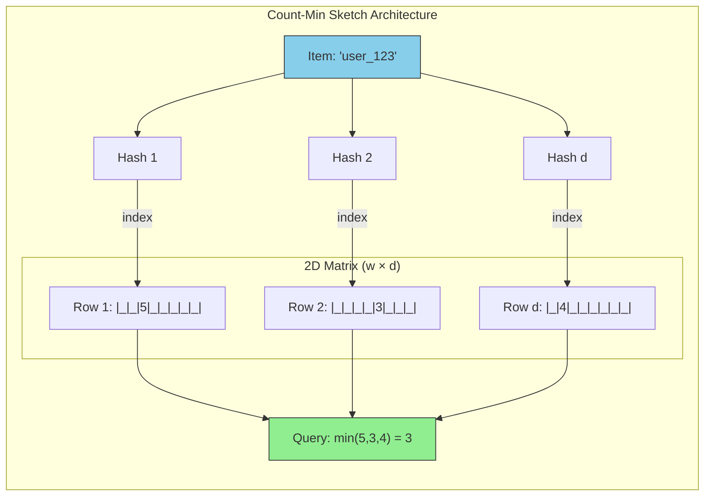
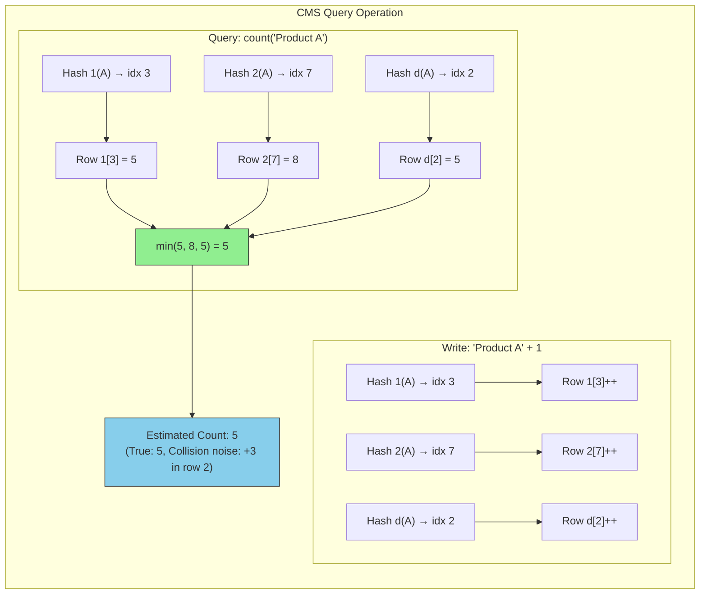
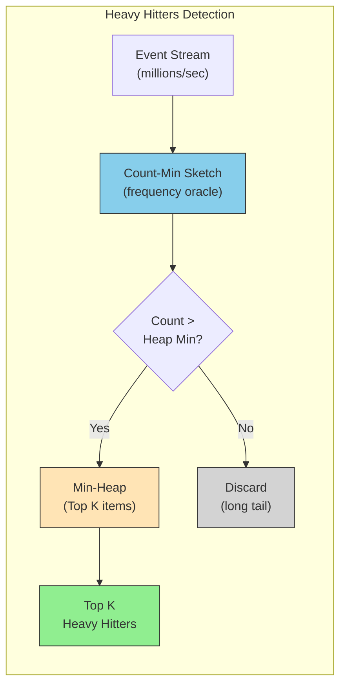

# Count-Min Sketch

This guide covers 5 key areas: I. EXECUTIVE SUMMARY & CONCEPTUAL OVERVIEW, II. ARCHITECTURE & MECHANISM, III. MAG7 REAL-WORLD BEHAVIOR & EXAMPLES, IV. CRITICAL TRADEOFFS, V. IMPACT ON BUSINESS, ROI, AND CAPABILITIES.

## I. EXECUTIVE SUMMARY & CONCEPTUAL OVERVIEW

Probabilistic data structures are a cornerstone of high-scale distributed systems at Mag7 companies. The Count-Min Sketch (CMS) is the industry standard for frequency estimation in unbounded streams where memory constraints preclude exact counting.

At a Principal level, you are not expected to implement the hashing algorithm, but you must understand the **architectural suitability**—specifically, when to trade accuracy for memory and how to manage the business risks of probabilistic data.

### 1. The Core Problem: Unbounded Streams vs. Finite RAM

In traditional systems, frequency counting utilizes a deterministic Hash Map (e.g., `Map<IPAddress, Count>`). This offers 100% accuracy but $O(N)$ space complexity, where $N$ is the number of unique elements.

At Google (Search Queries), Meta (User Clicks), or AWS (Packet Flows), $N$ is effectively infinite.
*   **The Bottleneck:** Storing a counter for every unique IPv6 address or URL in an unbounded stream will inevitably trigger Out Of Memory (OOM) errors or force expensive disk swapping, killing latency.
*   **The CMS Solution:** CMS utilizes a fixed-size matrix (2D array) and multiple hash functions to map events to counters. It decouples memory usage from the cardinality of the data.
*   **The Tradeoff:** You gain constant space complexity $O(k)$ and constant time complexity $O(1)$, but you accept a non-zero probability of error.

### 2. Real-World Mag7 Implementations

Understanding where CMS is deployed helps in system design discussions regarding "Heavy Hitters" (identifying the most frequent items).

*   **AWS Shield / Cloudflare (DDoS Detection):**
    *   *Usage:* Identifying "heavy hitter" IP addresses generating high traffic volumes in real-time.
    *   *Behavior:* The system tracks packet counts per source IP. If a count exceeds a threshold, mitigation triggers.
    *   *Why CMS:* Speed is critical. The system must process millions of packets per second with nanosecond latency.
*   **Google Trends / Twitter (Trending Topics):**
    *   *Usage:* calculating the top $K$ search queries or hashtags over a sliding window.
    *   *Behavior:* Ingests the firehose of queries. CMS estimates frequency; if an item's estimated frequency is high, it is passed to a more precise "Top-K" heap.
    *   *Why CMS:* The "long tail" of unique, one-off queries (e.g., specific error codes or random strings) is massive. CMS ignores the noise of the long tail without consuming memory for it.
*   **Netflix/Meta (Content Delivery Network Optimization):**
    *   *Usage:* Tracking asset popularity to determine cache eviction policies (TinyLFU).
    *   *Behavior:* CMS tracks how often an image or video segment is requested. Items with low frequency estimates are evicted from the edge cache to make room for popular content.

### 3. Technical Mechanics & The "One-Sided Error"

The most critical technical characteristic for a TPM to internalize is that **CMS is biased.**

*   **Overestimation (False Positives):** CMS may report that an item appeared more frequently than it actually did due to hash collisions (multiple items mapping to the same counter).
*   **No Underestimation (No False Negatives):** CMS will *never* report a count lower than the actual value.
*   **Irreversibility:** You cannot query the CMS to ask "Which items are in the sketch?" You can only ask "What is the count for Item X?"

**The Principal TPM Takeaway:**
If your business logic requires *exact* billing (e.g., Ad Impressions for invoicing), CMS is **unfit**. If your logic requires *thresholding* (e.g., "Is this user spamming?"), CMS is ideal because the worst-case scenario is a false positive (flagging a benign user as a spammer), which can be mitigated by a secondary verification step.

### 4. Strategic Tradeoffs: Tuning Width and Depth

When working with Engineering Leads, you will discuss "sizing" the sketch. This is a direct negotiation between **Infrastructure Cost** and **Data Quality**.

The CMS is a matrix of Width ($w$) $\times$ Depth ($d$).

| Parameter | Technical Definition | Business/Product Impact |
| :--- | :--- | :--- |
| **Width ($w$)** | Number of counters per row. | Controls **Error Magnitude**. Increasing width reduces the estimation error ($\epsilon$).  **Tradeoff:** Linearly increases RAM usage. |
| **Depth ($d$)** | Number of hash functions (rows). | Controls **Confidence Probability**. Increasing depth increases the certainty that the error is within bounds ($1 - \delta$).  **Tradeoff:** Linearly increases CPU cost (latency) on every write/read. |

**ROI Calculation Example:**
*   **Scenario:** Tracking Top 100 Products on Amazon.
*   **Option A (HashMap):** 100GB RAM cluster to store all distinct user clicks. 100% accuracy. Cost: High.
*   **Option B (CMS):** 10MB memory block. 99.9% accuracy. Cost: Negligible.
*   **Decision:** For analytics/recommendations, Option B yields significantly higher ROI. The 0.1% error rate does not materially impact the "Trending Products" list.

### 5. Failure Modes and Edge Cases

A Principal TPM must anticipate where the design breaks.

*   **The "Noise" Floor:** If the CMS is too small for the data volume, the matrix fills up. Every counter becomes non-zero. The "noise" from the long tail drowns out the signal of the heavy hitters.
    *   *Mitigation:* Implement "Conservative Update" (only increment the counter with the minimum current value) or utilize a "Count-Mean-Min Sketch" to subtract noise.
*   **Adversarial Attacks:** In security contexts, attackers can theoretically reverse-engineer the hash functions to create collisions intentionally, blinding the detection system.
    *   *Mitigation:* Use cryptographic-grade hash functions or randomize seeds periodically.
*   **Lack of Deletion:** Standard CMS does not support deleting items (decrementing counters is risky due to collisions).
    *   *Mitigation:* Use Sliding Windows (create a new CMS every minute) or Exponential Decay implementations.

## II. ARCHITECTURE & MECHANISM

### Query Operation: Estimating Frequency

To estimate how many times "Product A" was clicked:
1.  Run "Product A" through the same $d$ hash functions to find the specific index in each row.
2.  Read the values at these indices.
3.  **The Mechanism:** Return the **minimum** value among those counters.

**Why the Minimum?**
Because of hash collisions, a counter might be shared by "Product A" and "Product B." Therefore, a counter value is always:
$$ \text{True Count of A} + \text{Noise from Collisions} $$
Since the noise is always non-negative, the smallest counter value in the set is the one with the least noise and is closest to the true count. This mathematical property guarantees the **One-Sided Error** (we never underestimate).

### 1. Sizing the Sketch: The TPM’s Role in Capacity Planning
As a Principal TPM, you define the "Quality of Service" (QoS) for data accuracy. You do not pick random array sizes; you derive them from business requirements regarding **Error ($ \epsilon $)** and **Confidence ($ \delta $)**.

*   **Width ($w$):** Driven by the maximum acceptable error.
    *   Formula: $w = \lceil e / \epsilon \rceil$
    *   *Tradeoff:* Doubling the width halves the error margin but doubles memory usage.
*   **Depth ($d$):** Driven by the required confidence (probability that the estimate is within the error bound).
    *   Formula: $d = \lceil \ln(1 / \delta) \rceil$
    *   *Tradeoff:* Increasing depth increases CPU cost (more hashes to compute) and memory, but drastically reduces the chance of a "bad hash" skewing results.

**Mag7 Example:**
If you are building **Amazon CloudWatch** logs to detect the top error codes:
*   **Requirement:** You want the count to be accurate within 0.1% of the total stream size ($\epsilon = 0.001$), with 99.9% certainty ($\delta = 0.001$).
*   **Sizing:**
    *   Width $\approx 2000$ counters.
    *   Depth $\approx 7$ hash functions.
*   **Impact:** You can process **billions** of log lines using a structure that fits in L1/L2 CPU Cache (approx. 50KB). A standard HashMap would require GBs of RAM and cause Garbage Collection pauses.

### 2. Optimization: Conservative Update
Standard CMS increments every counter mapped to the item. However, at Mag7 scale, we often use the **Conservative Update** heuristic to reduce error accumulation.

*   **Mechanism:** When updating "Product A," look at the current values in the mapped counters. Find the minimum value among them. **Only increment the counters that are equal to that minimum.**
*   **ROI:** This simple logic change significantly reduces the overestimation error for heavy hitters without requiring extra memory. It is a "free" accuracy boost at the cost of a slightly more complex read-before-write operation.

### 3. Handling Time: The Sliding Window Problem
A standard CMS never forgets. If "Gangnam Style" got 1 billion views in 2012, a standard CMS would still report it as a top item in 2024. For real-time systems (e.g., **Twitter/X Trending Topics** or **Netflix "Trending Now"**), we need **Temporal Decay**.

**Approaches & Tradeoffs:**
1.  **Resetting:** Flush the CMS every hour.
    *   *Pro:* Simple.
    *   *Con:* Loss of data at the boundary (the "cold start" problem every hour).
2.  **Halving (Decay):** Every $X$ minutes, divide all counters by 2 (bit-shift).
    *   *Pro:* Smooth decay; keeps recent heavy hitters high.
    *   *Con:* Requires iterating over the whole matrix (background process overhead).
3.  **Double Buffering:** Maintain two active sketches. One for the current minute, one for the previous.
    *   *Pro:* High accuracy for "velocity" metrics.
    *   *Con:* Double the memory cost.

### 4. Real-World Implementations at Mag7

#### A. Network Security & DDoS Mitigation (AWS Shield / Google Cloud Armor)
*   **Use Case:** Identifying "Heavy Hitters" (IP addresses sending the most packets) to block DDoS attacks.
*   **Why CMS:** The stream is too fast (Tbps) to lock a database or HashMap.
*   **Behavior:** The system accepts some inaccuracy. If an IP sends 1,000,000 packets, reporting 1,005,000 is acceptable. The binary decision ("Block or Allow") remains the same.
*   **Business Capability:** Enables protection at the edge without adding latency to legitimate traffic.

#### B. Query Optimization (Snowflake / Google BigQuery)
*   **Use Case:** The Query Planner needs to estimate the cardinality (size) of a table join to decide whether to use a Broadcast Join or a Shuffle Join.
*   **Why CMS:** Exact counting of distinct elements in petabyte-scale tables is slow.
*   **Behavior:** The database maintains a CMS of column values. It queries the sketch to estimate row counts instantly.
*   **ROI:** Reduces query planning time from minutes to milliseconds; prevents Out-Of-Memory (OOM) errors during query execution.

#### C. Recommendation Systems (TikTok / Instagram Reels)
*   **Use Case:** Frequency capping (ensuring a user doesn't see the same ad or viral video twice).
*   **Why CMS:** Storing a precise history of every video ID seen by every User ID is cost-prohibitive.
*   **Tradeoff:** If the CMS falsely reports a user has seen a video (collision), the user misses one video. This is an acceptable CX degradation compared to the infrastructure cost of precise tracking.

## III. MAG7 REAL-WORLD BEHAVIOR & EXAMPLES

### 1. High-Frequency Trading & Ad Tech (Latency-Critical Systems)

At companies like Google (AdSense) or Meta (Ads Manager), the system must decide within milliseconds whether to bid on an ad slot or how to throttle an API key.

*   **The Use Case:** Frequency Capping. Advertisers often specify, "Don't show this ad to the same user more than 5 times a day."
*   **The Implementation:** Instead of querying a central Redis cluster or Cassandra database (which introduces network latency and serialization costs), the serving infrastructure keeps a local Count-Min Sketch in the memory of the edge server.
*   **The Tradeoff:**
    *   **Choice:** Local CMS vs. Centralized Counter.
    *   **Pro:** Zero network latency; lookup is a simple memory access ($O(1)$).
    *   **Con:** Synchronization lag. If a user hits Server A 3 times and Server B 3 times, the distributed count might be loose until aggregated.
    *   **The "Overestimation" Feature:** Since CMS never underestimates, if the sketch says the user has seen the ad 6 times (due to collision), we stop showing the ad.
    *   **Business Impact:** It is better to accidentally stop showing an ad (slight loss of potential impression revenue) than to violate a contract by over-showing it (customer dissatisfaction and refund liability).

### 2. Network Security & DDoS Detection (AWS Shield / Google Cloud Armor)

In cloud infrastructure, identifying "Heavy Hitters" (IP addresses sending the most traffic) instantly is critical for DDoS mitigation.

*   **The Use Case:** Detecting a SYN flood attack.
*   **The Implementation:** Network switches and load balancers use hardware-accelerated CMS. Since CMS uses fixed memory, it can be implemented directly on ASICs or FPGA chips where dynamic memory allocation (like a HashMap) is impossible.
*   **The Tradeoff:**
    *   **Choice:** Probabilistic hardware counting vs. Software log analysis.
    *   **Pro:** Detection happens at line rate (terabits per second) without slowing down traffic.
    *   **Con:** False positives. A high-traffic legitimate proxy (like a corporate VPN) might hash to the same bucket as an attacker.
    *   **Mitigation:** This acts as a "first pass" filter. If the CMS flags an IP, traffic is diverted to a "scrubbing center" for deeper, more expensive analysis.
    *   **ROI Impact:** Prevents platform-wide outages. The cost of a false positive (one user throttled) is negligible compared to the cost of a region going down.

### 3. Database Query Optimization (BigQuery / Redshift)

Query optimizers need to know the selectivity of a query (e.g., "How many rows in this 1PB table have `Country=US`?") to choose the right join strategy.

*   **The Use Case:** Generating query execution plans.
*   **The Implementation:** Databases maintain CMS structures as metadata statistics. They do not scan the table; they query the sketch.
*   **The Tradeoff:**
    *   **Choice:** Sketch-based statistics vs. Sampling or Full Scans.
    *   **Pro:** Instant estimation allowing the optimizer to pick a Broadcast Join vs. a Shuffle Join immediately.
    *   **Con:** If the sketch is too small (width is too low), the optimizer might vastly overestimate the row count, selecting a resource-heavy join strategy when a lightweight one would have worked.
    *   **Business Impact:** Directly correlates to compute costs and query latency. Poor estimates lead to "spilled to disk" operations, increasing billable slot-hours for customers.

### 4. Trending Topics (Twitter/X, YouTube)

Displaying "What's happening now" requires counting hashtags over a sliding window.

*   **The Use Case:** Top K Elements.
*   **The Implementation:** CMS is often paired with a **Min-Heap**.
    *   As items stream in, they are updated in the CMS.
    *   If the estimated count in the CMS exceeds the minimum value currently in the Min-Heap, the item is updated in the Heap.
*   **The Tradeoff:**
    *   **Choice:** CMS + Heap vs. Stream Processing Framework (e.g., Flink) with full state.
    *   **Pro:** Massive reduction in RAM. You track millions of hashtags with megabytes of memory.
    *   **Con:** The "Elephant in the Room" problem. If a hash collision occurs between a viral tag (Justin Bieber) and a rare tag (Local Town Council), the rare tag might artificially jump into the Top K list because the CMS overestimates its count.
    *   **Business Impact:** Engagement. Users tolerate slight inaccuracies in trending lists (e.g., a topic appearing at #4 instead of #6), but the system provides real-time social proof that drives click-through rates.

### 5. Critical Tradeoff Analysis for TPMs

When negotiating with Engineering on using CMS, focus on these three levers:

| Parameter | Technical Choice | Tradeoff / Cost | Business Implication |
| :--- | :--- | :--- | :--- |
| **Width ($w$)** | Increasing the number of buckets per row. | Linearly increases memory usage. | Reduces the **magnitude of error** (how much we overestimate by). Critical for billing or capping use cases. |
| **Depth ($d$)** | Increasing the number of hash functions. | Increases CPU cost per update (latency). | Increases the **confidence** that the error is within bounds. Critical for security/DDoS to avoid false positives. |
| **Conservative Update** | Optimization: Only increment the counter in the row that currently has the *minimum* value for that item. | Slightly more complex logic; harder to parallelize/merge sketches. | Drastically reduces error accumulation. Essential for long-running streams. |

### 6. Failure Modes & Edge Cases

A Principal TPM must ask: "What happens when this breaks?"

1.  **Saturation:** If the CMS is undersized for the dataset volume (e.g., trying to track IPv6 space with a 1MB sketch), the counters fill up. The sketch becomes "saturated," and *every* query returns a high count.
    *   *Solution:* Implement **Aging/Decay**. Periodically divide all counters by 2 (halving) or reset the sketch on a time window (e.g., hourly trending).
2.  **Collisions on VIPs:** If a critical business entity (e.g., a strategic partner's account ID) collides with a spammer, the partner gets blocked.
    *   *Solution:* **Allow-listing.** CMS is a probabilistic filter; it must always be preceded by a deterministic allow-list for critical entities that bypass the check.

## IV. CRITICAL TRADEOFFS

### 1. Accuracy vs. Memory (The "Width" Tradeoff)

The most fundamental decision in configuring a Count-Min Sketch is determining the **width ($w$)** of the matrix. The width is inversely proportional to the error bound ($\epsilon$). Simply put: `Width = e / Error_Tolerance`.

*   **Technical Context:** If you want an error margin of 0.1% (0.001), your width needs to be roughly 2,000 counters ($2 / 0.001$). If you tighten that tolerance to 0.001%, your width jumps to 2,000,000.
*   **Mag7 Example (AWS Shield / Cloudflare):** In DDoS mitigation, the system tracks IP packet rates.
    *   *Scenario A:* You need to block IPs sending >100k requests/sec. An overestimation of 5% is acceptable (blocking an IP sending 95k requests is likely still valid defense). You choose a narrow width.
    *   *Scenario B:* You are billing a customer for API usage. An overestimation of 5% results in overbilling and lawsuits. You cannot use CMS here; you need deterministic counters (e.g., Redis/DynamoDB).
*   **Tradeoff:**
    *   **Pro:** Increasing width linearly reduces hash collisions, lowering the magnitude of overestimation errors.
    *   **Con:** Linear increase in RAM usage. While CMS is sub-linear compared to raw data, a CMS sized for "near-perfect" accuracy can still consume gigabytes of RAM per node, which defeats the purpose of using a probabilistic structure.
*   **Business Impact:**
    *   **ROI:** Optimizing width prevents over-provisioning memory across thousands of fleet instances.
    *   **Capability:** Allows "good enough" analytics on high-cardinality dimensions (e.g., UserID) where deterministic tracking is cost-prohibitive.

### 2. Latency vs. Confidence (The "Depth" Tradeoff)

The **depth ($d$)** of the matrix corresponds to the number of hash functions used. This controls the **probability** (confidence, $1 - \delta$) that the error falls within your specified margin.

*   **Technical Context:** `Depth = ln(1 / Probability_of_Failure)`. To get 99.9% confidence, you need roughly 7 hash functions. To get 99.9999%, you might need 20.
*   **Mag7 Example (Google Trends / Twitter Trends):**
    *   High ingestion rates (millions of events/sec) require ultra-low latency.
    *   Running 20 hash functions per event burns CPU cycles and increases ingestion latency (P99).
    *   For a "Trending Topics" feature, 99% confidence is acceptable. If a hashtag is ranked #4 instead of #5 due to a collision, the user experience (CX) impact is negligible.
*   **Tradeoff:**
    *   **Pro:** More hash functions (Depth) drastically reduce the probability of a "bad run" where all hashes collide with heavy hitters.
    *   **Con:** Linear increase in CPU cost and ingestion latency. Every write operation requires $d$ hash computations and $d$ memory writes.
*   **Business Impact:**
    *   **SLA:** Excessive depth can cause ingestion lag, violating real-time dashboard SLAs.
    *   **CX:** In recommendation systems, lower confidence is often acceptable. In security/fraud detection, low confidence leads to false positives (blocking legitimate users), damaging trust.

### 3. Mergeability vs. Accuracy (The Conservative Update)

A standard CMS updates all $d$ counters for an item. A common optimization is **Conservative Update**, where you only increment the counter(s) that currently have the *minimum* value among the $d$ positions. This significantly reduces overestimation error but introduces a critical architectural flaw for distributed systems.

*   **Technical Context:** Standard CMS is a **linear sketch**, meaning `Sketch(A + B) = Sketch(A) + Sketch(B)`. You can compute sketches on 100 different edge nodes and simply add the matrices together centrally to get a global view.
*   **Mag7 Example (Netflix/YouTube Global CDN):**
    *   You want to track global video popularity.
    *   *Standard CMS:* Edge nodes in Tokyo, London, and NY maintain local sketches. Every minute, they send the matrix to a central aggregator. The aggregator sums the matrices. Result: Accurate global count.
    *   *Conservative Update:* You optimize for local accuracy at the edge. However, Conservative Update makes the structure **non-linear**. You cannot mathematically merge these sketches centrally. The sum of the parts does not equal the whole.
*   **Tradeoff:**
    *   **Choice:** Use Standard CMS (Mergeable) vs. Conservative Update (Higher Accuracy, Local only).
    *   **Impact:** If you choose Conservative Update for a distributed system, you must route all traffic for specific keys to specific hosts (sharding), which introduces "hot partition" risks and complex routing logic.
*   **Business Impact:**
    *   **Scalability:** Standard CMS allows for "embarrassingly parallel" processing and easy aggregation (MapReduce friendly).
    *   **Complexity:** Abandoning mergeability for accuracy increases operational complexity and risk of cascading failures due to hot sharding.

### 4. CMS vs. Heavy Hitters (Top-K)

CMS answers "How many times did X occur?" It does *not* inherently answer "What are the top 10 items?" To answer the latter, you must maintain a min-heap alongside the CMS.

*   **Technical Context:** The CMS is just the frequency oracle. To track the "Top K," every time an item updates the CMS, you check if its new count exceeds the minimum value in a separate Min-Heap of size K.
*   **Mag7 Example (Amazon Best Sellers):**
    *   You need the Top 100 selling items per category.
    *   The CMS tracks counts for millions of SKUs.
    *   A heap of size 100 tracks the leaders.
*   **Tradeoff:**
    *   **Memory Overhead:** The heap requires storing the actual item keys (strings/IDs), not just anonymous counters. If K is large (e.g., "Top 100,000 items"), the heap memory usage dominates the CMS memory usage.
    *   **Accuracy:** The heap is susceptible to "ramp-up" bias. If an item becomes popular late in the window, it might not displace an item that accumulated counts early on, unless the logic is handled carefully.
*   **Business Impact:**
    *   **Feature Definition:** As a TPM, you must negotiate the value of $K$. Requesting "Top 100" is cheap. Requesting "Top 100,000" changes the architecture from "CMS + Heap" to "Spark/Hadoop Batch Job."

## V. IMPACT ON BUSINESS, ROI, AND CAPABILITIES

At the Principal level, technical choices regarding data structures like Count-Min Sketch (CMS) are rarely about "can we build it" and more about "should we build it this way to support the P&L." The decision to implement probabilistic data structures fundamentally alters the cost-basis of a service and the Service Level Objectives (SLOs) you can offer customers.

### 1. Infrastructure Cost Reduction (Hard ROI)

The primary business driver for CMS is the massive reduction in RAM requirements for high-cardinality datasets.

*   **The Math of ROI:** In a standard Hash Map, storing 100 million unique IP addresses (IPv6) with counts requires roughly **3-4 GB of RAM** (assuming overhead). If you are building a distributed system like a global load balancer or a CDN (e.g., Cloudflare or Amazon CloudFront) handling billions of unique flows, strict counting requires terabytes of RAM across a cluster. A CMS can handle the same volume with **~50 MB** while maintaining a 99% accuracy rate.
*   **Mag7 Example:** **AWS Shield / Google Cloud Armor**. These services must ingest packet streams at terabit scale to detect DDoS attacks. Storing state for every source IP is cost-prohibitive and technically infeasible during a volumetric attack. CMS allows these systems to identify "Heavy Hitters" (attacking IPs) without needing memory proportional to the attack size.
*   **Tradeoff:** **Hardware Cost vs. Engineering Complexity.** While you save millions in hardware (OpEx), you increase the complexity of the codebase. Debugging a probabilistic counter is significantly harder than debugging a deterministic integer. You cannot simply "look up" a value to verify it is correct; you can only verify it is within an error bound.

### 2. Enabling Real-Time Product Capabilities (CX Impact)

CMS enables features that would otherwise be relegated to T+1 (batch processing) to happen in T+seconds (streaming).

*   **Feature Enablement:** "Trending" or "Most Popular" features.
    *   **Mag7 Example:** **YouTube "Trending" or Twitter (X) Trends.** To calculate the top 10 hashtags globally in real-time, a precise system would need to lock and update counters for millions of distinct terms simultaneously. This creates massive lock contention and latency. CMS allows for lock-free, parallel ingestion.
*   **CX Impact:** The difference between a "Daily Top 10" and a "Live Top 10" is often the difference between a static page and an engaging, sticky platform.
*   **Tradeoff:** **Freshness vs. Precision.** By choosing CMS, you accept that the "Top 10" list might actually contain the 11th most popular item displayed as the 9th.
    *   *Product Decision:* For a discovery feature (YouTube Trends), this error is acceptable; the user experience is not degraded if the sorting is slightly off.
    *   *Product Decision:* For a billing dashboard (Google Ads), this error is unacceptable. You cannot charge a customer based on a CMS estimate.

### 3. System Resilience and Business Continuity

Beyond features, CMS is critical for protecting the business from "Noisy Neighbors" in multi-tenant environments.

*   **Mechanism:** In a multi-tenant architecture (like AWS Lambda or Azure SQL), one customer spamming the API can degrade performance for everyone. CMS allows the gateway to track request rates per Tenant ID with minimal latency overhead ($O(1)$).
*   **Mag7 Example:** **Netflix API Gateway (Zuul/Mantis).** Netflix uses stream processing to track device types and error rates. If a specific device type (e.g., "Old Smart TV v1.2") starts throwing 100% errors, CMS helps identify this anomaly immediately amidst millions of healthy requests, triggering an automatic circuit breaker.
*   **Tradeoff:** **False Positives vs. Availability.** Because CMS has one-sided error (overestimation), there is a non-zero chance of a hash collision causing a "innocent" tenant to be flagged as a "heavy hitter" and throttled.
    *   *Mitigation:* Principal TPMs must enforce a "verify before blocking" policy. Use CMS for the initial high-speed filter, then pass the suspect traffic to a secondary, precise counter (or a larger CMS) before applying a hard block.

### 4. Strategic Capability: The "Hybrid" Approach

The most mature implementations at Mag7 do not use CMS in isolation. They use a tiered approach to balance ROI and Accuracy.

*   **The Strategy:** Use CMS to filter the "Long Tail" (the 90% of items that appear once) and promote "Heavy Hitters" to a precise HashMap.
*   **Business Value:** This provides **exact** counts for the top 1% of items (where business decisions are usually made) and **approximate** counts for the rest, optimizing both cost and accuracy.
*   **Impact on Capabilities:** This allows Product teams to promise "Exact Real-Time Analytics" for top-performing content, a major selling point for AdTech platforms (Meta Ads Manager), while keeping backend costs low.

---

## Interview Questions

### I. EXECUTIVE SUMMARY & CONCEPTUAL OVERVIEW

**Question 1: Designing a Real-Time "Most Viewed" Service**
"We need to design a backend service that displays the 'Top 10 Most Viewed Videos' for YouTube in real-time. The stream volume is massive (millions of writes/sec). How would you architect the counting mechanism, and how do you handle the accuracy vs. cost tradeoff?"

*   **Guidance for a Strong Answer:**
    *   **Architecture:** Reject HashMaps immediately due to memory bounds. Propose Count-Min Sketch for the ingestion layer to filter the stream.
    *   **Hybrid Approach:** Explain that CMS is only for *estimation*. Use CMS to filter: "If estimated count > Threshold, send to a precise Top-K Min-Heap."
    *   **Tradeoffs:** Discuss sizing the CMS. Acknowledge that overestimation is acceptable (a video with 99k views showing as 100k views doesn't hurt the user experience of "Trending"), but underestimation (missing a viral video) is impossible with CMS, which is a key feature.
    *   **Scale:** Mention aggregating sketches. CMS structures are additive. You can have 100 servers each maintaining a local CMS, and merge them (sum the matrices) to get a global view without complex coordination.

**Question 2: Diagnostic on Billing Discrepancies**
"An engineering team proposes using a probabilistic data structure to track API usage limits for billing tiers to save on Redis costs. As a Principal TPM, how do you evaluate this proposal?"

*   **Guidance for a Strong Answer:**
    *   **Immediate Pushback:** Identify the misalignment of "Probabilistic" and "Billing." Billing requires exactness (Auditability/Legal).
    *   **The Nuance:** Propose a split architecture. Use CMS for *throttling/defense* (fast, cheap protection against abuse) but stick to exact counting (SQL/Redis) for *invoicing*.
    *   **Risk Analysis:** Explain the specific failure mode of CMS here: Overestimation. You might bill a customer for usage they didn't accrue. This creates high operational support costs (refunds, trust issues) that outweigh the infrastructure savings of removing Redis.

### II. ARCHITECTURE & MECHANISM

**Question 1: Designing for Decay**
"We are building a 'Trending Search' feature for an e-commerce platform. We need to identify the top 100 search terms every 5 minutes. The volume is 50k searches per second. How would you architect the counting mechanism, specifically addressing how to handle the transition between time windows so trending data doesn't look 'jumpy' to the user?"

*   **Guidance for a Strong Answer:**
    *   **Identify the Constraint:** 50k/sec is high throughput; a database write per search is unscalable. In-memory aggregation is required.
    *   **Select Mechanism:** Propose Count-Min Sketch for space efficiency.
    *   **Address the "Jumpy" UX:** Discuss **Sliding Windows**. Instead of a hard reset every 5 minutes, propose maintaining multiple smaller sketches (e.g., five 1-minute sketches).
    *   **Aggregation Logic:** To get the "last 5 minutes" trend, sum the counters from the five active sketches. As a new minute starts, drop the oldest sketch and add a fresh one.
    *   **Tradeoff Analysis:** Acknowledge that summing sketches increases the error bound (error accumulates linearly), but argue that for "Trending," the UX impact of slightly inaccurate counts is lower than the latency of exact counting.

**Question 2: The "Heavy Hitter" Attack**
"You are using a Count-Min Sketch to track API usage quotas per user to prevent abuse. An attacker discovers this and attempts to exploit the hash collisions to ban innocent users by generating traffic that collides with their user IDs. How do you mitigate this?"

*   **Guidance for a Strong Answer:**
    *   **Diagnose the Vulnerability:** Acknowledges that CMS is deterministic if the hash seeds are known or static. If an attacker knows the hash functions, they can engineer collisions.
    *   **Mitigation 1 (Seeding):** Randomize the hash seeds at server startup or rotate them periodically so the mapping changes, making targeted collisions difficult.
    *   **Mitigation 2 (Architecture):** Use a **Count-Mean-Min Sketch** or introduce a secondary verification step. If the CMS indicates a user has breached a quota (a "suspect"), trigger a precise check (e.g., query a Redis counter or sample the logs) before applying the ban.
    *   **Principal View:** Frame this as a "False Positive" management problem. The CMS acts as a high-speed filter to identify *potential* abuse, while a slower, precise system validates the enforcement actions to protect CX.

### III. MAG7 REAL-WORLD BEHAVIOR & EXAMPLES

**Question 1: Designing for "Top K" at Scale**
"We need to build a real-time dashboard showing the top 100 most downloaded files from S3 across all regions globally. The volume is millions of events per second. We cannot store every download event in a database for aggregation. How would you architect this, and how do you handle the accuracy vs. cost tradeoff?"

*   **Guidance for a Strong Answer:**
    *   **Identification:** Candidate should immediately identify this as a "Heavy Hitter" problem requiring probabilistic data structures (Count-Min Sketch or Count-Min Sketch + Heap).
    *   **Architecture:** Propose a distributed approach. Local CMS at edge nodes (regions) $\rightarrow$ periodically flush sketches to a central aggregator $\rightarrow$ merge sketches (since CMS is additive) $\rightarrow$ extract Top K.
    *   **Tradeoff Analysis:** Discuss why we accept overestimation. If a file is actually #101 but we show it as #99, does it matter? Likely not.
    *   **Sizing:** Demonstrate awareness that memory is fixed. "We can allocate 50MB per host to track billions of files with 99.9% accuracy."

**Question 2: The Billing Trap**
"Your engineering lead proposes using a Count-Min Sketch to track API usage for customer billing to save on Redis infrastructure costs. They argue that since CMS never underestimates, we won't lose revenue. Do you approve this design?"

*   **Guidance for a Strong Answer:**
    *   **Immediate Rejection:** The candidate *must* reject this for billing.
    *   **Reasoning:** While "never underestimating" protects revenue, "overestimating" destroys customer trust. You cannot bill a customer for 10,000 calls if they only made 8,000 because of a hash collision.
    *   **Nuance:** A strong candidate might suggest a hybrid approach: Use CMS for *throttling/rate limiting* (to protect the system) but use an exact Log/Counter system (asynchronously processed) for the actual *billing* invoice. This separates "Operational Health" (Probabilistic) from "Financial Accuracy" (Deterministic).

### IV. CRITICAL TRADEOFFS

**Question 1: The Distributed Aggregation Trap**
"We are building a global DDoS detection system that ingests logs from 50 edge locations. The Engineering Lead suggests using Count-Min Sketch with 'Conservative Update' to minimize false positives when blocking IPs. As the Principal TPM, do you approve this design? Why or why not?"

*   **Guidance for a Strong Answer:**
    *   **Immediate Red Flag:** The candidate should identify that Conservative Update breaks **mergeability**.
    *   **The Problem:** You cannot simply sum the sketches from 50 locations if Conservative Update is used. You would need to forward all traffic for specific IPs to a centralized location to maintain the sketch, which defeats the purpose of edge processing.
    *   **The Solution:** Advise using Standard CMS (linear/mergeable) at the edge for aggregation. To handle false positives, suggest increasing the width (RAM) or using a secondary verification step (e.g., checking a whitelist or a precise counter for only the flagged heavy hitters) rather than breaking the distributed architecture.

**Question 2: Sizing for Ad Fraud**
"We are designing an ad-click counter to detect click fraud. We process 1 billion clicks per day. We need to identify any user clicking more than 100 times. We have a strict memory budget of 50MB per server. The engineering team says the error rate with CMS will be too high at that memory size. How do you approach this tradeoff discussion?"

*   **Guidance for a Strong Answer:**
    *   **Identify the Constraint:** 50MB is actually quite large for a CMS (processing millions of keys). The candidate should question *why* the error is too high.
    *   **Tradeoff Lever:** Suggest checking the **Width**. For fraud detection, we care about *Heavy Hitters*. The error in CMS is proportional to the *total* number of events.
    *   **Alternative Approach:** Propose a **Count-Mean-Min Sketch** or separating high-frequency elements.
    *   **Business alignment:** Ask: "What is the cost of a false positive vs. a false negative?" In fraud, a false positive (blocking a real user) is worse than missing one bot. The candidate should suggest using CMS as a *first-pass filter* (low cost, high recall) that sends flagged users to a secondary, more expensive precision check (high precision), rather than trying to make the CMS perfect.

### V. IMPACT ON BUSINESS, ROI, AND CAPABILITIES

**Question 1: The "Trending" Feature Tradeoff**
"We are designing a real-time 'Most Viewed Products' widget for Amazon's homepage. Engineering proposes using a Count-Min Sketch to track views because the traffic volume is too high for Redis. However, the Finance team is worried that vendors will complain if the view counts aren't exact. As the Principal TPM, how do you resolve this conflict?"

*   **Guidance for a Strong Answer:**
    *   **Acknowledge the Constraint:** Validate that storing precise state for Amazon-scale traffic is indeed expensive/slow.
    *   **Separate Concerns:** Distinguish between *sorting* (ranking items) and *displaying* (showing the count).
    *   **Propose the Solution:** Use CMS for the *ranking* algorithm (internal backend) to determine the Top 10. Once the Top 10 are identified, query the precise "source of truth" database (which might be slightly delayed) to display the actual number to the user.
    *   **Address the Risk:** Explain that CMS overestimates. The risk is that a slightly less popular item appears in the widget. The risk is *not* that we undercount views (CMS never underestimates).
    *   **Business Justification:** The ROI of real-time discovery (increased conversion) outweighs the minor inaccuracy in ranking order.

**Question 2: Sizing for SLAs**
"You are launching a new rate-limiting service for our public API. We need to throttle users exceeding 10,000 requests/second. The engineering lead asks for your input on sizing the Count-Min Sketch. They want to know: should we optimize for width or depth, and how does that impact our customer SLA?"

*   **Guidance for a Strong Answer:**
    *   **Define the Variables:** Width controls *error magnitude* (how much we overestimate). Depth controls *confidence* (probability the estimate is bad).
    *   **Connect to SLA:** For rate limiting, **False Positives** are the enemy (blocking a legitimate user).
    *   **Technical Recommendation:** We need to minimize the probability of collision. Therefore, we should prioritize **Width** (more buckets) to reduce the chance of two users hashing to the same slot.
    *   **Operational Safeguard:** Recommend implementing a "Conservative Update" strategy (only increment the counter with the minimum value) to further reduce overestimation error.
    *   **Business Impact:** Explain that spending 10% more RAM on a wider sketch is cheaper than the Customer Support costs of investigating "Why was I blocked?" tickets.

---

## Key Takeaways

- Review each section for actionable insights applicable to your organization

- Consider the trade-offs discussed when making architectural decisions

- Use the operational considerations as a checklist for production readiness
