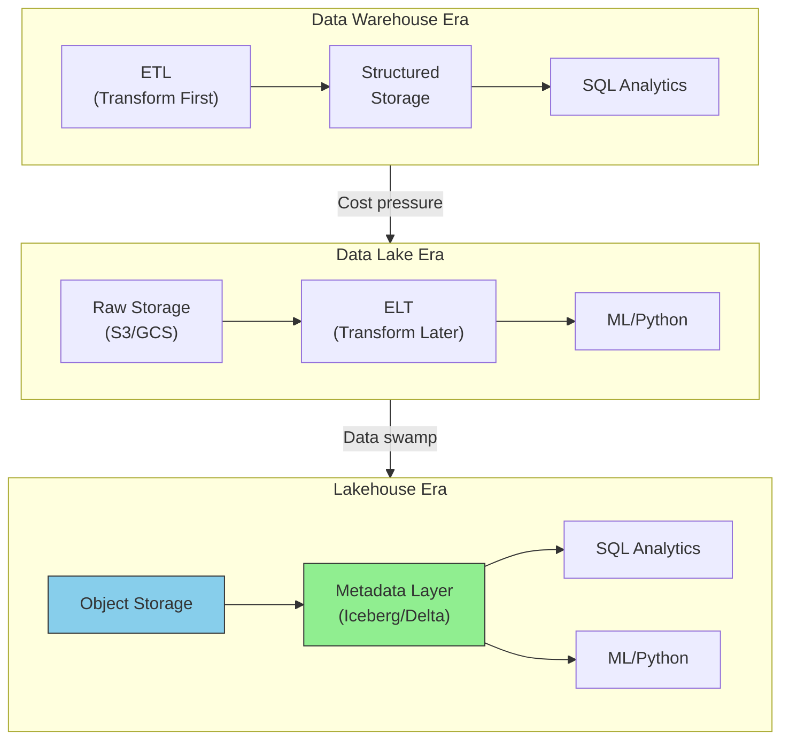

# Data Architecture Patterns

This guide covers 5 key areas: I. The Evolution of Storage: Warehouse vs. Lake vs. Lakehouse, II. Processing Paradigms: Batch vs. Streaming (Lambda & Kappa), III. Organizational Architecture: Centralized vs. Data Mesh, IV. Consistency Models: CAP Theorem in Practice, V. Strategic TPM Focus: Governance, Privacy, and FinOps.

## I. The Evolution of Storage: Warehouse vs. Lake vs. Lakehouse

### 1. Architectural Drivers: Why the Shift Happened

To lead effective data programs, you must understand that the evolution from Warehouse to Lake to Lakehouse was driven by two factors: **Cost of Storage** and **Data Variety**.

*   **The Data Warehouse (DW) Era (Schema-on-Write):**
    *   **Architecture:** Tightly coupled compute and storage. Data is cleaned, transformed, and structured *before* loading (ETL).
    *   **The Bottleneck:** Engineering time. If a Product Manager wanted a new field tracked, Data Engineering had to alter the schema and backfill data. This created weeks of latency between "feature launch" and "analyzable data."
    *   **Technical Constraint:** Optimized for row-based transactional updates or columnar read performance, but expensive to scale.

*   **The Data Lake (DL) Era (Schema-on-Read):**
    *   **Architecture:** Decoupled storage (S3, GCS, ADLS) from compute. Data is dumped in raw formats (JSON, CSV, Parquet).
    *   **The Shift:** "Load first, model later" (ELT). This allowed Mag7 companies to store petabytes of clickstream logs and images that would bankrupt them in a Warehouse.
    *   **The Bottleneck:** Data Trust. Without ACID transactions (Atomicity, Consistency, Isolation, Durability), failed writes left corrupted files. Two users reading the lake at the same time saw different results. This created the "Data Swamp."

*   **The Lakehouse Era (Metadata Management):**
    *   **Architecture:** A transactional metadata layer (like **Apache Iceberg, Delta Lake, or Apache Hudi**) sits on top of the Data Lake files.
    *   **The Unlock:** The metadata layer tracks which files belong to a specific version of a table. This brings Warehouse reliability (ACID, Time Travel, Schema Enforcement) to Lake economics.
    *   **Mag7 Relevance:** This is the current standard for platform consolidation. It allows the same data to be used for BI (SQL) and AI (Python/Spark) without copying it.

### 2. Mag7 Real-World Implementations

A Principal TPM must recognize that Mag7 companies rarely use "out of the box" solutions; they build or heavily configure architectures to solve scale problems.

*   **Netflix (The Iceberg Origin):**
    *   **Problem:** Netflix had millions of files in S3. To run a query, the system had to "list" all files in a bucket to find the relevant ones. At their scale, just *listing* the files took hours, delaying metrics on show performance.
    *   **Solution:** They created **Apache Iceberg**. Instead of listing directories, Iceberg uses a snapshot approach—a distinct list of files that make up the table at a specific point in time.
    *   **Impact:** Reduced query planning from hours to seconds. This allows Netflix to provide near-real-time "Continue Watching" features across devices while using cheap S3 storage.

*   **Uber (The Hudi Origin):**
    *   **Problem:** Uber needed to handle massive "Upserts" (Update/Insert). If a ride fare changed or a driver location updated, they needed to modify data in the Lake. Standard Lakes require rewriting entire partitions to change one record.
    *   **Solution:** They created **Apache Hudi** (Hadoop Upserts Deletes and Incrementals). It allows for record-level updates in the Lake.
    *   **Impact:** Enabled real-time fraud detection and dynamic pricing adjustments without the latency of a traditional warehouse or the cost of constant full-file rewrites.

*   **Databricks vs. Snowflake (The Convergence):**
    *   While not Mag7 themselves, their influence on Mag7 architecture is total. Snowflake (originally a Warehouse) separated storage and compute to act like a Lakehouse. Databricks (originally a Spark/Lake engine) added Delta Lake to act like a Warehouse.
    *   **TPM Takeaway:** When vendors pitch you, realize they are converging on the same architecture: Open formats (Parquet) in object storage, governed by a metadata layer.

### 3. Strategic Tradeoffs & Decision Matrix

As a TPM, you will often arbitrate disputes between Data Engineering (who want maintainability) and Data Science/Product (who want speed and flexibility).

| Feature | Data Warehouse (e.g., Redshift, BigQuery Native) | Data Lake (e.g., S3 + Glue) | Data Lakehouse (e.g., Databricks, BigLake) |
| :--- | :--- | :--- | :--- |
| **Primary User** | Business Analysts (SQL) | Data Scientists (Python/R) | Both |
| **Data Freshness** | Low (Batch ETL dependent) | High (Streaming capability) | High (Streaming + ACID) |
| **Cost Profile** | **High:** Premium storage + constant compute availability. | **Low:** Cheap object storage; pay-per-query compute. | **Medium/Low:** Cheap storage; compute scales with complexity. |
| **Query Performance** | **Best:** Sub-second latency. Optimized engines. | **Poor:** High latency; requires scanning files. | **Good:** Techniques like "Z-Ordering" and file skipping bring it close to DW. |
| **Governance** | Strict (RBAC, Row-level security). | Loose (Bucket policies). Hard to audit. | Mature (Unity Catalog, Lake Formation). |
| **Vendor Lock-in** | **High:** Proprietary formats. Hard to migrate. | **Low:** Open formats. | **Low:** Open Table Formats allow engine swapping. |

**ROI Impact Analysis:**
*   **Skill ROI:** Moving to a Lakehouse unifies the stack. You no longer need separate teams for "Warehousing" and "Big Data/Spark." Engineers can work across the spectrum.
*   **Business Agility:** A Lakehouse allows "Schema-on-Read" experimentation. A Data Scientist can test a hypothesis on raw data immediately. If the metric proves valuable, it can be "promoted" to a governed Gold-layer table later. This reduces the "Time-to-Insight" from weeks to hours.

### 4. Failure Modes and Edge Cases

A Principal TPM must anticipate where these architectures fail in production.

*   **The "Small Files" Problem:**
    *   *Issue:* Streaming data into a Lake/Lakehouse often creates millions of tiny files (KB size).
    *   *Impact:* Query engines spend more time opening/closing files than reading data, causing performance to plummet.
    *   *TPM Action:* Ensure your architecture includes automated "Compaction" jobs (processes that merge small files into larger, optimized chunks) as a non-negotiable acceptance criterion.

*   **Metadata Scalability:**
    *   *Issue:* In a Lakehouse, the metadata itself (the list of file pointers) can become "Big Data."
    *   *Impact:* Queries time out just trying to figure out *what* to read.
    *   *TPM Action:* Verify the chosen table format (e.g., Iceberg) is configured to handle the specific scale of partitions expected.

*   **Governance "Swamp" (The Human Failure):**
    *   *Issue:* Moving to a Lakehouse doesn't automatically fix bad data culture. Without defined "Zones" (Bronze/Raw -> Silver/Cleaned -> Gold/Aggregated), the Lakehouse becomes a dump.
    *   *Impact:* High storage costs for duplicate data and low trust in BI dashboards.
    *   *TPM Action:* Enforce strict access controls. Only automated pipelines write to Silver/Gold. Humans read from Gold.

## II. Processing Paradigms: Batch vs. Streaming (Lambda & Kappa)

### 1. The Core Paradigms: Latency vs. Completeness

At a Principal TPM level, the decision between batch and streaming is rarely binary; it is a negotiation between data freshness, correctness guarantees, and infrastructure cost. You are defining the "Pulse" of the product.

*   **Batch Processing:** Processing a bounded set of data at a scheduled interval (e.g., daily, hourly).
    *   *Mechanism:* Data is collected, stored, and then processed in bulk using engines like Apache Spark or BigQuery.
    *   *Principal View:* This is the default for high-throughput, non-time-sensitive workloads (billing, compliance reporting, heavy ML model training). It prioritizes **completeness** and **throughput** over latency.
*   **Stream Processing:** Processing data element-by-element (or in micro-batches) as it enters the system.
    *   *Mechanism:* Events are ingested via message buses (Kafka, Kinesis) and processed by engines like Flink or Spark Streaming.
    *   *Principal View:* Required for operational responsiveness (fraud detection, inventory locking, live metrics). It prioritizes **latency** over throughput efficiency.

**The Architectural Patterns:**

*   **Lambda Architecture:** A hybrid approach designed to handle massive quantities of data by taking advantage of both batch and stream-processing methods.
    *   **Speed Layer (Streaming):** Provides low-latency, approximate views (e.g., "Sales in the last hour").
    *   **Batch Layer (Batch):** Provides high-latency, accurate views (e.g., "Reconciled sales figures").
    *   **Serving Layer:** Merges the two for the final query.
    *   *Why it exists:* Historically, streaming engines were unreliable. The Batch layer was the "source of truth" to correct errors in the stream.

*   **Kappa Architecture:** An architectural pattern that treats all data processing as stream processing.
    *   **Single Path:** There is no separate batch layer. Historical data is treated as a "stream that happened in the past."
    *   *Why it exists:* Modern streaming engines (Flink, Kafka Streams) now support "exactly-once" semantics, rendering the corrective Batch layer redundant and removing the need to maintain two codebases.

### 2. Mag7 Real-World Behavior

Mag7 companies are aggressively moving toward Kappa (or "Streaming First") architectures to reduce code duplication, but Lambda persists in legacy and financial systems where auditability is paramount.

*   **LinkedIn (The Birthplace of Kafka):**
    *   *Implementation:* LinkedIn moved heavily toward Kappa. They utilize **Apache Samza** and **Kafka** to treat profile updates and connection activities as an immutable log.
    *   *Use Case:* When a user updates their job title, it triggers a stream that updates search indices, graph databases, and recommendation engines simultaneously.
    *   *Impact:* Eliminated the "re-sync" phase where search results would be out of date for 24 hours until the nightly batch job ran.

*   **Uber (Marketplace Dynamics):**
    *   *Implementation:* Uber uses a complex streaming ecosystem (Flink + Kafka) for "Surge Pricing."
    *   *Behavior:* They cannot wait for a batch job to calculate supply/demand. They calculate pricing in windows of seconds. However, for **Uber Eats billing**, they rely on batch processing to ensure coupons, taxes, and restaurant payouts are reconciled to the penny.
    *   *Evolution:* Uber developed **Hudi** (Hadoop Upserts Deletes and Incrementals) to bridge the gap, allowing stream ingestion into a Data Lake that behaves like a warehouse, effectively enabling a "Kappa" style on data lakes.

*   **Google (Ads & Billing):**
    *   *Implementation:* Google Ads uses a Lambda-like variation.
    *   *Behavior:* Real-time streaming (MillWheel/Dataflow) is used to update budget caps immediately (to stop showing ads when a budget is exhausted). However, the actual *billing* to the credit card happens via a rigorous batch process that removes bot traffic and fraud with higher precision than the stream could achieve.

### 3. Strategic Trade-offs

As a Principal TPM, you must prevent engineering teams from over-optimizing for real-time when it isn't required. Streaming is significantly more expensive and operationally complex than batch.

| Feature | Batch Processing | Streaming (Kappa) | Lambda Architecture |
| :--- | :--- | :--- | :--- |
| **Latency** | High (Hours/Days) | Low (Milliseconds/Seconds) | Low (for recent data) |
| **Data Accuracy** | High (Easy to re-run/correct) | Complex (Requires "Exactly-once" semantics) | High (Batch corrects Stream) |
| **OpEx Cost** | Low (Scale to zero when idle) | High (Always-on compute) | High (Double compute/storage) |
| **Dev Effort** | Low (SQL/Python) | High (Windowing, Watermarks, State Mgmt) | Very High (2x codebases) |
| **Disaster Recovery** | Simple (Re-run the job) | Complex (Replay the stream/Snapshots) | Simple (Re-run the Batch layer) |

**The "Hidden" Costs of Streaming:**
1.  **Out-of-Order Data:** You must define "Watermarks" (how long to wait for late data). If you wait too long, latency suffers. If you wait too little, data is dropped.
2.  **Backpressure:** If the ingestion rate exceeds processing speed (e.g., Black Friday traffic), the stream creates backpressure, potentially crashing the pipeline or filling buffers. Batch jobs just take longer; streams crash.

### 4. Impact on Business & ROI

**When to advocate for Streaming (Kappa):**
*   **Inventory Management:** Preventing overselling on Amazon Prime Day. Batch processing would result in thousands of cancelled orders and CX churn.
*   **Fraud Detection:** Blocking a credit card transaction *before* it clears.
*   **Personalization:** TikTok/Reels feed updates based on the video you just watched.

**When to advocate for Batch:**
*   **Financial Reporting:** Quarterly earnings reports do not need second-by-second updates; they need 100% accuracy and audit trails.
*   **Heavy ML Training:** Training a Large Language Model (LLM) is inherently a batch process over a massive, static dataset.

**ROI Calculation Example:**
Moving a "Daily Active User" dashboard from Batch to Streaming might cost **3x** in infrastructure (always-on EC2/Flink clusters vs. ephemeral EMR jobs). If the Product Manager only checks the dashboard once a morning, the ROI is negative. If the dashboard drives live ad-bidding decisions, the ROI is positive.

### 5. Common Failure Modes & Edge Cases

*   **The "Lambda" Trap:** Teams often default to Lambda to be safe. Over time, the logic in the Speed layer (Streaming) and Batch layer diverges because they are often written in different languages (e.g., Java for Flink, SQL for Spark). This leads to "Data Drift," where the real-time dashboard shows different numbers than the monthly report, destroying trust in data.
*   **Schema Evolution in Streams:** In batch, if a schema changes (e.g., adding a column), you update the table DDL. In streaming (Kappa), changing the schema of a live flight requires complex versioning registries (like Confluent Schema Registry) to ensure the consumer doesn't crash when it receives a message format it doesn't recognize.
*   **The "Replay" Problem:** In Kappa architecture, if you find a bug in your logic, you must "replay" the stream from the past. If your retention policy on Kafka is only 7 days, you cannot correct data older than 7 days. Principal TPMs must ensure stream retention policies match business audit requirements.

## III. Organizational Architecture: Centralized vs. Data Mesh

This architectural decision is less about technology selection and more about organizational scalability and Conway’s Law. As a Principal TPM, you are often the arbiter of this decision, balancing the need for rapid product iteration against the risk of data fragmentation and compliance violations.

### 1. The Core Patterns

**Centralized Architecture (Monolithic)**
In this traditional model, a single central data engineering team owns the Data Warehouse/Lake.
*   **Workflow:** Product teams emit data; the Central Data Team ingests, cleans, models, and serves it.
*   **The Bottleneck:** Product teams (Producers) have no incentive to maintain data quality, while Business teams (Consumers) must file tickets with the Central Team for every schema change or new metric.
*   **Technical Stack:** Often a tightly coupled stack (e.g., a single Snowflake account or Redshift cluster managed by IT).

**Data Mesh (Decentralized/Federated)**
Data Mesh shifts from a technical architecture to a socio-technical one based on four principles:
1.  **Domain Ownership:** The Checkout team owns "Checkout Data," not the Central Data team.
2.  **Data as a Product:** Data is treated like an API with SLAs, versioning, and documentation.
3.  **Self-Serve Data Platform:** A central platform team provides the tooling (infrastructure-as-code, access control, compute), but not the content.
4.  **Federated Computational Governance:** Global standards (security, PII tagging) are enforced automatically by the platform, while local definitions are managed by domains.

### 2. Mag7 Real-World Context

*   **Amazon (The Service-Oriented Approach):** Amazon’s culture of "two-pizza teams" necessitates a Mesh-like approach. A central team could never scale to support Amazon.com, AWS, Prime Video, and Logistics simultaneously. Instead, teams publish data events to a bus (EventBridge/Kinesis) and maintain their own S3-based data products registered in a central catalog (AWS Glue Data Catalog). The "Central" team builds the catalog and compliance scanners, not the pipelines.
*   **Meta (Hybrid/Paved Road):** Meta uses a strong "Paved Road" model. While ownership is distributed (Instagram and WhatsApp have distinct data engineering groups), the infrastructure is hyper-centralized (Dataswarm, Presto/Trino). If a Product TPM at Instagram wants to launch a new feature, they use the central tools to define their own logging and aggregation pipelines. They do not wait for a central team to write the ETL, but they must use the central team's tools.
*   **Google (BigQuery Omni/Data Plex):** Google internally faces the challenge of data sprawl. They utilize tools like Data Plex to manage a Mesh architecture, allowing central visibility into distributed BigQuery datasets across different GCP projects owned by Search, Ads, and Cloud divisions.

### 3. Trade-offs

**Centralized Architecture:**
*   **Pro:** High data consistency and easier governance. "Revenue" is defined exactly once.
*   **Con:** High latency in decision-making. The central team becomes a bottleneck, leading to "Shadow IT" where product teams build rogue scrapers/databases to bypass the queue.
*   **ROI Impact:** Lower initial headcount cost (economies of scale), but potential revenue loss due to slower time-to-market for data-driven features.

**Data Mesh:**
*   **Pro:** Linear scalability. Adding a new business line does not require scaling a central team; the new line brings its own data resources. High domain expertise leads to higher quality data products.
*   **Con:** High risk of duplication (three teams calculating "Customer LTV" differently). Requires high organizational maturity and engineering skill within product teams.
*   **ROI Impact:** Higher infrastructure and headcount costs (redundant roles), offset by rapid innovation and agility.

### 4. Implementation & Business Impact

For a Generalist/Product TPM, the transition to Data Mesh requires specific capability shifts:

*   **Business Capability (Data as a Product):**
    *   *Action:* You must enforce that internal data datasets have "Product Managers."
    *   *Impact:* Just as an API has uptime SLAs, a Data Product must have "Freshness" and "Completeness" SLAs. If the Checkout Service breaks the data pipeline, the Checkout Team is paged, not the Data Team.

*   **Skill Transformation:**
    *   *Action:* Move away from specialized ETL Engineers.
    *   *Impact:* Hire "Analytics Engineers" (who write SQL/dbt) embedded within product teams. The central platform team shifts to hiring DevOps/Infrastructure Engineers to build the self-serve tooling.

*   **CX Impact:**
    *   In a centralized model, a customer support agent might wait 24 hours for data to reconcile. In a Mesh model, the "Support Domain" can consume real-time streams from the "Order Domain," enabling instant issue resolution.

### 5. Failure Modes and Edge Cases

*   **The "Mesh in Name Only" (Governance Theater):**
    *   *Scenario:* You decentralize ownership but fail to enforce interoperability standards.
    *   *Result:* You end up with a Data Swamp. Domain A uses Parquet on S3, Domain B uses JSON in Mongo, and they cannot join data for executive reporting.
    *   *Mitigation:* The Platform team must enforce "Polyglot Storage, Monoglot Access." Data can live anywhere, but it must be queryable via a standard interface (e.g., Trino or a unified SQL layer).

*   **Premature Optimization:**
    *   *Scenario:* A startup or a small division within a Mag7 attempts Data Mesh with only 3 data engineers.
    *   *Result:* Massive overhead managing infrastructure rather than building insights.
    *   *Guidance:* Do not adopt Mesh until the central team is clearly the bottleneck to innovation and you have at least 3-4 distinct domains with dedicated engineering resources.

## IV. Consistency Models: CAP Theorem in Practice

### 1. The Strategic Spectrum: From ACID to BASE
At the Principal TPM level, "CAP Theorem" is not an academic concept; it is a negotiation between **User Experience (Latency)**, **System Reliability (Availability)**, and **Data Correctness (Consistency)**. In distributed systems at the scale of Mag7, network partitions (P) are guaranteed to occur. Therefore, you are rarely choosing between C, A, and P. You are deciding what the system does when the network fails, and more importantly, how the system behaves during normal operations (PACELC theorem).

The choice defines the product's behavior:
*   **Strong Consistency (CP):** All users see the same data at the same time. If a node cannot guarantee this (due to a partition), the system rejects the write (goes down) to prevent data corruption.
    *   *The Pattern:* ACID (Atomicity, Consistency, Isolation, Durability).
*   **Eventual Consistency (AP):** The system accepts the write even if it cannot immediately replicate it to all nodes. Users may briefly see stale data, but the system stays "up."
    *   *The Pattern:* BASE (Basically Available, Soft state, Eventual consistency).

### 2. Mag7 Real-World Context
The industry has moved beyond a binary choice. Mag7 architectures often mix these models based on the specific microservice's function.

*   **Amazon (Retail vs. Orders):**
    *   *The Shopping Cart (AP):* Amazon would rather let you add an item to your cart twice (and resolve the conflict later) than show you a "Service Unavailable" error. Revenue depends on high availability. This utilizes DynamoDB's default eventual consistency.
    *   *The Order Processing (CP):* Once you click "Buy," the inventory deduction must be strictly consistent. You cannot sell the last unit to two different people. This often utilizes transactional logic where latency is acceptable for correctness.
*   **Google (Spanner & TrueTime):**
    *   Google broke the traditional CAP trade-off with **Cloud Spanner**. By using atomic clocks and GPS receivers (TrueTime API) to synchronize time across global data centers with minuscule error margins, Spanner achieves "External Consistency." It behaves like a CP system (perfect consistency) but with the high availability and scale usually reserved for AP systems. This is the backbone of Google Ads and Gmail metadata, where billing accuracy and global state are non-negotiable.
*   **Meta (Social Graph):**
    *   *Feed & Likes (AP):* If you "Like" a post, it is acceptable if a user in a different region doesn't see that count increment for 5 seconds. The priority is rendering the Feed under 200ms.
    *   *TAO (The Associations Object):* Meta’s distributed data store for the social graph favors availability and read efficiency, accepting that the graph is "eventually consistent."

### 3. Trade-offs and Decision Frameworks

| Feature | Strong Consistency (CP) | Eventual Consistency (AP) |
| :--- | :--- | :--- |
| **User Experience** | **Predictable.** "What I write is what I read." No confusion. | **Fast but "Jittery."** Users may experience "ghost reads" (deleting a comment, refreshing, and seeing it again). |
| **Latency** | **High.** Write requests must travel to a leader node and replicate to a quorum before confirming success. | **Low.** Write requests are accepted by the nearest node immediately. |
| **Engineering Cost** | **Lower complexity.** Developers code against a "single source of truth." | **High complexity.** Developers must build logic to handle conflicts (e.g., "Last Write Wins" vs. "Vector Clocks"). |
| **Business Risk** | **Downtime.** If the leader node is partitioned, the service stops taking writes. | **Data Integrity.** Risk of overselling inventory, double-billing, or logical corruption. |

### 4. Impact on Capabilities & ROI
As a Principal TPM, you must map these technical choices to business outcomes:

*   **ROI on Infrastructure:** Strong consistency usually requires more expensive, synchronous replication traffic and over-provisioned compute to handle locking overhead. Eventual consistency allows for cheaper, asynchronous replication.
*   **Customer Trust vs. Engagement:**
    *   For **Financial/Health products**, Strong Consistency is a requirement. A user seeing an incorrect bank balance destroys trust immediately.
    *   For **Engagement products**, Availability is the metric. If the system enforces Strong Consistency on a "Like" button, and the latency spikes to 2 seconds, engagement metrics will plummet.
*   **Skill Gap:** Implementing Eventual Consistency correctly requires senior engineering talent. Handling "conflict resolution" (what happens when two users edit the same document offline and then reconnect?) is notoriously difficult to debug.

### 5. Actionable Guidance for TPMs
When reviewing technical design docs (TDDs) or leading architectural reviews:

1.  **Challenge the "Default":** Engineers often default to Strong Consistency because it is easier to reason about. Ask: *"What is the business impact if this write takes 500ms instead of 50ms?"* If the answer is "None," stick with Strong. If the answer is "User churn," push for Eventual.
2.  **Define "Read Your Own Writes":** This is a critical middle ground. Even in an eventually consistent system, ensure that the *specific user* who made the edit sees their own change immediately (session consistency), even if the rest of the world sees it 5 seconds later.
3.  **Clarify the Conflict Strategy:** If you choose Eventual Consistency, demand a clear definition of conflict resolution. Is it "Last Write Wins" (LWW)? If so, you might silently lose user data.
4.  **SLA Negotiation:** Ensure the SLA accounts for replication lag. If the product promises "Real-time reporting," define if "Real-time" means sub-second (requires CP) or sub-minute (allows AP).

## V. Strategic TPM Focus: Governance, Privacy, and FinOps

At the Principal TPM level, Governance, Privacy, and FinOps are not merely compliance checklists or operational overhead; they are non-functional requirements that determine system viability. You must shift the organization from "reactive cleanup" to "proactive architecture." Your role is to ensure these constraints are baked into the platform layer so product teams get them "for free."

### 1. Data Governance: From Gatekeeping to Data Contracts
Governance at scale fails when it relies on manual approvals. In a Mag7 environment, governance is automated via "Active Metadata" and "Data Contracts."

*   **The Concept:** Instead of a central team validating every schema change (bottleneck), producers and consumers agree on a "Data Contract"—an API-like definition of data schemas, SLAs, and semantics. If a producer breaks the contract (e.g., changing a column type), the CI/CD pipeline blocks deployment.
*   **Mag7 Real-World Context:**
    *   **LinkedIn (DataHub):** LinkedIn open-sourced DataHub to solve metadata discovery. They treat metadata as a stream. When a service emits a dataset, it simultaneously emits metadata (owner, PII classification, lineage). This allows governance policies to trigger automatically (e.g., "If PII is detected in a non-secure bucket, fire an alert").
    *   **Uber:** Implements tiering for data reliability. Tier 1 (Financial/Safety) data has strict contracts and paging alerts. Tier 3 (Experimental) has loose governance. This prioritization prevents alert fatigue.
*   **Trade-offs:**
    *   *Strict Contracts:*
        *   *Pro:* Prevents downstream breakage (dashboards failing, ML models drifting).
        *   *Con:* Slows down producers who want to iterate quickly on internal data structures.
    *   *Federated Governance (Data Mesh):*
        *   *Pro:* Removes central bottlenecks; domain teams own their data quality.
        *   *Con:* Risk of fragmented standards; "Customer ID" might look different in Marketing vs. Engineering.
*   **Impact:**
    *   **Business:** Reduces "Data Downtime" (time where execs fly blind).
    *   **Skill:** TPMs must move from enforcing rules to defining standards for self-service tooling.

### 2. Privacy Engineering: The "Right to be Forgotten" at Scale
Privacy is an architectural challenge, particularly regarding GDPR/CCPA "Right to be Forgotten" (RTBF) and Data Residency. Deleting a user from a petabyte-scale lake distributed across regions is non-trivial.

*   **The Concept:**
    *   **Crypto-shredding:** Instead of finding and overwriting every instance of a user's data (expensive I/O), you encrypt that user's data with a unique key. To "delete" the user, you delete the key. The data remains but is mathematically unrecoverable.
    *   **Differential Privacy:** Adding statistical noise to datasets so aggregate trends are visible, but individual users cannot be re-identified.
*   **Mag7 Real-World Context:**
    *   **Apple:** Heavily utilizes Local Differential Privacy. Data (like emoji usage or typing suggestions) is noise-injected *on the device* before being sent to the cloud. Apple never sees the raw data.
    *   **Meta:** Built a centralized "Privacy Aware Infrastructure." When a developer queries a database, the infrastructure checks the viewer's purpose and the data's consent status in real-time. If a user revoked consent for "Ad Targeting," the query returns null for that column, even if the data exists physically.
*   **Trade-offs:**
    *   *Crypto-shredding:*
        *   *Pro:* Instant logical deletion; massive I/O savings.
        *   *Con:* Key management complexity. If you lose the key management service, you lose all data.
    *   *Tokenization:*
        *   *Pro:* Analytics teams can work on "safe" data without seeing PII.
        *   *Con:* Joins become difficult. If System A and System B tokenize "email" differently, you cannot join the datasets for analysis.
*   **Impact:**
    *   **CX:** Trust is a competitive differentiator.
    *   **ROI:** Prevents massive regulatory fines (4% of global turnover for GDPR).

### 3. FinOps: Unit Economics over Total Cost
A Principal TPM does not just look at the AWS/Azure/GCP bill; they look at *Unit Economics*. The goal is not necessarily to lower costs, but to align costs with revenue.

*   **The Concept:** FinOps connects engineering decisions to financial outcomes.
    *   *Cost Allocation:* Every resource (pod, bucket, table) must have an owner tag. Untagged resources are ruthlessly garbage collected.
    *   *Spot Instance Orchestration:* Architecting stateless workloads to run on preemptible instances (Spot/Preemptible VMs) that are 60-90% cheaper but can vanish anytime.
*   **Mag7 Real-World Context:**
    *   **Spotify:** Developed an internal "Cost Insights" plugin for Backstage. Engineers can see the dollar cost of their specific microservice alongside their CPU metrics. This gamifies cost reduction.
    *   **Amazon:** Uses a strict "Fitness Function" for architecture. If a service's cost per transaction increases while volume scales, the architecture is flagged as failing, triggering a mandatory review.
*   **Trade-offs:**
    *   *Spot Instances:*
        *   *Pro:* Massive cost reduction.
        *   *Con:* Requires robust fault-tolerance engineering (checkpointing). If the application cannot handle sudden termination, you face outages.
    *   *Hot vs. Cold Storage Lifecycle:*
        *   *Pro:* Moving old logs to Glacier/Archive saves millions.
        *   *Con:* "Data Rehydration" takes hours. If you need those logs for an urgent security incident, the delay is unacceptable.
*   **Impact:**
    *   **Business:** Improves Gross Margins. A 1% efficiency gain at Mag7 scale is tens of millions of dollars.
    *   **Capability:** shifts engineering culture from "capacity planning" to "efficiency engineering."

---

## Interview Questions

### I. The Evolution of Storage: Warehouse vs. Lake vs. Lakehouse

### Question 1: The Migration Strategy
**"We have a legacy Data Warehouse that is costing us $5M/year and slowing down our ML initiatives because the data is too aggregated. The engineering team wants to migrate everything to a Data Lakehouse. As a Principal TPM, how do you evaluate this proposal, and what is your migration strategy?"**

*   **Guidance for a Strong Answer:**
    *   **Challenge the Binary:** Do not advocate for a "Big Bang" migration. A strong answer suggests a hybrid approach. Keep high-value, low-latency financial reporting in the Warehouse (for now) to ensure business continuity.
    *   **Business Value First:** Identify the ML use cases blocked by the current stack. Migrate that data to the Lakehouse *first* to demonstrate immediate ROI.
    *   **Cost Analysis:** Discuss the TCO (Total Cost of Ownership). Storage costs will drop, but *compute* management in a Lakehouse is complex. If queries are poorly written, Lakehouse compute costs can spiral. Mention FinOps/Governance controls (e.g., query limits, auto-scaling tags).
    *   **Technical Specifics:** Mention the need for a semantic layer. If you move data to the Lakehouse, you need to ensure the BI tools (Looker/Tableau) can still read it efficiently (perhaps using an acceleration layer or cached views).

### Question 2: Handling Tradeoffs
**"A Product VP is complaining that the dashboard for their new feature takes 20 seconds to load. Your engineering lead says this is because the data is in the Data Lakehouse (S3+Iceberg) rather than the high-performance Warehouse, and moving it would double the storage cost. How do you resolve this?"**

*   **Guidance for a Strong Answer:**
    *   **Quantify the Impact:** 20 seconds is unacceptable for interactive BI, but fine for a daily report. Determine the user intent and frequency.
    *   **Technical Optimization (The "Third Way"):** Before agreeing to move data (increasing cost), ask if the Lakehouse implementation is optimized. Are the tables partitioned correctly? Are they using "Materialized Views" or BI Engine caching? Often, performance issues are configuration errors, not architectural flaws.
    *   **SLA-Based Tiering:** Propose a tiered SLA. "Hot" data (last 30 days) moves to high-performance caching (expensive but small volume), while historical data stays in the cold Lakehouse tier. This balances CX with ROI.
    *   **Decision Framework:** Frame the final decision as a cost-per-query equation. Is the speed increase worth the specific dollar amount of data duplication? Make the VP own the budget impact of the requirement.

### II. Processing Paradigms: Batch vs. Streaming (Lambda & Kappa)

**Question 1: The Migration Challenge**
"We currently operate a Lambda architecture for our AdTech platform. The engineering team wants to move to a pure Kappa architecture to reduce code maintenance. As a Principal TPM, how do you evaluate this request, what are the risks, and under what conditions would you block this migration?"

*   **Guidance for a Strong Answer:**
    *   **Acknowledge the benefit:** Validates that maintaining two codebases (Batch/Stream) is indeed an operational burden and source of data inconsistency.
    *   **Identify the key risk:** The primary risk in Kappa is **reprocessing history**. In Lambda, if code is buggy, you just re-run the batch. In Kappa, you must replay the stream. Does the message bus (e.g., Kafka) retain enough data? Is the replay throughput high enough to catch up quickly?
    *   **Business Continuity:** Ask about the "Backfill" strategy. How do we migrate 5 years of historical data into the stream format?
    *   **The "Block" Condition:** I would block if the business requires 100% financial auditability (down to the penny) and the streaming engine selected cannot mathematically guarantee "exactly-once" processing, or if the cost of always-on streaming infrastructure outweighs the value of code reduction.

**Question 2: Real-Time vs. Near-Real-Time**
"Product Leadership is demanding 'Real-Time' analytics for our Merchant Seller Dashboard. Currently, it updates every 4 hours. They claim this latency is hurting seller engagement. How do you approach this architectural shift?"

*   **Guidance for a Strong Answer:**
    *   **Requirement Interrogation:** Challenge the definition of "Real-Time." Do they need sub-second latency (Streaming), or would 15-minute latency (Micro-batch) suffice? The cost difference is massive.
    *   **User Experience Mapping:** Does the seller actually *act* on data second-by-second? Or do they just want to see that an order was received?
    *   **Proposed Solution:** Propose a tiered approach. Use streaming for critical notifications (Order Received, Inventory Low) but keep heavy analytics (Sales Trends, conversion rates) on a micro-batch or accelerated batch cadence (e.g., every 30 mins) to save cost.
    *   **Trade-off articulation:** Explain that moving to full streaming for complex analytics (aggregations, joins across years of data) is technically difficult and expensive. We should optimize for *freshness where it matters*, not everywhere.

### III. Organizational Architecture: Centralized vs. Data Mesh

### Question 1: Designing for Scale
"We are launching a new vertical that requires integrating real-time telemetry from millions of IoT devices with our existing historical customer data. Our central data engineering team is currently backed up by 3 months. As a Principal TPM, how do you architect the org structure and data flow to launch on time? Do you centralize or decentralize?"

**Guidance for a Strong Answer:**
*   **Assess Maturity:** Acknowledge that the central bottleneck suggests a need for decentralization (Mesh), but verify if the IoT team has the skills to own their data.
*   **Hybrid Approach:** Propose a "Data Mesh" approach for the IoT stream (fast, domain-specific, high volume) to bypass the central bottleneck. Keep the historical customer data centralized (high governance, slow change) but expose it via a clean interface for the IoT team to consume.
*   **Governance:** Explicitly mention how you would handle the "Join" key. If IoT data can't be linked to Customer IDs, the product fails. You must define the contract (Schema) upfront.
*   **Tradeoff:** Acknowledge that this creates a new data silo initially but solves the time-to-market constraint.

### Question 2: Governance in a Mesh
"You have successfully transitioned to a Data Mesh architecture. However, the CFO reports that the 'Daily Active Users' metric reported by the Ads team differs by 15% from the metric reported by the Search team. Both claim their data is correct. How do you resolve this and prevent it from recurring?"

**Guidance for a Strong Answer:**
*   **Root Cause:** Identify this as a failure of "Federated Governance" and the lack of a "Master Data" definition for shared concepts.
*   **Immediate Fix:** Don't just fix the SQL. Convene a "Data Council" (Product TPMs + Domain Leads) to agree on the semantic definition of DAU.
*   **Systemic Fix:** Implement "Certified Data Products." The Platform should flag one dataset as the *authoritative* source for DAU. Other teams must consume this product rather than calculating it themselves.
*   **Technical Enforcement:** Discuss implementing contract testing or dbt tests that run across domains to alert on divergence before it hits the CFO's desk.

### IV. Consistency Models: CAP Theorem in Practice

### Question 1: The Global Inventory Problem
**Scenario:** "You are the Principal TPM for a global ticketing platform (like Ticketmaster). We are launching a high-demand event (e.g., Taylor Swift tour). The engineering lead proposes using a fully eventually consistent database to handle the massive traffic spike and ensure 100% uptime. What are the risks of this approach, and how would you guide the architecture?"

**Guidance for a Strong Answer:**
*   **Identify the Core Conflict:** High traffic demands Availability (AP), but limited inventory demands Consistency (CP).
*   **Critique the Proposal:** Pure eventual consistency will lead to massive "overselling" (selling the same seat to 100 people) because nodes won't know the seat is gone until after the sale. The CX cost of canceling tickets later is worse than the CX cost of a "queue" page.
*   **Propose a Hybrid Pattern:** Suggest a hybrid approach. Use an AP system for browsing/viewing the seat map (cached, fast), but a CP system (or a distributed lock/reservation system) for the specific "Hold Seat" transaction.
*   **Business Impact:** Discuss the trade-off between maximizing sales velocity vs. minimizing customer support tickets/refunds.

### Question 2: Migration & Latency
**Scenario:** "Our users are complaining that our collaborative document editing tool is too slow. Currently, we save every keystroke to a strongly consistent database in US-East. We want to move to a multi-region active-active architecture to reduce latency for European users. What are the consistency challenges we will face, and what trade-offs must we accept?"

**Guidance for a Strong Answer:**
*   **Technical Depth:** Acknowledge that moving to multi-region active-active implies that two users can edit the same sentence simultaneously in different regions. You can no longer easily enforce Strong Consistency without incurring the speed-of-light latency you are trying to avoid.
*   **Conflict Resolution:** Discuss the need for CRDTs (Conflict-free Replicated Data Types) or Operational Transformation (OT)—the algorithms behind Google Docs.
*   **Trade-offs:** Explain that we are trading *simplicity* for *latency*. The engineering effort to maintain a multi-region active-active mesh is significantly higher than a single primary region.
*   **Edge Cases:** Ask about offline mode. How does the system handle a user editing on a plane who reconnects 4 hours later? The consistency model must handle significant "drift."

### V. Strategic TPM Focus: Governance, Privacy, and FinOps

**Question 1: The Cost/Velocity Tension**
"We are launching a new generative AI feature that is critical for our Q4 goals. However, the inference costs are currently projected to result in a negative gross margin for the product. Engineering says optimizing the model will delay launch by two months. As the Principal TPM, how do you handle this?"

*   **Guidance:**
    *   **Avoid:** Purely siding with finance (canceling) or engineering (ignoring cost).
    *   **Strong Answer:** Focus on *Unit Economics* and *Strategy*.
        *   **Short term:** Launch to capture market share (strategic loss leader), but implement strict quotas/rate-limiting to cap total exposure.
        *   **Medium term:** Establish a "path to profitability" roadmap. Can we use a smaller "distilled" model for 80% of simple queries and route only complex ones to the expensive model?
        *   **Governance:** Define the specific metric (e.g., Cost Per Query) that must be met before full rollout to 100% of traffic.

**Question 2: The Right to be Forgotten Architecture**
"We have discovered that user PII is leaking into our unstructured logs (S3/GCS) because developers are logging full JSON payloads for debugging. We have 5 PB of logs and receive 10,000 GDPR deletion requests a month. How do you architect a solution to ensure compliance without bankrupting us on scanning/deletion costs?"

*   **Guidance:**
    *   **Avoid:** "I would write a script to grep the logs." (Too slow/expensive at PB scale).
    *   **Strong Answer:**
        *   **Stop the bleeding:** Implement a git-hook or library level change to scrub PII *before* logging (redaction at source).
        *   **Retention Policy:** Aggressively age out old logs. If logs are deleted every 30 days, and GDPR allows 30 days to comply, the problem solves itself for historical data (passive compliance).
        *   **Isolation:** For future persistent data, architect a "PII Vault." Store PII in one secure database and use opaque IDs in logs. To delete a user, you delete the record in the Vault; the logs become orphaned/useless strings without the lookup key (Crypto-shredding logic).

---

## Key Takeaways

- Review each section for actionable insights applicable to your organization

- Consider the trade-offs discussed when making architectural decisions

- Use the operational considerations as a checklist for production readiness
