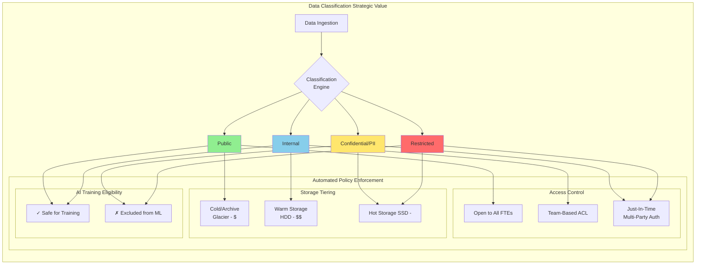
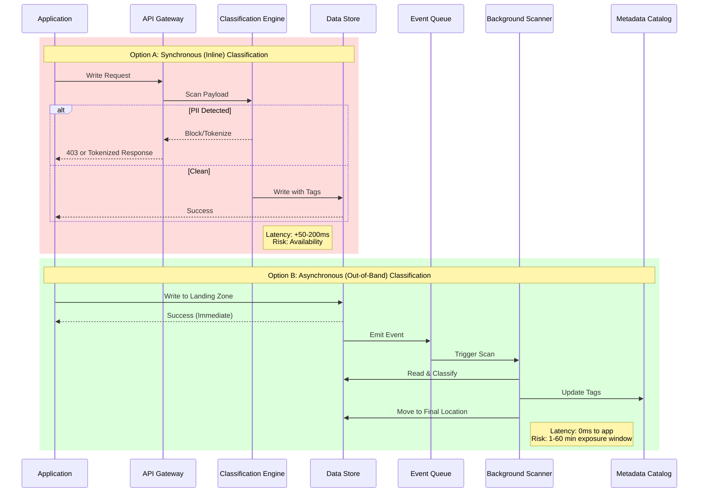
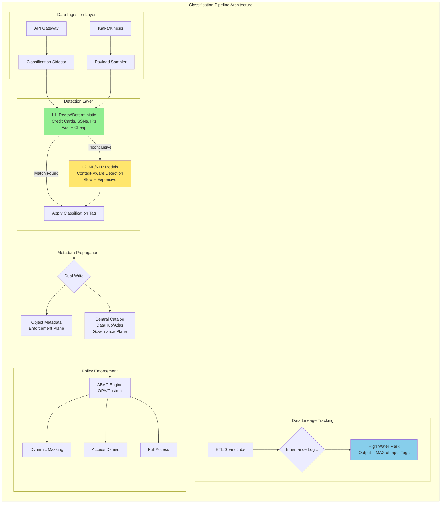
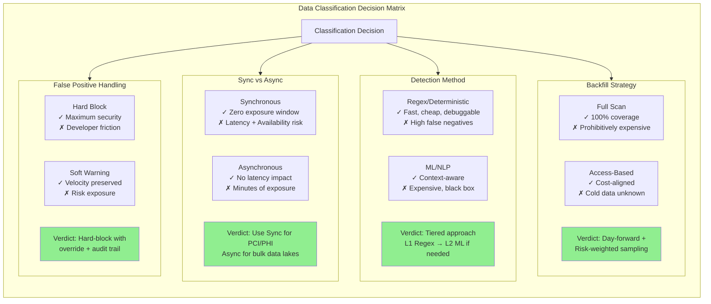

# Data Classification Framework

This guide covers 5 key areas: I. Strategic Overview: Why Data Classification Matters at Scale, II. The Mag7 Classification Taxonomy, III. Architecture & Implementation: The "How", IV. Tradeoffs and Technical Decision Making, V. Business Impact, ROI, and CX.

## I. Strategic Overview: Why Data Classification Matters at Scale

At the Principal level within a Mag7 environment, Data Classification is the fundamental prerequisite for automation. You cannot automate policy enforcement, storage tiering, or AI model training sanitation on data you do not understand. The strategic objective is to move from "tribal knowledge" about data sensitivity to deterministic, metadata-driven governance that scales linearly with data volume, not headcount.

### 1. The Triad of Strategic Value

For a Principal TPM, the business case for investing in a robust classification framework rests on three pillars. You must articulate these to engineering leadership to secure buy-in for the latency and compute overhead required to classify data.

**A. Risk & Compliance (The "Must-Have"):**
In distributed systems like Google’s Spanner or Amazon’s DynamoDB, data sovereignty and privacy are enforced via tagging.
*   **Mag7 Reality:** You cannot manually audit exabytes. Classification tags (e.g., `PII`, `PCI`, `EU-Citizen`) trigger automated guardrails. If a service attempts to move data tagged `EU-Residency` to a `US-East` region bucket, the control plane blocks the replication automatically.
*   **Tradeoff:** Strict classification enforcement can impede developer velocity. If a developer creates a new dataset but the classifier fails to tag it immediately, the system may default to "Block Access," causing production friction.

**B. Storage Economics (The "FinOps" Driver):**
Data classification directly impacts the bottom line via Lifecycle Management (LCM).
*   **Mag7 Reality:** Not all internal data is equal. Log data tagged `Debug/Ephemeral` should have a Time-to-Live (TTL) of 3-7 days and reside on cheaper HDD/Cold storage. Data tagged `Customer-Transaction` requires SSDs and multi-region durability.
*   **ROI Impact:** Correctly classifying and downgrading "cold" data from hot storage tiers to archive tiers (e.g., AWS S3 Glacier or Azure Archive) saves tens of millions of dollars annually at hyperscale.
*   **Tradeoff:** Aggressive tiering based on classification introduces retrieval latency. If mission-critical data is misclassified as "Archive," restoring it during an outage can breach SLAs.

**C. AI & Data Utility (The "Future-Proofing"):**
With the rise of LLMs, classification determines training eligibility.
*   **Mag7 Reality:** You must prevent the model from training on PII or intellectual property that you do not own rights to. A binary tag `Trainable: True/False` derived from classification logic allows ML pipelines to ingest petabytes of data without manual review.
*   **Business Capability:** This enables "Safe by Design" AI products, preventing PR disasters where models regurgitate private user data.

### 2. Architecture: Synchronous vs. Asynchronous Classification

A Principal TPM must decide *when* classification happens. This is a critical architectural decision with significant tradeoffs regarding consistency and latency.

**Option A: Synchronous (Inline) Classification**
Classification occurs at the moment of ingestion (Write path).
*   **Mechanism:** An API Gateway or Proxy intercepts the write payload, scans it (e.g., using Regex or ML classifiers), tags it, and then commits it to the database.
*   **Mag7 Example:** Payment processing pipelines where credit card numbers must be tokenized immediately upon entry.
*   **Tradeoff:** Adds latency to every write operation. If the classification service goes down, the write path fails (availability risk).
*   **Best For:** High-risk data (PCI, PHI) where immediate protection is non-negotiable.

**Option B: Asynchronous (Out-of-Band) Classification**
Data is written immediately, and a background worker scans and tags it later.
*   **Mechanism:** Data lands in a "Landing Zone" (e.g., S3 Bucket). An event triggers a Lambda/Function to scan the object, determine sensitivity, and apply tags.
*   **Mag7 Example:** Data Lakes (BigQuery/Redshift) ingesting massive log streams.
*   **Tradeoff:** Creates a "risk window" (seconds to minutes) where sensitive data exists but is not yet tagged/protected.
*   **Best For:** High-volume, high-velocity ingestion where write latency is paramount.

### 3. The Aggregation Problem (Mosaic Effect)

A specific challenge at Mag7 scale is the "Mosaic Effect," where two datasets classified as `Public` or `Internal` individually become `Confidential` or `Restricted` when combined.

*   **Scenario:**
    *   Dataset A: List of User IDs (Classified: `Internal`).
    *   Dataset B: List of GPS coordinates with timestamps (Classified: `Internal` - anonymized).
    *   **Combined:** Joining A and B reveals exactly where specific users live and work.
*   **Strategic Response:** The classification framework must support **context-aware policies**. As a TPM, you define logic that upgrades sensitivity when specific columns are queried together (e.g., `UID` + `Location` = `Restricted`). This requires integration with the query engine (e.g., Presto/Trino or Spark), not just the storage layer.

### 4. Handling Drift and Schema Evolution

Data is not static. A schema migration might add a "Notes" field to a customer table, which developers then inadvertently populate with PII.

*   **Behavior at Scale:** You cannot rely on the initial classification remaining true forever.
*   **The Solution:** Continuous Compliance Scanning.
    *   **Sampling:** You cannot rescan every petabyte daily. You implement probabilistic sampling (e.g., scan 1% of rows in every table weekly).
    *   **Heuristics:** If a column name changes to include "email" or "ssn," trigger an immediate high-priority scan.
*   **Impact:** This moves the organization from "Point-in-Time" compliance (audit once a year) to "Continuous" compliance, drastically reducing the blast radius of a potential breach.

### 5. Buy vs. Build Decisions

At a Mag7, you will almost certainly utilize a hybrid approach.
*   **Commodity Detection:** Use off-the-shelf cloud native tools (Amazon Macie, Google Cloud DLP) for standard patterns like Credit Cards or Social Security Numbers.
*   **Custom Classifiers:** Build proprietary models for company-specific IP (e.g., "Project Titan" codenames, internal topology maps).
*   **TPM Role:** Your job is to orchestrate the *control plane* that aggregates signals from both commodity and custom scanners into a unified governance view.

## II. The Mag7 Classification Taxonomy

At Mag7 companies, the classification taxonomy is not a bureaucratic exercise; it is the foundation of automated policy enforcement. Every major hyperscaler has converged on a four-tier model (with variations), where the tier determines storage controls, access permissions, retention policies, and AI training eligibility.

### 1. Public (Non-Sensitive)
*   **Definition:** Data that is explicitly approved for external consumption and poses no risk if disclosed.
*   **Examples:** Marketing materials, open-source code, public API documentation, published blog posts, product pricing pages.
*   **Technical Controls:** Minimal. Standard encryption in transit (TLS). No access controls beyond basic authentication to prevent abuse.
*   **Mag7 Behavior:** At Amazon or Google, "Public" data is often served directly from CDN edge caches with minimal logging to optimize latency. The focus is on availability, not protection.
*   **Trade-off:**
    *   *Benefit:* Maximum availability and lowest latency; data can be cached and replicated freely.
    *   *Risk:* Misclassification. If Internal data is accidentally tagged Public, it becomes globally accessible.

### 2. Internal (Business Operations)
*   **Definition:** Data intended for internal use only. Disclosure would not cause significant harm but is not meant for public consumption.
*   **Examples:** Internal wikis, design documents, organizational org charts, ticket backlogs (Jira/Asana), and non-sensitive meeting notes.
*   **Technical Controls:** Standard encryption at rest (AWS KMS/Google Cloud KMS managed keys). Access is generally open to all Full-Time Employees (FTEs) via SSO but blocked for vendors/contractors without specific provisioning.
*   **Mag7 Behavior:** At Google or Meta, "Internal" is the default state for any new document created in the corporate suite. The philosophy is "open by default" to encourage collaboration, provided the user is on the corporate network (CorpNet) or Zero Trust verified.
*   **Trade-off:**
    *   *Benefit:* High velocity; engineers can easily discover existing services or documentation without requesting permission.
    *   *Risk:* Insider threats. If a bad actor is an employee, they have wide lateral visibility.

### 3. Confidential / Sensitive (PII & Business Critical)
*   **Definition:** Data that, if disclosed, would cause significant reputational damage, financial loss, or regulatory fines. This includes Personally Identifiable Information (PII), financial forecasts, and unreleased product specs.
*   **Examples:** User email addresses, device IDs (IMEI/IDFA), pre-launch PR strategies, payroll data.
*   **Technical Controls:**
    *   **Column-Level Encryption:** In data warehouses (Snowflake/BigQuery/Redshift), specific columns containing PII are encrypted.
    *   **Audit Logging:** Every access event (read/write) is logged to an immutable ledger (e.g., CloudTrail).
    *   **TTL (Time To Live):** Strict retention policies enforced automatically (e.g., delete user logs after 90 days).
*   **Mag7 Behavior:** This is where the friction begins. At Amazon, accessing "Red Data" (sensitive customer info) often requires a "break-glass" mechanism or a specific trouble ticket justification. You cannot simply `SELECT *` on a production database.
*   **Business Impact:**
    *   *CX:* High protection builds customer trust but complicates customer support workflows (agents cannot see full data without escalation).
    *   *ROI:* High storage cost due to audit log volume (often 3x the size of the actual data) and compute overhead for encryption/decryption.

### 4. Restricted / High Severity
*   **Definition:** The "Crown Jewels." Unauthorized access could threaten the company’s existence, national security (if FedRAMP), or result in criminal liability.
*   **Examples:** Root encryption keys, source code for core algorithms (e.g., Google Search ranking logic), M&A target lists, production database credentials, whistleblower reports.
*   **Technical Controls:**
    *   **Just-In-Time (JIT) Access:** Access is granted for a specific time window (e.g., 1 hour) and revoked immediately after.
    *   **Multi-Party Authorization (MPA):** Requires two distinct approvals (e.g., a manager and a security engineer) to unlock.
    *   **Hardware Isolation:** Processing may be restricted to specific enclaves (AWS Nitro Enclaves or Confidential Computing VMs).
*   **Mag7 Behavior:** Apple is notorious for physical separation of teams working on new hardware. In software, this manifests as logical air-gaps. A Principal TPM managing a platform migration involving Restricted data must account for *months* of security reviews.

---

### 5. Implementation Strategy: Metadata and Inheritance

A taxonomy is useless without a mechanism to enforce it. For a Principal TPM, the challenge is **Metadata Management** and **Lineage**.

#### The "Toxic Combination" Problem (Data Aggregation)
One of the most complex technical challenges at Mag7 scale is classification inheritance.
*   **Scenario:** Dataset A is "Internal" (User IDs). Dataset B is "Internal" (GPS coordinates).
*   **Result:** When joined, Dataset A + B becomes "Confidential" or "Restricted" because it now enables tracking specific individuals.
*   **TPM Responsibility:** You must define the logic for **derivative classification**. If an ETL job combines tables, the output table must automatically inherit the *highest* classification level of its inputs.

#### Tagging Architectures
There are two primary ways to apply these labels, and you must choose the right one for your product:

1.  **Resource-Based Tagging:**
    *   *Mechanism:* Applying tags to the container (S3 Bucket, DynamoDB Table).
    *   *Pros:* Easy to implement via Terraform/CloudFormation. Fast to audit.
    *   *Cons:* Coarse-grained. If one file in a bucket is sensitive, the whole bucket is locked down, potentially breaking downstream apps that need non-sensitive data from that bucket.
2.  **Content-Based Tagging (Data Cataloging):**
    *   *Mechanism:* Using tools like AWS Macie, Google Cloud DLP, or Alation to scan the *content* and tag specific rows/columns.
    *   *Pros:* Granular control (ABAC). Allows for "data masking" where analysts can see the table but PII columns are nulled out.
    *   *Cons:* Expensive (compute costs to scan petabytes) and high latency.

#### Trade-off Analysis: Precision vs. Performance
| Choice | Trade-off Description | Impact |
| :--- | :--- | :--- |
| **Strict Defaulting** (Everything is Restricted until proven otherwise) | **High Friction / Low Velocity.** Developers cannot work efficiently. Data Science teams are blocked from training models. | **Business:** Slow time-to-market.   **Security:** Zero breaches, but high "Shadow IT" risk as users bypass controls to get work done. |
| **Heuristic Automation** (AI guesses the classification) | **False Positives / False Negatives.** A scanner might misidentify a UUID as a Credit Card number, breaking a production pipeline. | **Ops:** High operational load on TPM/Eng to tune rules.   **CX:** Potential outages if valid traffic is blocked by DLP rules. |

### 6. Business Capabilities & ROI Impact

As a Principal TPM, you must articulate the value of this taxonomy beyond "security said so."

1.  **Cost Optimization (FinOps):**
    *   *Capability:* By accurately classifying data, you can aggressively move "Internal/Public" data to cheaper storage tiers (e.g., S3 Glacier Deep Archive) faster than "Restricted" data which might require instant availability for compliance audits.
    *   *ROI:* At exabyte scale, accurate classification can save tens of millions of dollars annually in storage costs by preventing the "hoarding" of data on high-performance SSDs "just in case."

2.  **AI/ML Readiness:**
    *   *Capability:* LLMs (Large Language Models) cannot be trained on Restricted data without risking data leakage (the model memorizing PII).
    *   *Impact:* A robust taxonomy allows the business to slice data: "Train the model on all 'Public' and 'Internal' code, but exclude 'Restricted' IP." Without this, the AI strategy stalls due to legal risk.

3.  **Regulatory Agility:**
    *   *Capability:* When a new regulation emerges (e.g., EU AI Act), a classified data lake allows you to run a query: "Show me all systems processing 'Biometric Data'."
    *   *Impact:* Reduces audit prep time from months to days.

## III. Architecture & Implementation: The "How"

### 1. The Automated Discovery & Tagging Pipeline

At Mag7 scale, manual classification is impossible. The implementation architecture relies on an automated "Discovery Engine" that operates on an event-driven basis. As a Principal TPM, you must architect the integration of this engine into the developer path-to-production (CI/CD) and the data ingestion layer.

**The Architecture:**
Most hyperscalers utilize a **Sidecar or Proxy Architecture** for real-time classification and an **Asynchronous Crawler** for data at rest.

*   **Ingestion (Stream):** As data enters via Kafka, Kinesis, or gRPC, a lightweight sidecar samples the payload. If it detects high-entropy strings resembling PII (e.g., credit card numbers) in a field not marked "Restricted," it flags the schema registry.
*   **Storage (Batch):** A centralized crawler (similar to AWS Macie or Google Cloud DLP) scans data lakes (S3/GCS) periodically. It updates a central Metadata Catalog (like LinkedIn’s DataHub or Netflix’s Metacat) with the classification tag.

**Mag7 Example:**
At Meta or Google, when a developer creates a new Hive table or Protobuf definition, they are forced via linting rules to declare the data classification level. If they declare "Public" but the system detects email patterns during the first write, the pipeline halts or alerts the Privacy Engineering team.

**Tradeoffs:**
*   **Synchronous (Blocking) vs. Asynchronous (Non-blocking):**
    *   *Blocking:* Guarantees zero leakage but introduces significant latency to write operations and can cause cascading service failures if the scanner times out.
    *   *Asynchronous:* High throughput and resilience, but creates a "risk window" (minutes to hours) where sensitive data exists in storage before being tagged and locked down.
    *   *Principal TPM Decision:* Most Mag7s choose **Asynchronous** for bulk data to preserve availability, using Synchronous checks only for user-facing egress points.

### 2. Algorithmic Implementation: Regex vs. ML Classifiers

The "How" of identification dictates the compute cost and accuracy of your framework. You will likely manage a portfolio of detection mechanisms.

*   **Deterministic (Regex/Checksums):** Fast and cheap. Used for structured data like Credit Card numbers (Luhn algorithm) or IP addresses.
*   **Probabilistic (Machine Learning/NLP):** Expensive and slower. Used for unstructured data (e.g., finding a home address buried in a customer support chat log or sentiment analysis indicating self-harm in user posts).

**Mag7 Example:**
Microsoft’s Office 365 DLP uses a combination. It uses simple pattern matching for immediate UI feedback (e.g., "This looks like a credit card") but relies on heavier NLP models running in the background to classify complex documents contextually (e.g., distinguishing a medical record from a medical research paper).

**Impact on Business & ROI:**
*   **False Positives:** If your classification is too aggressive (tagging "Public" code as "Proprietary"), you block legitimate business workflows, degrading developer velocity.
*   **Compute Costs:** Running BERT-based NLP models on petabytes of logs is cost-prohibitive.
*   **Optimization:** A Principal TPM drives the "Sampling Strategy." You might scan 100% of data entering a "High Risk" zone but only 1% of data entering a "Debug Logs" zone.

### 3. Metadata Injection & Propagation (Data Lineage)

Classification is useless if the tag doesn't travel with the data. This is the **Data Lineage** problem. If a sensitive table is joined with a non-sensitive table, the resulting dataset must inherit the highest sensitivity level (High Water Mark principle).

**Implementation:**
*   **Column-Level Tagging:** Modern data warehouses (Snowflake, BigQuery, Redshift) support tagging at the column level.
*   **Propagation Logic:** ETL jobs (Airflow, Spark) must be instrumented to read input tags and apply the most restrictive tag to the output.

**Mag7 Example:**
Uber utilizes a graph-based lineage tool. If a Data Scientist queries a table containing "Trip Data" (Sensitive) and aggregates it, the resulting dashboard is automatically tagged "Sensitive" and restricted to employees with specific clearance, without manual intervention.

**Tradeoffs:**
*   **Granularity vs. Performance:**
    *   *Cell-level security* (classifying specific rows) offers the highest security but destroys query performance due to lookup overhead.
    *   *Table/Bucket-level security* is fast but coarse, leading to over-classification (treating the whole bucket as toxic because of one file).
    *   *Principal TPM Decision:* Aim for **Column-level** as the standard. It balances performance with the ability to mask specific fields (e.g., `SELECT *` returns masked SSN but visible First Name).

### 4. Policy Enforcement: The Control Plane

Once data is classified, the "How" shifts to enforcement. This is typically decoupled from the data storage to allow for policy changes without rewriting data (Policy as Code).

*   **Attribute-Based Access Control (ABAC):** Access decisions are made at runtime based on the user's role and the data's classification tag.
*   **Dynamic Masking:** The database engine redacts data on-the-fly based on the requestor's scope.

**Mag7 Example:**
In Google Cloud BigQuery, you can set a policy that says: "If Data_Class = 'PII' and User_Group != 'HR_Admin', return 'NULL' for this column." The underlying data remains unchanged, but the view is restricted.

**Impact on CX & Capability:**
*   **CX:** Enables "Least Privilege" without friction. Support agents see the data they need to help a customer, but PII is masked, preventing insider threat.
*   **Skill/Capability:** Moves security from a manual "gate" to a platform capability. Developers don't build auth checks; they just tag data, and the platform handles the rest.

## IV. Tradeoffs and Technical Decision Making

At the Principal level, technical decision-making shifts from "How do we implement this?" to "Should we implement this, and at what cost to the ecosystem?" In the context of Data Classification, you are balancing three competing vectors: **Security/Compliance Risk**, **Infrastructure Cost**, and **Developer Velocity**.

A Mag7 TPM is expected to make high-stakes architectural decisions where a 1% shift in efficiency equates to millions of dollars in compute spend or significant changes in regulatory exposure.

### 1. Synchronous (Inline) vs. Asynchronous (Out-of-Band) Classification

The most critical architectural decision is where the classification engine sits in the data lifecycle. Does the system classify data *before* it is written to persistence, or *after*?

**Option A: Synchronous (Inline Interception)**
Data is intercepted via an API gateway, sidecar proxy, or library hook before it reaches the data store (e.g., S3, DynamoDB, BigTable). It is analyzed, tagged, and potentially blocked if it violates policy.

*   **Mag7 Example:** A payment processing service at Google where a write is rejected immediately if a credit card number is detected in a logging field (preventing PCI contamination of logs).
*   **Tradeoffs:**
    *   *Pros:* Zero "time-to-detection" gap. Data never lands in the wrong tier.
    *   *Cons:* Adds latency to the write path (P99 latency impact). High risk of outage; if the classification service fails, the core application fails (circuit breakers are mandatory).
    *   **ROI/Impact:** High security assurance but high risk to CX (latency) and availability.

**Option B: Asynchronous (Event-Driven/Scanning)**
The application writes data normally. An event (via Kafka/Kinesis/PubSub) triggers a scanner to read the new object, classify it, and update the metadata tags or move the object to a secure bucket.

*   **Mag7 Example:** Amazon S3 Macie or internal data lake scanners at Meta. Data lands in a "staging" zone; a background worker classifies it within minutes and moves it to the appropriate "production" or "restricted" zone.
*   **Tradeoffs:**
    *   *Pros:* Zero impact on application latency or availability. Decoupled scaling (scanner lag doesn't stop user writes).
    *   *Cons:* "Window of Vulnerability"—data exists in an unclassified state for milliseconds to minutes.
    *   **ROI/Impact:** Higher developer velocity and system resilience. Lower infrastructure cost (can use spot instances for scanning).

**Principal TPM Decision:** For general purpose data lakes, choose **Asynchronous**. The cost of blocking user writes is too high. For specific, high-risk pipelines (e.g., Payments, Health), choose **Synchronous** but scope it narrowly to minimize blast radius.

### 2. Deterministic (Regex/Pattern) vs. Probabilistic (ML/NLP) Models

When defining *how* the engine identifies data, you must choose between rigid rules and AI-driven inference.

**Option A: Deterministic (Pattern Matching)**
Using Regular Expressions, Luhn algorithms, or exact dictionary matches (e.g., matching a user ID against an HR database).

*   **Tradeoffs:**
    *   *Pros:* Extremely fast (low compute cost), predictable, easy to debug.
    *   *Cons:* Brittle. High False Negatives (misses "my password is..." if not explicitly coded). High False Positives on generic strings (e.g., a UUID looking like a legacy account number).
    *   **Impact:** Low cost, but requires constant manual rule maintenance.

**Option B: Probabilistic (ML/NLP Contextualization)**
Using Named Entity Recognition (NER) and context awareness (e.g., distinguishing between a Python hash and a Social Security Number based on surrounding text).

*   **Mag7 Example:** Microsoft Office 365 DLP using ML to detect "offensive language" or "insider trading signals" in emails, which Regex cannot catch.
*   **Tradeoffs:**
    *   *Pros:* High accuracy on unstructured data; understands context. Adapts to new threats without manual rule updates.
    *   *Cons:* Computationally expensive (GPU/TPU requirements). "Black box" decision making makes debugging difficult for users.
    *   **Impact:** Higher infrastructure ROI (better storage tiering) but significantly higher compute spend.

**Principal TPM Decision:** Implement a **Hybrid Tiered Approach**.
1.  **L1 Pass:** Run cheap Regex first. If it finds a definite credit card, tag it. Stop.
2.  **L2 Pass:** Only if L1 is inconclusive, route the payload to the expensive ML model.
This optimizes the "Cost per Classified Byte" metric, a key KPI for Mag7 infrastructure.

### 3. The "Dark Data" Problem: Backfill vs. Day-Forward Strategies

When introducing a new classification framework, you face the "Brownfield" problem: You have 500 Petabytes of historical, unclassified data.

**Strategy A: Complete Backfill (Scan Everything)**
*   **Behavior:** Spin up massive compute fleets to crawl every object in storage.
*   **Tradeoffs:**
    *   *Pros:* 100% Compliance coverage.
    *   *Cons:* Prohibitively expensive. At cloud scale, reading exabytes of cold data incurs massive retrieval fees (e.g., S3 Glacier thaw costs) and compute costs.
*   **Business Impact:** Can burn the entire year's infrastructure budget in one month.

**Strategy B: Access-Based (Lazy Migration)**
*   **Behavior:** Only scan historical data when it is *accessed* or *modified*.
*   **Tradeoffs:**
    *   *Pros:* Costs align with business value (only paying to secure active data).
    *   *Cons:* "Cold" toxic data (e.g., an old dump of SSNs) remains undetected until a breach occurs.

**Principal TPM Decision:** **Risk-Weighted Sampling + Access-Based.**
Do not scan everything. Implement "Day-Forward" (scan all new data). For historical data, use heuristic sampling (scan 1% of a bucket to predict its contents) and prioritize scanning "Open Access" buckets. Accept the risk on locked-down, cold storage buckets to save budget.

### 4. False Positive Management and Developer Friction

The technical success of a classification system is often measured by the **False Positive Rate (FPR)**. If your system incorrectly tags a deployment script as "High Confidentiality" because it contains a public key, you block the deployment.

*   **Mag7 Reality:** If a security tool blocks 1,000 engineers for an hour, the cost to the business exceeds the value of the security tool.
*   **Mechanism:**
    *   **Soft-Block (Warning):** Allow the action but alert the security team. (High noise, low friction).
    *   **Hard-Block with Override:** Block the action but allow the user to click "I accept the risk" to proceed. (Audit trail created).
    *   **Hard-Block:** Total stop. (Maximum security, maximum friction).

**Principal TPM Decision:** Default to **Hard-Block with Override** for internal tools. This puts the accountability on the user (creating a culture of security) without halting business continuity. Reserve **Hard-Block** only for confirmed high-confidence signals (e.g., exact match on a known compromised API key).

### 5. Metadata Storage: Centralized vs. Decentralized

Where does the classification tag live?

*   **Option A: Object Metadata (Decentralized).** The tag sits on the S3 object head or the database row itself.
    *   *Tradeoff:* Easy to enforce (the data carries its own rules). Hard to report on (need to scan everything to generate a compliance report).
*   **Option B: Central Catalog (Centralized).** A separate database (e.g., Apache Atlas, DataHub) maps Data IDs to Classification Tags.
    *   *Tradeoff:* Instant global reporting and auditing. Risk of drift (data moves, catalog isn't updated).

**Principal TPM Decision:** **Dual-Write.**
Write the tag to the object (for immediate enforcement) AND emit an event to update the central catalog (for governance/reporting). This ensures the "Enforcement Plane" and "Control Plane" remain in sync.

---

## V. Business Impact, ROI, and CX

At the Principal TPM level, data classification is rarely sold to leadership solely on "security hygiene." It must be framed as a lever for **profitability (Unit Economics)** and **product velocity**. If you cannot map your classification strategy to a reduction in COGS (Cost of Goods Sold) or an increase in ARR (Annual Recurring Revenue) via AI readiness, the initiative will likely be deprioritized.

### 1. Storage Unit Economics: The "Hot vs. Cold" Arbitrage

The most immediate ROI from robust data classification comes from storage lifecycle management. In Mag7 environments, keeping petabytes of "Internal" log data on high-availability SSDs (e.g., AWS S3 Standard or EBS gp3) is financially irresponsible.

**Technical Implementation:**
You must implement **Metadata-Driven Lifecycle Policies**. Instead of relying on age alone (Time-to-Live), policies should trigger based on classification tags.
*   **High Value/High Access:** Stored in Hot tiers (ms latency).
*   **Compliance/Audit Logs:** Automatically transitioned to Cold/Archive tiers (e.g., S3 Glacier Deep Archive or Azure Archive Blob) immediately upon creation or after 30 days.

**Mag7 Real-World Example:**
Netflix utilizes classification metadata to determine asset placement. A 4K master file (High Value/IP) is stored differently than the thousands of transitory encoding logs generated during its processing. By classifying logs as "Ephemeral/Low-Criticality," they can aggressively expire or archive them, saving millions annually in storage costs.

**Tradeoff Analysis:**
*   **The Tradeoff:** **Cost vs. Retrieval Latency (Time-to-Recovery).**
*   **Impact:** Moving data to deep archive reduces cost by ~95%, but retrieval times shift from milliseconds to 12-48 hours.
*   **Principal TPM Action:** You must negotiate SLAs with engineering teams. If a team classifies their debug logs as "Critical" to avoid waiting for retrieval, you must implement chargeback models to make them feel the cost of that decision.

### 2. Reducing the "Blast Radius" and Regulatory Liability

ROI in security is often calculated as "Loss Avoidance." For a Mag7, a data breach involving PII (Personally Identifiable Information) isn't just a PR nightmare; it is a quantified financial penalty under GDPR (4% of global revenue) or CCPA.

**Technical Implementation:**
Classification tags drive **Data Loss Prevention (DLP)** enforcement points.
*   **Egress Filtering:** If a file tagged `Confidential/PII` attempts to leave the corporate network via email or USB, the DLP agent blocks it.
*   **Field-Level Encryption:** Databases (like DynamoDB or Spanner) use classification tags to determine which fields require application-level encryption vs. standard encryption-at-rest.

**Mag7 Real-World Example:**
Google and Meta face constant regulatory scrutiny. Their internal frameworks ensure that data classified as "EU Resident PII" is logically (and often physically) separated to comply with data residency laws. If this data were unclassified and mixed with general US logs, they would be forced to apply the strictest (most expensive) controls to *all* data, rather than just the relevant subset.

**Tradeoff Analysis:**
*   **The Tradeoff:** **Security Posture vs. Developer Velocity.**
*   **Impact:** Aggressive blocking based on classification can lead to high False Positive rates. If a developer's code commit is blocked because a hash looks like a Credit Card Number (Luhn algorithm match), you halt the CI/CD pipeline.
*   **Principal TPM Action:** Implement "Audit Mode" before "Block Mode" for new classification rules. Track the metric **"False Positive Block Rate"** and set a threshold (e.g., <0.1%) before turning on enforcement.

### 3. AI/ML Readiness and Data Quality (The New CX)

In the GenAI era, data classification is the gatekeeper of model quality. Training an LLM on unclassified data is catastrophic—you risk leaking PII, ingesting low-quality "noise," or violating IP rights.

**Technical Implementation:**
Classification serves as the **Ingestion Filter** for Vector Databases and Training Lakes.
*   **Exclusion:** Tags like `PII`, `Customer-Secret`, or `Do-Not-Train` automatically exclude data from training sets.
*   **Weighting:** Data classified as `High-Quality/Documentation` or `Golden-Source-Code` is up-weighted during training to improve model reasoning.

**Mag7 Real-World Example:**
Microsoft Copilot (M365) relies heavily on the "Semantic Index." It respects the access control lists (ACLs) and classification labels of the underlying documents. If a document is classified as `HR-Confidential`, Copilot will not use that data to answer a query from a user who lacks that specific clearance, preventing internal data leaks via AI hallucination.

**Tradeoff Analysis:**
*   **The Tradeoff:** **Model Accuracy vs. Data Safety.**
*   **Impact:** Excluding too much data (over-classification) makes the model stupid. Including too much (under-classification) makes the model dangerous or legally non-compliant.
*   **Principal TPM Action:** Establish a "Data Governance Council" specifically for AI. Define the **"Safe-for-Training"** classification tier. The metric here is **"Training Data Utilization Rate"**—what % of our corporate knowledge is clean enough to be vectorized?

### 4. Operational Efficiency and Query Performance

Unclassified data lakes turn into "data swamps." When analysts or automated systems query a petabyte-scale lake, scanning unclassified/irrelevant data drives up compute costs (e.g., BigQuery or Snowflake credits) and increases latency.

**Technical Implementation:**
*   **Partitioning Strategy:** Data is partitioned by its classification and retention tag.
*   **Query Optimization:** Queries are restricted to specific partitions. An analyst looking for "Public Web Logs" does not waste compute power scanning "Internal Financial Records."

**Tradeoff Analysis:**
*   **The Tradeoff:** **Ingestion Complexity vs. Query Performance.**
*   **Impact:** Forcing strict classification at ingestion adds latency to the write path (ETL pipelines). However, it drastically reduces the read path latency and cost.
*   **Principal TPM Action:** Champion the **"Shift Left"** of classification. Force schema validation and tagging at the API gateway or event bus level (e.g., Kafka topics must have classification metadata). The business capability gained is **Real-Time Analytics** on clean data, rather than batch processing on dirty data.

---

---

## Interview Questions

### I. Strategic Overview: Why Data Classification Matters at Scale

### Question 1: Legacy Data Remediation
"We have a 10-year-old data lake containing 50 Petabytes of unstructured data with no classification tags. We need to enforce GDPR deletion requests within 6 months. As the Principal TPM, how do you design the strategy to classify this swamp without halting ongoing business operations or blowing the budget on compute?"

*   **Guidance for a Strong Answer:**
    *   **Prioritization:** Don't scan everything. Use metadata (bucket names, owner, access patterns) to triage "likely PII" vs "likely logs."
    *   **Sampling:** Propose scanning header rows or random 1% samples to infer classification for the whole object/table.
    *   **Cost Management:** Utilize spot instances or "spare compute" capacity for background scanning to minimize costs.
    *   **Defensive Design:** Implement a "quarantine" policy—if data hasn't been accessed in 2 years and fails classification, move to cold storage and revoke access rather than spending resources to clean it perfectly.

### Question 2: The Latency Tradeoff
"Product teams are complaining that the synchronous data classification API is adding 200ms to their write latency, causing timeouts in the checkout flow. However, Security mandates that no PII can land on disk unencrypted/untagged. How do you resolve this conflict?"

*   **Guidance for a Strong Answer:**
    *   **Architecture Shift:** Propose moving to an asynchronous model with a temporary "secure landing zone." Data is written to a heavily restricted, encrypted-by-default buffer. It is then scanned/classified asynchronously before moving to the general-access data lake.
    *   **Client-Side Classification:** Push simple validation (regex for credit cards) to the client/edge SDK to tag data *before* it hits the backend, reducing server-side processing.
    *   **Negotiation:** Quantify the business loss (checkout drop-off) vs. the security risk. If the risk is only for specific fields, apply synchronous scanning *only* to those fields, not the whole payload.

### II. The Mag7 Classification Taxonomy

### Question 1: The Legacy Migration Challenge
"We are acquiring a mid-sized competitor with 50 PB of data stored in a flat, unclassified data lake. As the Principal TPM for the integration, outline your strategy to bring this data into our Mag7 classification framework without halting their business operations. How do you handle the 'unknowns'?"

**Guidance for a Strong Answer:**
*   **Phased Approach:** Do not suggest "scan everything immediately" (too expensive/slow). Propose a "quarantine and ingest" model.
*   **Technique:** Use "access patterns" as a proxy for classification. If a table is accessed by the Finance team, provisionally tag it "Confidential." If accessed by the public web server, tag "Public."
*   **Automation:** deploy sampling-based DLP (scan 1% of rows) to establish a baseline probability of PII presence.
*   **Governance:** Establish a "Data Steward" program where owners must claim and classify data within X days or face archival.
*   **Trade-offs:** Acknowledge that you will accept some risk during the transition to maintain business continuity.

### Question 2: The Velocity vs. Security Deadlock
"Your product team wants to launch a new feature that uses customer transaction history to personalize the UI. The Security team creates a blocker, stating that 'Transaction History' is 'Restricted' and cannot be cached on the client-side, which ruins the user experience (latency). As the Principal TPM, how do you resolve this architectural conflict?"

**Guidance for a Strong Answer:**
*   **De-escalation:** Move away from opinions and toward the taxonomy definitions. Does the taxonomy explicitly forbid client-side caching, or just *unencrypted* caching?
*   **Architectural Compromise:** Propose **Data Masking/Tokenization**. Can the UI use a non-sensitive "token" representing the transaction history, or an aggregated view (e.g., "High Spender" tag) rather than raw raw data?
*   **Policy-as-Code:** Suggest implementing a technical control (e.g., short-lived ephemeral keys for the cache) that satisfies Security's risk requirement while preserving the Product's latency requirement.
*   **Leadership:** Frame the decision in terms of ROI. If the feature drives $100M revenue, is it worth the cost of building a secure, encrypted caching layer?

### III. Architecture & Implementation: The "How"

### Question 1: Handling "Dark Data" in Legacy Migrations
**Prompt:** "We are migrating a 10-year-old on-premise data lake to the cloud. It contains 50PB of unstructured data, much of it unclassified 'dark data.' We cannot migrate PII due to regulatory constraints. As the Principal TPM, how do you architect the classification and migration strategy to ensure velocity without compliance risk?"

**Guidance for a Strong Answer:**
*   **Strategy:** Propose a "Quarantine and Scan" approach. Do not scan 50PB on-premise (too slow/resource-constrained).
*   **Architecture:**
    1.  **Lift & Shift to Quarantine:** Move data to a locked-down, private cloud bucket (staging area) first.
    2.  **Ephemeral Compute Scanning:** Spin up massive, spot-instance compute clusters to run high-throughput scanning (Regex first, then ML for sampling) on the staging buckets.
    3.  **Tag & Move:** Automated policies move "Clean" data to production lakes and "Sensitive" data to secure vaults or delete it.
*   **Tradeoffs:** Acknowledge the cost of double-storage (staging + prod) vs. the risk of on-prem scanning slowing the migration by months.
*   **Metrics:** Track "Scan Throughput," "Classification Coverage %," and "False Positive Rates."

### Question 2: Managing False Positives in Real-time Blocking
**Prompt:** "You implemented a synchronous DLP blocker on the commit pipeline to prevent secrets (API keys) from leaking into source control. However, the engineering organization is revolting because the scanner is flagging legitimate test strings and random hashes, blocking deployments. How do you resolve this?"

**Guidance for a Strong Answer:**
*   **Immediate Action:** Move from "Block" mode to "Alert" mode immediately to restore business continuity (velocity).
*   **Technical Root Cause:** Analyze the entropy thresholds of the scanner. It is likely too sensitive.
*   **Process Improvement:** Implement a "Self-Service Exception" workflow. If a dev is blocked, they can click "Override" with a justification (audit log), allowing the commit but flagging it for security review.
*   **Long-term Fix:** Refine the classifier. Introduce a "allowlist" for test data patterns and implement context-aware scanning (e.g., ignore files in `/test/` directories).
*   **Philosophy:** Demonstrate that as a Principal TPM, you prioritize *business agility* alongside security. A security tool that stops the business is a failed tool.

### IV. Tradeoffs and Technical Decision Making

### Question 1: The Cost/Risk Optimization Challenge
"We have 50 Petabytes of unclassified legacy data in our data lake. The CISO wants it all classified for GDPR compliance by Q4. However, the VP of Infrastructure says scanning it all will exceed our compute budget by 200%. As the Principal TPM, how do you resolve this conflict and what is your technical strategy?"

**Guidance for a Strong Answer:**
*   **Acknowledge the Tradeoff:** Explicitly state that 100% scan is not viable.
*   **Propose Heuristics:** Suggest scanning metadata/filenames first (cheap) to identify high-risk areas.
*   **Risk-Based Prioritization:** Propose scanning only data that has "Open/Public" permissions or has been accessed in the last 90 days. Leave "Cold/Private" data for later.
*   **Sampling:** Suggest scanning a random 5% sample of large buckets. If the sample is clean, apply a "Low Risk" tag to the bucket with a confidence score.
*   **Business Negotiation:** Frame the solution as "We will cover 95% of the *risk* for 20% of the *cost*."

### Question 2: Handling a False Positive "Storm"
"You rolled out a new ML-based classifier to detect PII in our internal code repositories. On day 1, it flagged 5,000 legitimate code commits as 'Confidential,' blocking deployments across the company. The CTO is on the phone. Walk me through your immediate incident response and your long-term architectural fix."

**Guidance for a Strong Answer:**
*   **Immediate Action (Bleeding Stop):** Rollback is the standard answer, but a Principal TPM might suggest switching the system to "Audit-Only Mode" (Log but don't block) to keep deployments moving while retaining data for analysis.
*   **Root Cause Analysis:** Identify why the ML model failed (likely over-fitting on training data or lack of context for code syntax).
*   **The Fix (Human-in-the-Loop):** Introduce a "User Feedback Loop." Allow devs to mark "Not PII" which immediately unblocks them and adds that sample to the negative training set for the model.
*   **Metric Adjustment:** Discuss shifting the threshold. You tuned for Recall (catch everything), but you need to tune for Precision (reduce noise). Explain the business impact of this shift.

### V. Business Impact, ROI, and CX

### Question 1: The "Legacy Swamp" ROI Challenge
**"We have 50 Petabytes of unclassified legacy data in S3 Standard storage costing us millions/month. Leadership wants to delete it, but Legal is afraid of deleting retention-mandated records. As a Principal TPM, how do you architect a program to classify this data and reduce costs without stalling the business?"**

**Guidance for a Strong Answer:**
*   **Strategic Approach:** Reject manual review immediately. Propose a heuristic-based automated scanning approach (e.g., Amazon Macie or custom regex jobs).
*   **Phasing:** Propose a "Triage" phase.
    1.  *Identify & Archive:* Move data untouched for >3 years to Cold Storage immediately (cost save funding the project).
    2.  *Scan & Tag:* Run classifiers on the remaining hot data.
*   **Risk Management:** Introduce the concept of a "quarantine" bucket. Move ambiguous data there before deletion, with a "scream test" (if no one accesses it in 6 months, it's deleted).
*   **Metrics:** Define success not just by "Data Classified" but by **"Monthly Cloud Bill Reduction"** vs. **"Scan Cost."** Prove the scan pays for itself.

### Question 2: The GenAI Tradeoff
**"Our engineering team wants to train a code-completion model on our internal monorepo. Security is blocking them because the repo contains hardcoded secrets and PII in comments. How do you resolve this stalemate to enable the AI capability?"**

**Guidance for a Strong Answer:**
*   **Root Cause Analysis:** Acknowledge that "blocking" is not a solution at Mag7; enabling velocity safely is.
*   **Technical Solution:** Propose a **Sanitization Pipeline**.
    1.  Use the classification framework to identify secrets/PII patterns.
    2.  Implement a "Token Replacement" step (e.g., replace actual API keys with `<REDACTED_KEY>`) before the data hits the training bucket.
*   **Governance:** Establish a "Human-in-the-Loop" validation set. Have senior engineers review a statistically significant sample of the sanitized data.
*   **Business Impact:** Frame the solution as enabling a **30% developer productivity boost** (standard Copilot stat) while maintaining a **Zero-Trust security posture**.

---

## Key Takeaways

- Review each section for actionable insights applicable to your organization

- Consider the trade-offs discussed when making architectural decisions

- Use the operational considerations as a checklist for production readiness
