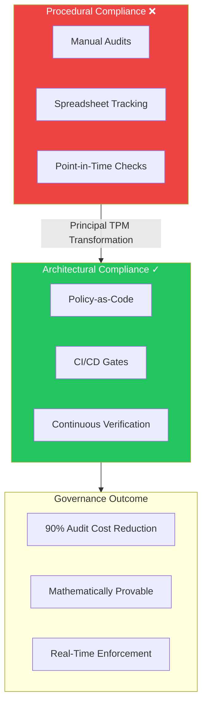
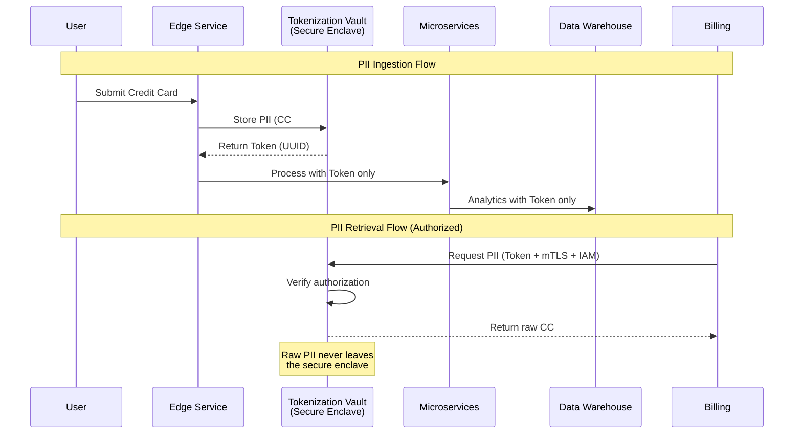
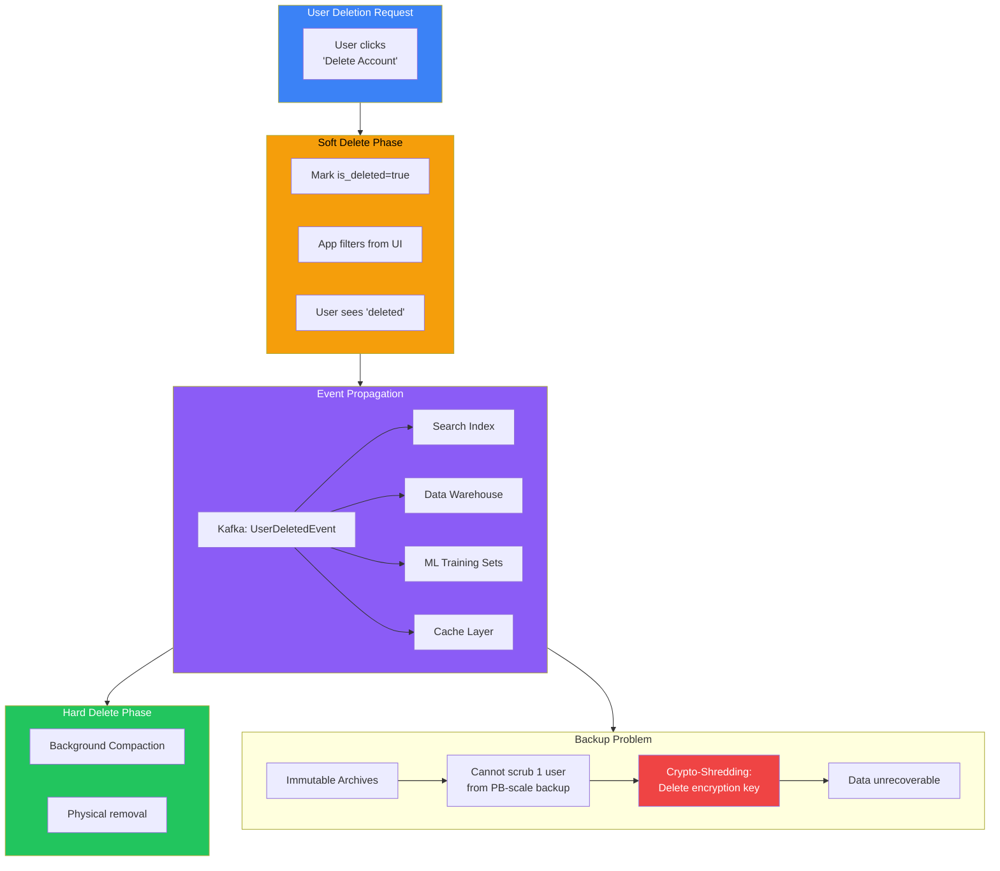

# Data Governance & Privacy

At Mag7 scale, data governance is a distributed systems problem, not a legal one. With petabytes of daily ingestion across thousands of microservices, the question isn't "how do we write better policies" but "how do we architect systems where non-compliance is architecturally impossible." Principal TPMs drive the transition from procedural compliance (manual audits, spreadsheets) to architectural compliance (Policy-as-Code, CI/CD gates, immutable infrastructure). This guide covers the technical frameworks for discovery, privacy-by-design, lifecycle management, and cross-border sovereignty that enable business velocity without regulatory liability.

## I. The Strategic Landscape: Governance at Hyperscale

At the Principal TPM level, the strategic landscape of governance is defined by the transition from **procedural compliance** (manual audits, spreadsheets) to **architectural compliance** (embedded logic, immutable infrastructure). In a hyperscale environment, governance is a distributed systems problem, not a legal one. The objective is to decouple policy definitions from application logic, allowing governance to evolve independently of the product roadmap.

### 1. Policy-as-Code and the Control Plane

The primary mechanism for governance at Mag7 scale is **Policy-as-Code (PaC)**. Instead of written guidelines, policies are defined in high-level languages (like Rego for Open Policy Agent) and enforced via the CI/CD pipeline or admission controllers.

**Technical Implementation:**
*   **The Guardrail Approach:** Governance logic is injected into the infrastructure provisioning layer (Terraform, CloudFormation, Kubernetes Admission Controllers).
*   **Decoupled Decisioning:** Applications offload authorization and compliance decisions to a dedicated service (e.g., OPA). The app asks, "Can User X perform Action Y on Data Z?" and the service responds based on current policy, independent of the app code.

**Real-World Mag7 Behavior:**
*   **Google (Binary Authorization):** Google ensures supply chain integrity by verifying that container images are signed by trusted authorities and pass vulnerability scanners before they can be deployed to Borg/GKE. If a developer attempts to deploy a container with critical CVEs or without a verifiable build provenance, the admission controller rejects the deployment.
*   **Netflix (ConsoleMe):** Netflix moved away from static IAM roles to a central control plane (ConsoleMe) where developers request permissions. The system analyzes the request against policies and automatically grants or denies access, or routes for approval, balancing least-privilege with developer velocity.

**Tradeoffs:**
*   **Latency vs. Security:** Centralized policy evaluation adds network hops (latency).
    *   *Mitigation:* Deploy policy engines as sidecars (local to the pod/service) to keep decision latency sub-millisecond.
*   **Standardization vs. Edge Cases:** A strict global policy (e.g., "No public S3 buckets") breaks legitimate use cases (e.g., hosting public assets).
    *   *Mitigation:* Implement an "Exception Registry" where exemptions are cryptographically signed, time-bound, and monitored, rather than turning off the rule entirely.

**Impact:**
*   **ROI:** Reduces the cost of audits by 90% as compliance is continuous and mathematically provable rather than sampled.
*   **Skill:** Requires TPMs to understand declarative infrastructure and basic logic programming.

### 2. Data Sovereignty and Residency Architecture

At hyperscale, data governance requires solving for **Data Residency**—the legal requirement that specific data (e.g., German citizens' health data) must physically reside on servers within a specific jurisdiction. This dictates topology.

**Technical Implementation:**
*   **Sharding by Geography:** Database schemas must include a "jurisdiction" attribute at the root level. Storage layers use this attribute to route writes to specific regional clusters.
*   **Logical vs. Physical Separation:**
    *   *Logical:* Access controls prevent US admins from seeing EU data.
    *   *Physical:* Air-gapped or distinct hardware (e.g., AWS GovCloud or Azure Germany).

**Real-World Mag7 Behavior:**
*   **Microsoft (EU Data Boundary):** Microsoft engineered a solution where all Azure, Microsoft 365, and Dynamics 365 data for EU customers is processed and stored exclusively within the EU. This required refactoring global services (like directory lookups or telemetry processing) to ensure even metadata did not leak across the Atlantic.
*   **TikTok (Project Texas - Oracle Partnership):** While an extreme case, this illustrates the "Sovereign Cloud" model where user data is routed to Oracle Cloud Infrastructure (OCI) within the US, with code reviews and gateway controls managed by a US-based entity to prevent data exfiltration to China.

**Tradeoffs:**
*   **Global Availability vs. Fragmented Infrastructure:** Maintaining separate stacks for EU, US, and APAC increases operational overhead and reduces the effectiveness of "follow-the-sun" support models.
*   **Feature Parity:** New features often launch in the primary region (US) first; sovereign regions lag due to the complexity of compliant deployment.

**Impact:**
*   **Business Capability:** Enables entry into highly regulated markets (Government, Finance, Healthcare) which are otherwise inaccessible.
*   **CX:** Users may experience higher latency if they travel across regions, as their data does not move with them.

### 3. Purpose-Based Access Control (PBAC)

Role-Based Access Control (RBAC) fails at Mag7 scale because "Engineer" is too broad a role for 50,000 employees. The industry standard has shifted to **Attribute-Based (ABAC)** and **Purpose-Based Access Control (PBAC)**.

**Technical Implementation:**
*   **Just-in-Time (JIT) Access:** Permissions are not standing. They are granted for a specific duration based on a specific trigger (e.g., an active PagerDuty incident).
*   **Purpose Binding:** Access to data requires a declared "Purpose." The system logs *why* the data was accessed, linking the query to a Jira ticket or Incident ID.

**Real-World Mag7 Behavior:**
*   **Meta (Privacy Aware Infrastructure):** Meta’s internal data access systems require engineers to specify the *purpose* of data usage (e.g., "Debugging Ticket #1234"). If the purpose doesn't align with the data's classification (e.g., using PII for "Model Training" without user consent), the query is blocked at the infrastructure layer, regardless of the engineer's seniority.
*   **Amazon:** Customer Service agents cannot view customer data unless there is an active contact (call/chat) initiated by that customer. The access window closes immediately after the interaction ends.

**Tradeoffs:**
*   **Friction vs. Privacy:** PBAC introduces friction. Engineers cannot just "explore" data to find bugs; they need a hypothesis and a ticket.
    *   *Mitigation:* Create "Synthetic Data" environments that mirror production schema but contain fake data for unrestricted exploration.
*   **Complexity:** Implementing PBAC requires a unified metadata layer across all data stores (SQL, NoSQL, Blob), which is a massive engineering lift.

**Impact:**
*   **Trust/Brand:** Prevents internal snooping scandals (e.g., employees stalking ex-partners), which are devastating to brand trust.
*   **Operational Efficiency:** Drastically reduces the "blast radius" of a compromised employee credential.

## II. Data Discovery, Cataloging, and Lineage

At the scale of a Mag7 company, data discovery is not about "organizing files"; it is an engineering productivity crisis and a compliance necessity. When you have 100,000+ tables and petabytes of streams, a Data Scientist spending 40% of their time just *finding* the right dataset is a massive OpEx leak.

As a Principal TPM, your objective is to transition the organization from **Tribal Knowledge** (asking around on Slack) to **Systematic Discovery** (automated, reliable metadata). You are responsible for the program that ensures every data asset is discoverable, understandable, and trustable without human intervention.

### 1. From Passive Inventory to Active Metadata
Traditional organizations view a Data Catalog as a static inventory (like a library card catalog). At Mag7, the catalog is an **Active Metadata Platform**. It does not wait for humans to update descriptions; it programmatically harvests metadata from the infrastructure.

*   **The Architecture:**
    *   **Push-Based (Event-Driven):** When a schema changes in a Protobuf definition or a new table is created in Snowflake/BigQuery, the CI/CD pipeline emits a metadata event to the central catalog (e.g., via Kafka).
    *   **Pull-Based (Crawlers):** Scheduled agents scan logs (Query Logs, S3 access logs) to infer usage patterns and popularity.

*   **Real-World Mag7 Behavior:**
    *   **LinkedIn (DataHub):** LinkedIn built DataHub (now open source) because static documentation failed. They shifted to a "Push" model where services emit metadata changes as part of the commit process.
    *   **Lyft (Amundsen):** Lyft focused heavily on "PageRank for Data"—using usage logs to rank search results so the most used tables appear first, solving the "too much data" noise problem.

*   **Tradeoffs:**
    *   **Push vs. Pull:**
        *   *Push:* Real-time accuracy, but requires high engineering effort to integrate every producer service with the catalog API.
        *   *Pull:* Easier to implement (just scan the DB), but creates lag (data is stale until next scan) and puts load on production databases.
        *   *Mag7 Choice:* Hybrid. Push for schemas (critical/blocking), Pull for usage stats and operational metrics.

### 2. Automated Lineage: The "Bloodline" of Data
Lineage answers two critical questions: "Where did this data come from?" (Root Cause Analysis) and "Who uses this data?" (Impact Analysis).

At the Principal level, you must distinguish between **Table-Level Lineage** and **Column-Level Lineage**.

*   **Technical Implementation:**
    *   **Parsing:** The most common method involves parsing SQL query logs to map inputs to outputs.
    *   **Instrumentation:** Using frameworks like OpenLineage, where the orchestration layer (Airflow, Dagster) reports lineage automatically as jobs run.

*   **Real-World Mag7 Behavior:**
    *   **Netflix:** Uses lineage to detect "Zombie Data." If a table is generated but the downstream lineage shows zero reads in the last 90 days, the storage is automatically tiered to cold storage or deleted, saving millions in AWS costs.
    *   **Google:** Uses lineage for privacy propagation. If a source column is tagged `PII:Email`, the lineage graph propagates that tag to every downstream table and dashboard that consumes it.

*   **Tradeoffs:**
    *   **Granularity vs. Compute Cost:**
        *   *Column-Level:* Essential for PII tracking (did the SSN leak into the analytics view?), but computationally expensive to parse complex SQL joins and transformations.
        *   *Table-Level:* Cheap and fast, but insufficient for strict GDPR/compliance audits.
    *   *Impact:* You must champion the investment in Column-Level lineage for any dataset containing PII/SPI, while accepting Table-Level for operational logs to save costs.

### 3. The "Data Amazon" Experience: Trust and Curation
A catalog is useless if the data is "garbage." A key TPM responsibility is defining the **Trust Architecture**. You cannot manually verify 100,000 tables. You must implement a tiered certification program.

*   **The Tiering Model:**
    *   **Bronze (Raw):** Landed as-is. No guarantees.
    *   **Silver (Curated):** Cleaned, schema enforced, owner assigned.
    *   **Gold (Certified):** SLA-backed, audited by data engineering, reliable for CEO-level reporting.

*   **Mag7 Behavior:**
    *   **Uber (Databook):** Uber implemented a mechanism where data owners receive "nudge" notifications. If a dataset has high usage but low documentation scores, the owner is pinged to improve descriptions. If they don't, the dataset is down-ranked in search results.

*   **Impact on Business/ROI:**
    *   **Self-Service Analytics:** Reduces the "Time to Insight" for Data Scientists from days to minutes.
    *   **Defensive Engineering:** Prevents breaking changes. If an engineer wants to drop a column, the lineage system blocks the PR if it detects that a Gold-Certified dashboard depends on that column.

### 4. Implementation Strategy for the Principal TPM
Your role is not to build the crawler, but to drive the adoption and governance strategy.

1.  **Define the Metadata Standard:** You must align the organization on what constitutes "complete" metadata (Owner, SLA, Classification, Retention Policy).
2.  **The "Carrot and Stick" Approach:**
    *   *Carrot:* "If you register your data in the catalog, you get free lineage visualization and automated data quality checks."
    *   *Stick:* "If your data is not in the catalog, you cannot request access to it via IAM automation, and we will deprecate it."
3.  **Buy vs. Build:**
    *   While many Mag7s built internal tools (DataHub, Amundsen, Databook), the current trend for new initiatives is often **Buy/Customize** (using enterprise versions of Alation, Collibra, or Atlan) unless the scale is truly unique. As a TPM, you evaluate if the engineering overhead of maintaining a custom catalog yields ROI over buying a mature SaaS solution.

## III. PII Handling and Privacy by Design (PbD)

### 1. The Shift to "Zero-Trust" Data Payloads

In a traditional environment, PII (Personally Identifiable Information) protection is often reactive—scanning databases to find leaks. At the Mag7 level, this is insufficient. The volume of data ingestion (petabytes/day) means that once PII leaks into a data lake or log stream, the blast radius is effectively uncontainable.

Therefore, the architectural standard is **Privacy by Design (PbD)** implemented via **Input Validation and Tokenization at the Edge**.

#### Real-World Mag7 Behavior: The Tokenization Vault
Companies like Netflix, Uber, and Amazon utilize centralized Tokenization Services (often called "Vaults").

*   **The Flow:** When a user submits a credit card or SSN, the edge service immediately sends this data to the Vault. The Vault returns a non-sensitive token (e.g., a UUID).
*   **The Result:** Only the token travels downstream to microservices, analytics pipelines, and data warehouses. The raw PII never leaves the secure enclave of the Vault.
*   **Access Pattern:** If a service (e.g., Billing) needs the raw number, it must call the Vault with the token and present strong authentication (Service-to-Service mTLS + IAM roles).

#### Tradeoffs
*   **Latency vs. Security:**
    *   *Tokenization:* Adds a network hop (latency) to critical paths like checkout or signup.
    *   *Raw Data:* Faster processing but necessitates securing *every* downstream database.
    *   *Mag7 Choice:* Tokenization. The millisecond latency penalty is acceptable to avoid the operational nightmare of securing PII across 5,000+ microservices.

#### Impact on Business/ROI
*   **Scope Reduction:** PCI-DSS and HIPAA compliance scopes are drastically reduced because 99% of the infrastructure only holds tokens, not raw data. This saves millions in audit costs and engineering hours.
*   **Data Science Velocity:** Data Scientists can freely analyze tokenized datasets to build behavioral models without requiring high-level security clearance, increasing feature velocity.

### 2. Programmatic Data Deletion (The "Right to Be Forgotten")

GDPR and CCPA (CPRA) created a massive engineering challenge: The Right to be Forgotten (RTBF). At a startup, you run `DELETE FROM users WHERE id=123`. At a Mag7, user data is replicated across cold storage, search indices, caches, and third-party SaaS tools.

#### Real-World Mag7 Behavior: The Deletion Stream
Mag7 companies treat deletion as a **distributed transaction** orchestrated via event streams (e.g., Kafka/Kinesis).
1.  **Initiation:** A user requests deletion via a Privacy Portal.
2.  **Orchestration:** A "Privacy Service" publishes a `UserDeletedEvent` {userID: 123, epoch: timestamp} to a dedicated topic.
3.  **Consumption:** Every microservice (Ads, Recommendations, Billing) subscribes to this topic. Upon receipt, they trigger their local deletion logic.
4.  **Verification:** Services must ACK the deletion. If a service fails to ACK, the Privacy TPM team is alerted to a compliance breach risk.

#### The "Backup" Problem (Crypto-Shredding)
You cannot easily delete one user from a petabyte-scale tape backup or immutable S3 Glacier archive.
*   **Solution:** **Crypto-Shredding**.
*   **How it works:** User data is encrypted with a unique key (or a key derived from a master key + user ID). To "delete" the user from backups, you simply delete their specific encryption key from the Key Management Service (KMS). The data remains in the backup but is mathematically unrecoverable.

#### Tradeoffs
*   **Consistency vs. Availability:**
    *   *Strict Consistency:* Blocking the user's deletion request until all systems confirm deletion (impossible at scale).
    *   *Eventual Consistency:* Acknowledging the request immediately and processing it within the legal window (usually 30-45 days).
    *   *Mag7 Choice:* Eventual Consistency with strict SLAs (e.g., internal target of 7 days to allow buffer for retries).

### 3. Differential Privacy and Anonymization

As a Product Principal TPM, you will face conflict between the Privacy Team (minimize data) and the ML/Product Team (maximize data utility). The bridge is **Differential Privacy**.

#### Real-World Mag7 Behavior: Noise Injection
Apple and Google use Differential Privacy to collect usage metrics.
*   **Technique:** Instead of sending "User A typed 'emoji'", the device adds mathematical noise to the data before uploading.
*   **Outcome:** The server can aggregate trends ("the crying laughing emoji is popular") but cannot mathematically determine if User A specifically used it.

#### Impact on Business/Capabilities
*   **Trust-Enabled Features:** Allows features like "Popular Times" in Google Maps or predictive text without tracking individual movements or keystrokes.
*   **Regulatory Immunity:** Truly anonymized data (where re-identification is impossible) often falls outside the scope of GDPR, allowing for indefinite retention and usage.

### 4. Handling PII in Logs and Telemetry

The most common source of internal privacy incidents is **Logging**. Developers often debug issues by logging entire request objects, inadvertently dumping PII into Splunk, ELK, or Datadog.

#### Real-World Mag7 Behavior: The Scrubbing Pipeline
*   **Pre-Ingestion:** Logging libraries (standardized across the org) include regex and heuristic filters to strip patterns looking like emails, credit cards, or auth tokens *before* the log leaves the host.
*   **Post-Ingestion:** Log ingestion pipelines run ML models (Named Entity Recognition) to detect anomalies. If a log stream suddenly shows high entropy or PII-like structures, the pipeline alerts the Security Operations Center (SOC) and automatically reduces the retention of that log stream to 24 hours.

#### Tradeoffs
*   **Debuggability vs. Privacy:**
    *   *Aggressive Scrubbing:* Developers complain they can't debug production errors because IDs and payloads are redacted.
    *   *Mag7 Choice:* Structured Logging with strict schema enforcement. Developers log `{ "event": "error", "user_id_hash": "abc", "error_code": 500 }` rather than dumping the raw payload. Access to raw logs requires "Break Glass" protocols (temporary elevated access that is audited).

---

## IV. Lifecycle Management: Retention and Deletion

At the Principal level, Lifecycle Management is not about configuring cron jobs to purge logs; it is about architecting **Data Finitude** into systems designed for infinite scale. The fundamental tension you manage is between **Data Durability** (keeping data safe/recoverable) and **Compliance/Frugality** (ensuring data disappears when legally required or financially optimal).

In a distributed architecture, "deletion" is rarely a single atomic action. It is a distributed transaction that must propagate across primary stores, read replicas, search indices, caches, data lakes, and cold storage backups, often asynchronously.

### 1. The Deletion Pipeline: Hard, Soft, and Crypto-Shredding

At Mag7 scale, immediate hard deletion (overwriting bits on disk) upon a user request is rarely practiced due to I/O costs and the risk of accidental data loss. Instead, deletion is treated as a state transition managed through a pipeline.

#### The "Tombstone" and Propagation Pattern
When a user deletes their account or specific content, the system performs a "Soft Delete."
1.  **Marking:** A boolean flag (`is_deleted=true`) or a "Tombstone" record (in Log-Structured Merge-tree databases like Cassandra or RocksDB) is written.
2.  **Filtering:** The application layer filters out these records so the user perceives immediate deletion.
3.  **Propagation:** A Change Data Capture (CDC) stream (e.g., via Kafka or Kinesis) broadcasts the deletion event to downstream consumers (Search, Analytics, ML Training sets).
4.  **Compaction/GC:** Asynchronously, background processes (Compaction) merge data files and physically remove the deleted records.

**Real-World Mag7 Behavior:**
*   **LinkedIn/Meta:** Uses Kafka streams to propagate "Account Closed" events. If a user closes their account, the primary DB updates immediately. The search indexer consumes the Kafka event and removes the profile from search results within seconds/minutes. The data warehouse consumes the same event to stop counting that user in "Active User" metrics.

**Tradeoffs:**
*   **Consistency vs. Latency:**
    *   *Synchronous Deletion:* Guarantees data is gone everywhere instantly but causes massive latency and coupling. If the Search service is down, the User Delete API fails.
    *   *Asynchronous Propagation (Standard):* High availability for the user, but introduces "Ghost Data" windows where deleted content might briefly appear in search results or caches.
*   **Storage Bloat vs. I/O Cost:**
    *   Tombstones take up space. Aggressive compaction reclaims space but burns CPU/Disk I/O, potentially impacting live traffic.

#### Crypto-Shredding (The Backup Problem)
The hardest technical challenge in deletion is **Backups**. You cannot easily delete one user's row from a petabyte-scale immutable tape or S3 Glacier backup without restoring, rewriting, and re-archiving the whole dataset—which is cost-prohibitive.

**The Solution:** Store sensitive data (PII) encrypted with a per-user key (or a key per small cohort). The keys are stored in a centralized Key Management Service (KMS).
*   To "delete" the user from backups, you simply delete their specific encryption key.
*   The data remains in the backup, but it is mathematically unrecoverable (cyphertext).

**Impact on Business/Capabilities:**
*   **Compliance:** This is often the *only* viable way to satisfy GDPR "Right to be Forgotten" (RTBF) within 30 days for backups that have 1-year retention.
*   **Risk:** If you lose the Key Management Service, you lose *all* data. High availability of the KMS becomes critical path.

### 2. Retention Policy Automation (TTL)

Principal TPMs must move teams away from manual cleanup scripts toward engine-native Time-To-Live (TTL) features.

**Real-World Mag7 Behavior:**
*   **Amazon DynamoDB:** Developers define a TTL attribute (e.g., `expiration_timestamp`). DynamoDB background workers scan for expired items and delete them without consuming write capacity units (WCU).
*   **Google Cloud Storage / S3:** Lifecycle policies are configured as Infrastructure-as-Code. "Move objects tagged `log_type=debug` to Coldline after 7 days, delete after 30 days."

**Tradeoffs:**
*   **Precision vs. Cost:**
    *   *Lazy Expiration:* Systems like Redis or DynamoDB might not delete the item the *second* it expires. They delete it when it is accessed or during a background sweep. This saves compute but means "expired" data might physically exist for a short lag period.
*   **Safety vs. Automation:**
    *   Automated policies can be catastrophic if misconfigured (e.g., accidentally setting a 1-day retention on production user tables).
    *   *Mitigation:* Mag7 firms implement "Object Lock" or "Governance Mode" where retention policies cannot be shortened without multi-factor root approval.

### 3. Legal Holds and Immutable Logs

There are scenarios where deletion *must* be blocked, regardless of user requests or retention policies. This is the **Legal Hold** capability.

**Technical Implementation:**
A "Legal Hold" service acts as an interceptor in the deletion pipeline.
1.  A user requests deletion.
2.  The system checks the User ID against the Legal Hold microservice.
3.  If `is_held == true`, the system performs a "fake delete" (hides data from the user interface) but preserves the data in the backend, flagging it as "Preserved for Litigation."

**Impact on ROI/Risk:**
*   **Financial:** Failure to preserve data during litigation can result in "Spoliation of Evidence" sanctions, costing millions in fines or automatic loss of lawsuits.
*   **Complexity:** This introduces a conditional logic branch in every deletion workflow, increasing testing complexity.

### 4. ROI of Deletion: The "Zombie Data" Tax

As a Principal TPM, you frame deletion not just as compliance, but as **Cost Optimization**.

*   **Storage Cost:** Storing petabytes of 5-year-old debug logs on high-performance SSDs is a massive waste of OpEx. Moving them to cold storage or deleting them directly impacts the bottom line.
*   **Liability Cost:** "Zombie Data" (data you have no business use for but still hold) is a liability. If you are breached, you leak data you didn't even need. Deleting data reduces the "Blast Radius" of a security incident.

**Actionable Metric:**
*   **Storage Efficiency Ratio:** (Data Accessed in Last 90 Days / Total Data Stored). If this ratio is low (e.g., <10%), your retention policies are too loose.

---

## V. Cross-Border Data Transfer and Sovereignty

At the Mag7 scale, cross-border data transfer is the intersection where distributed system design collides with international law. For a Principal TPM, this is not a legal consultation; it is an architectural constraint. You must solve the "Data Residency Paradox": users expect a seamless global experience (low latency, global social graph), but regulators demand data isolation (GDPR in EU, LGPD in Brazil, data localization in India/Indonesia).

The technical goal is to decouple the **Control Plane** (global logic, metadata) from the **Data Plane** (user content, PII) to ensure compliance without fracturing the product into disconnected regional silos.

### 1. Geo-Sharding and Cell-Based Architectures

Traditional architectures often use a single global master database or simple read-replicas. In a sovereignty-constrained environment, this fails because writing European user data to a US master violates residency laws. Mag7 companies utilize **Geo-Partitioning** or **Cell-Based Architectures**.

*   **Technical Implementation:**
    *   **Directory Service:** A global lookup service (often using Geo-DNS or an edge routing layer like Cloudflare/AWS CloudFront) identifies the user's origin.
    *   **Regional Cells:** The user is pinned to a specific "Cell" or "Shard" located physically within the required jurisdiction. This cell contains all compute and storage required to serve that user.
    *   **Database Partitioning:** Technologies like **Google Cloud Spanner** allow for rows in a database to be pinned to specific geographic locations based on a foreign key (e.g., `RegionID`), while still presenting a single logical database schema to the application.

*   **Real-World Mag7 Behavior:**
    *   **Microsoft (EU Data Boundary):** Microsoft has re-architected Azure Active Directory and telemetry flows to ensure that for EU customers, not only does the data stay in the EU, but the *processing* and *support access* also remain within the boundary.
    *   **Meta:** Uses a sharding mechanism (ZippyDB/TAO) where object associations are locality-aware. If a US user comments on a German user's post, the system must decide where that interaction is stored. Often, the edge (interaction) is stored near the viewer to reduce latency, while the node (post) remains in the origin region.

*   **Tradeoffs:**
    *   **Latency vs. Consistency:** Pinned data ensures compliance but introduces latency for cross-region interactions (e.g., a US user viewing a German user's profile). You must choose between eventual consistency (caching data locally) or high latency (fetching from source).
    *   **Disaster Recovery Complexity:** You cannot simply failover a German data center to a US data center during an outage. You must have in-region redundancy (e.g., Frankfurt to Berlin), which increases infrastructure costs significantly.

### 2. Encryption and Key Management (BYOK/HYOK)

Data sovereignty often requires that the cloud provider (Mag7) cannot see the data, even if compelled by a foreign government (e.g., the US CLOUD Act). This leads to **Hold Your Own Key (HYOK)** or **Customer Managed Keys (CMK)** architectures.

*   **Technical Implementation:**
    *   **Envelope Encryption:** The Data Encryption Key (DEK) is stored with the data, but it is encrypted by a Key Encryption Key (KEK).
    *   **External Key Managers (EKM):** The KEK resides in a Hardware Security Module (HSM) physically controlled by the customer or a third-party partner in the local region.
    *   **Access Flow:** When the Mag7 service needs to decrypt data, it sends a request to the customer's HSM. If the customer (or the local regulator) cuts the connection to the HSM, the data becomes cryptographic noise, effectively enforcing sovereignty.

*   **Real-World Mag7 Behavior:**
    *   **Google Workspace Client-side encryption:** Google allows enterprise customers to manage keys outside of Google’s infrastructure. Google servers see only opaque blobs.
    *   **AWS Digital Sovereignty Pledge:** Features explicit controls in AWS KMS (Key Management Service) where keys are defined as non-exportable from a specific HSM cluster.

*   **Tradeoffs:**
    *   **Functionality Loss:** If the platform cannot decrypt the data, it cannot perform server-side indexing, AI analysis, or search. Search functionality often breaks or requires expensive client-side indexing.
    *   **Availability Risk:** If the customer's external key manager goes down, the Mag7 service goes down for that customer. The SLA dependency shifts to the customer.

### 3. Cross-Border Data Transfer Mechanisms (The "Break-Glass" Problem)

There are legitimate technical reasons to move data across borders: global analytics, fraud detection, and "Follow-the-Sun" support (e.g., an engineer in Seattle debugging an issue for a user in Tokyo).

*   **Technical Implementation:**
    *   **Tokenization/Anonymization:** Before data leaves a region for analytics, PII is stripped or hashed. The "Silver/Gold" tables in the data lake contain aggregated, non-sovereign data.
    *   **Privileged Access Management (PAM) & Just-in-Time (JIT):** For support, engineers do not get persistent access. They request JIT access which grants a temporary certificate.
    *   **VDI/Jump Hosts:** The engineer does not download logs to their laptop. They log into a Virtual Desktop Infrastructure (VDI) located in the target region. The *pixels* cross the border, but the *data* remains in the region.

*   **Real-World Mag7 Behavior:**
    *   **Amazon:** Uses strict internal tools where access to customer data requires a "ticket-based" approval workflow (tied to a rigid breakdown of duties). Accessing data in a region different from the engineer's location triggers heightened audit alerts.

*   **Tradeoffs:**
    *   **Mean Time to Resolution (MTTR):** Strict sovereignty controls slow down debugging. If an engineer has to wait for JIT approval or struggle with a laggy VDI, outages last longer.
    *   **Global Fraud Detection:** Fraud is global. If you cannot pool data (e.g., credit card usage patterns) across regions due to sovereignty, your ML models become less effective, increasing fraud loss.

### 4. Impact on Business, ROI, and Capabilities

*   **Business Capabilities:**
    *   **Market Access:** This is the primary ROI driver. You simply cannot sell to the Public Sector or Healthcare verticals in the EU, India, or China without these capabilities. It unlocks Total Addressable Market (TAM).
    *   **Trust Premium:** Apple uses privacy/sovereignty as a marketing differentiator to justify premium pricing.

*   **Skill Requirements for TPMs:**
    *   Must understand **Policy-as-Code** (e.g., Open Policy Agent). You cannot rely on manual checks.
    *   Must be proficient in **Network Topology** (understanding ingress/egress costs and latency implications of different routing strategies).

*   **CX Impact:**
    *   **Positive:** Lower latency for local users (data is closer).
    *   **Negative:** Fragmented features. (e.g., "Why can't I see my US purchase history when I travel to Europe?").

---

## Interview Questions

### I. The Strategic Landscape: Governance at Hyperscale

### Question 1: The Legacy Migration Challenge
"We have a legacy monolithic service that processes critical user data but currently lacks granular data residency controls. We need to migrate this to a sharded, region-compliant architecture to meet new EU regulations within 6 months. As a Principal TPM, how do you manage the tradeoff between the high risk of data loss during migration and the hard legal deadline? Walk me through your execution strategy."

**Guidance for a Strong Answer:**
*   **Architecture Strategy:** Discuss "Dual Write" strategies (writing to both old and new systems) and "Shadow Mode" (reading from new system but returning old system results to validate consistency) before cutover.
*   **Risk Mitigation:** Focus on rollback capabilities. If the new region fails, can you revert? (Likely no, due to data residency laws, implying the need for a fail-forward strategy).
*   **Governance:** Mention implementing a "bulkhead" to stop new non-compliant data from entering the old system immediately (stopping the bleeding).
*   **Stakeholder Mgmt:** Acknowledge that 6 months is aggressive. Prioritize the *storage* layer compliance first (the legal requirement) while perhaps keeping the *compute* layer centralized if latency permits, iterating later.

### Question 2: Velocity vs. Governance
"You implement a new Policy-as-Code guardrail that prevents the creation of public-facing endpoints without a specific security review. This immediately blocks 30% of deployments for a high-priority AI product launch, causing an escalation from the VP of Engineering who wants the guardrail turned off. How do you handle this?"

**Guidance for a Strong Answer:**
*   **Immediate Action:** Do *not* simply turn it off. Do *not* simply say "no."
*   **Root Cause Analysis:** Analyze the 30% blocks. Are they false positives? Or is the AI team fundamentally architecting insecurely?
*   **The "Break Glass" Mechanism:** Propose a temporary exemption process (Time-bound Exception) where the VP signs off on the risk acceptance, allowing deployments to proceed while a remediation plan is tracked.
*   **Systemic Fix:** If the blocked pattern is valid (e.g., a public AI API), the policy is wrong. You iterate the policy to distinguish between "unintended public exposure" and "intentional public product," perhaps by requiring specific tagging rather than a manual review.
*   **Principal Mindset:** Frame this as a "Paved Road" problem. The goal is to make the secure way the easiest way. If 30% are failing, the tooling is likely too abrasive.

### II. Data Discovery, Cataloging, and Lineage

### Question 1: The "Zombie Data" Challenge
**Question:** "We have 50 petabytes of data in our data lake. Costs are spiraling, and we suspect 60% of it is unused or duplicative. However, engineers are terrified to delete anything for fear of breaking unknown downstream dependencies. As a Principal TPM, how do you design a program to safely decommission this data within 6 months?"

**Guidance for a Strong Answer:**
*   **Discovery First:** Do not start with deletion. Start with visibility. Propose deploying a "Scream Test" strategy using lineage.
*   **Technical steps:**
    1.  Enable access log parsing to build a usage heat map (Last Accessed Date).
    2.  Build the dependency graph (Lineage) to identify leaf nodes (tables with no downstream consumers).
    3.  **Soft Delete:** Move data to a "Trash" prefix (hidden but recoverable) for 30 days before hard deletion.
*   **Communication:** Focus on the governance policy. "If data has no owner and no reads for 90 days, it is eligible for automated archival."
*   **ROI Focus:** Quantify the win. "By automating this lifecycle, we reduce storage spend by $XM and reduce the attack surface for privacy leaks."

### Question 2: The Adoption Stalemate
**Question:** "We spent a year building a comprehensive Data Catalog. It works technically, but our Data Scientists still DM engineers to find data, and the catalog metadata is largely empty or outdated. How do you turn this around?"

**Guidance for a Strong Answer:**
*   **Diagnosis:** Acknowledge that this is a UX and Incentive problem, not a technical one. The catalog is likely "friction" rather than "value."
*   **Shift Left:** Propose moving metadata definition into code (Terraform/dbt). Developers shouldn't visit a UI to document data; it should be part of the PR process.
*   **Gamification/Social Proof:** Introduce "Verified" badges. If a dataset isn't verified, it comes with a warning banner in the query tool (e.g., "Warning: Unverified Data").
*   **Integration:** Bring the catalog *to* the user. Integrate catalog search directly into the query editor (IDE) or Slack, rather than forcing them to visit a separate URL.

### III. PII Handling and Privacy by Design (PbD)

### Question 1: The "Right to be Forgotten" Architecture
**Question:** "We have a distributed architecture with over 200 microservices, a data lake, and immutable off-site backups. A new regulation requires us to delete all user data within 30 days of a request. Design a mechanism to ensure compliance. How do you handle the backups and services that are currently offline?"

**Guidance for a Strong Answer:**
*   **Architecture:** Propose a "Deletion Orchestrator" service using a Pub/Sub model (Kafka).
*   **Backups:** Immediately identify the impossibility of scrubbing immutable backups. Pivot to **Crypto-Shredding** (deleting the keys) as the only viable scalable solution.
*   **Offline Services:** Discuss the "Tombstone" pattern. When the offline service comes back online, it consumes the deletion topic from the last checkpoint.
*   **Verification:** Mention the need for a "Reconciliation Job" or auditor service that randomly samples deleted users to verify they no longer exist in production DBs.
*   **TPM Scope:** Mention the operational aspect—defining the SLA, the "Legal Hold" exception process (where data *cannot* be deleted due to active litigation), and the dashboarding for compliance auditors.

### Question 2: Balancing ML Utility and Privacy
**Question:** "Our Machine Learning team wants to train a new recommendation model using 5 years of historical transaction data. However, the Privacy team says this data contains PII and cannot be moved to the training environment. As a Principal TPM, how do you resolve this impasse to enable the business?"

**Guidance for a Strong Answer:**
*   **Reject the Binary:** Do not accept "Use data" vs. "Don't use data."
*   **Technical Solution:** Propose **Federated Learning** (train models locally on devices) or **Differential Privacy** / **k-anonymity** (generalize the data so individuals are hidden but patterns remain).
*   **Process:** Suggest a "Clean Room" or "Secure Enclave" approach where the model training code is vetted and sent *to* the secure data environment, rather than moving the data out.
*   **Governance:** Define the "Privacy Budget" (epsilon) for the model—how much privacy loss is acceptable for the accuracy gain? This shows Principal-level understanding of the mathematical trade-off.

### IV. Lifecycle Management: Retention and Deletion

### Question 1: The "Right to be Forgotten" Architecture
**Question:** "We are launching a new social feature. We need to support GDPR's 'Right to be Forgotten' (RTBF). When a user clicks 'Delete Account,' all their data across our relational databases, search indices, data lakes, and off-site backups must be removed within 30 days. Walk me through the end-to-end technical architecture you would propose to manage this."

**Guidance for a Strong Answer:**
*   **Identification:** Discussion of a central "Privacy Service" that acts as the orchestrator.
*   **Propagation:** Using an async event bus (Kafka) to trigger deletion in microservices.
*   **The Backup Challenge:** Explicitly mentioning **Crypto-shredding** for backups. If the candidate suggests rewriting tape backups/snapshots, they fail the scalability test.
*   **Verification:** How do we *know* it worked? Proposing a "receipt" mechanism where services report back successful deletion to the central orchestrator for audit trails.
*   **Edge Cases:** Handling "Legal Holds" (conflicts between GDPR and criminal investigations) and failures (what if the search index is down for 3 days?).

### Question 2: Managing Multi-Region Data Residency & Deletion
**Question:** "Our service operates in the US and EU. We have a requirement to delete raw user logs after 90 days. However, a bug in a deployment script caused the US retention policy to fail for 6 months, and we now have petabytes of 'Zombie Data' that should have been deleted. Deleting it all at once will tank our database performance. How do you manage this remediation?"

**Guidance for a Strong Answer:**
*   **Root Cause Analysis:** First, fix the script (stop the bleeding).
*   **Throttled Deletion:** Propose a "Rate Limited" background deletion job. Don't just `DROP TABLE` or delete wildly. Calculate the available IOPS headroom and run the deletion job at 10-20% of available capacity.
*   **Prioritization:** Delete the oldest/riskiest data first (LIFO vs FIFO discussion).
*   **Communication:** Proactive comms to Legal/Compliance about the breach of policy, rather than hiding it.
*   **Cost vs. Speed:** Acknowledge that slow deletion costs money (storage), but fast deletion costs reliability (outage). The Principal TPM balances this trade-off.

### V. Cross-Border Data Transfer and Sovereignty

**Question 1: The "Split-Brain" Migration**
"We are launching a dedicated 'European Cloud' instance of our product to satisfy new regulations. However, our current architecture is a global monolith with a single US-based primary database. As a Principal TPM, design the migration strategy to move EU user data to the new instance. How do you handle the cutover with minimal downtime, and how do you handle 'traveling users' (a European user logging in from New York) post-migration?"

*   **Guidance for a Strong Answer:**
    *   **Discovery:** Identify all data dependencies (it's never just the DB; check logs, backups, and caches).
    *   **Sync Strategy:** Propose a dual-write or Change Data Capture (CDC) replication strategy to sync data to the EU region before cutover.
    *   **Routing Logic:** Explain how the Global Load Balancer will identify "European Users" (Billing address? IP? Self-selection?) to route them to the new cell.
    *   **The "Traveling User" Tradeoff:** Acknowledge the latency penalty. The user in NY will be routed back to the EU data center to fetch their data (hairpinning) because compliance (residency) trumps latency. Do not suggest replicating data to the US for caching without mentioning legal blockers.

**Question 2: Analytics vs. Sovereignty**
"Our Data Science team needs to train a global fraud detection model. They need access to raw transaction logs from all regions, including Germany and India, which have strict data export bans. The legal team says 'No data leaves the region.' The DS team says 'We can't train the model without the data.' How do you resolve this architectural impasse?"

*   **Guidance for a Strong Answer:**
    *   **Reject the Binary:** Don't just say "Legal wins." Propose a technical compromise.
    *   **Federated Learning:** Suggest moving the *model* to the data, rather than the data to the model. Train local models in each region and aggregate the weights (gradients) centrally.
    *   **Synthetic Data/Differential Privacy:** Suggest generating synthetic datasets that mimic the statistical properties of the local data without containing actual PII.
    *   **ROI Analysis:** Discuss the cost of these solutions vs. the value of the fraud reduction. If the fraud loss is low, maybe a global model isn't worth the engineering effort.

---

## Key Takeaways

1. **Governance at scale requires Policy-as-Code, not policy documents.** Written guidelines can't protect 50,000 microservices. Embed compliance in CI/CD pipelines and admission controllers—if code doesn't meet policy, it doesn't deploy.

2. **Tokenize at the edge.** PII should never travel through your system. When a user submits a credit card, the edge service sends it to the Vault and receives a token. Only the token flows downstream to analytics, logs, and data warehouses.

3. **RBAC fails at scale; PBAC succeeds.** "Engineer" is too broad for 50,000 employees. Purpose-Based Access Control requires declaring *why* you need data (linked to a Jira ticket or incident ID), not just *who* you are.

4. **Crypto-Shredding is the only viable deletion strategy for backups.** You cannot scrub one user from a petabyte tape archive. Instead, encrypt user data with per-user keys and delete the key to render the data mathematically unrecoverable.

5. **Deletion is a distributed transaction, not a database command.** Propagate deletion events via Kafka to all downstream systems. Services must ACK the deletion; if they fail to respond within the SLA window, trigger a compliance alert.

6. **Data catalogs fail without adoption incentives.** "Build it and they will come" doesn't work. Integrate search into the query editor, auto-generate metadata in CI/CD, and down-rank undocumented datasets in search results.

7. **Lineage enables both compliance and cost optimization.** Column-level lineage tracks where PII propagates. Table-level lineage identifies "Zombie Data"—tables with no downstream consumers that can be archived or deleted to save millions in storage costs.

8. **Data residency requires cell-based architecture.** You cannot serve EU users from US masters. Implement geo-partitioning where users are pinned to regional cells containing all compute and storage, with cross-border traffic flowing only for metadata (not PII).

9. **HYOK (Hold Your Own Key) enables sovereignty but breaks functionality.** If you can't decrypt data server-side, you can't index, search, or run ML. For regulated customers willing to accept this trade-off, external key management provides compliance others cannot achieve.

10. **Zombie Data is both liability and cost.** Data you don't need but still hold widens your attack surface during breaches AND costs storage OpEx. Automated lifecycle policies with TTL must be ruthlessly enforced—if data isn't accessed in 90 days and has no owner, archive or delete it.
