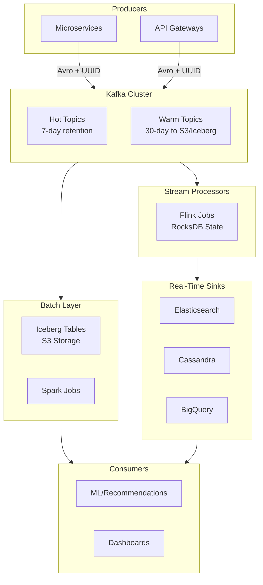
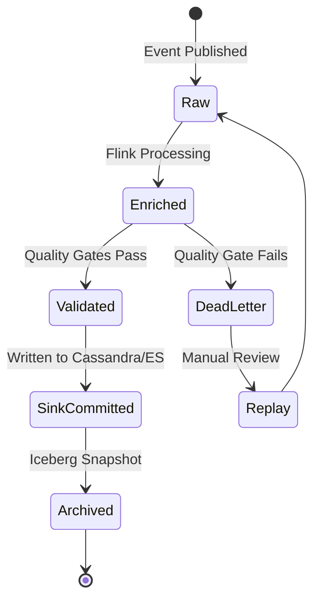
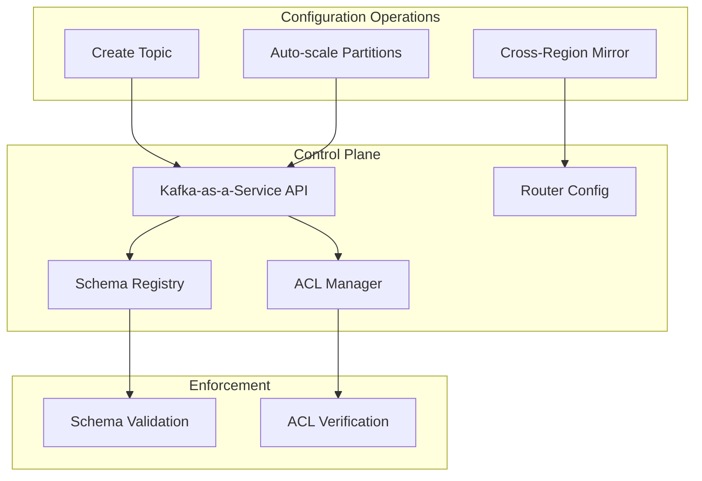
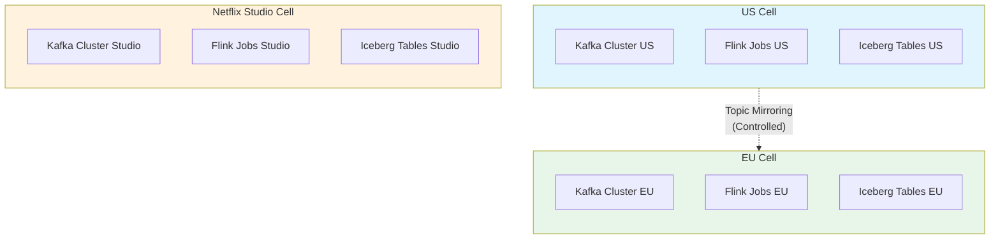
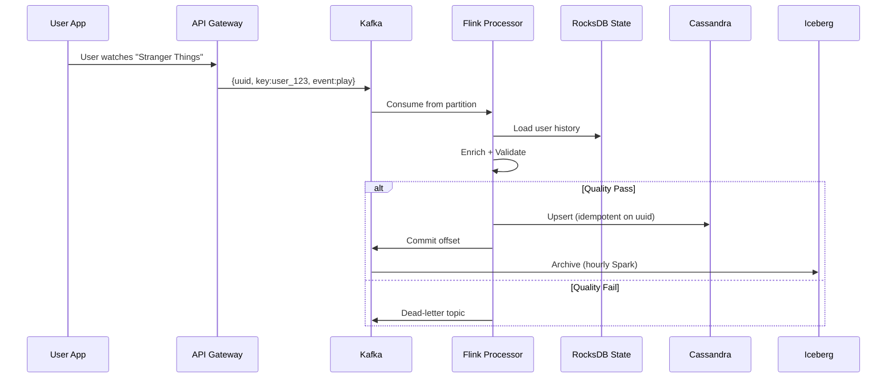
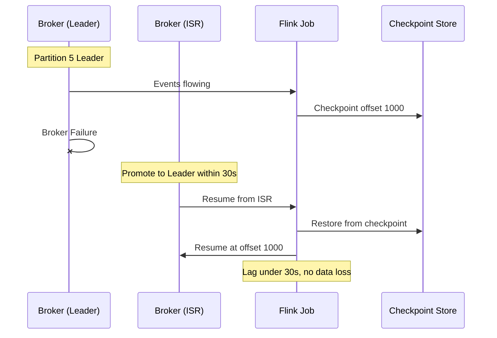
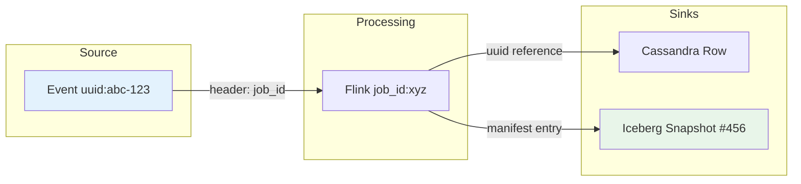
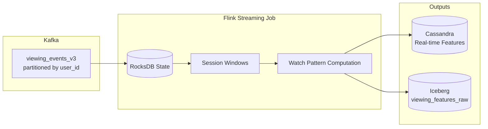

# Data Pipeline at Netflix: Batch + Streaming Architecture

Netflix's data platform unifies **batch** (hourly/daily Spark jobs on S3/Iceberg) and **streaming** (Kafka as durable ingestion backbone with Flink for real-time processing) into a cell-based, multi-region mesh. This architecture powers real-time recommendations, content analytics, and operational monitoring at massive scale.

> **Why This Matters for TPMs**
>
> Netflix's architecture demonstrates data mesh principles at scale: domain teams own pipelines and topics, while centralized tooling enforces quality and lineage. Understanding this balance is critical for Principal TPM roles.

---

## 1. High-Level Architecture and Data Flow

The platform consists of distinct layers with clear separation of concerns:



### 1.1 Core Components

| Component | Technology | Purpose |
|-----------|------------|---------|
| **Producers** | Microservices, API Gateways | Publish Avro-encoded events |
| **Messaging** | Kafka (3x replication) | Durable event buffer |
| **Stream Processing** | Flink with RocksDB | Real-time transformations |
| **Batch Layer** | Spark on Iceberg | Historical reconciliation |
| **Serving** | Elasticsearch, Cassandra | Real-time queries |

### 1.2 Event Schema

Events follow a standardized schema for consistency and idempotency:

```json
{
  "uuid": "abc-123-def",
  "key": "user_123",
  "schema_version": 1,
  "timestamp": 1674067200000000,
  "payload": "<Avro bytes>"
}
```

| Field | Purpose | Invariant |
|-------|---------|-----------|
| `uuid` | Idempotency key | Unique per event |
| `key` | Partition key (e.g., user_id) | Non-null, determines ordering |
| `timestamp` | Event time in micros | Monotonic per key |
| `schema_version` | Avro schema reference | Registry-validated |

> **Idempotency Design**
>
> The UUID key combined with Flink's exactly-once semantics (RocksDB checkpoints) ensures that events are processed exactly once, even across failures. This is a **one-way door**: partition key choice cannot be changed without full replay.

---

## 2. Event Lifecycle and State Machine

Events progress through a defined state machine from ingestion to archival:



### 2.1 State Definitions

| State | Description | Next Actions |
|-------|-------------|--------------|
| **Raw** | Event received from Kafka | Await Flink processing |
| **Enriched** | Joined with reference data, transformed | Quality validation |
| **Validated** | Passed quality gates | Write to sinks |
| **SinkCommitted** | Persisted to real-time stores | Archive to Iceberg |
| **Archived** | Immutable in Iceberg snapshot | Queryable for ML/analytics |
| **DeadLetter** | Failed quality or processing | Requires investigation |

---

## 3. Control Plane: Configuration and Governance

The control plane manages topic creation, access control, and routing rules. It's built on Kafka Schema Registry plus Netflix's internal Kafka-as-a-Service APIs.



### 3.1 Topic Configuration

Topics are created with standardized settings:

| Parameter | Default | Purpose |
|-----------|---------|---------|
| `partitions` | Auto-scale by throughput | Horizontal scaling |
| `replication_factor` | 3 | Fault tolerance |
| `retention_ms` | Hot: 7d, Warm: 30d→S3 | Cost management |

### 3.2 Cell Isolation Architecture

Netflix implements strict cell isolation to contain failures:



| Isolation Boundary | Purpose |
|-------------------|---------|
| **Region** (US/EU) | Data residency compliance, latency |
| **Tenant** (Studio vs. Streaming) | Blast radius containment |
| **Event Type** | Schema evolution independence |

> **Cross-Region Design**
>
> Cross-region writes are disabled by default. Failover uses topic mirroring, which preserves cell independence while enabling disaster recovery.

### 3.3 CAP/PACELC Trade-offs

Netflix makes explicit trade-off decisions:

| Plane | CAP Choice | Rationale |
|-------|------------|-----------|
| Control Plane | CP (Consistent) | Schema changes block if invalid |
| Data Plane | AP (Available) | Replication lags tolerated for availability |

**Lag SLOs:**
- p95: &lt;1 minute
- p99: &lt;5 minutes

---

## 4. Data Plane: Streaming Hot Path

The data plane handles core ingestion and processing with quality gates and lineage tracking.



### 4.1 Processing Steps

| Step | Component | Operation |
|------|-----------|-----------|
| 1. Ingest | Kafka | Receive keyed event |
| 2. State Load | RocksDB | Retrieve user context |
| 3. Enrich | Flink | Join with reference data |
| 4. Validate | Quality Gates | Check: payload &lt;1MB, freshness &lt;10s |
| 5. Sink | Cassandra/ES | Idempotent write on UUID |
| 6. Archive | Iceberg | Batch snapshot (hourly) |

### 4.2 Quality Gates

Quality validation happens inline in Flink:

| Rule | Threshold | Action on Failure |
|------|-----------|-------------------|
| Payload size | &lt;1MB | Dead-letter |
| Freshness delta | &lt;10s | Dead-letter |
| Schema compliance | Must validate | Dead-letter |
| Business rules | Domain-specific | Alert + continue |

### 4.3 Failure Handling: Partition Failure Example



**Key Metrics:**
- Leader election: &lt;30 seconds
- Flink recovery: From last checkpoint
- Data loss: Zero (replay from offset)

---

## 5. Lineage and Traceability

Lineage is implemented through Kafka headers and Iceberg metadata, enabling end-to-end traceability.



### 5.1 Lineage Queries

Iceberg provides queryable lineage through its metadata:

```sql
SELECT * FROM table_history
WHERE snapshot_id = 456;

SELECT lineage
FROM table_changes
WHERE source_topic = 'plays'
  AND offset > 1000000;
```

### 5.2 Traceability Example

To trace event `uuid:abc-123`:
1. **Kafka Headers** → Find processing job_id
2. **Flink Logs** → Identify transformations applied
3. **Cassandra** → Query row by uuid
4. **Iceberg** → Find snapshot containing the archive

---

## 6. Reliability and SLOs

Netflix defines explicit SLIs, SLOs, and error budgets for the data platform.

### 6.1 Service Level Objectives

| Component | SLI | SLO |
|-----------|-----|-----|
| Control APIs | Latency p95 | &lt;100ms |
| Control APIs | Success rate | 99.99% |
| Streaming lag | p95 | &lt;1 minute |
| Streaming lag | p99 | &lt;5 minutes |
| Quality | Invalid rows | &lt;0.1% |
| Lineage | Completeness | 100% on sinks |
| Batch ETL | Success rate | 99.95% |
| Batch ETL | Freshness p99 | &lt;2 hours |

### 6.2 Error Budget and Actions

**Monthly error budget:** 0.01%

| Budget Burn Rate | Triggered Action |
|-----------------|------------------|
| Normal | Continue operations |
| Elevated (lag/saturation) | Throttle producers (backpressure) |
| High | Add brokers (Atlas auto-scale) |
| Critical | Pause non-critical Flink jobs |
| Exceeded | Freeze schema changes, suspend chaos tests |

### 6.3 Golden Signals

| Signal | Target | Monitoring |
|--------|--------|------------|
| **Latency** | Kafka p99 &lt;10ms enqueue | Atlas dashboards |
| **Traffic** | 1M msg/sec/topic peak | Real-time metrics |
| **Errors** | &lt;0.01% acks_failed | Alert on threshold |
| **Saturation** | CPU &lt;80% | Bin-packing optimization |

> **Chaos Engineering**
>
> Standard chaos scenario: Partition 50% of brokers (kill 1/2 replicas per cell). Verify: &lt;3min leader election, no data loss (replay from offsets), lineage intact.

### 6.4 Chaos Scenarios to Run

| Scenario | Expected Behavior |
|----------|-------------------|
| Partition 50% of Kafka brokers per cell | &lt;3min leader election, no data loss (replay from offsets), lineage intact |
| Corrupt upstream data (e.g., invalid schema or null key fields) | DQ gates reject events, dead-letter for inspection, downstream unaffected |
| Flink checkpoint corruption | Job restarts from last valid checkpoint, at-most minutes of replay, no duplicates to sinks |
| Cross-region replication lag spike | Local cell continues processing, stale data flagged, alerts triggered |
| Schema registry unavailable | Producers buffer or fail-fast, no schema-violating events reach consumers |

### 6.5 MTTR Targets

- Target low MTTR for per-job failures via standardized alerting and comprehensive observability (per-partition lag metrics, consumer group dashboards, targeted alerts)
- Lineage in Iceberg metadata reduces RCA time by quickly identifying "which upstream topic broke and which downstream tables/models are affected"
- Auto-recovery from checkpoints means most Flink job failures self-heal without operator intervention

---

## 7. Compliance and Data Governance

Data residency and privacy requirements significantly influence architecture decisions.

### 7.1 Data Residency

| Requirement | Implementation |
|-------------|----------------|
| EU data stays in EU | Geo-cells with isolated Kafka/Iceberg |
| Cross-border restriction | No cross-region writes by default |
| Audit trail | Control plane logs only (no PII in metrics) |

### 7.2 GDPR Considerations

| Constraint | Architecture Impact |
|------------|---------------------|
| No cross-region lineage queries without consent | Consent flags checked before joins |
| PII protection | Anonymization pre-Kafka |
| Right to erasure | Tombstone events + Iceberg compaction |

---

## 8. Business and Organizational Impact

### 8.1 Cost Optimization (COGS Levers)

| Lever | Savings | Implementation |
|-------|---------|----------------|
| Kafka compaction | 5x hot storage reduction | Delete tombstones |
| Tiered storage | 90% of data >7d to cold | S3/Iceberg |
| Spot Flink tasks | 20% compute savings | Safe after checkpoint |
| Read amplification | Minimized | Proper partitioning |

### 8.2 Mag7 vs. Non-Mag7 Cost Comparison

| Component | Mag7 (Internal) | Non-Mag7 (Vendor) |
|-----------|-----------------|-------------------|
| Kafka | $0.01/GB | $0.10/GB (Confluent) |
| Cross-region egress | Internal | $0.09/GB |
| 1PB cluster/month | ~$50K | ~$200K |
| Ops complexity | Higher | Lower (managed) |

> **Unit Economics**
>
> At Netflix scale, internal platforms provide 4x cost efficiency but require dedicated platform engineering teams. The break-even point for building vs. buying is typically around 100TB/month sustained throughput.

### 8.3 Business Value

| Metric | Impact |
|--------|--------|
| Real-time recommendations | 10% engagement lift |
| Incidents (decoupling benefit) | 50% reduction |
| On-call load | 1 incident/week/team |
| Blast radius | 5% of fleet per incident |

---

## 9. TPM Responsibilities by Level

### 9.1 Senior TPM Focus

| Area | Responsibilities |
|------|-----------------|
| Cell rollouts | Drive regional expansion with zero downtime |
| Flink migrations | Coordinate replay strategies |
| Error budgets | Enforce and report on burn rates |
| Cross-team delivery | Align producers with mesh owners |

### 9.2 Principal TPM Focus

| Area | Responsibilities |
|------|-----------------|
| Lineage platform | Multi-year roadmap for Iceberg-native lineage |
| Multi-region federation | Cross-cell consistency strategy |
| Build vs. buy | Vendor trade-offs at 10PB scale |
| Data mesh evolution | Domain ownership metrics and governance |

---

## 10. Trade-off Decision Matrix

| Decision | Latency | Cost | Complexity | Blast Radius |
|----------|---------|------|------------|--------------|
| Kafka partitioning (user_id key) | Low | Low | Medium | Low |
| Flink exactly-once vs. at-least-once | Medium | Medium | High | Low |
| Topic retention 7d vs. 90d | N/A | High (long) | Low | Low |
| Multi-region active-active | Low | High | High | Medium |
| Batch reconciliation on streaming | High | Low | Medium | Low |
| Vendor Kafka (non-Mag7) | Medium | High | Low | Low |
| Inline quality gates | Medium | Low | Medium | Low |
| Iceberg for lineage | Low | Medium | High | Low |

---

## 11. Example Flow: Real-Time Recommendation Feature Pipeline

Walk one concrete flow like you'd in an interview.

**Scenario:** Add a new recommendation feature "watch_pattern_affinity" that combines real-time viewing signals with historical preference aggregates, deployed with lineage and DQ in a multi-region cell setup.

### 11.1 Event Production

Playback service emits `viewing_events` with fields including `user_id`, `content_id`, `timestamp`, `watch_duration`, `device_type` into Kafka topic `viewing_events_v3`.

### 11.2 Streaming Feature Job



A Flink job consumes `viewing_events_v3` partitioned by `user_id`, maintains session windows in RocksDB to compute real-time watch patterns. Outputs written to Cassandra (online serving) and Iceberg (batch processing).

### 11.3 Batch Aggregation

Hourly Spark job consumes `viewing_features_raw` from Iceberg to build curated `user_preference_features` table partitioned by `snapshot_date`, `region`, with DQ tests for completeness, schema validation, and value ranges. Iceberg metadata records full lineage from source topics.

### 11.4 ML Training and Deployment

Recommendation models consume both real-time features from Cassandra and historical features from Iceberg. Training jobs run on Spark, with model artifacts versioned and deployed to serving infrastructure. Online scoring reads from both feature stores.

### 11.5 DQ and SLA Enforcement

- **Freshness SLO:** `user_preference_features` must be available within T+2 hours
- **Completeness SLO:** &gt;99.5% of expected user segments present
- On SLO breach: Recommendation service falls back to cached/default features; alert triggered

### 11.6 Failure Scenario (Chaos-Engineering Style)

**Inject:** Kill 50% of Kafka brokers in EU cell during peak viewing hours.

**Expected Behavior:**
- Leader election completes within 3 minutes
- Flink jobs restore from last checkpoint, replay from committed offsets
- No data loss or duplication (exactly-once with RocksDB + checkpoint coordination)
- US cell completely unaffected (cell isolation)
- Lineage remains intact; downstream consumers see brief lag but no invalid data

---

## 12. How a Senior vs Principal TPM Should Operate Here

### 12.1 Senior TPM Scope

**Owns a slice:** e.g., "Viewing analytics pipeline migration from batch to streaming in EU and US cells."

| Responsibility | Deliverables |
|---------------|--------------|
| Drive explicit SLOs | Documented freshness, quality, and availability targets |
| Cell rollouts | Regional expansion with zero-downtime migration |
| Flink migrations | Coordinate replay strategies and checkpoint validation |
| Error budgets | Enforce and report on burn rates per cell |
| Cross-team delivery | Align producers with mesh owners |

### 12.2 Principal TPM Scope

**Owns the multi-year roadmap:** Data mesh evolution, Iceberg-native lineage platform, and cross-cell federation strategy.

| Responsibility | Deliverables |
|---------------|--------------|
| Lineage platform | Multi-year roadmap for Iceberg-native lineage |
| Multi-region federation | Cross-cell consistency strategy and SLOs |
| Build vs. buy | Vendor trade-offs at 10PB+ scale |
| Data mesh evolution | Domain ownership metrics and governance framework |
| P&L accountability | COGS optimization targets and time-to-value metrics |

### 12.3 Interview Readiness

For interviews, you should be ready to:
- **Articulate the data mesh architecture** with domain ownership and central platform services
- **Walk through a cell-level failure** with timeline, decisions, and recovery
- **Quantify impact** in terms of:
  - Error-budget burn (e.g., "15 minutes of p99 lag breach = 5% monthly budget")
  - Engagement lift from real-time recommendations (10% attributed improvement)
  - COGS savings from tiered storage and proper compaction
  - Blast-radius containment metrics (5% of fleet per incident)

---

## Key Takeaways

> **Data Mesh at Scale**
>
> Netflix demonstrates that data mesh works at scale when you combine domain team ownership (pipelines, topics) with centralized platform capabilities (quality gates, lineage, schema registry).

> **Cell-Based Isolation**
>
> Strict cell boundaries by region and tenant contain failures and enable compliance. Cross-region communication is deliberately constrained and explicitly designed rather than accidental.

> **North Star Metric**
>
> p95 end-to-end freshness &lt;1 minute for 99% of critical events (recommendations, metrics). This single metric drives architecture decisions across the stack.

> **Cost Consciousness**
>
> At Mag7 scale, internal platforms are 4x more cost-effective than vendors. But this requires dedicated platform engineering investment. Know your break-even point.
