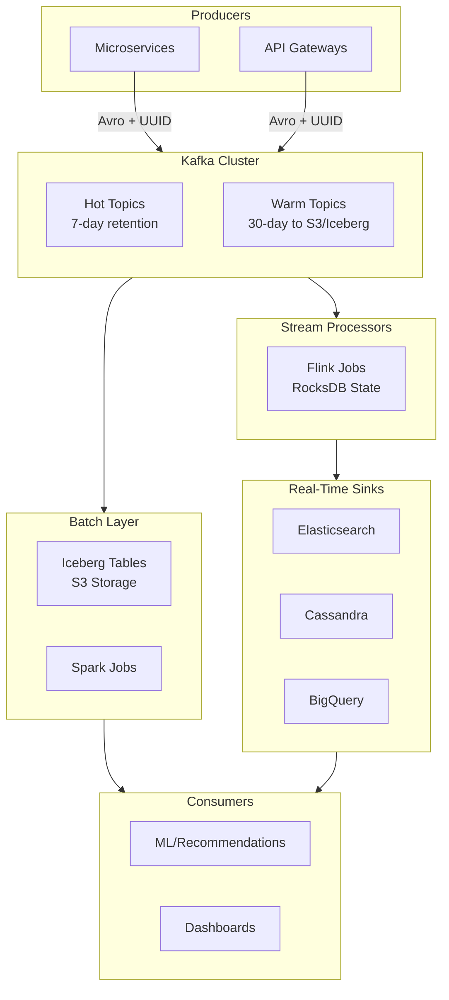
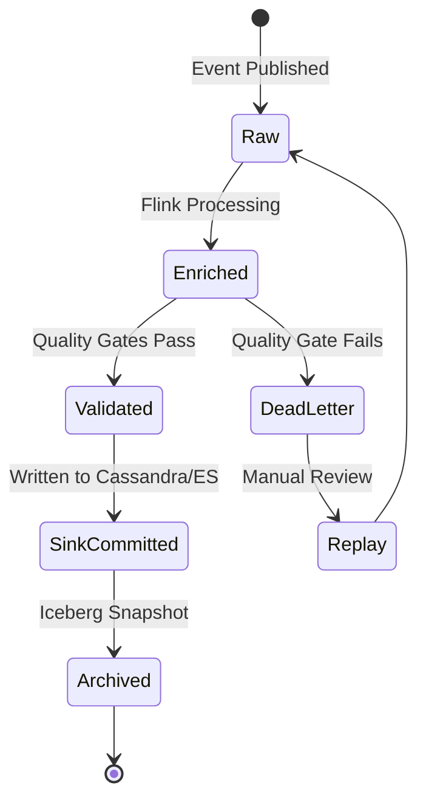
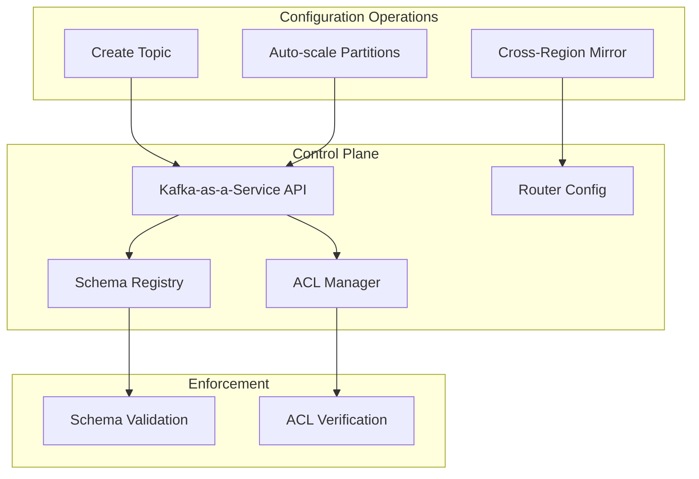
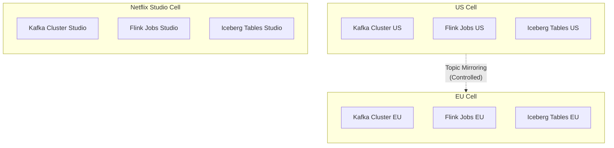
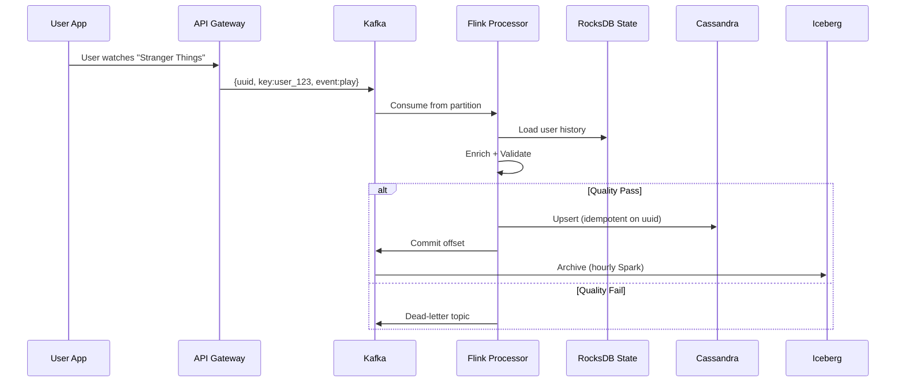
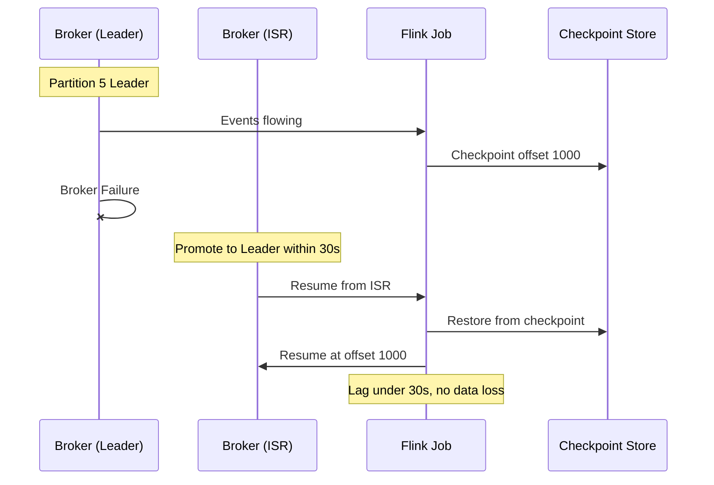
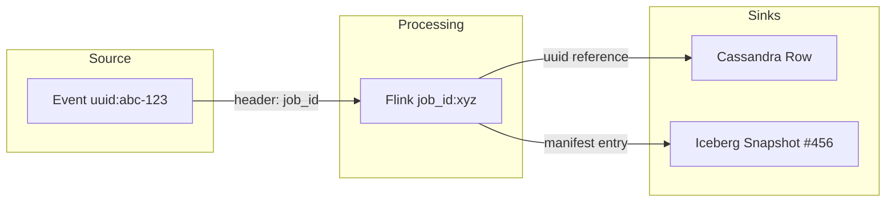
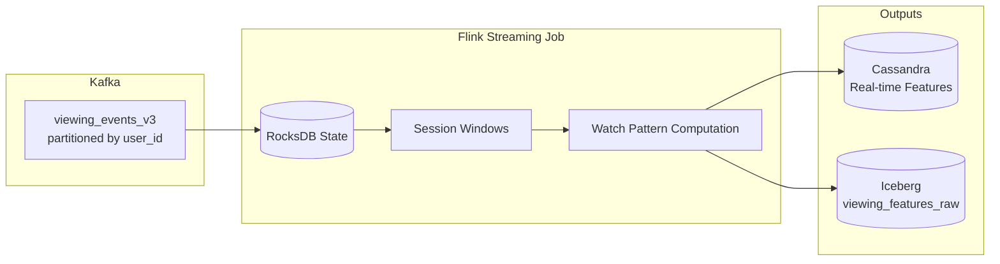

# Data Pipeline at Netflix: Batch + Streaming Architecture

## Why This Matters

Netflix processes petabytes of data daily—viewing events, recommendation signals, A/B test results, and operational metrics. Understanding their architecture matters for TPMs because:

1. **It's a data mesh reference implementation.** Netflix demonstrates how domain teams can own their pipelines while centralized platforms enforce quality and lineage.
2. **It unifies batch and streaming.** The same data flows through both paths, with explicit trade-offs for latency vs. correctness.
3. **Cell-based isolation is real.** Regional cells contain failures and enable compliance, not just theoretically but in production practice.

This document covers Netflix's data platform architecture: Kafka as the durable ingestion backbone, Flink for real-time processing, Iceberg for batch analytics, and the governance layer that ties it together.

---

## 1. The Core Challenge: Real-Time and Historical Data Together

**The problem:** Netflix needs both real-time signals (what is this user watching right now?) and historical aggregates (what has this user watched over 6 months?). These have fundamentally different latency requirements, but the data must be consistent between them.

**The solution:** A unified architecture where events flow through Kafka → Flink → sinks (real-time) AND Kafka → Iceberg (batch), with the same schema and quality gates applied to both paths.



### 1.1 Core Components

| Component | Technology | Purpose |
|-----------|------------|---------|
| **Producers** | Microservices, API Gateways | Publish Avro-encoded events with UUIDs |
| **Messaging** | Kafka (3x replication) | Durable event buffer, 7-30 day retention |
| **Stream Processing** | Flink with RocksDB | Real-time transformations, windowing, joins |
| **Batch Layer** | Spark on Iceberg | Historical reconciliation, ML feature computation |
| **Serving** | Elasticsearch, Cassandra | Real-time queries for recommendations |

### 1.2 Event Schema

Every event follows a standardized schema for consistency and idempotency:

```json
{
  "uuid": "abc-123-def",
  "key": "user_123",
  "schema_version": 1,
  "timestamp": 1674067200000000,
  "payload": "<Avro bytes>"
}
```

| Field | Purpose | Invariant |
|-------|---------|-----------|
| `uuid` | Idempotency key | Unique per event—enables exactly-once semantics |
| `key` | Partition key (e.g., user_id) | Non-null, determines ordering within partition |
| `timestamp` | Event time in micros | Used for windowing and late data handling |
| `schema_version` | Avro schema reference | Registry-validated before publish |

> **One-Way Door:** Partition key choice cannot be changed without full replay. Choose based on query patterns and cardinality.

---

## 2. Event Lifecycle: From Ingestion to Archive

**The problem:** How do you track what happened to an event from the moment it was produced through processing, validation, sink writes, and archival? When something goes wrong, you need to trace the full path.

**The solution:** An explicit state machine for events, combined with lineage tracking through Kafka headers and Iceberg metadata.



| State | Description | Next Actions |
|-------|-------------|--------------|
| **Raw** | Event received from Kafka | Await Flink processing |
| **Enriched** | Joined with reference data, transformed | Quality validation |
| **Validated** | Passed quality gates | Write to sinks |
| **SinkCommitted** | Persisted to real-time stores | Archive to Iceberg |
| **Archived** | Immutable in Iceberg snapshot | Queryable for ML/analytics |
| **DeadLetter** | Failed quality or processing | Requires investigation |

---

## 3. Control Plane: Governance Without Slowing Down Teams

**The problem:** With hundreds of domain teams producing data, how do you maintain quality and consistency without becoming a bottleneck? You need governance, but you can't have a central team reviewing every schema change.

**The solution:** Automated enforcement through Schema Registry, self-service topic creation via Kafka-as-a-Service APIs, and ACLs that encode organizational boundaries.



### 3.1 Topic Configuration

Topics are created with standardized settings:

| Parameter | Default | Purpose |
|-----------|---------|---------|
| `partitions` | Auto-scale by throughput | Horizontal scaling |
| `replication_factor` | 3 | Fault tolerance |
| `retention_ms` | Hot: 7d, Warm: 30d→S3 | Cost management |

### 3.2 Schema Registry as Quality Gate

Before any event reaches Kafka, the Schema Registry validates:
- Schema compatibility (backward/forward as configured)
- Required fields present
- Field types match

If validation fails, the producer gets an immediate error—bad data doesn't enter the system.

### 3.3 CAP/PACELC Trade-offs

In distributed systems, **CP** (Consistency-Partition tolerance) means the system rejects requests rather than return stale data during failures; **AP** (Availability-Partition tolerance) means the system stays available, accepting eventual consistency.

Netflix makes explicit choices:

| Plane | CAP Choice | Rationale |
|-------|------------|-----------|
| Control Plane | CP (Consistent) | Schema changes block if invalid |
| Data Plane | AP (Available) | Replication lag tolerated for availability |

**Lag SLOs:**
- p95: &lt;1 minute
- p99: &lt;5 minutes

---

## 4. Cell-Based Architecture: Isolation That Actually Works

**The problem:** A failure in one region shouldn't affect another. A runaway job in Studio (content production) shouldn't impact Streaming (user-facing recommendations). But how do you actually achieve this isolation?

**The solution:** Strict cell boundaries with complete Kafka/Flink/Iceberg stacks per cell. Cross-cell communication is controlled and explicit—never accidental.



| Isolation Boundary | Purpose |
|-------------------|---------|
| **Region** (US/EU) | Data residency compliance, latency optimization |
| **Tenant** (Studio vs. Streaming) | Blast radius containment for different business units |
| **Event Type** | Schema evolution independence |

> **Cross-Region Design:** Cross-region writes are disabled by default. Failover uses topic mirroring, which preserves cell independence while enabling disaster recovery.

---

## 5. Data Plane: The Streaming Hot Path

**The problem:** Processing millions of events per second with quality gates, enrichment, and exactly-once delivery is hard. How do you do this while maintaining low latency?

**The solution:** Flink with RocksDB state, idempotent sinks keyed by UUID, and inline quality validation that routes failures to dead-letter topics.



### 5.1 Processing Steps

| Step | Component | Operation |
|------|-----------|-----------|
| 1. Ingest | Kafka | Receive keyed event |
| 2. State Load | RocksDB | Retrieve user context |
| 3. Enrich | Flink | Join with reference data |
| 4. Validate | Quality Gates | Check: payload &lt;1MB, freshness &lt;10s |
| 5. Sink | Cassandra/ES | Idempotent write on UUID |
| 6. Archive | Iceberg | Batch snapshot (hourly) |

### 5.2 Quality Gates

Quality validation happens inline in Flink:

| Rule | Threshold | Action on Failure |
|------|-----------|-------------------|
| Payload size | &lt;1MB | Dead-letter |
| Freshness delta | &lt;10s | Dead-letter |
| Schema compliance | Must validate | Dead-letter |
| Business rules | Domain-specific | Alert + continue |

### 5.3 Exactly-Once Semantics

**The problem:** In distributed systems, you have three delivery guarantee options: at-most-once (may lose data), at-least-once (may duplicate), exactly-once (hard to achieve).

**Netflix's approach:** At-least-once delivery with idempotent sinks.

1. **Flink uses checkpointing** to ensure exactly-once processing *internally*
2. **Kafka consumers use at-least-once** semantics—on failure, events may replay
3. **Sinks are idempotent**—writes keyed by UUID; duplicates are ignored (upsert)

**The outcome:** No lost data, no duplicate business effects. The system achieves "effectively exactly-once" from the user's perspective without the latency overhead of distributed transactions.

### 5.4 Failure Handling



**Recovery metrics:**
- Leader election: &lt;30 seconds
- Flink recovery: From last checkpoint
- Data loss: Zero (replay from offset)

---

## 6. Lineage and Traceability

**The problem:** When a downstream model produces bad recommendations, how do you trace back to find which upstream data was the cause? With hundreds of pipelines, this is needle-in-haystack territory.

**The solution:** Lineage tracking through Kafka headers, Flink job metadata, and Iceberg's built-in snapshot history.



### 6.1 Lineage Queries

Iceberg provides queryable lineage through its metadata:

```sql
SELECT * FROM table_history
WHERE snapshot_id = 456;

SELECT lineage
FROM table_changes
WHERE source_topic = 'plays'
  AND offset > 1000000;
```

### 6.2 Traceability Example

To trace event `uuid:abc-123`:
1. **Kafka Headers** → Find processing job_id
2. **Flink Logs** → Identify transformations applied
3. **Cassandra** → Query row by uuid
4. **Iceberg** → Find snapshot containing the archive

This reduces RCA time from hours to minutes.

---

## 7. Reliability and SLOs

### 7.1 Service Level Objectives

| Component | SLI | SLO |
|-----------|-----|-----|
| Control APIs | Latency p95 | &lt;100ms |
| Control APIs | Success rate | 99.99% |
| Streaming lag | p95 | &lt;1 minute |
| Streaming lag | p99 | &lt;5 minutes |
| Quality | Invalid rows | &lt;0.1% |
| Lineage | Completeness | 100% on sinks |
| Batch ETL | Success rate | 99.95% |
| Batch ETL | Freshness p99 | &lt;2 hours |

### 7.2 Error Budgets

**Monthly budget:** 0.01%

| Burn Rate | Action |
|-----------|--------|
| Normal | Continue operations |
| Elevated (lag/saturation) | Throttle producers (backpressure) |
| High | Add brokers (auto-scale) |
| Critical | Pause non-critical Flink jobs |
| Exceeded | Freeze schema changes, suspend chaos tests |

### 7.3 Golden Signals

| Signal | Target | Monitoring |
|--------|--------|------------|
| **Latency** | Kafka p99 &lt;10ms enqueue | Atlas dashboards |
| **Traffic** | 1M msg/sec/topic peak | Real-time metrics |
| **Errors** | &lt;0.01% acks_failed | Alert on threshold |
| **Saturation** | CPU &lt;80% | Bin-packing optimization |

### 7.4 Chaos Scenarios

| Scenario | Expected Behavior |
|----------|-------------------|
| Partition 50% of Kafka brokers | &lt;3min leader election, no data loss, lineage intact |
| Corrupt upstream data | DQ gates reject, dead-letter for inspection, downstream unaffected |
| Flink checkpoint corruption | Restart from last valid, minutes of replay, no sink duplicates |
| Cross-region replication lag | Local cell continues, stale data flagged, alerts triggered |
| Schema registry unavailable | Producers buffer or fail-fast, no invalid events reach consumers |

### 7.5 MTTR Targets

- Low MTTR via standardized alerting and comprehensive observability
- Lineage reduces RCA time: quickly identify "which upstream broke which downstream"
- Auto-recovery from checkpoints—most Flink failures self-heal

---

## 8. Compliance and Data Governance

### 8.1 Data Residency

| Requirement | Implementation |
|-------------|----------------|
| EU data stays in EU | Geo-cells with isolated Kafka/Iceberg |
| Cross-border restriction | No cross-region writes by default |
| Audit trail | Control plane logs (no PII in metrics) |

### 8.2 GDPR Considerations

| Constraint | Architecture Impact |
|------------|---------------------|
| Cross-region lineage queries | Consent flags checked before joins |
| PII protection | Anonymization pre-Kafka |
| Right to erasure | Tombstone events + Iceberg compaction |

---

## 9. Business and Cost Impact

### 9.1 COGS Optimization

| Lever | Savings | Implementation |
|-------|---------|----------------|
| Kafka compaction | 5x hot storage reduction | Delete tombstones |
| Tiered storage | 90% of data >7d to cold | S3/Iceberg |
| Spot Flink tasks | 20% compute savings | Safe after checkpoint |
| Read amplification | Minimized | Proper partitioning |

### 9.2 Mag7 vs Non-Mag7 Economics

| Component | Mag7 (Internal) | Non-Mag7 (Vendor) |
|-----------|-----------------|-------------------|
| Kafka | $0.01/GB | $0.10/GB (Confluent) |
| Cross-region egress | Internal | $0.09/GB |
| 1PB cluster/month | ~$50K | ~$200K |
| Ops complexity | Higher | Lower (managed) |

> **Unit Economics:** At Netflix scale, internal platforms are 4x more cost-effective than vendors. Break-even point: ~100TB/month sustained throughput.

### 9.3 Business Value

| Metric | Impact |
|--------|--------|
| Real-time recommendations | 10% engagement lift |
| Incidents (decoupling benefit) | 50% reduction |
| On-call load | 1 incident/week/team |
| Blast radius | 5% of fleet per incident |

---

## 10. Trade-Off Matrix

| Decision | Latency | Cost | Complexity | Blast Radius |
|----------|---------|------|------------|--------------|
| Kafka partitioning (user_id key) | Low | Low | Medium | Low |
| Flink exactly-once vs at-least-once | Medium | Medium | High | Low |
| Topic retention 7d vs 90d | N/A | High (long) | Low | Low |
| Multi-region active-active | Low | High | High | Medium |
| Batch reconciliation on streaming | High | Low | Medium | Low |
| Vendor Kafka (non-Mag7) | Medium | High | Low | Low |
| Inline quality gates | Medium | Low | Medium | Low |
| Iceberg for lineage | Low | Medium | High | Low |

---

## 11. Example Flow: Real-Time Recommendation Feature

**Scenario:** Add a new recommendation feature "watch_pattern_affinity" combining real-time viewing with historical preferences.

### 11.1 Event Production

Playback service emits `viewing_events` with user_id, content_id, timestamp, watch_duration, device_type to Kafka topic `viewing_events_v3`.

### 11.2 Streaming Feature Job



Flink job:
- Consumes `viewing_events_v3` partitioned by `user_id`
- Maintains session windows in RocksDB
- Outputs to Cassandra (online serving) and Iceberg (batch)

### 11.3 Batch Aggregation

Hourly Spark job:
- Consumes `viewing_features_raw` from Iceberg
- Builds curated `user_preference_features` table
- DQ tests: completeness, schema validation, value ranges
- Iceberg metadata records full lineage

### 11.4 SLA Enforcement

- **Freshness SLO:** Features available within T+2 hours
- **Completeness SLO:** >99.5% of expected user segments present
- On breach: Recommendation service falls back to cached/default features

### 11.5 Failure Scenario (Chaos Test)

**Inject:** Kill 50% of Kafka brokers in EU cell during peak viewing.

**Expected:**
- Leader election &lt;3 minutes
- Flink restores from checkpoint, replays from committed offsets
- No data loss or duplication
- US cell completely unaffected
- Lineage intact; downstream sees brief lag, no invalid data

---

## 12. Role-Specific Focus

### 12.1 Senior TPM Scope

**Owns a slice:** "Viewing analytics pipeline migration from batch to streaming."

| Responsibility | Deliverables |
|---------------|--------------|
| Drive explicit SLOs | Documented freshness, quality, availability targets |
| Cell rollouts | Regional expansion with zero-downtime migration |
| Flink migrations | Coordinate replay strategies, checkpoint validation |
| Error budgets | Enforce and report burn rates per cell |
| Cross-team delivery | Align producers with mesh owners |

### 12.2 Principal TPM Scope

**Owns the multi-year roadmap:** Data mesh evolution, Iceberg-native lineage platform.

| Responsibility | Deliverables |
|---------------|--------------|
| Lineage platform | Multi-year roadmap for Iceberg-native lineage |
| Multi-region federation | Cross-cell consistency strategy and SLOs |
| Build vs. buy | Vendor trade-offs at 10PB+ scale |
| Data mesh evolution | Domain ownership metrics and governance framework |
| P&L accountability | COGS optimization targets |

### 12.3 Interview Readiness

Be ready to:
- **Articulate data mesh architecture** with domain ownership and central platform services
- **Walk through a cell-level failure** with timeline, decisions, and recovery
- **Quantify impact:**
  - Error-budget burn (e.g., "15 minutes of p99 lag breach = 5% monthly budget")
  - Engagement lift from real-time recommendations (10% attributed)
  - COGS savings from tiered storage
  - Blast radius containment (5% of fleet per incident)

---

## Key Takeaways

> **Data Mesh at Scale:** Netflix demonstrates that data mesh works when you combine domain team ownership (pipelines, topics) with centralized platform capabilities (quality gates, lineage, schema registry).

> **Cell-Based Isolation:** Strict cell boundaries by region and tenant contain failures. Cross-region communication is deliberate, not accidental.

> **At-Least-Once + Idempotent Sinks:** Achieves "effectively exactly-once" without distributed transaction overhead. UUID-keyed upserts handle duplicates.

> **Lineage Reduces RCA Time:** When downstream breaks, Iceberg metadata quickly identifies which upstream topic and offset range caused the problem.

> **Cost Consciousness:** At Mag7 scale, internal platforms are 4x more cost-effective than vendors—but require dedicated platform engineering investment.
