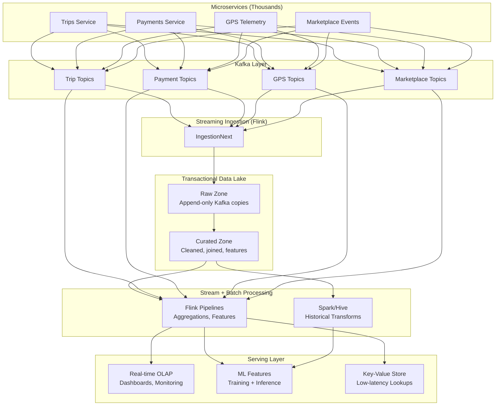
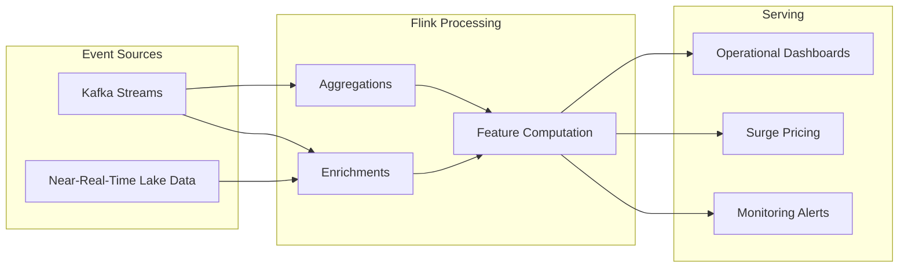
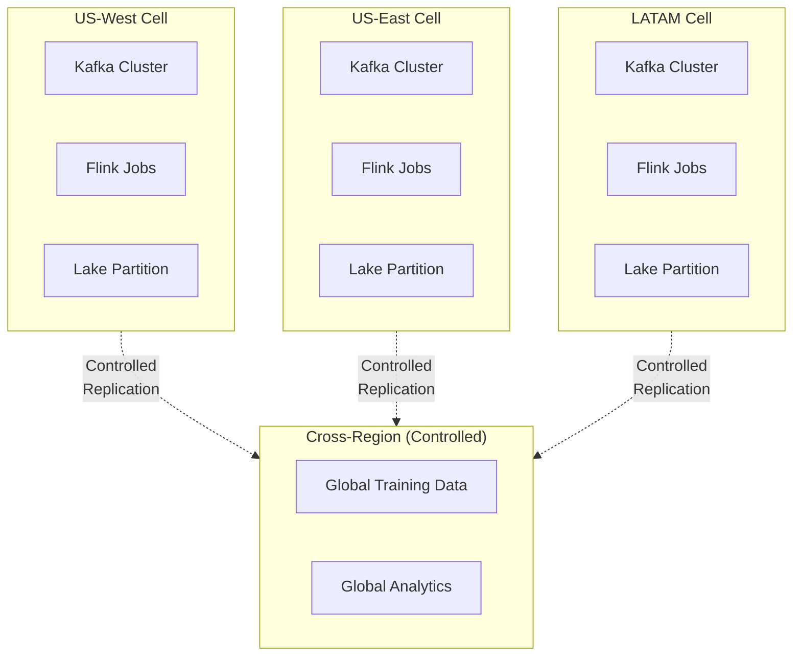
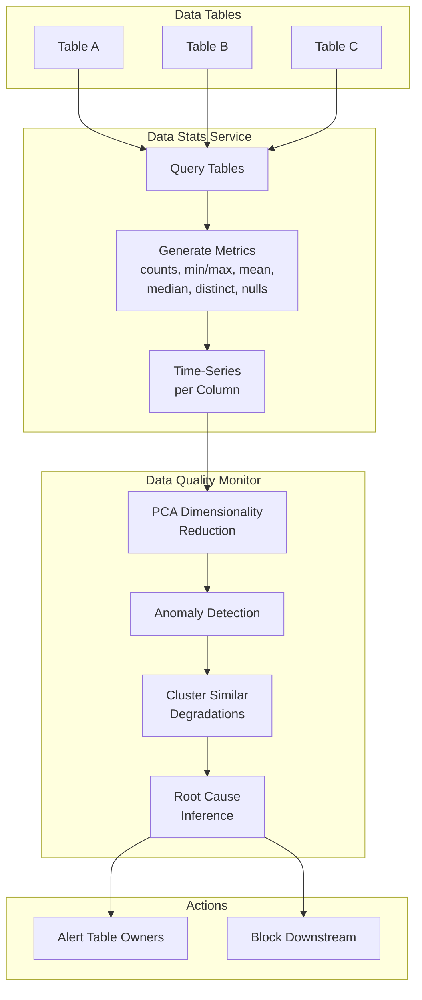
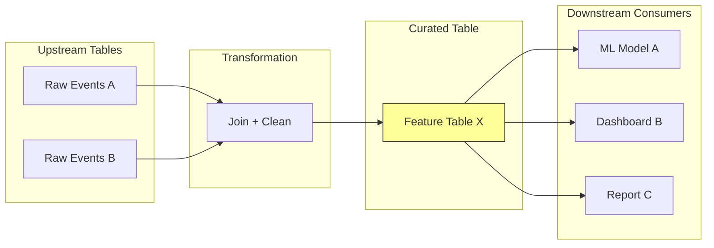
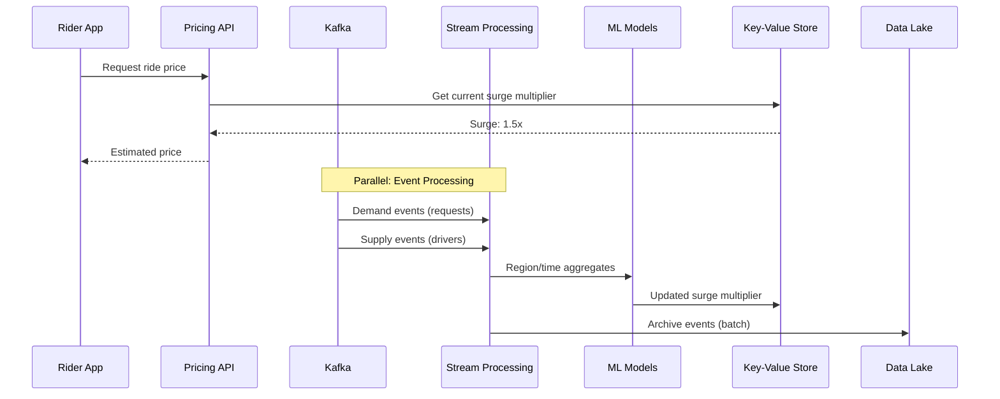
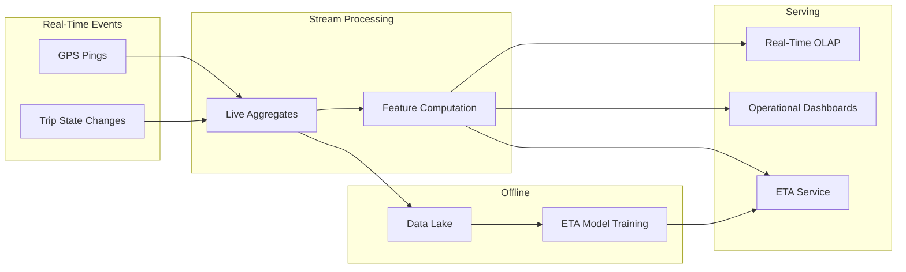
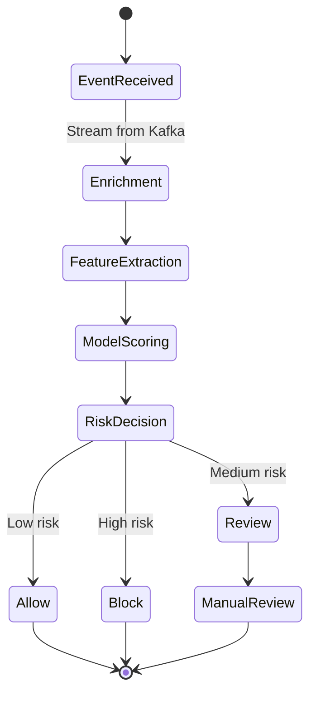
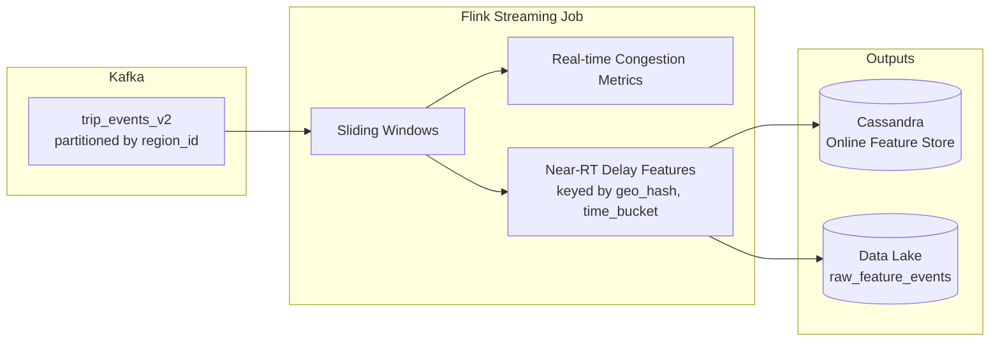

# Data Pipeline at Uber: Batch + Streaming Architecture

Uber's data platform is a converged **batch + streaming lake** with a strong control plane, statistical data quality monitoring, and comprehensive lineage tracking. This infrastructure powers mission-critical real-time use cases including dynamic pricing, ETA prediction, and fraud detection.

> **Why This Matters for TPMs**
>
> Every Mag7 TPM touches data platform decisions. Understanding Uber's architecture gives you the vocabulary and mental models for batch/streaming trade-offs, data quality at scale, and lineage-driven impact analysis.

---

## 1. Core Architecture: Batch + Streaming + Lake

At a high level, Uber's platform follows this pattern:

```
Kafka → Flink Streaming Ingestion → Transactional Data Lake (Hive/Parquet) → Batch + Streaming Transforms → OLAP / ML Features
```

All of this is orchestrated by a separate **control plane** that manages job definitions, deployment configs, and SLAs.



### 1.1 Messaging Layer (Data Plane)

Kafka topics receive events from thousands of microservices:
- **Event types:** Trips, GPS pings, payments, marketplace events, app telemetry
- **Partitioning:** By region or city to bound blast radius and enable independent scaling
- **Failover:** Region-independent partition assignment

### 1.2 Streaming Ingestion: IngestionNext

Uber re-platformed ingestion from batch Spark jobs to **Flink streaming**, achieving:

| Metric | Before (Spark Batch) | After (Flink Streaming) |
|--------|---------------------|------------------------|
| Lake freshness | Hours | Minutes |
| Compute cost | Baseline | -25% reduction |
| Semantics | At-least-once | Exactly-once (with dedup) |

> **Key Engineering Decision**
>
> Checkpointing and exactly-once sinks in Flink, plus idempotent writes at the sink, give at-least-once semantics at the edges with dedup downstream. This balances reliability with performance.

### 1.3 Data Lake Architecture

The lake is a **petabyte-scale transactional store** on object storage:

| Zone | Purpose | Characteristics |
|------|---------|----------------|
| Raw Zone | Append-only copies of Kafka events | Immutable, audit trail |
| Curated Zone | Cleaned, joined, feature tables | Business logic applied |

Partitioning follows Hive-style conventions (e.g., by date and region).

### 1.4 Stream Processing and OLAP



- **Real-time processing:** Flink runs rolling metrics and feature computation
- **OLAP:** Real-time analytics for dashboards and operational monitoring

### 1.5 Control Plane

The control plane is explicitly separated from data plane:

| Responsibility | Control Plane | Data Plane |
|---------------|---------------|------------|
| Job lifecycle | ✓ | |
| Config management | ✓ | |
| SLA/SLO definitions | ✓ | |
| Event movement | | ✓ |
| Data transformation | | ✓ |
| Query execution | | ✓ |

---

## 2. Cell-Based Design and Blast Radius

Uber operates as a multi-region platform with regionally deployed data infrastructure. The architecture must scale across geographic regions while preserving local SLAs.



### 2.1 Regional Cells

Each region runs its own independent infrastructure:
- **Kafka clusters** per region
- **Flink jobs** deployed regionally
- **Lake partitions** isolated by geography

This ensures that failures stay **mostly inside that cell**.

### 2.2 Cross-Region Controls

Cross-region replication and consumption is deliberately constrained:
- Real-time infra handles data "multiplication" across regions
- Replication tuned per use case (e.g., global analytics vs. local pricing)
- Core flows like pricing and ETA keep consistency decisions local

> **TPM Decision Framework**
>
> **One-way doors:** Regional cell boundaries, topic partitioning, schema contracts for key event streams. These require careful upfront design.
>
> **Two-way doors:** Flink job topology, deployment strategy. These can be iterated.

---

## 3. Data Quality: DQM, DSS, and Standards

Uber treats data quality as a **statistical and operational problem**, not just schema validation. This is critical at scale where manual inspection is impossible.



### 3.1 Data Stats Service (DSS)

DSS queries any date-partitioned table and generates **time-series metrics per column**:

| Metric Type | Examples |
|-------------|----------|
| Counts | Row count, null count |
| Distribution | Min, max, mean, median |
| Cardinality | Distinct count |
| Quality | Missing values percentage |

This transforms each table into **multivariate time-series** of quality metrics that can be fed to anomaly detection models.

### 3.2 Data Quality Monitor (DQM)

DQM consumes DSS metrics and applies statistical modeling:

1. **PCA** for dimensionality reduction across many columns
2. **Time-series anomaly detection** to identify "destructive anomalies"
3. **Clustering** tables with similar degradations to infer shared upstream issues
4. **Root cause suggestion** based on pipeline topology

> **Why Statistical Quality Matters**
>
> Schema validation catches obvious errors (wrong type, missing field). Statistical monitoring catches subtle drift: a column that gradually becomes 50% null, a mean that shifts unexpectedly, or a distinct count that collapses. These are the silent killers of ML models and dashboards.

### 3.3 Operational Quality Standards

Uber defined **data quality standards** with ambitious targets:
- **100% test coverage** for top-tier datasets
- **Auto-generated tests** using upstream/downstream lineage
- **Tier propagation:** When a dataset is marked "top tier," quality tests update automatically

Two sync models ensure tests stay current:
| Model | Mechanism | Use Case |
|-------|-----------|----------|
| Push | React to metadata change events | Real-time tier changes |
| Pull | Batch refresh of tier lists | Catch-up sync |

---

## 4. Lineage: Metadata Backbone

Uber's lineage service connects tables and columns across upstream and downstream dependencies. It underpins both quality and operational workflows.



### 4.1 Upstream/Downstream Connectivity

Lineage enables critical workflows:
- **Impact analysis:** Which raw tables and columns feed a given curated dataset?
- **Dependency tracking:** Which downstream tables depend on it?
- **Change notification:** When schema changes or quality issues occur, notify all affected downstream owners

### 4.2 Integration with DQM

| Lineage Use | Benefit |
|-------------|---------|
| Bundle related tables | Improve root-cause analysis of anomalies |
| Auto-generate tests | Propagate tests when SLA changes |
| Tier propagation | Enforce "top-tier" standards across graph |

### 4.3 Platform-Level Guarantees

Lineage enables platform-wide policies:

> **Platform Standard**
>
> All top-tier tables must have defined SLAs and quality tests. This is enforced programmatically across thousands of tables using the lineage graph.

**TPM Insight:** Lineage service API and schema are **one-way doors**. They determine how easily you can propagate quality and change impact across the entire data graph. Get this wrong early, and retrofitting is painful.

---

## 5. Use Cases: Pricing, ETA, and Fraud

These three domains demonstrate how Uber's data platform supports real-time, mission-critical workloads with different trade-off profiles.

### 5.1 Dynamic Pricing (Surge)

Dynamic pricing is described as a "highly complex real-time workflow involving multi-stage stream processing pipelines that run various machine learning algorithms along with a fast key-value store."



**Data Flow:**
1. Demand and supply events stream through Kafka
2. Stream processing aggregates by region/time windows
3. ML models compute surge multipliers
4. Results stored in low-latency key-value store
5. Historical events archived to lake for offline ML

> **CAP/PACELC Trade-off**
>
> Pricing needs **low latency and high availability**. They accept eventual consistency within regional cells and rely on batch to reconcile history. This is a classic AP choice on the data plane.

### 5.2 ETA and Operational Analytics

ETA prediction uses real-time analytics and OLAP over streaming data:



**Characteristics:**
- **Latency-sensitive** but tolerant of small amounts of staleness
- Emphasis on **end-to-end freshness** and availability
- Same streaming ingestion → live OLAP → data lake pattern

### 5.3 Fraud Detection (Project RADAR)

Project RADAR is designed for **early fraud detection** using probabilistic models and ML on behavioral signals.



**Architecture:**
- Real-time streaming of payment and behavioral events
- Enrichment in Flink pipelines
- Model scoring for anomaly detection
- Offline data for model training

> **Reliability Priority**
>
> For fraud, **availability and losslessness** matter more than perfect dedup. They run at-least-once ingestion with dedup logic, using both streaming (scoring) and batch (training).

---

## 6. TPM Perspectives and Key Takeaways

For Uber-style implementations, a Mag7-level TPM should be able to articulate:

### 6.1 Control Plane vs. Data Plane

| Component | Plane | Examples |
|-----------|-------|----------|
| Control Plane | Configuration | Ingestion configs, job specs, SLOs, quality rules, lineage |
| Data Plane | Movement | Flink, Kafka, OLAP, data lake |

### 6.2 Cell Isolation and Blast Radius

- Region-partitioned streams and infrastructure
- Failures stay inside a region/tenant
- Explicit multi-region scaling challenges

### 6.3 Batch + Streaming Convergence

| Workload | Approach | Purpose |
|----------|----------|---------|
| Streaming ingestion | Flink | Freshness and cost efficiency |
| Historical transforms | Batch Spark | Large-scale model training |
| Unified serving | Both → Same lake | Consistency across use cases |

### 6.4 Data Quality Frameworks

| Component | Role |
|-----------|------|
| DSS | Statistical metrics per column |
| DQM | Anomaly detection and clustering |
| Quality Standards | Auto-generated tests for top-tier |
| Lineage Integration | Scope determination and propagation |

### 6.5 Interview Narrative Starters

If you need to turn this into interview stories:

1. **"Pricing freshness migration"** - How moving from batch to streaming ingestion improved surge accuracy and reduced costs
2. **"Fraud pipeline data-quality overhaul"** - Implementing DQM to catch model drift before it impacts fraud detection
3. **"Cross-region data consistency"** - Balancing global analytics needs with regional isolation requirements

Each narrative should include clear SLOs, error budgets, and business impact framing.

---

## 7. Reliability, SLOs, and Operations

### 7.1 SLIs/SLOs

| SLI Category | Metric | SLO Target |
|--------------|--------|------------|
| **Ingestion SLI** | p99 "event_time → availability in raw lake" latency per region and tier | 99.9% of Tier-1 events available in lake within 5-10 minutes |
| **Streaming SLI** | p95 end-to-end latency from event in Kafka to updated real-time aggregate/feature | &lt;1-5 seconds for key pricing/ETA/fraud features |
| **Batch SLI** | Success rate and lag for critical daily/hourly jobs | 99.5% of scheduled Tier-1 jobs finish before SLA cut-off |
| **Data Quality SLIs** | Proportion of partitions meeting completeness, validity, and schema tests | SLOs defined per dataset tier |

### 7.2 Error Budgets

**Burned by:** Ingestion lag spikes, streaming job outages, DQ regressions, or misconfigurations causing missing partitions.

**Policy:** If a Tier-1 dataset exceeds error budget (e.g., too many missed freshness SLOs), freeze feature rollout and prioritize reliability work over net-new analytics features.

### 7.3 Golden Signals

| Signal | What to Monitor |
|--------|-----------------|
| **Latency** | Ingestion, streaming jobs, query latency in real-time analytics and Trino/Presto |
| **Traffic** | Events/sec per topic, job throughput, query QPS |
| **Errors** | Job failures, DQ test failures, schema validation failures |
| **Saturation** | Kafka broker utilization, Flink task slots, Spark cluster capacity, lake file counts |

### 7.4 Chaos Scenarios

| Scenario | Expected Behavior |
|----------|-------------------|
| Partial network partition between Kafka and Flink | Verify at-least-once semantics, orderly processing pause, no silent data loss |
| Corrupt upstream data (e.g., null lat/lon for a market) | DQ must detect, lineage must surface impacted downstream artifacts, ETLManager must auto-suspend |
| Region-level control plane outage | Data plane keeps writing to Kafka and pre-configured sinks with limited drift; new pipelines or config changes blocked until recovery |

### 7.5 MTTR

- Target low MTTR for per-job failures via standardized alerting and good observability (per-partition lag metrics, skew-aware autoscaling, targeted alerts)
- Lineage and DQ must reduce RCA time by quickly telling you "which upstream broke and which downstream is affected"

---

## 8. Economics, COGS, and Mag7 vs non-Mag7

Well-run data platforms are **P&L levers, not cost centers**.

### 8.1 COGS Levers

| Category | Optimization Strategy |
|----------|----------------------|
| **Compute** | Bin packing for Spark/Flink clusters; right-size task slots and autoscaling based on per-partition lag. Spot/preemptible instances for non-Tier-1 batch jobs; steady reserved capacity for streaming. |
| **Storage** | Tiered storage in the lake (hot recent data in faster storage, warm/cold in cheaper tiers). Pruning unnecessary snapshots/derived tables, minimizing small files with compaction. |
| **Data Transfer** | Limit cross-region replication to datasets that truly need it; use computed aggregates rather than raw events when possible to shrink transfer volume. |
| **Third-party Services** | In non-Mag7 environments, control cardinality, partitioning, and retention to avoid runaway bills on managed Kafka, Flink, and warehouses. |

### 8.2 Time to Value

- A strong platform (like Uber's Michelangelo) lets ML practitioners go from idea to live model quickly, with lineage, DQ, and orchestration built in
- Declarative pipelines and metadata-driven onboarding (tiering, DQ, SLA) reduce time spent on plumbing per new metric/feature

### 8.3 Mag7 vs non-Mag7

| Aspect | Mag7 | Strong non-Mag7 |
|--------|------|-----------------|
| **Platform Approach** | Build/extend internal platforms (data catalog, DQ, lineage, ML orchestration) with deep integration and cell-based infra | Lean on Snowflake/BigQuery, managed Kafka, Databricks/Flink Cloud; control plane often custom but thin |
| **Investment** | Higher upfront investment, lower marginal cost at scale | Lower upfront, higher marginal at scale |
| **Scale Focus** | Multi-region, exabyte-scale lakes, low-latency cross-plane observability | Strict scoping of Tier-1 vs everything else, aggressive data lifecycle policies |
| **Key Strategy** | Deep vertical integration | Avoid vendor lock-in pathologies |

---

## 9. Trade-off Matrix

| Decision | Latency | Cost | Complexity | Risk |
|----------|---------|------|------------|------|
| Single event stream feeding batch + streaming | Low latency for both paths | Reduced duplication, lower COGS | Higher infra sophistication | Misconfig impacts both paths; strong isolation needed |
| Strong DQ gating for Tier-1 datasets | Higher latency under failures | Prevents expensive bad decisions | Needs rich control plane + tests | Over-triggering incidents possible, but less silent corruption |
| Cell-based regional architecture | Local low latency, cross-cell lag | Some duplication of infra | Requires replication strategy and DR design | Bad config can leak blast radius across cells |
| Streaming-first ingestion (IngestionNext) | Minutes vs hours freshness | Potentially lower long-term compute costs | Higher job management complexity | Misconfigured checkpoints can cause duplicates or gaps |
| Strict schema registry + backwards-compatible evolution | Slightly higher write latency | Avoids downstream breakage costs | Dev friction; need tooling for evolution | If bypassed, lineages and DQ may be invalid |
| Tiered dataset model (Tier-1/2/3) | Focused low latency for critical sets | Optimized monitoring spend | Complexity in classification/governance | Mis-tiering can lead to under/over-protection |
| Cross-region lake replication (HiveSync) | Slightly higher latency for DR reads | Extra storage and network cost | Requires consistency protocols | Misconfig can cause DR staleness or missing partitions |
| Heavy ML platform integration (Michelangelo-style) | Adds small latency in orchestration | Big efficiency gains at scale | High upfront platform complexity | Platform failures can impact many models at once |

---

## 10. Example Flow: Real-Time ETA Feature with Backfill and DQ

Walk one concrete flow like you'd in an interview.

**Scenario:** Add a new ETA feature "historical_delay_score" that uses near-real-time features and offline historical aggregates, deployed in production with provable lineage and DQ in a multi-region cell setup.

### 10.1 Event Production

Trip service emits `trip_events` with fields including `pickup_time`, `pickup_geo_hash`, `driver_id`, and `route_id` into Kafka topic `trip_events_v2`.

### 10.2 Streaming Feature Job



A Flink job consumes `trip_events_v2` by `region_id` partition, maintains sliding windows to compute real-time congestion metrics and near-real-time delay features keyed by `(geo_hash, time_bucket)`. Outputs are written to Cassandra (online) and appended to the data lake (`raw_feature_events`).

### 10.3 Batch Aggregation

Nightly Spark job consumes `raw_feature_events` to build a curated `historical_delay_feature` table partitioned by `event_date`, `region`, `route_id`, with robust DQ tests for volume, ranges, and null rates. Lineage is updated to record that `historical_delay_feature` depends on `trip_events_v2` and `raw_feature_events` via this Spark job.

### 10.4 ML Training and Deployment

Michelangelo offline pipelines train an ETA model using both `historical_delay_feature` and online features, with DAG defined in the ML control plane (Ray/Spark steps, checkpoints). The model is deployed; online data plane handles real-time feature reads and scoring via RPC/streaming jobs.

### 10.5 DQ and SLA Enforcement

ETLManager ensures that `historical_delay_feature`'s freshness SLO (T+30 minutes) and completeness SLO are satisfied before marking it "ready" for model retraining; otherwise, it blocks retrain and alerts. Databook displays lineage; DQ incidents trigger lineage-based blast radius calculation to see which models/dashboards depend on the feature.

### 10.6 Failure Scenario (Chaos-Engineering Style)

**Inject:** Schema change in `trip_events_v2` in us-east only (add/remove field, break contract).

**Expected Behavior:**
- Streaming job fails fast in that cell
- DQ and schema registry reject events or pipelines based on incompatibility
- ETLManager halts related pipelines; DQ marks dependent datasets as "unknown/failed"; on-call is paged
- Pricing/ETA in us-east continue using last-good models/features from previous versions
- Other cells unaffected (blast radius contained)

This is exactly the sort of path you should be able to walk in a TPM interview, with clear mapping of control plane vs data plane and cell boundaries.

---

## 11. How a Senior vs Principal TPM Should Operate Here

### 11.1 Senior TPM Scope

**Owns a slice:** e.g., "Pricing & ETA data platform migration from batch to streaming in two regions."

| Responsibility | Deliverables |
|---------------|--------------|
| Drive explicit SLOs | Documented SLOs for ingestion, streaming, batch |
| Rollout plans | Phased migration with rollback criteria |
| Blast-radius-limited migrations | Region-by-region deployment with isolation |
| DQ + lineage coverage | Quality gates and dependency tracking |
| Backout strategies | Clear rollback procedures for each phase |

### 11.2 Principal TPM Scope

**Owns the multi-year roadmap:** Cell-based data platform evolution, Tier-1 dataset program, and ML platform integration across Mobility/Delivery/Freight.

| Responsibility | Deliverables |
|---------------|--------------|
| One-way door decisions | Event schemas, partitioning, tiering policies, control-plane design |
| Multi-region strategy | Cross-cell replication, DR, consistency models |
| P&L impact | COGS curves, time-to-value for new models |
| Error-budget governance | Fleet-wide error budget policies and escalation |
| Platform roadmap | 3-year vision for data platform evolution |

### 11.3 Interview Readiness

For interviews, you should be ready to:
- **Articulate this architecture** with clear control vs data plane separation
- **Walk through a concrete migration or incident** with timeline and decisions
- **Quantify impact** in terms of:
  - Error-budget burn (e.g., "2 hours of Tier-1 freshness SLO breach = 10% monthly budget")
  - ARR unlocked through faster experimentation/ML
  - COGS savings through better bin packing and storage lifecycle
  - Risk reduction from blast-radius containment

---

## Key Takeaways

> **Architecture Pattern**
>
> Kafka → Flink → Lake → Batch + Stream Processing → OLAP/ML is the canonical pattern for Mag7-scale data platforms. Control plane separation enables independent scaling of configuration vs. data movement.

> **Quality at Scale**
>
> Schema validation is necessary but not sufficient. Statistical monitoring (DSS/DQM) catches the subtle drift that breaks ML models and dashboards. Lineage turns quality from per-table to graph-wide.

> **Trade-off Awareness**
>
> Pricing, ETA, and Fraud all share the same infrastructure but make different CAP/PACELC choices. Understanding these trade-offs is the difference between a Senior TPM (executes) and Principal TPM (designs) answer.
