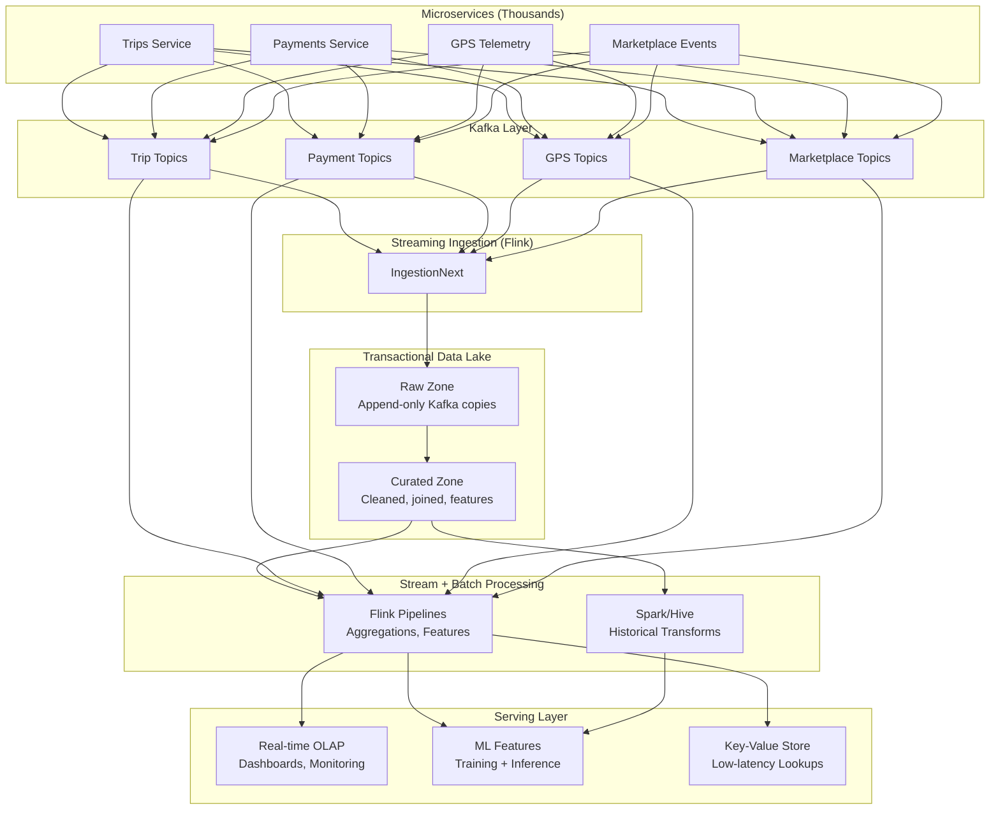
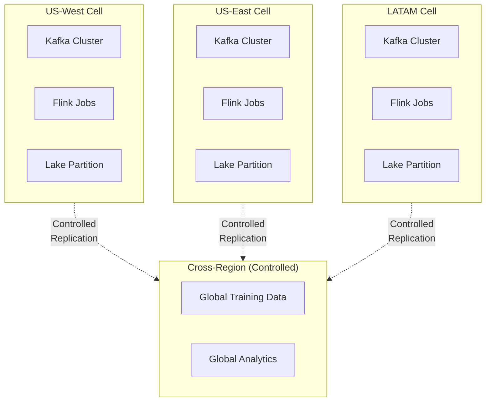
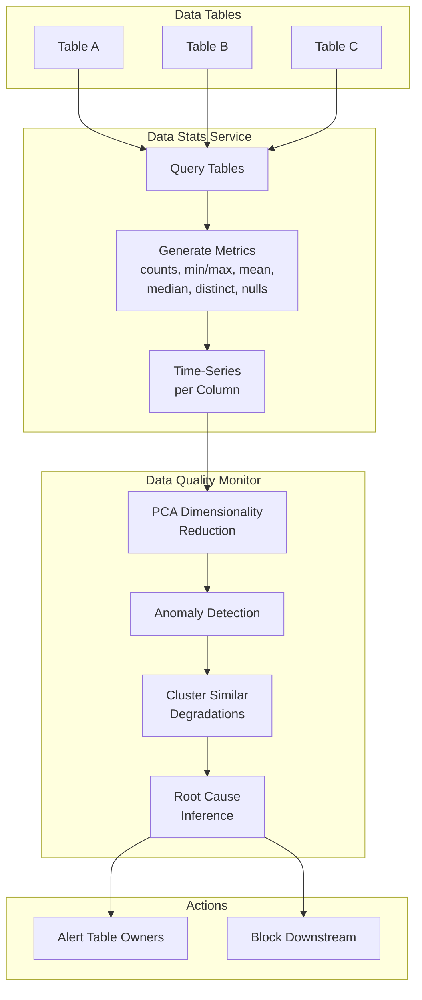
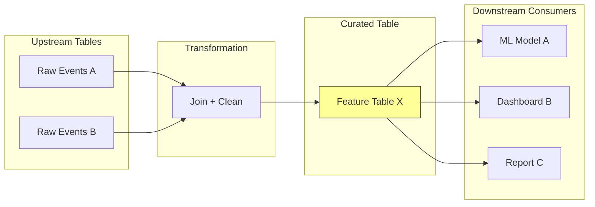
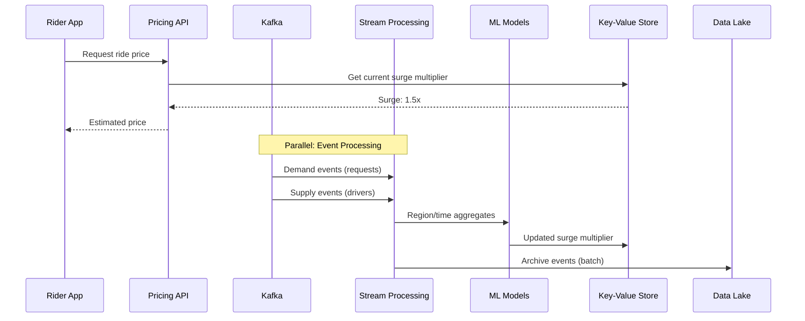
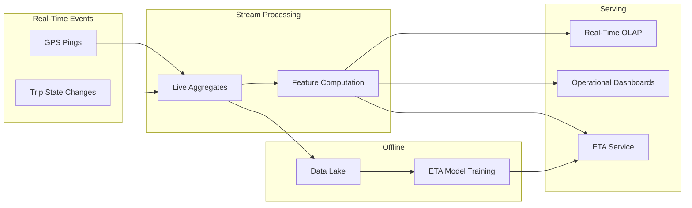
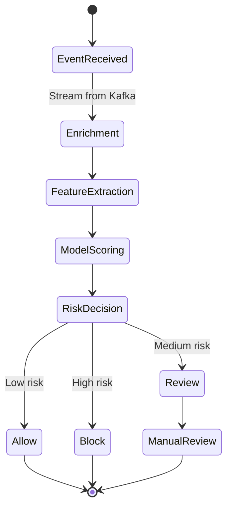
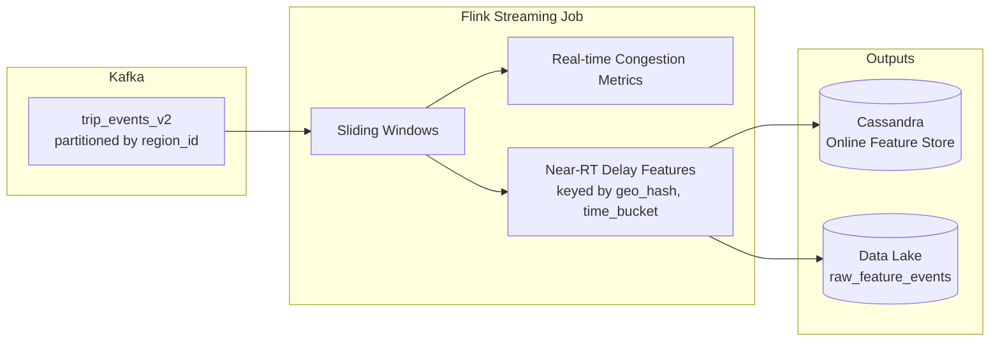

# Data Pipeline at Uber: Batch + Streaming Architecture

## Why This Document Matters

Uber processes billions of events daily across rides, deliveries, and payments. Their data platform must support real-time decisions (pricing in milliseconds), historical analysis (ML model training on months of data), and everything in between. Understanding how they architected this helps you reason about any large-scale data platform.

**For TPM interviews:** Data platform decisions appear in almost every Mag7 system design. This document gives you the vocabulary for batch vs. streaming trade-offs, data quality at scale, and how lineage enables impact analysis. You should be able to walk through this architecture, explain why decisions were made, and apply similar thinking to other domains.

---

## 1. Core Architecture: The Problem and Solution

### 1.1 The Challenge Uber Faced

Uber's original data platform was batch-oriented: collect events, run nightly jobs, produce reports the next day. This worked for analytics but failed for real-time use cases:

- **Pricing (Surge):** Needs to react to demand changes in seconds, not hours
- **ETA Prediction:** Must incorporate live traffic and driver positions
- **Fraud Detection:** Must block suspicious transactions before they complete

The question became: *How do you build one platform that serves both real-time and historical workloads without duplicating infrastructure and creating inconsistent "truths"?*

### 1.2 The Solution: Converged Batch + Streaming

Uber's answer is a unified architecture where the same events flow through both streaming (for real-time) and batch (for historical analysis) paths:

```
Microservices → Kafka → Flink (Streaming) → Data Lake → Batch/Streaming Transforms → Serving (OLAP, ML, APIs)
```

The key insight: **write once to Kafka, consume multiple ways.** Real-time systems read from Kafka directly. Batch systems read from the data lake (which is populated by streaming ingestion). Both paths see the same data.



### 1.3 Why Kafka as the Central Nervous System?

Every event in Uber's ecosystem flows through Kafka first. This provides:

- **Decoupling:** Producers don't need to know who consumes their events
- **Replay:** If a consumer fails, it can replay events from Kafka
- **Multiple consumers:** The same event can feed real-time dashboards, fraud detection, and historical archives

Events are partitioned by region or city. This matters for two reasons:
1. **Performance:** Consumers can scale horizontally by partition
2. **Blast radius:** If one region's data has issues, other regions are unaffected

### 1.4 Streaming Ingestion: From Hours to Minutes

**The problem:** Uber's original ingestion used batch Spark jobs that ran hourly. By the time data reached the lake, it was stale. Real-time use cases couldn't rely on the lake at all—they built their own pipelines, creating duplication and inconsistency.

**The solution:** Replace batch ingestion with Flink streaming jobs (internally called "IngestionNext"). Events flow from Kafka to the lake in minutes instead of hours.

| Metric | Before (Spark Batch) | After (Flink Streaming) |
|--------|---------------------|------------------------|
| Lake freshness | Hours | Minutes |
| Compute cost | Baseline | -25% reduction |
| Data consistency | Multiple "truths" | Single source |

### 1.5 The Delivery Guarantee Trade-off

**The problem:** In distributed systems, you have three delivery guarantee options:

- **At-most-once:** Fire and forget. Fast, but you can lose data.
- **At-least-once:** Retry until acknowledged. No data loss, but you can get duplicates.
- **Exactly-once:** Each message processed exactly once. Hard and expensive to achieve end-to-end.

True exactly-once requires distributed transactions across Kafka, Flink, and the sink (database or lake). This adds latency (waiting for coordination) and complexity (more failure modes).

**Uber's approach:** At-least-once delivery with idempotent sinks.

Here's what this means in practice:

1. **Flink uses checkpointing** to ensure exactly-once processing *internally*. If a job fails, it restarts from the last checkpoint and reprocesses.
2. **Kafka consumers use at-least-once semantics.** If a failure occurs, some events may be replayed.
3. **Sinks are idempotent.** When writing to the lake or database, each record has a unique key. If a duplicate arrives, the sink ignores it (upsert behavior).

**The business outcome:** No lost data, no duplicate business effects. The system achieves "effectively exactly-once" from the user's perspective without the latency tax of distributed transactions.

**TPM framing:** "We chose at-least-once delivery with idempotent sinks over native exactly-once transactions. Our latency SLO required sub-second ingestion. Native exactly-once would have added coordination overhead and introduced Kafka's transaction coordinator as a dependency. By pushing dedup responsibility to the sink layer via idempotent writes keyed by event ID, we maintained our latency SLO while guaranteeing no duplicate business outcomes."

### 1.6 Data Lake Organization

The lake is a petabyte-scale store on object storage (like S3), organized into zones:

| Zone | Purpose | Characteristics |
|------|---------|----------------|
| **Raw Zone** | Exact copies of Kafka events | Append-only, immutable, serves as audit trail |
| **Curated Zone** | Cleaned, joined, feature tables | Business logic applied, ready for consumption |

**Why two zones?** Raw data is your insurance policy—if processing logic has bugs, you can reprocess from raw. Curated data is optimized for consumption—joins are pre-computed, schemas are clean, quality is validated.

Partitioning follows Hive conventions (by date, region, etc.), enabling efficient queries that only scan relevant partitions.

### 1.7 Control Plane vs. Data Plane

Uber explicitly separates these concerns:

| Responsibility | Control Plane | Data Plane |
|---------------|---------------|------------|
| Job definitions, configs, SLOs | ✓ | |
| Schema registry, lineage | ✓ | |
| Event movement | | ✓ |
| Data transformation | | ✓ |
| Query execution | | ✓ |

**Why this matters:** Control plane changes (new job config, updated SLO) shouldn't affect running data flows. Data plane scaling (more Kafka partitions, more Flink workers) shouldn't require control plane changes. This separation enables independent evolution and reduces blast radius.

---

## 2. Cell-Based Architecture: Containing Failures

### 2.1 The Problem: Global Failures

In a naive architecture, all regions share infrastructure. A bug in a Flink job or a Kafka broker failure can affect the entire company. When Uber operates in 70+ countries, this is unacceptable.

### 2.2 The Solution: Regional Cells

Each region runs its own independent infrastructure stack:



**Cell boundaries include:**
- Kafka clusters per region
- Flink jobs deployed regionally
- Lake partitions isolated by geography

**The benefit:** A failure in US-East stays in US-East. LATAM keeps operating. This is the same "cell-based" pattern used by AWS and other hyperscalers for their own infrastructure.

### 2.3 Cross-Region Data Flow

Some use cases need global data (training ML models on worldwide patterns, company-wide analytics). Cross-region replication is deliberately constrained:

- **Replication is explicit and tuned per use case.** Not everything crosses regions.
- **Aggregates preferred over raw events.** Instead of replicating billions of raw GPS pings globally, replicate hourly aggregates.
- **Core real-time flows stay local.** Pricing and ETA decisions use only regional data to avoid cross-region latency.

### 2.4 One-Way vs. Two-Way Doors

**TPM framing for decisions:**

| Decision Type | Examples | Approach |
|--------------|----------|----------|
| **One-way doors** (hard to reverse) | Regional cell boundaries, topic partitioning strategy, event schema contracts | Careful upfront design, stakeholder alignment |
| **Two-way doors** (easy to iterate) | Flink job topology, deployment strategy, specific transformations | Iterate quickly, measure, adjust |

Getting cell boundaries wrong early means painful re-architecture later. Getting a Flink job's window size wrong is a config change.

---

## 3. Data Quality: Beyond Schema Validation

### 3.1 The Problem: Silent Data Corruption

Schema validation catches obvious errors: wrong data type, missing required field. But it misses subtle issues that break downstream systems:

- A column that gradually becomes 50% null
- A mean value that shifts unexpectedly (indicating upstream logic change)
- A distinct count that collapses (deduplication bug upstream)

These "silent killers" corrupt ML models and dashboards without triggering any alerts. By the time someone notices, the damage is done.

### 3.2 The Solution: Statistical Monitoring

Uber treats data quality as a **statistical problem**, not just a schema problem.



### 3.3 Data Stats Service (DSS)

DSS queries tables and generates time-series metrics per column:

| Metric Type | Examples |
|-------------|----------|
| **Counts** | Row count, null count |
| **Distribution** | Min, max, mean, median |
| **Cardinality** | Distinct count |
| **Quality** | Missing values percentage |

This transforms each table into a **multivariate time series** of quality metrics. Instead of looking at data values, you're looking at data *characteristics* over time.

### 3.4 Data Quality Monitor (DQM)

DQM consumes DSS metrics and applies ML to detect anomalies:

1. **Dimensionality reduction (PCA):** A table might have hundreds of columns. PCA reduces this to key patterns.
2. **Anomaly detection:** Statistical models identify when metrics deviate from historical patterns.
3. **Clustering:** When multiple tables degrade simultaneously, they're likely caused by the same upstream issue. Clustering groups related degradations.
4. **Root cause suggestion:** Using lineage (more on this below), DQM suggests which upstream table or pipeline likely caused the issue.

**The outcome:** Instead of "Table X has a problem," you get "Tables X, Y, and Z all degraded at 2pm, likely caused by Pipeline A's schema change."

### 3.5 Tier-Based Quality Standards

Not all data is equally important. Uber classifies datasets into tiers:

| Tier | Characteristics | Quality Requirements |
|------|-----------------|---------------------|
| **Tier 1** | Revenue-critical, regulatory | 100% test coverage, strict SLOs, auto-blocking on failures |
| **Tier 2** | Important internal use | Standard test coverage, alerting |
| **Tier 3** | Exploratory, non-critical | Basic validation |

Quality tests are auto-generated based on lineage. When a dataset is promoted to Tier 1, tests propagate automatically to its upstream dependencies.

---

## 4. Lineage: Knowing What Depends on What

### 4.1 The Problem: Change Impact

You want to change a column in a raw events table. What breaks?

Without lineage, you don't know. You either make the change and hope, or you send emails to every team asking "do you use this?" (and half don't respond).

### 4.2 The Solution: Graph-Based Lineage

Lineage tracks how data flows from source to destination:



### 4.3 What Lineage Enables

| Use Case | How Lineage Helps |
|----------|-------------------|
| **Impact analysis** | Before changing Table A, see all downstream consumers |
| **Root cause analysis** | When Table X has issues, trace back to upstream sources |
| **Change notification** | Automatically notify downstream owners of schema changes |
| **Test propagation** | When a table becomes Tier 1, propagate quality requirements upstream |
| **Cost attribution** | Understand which downstream use cases drive storage/compute costs |

### 4.4 Lineage as a One-Way Door

The lineage service's API and data model are **one-way door decisions**. They determine:

- How easily you can propagate quality requirements across the data graph
- How quickly you can assess change impact
- How automated your incident response can be

Getting lineage right early pays dividends. Retrofitting lineage onto an existing platform is painful because you need to instrument all existing pipelines.

---

## 5. Real-World Use Cases

These three domains show how the same infrastructure supports different trade-off profiles.

### 5.1 Dynamic Pricing (Surge)

**The business problem:** When demand exceeds supply in an area, Uber raises prices to attract more drivers. This must happen in real-time—stale pricing means either lost revenue (prices too low) or angry customers (prices too high).

**The data flow:**



**How it works:**
1. Demand and supply events stream through Kafka
2. Flink aggregates by region and time window (e.g., "requests in last 5 minutes in downtown SF")
3. ML models compute surge multipliers based on supply/demand ratios
4. Results are written to a key-value store for low-latency reads
5. Historical events are archived to the lake for offline model training

**The trade-off choice:** Pricing prioritizes **low latency and high availability** over strong consistency. They accept eventual consistency within regional cells—if two users in the same area see slightly different surge prices for a few seconds, that's acceptable. The system runs at-least-once with dedup and relies on batch processing to reconcile any discrepancies for accounting.

### 5.2 ETA Prediction

**The business problem:** ETA accuracy directly affects customer satisfaction. An estimate that's consistently 5 minutes off makes the app feel unreliable.

**What makes it hard:** ETA depends on:
- Current traffic conditions (real-time)
- Historical patterns (batch—"Tuesdays at 5pm are always slow")
- Driver behavior (real-time—is the driver actually moving?)

**The data flow:**



**The trade-off:** ETA is latency-sensitive but can tolerate small staleness. A prediction based on traffic data that's 30 seconds old is fine. A prediction based on yesterday's data is not.

### 5.3 Fraud Detection (Project RADAR)

**The business problem:** Payment fraud costs money directly (chargebacks) and indirectly (damaged reputation, regulatory scrutiny). Detection must happen *before* the transaction completes.

**What makes it hard:**
- Must make decisions in milliseconds (while the user waits)
- False positives block legitimate transactions (bad UX, lost revenue)
- False negatives let fraud through (direct loss)
- Attackers constantly evolve their tactics

**The approach:**



**The system:**
1. Payment and behavioral events stream through Kafka
2. Flink pipelines enrich events with user history, device fingerprints, etc.
3. ML models score risk in real-time
4. High-risk transactions are blocked or sent to manual review
5. Historical data feeds model retraining

**The trade-off:** For fraud, **availability and data completeness** matter more than perfect deduplication. It's better to score the same transaction twice (idempotent) than to miss one. The system runs at-least-once ingestion with dedup at the scoring layer.

### 5.4 Comparing the Trade-offs

| Dimension | Pricing | ETA | Fraud |
|-----------|---------|-----|-------|
| **Latency requirement** | Seconds | Seconds | Milliseconds |
| **Consistency model** | Eventual | Eventual | At-least-once with dedup |
| **Staleness tolerance** | Minutes | 30 seconds | None |
| **Primary optimization** | Availability | Freshness | Completeness |
| **Failure mode preference** | Show cached price | Show estimate with wider range | Block if uncertain |

**TPM insight:** All three use the same underlying infrastructure but make different choices based on business requirements. Understanding these trade-offs is the difference between a Senior TPM (executes within constraints) and a Principal TPM (defines the constraints).

---

## 6. Reliability, SLOs, and Operations

### 6.1 SLIs and SLOs

The platform defines specific, measurable indicators:

| SLI Category | What It Measures | Typical SLO |
|--------------|------------------|-------------|
| **Ingestion latency** | Time from event creation to availability in lake | 99.9% of Tier-1 events available within 5-10 minutes |
| **Streaming latency** | End-to-end latency from Kafka to updated feature | P95 < 5 seconds for pricing/ETA features |
| **Batch success** | Scheduled jobs completing on time | 99.5% of Tier-1 jobs finish before SLA cutoff |
| **Data quality** | Partitions passing completeness/validity tests | Defined per dataset tier |

### 6.2 Error Budgets

**What burns error budget:**
- Ingestion lag spikes (Kafka consumer falling behind)
- Streaming job outages (Flink job failure)
- Data quality regressions (upstream schema change breaking tests)
- Misconfigurations (wrong partition pruning, missing data)

**Error budget policy:** If a Tier-1 dataset exceeds its monthly error budget (e.g., too many freshness SLO breaches), freeze feature development and prioritize reliability work.

### 6.3 Golden Signals

| Signal | What to Monitor |
|--------|-----------------|
| **Latency** | Ingestion lag, streaming job processing time, query latency |
| **Traffic** | Events/sec per topic, job throughput, query QPS |
| **Errors** | Job failures, DQ test failures, schema validation failures |
| **Saturation** | Kafka broker utilization, Flink task slots, cluster capacity |

### 6.4 Chaos Scenarios

The platform should handle these gracefully:

| Scenario | Expected Behavior |
|----------|-------------------|
| Network partition between Kafka and Flink | Processing pauses, resumes cleanly, no data loss |
| Corrupt upstream data (nulls where not expected) | DQ detects, lineage surfaces impacted downstream, pipelines auto-suspend |
| Regional control plane outage | Data plane keeps running with existing config; new changes blocked until recovery |

### 6.5 MTTR Optimization

**Goal:** Minimize time from "something is wrong" to "problem is fixed."

**How lineage and DQ help:**
- DQ detects the anomaly automatically (no waiting for users to report)
- Lineage immediately shows "which upstream table changed and which downstream systems are affected"
- Automated runbooks can suspend downstream consumers to prevent bad data from spreading

---

## 7. Economics and Cost Management

### 7.1 Why This Matters

A data platform can easily become the largest line item in cloud spend. Well-run platforms are **P&L levers, not cost centers**—they enable faster experimentation, better ML models, and ultimately more revenue.

### 7.2 COGS Optimization Levers

| Category | Optimization Strategy |
|----------|----------------------|
| **Compute** | Right-size Flink/Spark clusters based on actual load. Use spot instances for non-Tier-1 batch jobs. Reserved capacity for steady-state streaming. |
| **Storage** | Tiered storage in the lake (hot/warm/cold). Prune unnecessary snapshots. Compact small files. |
| **Data transfer** | Limit cross-region replication to datasets that truly need it. Replicate aggregates instead of raw events where possible. |
| **Third-party services** | Control cardinality and retention to avoid runaway bills on managed services. |

### 7.3 Mag7 vs. Non-Mag7 Approach

| Aspect | Mag7 (Uber-scale) | Strong non-Mag7 |
|--------|-------------------|-----------------|
| **Platform approach** | Build/extend internal platforms with deep integration | Lean on Snowflake/Databricks/managed services |
| **Investment profile** | Higher upfront, lower marginal cost at scale | Lower upfront, higher marginal at scale |
| **Scale focus** | Multi-region, exabyte-scale, low-latency observability | Aggressive data lifecycle, strict tier scoping |
| **Key strategy** | Deep vertical integration | Avoid vendor lock-in, control costs aggressively |

---

## 8. Trade-off Summary Matrix

| Decision | Latency Impact | Cost Impact | Complexity | Risk |
|----------|---------------|-------------|------------|------|
| **Single stream feeding batch + streaming** | Low latency for both | Reduced duplication | Higher sophistication | Misconfig affects both paths |
| **Strong DQ gating for Tier-1** | Higher latency under failures | Prevents bad decisions downstream | Rich control plane needed | Over-triggering possible |
| **Cell-based regional architecture** | Local low latency | Some infra duplication | DR design required | Bad config can leak across cells |
| **Streaming-first ingestion** | Minutes vs. hours freshness | Lower long-term compute | Higher job complexity | Checkpoint misconfiguration risk |
| **Tiered dataset model** | Focused latency for critical sets | Optimized monitoring spend | Classification governance needed | Mis-tiering causes under/over-protection |

---

## 9. Concrete Example: Adding an ETA Feature

This walkthrough shows how a new feature flows through the entire system—the kind of end-to-end thinking you'd demonstrate in an interview.

**Scenario:** Add "historical_delay_score" to the ETA model, combining real-time features with historical aggregates.

### 9.1 Event Production

Trip service emits `trip_events` with fields: `pickup_time`, `pickup_geo_hash`, `driver_id`, `route_id` to Kafka topic `trip_events_v2`.

### 9.2 Streaming Feature Job



A Flink job:
1. Consumes `trip_events_v2` partitioned by region
2. Maintains sliding windows for real-time congestion metrics
3. Computes delay features keyed by `(geo_hash, time_bucket)`
4. Writes to Cassandra (online serving) and lake (offline training)

### 9.3 Batch Aggregation

Nightly Spark job:
1. Reads `raw_feature_events` from lake
2. Builds curated `historical_delay_feature` table partitioned by date/region/route
3. Runs DQ tests for volume, null rates, value ranges
4. Updates lineage: `historical_delay_feature` depends on `trip_events_v2` via this job

### 9.4 ML Training and Deployment

1. ML pipelines train ETA model using both historical features (batch) and online features (streaming)
2. Model is deployed to production
3. Online serving reads real-time features from Cassandra, historical features from pre-computed tables

### 9.5 DQ and SLA Enforcement

- ETLManager checks that `historical_delay_feature` meets freshness SLO (T+30 minutes) and completeness SLO before marking "ready" for model retraining
- If SLOs fail, retraining is blocked and alerts fire
- DQ incidents trigger lineage-based blast radius calculation

### 9.6 Failure Scenario

**Inject:** Schema change in `trip_events_v2` in us-east only.

**Expected behavior:**
1. Streaming job fails fast in us-east cell
2. Schema registry rejects incompatible events
3. ETLManager halts related pipelines
4. DQ marks dependent datasets as "unknown/failed"
5. On-call is paged with lineage context
6. Pricing/ETA in us-east continue using last-good models
7. Other regions unaffected (blast radius contained)

---

## 10. Senior vs. Principal TPM Scope

### 10.1 Senior TPM Scope

**Owns a slice:** "Migrate pricing data pipeline from batch to streaming in two regions."

| Responsibility | Deliverables |
|---------------|--------------|
| Define SLOs | Documented ingestion, streaming, batch SLOs |
| Plan rollout | Phased migration with rollback criteria |
| Limit blast radius | Region-by-region deployment |
| Ensure quality | DQ gates and lineage coverage |
| Enable backout | Clear rollback procedures per phase |

### 10.2 Principal TPM Scope

**Owns the multi-year roadmap:** Cell-based data platform evolution, Tier-1 dataset program, ML platform integration across all business units.

| Responsibility | Deliverables |
|---------------|--------------|
| One-way door decisions | Event schemas, partitioning strategy, control plane design |
| Multi-region strategy | Cross-cell replication, DR, consistency models |
| P&L impact | COGS curves, time-to-value metrics for new models |
| Error budget governance | Fleet-wide policies and escalation paths |
| Platform roadmap | 3-year vision with investment milestones |

### 10.3 Interview Readiness

You should be able to:

1. **Draw the architecture** with clear control plane vs. data plane separation
2. **Walk through a concrete scenario** (like Section 9) with timeline and decision points
3. **Quantify impact:**
   - Error budget: "2 hours of Tier-1 freshness breach = 10% monthly budget"
   - Business value: "Streaming ingestion enabled surge pricing accuracy improvement worth $Xm/year"
   - COGS: "Moved 40% of batch jobs to spot instances, saving $Xm/year"
   - Risk: "Cell-based architecture reduced blast radius from global to regional"

---

## Key Takeaways

**The Architecture Pattern:**
Kafka → Flink → Lake → Batch + Stream Processing → Serving is the canonical pattern for Mag7-scale data platforms. Control plane separation enables independent scaling of configuration vs. data movement.

**Quality at Scale:**
Schema validation is necessary but not sufficient. Statistical monitoring catches the subtle drift that breaks ML models. Lineage turns quality from a per-table problem into a graph-wide capability.

**Trade-off Awareness:**
Pricing, ETA, and Fraud all share the same infrastructure but make different CAP/consistency choices based on business requirements. Understanding why each made its choice—and being able to articulate similar reasoning for a new domain—is what separates Senior from Principal TPM answers.

**The Delivery Guarantee Decision:**
At-least-once with idempotent sinks achieves "effectively exactly-once" business outcomes without the latency and complexity of distributed transactions. This is a practical trade-off, not a compromise—it's the right choice for most high-throughput systems.
