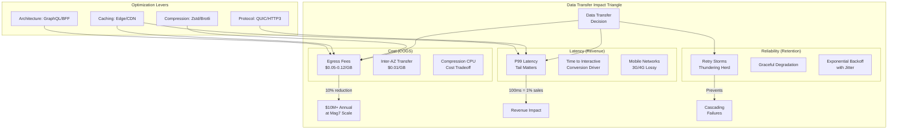
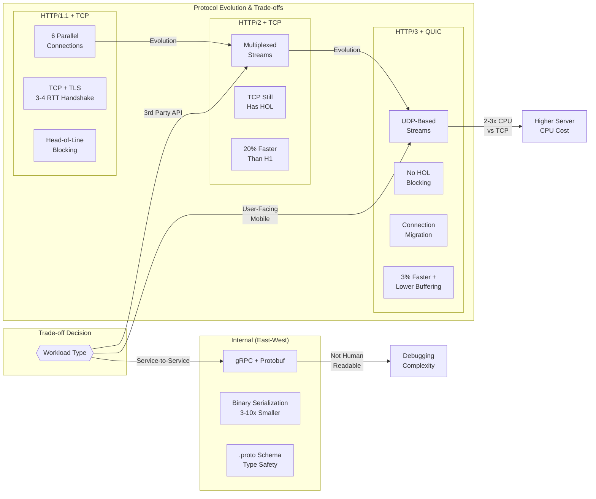
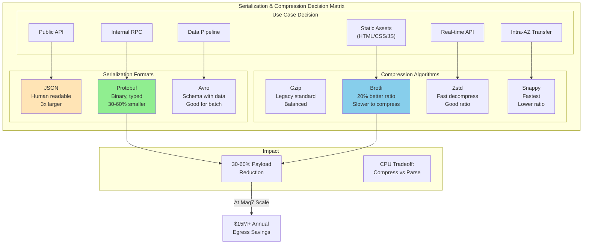
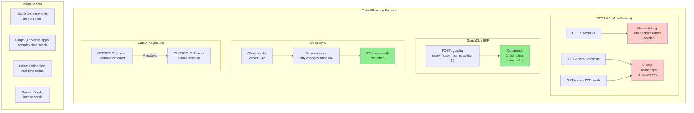
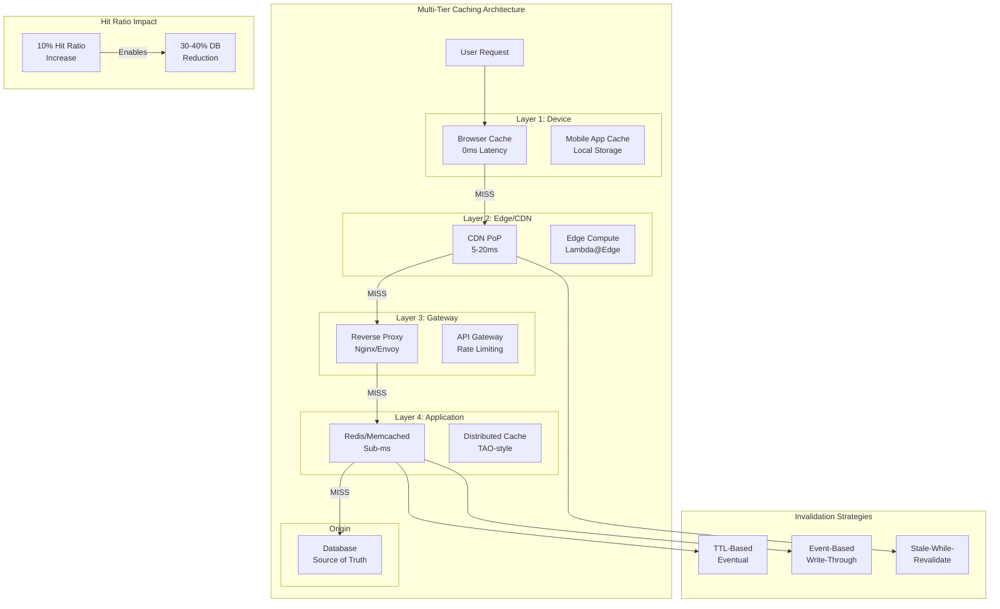

# Data Transfer Optimization

This guide covers 6 key areas: I. Strategic Context: Why Data Transfer Matters at Scale, II. Transport & Protocol Optimization, III. Payload Optimization: Serialization and Compression, IV. Architectural Patterns for Data Efficiency, V. Caching and Edge Strategy, VI. Business Impact & ROI Analysis.


## I. Strategic Context: Why Data Transfer Matters at Scale



At the Principal TPM level, data transfer is rarely about the physics of a single packet; it is about the aggregate impact of those packets on the P&L (Profit and Loss) statement and the user's perception of quality. In a Mag7 environment, you operate at a scale where "inefficient data transfer" is not a technical debt item—it is an existential threat to margins and market share.

This section deconstructs the strategic pillars of data transfer optimization: **Cost (COGS)**, **Latency (Revenue)**, and **Reliability (Retention)**.

### 1. The Economics of Egress: COGS and Margin Preservation

For a hyperscaler, the cost of computing (CPU/RAM) has commoditized, but the cost of moving data (Network Egress) remains a primary driver of Cost of Goods Sold (COGS).

*   **The Technical Reality:** Cloud providers (AWS, Azure, GCP) charge heavily for data leaving their network (Internet Egress) and moderately for data moving between Availability Zones (Inter-AZ transfer). Data moving *into* the cloud is usually free.
*   **Mag7 Behavior:**
    *   **Meta (Facebook/Instagram):** Implements aggressive image and video compression (e.g., using WebP or AVIF formats) not just to load faster, but because a 10% reduction in payload size across billions of daily active users saves tens of millions of dollars annually in egress fees.
    *   **Netflix:** Does not use public cloud egress for streaming. They built **Open Connect**, a proprietary CDN where they ship physical storage appliances to ISPs. This shifts the cost from "per-GB egress" to "capital expenditure (CapEx)" on hardware, drastically lowering the long-term unit cost of delivery.

**Tradeoff Analysis:**
*   **Compression vs. Compute:** Higher compression (e.g., AV1 codec) reduces data transfer costs but increases CPU usage (compute costs) and battery drain on user devices. The Principal TPM must balance the *cost to serve* (compute + network) against the user's battery life constraints.
*   **Pre-fetching vs. Waste:** Pre-fetching content (e.g., loading the next video in a TikTok feed) eliminates latency (Good CX). However, if the user scrolls past without watching, that data transfer is "wasted COGS."

**Impact:**
*   **ROI:** Direct correlation between payload optimization and margin expansion.
*   **Skill:** Requires ability to read cloud billing details and correlate them with architectural decisions (e.g., Multi-AZ vs. Multi-Region).

### 2. Latency as a Revenue Proxy: The "Tail" Matters

In high-scale systems, average latency (P50) is a vanity metric. Principal TPMs focus on **P99 and P99.9 (Tail Latency)**—the experience of the slowest 1% or 0.1% of users. In a user base of 1 billion, the "edge case" 1% represents 10 million dissatisfied users.

*   **The Technical Reality:** Latency is governed by distance (speed of light), protocol handshakes (RTT), and congestion.
*   **Mag7 Behavior:**
    *   **Amazon Retail:** It is a documented KPI that every 100ms of latency correlates to a 1% drop in sales. Optimization efforts focus on "Time to Interactive" (TTI)—how fast the user can click "Buy," rather than just "Time to First Byte" (TTFB).
    *   **Google Search:** Uses **QUIC (HTTP/3)** over UDP instead of TCP. This eliminates the multiple round-trips required for TCP+TLS handshakes, significantly reducing latency for users on lossy mobile networks (3G/4G).

**Tradeoff Analysis:**
*   **Edge vs. Centralized:** Pushing data to the Edge (CDNs, Edge Compute) reduces latency but increases data consistency complexity (CAP theorem challenges) and storage costs.
*   **Freshness vs. Speed:** Aggressive caching improves speed but risks serving stale data (e.g., an old price on a product page).

**Impact:**
*   **Business Capabilities:** Low latency enables real-time features (e.g., multiplayer gaming, live bidding, high-frequency trading).
*   **CX:** Perceived performance is the primary driver of user retention in competitive apps (e.g., Instagram vs. TikTok).

### 3. Reliability & The "Thundering Herd"

At Mag7 scale, reliability isn't just about successful transfer; it's about how the system behaves when transfers *fail*. Naive retry logic in data transfer clients can take down an entire backend service.

*   **The Technical Reality:** Mobile networks are flaky. Packet loss is inevitable. If a client fails to download data and immediately retries, and 10 million clients do this simultaneously during an outage, they create a "Thundering Herd" or "Retry Storm" that prevents the server from recovering.
*   **Mag7 Behavior:**
    *   **AWS SDKs:** Implement **Exponential Backoff with Jitter**. Instead of retrying immediately, the client waits 1s, then 2s, then 4s. "Jitter" adds randomness so that 1 million clients don't retry at the exact same millisecond.
    *   **Uber:** Uses "graceful degradation." If the data transfer for the map visual fails, the app still allows the user to book a ride using text-based location data. The transfer failure does not block the core business transaction.

**Tradeoff Analysis:**
*   **Resilience vs. Freshness:** Implementing deep retry logic ensures data eventually arrives, but it may be obsolete by the time it does.
*   **Client Complexity vs. Server Safety:** Sophisticated client-side flow control (circuit breakers, backoff) protects the server but makes client application development significantly harder to test and maintain.

**Impact:**
*   **System Capability:** Prevents cascading failures during partial outages.
*   **ROI:** Reduces "sev-1" incidents and the engineering hours required to mitigate DDoS-like internal traffic.

### 4. Data Sovereignty and Compliance

A Principal TPM must view data transfer through a legal lens. You cannot optimize data paths if the path is illegal.

*   **The Problem:** GDPR (Europe), CCPA (California), and various laws in India/China restrict where user data can be transferred and stored.
*   **Mag7 Behavior:**
    *   **Microsoft/Google:** Maintain specific "sovereign clouds" (e.g., Azure Germany). Data transfer architectures must implement "geofencing" to ensure PII (Personally Identifiable Information) does not traverse boundaries, even if a US-based server is faster or cheaper.

**Tradeoff Analysis:**
*   **Compliance vs. Performance:** Routing traffic to a local, smaller data center to satisfy residency laws often results in higher latency compared to routing to a massive central hub.
*   **Impact:** A failure here results in massive regulatory fines, far outweighing any COGS savings.

## II. Transport & Protocol Optimization



### 1. HTTP/3 and QUIC: Solving the Transport Bottleneck
While HTTP/2 optimizes the application layer, it relies on TCP. On unstable mobile networks (packet loss > 1%), TCP retransmission mechanisms halt all streams until the lost packet is recovered (TCP Head-of-Line blocking).

Mag7 companies have largely migrated critical user-facing paths to **HTTP/3**, which runs on **QUIC** (a UDP-based protocol).

*   **How it works:** QUIC moves congestion control out of the kernel and into user space. It treats streams independently at the transport layer. If a packet for Stream A is lost, Stream B continues processing without waiting. It also supports **Connection Migration**, allowing a user to switch from Wi-Fi to LTE without breaking the connection (no re-handshake required).
*   **Mag7 Example:** **Google** deployed QUIC across Search and YouTube years before it became a standard. They observed a 3% improvement in page load times globally and significantly lower buffering rates on YouTube for mobile users. **Meta (Instagram)** utilizes QUIC to accelerate image delivery in developing markets where network quality is volatile.
*   **Tradeoffs:**
    *   **CPU Utilization:** UDP in user space is less optimized than kernel-level TCP, often resulting in 2-3x higher CPU usage on the server-side to push the same throughput.
    *   **Infrastructure Complexity:** Many legacy firewalls and corporate proxies drop UDP traffic aggressively. You must implement a seamless TCP fallback mechanism.
*   **Business Impact:**
    *   **ROI:** Higher CPU costs are offset by improved user retention and session length, particularly in "Next Billion User" markets (India, Brazil, Indonesia).
    *   **CX:** Eliminates the "spinner" when a user walks out of Wi-Fi range.

### 2. Internal Communication: gRPC and Protocol Buffers
For internal service-to-service communication, JSON over HTTP/1.1 is rarely the standard at Mag7 scale due to the overhead of text parsing and verbosity. The standard is **gRPC** paired with **Protocol Buffers (Protobuf)**.

*   **How it works:** gRPC uses HTTP/2 for transport (multiplexing) and Protobuf for binary serialization. Protobuf requires a defined schema (`.proto` file), which acts as a contract between services.
*   **Mag7 Example:** **Google** developed Protobuf/gRPC to manage its massive microservices architecture (Borg/Kubernetes ecosystem). **Netflix** uses gRPC for inter-service communication to handle the sheer volume of metadata requests generated when a user browses the catalog.
*   **Tradeoffs:**
    *   **Development Velocity:** Requires a compilation step and strict schema management. Ad-hoc debugging is harder because payloads are not human-readable (requires tools like `grpcurl`).
    *   **Coupling:** Services are tightly coupled to the schema version. Breaking changes in the schema can cause cascading failures if not managed via strict backward compatibility rules.
*   **Business Impact:**
    *   **COGS:** Binary serialization is 3-10x smaller than JSON and 20-100x faster to serialize/deserialize. At Mag7 scale, this translates to thousands of fewer CPU cores required for parsing.
    *   **Reliability:** Strong typing prevents an entire class of "runtime type errors" that are common with loose JSON schemas.

### 3. TLS Optimization and Termination Strategy
Encryption is non-negotiable, but the "handshake" is expensive. A standard TLS handshake requires two round trips (2-RTT) before data flows. On a 200ms mobile connection, that is 400ms of dead time.

*   **Strategic Choices:**
    *   **TLS 1.3:** Reduces the handshake to 1-RTT.
    *   **0-RTT Resumption:** Allows a client who has connected previously to send data in the *very first* packet.
    *   **Termination Point:** Deciding whether to terminate TLS at the Edge (CDN/Load Balancer) or at the Service (Sidecar/Mesh).
*   **Mag7 Example:** **Amazon CloudFront** and **Cloudflare** push TLS termination to the edge, physically closer to the user. Inside the data center, **AWS** and **Google** use hardware offloading (NICs with crypto acceleration) to handle mTLS (mutual TLS) for Zero Trust security without consuming the host CPU.
*   **Tradeoffs:**
    *   **Security vs. Latency (0-RTT):** 0-RTT is susceptible to "Replay Attacks" (an attacker intercepts the packet and resends it to trigger a state change, like a bank transfer). Therefore, 0-RTT must only be enabled for idempotent requests (GET), never for non-idempotent actions (POST/payment).
*   **Business Impact:**
    *   **CX:** The single biggest lever for "Time to First Byte" (TTFB).
    *   **Security Compliance:** Enabling mTLS internally satisfies strict enterprise compliance (SOC2, HIPAA) regarding "encryption in transit" but requires robust certificate rotation infrastructure.

### 4. Advanced Compression (Brotli & Zstd)
Standard Gzip is no longer the baseline. The choice of compression algorithm is a direct tradeoff between **Compute Cost (Compression Time)** and **Egress Cost (Transfer Size)**.

*   **How it works:**
    *   **Brotli:** Optimized for the web (HTML/CSS/JS). It is slower to compress but offers 20% better density than Gzip.
    *   **Zstd (Zstandard):** Developed by Facebook. It offers Gzip-level compression ratios at 3-5x the speed.
*   **Mag7 Example:** **Meta (Facebook)** uses Zstd extensively for internal data logging and database storage to save petabytes of storage. **Google** forces Brotli for Chrome users accessing Google properties to minimize bandwidth.
*   **Tradeoffs:**
    *   **Mobile Battery:** Decompression consumes battery. While Brotli/Zstd are efficient, aggressive compression settings can drain client devices.
    *   **Dynamic vs. Static:** For static assets (Netflix UI images), use the highest compression (Brotli-11) regardless of CPU cost because it's done once. For dynamic API responses, use a faster algorithm (Zstd or Brotli-4) to avoid adding latency to the request processing.
*   **Business Impact:**
    *   **COGS:** A 15% reduction in payload size via Zstd directly reduces the cloud egress bill by 15%. For a company spending $100M/year on egress, this is a $15M saving.

## III. Payload Optimization: Serialization and Compression



At the scale of a Mag7 company, payload optimization is a direct lever for infrastructure efficiency and user retention. When an application serves billions of requests per day, the overhead of parsing JSON or the bandwidth cost of uncompressed text adds up to significant compute and egress expenses.

The Principal TPM must weigh the **CPU cost of serialization/compression** against the **network cost of bandwidth** and the **latency impact on the user**.

### 1. Serialization Formats: JSON vs. Binary (Protobuf/Thrift/Avro)

While JSON is the industry standard for public-facing APIs due to its human readability and ubiquity, it is rarely the primary choice for internal service-to-service communication at Mag7 scale.

*   **The Problem with JSON:** It is verbose (repeated field names), text-based (requires expensive string parsing), and lacks strict schema enforcement, leading to runtime errors.
*   **The Mag7 Solution:** Binary serialization protocols.
    *   **Protocol Buffers (Protobuf):** Developed by Google. Used heavily in gRPC. It defines a strict `.proto` schema and compiles into binary.
    *   **Thrift:** Developed by Facebook (Meta). Similar to Protobuf, supports multiple languages.
    *   **Avro:** Common in the Hadoop/Data ecosystem; schema is sent with the data (or stored in a registry).

#### Real-World Mag7 Behavior
At **Google**, internal microservices communicate almost exclusively via **Stubby** (the internal predecessor to gRPC) using Protobuf. This standardization allows Google to manage a massive monorepo where a change in a `.proto` file automatically generates client libraries for downstream services, ensuring type safety and reducing integration headaches.

#### Tradeoffs
*   **Debuggability:** Binary formats are not human-readable. You cannot simply `curl` an endpoint and read the response.
    *   *Mitigation:* Tooling is required (e.g., gRPC command-line tools) to deserialize payloads for debugging.
*   **Coupling:** Binary formats require the client and server to share a schema.
    *   *Benefit:* Prevents "drift" where API documentation doesn't match reality.
    *   *Cost:* Requires a robust CI/CD pipeline to distribute updated client SDKs/stubs.

#### Business & ROI Impact
*   **CPU Utilization:** Parsing binary formats is significantly faster than parsing JSON, reducing the CPU fleet size required to handle the same RPS (Requests Per Second).
*   **Egress Costs:** Binary payloads are typically 30-60% smaller than equivalent JSON, directly lowering AWS/Azure/GCP data transfer bills.

### 2. Compression Strategies: Beyond Gzip

Compression trades CPU cycles (latency to compress/decompress) for Bandwidth (transfer time). The choice of algorithm depends on the content type and the asymmetry of the transfer.

*   **Gzip:** The legacy standard. Good balance, ubiquitous support.
*   **Brotli (Google):** Optimized for the web (HTML/CSS/JS). It offers 20-26% better compression ratios than Gzip.
*   **Zstandard (Zstd - Meta):** Developed by Facebook. It provides high compression ratios with *very* fast decompression speeds.
*   **Snappy (Google):** Prioritizes speed over compression ratio. Useful for internal RPCs where latency is critical, and bandwidth is cheap (within the same availability zone).

#### Real-World Mag7 Behavior
**Meta (Facebook)** uses Zstd extensively for internal data movement and database compression because the decompression speed is fast enough to not bottleneck real-time feed rendering.
**Netflix** uses different compression profiles based on the device. A high-end Smart TV might receive a different compression stream than an older Android phone, balancing the device's CPU capability against network bandwidth.

#### Tradeoffs
*   **The Battery Tax:** High compression ratios (e.g., Brotli max settings) require significant CPU to decompress. On low-end mobile devices, this drains battery and causes UI stutter (jank) while the main thread parses data.
*   **The BREACH Attack:** Compressing encrypted data (HTTPS) can sometimes expose vulnerabilities (side-channel attacks). Mag7 security teams often disable compression for sensitive secrets or CSRF tokens.

### 3. Preventing Over-fetching: GraphQL and Sparse Fieldsets

Optimization isn't just about shrinking the bits; it's about not sending them in the first place. REST APIs often suffer from **Over-fetching** (receiving fields the client doesn't need) and **Under-fetching** (requiring multiple round trips to get related data).

#### The GraphQL Shift
Meta developed **GraphQL** specifically to solve mobile performance issues. instead of hitting `/users/123` and getting a massive JSON blob including address, history, and preferences, the client requests exactly what it needs:
```graphql
{
  user(id: "123") {
    name
    avatarUrl
  }
}
```

#### Real-World Mag7 Behavior
**Amazon** and **Netflix** utilize "Backend-for-Frontend" (BFF) patterns or GraphQL federation. The "Home Page" team builds an aggregation layer that calls 50+ microservices (Recommendations, User Profile, Billing) and stitches them into a single, optimized payload for the client. This moves the complexity from the mobile device (flaky network) to the server (low latency internal network).

#### Tradeoffs
*   **Complexity:** GraphQL moves complexity to the backend. It requires sophisticated query planning to avoid the "N+1 problem" (where one query triggers hundreds of database lookups).
*   **Caching:** HTTP caching (CDNs) is harder with GraphQL because nearly every request is a `POST` with a unique body, unlike REST where `GET /resource` is easily cached.

#### Business & ROI Impact
*   **User Experience:** Eliminating over-fetching reduces the "Time to Interactive" (TTI).
*   **Data Plans:** For users in emerging markets (the "Next Billion Users"), reducing payload size is a competitive advantage for accessibility on metered data plans.

### 4. Image and Media Optimization

For consumer apps, JSON/Protobuf payloads are negligible compared to media assets.

*   **Next-Gen Formats:** Moving from JPEG/PNG to **WebP** (Google) or **AVIF** (Netflix/Alliance for Open Media). AVIF offers significant size reduction for the same visual quality.
*   **Adaptive Loading:** Serving different image sizes based on the client's `Viewport` and `DPR` (Device Pixel Ratio).

#### Real-World Mag7 Behavior
**Netflix** pioneered "per-shot encoding optimization." Instead of compressing a whole movie at the same bitrate, they analyze every scene. An explosion scene (high complexity) gets more bits; a dialogue scene against a black wall (low complexity) gets fewer. This saves petabytes of bandwidth without degrading perceived quality.

## IV. Architectural Patterns for Data Efficiency



While protocols like HTTP/3 optimize the pipe, architectural patterns optimize the payload. At the Principal TPM level, your focus shifts from "how do we compress this" to "do we need to send this data at all?"

Inefficient data architecture leads to "Chatty" applications (too many round trips) or "Fat" payloads (over-fetching). In a distributed microservices environment typical of Mag7, these inefficiencies compound, resulting in high latency for the user and massive egress bills for the business.

### 1. GraphQL and Federation
REST APIs often suffer from over-fetching (receiving fields you don't need) or under-fetching (requiring multiple calls to stitch data together). GraphQL inverts control, allowing the client to dictate exactly what data is required.

*   **The Mechanism:** Instead of multiple endpoints (`/users/1`, `/users/1/posts`), a single endpoint accepts a query describing the data shape.
*   **Mag7 Example (Meta/Facebook):** Facebook developed GraphQL specifically because their mobile newsfeed required data from dozens of internal associations. Using REST would have required massive payload overhead or dozens of round trips on 3G networks.
*   **Principal TPM Tradeoffs:**
    *   **Pro:** drastic reduction in payload size and round trips (WAN latency reduction). Decouples frontend velocity from backend schema changes.
    *   **Con:** Shifts complexity to the server. Introduces the "N+1 Problem" (one query triggering thousands of database lookups) if resolvers aren't batched (e.g., via DataLoader). Caching is significantly harder than REST because every query is unique and uses POST.
*   **Business Impact:** Increases developer velocity for frontend teams (no need to wait for backend to create new endpoints). Reduces mobile data usage, directly improving retention in emerging markets (Next Billion Users).

### 2. Backend for Frontend (BFF)
When a single general-purpose API tries to serve mobile, web, and IoT, it usually serves none of them efficiently. The BFF pattern places an orchestration layer between the client and the microservices.

*   **The Mechanism:** You build specific API gateways for specific client experiences (e.g., `Netflix-iOS-API`, `Netflix-TV-API`). This layer aggregates calls to downstream microservices over the high-speed internal network (LAN) and returns a single, trimmed response to the client over the slow public network (WAN).
*   **Mag7 Example (Netflix):** Netflix pioneered this. The data required to render the UI on a PlayStation 4 (low memory, controller navigation) is vastly different from an iPhone. A generic API would force the PS4 to download high-res image metadata it can't display. Netflix adapters strip this out server-side.
*   **Principal TPM Tradeoffs:**
    *   **Pro:** Moves "chattiness" from the expensive/slow WAN to the cheap/fast internal data center network. Allows for device-specific optimization without polluting core services.
    *   **Con:** Code duplication. Logic often leaks into the BFF layer, making it a maintenance burden. Requires strict governance to ensure the BFF doesn't become a monolith.
*   **ROI & COGS:** Reduces cloud egress costs by filtering data before it leaves the data center.

### 3. Delta Synchronization (Differential Sync)
For applications involving large datasets that change frequently (e.g., collaborative editing, social feeds, inventory management), sending the full state is wasteful.

*   **The Mechanism:** The client sends a hash or version vector of its current state. The server calculates the "diff" (Delta) and sends only the changes (creates, updates, deletes).
*   **Mag7 Example (Google G-Suite/Docs):** When you type in a Google Doc, the browser doesn't resend the whole document. It sends an operational transform or a patch. Similarly, Uber driver apps don't redownload the map; they sync position deltas.
*   **Principal TPM Tradeoffs:**
    *   **Pro:** Massive bandwidth savings (often 99% reduction for minor updates). Essential for "Offline-First" capability.
    *   **Con:** High architectural complexity. Requires conflict resolution strategies (Last-Write-Wins vs. CRDTs). If the client state is too far behind (e.g., user opens app after a month), the server must be able to fall back to a "Snapshot" (full download).
*   **CX Impact:** The difference between an app feeling "snappy" vs. "sluggish." Critical for users with spotty connectivity.

### 4. Cursor-Based Pagination
Pagination is the most basic form of data efficiency, yet it is often implemented incorrectly at scale using "Offset" (e.g., `limit=10, offset=5000`).

*   **The Mechanism:** Instead of counting rows to skip (which gets slower as the dataset grows), Cursor-based pagination uses a pointer to the last item seen (e.g., `after_id=xyz`).
*   **Mag7 Example (Twitter/X & Slack):** Infinite scroll feeds never use offset pagination. If a user is scrolling a timeline, and new tweets arrive, offset pagination causes duplicates or missed items. Cursors ensure data stability and O(1) database fetch performance regardless of depth.
*   **Principal TPM Tradeoffs:**
    *   **Pro:** Constant time performance. Handles real-time data ingestion without "shifting" items on the client.
    *   **Con:** You cannot jump to a specific page (e.g., "Go to page 50")—you can only go "Next."
*   **System Reliability:** Prevents "Deep Paging" attacks where malicious users request `offset=1000000` to spike database CPU usage.

### 5. Push vs. Pull (WebSockets & SSE)
Polling an API every 5 seconds to check for updates is architecturally expensive and data-inefficient.

*   **The Mechanism:**
    *   **WebSockets:** Bi-directional, persistent connection.
    *   **Server-Sent Events (SSE):** Uni-directional (Server to Client) over HTTP.
*   **Mag7 Example (Uber):** When waiting for a ride, the app doesn't poll for the car's location. A persistent connection pushes coordinates.
*   **Principal TPM Tradeoffs:**
    *   **Pro:** Real-time UX. Eliminates "Empty" requests (polling when no data has changed).
    *   **Con:** Stateful connections are hard to scale. Load balancers must handle long-lived connections (port exhaustion). If a server restarts, thousands of clients try to reconnect simultaneously (Thundering Herd problem).
*   **Efficiency:** Polling creates 100% overhead for 0% value when data hasn't changed. Push architectures reduce this waste to near zero.

## V. Caching and Edge Strategy



At the scale of Mag7, caching is not merely a performance enhancement; it is a structural necessity for infrastructure survival and unit economics. A Principal TPM must view caching and edge strategy as a mechanism to decouple **read volume** from **compute capacity**.

The strategy focuses on pushing data and logic physically closer to the user (the Edge) to achieve two primary business goals: reducing **Egress Costs** (which can be hundreds of millions annually) and minimizing **Time-to-Interactive (TTI)**.

### 1. The Multi-Tier Caching Architecture

Ineffective caching strategies treat caching as a single layer (e.g., "We use Redis"). Mag7 architectures utilize a "Defense in Depth" approach, where a request must pass through multiple sieves before hitting the origin database.

**The Layers:**
1.  **Device/Browser Cache:** Zero network latency. Controlled via `Cache-Control` headers (e.g., `stale-while-revalidate`).
2.  **Edge/CDN:** PoPs (Points of Presence) located in ISPs or regional hubs.
3.  **Gateway/Reverse Proxy:** Nginx/Envoy caching at the ingress of the data center.
4.  **Application Cache:** In-memory (Memcached/Redis) sidecars or clusters.

**Real-World Mag7 Behavior (Facebook/Meta):**
Meta utilizes a massive, geographically distributed caching system called **TAO** for its social graph. When a user loads their News Feed, the read request hits a local Edge cache first. If it misses, it goes to a regional Replica. Only on a miss there does it hit the Master database. This protects the core database from 99% of read traffic.

**Trade-offs:**
*   **Complexity vs. Latency:** Each layer adds management overhead and potential for "stale" data bugs.
*   **Storage Cost vs. Compute Savings:** Storing cached data costs money (RAM is expensive). However, re-computing the data (CPU) or retrieving it from disk (I/O) is often 10x more expensive at scale.

**Impact:**
*   **ROI:** A 10% increase in cache hit ratio can allow a Mag7 company to reduce backend database provisioning by 30-40%.

### 2. Edge Compute and Logic

Traditional CDNs cache static assets (images, CSS). Modern Mag7 strategy involves **Edge Compute**—running application logic at the network edge (e.g., AWS Lambda@Edge, Cloudflare Workers).

**Use Cases:**
*   **Authentication:** Validating JWTs at the edge to reject unauthorized requests before they consume expensive backend bandwidth.
*   **A/B Testing:** Routing users to different backend versions based on cookies/headers at the closest PoP.
*   **Personalization:** Stitching static HTML with dynamic user data at the edge.

**Real-World Mag7 Behavior (Netflix):**
Netflix uses edge computing for "steering." When you press play, logic at the edge determines the optimal Open Connect Appliance (OCA) to stream from based on real-time network congestion and file availability, rather than round-tripping to a central control plane.

**Trade-offs:**
*   **Debuggability:** Troubleshooting logic running in 100+ global locations is significantly harder than centralized logs.
*   **Cost per ms:** Edge compute is generally more expensive per millisecond of execution than centralized cloud compute (EC2/Borg).

**Impact:**
*   **CX:** Authentication checks happen in <20ms (Edge) vs. 150ms (Origin), making the app feel "instant."

### 3. Cache Invalidation and Consistency Models

The most significant risk in caching is serving stale data when freshness is critical (e.g., bank balance, stock price, inventory).

**Strategies:**
*   **TTL (Time-to-Live):** Data expires automatically. Good for eventual consistency (e.g., User Avatar).
*   **Event-Based Invalidation (Purge):** The application explicitly deletes the cache key when the database is updated (Write-Through or Cache-Aside).
*   **Soft Purge / Stale-While-Revalidate:** Serve the stale content immediately while fetching fresh content in the background.

**Real-World Mag7 Behavior (Amazon):**
On Prime Day, Amazon cannot rely solely on TTL for inventory. They utilize **Write-Through** caching strategies for product pages. When an item is purchased, the inventory count is updated in the DB and the Cache simultaneously. If the cache update fails, the transaction is rolled back or queued to ensure the "Add to Cart" button doesn't lie to the user.

**Trade-offs:**
*   **Consistency vs. Availability (CAP Theorem):** Strict consistency requires locking, which hurts availability. Mag7 usually favors Eventual Consistency for non-financial data to maintain 99.999% uptime.
*   **Thundering Herd:** If a hot cache key is invalidated, thousands of concurrent requests might hit the database simultaneously. To mitigate this, Mag7 uses **Request Collapsing** (only one request goes to origin, others wait) or **Probabilistic Early Expiration**.

### 4. Smart Routing and Egress Optimization

At the Principal level, you must manage the cost of moving data. "Hot" data should live close to the user; "Cold" data should live in the cheapest storage tier.

**Techniques:**
*   **Anycast DNS:** Using a single IP address that routes users to the nearest physical data center based on BGP routing.
*   **Origin Shielding:** A mid-tier cache layer that prevents all edge locations from hitting the origin simultaneously.

**Real-World Mag7 Behavior (Google/YouTube):**
YouTube does not cache every video everywhere. They use predictive algorithms to cache "trending" content at the Edge (ISP level). Long-tail videos (uploaded 7 years ago with 10 views) are served from central cold storage. This tiered approach optimizes storage costs against bandwidth costs.

**Trade-offs:**
*   **Egress Fees:** Serving from a central region to a user in Australia is expensive. Serving from a local cache is free/cheap.
*   **Cache Pollution:** Caching "rarely accessed" data at the edge pushes out "frequently accessed" data, lowering the overall hit ratio.

**Impact:**
*   **Business Capability:** Allows the platform to survive viral events (e.g., a Super Bowl trailer drop) without scaling backend servers, as the load is absorbed entirely by the Edge.

## VI. Business Impact & ROI Analysis

At the Principal level, technical excellence is meaningless without business justification. You are no longer just executing; you are allocating capital (engineering time and compute resources). You must translate technical metrics (latency, payload size, error rates) into business metrics (churn, conversion, COGS).

### 1. Unit Economics and COGS Modeling
The most direct path to ROI analysis in infrastructure and data transfer is defining the "Unit Cost." At a Mag7, you do not simply look at the total AWS/Azure bill; you look at the **Cost per Stream**, **Cost per Search Query**, or **Cost per Transaction**.

*   **The Mechanism:** This requires implementing strict cost-allocation tagging and attribution models. You must trace a specific egress byte back to a specific microservice, and that microservice back to a specific product feature.
*   **Mag7 Example (Spotify/Netflix):** These companies track "Cost per Stream Hour." If a new codec (like AV1) reduces bandwidth by 20% but increases compute cost (transcoding) by 50%, the TPM must model the intersection point. For popular content, bandwidth savings outweigh compute costs. For long-tail content with few views, the storage/compute cost of re-encoding is negative ROI.
*   **Tradeoff:** Granular attribution requires significant engineering overhead (distributed tracing, tagging governance).
    *   *Pros:* Enables decentralized accountability; teams own their P&L.
    *   *Cons:* Can lead to "micro-optimizations" where teams spend $50k in engineering time to save $5k in annual cloud spend.
*   **Actionable Guidance:** Establish a threshold for optimization. A common rule of thumb is that an optimization project must yield a 5x return on the engineering salary cost within 12 months to be prioritized over feature work.

### 2. Latency-to-Revenue Correlation
Principal TPMs must quantify the "Cost of Latency." It is insufficient to say "faster is better." You must determine the **elasticity of revenue relative to latency**.

*   **The Mechanism:** This involves A/B testing artificial latency injection. You deliberately slow down traffic for a cohort of users by 100ms, 500ms, and 1s to measure the drop-off in conversion or session duration.
*   **Mag7 Example (Amazon/Google):** Amazon famously established that every 100ms of latency cost them 1% in sales. Google found that an extra 0.5 seconds in search page generation dropped traffic by 20%. In the context of Data Transfer, this data justifies the massive CapEx investment in Edge PoPs (Points of Presence) and TLS termination at the edge.
*   **Tradeoff:** Diminishing returns (The Asymptote of Performance).
    *   *Pros:* Clear business case for performance initiatives (e.g., implementing QUIC/HTTP3).
    *   *Cons:* Improving P99 latency from 200ms to 100ms might yield high ROI, but improving from 50ms to 40ms might cost 10x more for zero perceptible user benefit.
*   **Impact on Capabilities:** Understanding this correlation allows you to set "Error Budgets" and "Latency Budgets" that are financially grounded rather than arbitrary engineering targets.

### 3. Build vs. Buy vs. Open Source
A Principal TPM often acts as the gatekeeper for "Not Invented Here" syndrome. In data transfer and infrastructure, the decision to build a proprietary protocol or CDN versus using a vendor is a multimillion-dollar strategic bet.

*   **The Mechanism:** Conduct a Total Cost of Ownership (TCO) analysis that includes not just license/usage fees, but **integration costs**, **maintenance engineering**, **security compliance**, and **opportunity cost**.
*   **Mag7 Example (Uber/Dropbox):** Dropbox famously moved *off* AWS to their own hardware (Magic Pocket) to save COGS because their storage needs were massive and predictable. Conversely, Uber has oscillated between on-prem and cloud depending on the maturity of their stack and spot-pricing dynamics.
*   **Tradeoff:** Strategic Control vs. Operational Burden.
    *   *Pros (Build):* Tailored performance (e.g., Facebook building specific hardware for their workload), no vendor lock-in, lower unit economics at massive scale.
    *   *Cons (Build):* You must maintain a team of specialized engineers (high OpEx). If your custom solution falls behind industry standards (e.g., failing to adopt TLS 1.3 quickly), you incur "Innovation Debt."
*   **Edge Case:** The "Vendor Lock-in" trap. Using a vendor's proprietary efficient transfer protocol might save money today but makes migration impossible tomorrow. The TPM must factor the "Exit Cost" into the ROI.

### 4. Opportunity Cost and Engineering Velocity
ROI is not just about saving money; it is about the speed of value delivery. If a data transfer optimization reduces payload size, it might also reduce the complexity of the client-side parser, thereby increasing developer velocity.

*   **The Mechanism:** Measure **DORA metrics** (Deployment Frequency, Lead Time for Changes) pre- and post-optimization. If adopting GraphQL reduces the number of round-trips *and* reduces the number of custom endpoints backend engineers have to maintain, the ROI includes "Engineering Hours Saved."
*   **Mag7 Example (Meta/GraphQL):** Meta developed GraphQL not just to save bandwidth on mobile devices (over-fetching reduction), but to decouple frontend and backend development. The massive ROI came from frontend engineers iterating without blocking on backend API changes.
*   **Tradeoff:** Learning Curve vs. Efficiency.
    *   *Pros:* Higher long-term velocity and decoupled teams.
    *   *Cons:* High initial investment in tooling, training, and migration. Short-term velocity drops significantly during adoption.

### 5. Risk Quantification (The Cost of Non-Compliance)
When justifying investments in data transfer security (e.g., mTLS everywhere, PII masking in transit), the ROI is calculated based on **Risk Exposure**.

*   **The Mechanism:** `Expected Loss = Probability of Event × Cost of Event`.
    *   *Cost of Event* includes regulatory fines (GDPR is 4% of global revenue), brand damage, and remediation costs.
*   **Mag7 Example (Microsoft/Google):** Investments in "Sovereign Clouds" (data residency) often yield negative operational ROI but are mandatory for market access in regions like the EU or China. The "ROI" is the ability to operate in that market at all.
*   **Tradeoff:** Security friction vs. User Experience.
    *   *Pros:* Market access, trust, compliance.
    *   *Cons:* Strict data locality rules can force inefficient routing (hairpinning data traffic), increasing latency and bandwidth costs.

---


## Interview Questions


### I. Strategic Context: Why Data Transfer Matters at Scale

### Question 1: The Cost vs. Experience Tradeoff
**Question:** "We are launching a new high-definition video feature for our social media app in emerging markets (India/Brazil). Early tests show high engagement, but the data egress costs are projected to wipe out our profit margin for these users. As a Principal TPM, how do you approach this problem?"

**Guidance for a Strong Answer:**
*   **Strategic Framework:** Acknowledge the tension between Growth (engagement) and Unit Economics (margin).
*   **Technical Levers:** Discuss adaptive bitrate streaming (HLS/DASH) to serve lower resolution on smaller screens. Mention codec upgrades (H.265/AV1) to reduce size without quality loss.
*   **Business/Product Strategy:** Suggest "Wi-Fi only" high-def defaults or pre-fetching only when on unmetered networks.
*   **Infrastructure:** Evaluate Edge caching (CDN) vs. Origin fetch costs.
*   **Key Differentiator:** The candidate should mention measuring "Goodput" (useful data) vs. "Wasted Throughput" (downloading video segments the user never watches) and propose optimizing the buffer length.

### Question 2: Handling System Overload
**Question:** "During a major event, our login service experienced a brief outage. When the service came back up, it immediately crashed again due to a spike in traffic from users trying to log back in. What data transfer patterns caused this, and how would you architect the client to prevent it in the future?"

**Guidance for a Strong Answer:**
*   **Identification:** Identify this as a "Thundering Herd" problem caused by synchronized retries.
*   **Technical Solution:** Propose **Exponential Backoff with Jitter** on the client side.
*   **Advanced Mitigation:** Discuss implementing a "Circuit Breaker" pattern where the client stops trying entirely for a set period if error rates cross a threshold.
*   **Server-Side Protection:** Mention Load Shedding (dropping excess requests fast) to allow the server to recover, rather than queuing them indefinitely.
*   **Key Differentiator:** The candidate connects the client-side behavior (data transfer logic) directly to server-side availability, demonstrating end-to-end system ownership.

### II. Transport & Protocol Optimization

### Question 1: The "JSON vs. gRPC" Migration
**"You are the TPM for a core platform team at a large e-commerce company. Your engineering lead proposes migrating all internal microservices from REST/JSON to gRPC to save costs. However, the Frontend team and 3rd-party developer platform team are pushing back. How do you evaluate this proposal, and what is your recommendation?"**

**Guidance for a Strong Answer:**
*   **Nuance over Dogma:** The candidate should not blindly accept gRPC. They must identify that while gRPC is superior for *internal* service-to-service (east-west) traffic due to efficiency, it is poor for *external* (north-south) traffic involving 3rd parties due to browser compatibility and developer experience (DX).
*   **Hybrid Architecture:** The ideal solution is often a hybrid: gRPC for the backend mesh, with an API Gateway (like Envoy) transcoding gRPC to JSON for the frontend/public API.
*   **ROI Calculation:** The candidate should propose measuring the CPU spend on JSON parsing today. If it's negligible, the migration cost (engineering hours) outweighs the infrastructure savings.
*   **Operational Tradeoffs:** Mention the cost of retraining teams and the loss of human-readable debugging (using `curl`).

### Question 2: Mobile Latency in Emerging Markets
**"We are launching a lite version of our streaming app for markets with high latency and high packet loss (e.g., rural India). The current app uses HTTP/2 and is experiencing high buffering rates. What protocol optimizations would you investigate, and what are the risks associated with them?"**

**Guidance for a Strong Answer:**
*   **Identify the Root Cause:** Recognize that HTTP/2 suffers from TCP Head-of-Line blocking in high packet loss environments.
*   **The Solution (QUIC/HTTP/3):** Propose moving to HTTP/3 to utilize UDP and independent streams.
*   **The Critical Risk (UDP Blocking):** Acknowledge that corporate networks and some ISPs block UDP. The candidate *must* mention the need for a "Happy Eyeballs" algorithm or a fallback mechanism to TCP/HTTP/2 if QUIC fails.
*   **Optimization Layering:** Beyond the protocol, suggest TLS 1.3 for faster handshakes and tuning the Initial Congestion Window (CWND) to send more data in the first round trip.
*   **Metrics:** Success should be measured by "Rebuffering Ratio" and "Time to First Frame," not just server throughput.

### III. Payload Optimization: Serialization and Compression

### Question 1: The Migration Strategy
**"We have a legacy public API serving 500 million requests/day in JSON. We want to migrate to gRPC/Protobuf to save costs. As a Principal TPM, how do you plan this migration? What are the risks, and how do you handle clients who refuse to upgrade?"**

*   **Guidance for a Strong Answer:**
    *   **Strategic Vision:** Acknowledge that you cannot force public clients to use gRPC. The solution is likely a **dual-stack approach**.
    *   **Technical Implementation:** Propose a Gateway (like Envoy or an API Gateway) that accepts both HTTP/1.1+JSON and gRPC. The Gateway can transcode JSON to Protobuf for internal services.
    *   **Phased Rollout:** Start with internal clients or high-volume partners (Pareto principle: 80% of traffic likely comes from 20% of partners).
    *   **Metrics:** Define success metrics (e.g., "Reduce CPU cost by 20%," not just "Use gRPC").
    *   **Governance:** Discuss the need for a Schema Registry to ensure the JSON mapping and Protobuf definitions stay in sync.

### Question 2: The Emerging Market Challenge
**"Our app is launching in a region with expensive data plans and high-latency 3G networks. The current app initial load downloads 4MB of data. How do you drive a technical initiative to reduce this to under 1MB without removing features?"**

*   **Guidance for a Strong Answer:**
    *   **Audit First:** Don't guess. Propose using tools (Lighthouse, internal instrumentation) to analyze the payload breakdown (Images vs. JS bundle vs. API data).
    *   **Protocol & Payload:** Suggest switching to HTTP/2 or HTTP/3 (QUIC) to handle packet loss better. Suggest implementing GraphQL or Sparse Fieldsets to stop over-fetching.
    *   **Compression:** Suggest Brotli for text and WebP/AVIF for images.
    *   **Client-Side Strategy:** Discuss **Optimistic UI** (loading skeletons) and **Offline-First** architecture (caching data locally so the network is only used for deltas).
    *   **Tradeoffs:** Acknowledge that higher compression (like AVIF) might be slow on older low-end Android phones common in that region, requiring a device-tiering strategy.

### IV. Architectural Patterns for Data Efficiency

### Question 1: The GraphQL Migration
**"We have a legacy REST API serving our mobile app. The mobile team wants to move to GraphQL to reduce over-fetching and improve performance. However, the backend team is resisting, citing complexity and caching concerns. As a Principal TPM, how do you evaluate this trade-off and drive the decision?"**

*   **Guidance for a Strong Answer:**
    *   **Acknowledge the Tension:** Validate both sides. Mobile wants efficiency/velocity; Backend wants stability/simplicity.
    *   **Data-Driven Decision:** Propose measuring the actual waste. If over-fetching is only 5KB per call, GraphQL is overkill. If it's 2MB, it's necessary.
    *   **Architectural Middle-Ground:** Discuss the "Federated Graph" or "BFF" as alternatives. You don't need to rewrite the backend; you can put a GraphQL mesh *in front* of the REST services.
    *   **Risk Management:** Address the N+1 problem explicitly. Mention implementing strict query complexity limits (governance) so a junior mobile dev can't accidentally DDOS the database with a nested query.
    *   **Business Lens:** Tie it to COGS (egress savings) vs. Engineering OpEx (maintenance cost).

### Question 2: Designing for Flaky Networks
**"Design the data synchronization architecture for a field-service app (e.g., for utility workers) used in remote areas with 2G or intermittent connectivity. They need to view job details and upload photos. How do you ensure data efficiency and integrity?"**

*   **Guidance for a Strong Answer:**
    *   **Pattern Selection:** Must mention "Offline-First" architecture using local storage (SQLite/Realm) and Delta Sync.
    *   **Upload Strategy:** Discuss "Multipart Uploads" or "Resumable Uploads" for photos. If a 10MB upload fails at 90%, do not restart from zero.
    *   **Conflict Resolution:** What happens if two workers edit the same job offline? Define a strategy (e.g., Last-Write-Wins or explicit user merge).
    *   **Optimistic UI:** Update the UI immediately upon user action, sync in the background. Don't block the user with a spinner.
    *   **Edge Case:** Handle the "Tombstone" problem (syncing deletions). If a record is deleted on the server, how does the offline client know to remove it?

### V. Caching and Edge Strategy

### Question 1: The "Thundering Herd" Problem
**Prompt:** "We are launching a highly anticipated feature. We expect 10 million users to open the app within 5 minutes of the notification. The homepage relies on a heavy query that takes 2 seconds to compute. How do you design the caching strategy to prevent the database from crashing?"

**Guidance for a Strong Answer:**
*   **Identify the Risk:** A simple TTL expiry will cause all 10M users to hit the DB the moment the cache expires (Thundering Herd).
*   **Strategic Solution:**
    *   **Locking/Request Collapsing:** The first request to miss the cache sets a lock; subsequent requests wait for that specific result rather than querying the DB themselves.
    *   **Probabilistic Early Expiration (Jitter):** Don't expire the key exactly at 60 seconds. Expire it randomly between 55s and 65s to spread the refreshing load.
    *   **Stale-While-Revalidate:** Serve the old data to the user while a background process updates the cache.
*   **Business Impact:** Explain that serving slightly stale data (by 5 seconds) is better than a 503 Service Unavailable error.

### Question 2: Global vs. Regional Caching Strategy
**Prompt:** "Our service is expanding from the US to Global. Our latency in Asia is 400ms. Executives want to deploy a full replica of our stack in Tokyo to fix this. As a Principal TPM, how do you evaluate if this is the right choice versus using a CDN/Edge strategy?"

**Guidance for a Strong Answer:**
*   **Challenge the Premise:** Do not immediately agree to a full replica. Full region replication introduces massive data consistency challenges and doubles infrastructure costs.
*   **Analyze the Traffic:** Is the latency caused by static assets (images/JS) or dynamic compute?
    *   If Static: A CDN is the correct ROI choice (low effort, high impact).
    *   If Dynamic: Can we move logic to the Edge (Lambda@Edge) instead of a full region build?
*   **Data Sovereignty & Cost:** Discuss the hidden costs of data replication (Egress fees to sync databases across the Pacific) and compliance (GDPR/Locality laws).
*   **Recommendation:** Propose a phased approach: 1) Aggressive CDN caching, 2) Edge Compute for handshakes/auth, 3) Full Region only if strict data residency or read/write intensity demands it.

### VI. Business Impact & ROI Analysis

### Question 1: The "Negative ROI" Feature
**Question:** "Our engineering team wants to migrate our legacy REST APIs to gRPC to improve performance and type safety. They estimate it will take two quarters of work for three teams. Preliminary tests show it will save roughly $50k/year in bandwidth and improve latency by 15ms. The GM argues this is negative ROI and we should build new features instead. As a Principal TPM, how do you analyze this and what is your recommendation?"

**Guidance for a Strong Answer:**
*   **Acknowledge the GM is right on surface metrics:** $50k savings does not pay for 6 months of 3 teams (approx. $1M+ cost).
*   **Pivot to "Hidden" ROI:**
    *   *Developer Velocity:* Does gRPC's code generation eliminate boilerplate code, speeding up future feature dev by 20%?
    *   *Reliability:* Does type safety reduce P0 incidents? Calculate the cost of downtime/hotfixes.
    *   *Mobile Battery Life:* Does the payload reduction impact user retention in low-bandwidth markets (emerging markets strategy)?
*   **Propose a Middle Ground:** Suggest a strangler-fig pattern migration rather than a "big bang," targeting only high-volume/latency-sensitive endpoints first to prove value.
*   **Decision Framework:** If the "Hidden" ROI (Velocity + Reliability) doesn't outweigh the opportunity cost of lost features, be brave enough to kill the migration.

### Question 2: CapEx vs. OpEx in Scale
**Question:** "We are currently spending $10M/year on a third-party CDN. Engineering proposes building an in-house edge caching network (CapEx) that will cost $15M upfront but reduce annual operating costs to $2M. The break-even is roughly 2 years. However, the product roadmap is pivoting toward dynamic, personalized content which cannot be cached effectively. How do you evaluate this proposal?"

**Guidance for a Strong Answer:**
*   **Identify the Strategic Misalignment:** The financial ROI looks good (2-year payback), but the *strategic* ROI is negative if the tech stack is moving away from cacheable content.
*   **Analyze the Utilization Risk:** If the cache hit ratio drops due to personalization, the in-house infrastructure becomes a stranded asset.
*   **Hybrid Approach:** Challenge the binary choice. Can we implement a "Compute-at-Edge" solution (like Cloudflare Workers or Lambda@Edge) that handles personalization *and* delivery, rather than just a dumb cache?
*   **Lifecycle Management:** Highlight that building an internal CDN requires a permanent SRE team (ongoing OpEx) that is often underestimated in the initial proposal. The $2M/year operating cost is likely optimistic.
*   **Conclusion:** Recommend against the full build-out due to the roadmap pivot; investigate optimizing the current vendor contract or moving to a programmable edge vendor.

---


## Key Takeaways

- Review each section for actionable insights applicable to your organization

- Consider the trade-offs discussed when making architectural decisions

- Use the operational considerations as a checklist for production readiness
