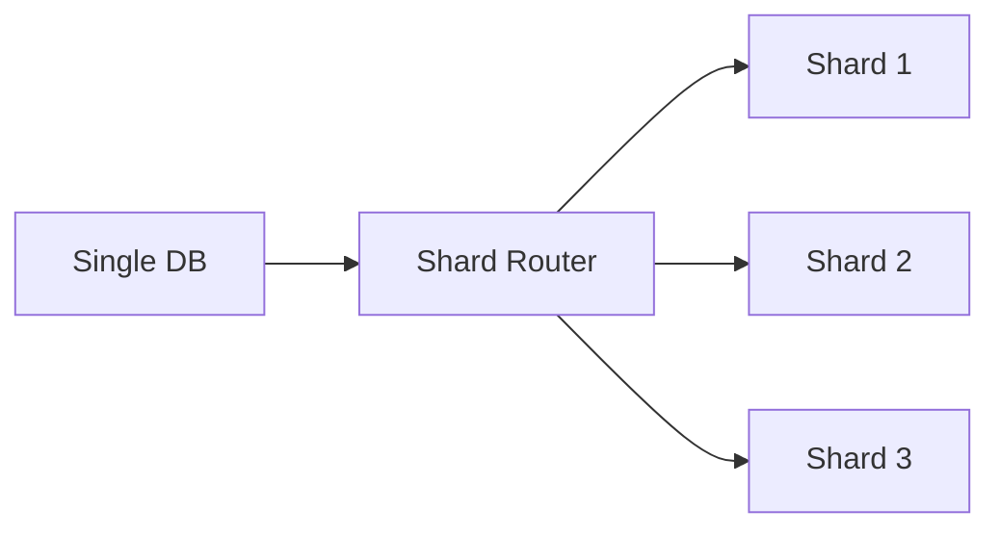
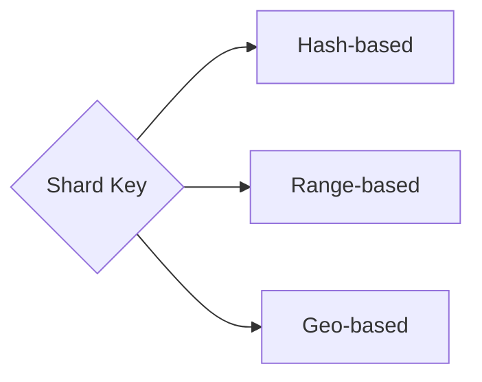
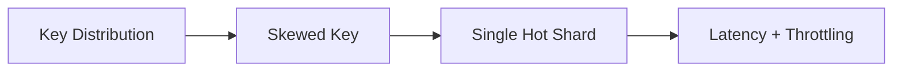
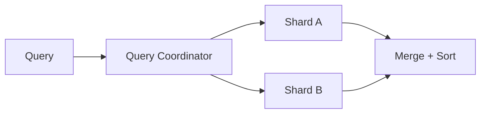
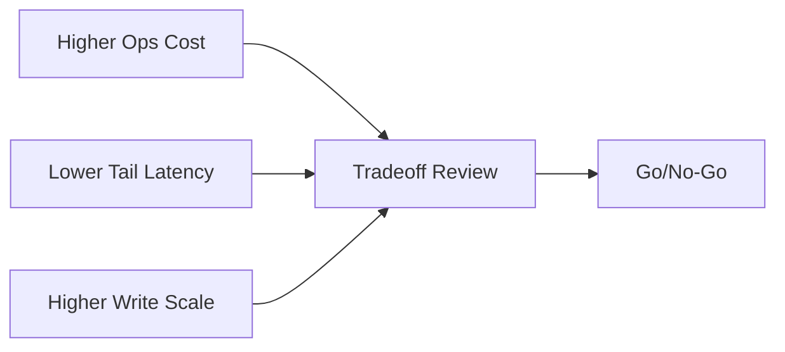

# Database Sharding Strategies

    Range-based: Shard by ID range (1-1M on shard 1, 1M-2M on shard 2). Simple to understand. Problem: Hot spots if recent IDs are most active. Uneven shard sizes over time.
    Hash-based: hash(key) mod N = shard number. Even distribution. Problem: Resharding is painful - adding shard N+1 requires redistributing data from all shards.
    Consistent Hashing: Keys map to positions on a ring. Each shard owns a range on the ring. Adding a shard only affects adjacent ranges. Used by Cassandra, DynamoDB.
    Directory-based: Lookup service maps keys to shards. Maximum flexibility but adds latency and single point of failure.

⚠Common Pitfall
Cross-shard queries (JOINs, aggregations) become scatter-gather operations. A query hitting all 100 shards takes as long as the slowest shard. Design your shard key to keep related data together.

This guide covers 5 key areas: I. Strategic Context: Why Sharding Matters to a Principal TPM, II. Sharding Strategies & Technical Trade-offs, III. The "Celebrity Problem" (Hot Partitions), IV. Operational Challenges: The "Cross-Shard" Tax, V. Business & Capability Impact Assessment.

## I. Strategic Context: Why Sharding Matters to a Principal TPM

At the Principal TPM level, sharding is rarely a purely technical discussion about database syntax; it is a strategic negotiation regarding **architectural runway**, **blast radius reduction**, and **engineering velocity**.

While Engineering Managers focus on the implementation details (consistent hashing, vnodes), the Principal TPM focuses on the "Vertical Ceiling"—the mathematical certainty that a monolithic database will eventually become the bottleneck for business growth. Your role is to predict that intersection point and drive the architectural migration before it impacts revenue.

### 1. The Vertical Ceiling and Architectural Runway

In early-stage growth, vertical scaling (scaling up) is preferred because it preserves the relational model (ACID transactions, JOINs, Foreign Keys). However, at Mag7 scale, you hit hard hardware limits.

*   **The Technical Reality:** You cannot buy a machine large enough to handle the write-throughput of Amazon’s order history or Meta’s Messenger metadata. Even with the largest AWS RDS instances (e.g., `db.x1.32xlarge`), you are bound by IOPS limits, network bandwidth, and, most critically, connection limits.
*   **Mag7 Example:** At Amazon, the move from monolithic Oracle databases to sharded DynamoDB/Aurora fleets wasn't just about cost; it was about connection saturation. During peak events (Prime Day), the overhead of managing thousands of open connections to a single master node caused "brownouts" even if CPU was available.
*   **Principal TPM Action:** You must track **Capacity vs. Runway**. If your database is at 60% CPU utilization with 20% year-over-year growth, you do not have 2 years left. You have 6 months before you lose the headroom required for failovers and maintenance windows. You must trigger the sharding project *now*.

### 2. Blast Radius Reduction (Availability ROI)

Sharding is the primary mechanism for implementing **Cell-Based Architecture** (or Bulkheads). This is a critical availability strategy at companies like Microsoft (Azure) and AWS.

*   **The Concept:** In a monolith, a bad query or a schema lock brings down 100% of the service. In a sharded environment, if User IDs 1–1M are on Shard A, and Shard A fails, only users in that range are affected. Users on Shard B (1M–2M) continue to transact normally.
*   **Business Impact:** If a service generates $1M/hour, a 1-hour total outage costs $1M. If you are sharded into 20 partitions, that same failure costs $50k. This is a direct ROI argument you use to justify the high engineering cost of sharding.
*   **Tradeoff:** You trade **Global Consistency** for **Partial Availability**. You accept that in a disaster scenario, some users work while others don't, which complicates Customer Support (CS) flows (CS agents might see the site working while the customer complains it is down).

### 3. The "Managed Service" Fallacy

A common pitfall for Generalist TPMs is assuming that using managed services (DynamoDB, CosmosDB, Google Spanner) eliminates the need to understand sharding.

*   **Technical Depth:** Managed services handle the *infrastructure* of sharding (splitting data across nodes), but they do not handle the *logic* of data distribution. You still need to define a **Partition Key**.
*   **Mag7 Failure Mode:** Consider a messaging app (like WhatsApp/Meta). If you shard by `Group_ID`, and a celebrity creates a group with 5 million users, that single shard becomes a "Hot Partition." The managed service will throttle writes to that specific partition to protect the fleet.
*   **Impact:** The service appears healthy on average, but high-value customers (the celebrity) experience 100% failure rates. The Principal TPM must ensure the schema design accounts for these "Thundering Herd" scenarios and data skew.

### 4. The Operational Tax: Velocity vs. Scale

The decision to shard introduces significant friction to the development lifecycle. This is the "Tax" you pay for infinite scale.

*   **Loss of Relational Features:** Once sharded, you lose ACID transactions across shards. You cannot `JOIN` a table on Shard A with a table on Shard B efficiently.
*   **Engineering Capability Impact:**
    *   **Transactions:** Engineers must move from database-level transactions ( `BEGIN TRANSACTION... COMMIT`) to application-level consistency (Sagas, Two-Phase Commit, or Eventual Consistency). This requires a higher skill level in the engineering team.
    *   **Analytics:** You can no longer run a simple SQL query to "Count all users." You must implement an ETL pipeline to aggregate data into a Data Warehouse (Redshift/BigQuery) for analytics, introducing data latency for business intelligence.
*   **Principal TPM Role:** You must adjust roadmap expectations. Features that previously took 1 week (adding a foreign key relationship) may now take 4 weeks (designing an eventually consistent workflow). You must communicate this velocity drop to Product Leadership as the cost of doing business at scale.

## II. Sharding Strategies & Technical Trade-offs

rd"). This results in uneven load distribution where 90% of your cluster sits idle while the "current" shard melts down under write pressure. This is a massive capital inefficiency (low ROI on hardware).

**Mitigation:** To use Range Sharding effectively at scale (e.g., Google Cloud Spanner), the system must support **automatic tablet splitting**. When a range becomes too hot, the database automatically divides that range into two and migrates half the data to a new node. Without this automation, range sharding requires high-toil manual intervention.

### 2. Hash-Based Sharding (Key Sharding)
This is the standard for high-throughput write systems (e.g., Amazon DynamoDB, Cassandra). You take a specific attribute (Shard Key), apply a hash function (e.g., MD5 or MurmurHash), and use the result to assign the data to a specific node.

*   **Mag7 Use Case:** Amazon DynamoDB. When a team defines a Partition Key (e.g., `OrderID`), DynamoDB hashes that ID to determine which physical partition stores the data.
*   **Mechanics:** `Shard_ID = Hash(Key) % Number_of_Shards`.
*   **Trade-offs:**
    *   *Pro:* **Uniform Distribution.** A good hash function ensures data and read/write load are evenly spread across all nodes, maximizing hardware ROI and preventing hotspots (assuming no "celebrity" keys).
    *   *Con:* **Loss of Range Queries.** Because IDs are scattered randomly, you cannot perform queries like "Get all users registered between 12:00 and 1:00." You must query *every* shard (Scatter-Gather), which introduces high latency and complexity.
    *   *Con:* **Resharding Complexity.** If you use a simple modulo operator (`% N`), adding a new server changes `N`, requiring a remapping of almost all keys.
        *   *Principal Note:* Modern systems use **Consistent Hashing** (e.g., a hash ring) to minimize data movement when scaling out. Only $1/N$ keys need to move when a node is added.

### 3. Directory-Based (Lookup) Sharding
Instead of an algorithm determining the location, a separate "Lookup Service" maintains a map of which shard holds which data.

*   **Mag7 Use Case:** Multi-tenant architectures or systems requiring high data mobility. For example, moving a high-value enterprise customer from "Standard Hardware Shards" to "Premium/Isolated Hardware Shards" without changing their ID.
*   **Trade-offs:**
    *   *Pro:* **Flexibility.** You can manually move specific data segments to different physical hardware for performance or tiering reasons without changing application logic.
    *   *Con:* **Single Point of Failure (SPOF).** The Lookup Service becomes the bottleneck. Every database transaction requires a lookup. If the directory goes down, the entire platform goes down.
    *   *Con:* **Latency Penalty.** It adds a network hop to every query.
    *   *Mitigation:* Aggressive caching of the lookup table on the application side.

### 4. Geo-Sharding (Data Locality)
Data is partitioned based on the user's physical location.

*   **Mag7 Use Case:** Netflix Open Connect (content placement) or User Profile stores for global platforms (Meta/Facebook) to adhere to GDPR/data sovereignty laws.
*   **Trade-offs:**
    *   *Pro:* **Latency & Compliance.** Users get the fastest possible read/write times (physics of light), and you satisfy legal requirements to keep EU data in the EU.
    *   *Con:* **The "Traveling User" Problem.** If a US user travels to Japan, do you fetch their data from the US (high latency), or migrate it to Japan (complex write)?
    *   *Con:* **Global Consistency.** Achieving ACID transactions across geo-shards implies global locking, which destroys performance. You are forced into Eventual Consistency.

---

### 5. The "Celebrity Problem" (Data Skew)
This is the most common failure mode in sharded systems at Mag7 scale.

Even with perfect Hash Sharding, real-world data is not uniform. If you shard by `User_ID`, and Justin Bieber (`User_ID: 999`) tweets, the shard holding ID 999 will receive 100,000x more traffic than the shard holding your ID.

**Impact on Business/CX:**
The shard hosting the celebrity key hits its IOPS limit (throttling). Because that shard *also* hosts thousands of other non-celebrity users, those unrelated users experience timeouts and failures. This is a "Noisy Neighbor" outage.

**Principal TPM Mitigation Strategies:**
1.  **Write Sharding / Salting:** Append a random suffix to the key (e.g., `Bieber_1`, `Bieber_2`... `Bieber_N`). This spreads the celebrity's data across multiple shards. The application must know to query all suffixes and aggregate the results.
2.  **Read Caching:** Aggressively cache hot keys in an in-memory layer (Redis/Memcached) or CDN to bypass the database entirely for reads.

---

### 6. Architectural Decision Framework: Choosing a Strategy

When driving this decision, a Principal TPM evaluates the following matrix:

| Strategy | Best For | ROI Impact | Risk Profile |
| :--- | :--- | :--- | :--- |
| **Hash** | High-volume writes, key-value lookups (e.g., Shopping Cart, Session Data). | **High.** Even distribution maximizes hardware utilization. | **Medium.** Resharding is difficult; Celebrity keys cause outages. |
| **Range** | Time-series data, financial ledgers, sequential processing. | **Low to Medium.** Requires auto-balancing to prevent idle hardware. | **High.** Hot spots on sequential writes can cause total write availability loss. |
| **Directory** | Multi-tenant SaaS, Tiered customers. | **Medium.** High operational cost to maintain the directory. | **Critical.** Directory failure = System-wide outage. |
| **Geo** | Compliance (GDPR), Latency-sensitive reads. | **Medium.** duplicating infrastructure across regions is expensive. | **Medium.** Cross-region consistency is hard to guarantee. |

## III. The "Celebrity Problem" (Hot Partitions)

This phenomenon creates a scenario where the theoretical limit of your distributed system is not defined by the aggregate cluster capacity, but by the capacity of a *single* node. Even if you have 1,000 shards, if 50% of your traffic targets Shard #42 (e.g., Taylor Swift’s latest post or a PS5 restock on Amazon), your effective throughput is capped at the limits of that one machine.

For a Principal TPM, this is a critical risk vector because standard auto-scaling rules fail here. Adding more shards does not solve the problem if the traffic is targeting a specific key that cannot be split further.

### 1. The Mechanics of "Key Skew"
In a perfectly balanced system, traffic is uniformly distributed. The Celebrity Problem arises from **Key Skew**, where the access distribution follows a Power Law (Zipfian distribution).

*   **The Bottleneck:** The hot shard hits CPU saturation or IOPS limits.
*   **The Blast Radius:**
    *   **Direct Impact:** Requests for the "Celebrity" data fail or time out.
    *   **Noisy Neighbor Effect:** Other non-celebrity data residing on the same shard (e.g., a regular user whose ID hashes to the same partition as the celebrity) suffers high latency or availability loss.
    *   **Cascading Failure:** If the application retries aggressively on timeouts, the hot shard spirals into a "death spiral," potentially causing the database control plane to destabilize.

### 2. Mitigation Strategy A: Write Sharding (Salting)
When a single key receives too many writes (e.g., millions of users "Liking" a single tweet), the solution is to artificially split the key.

*   **Implementation:** Instead of writing to `PostID_123`, the application appends a random suffix (salt) from a defined range (e.g., 1-10) to the key. The write goes to `PostID_123_1`, `PostID_123_2`, etc. These salted keys distribute across different shards.
*   **Mag7 Example:** **Twitter/X** uses this for engagement counters on viral tweets. **Amazon** uses this for inventory decrementing on high-velocity SKUs (Lightning Deals).
*   **Trade-offs:**
    *   *Write Throughput:* Increases linearly with the number of buckets.
    *   *Read Complexity (The Penalty):* To get the total "Like" count, the system must perform a **Scatter-Gather** operation (read all 10 buckets and sum them). This increases read latency and load.
    *   *Consistency:* It becomes nearly impossible to maintain strong consistency (e.g., preventing inventory overselling) without complex two-phase commits, which kill performance. You generally accept eventual consistency.

### 3. Mitigation Strategy B: Intelligent Caching (Read Offloading)
When the skew is Read-heavy (e.g., millions of users *viewing* a celebrity profile), sharding the database is rarely the right answer.

*   **Implementation:** Implement a "Hot Key" cache policy.
*   **Mag7 Example:** **Facebook/Meta** uses Memcached/TAO. When a key is identified as hot, it is replicated across significantly more cache tiers than a standard key.
*   **Trade-offs:**
    *   *Staleness:* The user might see a typo in a post for 5 seconds after it was edited.
    *   *Thundering Herd:* If the cache node holding the celebrity key crashes, the massive traffic spike hits the database instantly, potentially taking it down. Principal TPMs must advocate for **Request Coalescing** (collapsing multiple requests for the same key into one DB call) at the application layer to prevent this.

### 4. Mitigation Strategy C: Hybrid/Tiered Architecture
This is the most complex but most effective strategy for Mag7 platforms. You treat celebrities differently in the codebase.

*   **Implementation:** The application logic checks if a user is a "VIP" (based on follower count or traffic velocity).
    *   *Regular User:* Standard synchronous writes, standard consistency.
    *   *Celebrity User:* Asynchronous writes, buffered queues, eventual consistency.
*   **Mag7 Example:** **Instagram**. Comments on a regular user's post might appear instantly. Comments on a celebrity's post are often ingested via a stream processing pipeline (Kafka/Kinesis) to smooth out the load, appearing with a slight delay.
*   **Trade-offs:**
    *   *Engineering Overhead:* You are maintaining two code paths.
    *   *Product Behavior:* The UX is inconsistent. A celebrity might complain that their comments aren't loading as fast as a normal user's.

### 5. Strategic Impact & ROI Analysis

As a Principal TPM, you must evaluate the ROI of solving this problem.

*   **The Cost of Inaction:**
    *   **CX:** During a high-profile event (e.g., Super Bowl), the service crashes. The reputational damage is massive.
    *   **Revenue:** For e-commerce (Amazon), a hot partition on a "Door Buster" deal prevents customers from checking out, directly losing revenue.

*   **The Cost of Solution:**
    *   **Development Time:** Implementing "Salting" or Hybrid architectures requires significant engineering effort and rigorous testing.
    *   **Infrastructure:** Over-provisioning DynamoDB RCUs/WCUs (Read/Write Capacity Units) to handle potential spikes is expensive.

*   **Decision Framework:**
    *   If the "Celebrity" events are rare and predictable (e.g., Prime Day), use **Pre-warming** (provisioning extra capacity manually ahead of time).
    *   If the events are random and frequent (e.g., Viral Tweets), invest in **Architecture** (Salting/Caching).

## IV. Operational Challenges: The "Cross-Shard" Tax

Once you have committed to a sharding architecture, you incur the "Cross-Shard Tax." This is not a financial cost, but a penalty paid in **latency, availability, and engineering complexity**.

For a Principal TPM, the most dangerous misconception is that adding more shards linearly increases performance. It does not. If your access patterns require crossing shard boundaries, performance can actually degrade as you scale. This section details the specific taxes levied by sharding and how Mag7 architectures mitigate them.

### 1. The Read Tax: Scatter-Gather & Tail Latency
When a query does not contain the **Shard Key**, the database router cannot direct the request to a specific node. Instead, it must broadcast the query to *all* shards (Scatter) and aggregate the results (Gather).

*   **Technical Mechanics:**
    *   **Fan-out:** If you have 100 shards, one logical read becomes 100 physical network calls.
    *   **Tail Latency Sensitivity:** The query is only as fast as the *slowest* shard. If 99 shards respond in 10ms, but one is undergoing garbage collection and takes 500ms, the user experiences 500ms latency.
*   **Mag7 Real-World Example:**
    *   **Amazon Order History:** If orders are sharded by `OrderID`, but a customer asks to "Show all orders placed by User X," the system cannot know which shards hold User X's orders. It must query all of them.
    *   **Solution:** Amazon creates a "Global Secondary Index" (GSI) or a reverse-lookup table sharded by `UserID`. This duplicates data (storage cost) to eliminate the scatter-gather (compute/latency cost).
*   **Trade-offs:**
    *   **Option A (Scatter-Gather):** Low storage cost, high latency, high coupling (one bad shard breaks the query).
    *   **Option B (Secondary Indices):** High storage cost, eventual consistency (index lags behind main table), low latency.
*   **Business Impact:**
    *   **CX:** High P99 latency leads to poor user experience and abandoned sessions.
    *   **ROI:** Scatter-gather queries are CPU expensive. You are burning compute on 99 nodes that return "no results."

### 2. The Write Tax: The Death of ACID
In a monolith, a transaction (e.g., "Transfer $50 from Alice to Bob") is atomic. In a sharded system, if Alice lives on Shard A and Bob lives on Shard B, you cannot use a standard database transaction.

*   **Technical Mechanics:**
    *   **Two-Phase Commit (2PC):** The traditional solution. The coordinator tells Shard A and Shard B to "prepare." If both say yes, it tells them to "commit."
    *   **Why Mag7 Avoids 2PC:** It locks resources on both shards during the network round trip. If the coordinator crashes, the shards are stuck in limbo. Throughput plummets.
*   **Mag7 Real-World Example:**
    *   **Uber/Lyft Trip State:** When a ride is requested, the system must update the Rider's state and the Driver's state. These are likely on different shards.
    *   **Solution:** **Sagas (Orchestration).** The system updates the Rider first. If successful, it triggers an asynchronous event to update the Driver. If the Driver update fails, a "compensating transaction" is triggered to undo the Rider update.
*   **Trade-offs:**
    *   **Consistency vs. Availability:** You sacrifice strong consistency (ACID) for high availability and throughput (BASE model).
    *   **Complexity:** Engineering teams must write complex rollback logic for every step of a transaction.
*   **Business Impact:**
    *   **CX:** Users may see "in-between" states (e.g., money deducted but credit not received yet). The UI must handle this gracefully ("Processing...").
    *   **Skill Capability:** Requires senior engineers who understand distributed state machines. Junior teams often introduce data corruption bugs here.

### 3. The Skew Tax: The "Justin Bieber" Problem
Sharding assumes data is distributed evenly. However, real-world data is rarely uniform. A "Hot Key" occurs when a single shard key receives a disproportionate amount of traffic, creating a bottleneck that no amount of horizontal scaling can fix.

*   **Technical Mechanics:**
    *   **Throughput Throttling:** If Shard A handles Justin Bieber’s tweets and Shard B handles a regular user's, Shard A will hit its IOPS limit while Shard B sits idle.
    *   **Cascading Failure:** If Shard A fails due to load, requests might retry, overloading the replica or the failover node, taking the service down.
*   **Mag7 Real-World Example:**
    *   **Instagram/Facebook Comments:** A post by a celebrity generates millions of writes (comments/likes) in seconds. If sharded by `PostID`, one physical machine melts down.
    *   **Solution:** **Write Sharding/Salting.** Instead of writing to `PostID_123`, the system appends a random suffix (`PostID_123_1`, `PostID_123_2`) to spread the writes across multiple shards. Reads must then query all suffixes and aggregate.
*   **Trade-offs:**
    *   **Write Latency vs. Read Complexity:** Salting fixes the write bottleneck but re-introduces a mini scatter-gather problem for reads.
*   **Business Impact:**
    *   **Reliability:** Hot keys are the #1 cause of "Black Swan" outages during high-traffic events (e.g., Super Bowl, Prime Day).

### 4. The Operational Tax: Resharding
The most perilous time for a sharded database is when you need to change the shard count. If Shard A gets too full, you must split it into Shard A1 and Shard A2.

*   **Technical Mechanics:**
    *   **Online Data Migration:** You cannot stop the world to move data. You must copy data from A to A1/A2 while A is still taking live writes.
    *   **Double Writes:** During migration, the application often has to write to both the old and new locations to ensure no data loss.
*   **Mag7 Real-World Example:**
    *   **DynamoDB (AWS):** Early versions required manual provisioning. Now, "Adaptive Capacity" handles this behind the scenes, effectively moving "hot" parts of a partition to new hardware automatically.
    *   **TPM Role:** You must ensure capacity planning happens *before* a shard hits 80% utilization. Resharding under 100% load usually results in an outage because the migration process itself consumes IOPS.
*   **Business Impact:**
    *   **Risk:** Resharding is when data loss is most likely to occur.
    *   **Cost:** You often need double the hardware capacity during the migration window.

---

## V. Business & Capability Impact Assessment

At the Principal TPM level, the decision to shard is never purely technical; it is a business capability decision. Sharding introduces significant operational overhead, alters the cost structure of the service, and changes the skill profile required of the engineering team. Your role is to assess whether the ROI of "infinite scale" justifies the "tax" of distributed complexity.

### 1. The Blast Radius vs. Complexity Trade-off

In a monolithic database, a failure is binary: the system is either up or down. Sharding changes the availability profile of the business.

*   **Mag7 Reality (The "Bulkhead" Concept):** At Amazon and Azure, sharding is primarily viewed as a mechanism for **Blast Radius Reduction**. If a specific shard hosting 1% of customers fails (e.g., a corrupted storage volume), 99% of the business continues operating. This is critical for SLA guarantees (99.999%).
*   **The Trade-off:**
    *   *Gain:* Partial availability. A major outage becomes a minor incident affecting only a subset of users (partitioned by UserID or TenantID).
    *   *Cost:* **Observability Complexity.** You can no longer monitor a single CPU metric. You must monitor heat maps across 100+ shards. If one shard is "hot" (noisy neighbor problem) while 99 are idle, your P99 latency metrics will look terrible, triggering Sev-2 incidents even if the average latency is fine.
*   **TPM Action:** You must mandate the implementation of **per-shard monitoring** and automated remediation (e.g., auto-splitting hot shards) before going to production. Without this, the operations team will burn out chasing "ghost" latency spikes.

### 2. ROI and Cost of Goods Sold (COGS) Impact

Sharding rarely reduces infrastructure costs; it usually increases them due to over-provisioning and management overhead.

*   **The "Step Function" Cost Model:** In a monolith, you scale vertically. When you shard, you often move to a scale-out model where you must provision capacity for the *peak* of the *hottest* shard, not the average.
*   **Mag7 Example (DynamoDB/CosmosDB):** If you use provisioned throughput, you pay for the capacity of the shard. If your data is skewed (e.g., a celebrity Instagram account), you must provision the entire system to handle that one hot key, wasting capacity on other shards.
*   **Business Impact:**
    *   *Risk:* **COGS Explosion.** A poorly chosen shard key can result in 10x infrastructure spend for the same throughput because of uneven distribution.
    *   *Mitigation:* The TPM must enforce **Capacity Planning Reviews**. If the engineering team proposes a shard key that correlates with time (e.g., `OrderDate`), you must flag that this will require constantly increasing provisioned IOPS on the "active" shard, driving up costs inefficiently.

### 3. Capability & Skill Gap Assessment

Sharding breaks standard relational database guarantees. This requires a shift in engineering capability.

*   **Loss of ACID Transactions:** Cross-shard transactions are either impossible, prohibitively slow (Two-Phase Commit/2PC), or require complex eventual consistency patterns (Sagas).
*   **Skill Impact:**
    *   *Junior/Mid-level Engineers:* Often rely on `JOIN`s and foreign keys to enforce data integrity. In a sharded world, these features usually disappear.
    *   *The Principal TPM Role:* You must assess if the team is mature enough to handle **Application-Side Joins** and **Idempotency**.
*   **Mag7 Behavior:** When Uber or Netflix migrated from monoliths to microservices/sharded stores, they invested heavily in **Client Libraries** (Smart Clients). These libraries handle the routing logic, retries, and "scatter-gather" complexity so that the average product developer doesn't have to reimplement sharding logic for every feature.
*   **Actionable Guidance:** If your organization lacks a strong "Platform Engineering" team to build these client libraries, sharding poses a high risk of introducing data corruption bugs. You must account for the headcount required to build the *tooling* to support sharding, not just the sharding itself.

### 4. The Migration "Tax" and Double-Writes

The most dangerous phase of sharding is the migration from Monolith to Sharded clusters. This is a multi-quarter effort that freezes feature velocity.

*   **The Strategy:** **Online Double-Writes.**
    1.  Application writes to Monolith (Source of Truth).
    2.  Application *also* writes to Sharded DB (Dark Mode).
    3.  Verify data consistency between the two.
    4.  Flip read traffic to Sharded DB.
    5.  Stop writing to Monolith.
*   **Business Capability Impact:**
    *   **Feature Freeze:** During the double-write and verification phase (often 3-6 months), the schema cannot easily change. The TPM must negotiate a roadmap freeze with Product Management.
    *   **Latency Hit:** Writing to two locations increases write latency. You must verify if the upstream user experience (UX) can tolerate the added latency during the migration window.
*   **Mag7 Example:** When Meta (Facebook) migrates user data between regions or storage engines (e.g., moving to TAO), they utilize a sophisticated "Shadow Traffic" framework. As a Principal TPM, you ensure the *rollback mechanism* is tested. If the consistency check fails (e.g., < 99.999% match), the automated rollback must be instant to prevent data loss.

### 5. Latency Implications of "Scatter-Gather"

If a business requirement forces a query across all shards (e.g., "Show me the top 10 sales across all regions"), the system performs a "Scatter-Gather" query.

*   **Technical Constraint:** The query is sent to *all* shards. The response time is determined by the *slowest* shard (tail latency).
*   **CX Impact:** If you have 100 shards and each has a 99th percentile latency of 100ms, the probability of a scatter-gather query hitting that latency approaches 100%.
*   **Principal TPM Stance:** You must push back on Product requirements that necessitate frequent scatter-gather queries.
    *   *Negotiation:* "We cannot support a global leaderboard in real-time with this sharding strategy. We can offer a pre-computed leaderboard updated every 5 minutes."
    *   *Tradeoff:* You are trading **Real-time freshness** for **System Stability**.

---

---

## Interview Questions

### I. Strategic Context: Why Sharding Matters to a Principal TPM

**Question 1: The Premature Optimization Trap**
"A Staff Engineer proposes sharding our core User Service database to prepare for projected 10x growth over the next three years. The migration will freeze feature development for two quarters. The current database is at 30% utilization. As the Principal TPM, do you approve this? How do you evaluate the decision?"

*   **Guidance for a Strong Answer:**
    *   **Challenge the premise:** 30% utilization suggests vertical scaling (upgrading hardware) or read-replicas might suffice for another 12-18 months. Sharding is complex and expensive (OpEx).
    *   **ROI Analysis:** Calculate the "Cost of Delay" for features vs. the risk of downtime.
    *   **Alternative paths:** Propose "Logical Sharding" (modifying the code to be shard-aware but keeping data on one DB) as a middle ground to reduce risk without a full infrastructure migration immediately.
    *   **Decision:** Likely reject or defer until utilization hits a defined threshold (e.g., 60%), prioritizing product growth while adding observability to track the "Vertical Ceiling."

**Question 2: Handling Hot Partitions in Production**
"We launched a sharded ticketing system for a major event platform. We sharded by `EventID`. During a major concert sale (Taylor Swift), the shard hosting that event fell over due to write pressure, while other shards were idle. The business is losing millions per minute. What is your immediate incident response, and what is your long-term architectural fix?"

*   **Guidance for a Strong Answer:**
    *   **Immediate Mitigation (The TPM's Incident Role):** You cannot re-shard live. You must throttle traffic (shed load) to preserve the system, even if it means rejecting customers. Increase provisioned throughput on that specific partition if the cloud provider allows (e.g., DynamoDB adaptive capacity).
    *   **Root Cause:** Poor shard key selection (`EventID` creates high cardinality but high skew).
    *   **Long-term Fix:** Change the sharding strategy. Introduce a "compound key" (e.g., `EventID_BucketID`) to spread the hot event across multiple shards (Scatter-Gather pattern).
    *   **Process Improvement:** Implement "Game Day" testing where high-skew traffic is simulated before launch.

### II. Sharding Strategies & Technical Trade-offs

### Question 1: The Resharding Migration
**"We have a monolithic database for our Order History service that has reached 90% CPU utilization. We need to migrate to a sharded architecture without taking downtime. Walk me through your migration strategy, how you validate data integrity, and how you handle the cutover."**

*   **Guidance for a Strong Answer:**
    *   **Dual Writes:** The candidate should propose a "Dual Write" phase where the application writes to *both* the old monolith and the new sharded cluster simultaneously.
    *   **Backfill:** A background process iterates through the monolith to copy historical data to the new shards (handling race conditions where data changes during the copy).
    *   **Shadow Reads:** The application reads from the monolith but *asynchronously* reads from the shards to compare results (verification phase).
    *   **The Switch:** Using a feature flag to switch reads to the sharded cluster first, then eventually deprecating the monolith.
    *   **Rollback Plan:** The ability to instantly revert to the monolith if the shards fail.

### Question 2: Handling Data Skew
**"You are designing the backend for a Twitter-like feed. You choose to shard by User ID. During the Super Bowl, a specific hashtag and a few celebrity accounts generate 50x normal traffic, causing the shards hosting those keys to throttle. This is affecting regular users on the same shards. How do you architecturally solve this?"**

*   **Guidance for a Strong Answer:**
    *   **Diagnosis:** Identify that this is a "Hot Partition" or "Celebrity" problem.
    *   **Short-term fix:** Implement aggressive caching (Read-Replica scaling or Memcached/Redis) for those specific keys.
    *   **Long-term Architectural fix:** Propose "Salting" or "Compound Keys." instead of just `User_ID`, shard by `User_ID + Time_Bucket` or append a random digit to spread the writes.
    *   **Trade-off awareness:** Acknowledging that salting keys makes *reading* that data harder (you have to read from multiple places and aggregate), but it saves the write-throughput availability.

### III. The "Celebrity Problem" (Hot Partitions)

**Question 1: The "Viral Product" Scenario**
"You are the Principal TPM for Amazon's Checkout Service. We are launching a new gaming console, and we expect 5 million write requests (orders) per second for a single SKU (Stock Keeping Unit). A single database shard can only handle 10,000 writes per second. How do you architect the system to handle this volume without overselling inventory, considering the SKU is the shard key?"

*   **Guidance for a Strong Answer:**
    *   **Identify the Bottleneck:** Acknowledge that standard sharding fails because all writes target one SKU ID.
    *   **Propose Salting:** Suggest breaking the inventory into "buckets" (e.g., 1000 buckets, each with 500 consoles).
    *   **Address Consistency:** Discuss the trade-off. You cannot have a single global counter. You assign users to buckets randomly. If a bucket empties, the user sees "Out of Stock" even if other buckets have stock (imperfect CX).
    *   **Refinement:** Propose a background "rebalancing" process that moves stock between buckets to mitigate the empty-bucket issue.
    *   **Fail-safe:** Mention a "hard stop" mechanism (e.g., Redis counter) in front of the DB to reject traffic once total inventory is likely depleted, protecting the DB.

**Question 2: The "Noisy Neighbor" Crisis**
"Our monitoring shows that 5% of our customers are experiencing 500ms+ latency on database queries, while the other 95% see <10ms. The database CPU utilization is low overall (20%), but one specific node is pegged at 100%. We suspect a 'Hot Partition' issue. As the TPM leading the incident response, what is your immediate mitigation plan, and what is your long-term architectural fix?"

*   **Guidance for a Strong Answer:**
    *   **Immediate Mitigation (The 'Bleeding' Phase):**
        *   *Isolation:* Can we move the hot tenant/data to a dedicated isolated hardware node to save the other 95%?
        *   *Throttling:* Implement application-level rate limiting specifically for the data/tenant causing the hot spot.
        *   *Caching:* Can we aggressively cache this specific data key for a short duration (TTL 30s) to relieve DB pressure?
    *   **Long-term Fix (The 'Cure' Phase):**
        *   *Root Cause:* Analyze the Shard Key. Is it monotonic (e.g., Timestamp)? Is it too coarse (e.g., Zip Code)?
        *   *Resharding:* Propose changing the shard key to something with higher cardinality (e.g., `User_ID` instead of `Tenant_ID`).
        *   *Adaptive Sharding:* Discuss moving to a managed service (like DynamoDB with Adaptive Capacity) that automatically splits hot partitions.

### IV. Operational Challenges: The "Cross-Shard" Tax

**Question 1: The Hot Partition Problem**
"We are designing a ticket reservation system for a major concert platform. The system is sharded by `EventID`. We expect 90% of traffic to hit a single event (e.g., Taylor Swift) the moment sales open. How does this impact your architecture, and how would you mitigate the risk of the 'Hot Shard' taking down the database?"

*   **Guidance for a Strong Answer:**
    *   **Identify the Flaw:** Acknowledge that sharding by `EventID` is catastrophic for this use case because it concentrates all load on one physical node.
    *   **Propose Solutions:**
        *   *Short term:* aggressive caching (CDN/Redis) to absorb Read load.
        *   *Long term:* "Salting" the key (adding a random suffix) to distribute Writes, or using a queue-based buffer to flatten the spike.
    *   **Trade-off Analysis:** Mention that salting makes "checking available inventory" harder (need to aggregate counts from multiple shards) and discuss eventual consistency risks (overselling tickets).

**Question 2: Cross-Shard Analytics**
"Your product has moved from a monolith to a sharded architecture to handle write throughput. However, the Analytics team now reports that their daily revenue reports—which used to take 5 minutes—are timing out or taking hours. Why is this happening, and what architectural pattern would you propose to fix it without impacting the production transactional database?"

*   **Guidance for a Strong Answer:**
    *   **Root Cause:** Explain the Scatter-Gather problem. The analytics queries are likely doing full table scans across all shards, killing network bandwidth and contending with live production traffic.
    *   **Anti-Pattern:** assert that running heavy OLAP (Analytics) queries on an OLTP (Transactional) sharded database is a failure of separation of concerns.
    *   **Solution:** Propose an ETL (Extract, Transform, Load) pipeline (e.g., Change Data Capture) that replicates data from the shards into a Data Warehouse (Snowflake/Redshift) or a Data Lake.
    *   **Business Impact:** This separates the "Read Tax" from the customer-facing "Write" availability. The trade-off is data latency (reports are N minutes old).

### V. Business & Capability Impact Assessment

### Question 1: The "Hot Partition" Scenario
**"We recently sharded our Order Management System by `Customer_ID`. However, during a flash sale, we noticed that 5% of our shards were hitting 100% CPU while the rest were idle, causing timeouts for high-value users. As the Principal TPM, how do you diagnose the root cause, and what architectural or process changes do you drive to fix this permanently?"**

*   **Guidance for a Strong Answer:**
    *   **Diagnosis:** Identify **Data Skew** or **Access Skew**. A `Customer_ID` strategy fails if you have "Whale" customers (e.g., B2B resellers) who place thousands of orders compared to average users.
    *   **Immediate Mitigation:** Discuss splitting the hot shards manually or increasing provisioned throughput temporarily (vertical scale on the shard).
    *   **Long-term Fix:** Propose **Hierarchical Sharding** (sharding by `Customer_ID` + `Order_Date`) or changing the shard key entirely.
    *   **TPM Focus:** Emphasize the need for "Synthetic Load Testing" that mimics skewed traffic, not just uniform random traffic, to catch this before production.

### Question 2: The Migration Negotiation
**"Engineering wants to shard the core User Profile database to solve looming capacity issues. They estimate it will take 6 months and require a code freeze on user-profile features. Product Leadership refuses the freeze because Q4 features depend on schema changes. How do you resolve this impasse?"**

*   **Guidance for a Strong Answer:**
    *   **Risk Assessment:** Quantify the risk of *not* sharding. Will the system crash during Q4 peak? If yes, the freeze is non-negotiable.
    *   **Alternative Strategy:** Propose a **Vertical Partitioning** (splitting columns, not rows) or **Micro-sharding** approach first to buy time.
    *   **Process Solution:** Suggest the **Strangler Fig Pattern**. Migrate only new users or active users to the sharded architecture while keeping legacy users on the monolith, allowing some feature development to continue on the new stack while legacy is in maintenance mode.
    *   **Key Trait:** Show ability to trade "perfect engineering" for "business continuity." Don't just say "we must shard." Find the path that protects Q4 revenue.

---

## Key Takeaways

- Review each section for actionable insights applicable to your organization

- Consider the trade-offs discussed when making architectural decisions

- Use the operational considerations as a checklist for production readiness
