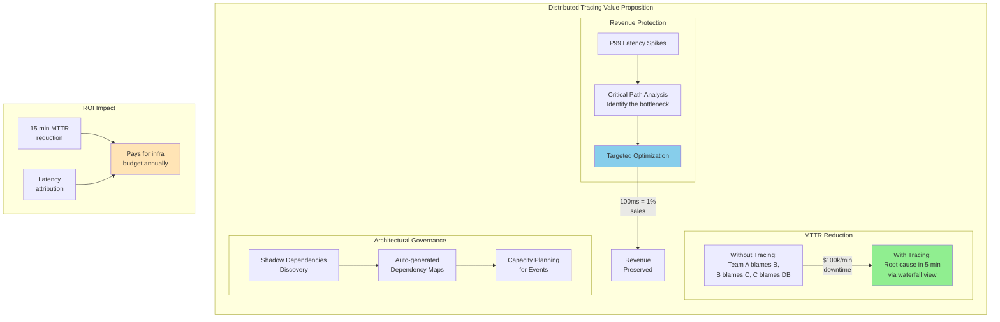
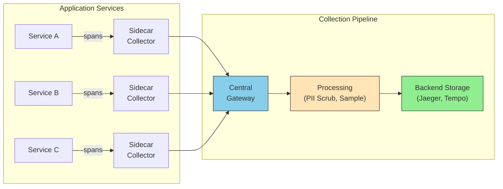
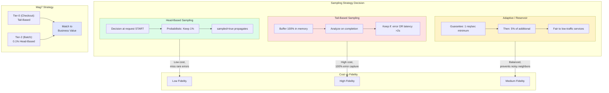

# Distributed Tracing Architecture

This guide covers 5 key areas: I. The Business Necessity of Distributed Tracing at Scale, II. Core Architectural Components, III. Sampling Strategies: The Critical Cost Lever, IV. Standardization and OpenTelemetry (OTel), V. Business Impact and Strategic Capabilities.

## I. The Business Necessity of Distributed Tracing at Scale

At the Principal level, Distributed Tracing ceases to be merely a debugging tool for engineers and becomes a strategic asset for **Operational Excellence** and **Revenue Protection**. In a microservices architecture, the complexity of the system scales non-linearly with the number of services. Without tracing, you have "unknown unknowns"—system behaviors that emerge from the interaction of components but cannot be predicted by analyzing components in isolation.

For a Mag7 TPM, the business necessity centers on three pillars: **MTTR Reduction** (Cost of Downtime), **Tail Latency Management** (Revenue Preservation), and **Architectural Governance** (Technical Debt & Compliance).

### 1. The Economics of Latency and MTTR
In monolithic architectures, a "slow request" was usually a slow database query or a CPU-bound loop. In a distributed mesh, latency is often a product of network chatter, serialization overhead, or a single downstream dependency timing out.

*   **The Business Impact:**
    *   **Revenue:** Amazon famously discovered that every 100ms of latency cost them 1% in sales. Google found an extra 0.5 seconds in search page generation dropped traffic by 20%.
    *   **Operational Cost:** Without tracing, "Mean Time To Detection" (MTTD) might be fast (alerts fire), but "Mean Time To Resolution" (MTTR) skyrockets because teams engage in the "Blame Game." The Checkout team blames the Payment team; the Payment team blames the Database team. Tracing provides the irrefutable evidence required to bypass this friction.

*   **Mag7 Real-World Example:**
    *   **Uber:** Uses **Jaeger** (which they open-sourced) not just to find errors, but to visualize the critical path of a ride request. If the "ETA Calculation" service is slow, does it block the user from booking? Tracing reveals if that call is on the critical path (synchronous) or backgrounded (asynchronous).

### 2. Tradeoffs: The Cost of Observability vs. The Cost of Blindness
Implementing distributed tracing is not free. It imposes overhead on the application (CPU/Network to serialize and send spans) and incurs significant storage costs for the trace data.

*   **The Tradeoff:** **Head-Based Sampling vs. Tail-Based Sampling**.
    *   *Head-Based:* You decide at the start of the request whether to keep the trace (e.g., "Keep 1% of all traffic").
        *   *Pro:* Low overhead, predictable cost.
        *   *Con:* You will likely miss the specific trace for that "one-in-a-million" error that caused a P0 outage.
    *   *Tail-Based:* You collect everything, store it temporarily in memory, and only persist the trace if an error or high latency occurs.
        *   *Pro:* You catch 100% of anomalies. High business value.
        *   *Con:* Extremely expensive and technically complex to buffer massive throughput at Mag7 scale.

*   **Principal TPM Action:** You must negotiate the budget for observability. You cannot trace 100% of requests at Google scale. You must define the sampling strategy that balances **ROI** (cost of storage) against **Risk** (missing a P0 root cause).

### 3. Architectural Governance and Dependency Mapping
As a Principal TPM, you are often responsible for system health and deprecation programs. Distributed Tracing effectively auto-generates your architecture diagrams.

*   **Discovery of "Shadow" Dependencies:**
    *   Teams often hardcode dependencies or fail to deprecate old endpoints. Tracing reveals that Service A is *still* calling the legacy v1 API of Service B, preventing you from decommissioning the old cluster.
*   **Capacity Planning:**
    *   When Marketing plans a "Prime Day" event, you need to know the blast radius. Tracing shows the fan-out factor. If one user request triggers 50 internal calls to the Inventory Service, you know exactly how to scale Inventory for the event.

### 4. Impact on Business Capabilities

| Capability | Impact of Distributed Tracing | Business Value |
| :--- | :--- | :--- |
| **Root Cause Analysis (RCA)** | Shifts from heuristic guessing to deterministic path analysis. | Reduces engineering hours spent on P0/P1 incidents by 40-60%. |
| **SLO Measurement** | allows measurement of SLIs (Service Level Indicators) from the *user's perspective* rather than the server's perspective. | Aligns engineering metrics with actual Customer Experience (CX). |
| **FinOps / Cost Allocation** | By tagging traces with `TenantID` or `FeatureID`, you can calculate exactly how much compute "Feature X" consumes across the entire fleet. | Enables accurate P&L per product feature or customer segment. |

---

## II. Core Architectural Components

### 3C Trace Context (The Standard)
The industry has standardized on **W3C Trace Context**. Before this, different vendors used proprietary headers (e.g., Zipkin used `X-B3-TraceId`, Datadog used `x-datadog-trace-id`).
*   **The Problem:** If Service A (using Datadog) calls Service B (using Dynatrace), the trace breaks because Service B doesn't recognize A's headers.
*   **The Solution:** W3C Trace Context adds a standard `traceparent` header.
*   **Mag7 Reality:** At companies like Microsoft or Amazon, you will inherit legacy systems using non-standard headers. A major TPM initiative is often migrating these services to W3C standards without causing outages, enabling "unified observability" across legacy and modern stacks.

### 3. Instrumentation (The Data Source)
Instrumentation is the code that actually measures the timing and sends the data. There are two primary approaches, and the choice dictates the roadmap you manage.

#### A. Auto-Instrumentation (Agents)
You attach an agent (e.g., Java Agent, Python package) to the application runtime. It automatically intercepts HTTP requests, DB queries, and library calls.
*   **Pros:** Zero code changes required by feature teams; rapid adoption across thousands of services.
*   **Cons:** "Black box" data. It tells you *that* a function was slow, but not *why* (business logic). High overhead if not tuned.
*   **Tradeoff:** High coverage / Low context.

#### B. Manual Instrumentation (SDKs)
Developers import a library (like OpenTelemetry) and wrap specific blocks of code with spans, adding custom attributes (e.g., `user_id`, `cart_value`).
*   **Pros:** High-value business context. You can correlate "High Latency" with "Premium Users."
*   **Cons:** High friction. Requires engineering hours and code reviews.
*   **Tradeoff:** High context / High implementation cost.

**Mag7 Strategy:** Use Auto-Instrumentation as the baseline requirement for all Tier-2/3 services. Mandate Manual Instrumentation only for Tier-0 (critical path) services where detailed business context is required for debugging.

### 4. The Collector (The Aggregation Layer)
Once data is emitted from the application, it shouldn't go directly to the backend database (which would create a connection storm). It goes to a **Collector**.

*   **Architecture:**
    1.  **Sidecar Pattern:** A collector process runs alongside every container (common in Kubernetes/Istio environments).
    2.  **Central Gateway:** A cluster of collectors that receive data from all services.
*   **Function:** The Collector validates data, scrubs PII (Personal Identifiable Information), and buffers the data before sending it to storage.
*   **TPM Impact:** This is your control plane. If the observability vendor bill is too high, you configure the Collector to drop 50% of traces here without asking developers to redeploy their code.

### 5. Sampling Strategies (The Cost vs. Fidelity Lever)
This is the single most critical technical concept for a Principal TPM to master regarding tracing. You cannot record 100% of traces at Mag7 scale. Recording every request at 1M QPS (Queries Per Second) would cost more in storage/compute than the revenue the traffic generates.

#### Head-Based Sampling
The decision to keep or drop a trace is made at the **beginning** of the request (the "Head").
*   **Mechanism:** The ingress service flips a coin. "Keep 1% of traffic." If kept, the `sampled=true` flag propagates downstream.
*   **Mag7 Example:** Twitter/X often uses probabilistic sampling for timeline reads.
*   **Tradeoff:** Low overhead, but you will miss the "needle in the haystack." If an error happens 1 in 10,000 times, and you sample 1 in 1,000, you will statistically miss the error.

#### Tail-Based Sampling
The decision is made at the **end** of the request (the "Tail"). The system buffers 100% of traces in memory, analyzes them, and only stores the interesting ones (e.g., "Keep all errors," "Keep all latencies > 2s").
*   **Mag7 Example:** Uber uses tail-based sampling to ensure that if a rider cannot book a car, that specific trace is *always* captured, even if it's rare.
*   **Tradeoff:** Extremely expensive. Requires massive memory buffers to hold live traces while waiting for them to complete. High ROI for debugging, high infrastructure cost.

### 6. Storage & Visualization (The Backend)
*   **Storage:** Traces are time-series data but with complex relationships. Common backends include Cassandra, Elasticsearch, or managed solutions (Datadog, Honeycomb).
*   **Visualization:** The "Waterfall View" (Gantt chart) is the standard output.
*   **TPM Focus:** Data Retention. How long do we keep traces?
    *   **Hot Storage (3-7 days):** For immediate debugging. Expensive.
    *   **Cold Storage (30 days):** For compliance/audit. Cheap (S3/Blob).
    *   **Business Impact:** Setting retention from 7 days to 14 days can double the observability budget. A Principal TPM must justify this ROI.

---

## III. Sampling Strategies: The Critical Cost Lever

At the scale of a Mag7 infrastructure, capturing 100% of traces is chemically impossible. If a service processes 1 million requests per second (RPS), logging every span for every request would generate petabytes of data daily, saturate network bandwidth, and cost more in storage than the revenue generated by the service itself.

For a Principal TPM, sampling is not just a configuration setting; it is a **financial and strategic lever**. You must balance the **Cost of Observability** (storage, compute, network) against the **Cost of Ignorance** (MTTR, missed SLAs, undetected regressions).

### 1. Head-Based Sampling: The Efficiency Default

This is the most common and least expensive method. The decision to sample a trace is made at the *beginning* of the request lifecycle (at the Ingress or Load Balancer). Once the decision is made (Keep or Drop), that context is propagated downstream. If the Ingress says "Drop," no downstream service generates spans for that ID.

*   **Mechanism:** Usually probabilistic (e.g., "Keep 1 out of every 1,000 requests").
*   **Real-World Mag7 Behavior:**
    *   **Google (Dapper):** In the original Dapper implementation, Google used a sampling rate as low as **0.01%** (1 in 10,000) for high-throughput web search services. Because the volume was so massive, this small percentage still provided enough statistical significance to analyze latency trends.
*   **Tradeoffs:**
    *   **Pros:** Extremely low overhead; no wasted compute generating spans that will be discarded later.
    *   **Cons:** You miss the "Black Swans." If a specific error occurs in 1 out of 5,000 requests, and you are sampling 1 out of 10,000, you will statistically miss the root cause of your P99.9 latency spikes or rare 500 errors.

### 2. Tail-Based Sampling: The Quality Premium

Tail-based sampling delays the decision until the request has *completed*. All spans are generated and held in a buffer (usually a separate telemetry collector tier). Once the request finishes, the system analyzes the trace to decide if it is "interesting" enough to keep.

*   **Criteria for "Interesting":**
    *   Did the request result in an error (HTTP 500)?
    *   Did the latency exceed a threshold (e.g., >2 seconds)?
    *   Is it from a specific VIP Tenant ID?
*   **Real-World Mag7 Behavior:**
    *   **Meta/Facebook:** Heavily relies on tail-based sampling for their debugging tools (Canary analysis). They need to know *exactly* why a specific build caused a regression, which requires keeping 100% of error traces while discarding 99.9% of successful traces.
*   **Tradeoffs:**
    *   **Pros:** 100% visibility into errors and outliers. You never miss a failure context.
    *   **Cons:** **Massive Infrastructure Cost.** You must pay the compute/network cost to generate and transmit *all* telemetry data to a collector layer, even if you delete 90% of it later. This often requires a dedicated "Observability Fleet" of servers.

### 3. Adaptive Rate Limiting (The "Reservoir" Approach)

This is a hybrid approach often managed by the TPM to ensure fairness across services. Instead of a flat percentage, the system guarantees a minimum number of traces per second (the reservoir) and then applies a percentage to traffic above that threshold.

*   **Mechanism:** "Record the first 1 request every second, and 5% of all additional requests."
*   **Real-World Mag7 Behavior:**
    *   **AWS X-Ray:** Uses this model by default. It ensures that low-traffic services (which might only get 1 request a minute) are traced 100% of the time, while high-volume services (10k RPS) don't flood the backend.
*   **TPM Impact:** This prevents "noisy neighbors." Without this, a high-volume logging service could consume the entire tracing budget, starving a critical but low-volume payment service of any visibility.

### 4. Business & ROI Implications

As a Principal TPM, you are often the arbiter of the "Observability Tax." You will face friction between SREs (who want 100% sampling for safety) and Finance/Engineering Leadership (who want to cut the 20% infrastructure overhead).

**The Strategic Decisions:**

1.  **Tiered Fidelity:** You should drive a strategy where Tier-0 services (Checkout, Login) utilize Tail-Based sampling (or high-rate Head-Based), while Tier-2 internal batch jobs use aggressive Head-Based sampling (0.1%).
2.  **Dynamic Sampling:** During an incident (Sev-1), the TPM or Incident Commander must have the capability to dynamically increase sampling rates to 100% for a specific service or region to capture diagnostic data, then throttle it back immediately after resolution.
3.  **Data Retention vs. Sampling:** Often, the cost is not the *ingestion* but the *storage*. A smart tradeoff is to sample heavily (keep 50%) but set a short retention policy (3 days) for high-volume traces, while keeping aggregate metrics (dashboards) for 13 months.

### 5. Common Failure Mode: Broken Traces

A critical risk in sampling is **Incoherent Sampling**.
*   **Scenario:** Service A decides to sample the request. It calls Service B. Service B has a misconfigured local sampler and decides *not* to sample.
*   **Result:** You have the start of the trace, but the middle is missing. The trace looks like the request vanished into a black hole.
*   **TPM Action:** You must enforce **Context Propagation Standards** (like W3C Trace Context). The rule is: *If the upstream says sample, you sample. You do not override the parent's decision unless explicitly configured to do so for security reasons.*

## IV. Standardization and OpenTelemetry (OTel)

### 1. The Strategic Shift to OpenTelemetry (OTel)

Historically, observability was coupled with vendors. If a Mag7 company used New Relic or Splunk, engineers installed vendor-specific agents and wrote vendor-specific code. Switching vendors was a multi-year migration nightmare, effectively creating vendor lock-in.

OpenTelemetry (OTel) is a Cloud Native Computing Foundation (CNCF) project that standardizes how telemetry data (traces, metrics, and logs) is collected and transmitted. It decouples the **generation** of data from the **storage/analysis** of data.

**The TPM Value Proposition:**
For a Principal TPM, OTel is not just a library; it is a leverage point for **Vendor Neutrality** and **Cost Governance**. It allows you to say, "Instrument once, send anywhere."

**Real-World Mag7 Behavior:**
*   **Microsoft:** As a major contributor to OTel, Microsoft has integrated OTel natively into .NET and Azure Monitor. They realized that proprietary agents were a barrier to Azure adoption.
*   **AWS:** Maintained the "AWS Distro for OpenTelemetry" (ADOT). While AWS has X-Ray (proprietary), they recognize customers want standard instrumentation. ADOT allows customers to use OTel collectors to send data to AWS X-Ray, CloudWatch, or third-party partners like Datadog simultaneously.

---

### 2. The OTel Architecture: A TPM’s View

You do not need to know the API syntax, but you must understand the architecture to manage dependencies and infrastructure costs.

#### A. The OTel Collector
The Collector is the most critical component for a TPM to understand. It acts as a proxy or a pipeline between the application and the backend (e.g., Datadog, Honeycomb, Jaeger).

*   **Receivers:** How data gets in (push or pull).
*   **Processors:** Where you manipulate data (batching, obfuscating PII, sampling).
*   **Exporters:** Where data goes (sending to one or multiple backends).

**Tradeoff: Centralized Gateway vs. Sidecar**
*   **Sidecar (Agent per Pod/Host):**
    *   *Pros:* Simple network topology; offloads network overhead from the application immediately.
    *   *Cons:* Higher resource utilization across the fleet; harder to update configuration globally.
*   **Centralized Gateway (Cluster-level Service):**
    *   *Pros:* Centralized governance (TPM friendly); easier to manage secrets/keys; efficient buffering.
    *   *Cons:* Becomes a single point of failure; requires dedicated infrastructure management.

#### B. Auto-Instrumentation vs. Manual Instrumentation
*   **Auto-Instrumentation:** Uses agents to attach to the runtime (Java JVM, Python) and automatically capture HTTP requests, DB queries, etc.
    *   *ROI:* High speed to market. Instant baseline visibility.
    *   *Risk:* Can be noisy (too much data) and lacks business context (doesn't know what "Checkout" means, only knows "POST /cart").
*   **Manual Instrumentation:** Developers write code to start/stop spans and add attributes.
    *   *ROI:* High-value data. Adds specific business tags (e.g., `user_tier: premium`, `cart_value: 500`).
    *   *Risk:* High engineering effort; requires code changes and deployments.

---

### 3. W3C Trace Context: The Interoperability Standard

In the past, if Service A (using Dynatrace) called Service B (using Datadog), the trace broke because they used different header formats to pass the Trace ID.

The industry has standardized on **W3C Trace Context**.
*   **Traceparent Header:** Contains the `version`, `trace-id`, `parent-id`, and `trace-flags`.
*   **Tracestate Header:** Carries vendor-specific information without breaking the trace.

**Impact on Capabilities:**
This standard enables **Polyglot Observability**. A Java service written 5 years ago can seamlessly trace into a new Go service, provided both adhere to W3C standards. As a TPM, you mandate W3C compliance in your "Golden Path" or "Paved Road" platform requirements.

---

### 4. Governance and Sampling Strategies

The biggest friction point in tracing at Mag7 scale is **Cost**. Storing 100% of traces is financially impossible and operationally useless (nobody looks at successful "ping" checks).

#### Head-Based Sampling
The decision to keep or drop a trace is made at the *start* of the request.
*   **Mechanism:** "Keep 1% of all traffic."
*   **Tradeoff:** fast and cheap, but you will likely miss the "needle in the haystack" errors if they are rare (e.g., a bug affecting only 0.05% of users).

#### Tail-Based Sampling
The decision is made at the *end* of the workflow, after the request completes.
*   **Mechanism:** "Keep the trace ONLY IF it resulted in an error OR latency > 2 seconds."
*   **Tradeoff:** This is the "Holy Grail" for debugging. However, it is technically expensive. You must buffer *every* span in memory until the request finishes to decide whether to keep it.
*   **Mag7 Example:** **Meta** and **Google** rely heavily on sophisticated tail-based sampling to ensure engineers only see interesting data, filtering out the noise of billions of successful health checks.

---

### 5. Migration Strategy: The "Strangler Fig" Approach

Moving a massive organization to OTel is a Principal TPM initiative. You cannot stop feature development to rewrite telemetry.

**The Recommended Strategy:**
1.  **Standardize Context Propagation first:** Ensure all services speak W3C Trace Context. This stops the bleeding of broken traces.
2.  **Deploy the OTel Collector:** Place it in front of your legacy vendor.
    *   *Before:* App -> Vendor Agent -> Vendor Backend.
    *   *After:* App -> OTel Collector -> Vendor Backend.
3.  **Swap Instrumentation:** slowly replace proprietary agents with OTel libraries service by service.

**Business Impact/ROI:**
*   **Negotiation Leverage:** Once the OTel Collector is in place, you can route data to a cheaper backend (e.g., Prometheus for metrics) or run a POC with a competitor vendor without touching a single line of application code.
*   **Skill Portability:** Engineers joining from other companies likely know OTel. They don't need to learn a proprietary internal tool.

## V. Business Impact and Strategic Capabilities

At the Principal TPM level, Distributed Tracing ceases to be merely a debugging tool and becomes a strategic asset for **FinOps**, **SLA management**, and **Engineering Velocity**. The primary challenge is not the technical capability to trace, but justifying the cost of observability against the value of reliability and speed.

### 1. MTTR Reduction and SLA Enforcement
The most direct business impact of distributed tracing is the reduction of Mean Time to Resolution (MTTR) during SEV-1 incidents. In a microservices architecture, the "blame game" between teams (e.g., "The network is slow" vs. " The database is locking") extends outages. Tracing provides irrefutable evidence of where latency or errors originate.

*   **Real-World Mag7 Behavior:**
    *   **Amazon:** During high-traffic events (Prime Day), automated tracing triggers circuit breakers. If the "Recommendations" service latency spikes, tracing data informs the orchestrator to degrade gracefully (serve static recommendations) rather than crashing the "Checkout" flow.
    *   **Meta:** Uses tracing data in "SEV Review" meetings. If a team cannot produce a trace linking the symptom to the root cause, the post-mortem is considered incomplete.
*   **Trade-offs:**
    *   **Granularity vs. Storage Cost:** High-resolution tracing (tracing every database call) reduces MTTR but explodes storage costs.
    *   **Decision:** Implement **Adaptive Sampling**. Trace 100% of requests during an anomaly/outage, but only 0.1% during steady state.
*   **Business Impact:**
    *   **ROI:** Every minute of downtime at Mag7 scale can cost \$100k-\$1M+. Reducing MTTR by 15 minutes pays for the entire observability infrastructure for the year.
    *   **CX:** Preserves customer trust by minimizing the "blast radius" of errors.

### 2. FinOps and Cost Attribution
In multi-tenant environments, it is difficult to determine which product feature is driving infrastructure costs. Distributed tracing propagates "Tenant IDs" or "Feature Flags" through the stack, allowing the business to attribute downstream costs (DB CPU, Storage I/O) back to specific upstream initiators.

*   **Real-World Mag7 Behavior:**
    *   **Microsoft Azure:** Uses tracing to bill internal teams. If the "Office 365" team calls an internal storage API, the trace context ensures the bill goes to Office, not the Platform team.
    *   **Uber:** Used tracing (Jaeger) to identify "write amplification." They discovered that a specific rider feature was triggering 50x more database writes than intended, allowing them to cut infrastructure provision by millions.
*   **Trade-offs:**
    *   **Overhead vs. Accuracy:** Injecting extensive metadata (Cost Center IDs, User Segments) into headers adds bytes to every packet, increasing network throughput requirements.
    *   **Decision:** Use **Baggage** (context propagation) selectively. Only propagate high-cardinality metadata that is essential for billing or critical path analysis.
*   **Business Impact:**
    *   **ROI:** Precise chargebacks incentivize teams to optimize their code.
    *   **Capability:** Enables "Unit Economics" analysis (e.g., "What is the exact compute cost of one Search query?").

### 3. Latency as a Revenue Metric
Mag7 companies operate on the axiom that latency equals lost revenue. Tracing is the only mechanism that visualizes the "Critical Path"—the sequence of serial operations that determines total response time.

*   **Real-World Mag7 Behavior:**
    *   **Google:** Famous for the "Long Tail" latency analysis. They don't just look at p50 (median) latency; they obsess over p99 and p99.9. Tracing reveals that the p99 latency is often caused by a "straggler" node or a cold cache in a tertiary service.
    *   **Netflix:** Uses tracing to visualize the difference between "Device Latency" (what the user sees) and "Server Latency." This helps prioritize client-side vs. server-side optimizations.
*   **Trade-offs:**
    *   **Development Velocity vs. Performance:** Enforcing strict latency budgets via tracing (e.g., "Build fails if p99 > 200ms") can slow down feature release cycles.
    *   **Decision:** Establish **Error Budgets**. If a team is within their latency budget, they can ship fast. If they violate it (proven by traces), feature work stops until performance is fixed.
*   **Business Impact:**
    *   **ROI:** Amazon found that every 100ms of latency cost them 1% in sales. Tracing identifies the cheapest way to reclaim that 100ms.

### 4. Strategic Sampling: Balancing Visibility and Cost
The biggest strategic decision a Principal TPM influences is the **Sampling Strategy**. You cannot store every trace at Mag7 scale; the data volume would exceed the production traffic itself.

*   **Approaches:**
    *   **Head-Based Sampling:** The decision to trace is made at the start of the request. (Random 1% of traffic).
        *   *Pros:* Simple, low overhead.
        *   *Cons:* You might miss the one error that happened in the 99% you ignored.
    *   **Tail-Based Sampling:** All traces are collected in a buffer, but only persisted if an error or high latency occurs *at the end* of the request.
        *   *Pros:* You capture 100% of "interesting" traces (errors/outliers).
        *   *Cons:* Extremely high resource cost to buffer this data in memory before decisioning.
*   **Real-World Mag7 Behavior:**
    *   **Meta/Google:** Heavily invest in Tail-Based Sampling for critical paths (Checkout, Login) to ensure no error goes undiagnosed, while using aggressive Head-Based sampling for non-critical logs (batch processing).
*   **Business Impact:**
    *   **Capability:** Tail-based sampling provides "Insurance." You pay a premium (infrastructure cost) to ensure that when a "Black Swan" event happens, you have the data to fix it immediately.

### 5. Migration and Legacy Modernization
Tracing is critical for de-risking monolith-to-microservice migrations. It generates a dynamic dependency map that static code analysis cannot provide.

*   **Impact:** Before deprecating a legacy service, tracing proves exactly who is still calling it. This prevents the "Scream Test" (turning off a server to see who complains).
*   **ROI:** Accelerates technical debt pay-down and reduces the risk of regression during replatforming efforts.

---

## Interview Questions

### I. The Business Necessity of Distributed Tracing at Scale

### Question 1: The Adoption Challenge
**"We are moving from a monolith to microservices. You are the Principal TPM leading the observability strategy. The engineering teams are pushing back on implementing Distributed Tracing because they claim it adds too much latency to their services and the integration effort is too high. How do you handle this?"**

*   **Guidance for a Strong Answer:**
    *   **Acknowledge the validity:** Validate that tracing *does* add overhead (serialization/network). Don't dismiss their concerns.
    *   **Shift the specific ROI:** Pivot from "it helps debugging" to "it reduces on-call burnout." Engineers hate waking up at 3 AM for alerts they can't diagnose.
    *   **Propose a phased approach:** Don't demand 100% coverage immediately. Start with the "Critical Path" (Checkout/Auth).
    *   **Technical Mitigation:** Suggest "auto-instrumentation" agents (like OpenTelemetry agents) that require zero code changes, reducing the "integration effort" argument.
    *   **Data-Driven Decision:** Propose a benchmark. "Let's instrument one service and measure the actual latency penalty. If it's under 5ms, we proceed."

### Question 2: The Sampling Strategy Tradeoff
**"Our bill for DataDog/Splunk/Internal Tracing Storage has tripled in the last quarter as traffic scaled. The CTO wants to cut the observability budget by 50%, but the SRE team says they will fly blind if we cut data retention. As the TPM, how do you resolve this deadlock?"**

*   **Guidance for a Strong Answer:**
    *   **Analyze the data value:** Most trace data is "success" data (HTTP 200 OK) which is rarely looked at after 15 minutes.
    *   **Propose dynamic sampling:** Move from fixed sampling (10% of all traffic) to intelligent sampling (100% of errors, 100% of high latency, 0.1% of success paths).
    *   **Tiered Retention:** Keep full traces for 3 days (hot storage) for debugging, then aggregate them into metrics (cold storage) for long-term trending. This satisfies the SRE need for immediate debugging and the CTO need for cost reduction.
    *   **Business Alignment:** specific features (e.g., "Payments") might need 100% retention for compliance, while "Avatar Uploads" can survive with 0.1% sampling. Differentiate based on business criticality.

### II. Core Architectural Components

### 1. The "Adoption Friction" Scenario
**Question:** "We are migrating to a unified Distributed Tracing system using OpenTelemetry. However, the Checkout Team (Tier-0 service) refuses to adopt the new standard because they claim their legacy proprietary logging is faster and the new sidecar adds 15ms of latency. As the Principal TPM driving this migration, how do you handle this?"

**Guidance for a Strong Answer:**
*   **Acknowledge Validity:** Do not dismiss the engineer's concern. 15ms on a Checkout service is revenue-impacting.
*   **Data-Driven Approach:** Propose a canary deployment to measure the *actual* latency impact, rather than theoretical.
*   **Architecture Compromise:** Discuss optimization strategies (e.g., moving from a sidecar model to an async host-agent model to reduce network hops).
*   **Business Value:** Articulate the "Why." Even if local latency increases slightly, the global benefit of end-to-end visibility might reduce MTTR (Mean Time To Recovery) significantly, protecting revenue during outages.
*   **The "Carve-out":** If the latency is truly unacceptable, define an exception process where they bridge their data to the new format rather than replacing their instrumentation entirely.

### 2. The "Cost Explosion" Scenario
**Question:** "You successfully rolled out distributed tracing six months ago. Today, the VP of Infrastructure tells you the observability bill has tripled and is now $2M/month over budget. What architectural levers do you pull to reduce costs without blinding the engineering teams?"

**Guidance for a Strong Answer:**
*   **Audit Sampling Rates:** Immediately look at Head-based sampling rates. Are we collecting 100% of health checks or success 200 OK responses? Reduce success sampling to 1% while keeping error sampling at 100%.
*   **Refine Retention:** Check if we are storing high-fidelity traces for too long. Move data to cold storage faster.
*   **Span Filtering:** Analyze the data. Are we collecting useless spans (e.g., `getter/setter` methods or internal loop iterations)? Configure the Collector to drop these low-value spans.
*   **Cardinality Check:** Are developers attaching high-cardinality tags (like `session_id` or `uuid`) to metrics derived from traces? This explodes cost in many backends.
*   **Governance:** Establish a "Quota" system per team. If the Recommendations team wants to trace 100% of traffic, they pay for it from their budget, not the central infra budget.

### III. Sampling Strategies: The Critical Cost Lever

### Question 1: The Cost Reduction Challenge
**"Our observability bill has tripled in the last year, and Finance wants a 50% cut. However, the SRE team argues that reducing sampling will blind them to P99 latency issues during Black Friday. As the TPM for Platform, how do you resolve this?"**

*   **Guidance for a Strong Answer:**
    *   **Acknowledge the tension:** Validate both Finance's concern (cost hygiene) and SRE's concern (reliability).
    *   **Propose a hybrid solution:** Move away from flat-rate sampling. Suggest **Tail-Based Sampling** for errors (keep 100% of errors) but aggressive **Head-Based Sampling** for successful requests (keep only 0.1%).
    *   **Differentiate Traffic:** Suggest applying different sampling rates based on business value. "Add to Cart" requests get high fidelity; "Get User Avatar" requests get low fidelity.
    *   **ROI Focus:** Mention that P99 latency usually follows patterns. We don't need 100% of traces to see a P99 spike; we need a statistically significant sample size.
    *   **Governance:** Establish a "Quota" system per team to drive accountability.

### Question 2: The "Missing Trace" Incident
**"A VIP enterprise customer reported a 500 error on a critical API call three times yesterday. The engineering team checked the dashboard, but due to our 1% sampling rate, none of those specific failed requests were captured. The customer is furious. How do you prevent this from happening again without simply turning on 100% sampling?"**

*   **Guidance for a Strong Answer:**
    *   **Immediate Tactical Fix:** Implement **Forced Sampling based on Tenant ID**. Configure the ingress to recognize this VIP's CustomerID in the header and force the sampling bit to `1` (100%) for that specific ID.
    *   **Strategic Fix:** Advocate for **Tail-Based Sampling** specifically for 5xx responses. The system should buffer the trace and only store it if the HTTP response code is >= 500.
    *   **Process Change:** Introduce "On-Demand Tracing" triggers. Allow support engineers to trigger a temporary 100% sample for a specific user session during a live debugging call.
    *   **Metric Fallback:** Remind the interviewer that while we missed the *trace*, we should still have the *logs* and *metrics*. If we don't, that's a separate observability gap.

### IV. Standardization and OpenTelemetry (OTel)

### Question 1: Designing for Cost-Efficiency
**"We are currently spending $10M/year on Datadog, and our tracing ingestion costs are rising linearly with traffic. As a Principal TPM, how would you architect a solution using OpenTelemetry to cut costs by 30% without losing visibility into critical errors?"**

*   **Guidance for a Strong Answer:**
    *   **Architecture:** Propose introducing the **OTel Collector** as a central gateway.
    *   **Tactics:** Do not suggest simply "sampling more." Suggest **Tail-Based Sampling** within the Collector to keep 100% of errors and high-latency traces, while aggressively down-sampling (e.g., to 0.1%) successful/fast requests.
    *   **Filtering:** Mention filtering out health checks and synthetic traffic at the Collector level so they are never sent to the vendor (and thus not billed).
    *   **Attribute pruning:** Suggest removing high-cardinality tags (like raw user inputs) that drive up custom metrics costs.

### Question 2: Managing a Federated Migration
**"You are responsible for Observability across a division with 500 microservices managed by 40 different teams. Currently, it's a mix of three different monitoring tools. How do you drive the migration to a standardized OpenTelemetry stack without halting feature development?"**

*   **Guidance for a Strong Answer:**
    *   **Phasing:** Reject a "big bang" migration. Propose a "Strangler Fig" pattern.
    *   **Interoperability:** Prioritize **W3C Context Propagation** updates first. This ensures that even if teams use different tools, the trace IDs pass through correctly, maintaining the distributed trace.
    *   **Platform Approach:** Lean on the Platform Engineering team to bake OTel auto-instrumentation into the base Docker images or CI/CD pipelines. If it comes "for free" with the platform, adoption friction drops to near zero.
    *   **Incentives:** Create a "Gold Standard" certification for services. Services that adopt OTel get better support SLAs or easier access to new dashboarding tools.

### V. Business Impact and Strategic Capabilities

### Question 1: The Cost/Value Conflict
**"Our CFO is flagging that our Observability bill (Datadog/Splunk/Internal Storage) has grown 30% YoY, outpacing our user growth. As the Principal TPM, how do you approach this? Do we just cut data retention?"**

*   **Guidance for a Strong Answer:**
    *   **Avoid:** Knee-jerk reactions like "Just cut retention to 3 days" or "Sample everything at 1%."
    *   **Strategic Approach:**
        1.  **Audit Value:** Differentiate between "Write-heavy" and "Read-heavy" data. Are we storing traces nobody queries?
        2.  **Implement Tiered Sampling:** Propose keeping 100% of traces for high-value transactions (Payments) and 0.1% for health checks.
        3.  **Tail-Based Sampling:** Suggest moving to tail-based sampling to only store "interesting" traces (errors/latency spikes) rather than successful, fast requests (waste).
        4.  **Attribution:** Shift the conversation from "Infrastructure Cost" to "COGS" (Cost of Goods Sold). Show that the 30% increase correlates with a specific new product launch, and attribute the cost to that P&L to determine if the feature is profitable.

### Question 2: Cross-Organizational Friction
**"We have a microservices architecture with 50 teams. Team A (Checkout) claims their latency spikes are caused by Team B (Inventory), but Team B's dashboards show they are healthy. This argument has delayed the SEV-1 resolution for 2 hours. How do you solve this systemically?"**

*   **Guidance for a Strong Answer:**
    *   **Identify the Gap:** Acknowledge that "Green Dashboards" on individual services mean nothing if the aggregate user experience is broken. This indicates a lack of *Distributed* Tracing context propagation.
    *   **Technical Solution:** Mandate the propagation of a unified `TraceID` across boundaries.
    *   **Process Solution:** Establish a "Single Pane of Glass" policy. During SEVs, teams must look at the *Trace* view (Waterfall), not their local metrics.
    *   **Cultural Shift:** Move from "Mean Time to Innocence" (proving my service is fine) to "Mean Time to Resolution" (fixing the user path).
    *   **Action:** Implement Service Level Objectives (SLOs) based on the *Client's* perspective (the Span calling Team B), not Team B's internal server latency (which might exclude network time or queue time).

---

## Key Takeaways

- Review each section for actionable insights applicable to your organization

- Consider the trade-offs discussed when making architectural decisions

- Use the operational considerations as a checklist for production readiness
