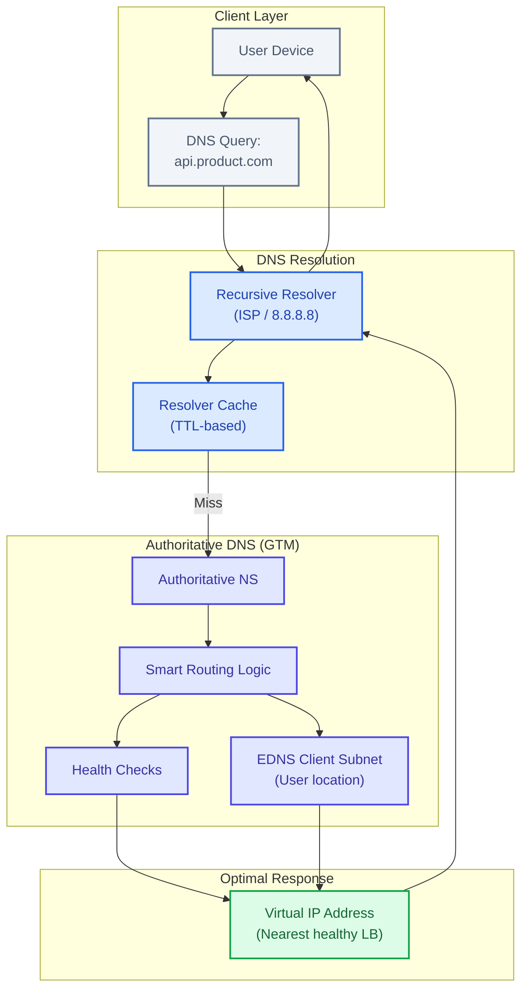
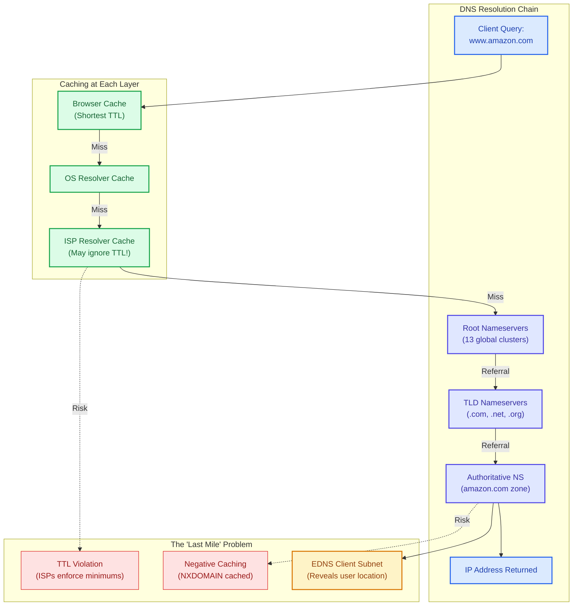
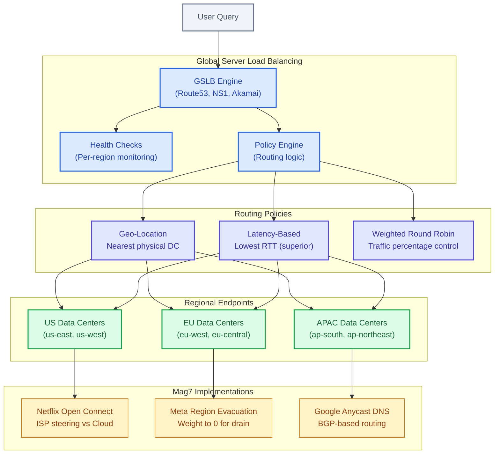
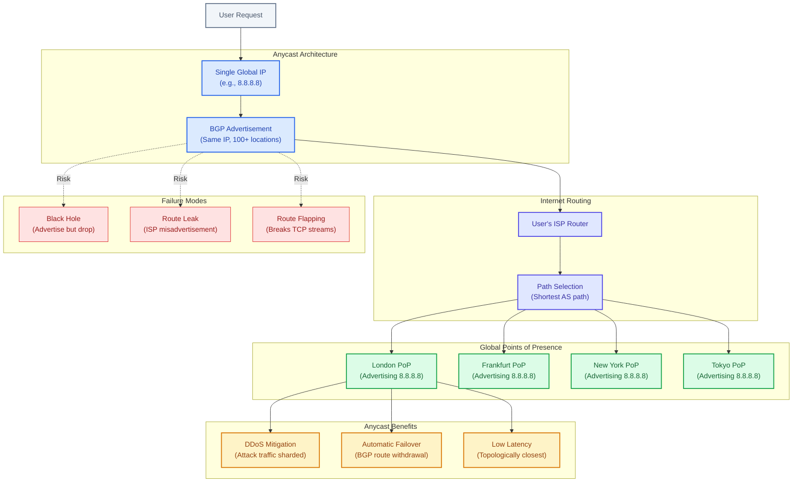
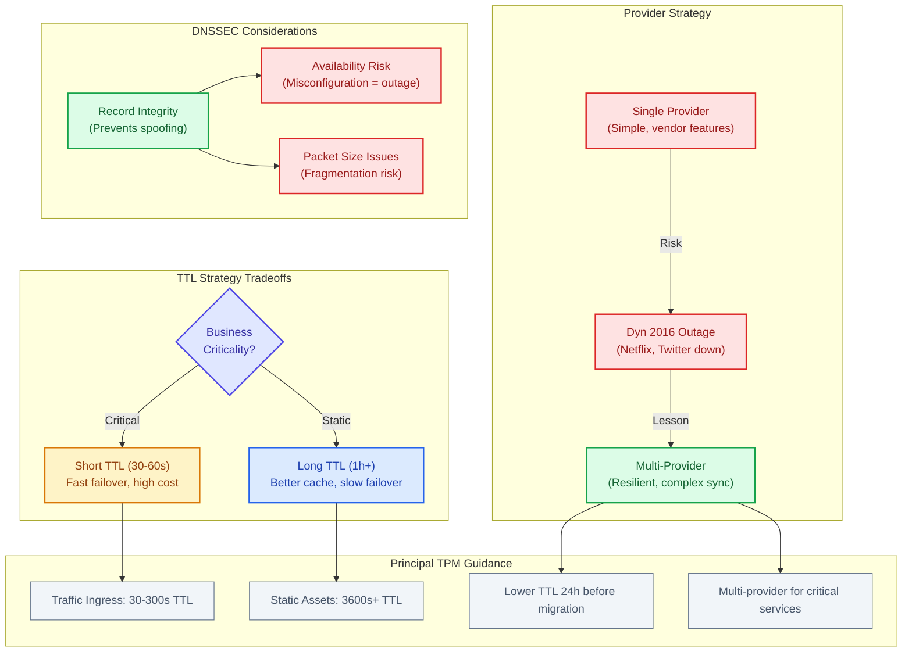

# DNS Architecture

    Resolution Chain: Client → Local Resolver → Root NS → TLD NS (.com) → Authoritative NS → IP returned. Each step can cache. TTL controls cache duration. Lower TTL = faster failover but more DNS traffic.
    DNS-based Load Balancing: Return multiple IPs (round-robin). Or use health checks to return only healthy endpoints. Limitation: Client caching means changes are not instant. Typical propagation: seconds to hours depending on TTL.
    Anycast: Same IP advertised from multiple locations via BGP. Nearest location (by network hops) answers. Used by CDNs and DNS providers. Automatic failover as routes update within seconds.

**Common Pitfall:** DNS caching means you cannot rely on DNS for instant failover. If your TTL is 300s (5 min) and datacenter goes down, some clients will keep trying the dead IP for 5 minutes. Use health checks at load balancer level for faster failover.

This guide covers 5 key areas: I. DNS as the Global Control Plane, II. The Resolution Chain & The "Last Mile" Problem, III. DNS-Based Load Balancing (GSLB), IV. Anycast: Performance & DDoS Mitigation, V. Strategic Tradeoffs & Risk Management.

## I. DNS as the Global Control Plane

At a Mag7 scale, DNS is the **Control Plane for Traffic Engineering**. It is the first decision point in the request lifecycle. Before a user hits a Load Balancer (L7) or a Firewall (L4), DNS determines the physical and logical destination of the packet.

For a Principal TPM, DNS must be viewed through the lens of **Resiliency** (how we survive failures) and **Performance** (how we reduce latency).

### Mag7 Real-World Behavior
*   **Google:** Uses a unified Global Software Load Balancer (GSLB) where DNS is the first tier. It returns IP addresses based on the real-time load of data centers, not just proximity.
*   **Meta:** Utilizes DNS for "Edge Traffic Management." During the massive 2021 outage, the issue was exacerbated because their internal DNS servers (authoritative) withdrew their BGP routes, effectively erasing `facebook.com` from the internet.
*   **Azure:** Uses Traffic Manager to route based on endpoint health. If the primary region fails health checks, DNS answers are updated to point to the failover region immediately.

### The Mechanics of "Smart" Routing (GTM)

Standard DNS is static (A Record = IP). Mag7 infrastructure relies on **Dynamic DNS**, often referred to as Global Traffic Management (GTM).

#### The Mechanism
When the Authoritative Name Server receives a query, it does not look up a static file. It executes logic:
1.  **Identify Source:** Where is the user? (GeoIP or EDNS Client Subnet).
2.  **Check Health:** Is the target data center healthy? (Health Checks).
3.  **Check Policy:** Is the target overloaded? (Shedding load).
4.  **Construct Response:** Return the VIP (Virtual IP) of the optimal Load Balancer.

#### EDNS Client Subnet (ECS)
**The Problem:** A user in London uses a Corporate VPN or a Public Resolver (like 8.8.8.8) based in New York. Standard DNS sees the request coming from New York and routes the London user to a US Data Center. Result: massive latency.
**The Solution (ECS):** The recursive resolver passes a truncated version of the client's actual IP (e.g., `192.0.2.0/24`) to the Authoritative server.
**Mag7 Impact:** Netflix Open Connect relies heavily on this to map users to the specific ISP-embedded cache server sitting down the street from the user, rather than a generic regional server.

#### Tradeoff Analysis: GTM Logic
| Strategy | Mechanism | Tradeoff | Business Impact |
| :--- | :--- | :--- | :--- |
| **Geo-Routing** | Route to nearest physical location. | **Pro:** Lowest theoretical network latency. **Con:** Does not account for capacity. Can DDoS a local region during a spike. | **CX:** Fast load times. **Risk:** Regional outages cascade if traffic isn't shifted. |
| **Latency-Based** | Route based on network measurements. | **Pro:** Best actual user experience. **Con:** Requires complex measurement infrastructure (Real User Monitoring - RUM). | **ROI:** Higher conversion rates due to speed. **Cost:** High engineering overhead. |
| **Weighted Round Robin** | Distribute traffic % across endpoints. | **Pro:** Great for A/B testing or canary deployments. **Con:** Latency is inconsistent (some users routed further away). | **Capability:** Enables safe "Blast Radius" reduction during rollouts. |

### Availability Architecture: Anycast vs. Unicast

At the Principal level, you must decide how the DNS service *itself* survives attacks.

#### Unicast (One-to-One)
*   **Mechanism:** One IP address corresponds to one specific server.
*   **Failure Mode:** If the link to that server is cut, the IP is unreachable.
*   **Mag7 Verdict:** Rarely used for critical public-facing DNS ingress.

#### Anycast (One-to-Many)
*   **Mechanism:** The same IP address (e.g., `8.8.8.8`) is announced via BGP from hundreds of locations worldwide. The network routes the user to the *topologically closest* instance.
*   **DDoS Mitigation:** If a botnet attacks the DNS server, the attack traffic is distributed across global nodes rather than concentrating on one. The attack is "absorbed" by the global capacity.
*   **Mag7 Example:** Cloudflare and Google rely entirely on Anycast. If the London node goes offline, BGP routes automatically shift London traffic to Amsterdam or Paris instantly. No DNS propagation required.

### Business & Technical Impact Summary

| Dimension | Impact |
| :--- | :--- |
| **ROI / Cost** | **High Query Volume Cost:** Low TTLs increase billable queries (if using managed DNS) and compute load.  **Revenue Protection:** High availability DNS prevents revenue loss during outages. |
| **CX (Customer Exp)** | **Latency:** DNS resolution time is "blocking." Slow DNS = Slow First Byte.  **Reliability:** Users blame the app, not the DNS. Failures here damage brand trust immediately. |
| **Skill / Capabilities** | **Incident Response:** Teams must know how to "drain" a region via DNS.  **Observability:** Requires specialized monitoring (DNS RUM) to see if users in specific geos are failing to resolve. |

---

## II. The Resolution Chain & The "Last Mile" Problem

For a Principal TPM, the mechanics of the resolution chain represent the friction between **control** (what you configure) and **compliance** (what the internet actually does). The "Last Mile" in DNS refers to the behavior of Recursive Resolvers (ISPs, Enterprise proxies) that sit between your user and your Authoritative Name Servers.

You do not control these resolvers, yet they dictate the efficacy of your failover strategies and the accuracy of your geo-routing.

### The Recursive Resolver & EDNS0 (Client Subnet)

When a user queries `api.product.com`, they rarely ask your servers directly. They ask a Recursive Resolver (e.g., Comcast, AT&T, or Google 8.8.8.8).

**The Technical Challenge:**
Traditionally, if a user in London used a US-based corporate VPN or a US-based resolver (like a company HQ DNS), your Authoritative Server would see the request coming from the *US*, not London. Consequently, it would route the London user to a US Data Center, introducing massive latency.

**The Mag7 Solution: EDNS0 Client Subnet (ECS)**
Modern Mag7 DNS architectures utilize **EDNS0 Client Subnet**. This extension allows the Recursive Resolver to pass a truncated version of the *original client's IP address* (e.g., the first 24 bits) to the Authoritative Server.

*   **Real-World Example (Google/YouTube):** When a user queries YouTube, Google's DNS servers look at the ECS data. Even if the user is using OpenDNS (Cisco) routed through Frankfurt, if the ECS data shows the client IP is in Berlin, Google returns the IP for the Berlin edge node, not Frankfurt.
*   **Trade-off:**
    *   **Privacy vs. Precision:** Passing client IP data increases routing precision but raises privacy concerns. Some public resolvers (like Cloudflare 1.1.1.1) deliberately minimize ECS usage for privacy, which can occasionally degrade geo-routing accuracy for the end-user.
    *   **Cache Fragmentation:** Enabling ECS reduces the efficiency of the resolver's cache. Instead of caching one answer for `google.com` for everyone, the resolver must cache different answers for different subnets, increasing load on your Authoritative Servers.

### TTL Strategy: The Cost of Agility

Time To Live (TTL) is the primary lever a TPM has to balance **Mean Time to Recover (MTTR)** against **Cost**.

**Technical Depth:**
TTL dictates how long a Recursive Resolver holds a record before re-querying your Authoritative Server.
*   **Short TTL (30s - 60s):** Forces resolvers to check back frequently.
*   **Long TTL (1h - 24h):** Allows resolvers to serve stale data from memory.

**Mag7 Implementation Strategy:**
Mag7 companies do not apply a blanket TTL; they segment by asset volatility.

| Asset Type | Typical TTL | Rationale | Business Impact |
| :--- | :--- | :--- | :--- |
| **Traffic Ingress (LBs)** | 30s - 300s | Enables rapid **Region Evacuation**. If `us-east-1` fails, DNS must shift traffic to `us-west-2` immediately. | **High Cost / High Agility.** Millions of extra queries translate to higher AWS Route53/NS1 bills, but prevents SLA breaches. |
| **Static Assets (CDN)** | 3600s+ | Images/JS files on S3/CloudFront rarely change IP addresses. | **Low Cost / High Performance.** Reduces latency for the user (no lookup wait) and reduces billable query volume. |
| **DKIM/TXT Records** | 24h+ | Verification records change infrequently. | **Lowest Cost.** No need for agility here. |

**The "Last Mile" Behavior (The Rogue ISP):**
A critical edge case is **TTL Violation**. Many consumer ISPs (particularly in developing markets or smaller providers) ignore low TTLs (e.g., 30s) and enforce a minimum floor (e.g., 300s or 3600s) to reduce bandwidth on their own infrastructure.
*   **Impact on Incident Management:** Even if you update your DNS to failover away from a burning data center, users on non-compliant ISPs will continue to be routed to the dead data center until *their* forced TTL expires. This creates the "Long Tail" of traffic during an outage.

### Negative Caching (The "Zombie" Outage)

A frequently overlooked aspect of the resolution chain is **Negative Caching** (caching the *absence* of a record).

If a user requests a subdomain that doesn't exist (NXDOMAIN), the resolver caches that "does not exist" response for a duration defined by the **SOA (Start of Authority) Minimum TTL**.

**Real-World Failure Mode:**
1.  A deployment script accidentally deletes the DNS record for `login.platform.com`.
2.  Users query it, receive "NXDOMAIN", and their ISP caches this "non-existence."
3.  DevOps restores the record 2 minutes later.
4.  **The Issue:** Users are still blocked. The ISP resolver is serving the cached "This doesn't exist" response until the *Negative TTL* expires (often default is 900s or 3600s).
5.  **Impact:** The outage duration is not determined by how fast you fix the config, but by the Negative TTL setting in your SOA record.

### Business & Strategic Impact

As a Principal TPM, your architectural choices in the Resolution Chain directly impact the P&L and Customer Experience (CX).

**1. Availability vs. OpEx (The Bill)**
Moving from a 1-hour TTL to a 60-second TTL on a service with 100M Daily Active Users (DAU) will increase DNS query volume by orders of magnitude.
*   **ROI Analysis:** You must calculate if the cost of 59 minutes of potential downtime (revenue loss + SLA penalties) exceeds the monthly increase in DNS vendor costs. For Mag7 Core services (Search, Shopping Cart), the answer is yes. For internal tooling or blogs, the answer is no.

**2. Latency & Revenue Conversion**
DNS resolution is blocking; the browser cannot start fetching content until DNS resolves.
*   **CX Impact:** Poor DNS architecture (e.g., lack of Anycast, poor geo-routing without ECS) adds 50ms–200ms to the "Time to First Byte" (TTFB). In e-commerce (Amazon), 100ms latency correlates directly to a measurable drop in conversion rates (sales).

**3. Disaster Recovery Capability**
If your Disaster Recovery (DR) plan relies on DNS Failover, your **RTO (Recovery Time Objective)** is mathematically floored by your TTL + ISP propagation delays.
*   **Capability Check:** If your business contract promises a 5-minute RTO, but your DNS TTL is set to 1 hour, you are contractually non-compliant by design.

---

## III. DNS-Based Load Balancing (GSLB)

At the Principal level, you must view DNS not as a static map, but as a dynamic **traffic steering engine**. Global Server Load Balancing (GSLB) is the logic layer sitting on top of the Authoritative Name Server. It decides *which* IP address to return based on the health of your infrastructure, the location of the user, and business logic (cost/capacity).

Unlike a traditional Load Balancer (like an AWS ALB or Nginx) which sits *in* a data center and distributes traffic to servers, GSLB sits *above* the data centers and distributes traffic to **regions**.

### The Mechanics of Traffic Steering

When a Recursive Resolver queries your Authoritative Name Server (e.g., AWS Route53, NS1, Akamai), the GSLB engine executes a policy before returning an A-record.

#### Routing Policies
*   **Geo-Location Routing:** Returns the IP of the data center geographically closest to the user (e.g., User in France → Frankfurt DC).
*   **Latency-Based Routing:** Returns the IP with the lowest network latency (Round Trip Time - RTT) for that user. This is generally superior to Geo-Location because "closest" doesn't always mean "fastest" due to fiber routes and BGP peering.
*   **Weighted Round Robin:** Distributes traffic based on assigned percentages (e.g., 80% to Stable, 20% to Canary). This is the foundation of **Blue/Green deployments** and **A/B testing** at the infrastructure level.

#### The "EDNS0 Client Subnet" (ECS) Extension
*   **The Problem:** Historically, the Authoritative Server only saw the IP address of the *Recursive Resolver* (e.g., the ISP's server), not the actual *User's* device. If a user in London used a Google DNS resolver (8.8.8.8) that happened to be routed via New York, the GSLB would mistakenly send the London user to a US data center.
*   **The Solution (ECS):** Modern resolvers pass a truncated version of the user's IP address (the subnet) to the Authoritative Server. This allows the GSLB to make accurate routing decisions based on the user's actual location.

### Real-World Behavior at Mag7

**Netflix: ISP Steering vs. Cloud**
Netflix uses GSLB to prioritize their Open Connect Appliances (OCAs)—cache servers embedded directly inside ISPs.
*   **Logic:** When a user requests video, DNS checks: "Is the OCA inside this user's ISP healthy and holding the file?"
*   **Action:** If yes, return the OCA's internal IP (zero transit cost). If no (or if the OCA is overloaded), return the IP for AWS (higher cost, guaranteed availability).
*   **Business Impact:** Massive reduction in egress bandwidth costs and latency.

**Meta: Region Evacuation (Disaster Recovery)**
Meta treats entire data center regions as ephemeral. If the "Ashburn" region suffers a power failure or requires a kernel patch:
*   **Logic:** Engineers update the GSLB weight for Ashburn to 0.
*   **Action:** DNS responses immediately stop handing out Ashburn IPs. As client caches expire (TTL), traffic naturally shifts to Atlanta or Texas.
*   **Tradeoff:** The receiving regions must have **provisioned headroom** (buffer capacity) to absorb this surge, costing millions in idle compute.

**Google: Anycast DNS**
Google (and Cloudflare) utilizes Anycast heavily.
*   **Logic:** The same IP address is announced from multiple physical locations worldwide via BGP.
*   **Action:** The user's request is routed by the internet backbone to the *topologically* nearest Point of Presence (PoP). The PoP then proxies the traffic to the backend.
*   **Benefit:** Mitigates DDoS attacks naturally. If one PoP is overwhelmed, BGP shifts traffic to the next closest PoP.

### Tradeoffs & Strategic Decisions

As a Principal TPM, you will often arbitrate between Reliability, Performance, and Cost.

| Decision Point | Option A | Option B | Tradeoff Analysis |
| :--- | :--- | :--- | :--- |
| **TTL Strategy** | **Short TTL (30s - 60s)** | **Long TTL (1hr+)** | **Short:** Allows near-instant traffic draining during outages but increases load on DNS servers and adds latency (more lookups). **Long:** High cache hit rate (faster CX) but leaves users stranded during an outage until the cache expires. |
| **Health Checks** | **Aggressive (Every 10s)** | **Passive / Slow** | **Aggressive:** Detects failures fast ("Fail Open") but risks "Flapping" (marking healthy servers as dead due to minor network blips), causing cascading failures. **Passive:** More stable, but users see errors longer during a crash. |
| **Granularity** | **Precise (EDNS0 enabled)** | **Coarse (Resolver IP)** | **Precise:** Better latency for users, but reduces cache effectiveness (caches are fragmented by subnet). **Coarse:** Better caching efficiency, but potential for suboptimal routing (London user sent to NY). |

### Impact on Business & ROI

**1. Cost Optimization (Arbitrage)**
GSLB can be programmed to route traffic to regions where compute/electricity is cheaper, provided latency stays within SLA.
*   *Example:* Routing background batch processing or free-tier user traffic to a data center with excess capacity at night (Follow-the-moon strategy).

**2. Availability (The "Four Nines")**
DNS is the only component that exists *outside* your failure domain. If your Load Balancer fails, your Load Balancer cannot redirect traffic. Only DNS can redirect traffic *away* from a failed Load Balancer.
*   *ROI:* Prevents total service collapse, protecting revenue and SLA credits.

**3. Customer Experience (CX)**
Amazon found that every 100ms of latency cost 1% in sales. GSLB ensures users connect to the endpoint that offers the lowest RTT, directly influencing revenue conversion.

### Actionable Guidance for TPMs

1.  **Define the "Fail Open" Policy:** If your GSLB health checks fail (e.g., the monitoring agent dies), does DNS stop returning IPs (taking the site down) or return *all* IPs (hoping some work)? **Always default to Fail Open** (return all IPs) for high-availability consumer apps.
2.  **Manage the "Sticky" Problem:** DNS-based load balancing is **stateless**. If a user is shifted from Region A to Region B mid-session, their session token must be valid in Region B.
    *   *Requirement:* You must ensure your application architecture supports **stateless authentication** (e.g., JWTs) or distributed session stores (Redis/Memcached replicated across regions) before implementing aggressive GSLB.
3.  **Audit TTLs Pre-Migration:** Before a major migration or high-risk event, lower your DNS TTLs to 60 seconds 24 hours in advance. This gives you agility to revert changes quickly.

---

## IV. Anycast: Performance & DDoS Mitigation

For a Principal TPM, understanding Anycast is essential because it is the architectural foundation for how Mag7 companies achieve **global scale, single-IP entry points, and massive DDoS resilience**.

While DNS resolves the name, **Anycast** is the networking methodology that ensures the user connects to the *closest* physical data center using a single, static IP address.

### The Core Concept: "One IP, Many Locations"

In a standard (Unicast) model, one IP address corresponds to one specific server.
In an **Anycast** model, the same IP address (e.g., `8.8.8.8`) is advertised via BGP (Border Gateway Protocol) from hundreds of locations simultaneously.

When a user sends a request to that IP, the public internet routers direct the packet to the **topologically closest** location.

**Mag7 Context:**
*   **Google:** When you query `8.8.8.8`, you aren't hitting a server in Mountain View. You are hitting a Google Edge Node in your local metro area.
*   **AWS Global Accelerator:** Uses Anycast to onboard user traffic onto the AWS backbone as close to the user as possible, bypassing the congested public internet.
*   **Microsoft/Azure Front Door:** Uses Anycast to route HTTP traffic to the nearest edge Point of Presence (PoP).

### Mechanism: BGP & Route Advertisement

You do not need to configure routers, but you must understand the logic to discuss architecture with SREs.
1.  **Advertisement:** Mag7 infrastructure announces "I know the path to IP X" from 50+ global locations.
2.  **Selection:** The user's ISP router looks at all available paths and chooses the "shortest" one (usually fewest network hops).
3.  **Failover:** If the London PoP goes offline, it stops advertising the route. The ISP routers automatically update and send London traffic to the next closest PoP (e.g., Amsterdam or Dublin).

### Key Use Case: DDoS Mitigation (The "Waterproofing" Effect)

Anycast is the primary defense against volumetric DDoS attacks.

*   **The Problem:** In Unicast, if an attacker sends 100Gbps of traffic to a single data center with a 50Gbps pipe, the site goes down.
*   **The Anycast Solution:** Because the IP is advertised globally, attack traffic is attracted to the *closest* PoP to the *attacker*.
    *   Botnets in Russia hit the Moscow PoP.
    *   Botnets in Brazil hit the Sao Paulo PoP.
*   **Result:** The attack is effectively **sharded** or diluted across the entire global infrastructure. No single site is overwhelmed. The "Blast Radius" is contained to the local PoPs, leaving the rest of the world unaffected.

### Tradeoffs & Architectural Choices

As a Principal TPM, you will often arbitrate between Network Engineering (who want simplicity) and Product (who want specific user targeting).

| Feature | Unicast (Standard) | Anycast | Principal TPM Tradeoff Analysis |
| :--- | :--- | :--- | :--- |
| **Latency** | Variable. High if user is far from the specific server. | **Lowest.** User hits nearest edge node. | **Tradeoff:** Anycast requires massive global infrastructure investment. |
| **Traffic Control** | High. You know exactly where traffic goes. | **Low.** You rely on ISP routing policies (BGP). | **Risk:** A user in New York might be routed to London due to weird ISP peering, increasing latency. |
| **Troubleshooting** | Easy. "Ping" goes to one host. | **Hard.** "Ping" goes to different hosts depending on where you stand. | **Operational Impact:** Debugging requires looking glass tools and traceroutes from the *client's* perspective. |
| **State Management** | Easy. TCP connections stay put. | **Complex.** Route flaps can break TCP. | **Constraint:** Anycast is perfect for UDP (DNS). For TCP (HTTP), you need highly stable routes or "Connection Termination" at the edge. |

### Business & ROI Impact

*   **CapEx vs. OpEx:** Implementing Anycast requires a global footprint (CapEx/Infrastructure cost) but drastically reduces the operational cost of managing traffic spikes and DDoS attacks (OpEx).
*   **Customer Experience (CX):** Reduces Last Mile latency. For a platform like **Netflix** or **YouTube**, shaving 50ms off the connection start time directly correlates to increased viewing time and lower churn.
*   **Availability SLA:** Anycast allows Mag7 companies to offer 99.99%+ SLAs. If a region fails, traffic re-routes automatically without DNS TTL propagation delays.

### Edge Cases & Failure Modes

1.  **The "Black Hole":** If a PoP fails internally but keeps advertising BGP routes, it attracts traffic and drops it.
    *   *Mitigation:* Automated health checks that withdraw BGP routes immediately upon service failure.
2.  **Route Leaks:** Sometimes an ISP accidentally advertises your Anycast routes incorrectly, sending global traffic through a tiny pipe in a small ISP.
    *   *Mitigation:* Route origin validation (RPKI) and strict peering monitoring.
3.  **Route Flapping:** If the "shortest path" changes rapidly between two PoPs, a user's packets might alternate destinations.
    *   *Impact:* Breaks TCP streams (dropped calls, failed uploads).
    *   *Mitigation:* SREs tune BGP "stickiness" or terminate TCP at the edge (proxying).

---

## V. Strategic Tradeoffs & Risk Management

For a Principal TPM, DNS is the lever for **Global Traffic Management (GTM)**. It is the mechanism by which you balance the cost of infrastructure against the cost of downtime. The strategic decisions made here define the system's Recovery Time Objective (RTO) and user-perceived latency.

### The TTL Strategy: Agility vs. Reliability & Cost

The Time To Live (TTL) setting is the most consequential configuration in DNS strategy. It dictates how long a recursive resolver caches your record before querying your authoritative nameserver again.

**Technical Depth:**
*   **Short TTL (30s - 60s):** Forces resolvers to query authoritative servers frequently. This enables rapid traffic shifting (e.g., draining a region within minutes). However, it places a massive query load on authoritative servers and increases the "long tail" latency for users, as the DNS lookup is not cached as often.
*   **Long TTL (1h - 24h):** Reduces load on authoritative servers and improves user performance via high cache hit rates. However, it "pins" traffic. If an endpoint fails, users are stuck trying to connect to a dead IP until the TTL expires.

**Real-World Behavior at Mag7:**
*   **Meta/Google (Traffic Edge):** Use extremely short TTLs (often 30-60 seconds) for their primary entry points (Load Balancers). This allows automated systems to drain traffic from a datacenter detecting high error rates almost instantly.
*   **AWS S3/Static Assets:** Often use longer TTLs because the underlying IP endpoints are stable Anycast addresses that rarely change.

**Tradeoffs:**
*   **Agility:** Short TTL allows for &lt;1 min RTO; Long TTL implies RTO = TTL duration.
*   **Performance:** Short TTL adds network round-trips (latency) to the user experience.
*   **Cost:** Short TTL increases billable queries (if using a managed provider like Route53 or NS1) by orders of magnitude.

**Business/ROI Impact:**
*   **CapEx/OpEx:** A 60s TTL can cost 60x more in DNS query fees than a 1-hour TTL. For a service with billions of requests, this is a distinct P&L line item.
*   **CX:** Short TTL protects CX during outages (fast failover) but degrades CX during normal operations (latency).

### Single vs. Multi-Provider Architecture

Does the organization rely solely on one DNS provider (e.g., AWS Route53) or implement a redundant multi-vendor strategy (e.g., Route53 + Cloudflare)?

**Technical Depth:**
*   **Single Provider:** Simple to manage. You use the provider's proprietary advanced features (e.g., Route53's Alias records, latency-based routing).
*   **Multi-Provider:** You publish identical zones to two providers. If Provider A goes down (DDoS or outage), Provider B answers.
*   **The Synchronization Challenge:** Standard DNS (`A` records) is easy to sync. Advanced traffic steering (Geo-routing, Weighted Round Robin) is **proprietary** and does not translate between vendors. You must build an abstraction layer (control plane) to translate your intent into Vendor A config and Vendor B config simultaneously.

**Real-World Behavior at Mag7:**
*   **The "Dyn" Lesson:** In 2016, a massive DDoS took down Dyn DNS, taking Netflix, Twitter, and Reddit offline. This triggered a shift toward multi-provider setups for critical external-facing services.
*   **Mag7 Internal:** Most Mag7 companies build their own authoritative DNS infrastructure (Google Cloud DNS, Amazon Route53) and rely on internal redundancy (Anycast clusters) rather than external vendors. However, for their *enterprise customers*, they recommend multi-region redundancy.

**Tradeoffs:**
*   **Resilience vs. Complexity:** Multi-provider eliminates the DNS provider as a Single Point of Failure (SPOF) but introduces massive engineering complexity to keep records in sync.
*   **Feature Velocity:** Using multi-provider forces you to the "lowest common denominator" of features. You cannot use AWS-specific latency routing if your secondary provider (e.g., Akamai) implements it differently.

**Business/ROI Impact:**
*   **Risk:** Mitigates the "Black Swan" event of a total provider failure.
*   **Skill/Capability:** Requires a specialized Traffic Engineering team to manage the abstraction layer. High engineering overhead.

### DNSSEC (Domain Name System Security Extensions)

Should we cryptographically sign DNS records to prevent spoofing/cache poisoning?

**Technical Depth:**
*   DNSSEC adds cryptographic signatures to DNS records. It prevents a "Man in the Middle" from redirecting `google.com` to a malicious IP.
*   **The Packet Size Problem:** DNSSEC keys significantly increase the size of UDP packets. This can lead to IP fragmentation or packets being dropped by firewalls that assume DNS packets are small (512 bytes).

**Real-World Behavior at Mag7:**
*   **Adoption is nuanced:** While highly recommended for security, rollout is cautious.
*   **Google Public DNS:** Validates DNSSEC, but not all Google domains implement it on the authoritative side due to the performance overhead and packet size risks associated with high-volume, latency-sensitive consumer traffic.
*   **Slack (Salesforce):** Famously had a major outage caused by a DNSSEC rollout configuration error.

**Tradeoffs:**
*   **Integrity vs. Availability:** DNSSEC guarantees you are talking to the right server (Integrity). However, misconfiguration results in total unreachability (Availability drops to 0).
*   **Security vs. Latency:** The added packet size and validation steps introduce slight latency and processing overhead.

**Business/ROI Impact:**
*   **Trust:** Essential for high-security environments (GovCloud, Fintech).
*   **Risk:** High risk of self-inflicted downtime during key rotation or implementation.

---

## Interview Questions

### I. DNS as the Global Control Plane

#### Question 1: The Migration Strategy
**"We are migrating our primary payment gateway from an On-Premise Data Center to AWS. The business requirement is zero downtime, and we must be able to roll back instantly if errors spike. Describe your DNS strategy for this migration."**

**Guidance for a Strong Answer:**
*   **Preparation (TTL Lowering):** Explicitly mention lowering the TTL of the relevant records (e.g., from 1 hour to 60 seconds) at least 24 hours *before* the migration. Explain that this clears ISP caches to ensure the switch is obeyed immediately.
*   **Weighted Routing (Canary):** Do not do a "hard cut." Propose using Weighted Round Robin (1% to AWS, 99% On-Prem) to validate the new infrastructure.
*   **The Rollback:** Explain that because TTL is low, if the 1% fails, you can revert to 0% instantly.
*   **Post-Migration:** Once stable, raise the TTL back up to reduce load and latency.

#### Question 2: The "Thundering Herd"
**"A regional outage occurred, and your automated systems shifted all traffic from US-East to US-West via DNS. The outage is fixed. What happens if you instantly revert the DNS records back to US-East? How do you manage the recovery?"**

**Guidance for a Strong Answer:**
*   **Identify the Risk:** Acknowledging "Cache Stampede" or "Thundering Herd." If you switch DNS instantly, millions of clients might refresh simultaneously (depending on TTL expiry), or the new region might be "cold" (empty caches, cold database pools).
*   **Cold Start Problem:** The recovered region cannot handle 100% traffic immediately because its internal caches are empty.
*   **Gradual Ramp:** Propose a "stepped" DNS weight increase (10% -> 25% -> 50% -> 100%) to allow caches to warm up.
*   **Dependency Awareness:** Mention checking backend capacity (Database replicas) before shifting traffic back, ensuring data replication caught up during the outage.

### II. The Resolution Chain & The "Last Mile" Problem

#### Question 1: The "Ghost" Outage
*"We recently performed a region evacuation of our Payment Gateway due to a database failure in US-East. We updated DNS to point to US-West. Our dashboards showed 95% of traffic shifted within 2 minutes, but 5% of traffic—mostly from a specific cluster of ISPs—kept hitting the dead US-East region for an hour, causing transaction failures. Explain why this happened and how you would mitigate this in the future without changing the ISP's behavior."*

**Guidance for a Strong Answer:**
*   **Identify the Root Cause:** Identify this as "Last Mile" TTL violation or aggressive caching by specific Recursive Resolvers. Acknowledge that you cannot force ISPs to respect TTL.
*   **Mitigation Strategy (The "Switch" Approach):**
    *   *Architecture Change:* Instead of changing the IP address of the DNS record (A-Record) during an outage, use an **Anycast VIP** (Virtual IP) or a Global Load Balancer IP that never changes.
    *   *Internal Routing:* The DNS points to a stable Anycast IP. The traffic shift happens *behind* that IP at the Load Balancer/BGP level, not at the DNS level. This renders the ISP's DNS caching irrelevant because the IP never changes; only the backend routing logic changes.
*   **Product Thinking:** Mention the need to analyze the 5% user segment. Are they high-value? If so, the investment in Anycast/Global Load Balancing is justified.

#### Question 2: The Cost/Latency Trade-off
*"We are launching a new high-frequency trading API where every millisecond counts. However, the finance team is demanding we cut infrastructure costs by 20%. The engineering lead suggests removing EDNS0 (Client Subnet) support to improve cache hit rates on resolvers and reduce the load on our Authoritative Servers. As the Principal TPM, do you approve this? What are the trade-offs?"*

**Guidance for a Strong Answer:**
*   **Immediate Pushback:** Acknowledge the conflict. High-frequency trading (HFT) requires minimal latency. Removing EDNS0 destroys geo-routing precision.
*   **The Trade-off Analysis:**
    *   *Removing EDNS0:* Saves money (compute/query costs) and improves resolver cache efficiency.
    *   *The Consequence:* A trader in Tokyo might get routed to a New York server because they are using a global resolver, adding 150ms+ latency. In HFT, this renders the product useless.
*   **The Decision:** Veto the removal of EDNS0 for the *API endpoint*.
*   **Alternative Solution:** Propose a hybrid approach. Keep EDNS0/Short TTL for the latency-sensitive API endpoint (to protect revenue). Increase TTL and remove EDNS0 for the marketing pages, documentation, and static assets (to satisfy Finance/Cost reduction). This demonstrates **Portfolio Management** capability—optimizing resources where they matter most.

### III. DNS-Based Load Balancing (GSLB)

#### Question 1: Regional Outage & Traffic Drain
"We are seeing a regional outage in US-East-1. You decide to drain traffic to US-West-2 using DNS. However, 15 minutes after the change, 20% of traffic is still hitting the dead region. Why is this happening and how do you mitigate it?"

**Guidance for a Strong Answer:**
*   **Identify the Root Cause:** The candidate should immediately identify **TTL (Time To Live)** and **Rogue Resolvers**.
    *   *TTL:* Even if you change the record, ISPs cache the old IP until the TTL expires.
    *   *Rogue Resolvers:* Many ISPs (and some corporate firewalls) ignore low TTLs (e.g., they enforce a minimum 1-hour cache) to save bandwidth.
*   **Mitigation (Immediate):** You cannot force the internet to clear its cache. You must scale the *receiving* region (US-West-2) to handle the load, and potentially implement a "sorry server" or lightweight proxy in US-East-1 if the network stack is still alive to redirect stubborn traffic.
*   **Mitigation (Long Term):** Discuss implementing **Anycast** (which relies on BGP, not DNS caching) for faster failover, or ensuring TTLs are lowered *before* maintenance windows.

#### Question 2: Canary Deployment via DNS
"Design a deployment strategy for a new high-risk feature where we cannot afford any downtime, but we need to test it on real production traffic. How do you leverage DNS?"

**Guidance for a Strong Answer:**
*   **Mechanism:** Propose a **Weighted Round Robin** DNS strategy (Canary Release).
*   **The Process:**
    1.  Deploy the new feature to a new fleet/cluster (Green) with a dedicated Virtual IP (VIP).
    2.  Configure DNS to send 1% of traffic to the Green VIP and 99% to the Legacy (Blue) VIP.
    3.  **The Critical TPM Nuance:** Mention **Stickiness**. DNS round-robin randomly assigns users. A user might hit Green on request 1 and Blue on request 2, causing a jarring CX.
    4.  **The Fix:** The candidate should suggest using a specific subdomain (`beta.app.com`) for internal testing first, or acknowledge that DNS weighting is coarse and suggest moving the traffic splitting logic *down the stack* to the Application Load Balancer (ALB) or Service Mesh (Envoy) using HTTP headers/Cookies for consistent user sessions (Session Affinity).
    *   *Key Takeaway:* A Principal TPM knows when *not* to use DNS. DNS is great for region steering, but often too blunt for granular user segmentation.

### IV. Anycast: Performance & DDoS Mitigation

#### Question 1: Troubleshooting Latency
**"Users in New York are complaining about high latency when accessing our Anycast-fronted service. Our dashboards show the NY PoP is healthy and underutilized. How would you investigate and resolve this?"**

**Guidance for a Strong Answer:**
*   **Identify the Root Cause:** Acknowledge that in Anycast, "closest" is defined by BGP (network topology), not geography. The users are likely being routed to a different PoP (e.g., Chicago or London) due to ISP peering arrangements.
*   **Investigation Steps:**
    *   Request traceroutes from the affected users to see the network path.
    *   Use "Looking Glass" tools to see how ISPs in NY view our BGP advertisements.
    *   Check if the NY PoP stopped advertising routes (maintenance mode?) or if a peering link with a major NY ISP is down.
*   **Resolution:**
    *   Short term: If traffic is going to a distant region, potentially adjust BGP "AS-Path Prepending" to make distant paths look less attractive.
    *   Long term: Establish direct peering (PNI) with the ISP in NY to force traffic locally.

#### Question 2: Architecture & State
**"We are launching a real-time multiplayer game. The Engineering Lead suggests using Anycast for the game servers to minimize latency. As a Principal TPM, do you agree? What are the risks?"**

**Guidance for a Strong Answer:**
*   **The Catch:** Anycast is great for *finding* the server, but risky for *maintaining* a stateful UDP/TCP connection over a long session.
*   **The Risk:** If internet routing shifts mid-game (Route Flap), the player's packets might suddenly arrive at a different data center. Since the new server doesn't have the game state (memory of the match), the player disconnects.
*   **The Hybrid Solution (The "Principal" approach):**
    *   Use Anycast for the **Matchmaking/Discovery** phase (finding the region).
    *   Once the region is selected, hand off the client to a **Unicast IP** specific to the game server instance for the duration of the match.
    *   *Alternative:* Mention that if the company has a sophisticated edge proxy (like Google/Cloudflare), they can terminate the connection at the Anycast edge and tunnel it to the game server, but this adds complexity.

### V. Strategic Tradeoffs & Risk Management

#### Question 1: The "Thundering Herd" & Recovery
**Scenario:** "You are the Principal TPM for a global streaming service. We experienced a regional outage in US-East. The automated systems shifted traffic to US-West via DNS. The outage is resolved, and US-East is healthy. How do you manage the failback to US-East without overwhelming the cold caches and databases in that region?"

**Guidance for a Strong Answer:**
*   **Identify the Risk:** Immediate DNS switch-back will cause a "Thundering Herd." Millions of clients will shift simultaneously as TTLs expire, potentially crushing the cold US-East infrastructure.
*   **Strategy - Weighted Round Robin (Ramping):** Do not flip the switch 0% -> 100%. Explain the use of Weighted Round Robin DNS records. Change the weight to send 5% of traffic to US-East, monitor error rates/latency (Canary testing), then step up to 20%, 50%, 100%.
*   **TTL Management:** Discuss lowering the TTL *before* the operation begins to ensure granular control during the ramp-up, then raising it back up once steady state is reached.
*   **Dependencies:** Acknowledge that DNS controls the *request* flow, but the *application* (caches/DBs) needs to be warmed.

#### Question 2: Multi-Vendor Strategy
**Scenario:** "Our CIO is concerned about a Route53 outage taking down our entire business. She wants to add a secondary DNS provider. As the Principal TPM, do you support this? What are the technical and operational implications we must solve before saying yes?"

**Guidance for a Strong Answer:**
*   **Strategic Assessment:** Don't just say "Yes, redundancy is good." Challenge the premise. Is the cost of engineering complexity worth the risk reduction? (Reference the probability of a total AWS failure vs. internal config error).
*   **The "Lowest Common Denominator" Problem:** Explain that we will lose proprietary features (like AWS Alias records or specific Geo-latency routing) because the secondary provider won't support them exactly the same way.
*   **Implementation Plan:** Propose an "Infrastructure as Code" (Terraform/Crossplane) approach where a single config file pushes to both providers to ensure zones never drift out of sync.
*   **Traffic Engineering:** Discuss how to split traffic. Active-Active (50/50 split)? Or Active-Passive (Primary is AWS, Secondary is hot standby)? Active-Active is preferred to ensure the secondary path is known to be working.

---

## Key Takeaways

- Review each section for actionable insights applicable to your organization
- Consider the trade-offs discussed when making architectural decisions
- Use the operational considerations as a checklist for production readiness
