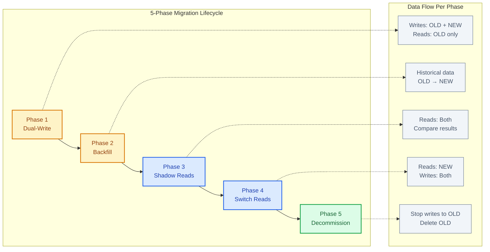
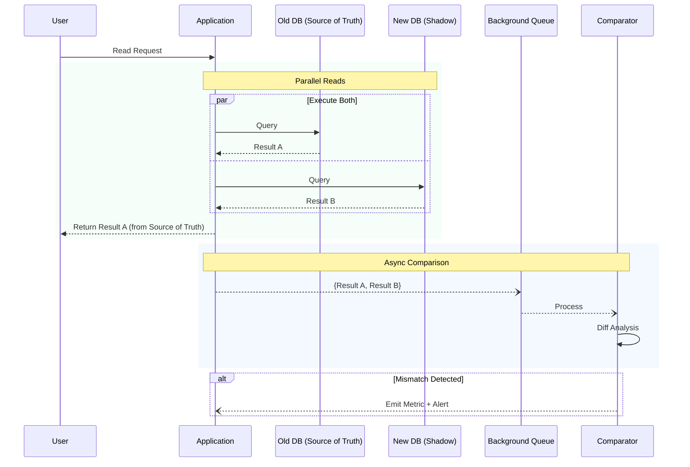
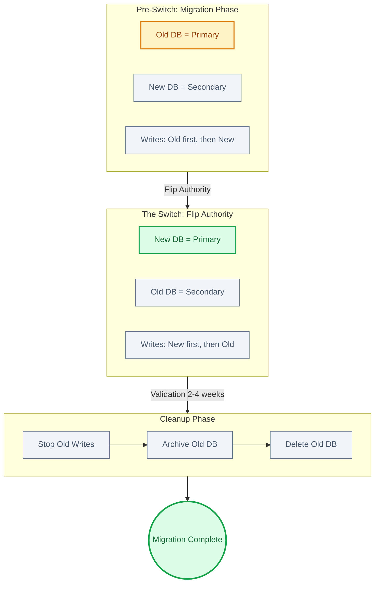
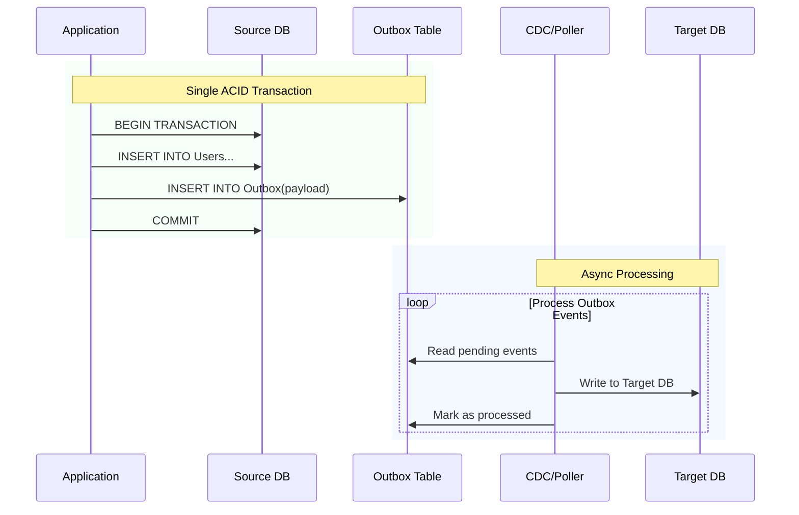

# Dual-Write / Dual-Read Pattern

For data store migrations where you cannot afford downtime.

Phase 1: Dual-Write
└── Writes go to OLD and NEW
└── Reads come from OLD only

Phase 2: Backfill Historical Data
└── Migrate existing data from OLD to NEW
└── Verify parity

Phase 3: Shadow Reads
└── Reads go to both, compare results
└── Log discrepancies, fix issues

Phase 4: Switch Reads
└── Reads come from NEW
└── Writes still go to both

Phase 5: Decommission
└── Stop writes to OLD
└── Validate, then delete OLD

⚠Common Pitfall
Dual-write is not atomic. If write to OLD succeeds and write to NEW fails, you have inconsistency. Solutions: Outbox pattern, change data capture (CDC), or accepting small inconsistency windows with reconciliation.

This guide covers 5 key areas: I. Executive Overview & Business Case, II. The Architecture Decision: Application-Level vs. Infrastructure-Level, III. Deep Dive: The Migration Lifecycle, IV. Handling The "Dual-Write isn't Atomic" Problem, V. Summary Checklist for the Principal TPM.

## I. Executive Overview & Business Case

At the Principal TPM level, you are the bridge between architectural purity and business reality. When proposing or managing a Dual-Write/Dual-Read migration, you are essentially asking the business to fund a temporary reduction in feature velocity and an increase in infrastructure spend in exchange for **existential risk mitigation**.

The Executive Overview for this pattern is not about "moving data"; it is about **de-risking modernization**. At the scale of Mag7 (Microsoft, Amazon, Google, etc.), the cost of a failed cutover—measured in outages, data corruption, or rollback time—far exceeds the cost of redundant infrastructure.

### 1. The Strategic Imperative: Why Zero-Downtime?

In legacy enterprise environments, a "maintenance window" (e.g., 2:00 AM to 6:00 AM Sunday) is acceptable. In the Mag7 environment, there is no low-traffic window. Global user bases mean it is always peak time somewhere.

*   **Mag7 Behavior:** When Amazon Consumer Business migrated from Oracle to DynamoDB (Project Rolling Stone), shutting down the order pipeline was impossible. The migration had to occur while millions of transactions per second were processing.
*   **The Capability:** The Dual-Write/Dual-Read pattern decouples the **deployment** of the new infrastructure from the **release** of the new infrastructure. This allows engineering teams to validate the new data store's performance and data integrity in production with live traffic, without the customer relying on it yet.

### 2. Business Impact & ROI Analysis

As a Principal TPM, you must articulate the ROI not in terms of revenue gained, but in terms of **Business Continuity** and **technical debt retirement**.

#### Cost of Carry (The Investment)
Implementing this pattern requires a temporary period of "Double Spend."
*   **Infrastructure:** You pay for the Legacy DB (e.g., Oracle/MySQL) and the New DB (e.g., DynamoDB/Spanner) simultaneously.
*   **Engineering:** Development velocity drops by approximately 20-30% during the implementation phase because engineers are managing complex synchronization logic rather than shipping product features.

#### The Payoff (The Return)
*   **Instant Rollback (The "Kill Switch"):** The primary ROI is the ability to revert to the legacy system instantly if the new system shows latency spikes or data corruption. Since the Old DB is kept up-to-date via the dual-write, the "rollback" is simply a configuration flag flip, not a database restore operation.
*   **Data Integrity Verification:** It enables "Shadow Mode" (Dark Reads). You can compare the results of the Old DB and New DB for millions of requests to prove parity before switching the source of truth.

### 3. Tradeoffs and Risk Profile

Every architectural choice in this pattern carries a specific business tradeoff that the TPM must make visible to stakeholders.

| Decision | Tradeoff | Business Impact |
| :--- | :--- | :--- |
| **Dual-Write Architecture** | **Increased Latency:** Writing to two systems takes longer than writing to one. | **CX Impact:** Slightly higher p99 latency for write-heavy operations (e.g., "Checkout" or "Post Status"). |
| **Consistency Checks** | **Complexity:** Requires reconciliation tooling to handle "split-brain" scenarios where writes succeed in one DB but fail in the other. | **Skill Requirement:** Requires Senior/Staff engineers to build self-healing mechanisms; Junior engineers cannot safely execute this alone. |
| **Prolonged Migration** | **Technical Debt:** The longer the migration takes, the more "glue code" accumulates in the codebase. | **ROI Risk:** If the migration stalls at 90%, you are left paying for two databases indefinitely (The "Zombie Migration" problem). |

### 4. Critical Success Factors for the Principal TPM

To govern this effectively, you must establish specific guardrails:

*   **The "Point of No Return" Definition:** You must define the criteria for when the Old DB is finally decommissioned. This is often political. DBAs may want to keep the Old DB "just in case" for months. You must enforce a cutoff (e.g., "2 weeks of zero severity incidents") to realize the cost savings.
*   **Latency Budgets:** Before starting, establish the acceptable latency overhead. If the Dual-Write adds 50ms to a user interaction, is that acceptable to the Product VP? If not, the architecture must change (e.g., moving to asynchronous dual-writes via queues, which sacrifices immediate consistency).
*   **Write Availability:** You must decide: If the New DB is down, does the application fail the user's request?
    *   *Strict Consistency:* Yes, fail the request.
    *   *High Availability:* No, write to the Old DB, log the failure, and reconcile later. (Most Mag7 consumer apps choose this path).

## II. The Architecture Decision: Application-Level vs. Infrastructure-Level

The decision between Application-Level and Infrastructure-Level dual writing is the single most significant technical variable a Principal TPM manages in a migration. This choice dictates the project's staffing requirements, the rollback latency, and the consistency model (Strong vs. Eventual) the business must accept during the transition.

```mermaid
flowchart TB
    subgraph OptionA["Option A: Application-Level (Synchronous)"]
        A1[App Request] --> A2[Write to Source DB]
        A2 --> A3[Transform Data]
        A3 --> A4[Write to Target DB]
        A4 --> A5[Return to User]
        A2 -.->|"Latency: T_source + T_target"| A5
    end

    subgraph OptionB["Option B: Infrastructure-Level (CDC/Async)"]
        B1[App Request] --> B2[Write to Source DB]
        B2 --> B3[Return to User]
        B2 -.->|"Async"| B4[CDC Connector]
        B4 -.-> B5[Target DB]
        B2 -.->|"Latency: T_source only"| B3
    end

    classDef primary fill:#dbeafe,stroke:#2563eb,color:#1e40af,stroke-width:2px
    classDef success fill:#dcfce7,stroke:#16a34a,color:#166534,stroke-width:2px
    classDef warning fill:#fef3c7,stroke:#d97706,color:#92400e,stroke-width:2px
    classDef neutral fill:#f1f5f9,stroke:#64748b,color:#475569,stroke-width:1px

    class A1,B1 primary
    class A2,B2 warning
    class A3,A4 neutral
    class A5,B3 success
    class B4,B5 neutral
```

### 1. Deep Dive: Application-Side Dual Write (Synchronous)

As introduced in the context, this approach places the burden of migration logic inside the business service. The application code explicitly manages connections to both the Source (Old) and Target (New) databases.

**The "Mag7" Implementation Pattern:**
At companies like Microsoft (Azure) or Amazon, this is often chosen when the migration involves a **significant schema refactor** or business logic change. If you are moving from a monolithic SQL table to a NoSQL document store (e.g., SQL Server to CosmosDB), the data requires transformation that only the application domain understands.

*   **The Workflow:**
    1.  Request arrives.
    2.  App writes to Source DB (Authoritative).
    3.  App transforms object to new schema.
    4.  App writes to Target DB (Shadow).
    5.  App returns success to user.

*   **Principal TPM Analysis & Tradeoffs:**
    *   **Latency Penalty:** This is the primary business risk. The application response time becomes $T_{source} + T_{target} + T_{overhead}$. If the Target DB (e.g., a cold DynamoDB table) experiences a latency spike, the customer feels it, even though the "real" database (Source) is healthy.
    *   **Availability Coupling:** The theoretical availability drops. If Source is 99.9% and Target is 99.9%, the system availability during migration is $99.9\% \times 99.9\% = 99.8\%$.
    *   **Failure Handling (The "Zombie Record" Risk):** If the write to Source succeeds but Target fails, the application must catch the exception and log it to a "Dead Letter Queue" (DLQ) for later reconciliation. If the app crashes *between* the two writes, you have silent data divergence.
    *   **Skill/Resource Impact:** High developer toil. Product teams must write, test, and maintain migration code, distracting them from feature work.

**ROI Verdict:** Use this only when complex, domain-specific data transformation is required in real-time, or when infrastructure constraints prevent CDC (Change Data Capture) access.

### 2. Deep Dive: Infrastructure-Level Dual Write (Asynchronous / CDC)

This is the preferred pattern for high-volume systems at Google and Meta. The application continues writing *only* to the Source DB. A separate infrastructure process captures those changes and replicates them to the Target DB.

**The "Mag7" Implementation Pattern:**
This relies heavily on **Change Data Capture (CDC)**.
*   **AWS:** Using DynamoDB Streams triggering Lambda functions to populate a new table, or AWS DMS (Database Migration Service) reading from RDS binlogs.
*   **Meta/LinkedIn:** Using systems like Kafka Connect (Debezium) to tail the MySQL binlog or PostgreSQL Write-Ahead Log (WAL).

*   **The Workflow:**
    1.  App writes to Source DB.
    2.  Source DB commits and acknowledges user (Low Latency).
    3.  CDC Connector reads the transaction log (asynchronously).
    4.  CDC Connector pushes data to Target DB.

*   **Principal TPM Analysis & Tradeoffs:**
    *   **Zero Latency Impact:** The user experience is decoupled from the migration. If the Target DB falls over, the queue backs up, but the user checkout flow remains fast.
    *   **Eventual Consistency (The "Read-Your-Write" Problem):** This is the critical CX risk. Since replication is async, there is a lag (usually milliseconds, sometimes seconds). If a user updates their profile and immediately refreshes the page (which might be routed to the New DB for testing), they may see their old data.
        *   *Mitigation:* The TPM must enforce "Sticky Routing" (read from Old DB) for the user who just performed a write, or ensure the read-path migration happens strictly *after* the replication lag is proven to be near-zero.
    *   **Schema Rigidity:** CDC tools are excellent at copying data 1:1. They are often poor at complex business logic transformations (e.g., splitting one user table into three microservice tables).

**ROI Verdict:** High ROI for "Lift and Shift" or storage engine changes (e.g., MySQL to Aurora). Reduces dev team load but increases reliance on Site Reliability Engineering (SRE) / Platform teams to manage the pipelines.

### 3. Strategic Decision Matrix

A Principal TPM must drive the engineering leads to a decision based on these constraints:

| Feature | App-Level (Sync) | Infra-Level (Async/CDC) |
| :--- | :--- | :--- |
| **Consistency** | Strong (if implemented correctly) | Eventual (Lag exists) |
| **Latency Impact** | High (Write path doubles) | Near Zero |
| **Engineering Cost** | High (Dev team writes code) | Medium (Platform team config) |
| **Transformation** | High (Full logic available) | Low (Basic mapping only) |
| **Availability Risk** | Coupled (Both DBs must be up) | Decoupled (Target can fail safely) |

### 4. Edge Cases & Failure Modes

The Principal TPM must ask: *"How do we prove the data is identical?"* regardless of the method chosen.

*   **The Race Condition:** In Infra-level replication, if a record is updated twice in rapid succession ($t_1$ and $t_2$), the pipeline must ensure updates are applied in strict order. If $t_2$ arrives before $t_1$ at the Target DB, the data is permanently corrupted.
    *   *Solution:* Ensure the CDC tool respects ordering keys (e.g., Kafka partioning by UserID).
*   **The Silent Divergence:** In App-level replication, bugs in the transformation logic can silently corrupt data in the New DB.
    *   *Solution:* You must fund a **Reconciliation Worker** (a separate background process) that constantly compares random samples of rows between Source and Target and alerts on discrepancies. **Do not cut over traffic without a running reconciler.**

## III. Deep Dive: The Migration Lifecycle

### 1. Phase I: The Backfill (Bootstrapping Consistency)

Before enabling dual-writes, the New DB must be populated with historical data. At Mag7 scale, this is rarely a simple SQL dump/restore due to the sheer volume (Petabytes) and the requirement for the system to remain live.

**Technical Implementation:**
The standard approach is an asynchronous **Change Data Capture (CDC)** pipeline.
1.  **Snapshot:** A point-in-time snapshot is taken of the Old DB.
2.  **Replay:** This snapshot is loaded into the New DB.
3.  **Catch-up:** A stream of updates (from the Old DB's transaction logs via tools like Debezium or DynamoDB Streams) is replayed onto the New DB to bring it from the snapshot time to the present.

**Mag7 Example:**
When Netflix migrated customer viewing history from Oracle to Cassandra, they could not stop users from watching shows. They utilized a "fork-lift" approach where a background process iterated through the entire user key space to copy data, while simultaneously capturing live writes to handle the delta.

**Tradeoffs:**
*   **Throughput vs. Latency:** Aggressive backfilling consumes IOPS on the Old DB. You must implement rate-limiting (token buckets) on the backfill process to prevent degrading the live customer experience.
*   **Data Consistency:** The backfill is never perfectly real-time. There is always "replication lag."

**Business Impact:**
*   **Risk:** If the backfill logic differs slightly from the application write logic, you introduce "silent corruption" at scale.
*   **Cost:** High data transfer costs (egress fees) if moving between availability zones or regions.

---

### 2. Phase II: Dark Reads & The Verification Gap

Once the New DB is receiving writes (Dual-Write) and has historical data (Backfill), you enter the "Dark Read" or "Shadow Mode" phase. The application reads from *both* databases but **only returns data from the Old DB to the user.**

The response from the New DB is compared asynchronously against the Old DB to verify integrity.

**Technical Implementation:**
A "Comparator" service or library intercepts the read.
1.  App reads Old DB (Source of Truth).
2.  App reads New DB (Shadow).
3.  App returns Old DB result to user immediately.
4.  App sends both result sets to a background queue.
5.  Comparator analyzes discrepancies and emits metrics.

**Mag7 Example:**
At Meta (Facebook), when migrating backend storage for Messenger, "Shadow Testing" is mandatory. They run comparators for weeks, looking for edge cases (e.g., emoji encoding differences, timestamp precision loss) that unit tests missed.

**Tradeoffs:**
*   **Latency Impact:** Even if the comparison is async, the application is performing double I/O. This increases load on the network and CPU.
*   **False Positives:** If data changes between the two reads (a race condition), the comparator will flag a mismatch that isn't real. The comparator logic requires complex "fuzzy matching" or timestamp awareness.

**TPM Action:**
Define the "Zero-Bug Bar." You cannot proceed to the next phase until the discrepancy rate is exactly 0.00% for a sustained period (e.g., 7 days).

---

### 3. Phase III: The Read Switch (Canary Implementation)

Once verification is complete, you shift read traffic. This is not a binary switch; it is a dial.

**Technical Implementation:**
Use feature flags to route a percentage of *read* traffic to treat the New DB as the source of truth.
*   **1% Traffic:** Verify P99 latency and error rates in production.
*   **Cache Warming:** A critical step often missed. The New DB has "cold" caches. If you switch 100% traffic instantly, the New DB will likely tip over due to high disk I/O.

**Mag7 Example:**
Amazon Retail uses "Dial-Up" deployments. When moving a service like "Order History" to a new sharded architecture, they route internal employee traffic first, then 1% of a specific region, gradually scaling to 100%.

**Tradeoffs:**
*   **Complexity:** Debugging becomes harder. If a user reports an error, customer support needs to know which DB that specific user was reading from at that moment.
*   **Cost of Carry:** You are now running full production load on two systems simultaneously.

**Business Impact/CX:**
*   **Latency Spikes:** The primary risk here is degrading CX due to cold caches or unoptimized indexes on the New DB. The TPM must enforce strict latency SLAs (Service Level Agreements) before increasing the dial.

---

### 4. Phase IV: The Write Switch (Changing Source of Truth)

This is the "Point of No Return." Currently, you are Dual-Writing, but the Old DB is the authoritative source for conflict resolution. You must now flip the authority to the New DB.

**Technical Implementation:**
1.  **Stop Writes:** (Optional/Rare) A brief maintenance window (seconds) to ensure total sync. Most Mag7 systems skip this and handle "flighting" writes via logic.
2.  **Flip Authority:** Configure the app to consider the New DB the primary.
3.  **Reverse Dual-Write:** The app now writes to New DB first, then attempts to write to Old DB (as a backup).

**Mag7 Example:**
Google Spanner migrations often utilize a "Paxos-level" switch where the leader lease moves to the new replica set. For general application migrations, this is usually a config change deployed via a control plane.

**Tradeoffs:**
*   **Split Brain Risk:** If the config deployment is slow, some servers treat Old DB as primary, others treat New DB as primary. Data written during this window requires manual reconciliation.
*   **Rollback Difficulty:** Once writes are authoritative on the New DB, the Old DB immediately becomes stale unless you have implemented the "Reverse Dual-Write."

**TPM Action:**
Ensure a "Kill Switch" exists. If the New DB collapses under write load, you must be able to revert to the Old DB within seconds. This requires the Old DB to be kept in sync (Reverse Dual-Write) for at least 2-4 weeks post-flip.

---

### 5. Phase V: Cleanup and Decommission

The project is not done until the Old DB is turned off. At Mag7, "Zombie Infrastructure" costs millions annually.

**Technical Implementation:**
1.  **Disable Reverse Dual-Write:** Stop writing to the Old DB.
2.  **Snapshot & Archive:** Compliance usually requires a final backup of the Old DB.
3.  **Code Cleanup:** Remove the dual-write logic, feature flags, and comparator code.

**Business Impact/ROI:**
*   **Tech Debt:** Leaving dual-write code in the codebase (even if disabled) is a liability. It confuses new engineers and adds compilation bloat.
*   **Realized ROI:** The financial benefits of the migration (e.g., moving from expensive Oracle licenses to open-source Postgres) are only realized once the Old DB billing stops.

## IV. Handling The "Dual-Write isn't Atomic" Problem

The fundamental risk in application-side dual-write is the "Distributed Transaction" fallacy. When migrating from a legacy RDBMS (e.g., Oracle/MySQL) to a NoSQL store (e.g., DynamoDB/Cassandra), you cannot rely on ACID properties to span both systems. There is no `COMMIT` command that simultaneously guarantees persistence in two disparate technologies.

If the application writes to the Old DB (Source of Truth) successfully but the process crashes, times out, or encounters a network partition before writing to the New DB, the systems drift apart. This results in **Dark Data**—data that exists in the primary system but is missing from the new system, leading to catastrophic failures when the read path is switched over.

### 1. The Asynchronous Reconciliation Pattern ("The Sweeper")

Since synchronous atomicity is impossible without significant latency penalties (e.g., Two-Phase Commit, which is generally an anti-pattern in high-throughput Mag7 systems), the standard mitigation is **Eventual Consistency via Asynchronous Reconciliation**.

In this model, the application attempts the dual-write on a "best effort" basis. Separately, a background process (the "Sweeper" or "Reconciler") continuously scans modified records in the Source of Truth (Old DB) and verifies their existence and accuracy in the New DB.

*   **Mag7 Implementation:** At **Amazon**, during the migration from Oracle to DynamoDB (Project Rolling Stone), teams heavily utilized background reconciliation. The application would write to Oracle and attempt a write to DynamoDB. If the DynamoDB write failed, it was logged to a metric. Independently, a scanner would iterate through the Oracle redo logs or a "modified_at" index to replay writes to DynamoDB, ensuring convergence.
*   **Tradeoffs:**
    *   *Pros:* Decouples the availability of the Old DB from the New DB. If the New DB goes down, the customer transaction still succeeds (written to Old DB), and the Sweeper catches up later.
    *   *Cons:* **Complexity of State.** You must handle race conditions where the Sweeper tries to update a record at the exact moment a live user is updating it. This requires implementing optimistic locking or versioning.
*   **Business Impact:**
    *   *ROI:* High implementation cost (building the Sweeper), but prevents data loss.
    *   *CX:* Preserves uptime. Users do not experience errors even if the migration target is unstable.

### 2. Idempotency and "Last Write Wins" (LWW)

To solve the "Dual-Write isn't Atomic" problem, the Principal TPM must enforce a strict requirement on the engineering team: **All writes to the New DB must be Idempotent.**

Because you will have multiple sources trying to write to the New DB simultaneously (the live application performing dual-writes + the backfill script + the reconciliation sweeper), the New DB will receive the same data multiple times.

*   **Technical Mechanism:** The schema in the New DB must include a `last_updated_timestamp` or a `version_number` derived from the Old DB.
    *   *Logic:* `IF (NewDB.timestamp < IncomingWrite.timestamp) THEN Update ELSE Ignore`.
*   **Mag7 Implementation:** **Uber** utilizes this heavily when migrating between sharded MySQL instances. They rely on the timestamp of the event generation, not the timestamp of the insertion, to ensure that out-of-order writes do not corrupt the state.
*   **Tradeoffs:**
    *   *Pros:* Solves the "Zombie Data" problem where an old retry overwrites a newer successful write.
    *   *Cons:* Requires clock synchronization (NTP) reliability or logical clocks (Lamport timestamps). If the Old DB servers have clock drift, LWW can result in data loss.
*   **Business/Skill Impact:**
    *   *Skill:* Requires engineers to understand distributed systems theory (CAP theorem implications).
    *   *Capability:* Enables "at least once" delivery pipelines (like Kafka) to be used safely.

### 3. The "Outbox Pattern" (Transactional Reliability)

If the business requirement demands near-perfect consistency (e.g., financial ledger migration at **Stripe** or **Google Pay**) where "best effort" dual-write is insufficient, the **Outbox Pattern** is the architectural choice.

Instead of writing to DB A and then making a network call to DB B, the application writes the data to DB A *and* inserts a record into an "Outbox" table within DB A in the **same local transaction**.

1.  `BEGIN TRANSACTION`
2.  `INSERT INTO Users ...`
3.  `INSERT INTO Outbox (Payload) ...`
4.  `COMMIT`

A separate process (CDC or Poller) reads the Outbox table and pushes the data to the New DB.

*   **Tradeoffs:**
    *   *Pros:* **Guaranteed Atomicity.** The record of the intent to migrate is ACID-coupled with the data itself. It is impossible to have the data written without the migration event being queued.
    *   *Cons:* Increases IOPS on the Old DB (Source of Truth). If the Old DB is already red-lining on CPU/IO (a common reason for migration), this pattern can degrade performance further.
*   **Mag7 Context:** This is frequently used at **Microsoft** (Azure) for control plane migrations where consistency is paramount over raw throughput.

### 4. Handling Deletes and Tombstones

A specific failure mode in non-atomic dual-writes is the **Resurrection Bug**.
1.  User creates item (Dual-write success).
2.  User deletes item (Write to Old DB success, Write to New DB fails/network timeout).
3.  Reconciliation script runs and sees the item missing in Old DB but present in New DB.

Does the script assume the item *should* be there and was missed (backfill it)? Or does it assume it was deleted?

*   **Solution:** **Tombstoning.** The application must not hard-delete rows in the Old DB during migration. Instead, it sets a `is_deleted=true` flag. The dual-write propagates this flag. The New DB respects the flag (TTL or soft delete).
*   **Business Impact:**
    *   *Risk:* Without tombstones, data privacy violations (GDPR/CCPA) occur when a user deletes their data, but the migration script accidentally resurrects it in the new system.
    *   *Cost:* Storage costs increase temporarily as deletes are logical, not physical.

## V. Summary Checklist for the Principal TPM

This checklist serves as the Principal TPM’s final governance tool. It is not a list of Jira tickets; it is a risk-assessment framework used to authorize phase transitions. At the Mag7 level, moving between phases (e.g., from Dual-Write to Read-Switch) requires empirical evidence, not just qualitative sign-offs.

### 1. Pre-Flight Architecture & Governance Audit
Before a single line of migration code is deployed, the TPM must validate the architectural contract. This prevents "migration stall," where teams get stuck in a half-migrated state due to unforeseen blockers.

*   **Failure Mode Definition (Fail-Open vs. Fail-Closed):**
    *   **Check:** Has the team defined behavior if the write to the *New* database fails?
    *   **Mag7 Standard:** For Tier-1 services (e.g., Amazon Checkout), the system usually **Fails Open**. The write to the Old DB succeeds, the write to New fails, and the error is logged/queued for async retry. We do not block the customer transaction for a migration glitch.
    *   **Tradeoff:** Fails Open preserves Availability (CX) but introduces Data Inconsistency (requires robust reconciliation). Fail Closed ensures Consistency but risks Availability.
*   **Latency Budget Analysis:**
    *   **Check:** Have we calculated the P99 latency penalty of the dual-write?
    *   **Impact:** If writing to DynamoDB adds 30ms to a service with a 200ms SLA, does this breach contract with upstream callers?
    *   **Action:** If synchronous dual-write breaches SLA, the TPM must pivot the architecture to Asynchronous Dual-Write (using queues/streams like Kinesis or Kafka), accepting the complexity of eventual consistency.

### 2. The Backfill & Convergence Signal
Dual-writing only captures *new* data. The TPM must oversee the strategy for moving *historical* data without impacting live traffic.

*   **The "High Water Mark" Strategy:**
    *   **Check:** Is the backfill mechanism decoupled from the live traffic path?
    *   **Mag7 Example:** At Meta, when migrating a graph association, a background worker iterates through the old keyspace to copy data. This worker must have dynamic throttling (backpressure) to stop immediately if live site latency spikes.
    *   **Metric:** **Convergence Rate.** The TPM tracks the delta between Old and New.
*   **Reconciliation Tooling (The "Parity Daemon"):**
    *   **Check:** Is there an automated script running continuously that compares random samples from DB A and DB B?
    *   **Business Impact:** You cannot cut over based on faith. You need a dashboard showing "99.9999% Consistency" over a 7-day rolling window.
    *   **Tradeoff:** High-frequency reconciliation burns IOPS/Compute (Cost). Low-frequency risks hidden data corruption. The TPM balances this spend against the risk profile of the data (Billing data = 100% verification; User Preferences = Sampling).

### 3. Shadow Mode (Dual-Read) Verification
This is the "Dark Launch" phase. The application reads from both databases but **only returns data from the Old DB** to the user. The New DB's result is compared asynchronously.

*   **The "Diff" Log:**
    *   **Check:** Are mismatches between Old and New reads being logged as high-priority metrics?
    *   **Mag7 Behavior:** If the Old DB returns a user profile with `version: 5` and the New DB returns `version: 4`, this is a "stale read." The migration cannot proceed.
    *   **Root Cause Analysis:** The TPM must enforce that every mismatch category (e.g., "Timestamp precision error," "Encoding error," "Missing record") has a ticket and a resolution.
*   **Performance Load Testing:**
    *   **Check:** Is the New DB handling the *full* read throughput in Shadow Mode without degradation?
    *   **Impact:** This verifies provisioned capacity (Read Capacity Units) before the customer relies on it.

### 4. The Cutover Strategy (The Switch)
The actual switch is rarely a binary event. It is a dial.

*   **Percentage-Based Rollout (Canary):**
    *   **Check:** Can we route reads to the New DB for 1%, 5%, then 50% of users?
    *   **Capability:** This requires feature-flagging infrastructure (e.g., LaunchDarkly or internal tools like Google's Gantry).
    *   **Rollback SLA:** If error rates spike at 5% traffic, how fast can we revert to 0%? At Amazon, the target is usually <1 minute.
*   **The "Writes-To-Both" Retention:**
    *   **Check:** Even after switching reads to the New DB, are we still writing to the Old DB?
    *   **Critical Safety Net:** We continue Dual-Write for days or weeks after the Read Switch. If a catastrophic bug is found in the New DB structure three days later, the Old DB is still current, allowing an instant failback.
    *   **Cost Tradeoff:** This doubles storage and write costs (Cost of Carry). The TPM is responsible for setting the "Kill Date" to stop the bleed.

### 5. Cleanup & Decommission (The ROI Realization)
The migration is not done until the Old DB is dead.

*   **Code Cleanup:**
    *   **Check:** Has the Dual-Write logic been removed from the codebase?
    *   **Technical Debt:** Leaving dead code paths ("zombie writes") creates confusion for future engineers and wastes compute resources.
*   **Infrastructure Termination:**
    *   **Check:** Are the Old DB instances terminated and snapshots archived?
    *   **ROI Impact:** This is the moment the business realizes the value. If moving from Oracle to Postgres, the licensing savings only materialize here.

---

## Interview Questions

### I. Executive Overview & Business Case

### Question 1: The "Zombie Migration"
**Context:** You are leading a migration from a sharded MySQL setup to a managed NoSQL solution. The team has successfully migrated 95% of the read traffic to the new system using a Dual-Write/Dual-Read pattern. However, the last 5% of traffic involves complex, legacy join queries that are difficult to model in NoSQL. The migration has been stalled at 95% for six months, costing the company $50k/month in duplicate infrastructure.
**Question:** As the Principal TPM, how do you approach this situation? Do you force the completion or kill the project?

**Guidance for a Strong Answer:**
*   **Root Cause Analysis:** Acknowledge that the "last mile" is always the hardest. The candidate should identify *why* the 5% is stuck (Technical blocker vs. prioritization issue).
*   **Sunk Cost Fallacy:** Demonstrate willingness to evaluate if the remaining 5% *should* be migrated. Is it cheaper to refactor that specific feature to a different service, or even deprecate the feature?
*   **Ultimatum/forcing function:** Propose a "fix or revert" strategy. Keeping dual stacks indefinitely is an architectural anti-pattern. The candidate should propose a timeline to either resource the solution for the complex joins (e.g., using an indexing service like Elasticsearch) or accept that the migration failed to account for these use cases and pivot strategy.

### Question 2: Latency vs. Consistency in Dual-Writes
**Context:** During the Dual-Write phase of a payment processing migration, the engineering team proposes a synchronous write pattern: `Write to Oracle -> Wait for Ack -> Write to DynamoDB -> Wait for Ack -> Return Success to User`. They argue this ensures data consistency. The Product VP is concerned about checkout latency.
**Question:** What are the risks of this approach, and what architectural alternatives would you propose to balance safety and speed?

**Guidance for a Strong Answer:**
*   **Availability Risk:** Highlight that availability is now the product of both systems (Availability = A_oracle * A_dynamo). If either goes down, the user fails. This lowers overall system reliability.
*   **Latency Impact:** It doubles the network hops.
*   **Alternative Proposal:** Suggest **Asynchronous Dual-Write** (Write to Oracle -> Return Success -> Push to Queue -> Worker writes to DynamoDB) or **Parallel Writes** (Write to both simultaneously, return when the *primary* source of truth confirms).
*   **Tradeoff Awareness:** The candidate must mention that moving to Async introduces "Eventual Consistency" challenges, requiring a reconciliation job to catch failures, but it protects the User Experience (CX).

### II. The Architecture Decision: Application-Level vs. Infrastructure-Level

**Question 1: The Latency Trap**
"We are migrating a high-frequency trading ledger from a legacy SQL cluster to a new sharded NoSQL solution. The engineering lead proposes an Application-Level Dual Write to ensure data is transformed correctly. As the TPM, what specific performance risks do you flag, and what metrics would you demand to see before approving this architecture?"

*   **Guidance for a Strong Answer:**
    *   **Identify the P99 Risk:** Averages don't matter. The candidate should highlight that the write latency is now bound by the *slowest* of the two databases.
    *   **Availability Math:** Acknowledge that system reliability decreases (Dual dependency).
    *   **Failure Mode:** Ask how the app handles a "Partial Failure" (Write to A succeeds, Write to B fails). Do we rollback A? (Hard). Do we queue B? (Complexity).
    *   **Alternative:** Suggest an async queue or CDC if the transformation logic allows, to protect the trading SLA.

**Question 2: The "Read-Your-Write" Paradox**
"You chose an Infrastructure-Level (CDC) migration strategy to move a user profile service to a new region. We are in the 'Dual Read' phase where we randomly route 10% of reads to the new database. Users are complaining that they edit their bio, hit save, and the old bio reappears. What is happening, and how do you fix it without stopping the migration?"

*   **Guidance for a Strong Answer:**
    *   **Diagnosis:** Identify this as "Replication Lag" inherent in async CDC. The read happened against the New DB before the replication event arrived.
    *   **Immediate Fix:** Stop routing "recent writers" to the New DB. Implement "Session Stickiness" or a "Write-Cookie" that forces reads to the Source DB for $X$ minutes after a write.
    *   **Root Cause Analysis:** Check the CDC pipeline lag metrics. Is it milliseconds or seconds? If it's seconds, the architecture may not support a seamless cutover without a maintenance window.

### III. Deep Dive: The Migration Lifecycle

### Question 1: Handling Data Drift
**"We are in the 'Dual Write' phase of migrating a payment processing service from a legacy SQL database to a NoSQL solution. The comparator service is reporting a 0.05% discrepancy rate between the two databases. The business is pressuring you to complete the migration for an upcoming launch. How do you handle this?"**

*   **Guidance for a Strong Answer:**
    *   **Stop the Line:** A Principal TPM must demonstrate the courage to block a launch. In payments, 0.05% error is catastrophic.
    *   **Root Cause Analysis:** Is it a code bug, a race condition (timing issue), or a data modeling mismatch (precision loss)?
    *   **Quantify Risk:** Translate 0.05% into dollar amounts or impacted users to justify the delay to stakeholders.
    *   **Remediation:** Propose a "fix-forward" strategy (patching the transformation logic) or a "re-backfill" if the data is permanently corrupted.

### Question 2: The Rollback Dilemma
**"You have successfully flipped the 'Source of Truth' to the new database. Two hours later, latency spikes, and the new database starts timing out 10% of requests. You decide to roll back. However, you discover the 'Reverse Dual-Write' (syncing new data back to the old DB) failed for the last 30 minutes. What do you do?"**

*   **Guidance for a Strong Answer:**
    *   **Crisis Management:** Acknowledge the "Split Brain" scenario. You have data in the New DB that does not exist in the Old DB.
    *   **Tradeoff Assessment:**
        *   *Option A:* Roll back immediately to restore availability, accepting 30 minutes of data loss (or data invisibility).
        *   *Option B:* Stay on the failing system and try to hot-fix (high risk of total outage).
    *   **The "Mag7" Solution:** Roll back to restore service (Availability is King). Then, immediately spin up a "Reconciliation Script" to scrape the New DB for the missing 30 minutes of transactions and inject them into the Old DB (now the primary again).
    *   **Post-Mortem:** Identify why the reverse-write failed and why monitoring didn't catch it sooner.

### IV. Handling The "Dual-Write isn't Atomic" Problem

**Question 1: The "99.9% Problem"**
"We are migrating a high-volume payment ledger from Oracle to DynamoDB using a dual-write pattern. We have run a backfill and enabled dual-writes. However, our reconciliation tool shows a persistent 0.1% data drift where the New DB is missing records or has outdated values. The drift seems random. How do you diagnose the root cause and fix the architecture to reach 100% consistency?"

*   **Guidance for a Strong Answer:**
    *   **Diagnosis:** Candidate should identify **Race Conditions** between the Backfill/Reconciliation script and the Live Traffic. (e.g., The script reads a record, User updates it, Script writes stale data to New DB).
    *   **Solution:** They must propose **Idempotency** and **Version/Timestamp Checks** (Optimistic Locking). The write to the New DB must be conditional based on a version number from the Source.
    *   **Observability:** Mentioning the need for a "Dead Letter Queue" (DLQ) for writes that fail validation logic.

**Question 2: Outbox vs. Double-Dispatch**
"You are designing the migration for a latency-sensitive service (e.g., Ad Serving). The engineering lead suggests using the 'Outbox Pattern' to ensure atomic writes during the migration. However, the DBA warns that the legacy database is already at 85% CPU utilization. Do you approve this design? If not, what is the alternative and what trade-offs are you accepting?"

*   **Guidance for a Strong Answer:**
    *   **Decision:** **Reject the Outbox Pattern.** Adding write load (Outbox inserts) to a database near capacity is a critical stability risk that could cause a cascading failure.
    *   **Alternative:** Propose **Log-Based Change Data Capture (CDC)** (e.g., parsing the transaction log/binlog asynchronously) or **Best-Effort Dual Write with Asynchronous Reconciliation**.
    *   **Tradeoff Analysis:** Acknowledge that CDC introduces **Replication Lag** (the New DB will be slightly behind the Old DB). The candidate must explain that for Ad Serving, eventual consistency (milliseconds of lag) is usually an acceptable tradeoff for system stability, whereas crashing the primary DB is not.

### V. Summary Checklist for the Principal TPM

**Question 1: The "99%" Trap**
"You are managing a migration from a legacy SQL database to a NoSQL store for a high-volume notification service. During the 'Shadow Mode' (Dual Read) phase, your reconciliation dashboard shows a 99.5% data match rate. The engineering lead argues that for notifications, this is acceptable and wants to proceed to cutover to meet the Q3 deadline. What is your response and course of action?"

*   **Guidance for a Strong Answer:**
    *   **Reject the cutover:** A Principal TPM never knowingly introduces data corruption, even for non-critical data, without explicit business sign-off on the loss.
    *   **Root Cause Analysis:** 0.5% of millions of records is a massive number of errors. The candidate should ask *why* the mismatch exists. Is it a race condition? A timestamp serialization issue?
    *   **Risk Segmentation:** If the errors are "cosmetic" (e.g., formatting), they might be acceptable. If they are "missing data," they are not.
    *   **Governance:** Establish a "fix-forward" plan. We do not cut over until we understand the error class.

**Question 2: The Latency Spike**
"We are implementing synchronous Dual-Write for the 'Add to Cart' service. Initial performance tests show that writing to the second database adds 40ms of latency, pushing the service's P99 response time from 180ms to 220ms. The SLA is strict at 200ms. The team suggests removing the write to the old database immediately to fix latency. How do you handle this?"

*   **Guidance for a Strong Answer:**
    *   **Veto the "Big Bang" approach:** Stopping writes to the old database immediately removes the rollback safety net. That is a reckless architectural change.
    *   **Propose Architecture Pivot:** Move to **Asynchronous Dual-Write**. Let the main thread write to DB A, and push the write to DB B via a queue (SQS/Kafka) or a stream (DynamoDB Streams).
    *   **Tradeoff Discussion:** Acknowledge that Async introduces "Eventual Consistency" between the two DBs. The candidate should discuss how to handle the "gap" (e.g., if a user reads immediately from DB B before the queue processes).
    *   **Alternative:** If Async is too complex, investigate optimizing the DB B write (connection pooling, provisioned capacity) before abandoning the pattern.

---

## Key Takeaways

- Review each section for actionable insights applicable to your organization

- Consider the trade-offs discussed when making architectural decisions

- Use the operational considerations as a checklist for production readiness
