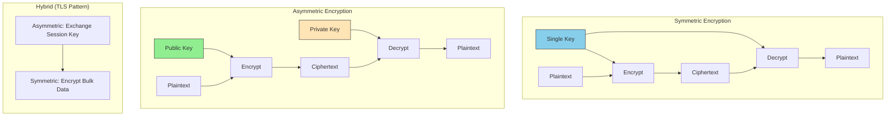

# Encryption Strategy

This guide covers 5 key areas: I. Strategic Context: Why Encryption Matters at Mag7 Scale, II. The Architecture of Trust: Symmetric vs. Asymmetric, III. Key Management Strategy (KMS) & Envelope Encryption, IV. Data States and Defense in Depth, V. Crypto-Agility and Future Proofing.

## I. Strategic Context: Why Encryption Matters at Mag7 Scale

For a Generalist or Product Principal TPM at a Mag7 level, encryption is the bridge between **infrastructure capabilities** and **market viability**. It is the mechanism that converts a "consumer-grade" product into an "enterprise-grade" platform capable of hosting sovereign government data, healthcare records, and banking transactions.

At this level, your focus shifts from the implementation details of TLS 1.3 to the strategic application of encryption to solve three specific problems: **Insider Risk**, **Regulatory Access**, and **Multi-Tenancy Isolation**.

### 1. The "Zero Trust" Network Paradigm
Historically, companies relied on perimeter security (firewalls). At Mag7 scale, the perimeter is assumed to be porous. The strategy is **Zero Trust**, where the network is considered hostile, even inside the data center.

*   **Mag7 Behavior:**
    *   **Google:** Implements **ALTS (Application Layer Transport Security)**. Every Remote Procedure Call (RPC) between services is mutually authenticated and encrypted. Service A cannot talk to Service B unless it presents a valid cryptographic identity, not just a valid IP address.
    *   **AWS:** Moves encryption into hardware. The **Nitro System** offloads encryption to dedicated cards, ensuring that even if an operator gains root access to the physical host, they cannot read the memory of the EC2 instance (memory encryption).

*   **Tradeoffs:**
    *   **Latency vs. Security:** Encrypting every internal hop adds microseconds to milliseconds of latency. At the scale of billions of requests, this compounds.
        *   *Mitigation:* Hardware offloading (AES-NI instructions, Nitro cards) is required to minimize the CPU tax.
    *   **Complexity vs. Velocity:** Implementing mutual TLS (mTLS) requires a robust Certificate Authority (CA) infrastructure. If the CA goes down or certificate rotation fails, the entire internal cloud goes dark (a "global outage" scenario).

*   **Business Impact:**
    *   **ROI:** Eliminates entire classes of attack vectors (Man-in-the-Middle internal attacks).
    *   **Capability:** Enables "Work from Anywhere" for employees (BeyondCorp model), reducing real estate costs and increasing workforce flexibility.

### 2. Encryption as a Go-To-Market Accelerator (BYOK/HYOK)
For a Product TPM, encryption is a feature that unlocks Total Addressable Market (TAM). Enterprise customers, particularly in Europe (GDPR/Schrems II) and Finance, often refuse to migrate to the cloud unless they control the "Root of Trust."

*   **Mag7 Behavior:**
    *   **Customer Managed Keys (CMK) / Bring Your Own Key (BYOK):** AWS KMS and Azure Key Vault allow customers to generate keys in their own on-premise HSMs (Hardware Security Modules) and import them to the cloud.
    *   **Hold Your Own Key (HYOK):** In extreme cases (e.g., Microsoft 365 Double Key Encryption), the cloud provider *never* has access to the key. The data is opaque to the provider.

*   **Tradeoffs:**
    *   **Functionality vs. Privacy:** If a customer holds the key (HYOK), the cloud provider cannot index that data, perform AI/ML analysis on it, or provide search functionality. The product becomes a "dumb store."
    *   **Availability Risk:** If the customer deletes their key or their on-prem key management server goes offline, the cloud service fails. The customer will often blame the cloud provider for the outage.

*   **Business Impact:**
    *   **ROI:** Unlocks regulated markets (DoD, FedRAMP High, PCI-DSS). Without these encryption features, you cannot sign contracts with the Fortune 100.
    *   **CX:** Provides psychological safety to the CISO of the buying organization.

### 3. The "Going Dark" Observability Challenge
A major strategic conflict exists between **Security Engineering** (who want everything encrypted) and **Site Reliability Engineering (SRE)** (who need to see traffic to debug it).

*   **Mag7 Behavior:**
    *   **Meta/Netflix:** Use sophisticated traffic steering. Traffic is encrypted on the wire but terminated at load balancers or sidecar proxies (like Envoy) where telemetry is extracted before re-encryption.
    *   **Service Mesh:** The encryption is handled by the infrastructure (the mesh), not the application code. This decouples developers from encryption logic.

*   **Tradeoffs:**
    *   **Debuggability vs. Privacy:** When a production incident occurs, you cannot simply `tcpdump` the traffic because the payload is scrambled. This increases Mean Time To Repair (MTTR).
        *   *Mitigation:* Investing heavily in distributed tracing and structured logging *before* the encryption layer.
    *   **Cost:** Decrypting traffic for inspection (Deep Packet Inspection) and re-encrypting it requires massive compute resources, driving up COGS (Cost of Goods Sold).

*   **Business Impact:**
    *   **Skill Capability:** Requires shifting engineering culture from "looking at packets" to "relying on telemetry."
    *   **CX:** Prevents internal employees from accidentally viewing sensitive user data (PII) during debugging sessions.

### 4. Confidential Computing (Data in Use)
The frontier of encryption at Mag7 is protecting data while it is being processed (in RAM).

*   **Mag7 Behavior:**
    *   **Azure Confidential Computing / AWS Nitro Enclaves:** These create isolated execution environments. Even the cloud provider's hypervisor cannot view the data inside the enclave.
    *   **Use Case:** Two competitors (e.g., banks) want to pool data to train a fraud detection model without sharing the raw data with each other or the cloud provider.

*   **Tradeoffs:**
    *   **Performance:** Significant overhead for entering/exiting enclaves.
    *   **Compatibility:** Applications often need to be refactored to run inside these constrained environments.

*   **Business Impact:**
    *   **ROI:** Creates a new revenue stream for highly sensitive workloads that previously had to stay on-premise.

## II. The Architecture of Trust: Symmetric vs. Asymmetric

### 1. Symmetric Encryption: The Workhorse of Scale

Symmetric encryption uses a single key for both encryption and decryption. In the context of a Mag7 infrastructure, this is the default for **data at rest** and **bulk data in transit** due to its computational efficiency. The industry standard is AES-256 (Advanced Encryption Standard).

**Real-World Mag7 Behavior:**
*   **Storage Systems:** When a customer uploads a 5TB dataset to Amazon S3 or Google Cloud Storage, the platform uses symmetric encryption. It is computationally infeasible to use asymmetric encryption for objects of this size.
*   **Internal RPCs:** In high-frequency internal traffic (e.g., microservices communicating via gRPC), services often rely on symmetric session keys derived after an initial handshake to minimize latency (part of the TLS record protocol).

**Tradeoffs:**
*   **Speed vs. Key Distribution:** Symmetric encryption is orders of magnitude faster (often hardware-accelerated via AES-NI instructions on modern CPUs). However, it introduces the "Key Distribution Problem"—how do you get the key to the recipient securely without an interceptor seeing it?
*   **Simplicity vs. Granularity:** It is easier to implement but harder to audit access. If a service possesses the symmetric key, it has full read/write access to the data.

**Impact & ROI:**
*   **Cost Efficiency:** Reduces CPU overhead for encryption operations, directly impacting the COGS (Cost of Goods Sold) for cloud storage services.
*   **Throughput:** Enables line-rate encryption (e.g., 100Gbps+) on network interfaces, essential for high-performance computing (HPC) clusters.

### 2. Asymmetric Encryption: The Identity & Exchange Layer

Asymmetric encryption (Public-Key Cryptography) uses a mathematically related pair of keys: a public key (shared openly) and a private key (kept secret). Data encrypted with the public key can only be decrypted by the private key.

**Real-World Mag7 Behavior:**
*   **Identity & Auth:** When a developer SSHs into an EC2 instance or a production server, asymmetric encryption (RSA or ED25519) authenticates the session. The server holds the public key; the developer holds the private key.
*   **TLS Handshakes:** Every time a user connects to `google.com`, asymmetric encryption is used *only* for the initial handshake to verify Google's identity (via SSL Certificates) and securely exchange the symmetric session keys.

**Tradeoffs:**
*   **Security vs. Performance:** Asymmetric encryption is computationally expensive (slow). It is roughly 1,000x slower than symmetric encryption.
*   **Trust vs. Complexity:** It solves the key distribution problem but introduces the complexity of PKI (Public Key Infrastructure). You now need Certificate Authorities (CAs) and rotation mechanisms.

**Impact & ROI:**
*   **Trust Assurance:** This is the backbone of the "Zero Trust" model. It ensures that service A is actually talking to service B, not an impersonator.
*   **Compliance:** Mandatory for identifying root of trust in regulated environments (e.g., banking APIs).

### 3. The Hybrid Approach: TLS and Envelope Encryption

A Principal TPM must understand that Mag7 architectures rarely choose one over the other; they combine them.

#### A. Transport Layer Security (TLS)
The internet runs on a hybrid model. Asymmetric encryption is used to establish the connection (Handshake) and agree on a shared secret. Once established, the connection switches to Symmetric encryption for the actual data transfer.
*   **TPM Implication:** When defining latency SLAs, you must account for the "TLS Termination" overhead at the load balancer level. This is why many architectures offload SSL termination to the edge (e.g., CloudFront, Akamai) to reduce latency for the end user.

#### B. Envelope Encryption (The Scalability Pattern)
This is the most critical concept for a TPM managing data platforms.
*   **The Problem:** Re-encrypting 10 petabytes of data because a key was rotated is impossible.
*   **The Solution:** You encrypt the *data* with a Data Key (Symmetric). You then encrypt the *Data Key* with a Master Key (Asymmetric or Symmetric, managed by a Key Management Service like AWS KMS).
*   **The Benefit:** To rotate keys, you only re-encrypt the tiny Data Key, not the petabytes of actual data.
*   **Mag7 Example:** AWS KMS and Google Cloud KMS utilize envelope encryption by default. When a customer clicks "Rotate Key," the system creates a new backing key version, but existing data remains encrypted by old data keys (which can still be decrypted by the system until fully phased out).

### 4. Strategic Tradeoffs & Decision Matrix

When reviewing technical designs or PRDs, use this framework:

| Feature | Symmetric | Asymmetric | Hybrid / Envelope |
| :--- | :--- | :--- | :--- |
| **Primary Use Case** | Bulk Data Encryption (Db, Storage) | Identity, Auth, Key Exchange | Secure Data Transmission, Key Management |
| **Performance** | High (Hardware accelerated) | Low (CPU intensive) | Balanced |
| **Key Mgmt Risk** | High (Key compromise = Data breach) | Medium (Private key security is vital) | Low (Master key separates access from data) |
| **TPM Action** | Ensure hardware acceleration is enabled. | Ensure cert rotation automation is in place. | Mandate for all Customer Data at Rest. |

### 5. Edge Cases & Failure Modes

*   **Certificate Expiry:** The most common "Asymmetric" failure. If a TLS certificate expires, the service becomes unreachable.
    *   *Mitigation:* Automated rotation via tools like cert-manager or AWS ACM. TPMs must track "Time to Expiry" as a reliability metric.
*   **Entropy Exhaustion:** In high-scale environments (thousands of VMs booting simultaneously), systems can run out of "randomness" (entropy) needed to generate secure keys, causing boot hangs.
    *   *Mitigation:* Hardware Random Number Generators (HSMs) or virtio-rng.
*   **Quantum Threat:** Current asymmetric algorithms (RSA/ECC) are theoretically vulnerable to quantum computing.
    *   *Strategic View:* Mag7 companies are currently investing in Post-Quantum Cryptography (PQC). A Principal TPM in security infrastructure should be adding PQC migration to long-term roadmaps (3-5 year horizon).

## III. Key Management Strategy (KMS) & Envelope Encryption

At a Principal level, Key Management is not about configuring a Hardware Security Module (HSM); it is about architecting a system where cryptographic keys have a lifecycle, a strict access policy, and a blast radius that minimizes catastrophic risk. The central challenge at Mag7 scale is that **cryptography is compute-intensive and HSMs are throughput-constrained.**

If every read/write operation required a round-trip to a centralized HSM to decrypt data, the latency would destroy the user experience and the throughput would DDOS the security infrastructure. The solution to this architectural bottleneck is **Envelope Encryption**.

### 1. The Mechanics of Envelope Encryption

Envelope encryption is the practice of encrypting data with a Data Encryption Key (DEK), and then encrypting the DEK with a Key Encryption Key (KEK) or "Master Key" stored in a KMS.

*   **The Workflow:**
    1.  **Generate:** When a service (e.g., a database) needs to write data, it requests a new DEK from the KMS.
    2.  **Encrypt Data:** The service receives the DEK in two forms: Plaintext and Encrypted. It uses the *Plaintext DEK* to encrypt the data payload locally (high speed).
    3.  **Wrap:** The service saves the encrypted data payload *and* the *Encrypted DEK* together.
    4.  **Purge:** The service wipes the Plaintext DEK from memory immediately.
    5.  **Decrypt:** To read data, the service sends the *Encrypted DEK* back to KMS. KMS validates permissions, decrypts it using the Master Key (KEK), and returns the Plaintext DEK to the service to unlock the payload.

*   **Real-World Mag7 Behavior:**
    *   **AWS S3 & EBS:** When you enable encryption on an EBS volume or S3 bucket, AWS uses envelope encryption. The Master Key never leaves the KMS (HSM fleet). The DEKs are unique to the volume or object. This allows S3 to handle millions of requests per second without overwhelming the KMS fleet, as the heavy lifting (bulk data encryption) happens at the storage endpoint, not the security central service.
    *   **Google Cloud EKM (External Key Manager):** Google allows customers to keep their KEKs outside of Google Cloud entirely (in a third-party HSM like Thales or Equinix). Google’s infrastructure calls out to the external key manager only to decrypt the DEK, ensuring Google *technically* never possesses the root of trust.

*   **Tradeoffs:**
    *   **Performance vs. Security:** Envelope encryption introduces a network call (to KMS) for the initial open/decryption of the DEK. To mitigate this, services often cache the Plaintext DEK in volatile memory for a short period (e.g., 5-15 minutes). This improves performance but creates a small window where a memory dump could expose the key.
    *   **Complexity vs. Atomicity:** Managing two keys (DEK and KEK) complicates the architecture. However, it allows for "Cryptographic Erasure." To delete 1PB of data securely, you don't need to overwrite the disk; you simply delete the specific DEK or the KEK protecting it.

### 2. Key Hierarchy and Granularity Strategy

A Principal TPM must drive decisions on **Key Granularity**: How much data should one key protect?

*   **Multi-Tenant (Shared) Keys:** One key protects data for all customers (e.g., a default service key).
    *   *Pros:* Simplifies management; high cache hit rates for DEKs.
    *   *Cons:* Massive blast radius. If the key is compromised, all data is vulnerable. "Noisy Neighbor" throttling on the KMS quota.
*   **Customer-Managed Keys (CMK):** Every customer gets their own key.
    *   *Pros:* Strict isolation; enables "Bring Your Own Key" (BYOK) business models; easy to cryptographically shred a single customer's data upon offboarding.
    *   *Cons:* High management overhead; potential for KMS API throttling (throttling limits are often per account/region).

*   **Impact on Business & ROI:**
    *   **Tiering Strategy:** Mag7 companies often monetize this. "Encryption at Rest" (Shared Key) is free/standard. "Customer Managed Keys" (CMK) is a paid feature or reserved for Enterprise tiers. This acts as a gatekeeper for upselling to regulated industries (Finance, Healthcare) that mandate segregated keys.

### 3. Key Rotation and Versioning

Key rotation is the process of retiring an old cryptographic key and replacing it with a new one. This is a compliance requirement (PCI-DSS, NIST) and a security best practice.

*   **The Rotation Dilemma:** When you rotate a Master Key (KEK), do you re-encrypt all the data (DEKs) it protects?
    *   **Manual Rotation (Re-encrypt everything):** You generate a new KEK and rewrite all existing data/DEKs with the new key.
        *   *Mag7 Reality:* Almost never done for bulk data. It is cost-prohibitive to read/write exabytes of data just to change the key.
    *   **Automatic/Virtual Rotation:** The KMS generates a new "backing key" version. New data is encrypted with the new version. Old data remains encrypted with the old version. The KMS retains the old version *only for decryption* but refuses to use it for new encryption.
    *   **Real-World Example:** AWS KMS automatic rotation happens every 365 days. The "Key ID" remains the same (an abstraction), but the backing cryptographic material changes. The service seamlessly decrypts old data using the retired backing key and encrypts new data with the active backing key.

*   **Tradeoffs:**
    *   **Security Window vs. Cost:** Virtual rotation means data encrypted 3 years ago is still protected by a 3-year-old key. If that old key was compromised, the old data is at risk. However, the cost savings of not re-encrypting petabytes of data is the defining ROI factor for cloud providers.

### 4. Availability and Regional Isolation

KMS is a **Tier 0** service. If KMS goes down, nobody can read their data, launch instances, or access databases. It is a single point of failure for the entire cloud region.

*   **Design Pattern:**
    *   **Regional Isolation:** Keys are strictly bound to a region. A key created in `us-east-1` cannot be used in `eu-west-1`. This satisfies Data Sovereignty laws (GDPR).
    *   **Multi-Region Keys:** For global applications, Mag7 providers offer Multi-Region Keys (keys that are replicated across regions).
    *   **TPM Strategy:** A Principal TPM must ensure the product architecture handles KMS latency or failure gracefully.
        *   *Bad:* Synchronous call to KMS on every user request.
        *   *Good:* Caching DEKs; using Data Key Caching libraries; implementing exponential backoff for KMS throttling.

*   **Impact on CX:**
    *   If KMS is throttled, the error often bubbles up as a generic "Service Unavailable" or "Internal Server Error." Customers rarely know it's an encryption issue. TPMs must ensure observability (metrics/alarms) specifically tracks `KMS:ThrottledException` to distinguish between a database failure and a security quota failure.

## IV. Data States and Defense in Depth

At the Principal TPM level, understanding data states is not about memorizing the OSI model; it is about defining the **attack surface** and the **compliance boundary**. A defense-in-depth strategy ensures that a failure in one control (e.g., a firewall misconfiguration) does not result in a catastrophic data breach because the data itself remains unintelligible or inaccessible.

To operate at Mag7 scale, you must treat encryption not as a feature, but as a lifecycle state management issue across three distinct domains: **Transit**, **Rest**, and **Use**.

### 1. Data in Transit (Motion)

This refers to data actively moving through the network, whether across the public internet (North-South traffic) or between internal microservices (East-West traffic).

**The Mag7 Standard: Zero Trust Networking**
Legacy architectures relied on "perimeter security" (hard shell, soft center). If you breached the firewall, you could sniff internal traffic. Mag7 companies operate on a **Zero Trust** model where the internal network is considered hostile.
*   **Implementation:** All internal RPC calls are encrypted and authenticated.
*   **Real-World Example:** **Google's ALTS (Application Layer Transport Security)**. Services do not use standard generic certificates; they use identity-bound credentials. Service A trusts Service B not because of IP allow-listing, but because Service B presents a cryptographic identity verified by the internal Certificate Authority (CA).

**Tradeoffs**
*   **Latency vs. Security:** Establishing TLS handshakes (especially with mutual authentication/mTLS) introduces latency.
    *   *Mitigation:* Use TLS 1.3 (fewer round trips) and session resumption tickets.
*   **Observability vs. Privacy:** Encrypting East-West traffic blinds network intrusion detection systems (NIDS) and makes debugging difficult (you cannot simply `tcpdump` the wire).
    *   *Mitigation:* Implement "Service Mesh" architectures (like Istio/Envoy) where the sidecar proxy handles encryption, allowing the application to log decrypted payloads locally for debugging before re-encrypting for the wire.

**Impact & ROI**
*   **Business Capability:** Enables "Work from Anywhere" (BeyondCorp model). Since the network is assumed hostile, employees can access internal apps from a coffee shop without a VPN, provided the device and user identity are verified.

### 2. Data at Rest

This refers to data stored on physical media (databases, object storage, block storage, backups).

**The Mag7 Standard: Envelope Encryption**
Simply checking the "Encrypt" box isn't enough. The critical architectural pattern at this level is **Envelope Encryption**.
1.  **Data Key (DK):** A symmetric key used to encrypt the actual massive dataset (e.g., a 1TB database).
2.  **Key Encryption Key (KEK):** A master key stored in a Hardware Security Module (HSM) that encrypts the Data Key.

The database stores the *encrypted* data alongside the *encrypted* Data Key. To read data, the service sends the encrypted DK to the KMS (Key Management Service), receives the plaintext DK in memory, decrypts the data, and then discards the plaintext DK.

*   **Real-World Example:** **AWS KMS integration with S3**. When you upload an object with SSE-KMS, AWS generates a unique data key for that object, encrypts the data, and then encrypts the data key with your Customer Master Key (CMK).
*   **Why this matters:** It solves the "Blast Radius" problem. If a hard drive is stolen, the data is useless. If the database is dumped, the data is useless without the KEK. To kill access to petabytes of data instantly, you only need to delete one KEK (Crypto-shredding).

**Tradeoffs**
*   **Performance vs. Granularity:** Encrypting at the file level allows granular access control but increases I/O overhead. Encrypting at the disk level (Full Disk Encryption) is faster (hardware offloading) but offers zero protection if the OS is compromised.
*   **Cost:** KMS calls are API requests. High-throughput applications (e.g., high-frequency trading logs) can generate massive KMS bills if every read/write requires a call to the HSM.
    *   *Mitigation:* Data Key Caching (reusing the data key for a short period in memory).

**Impact & ROI**
*   **Compliance Velocity:** Crypto-shredding allows companies to comply with GDPR "Right to be Forgotten" requests instantly. Instead of scrubbing petabytes of backups for one user's data, you delete the specific key associated with their data shard.

### 3. Data in Use (Processing)

This is the frontier of modern cloud security. It refers to data currently loaded into RAM or CPU registers for processing. Historically, this data had to be unencrypted to be computed upon.

**The Mag7 Standard: Confidential Computing (Enclaves)**
Data in Use protection relies on hardware-based Trusted Execution Environments (TEEs) or "Enclaves." These are isolated portions of memory that even the host OS or the Cloud Provider’s hypervisor cannot read.

*   **Real-World Example:** **Azure Confidential Computing (using Intel SGX)** or **AWS Nitro Enclaves**. These allow customers to process highly sensitive data (e.g., combining two banks' datasets for fraud detection) on public cloud infrastructure without the cloud provider having technical visibility into the data during processing.

**Tradeoffs**
*   **Complexity vs. Security:** Refactoring applications to run inside enclaves is engineering-heavy. You must partition the app into "trusted" and "untrusted" components.
*   **Performance:** Entering and exiting the enclave (context switching) is computationally expensive.

**Impact & ROI**
*   **Business Capability:** Unlocks the "Paranoid Market." This allows Mag7 clouds to host workloads that previously had to stay on-premise due to regulatory distrust of cloud operators (e.g., Sovereignty Cloud requirements in Europe).

### 4. Defense in Depth Strategy

Defense in Depth (DiD) is the strategic layering of these states. As a Principal TPM, you must ensure your product roadmap includes redundancy. If the network layer fails, the identity layer must hold. If identity is compromised, the data encryption layer must hold.

**Key Principles for TPMs:**
1.  **Least Privilege Access:** Even if data is encrypted, only the specific service principal (identity) that *needs* the decryption key should have IAM access to the KMS.
2.  **Rotation Policies:** Keys must be rotated automatically. The older a key is, the more likely it is to have been leaked or cryptanalyzed.
    *   *Mag7 Norm:* Automated rotation every 90-365 days, with versioning to allow decryption of old data while encrypting new data with the new key.
3.  **Auditability:** Every decryption attempt must be logged. If an anomaly occurs (e.g., 5,000 decryption attempts in 1 second), it triggers a Security Incident Event Management (SIEM) alert.

**Tradeoffs**
*   **Operational Friction vs. Safety:** Implementing strict DiD (e.g., requiring Just-In-Time access approval for engineers to access production keys) slows down "Break Glass" procedures during outages.
    *   *Strategic Decision:* Mag7 companies accept slower mitigation times in exchange for preventing insider threats.

**Impact & ROI**
*   **Trust Assurance:** In the event of a breach, DiD changes the narrative from "They stole our data" to "They stole encrypted blobs they cannot read." This is the difference between a PR annoyance and a stock-crashing event.

## V. Crypto-Agility and Future Proofing

Crypto-agility is the architectural capability to replace cryptographic primitives, algorithms, or protocols without disrupting the system infrastructure or requiring a total application rewrite. For a Principal TPM at a Mag7 company, this is not a theoretical exercise; it is a critical technical debt management strategy driven by the looming threat of Quantum Computing and the "Harvest Now, Decrypt Later" attack vector.

Your role is to ensure that when NIST deprecates an algorithm (like the transition from SHA-1 to SHA-256) or when Quantum Computers render RSA obsolete, the organization can migrate simply by changing a configuration or library version, rather than refactoring millions of lines of code.

### 1. The Strategic Imperative: Post-Quantum Cryptography (PQC)

The immediate driver for crypto-agility is the transition to PQC. Quantum computers (specifically using Shor’s algorithm) will eventually break asymmetric encryption standards currently in use (RSA, ECC, Diffie-Hellman).

*   **Real-World Mag7 Behavior:**
    *   **Apple:** Recently rolled out PQ3 for iMessage, a cryptographic protocol that upgrades messaging security to Post-Quantum standards. They did not wait for RSA to be broken; they upgraded the protocol to establish market leadership in privacy.
    *   **Google:** Chrome and Google Cloud have been experimenting with hybrid key encapsulation mechanisms (like X25519 + Kyber768) to test performance impacts on TLS handshakes long before the final NIST standards were ratified.
*   **"Harvest Now, Decrypt Later":** State-level actors are currently scraping encrypted traffic (VPN tunnels, SSL sessions) and storing it. Even if they cannot decrypt it today, they will be able to decrypt it in 10–15 years once quantum computing matures.
*   **Business Impact:** If your product handles long-lived sensitive data (e.g., healthcare records, government secrets, mortgage documents), current encryption is insufficient for long-term liability. Crypto-agility allows you to patch this vulnerability immediately.

### 2. Architectural Pattern: Library Abstraction and Centralization

To achieve agility, Mag7 companies prohibit application teams from implementing their own crypto or directly calling low-level primitives (like OpenSSL raw functions). Instead, they enforce the use of high-level, opinionated libraries.

*   **The Pattern:** Application code should call `encrypt(data, context)` rather than `AES_256_GCM_encrypt(data, key, iv)`. The library determines the "best" algorithm under the hood.
*   **Mag7 Examples:**
    *   **Google Tink:** A multi-language, cross-platform library that provides safe, simple APIs. If Google Security decides `AES-GCM` is no longer sufficient, they update the Tink library. All consuming services inherit the upgrade upon their next build/deploy cycle.
    *   **AWS Encryption SDK:** Abstracts the complexity of key wrapping and data key management.
*   **Tradeoffs:**
    *   **Control vs. Safety:** Abstraction layers prevent developers from tweaking specific parameters (like IV length or padding schemes). This reduces the risk of implementation errors (which cause 90% of crypto vulnerabilities) but frustrates teams needing highly specialized optimization.
    *   **Dependency Hell:** Centralizing crypto into a library means a library update is critical. If a team is pinned to an old version of the library due to a breaking change in an unrelated module, they are blocked from security updates.

### 3. Hybrid Implementation Strategy

A Principal TPM must advocate for **Hybrid Cryptography** during the transition phase. This involves combining a classical algorithm (trusted, battle-tested) with a post-quantum algorithm (new, theoretically secure but less tested).

*   **How it works:** In a key exchange, you derive keys from *both* an Elliptic Curve Diffie-Hellman (ECDH) exchange and a Post-Quantum Key Encapsulation Mechanism (KEM). You XOR the resulting shared secrets.
*   **Why:** If the new PQC algorithm turns out to have a mathematical flaw five years from now, the data remains protected by the classical ECDH.
*   **Tradeoffs:**
    *   **Performance:** PQC keys and signatures are significantly larger than RSA/ECC. For example, a Kyber key encapsulation is larger than an X25519 curve point. This increases the size of the TLS `ClientHello` and `ServerHello` packets.
    *   **Latency:** On mobile networks with low MTU (Maximum Transmission Unit), large crypto headers can cause packet fragmentation, introducing latency or connection failures.
*   **ROI/CX:** Ensures continuity of trust. You avoid the catastrophic risk of adopting a new standard that fails, while still mitigating the quantum threat.

### 4. Inventory and Discovery (The Crypto Bill of Materials)

You cannot upgrade what you do not track. A major responsibility for a Principal TPM is establishing a **Crypto Bill of Materials (CBOM)**.

*   **Real-World Mag7 Behavior:**
    *   **Automated Scanners:** Companies like Meta and Microsoft run static analysis tools across their monorepos to detect specific cryptographic calls (e.g., flagging `MD5` or `DES`).
    *   **Certificate Management:** Automated systems (like Netflix’s Lemur) manage certificate lifecycles. They provide a dashboard showing exactly which services are using 1024-bit RSA keys (deprecated) versus 2048-bit or 4096-bit.
*   **Actionable Guidance:**
    *   Do not rely on spreadsheets.
    *   Implement linting rules that block code commits containing weak crypto primitives.
    *   Tag all data at rest with a "Key ID" that maps to metadata indicating the algorithm used. This allows for targeted re-encryption campaigns.

### 5. Key Rotation and Data Re-encryption

Agility is not just about changing algorithms; it is about the operational capability to rotate keys and re-encrypt data at rest.

*   **The Challenge:** Changing the algorithm for *new* data is easy. Re-encrypting petabytes of *historical* data in S3 or BigTable without downtime is a massive distributed systems problem.
*   **Mag7 Solution:** Envelope Encryption with Key Versioning.
    *   The Data Encryption Key (DEK) is encrypted by a Key Encryption Key (KEK).
    *   To "rotate," you generate a new KEK. You do *not* re-encrypt the petabytes of data immediately. You only re-encrypt the DEKs.
    *   For algorithm migration (e.g., AES-CBC to AES-GCM), you must read-decrypt-encrypt-write the actual data. This is usually done via "lazy migration" (re-encrypt upon access) or background batch jobs.
*   **Tradeoffs:**
    *   **Compute Cost:** Background re-encryption consumes massive CPU and I/O. It must be throttled to avoid impacting customer-facing latency.
    *   **Complexity:** The decryption logic must support *all* historical versions (N, N-1, N-2), while the encryption logic only writes the current version (N).

---

## Interview Questions

### I. Strategic Context: Why Encryption Matters at Mag7 Scale

**Question 1: The "Going Dark" Conflict**
"We are planning to roll out end-to-end encryption (mTLS) between all microservices in our new payment platform. The SRE Director is blocking the launch, arguing that it will make debugging latency spikes impossible because they can no longer sniff traffic on the wire. As the Principal TPM, how do you resolve this impasse?"

*   **Guidance for a Strong Answer:**
    *   **Acknowledge both sides:** Validate the security requirement (Zero Trust/Compliance) and the SRE requirement (Observability/MTTR).
    *   **Propose Technical Solutions:** Suggest moving encryption to a Service Mesh (Sidecar) layer. The sidecar handles encryption, but can emit metrics/logs *locally* before encrypting.
    *   **Discuss Process:** Propose a "break-glass" mechanism where encryption can be temporarily disabled or keys shared in a highly audited environment for P0 incidents, or (better) invest in enhanced distributed tracing so packet sniffing isn't required.
    *   **Focus on Business Outcome:** The goal is to launch the product (revenue) without creating an unmaintainable system (churn).

**Question 2: The Search vs. Encryption Tradeoff**
"A large enterprise healthcare customer wants to use our SaaS collaboration tool. They require that they hold the encryption keys (HYOK) on their premise. However, our product's core value proposition is AI-driven search and summarization, which requires us to read the data. How do you approach this product strategy?"

*   **Guidance for a Strong Answer:**
    *   **Identify the Hard Constraint:** You cannot index what you cannot read. The laws of physics/math apply.
    *   **Strategic Segmentation:** Propose a tiered product offering.
        *   *Tier A (Standard):* We hold keys, full AI features available.
        *   *Tier B (High Security):* Customer holds keys, AI/Search features are disabled.
    *   **Alternative Architectures:** Discuss "Private LLMs" or dedicated isolated instances where the model runs inside the customer's trusted boundary (or a trusted enclave), allowing features to work without the data leaving the trust zone.
    *   **Commercial Awareness:** Mention that the "High Security" tier should likely cost *more*, despite having fewer features, due to the complexity of management and the high value of the customer segment.

### II. The Architecture of Trust: Symmetric vs. Asymmetric

### Question 1: The Latency vs. Security Tradeoff
**Question:** "We are designing a real-time bidding system for ads that requires sub-50ms latency. The security team is mandating full encryption for all internal traffic between microservices. Engineering is pushing back, claiming TLS overhead will kill the SLA. As the Principal TPM, how do you resolve this impasse?"

**Guidance for a Strong Answer:**
*   **Acknowledge the tension:** Validate both sides. Security is non-negotiable (Zero Trust), but business viability (latency) is critical.
*   **Technical Solution:** Propose **mTLS with session resumption** or **long-lived connections**. The expensive part of TLS is the asymmetric handshake. If services keep the connection open (connection pooling), the overhead of symmetric encryption (AES-GCM) is negligible on modern CPUs.
*   **Hardware Offload:** Mention using NICs that support encryption offloading to save CPU cycles.
*   **Outcome:** We achieve security compliance without breaking the latency SLA by optimizing the architecture, not by disabling encryption.

### Question 2: Key Management at Scale
**Question:** "A major enterprise customer wants to move their regulated data to our platform but requires that *we* (the cloud provider) cannot access their data, even under subpoena. However, they also want us to manage the durability and availability of that data. How do we architect the encryption strategy to satisfy this?"

**Guidance for a Strong Answer:**
*   **Identify the Pattern:** This requires **Customer Managed Keys (CMK)** or **Bring Your Own Key (BYOK)** combined with **Envelope Encryption**.
*   **The Architecture:** The customer holds the Master Key (or stores it in an external HSM). The cloud platform holds the encrypted Data Keys.
*   **The Tradeoff:** Explain the "Availability vs. Control" tradeoff. If the customer deletes their key or their external HSM goes down, the cloud provider *cannot* recover the data. The data is cryptographically erased.
*   **TPM Role:** Define the shared responsibility model clearly in the SLA. Ensure the customer understands that "Keep Your Own Key" implies "Manage Your Own Availability" for that key.

### III. Key Management Strategy (KMS) & Envelope Encryption

### Question 1: The "Bring Your Own Key" (BYOK) Dilemma
**Scenario:** "Our Enterprise Strategy team wants to launch a BYOK feature where customers manage their own keys in their own on-premise HSMs, and our cloud service calls out to them to decrypt data. This will unblock $50M in financial sector ARR. However, the Engineering Lead argues this introduces unpredictable latency and availability risks that could violate our SLAs. As the Principal TPM, how do you resolve this impasse?"

**Guidance for a Strong Answer:**
*   **Acknowledge the Tradeoff:** Validate both sides. The revenue is critical, but the engineering risk is real (external dependency creates a "soft" dependency failure mode).
*   **Propose Architecture:** Suggest **Envelope Encryption with Caching**. We don't call their HSM for every data read. We call it once to decrypt a DEK, cache the DEK for 5-10 minutes, and use that.
*   **Define Boundaries (SLA):** Redefine the SLA. If the customer's HSM is down, *their* data availability is impacted, but the *platform's* availability is not. The contract must reflect that availability guarantees exclude "Customer Key Availability."
*   **Fail-Closed Strategy:** Discuss failure modes. If the external key is revoked or unreachable, the system must fail closed (deny access) immediately to preserve security trust.

### Question 2: Handling a KMS Outage
**Scenario:** "You are the TPM for a high-throughput messaging service (like Kafka/SQS). We are migrating to encryption-at-rest using a centralized KMS. During load testing, we hit the KMS API rate limit immediately, causing 50% of write requests to fail. We cannot simply 'raise the limit' indefinitely due to hardware constraints. Design a strategy to fix this without removing encryption."

**Guidance for a Strong Answer:**
*   **Identify the Bottleneck:** The issue is a 1:1 relationship between messages and KMS calls.
*   **Solution - Data Key Caching/Re-use:** Instead of generating a new DEK for every message, generate a DEK and use it to encrypt messages for a time window (e.g., 1 minute) or a volume threshold (e.g., 10,000 messages), then rotate.
*   **Discuss Tradeoffs:** This reduces KMS calls by orders of magnitude (Cost/Performance win) but slightly increases the "blast radius" (if that one DEK is stolen, 1 minute of messages are exposed).
*   **Implementation Detail:** Mention the use of encryption contexts or AAD (Additional Authenticated Data) to ensure that even if keys are reused, the integrity of individual messages is cryptographically bound to their metadata.

### IV. Data States and Defense in Depth

### Question 1: The "Break Glass" Scenario
**Question:** "We are designing a new financial transaction platform on our cloud. Engineering proposes a 'Break Glass' feature that allows on-call developers to decrypt customer data logs in production to debug critical outages rapidly. As the Principal TPM for Security, do you approve this? If not, what is your counter-proposal?"

**Guidance for a Strong Answer:**
*   **Immediate Stance:** Do not approve a blanket "decrypt" permission. It violates the Principle of Least Privilege and likely PCI-DSS compliance.
*   **Alternative Architecture:** Propose an architecture where logs are sanitized/tokenized before storage. If full data is needed, propose a "Clean Room" or "Bastion" environment where access is:
    1.  Time-bound (e.g., access revoked after 1 hour).
    2.  Identity-bound (requires MFA + Manager Approval).
    3.  Fully Audited (session recording).
*   **Tradeoff Analysis:** Acknowledge that this increases Mean Time To Resolution (MTTR) but argue that the risk of an insider threat or data leak poses a greater existential risk to the business than a slightly longer outage.

### Question 2: Legacy Migration & Performance
**Question:** "We are migrating a legacy high-frequency trading application to the cloud. The app currently runs on a private network with no encryption to maximize speed. The security team demands mTLS (Data in Transit encryption) and Disk Encryption (Data at Rest). The engineering lead argues this will introduce unacceptable latency. How do you resolve this impasse?"

**Guidance for a Strong Answer:**
*   **Deconstruct the Latency:** Separate network latency (handshake) from disk I/O latency.
*   **Technical Compromise (Transit):** Propose long-lived connections (Keep-Alive) to minimize handshake overhead. Suggest hardware offloading (NICs that handle encryption) or using a protocol like QUIC/HTTP3 which is faster than TCP+TLS.
*   **Technical Compromise (Rest):** Explain that Data at Rest encryption (e.g., AES-NI instruction set) has negligible overhead on modern CPUs. The bottleneck is usually the KMS call. Suggest "Data Key Caching" to reduce network round-trips to the key server.
*   **Business ROI:** Frame the decision not as "Security vs. Speed" but as "Compliance vs. Market Access." Without encryption, the platform cannot legally operate in regulated markets, rendering the speed irrelevant.

### V. Crypto-Agility and Future Proofing

**Question 1: The Legacy Migration**
"We have a legacy payment processing system that uses hardcoded RSA-1024 for internal service authentication. It processes $50M a day and cannot have downtime. Security has mandated a move to a quantum-safe algorithm by Q3. Walk me through your strategy to manage this migration."

*   **Guidance for a Strong Answer:**
    *   **Discovery:** First, identify all callers. Do not assume you know who is calling the service. Use logging/metrics to build a client map.
    *   **Abstraction:** Do not just swap RSA-1024 for Dilithium. Introduce a library or sidecar (like Envoy) to handle the crypto, decoupling it from the business logic.
    *   **Dual-Run/Hybrid:** Implement a period where the system accepts *both* the old and new keys/algorithms.
    *   **Rollout:** Client-side upgrade first (send dual headers), then server-side enforcement (require new header).
    *   **Risk:** Explicitly mention the performance overhead of PQC signatures and how you would load-test to ensure the payment SLA isn't breached.

**Question 2: Performance vs. Security Tradeoff**
"The engineering team wants to implement a new PQC algorithm for our mobile app's TLS handshake to be 'future-proof.' However, early tests show it increases handshake latency by 150ms in emerging markets due to packet fragmentation. The Product VP is blocking the release due to CX concerns. How do you resolve this?"

*   **Guidance for a Strong Answer:**
    *   **Data-Driven Decision:** Validate the "Harvest Now, Decrypt Later" risk for *this specific product*. Is the data sensitive enough to warrant the latency?
    *   **Technical Compromise:** Propose a phased rollout. Use PQC only for high-bandwidth connections (WiFi/5G) or specific high-sensitivity endpoints (e.g., checkout), while keeping classical crypto for the landing page or 3G networks.
    *   **Optimization:** Investigate if the latency is due to round-trips or computation. Can we use a different PQC algorithm with smaller keys (e.g., Falcon vs. Dilithium) even if implementation is harder?
    *   **Strategic Stance:** Frame the security upgrade as a business enabler (compliance, trust) rather than just a tech tax, but acknowledge that if the app is too slow, users leave, which is a security failure in itself (they move to less secure platforms).

---

## Key Takeaways

- Review each section for actionable insights applicable to your organization

- Consider the trade-offs discussed when making architectural decisions

- Use the operational considerations as a checklist for production readiness
