# Error Budgets - Practical Application

This guide covers 6 key areas: I. Conceptual Foundation: The "Social Contract" of Error Budgets, II. Defining the Metrics: SLIs, SLOs, and the Budget, III. Governance and Policy: The "Enforcement Mechanism", IV. Burn Rates and Alerting Strategy, V. Handling Dependencies and "Budget Theft", VI. Executive Reporting and Strategic Alignment.

## I. Conceptual Foundation: The "Social Contract" of Error Budgets

At the Principal level, you must treat the Error Budget not as a passive reporting metric, but as an active governance mechanism. It is the codified agreement that dictates when engineering velocity must yield to system stability, and conversely, when stability is excessive and impeding innovation.

The "Social Contract" is the pre-negotiated policy that stakeholders (Product, Engineering, and Business Leadership) agree to adhere to *before* an incident occurs. As a Principal TPM, your role is to draft, negotiate, and enforce this contract to prevent emotional decision-making during a crisis.

### 1. The Core Mechanism: Permission to Fail vs. Obligation to Stabilize

The error budget transforms the abstract concept of "reliability" into a quantifiable resource.
*   **The Resource:** If your Service Level Objective (SLO) is 99.9% availability over a 28-day window, your error budget is 43 minutes of downtime.
*   **The Contract:**
    *   **Green State (Budget > 0):** Engineering has the "permission to fail." They can push aggressive rollouts, perform experiments, and prioritize feature velocity. Product Management controls the roadmap.
    *   **Red State (Budget Exhausted):** The "obligation to stabilize" triggers. Engineering takes control of the roadmap. Feature launches are frozen, and all cycles are diverted to reliability tasks (post-mortems, bug fixing, architectural hardening) until the budget recovers.

**Mag7 Real-World Behavior:**
At **Google**, this contract is often enforced via the "Hand back the pager" policy. If a development team exhausts their error budget and refuses to prioritize reliability work to fix the underlying issues, the SRE team (if applicable) may dissolve the engagement, forcing the developers to carry the pagers and handle on-call duties themselves. This aligns incentives instantly.

At **Amazon**, which follows a "You Build It, You Run It" model, the contract is enforced via the COE (Correction of Error) process. If a service consistently blows its budget, the Principal TPM or Bar Raiser will block future launch approvals (Operational Readiness Reviews) until the systemic root cause is addressed.

### 2. Strategic Tradeoffs in Policy Design

When designing the Error Budget policy, you will face specific tradeoffs that impact organizational behavior.

**A. Hard Freeze vs. Soft Freeze**
*   **Hard Freeze:** Automated pipeline blockers prevent any non-hotfix deployments when budget is < 0.
    *   *Tradeoff:* Guarantees reliability focus but can cause massive business disruption if a critical, revenue-generating feature is blocked by a marginal budget violation.
    *   *Mag7 approach:* Most Mag7 infrastructure teams use Hard Freezes. Consumer-facing product teams often use a "Governance Freeze," where a VP override is required to ship, adding friction without absolute blocking.
*   **Soft Freeze:** The team promises to prioritize reliability in the backlog (Sprint Planning).
    *   *Tradeoff:* Maintains high morale and velocity but historically fails to improve reliability. Without enforcement, "new features" almost always cannibalize "tech debt" work.

**B. Rolling Windows vs. Calendar Windows**
*   **Rolling 28/30 Days:** The standard for most monitoring systems.
    *   *Tradeoff:* Provides the most accurate current health status. However, it creates a "sliding punishment" where a bad outage on the 1st of the month punishes the team until the 29th, regardless of subsequent improvements.
*   **Calendar Quarter:**
    *   *Tradeoff:* Aligns with business planning (OKRs). If a team burns their budget in Month 1, they are "frozen" for two months. This often leads to "sandbagging" (hoarding budget) or reckless behavior at the end of the quarter if budget remains.

### 3. "Gold Plating" and the Cost of Over-Reliability

A counter-intuitive aspect of the Error Budget is that **having too much budget left over is a failure signal.**

If a service with a 99.9% target achieves 99.999% availability consistently, the team is "Gold Plating" the service.
*   **Business Impact:** You are over-spending on infrastructure (redundancy, capacity) and testing rigor.
*   **Opportunity Cost:** You are moving too slowly. That "excess" reliability represents features that weren't shipped or experiments that weren't run.

**Actionable Guidance:**
As a Principal TPM, if you see a team consistently at 100% reliability, you should advise them to:
1.  **Increase Release Velocity:** Move from weekly to daily, or daily to hourly deployments.
2.  **Run Chaos Experiments:** Intentionally inject failure (e.g., **Netflix's** Chaos Monkey) to verify resilience, effectively "spending" the budget to gain knowledge.
3.  **Loosen the SLO:** If the users are happy with current performance, but you are measuring 100%, tighten the monitoring or acknowledge the service is less critical than assumed.

### 4. Handling Dependencies and "Budget Bankruptcy"

A common point of contention occurs when a team burns their budget due to a downstream dependency failure (e.g., an AWS region outage or a shared internal platform failure).

**The Dependency Exemption:**
*   **Strict View:** Your users do not care *why* the service failed, only that it did. Therefore, dependency failures count against your budget. This forces you to architect around unreliable dependencies (circuit breakers, caching, multi-region failover).
*   **Lenient View:** If the failure was outside the team's control, the budget is "refunded."
*   **Mag7 Best Practice:** The budget is consumed (reflecting user pain), but the *consequences* (feature freeze) may be waived by leadership if the team can prove they had reasonable mitigation strategies in place.

**Budget Bankruptcy:**
If a team is so deep in the red that they cannot mathematically recover within the quarter, the TPM may declare "Bankruptcy."
*   **The Reset:** The budget is reset to green to restore morale.
*   **The Cost:** The team must commit to a specific, high-priority Reliability Sprint or architectural overhaul as "payment" for the bankruptcy.

### 5. Impact on Skill and Business Capabilities

Implementing strict Error Budgeting matures the organization in three specific ways:
1.  **Observability Maturity:** You cannot budget what you cannot measure. It forces teams to move from "Is the server up?" to "Can the user complete the checkout flow?" (User-centric SLIs).
2.  **Architectural Resilience:** To avoid freezes, engineers proactively build degradation modes (e.g., serving stale cache data rather than 500 errors) to preserve budget during partial outages.
3.  **Data-Driven Prioritization:** It ends the argument of "Feature vs. Stability" by providing a neutral, data-backed arbiter.

## II. Defining the Metrics: SLIs, SLOs, and the Budget

```mermaid
flowchart TB
    subgraph "SLI → SLO → Error Budget Pipeline"
        direction TB

        subgraph MEASURE["Step 1: Define SLIs"]
            direction LR
            BAD_SLI[Bad SLIs<br/>CPU, Memory, Disk] -.->|Avoid| X1[❌]
            GOOD_SLI[Good SLIs<br/>Latency p99, Error Rate,<br/>Throughput] -->|Use| CHECK[✓]
        end

        subgraph TARGET["Step 2: Set SLO Targets"]
            direction LR
            T0[Tier 0: Foundation<br/>99.999%]
            T1[Tier 1: Critical<br/>99.99%]
            T2[Tier 2: Value-Add<br/>99.9%]
            T3[Tier 3: Internal<br/>99.0%]
        end

        subgraph BUDGET["Step 3: Calculate Budget"]
            direction LR
            CALC["Budget = 100% - SLO<br/>Example: 99.9% SLO<br/>= 0.1% = 43 min/month"]
        end

        subgraph WINDOW["Step 4: Choose Window"]
            direction LR
            ROLLING[Rolling 28-Day<br/>✓ Consistent behavior<br/>✓ No end-of-period gaming]
            CALENDAR[Calendar Month<br/>⚠ Reset gaming<br/>⚠ Uneven risk]
        end

        MEASURE --> TARGET --> BUDGET --> WINDOW
    end

    style BAD_SLI fill:#FFB6C1
    style GOOD_SLI fill:#90EE90
    style ROLLING fill:#90EE90
    style CALENDAR fill:#FFE4B5
```

### 1. Selecting the Right SLIs (Service Level Indicators)

As a Principal TPM, your role is to pivot the conversation from "what *can* we measure?" to "what *should* we measure?" Engineering teams often default to CPU utilization or memory consumption because they are easy to scrape. However, users do not care about CPU usage; they care about whether the "Checkout" button works.

You must mandate **User-Centric SLIs**. These are metrics that approximate the user's experience as closely as possible.

**Mag7 Real-World Behavior:**
At Google, SREs and TPMs focus on **Critical User Journeys (CUJs)** rather than individual server health. For example, for Google Photos, an SLI isn't just "server availability." It is defined specifically as: "The proportion of valid image upload requests that result in a successful write to persistent storage within 500ms."
*   **Good SLI:** Request Latency (p99), Error Rate (HTTP 5xx), Throughput.
*   **Bad SLI:** CPU Load, Disk Space, Network Bandwidth (these are *causes* of failure, not the failure itself).

**Tradeoffs:**
*   **Server-Side vs. Client-Side Metrics:**
    *   *Server-Side (Load Balancer logs):* **Pro:** Easy to collect, zero impact on client performance. **Con:** Misses failures that happen between the user and your edge (e.g., DNS issues, CDN failures).
    *   *Client-Side (RUM - Real User Monitoring):* **Pro:** Represents the absolute truth of user experience. **Con:** Noisier data (user has bad WiFi), high cardinality, and expensive to ingest/process at Mag7 scale.
*   **Aggregation Method:**
    *   *Average Latency:* **Pro:** Simple. **Con:** Hides outliers. Averages are useless at scale.
    *   *Percentile (p95, p99, p99.9):* **Pro:** Reveals the experience of the "long tail" users who are often your power users. **Con:** Mathematically harder to aggregate across distributed clusters.

**Impact:**
*   **CX:** Focusing on p99 latency ensures that high-value customers (who often have the most data and therefore the slowest requests) are not ignored.
*   **Business:** Prevents false positives. Operations teams stop waking up for high CPU spikes that don't actually degrade user experience, reducing burnout.

### 2. Setting the SLO (Service Level Objective)

Once the indicator (SLI) is chosen, the Objective (SLO) sets the target reliability. This is a product decision, not a technical one. A Principal TPM must lead the negotiation: "What is the lowest level of reliability we can get away with before users churn?"

**Mag7 Real-World Behavior:**
Amazon utilizes a **Tiered Service Architecture**.
*   **Tier 0 (Foundation):** Identity, Networking, Key Management. SLO: 99.999%. (26 seconds of downtime/month).
*   **Tier 1 (Critical Business Logic):** Add to Cart, Checkout. SLO: 99.99%. (4 minutes of downtime/month).
*   **Tier 2 (Value Add):** Reviews, Recommendations. SLO: 99.9% or 99.5%. (43 minutes to 3.5 hours of downtime/month).
*   **Tier 3 (Internal/Batch):** Reporting, Analytics. SLO: 99.0% or lower.

If a Tier 2 service owner requests a Tier 0 dependency, the TPM blocks it. You cannot build a five-nines service on top of three-nines dependencies without expensive architectural mitigation (caching, fallbacks).

**Tradeoffs:**
*   **Stringency vs. Velocity:**
    *   *Moving from 99.9% to 99.99%: * Usually requires redundant infrastructure across availability zones, automated failover, and expensive engineering hours. The cost often increases 10x for that extra "9".
    *   *Staying at 99.9%: * Allows for manual intervention during outages and simpler deployment pipelines, significantly increasing feature velocity.
*   **Internal vs. External SLOs:**
    *   You should maintain a tighter Internal SLO (e.g., 99.95%) than your External SLA (99.9%) to provide a buffer before legal/financial penalties kick in.

**Impact:**
*   **ROI:** Prevents over-engineering. If users are happy with 99.9%, spending $2M/year to achieve 99.99% is wasted capital.
*   **Capabilities:** Forces architectural discipline. You cannot achieve 99.99% without capabilities like "graceful degradation" and "active-active" replication.

### 3. Calculating and Windowing the Budget

The Error Budget is derived simply: `100% - SLO = Budget`. However, *how* you measure that budget over time determines its utility.

**Mag7 Real-World Behavior:**
Most Mag7 teams use **Rolling Windows** (e.g., rolling 28 days or 30 days) rather than Calendar Windows (e.g., "January").
*   *Calendar Windows:* Create a "YOLO" effect at the end of the month. If you have 100% budget left on Jan 28th, teams might push risky code recklessly because the budget "resets" on Feb 1st.
*   *Rolling Windows:* Every day you gain a little budget (from the day that fell off the window 29 days ago) and lose whatever errors you burned today. This encourages consistent stability.

**The "Burn Rate" Alert:**
At the Principal level, you don't care if a single error occurs. You care about the *rate* at which the budget is being consumed.
*   **Fast Burn:** If the error rate implies the budget will be exhausted in 1 hour, page the on-call engineer immediately.
*   **Slow Burn:** If the error rate implies the budget will be exhausted in 5 days, create a ticket for the next business day. Do not wake people up.

**Tradeoffs:**
*   **Request-Based vs. Time-Based Budgets:**
    *   *Request-Based:* (Successful Requests / Total Requests). **Pro:** Accurate for high-throughput services. **Con:** If you have a low-traffic service, one failed request can blow the budget.
    *   *Time-Based:* (Minutes Up / Total Minutes). **Pro:** Easier to communicate to executives ("We were down for 10 minutes"). **Con:** Treats a 100% outage the same as a 1% error rate during that minute.

**Impact:**
*   **Skill/Culture:** Shifts the team from "reactive firefighting" to "proactive risk management."
*   **Business:** Reduces "Alert Fatigue." Engineers only get paged when the Error Budget is significantly threatened, ensuring they are rested and effective when real incidents occur.

### 4. Handling Dependencies (The Composite SLO)

A major pitfall for Principal TPMs is managing a service that depends on other services with *lower* SLOs.
If Service A (My Service) promises 99.99%, but calls Service B (Dependency) which only promises 99.9%, Service A will mathematically fail its SLO unless mitigations are in place.

**Mitigation Strategies:**
1.  **Soft Dependencies:** If Service B fails, Service A should return a degraded response (e.g., show "Recommendations unavailable" rather than crashing the page).
2.  **Caching:** Store data from Service B so Service A can serve stale data during an outage.
3.  **Renegotiation:** The TPM must formally request Service B to increase their SLO, often requiring headcount transfer or funding.

## III. Governance and Policy: The "Enforcement Mechanism"

The definition of metrics is academic without an agreed-upon enforcement mechanism. As a Principal TPM, your primary value add is not calculating the Error Budget, but orchestrating the organizational response when that budget is exhausted. This is where governance moves from a dashboard to a decision-making framework.

Governance defines the specific actions taken when an Error Budget is depleted (or approaching depletion). In a Mag7 environment, this policy must be automated where possible but sufficiently nuanced to allow for executive overrides in critical business scenarios.

### 1. The Enforcement Models: "Freeze" vs. "Hand-Back"

There are two primary enforcement mechanisms utilized at the hyperscale level. You must determine which fits the organizational maturity of your specific product area.

**A. The Feature Freeze (Common in Product-Led Orgs like Meta/Amazon)**
When the error budget is exhausted, a moratorium is placed on all feature releases. The CI/CD pipeline is not necessarily locked technically, but policy dictates that only P0 bug fixes, security patches, and reliability improvements can be merged.

*   **Mag7 Behavior:** At Amazon, this often manifests during the "COE (Correction of Error) Review." If a service exceeds its budget due to a Sev-1, the TPM enforces a policy where the backlog is re-prioritized. Feature tickets are moved to the backlog, and "Operational Excellence" (OE) tickets are moved to the active sprint.
*   **Tradeoff:**
    *   *Pros:* clear correlation between cause (instability) and effect (slowdown). It forces product managers to care about reliability.
    *   *Cons:* Can delay critical revenue-generating features due to unrelated instability. It requires strong TPM authority to enforce against VP pressure.

**B. The "Hand-Back" (Google SRE Model)**
If a development team exhausts their error budget, the SRE team (if applicable) stops managing the pager. They "hand back" the pager to the software engineering team. The developers must now handle all on-call duties and incident responses until stability is restored.

*   **Mag7 Behavior:** This is the "nuclear option" at Google. It aligns incentives perfectly: if developers write unstable code, they feel the pain of waking up at 3 AM, not the SREs.
*   **Tradeoff:**
    *   *Pros:* Extremely high incentive for developers to write clean code and automated tests.
    *   *Cons:* Requires a mature SRE organization. In many product-aligned teams (e.g., standard AWS Two-Pizza Teams), the devs *already* own the pager, rendering this policy moot.

### 2. The Exception Policy: "Silver Bullets"

A rigid policy will eventually be bypassed by executive fiat, undermining the system's integrity. To prevent this, Principal TPMs implement a formalized exception process, often called "Silver Bullets."

**The Mechanism:**
A team or VP is granted a finite number of "Silver Bullets" (e.g., one per quarter). These allow a team to launch a feature even if the Error Budget is exhausted.

*   **Mag7 Real-World Behavior:**
    *   **Scenario:** A Prime Video launch or an Apple Keynote feature. The backend service has burned its budget due to a load-testing failure.
    *   **Action:** The VP of Product invokes a Silver Bullet. The launch proceeds.
    *   **Post-Action:** The use of a Silver Bullet triggers an automatic post-mortem (bureaucratic friction) to analyze why the budget was insufficient or why the risk was necessary.
*   **Impact on Governance:**
    *   *Business:* Prevents reliability dogmatism from blocking existential business opportunities.
    *   *Skill/Culture:* Teaches stakeholders that reliability is a currency. If you spend it all on a Silver Bullet now, you cannot use it later for a minor feature.

### 3. Windowing and Reset Cadence

How you measure the budget window dictates behavior.

**A. Fixed Windows (Calendar Month/Quarter)**
*   **Mechanism:** Budget resets on the 1st of the month.
*   **Mag7 Behavior:** This creates the "End of Month/Quarter Splurge." If a team has 90% of their error budget left on the 25th, they may push risky code aggressively to "use it or lose it," or conversely, if the budget is blown on the 5th, they are frozen for 25 days.
*   **Tradeoff:** Easy to understand, but incentivizes uneven risk distribution.

**B. Rolling Windows (e.g., Rolling 28 Days)**
*   **Mechanism:** The error rate is calculated over the last 28 days. A bad day today falls out of the window 29 days from now.
*   **Mag7 Behavior:** This is the preferred standard for mature services (e.g., Azure Core, Google Cloud). It prevents the "reset day" gaming.
*   **Tradeoff:** Harder for PMs to intuit ("When can we launch again?"). The answer is "When the outage from 20 days ago falls out of the window," which requires complex visualization.

### 4. ROI and Business Impact of Strict Governance

As a Principal TPM, you must articulate the ROI of stopping a launch.

1.  **Preservation of Velocity (Long-term):** By enforcing a freeze, you force the payment of technical debt. If ignored, technical debt compounds, eventually slowing velocity to zero (the "feature death spiral").
2.  **Customer Trust (CX):** At Mag7 scale, a 0.1% error rate impacts millions of users. Governance ensures that the "churn" caused by instability does not exceed the "growth" caused by new features.
3.  **Engineering Brand:** Top-tier engineers at Mag7 companies will transfer out of teams that are constantly firefighting. Enforcing Error Budgets is a retention strategy for high-performing engineering talent.

## IV. Burn Rates and Alerting Strategy

At the Principal level, you move beyond simple threshold monitoring ("Alert if errors > 5%") to **Burn Rate Alerting**. This is the industry standard for high-scale systems because it decouples alerting from raw error counts, focusing instead on the *speed* at which you are consuming your Error Budget.

If your SLO is 99.9% over 30 days, you have a budget of 43 minutes of downtime. A "Burn Rate" of 1 means you are consuming budget at a pace that will exhaust it exactly at the end of 30 days. A Burn Rate of 10 means you will exhaust the budget in 3 days. A Burn Rate of 14.4 means you will exhaust it in 48 hours.

### 1. The Multi-Window, Multi-Burn-Rate Strategy

The single greatest failure mode in alerting strategies is relying on a single time window.
*   **Short Window (e.g., 5 mins):** Too volatile. A brief network blip triggers a P1, causing alert fatigue.
*   **Long Window (e.g., 1 hour):** Too slow. By the time the average error rate breaches the threshold, you may have already burned 20% of your monthly budget.

**Mag7 Real-World Behavior:**
Google SRE and Azure Engineering utilize a **Multi-Window, Multi-Burn-Rate** approach. To trigger a PagerDuty alert, the burn rate must be high in *both* a short window (e.g., 5 minutes) and a long window (e.g., 1 hour).
*   **The Short Window** ensures the issue is currently happening (fast detection).
*   **The Long Window** ensures the issue is statistically significant and not a fleeting spike (precision).

**Tradeoffs:**
*   **Complexity vs. Accuracy:** Implementing multi-window logic in Prometheus or Datadog is complex and harder to maintain than simple thresholds. However, it drastically reduces false positives (paging engineers at 3 AM for self-healing glitches).
*   **Reset Time:** Long windows take longer to "clear." An incident might be fixed, but the alert remains active because the 1-hour average is still elevated. This requires "hysteresis" logic to resolve alerts quickly.

**Impact:**
*   **ROI/Skill:** Reduces "on-call tax." High-value engineers are expensive; burning them out with false positives leads to attrition. Multi-window alerting protects engineering capacity.

### 2. Alerting on Symptoms vs. Causes

A Principal TPM must enforce a strict separation between "Symptom-based" alerting (which pages humans) and "Cause-based" alerting (which logs data).

*   **Symptom:** "Checkout success rate dropped below 99%." (Page the human—the user is suffering).
*   **Cause:** "CPU utilization is at 90%." (Do not page. If latency is fine, the CPU is just doing its job).

**Mag7 Real-World Behavior:**
At Amazon, alerts are strictly tied to Customer Experience (CX) metrics. If a database CPU spikes but the `OrderPlacement` API latency remains within SLO, no pager fires. Conversely, if latency spikes but all infrastructure metrics look green, the pager *does* fire. This forces teams to investigate "unknown unknowns" rather than just staring at dashboards of known infrastructure components.

**Tradeoffs:**
*   **Mean Time to Detect (MTTD) vs. Relevance:** Cause-based alerts (e.g., "Queue Full") often detect issues slightly faster than symptom-based alerts. However, they suffer from massive false positive rates. Symptom-based alerting guarantees relevance but might lag by seconds or minutes.
*   **Debuggability:** Symptom alerts tell you *something* is wrong but not *what*. You must invest heavily in observability (distributed tracing, high-cardinality logging) to bridge the gap between the symptom alert and the root cause.

### 3. Differentiating Response: Paging vs. Tickets

Not all budget burns require immediate intervention. The response should be proportional to the burn rate.

*   **Fast Burn (Burn Rate > 14.4):** Budget will be gone in < 48 hours. **Action:** Page the on-call engineer immediately (24/7).
*   **Slow Burn (Burn Rate = 6):** Budget will be gone in 5 days. **Action:** Automatically generate a Jira/Asana ticket for the team to look at during business hours.
*   **Negligible Burn:** Budget consumption is elevated but safe. **Action:** Log for weekly operational review.

**Mag7 Real-World Behavior:**
Meta (Facebook) relies heavily on automated remediation before paging. If a burn rate threshold is crossed, the system first attempts standard mitigation (e.g., rolling back the last config change or draining traffic from the affected region). Only if the burn rate persists does it page a human. A Principal TPM drives the "Automation First" mindset here.

**Tradeoffs:**
*   **Risk vs. Lifestyle:** Allowing slow burns to wait until morning risks the issue compounding overnight. However, waking engineers for non-critical burns guarantees sleep deprivation and poor decision-making during actual crises.
*   **Ticket Rot:** Automated tickets for slow burns are easily ignored. The TPM must institute a process (e.g., "Zero Bug Policy" for reliability tickets) to ensure these are actually addressed.

**Impact:**
*   **Business Capabilities:** This tiered approach allows the business to sustain minor degradation without halting operations, maximizing availability while preserving human capital.

### 4. The "Alerting Bankruptcy" Protocol

As systems evolve, alert configurations rot. Thresholds set two years ago for a service with 10k QPS are invalid for the same service at 1M QPS.

**Mag7 Real-World Behavior:**
Principal TPMs at Netflix or Uber periodically declare "Alerting Bankruptcy" or conduct "Alert Audits." They analyze the ratio of **Actionable Alerts** vs. **Non-Actionable Alerts**.
*   If an alert fired and the engineer closed it as "Fixed itself" or "False Alarm," that alert is a defect in the monitoring strategy.
*   If a service has >50% non-actionable alerts, the TPM mandates deleting *all* alerts and rebuilding only the critical symptom-based ones from scratch.

**Tradeoffs:**
*   **Safety Net vs. Clarity:** Deleting alerts feels risky ("What if we miss something?"). However, a noisy pager is effectively silent because engineers learn to ignore it (normalization of deviance).
*   **Investment:** Rebuilding alerting strategies takes time away from feature development.

**Impact:**
*   **CX:** A clean alerting pipeline ensures that when the pager fires, it is a genuine crisis, leading to faster Mean Time To Repair (MTTR) and higher uptime for end-users.

## V. Handling Dependencies and "Budget Theft"

In a Mag7 environment, your service rarely fails in isolation. It often fails because a dependency failed (e.g., AWS S3 had high latency, or an internal Identity service threw 500s).

**The Core Question:** If my service fails because *your* service failed, whose budget gets deducted?

**Mag7 Real-World Behavior:**
1.  **The Customer View:** The customer doesn't care whose fault it is. Therefore, the top-level application **burns its budget**.
2.  **The Attribution View:** The TPM leads the Post-Incident Review (SEV review). While the top-level budget burns, the "fault" is attributed to the dependency.
3.  **Silver Bullets:** Principal TPMs drive architectural patterns like **Circuit Breakers** and **Graceful Degradation**. If the "Recommendations" widget fails, the Amazon homepage should still load (just without recommendations). This saves the homepage's error budget.

**Tradeoffs:**
*   **Accountability vs. Blamelessness:** You need to attribute budget burn to the root cause team to drive fixes, but doing so aggressively can create a hostile political environment.
*   **Complexity:** Implementing graceful degradation (fallbacks) increases code complexity and testing surface area significantly.

**Impact:**
*   **Business Capabilities:** Decouples failures. One bad microservice doesn't take down the whole platform.
*   **CX:** Users experience a "degraded" mode rather than a hard crash.

## VI. Executive Reporting and Strategic Alignment

At the Principal level, executive reporting ceases to be about "status updates" or "Gantt chart movements." Instead, it functions as a mechanism for **risk arbitrage** and **resource reallocation**. Your role is to translate low-level technical telemetry (latency, error rates, burn down charts) into high-level business signals (revenue at risk, customer trust, market velocity).

You are not reporting on *what happened*; you are reporting on *what needs to change* to maintain the strategic trajectory.

### 1. The Narrative vs. The Dashboard: Contextualizing Data

In Mag7 environments, particularly Amazon and Google, there is a strong cultural aversion to "vanity metrics" or context-free dashboards. A dashboard showing "99.99% availability" is useless to a VP if key customer journeys failed during a peak traffic window.

**Mag7 Real-World Behavior:**
*   **Amazon:** Utilizes the "WBR" (Weekly Business Review) where data is presented in a strict format, but the focus is on **exceptions**. If a metric is Green, it is skipped. If it is Red, the Principal TPM must provide a "Correction of Error" (COE) summary or a specific "Path to Green" (PTG). The format is often a 6-page narrative memo rather than a slide deck, forcing deep thought over bullet points.
*   **Google:** Focuses on the "Review" culture. A Principal TPM leads the Quarterly Business Review (QBR) where Engineering efficiency is mapped against OKRs. If a team hit 100% of their OKRs, the TPM might flag this as "sandbagging" (setting goals too low), prompting a strategic realignment for the next quarter.

**Tradeoffs:**
*   **Narrative (Memo) vs. Visual (Dashboard):**
    *   *Narrative:* Forces causality analysis and deeper understanding. *Con:* High time investment; requires high-context writing skills.
    *   *Visual:* Rapid consumption. *Con:* Hides nuance; easy to manipulate ("Watermelon metrics"—green on the outside, red on the inside).
*   **Exception-Based Reporting vs. Comprehensive Reporting:**
    *   *Exception-Based:* Efficient; focuses executive attention on fires. *Con:* Can create a negative feedback loop where successes are ignored, lowering team morale.

**Impact:**
*   **Business Capabilities:** Shifts leadership focus from "monitoring" to "decision making."
*   **Skill:** Requires the TPM to possess deep domain knowledge to write the narrative; you cannot bluff a written memo.

### 2. Translating Error Budgets to P&L Decisions

The most critical strategic alignment a Principal TPM drives is the enforcement of the Error Budget consequences. When a budget is exhausted, the "Social Contract" dictates a halt in feature velocity. However, enforcing a feature freeze on a revenue-generating product requires massive political capital and data-backed justification.

**Mag7 Real-World Behavior:**
At Netflix or Meta, if a core service (e.g., News Feed ranking) burns its error budget, the TPM does not simply say "Stop." They present a **Risk vs. Reward calculation** to the VP of Product.
*   *The Calculation:* "We have burned our budget. Continuing to ship features increases the probability of a sev-1 outage by X%. A sev-1 outage costs us $Y per minute in ad revenue. The projected lift of the new features is $Z. If $Z < Potential Loss, we freeze."

**Tradeoffs:**
*   **Hard Freeze vs. Soft Freeze:**
    *   *Hard Freeze:* No code pushes except P0 bug fixes. *Pro:* Restores stability fast. *Con:* Disrupts developer flow; creates a backlog "traffic jam" when lifted.
    *   *Soft Freeze:* Slowed rollout, enhanced canary testing, no new features but tech debt allowed. *Pro:* Keeps engineers productive. *Con:* Slower recovery of the error budget.

**Impact:**
*   **ROI:** Prevents "churn-inducing" outages that cost more than the marginal gain of a new feature.
*   **CX:** Users experience consistent reliability, which correlates directly to long-term retention (LTV).

### 3. Strategic Resource Reallocation (The 70/20/10 Rule)

Executive reporting must highlight *where* engineering effort is going. A common failure mode is a team that ships features but is drowning in operational toil (manual work). The Principal TPM uses reporting to force a realignment of resources.

**Mag7 Real-World Behavior:**
Google SRE principles often aim for a split of **50% Engineering / 50% Toil**. If reporting shows Toil creeping to 70%, the Principal TPM escalates this as a strategic risk.
*   *Action:* The TPM proposes "The Cap." No new feature work is accepted until Toil is automated down to below 50%.
*   *Strategic View:* They categorize work into Innovation (70%), Improvement/Refactoring (20%), and Maintenance/Toil (10%). If Maintenance exceeds 20%, the TPM flags the platform as "End of Life" or in need of a complete re-architecture (e.g., decomposing a monolith).

**Tradeoffs:**
*   **Mandated Ratios vs. Autonomous Planning:**
    *   *Mandated:* Ensures long-term health. *Con:* Can feel draconian to PMs who have committed roadmap items.
    *   *Autonomous:* Allows flexibility for crunch times. *Con:* Teams almost always borrow against the future, leading to technical bankruptcy.

**Impact:**
*   **Business:** Prevents "feature factories" that eventually collapse under their own weight.
*   **Skill:** Engineers stay happier and more skilled when working on automation rather than manual ticket resolution.

### 4. Leading vs. Lagging Indicators in Executive Reviews

Most TPMs report lagging indicators (Availability, Revenue, DAU). A Principal TPM defines and reports on **leading indicators** that predict future strategic misalignment.

**Mag7 Real-World Behavior:**
*   **Microsoft (Azure):** Instead of just reporting "incident count" (lagging), a Principal TPM reports on "Near Misses" or "Retry Storms" (leading). A rise in retry storms indicates a service is nearing a tipping point, even if availability is currently 100%.
*   **Meta:** Tracks "Developer Velocity" (time from merge to deploy) as a leading indicator of infrastructure health. If this slows down, it predicts missed roadmap goals two quarters out.

**Tradeoffs:**
*   **Sensitivity vs. Noise:**
    *   *High Sensitivity:* Catching every signal (e.g., slight latency increase). *Con:* Executive alert fatigue; "The boy who cried wolf."
    *   *Low Sensitivity:* Only reporting obvious blockers. *Con:* Missing the window for preventative intervention.

**Impact:**
*   **ROI:** Fixing a defect in design/dev phase costs 1/100th of fixing it in production. Leading indicators enable this shift left.

---

## Interview Questions

### I. Conceptual Foundation: The "Social Contract" of Error Budgets

### Question 1: The "Launch vs. Freeze" Conflict
**Scenario:** "You are the TPM for a critical payment service. Your team has exhausted its error budget for the quarter due to a database migration issue earlier this month. The freeze policy is in effect. However, the VP of Product demands you launch a new 'Buy Now, Pay Later' feature next week to meet a marketing commitment. How do you handle this?"

**Guidance for a Strong Answer:**
*   **Acknowledge the tension:** Do not simply say "No" or "Yes." The candidate must balance the "Social Contract" against "Business Value."
*   **Risk Assessment:** Analyze *why* the budget was burned. Was it a one-off migration issue (now resolved) or systemic instability? If the system is currently unstable, adding a new feature is reckless.
*   **The "Silver Bullet" Negotiation:** Propose a conditional release. The launch can proceed *only if* the VP of Product signs off on the risk (accepting potential downtime) AND the engineering team has a specific mitigation plan (e.g., feature flags for instant rollback, 1% canary rollout).
*   **Long-term fix:** Emphasize that after the launch, the "debt" must be paid. The freeze is extended, or the next sprint is entirely dedicated to reliability.

### Question 2: The "Too Reliable" Service
**Scenario:** "You are reviewing the quarterly operational metrics for a Tier-2 internal tool. The service has had 100% availability for four consecutive quarters. The team is requesting headcount to improve their testing infrastructure to maintain this standard. What is your assessment and recommendation?"

**Guidance for a Strong Answer:**
*   **Identify the anti-pattern:** Recognize this as "Gold Plating." A Tier-2 tool likely does not need 100% availability.
*   **Reject the headcount (ROI):** Argue that investing more to maintain 100% is diminishing returns.
*   **Action Plan:**
    *   Review the SLO: Is it too loose? Or is the monitoring missing failures?
    *   Push for velocity: The team is likely moving too slowly or testing too conservatively. Encourage them to release faster or reduce the testing burden to increase feature throughput.
    *   Reallocate resources: Suggest moving engineers *off* this stable service to a higher-risk area, rather than adding headcount.

### II. Defining the Metrics: SLIs, SLOs, and the Budget

### Question 1: The "Over-Achieving" Team
**Scenario:** "You are the Principal TPM for a critical backend service at a large cloud provider. Your service has an SLO of 99.9%. For the last three quarters, your availability has been 99.999%. The Engineering Manager is proud of this stability. However, the Product Manager is frustrated that feature delivery is 30% slower than projected. How do you handle this situation?"

**Guidance for a Strong Answer:**
*   **Identify the Anti-Pattern:** Recognize that consistent 99.999% reliability against a 99.9% target is a failure of risk management, not a success. It indicates "gold-plating" and over-conservative release practices.
*   **Root Cause Analysis:** Investigate *why* velocity is slow. Are CI/CD pipelines too slow? Are canary deployments taking too long? Is the team manually testing things that should be automated?
*   **Action Plan:** Propose "spending the budget." Suggest accelerating deployment velocity (e.g., larger batch sizes, faster canary promotion) or running Chaos Engineering experiments to uncover latent bugs.
*   **Cultural Alignment:** Explain that you would facilitate a meeting to realign Eng and Product on the "Social Contract." If 99.999% is truly required, the SLO should be updated, but the business must acknowledge the cost (slower velocity). If 99.9% is the target, the team *must* take more risks to increase velocity.

### Question 2: The Dependency Mismatch
**Scenario:** "You own the 'Checkout' service (Tier 1, 99.99% SLO). Your engineers want to add a new feature that calls the 'Inventory Prediction' service (Tier 2, 99.5% SLO) to show estimated delivery dates. This is a hard dependency; if Prediction fails, Checkout fails. How do you advise the team?"

**Guidance for a Strong Answer:**
*   **Mathematical Reality:** State clearly that `0.9999 * 0.995 = ~0.9949`. Adding this dependency will immediately violate the Checkout SLO.
*   **Architectural Pushback:** Reject the "hard dependency." The Checkout flow cannot be blocked by an estimation service.
*   **Solutioning:** Propose an asynchronous or soft dependency.
    *   *Option A (Soft):* If Prediction fails, default to a standard delivery window (e.g., "3-5 days") and let the checkout proceed.
    *   *Option B (Async):* Calculate delivery dates in the background and update the order status *after* checkout is complete.
*   **Stakeholder Management:** Explain to Product that they can have the feature, but only if it is implemented as a non-blocking enhancement. If they insist on it being blocking, the Checkout SLO must be lowered to 99.5%, which likely violates company policy for Tier 1 services.

### III. Governance and Policy: The "Enforcement Mechanism"

### Question 1: The Executive Override
"You are the Principal TPM for a critical platform service. Your team has exhausted its error budget for the quarter due to a series of regression bugs. A VP demands a feature launch next week to meet a marketing commitment. The engineering lead wants to block it. How do you handle this?"

**Guidance for a Strong Answer:**
*   **Acknowledge the conflict:** Do not simply say "No" or "Yes." Recognize the tension between contractual reliability and business imperatives.
*   **Quantify the risk:** Move the conversation from opinions to data. "If we launch, based on current burn rates, we project a 2% outage probability which will cost $X in SLA credits."
*   **Propose the "Silver Bullet":** Offer the launch *if* the VP acknowledges the risk in writing (sign-off) and agrees to a subsequent "Reliability Sprint" where no new features are built until the debt is paid.
*   **Long-term fix:** Mention that if this happens frequently, the SLO targets are likely misaligned with business needs and need recalibration.

### Question 2: The "Green Dashboard" Paradox
"You join a new team where the dashboards are all green—they consistently meet 99.99% availability—but customer support tickets regarding failures are high, and the PM complains that feature velocity is too slow. What is happening, and how do you fix it?"

**Guidance for a Strong Answer:**
*   **Identify the root cause:** The SLIs (Service Level Indicators) are wrong. The team is measuring something (e.g., server uptime) that does not correlate to user happiness (e.g., successful checkout rate).
*   **Address velocity:** The team is "hoarding" the error budget. They are over-testing or being too risk-averse because the metrics are not trusted.
*   **Action Plan:**
    1.  Redefine SLIs to measure the user journey, not server health.
    2.  Tighten the SLO (e.g., move from 99.9% to 99.95%) or encourage faster release cadences (Canary deployments) to "spend" the budget.
    3.  Establish a feedback loop between Support Tickets and SLO definitions to ensure the "Green Dashboard" reflects reality.

### IV. Burn Rates and Alerting Strategy

### Question 1: Designing Alerting for a Slow Leak
"We have a service with a 99.9% SLO. Recently, we've had incidents where a subtle bug causes a 0.2% error rate. This doesn't trigger our high-urgency PagerDuty alerts (set at >1% errors), but over the course of a week, it completely drains our quarterly error budget, preventing us from doing a planned rollout. How would you redesign the alerting strategy to catch this without waking people up for minor noise?"

**Guidance for a Strong Answer:**
*   **Identify the specific failure:** The candidate should identify this as a "Slow Burn" detection problem. The current alerts catch fast failures (spikes) but miss slow leaks.
*   **Propose Multi-Burn-Rate Alerting:** They should suggest adding a specific alert for a lower burn rate (e.g., Burn Rate = 1 or 2) with a longer lookback window (e.g., 6 to 24 hours).
*   **Routing Strategy:** Crucially, they must specify that this alert should **not** page the engineer at 2 AM. It should route to a ticket system or email/Slack channel for review during business hours.
*   **Governance:** Mention the need to review why a 0.2% error rate persists—is the testing gap in integration or canary analysis?

### Question 2: The "Flapping" Alert Dilemma
"You are the TPM for a core platform service. The on-call engineers are complaining about 'flapping' alerts—the error rate spikes, triggers a page, and then recovers before they can log in, happening 10 times a night. Morale is plummeting. The Engineering Manager wants to simply raise the alert threshold to stop the noise. How do you respond?"

**Guidance for a Strong Answer:**
*   **Reject the simple fix:** Raising the threshold blindly hides the problem and risks missing real outages (Business Risk).
*   **Root Cause Analysis:** Acknowledge that flapping indicates the alerting window is likely too short or lacks hysteresis (reset logic).
*   **Technical Solution:** Propose implementing a "duration" constraint (e.g., "Error rate > X for Y *consecutive* minutes") or a multi-window approach (checking both short and long windows).
*   **Cultural/Process aspect:** Suggest putting the service in "Maintenance Mode" (silencing non-critical alerts) temporarily while the team prioritizes fixing the instability, rather than just ignoring the alerts. This shows a "Stop the Line" mentality typical of high-maturity orgs.

### V. Handling Dependencies and "Budget Theft"

### Question 1: The Dependency Attribution Conflict
**Scenario:** "You are the Principal TPM for the 'Order Confirmation' service. Last week, a 30-minute outage in AWS SES (email service) caused your service to fail, burning 70% of your monthly error budget. Your team had no control over the outage. The VP of Engineering is demanding that your team go into 'reliability mode' (feature freeze) per the Error Budget policy. The team is furious, arguing it's unfair to punish them for AWS's failure. How do you handle this?"

**Guidance for a Strong Answer:**
*   **Acknowledge both perspectives:** Validate the team's frustration (they didn't cause the outage) AND the policy's intent (users don't care whose fault it is—they experienced the failure).
*   **Short-term resolution:** Apply the "Dependency Exemption" principle. Propose that the budget burn is recorded (reflecting user impact), but the freeze consequence is waived since the team had reasonable mitigation in place (or didn't, which leads to the next point).
*   **Root cause ownership:** Pivot to architecture. Did the team have circuit breakers? Could order confirmation degrade gracefully (queue emails for later)? If not, the "punishment" is justified—the team should have designed for dependency failure.
*   **Long-term fix:** Establish an SLA with the internal platform team or external dependency, and architect fallbacks (async queue, backup provider) so future SES outages don't cascade.

### Question 2: The "Budget Theft" Negotiation
**Scenario:** "Your team owns a Tier-1 Checkout service (99.99% SLO). A new Product requirement mandates integrating with an internal 'Fraud Scoring' service owned by another team that only guarantees 99.5% availability. The Fraud team refuses to increase their SLO, claiming it would require doubling their infrastructure spend. The Product VP insists the integration must be a hard dependency (block checkout if fraud score unavailable). How do you navigate this?"

**Guidance for a Strong Answer:**
*   **Quantify the math:** State clearly: Your composite SLO will be 99.99% × 99.5% = ~99.49%. This violates your Tier-1 classification.
*   **Reject the hard dependency:** Explain that Tier-1 services cannot have blocking dependencies on Tier-2 services. This is a policy violation, not a preference.
*   **Propose architectural solutions:** (a) Soft dependency with fallback—if Fraud times out, allow checkout with a higher risk flag and async review. (b) Cache recent fraud scores. (c) Implement a circuit breaker that auto-bypasses Fraud after N failures.
*   **Escalation path:** If Product insists on blocking integration, escalate for SLO reclassification. Either Checkout becomes Tier-2 (unacceptable for revenue-critical flow) or Fraud team gets funded to reach 99.95%+. Frame it as a business investment decision, not a technical argument.

### VI. Executive Reporting and Strategic Alignment

### Question 1: The "Red" Project Launch
**Scenario:** You are the Principal TPM for a flagship AI product launch scheduled for next week. The Error Budget for the underlying inference service is completely exhausted due to a load-testing failure three days ago. The VP of Product insists on launching on time to meet a market window, citing that "the service is stable now." What do you do?

**Guidance for a Strong Answer:**
*   **Acknowledge the Conflict:** Validate the business constraint (market window) vs. the technical constraint (reliability).
*   **Reject Binary Thinking:** Do not simply say "No launch" or "Launch anyway."
*   **Propose Mitigation (The "Third Option"):** Suggest a phased rollout (e.g., 1% traffic) or a "Dark Launch" to validate stability without full exposure.
*   **Quantify Risk:** "If we launch and fail, we lose X% of user trust, which is harder to regain than a delayed launch."
*   **Escalation Protocol:** Explain how you would document the risk acceptance. If the VP overrides the error budget, they must sign off on the risk (Risk Acceptance Memo), effectively taking responsibility for the potential outage. This enforces the "Social Contract."

### Question 2: Measuring Engineering Productivity
**Scenario:** The CIO wants to implement a metric to measure "Engineering Productivity" across your organization to ensure we are getting ROI on recent hires. They suggest using "Lines of Code" or "Jira Tickets Closed." As a Principal TPM, how do you respond and what alternative framework do you propose?

**Guidance for a Strong Answer:**
*   **Immediate Pushback:** Diplomatically explain why "Lines of Code" or "Tickets Closed" are toxic metrics (Goodhart’s Law: When a measure becomes a target, it ceases to be a good measure). They encourage bloat and ticket-splitting.
*   **Propose DORA Metrics:** Pivot to industry standards like Deployment Frequency, Lead Time for Changes, Time to Restore Service, and Change Failure Rate.
*   **Focus on Outcomes:** Suggest measuring "Business Value Delivered" or "Feature Adoption Rate" rather than output volume.
*   **Mag7 Context:** Mention the "SPACE" framework (Satisfaction, Performance, Activity, Communication, Efficiency) often used at GitHub/Microsoft to measure developer productivity holistically, balancing quantitative data with qualitative developer satisfaction.

---

## Key Takeaways

- Review each section for actionable insights applicable to your organization

- Consider the trade-offs discussed when making architectural decisions

- Use the operational considerations as a checklist for production readiness
