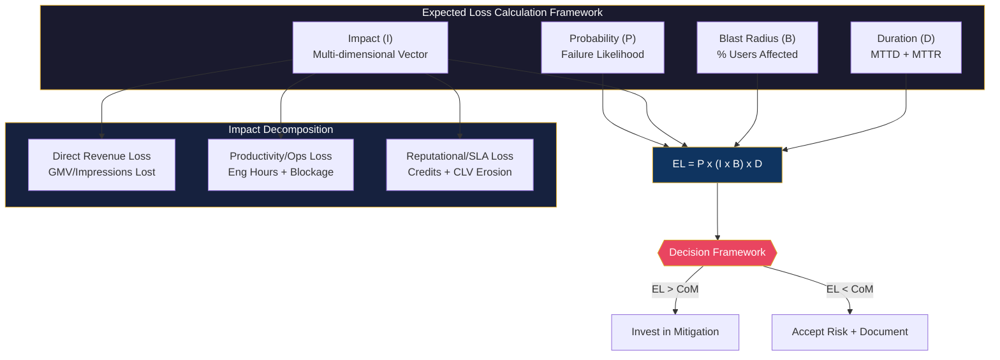
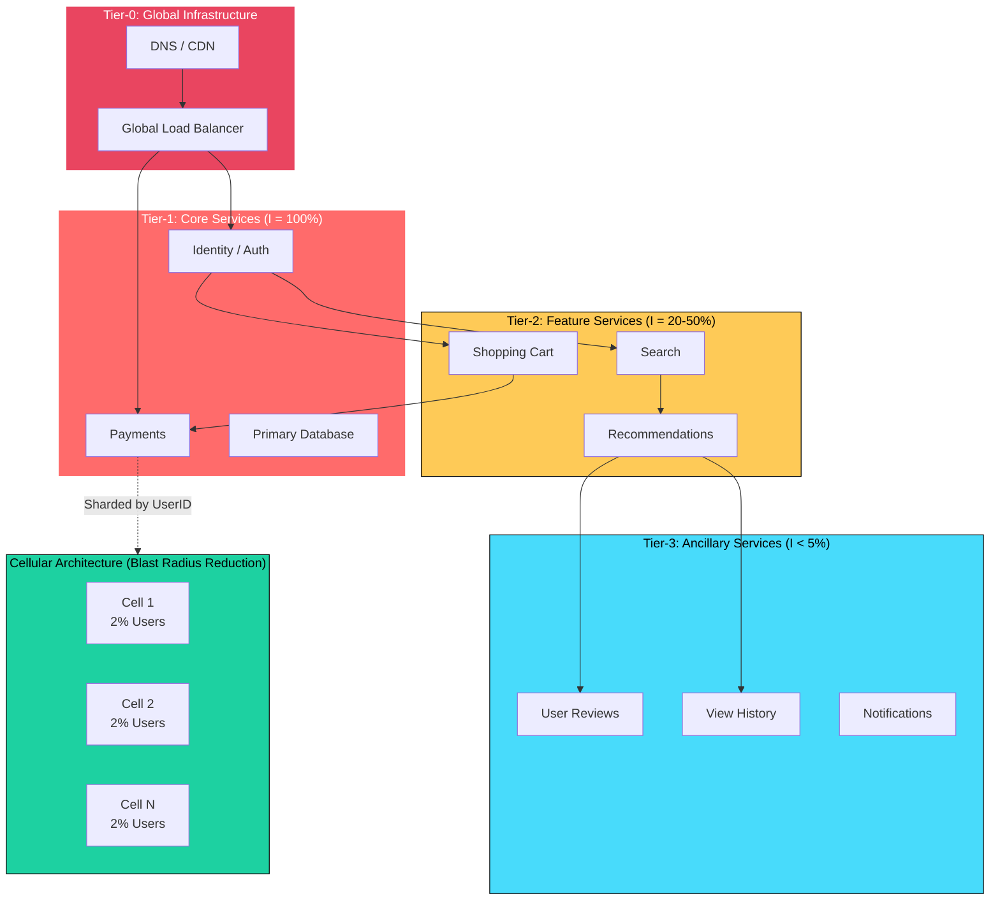
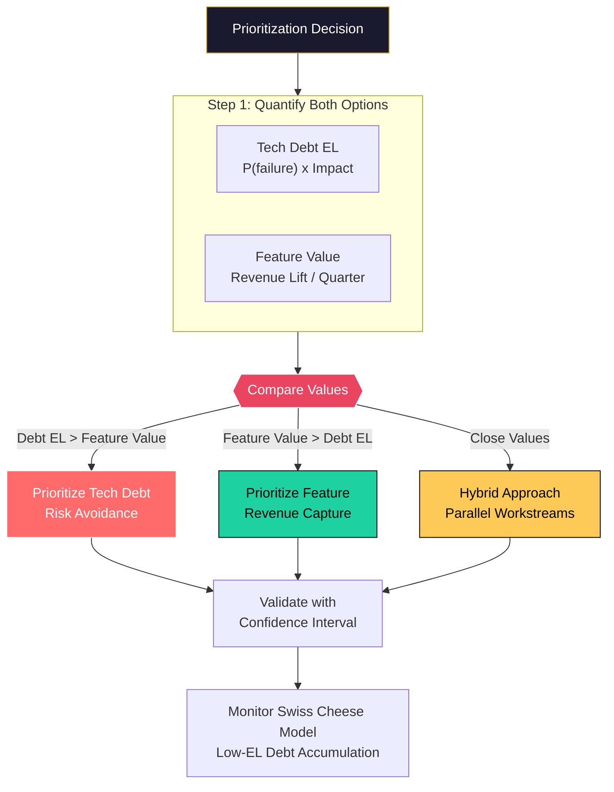
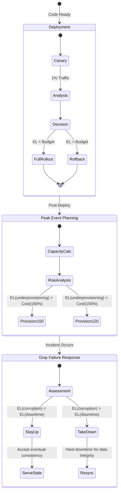
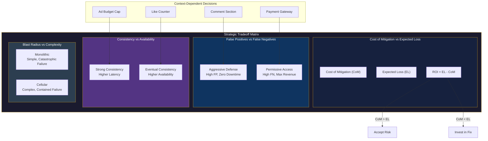

# Expected Loss Calculation

This guide covers 5 key areas: I. Conceptual Foundation: The Principal TPM Lens, II. The Variables at Mag7 Scale, III. Real-World Scenarios and Behavior, IV. Strategic Tradeoffs, V. Impact on Business, ROI, and CX.

## I. Conceptual Foundation: The Principal TPM Lens

At a Mag7 level, the "Impact" variable ($I$) in the Expected Loss formula is multidimensional and non-linear. A Principal TPM must decompose $I$ into three distinct vectors to calculate the true cost of failure:

1.  **Direct Revenue Loss:** Immediate transactional loss (e.g., failed checkouts per second $\times$ average basket size).
2.  **Productivity/Operational Loss:** The cost of the incident response (engineering hours $\times$ hourly rate) and internal blockage (e.g., 5,000 developers unable to merge code due to a CI/CD outage).
3.  **Reputational/SLA Loss:** Payouts for SLA breaches (Cloud credits) and long-term churn (Customer Lifetime Value erosion).

### 1. The "Blast Radius" Topography

At the Principal level, you must map the $I$ variable against the system architecture to understand **Blast Radius**. In a microservices architecture common to Amazon or Netflix, a failure in a Tier-1 service (e.g., Identity/Auth) has a global impact ($I = 100\%$), whereas a failure in a Tier-3 service (e.g., User Reviews) has a contained impact ($I < 5\%$).

**Real-World Mag7 Behavior:**
*   **Cellular Architecture (AWS/Meta):** To manipulate the $I$ variable, these companies implement "Cellular Architecture." Instead of scaling a service as a massive monolith, they break it into isolated "cells." If one cell fails, only 2-5% of users are impacted.
*   **The Principal TPM Role:** You advocate for cellularization when the Expected Loss of a global outage exceeds the engineering cost of refactoring into cells. You act as the forcing function to ensure new platforms are sharded by default.

**Tradeoffs:**
*   **Complexity vs. Containment:** Cellular architectures reduce the Impact ($I$) of a failure but increase the operational complexity (managing 100 shards vs. 1 cluster) and Probability ($P$) of *local* failures (more moving parts).
*   **Resource Overhead:** Isolation often requires redundant compute/storage per cell, reducing infrastructure utilization efficiency (COGS increases) to buy insurance against global outages.

### 2. Probability ($P$) and The "Nines" Calculus

Principal TPMs translate abstract "reliability" into concrete "Nines" (99.9% vs 99.999%) based on the Expected Loss Calculation.

**The Math of Nines:**
*   **3 Nines (99.9%):** ~8.7 hours of downtime/year. Acceptable for internal tools or batch processing.
*   **5 Nines (99.999%):** ~5 minutes of downtime/year. Required for Core networking, Identity, or Payment gateways.

**Strategic Application:**
If the cost to move from 4 Nines to 5 Nines is \$5M in engineering headcount and infrastructure, but the Expected Loss of staying at 4 Nines is only \$1M/year, the Principal TPM must block the reliability initiative. This is counter-intuitive but essential for ROI. You are the guardian against "Gold Plating" (over-engineering).

**Impact on Business Capabilities:**
*   **Feature Velocity:** By accurately calculating that a service only needs 99.9% availability, you release Engineering capacity to build features rather than optimizing stability for a non-critical service.
*   **Error Budgets (Google SRE Model):** You operationalize $P$. If a team has "budget" left (actual availability > target availability), you encourage high-risk feature launches. If the budget is exhausted, you enforce a code freeze.

### 3. ROI-Based Prioritization of Technical Debt

The most common conflict a Principal TPM resolves is **Feature Dev vs. Tech Debt**. ELC provides the objective framework to resolve this without emotional debating.

**The Prioritization Framework:**
1.  **Quantify the Debt:** Calculate the $EL$ of the specific technical debt item (e.g., "Legacy database has a 10% chance of failure this quarter, costing \$2M in outage time" $\rightarrow$ $EL = \$200k/quarter$).
2.  **Quantify the Feature:** Estimate the lift of the proposed new feature (e.g., "New checkout flow adds \$150k/quarter in revenue").
3.  **Decision:** Since \$200k (Risk Avoidance) > \$150k (Revenue Gain), the Tech Debt takes precedence.

**Real-World Example (Azure/GCP):**
When deciding whether to deprecate a legacy API version, the TPM calculates the EL of maintaining it (security vulnerabilities, maintenance toil) versus the EL of breaking customers (churn risk). Mag7 companies often use "Brownouts" (intentional, scheduled failures of the legacy API) to force customer migration, a strategy driven by minimizing long-term EL.

**Tradeoffs:**
*   **Short-term vs. Long-term:** Ignoring low-EL tech debt leads to accumulation. A cluster of "low risk" debts can combine to create a high-probability catastrophic failure (The Swiss Cheese Model).
*   **Data Accuracy:** The formula relies on accurate estimation. If $P$ is underestimated (common in software), the decision matrix fails. Principal TPMs must apply a "Confidence Interval" to these estimates.

## II. The Variables at Mag7 Scale

### 2. Impact (I) – The Multi-Dimensional Vector

At a Mag7 level, "Impact" is rarely a binary state of "up" or "down." It is a complex vector composed of financial, reputational, and operational dimensions. A Principal TPM must quantify these to normalize risk across disparate services (e.g., comparing a latency spike in Ads Ranking vs. a data inconsistency in User Profile).

**The Three Dimensions of Impact:**

1.  **Direct Revenue Loss:** Calculated via Real-Time Revenue Monitoring (RTRM).
    *   *Mag7 Example:* For Amazon Retail, this is strictly GMV (Gross Merchandise Value) lost per second. For Google Ads, it is un-served impressions.
    *   *Calculation:* `(Avg Revenue / Minute) × Outage Duration`.
    *   *Nuance:* This must account for seasonality. A minute of downtime on Cyber Monday is worth 100x a minute of downtime on a standard Tuesday.
2.  **SLA Payouts (The Hidden Cost):** For Cloud Service Providers (AWS, Azure, GCP), the impact includes service credits owed to customers for breaching availability guarantees.
    *   *Business Impact:* A 1-hour outage in a core region could trigger millions in SLA credits, often exceeding the direct consumption revenue lost during that hour.
3.  **Brand & Trust Decay:** Harder to quantify but critical for "Free" services (Gmail, Meta Newsfeed).
    *   *Proxy Metrics:* Customer Support Ticket Volume, Social Sentiment Analysis (NLP on Twitter/X), and Daily Active User (DAU) churn rates post-incident.

**Tradeoff Analysis:**
*   **High-Sensitivity Alerting:** Tuning monitoring to detect minor revenue dips ($I$) ensures rapid response but increases on-call fatigue (alert fatigue) and operational cost.
*   **SLA Buffering:** Setting internal SLOs (99.99%) strictly higher than external SLAs (99.9%) creates a safety buffer but requires significantly higher engineering investment to maintain.

### 3. The Multiplier: Blast Radius (B)

In the standard EL formula, Impact is often treated as total system impact. However, at Mag7 scale, we architect specifically to prevent total system failure. Therefore, the effective formula becomes:

$$EL = P \times (I \times B)$$

Where **Blast Radius ($B$)** is the percentage of the customer base or traffic affected by a specific failure mode.

**Real-World Implementation: Cellular Architecture**
Companies like AWS and Slack utilize "Cell-Based Architecture" (or Bulkheads). Instead of a monolithic database serving 100% of users, the user base is sharded into 100 "cells," each serving 1% of users.

*   **Scenario:** A bad deployment goes out.
*   **Without Cells:** 100% of users go down. $B = 1.0$.
*   **With Cells:** The deployment is rolled out to Cell 1 only. If it fails, only 1% of users are affected. $B = 0.01$.

**Principal TPM Action:**
You must drive the migration from Monolithic to Cellular architectures when the Expected Loss of a global outage exceeds the cost of re-architecture.

**Tradeoffs:**
*   **Complexity vs. Safety:** Cellular architecture drastically reduces Risk ($EL$) but linearly increases operational complexity (managing 100 stacks instead of 1) and infrastructure costs (overhead of duplicated control planes).
*   **Data Fragmentation:** Cross-cell analytics and search become significantly harder, impacting BI capabilities.

### 4. Duration (D) – The Control Variable

While Probability ($P$) is hard to zero out, Duration ($D$) is where a Principal TPM exerts the most control through **Incident Management Maturity**.

$$Impact = \text{Severity} \times \text{Duration (MTTD + MTTR)}$$

*   **MTTD (Mean Time To Detect):** The latency between failure and alert.
*   **MTTR (Mean Time To Resolve):** The latency between alert and mitigation.

**Mag7 Capability: Automated Mitigation**
At this scale, human reaction time is too slow to prevent massive financial loss.
*   **Example:** Microsoft Azure and Google SRE teams implement "Auto-Rollbacks." If the error rate on a new deployment exceeds 0.1%, the pipeline automatically reverts the binary without human intervention.
*   **ROI Impact:** Reduces MTTR from ~20 minutes (human triage) to <2 minutes (machine speed).

**Tradeoffs:**
*   **False Positives:** Automated mitigation might rollback a healthy release due to a noisy neighbor or transient network blip, delaying feature velocity.
*   **Fix-Forward vs. Rollback:** Automated systems usually default to rollback. However, for schema changes or stateful migrations, rolling back may corrupt data. A Principal TPM must define the "Point of No Return" criteria.

---

## III. Real-World Scenarios and Behavior

At the Principal level, Expected Loss Calculation moves from a theoretical exercise to a governing dynamic for critical decision-making. You will encounter three primary scenarios where ELC dictates the path forward: High-Velocity Deployment decisions, Capacity Planning for Peak Events, and the "Fix vs. Build" deadlock.

### 1. Automated Release Gating (The "Canary" Decisions)

In Mag7 CI/CD environments (e.g., Meta’s "Push" or Amazon’s Apollo), code is deployed to a small percentage of users (a canary) before a full rollout. The Principal TPM must define the **Stop-the-Line** criteria based on Expected Loss, not just raw error rates.

**The Scenario:**
A new checkout microservice is deployed to 1% of traffic. Latency increases by 200ms, but error rates remain flat. A Junior PM might say "No errors, proceed." A Principal TPM calculates the ELC of the latency.

*   **The Calculation:**
    *   $P$ (Probability of abandonment due to latency) = +0.5% drop per 100ms (based on historical data).
    *   $I$ (Impact) = Total Daily Revenue $\times$ 1% (Canary size).
    *   $EL$ = (0.5% $\times$ 2) $\times$ (Daily Revenue $\times$ 0.01).

If the Expected Loss of the latency exceeds the cost of a rollback (engineering time + delayed feature launch), the release is automatically rejected.

**Real-World Mag7 Behavior:**
*   **Google:** Uses "Error Budgets." If the Expected Loss of a release threatens to consume the remaining quarterly error budget, the release is blocked *automatically*, regardless of the feature's business value.
*   **Amazon:** Uses "Customer Impact" metrics rather than system metrics. If a deployment causes a statistically significant drop in "Orders per Second" (even without 5xx errors), the rollback is immediate.

**Trade-offs:**
*   **False Positives vs. Velocity:** Setting the ELC threshold too low results in "flaky" pipelines where safe code is rejected due to noise, slowing developer velocity.
*   **Revenue vs. Innovation:** Strict ELC gates protect current revenue but can make it difficult to launch resource-intensive new features (like AI-driven recommendations) that inherently add latency.

**Impact:**
*   **ROI:** Prevents "death by a thousand cuts" where minor regressions accumulate to destroy conversion rates.
*   **Skill Capability:** Forces engineering teams to optimize performance *before* deployment, shifting quality left.

### 2. Peak Event Capacity Planning (The "Prime Day" Paradox)

For events like Prime Day (Amazon), Black Friday (Google Shopping), or the Super Bowl (YouTube TV), the cost of failure is non-linear. A 10-minute outage during peak is not just 10 minutes of lost revenue; it is a permanent loss of customer trust and potential stock price impact.

**The Scenario:**
Engineering proposes provisioning 150% of peak estimated traffic. Finance argues for 120% to save $5M in cloud spend/hardware costs.

*   **The Calculation:**
    *   **Option A (120% Cap):** $Cost = \$0$. $Risk$: If traffic hits 125%, $P(Failure) = 100\%$. $EL = \$50M$ (Revenue + Brand Damage).
    *   **Option B (150% Cap):** $Cost = \$5M$. $Risk$: $P(Failure) \approx 0\%$.
    *   **Decision:** The Principal TPM frames this not as "spending money" but as buying an insurance policy. Is it worth paying \$5M to eliminate a \$50M risk?

**Real-World Mag7 Behavior:**
*   **Netflix:** Intentionally induces failure (Chaos Monkey) during high-traffic windows to test fallback mechanisms, calculating the ELC of *not* testing as higher than the ELC of a controlled failure.
*   **Microsoft Azure:** During high-demand periods, they may preemptively throttle lower-tier (Spot) VMs to preserve capacity for SLA-guaranteed enterprise customers. The ELC of refunding Spot instances is lower than breaching Enterprise SLAs.

**Trade-offs:**
*   **CapEx/OpEx vs. Reliability:** Over-provisioning kills margins. Under-provisioning kills the business. The Principal TPM must find the inflection point.
*   **User Experience Tiering:** To manage ELC, you may have to degrade experience for free users to protect paid users (load shedding).

**Impact:**
*   **Business Capabilities:** Accurate ELC allows the business to run "Flash Sales" or major live events with confidence.
*   **CX:** Users experience consistency. During a spike, it is better to serve 90% of users perfectly and reject 10% (controlled shedding) than to let the system crash for 100% (uncontrolled failure).

### 3. The "Gray Failure" and Incident Response

The most dangerous scenarios at Mag7 are not total blackouts, but "Gray Failures"—where a system is partially broken (e.g., search works, but ads don't load, or data is stale).

**The Scenario:**
A storage cluster loses sync. You can keep the system up (serving stale data) or take it down for 30 minutes to resync (hard downtime).

*   **The Calculation:**
    *   **Fix-Forward (Stay Up):** $P(Data Corruption) = 10\%$. $I(Corruption) = \$100M$ (Legal/Compliance/Trust). $EL = \$10M$.
    *   **Hard Down (Resync):** $P(Downtime) = 100\%$. $I(Lost Revenue) = \$2M$. $EL = \$2M$.

**Real-World Mag7 Behavior:**
*   **Meta:** In data consistency issues involving privacy, the ELC of a privacy breach (regulatory fines) is effectively infinite. The system is taken down immediately.
*   **Amazon Retail:** For product catalog updates (e.g., a price change), stale data is often acceptable for short periods. The ELC of downtime (stopping sales) is higher than the ELC of selling an item at the wrong price for 10 minutes.

**Trade-offs:**
*   **Consistency (CP) vs. Availability (AP):** This is the practical application of the CAP theorem. You are trading data accuracy for system uptime based on which loss is more expensive.
*   **Short-term Pain vs. Long-term Risk:** Taking a system down (Stop the Bleeding) hurts immediately but caps the loss. Trying to recover while live risks cascading failures.

**Impact:**
*   **SLA Compliance:** Helps define when to burn error budget intentionally.
*   **Legal/Compliance:** Protects the company from regulatory events which often dwarf technical costs.

---

## IV. Strategic Tradeoffs

At the Principal TPM level, Expected Loss (EL) is not merely a reporting metric; it is a decision-making framework. Once you have calculated $P$ (Probability) and $I$ (Impact), you face the strategic challenge of deciding how to manipulate those variables. You cannot fix every risk. You must choose which losses are acceptable and which mitigations provide a positive Return on Investment (ROI).

This phase of the role requires moving from "How do we fix this?" to "Should we fix this, and at what cost?"

### 1. The Cost of Mitigation vs. Expected Loss
The fundamental strategic tradeoff is comparing the **Cost of Mitigation (CoM)** against the **Expected Loss (EL)**.

$$ROI = Expected Loss (EL) - Cost of Mitigation (CoM)$$

If $CoM > EL$, the rational business decision—counter-intuitively for many engineers—is to accept the risk, provided the failure does not trigger an existential threat (e.g., permanent data loss or regulatory breach).

*   **Mag7 Example (Amazon/AWS):** Consider a Tier-2 internal reporting service used by operational teams.
    *   **Scenario:** A specific database failure mode happens once a year ($P=1$) causing 4 hours of downtime. The impact is 50 engineers losing 4 hours of productivity ($I = \$50k$). Total $EL = \$50k/year$.
    *   **Proposed Mitigation:** Re-architecting to Multi-AZ (Availability Zone) Active-Active redundancy.
    *   **Cost:** \$200k in engineering time + \$30k/year in increased infra costs.
    *   **Decision:** Do **not** fix. The TPM blocks this engineering effort because the CoM exceeds the EL. instead, the TPM mandates a Runbook (SOP) to ensure the 4-hour recovery doesn't turn into 4 days.
*   **Tradeoff:**
    *   *Pro:* Capital efficiency; engineering resources remain focused on revenue-generating features.
    *   *Con:* Technical debt accumulation; operational friction during the outage.
*   **Impact:**
    *   **Business:** Direct OPEX savings.
    *   **Skill:** Forces teams to practice manual recovery, maintaining "muscle memory" for when automation fails.

### 2. False Positives vs. False Negatives (Sensitivity Tuning)
When implementing automated remediation (e.g., circuit breakers, auto-scalers, fraud detection, abuse blocking), you must tune the sensitivity. This is a direct tradeoff between **Availability** and **Revenue/User Experience**.

*   **Mag7 Example (Google/YouTube):** Automated abuse detection systems (DDoS protection or Content ID).
    *   **Strategy A (Aggressive Defense):** Prioritize system stability. Block any traffic pattern that looks remotely like an attack.
        *   *Result:* Zero downtime, but high "False Positive" rate. Legitimate users get blocked (403 Forbidden).
    *   **Strategy B (Permissive Access):** Prioritize user access. Only block traffic that is definitively malicious.
        *   *Result:* Zero user blocking, but higher risk of "False Negative" (attack traffic gets through), potentially crashing the service.
*   **Strategic Choice:** For a payment gateway (Google Pay), you lean toward **Strategy B** (never block a legitimate payment unless the system is melting down). For a free comment section, you lean toward **Strategy A** (aggressively block spam, even if some real comments are lost).
*   **Tradeoff:**
    *   *High Sensitivity:* Protects infrastructure (Low EL on System) but increases Churn/Support costs (High EL on CX).
    *   *Low Sensitivity:* Maximizes Revenue/CX (Low EL on Business) but risks catastrophic overload (High EL on Availability).
*   **Impact:**
    *   **CX:** Direct correlation to Net Promoter Score (NPS) and support ticket volume.

### 3. Consistency vs. Availability (CAP Theorem Implementation)
A Principal TPM must often arbitrate the implementation of the CAP theorem (Consistency, Availability, Partition Tolerance) based on the Expected Loss of data staleness vs. downtime.

*   **Mag7 Example (Meta/Facebook):**
    *   **Feature:** The "Like" counter on a viral post.
    *   **Analysis:** If a user sees 1.5M likes and another sees 1.51M likes, the **Expected Loss is near zero**. However, if the service is down to ensure those numbers match perfectly, the **Expected Loss (Ad Revenue) is massive**.
    *   **Decision:** Eventual Consistency. The TPM drives requirements for "soft" dependencies. If the counting service fails, the UI should degrade gracefully (show "1M+" or a cached number) rather than error out.
    *   **Contrast:** Facebook Ads Manager billing. If the budget cap is hit but the system doesn't update immediately (Consistency failure), Meta loses money (over-delivery of ads that cannot be billed). Here, the TPM enforces strong consistency, even if it means lower availability (locking the account temporarily).
*   **Tradeoff:**
    *   *Strong Consistency:* High latency, lower availability, complex error handling.
    *   *Eventual Consistency:* High availability, low latency, risk of user confusion or "double spend" scenarios.
*   **Impact:**
    *   **Business Capabilities:** Defines which products can be built. You cannot build a high-frequency trading platform on eventually consistent architecture.

### 4. Blast Radius vs. Cost of Complexity (Cell-Based Architecture)
To minimize the Impact ($I$) variable in the EL formula, Mag7 companies use Cell-Based Architectures (sharding users into isolated silos). If one cell fails, only 2-5% of users are impacted.

*   **Mag7 Example (Microsoft Azure/Office 365):**
    *   **Scenario:** Global deployment of a new Exchange Online feature.
    *   **Traditional Approach:** Deploy to the "North America" region. Impact of failure: 100M users down.
    *   **Cell-Based Approach:** Deploy to "Cell NA-01" (hosting 200k users). Impact of failure: 200k users down.
    *   **Strategic Friction:** Cell-based architecture is expensive. It requires complex routing, data migration tools (moving users between cells), and massive overhead in monitoring (1000 dashboards instead of 1).
*   **The TPM Decision:** A Principal TPM advocates for Cell-Based Architecture only when the **Cost of Outage** (Brand damage + SLA payouts) exceeds the **Cost of Complexity** (Engineering years to build the routing layer).
*   **Tradeoff:**
    *   *Monolithic/Regional:* Simple to manage, catastrophic failure modes.
    *   *Cellular:* Limits blast radius (lowers $I$), increases operational toil and infrastructure spend.
*   **Impact:**
    *   **ROI:** High upfront investment for long-term risk reduction.
    *   **SLA:** Enables "four nines" (99.99%) availability by ensuring no single failure takes down the whole platform.

### 5. Buy vs. Build (Risk Ownership)
When calculating EL, owning the stack means owning the risk. Outsourcing transfers the operational risk but introduces vendor risk.

*   **Mag7 Context:** Even Mag7 companies use third-party tools (e.g., Salesforce, Slack, PagerDuty).
*   **Analysis:** If you build an internal messaging tool, you control the reliability ($P$) and the remediation time. If you buy Slack, your EL calculation changes: $P$ is now Slack's SLA, and $I$ includes your inability to fix it yourself during an outage.
*   **Strategic Choice:** A Principal TPM will block "Building" commodity services (like a CRM) because the internal engineering opportunity cost is too high, even if the vendor has occasional outages. However, for core competencies (e.g., Google's Search Indexing), "Buy" is never an option because the EL of relying on a vendor for core IP is infinite.

---

## V. Impact on Business, ROI, and CX

At the Principal level, your role shifts from tracking bugs to quantifying "Value at Risk" (VaR). You must translate technical instability into P&L (Profit and Loss) impact to drive executive alignment. In a Mag7 environment, Expected Loss (EL) is not an abstract concept; it is a hard currency used to negotiate error budgets and headcount.

### 1. Direct Revenue Attribution and Latency Curves

The most immediate application of ELC is quantifying direct revenue loss. However, at Mag7 scale, systems rarely fail binary (100% down). They degrade.

**Mag7 Implementation:**
Companies like Amazon and Google map **Latency vs. Conversion Rate**.
*   **The Metric:** Revenue at Risk due to Latency.
*   **The Data:** Amazon famously determined that every 100ms of latency cost 1% in sales. Google found an extra 0.5 seconds in search page generation dropped traffic by 20%.
*   **Calculation:** $EL = (\text{Traffic Volume} \times \text{Conversion Rate Delta} \times \text{Average Order Value})$.

**Trade-offs:**
*   **Precision vs. Aggregation:** Calculating EL per microservice request is computationally expensive.
    *   *Decision:* Most Principal TPMs utilize sampling (e.g., 1% of traffic) or proxy metrics (e.g., checkout button latency) rather than tracing every transaction to revenue.
*   **False Positives:** A drop in revenue might be seasonality or a bad marketing campaign, not technical failure. You must normalize against baseline trends.

**Impact:**
*   **ROI:** Justifies high-cost latency reduction projects (e.g., Edge computing investments) by proving that a 50ms improvement generates \$50M/year.

### 2. The SLA Credit Liability (Enterprise & Cloud)

For TPMs in Cloud (AWS, Azure, GCP) or B2B SaaS (Salesforce, Slack), Expected Loss includes contractual penalties.

**Mag7 Implementation:**
Service Level Agreements (SLAs) typically offer service credits for downtime.
*   **99.9% (Three Nines):** ~43 minutes of downtime/month allowed.
*   **99.99% (Four Nines):** ~4 minutes of downtime/month allowed.

If a region goes down, the EL is not just the consumption halted during the outage; it is the **Service Credits Payout**.
*   **Example:** An AWS region outage affecting S3 might trigger a 10% bill credit for thousands of enterprise customers.
*   **Calculation:** $EL = (\text{Direct Consumption Loss}) + (\text{Affected Customer Base} \times \text{Monthly Bill} \times \text{SLA Credit \%})$.

**Trade-offs:**
*   **Architecture vs. Liability:** Achieving Five Nines (High Availability) is exponentially more expensive than Four Nines.
    *   *Decision:* If the cost to architect Multi-Region Active-Active redundancy is \$10M/year, but the Expected Loss (Payouts) of a region failure is only \$2M/year, the business decision—driven by the TPM—may be to accept the risk of the outage.

**Impact:**
*   **Business Capability:** Defines the "Tier 0" service list. Only services where EL > Engineering Cost get the highest level of redundancy.

### 3. Operational and Opportunity Costs (Internal Impact)

When internal developer platforms (IDP), CI/CD pipelines, or data lakes fail, revenue doesn't drop immediately, but "Burn Rate" is wasted.

**Mag7 Implementation:**
Meta and Google track **Developer Productivity Loss**.
*   **Scenario:** A bad config push breaks the monorepo build system for 2 hours. 5,000 engineers cannot merge code.
*   **Calculation:** $EL = (\text{Engineers Blocked} \times \text{Avg Hourly Cost}) + (\text{Delayed Feature Release Value})$.
*   **Context:** At Meta, if "diffs" (code changes) cannot be shipped, the "Move Fast" culture halts. The EL is quantified not just in salary, but in the delay of ad-revenue-generating experiments.

**Trade-offs:**
*   **Velocity vs. Stability:** Implementing strict "commit freezes" or heavy integration testing reduces the probability of pipeline failure but increases the "Time to Merge."
    *   *Decision:* Principal TPMs often implement "Optimistic Merging" with automated rollbacks. The trade-off is accepting higher EL on the pipeline stability to maximize feature velocity (ROI).

### 4. Brand Equity and Churn (The Long-Tail CX Impact)

This is the hardest variable to quantify but often the largest component of EL.

**Mag7 Implementation:**
Netflix and Spotify model **Session Abandonment** and **Churn Probability**.
*   **Behavior:** If a video buffers twice, the probability of the user abandoning the session spikes. If this happens 3 times in a month, the probability of subscription cancellation (Churn) increases.
*   **Calculation:** $EL = (\text{Impacted Users} \times \Delta \text{Churn Probability} \times \text{Customer Lifetime Value (LTV)})$.

**Trade-offs:**
*   **UX Degradation vs. Hard Failure:** Is it better to show an error page or a stale page?
    *   *Decision:* Amazon and Netflix prefer "Graceful Degradation." If the recommendation engine fails, show a static list of "Popular Movies" rather than an error. The EL of a "stale" experience is lower than the EL of a "broken" experience.
*   **Cost of Transparency:** Publicly reporting a Root Cause Analysis (RCA) builds trust (lowers long-term EL) but may cause short-term stock volatility or press scrutiny (short-term EL).

**Impact:**
*   **CX:** Shifts engineering focus from "Uptime" to "Success Rate." A server can be "up" (responding 200 OK) but serving empty data. ELC forces a focus on the *customer's* successful interaction.

---

---

## Interview Questions

### I. Conceptual Foundation: The Principal TPM Lens

### Question 1: The "Gold Plating" Scenario
"You are the TPM for a new internal data analytics platform. The Engineering Lead insists on architecting for 99.999% availability (5 Nines), citing industry best practices. This will delay launch by 4 months and double the infrastructure cost. The Product Manager wants to launch 'yesterday' and accepts 99.0%. How do you resolve this conflict?"

**Guidance for a Strong Answer:**
*   **Framework:** Use ELC. Acknowledge that "Best Practice" is context-dependent.
*   **Discovery:** Ask about the *Impact* of downtime. Is this platform on the critical path for revenue or regulatory reporting? If it goes down for 4 hours, does the company lose money, or do analysts just get coffee?
*   **Calculation:** Demonstrate the math. If downtime costs \$10k/hour, and 4 Nines saves 8 hours a year over 2 Nines, the value of reliability is \$80k/year. If the cost of 4 Nines is \$2M, the ROI is negative.
*   **Solution:** Propose a phased approach (Launch at 99.5% to capture value, scale to higher availability only if usage/criticality warrants it).

### Question 2: The Black Swan Event
"Your product has historically stable metrics. Suddenly, a rare dependency failure causes a 12-hour global outage, costing the company \$50M. The executive team demands a 'Never Again' guarantee and unlimited budget to fix it. However, your analysis shows this specific failure mode has a probability of recurring only once every 20 years. How do you advise the VP?"

**Guidance for a Strong Answer:**
*   **Emotional Intelligence vs. Data:** Acknowledge the executive pressure (Recency Bias) but pivot to data.
*   **The Cost of Mitigation:** Calculate the cost to mitigate this specific "Black Swan." If it costs \$100M to prevent a \$50M loss that happens once in 20 years ($EL = \$2.5M/year$), the mitigation is a bad investment.
*   **Alternative Strategy:** Instead of "Prevention" (lowering $P$ to 0), focus on "Mitigation" (lowering $I$). Suggest investing in faster recovery tools (reducing MTTR) or better degradation modes, which improves resilience against *all* failure modes, not just this specific rare one.
*   **Strategic Alignment:** Frame the conversation around "Risk Tolerance." Does the company want to spend \$100M to buy insurance against a \$50M event? usually, the answer is no when framed financially.

### II. The Variables at Mag7 Scale

### Question 1: The Prioritization Conflict
"You are the Principal TPM for a Tier-0 storage service. Engineering wants to freeze feature development for a quarter to move from a global control plane to a cellular architecture to reduce blast radius. Product Leadership argues this will miss a critical market window for a new feature, estimated to bring in \$50M ARR. How do you decide, and how do you convince the losing side?"

**Guidance for a Strong Answer:**
*   **Quantify the Risk:** The candidate should not use feelings. They must calculate the Expected Loss (EL) of the current architecture. (e.g., "If we have a 10% chance of a global outage costing \$500M in SLA payouts and reputation, the EL is \$50M.")
*   **Compare EL vs. Opportunity Cost:** Compare the \$50M EL reduction against the \$50M ARR gain.
*   **Propose a Middle Ground:** A strong Principal TPM doesn't just say "No." They propose a phased approach—can we cellularize only the highest-risk components? Can we launch the feature to a limited cohort (reducing the need for immediate cellularization)?
*   **Stakeholder Management:** Acknowledge that Product cares about Growth and Engineering cares about Reliability. Frame the cellularization not as "tech debt" but as "protecting the \$50M ARR feature from failing on launch day."

### Question 2: Defining Severity at Scale
"We have a service with 99.99% availability. We are seeing a 0.05% error rate spike that is affecting only free-tier users in a specific region. The on-call engineer wants to declare a SEV-2 and wake up the team. The Engineering Manager wants to downgrade it to SEV-3 and handle it during business hours to prevent burnout. What framework do you use to resolve this dispute?"

**Guidance for a Strong Answer:**
*   **Reference the SLA/SLO:** Does 0.05% breach the error budget? If the budget is nearly empty, it forces a higher severity.
*   **Impact Segmentation:** Discuss the specific impact. Is "Free Tier" a funnel for Enterprise? If yes, a poor experience there hurts future revenue (LTV impact).
*   **Operational Health:** Address the "burnout" argument. If the team is frequently woken up for minor issues, they will ignore real fires.
*   **Decision Matrix:** The candidate should propose a predefined matrix (agreed upon *before* the incident) that maps User Segment + Error Rate to Severity Levels, removing the need for 3 AM debates.

### III. Real-World Scenarios and Behavior

### Question 1: The "Zero-Day" Prioritization
"You are the Principal TPM for a cloud storage product. A security researcher reports a vulnerability that *might* allow data exfiltration, but exploiting it requires a very specific, unlikely chain of events ($P \approx 0.01\%$). Fixing it requires a complete service restart, causing a 5-minute outage for all enterprise customers, breaching our 99.99% SLA for the month. Do you patch immediately or wait for the scheduled maintenance window in 3 weeks?"

**Guidance for a Strong Answer:**
*   **Quantify the Unquantifiable:** The candidate should attempt to calculate the Expected Loss of the breach ($0.01\% \times \text{Catastrophic Brand/Legal Damage}$) vs. the Expected Loss of the SLA breach ($\text{SLA Penalty Credits} + \text{Customer Trust Hit}$).
*   **Identify the "Black Swan":** A strong candidate recognizes that security risks often have an "infinite" impact component (trust is hard to regain). Even with low $P$, the $EL$ of a breach usually outweighs the deterministic cost of an SLA payout.
*   **Mitigation Strategy:** Instead of a binary choice, they should propose a third option: Traffic shifting (Region A to Region B) to patch without downtime, or applying a WAF rule to block the exploit path temporarily.
*   **Stakeholder Communication:** How do you explain to the VP of Sales that you are intentionally breaking the SLA today to prevent a potential headline news story tomorrow?

### Question 2: The "Feature vs. Debt" Standoff
"Your engineering team estimates that a critical legacy database has a 20% chance of catastrophic failure in the next 6 months due to load scaling. Migrating it will take 3 months and halt all new feature development. Product Leadership refuses to pause the roadmap because Q4 revenue targets depend on new features. How do you resolve this?"

**Guidance for a Strong Answer:**
*   **Translate to Currency:** Do not talk about "technical debt" or "code quality." Talk about "Revenue at Risk."
*   **The ELC Pitch:** "If we don't migrate, we have a 20% chance of losing 100% of Q4 revenue ($EL = 0.2 \times Q4\_Rev$). If we do migrate, we lose the *incremental* revenue of the new features (perhaps 5% of Q4\_Rev)."
*   **Negotiate Scope:** A Principal TPM doesn't just accept the binary. Can we do a "strangler fig" migration pattern that allows some feature work to continue? Can we add read-replicas to reduce the load (lowering $P$) to buy time?
*   **Risk Acceptance:** If Product still refuses, the candidate must document the risk acceptance formally. "If you choose not to migrate, you are signing off on a \$X Million Expected Loss." This usually forces a decision.

### IV. Strategic Tradeoffs

### Question 1: The "High Cost" Mitigation
**"I have identified a critical single point of failure in our payment processing pipeline. If it fails, we lose \$1M per hour. However, the engineering team estimates it will take 6 months of code freeze on new features to re-architect the system to remove this risk. The VP of Product wants to launch new features to hit quarterly goals. As the Principal TPM, how do you resolve this conflict?"**

**Guidance for a Strong Answer:**
*   **Quantify the Risk (Expected Loss):** Do not just say "\$1M/hour." Ask for the Probability ($P$). If the failure happens once every 10 years, the Expected Loss is low. If it happens weekly, it's high.
*   **Propose Intermediate Mitigations:** A Principal TPM rarely accepts binary choices (Freeze vs. Ignore). Look for "good enough" mitigations: Can we add a manual failover switch? Can we add a retry queue? Can we fix it in parallel (strangler fig pattern) without a full code freeze?
*   **Business Language:** Frame the argument in terms of "protecting the quarterly goals." If the system goes down for 4 hours during the launch, the goals are missed anyway.
*   **Decision Framework:** Utilize the Error Budget concept. If the team has exhausted their error budget, reliability *must* take precedence over features.

### Question 2: Latency vs. Accuracy
**"We are launching a real-time fraud detection system for a high-frequency transaction platform. The Data Science team has a model that catches 99.9% of fraud but adds 400ms of latency to every transaction. The Product team says 400ms will cause a 10% drop in user conversion. How do you approach this tradeoff?"**

**Guidance for a Strong Answer:**
*   **Deconstruct the Variables:** Compare the loss from Fraud (Financial loss) vs. the loss from Conversion drops (Revenue loss).
*   **Asynchronous Evaluation:** Suggest a hybrid approach. Can we run a "lite" model (10ms latency, 90% accuracy) inline, and the "heavy" model (400ms) asynchronously? If the heavy model flags it later, we reverse the transaction or flag the account for review.
*   **Optimistic UI:** Can the UI hide the latency?
*   **Segmentation:** Apply the heavy model only to "high risk" transactions (e.g., over \$100 or new devices) while letting low-risk traffic pass through the fast path.
*   **A/B Testing:** Propose a live experiment to validate the "10% drop" assumption. Never trust claimed impact without data.

### V. Impact on Business, ROI, and CX

### Question 1: The "Fix vs. Build" Conflict
**Question:** "You are the Principal TPM for a high-growth product. Engineering wants to halt feature development for a sprint to pay down technical debt to reduce the risk of a specific outage scenario. Product Leadership argues this will delay a launch worth \$5M in projected Q4 revenue. How do you resolve this using data?"

**Guidance for a Strong Answer:**
*   **Avoid Opinions:** Do not say "Tech debt is important." Use ELC.
*   **The Math:** Calculate the Expected Loss of the outage.
    *   $EL = (\text{Probability of Outage}) \times (\text{Cost of Outage})$.
    *   If the outage has a 10% chance of happening and would cost \$20M (in credits, reputation, and lost sales), the $EL$ is \$2M.
*   **The Comparison:** Compare the \$2M risk reduction against the \$5M delayed revenue.
*   **The Nuance:** A strong candidate will ask about the *nature* of the failure. Is it a catastrophic data loss (company-ending risk) or a transient latency spike? If it's existential risk, ROI doesn't matter.
*   **Mitigation:** Propose a middle ground—can we reduce the *Impact* (blast radius) without fixing the root cause immediately, allowing the feature to ship while lowering the risk profile?

### Question 2: Quantifying the Unquantifiable
**Question:** "We are seeing a 0.01% error rate on our login service. It seems negligible, but it affects our highest-value enterprise partners disproportionately. The fix requires a complete architectural rewrite. How do you build the business case for this rewrite?"

**Guidance for a Strong Answer:**
*   **Segmented ELC:** Acknowledge that "Average" error rates hide the truth. 0.01% of global traffic might be small, but if it is 10% of "Whale" accounts, the EL is massive.
*   **LTV Calculation:** Incorporate the Lifetime Value of those specific enterprise partners. Losing one major partner could cost more than the rewrite.
*   **Reputational Contagion:** Discuss how enterprise failures leak. If a major partner leaves publicly, it triggers a "confidence crisis," increasing the Probability ($P$) of churn across other accounts.
*   **Strategic Alignment:** Tie the rewrite to future capabilities. "This rewrite doesn't just fix the bug; it enables the Multi-Region support we need for next year's roadmap," thereby increasing the ROI of the fix beyond just the error rate reduction.

---

## Key Takeaways

- Review each section for actionable insights applicable to your organization

- Consider the trade-offs discussed when making architectural decisions

- Use the operational considerations as a checklist for production readiness
