# Experimentation Platforms & A/B Testing

At Mag7 scale, experimentation is not a data science function—it's infrastructure. The platform decides which code paths execute for which users, replacing "release trains" with statistical rollouts and feature flags. Principal TPMs own the architecture that enables 1,000+ concurrent experiments without interference, the governance that prevents teams from p-hacking their way to false wins, and the metrics hierarchy that ensures optimizing "clicks" doesn't destroy "retention." This guide covers the assignment architecture, statistical pitfalls, and programmatic controls that separate rigorous experimentation from noise-driven decision-making.

## I. Strategic Landscape: Experimentation as Infrastructure

### 1. The "Release vs. Deploy" Paradigm Shift

At a Principal level, the most critical architectural distinction to enforce is the decoupling of code deployment from feature release. In mature Mag7 environments, experimentation infrastructure effectively acts as the control plane for this separation.

**Technical Implementation:**
Instead of long-lived feature branches, code is merged into `main` behind a **Feature Flag** or **Experiment Configuration**. The binary is deployed to production servers, but the code path is dormant. The Experimentation Platform (XP) then dynamically activates these paths based on user assignment.

*   **Real-World Example (Meta/Facebook):** Meta uses a system called "Gatekeeper" for rollout and safety, and "Quick Experimentation" (QE) for tuning. A Principal TPM ensures that a feature is not just "shipped" but is wrapped in a Gatekeeper check. This allows the infrastructure to instantly throttle a feature from 100% to 0% if latency spikes, without a rollback deployment.
*   **Tradeoffs:**
    *   *Code Complexity vs. Safety:* This introduces conditional logic (`if (config.isEnabled)`) throughout the codebase, increasing cyclomatic complexity and testing surface area.
    *   *Tech Debt:* "Stale flags" are a major liability. If experiment code isn't removed after the decision, the codebase becomes brittle.
*   **Impact:**
    *   *Business Capability:* Enables "Dark Launching" (testing backend load without UI exposure).
    *   *ROI:* drastically reduces Mean Time to Resolution (MTTR) during incidents, as bad features are toggled off in seconds rather than rolled back in hours.

### 2. Handling Network Effects: Switchback and Cluster Testing

Standard A/B testing assumes the **Stable Unit Treatment Value Assumption (SUTVA)**: that one user's treatment does not affect another user's outcome. In Mag7 ecosystems (Social Networks, Marketplaces), this assumption is frequently violated due to interference.

**Technical Implementation:**
*   **Cluster-Based Testing:** Instead of randomizing users, you randomize clusters (e.g., distinct social graphs or geographic regions).
*   **Switchback (Time-Split) Testing:** Used heavily in two-sided marketplaces. The platform toggles the algorithm for a whole region (e.g., San Francisco) in alternating time windows (e.g., Treatment for 30 mins, Control for 30 mins).

*   **Real-World Example (Uber/Lyft/DoorDash):** If Uber tests a new driver pricing algorithm on a subset of drivers (Treatment), those drivers might work more, stealing supply from the Control group. This makes the Control group look artificially worse, inflating the estimated lift. To solve this, Uber uses Switchback testing to apply the change to the *entire market* in time slices.
*   **Tradeoffs:**
    *   *Statistical Power vs. Validity:* Switchback and Cluster tests reduce the effective sample size (N), meaning experiments must run longer to achieve statistical significance.
    *   *Engineering Complexity:* The infrastructure must support state consistency. If a user crosses a "cluster" boundary (e.g., a user travels from a Treatment city to a Control city), the experience must remain consistent or handle the transition gracefully.
*   **Impact:**
    *   *ROI:* Prevents "Cannibalization" bias where a feature looks successful only because it degraded the experience for non-users.

### 3. The "Global Holdout" and Cumulative Impact

A common fallacy in high-velocity product teams is that the sum of all winning experiments equals the total business growth. In reality, $1\% + 1\% + 1\%$ rarely equals $3\%$ growth due to feature interaction and novelty effects.

**Technical Implementation:**
The Experimentation Platform maintains a **Global Holdout Group**—a persistent slice of traffic (e.g., 5% of all users) that receives *no* new features for a long duration (6-12 months).

*   **Real-World Example (Amazon/Netflix):** Amazon maintains long-term holdouts to measure the cumulative impact of "shipping velocity" on latency and page load time. While individual features might have negligible latency costs, the aggregate might slow the site down enough to hurt revenue. The Global Holdout reveals this "death by a thousand cuts."
*   **Tradeoffs:**
    *   *Opportunity Cost vs. Truth:* You are deliberately withholding "better" features from 5% of your high-value users, theoretically losing revenue on that slice.
    *   *CX Friction:* Holdout users may complain about missing features that their friends have.
*   **Impact:**
    *   *Strategic Decision Making:* This is the only way to measure the true long-term ROI of the product roadmap and detect if the product is becoming bloated.

### 4. Latency Budgets and Assignment Architecture

As a Principal TPM, you must scrutinize *where* the experiment assignment occurs, as this dictates the latency impact on the user.

**Technical Implementation:**
*   **Client-Side Assignment:** The device downloads a massive JSON blob of all active experiments and decides locally.
    *   *Pros:* No blocking network call before rendering.
    *   *Cons:* "Flicker" (UI changes after load), large payload size, insecure (users can inspect the payload to see upcoming features).
*   **Server-Side Assignment:** The server decides the treatment before sending the HTML/response.
    *   *Pros:* Secure, consistent UI (no flicker).
    *   *Cons:* Caching becomes difficult (CDNs cannot cache a static page if it varies by user bucket).
*   **Edge Assignment (Lambda@Edge / Cloudflare Workers):** Assignment logic moves to the CDN edge.

*   **Real-World Example (Netflix):** Netflix relies heavily on server-side assignment for the "Homepage" experience to ensure immediate playback readiness, but uses client-side inputs for artwork selection to minimize backend load.
*   **Tradeoffs:**
    *   *Cache Hit Rate vs. Personalization:* Server-side experimentation often forces a drop in CDN cache hit rates, increasing origin compute costs.
*   **Impact:**
    *   *CX:* Poorly architected client-side experimentation leads to Layout Shift (CLS), which negatively impacts SEO and user trust.

## II. System Architecture & The Life of an Experiment

The assignment engine uses a deterministic hash function (e.g., MurmurHash3) combined with a "Salt" (Experiment ID) to map a User ID to a bucket (0–99).
*   **Mag7 Implementation (Google "Layers" / Meta "Universes"):** At scale, you cannot run one experiment at a time. Google utilizes an architecture of "Orthogonal Layers."
    *   *Layering:* Traffic is divided into non-overlapping layers (e.g., UI Layer, Backend Ranking Layer, Ads Layer).
    *   *Orthogonality:* A user can be in a UI experiment *and* a Ranking experiment simultaneously without the experiments polluting each other’s data, provided the layers are statistically orthogonal (randomized independently).
*   **Trade-offs:**
    *   **Stateless Hashing (Mag7 Standard) vs. Database Lookup:**
        *   *Stateless:* CPU intensive, zero I/O latency, infinite scale. **Trade-off:** Hard to change a user's bucket once assigned without changing the experiment ID.
        *   *DB Lookup:* High latency, storage costs. **Trade-off:** Allows precise targeting (e.g., "Target only users who clicked 'Buy' yesterday"), but introduces a single point of failure.
*   **Principal TPM Takeaway:** Ensure your architecture defaults to stateless hashing for assignment. If a Product Manager requests complex targeting (e.g., "Users who watched >5 hours of anime"), push this logic to the *eligibility filter* (pre-assignment), not the assignment mechanism itself, to preserve system resilience.

### 2. Execution Models: Client-side vs. Server-side vs. Edge

Once a user is bucketed, the application must reflect the change. The "where" matters for latency and security.

#### Server-Side Testing
*   **Mechanism:** The web server or microservice queries the Experiment Service (SDK), receives the config, and renders the HTML/JSON response accordingly.
*   **Mag7 Behavior:** Amazon uses this for almost all backend logic (search algorithms, pricing, shipping logic).
*   **Trade-offs:**
    *   *Pros:* No "Flash of Original Content" (FOOC); secure (user cannot see upcoming features in browser source code); consistent across platforms.
    *   *Cons:* Slower engineering velocity (requires deployment cycles); harder for non-technical PMs to configure.

#### Client-Side Testing
*   **Mechanism:** The browser/app loads, calls an API to fetch experiment configs, and JavaScript manipulates the DOM.
*   **Mag7 Behavior:** Often used by Netflix for simple artwork testing or UI copy changes to bypass heavy backend release cycles.
*   **Trade-offs:**
    *   *Pros:* High velocity; decoupled from backend release trains.
    *   *Cons:* **Latency & FOOC.** If the API call is slow, the user sees the old button before it snaps to the new one. This degradation in UX often skews results negative, creating false negatives.
    *   *Security:* Competitors can scrape your JS to see every experiment you are running.

#### Edge/CDN Testing
*   **Mechanism:** Logic executes at the Edge (e.g., Cloudflare Workers, AWS Lambda@Edge).
*   **Mag7 Behavior:** Netflix and Disney+ use this for high-bandwidth asset selection (video encoding variants) to make decisions physically closer to the user.
*   **Impact on CX:** Reduces latency compared to server-side while avoiding the FOOC of client-side.

### 3. The "Exposure" Log: The Source of Truth

A common failure mode in experimentation platforms is confusing **Assignment** with **Exposure**. This distinction is critical for ROI and statistical validity.

*   **The Concept:**
    *   *Assignment:* The engine calculates that User A *should* be in the "Red Button" group.
    *   *Exposure:* User A actually *sees* the Red Button.
*   **The Problem:** If User A is assigned to "Red Button" but crashes before the page renders, or never navigates to that specific page, including them in the analysis dilutes the metrics (noise).
*   **Mag7 Solution (Counterfactual Logging):**
    *   Systems at Bing and Google utilize "Triggered" logging.
    *   **Control Group Handling:** The system must log a "Virtual Exposure" for users in the Control group exactly when they *would have* seen the treatment if they were in the treatment group.
    *   *Example:* If testing a checkout flow, you only log the user as a participant when they hit the checkout button. If you log them at the homepage, your signal-to-noise ratio drops, and you will miss small but significant uplifts.
*   **Business Impact:** Correct exposure logging increases statistical power, allowing you to reach significance faster with less traffic.

### 4. Data Pipeline & Attribution Windows

After logs are captured, the data pipeline (typically Kafka/Kinesis -> Spark/Flink -> Data Warehouse) processes the results.

*   **Attribution Windows:** The system must decide how long after an exposure an action counts.
    *   *Example:* If a user sees a "New Electronics" banner experiment on Monday and buys a TV on Friday, does the experiment get credit?
    *   *Mag7 Standard:* Configurable windows (e.g., 1-day click-through, 7-day view-through).
*   **Sample Ratio Mismatch (SRM) Detection:**
    *   The pipeline must automatically check if the ratio of users in Control vs. Treatment matches the configuration (e.g., 50/50).
    *   **Critical TPM Check:** If you see 50,000 users in Control and 48,000 in Treatment, **DO NOT** analyze the results. The experiment is broken. This usually indicates a bug where the Treatment causes latency (timeouts) or crashes, preventing the exposure log from firing.
    *   **ROI Impact:** SRM checks are the "Check Engine Light" of the platform. Ignoring them leads to making decisions based on corrupted data.

## III. Statistical Rigor & Common Pitfalls

At the Principal level, your role is not to perform the statistical analysis, but to ensure the **statistical integrity** of the decision-making process. You must protect the organization from "p-hacking" (manipulating data to find patterns) and ensure that infrastructure choices do not introduce bias. A platform that processes petabytes of data is useless if the underlying statistical assumptions are violated by engineering latency or assignment bugs.

### 1. Sample Ratio Mismatch (SRM): The TPM's "Check Engine" Light

The single most common and critical failure mode in experimentation infrastructure is Sample Ratio Mismatch (SRM). This occurs when the observed ratio of users in Control vs. Treatment deviates statistically from the configured ratio (e.g., you set a 50/50 split, but receive a 50.5/49.5 distribution).

```mermaid
flowchart TB
    subgraph EXPECTED["Expected: 50/50 Split"]
        E1[Control: 50,000]
        E2[Treatment: 50,000]
    end

    subgraph OBSERVED["Observed: SRM Detected"]
        O1[Control: 50,000]
        O2[Treatment: 48,000 ⚠️]
    end

    subgraph CAUSES["Root Causes (Engineering Bugs)"]
        C1[Latency Bias<br/>Treatment heavier → timeouts]
        C2[Crash Loops<br/>Treatment crashes before log]
        C3[Bot Filtering<br/>Uneven detection patterns]
    end

    subgraph ACTION["Principal TPM Action"]
        A1[🛑 HALT Analysis]
        A2[Debug Pipeline]
        A3[Do NOT trust metrics]
    end

    EXPECTED -->|"Chi-Squared Test"| OBSERVED
    OBSERVED -->|"p-value < 0.001"| CAUSES
    CAUSES --> ACTION

    style OBSERVED fill:#ef4444,color:#fff
    style ACTION fill:#f59e0b,color:#000
```

*   **Technical Root Causes:** SRM is rarely a statistical anomaly; it is almost always an engineering bug.
    *   **Latency Bias:** The Treatment experience is heavier (e.g., larger JS bundle), causing users on slow connections to time out before the assignment event is logged. The Treatment group effectively "loses" users with bad internet, making the Treatment metrics look artificially better.
    *   **Crash Loops:** If the Treatment code crashes the app before the telemetry fires, those users are missing from the denominator.
    *   **Bot Filtering:** Aggressive bot filtering might disproportionately flag behavior in the Treatment group if the new feature changes interaction patterns.
*   **Mag7 Example:** At **Microsoft (Bing/Office)**, an SRM check is automated as a blocking gate. If the p-value of the sample ratio is < 0.001, the experiment dashboard is locked, and metrics are hidden to prevent PMs from rationalizing invalid data.
*   **Tradeoff:** Strict SRM checks reduce velocity (more invalid experiments) but prevent "false wins" derived from technical errors.
*   **Actionable Guidance:** As a TPM, mandate that your platform has an automated Chi-Squared test for SRM running hourly. If SRM is detected, **do not** analyze the metric lift. Debug the pipeline immediately.

### 2. The "Peeking" Problem & Sequential Testing

Product Managers and Executives are biased toward speed. They will look at experiment results daily. If a metric reaches statistical significance on Day 3 of a 14-day experiment, they will pressure you to "call it" and launch.

*   **The Statistical Trap:** Traditional Frequentist statistics (Fixed Horizon testing) require you to decide the sample size in advance and check the result *only once* at the end. Checking daily ("peeking") explodes the False Positive rate. If you check p-values daily for 2 weeks, your chance of finding a "significant" result purely by chance rises from 5% to over 30%.
*   **Mag7 Solution:**
    *   **Optimizely/Statsig/Meta:** Implement **Sequential Probability Ratio Tests (SPRT)** or "Always Valid P-Values" (AVPV). These statistical techniques adjust the significance threshold dynamically based on how much data has been collected.
*   **Tradeoff:** Sequential testing requires larger sample sizes (lower power) to achieve the same sensitivity as a Fixed Horizon test. You trade a slight increase in total duration for the agility to stop experiments early if they are wildly successful or disastrous.
*   **Business Impact:** Enables "Early Stopping." If a feature tanks revenue by 10% on Day 1, the system can auto-kill it without violating statistical validity.

### 3. Interference & Network Effects (SUTVA Violations)

Standard A/B testing assumes the **Stable Unit Treatment Value Assumption (SUTVA)**: that one user's assignment does not affect another user's outcome. In Mag7 ecosystems, this is frequently false.

*   **The Problem:**
    *   **Two-Sided Marketplaces (Uber/DoorDash/Airbnb):** If you give Treatment Drivers a bonus to accept more rides, they steal supply from Control Drivers. Control looks worse not because the baseline changed, but because Treatment cannibalized them. The experiment shows a massive lift that disappears upon global launch.
    *   **Social Networks (Meta/LinkedIn):** If you test a new "Share" button on User A, User B (in Control) sees more content, altering User B's behavior.
*   **Mag7 Solutions:**
    *   **Geo-Switch Testing (Uber/DoorDash):** Randomize by Time and Location (e.g., San Francisco is Treatment on Monday, Control on Tuesday).
    *   **Cluster-Based Randomization (Meta/LinkedIn):** Randomize distinct social clusters rather than individuals.
*   **Tradeoff:** Drastic reduction in statistical power. $N$ becomes the number of cities or clusters (e.g., 50) rather than millions of users. Experiments must run significantly longer (weeks vs. days) to reach significance.
*   **ROI Impact:** Prevents "Cannibalization Wins" where a feature looks profitable in testing but is net-neutral or negative at scale.

### 4. Novelty vs. Primacy Effects

When measuring CX changes, user behavior shifts temporarily due to the "change" itself, not the "value" of the change.

*   **Novelty Effect:** Users click a button more simply because it is new or moved. This causes a short-term spike in engagement that decays over weeks.
*   **Primacy Effect:** Users resist change. A workflow redesign (even a better one) often causes an initial dip in efficiency metrics (e.g., time-to-task) as users relearn the UI.
*   **Mag7 Strategy:**
    *   **Cookie-Day Analysis:** Analyze data only after the user has been in the experiment for $X$ days.
    *   **Long-Term Holdouts:** **Amazon** and **Netflix** keep a small percentage (e.g., 1-5%) of users on the "old" experience for 6+ months after a global launch. This measures the cumulative impact of feature velocity and detects if "wins" from 3 months ago have degraded.
*   **Business Capability:** Moves the org from optimizing for "Click-Through Rate" (vanity) to "Customer Lifetime Value" (substance).

### 5. Multiple Hypothesis Testing (The "Look Elsewhere" Effect)

If a team runs an experiment and checks 50 different metrics (Revenue, Latency, Clicks, Retention, etc.), the probability of at least one metric showing a "statistically significant" change by random chance approaches 100%.

*   **Real-World Behavior:** A PM launches a feature. Revenue is flat. Retention is flat. But "Clicks on Settings Menu" is up 5% with p < 0.05. The PM claims victory based on that secondary metric.
*   **Technical Mitigation:**
    *   **OEC (Overall Evaluation Criterion):** Enforce a single composite metric or a strict hierarchy of primary vs. secondary metrics defined *before* the experiment starts.
    *   **Bonferroni Correction:** The platform automatically adjusts the required p-value (e.g., dividing 0.05 by the number of metrics checked).
*   **Impact:** Prevents "cherry-picking" results to justify sunk costs in engineering.

## IV. Metrics Strategy: OEC and Guardrails

At the Principal TPM level, your role shifts from tracking experiment progress to defining **success criteria**. The greatest risk in experimentation at scale is not a failed test, but a "successful" test that hurts the business long-term. This happens when teams optimize for "Vanity Metrics" (e.g., Clicks) rather than "True North" metrics (e.g., Retention or CLV).

You are responsible for the **Metrics Hierarchy**: ensuring that feature-level proxy metrics (L2/L3) actually predict company-level success (L1), and enforcing the constraints (Guardrails) that protect the ecosystem.

```mermaid
flowchart TB
    subgraph L1["L1: Company Metrics (True North)"]
        direction LR
        Revenue[Revenue]
        Retention[Annual Retention]
        CLV[Customer Lifetime Value]
    end

    subgraph L2["L2: Product Metrics (OEC Candidates)"]
        direction LR
        WatchTime[Watch Time<br/>Netflix]
        LongClick[Long Clicks<br/>Google/Bing]
        Orders[Completed Orders]
    end

    subgraph L3["L3: Feature Metrics (Vanity Risk)"]
        direction LR
        CTR[Click-Through Rate]
        PageViews[Page Views]
        SessionTime[Session Duration]
    end

    subgraph GUARDRAILS["Guardrails (Inviolable)"]
        direction LR
        G1[Latency p99 &lt;200ms]
        G2[Crash Rate &lt;0.01%]
        G3[Revenue ≠ Cannibalized]
    end

    L3 -->|"Must correlate"| L2
    L2 -->|"Must predict"| L1
    GUARDRAILS -->|"Auto-block if violated"| L2

    style L1 fill:#22c55e,color:#fff
    style L2 fill:#3b82f6,color:#fff
    style L3 fill:#f59e0b,color:#000
    style GUARDRAILS fill:#ef4444,color:#fff
```

### 1. The OEC (Overall Evaluation Criterion)
The OEC is a single quantitative measure of the experiment's objective. It is rarely a raw metric like "Daily Active Users" (DAU); it is often a composite function designed to balance short-term engagement with long-term value.

*   **The Problem of Lagging Indicators:** You cannot run an A/B test on "Annual Retention" because you cannot wait a year for results. You must identify a **Leading Indicator** (Proxy) that correlates causally with retention.
*   **Mag7 Real-World Example:**
    *   **Netflix:** The ultimate goal is retention (subscription renewal). However, the OEC for many UI experiments is "Valued Play Hours" (time spent watching, weighted by content type). They determined historically that if a user crosses a certain threshold of viewing hours in their first month, they are highly likely to renew.
    *   **Bing/Google Search:** The OEC is not just "Clicks" (which encourages clickbait) or "Time on Site" (which implies the user can't find the answer). It is often "Long Click" (user clicks and doesn't return for X seconds) or "Sessions per Success."
*   **Tradeoffs:**
    *   **Sensitivity vs. Alignment:** A highly sensitive metric (e.g., "Button Clicks") allows you to reach statistical significance quickly (High Velocity). However, it often has low alignment with business value (Low Quality). A highly aligned metric (e.g., "Subscription Renewal") takes too long to measure (Low Velocity).
    *   **Principal TPM Action:** You must negotiate the "Goldilocks" zone. If a PM wants to use "Click-through-rate" (CTR) as the OEC for a new checkout flow, you must challenge this: "High CTR means nothing if conversion drops. We need to use 'Completed Orders' or 'Revenue per Session' as the OEC, even if it requires a larger sample size."

### 2. Guardrails: Organizational & Technical Constraints
Guardrails are metrics that must *not* change significantly in the negative direction, regardless of how positive the OEC is. They protect the "Commons" from the "Tragedy of the Commons."

*   **Types of Guardrails:**
    1.  **Technical/System Health:** Latency (p99), Crash Rate, CPU Utilization, Battery Drain.
    2.  **Business Health/Cannibalization:** Revenue (if the test is engagement-focused), Unsubscribes, Customer Support Ticket volume.
*   **Mag7 Real-World Example:**
    *   **Amazon:** Historically famously found that every 100ms of latency cost 1% in sales. Therefore, Latency is an inviolable guardrail. If an experiment increases conversion by 2% but increases page load latency by 200ms, the launch is blocked or flagged for optimization.
    *   **Meta/Instagram:** An experiment to increase "Reels Watch Time" might have a guardrail on "Feed Post Creation." If you increase consumption but kill creation, the ecosystem dies long-term.
*   **Tradeoffs:**
    *   **Innovation vs. Safety:** Too many guardrails create a "Paralysis by Analysis" environment where no feature can launch because *some* minor metric always degrades.
*   **Impact on Capabilities:** Implementing automated guardrails (e.g., "Auto-Abort if Crash Rate > 1%") shifts the organization from reactive firefighting to proactive quality assurance.

### 3. Sample Ratio Mismatch (SRM)
While Data Scientists handle the p-values, the Principal TPM must own the **SRM** check. SRM occurs when the ratio of users in Control vs. Treatment deviates from the expected design (e.g., a 50/50 split results in 50,000 users in Control and 49,000 in Treatment).

*   **Why it matters:** SRM is the "Check Engine Light" of the platform. It almost always indicates a technical failure, not a statistical anomaly.
*   **Common Causes:**
    *   **Latency Bias:** The Treatment experience is heavier, so users with slow connections time out before the assignment event is logged.
    *   **Crash Loops:** The Treatment causes a crash immediately upon assignment, preventing the logging beacon from firing.
*   **Mag7 Behavior:** At Microsoft and Google, an SRM alert automatically invalidates the experiment results. There is no debate. You cannot trust the OEC if the sample is biased.
*   **Actionable Guidance:** If you see SRM, do not let the team analyze the metrics. The data is poisoned. Order a "No-Op" (A/A test) or debug the assignment logic immediately.

### 4. Impact Analysis: Local vs. Global Maxima
A major pitfall in large organizations is teams optimizing their local features at the expense of the overall platform.

*   **The "Zero-Sum" Game:** Team A optimizes the "Notifications" tab to increase DAU. Team B optimizes the "Home" feed to increase DAU. If Team A's gain comes solely from stealing attention from Team B, the company (Mag7 level) sees zero net gain, but has paid the engineering cost for two features.
*   **Holdout Groups:** To measure this, Mag7 companies use "Universal Holdouts"—a small percentage of users (e.g., 1-5%) who do not receive *any* features for a long period (6-12 months).
*   **Tradeoff:**
    *   **Learning vs. Opportunity Cost:** Keeping 5% of users on a "legacy" experience costs money (revenue loss) and engineering complexity (maintaining old code paths). However, it is the only way to measure the cumulative impact of the last year's roadmap.

## V. Program Management: Feature Flagging vs. Experimentation

### 1. The Strategic Distinction: Deployment vs. Release vs. Experimentation

At the Principal level, you must enforce the decoupling of **Deployment** (moving code to production infrastructure) from **Release** (exposing code to users). Feature flags and experimentation are the distinct mechanisms that enable this decoupling, but they serve fundamentally different objectives. Conflating them is a primary source of technical debt and invalid data in large-scale programs.

*   **Feature Flagging (Toggles):** An engineering control plane focused on **risk mitigation**, operational safety, and continuous integration. The primary question is: *"Is the system stable with this code path active?"*
*   **Experimentation (A/B Testing):** A product data plane focused on **value validation**. The primary question is: *"Does this code path drive the intended business metric?"*

**Mag7 Real-World Behavior:**
*   **Meta (Gatekeeper vs. Quick Experimentation):** Meta engineers wrap almost every commit in a "Gatekeeper" (feature flag). This allows code to merge to `main` continuously without breaking production. However, Gatekeeper is rarely used for statistical measurement. Once stable, the feature is exposed to the Experimentation platform (e.g., Deltoid/QuickEx) which handles the randomized assignment.
*   **Amazon (Weblab):** Amazon treats the distinction fluidly but strictly. A "Weblab" is the container for the experiment. The feature flag is the mechanism the Weblab controls. You cannot launch a feature at Amazon without a Weblab entry, even if it’s just a "launch ramp" (0% to 100%) without a hypothesis, ensuring rollback capability exists.

**Tradeoffs:**
*   **Complexity vs. Velocity:** Implementing flags for every change increases code complexity (cyclomatic complexity) and testing surface area. However, it enables "Trunk-Based Development," eliminating long-lived feature branches and "merge hell," which creates a net-positive velocity at scale.

### 2. Architectural Interaction: The Dependency Chain

A Principal TPM must understand how these systems interact to diagnose issues where a feature is technically "on" but users aren't seeing it, or vice versa.

The standard Mag7 architecture follows a hierarchy:
1.  **Global Kill-Switch (Ops Flag):** Overrides everything. Used during SEV1/SEV2 incidents to disable functionality immediately.
2.  **Experimentation Engine:** Determines treatment assignment (e.g., "User A is in Bucket B").
3.  **Feature Flag Evaluation:** The code queries the flag system. The flag system checks the Experiment Engine.
    *   *Logic:* `If (Global_Kill == False) AND (User_In_Experiment_Treatment == True) THEN Show_Feature.`

**Impact on Business Capabilities:**
*   **Latency Budget:** Every flag check adds latency. At Google, flags are often compiled into "snapshots" pushed to the edge (sidecars or local config files) to avoid a network call for every `if (flag)` check. A TPM must ensure that adding new experiments doesn't blow the latency budget of the application.

### 3. Lifecycle Management & Technical Debt

The most common failure mode in this domain is **Flag Debt**. When flags are used for experimentation but not removed after the decision is made, the codebase becomes a graveyard of dead code paths.

**The "Definition of Done" for Principal TPMs:**
A feature is not "Done" when it is 100% rolled out. It is "Done" when the feature flag is removed, and the losing code path is deleted.

**Real-World Mag7 Behavior:**
*   **Microsoft (Azure/Office):** Teams often have automated linters or "Time-to-Live" (TTL) alerts on feature flags. If a flag has been at 100% rollout for >X weeks, a ticket is auto-generated to remove it.
*   **Netflix:** Practices aggressive cleanup. Because the permutation of active flags creates untestable states (the "combinatorial explosion" problem), Netflix emphasizes removing flags to keep the testing matrix manageable.

**Tradeoffs:**
*   **Safety vs. Cleanliness:** Keeping a flag indefinitely provides a permanent "undo" button. However, it doubles the maintenance cost and cognitive load for engineers reading the code. The Mag7 consensus is that the cost of debt outweighs the safety benefit after a stabilization period (usually 2-4 weeks post-100% rollout).

### 4. Governance: Immutable Experiments vs. Mutable Flags

A critical error occurs when operational changes interfere with statistical validity. This is where the TPM acts as the guardian of data integrity.

**The Problem:**
An engineer notices a minor bug in the "Treatment" group of a running experiment. They hotfix it and deploy.
*   **Result:** Simpson’s Paradox or Sample Ratio Mismatch (SRM). The treatment group in Week 2 is technically different from the treatment group in Week 1. The data is now corrupted.

**Actionable Guidance:**
1.  **Lockdown Windows:** Once an experiment starts, the underlying feature flags and code paths should be effectively immutable unless a SEV occurs.
2.  **Restart Rule:** If a change is required, the experiment must be stopped, the fix deployed, and the experiment restarted with *fresh* buckets (or a new experiment ID). You cannot simply "resume."

**Impact on ROI:**
Stopping a flawed experiment early saves money. However, "fixing forward" without restarting wastes the entire duration of the experiment because the resulting data will be untrustworthy, leading to inconclusive decision meetings.

### 5. Managing "Blast Radius" and Rollouts

Feature flagging allows for granular rollout strategies that experimentation platforms often rely on for safety before measuring impact.

*   **Canary Deployments:** Releasing to 1% of traffic (or internal users only) to catch crashes.
*   **Ring-Based Deployment:** (Common at Microsoft/Amazon) Ring 0 (Team), Ring 1 (Org), Ring 2 (Region A), Ring 3 (Global).

**TPM Strategy:**
You must define the **promotion criteria** between rings.
*   *Example:* "We do not move from Ring 1 (Internal) to Ring 2 (1% Public Experiment) until P99 latency is <200ms and Error Rate is <0.01% for 24 hours."

**Edge Case - The "Holdout" Group:**
At Mag7, it is common to keep a long-term "Global Holdout" group (e.g., 5% of users who never get *any* new features for 6 months). This measures the cumulative impact of all features shipped, which often differs from the sum of individual experiment wins due to interaction effects.

---

## Interview Questions

### I. Strategic Landscape: Experimentation as Infrastructure

### Question 1: The "Peeking" Problem & Business Pressure
"We launched a high-profile experiment for a new checkout flow three days ago. The PM sees the dashboard showing a 5% lift in conversion with 90% statistical significance and wants to stop the test early to capture the revenue immediately. The data science plan required a 14-day duration. As the Principal TPM owning the platform, how do you handle this?"

**Guidance for a Strong Answer:**
*   **Identify the Statistical Fallacy:** The candidate must identify the "Peeking Problem" (repeated significance testing increases the False Positive rate). A 90% sig at day 3 is likely noise or a "Novelty Effect."
*   **Propose Technical Solutions:** Mention "Sequential Testing" or "Bayesian" methods if the platform supports them, which allow for valid early stopping.
*   **Business Tradeoff:** Acknowledge the "Cost of Delay" (revenue lost by waiting) vs. the "Cost of Wrong Decision" (rolling out a flow that actually hurts revenue long-term).
*   **Governance:** Assert that the TPM enforces the "contract" of the experiment design to prevent bias, protecting the organization from its own optimism.

### Question 2: Architectural Bottlenecks
"You are designing the experimentation infrastructure for a high-frequency trading app where latency is critical. The current implementation fetches experiment configs via a blocking HTTP call at app startup, adding 200ms to the 'Time to Interactive.' How do you re-architect this?"

**Guidance for a Strong Answer:**
*   **Diagnosis:** Blocking calls on the critical path are unacceptable.
*   **Solution 1 (Async/Optimistic):** Load the app with cached/default configs (Control) and fetch experiments asynchronously. Apply them on the *next* session to avoid UI flicker.
*   **Solution 2 (Edge/Proxy):** Move assignment to the Edge (CDN layer) so the latency penalty is negligible (<10ms) and the payload arrives with the initial content.
*   **Tradeoff Analysis:** Discuss the risk of "Experiment Dilution" (if users bounce before the async config loads) vs. the user experience cost of the 200ms delay. A Principal TPM focuses on the *least worst* tradeoff for the specific domain (trading = speed is king).

### II. System Architecture & The Life of an Experiment

### Question 1: Designing for Concurrency
**"We want to scale from running 10 experiments a week to 1,000. However, teams are worried that Experiment A (Checkout UI) will interfere with Experiment B (Search Algorithm), making the data useless. How would you architect the assignment service to handle this?"**

*   **Guidance for a Strong Answer:**
    *   **Identify the Constraint:** Simply hashing UserID for every experiment creates collisions.
    *   **Propose "Layering":** Describe a system of "Orthogonal Layers" or "Universes" (Google/Meta approach).
    *   **Mechanism:** Explain that traffic is partitioned. For Experiment A, use `Hash(User + Salt_A)`. For Experiment B, use `Hash(User + Salt_B)`.
    *   **Statistical Independence:** Explain that because the salts are different, a user's assignment in A predicts nothing about their assignment in B. The noise from A is evenly distributed across Control and Treatment of B.
    *   **Exclusion Logic:** Acknowledge edge cases. Some experiments *do* conflict (e.g., two teams changing the exact same button). Propose a "Mutually Exclusive" lock mechanism for experiments within the same domain/layer.

### Question 2: Debugging SRM (Sample Ratio Mismatch)
**"You launch a critical experiment on the 'Add to Cart' button with a 50/50 traffic split. After 24 hours, the data shows 100,000 users in Control and only 92,000 in Treatment. The Product Manager wants to proceed because the Treatment shows a +5% revenue lift. What do you do?"**

*   **Guidance for a Strong Answer:**
    *   **Immediate Action:** Halt the decision. A ~8% deviation is statistically impossible in a properly functioning randomizer. This is a Sample Ratio Mismatch (SRM).
    *   **Root Cause Analysis (The "Why"):** The candidate should hypothesize *systemic* reasons why Treatment users are missing.
        *   *Hypothesis 1 (Latency):* The Treatment code is heavier/slower. Users on slow connections are timing out or bouncing before the "Exposure" log fires.
        *   *Hypothesis 2 (Crashes):* The Treatment is causing app crashes on older devices (e.g., Android 8) before logging occurs.
        *   *Hypothesis 3 (Filter Bias):* Did we accidentally filter out a specific browser or region in the Treatment config but not Control?
    *   **Business Implication:** Explain that the +5% revenue lift is likely a mirage. You probably "lost" the 8,000 lowest-quality users (bounced/crashed), leaving only high-intent users in the Treatment, artificially inflating the average. Proceeding would hurt the business.

### III. Statistical Rigor & Common Pitfalls

### Question 1: The "Successful" Failure
**Scenario:** "You are the Principal TPM for the Checkout platform. A PM runs an experiment to streamline the payment flow. The results come back: Conversion is up 5% (statistically significant), but the sample size shows 10,000 users in Control and 9,200 users in Treatment. The PM wants to launch immediately to capture the revenue. What do you do?"

**Guidance for a Strong Answer:**
*   **Identify the SRM:** Immediately recognize the 10k vs 9.2k split as a Sample Ratio Mismatch.
*   **Halt the Launch:** State clearly that the results are invalid despite the positive lift. The missing 800 users in Treatment likely failed to load the payment flow (technical failure), meaning the Treatment group has "survivorship bias" (only successful loads were counted).
*   **Root Cause Analysis:** Propose investigating latency, crashes, or telemetry drops in the Treatment path.
*   **Stakeholder Management:** Explain how you would communicate to the PM that the 5% lift is likely a mirage and launching now poses a risk of revenue loss due to the underlying bug.

### Question 2: Velocity vs. Accuracy in Marketplaces
**Scenario:** "We are launching a new pricing algorithm for a ride-share app. The Data Science team insists on a 'Switchback' experiment (randomizing by time/city) to account for network effects. The Product team argues this will take 4 weeks to reach significance, whereas a user-randomized A/B test takes 3 days. As the TPM, how do you arbitrate?"

**Guidance for a Strong Answer:**
*   **Acknowledge the Tradeoff:** Validate the Product team's need for speed but highlight the fatal flaw in their approach.
*   **Explain the Bias:** Explain *Interference*. If we user-randomize, Treatment users getting lower prices might increase demand, stripping supply from Control users, making Control look artificially bad. The A/B test results will be directionally wrong, not just noisy.
*   **Propose a Compromise:** Suggest a "Variance Reduction" technique (e.g., using pre-experiment data as a covariate) to shorten the Switchback test duration. Or, propose running the user-level test *only* to check for technical stability (bugs/latency) for 3 days, followed by the Switchback for business metrics.
*   **Strategic Alignment:** Frame the decision as "Do you want a fast answer or the right answer?" for a sensitive lever like pricing.

### IV. Metrics Strategy: OEC and Guardrails

### Question 1: The Guardrail Conflict
"You are managing the launch of a new AI-driven recommendation engine for our video platform. The experiment results are back: The OEC (Watch Time) is up by a massive 5% (statistically significant). However, the technical guardrail (Page Load Latency) has degraded by 150ms, which exceeds our 50ms threshold. The Product VP wants to launch immediately due to the revenue potential of the watch time increase. How do you handle this?"

**Guidance for a Strong Answer:**
*   **Acknowledge the tension:** Validate the VP's revenue focus but reiterate the TPM's role in protecting platform health.
*   **Quantify the Guardrail:** Convert the 150ms latency into business metrics (e.g., "At our scale, 150ms latency historically correlates to a 0.5% drop in long-term retention").
*   **Propose a Path Forward (The "Fix-Forward" approach):** Do not simply say "No." Propose:
    1.  **Optimization Sprint:** Delay launch by 2 weeks to optimize the code and bring latency down.
    2.  **Tiered Rollout:** Launch only to high-bandwidth users (WiFi) where latency impact is negligible, while fixing it for mobile data users.
    3.  **Cost-Benefit Analysis:** If the 5% gain massively outweighs the calculated loss from latency, execute a "Policy Exception" signed off by SVP Engineering, acknowledging the technical debt.

### Question 2: Defining the Proxy Metric
"We are launching a new 'Help Center' feature to reduce Customer Support (CS) costs. The ultimate goal is to reduce the number of tickets filed. However, ticket filing is a rare event, so getting statistical significance will take months. What OEC would you design for this experiment to allow for a 2-week decision cycle?"

**Guidance for a Strong Answer:**
*   **Identify the Funnel:** Map the user journey (View Help Page -> Read Article -> Rate Article -> (Don't) Click 'Contact Support').
*   **Select the Proxy:** Propose a composite metric, such as "Successful Self-Service Rate." This could be defined as: *User views a help article AND does not file a ticket within 24 hours.*
*   **Address the Risk (False Positives):** Acknowledge that a user might not file a ticket because they got frustrated and quit (Bad Churn), not because they were helped.
*   **Add Counter-Metrics:** To mitigate the above risk, add "CSAT (Customer Satisfaction) Score" or "App Retention" as guardrails to ensure we aren't just blocking users from getting help.

### V. Program Management: Feature Flagging vs. Experimentation

### Question 1: The "Flag Debt" Crisis
**Prompt:** "You have joined a team where feature delivery has slowed significantly. Engineers complain that the codebase is brittle, and testing takes too long because there are hundreds of active feature flags, some years old. The Product Manager is pushing for new experiments and refuses to prioritize 'cleanup' work. How do you resolve this impasse?"

**Guidance for a Strong Answer:**
*   **Quantify the Pain:** Do not just talk about "clean code." Translate debt into business metrics: "Our regression testing time has increased by 40%," or "We had 3 outages last quarter due to unexpected flag interactions."
*   **Propose a Process, Not Just a Fix:** Suggest implementing a "Stale Flag" policy (e.g., flags >90 days auto-create blocking Jira tickets).
*   **Negotiate the "Tax":** Propose a "20% Tax" rule where 20% of sprint capacity is dedicated to debt removal (flag cleanup) to ensure future velocity.
*   **Definition of Done:** Redefine DoD to include flag removal.
*   **Mag7 Context:** Mention how permanent flags create a combinatorial testing matrix ($2^n$ states) that makes it statistically impossible to test all scenarios, guaranteeing bugs.

### Question 2: The Mid-Flight Emergency
**Prompt:** "You are managing a high-stakes experiment for a new checkout flow that is expected to increase revenue by 5%. Three days into the two-week experiment, an engineer discovers a non-critical but annoying UI bug in the 'Treatment' experience. They want to push a fix immediately. What is your decision, and what are the tradeoffs?"

**Guidance for a Strong Answer:**
*   **Assess Severity:** If it's non-critical (not blocking revenue/safety), the bias should be *against* touching the experiment.
*   **Statistical Integrity (The "Why"):** Explain that changing the treatment mid-stream introduces a confounding variable. You can no longer attribute the final result solely to the original hypothesis.
*   **The Options:**
    1.  **Do nothing:** Accept the bug. If the Treatment wins *despite* the bug, the win is valid (conservative estimate).
    2.  **Restart:** Fix the bug, flush the data, and restart the experiment. Tradeoff: Lose 3 days of time/data.
    3.  **Fix Forward (Wrong Answer usually):** Pushing the fix without restarting creates "polluted" data.
*   **Decision Framework:** If the bug is likely to cause a significant drop in metrics (hiding the true benefit of the feature), choose **Restart**. If the bug is cosmetic, choose **Do Nothing**.

---

## Key Takeaways

1. **SRM is the "Check Engine Light"—never ignore it.** Sample Ratio Mismatch (e.g., 50k Control vs. 48k Treatment on a 50/50 split) indicates a technical bug, not statistical noise. The Treatment is either crashing, timing out, or losing telemetry. Do not analyze metrics until SRM is resolved.

2. **Peeking invalidates significance.** Checking p-values daily on a Fixed Horizon test explodes the false positive rate from 5% to 30%+. Use Sequential Testing methods (SPRT, Always Valid P-Values) if early stopping is required.

3. **SUTVA violations invalidate user-level A/B tests.** In marketplaces and social networks, one user's treatment affects another's outcome. Use Switchback testing (time-based randomization) or Cluster randomization to measure true lift.

4. **Orthogonal Layers enable 1,000+ concurrent experiments.** Hash(UserID + ExperimentSalt) ensures independent assignment across experiments. A user's bucket in Experiment A predicts nothing about their bucket in Experiment B.

5. **Exposure ≠ Assignment.** Log users when they *see* the treatment, not when they're *assigned*. Including users who never reached the feature dilutes your metrics and hides real effects. Implement counterfactual logging for Control groups.

6. **The OEC must be a leading indicator of business value.** "Clicks" is sensitive but misaligned. "Annual Retention" is aligned but unmeasurable in 2 weeks. Find the Goldilocks proxy metric that correlates with long-term value and moves within your experiment window.

7. **Guardrails protect the commons.** A +5% conversion lift that adds 150ms latency may be net-negative. Define inviolable constraints (latency, crash rate, revenue cannibalization) that auto-block launches regardless of OEC performance.

8. **Feature flags and experiments serve different purposes.** Feature flags answer "Is the system stable?" (risk mitigation). Experiments answer "Does this drive business metrics?" (value validation). Conflating them creates technical debt and invalid data.

9. **Flag Debt creates exponential testing complexity.** With 20 active flags, you have 2²⁰ (~1M) possible system states. Auto-generate cleanup tickets when flags are created; enforce TTLs; redefine "Done" to include flag removal.

10. **Global Holdouts measure cumulative impact.** The sum of 100 winning experiments rarely equals 100x individual lift. Maintain a 1-5% holdout receiving no new features for 6+ months to detect interaction effects, performance degradation, and "death by a thousand cuts."
