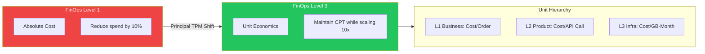
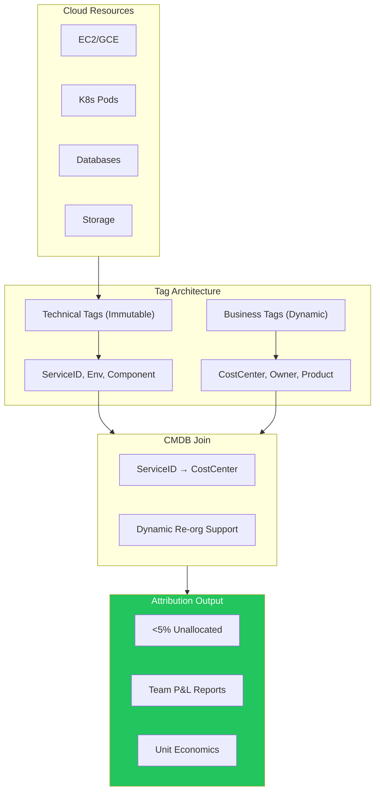
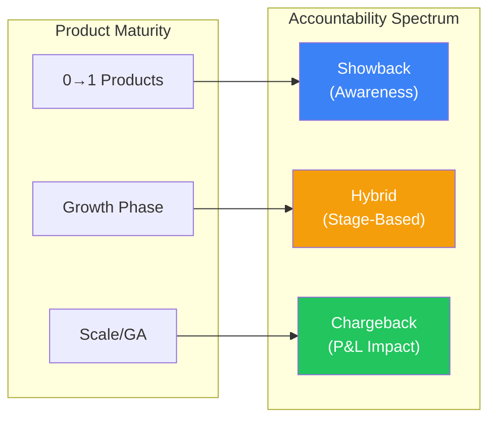

# FinOps & Cloud Cost Engineering

At Mag7 scale, the cloud bill is not an expense report—it's a P&L statement. Principal TPMs translate infrastructure consumption into business economics: not "we spent $10M on compute" but "our Cost Per Transaction improved 15% while volume grew 40%." This requires architecting tagging governance that survives re-orgs, implementing chargeback models that drive efficiency without creating shadow IT, and managing financial instruments (RIs, Savings Plans, Spot) that can save or waste millions depending on forecast accuracy. This guide covers the unit economics frameworks, attribution architectures, and purchasing strategies that differentiate FinOps from simple cost cutting.

## I. The Strategic Shift: From Absolute Cost to Unit Economics

At the Principal level, the "Cloud Bill" is a vanity metric. A \$10M monthly bill is acceptable if it generates \$100M in revenue, but a \$100k bill is disastrous if it supports a product with zero traction. The strategic shift requires moving from **Absolute Cost Reduction** (FinOps Level 1) to **Unit Economics Optimization** (FinOps Level 3).

This shift fundamentally changes the engineering mandate from "Reduce spend by 10%" to "Maintain Cost Per Transaction (CPT) while scaling volume by 10x."

### 1. Defining the "Unit" in Unit Economics
The most common failure mode in this shift is selecting the wrong denominator. A "per user" metric is often too broad for engineering actionability, while "per CPU cycle" is too granular for business strategy.

**Mag7 Implementation Strategy:**
*   **The Hierarchy of Units:** Effective frameworks use a tiered approach:
    *   **L1 (Business):** Cost per Order (Amazon), Cost per Stream Hour (Netflix), Cost per Ad Impression (Meta).
    *   **L2 (Product):** Cost per Search Query, Cost per Image Processed, Cost per API Call.
    *   **L3 (Infrastructure):** Cost per GB-Month, Cost per Compute Unit.

**Technical Deep Dive:**
To calculate this, you must synthesize two distinct datasets:
1.  **The Numerator (Cost):** Ingested from the Cloud Billing Report (AWS CUR, GCP Billing Export). This must be amortized (accounting for RIs/Savings Plans) and fully allocated (shared costs distributed).
2.  **The Denominator (Usage):** Ingested from application telemetry (Datadog, Prometheus, Splunk).

**Real-World Example:**
At Uber, a "Cost per Trip" metric is insufficient for the Maps team. Their unit metric is **Cost per Route Calculation**. If the Maps team optimizes their algorithm to reduce compute intensity by 20%, but the business increases ride volume by 20%, the absolute cost stays flat, but the *Unit Economic* efficiency has improved significantly. A Principal TPM tracks the divergence between these two trend lines.

### 2. Handling Shared Services and Multi-Tenancy
The hardest technical challenge in unit economics is attributing costs in multi-tenant environments (e.g., shared Kubernetes clusters, Kafka streams, or Data Lakes).

**The "Peanut Butter" Problem:**
Novice implementations take the total cost of a shared database and divide it equally among all consuming teams ("peanut buttering"). This destroys accountability.

**Mag7 Solution: Usage-Based Attribution:**
*   **Containerization (K8s):** Use tooling (like Kubecost or proprietary internal tools) to track *requested* vs. *provisioned* resources. You attribute cost based on the `requests` (to incentivize right-sizing) plus a tax for the idle capacity of the node pool.
*   **Data Stores (DynamoDB/Spanner):** Implement middleware or sidecars that tag every request with a `Client-ID`. Log the read/write capacity units (RCU/WCU) consumed per `Client-ID` and allocate the bill accordingly.

**Tradeoffs:**
*   **Precision vs. Latency:**
    *   *Choice:* Tagging every individual API request for cost tracking.
    *   *Tradeoff:* Adds serialization overhead and log volume.
    *   *Decision:* Sampling is often sufficient. Tracking 1% of requests allows for statistically significant cost attribution without degrading P99 latency.
*   **Chargeback vs. Showback:**
    *   *Choice:* Automatically deducting budget (Chargeback) vs. Reporting usage (Showback).
    *   *Tradeoff:* Chargeback creates friction and internal politics but drives immediate efficiency. Showback builds awareness but lacks teeth.
    *   *Mag7 Norm:* Showback for R&D/Alpha products; Chargeback for mature General Availability (GA) services.

### 3. The "Profit-Aware" Product Roadmap
Unit economics empowers the Principal TPM to influence product strategy, not just infrastructure efficiency. By understanding the marginal cost of a feature, you can determine its viability.

**Impact on Business Capabilities:**
*   **Feature Tiering:** If "Advanced Analytics" costs \$0.50 per user/month to host but is included in the Free Tier, the unit economics are negative. The TPM uses this data to move the feature to the Enterprise Tier.
*   **Sunset Decisions:** Identifying "Zombie Features"—features with low engagement but high fixed infrastructure costs (e.g., a legacy cache fleet).

**ROI Calculation Example:**
You are launching a Generative AI feature.
*   **Absolute View:** "This GPU cluster costs \$200k/month. It's too expensive."
*   **Unit Economic View:** "This feature costs \$0.02 per query. We charge customers \$0.05 per query. The margin is 60%. We should double the spend to reduce latency and acquire more users."

### 4. Edge Cases and Failure Modes
*   **The "Step Function" Cost:** Unit economics assume linearity. However, cloud costs often jump in steps (e.g., sharding a database when it hits a size limit).
    *   *Mitigation:* The TPM must forecast "Cliffs." If the next unit of growth requires a re-architecture (e.g., moving from RDS to Aurora), the marginal cost of the next 1,000 users is disproportionately high.
*   **Pre-paid Capacity Distortion:** Heavy use of Reserved Instances (RIs) or Savings Plans can make unit costs look artificially low.
    *   *Mitigation:* Always calculate unit economics using **Amortized Cost** (spreading the one-time payment over the term) rather than Cash cost, but be aware of **On-Demand equivalence** for true architectural comparison.

## II. Cost Attribution and Tagging Governance

At the scale of a Mag7 company, cost attribution is not an accounting exercise; it is an architectural requirement. A Principal TPM must drive the governance framework that converts the "cloud bill" from an operational expense into a product feature cost. The goal is to minimize "Unallocated Cost" to <5% of total spend.

### 1. The Taxonomy Architecture: Business vs. Technical Context

Effective governance requires a bifurcated tagging strategy enforced via Infrastructure as Code (IaC). You must separate technical metadata from business context.

*   **Technical Tags (Immutable):** `ApplicationID`, `Environment` (Prod/Stage), `Component` (Frontend/Backend), `CreatedBy` (IaC Repo). These are static and defined at creation.
*   **Business Tags (Mutable):** `CostCenter`, `Owner`, `ProductLine`. These change as org structures reorganize—a frequent occurrence at Mag7s.
    *   **Technical Deep-Dive:** Do not embed mutable business logic into immutable resource tags. Instead, use a **Tag Management Database (CMDB)**. The resource carries a static `ServiceID`. The billing pipeline joins this `ServiceID` against the CMDB to resolve the current `CostCenter` dynamically during report generation.

**Real-World Mag7 Behavior:**
At Google, resources are organized into a strict hierarchy: Organization > Folder > Project > Resource. Tags (Labels) are inherited. A Principal TPM ensures that a "Project" cannot be created without a valid billing ID and cost center code. If a re-org happens, you update the mapping in the internal ERP, not by re-tagging 50,000 running VMs.

**Tradeoffs:**
*   **Dynamic Resolution vs. Real-time Visibility:** Using a CMDB/Join approach means the native cloud console (e.g., AWS Cost Explorer) might show outdated business data until the external report processes.
*   **Strictness vs. Velocity:** Enforcing mandatory tagging at the PR (Pull Request) level prevents "shadow IT" but can block emergency hotfixes if the taxonomy is too rigid.

### 2. Attribution for Shared Services (The "Black Box" Problem)

The most significant challenge at the Principal level is attributing costs for multi-tenant architectures (Kubernetes clusters, shared databases, data lakes, networking egress).

*   **The Container Challenge (K8s/Borg):** You cannot tag a specific millisecond of CPU time on a shared node using native cloud tags.
    *   **Solution:** Implement **Proportional Attribution**. You must ingest container-level metrics (CPU requests vs. actual usage, RAM) and correlate them with the underlying node cost.
    *   **Calculation:** `(Pod CPU Request / Node Total CPU) * Node Cost`.
    *   **Mag7 Example:** Netflix and Uber run internal tools that scrape usage metrics and allocate the cost of the underlying EC2 fleets to specific microservices. The "Platform Team" owns the idle capacity cost (waste), incentivizing them to optimize bin-packing, while product teams pay for requested capacity.

*   **Shared Data Stores (DynamoDB/Spanner):**
    *   **Solution:** Header-based attribution. Applications must pass a `Client-ID` in the request header. The data platform logs read/write units (RCU/WCU) per client ID and allocates cost accordingly.

**Tradeoffs:**
*   **Precision vs. Processing Cost:** Analyzing terabytes of access logs to attribute every dollar of S3 or DynamoDB spend is computationally expensive.
    *   *Decision:* Often, a Principal TPM will accept an 80/20 rule—attribute the top 20 heavy users precisely and treat the tail as "Shared Overhead" (tax).
*   **Incentives vs. Stability:** Charging teams for "Requested CPU" (limits) rather than "Used CPU" encourages them to lower limits, which risks OOM (Out of Memory) kills. The TPM must balance cost pressure with reliability standards.

### 3. Governance: Guardrails and "Janitor" Processes

Governance is the enforcement mechanism. It shifts cost management from "reactive cleanup" to "proactive prevention."

*   **Policy-as-Code (The Hard Gate):**
    *   Use AWS Service Control Policies (SCPs) or Azure Policy to **deny** resource creation if mandatory tags (`ServiceID`, `Env`) are missing.
    *   **Mag7 Behavior:** In mature environments, you cannot click "Launch Instance" in the console. All infrastructure must be deployed via CI/CD pipelines (Terraform/CloudFormation) which automatically inject compliance tags.

*   **The "Janitor" Monkey (The Cleanup):**
    *   For non-compliant resources that slip through (or legacy resources), implement automated remediation.
    *   **Workflow:** Scan -> Identify Untagged -> Notify Owner (via Slack/Email based on creator logs) -> Grace Period (24h) -> **Terminate/Stop**.
    *   **Impact:** This drives immediate behavioral change. When a dev environment is deleted over the weekend because it was untagged, engineering culture adapts quickly.

**Tradeoffs:**
*   **Blocking vs. warning:** Hard blocking (SCPs) ensures 100% compliance but can stall development if the tagging schema is complex.
*   **Automation risk:** Automated termination scripts have a non-zero risk of deleting critical stateful resources (databases) if tagged incorrectly. *Mitigation:* Never auto-terminate production databases; alert only.

### 4. Impact on Business Capabilities and ROI

Implementing this level of governance directly impacts the company's ability to operate efficiently.

*   **ROI of the Cloud Platform:** By isolating "Shared Platform" costs (idle capacity, support fees) from "Product Usage" costs, the Platform Engineering team can prove their ROI by demonstrating a reduction in overhead per unit of compute.
*   **Pricing Strategy:** Accurate attribution allows Product Management to price features correctly. If you know that "Feature X" consumes \$0.04 of cloud resources per use, you cannot price it at \$0.03. Without this governance, pricing is a guess.
*   **Skill & Culture:** It forces engineers to understand the financial weight of their architectural choices. It moves the organization from "Cloud is infinite" to "Cloud is a metered utility."

## III. Showback vs. Chargeback Models & P&L Accountability

### 1. The Accountability Spectrum: From Awareness to Ledger Impact

At a Principal level, you are not just implementing a billing tool; you are architecting a behavioral modification system. The choice between Showback and Chargeback dictates how engineering teams prioritize technical debt versus feature velocity.

*   **Showback (The Psychological Model):** Costs are visualized and attributed to teams via dashboards, but no funds are deducted from their operating budget. It relies on "shameback"—public visibility of waste to drive behavior.
*   **Chargeback (The Fiscal Model):** Costs are treated as internal invoices. If Team A consumes \$50k of EC2, \$50k is deducted from Team A’s P&L (Profit and Loss) and credited to the Central Infrastructure team (or paid out to the vendor).

**Mag7 Real-World Behavior:**
Most Mag7 companies operate on a hybrid maturity curve.
*   **New Products (0-1):** Often operate under **Showback**. Google’s Area 120 or Meta’s New Product Experimentation (NPE) teams need velocity. Burdening them with strict infrastructure accounting prematurely stifles experimentation.
*   **Mature Products (Scale):** Amazon Retail or Azure Core services operate under strict **Chargeback**. Every API call, storage GB, and compute cycle has an internal price tag. Engineering Directors have P&L responsibility, meaning infrastructure overruns directly reduce their headcount hiring budget.

### 2. The "Shared Services Tax" and Transfer Pricing

The greatest technical complexity in this domain is not tracking direct usage (e.g., EC2 instances tagged to Team X), but attributing **shared services** (e.g., Kubernetes control planes, shared databases, networking egress, security logging).

**Technical Implementation:**
Principal TPMs must define the "Tax Model."
1.  **Direct Attribution:** 1:1 mapping (e.g., dedicated S3 buckets).
2.  **Proportional Allocation:** Splitting shared costs based on a consumption metric (e.g., splitting a K8s cluster cost based on Pod CPU requests, not usage).
3.  **Fixed Overhead (The Tax):** A flat % surcharge added to every team's bill to cover "Keep the Lights On" (KTLO) services like Security, Compliance, and FinOps tooling.

**Mag7 Example:**
At LinkedIn or Meta, "Platform Engineering" is often a cost center that "sells" internal services to Product teams. If the Data Platform team optimizes their HDFS storage, they can lower the internal price per GB charged to the Feed team. This creates an internal market economy where platform teams compete to lower costs for their internal customers.

### 3. Tradeoffs and Strategic Decision Making

A Principal TPM must navigate the friction between Finance's desire for predictability and Engineering's desire for autonomy.

| Decision | Tradeoff Analysis |
| :--- | :--- |
| **Strict Chargeback** | **Pro:** Forces immediate architectural efficiency. Engineers refactor code to save money because it saves *their* budget. **Con:** Can create "Shadow IT." Teams might build their own inferior logging solution to avoid paying the "tax" on the centralized, expensive corporate logging platform. |
| **Showback Only** | **Pro:** High velocity; zero administrative overhead for internal fund transfers. **Con:** "Tragedy of the Commons." If the Data Lake is free to the user (but paid by Central IT), engineers will store infinite retention logs, exploding costs. |
| **Based on Requests vs. Usage** | **Decision:** Do you charge for what they *reserved* (K8s Requests) or what they *used* (Actual CPU)? **Tradeoff:** Charging for *Requests* is better. It forces developers to right-size their manifests. Charging for *Usage* encourages over-provisioning because there is no penalty for requesting 100 CPUs and using only 1. |

### 4. Impact on Business, ROI, and Capabilities

**P&L Accountability & Gross Margins**
Implementing chargeback allows the business to calculate the true **Cost of Goods Sold (COGS)** for specific features.
*   *Scenario:* A social media company launches a "Video Stories" feature.
*   *Without Chargeback:* Infrastructure costs spike by 20%, but it's blended into the general IT budget. The feature looks successful due to high engagement.
*   *With Chargeback:* The Video Team sees their P&L turn red. The cost to serve video is higher than the ad revenue generated by that video time.
*   *ROI Impact:* The Principal TPM identifies that the feature is technically insolvent. The team must either re-architect (e.g., lower bitrate encoding) or the business must accept it as a loss leader.

**Skill Capability Shift**
This model forces a capability shift in Engineering Managers (EMs). EMs can no longer just be technical leaders; they must become "General Managers" of their micro-business. They learn to trade off: *"Do I hire one more Senior Engineer, or do I double my retention period on logs?"*

### 5. Edge Cases and Failure Modes

*   **The "Death Spiral" of Internal Pricing:** If a central platform (e.g., an internal ML training cluster) has high fixed costs and charges teams via chargeback, and one large tenant leaves to build their own solution, the cost-per-unit for remaining tenants spikes. This causes more tenants to leave.
    *   *Mitigation:* The Principal TPM must implement "committed use" contracts internally or subsidize the platform centrally until it reaches scale.
*   **Disputing the Bill:** Without automated, indisputable tagging governance (discussed in Section II), Chargeback leads to "Accounting Wars." Engineering teams will spend sprints auditing logs to prove they didn't use the resources Finance says they did.
    *   *Mitigation:* Showback must run for 3–6 months with 99% accuracy before Chargeback goes live.

## IV. Financial Engineering: CapEx vs. OpEx & Purchasing Strategy

At the Principal TPM level, financial engineering is not merely about "paying the bill"; it is about architectural alignment with purchasing mechanisms. You must understand how the capitalization of software development (CapEx) interacts with operational run rates (OpEx), and how to leverage the cloud provider’s complex discount instruments (RIs, Savings Plans, Spot) to manufacture margin.

A Principal TPM bridges the gap between Finance (who wants predictability and high commitment coverage) and Engineering (who wants flexibility and zero lock-in).

### 1. The CapEx vs. OpEx Strategic Toggle

While "Cloud is OpEx" is the general industry mantra, Mag7 reality is nuanced.
*   **CapEx (Capital Expenditure):** Money spent acquiring assets (servers, data centers) or *capitalizable engineering labor* (building new features). These costs are depreciated over time (3-5 years), smoothing the impact on EBITDA.
*   **OpEx (Operational Expenditure):** Ongoing costs to run the business (cloud bills, SaaS licenses, maintenance). These hit the P&L immediately.

**Real-World Mag7 Behavior:**
At companies like Meta or Google, there is often an internal "private cloud." When a Product TPM moves a workload from AWS (OpEx) to internal bare metal (CapEx for the Infra org, internal chargeback for the Product org), they are fundamentally altering the company's margin profile.
*   **Example:** A Principal TPM at Dropbox orchestrated the famous "exodus" from AWS to custom infrastructure. This shifted massive monthly OpEx bills into CapEx (hardware) and lower internal run rates, significantly improving gross margins prior to IPO.
*   **Capitalizing Labor:** You must track engineering time spent on *new* features (CapEx) vs. maintenance (OpEx). A Principal TPM ensures Jira/ticketing hygiene so Finance can legally capitalize millions of dollars in engineering salaries, boosting perceived profitability.

**Tradeoffs:**
*   **Flexibility vs. Commitment:** Moving to CapEx-heavy internal infrastructure or Reserved Instances reduces unit cost but creates "Technical Gravity." You cannot easily spin down a data center or sell off 3-year RIs if user demand drops.
*   **Speed vs. Margin:** Developing on public cloud (OpEx) is faster (time-to-market). Repatriating to on-prem (CapEx) yields better margins at scale but requires massive engineering overhead.

**Impact on Business:**
*   **ROI:** Correctly capitalizing labor can improve reported earnings per share (EPS), directly affecting stock price.
*   **Capability:** Understanding this distinction allows you to negotiate budget. If the OpEx budget is frozen, a Principal TPM might pitch a project as a "capitalizable platform upgrade" to unlock CapEx budget.

### 2. Purchasing Strategy: The "Commitment" Layer

Cloud providers (AWS, Azure, GCP) price resources based on the customer's willingness to commit. The Principal TPM must drive the strategy for **Effective Savings Rate (ESR)**.

**The Hierarchy of Purchasing:**
1.  **On-Demand:** Highest cost, max flexibility.
2.  **Savings Plans (SPs) / Committed Use Discounts (CUDs):** Lower cost (~30-50% off), commitment to huge dollar/hour spend.
3.  **Reserved Instances (RIs):** Specific instance types/regions (~40-60% off), lower flexibility.
4.  **Spot / Preemptible:** Lowest cost (~70-90% off), zero reliability guarantee.

**Real-World Mag7 Behavior:**
A Principal TPM does not buy RIs manually. They manage the **Commitment Coverage Ratio**.
*   **Example:** At SalesForce or LinkedIn, the target might be 80% coverage (80% of compute hours covered by RIs/SPs). The Principal TPM analyzes the roadmap. If a new service is launching using a new instance family (e.g., switching from Intel to ARM/Graviton), the TPM must signal Finance to *not* renew the old Intel RIs and instead purchase Savings Plans that allow flexibility, or wait for the migration to stabilize.

**Tradeoffs:**
*   **Risk of Waste vs. Rate Optimization:**
    *   *Scenario:* You commit to $10M/month compute.
    *   *Risk:* If engineering optimizes code and reduces usage to $8M/month, the company still pays $10M.
    *   *Principal Action:* The TPM must balance "Cost Optimization" (reducing usage) with "Financial Commitments" (paying for usage). If you optimize *too* fast, you waste the commit.
*   **Convertible vs. Standard:**
    *   *Tradeoff:* Convertible RIs offer lower discounts but allow changing instance families. Standard RIs offer max discount but lock you in. A Generalist TPM usually advocates for Convertible/SPs to safeguard against architectural pivots.

**Impact on Business:**
*   **Unit Economics:** High commitment coverage directly lowers the *Cost of Goods Sold (COGS)*, improving gross margin.
*   **Skill:** Requires the TPM to have high-confidence forecasting abilities. You must predict traffic 1-3 years out.

### 3. Architecting for Spot (The Ultimate Financial Engineering)

The highest ROI activity a Principal TPM can drive is architecting systems to run on Spot instances (AWS) or Preemptible VMs (GCP/Azure). This is where technical architecture dictates financial outcomes.

**Technical Depth:**
To use Spot, the application must be:
*   **Stateless:** No data stored locally on the node.
*   **Fault-Tolerant:** Can handle a `SIGTERM` signal and shut down gracefully within 2 minutes.
*   **Fast Booting:** Must be able to replace a lost node and serve traffic in seconds, not minutes.

**Real-World Mag7 Behavior:**
*   **Example:** Amazon’s CI/CD pipelines and massive batch processing jobs (like transcoding video for Prime Video) run almost exclusively on Spot.
*   **Strategy:** The Principal TPM mandates that all "non-production" or "batch" workloads must be Spot-compatible. They drive the requirement for "Checkpointing" in long-running jobs so that if a Spot instance is reclaimed, the job resumes from the last checkpoint rather than restarting.

**Tradeoffs:**
*   **Engineering Complexity vs. Cost:**
    *   *Tradeoff:* Making a legacy monolith Spot-ready might take 2 quarters of refactoring.
    *   *Analysis:* The TPM calculates the breakeven. If Spot saves \$2M/year and refactoring costs \$500k in engineering time, the project is a "Go."
*   **Availability vs. Cost:** Spot markets can dry up. If you rely 100% on Spot and the market spikes, your service degrades. You must build fallback logic to switch to On-Demand automatically.

**Impact on Business:**
*   **CX:** If handled poorly, Spot interruptions cause failed user requests. If handled well (graceful draining), the user sees no impact.
*   **Business Capability:** Allows for "brute force" innovation. You can afford to train massive ML models or run expensive simulations on Spot that would be cost-prohibitive on On-Demand.

### 4. Enterprise Discount Programs (EDP) and Marketplace Strategy

At the Mag7 level, you negotiate massive multi-year contracts (EDPs) with cloud providers in exchange for a flat discount across the board (e.g., 15% off everything).

**Real-World Mag7 Behavior:**
Companies often have a "commit burn-down" target.
*   **Marketplace Engineering:** AWS/Azure Marketplaces allow you to buy SaaS (Datadog, Snowflake, CrowdStrike) and count 50-100% of that spend toward your cloud EDP commit.
*   **Principal Strategy:** If the company is lagging behind its Azure commit, the Principal TPM might consolidate various SaaS vendor contracts and route them through the Azure Marketplace. This "burns down" the commit to avoid penalties, effectively paying for software with money that would otherwise be lost to penalty fees.

**Tradeoffs:**
*   **Vendor Lock-in vs. Financial Efficiency:** Buying via Marketplace often simplifies billing but may limit negotiation leverage with the SaaS vendor directly (as the cloud provider takes a cut).
*   **Budget Silos:** Engineering teams might have budget for tools, but the "Commit" sits with Central IT. The TPM must align these incentives.

**Impact on Business:**
*   **ROI:** Prevents "True-up" payments (penalties paid to cloud providers for missing spend targets).
*   **Procurement Speed:** Buying via Marketplace bypasses lengthy procurement/legal red tape because the cloud provider terms are already agreed upon.

## V. Operationalizing FinOps: Anomaly Detection and Guardrails

At the Principal level, you are responsible for the systems that prevent financial disaster. You move the org from "Reactive Cleanup" to "Proactive Prevention."

### Real-World Mag7 Behavior
*   **Anomaly Detection:** It is not humanly possible to review every line item. Mag7 uses ML-driven anomaly detection (e.g., AWS Cost Anomaly Detection or proprietary internal tools).
    *   **Scenario:** A developer accidentally leaves a massive GPU cluster running over the weekend.
    *   **Response:** An automated alert triggers via PagerDuty to the on-call engineer if spend deviates >20% from the historical baseline for that specific service.
*   **Forecasting:** The TPM leads the quarterly "Cloud Capacity Planning" ritual, aggregating demand forecasts from all product lines to negotiate Enterprise Discount Programs (EDP) with cloud providers.

### Tradeoffs
*   **False Positives vs. Missed Spikes:**
    *   *Tradeoff:* If anomaly thresholds are too tight, engineers get "alert fatigue" and ignore them. If too loose, you lose \$50k before anyone notices.
*   **Speed vs. Control:**
    *   *Tradeoff:* Implementing strict budget ceilings (hard stops) prevents overruns but can cause a production outage if a legitimate traffic spike hits the budget cap.

### Impact on Business & ROI
*   **CX:** Prevents "Bill Shock" from impacting roadmap funding. If a team blows their budget in Q1, they might have to cancel Q2 features to pay the bill.
*   **Skill:** Elevates the engineering maturity. Cost becomes a **Non-Functional Requirement (NFR)** alongside Latency, Security, and Scalability.

---

## Interview Questions

### I. The Strategic Shift: From Absolute Cost to Unit Economics

**Q1: "We are launching a new video transcoding feature. The engineering team estimates it will add \$500k/month to our AWS bill. As a Principal TPM, how do you determine if we should approve this spend?"**

*   **Guidance for a Strong Answer:**
    *   **Reject the Absolute:** Immediately state that \$500k is irrelevant without context.
    *   **Define the Unit:** Propose a metric, e.g., "Cost per Transcoded Minute."
    *   **Establish the Value:** Ask for the projected revenue or retention lift per unit. (e.g., "Does this reduce buffering, leading to 5% longer watch times?").
    *   **Technical Implementation:** Discuss how to track this. "I would ensure the transcoding service tags jobs with `Content-ID` and `Quality-Level` to analyze if 4K transcoding is profitable vs. 1080p."
    *   **Decision Framework:** "If Cost per Minute < Revenue per Minute (plus CLV impact), approve. If not, I would drive an engineering initiative to optimize the codec efficiency before launch."

**Q2: "You are managing a shared Kubernetes platform used by 20 different product teams. The CFO wants to charge costs back to individual teams, but the platform is currently treated as a single line item. How do you implement this?"**

*   **Guidance for a Strong Answer:**
    *   **Strategy:** Move from "Peanut Buttering" to "Usage-Based Attribution."
    *   **Technical Metrics:** Explain the use of namespace-level tagging. "I would attribute costs based on CPU/Memory *Requests* (what they reserved), not just Usage (what they used), to incentivize them to right-size their containers."
    *   **Handling Shared Overhead:** Address the "System Tax." "The cost of the control plane and unallocated idle capacity should be distributed proportionally based on the size of each team's footprint."
    *   **Change Management:** "I would run a 'Shadow Bill' (Showback) for 3 months to let teams see their impact and optimize before flipping the switch to hard Chargebacks, preventing budget panic."

### II. Cost Attribution and Tagging Governance

### Question 1: The Multi-Tenant Attribution Challenge
"We have a massive multi-tenant Kubernetes cluster hosting 50 different microservices owned by different teams. The CFO sees one line item for 'EC2 Compute' and demands to know which team is driving the cost increase. Native AWS tags only work at the EC2 instance level, not the pod level. How do you design a system to attribute these costs accurately, and who pays for the idle capacity?"

*   **Guidance for a Strong Answer:**
    *   **Methodology:** The candidate should propose ingesting K8s metrics (Prometheus/DataDog) to track CPU/RAM requests per namespace/pod.
    *   **Attribution Logic:** Match pod-level residency time to the underlying node cost.
    *   **Waste Management:** Crucially, they must address **Idle Capacity**. A Principal answer argues that the Platform Team (owners of the K8s cluster) pays for the idle capacity (bin-packing inefficiency) to incentivize them to optimize the scheduler, while Product Teams pay for their *requested* resources.
    *   **Tradeoff:** Acknowledge the cost of computing this data and suggest starting with a "Showback" model before moving to a hard "Chargeback."

### Question 2: The "Tag or Terminate" Rollout
"You are brought in to fix a chaotic cloud environment with 40% untagged resources. You need to implement a strict tagging policy to enable unit economics tracking. However, the VP of Engineering is worried that strict enforcement will break legacy production systems or slow down developer velocity. What is your rollout strategy?"

*   **Guidance for a Strong Answer:**
    *   **Phased Approach:** Reject any "Big Bang" implementation.
    *   **Phase 1 (Visibility):** Enable tagging policies in "Audit Mode" (log violations, don't block). Build a dashboard showing the "Wall of Shame."
    *   **Phase 2 (New Resources):** Enforce tags on *new* creation via IaC/SCPs.
    *   **Phase 3 (Remediation):** Script a "Scream Test" for dev/stage (stop instances, wait for complaints, tag them).
    *   **Phase 4 (Production Legacy):** Manual triage for untagged Prod resources.
    *   **Culture:** Emphasize that this is a communication challenge as much as a technical one. The "Why" (Unit Economics/Profitability) must be sold to leadership to get buy-in for the friction.

### III. Showback vs. Chargeback Models & P&L Accountability

**Q1: The "Shadow IT" Risk**
"We recently moved to a hard chargeback model for our internal data warehousing platform to recover costs. However, we've noticed three major product teams have spun up their own independent ClickHouse instances on raw EC2 to avoid the internal 'tax' of the central platform. This is fragmenting our data governance. As a Principal TPM, how do you resolve this?"

*   **Guidance for a Strong Answer:**
    *   **Diagnose the Root Cause:** Is the central platform actually too expensive (inefficient), or is the pricing model unfair (overloaded with overhead taxes)?
    *   **Total Cost Perspective:** The teams think they are saving money, but they are ignoring the *operational* cost (engineering hours) of managing their own ClickHouse. The candidate should propose an analysis showing TCO (Total Cost of Ownership) including labor.
    *   **Policy vs. Product:** Don't just ban the behavior. Improve the internal product. If the central platform is too expensive, the TPM needs to work with the Platform team to optimize *their* unit economics or introduce tiered storage options (Hot/Warm/Cold) to compete with the "Shadow" solution.

**Q2: The Shared Resource Dilemma**
"You are launching a new multi-tenant AI service at a Mag7 company. The inference cluster is a massive shared resource. Finance wants to chargeback costs to the 50 different internal teams consuming this API. Engineering says tracking per-request CPU usage with that granularity will add 20ms of latency to every call, degrading the user experience. How do you break the deadlock?"

*   **Guidance for a Strong Answer:**
    *   **Reject the False Binary:** Acknowledge that latency is a non-starter for CX, but "free" is a non-starter for Finance.
    *   **Sampling Strategy:** Propose statistical sampling. You don't need to meter 100% of requests to get a 98% accurate bill. Meter 1% of traffic to establish a "Cost per Request" baseline for each team, and bill based on total request volume (which is cheap to track).
    *   **Proxy Metrics:** Use a low-overhead proxy metric (e.g., input token count + output token count) rather than actual CPU/GPU cycle interrupts, establishing a "standard cost" per token.
    *   **Business Alignment:** Demonstrate that the cost of 2% billing inaccuracy is far lower than the cost of 20ms latency churn.

### IV. Financial Engineering: CapEx vs. OpEx & Purchasing Strategy

### Question 1: The "Stranded Capacity" Scenario
**Question:** "We are migrating our core monolithic application to microservices. We currently have $5M/year committed in Reserved Instances (RIs) for the monolith's specific instance family (e.g., m5.2xlarge). The new microservices will run on Kubernetes using a completely different instance family (c6g.large) for better performance. How do you manage this transition without blowing up the budget or wasting the existing commitment?"

**Guidance for a Strong Answer:**
*   **Analyze the Float:** Acknowledge the "double bubble" cost (paying for old and new simultaneously).
*   **Utilization Strategy:** Propose repurposing the old RIs for other workloads (e.g., dev/test environments, batch jobs) during the transition.
*   **Financial Instruments:** Discuss converting RIs (if convertible) or selling them on the RI Marketplace (if AWS).
*   **Phased Migration:** Suggest a canary migration strategy that aligns with the RI expiration schedule if possible.
*   **Metric:** Define "Wastage %" as a KPI to track during the migration.

### Question 2: The Spot Instance ROI Calculation
**Question:** "An engineering team wants to re-architect their data processing pipeline to run on Spot instances to save 70% on compute. They estimate it will take 3 engineers 2 months to do the work. The current compute bill is $20k/month. As a Principal TPM, do you approve this project? Walk me through your decision framework."

**Guidance for a Strong Answer:**
*   **Calculate the Savings:** $20k/month * 70% = $14k/month savings. $168k/year annualized.
*   **Calculate the Cost:** 3 engineers * 2 months. Assume fully loaded cost of an engineer is ~$25k/month. Cost = $150k.
*   **ROI Analysis:** The payback period is roughly 11 months ($150k cost / $14k monthly savings).
*   **Strategic Decision:** A Principal TPM might **reject** this. An 11-month payback is slow for a Mag7 environment where engineers could be building revenue-generating features instead.
*   **Nuance:** The candidate should ask about *scale*. If the bill is expected to grow to $200k/month next year, the project becomes a "Go." If the bill is flat, it's a "No-Go."

---

## Key Takeaways

1. **Track Unit Economics, not absolute spend.** "$10M monthly" is meaningless. "Cost Per Transaction decreased 12% while volume grew 40%" tells the story. Define your hierarchy: L1 (Cost/Order), L2 (Cost/API Call), L3 (Cost/GB-Month).

2. **Don't "peanut butter" shared costs.** Splitting a Kubernetes cluster evenly across 10 teams destroys accountability. Attribute based on *requested* resources, not just usage, to incentivize right-sizing.

3. **Separate technical tags from business tags.** Technical tags (ServiceID, Env) are immutable at creation. Business tags (CostCenter, Owner) change during re-orgs. Use a CMDB join to resolve business context dynamically—don't re-tag 50,000 VMs.

4. **Showback builds trust; Chargeback drives action.** Run Showback for 3-6 months with 99% accuracy before flipping to hard Chargeback. Jumping straight to Chargeback creates "Accounting Wars" and erodes platform team credibility.

5. **Charge for Requests, not Usage.** Charging for what teams *used* encourages over-provisioning (no penalty for reserving 100 CPUs and using 1). Charging for what they *requested* incentivizes right-sizing Kubernetes manifests.

6. **Stranded capacity is the silent killer.** If you over-commit to Reserved Instances and then optimize code, you're paying for compute you don't use. Balance cost optimization velocity against financial commitment duration.

7. **Spot architecture requires engineering investment.** 70% savings is real, but only for workloads that are stateless, fault-tolerant, and fast-booting. Calculate the ROI: if refactoring costs $500k but saves $2M/year, it's a clear "Go."

8. **Marketplace spend counts toward EDPs.** If you're behind on your AWS/Azure commit, route SaaS purchases (Datadog, Snowflake) through the Marketplace. You're paying for the software anyway—use it to avoid EDP penalty fees.

9. **Anomaly detection prevents Bill Shock.** A developer leaving a GPU cluster running over the weekend can cost $50k before anyone notices. ML-driven anomaly alerts (>20% deviation from baseline) with automatic PagerDuty escalation are mandatory at scale.

10. **Cost is a Non-Functional Requirement.** Treat cost alongside latency, security, and scalability in architecture reviews. If a feature adds 200ms latency, you'd flag it. If a feature adds $500k/month without clear ROI, flag it the same way.
