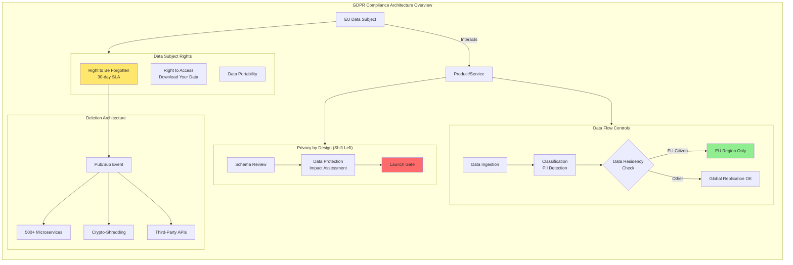
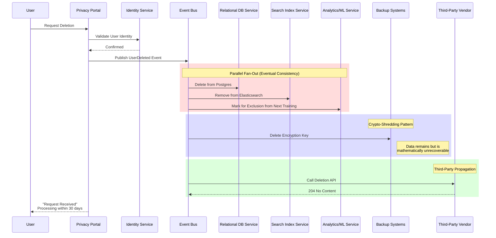
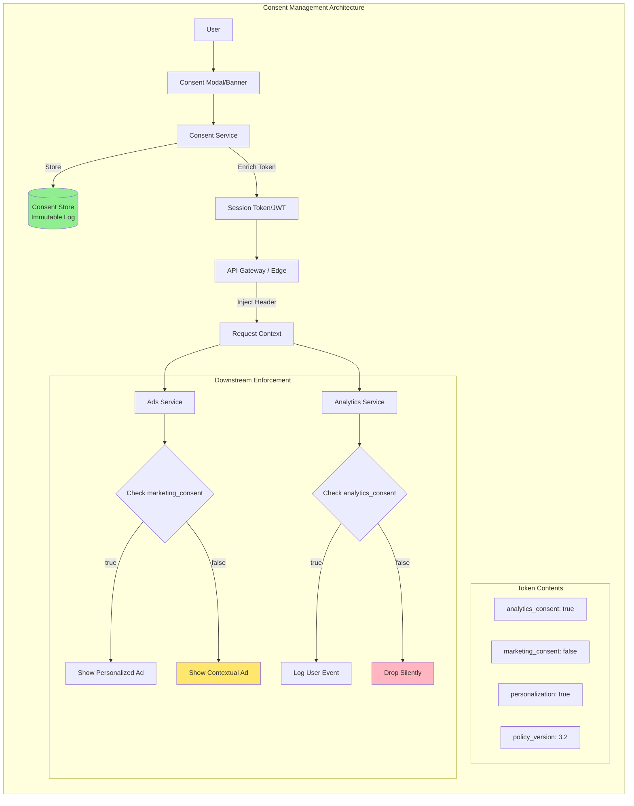
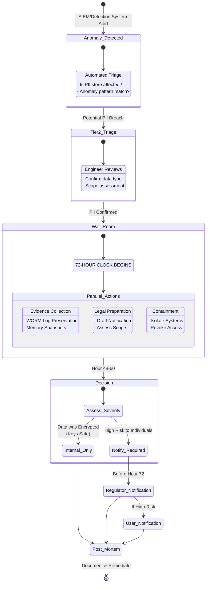

# GDPR - What You Must Know

This guide covers 5 key areas: I. The Strategic Lens: Why Mag7 TPMs Care, II. Core Technical Concepts & Architectural Patterns, III. Product Implications: Consent and Transparency, IV. The Third-Party Problem: Data Processors, V. Incident Response: The 72-Hour Rule.

## I. The Strategic Lens: Why Mag7 TPMs Care

For a Principal TPM operating at the scale of a Mag7 company, GDPR represents a massive distributed systems challenge disguised as a legal document. It forces a transition from "data hoarding" architectures (where storage is cheap and retention is indefinite) to "lifecycle-aware" architectures.

At this level, you are not responsible for reading legal briefs. You are responsible for translating "Right to be Forgotten" (RTBF) into an eventual consistency model across thousands of microservices, and ensuring "Data Residency" is enforced at the network ingress/egress layer.

### 1. Privacy by Design (PbD) as a Gatekeeper

In a startup, privacy is often a patch applied post-launch. At a Mag7, Privacy by Design is a critical path dependency in the SDLC. It shifts privacy controls "left," meaning data classification and lineage mapping happen during the design phase, not the maintenance phase.

*   **Real-World Mag7 Behavior:**
    *   **Google:** Utilizes a centralized "Privacy Review" tool integrated into the launch calendar. If a TPM cannot demonstrate a completed Data Protection Impact Assessment (DPIA) that maps exactly where PII flows, the SRE team is blocked from provisioning production quotas.
    *   **Meta:** Implemented "Privacy Aware Infrastructure" (PAI) where data access is governed by code-generated policies. Engineers do not request access to data; they request access to a *purpose*, and the infrastructure enforces the limitation.

*   **Tradeoffs:**
    *   **Velocity vs. Compliance:** Enforcing strict PbD adds significant friction to the "0 to 1" phase. It can delay initial launches by weeks.
    *   **Flexibility vs. Governance:** Developers lose the ability to arbitrarily log generic distinct payloads. Structured logging with strict schemas becomes mandatory to prevent accidental PII leakage into log aggregators (like Splunk or internal equivalents).

*   **Impact on Business Capabilities:**
    *   **Risk Mitigation:** Prevents the "technical debt" of privacy, where re-architecting a mature system to separate PII from non-PII can cost tens of millions in engineering hours later.
    *   **CX:** Enables features like "Download Your Data" to be automated self-service tools rather than manual support tickets, scaling with user growth.

### 2. The Architecture of Data Sovereignty

GDPR (and subsequent rulings like Schrems II) mandates strict control over cross-border data transfers. For a Principal TPM, this means the network topology and storage layer must be geo-aware. You cannot simply replicate a database globally for low latency if that replication moves EU citizen data to a US region.

*   **Real-World Mag7 Behavior:**
    *   **AWS/Azure:** The creation of "Sovereign Clouds" or specific EU-West regions where the control plane is isolated. They guarantee that not only the data at rest but also the *telemetry and support access* remain within the geopolitical boundary.
    *   **TikTok (Project Clover) / Microsoft (EU Data Boundary):** These initiatives involve building physical data centers in Europe and employing third-party auditors to verify that data does not egress to China or the US, respectively.

*   **Tradeoffs:**
    *   **Latency vs. Residency:** You may have to sacrifice global consistency or edge caching efficiency. A user traveling to the US might experience higher latency because their data is pinned to an EU shard.
    *   **Cost vs. Isolation:** Maintaining fragmented infrastructure (separate control planes for EU vs. RoW) significantly increases operational overhead (OpEx) and reduces the efficiency of capacity planning.

*   **Impact on Business Capabilities:**
    *   **Market Access:** Without this architecture, products like Microsoft 365 or AWS GovCloud cannot be sold to European public sector clients.
    *   **Resiliency:** Paradoxically, while it increases complexity, it forces better region isolation, potentially improving fault tolerance (reducing blast radius).

### 3. The "Right to be Forgotten" (RTBF) at Scale

Deleting a user is the hardest problem in distributed systems. When a user requests deletion, that signal must propagate from a central identity service to hundreds of downstream services (analytics, backups, logs, ML training sets).

*   **Real-World Mag7 Behavior:**
    *   **Netflix/Uber:** Use "Crypto-shredding" as a primary deletion mechanism. Instead of scrubbing petabytes of backups to find one user's ID, they encrypt per-user data with a unique key. To "delete" the user, they simply delete the key. The data remains but is mathematically unrecoverable.
    *   **Google:** Implements a "Time-to-Live" (TTL) enforcement engine across BigTable and Spanner. If a dataset is tagged as PII, the storage layer automatically garbage collects it after the retention period expires, removing the burden from application developers.

*   **Tradeoffs:**
    *   **Data Consistency vs. Deletion Speed:** Achieving ACID deletion across a distributed system is impossible. You must accept "eventual deletion" (usually within the 30-day legal window).
    *   **ML Model Accuracy vs. Privacy:** Retraining a massive LLM or recommendation model because one user revoked consent is cost-prohibitive. The tradeoff is often "Machine Unlearning" (experimental) or proving that the model does not memorize PII (differential privacy).

*   **Impact on Business Capabilities:**
    *   **Trust:** Automated, reliable deletion builds user confidence.
    *   **Storage Costs:** Aggressive retention policies enforced by GDPR actually save money by reducing the storage footprint of stale, useless data.

## II. Core Technical Concepts & Architectural Patterns

### 1. PII Discovery and Classification (Continued)
*   **Mag7 Solution:** Automated scanning infrastructure (e.g., AWS Macie, Google Cloud DLP) integrated into the CI/CD pipeline and data lake ingestion paths.
    *   **The Mechanism:** As data enters a data lake (like S3 or BigQuery), an event triggers a sidecar process that samples the data, runs ML classifiers to detect PII (credit cards, emails, SSNs), and tags the metadata in a centralized Data Catalog (e.g., Alation, Collibra, or internal tools like LinkedIn’s DataHub).
    *   **The "Shift Left" approach:** Advanced implementations block code commits if schema changes introduce fields named "email" or "phone" without corresponding privacy annotations (e.g., Protobuf options or Thrift annotations).

**Tradeoffs:**
*   **Accuracy vs. Compute Cost:** Scanning every row of petabyte-scale data is cost-prohibitive. Most architectures rely on sampling (scanning 1% of files). *Risk:* You might miss a PII leak in the un-scanned 99%, leading to compliance gaps.
*   **Blocking vs. Non-Blocking:** Blocking deployments due to missing privacy tags ensures high compliance but kills developer velocity. Most Mag7s opt for "detect and page" (non-blocking) unless the data is classified as highly sensitive (e.g., health data).

**Impact on Business Capabilities:**
*   **ROI:** Reduces legal discovery costs during audits.
*   **Skill:** Requires engineering teams to adopt strict schema discipline.

---

### 2. The "Right to Be Forgotten" (RTBF) & Deletion Orchestration

Handling a deletion request (DSAR) is the hardest technical challenge in GDPR because of eventual consistency and backups.

**Real-World Mag7 Behavior:**
*   **The "Publish-Subscribe" Deletion Pattern:** When a user requests deletion, the Identity Service publishes a `UserDeleted` event to a Kafka topic. Downstream services (Ads, Recommendations, Billing) subscribe to this topic and initiate their own local cleanup.
*   **Crypto-Shredding:** Instead of scrubbing PII from immutable backups (which is technically impossible without corrupting the backup chain), Mag7 companies encrypt per-user data with a unique key. To "delete" the user, you simply delete the key. The data remains in backups but is mathematically unrecoverable (rendering it compliant).

**Tradeoffs:**
*   **Synchronous vs. Asynchronous:**
    *   *Sync:* You wait for 500 microservices to confirm deletion before confirming to the user. *Con:* High latency, high failure rate.
    *   *Async (Standard):* You acknowledge the request immediately and process it over 30 days. *Con:* Complex state management; you must track the "deletion status" of that user across the ecosystem.
*   **Hard vs. Soft Deletion:** Soft deletion (setting `is_deleted=true`) is faster and allows recovery from accidental deletions, but carries the risk that a bug in a query (`SELECT * FROM users`) accidentally exposes "deleted" data.

**Impact on Business Capabilities:**
*   **CX:** Crypto-shredding allows for near-instant logical deletion, improving user trust.
*   **Risk:** Failure to delete from "shadow IT" or ad-hoc data science sandboxes is the primary source of regulatory fines.

---

### 3. Data Residency and Geo-Sharding
GDPR restricts transferring data outside the EU/EEA unless the destination has "adequate" protection. This forces architectural segmentation.

**Real-World Mag7 Behavior:**
*   **Cell-Based Architecture:** Systems are sharded by geography. An EU user is routed via DNS to an EU data center. Their data lives in an "EU Cell."
*   **The "Control Plane" vs. "Data Plane" Split:** Metadata (configurations, routing rules) might be global, but customer content (emails, photos, logs) is pinned to a region.
*   **Microsoft/AWS Example:** They offer "Sovereign Clouds" (e.g., Microsoft Cloud for Sovereignty) where the infrastructure is air-gapped or legally separated from the US parent company control to satisfy strict public sector requirements.

**Tradeoffs:**
*   **Resiliency vs. Compliance:** You cannot failover an EU database to a US region during an outage. This reduces your availability SLA (Service Level Agreement) options or forces you to build expensive redundancy *within* the EU.
*   **Global Features:** Features like "Global Leaderboards" or "Search Global Users" become technically difficult because you cannot aggregate the data into a single index.

**Impact on Business Capabilities:**
*   **Market Access:** Essential for selling to EU governments and banking sectors.
*   **Cost:** Increases infrastructure spend (loss of global economies of scale, fragmented capacity planning).

---

### 4. Tokenization and Pseudonymization
To minimize the "blast radius" of a breach and reduce the scope of GDPR audits, raw PII is replaced with non-sensitive tokens.

**Real-World Mag7 Behavior:**
*   **Centralized Token Vault:** A dedicated, highly secured service (often backed by Hardware Security Modules - HSMs) exchanges raw PII (e.g., a credit card number) for a token (e.g., `TOK-1234`).
*   **Scope Reduction:** Only the Token Vault is "in scope" for the highest level of PCI/GDPR security controls. Downstream analytics teams work with `TOK-1234`. They can do analysis (e.g., "How many transactions did `TOK-1234` make?") without ever seeing the raw identity.

**Tradeoffs:**
*   **Performance vs. Security:** Every time a service needs to email the user, it must make a round-trip call to the Token Vault to "detokenize" the email address. This adds latency.
*   **Analytics Utility:** If you use randomized tokens, you break referential integrity across different databases (Token A in DB1 != Token B in DB2). If you use deterministic tokens (hashing), you risk "re-identification" attacks, which negates the GDPR benefit.

**Impact on Business Capabilities:**
*   **Agility:** Data Scientists can access production-like data (tokens) for model training without going through heavy compliance hurdles, speeding up ML velocity.

---

### 5. Consent Management Platforms (CMP) Integration
Consent is not a boolean; it is a matrix (User X consented to Analytics but not Marketing).

**Real-World Mag7 Behavior:**
*   **Consent as Context:** The "Consent State" is fetched at the edge (API Gateway) and injected into the request context (header) passed to downstream microservices.
*   **Enforcement Libraries:** Common libraries (e.g., a Java Spring Boot wrapper) automatically check the consent header before writing data to disk or firing a tracking pixel. If the header says `marketing_consent=false`, the library drops the tracking call silently.

**Tradeoffs:**
*   **Check-on-Read vs. Check-on-Write:**
    *   *Check-on-Write (Preferred):* You don't store data if the user hasn't consented. *Pro:* Cleanest compliance. *Con:* If the user later grants consent, you have no historical data.
    *   *Check-on-Read:* Store everything, filter at query time. *Pro:* Historical backfill possible. *Con:* High legal risk; holding data without consent is a violation, even if you don't "use" it.

**Impact on Business Capabilities:**
*   **Revenue:** Granular consent management maximizes ad revenue. Instead of a blanket "No," you salvage partial revenue (e.g., "Contextual Ads" allowed, "Behavioral Ads" blocked).

## III. Product Implications: Consent and Transparency

### 1. The Consent Control Plane: Architecture & State Management

For a Principal TPM, "Consent" is not a UI modal; it is a high-availability, distributed state machine. When a user clicks "Accept," that action must translate into a durable, immutable record (a "Consent Receipt") that governs downstream system behavior immediately.

**Technical Implementation:**
At Mag7 scale, consent cannot be a synchronous database lookup for every API call—that introduces unacceptable latency. Instead, we architect **Consent as Context**.
*   **Token Enrichment:** Consent scopes (e.g., `marketing_email:false`, `personalization:true`) are often baked into the user's session token (JWT) or passed via gRPC metadata headers (Context Propagation).
*   **Centralized Policy Engines:** Services like Open Policy Agent (OPA) are deployed as sidecars. They intercept requests and validate them against the user's current consent state cached at the edge.

**Real-World Mag7 Behavior:**
*   **Apple (ATT Framework):** When a user taps "Ask App Not to Track," the OS strips the IDFA (Identifier for Advertisers) from the application context. The system enforces the policy by physically removing the data handle, not just setting a flag.
*   **Meta:** Uses an internal privacy check framework where every read to the social graph requires a "Viewer Context" that includes privacy checks. If the consent signal is missing or negative, the data field returns `null` or the query fails silently.

**Tradeoffs:**
*   **Latency vs. Consistency:** Embedding consent in tokens improves latency (zero lookups) but creates consistency issues. If a user revokes consent, the token is still valid until expiry. **Mitigation:** Implement a "signal loop" to force token refresh upon consent state changes, or use short-lived tokens (5-15 mins).
*   **Granularity vs. Payload Size:** Storing granular consent (e.g., specific permissions for 50 different partners) bloats the header size, increasing bandwidth costs and potentially hitting HTTP header limits. **Mitigation:** Use bitmasks or reference IDs that resolve to policies locally on the service side.

### 2. Versioning and "Re-Consent" Triggers

Privacy policies change. A user who consented to v1.0 of your Terms of Service has not consented to v2.0 if you added a new data sharing clause.

**Technical Implementation:**
The architecture must support **Policy Versioning**. The user profile stores a tuple: `{PolicyID: "GDPR_EU", Version: "2.4", Timestamp: "2023-10-27T10:00:00Z"}`.
*   **Gating Logic:** When a product feature launches that relies on v3.0 permissions, the application logic must check the user's signed version. If `UserVersion < RequiredVersion`, the feature is disabled, or a "Just-in-Time" (JIT) consent modal is triggered.

**Impact on Business/CX:**
*   **Churn Risk:** Forcing a global re-consent (a "gate") causes massive drop-offs.
*   **Mag7 Strategy:** "Just-in-Time" consent. Instead of asking for everything at sign-up, Google and Amazon ask for location permission *only* when you click the map feature. This improves conversion (ROI) and aligns with the GDPR principle of "Data Minimization."

### 3. Transparency: The "Why" and Data Lineage

Transparency is the requirement to explain *how* data is used. In the era of AI/ML, this is the most complex technical challenge.

**The Challenge:**
GDPR Article 13/14 requires you to inform users about automated decision-making. If your Netflix recommendation algorithm uses watch history, you must disclose that. If you train a Generative AI model on user comments, you need explicit transparency.

**Real-World Mag7 Behavior:**
*   **Google "My Activity":** This is a productized version of transparency. It reads from the same logs used for debugging and compliance, presenting them in a user-friendly UI.
*   **Microsoft/OpenAI:** The introduction of "Do Not Train" controls. This requires tagging data at the ingestion point (e.g., in Azure Data Factory) so that ML training pipelines can filter out opted-out data.

**Tradeoffs:**
*   **Explainability vs. Model Performance:** Deep learning models are "black boxes." Providing true transparency on *why* a specific ad was shown is technically difficult.
*   **Solution:** Use "Model Cards" and simplified heuristic explanations (e.g., "Because you liked X..."). The tradeoff is offering a simplified explanation that satisfies regulators without exposing proprietary IP or algorithm weights.

### 4. Edge Cases and Failure Modes

A Principal TPM must anticipate where the "Happy Path" breaks.

*   **The "Logged Out" State:** How do you manage consent for a user who hasn't logged in?
    *   *Handling:* You must rely on device identifiers or cookies. However, when that user logs in, you must perform **Consent Reconciliation**. Does the logged-in profile override the device setting? (Usually: Yes, the authenticated profile is the source of truth).
*   **Conflicting Signals:** A user sets "Global Privacy Control" (GPC) in their browser to "Reject All," but clicks "Accept" on your cookie banner.
    *   *Handling:* Regulatory guidance usually dictates that the most restrictive signal wins. Your architecture must prioritize the browser signal over the UI interaction.
*   **Third-Party Data Injection:** You acquire a company or ingest a third-party list. Do you have consent?
    *   *Handling:* Data Quarantine. Ingested data sits in a "cold" state until a re-permissioning campaign runs. You cannot merge it into the "hot" production graph until consent is verified.

## IV. The Third-Party Problem: Data Processors

### 1. The Controller-Processor Architectural Bind

In the context of GDPR, a Mag7 company usually acts as the **Data Controller** (determining the purpose/means of processing), while third-party vendors (Salesforce, SendGrid, Snowflake, or niche ML providers) act as **Data Processors**.

The core tension for a Principal TPM is that legal liability does not stop at your API gateway. Under GDPR, you are responsible for the compliance of your processors. If your analytics vendor leaks user data or fails to delete it upon request, **you** are liable.

**The Technical Challenge:**
Most engineering teams treat third-party integrations as "fire and forget." They pipe JSON to an endpoint and assume the job is done. A Principal TPM must enforce **Data Egress Governance**. You must treat external APIs with the same strict data lineage requirements as internal microservices.

**Real-World Mag7 Behavior:**
*   **Microsoft/Azure:** Implements strict "Service Trust Portals." Before an engineering team can integrate a new third-party library or SaaS tool that touches customer data, it must pass a "Security & Privacy Review" (SPR) gate. This is not just a questionnaire; it often involves automated scanning of the repo to ensure API keys for unapproved vendors are not present.
*   **Meta:** Uses a centralized "Data Egress Layer." Instead of individual product teams calling third-party APIs directly, they often must route through a proxy service that logs exactly what PII is leaving the boundary, enforcing rate limits and data masking policies (e.g., hashing emails before sending them to a marketing partner).

**Tradeoffs:**
*   **Centralized Proxy vs. Direct Integration:**
    *   *Centralized:* High control, easy auditability, easier to kill-switch a compromised vendor. *Downside:* Becomes a bottleneck; creates a single point of failure; slows developer velocity.
    *   *Direct:* High velocity. *Downside:* Shadow IT proliferates; impossible to guarantee RTBF (Right to Be Forgotten) propagation.

**Impact:**
*   **Risk:** Centralization reduces the "surface area" of compliance risk.
*   **ROI:** Prevents the operational nightmare of manually chasing 50 vendors during a deletion request audit.

### 2. Propagating Deletion Signals (The "RTBF" Chain)

The most technically complex aspect of third-party management is the **Right to Be Forgotten**. When a user exercises their right to deletion, you must ensure that this signal propagates to every third-party vendor holding that user's data.

**The Technical Pattern:**
You cannot rely on manual emails to vendors. Principal TPMs advocate for **Event-Driven Compliance Architectures**.
1.  **Ingestion:** User requests deletion via a privacy portal.
2.  **Publication:** The request is published to an internal Kafka topic (`user-deletion-events`).
3.  **Subscription:** An internal "Vendor Bridge" service subscribes to this topic.
4.  **Propagation:** The bridge calls the deletion APIs of all connected third-party processors (e.g., calling the Salesforce `obliterate` API).
5.  **Verification:** The system polls for a success response (HTTP 200/204) and logs the cryptographic proof of deletion.

**Real-World Mag7 Behavior:**
*   **Netflix/Google:** They contribute to and utilize standards like the **Data Transfer Project** or proprietary open API specs to standardize how deletion signals are sent between platforms.
*   **Apple:** Requires apps on the App Store to allow account deletion within the app. Behind the scenes, Apple requires that if they act as a sign-in provider, the deletion signal must be handled robustly, forcing developers to build these propagation chains.

**Tradeoffs:**
*   **Synchronous vs. Asynchronous Deletion:**
    *   *Synchronous:* You don't confirm deletion to the user until all vendors respond. *Pros:* Certainty. *Cons:* High latency; one down vendor causes the whole request to fail (brittle).
    *   *Asynchronous (Standard):* You acknowledge the request and process it within the 30-day GDPR window. *Pros:* Resilient architecture. *Cons:* Requires complex state management to retry failed vendor calls.

**Impact:**
*   **CX:** Users expect instant confirmation. Asynchronous patterns allow for good UX ("We are processing your request") while managing backend complexity.
*   **Capability:** Builds a "Compliance as Code" capability that scales linearly with user growth, rather than linearly with headcount.

### 3. Vendor Risk Management (VRM) & The "Sub-Processor" Trap

GDPR Article 28 requires that you have a Data Processing Agreement (DPA) with vendors. However, a common failure mode is the **Sub-Processor** chain. If your vendor hires *another* vendor (e.g., your customer support tool uses AWS), that is a sub-processor. You must be notified of changes to sub-processors.

**The Technical Challenge:**
How do you technically monitor if a vendor changes their infrastructure?

**Mag7 Solution:**
Principal TPMs work with Security Engineering to implement **Continuous Vendor Monitoring**.
*   **Dynamic Scanning:** Tools that scan the vendor's public facing infrastructure for changes in SSL certs or hosting providers (e.g., detecting if a vendor moved from AWS EU to AWS US, triggering a data residency violation).
*   **Contract-to-Code Linkage:** In the internal service catalog, a microservice cannot be deployed if its dependency (vendor) is marked as "Non-Compliant" in the GRC (Governance, Risk, and Compliance) tool.

**Tradeoffs:**
*   **Strict Blocking vs. Alerting:**
    *   *Blocking:* If a vendor's compliance certification expires, API calls are blocked at the gateway. *Pros:* Zero tolerance compliance. *Cons:* Can cause critical production outages for administrative lapses.
    *   *Alerting:* PagerDuty alarm to the TPM/Legal team. *Pros:* Uptime preservation. *Cons:* Risk exposure window remains open until human intervention.

**Impact:**
*   **Business Capabilities:** Automating VRM reduces the "Legal Tax" on product launches. Instead of a 4-week legal review, pre-approved vendors with active API integrations allow for rapid iteration.

### 4. Data Residency and Cross-Border Transfers (Schrems II)

Following the *Schrems II* ruling, transferring data from the EU to the US is legally precarious. Vendors are often the weak link here. Even if your data centers are in Dublin, if you use a US-based logging provider, you are transferring data.

**The Technical Pattern:**
**Data Localization & Redaction at the Edge.**
Before data leaves a specific region (e.g., EU-West-1) to go to a third-party, it passes through a DLP (Data Loss Prevention) filter.
*   **Tokenization:** Replace PII with a non-reversible token. The vendor processes the token; the mapping table stays in the EU.
*   **Anonymization:** Strip all identifiers.

**Real-World Mag7 Behavior:**
*   **AWS/Google Cloud:** They have developed "Sovereign Cloud" offerings where the control plane is physically located in the EU and operated by EU entities, ensuring that no data—not even telemetry—goes to the US without explicit customer configuration.
*   **TikTok (Project Clover):** Similar to Mag7 strategies, they are building strict enclaves in Europe where access to data by employees outside the region (e.g., China or US) is technically blocked, verified by a third-party security auditor.

**Tradeoffs:**
*   **Global vs. Regional Instances:**
    *   *Global:* Single vendor account, unified data lake. *Pros:* Analytics are easy; cheaper. *Cons:* High regulatory risk.
    *   *Regional:* Sharded vendor instances (one for EU, one for NA). *Pros:* Compliance safety. *Cons:* Data silos; significantly higher cost and complexity to aggregate global insights.

**Impact:**
*   **Market Access:** This is binary. Without this capability, you may be ordered to shut down in the EU (as Meta has been threatened with).
*   **Skill:** Requires TPMs to understand network topology and legal frameworks simultaneously.

## V. Incident Response: The 72-Hour Rule

The "72-Hour Rule" (GDPR Article 33) mandates that data controllers must notify the supervisory authority of a personal data breach within 72 hours of becoming "aware" of it.

For a Principal TPM at a Mag7, this is not a legal administrative task; it is an **extreme latency constraint** on your incident management architecture. It requires a tight coupling between Site Reliability Engineering (SRE), Security Operations (SecOps), and Legal—a bridge that you, the TPM, must build and maintain.

If your "Time to Detect" (TTD) plus "Time to Triage" exceeds 72 hours, your organization is non-compliant by default.

### 1. The Definition of "Awareness" and Triage Velocity

The clock does not necessarily start when a log entry is generated; it starts when the organization has a reasonable degree of certainty that a security incident has compromised personal data. However, regulators are increasingly skeptical of long delays between system alerts and "awareness."

*   **Technical Challenge:** In a Mag7 environment generating petabytes of logs daily, distinguishing a true PII breach from a benign service anomaly is difficult.
*   **Mag7 Behavior (Google/AWS):** These companies utilize tiered Incident Response (IR) structures.
    *   **Tier 1 (Automated):** An anomaly is detected (e.g., unexpected egress traffic from a database containing PII).
    *   **Tier 2 (On-Call Engineer):** Triage occurs. If PII involvement is suspected, a "Privacy Incident" ticket is automatically spawned parallel to the Security ticket.
    *   **Tier 3 (The War Room):** Once confirmed, the 72-hour timer is officially logged.
*   **Tradeoff - Sensitivity vs. Noise:**
    *   *High Sensitivity:* You catch every potential breach but drown the legal team in false positives, leading to "alert fatigue" and potentially unnecessary disclosures that damage brand reputation.
    *   *Low Sensitivity:* You reduce noise but risk missing the 72-hour window for a real breach, inviting maximum fines.
*   **TPM Action:** You must drive the implementation of **High-Fidelity Alerting**. This means requiring engineering teams to tag data stores with sensitivity levels (e.g., "Public," "Confidential," "Restricted/PII"). Alerts on "Restricted" data buckets must bypass standard queues and page a specialized Security Incident Response Team (SIRT) immediately.

### 2. The "Break Glass" Forensics Architecture

To report a breach within 72 hours, you must know *what* was stolen. Was it hashed passwords? Plaintext emails? Health data?

*   **The Architectural Gap:** In many microservices, logs show *access* (e.g., "User X queried DB Y") but not the *payload*. If you don't know the payload, you must assume the worst-case scenario.
*   **Mag7 Solution:**
    *   **Immutable Audit Logs:** Logs are shipped instantly to a Write-Once-Read-Many (WORM) storage bucket (like AWS S3 Object Lock) to prevent attackers from scrubbing evidence.
    *   **Forensic Snapshots:** Automation that triggers a memory and disk snapshot of a compromised container/VM the moment a high-severity alert fires, isolating it from the network for analysis without destroying the evidence.
*   **Business Impact:**
    *   **ROI of Granularity:** If you can prove only 100 records were accessed instead of the whole database of 100 million, you save the company massive reputational damage and likely avoid a public disclosure requirement.
    *   **Skill Capability:** This requires SREs trained in forensics, not just restoration.

### 3. The Legal-Engineering Interface (The "War Room")

The most critical failure mode in the 72-hour window is not technical; it is organizational. Engineers speak in JSON and stack traces; Legal speaks in liability and regulation.

*   **The TPM Role:** You act as the translator and process owner. You must ensure the "Incident Commander" (IC) has a direct line to the "Privacy Counsel."
*   **Real-World Example (Microsoft/Meta):** During a Sev-1 security incident, the Incident Commander has the authority to wake up legal representatives. The TPM ensures there is a pre-approved **"Draft Notification Template"**. You do not want to be drafting legal language from scratch at hour 70.
*   **Tradeoff - Transparency vs. Liability:**
    *   *Engineering Instinct:* "Publish the post-mortem immediately to show we fixed it."
    *   *Legal Instinct:* "Admit nothing until we are 100% sure, to minimize class-action lawsuit risk."
    *   *Resolution:* The 72-hour notification to regulators can be preliminary. You can update it later. The TPM ensures the initial report focuses on *facts known* without speculating on *root cause* or *total impact* if unknown.

### 4. Encryption as the "Get Out of Jail Free" Card

GDPR Article 34 notes that if the data was unintelligible to the attacker (e.g., encrypted), you may not need to notify the *users* (though you still notify the regulator).

*   **Architectural Requirement:** This is the strongest argument a TPM has for enforcing **Encryption at Rest** and **Encryption in Transit** across the platform.
*   **Key Management:** It is not enough to encrypt; you must prove the keys were not compromised.
*   **Mag7 Implementation:** Use of Hardware Security Modules (HSMs) and strict separation of duties. The application service has permission to *use* the key, but not to *export* or *view* the key material.
*   **Impact on CX:** If you can tell the regulator "The data was stolen, but it is AES-256 encrypted and the keys are safe," you avoid the terrifying email to customers saying, "We lost your data." This preserves customer trust.

### 5. Game Days and Simulation

You cannot figure out the 72-hour process during an actual breach.

*   **Action:** The Principal TPM must include Privacy Breaches in **Game Days** (Chaos Engineering).
*   **Scenario:** Simulate a leak of a PII database. Measure the time from "injection of failure" to "Legal drafting the notification."
*   **Metric:** If this process takes 96 hours in a simulation, your program is Red. You must block feature launches until the response capability improves.

---

## Interview Questions

### I. The Strategic Lens: Why Mag7 TPMs Care

### Question 1: System Design - The Deletion Pipeline
**"Design a system to handle 'Right to be Forgotten' requests for a social media platform with 1 billion users. The user's data is spread across relational databases, search indices, and data lakes used for analytics. How do you ensure compliance within the 30-day window?"**

*   **Guidance for a Strong Answer:**
    *   **Architecture:** Propose a "Deletion Orchestrator" service using a Publish-Subscribe model (e.g., Kafka).
    *   **Technique:** Discuss **Crypto-shredding** for immutable stores (backups/logs) and **API-based deletion** for live databases.
    *   **Verification:** Mention a "reconciliation" process or "tombstoning" to verify deletion occurred.
    *   **Edge Cases:** Address offline backups (do we mount and scrub? usually no, we wait for TTL) and third-party vendors (how do we signal them to delete?).
    *   **Principal Lens:** Focus on observability—how do we *prove* to an auditor that the deletion happened?

### Question 2: Strategic Tradeoffs - Legacy Integration
**"We are acquiring a mid-sized company to integrate their technology into our core suite. Their stack is not GDPR compliant—logs contain PII, and they lack data lineage. The business wants to launch the integration in 3 months. As the Principal TPM, how do you handle this?"**

*   **Guidance for a Strong Answer:**
    *   **Risk Assessment:** Immediate audit to quantify the exposure (is it just logs, or is it core DB?).
    *   **The "No" decision:** Be willing to say the integration cannot launch *in the EU* until compliance is met, while allowing a US launch (geo-gating).
    *   **Mitigation:** Propose a "quarantine" architecture where the acquired stack is legally and technically sandboxed from the main stack until remediated.
    *   **Tradeoff:** Explicitly trade "market reach" (delaying EU launch) for "existential risk mitigation" (avoiding 4% fine). Don't just say "we'll fix it fast"—that's a Junior answer. A Principal TPM negotiates the scope and launch strategy based on risk.

### II. Core Technical Concepts & Architectural Patterns

### Question 1: Architecting for Deletion
**"We are launching a new ML-based recommendation engine that trains on user activity logs. Design a system that ensures we comply with a GDPR 'Right to be Forgotten' request within 30 days. How do you handle the data already baked into the ML model?"**

*   **Guidance for a Strong Answer:**
    *   **Architecture:** Propose a "Tombstone" event stream via Kafka.
    *   **The ML Challenge:** Acknowledge that you cannot easily "delete" a user from a trained neural net.
    *   **The Solution:** Discuss "Model Retraining Pipelines." You don't edit the model; you retrain the model periodically (e.g., every 14-28 days) on a dataset that excludes the deleted users.
    *   **Mitigation:** Mention "Machine Unlearning" (an emerging tech) but prioritize the practical retraining approach.
    *   **Tradeoff:** Discuss the compute cost of frequent retraining vs. the compliance risk.

### Question 2: Legacy System Discovery
**"You’ve joined a team managing a 10-year-old monolithic billing system. We suspect it contains PII in unstructured comment fields, but we have no documentation. We need to migrate this to the cloud while ensuring GDPR compliance. Walk me through your discovery and migration strategy."**

*   **Guidance for a Strong Answer:**
    *   **Discovery:** Do not suggest manual review. Propose using automated DLP scanning tools (regex/NLP) on a database clone to identify heatmaps of PII.
    *   **Strategy:** "Lift and Shift" is dangerous here. Propose a "Strangler Fig" pattern where you extract the PII-heavy components (User Profile) into a secure, compliant microservice first.
    *   **Tokenization:** Suggest tokenizing the data *during* the migration (ETL process) so the new cloud database never holds raw PII, only tokens.
    *   **Risk Management:** Define a "quarantine" process for ambiguous data that cannot be classified immediately.

### III. Product Implications: Consent and Transparency

### Question 1: Designing for Consent Revocation
"We are launching a new feature that shares user data with a third-party partner for better ad targeting. A user consents today, but three days later, they navigate to settings and revoke that consent. Walk me through the end-to-end architecture of how you ensure that data sharing stops immediately, and how you handle the data already sent to the partner."

**Guidance for a Strong Answer:**
*   **Immediate Action:** Discuss the "Kill Switch." How the revocation updates the central user profile and invalidates cached tokens/contexts in the ad-serving microservices.
*   **Propagation:** Mention the use of an event bus (Kafka/SNS) to publish a `ConsentRevoked` event.
*   **The External Partner Problem:** Acknowledge that you cannot delete data from the partner's DB directly. You need a technical contract (API) where you send a deletion request to the partner.
*   **Auditability:** Emphasize logging. You need proof that the signal was sent to the partner to absolve your company of liability if the partner fails to delete it.

### Question 2: The "Growth vs. Privacy" Tradeoff
"The Growth team wants to implement a 'dark pattern'—making the 'Reject All' button on the cookie banner grey and hard to find, while 'Accept All' is bright blue. They project a 20% increase in ad revenue. Legal says it's 'risky but not explicitly illegal' in our secondary markets. As the Principal TPM for the Privacy Platform, how do you handle this?"

**Guidance for a Strong Answer:**
*   **Principled Stance:** Reject the dark pattern based on "Privacy by Design" and long-term brand trust, not just current legality.
*   **Technical Counter-Proposal:** Propose A/B testing transparent flows. Argue that "forced" consent leads to low-quality data and higher churn later.
*   **Regulatory Foresight:** Mention that regulations are tightening (e.g., DSA in Europe, CPRA in California). Building technical debt by implementing a UI that will likely be outlawed in 6 months is poor engineering strategy.
*   **Business Metric Alignment:** Pivot the conversation from "Revenue" to "Lifetime Value (LTV)." Users who trust the platform stay longer.

### IV. The Third-Party Problem: Data Processors

### Question 1: The "Uncooperative Vendor" Scenario
**Question:** "You are the Principal TPM for a new user-facing product launch in the EU. Two weeks before launch, you discover that a critical third-party analytics vendor, integrated deeply into your mobile app, does not have a programmatic API for user deletion. They only accept deletion requests via email CSV attachments. This blocks your GDPR 'Right to be Forgotten' requirement. What do you do?"

**Guidance for a Strong Answer:**
*   **Immediate Mitigation (The "Band-Aid"):** Do not delay launch if the risk is manageable. Propose a manual operational process (Ops team scripts the CSV generation and email sending) as a temporary stopgap (P0).
*   **Risk Assessment:** Quantify the volume. If it's 10 requests/month, manual is fine. If it's 10k, it's a blocker.
*   **Architectural Decoupling:** Suggest introducing an abstraction layer (wrapper) around the analytics calls so the vendor can be swapped out later without refactoring the app code.
*   **Vendor Leverage:** Discuss applying pressure through Procurement/Legal to force the vendor to build the API or provide a roadmap, otherwise initiate a migration plan to a compliant vendor.
*   **Long-term:** Establish a "Compliance Gate" in the CI/CD pipeline to prevent non-compliant SDKs from entering the codebase in the future.

### Question 2: The "Shadow IT" Discovery
**Question:** "We have discovered that multiple engineering teams have been sending user email addresses to a generative AI startup for 'text summarization' features. This vendor has not been vetted by security, has no DPA in place, and servers are likely in the US. As a Principal TPM, how do you handle the immediate incident and the systemic fix without halting innovation?"

**Guidance for a Strong Answer:**
*   **Incident Response (Stop the bleeding):** Immediately identify the egress points (network logs) and shut off the data flow or redact the PII (emails) before it hits the vendor API. You don't necessarily need to kill the feature, just the PII transmission.
*   **Legal/Compliance Triage:** trigger a breach assessment (do we need to notify regulators within 72 hours?).
*   **Systemic Solution (The "Carrot and Stick"):**
    *   *The Stick:* Implement CASB (Cloud Access Security Broker) rules to block API keys or domains of unapproved vendors at the corporate network level.
    *   *The Carrot:* Build a "Paved Road." Create a centralized, approved internal LLM gateway that teams can use easily. If the internal tool is easier to use than the external shadow vendor, engineers will switch.
*   **Culture:** Address why teams went rogue. Was the procurement process too slow? Fix the process to align with business velocity.

### V. Incident Response: The 72-Hour Rule

**Question 1: The Ambiguous Breach**
"It is Friday at 4 PM. An engineer notices anomalous query patterns on a legacy database that might contain user data, but might also just be test data. The logs are messy. Legal has gone home for the weekend. If we declare an incident now, the 72-hour clock starts, forcing us to work through the weekend on what might be a false alarm. If we wait until Monday to confirm, we lose 48 hours of our response window. As the Principal TPM for Privacy, how do you handle this?"

*   **Guidance for a Strong Answer:**
    *   **Bias for Action:** Acknowledge that in Mag7, "Security/Privacy Trumps All." You cannot wait until Monday.
    *   **Process:** Initiate the severity assessment immediately. Engage the on-call Legal/Privacy escalation path (they exist 24/7 at Mag7).
    *   **Technical Investigation:** Focus on determining the *nature* of the data (Is it PII?) immediately.
    *   **Risk Management:** Explain the tradeoff: A false alarm weekend is expensive (overtime/burnout), but a missed 72-hour window is an existential regulatory risk. You choose the weekend work, but you also flag the "messy logs" and "legacy DB" as technical debt that must be remediated immediately after the incident to prevent recurrence.

**Question 2: Global vs. Regional Response**
"We have a suspected breach in our Singapore data center. The data belongs to EU citizens, meaning GDPR applies. However, the local engineering team in Singapore follows different incident protocols than our EU/US teams and is currently asleep. How do you architect a global incident response program to ensure we meet the GDPR 72-hour rule regardless of where the breach happens or where the data lives?"

*   **Guidance for a Strong Answer:**
    *   **Follow the Sun:** Describe a "Follow the Sun" Incident Management model where authority hands off across time zones.
    *   **Unified Tooling:** Reject the idea of "different protocols." A Mag7 must have a single, global incident management tool/standard.
    *   **Data Lineage:** Highlight the need for a data catalog that immediately flags "This Singapore server contains EU Data."
    *   **Centralized Command:** The incident might be managed locally, but the *communication* and *regulatory clock* are managed centrally by the Privacy Office/SIRT to ensure consistency.

---

## Key Takeaways

- Review each section for actionable insights applicable to your organization

- Consider the trade-offs discussed when making architectural decisions

- Use the operational considerations as a checklist for production readiness
