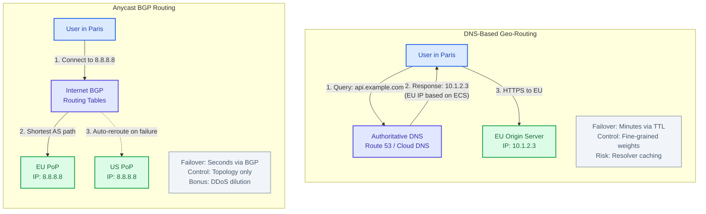
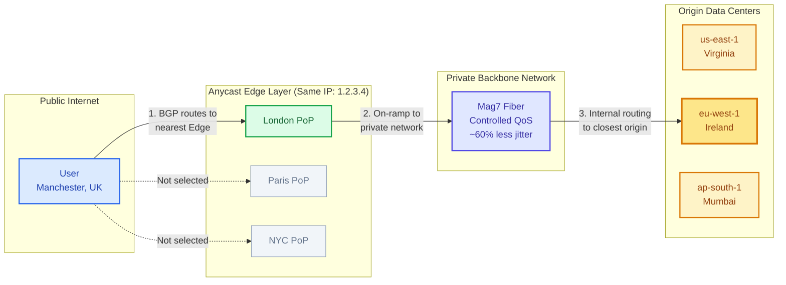

# Geo-Routing

This guide covers 5 key areas: I. Executive Summary: Why Geo-Routing Matters at Scale, II. The Two Primary Architectures: DNS vs. Anycast, III. Routing Policies and Logic Strategies, IV. Mag7 Real-World Case Studies, V. Strategic Risks and TPM Considerations.

## I. Executive Summary: Why Geo-Routing Matters at Scale ⚠️

*Note: This section may need additional review.*

At the Mag7 level, Geo-Routing is not just about pointing a user to a server; it is the control plane for **User Experience (Latency)**, **Legal Compliance (Data Sovereignty)**, and **Global Availability (Disaster Recovery)**.

For a Principal TPM, you must view Geo-Routing as the mechanism that balances the "Iron Triangle" of global infrastructure:
1.  **Performance:** Minimizing Round Trip Time (RTT).
2.  **Cost:** Managing bandwidth transit costs (e.g., routing traffic to cheaper regions when latency allows).
3.  **Compliance:** Ensuring German user data never leaves Frankfurt (GDPR).

**Business Capability Impact:**
*   **Revenue:** Amazon found that every 100ms of latency cost 1% in sales. Geo-routing is the primary fix for this.
*   **Resilience:** If `us-east-1` fails, geo-routing logic dictates whether the business goes offline or seamlessly fails over to `us-west-2`.

---

## II. The Two Primary Architectures: DNS vs. Anycast

nd users' recursive resolvers to respect the Time To Live (TTL) expiration. This creates a "long tail" of traffic hitting a deprecated or failing region long after you have updated the record.
*   **The "Hidden" Technical Hurdle:** **EDNS0 Client Subnet (ECS).**
    *   *The Problem:* Standard DNS routing sees the IP address of the *DNS Resolver* (e.g., the ISP's server), not the *User's* device. If a user in Paris uses a corporate VPN DNS based in New York, a naive DNS implementation will route the Paris user to `us-east-1`.
    *   *The Fix:* Mag7 implementations rely on ECS, an extension where the resolver passes part of the user's IP to the authoritative nameserver.
    *   *Principal Insight:* Not all public resolvers support ECS. You must account for a percentage of "sub-optimal routing" in your latency SLAs due to this protocol limitation.

### 2. IP Anycast (The "Performance" Approach)
*   **How it works:** You announce the *same* IP address from multiple locations globally using the Border Gateway Protocol (BGP). The internet’s routing infrastructure naturally directs user packets to the topologically closest data center.
*   **Mag7 Example:** **Google Public DNS (8.8.8.8)** or **AWS Global Accelerator**. When you ping 8.8.8.8, you are hitting a Google server physically near you, even though the IP is the same worldwide.
*   **Pros:**
    *   **Zero-TTL Failover:** If a PoP (Point of Presence) goes offline, BGP routes withdraw immediately. Traffic automatically flows to the next closest PoP without waiting for DNS cache clearing.
    *   **DDoS Mitigation:** Anycast inherently dilutes attacks. A botnet attack is distributed across all your global PoPs rather than overwhelming a single endpoint.
*   **Cons:**
    *   **Route Flapping:** In unstable internet conditions, a user’s packets might switch paths mid-session. For stateless protocols (UDP/DNS), this is fine. For stateful connections (TCP/WebSockets), this can reset the connection, causing user errors.
    *   **Lack of Control:** You surrender control to the public internet. You cannot easily force users in London to go to Dublin if BGP decides the path to Amsterdam is "shorter" via network hops.

### 3. Tradeoff Analysis & Decision Matrix

As a Principal TPM, you will often arbitrate the decision between these two architectures during the design phase of a new service.

| Feature | DNS Geo-Routing | Anycast | Principal TPM Takeaway |
| :--- | :--- | :--- | :--- |
| **Convergence Time** | Slow (Minutes to Hours via TTL) | Fast (Seconds via BGP) | Use Anycast for High Availability (HA) critical paths; DNS for standard web apps. |
| **Traffic Control** | High (Weighted/Latency/Geo) | Low (Topological only) | Use DNS if you need complex "Canary" deployments (e.g., 1% of traffic). |
| **Protocol Suitability**| TCP/HTTP (Stateful) | UDP (Stateless) or TCP (with tuning) | Anycast requires careful TCP tuning to prevent connection resets (Route Flapping). |
| **Cost/Complexity** | Low (Software configuration) | High (Requires ASN, Hardware, Network Eng) | DNS is the MVP choice; Anycast is the "Mag7 Scale" choice. |

### 4. The Hybrid Model: "The Mag7 Standard"
Most Mag7 architectures now utilize a hybrid approach to capture the benefits of both.

**The Pattern:** Use **Anycast** for the "Front Door" (Edge) and **DNS** for the "Internal Routing."

*   **Example (AWS Global Accelerator / Google Cloud Load Balancing):**
    1.  The user connects to an Anycast IP. This on-ramps the user onto the Mag7 backbone at the closest Edge location (e.g., User in Manchester hits the London Edge).
    2.  Once inside the private backbone (which is faster and more reliable than the public internet), the request is proxied to the specific region.
    3.  **Business Value:** This bypasses the "Public Internet Weather" (congestion/packet loss) for the long haul, reducing latency jitter by up to 60%.

**ROI Impact:**
*   **CX:** Latency consistency improves dramatically.
*   **Cost:** Higher infrastructure cost (ingress/egress on backbone), but lower churn due to performance reliability.

## III. Routing Policies and Logic Strategies ⚠️

*Note: This section may need additional review.*

A Principal TPM must define *how* traffic moves. It is rarely just "closest server."

### 1. Geoproximity (Latency-Based)
*   **Logic:** Route to the region with the lowest latency.
*   **Tradeoff:** "The Thundering Herd." If a region has the best latency for a massive population (e.g., India), that data center might get overwhelmed.
*   **Mitigation:** **Load Feedback Loops.** The routing layer must know the *capacity* of the target region. If Mumbai is at 90% CPU, route the next user to Singapore, even if it adds 30ms latency.

### 2. Geo-Fencing (Compliance/Regulatory)
*   **Logic:** Hard boundaries. Users in the EU *must* be routed to EU regions.
*   **Mag7 Context:** Microsoft Azure and AWS GovCloud.
*   **Impact:** This breaks "high availability" promises. If the only region in Germany fails, you cannot failover to France without violating data residency laws. The TPM must communicate this risk to Legal/Business leadership.

### 3. Cost-Optimized Routing
*   **Logic:** Bandwidth costs vary globally. South America and Australia are expensive; US and EU are cheap.
*   **Strategy:** For non-latency-sensitive workloads (e.g., background photo uploads), route traffic to cheaper regions.
*   **ROI Impact:** Can save millions in egress costs annually.

---

## IV. Mag7 Real-World Case Studies ⚠️

*Note: This section may need additional review.*

### Case A: Netflix (The Open Connect Model)
Netflix does not just route to "AWS Regions." They route to **Open Connect Appliances (OCAs)** embedded inside ISPs.
*   **The TPM Challenge:** Managing the "Map." Netflix's control plane must know which ISP the user is on and if the specific hardware rack inside that ISP has the movie file requested (Content Availability).
*   **The Tradeoff:** High complexity in the control plane vs. Zero transit cost and perfect user experience.

### Case B: Google (The Global VPC)
Google uses a global private fiber network.
*   **The Behavior:** When a user hits a Google service, they enter the Google network at the nearest "Edge PoP" (via Anycast). Once inside, the traffic rides Google's private fiber backbone to the data center, bypassing the public internet.
*   **Business Value:** Google controls the Quality of Service (QoS) for the entire journey, unlike AWS which relies more on the public internet for the "middle mile" (unless using Global Accelerator).

---

## V. Strategic Risks and TPM Considerations

At the Principal TPM level, Geo-Routing ceases to be solely a network engineering ticket and becomes a strategic portfolio risk. You are not just moving packets; you are managing the intersection of international law, catastrophic failure modes, and gross margin profitability.

The following areas represent the critical strategic risks where a Principal TPM must drive alignment between Engineering, Legal, and Finance.

### 1. The Compliance Trap: Sovereignty vs. Availability

The most common strategic failure in Geo-Routing is treating it purely as a latency optimization problem. In a post-GDPR world, Geo-Routing is a legal enforcement mechanism.

*   **The Technical Constraint:** You must implement "Hard Fencing." If a request originates in Germany, user PII (Personally Identifiable Information) must often persist in the EU.
*   **The Mag7 Reality:**
    *   **Microsoft/Azure:** Uses "Geo-Match" policies to ensure government cloud data never traverses outside specific national borders.
    *   **TikTok (Project Texas):** An extreme example where routing logic is hard-coded to prevent US user traffic from reaching servers accessible by non-US entities.
*   **The Tradeoff:** **Availability vs. Compliance.**
    *   *Scenario:* Your Frankfurt data center (DC) burns down.
    *   *Standard Engineering Response:* Route traffic to the next closest DC (e.g., Virginia, US) to maintain uptime.
    *   *Principal TPM Consideration:* If you route German traffic to Virginia, you may be violating data sovereignty laws. The business decision here is often to **fail closed** (show an error page) rather than **fail open** (route to a non-compliant region).
*   **Business Impact:** Violating sovereignty can result in fines up to 4% of global turnover (GDPR). A Principal TPM must ensure the routing control plane has "Legal Guardrails" that override "Availability Guardrails."

### 2. The "Thundering Herd" in Failovers

When a primary region fails, Geo-Routing mechanisms shift traffic to a secondary region. At Mag7 scale, this shift is dangerous.

*   **The Mechanism:** DNS weights for `us-east-1` drop to 0, and `us-west-2` goes to 100.
*   **The Risk:** `us-west-2` is likely provisioned for its own load + a buffer, not its own load + 100% of `us-east-1`. Shifting traffic instantly causes a **cascading failure**, taking down the secondary region and causing a global outage.
*   **Mag7 Mitigation (Google/SRE approach):**
    *   **Load Shedding:** The routing layer must send traffic to the secondary region *only* up to its capacity limit.
    *   **Degraded Mode:** The application serves read-only or static content to the overflow traffic.
*   **The Tradeoff:** **Cost vs. RTO (Recovery Time Objective).**
    *   To support an instant, full-traffic failover, you must pay for **N+1 redundancy** (100% idle capacity in the secondary region).
    *   Most CFOs will not approve 100% idle capacity. The TPM must negotiate the "acceptable degradation" during failover.
*   **Actionable Guidance:** Do not accept a "Active-Active" architecture diagram at face value. Ask: "If Region A dies, does Region B actually have the compute capacity to handle the combined load immediately, or will the autoscalers lag by 15 minutes?"

### 3. Split-Brain DNS and Caching Inconsistency

DNS-based Geo-Routing relies on TTL (Time To Live). This creates a distributed state problem.

*   **The Problem:** You detect an issue in the Singapore node and update DNS to route to Tokyo.
    *   **ISP Caching:** Some ISPs ignore your 60-second TTL and cache the record for 24 hours.
    *   **Result:** 20% of your users (those on non-compliant ISPs) continue hitting the dead Singapore node while your dashboard says traffic has shifted.
*   **Mag7 Example:** During major outages, **Netflix** and **Facebook** have historically had to contact major ISPs directly to flush caches because the "long tail" of traffic refused to shift.
*   **The Tradeoff:** **Resolution Speed vs. Global Propagation.**
    *   Anycast avoids this (it is BGP based, not DNS caching based) but is harder to debug and manage.
    *   DNS is easier to manage but suffers from eventual consistency.
*   **TPM Impact:** When managing an incident timeline, you must buffer the "Traffic Drain" phase. Just because you pushed the button doesn't mean the traffic moved.

### 4. Cost Arbitrage (The "Least Cost" Routing)

Geo-Routing is a lever for Gross Margin. Bandwidth costs (transit) vary significantly by region. Bandwidth in South America or Australia can be 5x-10x more expensive than in North America or Europe.

*   **The Strategy:**
    *   For latency-insensitive workloads (e.g., background photo backups, log uploads), route traffic away from expensive local ingress points to cheaper regions, even if RTT (Round Trip Time) increases.
*   **Mag7 Example:** **Amazon S3** Transfer Acceleration uses edge locations to ingest data quickly, but backend replication traffic is routed over the AWS backbone to minimize ISP transit costs.
*   **The Tradeoff:** **CX (Latency) vs. COGS (Cost of Goods Sold).**
    *   Routing a Brazilian user to Miami for a video stream might save money but causes buffering.
    *   Routing them to Miami for a background app update saves money with zero user perception of latency.
*   **Business Capability:** The TPM should drive the classification of traffic types (Critical/Interactive vs. Background/Batch) to enable cost-optimized routing policies.

### 5. Blast Radius and Configuration Safety

The routing layer is the "Keys to the Kingdom." A bad configuration push here breaks the entire world, not just a single microservice.

*   **The Risk:** A typo in a Geo-IP mapping file or a BGP announcement configuration.
*   **Mag7 Example:** **Meta's 2021 Outage.** A configuration command was issued to assess global backbone capacity, which unintentionally severed connections between Meta's data centers and their DNS servers. Because the DNS servers were unreachable (via BGP), the internet "forgot" Facebook existed. Engineers could not even badge into the building because the door locks relied on the network.
*   **TPM Considerations:**
    *   **Safe Deployment:** Routing changes must be treated as code deployments. They require canarying (roll out to 1% of users, then 5%, etc.).
    *   **Out-of-Band Access:** Ensure there is a mechanism to access the routing control plane that does not rely on the routing control plane itself (avoiding circular dependencies).

---

---

## Interview Questions

### II. The Two Primary Architectures: DNS vs. Anycast

### Question 1: Troubleshooting Global Latency
"We have a latency-sensitive application using DNS-based Geo-Routing. Users in Southeast Asia are complaining about lag. Upon investigation, we see they are being routed to our US-West data center instead of our Singapore node. What are the potential technical root causes, and how would you investigate and resolve this?"

**Guidance for a Strong Answer:**
*   **Identify the Resolver Issue:** The candidate should immediately suspect that the users are using a DNS resolver (like a corporate VPN or a non-standard ISP DNS) that does not support **EDNS0 Client Subnet (ECS)**. The authoritative server sees the Resolver's IP (likely US-based) rather than the User's IP.
*   **Validation:** Propose using tools like `dig` with `+client` subnet options or analyzing server logs for the source IP of the DNS queries.
*   **Remediation:**
    *   *Short term:* Advise users to change DNS resolvers (bad UX).
    *   *Long term:* Switch to an Anycast architecture (AWS Global Accelerator) to on-ramp users locally regardless of their DNS resolver settings, effectively decoupling routing logic from DNS resolution quirks.

### Question 2: Architecture for Real-Time Gaming
"You are the TPM for a new real-time multiplayer shooter game. The engineering lead wants to use Anycast for the game servers to ensure the lowest latency. Do you agree with this decision? What risks would you highlight to the engineering team?"

**Guidance for a Strong Answer:**
*   **Challenge the Premise (TCP/UDP State):** While Anycast is great for UDP (often used in gaming), the candidate must highlight the risk of **"Route Flapping."** If the internet topology changes mid-game, the user's packets might shift to a different server instance if the Anycast IP is shared across regions, breaking the game state.
*   **Propose the Hybrid Solution:**
    *   Use Anycast for **Matchmaking/Discovery** (stateless, finds the closest region).
    *   Once a match is found, hand off the client to a **Unicast IP** (specific server IP) for the duration of the match.
*   **Business/CX Impact:** This prevents "teleporting" or disconnects during gameplay (CX) while maintaining fast initial connection times (Performance).

### V. Strategic Risks and TPM Considerations

### 1. The "Impossible" Failover
**Question:** "We have two regions: US-East and US-West. Both are running at 65% capacity. US-East goes down completely. You are the Principal TPM leading the incident response. If we shift all traffic to US-West, it will hit 130% load and crash. What is your strategy to manage this routing change?"

**Guidance for a Strong Answer:**
*   **Immediate Triage:** Acknowledge that a full failover is impossible without causing a global outage.
*   **Prioritization (Load Shedding):** Propose shedding non-critical traffic. Example: "We route 'Add to Cart' and 'Checkout' requests to US-West, but we serve a static 'Maintenance Mode' page for 'User Reviews' or 'Recommendations' to reduce compute load."
*   **Queueing:** Discuss implementing aggressive queuing at the ingress layer (API Gateway) to smooth the spike, acknowledging this increases latency but preserves availability.
*   **Business Communication:** Highlight the need to communicate to stakeholders that "Degraded Availability" is the goal, not "Full Availability," to prevent the secondary region from tipping over.

### 2. The Latency vs. Cost Dispute
**Question:** "The CFO wants to reduce global egress costs by 20%. Engineering proposes routing all South American traffic to US-East (Virginia) because bandwidth is cheaper there, but this adds 80ms of latency. Product claims this will kill retention. How do you resolve this impasse?"

**Guidance for a Strong Answer:**
*   **Data-Driven Decisioning:** Reject opinions. Propose an A/B test (Canary) routing 5% of South American traffic to US-East to measure the actual impact on session length and conversion.
*   **Traffic Segmentation:** Suggest a hybrid approach. Route latency-sensitive traffic (gaming, voice, video) locally in South America, but route high-bandwidth/latency-tolerant traffic (downloads, backups) to US-East.
*   **ROI Modeling:** Calculate the cost of churn (lost users due to latency) vs. the savings in bandwidth. If the savings are \$1M but the lost revenue from churn is \$5M, the engineering proposal is rejected based on unit economics.

---

## Key Takeaways

- Review each section for actionable insights applicable to your organization

- Consider the trade-offs discussed when making architectural decisions

- Use the operational considerations as a checklist for production readiness
