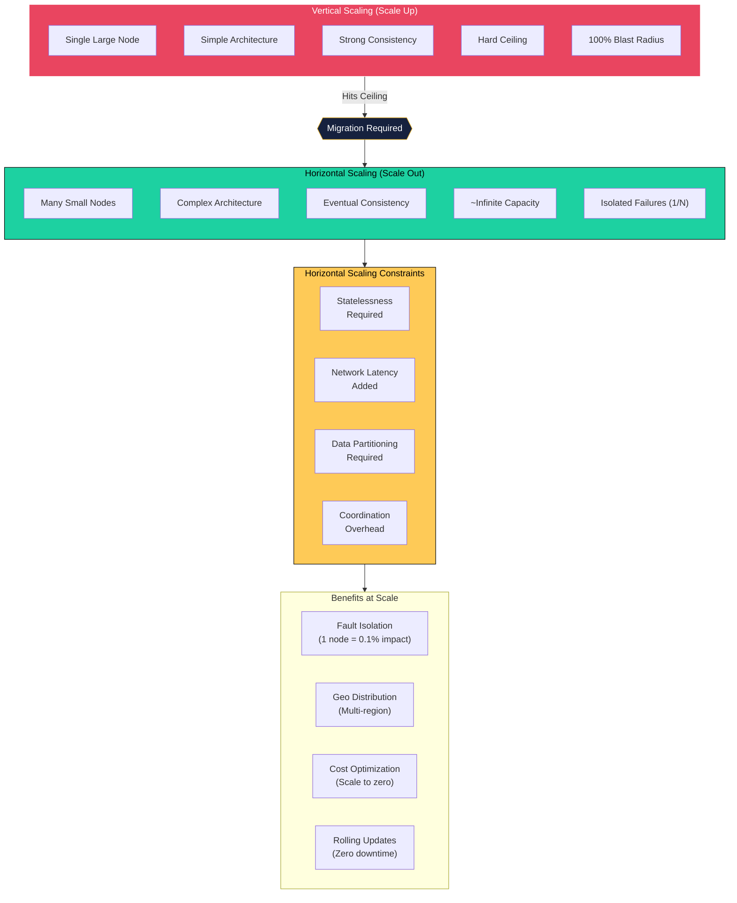
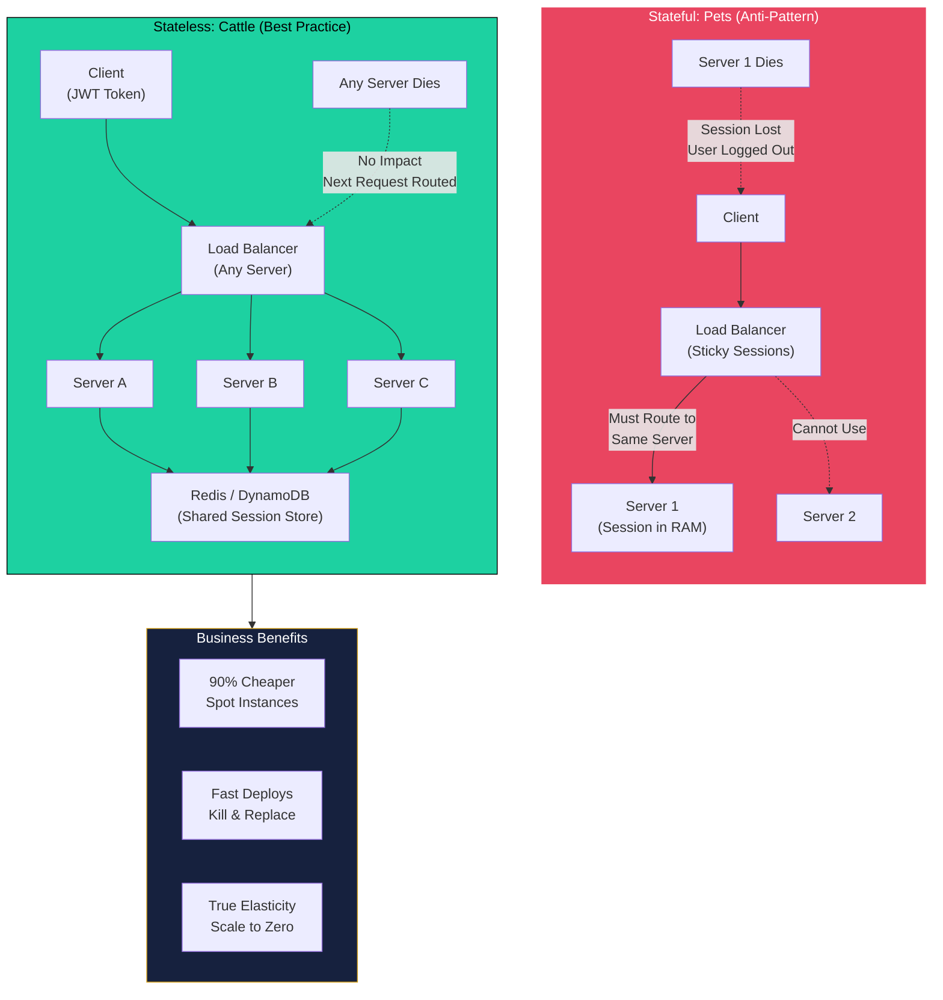
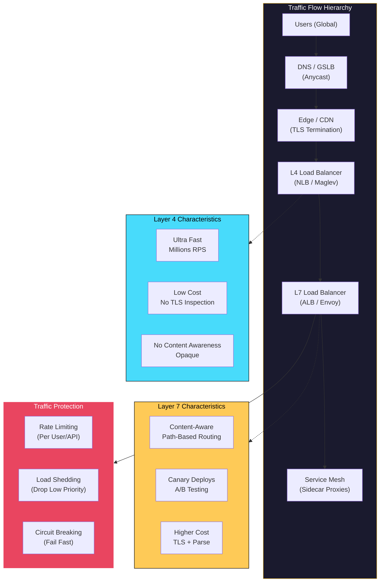
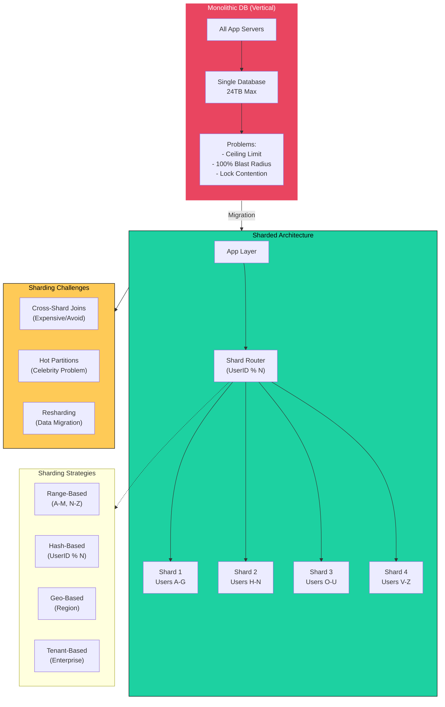
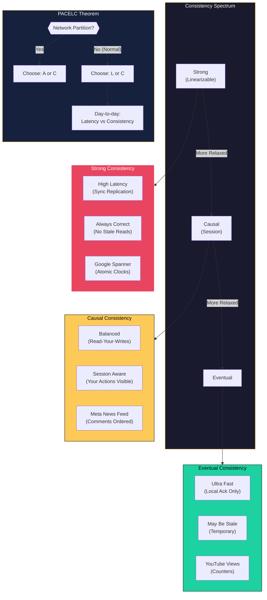

# Horizontal Scaling Patterns

This guide covers 6 key areas: I. The Fundamental Shift: Scale-Out (Horizontal) vs. Scale-Up (Vertical), II. Stateless Architecture: The "Easy" Win, III. Load Balancing and Traffic Shaping, IV. Sharding: Horizontal Scaling for Data, V. Auto-Scaling and Elasticity, VI. Consistency Models in Distributed Systems.

## I. The Fundamental Shift: Scale-Out (Horizontal) vs. Scale-Up (Vertical)

At the Principal TPM level, the decision between Scale-Out (Horizontal) and Scale-Up (Vertical) is rarely a binary engineering choice; it is a strategic decision that dictates your system's cost structure, failure domains, and operational capability. While the industry default is Horizontal Scaling, understanding *why* and *where* Vertical Scaling still exists (and fails) is critical for architectural authority.

### 1. The Economic and Physical Ceilings of Vertical Scaling

Vertical scaling (Scale-Up) relies on adding resources (CPU, RAM, IOPS) to a single node. While administratively simple, it hits two distinct ceilings that Mag7 companies cannot tolerate: the Physical Ceiling and the Step-Function Cost Curve.

*   **The Physical Ceiling:** There is a hard limit to how large a single instance can get. For example, an AWS `u-24tb1.112xlarge` instance offers 24TB of RAM, but once your dataset exceeds that, you are forced to re-architect under duress.
*   **The Step-Function Cost Curve:** High-end hardware does not scale linearly in price. Doubling performance at the extreme high end often costs 4x-10x because of the specialized engineering required for interconnects and cooling.

**Real-World Mag7 Behavior:**
At **Google**, the search index is too large for any single machine. Google utilizes commodity hardware (standardized server racks) where individual node failure is expected. The system is designed to treat hardware as ephemeral. Conversely, **Microsoft Azure** and **AWS** offer massive vertically scaled instances (e.g., for SAP HANA workloads), but these are niche products for legacy enterprise customers, not the backbone of Azure or AWS internal services.

**Tradeoffs:**
*   **Vertical:** Low architectural complexity (no network partitioning logic required), but creates a Single Point of Failure (SPOF) and imposes hard capacity caps.
*   **Horizontal:** Infinite theoretical capacity and linear cost growth, but introduces significant software complexity (sharding logic, load balancing, consensus algorithms).

### 2. Failure Domains and "Blast Radius"

The primary driver for Horizontal Scaling at the Principal level is not just performance; it is availability. In a vertically scaled architecture, the blast radius of a failure is 100%. In a horizontally scaled architecture, the blast radius is proportional to $\frac{1}{N}$ (where $N$ is the number of nodes), assuming correct load balancing.

**Impact on Business/CX:**
*   **Availability SLAs:** You cannot mathematically achieve 99.999% (Five Nines) availability with a single active node, regardless of hardware quality, due to maintenance windows and OS patching. Horizontal scaling allows for "Rolling Updates" where nodes are patched sequentially without service interruption.
*   **Customer Experience:** In a horizontally scaled **Netflix** control plane, if a rack fails, a subset of users might experience higher latency or a retry, but the service remains up. In a vertical model, the service goes dark.

**Mag7 Example:**
**Meta (Facebook)** manages billions of users. If they relied on vertical scaling, a database maintenance window would require taking the site offline. Instead, they use massive horizontal sharding (TAO/MySQL). If a shard goes down, only a tiny percentage of users (specific to that shard) experience issues, and automated failover handles the recovery in seconds.

### 3. The Database Bottleneck: Where Theory Meets Reality

The most challenging aspect of this shift is data persistence. Application layers are stateless and easy to scale horizontally. Data layers are stateful and difficult to scale horizontally.

*   **Vertical approach:** A monolithic SQL database (PostgreSQL/Oracle). Easy to query (JOINs are local), strong consistency (ACID).
*   **Horizontal approach:** NoSQL (DynamoDB/Cassandra) or NewSQL (Spanner/CockroachDB). Harder to query (distributed JOINs are expensive), often requires eventual consistency or complex clock synchronization.

**Actionable Guidance:**
When reviewing architecture for a new high-scale service, the Principal TPM must ask: *How do we shard the data?*
1.  **Read Replicas:** Scale reads horizontally, keep writes vertical (Master-Slave).
2.  **Sharding:** Split data by key (e.g., UserID) across multiple nodes. This allows linear write scaling.

**Tradeoffs:**
Sharding introduces the "Cross-Shard Transaction" problem. If you need to update data on Shard A and Shard B atomically, you incur massive latency penalties (Two-Phase Commit). This impacts the **Skill** capability of the team; developers must write code that is shard-aware, increasing the barrier to entry for new engineers.

### 4. Cost Modeling and Capacity Planning (ROI)

Horizontal scaling aligns infrastructure spend with revenue generation (Unit Economics).

*   **CapEx vs. OpEx:** Vertical scaling often requires massive upfront provisioning (buying the box for Peak Load). Horizontal scaling allows for Auto-Scaling (OpEx), where you pay for *current* load.
*   **Bin Packing:** With container orchestration (Kubernetes/Borg), horizontal scaling allows you to "bin pack" multiple small services onto commodity nodes, maximizing CPU utilization. Vertical nodes often sit at 10% utilization during off-peak hours, wasting capital.

**Impact on ROI:**
**Amazon Retail** experiences massive traffic spikes on Prime Day. A vertical strategy would require owning hardware capable of handling Prime Day peak year-round (massive waste). A horizontal strategy allows them to provision tens of thousands of instances for 48 hours and terminate them immediately after, saving millions in infrastructure costs.

## II. Stateless Architecture: The "Easy" Win

To scale horizontally effectively, you must decouple the application logic (Compute) from the data (State). In a stateless architecture, the server retains no knowledge of previous interactions. Every HTTP request sent by a client must contain all the necessary context (authentication, parameters, state identifiers) for the server to process it.

This decoupling is the primary enabler of cloud elasticity. It transforms servers from "pets" (unique, manually nursed, critical if lost) into "cattle" (identical, automated, replaceable).

### 1. The Architecture of Decoupling

In a traditional stateful application, if User A logs in, Server 1 stores that session in its local RAM. Subsequent requests must be routed to Server 1 (Sticky Sessions). If Server 1 crashes or is taken down for patching, User A is logged out and loses their work.

In a stateless Mag7 environment, the architecture shifts the burden of state management to two specific locations:
1.  **The Client:** State is stored in the browser/device (e.g., JWT tokens, Cookies, LocalStorage) and transmitted with every request.
2.  **A Shared Data Store:** State is stored in a high-speed, distributed cache or database (e.g., Redis, Memcached, DynamoDB).

**The Mag7 Implementation:**
When you browse Amazon.com, your "Shopping Cart" is not stored on the EC2 instance rendering the page. It is stored in a highly available implementation of DynamoDB (or an internal equivalent). This means your request can hit Server A for the homepage, Server B for the product detail, and Server C for checkout. To the application logic, these servers are identical clones.

### 2. Strategic Business Impact & ROI

For a Principal TPM, pushing for statelessness is rarely about code purity; it is about **Cost Optimization** and **Operational Velocity**.

*   **Cost Reduction (Spot Instances):** This is the highest ROI driver. AWS Spot Instances or Google Preemptible VMs offer compute at up to 90% discounts but can be reclaimed by the cloud provider with a 2-minute warning.
    *   *Stateful:* You cannot use Spot instances safely because terminating the instance kills active user sessions.
    *   *Stateless:* You can run your entire fleet on Spot instances. If a node is reclaimed, the load balancer simply routes the very next packet to a healthy node. The user experiences zero interruption.
*   **Deployment Velocity:** In a stateful system, you must "drain" connections before updating a server, waiting for users to log off. In a stateless system, you can aggressively kill and replace containers (Rolling Updates or Blue/Green Deployments) without waiting, significantly reducing deployment windows.

### 3. Trade-offs and Technical Debt

While statelessness is the "easy win" for scaling, it introduces specific engineering hurdles that a TPM must account for in roadmap planning.

**A. Latency Penalties (The "Network Hop" Tax)**
*   *The Issue:* Reading session data from local RAM takes nanoseconds. Reading it from an external Redis cluster takes milliseconds (network round trip + serialization/deserialization).
*   *Mag7 Mitigation:* Engineers will implement "near-cache" (local caching with short TTLs) or optimizing serialization protocols (Protobufs over JSON).
*   *Business Impact:* Slight increase in infrastructure cost (paying for the Redis cluster) and a marginal increase in P99 latency.

**B. The "Thundering Herd" Risk**
*   *The Issue:* If the external state store (e.g., the Redis cluster) fails or restarts, the application servers lose access to session data. Every application server simultaneously attempts to reconnect or fetch data from the primary database, potentially crashing the database under the load.
*   *TPM Action:* Ensure "Circuit Breakers" and "Exponential Backoff" strategies are defined in the non-functional requirements (NFRs).

**C. Bandwidth Bloat**
*   *The Issue:* If relying on Client-Side state (e.g., passing a large JWT or state object in the header), every request becomes larger.
*   *Tradeoff:* If a cookie is 4KB and you have 100 million requests per day, you are paying for terabytes of ingress/egress data just to transmit state.
*   *Guidance:* Keep client-side tokens lightweight (reference IDs only) and store the heavy object in the backend data store.

### 4. Real-World Example: Netflix Playback API

Netflix provides a canonical example of stateless design for resilience.

*   **Scenario:** You are watching a movie. Your device sends a "heartbeat" every few seconds to Netflix servers to track your progress.
*   **Architecture:** The service receiving that heartbeat is stateless. It takes the timestamp and writes it immediately to a Cassandra database (distributed storage).
*   **Failure Mode:** If the server processing your heartbeat crashes mid-movie, the next heartbeat is routed to a different server. Because the server doesn't hold the state (the timestamp), the new server simply reads the last known position from Cassandra and continues.
*   **Result:** The customer never sees a buffer or an error, despite backend turbulence.

### 5. Edge Cases: When to Break the Rule

A Principal TPM must recognize when *not* to use stateless architecture. Statelessness is not universal.

*   **Real-Time Gaming / High-Frequency Trading:** If microseconds matter, you cannot afford the network hop to an external cache. State must be in local memory. In these cases, you accept the complexity of "Sticky Sessions" (routing a user to the exact same server every time) to gain performance.
*   **WebSockets / Long-Polling:** Maintaining an open bi-directional connection (e.g., a chat application or stock ticker) is inherently stateful. The connection exists on a specific server.
    *   *Mitigation:* Mag7 companies often isolate these into specific "Gateway" fleets that handle the persistent connection, while the backend logic remains stateless.

## III. Load Balancing and Traffic Shaping

At the Principal TPM level, Load Balancing (LB) is not merely about distributing requests across servers; it is the control plane for system stability, deployment velocity, and cost optimization. You are not configuring NGINX; you are defining the strategy for how traffic flows through the ecosystem to maximize hardware utilization (ROI) and minimize tail latency (CX).

### 1. The Hierarchy of Traffic: L4 vs. L7 Load Balancing

In a Mag7 environment, load balancing is tiered. Understanding the distinction between Layer 4 (Transport) and Layer 7 (Application) is critical for architectural cost/benefit analysis.

**The Technical Distinction:**
*   **Layer 4 (L4):** Routes based on IP address and Port (TCP/UDP). It is "packet-level" routing. It does not inspect the content of the request. It is extremely fast and computationally cheap.
*   **Layer 7 (L7):** Routes based on content (HTTP headers, URLs, Cookies). It terminates the TLS connection, inspects the request, and makes intelligent decisions. It is CPU-intensive and adds latency.

**Real-World Mag7 Behavior:**
*   **Google (Maglev):** Google uses Maglev, a software network load balancer. It acts as the "front door" (L4), ingesting massive throughput and distributing it to backend proxies.
*   **AWS (ALB vs. NLB):** AWS forces this choice explicitly. Network Load Balancers (NLB) are L4 (millions of requests/sec, ultra-low latency). Application Load Balancers (ALB) are L7 (routing `/api/cart` to the Cart Service and `/api/video` to the Video Service).
*   **Service Mesh (Envoy/Istio):** Internally, Mag7 companies use "sidecar" proxies (like Envoy) at L7 to manage service-to-service traffic, enabling sophisticated routing without changing application code.

**Trade-offs:**
*   **Cost vs. Intelligence:** L7 requires significantly more compute power because it must decrypt/encrypt SSL and parse headers. Using L7 for simple TCP streams is a waste of budget.
*   **Visibility:** L4 is opaque; you cannot see if a request is a 500 error or a 200 OK, only that bytes moved. L7 provides deep observability.

**Impact on Business/ROI:**
*   **ROI:** Optimizing the ratio of L4 to L7 balancers can save millions in infrastructure spend. A common anti-pattern is using heavy L7 balancers where a pass-through L4 would suffice.

### 2. Traffic Shaping and Protection Strategies

Scaling out handles *expected* load. Traffic shaping handles *unexpected* load and protects the system from cascading failure.

**Key Mechanisms:**
1.  **Rate Limiting:** Restricting the number of requests a user/service can make in a time window.
2.  **Load Shedding:** Deliberately dropping low-priority requests when the system is near capacity to preserve high-priority functions.
3.  **Circuit Breaking:** Stopping traffic to a failing service immediately to prevent the caller from hanging and resources from being exhausted.

**Real-World Mag7 Behavior:**
*   **Amazon (Prime Day):** During peak events, Amazon employs aggressive **Load Shedding**. If the backend is overwhelmed, the system might reject requests to "View Recommended Products" (low priority) to ensure "Checkout" requests (revenue-critical) have sufficient capacity.
*   **Meta (Thundering Herd):** If a service recovers after a crash, thousands of clients might retry simultaneously. Meta implements **Jitter** (randomized delays) and **Exponential Backoff** in their load balancers to smooth out these spikes.

**Trade-offs:**
*   **CX vs. Stability:** Load shedding deliberately degrades the customer experience (the user sees an error or a stripped-down page) to save the platform. This is a calculated decision: partial availability is better than total outage.
*   **False Positives:** Aggressive rate limiting can block legitimate power users or API partners, impacting revenue or developer trust.

**Impact on Capabilities:**
*   **Resilience:** Without circuit breakers, a failure in a non-critical microservice (e.g., the "Like" counter) can take down the entire page because the web server runs out of threads waiting for the timeout.

### 3. Advanced Routing: Canary and Blue/Green

For a Product Principal, the load balancer is the primary tool for risk mitigation during software releases.

**The Concept:**
Instead of a "Big Bang" deployment (updating all servers at once), you use the load balancer to shape traffic to new versions.
*   **Canary:** Send 1% of traffic to Version B, 99% to Version A. Monitor metrics. Gradually increase.
*   **Blue/Green:** Maintain two full environments. Switch the router from Blue (old) to Green (new).

**Real-World Mag7 Behavior:**
*   **Facebook/Meta:** Gatekeeper is their internal tool. They do not just route by percentage; they route by specific cohorts (e.g., "Internal Employees," then "New Zealand users," then "Global"). This is L7 routing based on User ID.
*   **Netflix:** Uses "Sticky Canary." The same user is consistently routed to the canary build to ensure a consistent experience during the test, rather than bouncing between versions.

**Trade-offs:**
*   **Velocity vs. Safety:** Canary deployments take longer. A full rollout might take days. However, the "Blast Radius" of a bad bug is limited to 1% of users.
*   **Cost:** Blue/Green requires double the infrastructure for the duration of the deployment (200% capacity).

**Impact on Business/ROI:**
*   **CX:** Prevents global outages caused by bad deployments.
*   **Agility:** Encourages developers to deploy more frequently because the cost of failure is lower (easy rollback via LB config change).

### 4. Global Server Load Balancing (GSLB) and Anycast

At Mag7 scale, load balancing happens at the DNS level before the request even hits a data center.

**The Concept:**
GSLB uses DNS to return the IP address of the data center closest to the user (Geo-DNS) or the one with the most available capacity. **Anycast** allows multiple global data centers to announce the *same* IP address; the internet's routing protocol (BGP) automatically sends the user to the nearest location.

**Real-World Mag7 Behavior:**
*   **Google:** Heavily utilizes Anycast. A user in London and a user in Tokyo might ping `8.8.8.8` (Google DNS) and hit completely different physical servers, but the IP remains the same.
*   **Microsoft Azure:** Uses Traffic Manager to route users away from a region experiencing a fiber cut to the next closest region automatically.

**Trade-offs:**
*   **Data Sovereignty vs. Performance:** Routing a German user to a US server because the German region is full might violate GDPR. GSLB rules must be aware of legal compliance, not just latency.
*   **Cache Coherency:** If a user bounces between regions (e.g., on a mobile device), their session data might not be replicated yet, leading to a disjointed CX.

**Impact on Business:**
*   **Disaster Recovery (DR):** GSLB is the automated switch for DR. It minimizes RTO (Recovery Time Objective) by automating regional failover.

## IV. Sharding: Horizontal Scaling for Data

*Note: This section may need additional review.*

Scaling the application tier (stateless) is easy. Scaling the database (stateful) is the hardest technical challenge a TPM will oversee.

**The Concept:**
Sharding splits a single logical dataset across multiple database instances. You define a "Shard Key" (e.g., UserID, Region).
*   Users A-M go to Database Node 1.
*   Users N-Z go to Database Node 2.

**Real-World Mag7 Behavior:**
*   **Example:** **Instagram (Meta)**. Instagram cannot hold all photos in one database. They shard based on ID. When a user requests a photo, the system calculates which shard holds that ID and routes the query there.
*   **Example:** **Slack**. Shards messages by "Workspace ID" or "Channel ID."

**Trade-offs:**
*   **Cross-Shard Joins:** Doing a query that requires data from Shard 1 and Shard 2 is incredibly slow and complex. You generally lose the ability to perform complex ACID transactions across shards.
*   **Data Skew (Hot Partitions):** If you shard by "Celebrity Name," the shard holding "Taylor Swift" will melt down due to traffic, while the shard holding "Obscure Indie Band" sits idle.

**Impact on Business/ROI/CX:**
*   **Business Capability:** Allows infinite data growth. Without sharding, your product has a hard ceiling on how many users it can support.
*   **Cost:** High operational complexity. Resharding (moving data when a shard gets too full) is risky and expensive engineering work.

## V. Auto-Scaling and Elasticity

Auto-scaling is the operationalization of horizontal scaling. While horizontal scaling is the architectural capability to add nodes, elasticity is the automated control loop that adjusts capacity based on demand. For a Principal TPM, the focus shifts from "can we scale?" to "how fast, at what cost, and based on what signals?"

### 1. Scaling Strategies: Reactive vs. Predictive

At the enterprise level, relying solely on CPU thresholds to trigger scaling events is rarely sufficient. You must understand the two primary governing strategies.

**Reactive Scaling (Threshold-based):**
This is the standard implementation where capacity is added when a metric breaches a threshold (e.g., "Add 2 instances if CPU > 70% for 5 minutes").
*   **Real-World Mag7 Behavior:** Used for background processing or steady-state services. However, for user-facing services, reactive scaling often reacts too slowly. By the time the metric spikes and the new instance boots, the customer has already experienced latency.
*   **Tradeoffs:**
    *   *Pros:* Simple to implement; cost-efficient (you only pay for what is proven necessary).
    *   *Cons:* **The "Warm-up" Lag.** New capacity takes time to spin up (VM boot + App start + Cache warming). During this lag, the existing fleet is overloaded, potentially causing cascading failures.

**Predictive Scaling (Schedule or ML-based):**
This involves scaling out *before* the traffic arrives based on historical patterns or machine learning models.
*   **Real-World Mag7 Behavior:** **Netflix** uses "Scryer," a predictive auto-scaling engine. It analyzes viewing history to predict that traffic will spike at 7:00 PM on a Friday in the US East region and pre-warms thousands of instances at 6:30 PM. **Amazon** uses similar logic for Prime Day, pre-provisioning capacity based on marketing push schedules rather than waiting for the load balancer to report high traffic.
*   **Tradeoffs:**
    *   *Pros:* Zero latency impact for expected spikes; superior CX.
    *   *Cons:* **The "Over-provisioning" Risk.** If the prediction is wrong (e.g., a forecasted viral event flops), you burn cash on idle compute. It requires complex data modeling.

**Impact on Business/ROI:**
*   **ROI:** Predictive scaling optimizes revenue protection (preventing crashes during peak sales) but increases infrastructure waste compared to purely reactive models.
*   **CX:** Predictive scaling is the only way to handle "Flash Crowd" events without degrading performance for the first 5% of users.

### 2. The Signal: Selecting the Right Metrics

A common failure mode in TPM-led migrations is scaling on the wrong metric.

**The Fallacy of CPU/RAM:**
For many modern applications (especially I/O bound services), CPU is a lagging indicator. An application might be failing requests due to thread-pool exhaustion or database lock contention while CPU sits at 20%.

**Mag7 Best Practices:**
*   **Request Count / Latency:** Google Load Balancers often trigger scaling based on Request Per Second (RPS) targets or when P99 latency breaches a threshold (e.g., 200ms).
*   **Queue Depth:** For asynchronous architectures (like Amazon's order processing), scaling is triggered by the depth of the SQS (Simple Queue Service) queue. If the backlog grows faster than the consumers can process, the consumer fleet auto-scales.
*   **Custom Business Metrics:** Uber might scale dispatch servers based on the ratio of "Open App Sessions" to "Available Drivers" in a geofence, rather than server load.

**Tradeoffs:**
*   **Granularity vs. Cost:** High-resolution metrics (1-second granularity) allow faster scaling but cost significantly more to monitor and store than 1-minute metrics.
*   **Oscillation (Thrashing):** If the metric is too volatile, the system will rapidly scale up and down (thrashing), causing billing spikes and availability issues.

### 3. The Infrastructure Layers: Pod vs. Node Scaling

In a Kubernetes (K8s) environment—standard at most Mag7s—elasticity happens at two distinct layers. A Principal TPM must ensure these are synchronized.

**Horizontal Pod Autoscaler (HPA):**
Increases the number of application containers (pods). This is fast (seconds).
*   **Constraint:** HPA only works if there is physical space on the worker nodes.

**Cluster Autoscaler (CA):**
Increases the number of worker nodes (VMs) when there is no room for new pods. This is slow (minutes).
*   **The "Deadlock" Scenario:** If traffic spikes, HPA requests 50 new pods immediately. The cluster is full. The CA triggers a new node provision from the cloud provider. This takes 3-5 minutes. During this time, the pods are "Pending," and the service is degrading.

**Mitigation (Actionable Guidance):**
To solve the Node/Pod timing gap, Mag7 companies use **"Pause Pods"** or **Over-provisioning buffers**. They run low-priority dummy pods that do nothing but reserve space. When real traffic hits, the high-priority app pods evict the dummy pods instantly (taking their space), giving the Cluster Autoscaler time to spin up new nodes in the background.

### 4. Scale-Down and Termination Policies

Scaling up saves the customer; scaling down saves the budget. However, scaling down is technically riskier.

**Graceful Shutdown:**
When the auto-scaler decides to remove a node, it cannot simply cut power.
*   **Connection Draining:** The load balancer must stop sending new requests to the instance.
*   **SIGTERM Handling:** The application must finish processing in-flight requests (e.g., completing a payment transaction) before terminating.
*   **Mag7 Behavior:** Amazon EC2 Auto Scaling Groups use "Lifecycle Hooks" to wait for an instance to upload logs or finish tasks before final termination.

**Tradeoffs:**
*   **Cost vs. Risk:** Aggressive scale-down policies save money but risk terminating instances during brief lulls in traffic, only to need them again minutes later (costing more in startup overhead). This is why **Cooldown Periods** (e.g., "do not scale down for 10 minutes after a scale up") are mandatory.

## VI. Consistency Models in Distributed Systems

In a distributed system, "consistency" does not refer to code style or UI uniformity. It refers to the guarantee that a system provides regarding the visibility of data updates to subsequent reads.

For a Principal TPM, the choice of consistency model is the single most impactful architectural decision regarding **Latency** and **User Experience**. It is rarely a binary choice between "correct" and "incorrect"; it is a negotiated settlement between data accuracy, system availability, and response time.

### 1. The Consistency Spectrum

While academic literature lists dozens of models, at the Mag7 level, you are primarily navigating three distinct tiers. You must map product requirements to these tiers to optimize ROI and CX.

#### A. Strong Consistency (Linearizability)
After a write is confirmed, all subsequent reads—from any node, anywhere in the world—will return that value. The system acts as if there is only one copy of the data.

*   **Real-World Mag7 Behavior:**
    *   **Google Spanner:** Uses atomic clocks (TrueTime API) to guarantee external consistency across global data centers. Used for Google Ads and Play Store transactions where double-spending or overselling inventory is unacceptable.
    *   **Azure Storage:** Offers strong consistency options to ensure enterprise customers (like banks) never see stale data.
*   **Trade-offs:**
    *   **Latency Penalty:** Requires synchronous replication. The write isn't "done" until a quorum of nodes confirms it. This is governed by the speed of light between data centers.
    *   **Availability Risk:** During a network partition, if the nodes cannot talk to each other to form a consensus, the system must reject writes (fail closed) to prevent divergence.
*   **Business Impact:**
    *   **CX:** Users see accurate data but experience slower save times.
    *   **ROI:** Prevents costly business logic errors (e.g., selling the same seat on a plane to two people).

#### B. Eventual Consistency
The system guarantees that if no new updates are made, eventually all accesses will return the last updated value. In the interim, reads may return stale data.

*   **Real-World Mag7 Behavior:**
    *   **Amazon DynamoDB:** Defaults to eventual consistency for reads to maximize throughput and minimize cost.
    *   **YouTube View Counts:** When a video goes viral, the view count is notoriously inaccurate in real-time. It is eventually reconciled across distributed counters.
    *   **DNS Propagation:** The internet's phonebook is purely eventual.
*   **Trade-offs:**
    *   **Speed:** Writes are acknowledged immediately (often persisted only to a local node or memory). Reads are lightning fast.
    *   **Complexity:** The application layer must handle "stale" data or out-of-order updates.
*   **Business Impact:**
    *   **CX:** High perceived performance. However, "glitchy" behavior (e.g., a user deletes a comment, refreshes, and sees it again) erodes trust if used in the wrong context.
    *   **ROI:** Significantly lower infrastructure costs (less chatter between nodes) and higher throughput per dollar.

#### C. Causal Consistency (The "Session" Middle Ground)
This is often the "Sweet Spot" for Product TPMs. The system does not guarantee that *everyone* sees the update instantly, but it guarantees that operations that are causally related are seen in order.

*   **Real-World Mag7 Behavior:**
    *   **Meta (Facebook) News Feed:** If you comment on a post, *you* must see your comment immediately (Read-Your-Writes consistency). If your friend in a different region sees it 5 seconds later, that is acceptable. If you reply to a comment, the reply must never appear before the original comment.
*   **Trade-offs:**
    *   **Implementation Difficulty:** Requires tracking "causal history" (often using Vector Clocks), which bloats metadata and complicates client logic.
*   **Business Impact:**
    *   **CX:** Provides the illusion of strong consistency to the active user while maintaining the backend efficiency of eventual consistency.

### 2. Beyond CAP: The PACELC Theorem

The CAP Theorem (Pick 2: Consistency, Availability, Partition Tolerance) is often cited in junior interviews. At the Principal level, you must utilize **PACELC**, which addresses the system state even when there are *no* failures.

**The Theorem:** In case of a Partition (**P**), one has to choose between Availability (**A**) and Consistency (**C**), but **E**lse (when the system is running normally), one has to choose between Latency (**L**) and Consistency (**C**).

**The Principal TPM Takeaway:**
Most of the time, the network is not partitioned. Therefore, your day-to-day trade-off is **Latency vs. Consistency**.
*   If you demand Strong Consistency, you *will* have higher Latency (waiting for replication).
*   If you demand Low Latency, you *must* accept some level of inconsistency (Eventual).

**Mag7 Example:**
**Amazon Retail Page:** When you load a product page, Amazon prioritizes Latency (L) over Consistency (C). It is better to show "In Stock" instantly (even if there is only 1 item left and someone just bought it) than to make the user wait 200ms for a global lock check. If the item is actually out of stock, they reconcile this at checkout (or apologize via email later). The ROI of speed outweighs the cost of occasional apology emails.

### 3. Conflict Resolution Strategies

When you choose Eventual Consistency, you accept that data conflicts will happen (e.g., two users editing the same Wiki page at the same time in different regions). You must define how the system resolves this.

1.  **Last Write Wins (LWW):** Rely on timestamps. The latest timestamp overwrites everything.
    *   *Risk:* Clock skew between servers can cause data loss (a "newer" write might actually be older).
    *   *Use Case:* Updating a user's profile picture.
2.  **CRDTs (Conflict-free Replicated Data Types):** Data structures designed to merge automatically without conflicts.
    *   *Use Case:* **Google Docs** collaborative editing. Operations are commutative; the order doesn't matter, the result is the same.
    *   *Cost:* High engineering complexity to implement.
3.  **Application Resolution:** Keep both versions and ask the user/application to merge them.
    *   *Use Case:* **Amazon Shopping Cart.** If you add an item on your phone, and delete a different item on your laptop while offline, Amazon merges the states (keeping the added item) rather than overwriting one cart with the other.

### 4. Strategic ROI & Business Capability Mapping

A Principal TPM must map these technical choices to business outcomes.

| Feature | Recommended Model | Business Rationale (ROI/CX) |
| :--- | :--- | :--- |
| **Payment Processing** | Strong Consistency | **Trust & Legal:** Double-charging or losing money destroys brand trust and incurs regulatory fines. Latency is acceptable here. |
| **Social Media Feed** | Eventual Consistency | **Engagement:** Users scroll fast. 100ms latency incurs distinct churn. Seeing a post 2 seconds late has $0 business impact. |
| **User Settings/Profile** | Read-Your-Writes (Causal) | **CX:** If a user changes "Dark Mode" to "Light Mode," they must see it change instantly. If they don't, they will assume the app is broken and submit support tickets. |
| **Inventory (High Volume)** | Eventual (with safeguards) | **Sales:** Don't block sales on locks. Allow overselling slightly and compensate later (SLA credits) rather than slowing down the funnel. |

### 5. Common Failure Modes

1.  **Clock Skew:** Relying on system time for consistency (LWW) is dangerous because server clocks drift. Google Spanner solves this with GPS/Atomic clocks, but standard cloud instances do not.
2.  **Replication Lag:** In eventual consistency, if the "eventual" takes too long (e.g., >1 second), users notice. This often happens when a replica node is underpowered or the network link is saturated.
3.  **The "Write-Heavy" Bottleneck:** Trying to force Strong Consistency on a write-heavy system (e.g., IoT sensor ingestion) will cause the database to lock up and crash. You must decouple ingestion (Eventual) from reporting (Stronger).

---

## Interview Questions

### I. The Fundamental Shift: Scale-Out (Horizontal) vs. Scale-Up (Vertical)

**Question 1: The Legacy Migration**
"We have a legacy payment processing system running on a massive, vertically scaled Oracle database. It is approaching its hardware limits, and licensing costs are skyrocketing. The business wants to move to a horizontal, cloud-native architecture, but we cannot lose a single transaction or tolerate downtime. As the Principal TPM, how do you structure this migration program?"

*   **Guidance for a Strong Answer:**
    *   **De-risking:** Reject a "Big Bang" rewrite. Propose a "Strangler Fig" pattern where read traffic is moved first, or specific functional areas are peeled off.
    *   **Data Consistency:** Acknowledge the difficulty of distributed transactions in payments. Discuss strategies like Dual Writes or Change Data Capture (CDC) to keep the old and new systems in sync during the transition.
    *   **Rollback Strategy:** Emphasize that the "new" system must be able to fail back to the "old" system instantly if data corruption is detected.
    *   **ROI Focus:** Mention that the goal isn't just "tech debt reduction" but enabling higher throughput for future business growth (e.g., international expansion) that the old DB couldn't handle.

**Question 2: The Latency Tradeoff**
"An engineering lead proposes moving our core authentication service from a centralized, vertically scaled cluster to a globally distributed, horizontally scaled architecture to improve availability. However, early tests show that P99 latency has increased by 30ms due to network hops and consistency checks. The Product VP is pushing back. How do you adjudicate this trade-off?"

*   **Guidance for a Strong Answer:**
    *   **Quantify the Impact:** 30ms on authentication might be acceptable if it prevents a global outage, but unacceptable if it happens on every API call. Ask: Is this latency on the critical path?
    *   **SLA vs. SLE:** Differentiate between Service Level Agreements (Contractual) and Objectives. Does the 30ms breach the SLA?
    *   **Availability Math:** Calculate the cost of downtime. If the vertical system goes down for 1 hour a year, that might cost more than the slight conversion drop from 30ms latency.
    *   **Optimization:** Challenge the engineering team. Can we use edge caching or read-replicas to mitigate the latency while keeping the horizontal resilience? The answer shouldn't just be "accept the latency," but "mitigate it."

### II. Stateless Architecture: The "Easy" Win

**Question 1: The Migration Strategy**
"We have a legacy monolithic application that relies heavily on server-side HTTP sessions stored in memory. We need to move this to Kubernetes to save costs, but the refactoring to a fully stateless architecture will take 6 months. We need to migrate in 2 months. As a Principal TPM, what architectural compromise do you propose to unblock the migration, and what are the risks?"

*   **Guidance for a Strong Answer:**
    *   **The Compromise:** Propose enabling "Sticky Sessions" (Session Affinity) at the Load Balancer level as an interim solution. This routes the user to the same pod for the duration of their session.
    *   **The Risk:** Explain that this creates uneven load balancing (one server might get stuck with heavy users) and complicates auto-scaling (scaling down kills active sessions).
    *   **The Mitigation:** Prioritize "Externalizing Session State" (e.g., moving sessions to Redis) as the immediate P0 follow-up project to remove the sticky session requirement.
    *   **Strategic View:** Acknowledges the business urgency (2 months) while technically validating the path forward.

**Question 2: The Cost/Latency Tradeoff**
"Your engineering lead proposes moving all user profile data from a localized cache on the app servers to a centralized Redis cluster to improve consistency and enable stateless scaling. However, the Finance team flags that this new Redis cluster will cost $50k/month, and the Latency team flags it will add 15ms to the login flow. Is this worth it?"

*   **Guidance for a Strong Answer:**
    *   **Quantify the Upside:** Calculate the savings from using Spot Instances/Auto-scaling that statelessness enables. Does it exceed $50k? (Likely yes at scale).
    *   **Quantify the Availability:** Explain that local caching means if a server dies, the cache is cold, impacting user experience. Centralized cache improves resilience.
    *   **The Decision Framework:** If the 15ms does not breach SLA/SLO for login (which is usually tolerant of slight delays compared to high-frequency trading), the operational agility and potential compute savings of statelessness usually outweigh the cost of the Redis cluster.
    *   **Alternative:** Ask if a hybrid approach (L1 local cache + L2 Redis) is viable to reduce Redis costs/latency for frequently accessed static data.

### III. Load Balancing and Traffic Shaping

**Question 1: The "Thundering Herd" & Retry Storms**
*"We have a critical microservice that handles authentication. It went down for 2 minutes. When it came back up, it immediately crashed again despite traffic volume being normal. Diagnose the issue and propose a traffic shaping solution to prevent this in the future."*

*   **Guidance for a Strong Answer:**
    *   **Diagnosis:** Identify this as a "Retry Storm" or "Thundering Herd." Clients queued up requests during the outage and all retried simultaneously the moment the service accepted connections, exceeding the capacity of the cold service.
    *   **Mitigation 1 (Client Side):** Implement **Exponential Backoff** (wait 1s, then 2s, then 4s) and **Jitter** (randomize the wait time) so requests don't arrive in synchronized waves.
    *   **Mitigation 2 (LB Side):** Implement **Warm-up / Slow Start mode** in the load balancer. The LB should gradually increase traffic to the recovered nodes (linear ramp-up) rather than flooding them instantly.
    *   **Principal Level Insight:** Mention **Circuit Breaking**. If the auth service is down, the LB should fail fast to the client rather than letting requests pile up in a queue, which consumes memory and exacerbates the recovery.

**Question 2: Multi-Region Latency vs. Consistency**
*"You are launching a real-time collaboration tool (like Google Docs) for enterprise clients globally. You need to balance the load. How do you decide between routing users to the 'nearest' data center vs. the 'master' data center where the document lives? Discuss the tradeoffs in terms of CAP theorem and CX."*

*   **Guidance for a Strong Answer:**
    *   **The Conflict:** Routing to the nearest region (low latency) creates a data consistency challenge if the document is hosted elsewhere. Routing to the master region ensures consistency but introduces high latency for remote users.
    *   **Strategy:** Propose a hybrid approach. Use GSLB (Anycast) to terminate the SSL connection at the closest "Edge" location (reducing the TCP/TLS handshake latency).
    *   **Architecture:** From the Edge, use a dedicated, optimized backbone (Mag7s have their own fiber networks) to route traffic to the region hosting the active document.
    *   **Tradeoff Analysis:** Acknowledge that for *write* operations, you cannot beat the speed of light; the user must reach the master. However, for *read* operations, you can use local caching at the edge.
    *   **Business Impact:** Explain that while edge caching increases infrastructure complexity and cost, it is a non-negotiable requirement for the CX of a real-time collaboration tool.

### V. Auto-Scaling and Elasticity

### Question 1: The "Thundering Herd" & Cold Starts
**"We are launching a flash sale feature where push notifications will go out to 50 million users simultaneously at 12:00 PM. Our current auto-scaling takes about 4 minutes to react and boot new capacity. How do you approach the capacity planning and system resilience for this launch?"**

**Guidance for a Strong Answer:**
*   **Reject Reactive Scaling:** Acknowledge that standard auto-scaling will fail. The system will crash between 12:00 and 12:04.
*   **Pre-warming (Scheduled Scaling):** Propose scaling to peak capacity *before* 12:00 PM (e.g., 11:30 AM).
*   **Throttling/Jitter:** Discuss implementing "Jitter" on the client side (randomizing the API calls so not all 50M hit at exactly 12:00:00) or using a waiting room/queue mechanism.
*   **Degraded Mode:** Suggest turning off non-essential features (e.g., recommendations, heavy graphics) to maximize throughput for the core transaction loop.
*   **Business Tradeoff:** Explicitly mention the cost of pre-warming vs. the reputational cost of downtime.

### Question 2: Cost Control in Elastic Systems
**"You notice that one of your product's microservices has seen a 40% increase in cloud infrastructure costs month-over-month, but user traffic has remained flat. The service is set to auto-scale on CPU usage. What is likely happening, and how do you investigate and fix it?"**

**Guidance for a Strong Answer:**
*   **Identify "Thrashing":** The system might be scaling up and down rapidly due to a volatile metric or aggressive thresholds.
*   **Identify "Inefficient Code/Memory Leak":** A software bug (memory leak or infinite loop) might be consuming CPU/RAM, causing the auto-scaler to think "high load" and add more servers, which also get consumed by the bug. This is a "feedback loop of waste."
*   **The Fix:**
    *   **Short term:** Cap the `MaxReplicas` to stop the bleeding.
    *   **Investigation:** Check the relationship between `RequestsPerSecond` and `CPU`. If RPS is flat but CPU is rising, it's a code issue, not a traffic issue.
    *   **Optimization:** Switch the scaling metric from CPU to Request Count (throughput) to decouple scaling from code inefficiency.

### VI. Consistency Models in Distributed Systems

**Question 1: The "Inventory Problem"**
"We are designing a ticket booking system for a high-demand event (like the Super Bowl). The business wants to ensure we never double-sell a seat, but they also want the UI to be incredibly fast to prevent users from bouncing. How do you approach the consistency model for this system?"

*   **Guidance for a Strong Answer:**
    *   **Identify the Conflict:** Acknowledge the tension between "Zero Double-Booking" (Strong Consistency) and "Fast UI" (Low Latency).
    *   **Propose a Hybrid Model:** Do not choose just one. Suggest *Eventual Consistency* for the "View Seat Map" (browsing) phase—it's okay if a user sees a seat as open that was just taken 10ms ago.
    *   **Shift to Strong:** Suggest *Strong Consistency* (transactional lock) only at the moment of "Select Seat/Reserve."
    *   **Handle Failure:** Discuss the UX path. If the lock fails (seat taken), fail gracefully with a suggestion for a nearby seat.
    *   **Business Impact:** Explain that this maximizes funnel throughput (browsing is fast) while protecting revenue integrity (booking is safe).

**Question 2: Global Expansion & Latency**
"Our SaaS platform is currently hosted in US-East. We are expanding to Europe and Asia. Customers in Asia are complaining about 'stale data' on their dashboards after they make updates. Engineering suggests moving to a multi-region Active-Active database with strong consistency. What is your critique of this plan, and what alternatives would you explore?"

*   **Guidance for a Strong Answer:**
    *   **Critique the Proposal:** Moving to multi-region Strong Consistency is technically perilous and will destroy performance. The speed of light dictates that locking a row in Asia while confirming with US-East will result in massive latency (200ms+ per write).
    *   **Diagnose the Root Cause:** The user complaint ("stale data after update") indicates a lack of *Read-Your-Writes* consistency, not a need for global strong consistency.
    *   **Alternative Solution:** Propose "Session Consistency" or "Sticky Routing." Ensure the Asian user is routed to the same Asian read-replica they wrote to.
    *   **Trade-off Analysis:** This solves the CX complaint without the massive cost and latency penalty of global synchronous replication.

---

## Key Takeaways

- Review each section for actionable insights applicable to your organization

- Consider the trade-offs discussed when making architectural decisions

- Use the operational considerations as a checklist for production readiness
